## Table of Contents
- [**Table of Contents**](#table-of-contents)
- [**Acknowledgements**](#acknowledgements)
- [**Introduction**](#introduction)
- [**What this developer guide is for**](#what-this-developer-guide-is-for)
- [**How to use this developer guide**](#how-to-use-this-developer-guide)
- [**Setting up, getting started**](#setting-up-getting-started)
- [**Design**](#design)
  - [Architecture](#architecture)
  - [UI component](#ui-component)
  - [Logic component](#logic-component)
  - [Model component](#model-component)
  - [Storage component](#storage-component)
  - [Common classes](#common-classes)
- [**Implementation**](#implementation)
    - [Add event feature - addEvent](#add-event-feature---addevent)
       - [Implementation Details](#implementation-details)
       - [Implementation Rationale](#implementation-rationale)
    - [Delete event feature - deleteEvent](#delete-event-feature---deleteevent)
       - [Implementation Details](#implementation-details-1)
       - [Design Considerations](#design-considerations)
          - [Aspect: Specifying event to be deleted](#aspect-specifying-event-to-be-deleted)
    - [Filter event feature - filterEvents](#filter-event-feature---filterevents)
      - [Implementation Details](#implementation-details-2)
      - [Implementation Rationale](#implementation-rationale-1)
      - [Design Considerations](#design-considerations-1)
        - [Aspect: Criteria to filter by](#aspect-criteria-to-filter-by)
        - [Aspect: With or without prefix](#aspect-with-or-without-prefix)
    - [View participant's details feature - view](#view-participants-details-feature---view)
      - [Implementation Details](#implementation-details-3)
      - [Implementation Rationale](#implementation-rationale-2)
      - [Design Considerations](#design-considerations-2)
        - [Aspect: Method of finding a participant](#aspect-method-of-finding-a-participant)
    - [Add/Remove participant to/from event feature - enroll/expel](#addremove-participant-tofrom-event-feature---enrollexpel)
      - [Implementation Details](#implementation-details-4)
      - [Implementation Rationale](#implementation-rationale-3)
    - [View event's details feature - showDetails](#view-events-details-feature---showdetails)
      - [Implementation Details](#implementation-details-5)
      - [Implementation Rationale](#implementation-rationale-4)
      - [Design Considerations](#design-considerations-3)
        - [Aspect: Similar event names](#aspect-similar-event-names)
    - [\[Proposed\] Undone event feature](#proposed-undone-event-feature)
      - [Proposed Implementation](#proposed-implementation)
    - [\[Proposed\] Enroll and expel multiple participants from multiple events feature](#proposed-enroll-and-expel-multiple-participants-from-multiple-events-feature)
      - [Proposed Implementation](#proposed-implementation-1)
- [**Documentation, logging, testing, configuration, dev-ops**](#documentation-logging-testing-configuration-dev-ops)
- [**Appendix: Requirements**](#appendix-requirements)
  - [Product scope](#product-scope)
  - [User stories](#user-stories)
  - [Use cases](#use-cases)
  - [Non-Functional Requirements](#non-functional-requirements)
  - [Glossary](#glossary)
- [**Appendix: Instructions for manual testing**](#appendix-instructions-for-manual-testing)
  - [Launch and shutdown](#launch-and-shutdown)
  - [Deleting a participant](#deleting-a-participant)
  - [Deleting an event](#deleting-an-event)
  - [Saving data](#saving-data)
  

--------------------------------------------------------------------------------------------------------------------

## **Acknowledgements**

* This project is based on the AddressBook-Level3 project created by the [SE-EDU initiative](https://se-education.org).
* `isValidDate` method of `EventDate` and `BirthDate` are adapted from StackOverflow [here](https://stackoverflow.com/a/29038060/13624758).

--------------------------------------------------------------------------------------------------------------------

## **Introduction**

Managera is a desktop application provides event organisers with a convenient method of keeping track of upcoming
events and the details of their participants. While it has a GUI, most of the user interactions happen using a 
CLI (Command Line Interface).

* For the detailed documentation of this project, see the **[Managera Product Website](https://ay2122s1-cs2103t-t10-2.github.io/tp/UserGuide.html)**.

--------------------------------------------------------------------------------------------------------------------

## **What this developer guide is for**

This developer guide aims to give a clear understanding of Managera's overall architecture and how features were 
implemented. It is intended mainly for developers and maintainers of Managera. This guide will also clarify what 
purposes that Managera should primarily serve. 

If this is your first time using this guide, please refer to the [next section](#how-to-use-this-developer-guide) 
of this guide.

--------------------------------------------------------------------------------------------------------------------

## **How to use this developer guide**

If this is your first time setting up the Managera project, please refer to the 
[Setting up, getting started](#setting-up-getting-started) section to learn how to get started.

For a general overview of Managera's architecture and its components, you may refer to the [Design](#design) section.

To learn about how features for Managera were implemented or how they function, you may refer to the 
[Implementation](#implementation) section.

For guides on documentation, testing, logging, configuration or DevOps for Managera, please refer to 
[this section](#documentation-logging-testing-configuration-dev-ops).

For information about the product scope for Managera, such as its target audience, value proposition and use cases, 
you may refer to the [Appendix: Requirements](#appendix-requirements). Please use this section to guide any design 
decisions for feature enhancements or additions to Managera.

For instructions about how to perform manual testing for Managera, you may refer to the 
[Appendix: Instructions for manual testing](#appendix-instructions-for-manual-testing).

For any terms that you may find confusing or unfamiliar in this guide, there are definitions provided in the 
[glossary](#glossary).

--------------------------------------------------------------------------------------------------------------------

## **Setting up, getting started**

Refer to the guide [_Setting up and getting started_](SettingUp.md).

--------------------------------------------------------------------------------------------------------------------

## **Design**

:bulb: **Tip:** The `.puml` files used to create diagrams in this document can be found in the [diagrams](https://github.com/se-edu/addressbook-level3/tree/master/docs/diagrams/) folder. Refer to the [_PlantUML Tutorial_ at se-edu/guides](https://se-education.org/guides/tutorials/plantUml.html) to learn how to create and edit diagrams.

### Architecture

The ***Architecture Diagram*** given above explains the high-level design of the App.

Given below is a quick overview of main components and how they interact with each other.

**Main components of the architecture**

**`Main`** has two classes called [`Main`](https://github.com/se-edu/addressbook-level3/tree/master/src/main/java/seedu/address/Main.java) and [`MainApp`](https://github.com/se-edu/addressbook-level3/tree/master/src/main/java/seedu/address/MainApp.java). It is responsible for,
* At app launch: Initializes the components in the correct sequence, and connects them up with each other.
* At shut down: Shuts down the components and invokes cleanup methods where necessary.

[**`Commons`**](#common-classes) represents a collection of classes used by multiple other components.

The rest of the App consists of four components.

* [**`UI`**](#ui-component): The UI of the App.
* [**`Logic`**](#logic-component): The command executor.
* [**`Model`**](#model-component): Holds the data of the App in memory.
* [**`Storage`**](#storage-component): Reads data from, and writes data to, the hard disk.

**How the architecture components interact with each other**

The *Sequence Diagram* below shows how the components interact with each other for the scenario where the user issues 
the command `delete 1`.

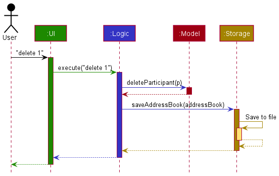

Each of the four main components (also shown in the diagram above),

* defines its *API* in an `interface` with the same name as the Component.
* implements its functionality using a concrete `{Component Name}Manager` class (which follows the corresponding API 
  `interface` mentioned in the previous point.

For example, the `Logic` component defines its API in the `Logic.java` interface and implements its functionality using 
the `LogicManager.java` class which follows the `Logic` interface. Other components interact with a given component 
through its interface rather than the concrete class (reason: to prevent outside component's being coupled to the 
implementation of a component), as illustrated in the (partial) class diagram below.

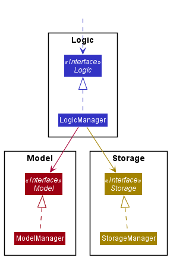

The sections below give more details of each component.

### UI component

The **API** of this component is specified in [`Ui.java`](https://github.com/se-edu/addressbook-level3/tree/master/src/main/java/seedu/address/ui/Ui.java)

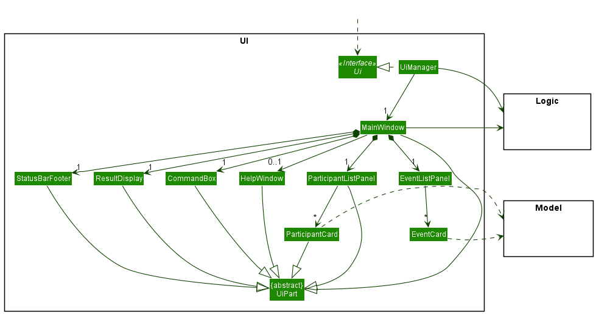

The UI consists of a `MainWindow` that is made up of parts e.g.`CommandBox`, `ResultDisplay`, `ParticipantListPanel`, 
`StatusBarFooter` etc. All these, including the `MainWindow`, inherit from the abstract `UiPart` class which captures 
the commonalities between classes that represent parts of the visible GUI.

The `UI` component uses the JavaFx UI framework. The layout of these UI parts are defined in matching `.fxml` files 
that are in the `src/main/resources/view` folder. For example, the layout of the 
[`MainWindow`](https://github.com/se-edu/addressbook-level3/tree/master/src/main/java/seedu/address/ui/MainWindow.java) 
is specified in 
[`MainWindow.fxml`](https://github.com/se-edu/addressbook-level3/tree/master/src/main/resources/view/MainWindow.fxml)

The `UI` component,

* executes user commands using the `Logic` component.
* listens for changes to `Model` data so that the UI can be updated with the modified data.
* keeps a reference to the `Logic` component, because the `UI` relies on the `Logic` to execute commands.
* depends on some classes in the `Model` component, as it displays `Participant` or `Event` objects residing in the 
  `Model`.

### Logic component

**API** : [`Logic.java`](https://github.com/se-edu/addressbook-level3/tree/master/src/main/java/seedu/address/logic/Logic.java)

Here's a (partial) class diagram of the `Logic` component:

How the `Logic` component works:
1. When `Logic` is called upon to execute a command, it uses the `AddressBookParser` class to parse the user command.
1. This results in a `Command` object (more precisely, an object of one of its subclasses e.g., `AddCommand`) which is 
   executed by the `LogicManager`.
1. The command can communicate with the `Model` when it is executed (e.g. to add a person).
1. The result of the command execution is encapsulated as a `CommandResult` object which is returned back from `Logic`.

The Sequence Diagram below illustrates the interactions within the `Logic` component for the `execute("delete 1")` 
API call.

:information_source: **Note:** The lifeline for `DeleteCommandParser` 
should end at the destroy marker (X) but due to a limitation of PlantUML, the lifeline reaches the end of diagram.

Here are the other classes in `Logic` (omitted from the class diagram above) that are used for parsing a user command:

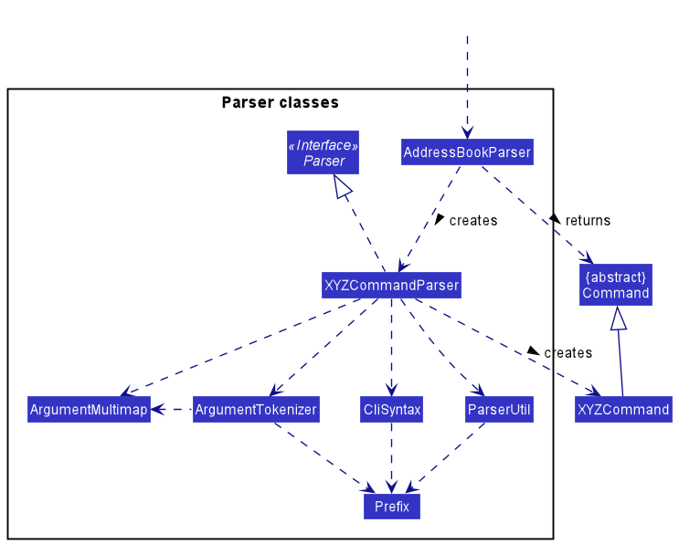

How the parsing works:
* When called upon to parse a user command, the `AddressBookParser` class creates an `XYZCommandParser` (`XYZ` is a 
  placeholder for the specific command name e.g., `AddCommandParser`) which uses the other classes shown above to 
  parse the user command and create a `XYZCommand` object (e.g., `AddCommand`) which the `AddressBookParser` returns 
  back as a `Command` object.
* All `XYZCommandParser` classes (e.g., `AddCommandParser`, `DeleteCommandParser`, ...) inherit from the `Parser` 
  interface so that they can be treated similarly where possible e.g, during testing.

### Model component
**API** : [`Model.java`](https://github.com/se-edu/addressbook-level3/tree/master/src/main/java/seedu/address/model/Model.java)

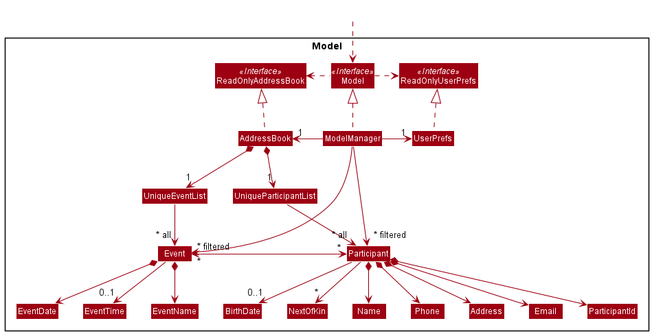

The `Model` component,

* stores Managera's data i.e., all `Participant` and `Event` objects (which are contained in `UniqueParticipantList` 
  and `UniqueEventList` objects respectively).
* stores the currently 'selected' `Participant` and `Event` objects (e.g., results of a search query) as 
  separate _filtered_ lists which is exposed to outsiders as unmodifiable `ObservableList<Participant>` and 
  `ObservableList<Event>` that can be 'observed' e.g. the UI can be bound to these lists so that the UI automatically 
  updates when the data in the lists change.
* stores a `UserPref` object that represents the user’s preferences. This is exposed to the outside as a 
  `ReadOnlyUserPref` objects.
* does not depend on any of the other three components (as the `Model` represents data entities of the domain, they 
  should make sense on their own without depending on other components)

### Storage component

**API** : [`Storage.java`](https://github.com/se-edu/addressbook-level3/tree/master/src/main/java/seedu/address/storage/Storage.java)

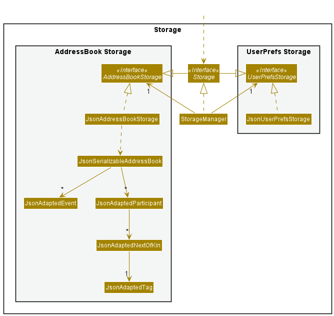

The `Storage` component,
* can save both Managera data and user preference data in json format, and read them back into corresponding objects.
* inherits from both `AddressBookStorage` and `UserPrefStorage`, which means it can be treated as either one (if only 
  the functionality of only one is needed).
* depends on some classes in the `Model` component (because the `Storage` component's job is to save/retrieve objects 
  that belong to the `Model`)

### Common classes

Classes used by multiple components are in the `seedu.addressbook.commons` package.

--------------------------------------------------------------------------------------------------------------------

## **Implementation**

This section describes some noteworthy details on how certain features are implemented. The features covered in this 
guide are:

* [Add event feature - addEvent](#add-event-feature---addevent)
* [Delete event feature - deleteEvent](#delete-event-feature---deleteevent)
* [Filter event feature - filterEvents](#filter-event-feature---filterevents)
* [View participant's details feature - view](#view-participants-details-feature---view)
* [Add/Remove participant to/from event feature - enroll/expel](#addremove-participant-tofrom-event-feature---enrollexpel)
* [View event's details feature - showDetails](#view-events-details-feature---showdetails)

The end of this section also includes suggestions on how newly proposed features can be implemented.

### Add event feature - addEvent

This feature allows Managera users to create an event at the specified date and time.

#### Implementation Details

Since the `AddressBookParser` is responsible for determining the type of `Command` to be created from user input,
we can simply add a new `commandType` case for `AddEventCommand` in `AddressBookParser`. 

The `AddEventCommandParser` reads the user's input and passes it to `ParserUtil` to ensure that the event's name, 
date and time are valid. Then, an `Event` is created with the returned `EventName`, `EventDate` and `EventTime` objects. 
This event will be supplied to the `AddEventCommand` to be executed.

Since Managera employs a UniqueEventList, it should not have more than one event with the same name and date. The 
`AddressBook` will check if the given event already exists. If not, it will be successfully added to the `AddressBook` 
through the model. Otherwise, an exception will be thrown, and an error message will be displayed to the user.

#### Implementation Rationale

As events may span a full day, we decided to implement time as an optional attribute of the event. If a time is not 
specified for an event, Managera will assume it as a full-day event. To accommodate the addition of events to Managera, 
new classes such as `EventName`, `EventDate` and `EventTime` were also implemented. These classes function as abstractions 
for the name, date and time of an `Event` respectively. These abstractions are helpful in ensuring reliability of 
the program by hiding the underlying details.

### Delete event feature - deleteEvent

This feature allows Managera users to delete an existing event at a particular index of the displayed event list.

#### Implementation Details

Since the `AddressBookParser` is responsible for determining the type of `Command` to be created from user input,
we can simply add a new `commandType` case for `DeleteEventCommand` in `AddressBookParser`.

The `DeleteEventCommandParser` reads the user's input and passes it to `ParserUtil` which returns an `Index`.
If the index given by the user is not a zero-based index, a `ParseException` will be thrown before
the parser creates the command to prevent any further error. If the index is valid, a `DeleteEventCommand` 
will be created by the parser with the created `Index`.

When the command is executed, there is a check to ensure the index is within the range of the displayed list. If the 
index is out of range, a `CommandException` is thrown, and an error message is displayed to the user. Otherwise, the 
execution will continue, and the respective event at the index is deleted.

#### Design Considerations:
##### Aspect: Specifying event to be deleted: 

* **Alternative 1 (Current Choice)**: Delete by index:
    * Pros:
        1. The index of the event in the currently displayed list can be directly used.
        2. Faster and more intuitive for users.
    * Cons:
        1. The index is independent of the event, which may lead to an inconsistent user experience.
         
* **Alternative 2**: Delete by event name:
    * Pros:
        1. User can be more sure of the event they are removing, since it is referencing the event name.
    * Cons:
        1. The user has to fully match the event name, which is much more cumbersome.

### Filter event feature - filterEvents

This feature allows Managera users to filter the event list by date and time. Only the events that fall on the 
specified date and time will be left in the filtered list.

#### Implementation Details

Since the `AddressBookParser` is responsible for determining the type of `Command` to be created from the user's input, 
we can simply add a new `commandType` case for `FilterEventCommand` in `AddressBookParser`. 

Since this feature requires Managera to take in user input and determine if the filter is by:

1. Date only, or
2. Date and Time,

a `FilterEventCommandParser` is made to be responsible for this purpose. The `FilterEventCommandParser` parses the 
user's input and creates the `EventDateTimePredicate` which the `FilterEventCommand` will use to execute the filtering.
`EventDateTimePredicate` implements `Predicate<Event>` which can be passed to a `FilteredList<Event>` to filter the 
event list. 

The `FilterEventCommand` created by `FilterEventCommandParser` will contain the `EventDateTimePredicate` to filter the 
event list. When the command is executed, the `model` will filter the `FilteredList<Event>` using the 
`EventDateTimePredicate` and display only events that fulfils the `EventDateTimePredicate` contained in 
`FilterEventCommand`.

#### Implementation Rationale

With considerations to how the `Event` class is implemented, some events do not have time associated with them.
We feel that since all `Event` objects have a date associated through the `EventDate` class, filtering should be done 
primarily through date i.e. `EventDate`. However, understanding that users might want to filter by time too, it is 
included as an 
optional criteria for filtering.

#### Design Considerations:
##### Aspect: Criteria to filter by:

* **Alternative 1 (Current Choice)**: By date and optionally time:
  * Pros: 
    1. Filtering by "date only" allows users to see both events with or without time on the specific date.
    2. Greater flexibility on how specific users want to filter the event list by.
  * Cons:
    1. Unable to filter for only events that do not have time associated.

* **Alternative 2**: By Date and Time: (both fields compulsory)
  * Pros:
    1. Able to filter for only events that do not have time on a specific date.
  * Cons:
    1. Unable to get a more general filter for events occurring on a specific date.
    2. Compulsory time field is too specific and the number of events displayed for a filter attempt might be too low. 

##### Aspect: With or without prefix:

* **Alternative 1 (Current Choice)**: With prefixes:
  * Pros:
    1. Sequence of parameters can be randomized, more flexible command syntax.
    2. Clear to user which field is being keyed in.
    3. Easy to implement with support of existing classes.
  * Cons:
    1. This increases the number of prefixes already present in Managera which may be hard for users to remember.

* **Alternative 2**: Without prefix:
  * Pros:
    1. Clean and slightly shorter command syntax.
    2. Less prefix to remember.
  * Cons:
    1. Rigid command syntax.
    2. Requires more comprehensive implementation to deal with user input (E.g. Date Only or Date and Time)

The following is the sequence diagram for how a `FilterEventCommand` works internally.

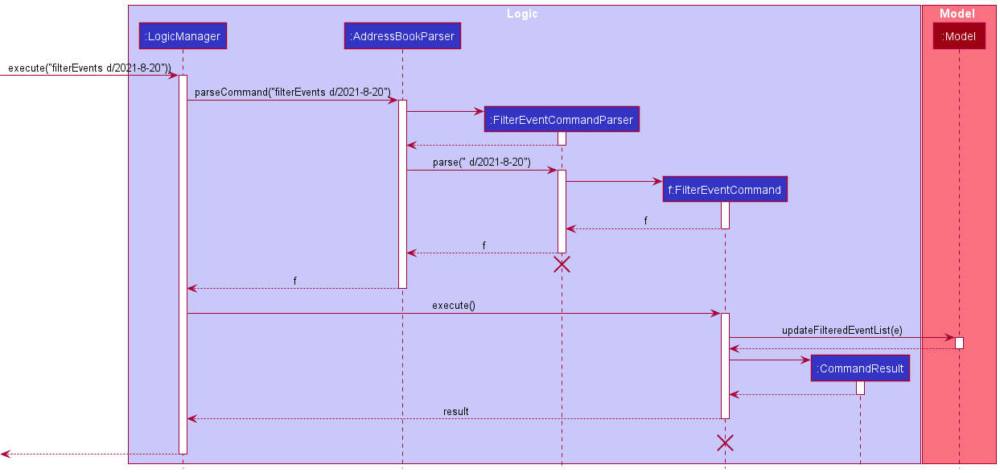

### View participant's details feature - view

This feature allows Managera users to look for a specific participant and view their details. The search is done using
the participant's index in the displayed participant list.

#### Implementation Details

Since the `AddressBookParser` is responsible for determining the type of `Command` to be created from user input,
we can simply add a new `commandType` case for `ViewCommand` in `AddressBookParser`.

The `ViewCommandParser` reads the user's input and passes it to `ParserUtil` which returns an `Index`. If the index 
given by the user is not a zero-based index, a `ParseException` will be thrown before the parser creates the command 
to prevent any further error. If the index is valid, a `ViewCommand` will be created by the parser with the 
created `Index`.

When the command is executed, there is a check to ensure the index is within the range of the displayed list. If the
index is out of range, a `CommandException` is thrown, and an error message is displayed to the user. Otherwise, the
execution will continue, and `model` will obtain the participant by getting the `Participant` with the given `Index` 
from the `FilteredList<Participant>` before displaying the participant's details to the user.

#### Implementation Rationale

Since each participant has a unique index in the displayed participant list, it provides a convenient way for the user 
to look for a specific participant if index is used as the criterion. The `find` command provides similar functionality,
but returns a list of participants instead because it uses names, which are more imprecise. Hence, a separate command 
was decidedly implemented to allow users the ability to sieve out a single participant for a more detailed view.

#### Design Considerations:
##### Aspect: Method of finding a participant:

* **Alternative 1 (Current Choice)**: Find by index:
    * Pros:
        1. The details of the specific participant are returned immediately, provided that the user's input is a valid 
           index in the displayed participant list.
        2. Simple implementation.
    * Cons:
        1. The user has to know the index of the participant, which can be troublesome with a long list of participants.
           However, the user can use the `find` function to filter their search, making this process slightly easier.

* **Alternative 2**: Find by participant's ID:
    * Pros:
        1. The details of the specific participant are returned immediately, provided that the user's input is an exact
           match of the participant's ID.
    * Cons:
        1. The current implementation does not provide the `ParticipantId` to the user, and providing more details in 
           the UI might make it too cluttered.
        2. The user needs to know the exact `ParticipantId` of the participant they want to view, which is not a 
           trivial task.

The following is the sequence diagram for how a `ViewCommand` works internally.

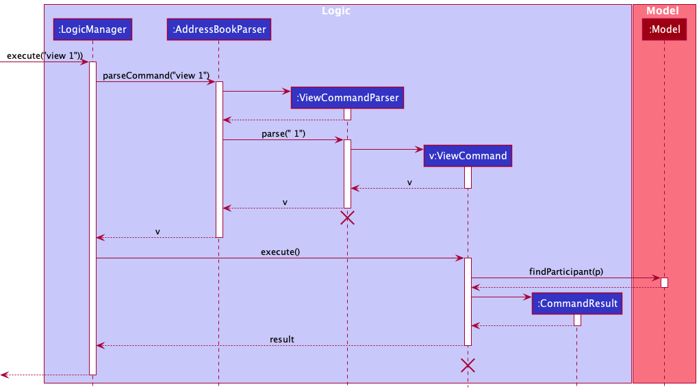

The following activity diagram summarizes what happens when a user executes a new command:

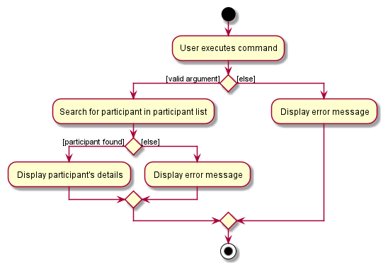

### Add/Remove participant to/from event feature - enroll/expel

This feature allows Managera users to quickly add/remove a participant to/from an event according to the current 
filtered list of events and participants visible to the user.

#### Implementation Details

Since the `AddressBookParser` is responsible for determining the type of `Command` to be created from user input, 
we can simply add new `commandType` cases for `AddParticipantToEventCommand` and `RemoveParticipantFromEventCommand` 
in `AddressBookParser`

A `AddParticipantToEventParser` parses the user's input and obtain indexes for the participant and event respectively. 
If the indexes given by the user are not zero-based indexes, a `ParseException` will be thrown before the parser 
creates the command itself to prevent any further error. If all indexes are valid, an `AddParticipantToEventCommand` 
will be created by the parser.

The `AddParticipantToEventCommand` created by `AddParticipantToEventParser` contains 2 zero-based indexes. 
The first one is used to identify the `Participant` while the second is used to identify the `Event`. 
When the command is executed, the `model` first tries to obtain the `Participant` at specified index (if unsuccessful, 
a `CommandException` will be thrown accordingly) and then the `Event` will be retrieved in the same manner 
(if unsuccessful, a `CommmandException` will be thrown accordingly). If the `Event` does not already contain the 
`Participant`, the `Participant` will be added to the `Event` accordingly. Otherwise, a `CommandException` will 
be thrown.

A `RemoveParticipantFromEventParser` parses the user's input and obtain indexes for the participant and event 
respectively. The workflow is nearly identical to `AddParticipantToEvent` with one difference: instead of throwing 
`CommandException` if `Participant` already exists in the event, the `CommandException` will be thrown when 
`Participant` *does not* exist in the event. Otherwise, the participant will be removed from the event. 

#### Implementation Rationale

Since the command implies that the index of the participant should come before the index of the event, there is no 
need for prefixes to be used as that would incur extra typing for the user and slow down the process of adding/removing
participants to/from events.

The following activity diagrams summarise what happens when a user executes a new command in each case:

`AddParticipantToEvent` command:

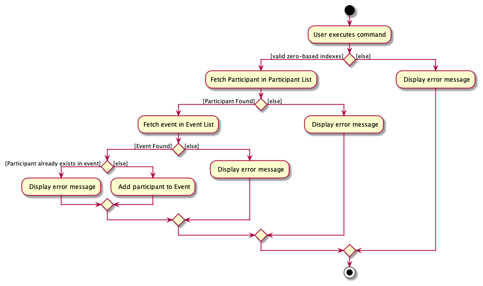

`RemoveParticipantFromEvent` command:

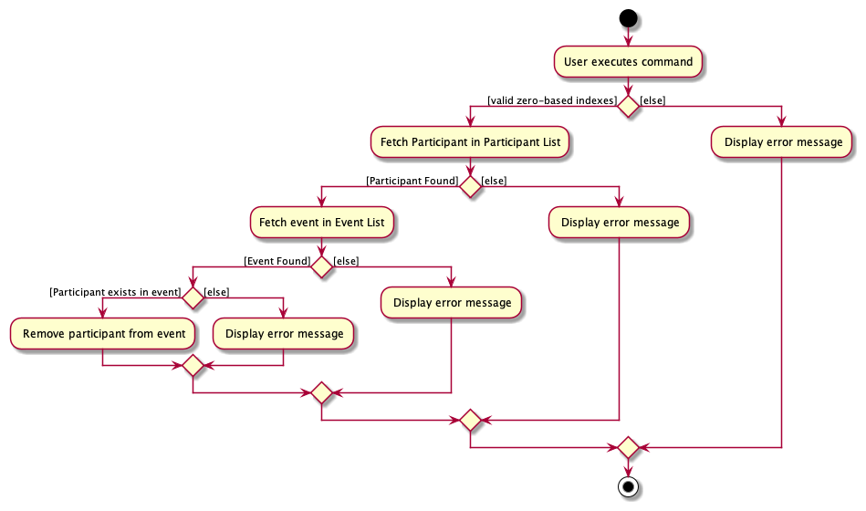

The command keywords to add/remove participant to/from events are `enroll` and `expel` respectively as many users 
found `addParticipant` and `removeParticipant` to be too long. This problem becomes apparent since these commands are 
used regularly and are core features of Managera.

### View event's details feature - showDetails

This feature allows Managera users to find an event by name and view its details. The search is done using the event's 
index in the displayed event list.

#### Implementation Details

Since the `AddressBookParser` is responsible for determining the type of `Command` to be created from user input, we 
can simply add a new `commandType` case for `ShowEventDetailsCommand` in `AddressBookParser`.

The `ShowEventDetailsCommandParser` reads the user's input and passes it to `ParserUtil` which returns an `Index`. 
If the index given by the user is not a zero-based index, a `ParseException` will be thrown before the parser 
creates the command to prevent any further error. If the index is valid, a `ShowEventDetailsCommand` will be created 
by the parser with the created `Index`.

When the command is executed, there is a check to ensure the index is within the range of the displayed list. If the
index is out of range, a `CommandException` is thrown, and an error message is displayed to the user. Otherwise, the
execution will continue, and `model` will obtain the event by getting the `Event` with the given `Index`
from the `FilteredList<Event>` before displaying the event's details to the user.

#### Implementation Rationale

Since each event has a unique index in the displayed event list, it provides a convenient way for the user to look for a
specific event if index is used as the criterion. 

Another command similar in function is `findEvent`, where the model will filter the existing event list and display the 
events with names that contain a given keyword. However, this implementation is meant for returning a list of possibly 
multiple events. Since we are only looking for one particular event, we decided that instead of filtering the event 
list to display just the one event, we leave the event list untouched and simply return the event details to the 
results display.

#### Design Considerations:
##### Aspect: Similar event names:

* **Alternative 1 (Current Choice)**: Find by index:
    * Pros:
        1. The details of the specific event are returned immediately, provided that the user's input is a valid index 
           in the displayed event list.
        2. Simple implementation.
    * Cons:
        1. The user has to know the index of the event, which can be troublesome with a long list of events. However,
           the user can use the `findEvent` function to filter their search, making this process slightly easier.

* **Alternative 2**: Find by exact name:
    * Pros:
        1. The details of the specific event are returned immediately, provided that the user's input is an exact
           match of the event's name.
        2. Relatively simple implementation.
    * Cons:
        1. The user has to know the exact name of the event, otherwise no events, or the wrong event, may be found.
        2. If the event name is long, typographical errors are likely, resulting in the desired event not being found.

* **Alternative 3**: Find by similar names or a given keyword:
    * Pros:
        1. A list of events with names that contain the user's input are returned, offering greater flexibility
           if the user does not fully recall the entire name of the event they are looking for. The search can be
           further refined by subsequent user input to narrow it down to the specific event.
    * Cons:
        1. Relatively harder implementation.
        2. Might be more troublesome and time-consuming to have to refine the search multiple times.

The following is the sequence diagram for how a `ShowEventDetailsCommand` works internally.

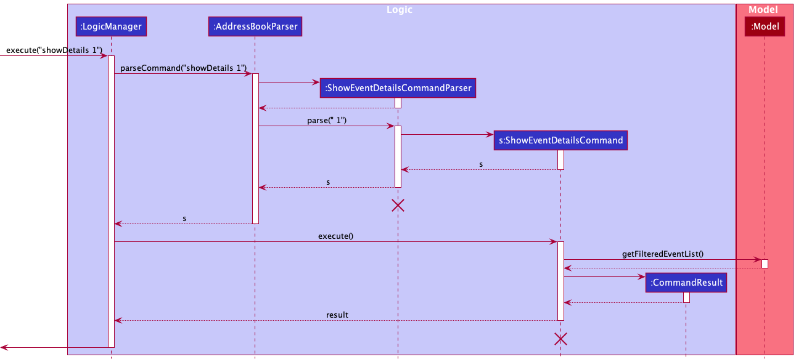

The following activity diagram summarises what happens when a user executes a new command:

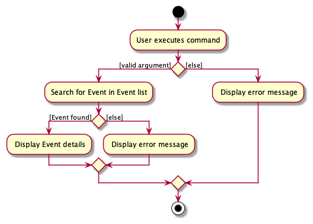

### \[Proposed\] Undone event feature

#### Proposed Implementation

The proposed undone event feature is an add-on command to the current implementation of Managera. Since
the `AddressBookParser` is responsible for determining the type of `Command` to be created from user input,
a new `commandType` for `UndoneEventCommand` needs to be added to `AddressBookParser`.

An `UndoneEventCommandParser` is needed to parse the user's input and creates an `Index` representing the position of
the event in the event list. The `UndoneEventCommand` created by `UndoneEventCommandParser` will contain the `Index`
of the event in the displayed event list to be undone. When the command is executed, the `model` will retrieve the 
`Event` at the specified `Index` and change the completion status of the `Event`.

### \[Proposed\] Enroll and expel multiple participants from multiple events feature

#### Proposed Implementation

The current implementation of `AddParticipantToEventCommand`(enroll) and `RemoveParticipantFromEventCommand`(expel)
only allows the enrolling/expelling of a single participant to/from a single event. To extend this feature to:

1. Enroll/Expel a participant to/from multiple events.
2. Enroll/Expel multiple participants to/from an event.
3. Enroll/Expel multiple participants to/from multiple events.

It is recommended to incorporate the use of the `Prefix` class in these commands. Instead of the current syntax of
`enroll PARTICIPANT_INDEX EVENT_INDEX` and `expel PARTICPANT_INDEX EVENT_INDEX`. A change to 
`enroll pid/PARTICIPANT_INDEXES... eid/EVENT_INDEXES...` and `expel pid/PARTICIPANT_INDEXES... eid/EVENT_INDEXES...`
allows these cases to be possible. The `model` will then add/remove each of the specified participants to/from each 
of the specified events.

--------------------------------------------------------------------------------------------------------------------

## **Documentation, logging, testing, configuration, dev-ops**

* [Documentation guide](Documentation.md)
* [Testing guide](Testing.md)
* [Logging guide](Logging.md)
* [Configuration guide](Configuration.md)
* [DevOps guide](DevOps.md)

--------------------------------------------------------------------------------------------------------------------

## **Appendix: Requirements**

### Product scope

**Target user profile**:

* has a need to manage a significant number of events and contacts
* prefer desktop apps over other types
* can type fast
* prefers typing to mouse interactions
* is reasonably comfortable using CLI apps

**Value proposition**: manage events and event participants faster than a typical mouse/GUI driven app

### User stories

Priorities: High (must have) - `* * *`, Medium (nice to have) - `* *`, Low (unlikely to have) - `*`

| Priority | As an …​                                    | I want to …​                     | So that I can…​                                                          |
| -------- | ------------------------------------------- | ---------------------------------- | ------------------------------------------------------------------------------ |
| `* * *`  | Event organiser                             | add an upcoming event to my list   | keep track of the details of all events I will be organising                   |
| `* * *`  | Event organiser                             | add a participant to an event      | keep track of the participants for an event                                    |
| `* * *`  | Event organiser with many concluded events  | delete events from my list         | keep my list of events tidy                                                    |
| `* * *`  | Event organiser                             | remove a participant from an event | maintain an accurate list of participants attending the event                  |
| `* * *`  | Event organiser that has concluded an event | mark the event as done             | safely ignore events in my list that have already passed                       |
| `* *`    | Event organiser with many events            | sort events by date and time       | keep track of which events occur when and prepare accordingly                  |
| `*`      | Event organiser with many participants      | find a participant by name         | I can contact the participant to inform him of updates or changes to the event |

### Use cases

(For all use cases below, the **System** is `Managera` and the **Actor** is an `Event Organiser`, unless specified otherwise)

**Use case: UC01 - Add an event**

**MSS**

1.  Event Organiser requests to add an event.
2.  Managera adds the new event with the given name and date to its event list.

    Use case ends.

**Extensions**

* 1a. Managera detects missing details required for adding an event.

    * 1a1. Managera shows an error message citing missing parameters.

      Use case resumes at step 1.

**Use case: UC02 - Add a participant to an event**

Preconditions: At least one event and one participant have been added to Managera.

**MSS**

1.  Event Organiser requests to add a participant to an event.
2.  Managera adds the participant to the specified event.

    Use case ends.

**Extensions**

* 1a. Managera detects missing details required for adding a participant to an event.

    * 1a1. Managera shows an error message citing missing parameters.

      Use case resumes at step 1.

* 1b. Managera cannot find the participant.

    * 1b1. Managera shows an error message stating that the participant was not found.

      Use case resumes at step 1.

* 1c. Managera could not find the event.

    * 1c1. Managera shows an error message stating that the event was not found.

      Use case resumes at step 1.

**Use case: UC03 - Delete an event**

Preconditions: At least one event has been added to Managera.

**MSS**

1.  Event Organiser requests to delete an event.
2.  Managera deletes the event from its event list.

    Use case ends.

**Extensions**

* 1a. Managera could not find the specified event.

    * 1a1. Managera shows an error message stating that the event was not found.

      Use case resumes at step 1.

**Use case: UC04 - Remove a participant from an event**

Preconditions: At least one event and one participant have been added to Managera. 

**MSS**

1.  Event Organiser requests to remove a participant from an event.
2.  Managera removes the participant from the specified event.

    Use case ends.

**Extensions**

* 1a. Managera could not find the participant.

    * 1a1. Managera shows an error message stating that the participant was not found.

      Use case resumes at step 1.

* 1b. Managera could not find the event.

    * 1b1. Managera shows an error message stating that the event was not found.

      Use case resumes at step 1.

* 1c. Managera could not find the participant in the specified event.

    * 1c1. Managera shows an error message stating that the participant is not taking part in the given event.

      Use case resumes at step 1.

**Use case: UC05 - Mark an event as done**

Preconditions: At least one event has been added to Managera.

**MSS**

1.  Event Organiser requests to mark an event as done.
2.  Managera marks the event in its event list as done.

    Use case ends.

**Extensions**

* 1a. Managera detects missing details required to mark event as done.

    * 1a1. Managera shows an error message citing missing parameter.

      Use case resumes at step 1.

* 1b. Managera could not find the event.

    * 1b1. Managera shows an error message stating that the event was not found.

      Use case resumes at step 1.

**Use case: UC06 - Sort events by time**

Preconditions: At least one event has been added to Managera.

**MSS**

1.  Event Organiser requests to sort the current list of events by time.
2.  Managera sorts the list of events in chronological order and displays the list.

    Use case ends.

**Use case: UC07 - Find a participant and access their details**

**Preconditions: At least one participant has been added to Managera.**

**MSS**

1. Event Organiser requests for the participant's details.
2. Managera displays the details of the specified participant.

    Use case ends.

**Extensions**

* 1a. Managera detects missing details for access to the participant's details.

    * 1a1. Managera shows an error message citing missing parameters.

      Use case resumes at step 1.

* 1b. Managera could not find the participant.

    * 1b1. Managera shows an error message stating that the participant was not found.

      Use case resumes at step 1.

**Use case: UC08 - Filter events by date**

Preconditions: At least one event has been added to Managera.

**MSS**

1.  Event Organiser requests to filter out the events that take place on a specified date.
2.  Managera finds the events that take place on the given date and displays them in a list.

    Use case ends.

**Extensions**

* 1a. Event Organiser does not give a valid date for the filtering.

    * 1a1. Managera shows an error message citing missing parameter.

      Use case resumes at step 1.

**Use case: UC09 - Show an event's details**

Preconditions: At least one event has been added to Managera.

**MSS**

1.  Event Organiser requests for an event's details.
2.  Managera displays the details of the specified event.

    Use case ends.

**Extensions**

* 1a. Managera detects missing details for showing event details.

    * 1a1. Managera shows an error message citing missing parameter.

      Use case resumes at step 1.

* 1b. Managera could not find the event.

    * 1b1. Managera shows an error message stating that the event was not found.

      Use case resumes at step 1.

**Use case: UC10 - Show an event's participants**

Preconditions: At least one event has been added to Managera.

**MSS**

1.  Event Organiser requests a list of event participants of a specific event.
2.  Managera displays the list of participants of the event.

    Use case ends.

**Extensions**

* 1a. Managera detects missing details to show event participants.

    * 1a1. Managera shows an error message citing missing parameter.

      Use case resumes at step 1.

* 1b. Managera could not find the event.

    * 1b1. Managera shows an error message stating that the event was not found.

      Use case resumes at step 1.

### Non-Functional Requirements

1.  Should work on any _mainstream OS_ as long as it has Java `11` or above installed.
2.  Should be able to hold up to 1000 participants without a noticeable sluggishness in performance for typical usage. 
3.  Should be able to hold up to 100 events without a noticeable sluggishness in performance for typical usage.
4.  A user with above average typing speed for regular English text (i.e. not code, not system admin commands) should 
    be able to accomplish most of the tasks faster using commands than using the mouse.
5.  Should work without having to use an installer or compiler.
6.  Should work without requiring an internet connection.
7.  Saved data should be kept in a single file to allow for easy transfer to a different device.
8.  The system should respond within two seconds.

### Glossary

* **Mainstream OS**: Windows, Linux, Unix, OS-X.  
* **Command Line Interface (CLI)**: A CLI is a text-based interface that processes commands to a computer program in 
  the form of lines of text. 
* **Graphical User Interface (GUI)**: A GUI is a form of user interface through which users interact with electronic 
  devices via visual indicator representations. 
* **API**: The Application Programming Interface specifies the interface through which software and other programs 
  interact. 
* **Main Success Scenario (MSS)**: The most straightforward interaction for a given use case, which assumes that 
  nothing goes wrong. 
* **JSON**: JavaScript Object Notation, is a common file format which stores data in key-value pairs and arrays. 
* **Participant**: A person that is participating in or attending some given event. 
* **Event**: An event that will be conducted in real life e.g., a competition, meeting, social activity etc. 
* **Command**: A command is a specific instruction that you give to Managera to perform a certain action, like adding a 
  new participant to the list. Commands will be the primary way that you will interact with Managera. 
* **Parameter**: Parameters are pieces of data that must be passed to certain commands to tell Managera which actions to
  perform. For example, the `done` command requires a single integer as a parameter so that it knows which event to mark
  as done. 
* **Prefix**: Prefixes are unique identifiers in front of parameters so that Managera understands what kind of values
  they are. For example, the prefix "n/" lets Managera know that a name is expected to follow behind it, while the
  prefix "d/" lets Managera know that a date is expected. 

--------------------------------------------------------------------------------------------------------------------

## **Appendix: Instructions for manual testing**

Given below are instructions to test the app manually.

:information_source: **Note:** These instructions only provide a 
starting point for testers to work on;
testers are expected to do more *exploratory* testing.

### Launch and shutdown

1. Initial launch

   1. Download the jar file and copy into an empty folder

   1. Double-click the jar file Expected: Shows the GUI with a set of sample contacts. The window size may not be 
      optimum.

1. Saving window preferences

   1. Resize the window to an optimum size. Move the window to a different location. Close the window.

   2. Re-launch the app by double-clicking the jar file. 
       Expected: The most recent window size and location is retained.

### Deleting a participant

1. Deleting a participant while all participants are being shown

   1. Prerequisites: List all participants using the `list` command. Multiple participants in the list.

   1. Test case: `delete 1` 
      Expected: First participant is deleted from the list. Details of the deleted participant shown in the status 
      message.

   1. Test case: `delete 0` 
      Expected: No participant is deleted. Error details shown in the status message.

   1. Other incorrect delete commands to try: `delete`, `delete x`, `...` (where x is larger than the list size) 
      Expected: Similar to previous.

###  Deleting an event

1. Deleting an event while all events are being shown

   1. Prerequisites: List all events using the `listEvents` command. Multiple events in the list.

   2. Test case: `deleteEvent 1` 
      Expected: First event is deleted from the list. Details of the deleted event shown in the status message.

   3. Test case: `deleteEvent 0` 
      Expected: No event is deleted. Error details shown in the status message.

   4. Other incorrect deleteEvent commands to try: `deleteEvent`, `deleteEvent x`, `...` (where x is larger than the 
      list size) 
      Expected: Similar to previous.

### Saving data

1. Dealing with missing/corrupted data files

   1. Navigate to and open `[JAR file location]/data/managera.json` in a text editor.

   2. Delete one line of code at the beginning `"participants" : [ {`.
   
   3. Restart Managera.

   4. Managera will start with no events and participants.
