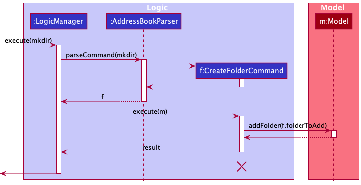
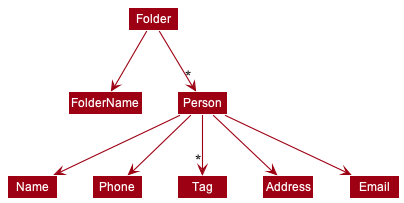
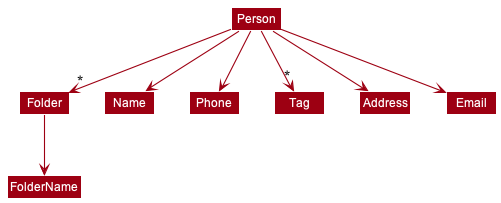
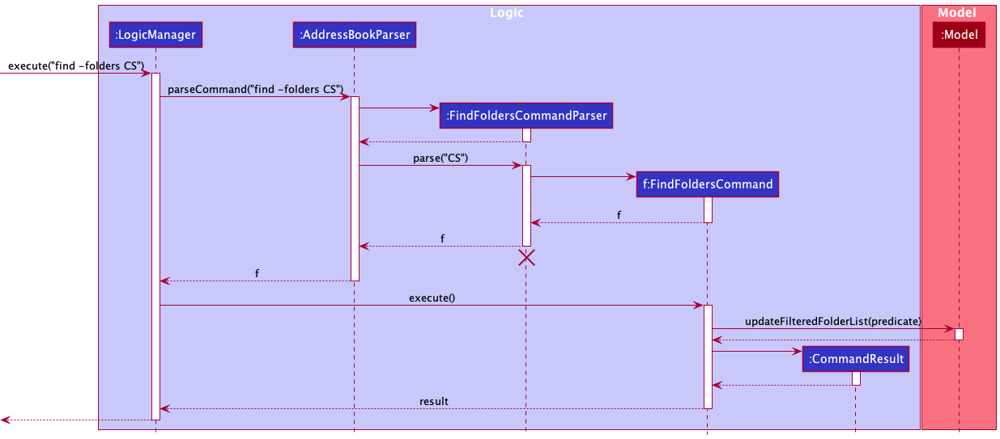
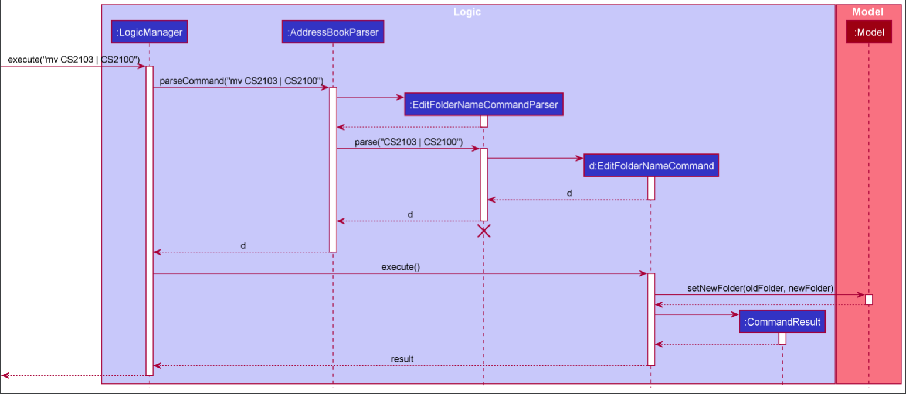

* Table of Contents
{:toc}

--------------------------------------------------------------------------------------------------------------------

## **Acknowledgements**

* Apart from AB3, we did not reference any other sources

--------------------------------------------------------------------------------------------------------------------

## **Setting up, getting started**

Refer to the guide [_Setting up and getting started_](SettingUp.md).

--------------------------------------------------------------------------------------------------------------------

## **Design**

:bulb: **Tip:** The `.puml` files used to create diagrams in this document can be found in the [diagrams](https://github.com/se-edu/addressbook-level3/tree/master/docs/diagrams/) folder. Refer to the [_PlantUML Tutorial_ at se-edu/guides](https://se-education.org/guides/tutorials/plantUml.html) to learn how to create and edit diagrams.

### Architecture

The ***Architecture Diagram*** given above explains the high-level design of the App.

Given below is a quick overview of main components and how they interact with each other.

**Main components of the architecture**

**`Main`** has two classes called [`Main`](https://github.com/se-edu/addressbook-level3/tree/master/src/main/java/seedu/address/Main.java) and [`MainApp`](https://github.com/se-edu/addressbook-level3/tree/master/src/main/java/seedu/address/MainApp.java). It is responsible for,
* At app launch: Initializes the components in the correct sequence, and connects them up with each other.
* At shut down: Shuts down the components and invokes cleanup methods where necessary.

[**`Commons`**](#common-classes) represents a collection of classes used by multiple other components.

The rest of the App consists of four components.

* [**`UI`**](#ui-component): The UI of the App.
* [**`Logic`**](#logic-component): The command executor.
* [**`Model`**](#model-component): Holds the data of the App in memory.
* [**`Storage`**](#storage-component): Reads data from, and writes data to, the hard disk.

**How the architecture components interact with each other**

The *Sequence Diagram* below shows how the components interact with each other for the scenario where the user issues the command `delete 1`.

Each of the four main components (also shown in the diagram above),

* defines its *API* in an `interface` with the same name as the Component.
* implements its functionality using a concrete `{Component Name}Manager` class (which follows the corresponding API `interface` mentioned in the previous point.

For example, the `Logic` component defines its API in the `Logic.java` interface and implements its functionality using the `LogicManager.java` class which follows the `Logic` interface. Other components interact with a given component through its interface rather than the concrete class (reason: to prevent outside component's being coupled to the implementation of a component), as illustrated in the (partial) class diagram below.

The sections below give more details of each component.

### UI component

The **API** of this component is specified in [`Ui.java`](https://github.com/se-edu/addressbook-level3/tree/master/src/main/java/seedu/address/ui/Ui.java)

The UI consists of a `MainWindow` that is made up of parts e.g.`CommandBox`, `ResultDisplay`, `PersonListPanel`, `StatusBarFooter` etc. All these, including the `MainWindow`, inherit from the abstract `UiPart` class which captures the commonalities between classes that represent parts of the visible GUI.

The `UI` component uses the JavaFx UI framework. The layout of these UI parts are defined in matching `.fxml` files that are in the `src/main/resources/view` folder. For example, the layout of the [`MainWindow`](https://github.com/se-edu/addressbook-level3/tree/master/src/main/java/seedu/address/ui/MainWindow.java) is specified in [`MainWindow.fxml`](https://github.com/se-edu/addressbook-level3/tree/master/src/main/resources/view/MainWindow.fxml)

The `UI` component,

* executes user commands using the `Logic` component.
* listens for changes to `Model` data so that the UI can be updated with the modified data.
* keeps a reference to the `Logic` component, because the `UI` relies on the `Logic` to execute commands.
* depends on some classes in the `Model` component, as it displays `Person` object residing in the `Model`.

### Logic component

**API** : [`Logic.java`](https://github.com/se-edu/addressbook-level3/tree/master/src/main/java/seedu/address/logic/Logic.java)

Here's a (partial) class diagram of the `Logic` component:

How the `Logic` component works:
1. When `Logic` is called upon to execute a command, it uses the `AddressBookParser` class to parse the user command.
1. This results in a `Command` object (more precisely, an object of one of its subclasses e.g., `AddCommand`) which is executed by the `LogicManager`.
1. The command can communicate with the `Model` when it is executed (e.g. to add a person).
1. The result of the command execution is encapsulated as a `CommandResult` object which is returned back from `Logic`.

The Sequence Diagram below illustrates the interactions within the `Logic` component for the `execute("delete 1")` API call.

:information_source: **Note:** The lifeline for `DeleteCommandParser` should end at the destroy marker (X) but due to a limitation of PlantUML, the lifeline reaches the end of diagram.

Here are the other classes in `Logic` (omitted from the class diagram above) that are used for parsing a user command:

How the parsing works:
* When called upon to parse a user command, the `AddressBookParser` class creates an `XYZCommandParser` (`XYZ` is a placeholder for the specific command name e.g., `AddCommandParser`) which uses the other classes shown above to parse the user command and create a `XYZCommand` object (e.g., `AddCommand`) which the `AddressBookParser` returns back as a `Command` object.
* All `XYZCommandParser` classes (e.g., `AddCommandParser`, `DeleteCommandParser`, ...) inherit from the `Parser` interface so that they can be treated similarly where possible e.g, during testing.

### Model component
**API** : [`Model.java`](https://github.com/se-edu/addressbook-level3/tree/master/src/main/java/seedu/address/model/Model.java)

The `Model` component,

* stores the address book data i.e., all `Person` objects (which are contained in a `UniquePersonList` object) and `Folder` objects (which are contained in a `UniqueFolderList` object).
* stores the currently 'selected' `Person` objects (e.g., results of a search query) as a separate _filtered_ list which is exposed to outsiders as an unmodifiable `ObservableList<Person>` that can be 'observed' e.g. the UI can be bound to this list so that the UI automatically updates when the data in the list change.
* stores the currently 'selected' `Folder` objects (e.g., results of a search query)) as a separate _filtered_ list which is exposed to outsiders as an unmodifiable `ObservableList<Folder>` that can be 'observed' e.g. the UI can be bound to this list so that the UI automatically updates when the data in the list change.
* stores a `UserPref` object that represents the user’s preferences. This is exposed to the outside as a `ReadOnlyUserPref` objects.
* does not depend on any of the other three components (as the `Model` represents data entities of the domain, they should make sense on their own without depending on other components)

:information_source: **Note:** An alternative (arguably, a more OOP) model is given below. It has a `Tag` list in the `AddressBook`, which `Person` references. This allows `AddressBook` to only require one `Tag` object per unique tag, instead of each `Person` needing their own `Tag` objects. 

### Storage component

**API** : [`Storage.java`](https://github.com/se-edu/addressbook-level3/tree/master/src/main/java/seedu/address/storage/Storage.java)

The `Storage` component,
* can save both address book data and user preference data in json format, and read them back into corresponding objects.
* inherits from both `AddressBookStorage` and `UserPrefStorage`, which means it can be treated as either one (if only the functionality of only one is needed).
* depends on some classes in the `Model` component (because the `Storage` component's job is to save/retrieve objects that belong to the `Model`)

### Common classes

Classes used by multiple components are in the `seedu.addressbook.commons` package.

--------------------------------------------------------------------------------------------------------------------

## **Implementation**

This section describes some noteworthy details on how certain features are implemented.

### Create a folder: `mkdir`

#### Implementation

Folders are saved in a `UniqueFolderList` in `AddressBook`.

The following diagram shows how `mkdir` works:

#### Design considerations

* **Alternative 1 (current choice)**: Folders hold references to contacts
  * Pros: Easier management of folders
  * Cons: More difficult to implement

Diagram:

* **Alternative 2**: Contacts hold references to folders
    * Pros: Easy to implement
    * Cons: More complex management of folders, Similar to tags which is already implemented

Diagram:

### View list of folders: `ls -folders`

#### Implementation

In our GUI, we would like to display the list of folders that users can create to organize
their contacts into different classes. The implementation is very similar to `PersonListCard` and
`PersonListPanel` for viewing list of contacts.

#### Design considerations

* Alternative 1: 2-row layout
    * Pros: Ability to see additional details of folders and contacts with a small-sized GUI.
    * Cons: Extra effort to scroll down the GUI to look into the details of contacts.
* Alternative 2: 2-column layout
    * Pros: Ability to see both folders and contacts data at a glance without initial scrolling needed
    * Cons: Truncated details of folders and contacts will be displayed due to the small-sized GUI.

Alternative 1 is selected, implemented using additional`StackPane` on top of the existing `StackPane`
for the list of contacts placed vertically. This additional `StackPane` is placed under a `VBox`
component in `MainWindow`.

### Add contacts to folder: `echo index1 ... indexN >> Folder`

#### Implementation
Contacts are added by updating the `ObservableList` in `UniqueFolderList`.
A new `Folder` object is created containing the new `Person` and replaces the old folder in the `UniqueFolderList`.

#### Design considerations

* Alternative 1: If there is an invalid index, allow adding of contact for the remaining valid index
    * Pros: Easier to implement.
    * Cons: Difficult for user to know which contacts have been added into the folder
* Alternative 2: Only allow adding of contacts when all indexes are valid
    * Pros: Easier for user to know which contacts have been added into the folder
    * Cons: Requires more code and effort to ensure all indexes are valid before adding them to folder

Alternative 2 is selected, as it is more user-friendly and intuitive.

--------------------------------------------------------------------------------------------------------------------

### Locate folders by name: `find -folders`

#### Implementation

The Sequence Diagram below illustrates the interactions within the Logic component for the `execute("find -folders CS")` API call.

#### Design considerations

When deciding on the design for `find -folders`, we considered the existing `find` command to search for persons by name. This `find` command uses `StringUtil.containsWordIgnoreCase` which only matches full words.

However, one use case we wanted to cater to was students who group their contacts by shared modules. For example, students take CS2103T and CS2101 concurrently, and may wish to search for these two folders (and other CS modules) by using the keyword `CS`. If we only matched full words, `find -folders CS` would not contain *either* of the modules `CS2103T` or `CS2101`, which is undesirable.

* **Alternative 1 (current choice)**: Match partial words
    * Pros: More intuitive behaviour for the above use case
    * Cons: Requires a new method to be implemented
* **Alternative 2**: Match full words only
    * Pros: Easy to implement as this uses the same logic as finding persons by name
    * Cons: May lead to unexpected behaviour for the above use case

Alternative 1 was chosen, and the new method is under `StringUtil.containsTextIgnoreCase`.

### Edit folder name: `mv OLD_FOLDER_NAME | NEW_FOLDER_NAME`

#### Implementation

Folders are removed by first specifying the old folder's name and followed
by the new folder's name.

The underlying implementation essentially creates a new folder with the
newly specified name and copies all the contacts from the old to the new
folder. The new folder is saved in the `UniqueFolderList` in `AddressBook`
just like the old folder.

The following diagram shows how `mv` works:

#### Design considerations:

* **Alternative 1 (current choice)**: Old folder and new folder name are separated by the pipe operator `|`.
    * Pros: Easy to distinguish between the folder to be replaced and the new incoming folder name considering how folder name can have blank spaces in between
    * Cons: More difficult to implement

## **Documentation, logging, testing, configuration, dev-ops**

* [Documentation guide](Documentation.md)
* [Testing guide](Testing.md)
* [Logging guide](Logging.md)
* [Configuration guide](Configuration.md)
* [DevOps guide](DevOps.md)

--------------------------------------------------------------------------------------------------------------------

## **Appendix: Requirements**

### Product scope

**Target user profile**:

* has a need to manage a significant number of contacts
* prefer desktop apps over other types
* can type fast
* prefers typing to mouse interactions
* is reasonably comfortable using CLI apps
* computing student with prior experience in using Unix-commands

### Value Proposition

- manage contacts faster and more conveniently than a typical mouse/GUI driven app
- use a set of Unix-like commands that CS students are already familiar with so that they don't have to re-learn, thus helping ease of adoption
- skills learned while using this app are transferable to other tools

### User stories

Priorities: High (must have) - `* * *`, Medium (nice to have) - `* *`, Low (unlikely to have) - `*`

| Priority | As a …​                                 | I want to …​                                       | So that I can…​                                         |
| -------- | ------------------------------------------ | ----------------------------------------------------- | ---------------------------------------------------------- |
| `* * *`  | user                                       | create a folder                                       | folder related contacts together                           |
| `* * *`  | user                                       | view all the folders that I created                   |                                                            |
| `* * *`  | user                                       | delete a folder                                       | remove folders when they become irrelevant                 |
| `* * *`  | user                                       | add a user to a folder                                | folder related contacts together and find them efficiently |
| `* * *`  | experienced computing student              | use my knowledge of Unix commands to navigate the app | use the app without learning a new set of commands         |
| `* * *`  | student                                    | write to a JSON file                                  | achieve data persistence between the application and local storage |
| `* *`    | user                                       | remove a contact from a folder                        | update contacts in folders easily                          |
| `* *`    | user                                       | clear all folders                                     | reset my folders easily                                    |
| `* *`    | student                                    | add several contacts into a folder at one go          | reduce time wastage adding them 1 by 1                     |
| `* *`    | user                                       | update my folder name                                 | efficiently manage outdated groups                         |
| `* *`    | user                                       | find a specific folder                                | minimize time spent on looking for my folder               |

### Use cases

(For all use cases below, the **System** is the `UNIon` and the **Actor** is the `user`, unless specified otherwise)

**Use case: UC01 - Add a new folder**

**Guarantees:**
   * A new folder with the specified name is created only if the input format is valid.
   * The newly-created folder is empty.

**MSS:**
   1. User requests to add a new folder.
   2. UNIon accepts input, and a new folder is created.

   Use case ends.

**Extensions:**
* 1a. The folder name specified contains non-alphanumeric characters or wrong command format is used. 
  * 1a1. No new folder is created.
  * 1a2. User requests to add a new folder.
  * Steps 1a1-1a2 are repeated until the data entered are correct.
    
**Use case: UC02 - Add a new contact to UNIon**

**Guarantees:**
   * A new contact with the specified details is added to the contact list only if the input format is valid.

**MSS:**
   1. User requests to add new contact.
   2. UNIon accepts input and adds contact to the pool of contacts.
      
   Use case ends.

**Extensions:**
* 1a. The given input has missing fields.
  * 1a1. No new contact is created by UNIon.
  * 1a2. User requests to add new contact.
  * Steps 1a1-1a2 are repeated until the data format entered are correct.

* 1b. Name supplied exceeds character limit.
    * 1b1. No new contact is created by UNIon
    * 1b2. User requests to add new contact.
    * Steps 1b1-1b2 are repeated until the data format entered are correct.

* 1c. Name supplied already exists in UNIon.
    * 1c1. No new contact is created by UNIon
    * 1c2. User requests to add new contact.
    * Steps 1c1-1c2 are repeated until the data format entered are correct.
    
**Use case: UC03 - Add existing contact to an existing folder**

**Preconditions:** Folder and contact already exists in UNIon

**MSS:**

   1. <u> User adds a new folder named A (UC01) </u>
   2. <u> User adds a new contact named Clarence (UC02) </u>
   3. User requests to add contact(s) to a named folder.
   4. UNIon adds the contact specified into the respective folder.

   Use case ends.

**Extensions:**
* 3a. User inputs an invalid index.
  * 3a1. Contact not added to folder.
  * 3a2. User request contacts to be added to the named folder.
  * Steps 3a1-3a2 are repeated until the data format entered are correct.
  

* 3b. User specifies a folder name that does not exist.
  * 3b1. Contact not added to any folder.
  * 3b2. User request contacts to be added to the named folder.
  * Steps 3b1-3b2 are repeated until the data format entered are correct.
    
**Use case: UC04 - Delete specified folder**

**Guarantees:** 
   * Folder specified is deleted from UNIon only if the input format is valid.
   * Contacts in the specified folder is removed as well.

**Preconditions:** Folder must already exist in UNIon

**MSS:**
   1. User requests to delete folder.
   2. UNIon removes the specified folder from its system.

Use case ends.

**Extensions**
* 1a. Folder specified does not exist in UNIon.
  * 1a1. UNIon rejects command and nothing is executed.
  * 1a2. User requests to delete folder.
  * Steps 1a1 - 1a2 are repeated until data format is correct.

* 1b. Command format is erroneous.
    * 1b1. UNIon rejects command and nothing is executed.
    * 1b2. User requests to delete folder.
    * Steps 1b1 - 1b2 are repeated until data format is correct.
    
**Use case: UC05 - Remove all contacts**

**Guarantees:** All contacts are removed from UNIon only if the input format is valid.

**MSS:**
   1. User requests to remove all contacts.
   2. UNIon clears all the contacts it has stored thus far.

   Use case ends.

**Extensions**
* 1a. UNIon detects error in input of command supplied by user.
  * 1a1. All contacts remain in UNIon.
  * 1a2. User re-inputs command.
  * Steps 1a1 - 1a2 are repeated until data format is correct.

**Use case: UC06 - Remove specified contact from folder**

**Guarantees:** Contact specified is removed from folder

**Preconditions:** 
   * Contact must already exist in contact list and within the specified folder.
   * Folder must already exist in folder list.

**MSS:**
1. User requests the index of contact from contact list to be removed.
2. UNIon removes the specified contact from the folder.

Use case ends.

**Extensions**
* 1a. Contact does not exist in the folder.
    * 1a1. Folder remains unchanged.
    * 1a2. User requests the index of contact from contact list to be removed.
    * Steps 1a1 - 1a2 are repeated until data format is correct.
    
* 1b. Folder does not exist in UNIon.
    * 1b1. Contact not removed from folder.
    * 1b2. User requests the index of contact from contact list to be removed.
    * Steps 1b1 - 1b2 are repeated until data format is correct.    
    
**Use case: UC07 - Remove all folders**

**Guarantees:** All folders are deleted from UNIon

**MSS:**
1. User requests to remove all folders.
2. UNIon clears all the folders it has stored thus far.

Use case ends.

**Extensions**
* 1a. UNIon detects error of input command supplied by user.
    * 1a1. All folders remain in UNIon.
    * 1a2. User requests to remove all folders.
    * Steps 1a1 - 1a2 are repeated until data format is correct.
    
### Non-Functional Requirements

1.  Should work on any _mainstream OS_ as long as it has Java `11` or above installed.
2.  Should be able to hold up to 1000 persons without a noticeable sluggishness in performance for typical usage.
3.  A user with above average typing speed for regular English text (i.e. not code, not system admin commands) should be able to accomplish most of the tasks faster using commands than using the mouse.
4.  Should work well for standard screen resolutions 1920x1080 and higher, and, for screen scales 100% and 125%.
5.  Should handle invalid user input gracefully and not crash.
6.  On invalid user input, should prompt the user with information on the correct input format expected so that the user can learn how to use the commands.

Project scope
- The app is not required to handle communication with people, only keeping track of metadata associated with contacts
- The app is not required to handle integration with message apps like Telegram and WhatsApp

### Glossary

* **Mainstream OS**: Windows, Linux, Unix, OS-X
* **Experienced Computing Student**: A student that has already completed introductory module in their respective universities.

--------------------------------------------------------------------------------------------------------------------

## **Appendix: Instructions for manual testing**

Given below are instructions to test the app manually.

:information_source: **Note:** These instructions only provide a starting point for testers to work on;
testers are expected to do more *exploratory* testing.

### Launch and shutdown

1. Initial launch
   1. Download the jar file and copy into an empty folder
   1. Run the jar file using the command `java -jar UNIon.jar` Expected: Shows the GUI with a set of sample contacts. The window size may not be optimum.

1. Saving window preferences
   1. Resize the window to an optimum size. Move the window to a different location. Close the window.
   1. Re-launch the app by double-clicking the jar file. 
       Expected: The most recent window size and location is retained.
      
### Managing people

#### Adding a person: `touch`

1. Creating a contact
    1. Test case: `touch -n John Doe -p 98765432 -e johnd@example.com -a John street, block 123, #01-01` 
    Expected: John Doe is added
    1. Test case: `touch -n John Doe -p 98765432 -e johnd@example.com -a John street, block 123, #01-01` 
    Expected: John Doe is not added as he is already in the list. Error message is shown.
    1. Test case: `touch -nBetsy Doe -p 98765432 -e johnd@example.com -a John street, block 123, #01-01` 
    Expected: Betsy Doe is not added as the command is invalid (due to the lack of a space after the `-n` flag). Error message is shown.
    1. Test case: `touch -n Betsy Doe -p 98765432 -e johnd@example.com` 
    Expected: Betsy Doe is not added as the command is invalid (due to missing compulsory address parameter). Error message is shown.

#### Listing all persons: `ls -contacts`

1. Listing all contacts
    1. Prerequisite: List is populated with contacts (see above)
    1. Test case: `ls -contacts` 
    Expected: Full list of contacts is shown
2. Listing all contacts after filtering with `find -contacts`
    1. Prerequisite: List has been filtered by running a `find -contacts` command
    1. Test case: `ls -contacts` 
    Expected: Full list of contacts is shown

#### Editing a person: `vim`

1. Editing a person while all contacts are being shown
    1. Prerequisite: There is an existing person in the contact list
    1. Test case: `vim 1 -n Jane Doe` 
    Expected: Contact at first position is renamed to Jane Doe
    1. Incorrect edit commands to try: `vim`, `vim 0 -n Jane Doe`, `vim x -n Jane Doe` (where x is larger than the list size)
2. Editing a person while a filter is in place
    1. Prerequisite: Run a search using the `find -contacts` command. Multiple persons in the filtered list.
    1. Similar to previous, but index number is with reference to the filtered list.

#### Locating persons by name: `find -contacts`

1. Finding contacts
    1. Prerequisite: There are multiple existing contacts, including someone named Janet Doe
    1. Test case: `find -contacts Janet` 
    Expected: List of contacts is filtered to show Janet Doe
    1. Test case: `find -contacts Jane`  
    Expected: No contacts found as only full words are matched.

#### Deleting a person: `rm`

1. Deleting a person while all persons are being shown
   
    1. Prerequisites: List all persons using the `ls -contacts` command. Multiple persons in the list.
    1. Test case: `rm 1` 
       Expected: First contact is deleted from the list. Details of the deleted contact shown in the status message. Timestamp in the status bar is updated.
    1. Test case: `rm 0` 
       Expected: No person is deleted. Error details shown in the status message. Status bar remains the same.
    1. Other incorrect delete commands to try: `rm`, `rm x`, `...` (where x is larger than the list size) 
       Expected: Similar to previous.

2. Deleting a person while a filter is in place
    1. Prerequisite: Run a search using the `find -contacts` command. Multiple persons in the filtered list.
    1. Similar to previous, but index number is with reference to the filtered list.

#### Clearing all people: `rm -contacts`

1. Clearing all contacts
    1. Prerequisites: Multiple persons in the list.
    1. Test case: `rm -contacts` 
       Expected: all contacts are removed.

### Managing folders

#### Adding a folder: `mkdir`

1. Creating a folder
    1. Test case: `mkdir CS2103` 
       Expected: A new folder called `CS2103` is created
    1. Test case: `mkdir CS2103` 
       Expected: A new folder is not created as folders must have unique names
    1. Test case: `mkdir ---` 
       Expected: a new folder is not created as folder names cannot contain special characters

#### Adding contacts to a folder: `echo`

1. Adding contacts to a folder while all contacts and all folders are being shown
    1. Prerequisites: There are existing persons and existing folders
    1. Test case: `echo 1 >> CS2103` 
       Expected: Adds the first person in the list to the folder `CS2103`
    1. Test case: `echo 1 2 >> CS2103` 
       Expected: Adds the first two people in the list to the folder `CS2103`

1. Adding contacts to a folder while there is a filter in place for contacts
    1. Prerequisites: Run a search using the `find -contacts` command. Multiple persons in the filtered list.
    1. Similar to point 1 but index is with reference to the filtered list.

1. Adding contacts to a folder while there is a filter in place for folders
    1. Prerequisites: Run a search using the `find -folders` command. Multiple folders in the filtered list.
    1. Similar to point 1 but folder that is being added to must be present in the filtered list

#### Deleting a contact from folder: `rm`

1. Removing contacts from a folder while all contacts and all folders are being shown
    1. Prerequisites: There are existing persons and existing folders
    1. Test case: `rm 1 >> CS2103` 
       Expected: Removes the first person in the list from the folder `CS2103`

1. Removing contacts from a folder while there is a filter in place for contacts
    1. Prerequisites: Run a search using the `find -contacts` command. Multiple persons in the filtered list.
    1. Similar to point 1 but index is with reference to the filtered list.

1. Removing contacts from a folder while there is a filter in place for folders
    1. Prerequisites: Run a search using the `find -folders` command. Multiple folders in the filtered list.
    1. Similar to point 1 but folder that is being removed from must be present in the filtered list

#### Listing all folders: `ls -folders`

1. Listing all folders
    1. Prerequisite: List is populated with folders
    1. Test case: `ls -folders` 
       Expected: Full list of folders is shown
2. Listing all folders after filtering with `find -folders`
    1. Prerequisite: List has been filtered by running a `find -folders` command
    1. Test case: `ls -folders` 
       Expected: Full list of folders is shown

#### Editing a folder name: `mv`

1. Editing a folder while all folders are being shown
    1. Prerequisite: There is an existing folder in the contact list
    1. Test case: `mv CS2103 | CS2103T` 
       Expected: The folder `CS2103` is renamed to `CS2103T`
    1. Incorrect edit commands to try: `mv`, `mv CS2103 CS2103T`
2. Editing a folder while a filter is in place
    1. Prerequisite: Run a search using the `find -folders` command. Multiple folders in the filtered list.
    1. Similar to previous, but folder to be edited must be in the filtered list.

#### Locating folders by name: `find -folders`

1. Finding folders
    1. Prerequisite: There are multiple existing folders, including someone named Janet Doe
    1. Test case: `find -folders CS` 
       Expected: List of folders is filtered to show folders whose names contain `CS`, including `CS2103` and `CS2101`

#### Deleting a folder: `rmdir`

1. Deleting a folder
    1. Test case: `rmdir CS2103` 
       Expected: The folder CS2103 is removed
    1. Incorrect delete commands to try: `rmdir`, `rmdir X` where the folder `X` does not exist 
       Expected: Similar to previous.

#### Clearing all folders: `rm -folders`

1. Clearing all folders
    1. Prerequisites: Multiple folders in the list.
    1. Test case: `rm -folders` 
       Expected: all folders are removed.

## **Appendix: Effort**

The effort we put into UNIon was more than that of the individual project.
While we did not have to start from scratch, since it is a brown-field project, there were more things that
we had to do. One of the additional challenges were creating our scope, generating user
stories and coming up with what our product would look like. Creating readable, succinct
documentation was also challenging. Weekly meetings also took up more of our time, compared
to the individual project. Moreover, we had internal deadlines to meet, putting 
our time management to the test. Our team did a good job of delegating work and
each person had their role to play. Each member took responsibility for one part of UNIon
and had secondary responsibilities as well. 

UNIon does reuse some code from AB3 when implementing folders. However, it was not 
just a simple copy and paste. Because of the differing behaviours of folders and 
persons, the code had to be adapted to quite a large extent to suit our purposes.
For folders, only about 5% of the effort was saved by reusing the code from AB3.
This mostly came in the form of saving time and effort from typing out the code and
understanding how the different components interact with models like `Person`. Since
`Folder` is a model as well, the `Person` served as an example to help us understand 
how the models interacted with other components. However, the code from `Person` merely 
served as the base. The difference in behaviour of folders and persons meant that we had 
to come up with the rest of the code involving the behaviou of folders ourselves.

UNIon deals with more entities than AB3, with both persons and folders. Not only does
this make coding more difficult, testing is more difficult as well. The GUI of UNIon
includes the display of folders as well. It was more difficult to ensure that UNIon
runs smoothly with more entities present, creating more chances for bugs to sneak in.
