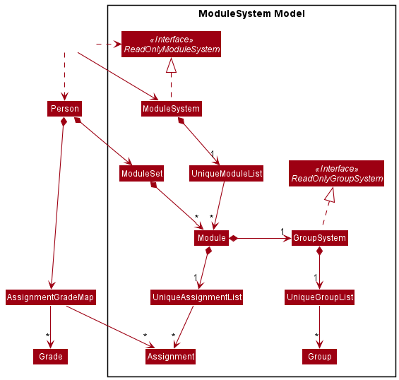
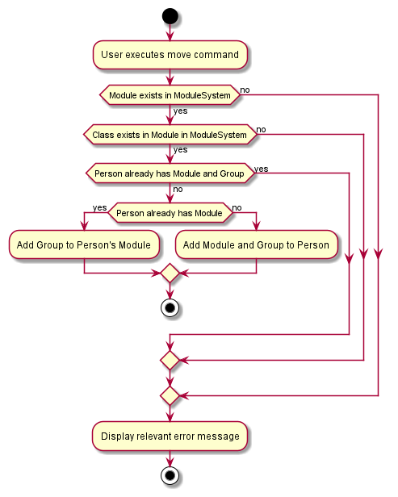
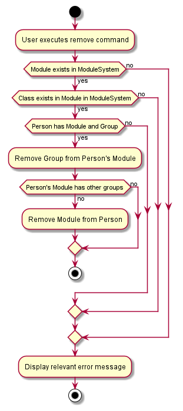

- Table of Contents
  {:toc}

---

## **Acknowledgements**
* Libraries used: [JavaFX](https://openjfx.io/), [Jackson](https://github.com/FasterXML/jackson), [JUnit5](https://github.com/junit-team/junit5)
* This project is based on the [AddressBook-Level3](https://github.com/se-edu/addressbook-level3/) project created by the [SE-EDU initiative](https://se-education.org).

---

## **Setting up, getting started**

Refer to the guide [_Setting up and getting started_](SettingUp.md).

---

## **Design**

:bulb: **Tip:** The `.puml` files used to create diagrams in this document can be found in the [diagrams](https://github.com/AY2122S1-CS2103-W14-3/tp/tree/master/docs/diagrams/) folder. Refer to the [_PlantUML Tutorial_ at se-edu/guides](https://se-education.org/guides/tutorials/plantUml.html) to learn how to create and edit diagrams.

### Architecture

The **_Architecture Diagram_** given above explains the high-level design of the App.

Given below is a quick overview of main components and how they interact with each other.

**Main components of the architecture**

**`Main`** has two classes called [`Main`](https://github.com/AY2122S1-CS2103-W14-3/tp/tree/master/src/main/java/seedu/edrecord/Main.java) and [`MainApp`](https://github.com/AY2122S1-CS2103-W14-3/tp/tree/master/src/main/java/seedu/edrecord/MainApp.java). It is responsible for,

- At app launch: Initializes the components in the correct sequence, and connects them up with each other.
- At shut down: Shuts down the components and invokes cleanup methods where necessary.

[**`Commons`**](#common-classes) represents a collection of classes used by multiple other components.

The rest of the App consists of four components.

- [**`UI`**](#ui-component): The UI of the App.
- [**`Logic`**](#logic-component): The command executor.
- [**`Model`**](#model-component): Holds the data of the App in memory.
- [**`Storage`**](#storage-component): Reads data from, and writes data to, the hard disk.

**How the architecture components interact with each other**

The _Sequence Diagram_ below shows how the components interact with each other for the scenario where the user issues the command `delete 1`.

Each of the four main components (also shown in the diagram above),

- defines its _API_ in an `interface` with the same name as the Component.
- implements its functionality using a concrete `{Component Name}Manager` class (which follows the corresponding API `interface` mentioned in the previous point.

For example, the `Logic` component defines its API in the `Logic.java` interface and implements its functionality using the `LogicManager.java` class which follows the `Logic` interface. Other components interact with a given component through its interface rather than the concrete class (reason: to prevent outside component's being coupled to the implementation of a component), as illustrated in the (partial) class diagram below.

The sections below give more details of each component.

### UI component

The **API** of this component is specified in [`Ui.java`](https://github.com/AY2122S1-CS2103-W14-3/tp/tree/master/src/main/java/seedu/edrecord/ui/Ui.java)

The UI consists of a `MainWindow` that is made up of parts e.g.`CommandBox`, `ResultDisplay`, `PersonListPanel`, `StatusBarFooter` etc. All these, including the `MainWindow`, inherit from the abstract `UiPart` class which captures the commonalities between classes that represent parts of the visible GUI.

The `UI` component uses the JavaFx UI framework. The layout of these UI parts are defined in matching `.fxml` files that are in the `src/main/resources/view` folder. For example, the layout of the [`MainWindow`](https://github.com/AY2122S1-CS2103-W14-3/tp/tree/master/src/main/java/seedu/edrecord/ui/MainWindow.java) is specified in [`MainWindow.fxml`](https://github.com/AY2122S1-CS2103-W14-3/tp/tree/master/src/main/resources/view/MainWindow.fxml)

The `UI` component,

- executes user commands using the `Logic` component.
- listens for changes to `Model` data so that the UI can be updated with the modified data.
- keeps a reference to the `Logic` component, because the `UI` relies on the `Logic` to execute commands.
- depends on some classes in the `Model` component, as it displays `Person` object residing in the `Model`.

### Logic component

**API** : [`Logic.java`](https://github.com/AY2122S1-CS2103-W14-3/tp/tree/master/src/main/java/seedu/edrecord/logic/Logic.java)

Here's a (partial) class diagram of the `Logic` component:

How the `Logic` component works:

1. When `Logic` is called upon to execute a command, it uses the `EdRecordParser` class to parse the user command.
1. This results in a `Command` object (more precisely, an object of one of its subclasses e.g., `AddCommand`) which is executed by the `LogicManager`.
1. The command can communicate with the `Model` when it is executed (e.g. to add a person).
1. The result of the command execution is encapsulated as a `CommandResult` object which is returned back from `Logic`.

The Sequence Diagram below illustrates the interactions within the `Logic` component for the `execute("delete 1")` API call.

:information_source: **Note:** The lifeline for `DeleteCommandParser` should end at the destroy marker (X) but due to a limitation of PlantUML, the lifeline reaches the end of diagram.

Here are the other classes in `Logic` (omitted from the class diagram above) that are used for parsing a user command:

How the parsing works:

- When called upon to parse a user command, the `EdRecordParser` class creates an `XYZCommandParser` (`XYZ` is a placeholder for the specific command name e.g., `AddCommandParser`) which uses the other classes shown above to parse the user command and create a `XYZCommand` object (e.g., `AddCommand`) which the `EdRecordParser` returns back as a `Command` object.
- All `XYZCommandParser` classes (e.g., `AddCommandParser`, `DeleteCommandParser`, ...) inherit from the `Parser` interface so that they can be treated similarly where possible e.g, during testing.

### Model component

**API** : [`Model.java`](https://github.com/AY2122S1-CS2103-W14-3/tp/tree/master/src/main/java/seedu/edrecord/model/Model.java)

The `Model` component,

- stores EdRecord data i.e., all `Person` objects (which are contained in a `UniquePersonList` object).
- stores the currently 'selected' `Person` objects (e.g., results of a search query that is under the selected module) as a separate _filtered_ list which is exposed to outsiders as an unmodifiable `ObservableList<Person>` that can be 'observed' e.g. the UI can be bound to this list so that the UI automatically updates when the data in the list change.
  - to achieve this, 2 separate predicates are used: one that filters for the selected module and one that filters for the results of the search query
  - the resulting filtered list is hence the logical conjunction of these two predicates
- stores a `UserPref` object that represents the user’s preferences. This is exposed to the outside as a `ReadOnlyUserPref` objects.
- stores ModuleSystem data i.e., all `Module` objects (which are contained in a `UniqueModuleList` object).
    - all `Module` objects contain a GroupSystem which stores `Group` objects (i.e. classes) in a `UniqueGroupList`
- does not depend on any of the other three components (as the `Model` represents data entities of the domain, they should make sense on their own without depending on other components)

:information_source: **Note:** An alternative (arguably, a more OOP) model is given below. It has a `Tag` list in the `EdRecord`, which `Person` references. This allows `EdRecord` to only require one `Tag` object per unique tag, instead of each `Person` needing their own `Tag` objects. 

### Storage component

**API** : [`Storage.java`](https://github.com/AY2122S1-CS2103-W14-3/tp/tree/master/src/main/java/seedu/edrecord/storage/Storage.java)

The `Storage` component,

- can save both EdRecord data, ModuleSystem data and user preference data in json format, and read them back into corresponding objects.
- inherits from both `EdRecordStorage`, `ModuleSystemStorage` and `UserPrefStorage`, which means it can be treated as either one (if only the functionality of only one is needed).
- depends on some classes in the `Model` component (because the `Storage` component's job is to save/retrieve objects that belong to the `Model`)

### Common classes

Classes used by multiple components are in the `seedu.edrecord.commons` package.

---

## **Implementation**

This section describes some noteworthy details on how certain features are implemented.

### Representing assignments in a module

A module's assignments are stored in a `UniqueAssignmentList` under the module. Each assignment has a name, a weightage, a maximum score, and a unique ID. The first three fields are supplied by the user, whereas the ID is auto-generated by EdRecord. Assignments are differentiated using their names - the `UniqueAssignmentList` ensures that no two assignments have the same name, case-insensitive. Both assignment name and ID are unique inside the module only, i.e. two different modules can both have a `Lab` assignment with ID `3`, but this is not allowed for the same module.

The unique constraint for assignment name comes from the observation that no two assignments should have the same name in a module (for example, it does not make much sense to have two `Final` assessments for one module). An ID field is given to each assignment upon creation, to make it easier for users to specify the target assignment when adding/deleting student grades. So instead of typing out the entire assignment name, the user can input `id/3` to add grade to assignment with ID `3`.

### Creating assignments

To demonstrate the implementation of assignment-related commands, let's analyze `MakeAssignmentCommand`:

With input `mkasg n/PE w/5 s/10`, the parser classes create a `MakeAssignmentCommand` containing an `Assignment`. This command is executed, instructing the `Model` to add the new assignment to the currently selected module.

Inside `Model`, `selected` is the Module that the user is currently in. `selected` receives the new assignment, and calls `add()` on its internal `UniqueAssignmentList` to add in the assignment. There is a check for duplicate assignments through `UniqueAssignmentList#contains`. Finally, `selected` resets the search filter to show all of its student contacts.

**Design considerations:**

- **Alternative 1**: Store assignments under Group.

  - Pros: User is able to create tailored assignment for each group under a module, i.e. assignments that apply on the group level, not the module level.
  - Cons: More memory usage - many assignments such as Midterm, Practical exam, and Final are on the module level, but in this implementation, each group has to store a copy of the assignment. Prone to errors - the user must create/delete/edit many times when they want to make a change to such an assignment, but they can make mistakes when repeating the task. This process is also likely to be very inconvenient to the user.

- **Alternative 2 (current choice)**: Store assignments under Module.

  - Pros: Easier to implement. Better experience for user, who can `cd` into the module and use one command `mkasg` to create an assignment. In contrast, if the assignments are under groups, the user has to `cd` into the module and choose a group, before he/she can work with the assignments. This also adds another layer to the `cd` command, which must possibly handle `cd`-ing into a group.
  - Cons: Not able to create assignments on the group level.

### Creating and managing modules
Created modules are stored in a `ModuleSystem` under the model. Each module has a module code, a `GroupSystem` to store classes under the module and a `UniqueAssignmentList` to store assignments under the module.
Modules are differentiated using their module code -- the `UniqueModuleList` ensures that no two modules have the same module code.

To create a module, the user has to provide a valid module code (unique from current existing modules). To delete a module, the user has to provide a valid module code (existing module with same module code).

**Design considerations:**

- **Alternative 1**: Each student stores a module code.

    - Pros: Simpler implementation. More flexibility for user.
    - Cons: Increases chance of errors when saving students. If large number of students, will be difficult to find missing students with wrong module code.

- **Alternative 2 (current choice)**: Store assignments under Module.

    - Pros: Creating valid modules to add students to prevents a student getting lost in the system.
    - Cons: Less flexibility for user.

### Create and manage classes
Created classes are stored in a `GroupSystem` under a module. Each class has a class code.
Classes are differentiated using their class code -- the `UniqueGroupList` ensures that no two classes have the same class code in the same `GroupSystem` (i.e. in the same module).

To create a class, the user has to provide a valid class code (unique from current existing classes in the module). To delete a module, the user has to provide a valid class code (existing class with same class code in the module).

**Design considerations:**

- **Alternative 1**: A separate `GroupSystem` under model, together with `ModuleSystem`.

    - Pros: Easy to implement.
    - Cons: More complicated to save and load. Less OOP.

- **Alternative 2 (current choice)**: A `GroupSystem` under a module.

    - Pros: Simple to save and load. More OOP-oriented and instinctive to understand.

### \[Proposed\] Assign students grades for assignments

#### Proposed Implementation

A new command will be added: `grade a/ASSIGNMENT NAME s/STATUS g/GRADE`. This command allows the user to assign a Grade object to a student.

Each student object will keep track of a list of assignments and respective grades.

#### `Grade` object

The `Grade` object contains the completion status of the assignment (Not submitted, Submitted, Graded) and the score that the student has achieved.

## **Implementation**

This section will explain important considerations taken during the design of certain components.

### ModuleSet
The ModuleSet is a HashSet of modules designed for a Person to hold.
Additionally, it is important in the implementation of the following commands: 

- MoveCommand - Add a module and group from a selected person's module set.
- RemoveCommand - Remove a module and group from a selected person's module set. 

Given below is an example usage scenario and how the ModuleSet will behave:

**Step 1. The user creates a new person, and inputs a module and group.**
The ModuleSystem checks if the module and specific group in the module exists. The application will then add the Group into the Module's GroupSystem, and place the Module into the Person's ModuleSet.

**Step 2. The user adds the person to another group, with same module**
The ModuleSystem checks if the module and specific group in the module exists in the system. The application then checks if ModuleSet contains the module. It then adds the Group to the Module's GroupSystem.

**Step 3. The user removes person from a group, in a module**
The ModuleSystem checks if the module and specific group in the module exists in the system. The application then checks if ModuleSet contains the module. It then removes the Group from the Module's GroupSystem. After that, the application checks if the GroupSystem is empty. If it is, remove the Module from the ModuleSet too.

Alternate implentation: ModuleSet as a HashMap between Modules and a List of Groups.
However, this implementation was passed over, as this would not be utilizing the Module's own GroupSystem. The GroupSystem should be utilized as the single source of truth, and having 2 lists of Groups for 1 single Module would be very confusing and error-prone.

---

## **Documentation, logging, testing, configuration, dev-ops**

- [Documentation guide](Documentation.md)
- [Testing guide](Testing.md)
- [Logging guide](Logging.md)
- [Configuration guide](Configuration.md)
- [DevOps guide](DevOps.md)

---

## **Appendix: Requirements**

### Product scope

**Target user profile**:

- teaching assistant for one or more modules
- has a need to manage details of a significant number of students, including:
  - contact details (including name, email, phone number, Telegram handle)
  - attendance
  - class participation
  - assignments (including due date, grade, completion status etc.)
  - assessments (exams, tests, practical assessments)
  - students' strengths and weaknesses
- has a need to keep track of tasks to prepare for each module
- prefer desktop apps over other types
- can type fast
- prefers typing to mouse interactions
- is reasonably comfortable using CLI apps

**Value proposition**: manage students and classes faster than a typical mouse/GUI driven app

### User stories

Priorities: High (must have) - `* * *`, Medium (nice to have) - `* *`, Low (unlikely to have) - `*`

| Priority | As a …​                                       | I want to …​                                                                                               | So that I can…​                                                                                 |
| -------- | --------------------------------------------- | ---------------------------------------------------------------------------------------------------------- | -------------------------------------------------------------------------------------------------------- |
| `* * *`  | new user                                      | view the a list of commands and their usage                                                                | refer to instructions when I forget how to use EdRecord                                                  |
| `* * *`  | user                                          | add a student's contact                                                                                    | contact them later                                                                                       |
| `* * *`  | user                                          | delete a student's contact                                                                                 | remove a student who is no longer in the tutorial group/module                                           |
| `* * *`  | user                                          | edit a student's contact                                                                                   | can have their most updated contact details                                                              |
| `* * *`  | user                                          | list all students I have                                                                                   | see all the students that I have                                                                         |
| `* * *`  | user                                          | find students by name                                                                                      | locate details of students without having to go through the entire list                                  |
| `* * *`  | user with multiple modules                    | create a new module                                                                                        | separate students from different modules                                                                 |
| `* * *`  | user with multiple classes in the same module | create a new class within a module                                                                         | assign students to their class                                                                           |
| `* * *`  | user                                          | assign a student to their class                                                                            | differentiate students by their class                                                                    |
| `* * *`  | user                                          | save and load my data                                                                                      | do not need to enter all my data each time I launch EdRecord                                             |
| `* *`    | user                                          | use a command to exit EdRecord                                                                             | do not need to use my mouse                                                                              |
| `* *`    | user                                          | clear all students                                                                                         | restart my EdRecord at the end of each semester                                                          |
| `* *`    | user                                          | delete module                                                                                              | remove completed or unused modules                                                                       |
| `* *`    | user                                          | delete class within a module                                                                               | remove completed or unused classes                                                                       |
| `* *`    | user                                          | mark students' attendance                                                                                  | keep track of their attendance                                                                           |
| `* *`    | user                                          | track students' class participation                                                                        | calculate class participation grade at the end of the semester                                           |
| `* *`    | user                                          | create a module-wide assignment with information such as assignment name, maximum marks and weightage      | keep track of assignment information                                                      |
| `* *`    | user                                          | delete an assignment                                                                                       | remove assignments that are completed or irrelevant                                                      |
| `* *`    | user                                          | update assignment status for each student                                                                  | track the completion status ("Not yet submitted", "Submitted", "Graded") and grade of individual student |
| `* *`    | user                                          | create a module/class-wide assessment with details such as grade and follow-up actions                     | track the performance of individual students                                                             |
| `*`      | user                                          | tag a student                                                                                              | categorise my students by tags                                                                |
| `* *`    | user                                          | update assignment details                                                                                  | fix any mistakes made when creating the assignment                                                       |
| `*`      | user                                          | batch assign students to classes                                                                           | add the entire class/module at once                                                                      |
| `*`      | experienced user                              | modify the data file directly                                                                              | quickly update student information without having to go through the application commands                 |

### Use cases

(For all use cases below, the **System** is `EdRecord` and the **Actor** is the `user`, unless specified otherwise)

**Use case: UC01 - Create a new module**

**MSS**

1.  User requests to create a new module.
2.  EdRecord adds the new module.

    Use case ends.

**Extensions**

- 1a. User specified module code is invalid.

    - 1a1. EdRecord shows an error message informing the user module code is invalid and module code naming constraints.

      Use case ends.

- 1b. The module already exists.

    - 1b1. EdRecord shows an error message informing the user module already exists.

      Use case ends.
      
**Use case: UC02 - Create a new class in a module**

**MSS**

1.  User requests to create a new class for a module.
2.  EdRecord adds the new class to the specified module.

    Use case ends.

**Extensions**

- 1a. The module does not exist.

  - 1a1. EdRecord shows an error message prompting user to create the module first.

    Use case ends.

- 1b. The module already has a class with the same user specified class code.

    - 1b1. EdRecord shows an error message informing the user class already exists in module.

      Use case ends.

**Use case: UC03 - Add a student contact**

**MSS**

1.  User requests to add a new student contact.
2.  EdRecord adds the new student.

    Use case ends.

**Extensions**

- 1a. User does not provide required fields

  - 1a1. EdRecord shows an error message.

    Use case ends.

**Use Case: UC04 - List all student contacts**

**MSS**

1. User requests to list all students.
2. EdRecord returns a list of all students.

Use case ends.

**Extensions**

- 1a. The student list is empty.

  - 1a1. EdRecord shows a message informing user that the student list is empty.
  
    Use case ends.

**Use case: UC05 - Edit a student contact**

**MSS**

1.  User requests to <u>list all students (UC03)</u>.
2.  User requests to edit a specific student in the list and provides fields to be edited.
3.  EdRecord edits the student accordingly.

    Use case ends.

**Extensions**

- 1a. The list is empty.

  Use case ends.

- 2a. The given index is invalid.

  - 2a1. EdRecord shows an error message.

    Use case resumes at step 1.

- 2b. User does not specify any valid fields to edit.

  - 2b1. EdRecord shows an error message.

    Use case resumes at step 1.
      
**Use case: UC06 - Delete a student contact**

**MSS**

1.  User requests to <u>list all students (UC03)</u>.
2.  User requests to delete a specific student in the list.
3.  EdRecord deletes the student.

    Use case ends.

**Extensions**

- 1a. The list is empty.

  Use case ends.

- 2a. The given index is invalid.

  - 2a1. EdRecord shows an error message.

    Use case resumes at step 2.
    
**Use case: UC07 - Add a student to their class**

**MSS**

1.  User specifies a student contact and requests to add him/her to a class.
2.  EdRecord adds the student to the specified class.

    Use case ends.

**Extensions**

- 1a. The student does not exist.

  - 1a1. EdRecord shows an error message.

    Use case ends.

- 1b. The class does not exist.

  - 1b1. EdRecord shows an error message prompting user to create the class first.

    Use case ends.

- 1c. The module does not exist.

  - 1c1. EdRecord shows an error mesage prompting user to create the module first. 

    Use case ends.

- 1d. The person is already in the specified class, in the specified module.

  - 1d1. EdRecord shows an error mesage telling the user the person is already in the class.

    Use case ends. 

**Use case: UC08 - Remove a student from their class**

**MSS**

1.  User specifies a student contact and requests to remove him/her from a class.
2.  EdRecord removes the student from the specified class.

    Use case ends.

**Extensions**

- 1a. The student does not exist.

  - 1a1. EdRecord shows an error message.

    Use case ends.

- 1b. The module does not exist.

  - 1b1. EdRecord shows an error message prompting user to create the module first.

    Use case ends.

- 1c. The class does not exist.

  - 1c1. EdRecord shows an error mesage prompting user to create the class first. 

    Use case ends.

- 1d. The person is not enrolled in the module.

  - 1d1. EdRecord shows an error mesage telling the user the person is not in the module.

    Use case ends. 

- 1e. The person is not enrolled in the class.

  - 1e1. EdRecord shows an error mesage telling the user the person is not in the class.

    Use case ends.

**Use case: UC09 - Edit module details**

**MSS**

1.  User requests to list modules.
2.  EdRecord shows a list of modules.
3.  User requests to edit a specific module in the list and provides fields to be edited.
4.  EdRecord edits the module details accordingly.

    Use case ends.

**Extensions**

- 2a. The list is empty.

  Use case ends.

- 3a. The given index is invalid.

  - 3a1. EdRecord shows an error message.

    Use case resumes at step 2.

- 3b. User does not specify any valid fields to edit.

  - 3b1. EdRecord shows an error message.

    Use case resumes at step 2.

**Use case: UC10 - Delete a module**

**MSS**

1.  User requests to list modules.
2.  EdRecord shows a list of modules.
3.  User requests to delete a specific module in the list.
4.  EdRecord deletes the module.

    Use case ends.

**Extensions**

- 2a. The list is empty.

  Use case ends.

- 3a. The given index is invalid.

  - 3a1. EdRecord shows an error message.

    Use case resumes at step 2.
    
**Use case: UC11 - Create an assignment**

**MSS**

1.  User requests to create a new assignment.
2.  EdRecord creates the new assignment for the current module.

    Use case ends.

**Extensions**

- 1a. User has not navigated to a module.

  - 1a1. EdRecord shows an error message.

    Use case ends.

- 1b. User does not provide required fields due date, maximum marks and assignment weightage

  - 1b1. EdRecord shows an error message.

    Use case ends.

**Use Case: UC12 - List all assignments**

**MSS**

1. User requests to list all assignments.
2. EdRecord returns a list of all assignments in the current module.

Use case ends.

**Extensions**

- 1a. User has not navigated to a module.

  - 1a1. EdRecord shows an error message.

    Use case ends.

- 1b. The assignment list is empty.

  - 1b1. EdRecord shows a message informing user that the student list is empty.

    Use case ends.

**Use case: UC13 - Edit assignment details**

**MSS**

1.  User requests to <u>list all assignments (UC12)</u>.
2.  User requests to edit an assignment in the list and provides fields to be edited.
3.  EdRecord edits the assignment details accordingly.

    Use case ends.

**Extensions**

- 1a. The list is empty.

  Use case ends.

- 2a. The given index is invalid.

  - 2a1. EdRecord shows an error message.

    Use case resumes at step 1.

- 2b. User does not specify any valid fields to edit.

  - 2b1. EdRecord shows an error message.

    Use case resumes at step 1.

**Use case: UC14 - Delete an assignment**

**MSS**

1.  User requests to <u>list all assignments (UC12)</u>.
2.  User requests to delete an assignment in the list.
3.  EdRecord deletes the assignment.

    Use case ends.

**Extensions**

- 1a. The list is empty.

  Use case ends.

- 2a. The given index is invalid.

  - 2a1. EdRecord shows an error message.

    Use case resumes at step 2.

### Non-Functional Requirements

1.  Should work on any _mainstream OS_ as long as it has Java `11` or above installed.
2.  Should be able to hold up to 1000 persons without a noticeable sluggishness in performance for typical usage.
3.  A user with above average typing speed for regular English text (i.e. not code, not system admin commands) should be able to accomplish most of the tasks faster using commands than using the mouse.
4.  System responds to all user inputs within 1 second.

### Glossary

- **Mainstream OS**: Windows, Linux, Unix, OS-X
- **Private contact detail**: A contact detail that is not meant to be shared with others
- **Module**: An NUS module. A module can have multiple classes, and students can enroll in modules.
- **TA**: Teaching Assistant. One TA can teach multiple modules in multiple semesters with multiple classes for each module.
- **Class**: Collection of students taught by one TA. One class is associated with one module, and one venue and time. Implemented with Java class `Group` due to naming restrictions.

---

## **Appendix: Instructions for manual testing**

Given below are instructions to test the app manually.

:information_source: **Note:** These instructions only provide a starting point for testers to work on;
testers are expected to do more *exploratory* testing.

### Launch and shutdown

1. Initial launch

   1. Download the jar file and copy into an empty folder

   2. Double-click the jar file
   
    Expected: Shows the GUI with a set of sample contacts. The window size may not be optimum.

2. Saving window preferences

   1. Resize the window to an optimum size. Move the window to a different location. Close the window.

   2. Re-launch the app by double-clicking the jar file.
   
    Expected: The most recent window size and location is retained.

### Adding a module

1. Test case: `mkmod`

    Expected: The console displays an error, with an example of how to correctly use the command.

2. Test case: `mkmod CS2100`
  
    Expected: A new module with the code `CS2100` is created.

3. Test case: `mkmod SpecialChar!`

    Expected: The console displays an error, reminding the user that module code must be alphanumeric.

4. Test case: `mkmod With A Space`

    Expected: Same as previous. 

### Selecting a module

1. Test case: `cd`

    Expected: The console displays an error, with an example of how to correctly use the command.

2. Test case: `cd CS2100`

    Expected: The currently selected module switches to `CS2100`, as shown in the status bar. Only contacts from that module are listed.

3. Test case: `cd nonExistentModule`
   
    Expected: The console displays an error, reminding the user that such a module does not exist.

4. Test case: `cd *`

    Expected: The status bar switches from the currently selected module to "No module selected", and students from all modules are displayed.

### Listing modules

1. Test case: `lsmod`

    Expected: A list of modules is displayed.

2. Test case: `lsmod arg`

    Expected: The argument is ignored, and a list of modules is displayed.

### Adding a class

1. Test case: `mkclass`

    Expected: The console displays an error, with an example of how to correctly use the command.

2. Test case: `mkclass m/CS2100 c/T15`
  
    Expected: A new class `T15` belonging to the module `CS2100` is created.

3. Test case: `mkclass m/CS2100 c/Wtih a space`

    Expected: The console displays an error, reminding the user that class code must be alphanumeric.

4. Test case: `mkclass m/test c/test`

    Expected: The console displays an error, reminding the user that the module `test` has yet to be created.

### Listing classes

1. Test case: When selected a module, `lsclass`

    Expected: A list of classes in the current module is displayed.

2. Test case: When selected a module, `lsclass arg`

    Expected: The argument is ignored, and a list of classes in the current module is displayed.

3. Test case: When no module selected, `lsclass`
  
    Expected: The console displays an error, reminding the user to select a module first.
### Adding a person

1. Test case: `add n/Bob p/12345678 e/bob@example.com m/CS2100 c/T15 i/telegram @bob t/strong`
   
    Expected: Bob is added to the end of the list of contacts, and the console shows the relevant information.

2. Test case: After executing the previous command, `add n/Bob p/12345678 e/bob@example.com m/CS2100 c/T15 i/telegram @bob t/strong`
   
    Expected: The console displays an error, reminding the user that such a person already exists in the EdRecord.

3. Test case: `add n/Alice p/12345678 e/alice@example.com m/CS2100 c/T15`

    Expected: Alice is added to the end of the list, but the optional `Info` and `Tags` field is omitted. 

4. Test case: `add n/Charlie p/12345678 e/bob@example.com`

    Expected: Since module and class fields are not optional, the console displays an error, reminding the user of the correct format of the command. 

5. Test case: `add n/Charlie p/999 e/charlie@example.com m/CS2100 c/T15`

    Expected: The console displays an error, reminding the user to input a valid phone number.

6. Test case: Other invalid values for fields such as email, module, etc.

    Expected: The console displays an error, with relevant information on the issue.

### Editing a person

1. Test case: With the person to edit in index 1, `edit 1 p/91234567 e/johndoe@example.com`
  
    Expected: The person at index 1 is edited to have the email `johndoe@example.com` and phone number `91234567`

2. Test case: With less than 100 contacts in the list, `edit 100 p/91234567`
   
    Expected: The console displays an error, reminding the user that the index is invalid.

3. Test case: Other invalid values for index, such as floating point numbers, negative integers, etc.

    Expected: The console displays an error, reminding the user of the right format of the command.

4. Test case: With the person to edit in index 1, `edit 1 p/999`

    Expected: The console displays an error, reminding the user to input a valid phone number.

5. Test case: Other invalid values for the edited field

    Expected: The console displays an error, with relevant information on the issue.

### Moving a person to another module and class

1. Test case: With the person to move in index 1 and an existing module/class, `mv 1 m/CS2103 c/T03`

    Expected: The person at index 1 is added to the specified module/class.
    
2. Test case: With less than 100 contacts in the list, `mv 100 m/CS2103 c/T03`
   
    Expected: The console displays an error, reminding the user that the index is invalid.

3. Test case: With the module/class yet to be created, `mv 1 m/test c/test`

    Expected: The console displays an error, reminding the user that the module/class has yet to be created.

4. Test case: Other invalid/missing values

    Expected: The console displays an error, with relevant information on the issue.

### Remove a person from a module and class

1. Test case: With the person to remove in index 1, who is part of the specified module/class, `rm 1 m/cs2100 c/t15`
   
    Expected: The person at index 1 is removed from the specified module/class, and the list is updated to reflect that.

3. Test case: With the person to remove in index 1, but is not part of the specified module/class, `rm 1 m/cs2103 c/t03`

    Expected: The console displays an error, reminding the user that the person is not part of the module/class.

4. Test case: Other invalid indexes, modules or classes

    Expected: The console displays an error, with relevant information on the issue.

### Finding a person

1. Test case: With a person named Bob in the selected module, `find bob`

    Expected: The person named Bob is displayed in a filtered list, along with any other persons with name matching Bob. The console displays how many results were found.

2. Test case: With people named Bob and Alice in the selected module, `find bob alice`

    Expected: Both Bob and Alice is displayed in a filtered list, along with any other persons with name matching Bob/Alice.

3. Test case: With no person named `x` in the selected module, `find x`

    Expected: An empty list is displayed.

### Listing all people

1. Test case: `list`

    Expected: All persons in the select module is listed.

### Changing to assignment view

1. Test case: `view asg`

    Expected: The UI changes to the assignment view, with each person card having a table. If no modules are selected, only the submissions of the students will be displayed. If there is a module selected, unsubmitted module assignments are displayed in addition to the students' submissions. 

2. Test case: `view contacts`

    Expected: The UI changes to the default contacts view, where each person card has information such as email and phone number.

3. Test case: `view test`

    Expected: The console displays an error, indicating that no such view exists.

### Making an assignment

1. Test case: With a module selected, `mkasg n/Assignment 3 w/10 s/30`

    Expected: A module named `Assignment 3` with weighage 10 and score 30 is added to the selected module. Relevant information is displayed in the console. If in assignment view, the new assignment is reflected for all students.

2. Test case: With no module selected, `mkasg n/Assignment 3 w/10 s/30`

    Expected: The console displays an error, reminding the user to select a module first.

3. Test case: With a module selected, `mkasg n/Assignment 3`

    Expected: The console displays an error, reminding the user of the correct command format.

4. Test case: With a module selected, which already has assignments totalling 90% weighage, `mkasg n/Assignment Last w/20 s/30`

    Expected: The console displays an error, reminding the user that the total weighage of assignments in a module cannot exceed 100%.

### Editing an assignment

1. Test case: With a module selected, with the assignment to edit having an ID of 1, `edasg 1 n/Midterm w/2.5`

    Expected: The assignment with ID 1 is edited to have name Midterm with weighage 2.5

2. Test case: With a module selected, with no assignment of ID 10, `edasg 10 n/test`

    Expected: The console displays an error, reminding the user that there is no such assignment

3. Test case: With a module selected, with all assignment weighage summing to 90% and an existing assignment of ID 1,  `edasg 1 w/20`

    Expected: The console displays an error, reminding the user that the total weighage of assignments in a module cannot exceed 100%.

### Adding a grade

1. Test case: With a module selected, with the assignment to grade having ID 1 and max score 100, and the student to grade having index 1, `grade 1 id/1 st/Graded s/90`

    Expected: The grade of the student is updated, with status Graded and score 90.

2. Test case: Same as 1, but with assignment has max score 10
   
    Expected: The console displays an error, reminding the user that the grade exceeds the maximum score of the assignment

3. Test case: Same as 1, but with an invalid status such as `st/Late`
   
    Expected: The console displays an error, reminding the user of the valid statuses. 

### Deleting a grade

1. Test case: With a module selected, with the graded assignment having ID 2 and the student having index 1, `dlgrade 1 id/2`

    Expected: The grade of the student is removed.

3. Test case: Same as 1, but with an invalid assignment ID or person index

    Expected: The console displays an error, reminding the user of the valid format.

### Deleting an assignment

1. Test case: With a module selected, and an assignment to delete of ID 1, `dlasg 1`

    Expected: The assignment is deleted.

### Deleting a class

1. Test case: With the module `CS2103` selected, and an existing class of `T03`, `dlclass m/cs2103 c/t03`

    Expected: The class is deleted.

2. Test case: Same as 1, but with an nonexistent module/class

    Expected: The console displays an error, with relevant information.

### Deleting a module

1. Test case: With the module to delete having a code of `CS2103`, `dlmod CS2103`

    Expected: The module is deleted.

2. Test case: Same as 1, but with an nonexistent module

    Expected: The console displays an error, with relevant information.

### Deleting a person

1. Test case: With the person to delete in index 1, `delete 1`

    Expected: The person in index 1 will be deleted, with details of the deleted contact in the console. The list is updated to reflect the deleted person.

2. Test case: `delete 0`

    Expected: The console displays an error, reminding the user of a valid index.

3. Test case: `delete 100`

    Expected: The console displays an error, reminding the user that the provided index is invalid.

### Clearing all data

1. Test case: `clear`

    Expected: EdRecord is cleared of all data. You can verify this with the respective list commands.

### Saving data

1. Dealing with missing/corrupted data files

  1. Test case: Missing JSON file.
  
      Expected: Sample data will be populated on startup.

  2. Test case: Corrupted JSON file.

      Expected: An empty instance of EdRecord will be started, with more detailed error message logged.

---

## Effort 
In general, our team has managed to implement the essential features of the applications to allow EdRecord to become a usable application. Our team closely adhered towards the given deadlines, making sure that each of the important features were done by a specific milestone. The enhancements made on top of AddressBook-3 is equal or slightly more than our individual projects.

### **Challenges Encountered:**
1. Closely associated objects
    - EdRecord has ModuleSystem, Module, Group, ModuleSet, Assignments and Grades. Compared to AB3, with a `Person` object containing many fields, their nature made them deeply nested. This made their creation, deletion and manipulating them very tedious, and contributed to most of the bugs found in the dry run. This was eventually solved having multiple checks at each command.

2. Closely associated objects (2)
    - As they are closely coupled together, writing tests for multiple classes together is more difficult. Furthermore, our team did not have enough time to write tests for every single new component.

### **Achievements Accomplished:**
1. Different selection and views
    - EdRecord implemented the ability to change views between contacts and assignments, and also having the ability to select modules. This was a big change from AddressBook-3, needing new UI, and also having the ability to quickly swap from view to view. 
