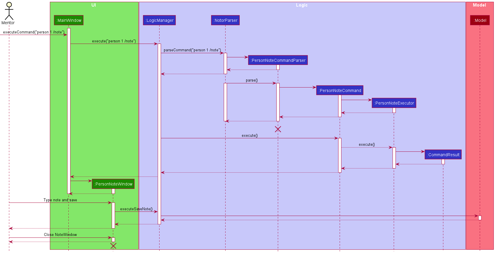

## **Introduction**

Thank you for your interest in the developing of Notor! This is an open-source project aimed at helping mentors take
quick, efficient notes to facilitate effective and efficient mentoring of many mentees. The design principles
scaffolding Notor are as follows.

1. **Efficient UX for the User:**
    - You shouldn't have to wait for Notor; it should simply run -- quickly and without hassle.
    - Look for how you can make the process faster, more streamlined, or more effective for our clients: mentors.
2. **CLI-first**
    - We target fast-typers who are comfortable taking notes on their computer.

In particular, we tackle the needs of mentor professors, who tend to be busy and are assigned mentees they are unlikely
to personally know or run into often. A personal CRM like Notor is a useful tool to help mantain the mentor-mentee relationship. Key features of Notor which scaffold this
are:

1. Powerful Organisation which is up to the user to manage many mentees
    - Group mentees, and place groups into subgroups for greater control
    - Add tags to mentees and sort by tags to easily identify meta-data
    - Archive contacts you're no longer speaking to
2. A clean note-taking system
    - designed so that they can take notes concurrently with meeting the mentee so no information is forgotten

### Acknowledgements

This project is a further iteration of the [_AddressBook-Level 3 (
AB-3)_](https://nus-cs2103-ay2122s1.github.io/tp/DeveloperGuide.html) project. All features we have are in addition to
those already present in AB-3. Removed features may or may not be listed as well.

* Table of Contents 
{:toc}

--------------------------------------------------------------------------------------------------------------------

## **Setting up, getting started**

Refer to the guide [_Setting up and getting started_](SettingUp.md).

--------------------------------------------------------------------------------------------------------------------

## **Glossary**

* **Command structure**: The order in which parameters and command words must be written in order for the command to be
  correctly parsed
* **Dummy data**: Sample data used in testing or example data present on first launch of application
* **Group**: A container containing `Person` objects with shared traits that is created by the user
* **Key power features**: Essential features that will be used often when running the software application
* **Mainstream OS**: Windows, Linux, Unix, MacOS
* **Metadata**: Personal data about a `Person` object
* **Note**: A general description of each `Person` to record their activities, with last edit timestamp attached
* **Subgroup**: A child of a `Group` used to store multiple persons based on a more specific category than `Group`. A **
  Subgroup** can be created by specifying the parent group of the **Subgroup**. A person in a **Subgroup** is
  automatically in the parent `Group` as well
* **Tag**: A string descriptor attached to `Group` objects or `Person` objects
* **Ungrouped**: Used to describe a `Person` object with no grouping

--------------------------------------------------------------------------------------------------------------------

## **Design**

### Architecture

The **Architecture** of our iteration is built upon AB-3. Please refer to the AB-3 **Architecture**
section for the general Architectural design of the app. Only changes will be listed here.

### Logic Changes

#### Command Changes

Due to the addition of many new commands and refactoring of the command structure, we have amended the classes related
to managing commands.

* `Parser` now takes in generic `T extends Command` since we have multiple types of commands, each with their own unique
  parser
* `Executor` instances are created by each `Command` class, which then handle the actual execution of commands and
  returning of `CommandResult`
* Commands now come in 3 general types, `PersonCommand`, `GroupCommand` and `Command`
    * `PersonCommand` operates on `Person` objects
    * `GroupCommand` operates on `Group` objects
    * `Command` operates without either a `Person` or `Group` object
* `Parser` and `Executor` classes come in the same 3 categories as `Command` classes
* `NotorParser` now parses both the `commandWord` and `subCommandWord` for user commands
    * `commandWord` refers to either `Person`, `Group` or one of the object agnostic commands
    * `subCommandWord` refers to an operation that can be carried out on a `Person` or `Group`, such as `find` or `tag`

New Workflow for Adding Commands:

1. Create a `XYZCommand` class that extends either `PersonCommand`, `GroupCommand` or simply `implements Command`.
2. Create a `XYZCommandParser` class that extends the same type of `Parser` as the `Command` above is.
3. Add the new `XYZCommandParser` to the `parse()` method in `NotorParser`.
4. Create a `XYZCommandExecutor` class that extends the same type of `Executor` as the `Command` from step 1.
5. Implement all required methods and ensure all fields used by the methods are present.

#### In-depth example of Command workflow, using the Find Command

Notor allows you to search for groups and people, and both searches have slightly different requirements.

Let's break down what happens when you call a command, like the find command. The following is a low-level sequence diagram to show in detail how the method is called.

* The common logic for all commands is shared in `LogicManager` and `NotorParser`, which uses the Command design pattern. Making use of polymorphism, we know we will have a `Command` returned which can be executed by the `LogicManager`, while different classes hold the functionality.
* Each specific command parser (`FindCommandParser` in the diagram) is responsible for checking that the correct parameters have been passed, and forming them into the appropriate parameters. The parser creates an appropriate command (`FindPersonCommand`), which extends the `Command` interface. Hence, we know the `FindPersonCommand` will definitely implement `execute`.
* In the constructor for the `FindPersonCommand`, the `FindPersonExecutor` is initialised. As mentioned earlier, executors hold all the execution functionality. In the case of find, this means in its initialisation it is passed the predicate initialised in the `FindCommandParser` which is used to filter the list of persons in the model later
* After the initialisation of the `FindPersonCommand` is done, the Command is returned all the way to `LogicManager`. 
* `LogicManager` uses the Command API to call execute() on the command, which calls the execute method on the executor.
* The executor updates the model and returns the command result, which is passed back to the `LogicManager`.

#### In-depth example of Command Workflow, using the Person Note Command.

Notor allows you to add note to a itself, a person or group in a list.

The following sequence diagram shows the detail when `PersonNoteCommand` is executed to add note for a person.

### UI Changes

*(placeholder API for now, will update to our own link later when implemented.)*

* `MainWindow` does not contain PersonListPanel anymore.
Now it contains ListPanel which can be a PersonListPanel, GroupListPanel or SubgroupListPanel.
* `MainWindow` contains a new GeneralNote which displays the general note.

### Model Changes

*(placeholder API for now, will update to our own link later when implemented.)*

**
API** : [`Model.java`](https://github.com/se-edu/Notor-level3/tree/master/src/main/java/seedu/address/model/Model.java)

* `Person` does not contain the `Address` field anymore.
* `Person` contains a new `Note` field.
* `Person` contains `HashSet<String>` containing `SuperGroup` and `SubGroup` names for display purposes.
    * These are just `String` objects, and are not actual references to `Group` objects.
* `Name` must start with an alphabet character.
    * This is due to the fact that our parser will be unable to differentiate between indexes and names when parsing
      commands.
* `Name` may contain `-` and `.` characters.
    * This is to account for people with these special characters in their names.

Here is the better class structure to be implemented:

* `Trie` allows tags to be autocompleted as commands are entered.
* Storing `String` objects in a `Trie` in Notor allows all tags to only get created once instead of once per object.
* Storing tags as `String` objects in a trie is simpler than a dedicated `Tag` class.
* This feature is planned for a future update, as the `Trie` data structure has already been implemented.
* This feature could also not be implemented due to short form commands already being very user friendly.

### Storage component

*(placeholder API for now, will update to our own link later when implemented.)*

**
API** : [`Storage.java`](https://github.com/se-edu/Notor-level3/tree/master/src/main/java/seedu/address/storage/Storage.java)

The `Storage` component,

* now includes a new `Archive` Storage component
* `Archive` allows users to temporarily remove `Person`s from their Address Book

### Common classes

**
API** : [`Trie.java`](https://github.com/AY2122S1-CS2103T-W08-1/tp/blob/master/src/main/java/seedu/address/commons/core/trie/Trie.java)

* Allows grouping and autocompletion of `Tag` and `Command` objects.
* Supports addition and deletion of items.
* Supports finding of first item.
* Supports finding of first item that starts with specified keyword.

--------------------------------------------------------------------------------------------------------------------

## **Implementation**

This section describes some noteworthy details on how certain features are implemented.

### \[Proposed\] Data archiving

_{Explain here how the data archiving feature will be implemented}_

--------------------------------------------------------------------------------------------------------------------

## **Documentation, logging, testing, configuration, dev-ops**

* [Documentation guide](Documentation.md)
* [Testing guide](Testing.md)
* [Logging guide](Logging.md)
* [Configuration guide](Configuration.md)
* [DevOps guide](DevOps.md)

--------------------------------------------------------------------------------------------------------------------

## **Appendix: Requirements**

### Product scope

**Target user profile**: mentor professors

* has a need to manage a significant number of contacts
* prefer desktop apps over other types
* can type fast
* prefers typing to mouse interactions
* is reasonably comfortable using CLI apps
* has groups of contacts that have different needs

**Value proposition**: manage contacts faster than a typical mouse/GUI driven app

### User stories

Priorities:

* High - must have

* Medium - nice to have

* Low - unlikely to have

* Default - already implemented)

|As a …                                                                                      |I want to …                                                                                                   |So that I can …                                            |Priority    |Status     |When?         |
|--------------------------------------------------------------------------------------------|--------------------------------------------------------------------------------------------------------------|-----------------------------------------------------------|------------|-----------|--------------|
|on the go user                                                                              |add notes without wifi or internet access                                                                     |use the app anywhere                                       |Default     |           |Iteration 1.2 |
|new user                                                                                    |have dummy data                                                                                               |see what my entries look like                              |Default     |           |Iteration 1.2 |
|new user                                                                                    |remove all dummy entries easily                                                                               |start doing work quickly                                   |Medium      |           |Iteration 1.2 |
|general user, new user                                                                      |see a simple UI which shows essential features immediately and hides away advanced features till you need them|slowly learn the features                                  |High        |           |Iteration 1.2 |
|general user, mentor professor, module professor                                            |take notes with timestamps                                                                                    |see my notes chronologically                               |High        |           |Iteration 1.2 |
|general user, mentor professor, module professor                                            |edit the groups or tags of a student                                                                          |                                                           |High        |           |Iteration 1.2 |
|mentor professor                                                                            |group the students based on the mentoring subjects                                                            |tag or comment on each group separately                    |High        |           |Iteration 1.2 |
|general user, mentor professor, module professor                                            |have easy-to-remember commands for inputting information                                                      |                                                           |High        |           |Iteration 1.2 |
|general user                                                                                |delete groups/subgroups                                                                                       |                                                           |High        |Not started|Iteration 1.2 |
|experienced user, general user                                                              |add tags cumulatively                                                                                         |not retype my old tags                                     |High        |Not started|Iteration 1.2 |
|new user                                                                                    |see clear error messages that explains how to enter the correct command                                       |learn the right syntax from my errors                      |High        |Not started|Iteration 1.2b|
|experienced user, general user, mentor professor, module professor                          |edit previous notes I have taken                                                                              |                                                           |High        |           |Iteration 1.2b|
|mentor professor, module professor, new user                                                |have an easily accessible help page                                                                           |                                                           |High        |           |Iteration 1.2b|
|experienced user, general user, mentor professor, module professor, new user, on the go user|search by tag/category                                                                                        |find students based on tag/category                        |High        |Not started|Iteration 1.2b|
|general user, mentor professor, module professor                                            |have notes attached to categories                                                                             |save notes relevant to a whole group                       |Medium      |           |Iteration 1.2b|
|general user                                                                                |create general notes                                                                                          |take down any thoughts I have on the fly                   |Medium      |Not started|Iteration 1.2b|
|new user                                                                                    |see a confirmation message if I choose to delete something                                                    |avoid accidental deletions                                 |Medium      |           |Iteration 1.2b|
|experienced user, mentor professor, module professor                                        |specify the kinds of data attached to contacts which is viewable from the front page                          |only see information that I need                           |Nice To Have|           |Iteration 1.3 |
|general user                                                                                |display all of the user information in an easy to reference format                                            |read large amounts of information at once easily           |Medium      |           |Iteration 1.3 |
|mentor professor, module professor                                                          |initialise the contacts for many students at once                                                             |add similar students by batch                              |Medium      |           |Iteration 1.3 |
|mentor professor                                                                            |see the last time I contacted a student                                                                       |know if I need to check up on them                         |Medium      |           |Iteration 1.3 |
|new user                                                                                    |get prompted for the arguments.                                                                               |learn the command structure                                |Medium      |           |Iteration 1.3 |
|experienced user                                                                            |pin users I need to access regularly                                                                          |see commonly accessed users easily                         |Low         |           |Iteration 1.3b|
|experienced user                                                                            |see personal metadata such as number of high-priority students & number of contacts                           |determine my own usage                                     |Low         |           |Iteration 1.3b|
|new user                                                                                    |see a short tutorial                                                                                          |get familiar with key features                             |Low         |Not started|Iteration 1.3b|
|mentor professor, module professor                                                          |hide groups                                                                                                   |ignore groups no longer relevant to me                     |Low         |           |Iteration 1.3b|
|general user, mentor professor, module professor, on the go user                            |export the data to PDF & CSV / Excel                                                                          |reference the information in another format                |Low         |           |Iteration 1.3b|
|experienced user                                                                            |sort by complete inclusion of terms rather than matching any term                                             |narrow down my search results easily                       |Low         |Not started|Iteration 1.3b|
|experienced user, module professor                                                          |set my own command aliases                                                                                    |use my own commands when I am used to them                 |Low         |           |Delay         |
|experienced user, mentor professor, module professor                                        |use shorter commands                                                                                          |save time                                                  |Medium      |           |Delay         |

### Use cases

(For all use cases below, `Notor` is the **System** and the **Actor** is the `user`, unless specified otherwise)

#### Navigation

##### Use case 1: Display a desired list

**MSS**

1. User requests to view list of persons/groups/archived persons
2. Notor shows the list selected

**Extensions**

* 2a. The list is empty. Use case ends.

##### Use case 2: Display a subset of a list

**MSS**

1. User requests for Notor to return the persons/groups which fit a certain criteria
2. Notor returns a list filtered by said criteria

   Use case ends.

#### General Use Cases

##### UC-CommandError : User enters the wrong command

Precondition: User passes the wrong parameters, command, or data

1. Notor detects an error in the entered data, and displays an error message
2. User corrects their command to not have any errors. Steps 1 and 2 are repeated until the data entered are correct. Command is executed from where the use case is interrupted.

#### Basic Person Use Cases

##### Use case: Add a person to Notor

**MSS**

1. User requests to add a person to Notor, specifying their name and optional parameters for their personal details
2. Notor adds said person to the storage, and displays a success message

   Use case ends.

**Extensions**

* 1a. User <u> commands Notor to display the list of groups</u> (UC1)
    * 1a1. User requests to add a person to Notor, specifying their name and optional parameters for their personal details, as well as the group they want to add them to
    * Resume usecase at 2
* 1b. User enters the <u> wrong parameters for their request to add person, resulting in </u> (UC-CommandError).
  * Resume usecase at 2

##### Use case: Edit Person, Tag Person, or Add/remove person to a group

**MSS**

1. User commands <u> Notor to display the list of persons </u> (UC1)
2. User specifies a person they want to change, and informs Notor of which fields they want changed and to what values.
3. Notor changes the fields, displaying the correct fields and a success message

**Extensions**

* 2a. User tries to add person to a group that does not exist.
  * Notor informs the user that the group does not exist
    * User decides to <u> create the group</u> first (UC)
    * Resume use case from step 1.

##### Use case: Add a note to a person

**MSS**

1. User <u> commands Notor to display the list of persons </u> (UC1)
2. User requests to add a note to a specific person in the list
3. Notor opens up a pop up window for the user to type the note for the person
4. User types in their notes.
5. User requests to save and close the note
6. Notor closes the note window and displays a success message that note has been saved.

   Use case ends.

**Extensions**

* 2a. User <u> makes a mistake in their request, such as specifying a person that doesn't exist </u> (UC-CommandError)
  * Resume use case from step 2
* 6a. User requests to save the note to the person
  * 6a1. Notor displays a message that the note has been saved. Use case resumes at step 5 or 6
* 6b. User requests to close the note (without saving)
  * 6b1. Notor shows a warning window.
    * 6b2.1 : User cancels the request to close the note. Use case resumes at step 5 or 6
    * 6b2.2 : User accepts to close the note without saving. Notor closes the note window. Not shown that note is saved.

**Use case: Add a note to a Group** 
**MSS**
1. Similar to Add a note to a person except Notor shows a list of groups in step 1

**Use case: Add a note to a Subgroup** 
**MSS**
1. Similar to Add a note to a person except Notor shows a list of subgroups in step 1

##### Use Case: Clear tags or notes

**MSS**

Precondition: The person or group whose tags or notes you want to clear is visible and able to be selected

1. User requests to clear all tags or notes
2. Notor displays a confirmation window
3. User confirms their wish to clear all tags or notes
4. Notor clears tags or notes, then displays a success message.

   Use case ends.

**Extensions**

* 3a. User cancels their request
  * 3a1. Notor displays a confirmation of the cancelling of the request
    Use case ends.

#### Basic Group Commands

##### Use Case : Create Group

1. User informs Notor to create a group, specifying its name
2. Notor creates the group and displays a success message

#### Proposed Extended Use Cases ( Not Implemented )

##### Use case: User types a command

**MSS**

1. User starts typing a command in Notor
2. Notor shows possible commands starting with what user has typed
3. User presses tab to select the right command
4. User presses enter to execute the selected command
5. Notor <u>runs command (UC1)</u>

   Use case ends.

**Use case: Add a person to a group** 
**MSS**

1. User requests to add a person to a group
2. Notor shows a list of persons
3. User requests to add a specific person in the list to a specified group
4. Notor adds the person to group

**Extensions**

* 2a. The list is empty. Use case ends.

* 3a. The given index is invalid.
    * 3a1. Notor shows an error message. Use case resumes at step 2.

* 3b. The specified group is not found in Notor.
    * 3b1. Notor shows an error message. Use case resumes at step 2.

* 3c. The person is already in the group specified.
    * 3c1. Notor shows an error message. Use case resumes at step 2.

**Use case: Add a person to a subgroup** 
**MSS**
1. Similar to Add a person to a group except User requeststo add person to a subgroup instead.

   Use case ends.

**Use case: Export data** 
**MSS**

1. User requests to export data
2. Notor exports the data in CSV format to the directory where Notor belongs.

   Use case ends.

### Non-Functional Requirements

1. Should work on any _mainstream OS_ as long as it has Java `11` or above installed.
2. Should be able to hold up to 1000 persons without a noticeable sluggishness in performance for typical usage.
3. A user with above average typing speed for regular English text (i.e., not code, not system admin commands) should be
   able to accomplish most of the tasks faster using commands than using the mouse.
4. Installing a new update shall not in any way, modify or erase existing data and value from the previous version, and
   the new update should be compatible with the data produced earlier within the system.
5. Should be able to store notes in English language. Note that support for other languages is not in scope.
6. The system should be able to handle notes with at most 1000 lines without any noticeable decrease in performance, so
   that users can keep extensive notes on their mentees.
7. The user should not lose any data if exit command is triggered by the user.
8. The system should be able to reply to the prompt or command from the user within 3 seconds.
9. The system should be logical to use for a mentor professor.
10. Should ensure personal data privacy and security of data access.
11. While the software should be accessible for colour-blind or vision impaired mentors, this goal is out of scope for Notor 1.4 due to time constraints.

--------------------------------------------------------------------------------------------------------------------

## **Appendix: Instructions for manual testing**

Given below are instructions to test the app manually.

:information_source: 

**Note:** These instructions only provide a starting point for testers to work on;
testers are expected to do more *exploratory* testing.

### Launch and shutdown

1. Initial launch

    1. Download the jar file and copy into an empty folder

    1. Double-click the jar file Expected: Shows the GUI with a set of sample contacts. The window size may not be
       optimum.

1. Saving window preferences

    1. Resize the window to an optimum size. Move the window to a different location. Close the window.

    1. Re-launch the app by double-clicking the jar file. 
       Expected: The most recent window size and location is retained.

1. _{ more test cases …​ }_

### List Commands

1. Test case: `person /list` 
  Expected: View list of all persons in Notor who are not archived
2. Test case: `person /list CSENfeisvnldifosjeri` 
  Expected: Same as above -- following string is ignored.
3. Test case: `group /list` 
  Expected: List all groups in your Notor
4. Incorrect test cases to try: `grop /list` (or other typos)
  Prerequisite: On the person list, using the command `person (INDEX) /list`. Expected: Display error message.
5. Test case: `person /lar`  
  Prerequisite: List the archived persons

Prerequisites: Be in a list of groups. They can be subgroups or supergroups. Must have at least one group in the list.
1. Test case: `person 3 /list` 
  Expected: View list of all persons in the third group who are not archived
2. Test case: `group 2 /list` 
  Expected: View list of all subgroups in group 2 who are not archived
3. Test case: `person 0 /list ` 
  Expected: No change in list display. Error details shown in the status message.

### Find Commands
1. Test case: `person /find n:John t:AI ` 
  Expected: Display all people who's names include 'John' tagged with the specific tag 'AI'.
2. Test case: `person /find`  
  Expected: Display an error message as no parameters were provided.

### Deleting a person

1. Deleting a person while all persons are being shown

    1. Prerequisites: Be in person list. Must have at least one person in the list.

    1. Test case: `person 1 /delete` 
       Expected: First contact is deleted from the list. Details of the deleted person shown in the status message.

    1. Test case: `person 0 /delete ` 
       Expected: No person is deleted. Error details shown in the status message. Status bar remains the same.

    1. Other incorrect delete commands to try: `p /delete`, `p x /delete`, `...` (where x is larger than the list size) 
       Expected: Similar to previous.

### Adding a group

1. Adding a group
    1. Test case: `group Test /create` 
       Expected: Group is created. If you switch to group list, you will be able to see the new group created.

    1. Test case: `group 123 /create` 
       Expected: No group is created. Error details shown in the status message.

    1. Other incorrect delete commands to try: `group /create`, `group group_1 /create`, `...`
       (where x is larger than the list size) 
       Expected: Similar to previous.

### Deleting a group

1. Deleting a group while all groups are being shown

    1. Prerequisites: List all groups using the `group /list` command. Multiple groups in the list.

    1. Test case: `group 1 /delete` 
       Expected: A confirmation window popped. Upon confirmation, first group is deleted from the list.

    1. Test case: `group 0 /delete` 
       Expected: No group is deleted. Error details shown in the status message.

    1. Other incorrect delete commands to try: `group /delete`, `group x /delete`, `...`
       (where x is larger than the list size) 
       Expected: Similar to previous.

### Adding person to a group

1. Prerequisites: List all persons using the `person /list` command. Multiple persons in the list. Only the group Orbital is created.

    1. Test case: `person 1 /add g:Orbital` 
       Expected: Person is added to the group. Person is updated with a new group in the UI.

    1. Test case: `person 0 /add g:Orbital` 
       Expected: Nothing happened. Error details shown in the status message.

    1. Other incorrect delete commands to try: `person /add`, `person 1 /add g:NonExistent`, `...`
       (where x is larger than the list size) 
       Expected: Similar to previous.

### Removing a person from a group

1. Prerequisites: List all persons using the `person /list` command. Multiple persons in the list. First person is added to group Orbital.
    1. Test case: `person 1 /remove g:Orbital` 
           Expected: Person is removed to the group. Person is updated with group removed in the UI.

    1. Test case: `person 0 /remove g:Orbital` 
       Expected: No person is removed. Error details shown in the status message.

    1. Other incorrect delete commands to try: `person /remove`, `person 1 /remove g:NonExistent`, `...`
       (where x is larger than the list size) 
       Expected: Similar to previous.

### Adding subgroup to a group

1. Prerequisites: List all groups using the `group /list` command. Multiple groups in the list.

    1. Test case: `group 1 /create n:Artemis` 
       Expected: Artemis is added to the first group. Group is updated with a new subgroup in the UI.

    1. Test case: `group 0 /create n:Artemis` 
       Expected: No group is created. Error details shown in the status message.

    1. Other incorrect delete commands to try: `group /create`, `...`
       (where x is larger than the list size) 
       Expected: Similar to previous.

### Removing a subgroup from a group

1. Prerequisites: List all groups using the `group /list` command. Multiple groups in the list. First group contains subgroup Artemis.
    1. Test case: `group 1 /delete n:Artemis` 
       Expected: Confirmation window pops up. Upon confirmation, Artemis is removed from the first group.
       Group is updated with a subgroup removed in the UI.

    1. Test case: `group 0 /delete n:Artemis` 
       Expected: No subgroup is removed. Error details shown in the status message.

    1. Other incorrect delete commands to try: `group /delete`, `group 1 /delete n:NonExistent`, `...`
       (where x is larger than the list size) 
       Expected: Similar to previous.

### Adding general note.
1. Adding general note.

    1. Test case: `note`  
       Expected: Note window opened with title of note window named as `General Note` to add note to.
       Within the note window, user can make use of keyboard shortcuts in **User Guide** for saving and quiting of note.
       Upon saving of note, general note is added and displayed in left pane of Notor.

### Clearing general note.

1. Clearing of general note.
    1. Test case: `clearnote`  
       Expected: Warning Window opened to prompt whether to proceed with clearing of general note.
       General note is cleared in Notor upon confirmation to continue with clearing of note.
       General note is not cleared upon confirmation to cancel clear note.

### Adding note to a person

1. Adding note to a person in person list.  
    Prerequisites: List all persons using the `person /list` command or already in person list.
    Must have at least one person in the list.

    1. Test case: `person 1 /note`  
        Expected: Note window opened with title of note window named as the person to add note to.
        Within the note window, user can make use of keyboard shortcuts in  **User Guide** for saving 
        and quiting of note.
        Upon saving of note, first three lines of note excluding empty line is shown for the first person in the list.

    1. Test case: `person 0 /note ` 
      Expected: No note window is opened. Error details shown in the status message.

    1. Other incorrect delete commands to try: `p /note`, `p x /note`, `...` (where x is larger than the list size) 
      Expected: Similar to previous.

### Clearing note of a person
1. Clearing note of a person in person list.  
   Prerequisites: List all persons using the `person /list` command or already in person list. 
        Must have at least one person in the list.

    1. Test case: `person 1 /clearnote`  
       Expected: Warning Window opened to prompt user whether to proceed with clearing of note for the person. 
       Note of first person is cleared in the list upon confirmation to clear note. 
       Note of first person in the list remains upon confirmation to cancel clear note.
       
   1. Test case: `person 0 /clearnote ` 
      Expected: No warning window is opened. Error details shown in the status message.
      
    1. Other incorrect delete commands to try: `p /clearnote`, `p x /clearnote`, `...` (where x is larger than the list size) 
       Expected: Similar to previous.

### Tagging a person

{Todo...}
### Saving data

1. Dealing with missing/corrupted data files

    1. _{explain how to simulate a missing/corrupted file, and the expected behavior}_

1. _{ more test cases ... }_

## **Appendix: Effort**

### GUI Test (Implemented but scrapped due to CI failure)

We have initially decided to implement **Gui Testing** because many of our functionalities 
such as clearing notes, tags and Notor, and adding notes uses a pop up window.

The difficulty level of GUI Testing is moderate because there is very limited
guides available on **TestFx** Library. Despite our best efforts to try to fix CI failure and the GUI testcases passing locally, 
all efforts are of no avail.
