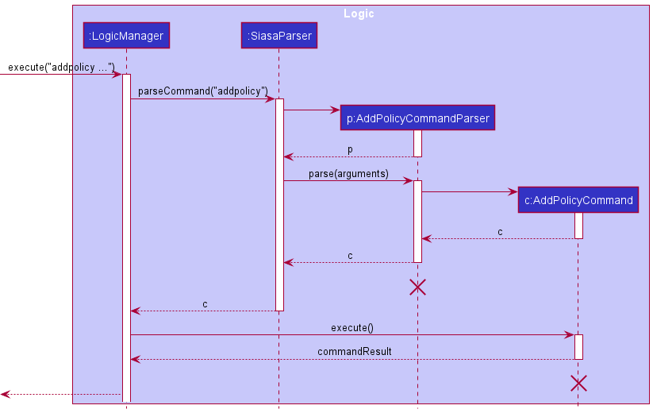
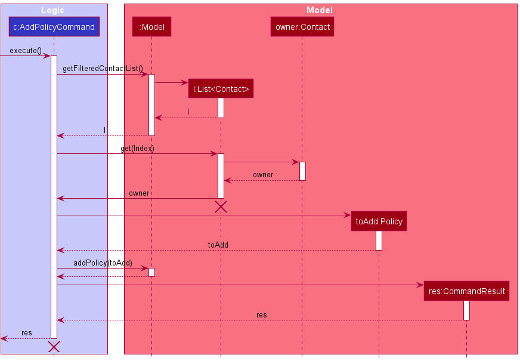
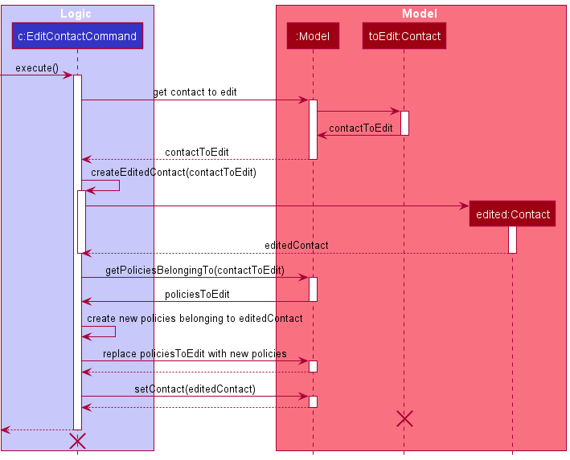
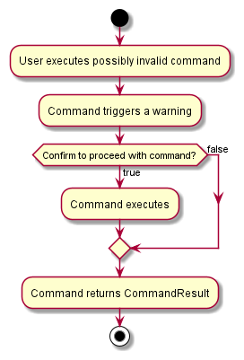

* Table of Contents 
{:toc}

---
## **Developer Guide Information**

### **Purpose**

This developer guide aims to provide information regarding the design and implementation of Siasa, including the design considerations when implementing each feature.

### **Target Audience**

This developer guide is made for Java developers who are or were formerly **student financial advisors**, the target audience of Siasa. Thus, it is assumed that readers have basic background knowledge on Java and is familiar with common terms used in insurance policies.

### **Acknowledgements**

-   This project is based on the AddressBook-Level3 project created by the [SE-EDU initiative](https://se-education.org).

---

## **Setting up, getting started**

Refer to the guide [_Setting up and getting started_](SettingUp.md).

---

### Architecture


The **_Architecture Diagram_** given above explains the high-level design of the App.

Given below is a quick overview of main components and how they interact with each other.

**Main components of the architecture**

**`Main`** has two classes called [`Main`](https://github.com/AY2122S1-CS2103-F10-4/tp/blob/2d1b8809aa8b78086507f8e2a5d48bc05a385e01/src/main/java/seedu/siasa/Main.java) and [`MainApp`](https://github.com/AY2122S1-CS2103-F10-4/tp/blob/2d1b8809aa8b78086507f8e2a5d48bc05a385e01/src/main/java/seedu/siasa/MainApp.java). It is responsible for,

-   At app launch: Initializes the components in the correct sequence, and connects them up with each other.
-   At shut down: Shuts down the components and invokes cleanup methods where necessary.

[**`Commons`**](#common-classes) represents a collection of classes used by multiple other components.

The rest of the App consists of four components.

-   [**`UI`**](#ui-component): The UI of the App.
-   [**`Logic`**](#logic-component): The command executor.
-   [**`Model`**](#model-component): Holds the data of the App in memory.
-   [**`Storage`**](#storage-component): Reads data from, and writes data to, the hard disk.

**How the architecture components interact with each other**

The _Sequence Diagram_ below shows how the components interact with each other for the scenario where the user issues the command `delete 1`.


Each of the four main components (also shown in the diagram above),

-   defines its _API_ in an `interface` with the same name as the Component.
-   implements its functionality using a concrete `{Component Name}Manager` class (which follows the corresponding API `interface` mentioned in the previous point.

For example, the `Logic` component defines its API in the `Logic.java` interface and implements its functionality using the `LogicManager.java` class which follows the `Logic` interface. Other components interact with a given component through its interface rather than the concrete class (reason: to prevent outside component's being coupled to the implementation of a component), as illustrated in the (partial) class diagram below.


The sections below give more details of each component.

### UI component

The **API** of this component is specified in [`Ui.java`](https://github.com/AY2122S1-CS2103-F10-4/tp/blob/2d1b8809aa8b78086507f8e2a5d48bc05a385e01/src/main/java/seedu/siasa/ui/Ui.java)


The UI consists of a `MainWindow` that is made up of parts e.g.`CommandBox`, `ResultDisplay`, `ContactListPanel`, `StatusBarFooter` etc. All these, including the `MainWindow`, inherit from the abstract `UiPart` class which captures the commonalities between classes that represent parts of the visible GUI.

The `UI` component uses the JavaFx UI framework. The layout of these UI parts are defined in matching `.fxml` files that are in the `src/main/resources/view` folder. For example, the layout of the [`MainWindow`](https://github.com/AY2122S1-CS2103-F10-4/tp/blob/2d1b8809aa8b78086507f8e2a5d48bc05a385e01/src/main/java/seedu/siasa/MainApp.java) is specified in [`MainWindow.fxml`](https://github.com/AY2122S1-CS2103-F10-4/tp/blob/2d1b8809aa8b78086507f8e2a5d48bc05a385e01/src/main/resources/view/MainWindow.fxml)

The `UI` component,

-   executes user commands using the `Logic` component.
-   listens for changes to `Model` data so that the UI can be updated with the modified data.
-   depends on some classes in the `Model` component, as it displays `Contact` and `Policy` object residing in the `Model`.
-   keeps a reference to the `Logic` component, because the `UI` relies on the `Logic` to execute commands.
-   is referenced by the `Logic` component, because the `Warning` class in `Logic` relies on `MainWindow` for the user input in the dialog box. 

### Logic component

**API** : [`Logic.java`](https://github.com/AY2122S1-CS2103-F10-4/tp/blob/2d1b8809aa8b78086507f8e2a5d48bc05a385e01/src/main/java/seedu/siasa/logic/Logic.java)

Here's a (partial) class diagram of the `Logic` component:


How the `Logic` component works:

1. When `Logic` is called upon to execute a command, it uses the `SiasaParser` class to parse the user command.
1. This results in a `Command` object (more precisely, an object of one of its subclasses e.g., `AddCommand`) which is executed by the `LogicManager`.
1. The command can communicate with the `Model` when it is executed (e.g. to add a contact).
1. The result of the command execution is encapsulated as a `CommandResult` object which is returned back from `Logic`.

How the parsing works:

- When called upon to parse a user command, the `SiasaParser` class creates an `XYZCommandParser` (`XYZ` is a placeholder for the specific command name e.g., `AddPolicyCommandParser`) which uses the other classes shown above to parse the user command and create a `XYZCommand` object (e.g., `AddPolicyCommand`) which the `SiasaParser` returns back as a `Command` object.
- All `XYZCommandParser` classes (e.g., `AddPolicyCommandParser`, `DeleteContactCommandParser`, ...) inherit from the `Parser` interface so that they can be treated similarly where possible e.g, during testing.

The Sequence Diagram below illustrates the interactions within the `Logic` component for the `execute("deletepolicy 1")` API call.


<div markdown="span" class="alert alert-info">:information_source: **Note:** The lifeline for `DeletePolicyCommandParser` should end at the destroy marker (X) but due to a limitation of PlantUML, the lifeline reaches the end of diagram.
</div>


### Model component

**API** : [`Model.java`](https://github.com/AY2122S1-CS2103-F10-4/tp/blob/2d1b8809aa8b78086507f8e2a5d48bc05a385e01/src/main/java/seedu/siasa/model/Model.java)


The `Model` component,

- stores the SIASA data i.e., all `Contact` and `Policy` objects (which are contained in a `UniqueContactList` and
  `UniquePolicyList `object respectively).
- stores the currently 'selected' `Contact` and `Policy` objects (e.g., results of a search query) in a separate filtered_list each
  which is exposed to outsiders as an unmodifiable `ObservableList<Person>` that can be 'observed'
  e.g. the UI can be bound to this list so that the UI automatically updates when the data in the lists change.
- stores a `UserPref` object that represents the user’s preferences. This is exposed to the outside as a `ReadOnlyUserPref` objects.
- does not depend on any of the other three components
  (as the `Model` represents data entities of the domain, they should make sense on their own without depending on other components)


### Storage component

**API** : [`Storage.java`](https://github.com/AY2122S1-CS2103-F10-4/tp/blob/2d1b8809aa8b78086507f8e2a5d48bc05a385e01/src/main/java/seedu/siasa/storage/Storage.java)


The `Storage` component,

-   can save both SIASA data (contacts and policies) and user preference data in json format, and read them back into corresponding objects.
-   inherits from both `SiasaStorage` and `UserPrefStorage`, which means it can be treated as either one (if only the functionality of only one is needed).
-   depends on some classes in the `Model` component (because the `Storage` component's job is to save/retrieve objects that belong to the `Model`)

### Common classes

Classes used by multiple components are in the `seedu.siasa.commons` package.

---

## **Implementation**

This section describes some noteworthy details on how certain features are implemented.

### Creating Policies

This section explains the process of adding a `Policy` to the `Policy` list that belongs to an owner which is a `Contact`.
This is similar to how a `Contact` is created as well with some highlighted differences.

The `AddPolicyCommand` will create a new `Policy` with the specified details and add it to the application. This command requires
the `Policy`'s details and the `Contact`'s `Index` to specify which `Contact` the policy belongs to.

The `AddPolicyCommand` implements the `AddPolicyCommand#execute` method, which obtains the `Contact` object, the owner,
from the `Model` using the `Index`, creates the policy with the details and the owner, checks for similar policies and
if none, updates the `Model`'s `Policy` list.

The sequence diagram below illustrates how the `AddPolicyCommand` is executed.


**Step 1.** The user enters the command `addpolicy n/critical illness p/30000 4 120 c/10 30 cl/2`

**Step 2.** User input is passed to `SiasaParser` which creates and calls `AddPolicyCommandParser#parse` with the arguments.
This creates a new AddPolicyCommand by passing in the `Policy`'s details and owner `Contact`'s `Index`.



**Step 3.** The `AddPolicyCommand` is executed by `LogicManager` by calling the `execute` method.

**Step 4.** As the model is passed into the `execute` method, the list of `Contact`s save in the model can be obtained
by calling `Model#getFilteredContactList`. The owner `Contact` is obtained from the list using the `Index`.

**Step 5.** The policy to be added is created by passing in the details and the owner `Contact`.

**Step 6.** The policy is added to the model by calling `Model#addPolicy`.

#### Notable differences with creating contact
1. The Contact to be added is created within `AddContactCommandParser#parse` and not in `AddContactCommand#execute`.
2. No Contact details are passed into `AddContactCommand`


#### Design considerations:
#### How to create the `Policy` to be added.
* **Alternative 1 (chosen)**: `Policy` details and Contact Index are passed into `AddPolicyCommand`, when executed, owner
  `Contact` is obtained from the `Model` and `Policy` to be added is created.
    * Advantage over alt. 2:
        * Less coupling since the parser does not need a reference to `Model`.
        * Cleaner implementation of `SiasaParser#parse` since all `CommandParser`s do not need a reference to `Model`.
* **Alternative 2**: `Model` reference is passed into `AddPolicyCommandParser#parse`, `Contact` is obtained from the `Model`
  and `Policy` to be added is created within parse and the created `Policy` is passed into AddPolicyCommand.
    * Advantage over alt. 1:
        * Greater abstraction since `Policy` components are not revealed and stored within the `AddPolicyCommand`
        * Consistent with the implementation of `AddContactCommand`.

### Editing Contact
`EditContactCommand` requires an `EditContactDescriptor` which encapsulates the intended changes to the `Contact` and
the `Index` of the `Contact` to be edited.

Due to the immutable nature of both `Contact` and `Policy`, editing a `Contact`'s details would require creating a new `Contact`
object. In addition, as `Policy` has an owner field, all `Policies` that belong to the edited `Contact` need to be edited and a
new `Policy` object would need to be created for each of them with the edited new `Contact` object as the owner.

The sequence diagram below illustrates how the `EditContactCommand` is executed.


**Step 1**: `EditContactCommand#execute` is called which gets the `contactToEdit` from the `Model` using the `Index` provided, 
similar to the process in `AddPolicyCommand`.

**Step 2**: Using the `EditContactDescriptor` object and the `contactToEdit`, a new `editedContact` is created by calling 
`EditContactCommand#createEditedContact`.

**Step 3**: Policies belonging to the `contactToEdit` is obtained from the `Model`.

**Step 4**: For each of the policies, a new `Policy` object is created with identical fields but with `editedContact` as the owner and 
the `Model` is updated with these new policies.

**Step 5** The `contactToEdit` is replaced by the `editedContact` by calling `Model#setContact`.
#### Design considerations:
#### Immutability of Contact and Policy
* **Alternative 1 (chosen)**: Both `Contact` and `Policy` are immutable. Therefore, any edit to `Policy` or `Contact` requires new objects
  to be created.
    * Advantage over 2:
        * With the invariant that an object will not be changed once created, it is easier to design,
          implement and use the application as code complexity increases.
        * Thread safety
* **Alternative 2**: Both `Contact` and `Policy` are mutable. Any changes to `Policy` or `Contact` can be done simply by modifying the fields.
    * Advantage over 1:
        * Less objects need to be created, arguably better performance as number of entries increase.
* **Reason for choice**: Despite performance concerns, application meets performance requirements and expectations from testing.

### Sorting and Filtering

This section explains the implementation of the Sorting and Filtering feature. They are both implemented with a similar concept.

The set of sorting commands are `sortcontact` and `sortpolicy`, while the set of filtering commands are `findcontact`, `contactpolicy` and `expiringpolicy`.

#### Design Considerations

1. The sorting/filtering method has to be generic so that we can implement multiple different sorters/fliters with significant code duplication.
2. The sorting functionality has to work alongside the preexisting filtering functionality.
3. The sorting and filtering functionality has to be *stackable*; Lists should allow filtering then sorting and vice-versa.

#### Implementation

Initially, the `ObservableList` provided by the `ModelManager` returns a `FilteredList`. The `FilteredList` took in a `Predicate` that would be applied on the list.

To implement the sorting functionality, we wrapped the `FilteredList` around a `SortedList`. The `SortedList` takes in a `Comparator` that would be applied on the list.

In the constructor of `ModelManager`, the list provided by `ObservableList`s of Contacts and Policies are first passed into the constructor of the `SortedList` then the `FilteredList`.

Due to the implementation of both `SortedList` and `FilteredList`, if the underlying content of the lists were to change, so would theirs.

The respective parsers would construct the commands with the correct `Predicate`s or `Comparator`s depending on the arguments provided by the user. Then, the commands, when executed, will apply them to the respective lists in the model.

Given below is an example usage scenario and how the mechanism behaves at each step.


**Step 1.** The user executes the command `sortpolicy titledsc`.

**Step 2.** User input is passed to the `SiasaParser` and `SiasaParser` will call `SortPolicyCommandParser#parse`, which creates a new `SortPolicyCommand` with the `SORT_POLICY_BY_TITLE_DSC` Comparator.

**Step 3.** The `SortPolicyCommand` will then be executed by calling its `execute` method.

**Step 4.** Since the `Model` is passed to `SortPolicyCommand#execute`, it is able to call a method `Model#updateFilteredPolicyList` to update the Comparator for the Policy `FilteredList`.

**Step 5.** After the Comparator is applied, the Policy List view on the UI will automatically display the list with the correct sorting order.

#### Special Notes

- `contactpolicy` applies a `PolicyIsOwnedBy` predicate that takes in a `Contact`. It will return `true` if the `owner` field of the `Policy` is equals to the `Contact` taken in.
- `expiringpolicy` applies a predicate that returns true if the `ExpiryDate` of a `Policy` is within the next month.

### Download Command

This section explains the mechanism behind ```DownloadCommand``` used to download a TXT file containing useful statistics. These include:
- total commission
- commission earned per contact
- number of policies per contact,
- the average number of policies per contact

The command requires no parameters. ```DownloadCommand``` implements ```DownloadCommand#execute```, that calls
the relevant methods in ```Model``` to obtain the various statistics. The method ```DownloadCommand#stringListBuilderForTxt```
is then invoked, to convert the statistics information as a list of strings. The list of strings is then written to
the file via ```DownloadCommand#writeToTxt```.

This is the sequence diagram of the interactions between ```Logic``` and ```Model``` component for the command.


### Warning

This section explains the use of ```Warning```, a class which encapsulates a warning that a ```Command``` can give. Specifically,
it displays a warning dialog to the user, and returns the user's decision to proceed as a boolean value. The ```Command``` triggering
the ```Warning```  can then decide what to do with the user's decision.

```Warning``` has a static method ```Warning#isUserConfirmingCommand``` that requires a description of the warning as a
String, and returns the decision of the user's decision. When ```Warning#isUserConfirmingCommand``` is invoked, it calls
```MainWindow#showWarning```, that will create a new ```WarningWindow``` to display. ```WarningWindow``` has the
command ```WarningWindow#isUserConfirmingCommand``` that will return the user's decision.

This is the sequence diagram of how a ```Command ``` might call a ```Warning```, and the interactions between the ```Logic```
and ```UI``` components.


The activity diagram below summarizes how a ```Warning``` should be used within execution of a ```Command```.



#### Design Considerations

Typically, displaying the UI involves executing the command text in ```MainWindow#executeCommand``` and then interpreting the
```CommandResult``` to decide what UI changes to make.

However for the implementation of ```Warning```, the user input in ```UI``` component has to be sent back to the ```Logic```
component, so that the ```Command``` can decide whether to execute or abort. Displaying ```Warning``` in ```MainWindow#executeCommand```
will then be too late.

##### Aspect: How to obtain User Response from a UI WarningWindow Component

**Alternative 1 (current choice):** create a static method ```MainWindow#showWarning``` to handle ```WarningWindow```
operations.
- Pros:
    - Maintains the UI structure of ```MainWindow``` controlling all the smaller UI parts.
- Cons:
    - A more complex implementation to control ```WanringWindow```
**Alternative 2:** Have the ```Command``` call a method in ```WarningWindow``` directly.
- Pros:
    - A more straightforward implementation.
- Cons:
    - Violates the structure of ```MainWindow``` being the controller of other UI parts.


Therefore, we decided on a static ```MainWindow#showWarning``` to allow for a return value that can be used by methods
in ```Logic``` component. While it may have been simpler for ```Logic``` to interact directly with ```WarningWindow```,
it breaks the structure of ```MainWindow``` being the main UI components to manage smaller components.
---

## **Documentation, logging, testing, configuration, dev-ops**

-   [Documentation guide](Documentation.md)
-   [Testing guide](Testing.md)
-   [Logging guide](Logging.md)
-   [Configuration guide](Configuration.md)
-   [DevOps guide](DevOps.md)

---

## **Appendix A: Requirements**

### Product scope

**Target user profile**:

Our target audience is a student who,
-   is working as a financial advisor
-   has a need to quickly and easily keep track of their:

    1. contacts
    2. financial policies sold

-   prefer desktop apps over other types
-   can type fast
-   prefers typing to mouse interactions
-   is reasonably comfortable using CLI apps

**Value proposition**: 

Currently, there are no good contact applications on desktop that allow student financial advisors, that do not have time to use complex contact book applications, to easily keep track of their contacts and policies.

Siasa enables student financial advisors to quickly and easily keep track of their contacts (both potential clients and existing clients) and financial plans sold to aid their operations. The different payment structures also provide better customisation for student financial advisors, allowing them to better record any policies they may have sold.

Siasa also provides valuable data and statistics in a `.txt` file for a quick summary and analysis of all the current policies, allowing such students to get the necessary information and data in a fast and efficient manner.

### User stories

Priorities: High (must have) - `* * *`, Medium (nice to have) - `* *`, Low (unlikely to have) - `*`

| Priority | As a/an                           | I can ...                                                                                   | So that I can...                                                                                                     |
| :------: | --------------------------------- | ------------------------------------------------------------------------------------------- | -------------------------------------------------------------------------------------------------------------------- |
| `* * *`  | new user                          | easily download and start using the app                                                     | save time and not be limited by my lack of experience with the application                                           |
|  `* *`   | new user                          | navigate through the app interface easily                                                   | start using the app quickly                                                                                          |
|  `* *`   | new user                          | seek the 'help' function                                                                    | get help whenever I'm confused while using the app                                                                   |
|  `* *`   | new user                          | follow the simple guide/tutorial provided                                                   | understand how to interact with and use the application                                                              |
|  `* *`   | new user                          | experiment with sample contacts                                                             | familiarise myself with the application                                                                              |
|  `* *`   | user ready to start using the app | purge all current data                                                                      | get rid of sample/experimental data I used for exploring the app                                                     |
|  `* *`   | user ready to start using the app | learn from tips and tricks recommended by the app                                           | learn more ways to use the app more efficiently and more functions the app offers                                    |
| `* * *`  | user ready to start using the app | easily create a contact and provide relevant details                                        | save the contact and relevant information for each contact                                                           |
| `* * *`  | expert user                       | interact with the application through CLI                                                   | save time for repetitive tasks by allowing me to automate them using scripts                                         |
|  `* *`   | expert user                       | have some statistics                                                                        | analyse the data from past contacts and policies                                                                     |
|  `* *`   | expert user                       | view the history of policies my clients have signed                                         | keep track of past policies                                                                                          |
|  `* *`   | expert user                       | be able to export my saved data                                                             | transfer my data to other installation/computers                                                                     |
| `* * *`  | busy user                         | quick add a contact                                                                         | easily save any new contacts i receive without much hassle                                                           |
|  `* *`   | busy user                         | view my expiring policies at a glance                                                       | quickly find out what policies to renew                                                                              |
| `* * *`  | busy user                         | list the current contacts with policies                                                     | save time going through every single contact                                                                         |
|  `* *`   | busy user                         | quickly find a contact                                                                      | find a specific contact easily without wasting much time                                                             |
|  `* *`   | new financial advisor             | label non-client contacts based on their potential/interest                                 | identify who to contact and who not to contact in future for a follow-up to save time while expanding my client base |
|  `* *`   | experienced financial advisor     | mass save the policy details of the many customers I have                                   | save time importing all my data and keep track of all my customers policies                                          |
|  `* *`   | experienced financial advisor     | sort through the contacts                                                                   | sort the contacts I have based on a certain field easily                                                             |
|  `* *`   | experienced financial advisor     | search through the many policies I have                                                     | find the relevant policy quickly                                                                                     |
| `* * *`  | generic user                      | view the policies associated with each client                                               | have a good understanding of the products purchased by each client                                                   |
|  `* *`   | generic user                      | label a contact as a client or non-client                                                   | differentiate between my contacts                                                                                    |
|  `* *`   | generic user                      | update a contact that I have added                                                          | keep up-to-date information on all my contacts                                                                       |
| `* * *`  | generic user                      | add a contact to our application                                                            | use the application to track or monitor the contact                                                                  |
|  `* *`   | generic user                      | search through my contacts quickly by name                                                  | find the relevant contact easily                                                                                     |
| `* * *`  | generic user                      | view the contact details of each client                                                     | contact customers easily by looking up information via the app                                                       |
|  `* *`   | generic user                      | update my insurance/financial plans and related information                                 | store the most up-to-date plan information in the app                                                                |
|  `* *`   | satisfied user                    | leave nice feedback about the application                                                   | show my appreciation to the creators of the app and highlight to them features that really work                      |
|  `* *`   | satisfied user                    | easily share to my friends or colleagues about this application                             | provide them with a product that they can benefit from                                                               |
|  `* *`   | unsatisfied user                  | provide constructive feedback about what I think can be improved while using the app easily | allow the creators of the app to identify and fix flaws or bugs in the app to improve my experience as a user.       |

### Use cases

(For all use cases below, the **System** is the `SIASA` and the **Actor** is the `user`, unless specified otherwise)

#### **UC1: Displaying Help**

**MSS**

1. User opens help page.
2. SIASA displays a help page showing basic commands.

   Use case ends.

#### **UC2: Add a Contact/Policy**

**MSS**

1. User requests to add a contact/policy.
2. SIASA adds the contact/policy.

   Use case ends.

**Extensions**

-   1a. The given argument(s) is/are invalid.

    -   1a1. SIASA shows an error message.

        Use case resumes at step 1.

-   *a. User can request to view help at any time [(UC1)](#uc1-displaying-help).

#### **UC3: Edit a Contact/Policy**

**MSS**

1. User requests to list contacts/policies.
2. SIASA shows a list of contacts/policies.
3. User requests to edit information of contact/policy.
4. SIASA updates information of contact/policy.

   Use case ends.

**Extensions**

-   2a. The list is empty.

    Use case ends.

-   3a. The given arguments are invalid.

    -   3a1. SIASA shows an error message.

        Use case resumes at step 3.

-   *a. User can request to view help at any time [(UC1)](#uc1-displaying-help).

#### **UC4: Delete a Contact/Policy**

**MSS**

1.  User requests to list contacts/policies.
2.  SIASA shows a list of contacts/policies.
3.  User requests to delete a specific contact/policy in the list.
4.  SIASA deletes the contact/policy.

    Use case ends.

**Extensions**

-   2a. The list is empty.

    Use case ends.

-   3a. The given index is invalid.

    -   3a1. SIASA shows an error message.

        Use case resumes at step 3.

-   *a. User can request to view help at any time [(UC1)](#uc1-displaying-help).

#### **UC5: List a Contact's Policies**

**MSS**

1. User requests to list contacts.
2. SIASA shows a list of contacts.
3. User requests to list a specific contact's policy.
4. SIASA shows the list of policies belonging to the contacts.

   Use case ends.

**Extensions**

-   2a. The list is empty.

    Use case ends.

-   3a. The given index is invalid.

    -   3a1. SIASA shows an error message.

        Use case resumes at step 3.

-   *a. User can request to view help at any time [(UC1)](#uc1-displaying-help).

#### **UC6: Clear a Contact's Policies**

**MSS**

1.  User requests to list contacts.
2.  SIASA shows a list of contacts.
3.  User requests to clear all policies belonging to a specific contact.
4.  SIASA clears all policies belonging to the contact.

    Use case ends.

**Extensions**

-   2a. The list is empty.

    Use case ends.

-   3a. The given index is invalid.

    -   3a1. SIASA shows an error message.

        Use case resumes at step 3.

-   *a. User can request to view help at any time [(UC1)](#uc1-displaying-help).

#### **UC7: Sort Contact/Policy List**

**MSS**

1.  User requests to list contacts/policies.
2.  SIASA shows a list of contacts/policies.
3.  User requests to sort list of contacts/policies.
4.  SIASA sorted list of contacts/policies.

    Use case ends.

**Extensions**

-   2a. The list is empty.

    Use case ends.

-   3a. The given sorter is invalid.

    -   3a1. SIASA shows an error message.

        Use case resumes at step 3.

-   *a. User can request to view help at any time [(UC1)](#uc1-displaying-help).

#### **UC8: Download Statistics**

**MSS**

1.  User requests to download statistics.
2.  SIASA generates the statistics file in data.

    Use case ends.

**Extensions**

-   *a. User can request to view help at any time [(UC1)](#uc1-displaying-help).

### Non-Functional Requirements
*   Technical requirements:
    1.  Should work on any _mainstream OS_ as long as it has Java `11` or above installed.
    1.  Should work on any OS with `32-bit` or `64-bit` architectures.
    1.  User data should be in human editable file and stored locally.
    1.  Should not require internet for any of its features.
    
*   Performance requirements:
    1.  Should be able to hold up to 1000 entries(contacts/policies) without a noticeable sluggishness in performance for typical usage.
    1.  The response to any commands should be less than 1 second.
    
*   Quality requirements:
    1.  A user with above average typing speed for regular English text (i.e. not code, not system admin commands) should be able to accomplish most of the tasks faster using commands than using the mouse.
    1.  The application should be easily picked up by a new user with no prior experience with a similar application.
    1.  A user familiar with CLI tools should find the commands intuitive and easy to remember.

### Glossary

-   **SIASA**: Student Insurance Agent Sales Assistant
-   **Mainstream OS**: Windows, Linux, Unix, OS-X
-   **Private contact detail**: A contact detail that is not meant to be shared with others
-   **Financial policies**: Policies that the financial advisor are trying to sell. eg. a life insurance plan.

---

## **Appendix B: Instructions for manual testing**

Given below are instructions to test the app manually.

<div markdown="span" class="alert alert-info">:information_source: **Note:** These instructions only provide a starting point for testers to work on;
testers are expected to do more *exploratory* testing.

</div>

### Launch and shutdown

1.  Initial launch

    1.  Download the jar file and copy into an empty folder
    1.  Double-click the jar file Expected: Shows the GUI with a set of sample contacts and policies. The window size may not be optimum.

1.  Saving window preferences

    1.  Resize the window to an optimum size. Move the window to a different location. Close the window.
    1.  Re-launch the app by double-clicking the jar file.<br>
        Expected: The most recent window size and location is retained.

### Adding a contact

1.  Adding a contact while all contacts are being shown

    1.  Prerequisites: List all contacts using the `allcontact` command. Multiple contacts in the list.
    1.  Test case: `addcontact n/James Ho p/22224444 e/jamesho@example.com a/123, Clementi Rd, 1234665 t/friend t/colleague`<br>
        Expected: A contact with the details provided will be added into the contact list. Details of the added contact shown in the status message. Timestamp in the status bar is updated.
    1.  Test case: `addcontact n/!nvalidN@me p/22224444 e/jamesho@example.com a/123, Clementi Rd, 1234665 t/friend t/colleague` <br>
        Expected: No contact is added. Error details shown in the status message. Status bar remains the same.
       
1. Adding a contact while not all contacts are being shown
   
    1.  Prerequisites: Filter the contact list using `findcontact KEYWORD` so that not all the contacts are shown.
    1.  Test case: `addcontact n/James Ho p/22224444 e/jamesho@example.com a/123, Clementi Rd, 1234665 t/friend t/colleague`<br>
        Expected: A contact with the details provided will be added into the contact list. The complete contact list will be shown. Details of the added contact shown in the status message. Timestamp in the status bar is updated.
    1.  Test case: `addcontact n/!nvalidN@me p/22224444 e/jamesho@example.com a/123, Clementi Rd, 1234665 t/friend t/colleague` <br>
        Expected: No contact is added. Error details shown in the status message. Status bar remains the same.

### Editing a contact

1.  Editing a contact while all contacts are being shown

    1.  Prerequisites: List all contacts using the `allcontact` command. Multiple contacts in the list.
    1.  Test case: `editcontact 2 n/James Lee e/jameslee@example.com`<br>
        Expected: The contact details of the contact with index 2 is updated to the provided information. Contact list is reloaded to display the edited contact at its new index. Details of the edited contact shown in the status message. Timestamp in the status bar is updated.
    1.  Test case: `editcontact 2 n/!nv@lidN@m3 e/jameslee@example.com` <br>
        Expected: No contact is edited. Error details shown in the status message. Status bar remains the same.
    1.  Test case: `editcontact x n/James Lee e/jameslee@example.com` (where x is larger than the list size)<br>
        Expected: No contact is edited. Error details shown in the status message. Status bar remains the same.

### Deleting a contact

1.  Deleting a contact while all contacts are being shown

    1.  Prerequisites: List all contacts using the `allcontact` command. Multiple contacts in the list.
    1.  Test case: `deletecontact 1`<br>
       Expected: First contact is deleted from the list. Details of the deleted contact shown in the status message. Timestamp in the status bar is updated.
    1.  Test case: `deletecontact 0`<br>
       Expected: No contact is deleted. Error details shown in the status message. Status bar remains the same.
    1.  Other incorrect delete commands to try: `deletecontact`, `deletecontact x`, `...` (where x is larger than the list size)<br>
        Expected: Similar to previous.

### Adding a policy

1.  Adding a policy while all policies are being shown
    
    1.  Prerequisites: List all contacts using the `allpolicy` command. Multiple policies and contacts in the list.
    1.  Test case: `addpolicy n/Life Policy p/1000 12 120 c/20 12 cl/1 e/2100-06-13 t/AIA`<br>
        Expected: A policy with the details provided will be added into the policy list. Details of the added policy shown in the status message. Timestamp in the status bar is updated.
    1.  Test case: `addpolicy n/!nv@lidN@m3 p/1000 12 120 c/20 12 cl/1 e/2021-06-13 t/AIA` <br>
        Expected: No policy is added. Error details shown in the status message. Status bar remains the same.
    1.  Test case: `addpolicy n/Life Policy p/1000 12 120 c/20 12 cl/1 e/1990-06-13 t/AIA`<br>
        Expected: A warning will pop-up. Pressing `confirm` will create a policy. A policy with the details provided will be added into the policy list. Details of the added policy shown in the status message. Timestamp in the status bar is updated. Pressing `cancel` or closing will not create a policy. Error details shown in the status message. Status bar remains the same.

1. Adding a policy while not all policies are being shown
   
    1.  Prerequisites: Filter the policy list using `contactpolicy CONTACT_INDEX` so that not all the policies are shown. All contacts are still shown.
    1.  Test case: `addpolicy n/Life Policy p/1000 12 120 c/20 12 cl/1 e/2100-06-13 t/AIA`<br>
        Expected: A policy with the details provided will be added into the policy list. The complete policy list will be shown. Details of the added policy shown in the status message. Timestamp in the status bar is updated.
    1.  Test case: `addpolicy n/!nv@lidN@m3 p/1000 12 120 c/20 12 cl/1 e/2021-06-13 t/AIA` <br>
        Expected: No policy is added. Error details shown in the status message. Status bar remains the same.


### Editing a policy

1.  Editing a policy while all policies are being shown

    1.  Prerequisites: List all policies using the `allpolicy` command. Multiple policies in the list.
    1.  Test case: `editpolicy 2 n/Full Life e/2025-06-13`<br>
        Expected: The policy details of the policy with index 2 is updated to the provided information. Policy list is reloaded to display the edited policy. Details of the edited policy shown in the status message. Timestamp in the status bar is updated.
    1.  Test case: `editpolicy 2 n/!nv@lidN@m3 e/2025-06-13` <br>
        Expected: No policy is edited. Error details shown in the status message. Status bar remains the same.
    1.  Test case: `editpolicy x n/Full Life e/2025-06-13` (where x is larger than the list size)<br>
        Expected: No policy is edited. Error details shown in the status message. Status bar remains the same.
    1.  Test case: `editpolicy 2 n/Full Life e/1990-06-13`<br>
        Expected: A warning will pop-up. Pressing `confirm` will update a policy. The policy details of the policy with index 2 is updated to the provided information. Policy list is reloaded to display the edited policy. Details of the edited policy shown in the status message. Timestamp in the status bar is updated. Pressing `cancel` or closing will not edit the policy. Error details shown in the status message. Status bar remains the same.


### Deleting a policy

1.  Deleting a policy while all policies are being shown
    
    1.  Prerequisites: List all contacts using the `allpolicy` command. Multiple policies in the list.
    1.  Test case: `deletepolicy 1`<br>
        Expected: First policy is deleted from the list. Details of the deleted policy shown in the status message. Timestamp in the status bar is updated.
    1.  Test case: `deletepolicy 0`<br>
        Expected: No policy is deleted. Error details shown in the status message. Status bar remains the same.
    1.  Other incorrect delete commands to try: `deletepolicy`, `deletepolicy x`, `...` (where x is larger than the list size)<br>
        Expected: Similar to previous.

### Saving data

1.  Dealing with missing data files

    1.  Prerequisites: There must a `./data/siasa.json` file. Your application must be closed.
    1.  Delete the `./data/siasa.json` file.
    1.  Launch the application again.
        Expected: The GUI should pop up with the default contacts and policies entries.

1.  Dealing with corrupted data files

    1.  Prerequisites: There must a `./data/siasa.json` file. Your application must be closed.
    1.  Open the `./data/siasa.json` file with any text editor and remove any `{`.
    1.  Launch the application again.
        Expected: The GUI should pop up with no entry.
