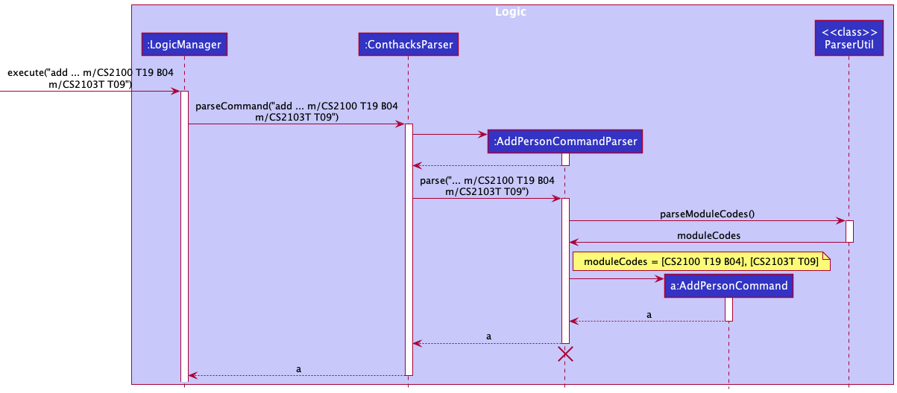
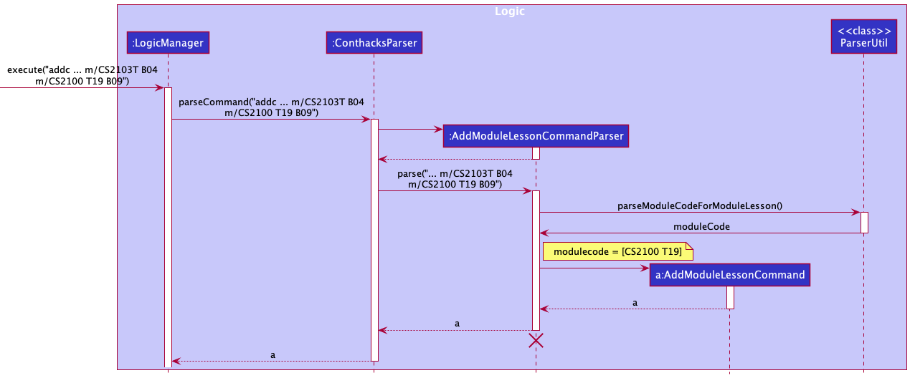
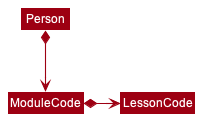
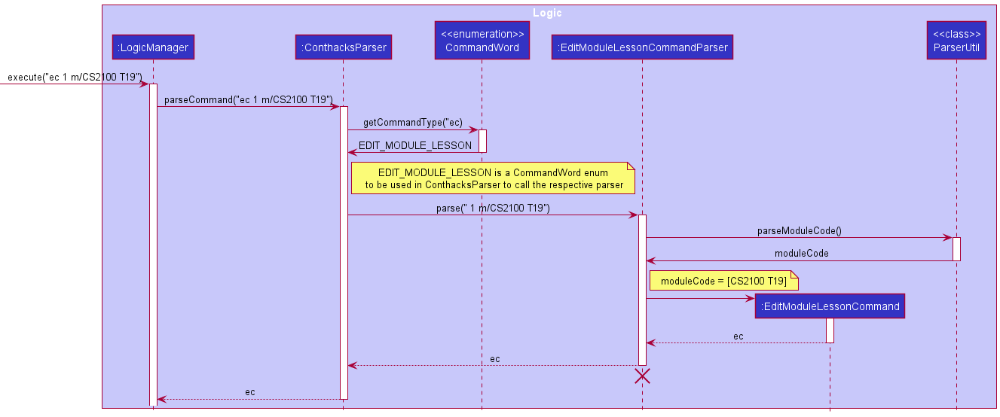

* Table of Contents
{:toc}

--------------------------------------------------------------------------------------------------------------------

## **Acknowledgements**

* {list here sources of all reused/adapted ideas, code, documentation, and third-party libraries -- include links to the original source as well}

--------------------------------------------------------------------------------------------------------------------

## **Setting up, getting started**

Refer to the guide [_Setting up and getting started_](SettingUp.md).

--------------------------------------------------------------------------------------------------------------------

## **Design**

<div markdown="span" class="alert alert-primary">

:bulb: **Tip:** The `.puml` files used to create diagrams in this document can be found in the [diagrams](https://github.com/AY2122S1-CS2103T-T09-2/tp/tree/master/docs/diagrams) folder. Refer to the [_PlantUML Tutorial_ at se-edu/guides](https://se-education.org/guides/tutorials/plantUml.html) to learn how to create and edit diagrams.
</div>

### Architecture


The ***Architecture Diagram*** given above explains the high-level design of the App.

Given below is a quick overview of main components and how they interact with each other.

**Main components of the architecture**

**`Main`** has two classes called [`Main`](https://github.com/AY2122S1-CS2103T-T09-2/tp/blob/master/src/main/java/seedu/address/Main.java) and [`MainApp`](https://github.com/AY2122S1-CS2103T-T09-2/tp/blob/master/src/main/java/seedu/address/MainApp.java). It is responsible for,
* At app launch: Initializes the components in the correct sequence, and connects them up with each other.
* At shut down: Shuts down the components and invokes cleanup methods where necessary.

[**`Commons`**](#common-classes) represents a collection of classes used by multiple other components.

The rest of the App consists of four components.

* [**`UI`**](#ui-component): The UI of the App.
* [**`Logic`**](#logic-component): The command executor.
* [**`Model`**](#model-component): Holds the data of the App in memory.
* [**`Storage`**](#storage-component): Reads data from, and writes data to, the hard disk.


**How the architecture components interact with each other**

The *Sequence Diagram* below shows how the components interact with each other for the scenario where the user issues the command `delete 1`.


Each of the four main components (also shown in the diagram above),

* defines its *API* in an `interface` with the same name as the Component.
* implements its functionality using a concrete `{Component Name}Manager` class (which follows the corresponding API `interface` mentioned in the previous point.

For example, the `Logic` component defines its API in the `Logic.java` interface and implements its functionality using the `LogicManager.java` class which follows the `Logic` interface. Other components interact with a given component through its interface rather than the concrete class (reason: to prevent outside component's being coupled to the implementation of a component), as illustrated in the (partial) class diagram below.


The sections below give more details of each component.

### UI component

The **API** of this component is specified in [`Ui.java`](https://github.com/AY2122S1-CS2103T-T09-2/tp/blob/master/src/main/java/seedu/address/ui/Ui.java)


The UI consists of a `MainWindow` that is made up of parts e.g.`CommandBox`, `ResultDisplay`, `PersonListPanel`, `ModuleLessonListPanel`, `StatusBarFooter` etc. All these, including the `MainWindow`, inherit from the abstract `UiPart` class which captures the commonalities between classes that represent parts of the visible GUI.

The `UI` component uses the JavaFx UI framework. The layout of these UI parts are defined in matching `.fxml` files that are in the `src/main/resources/view` folder. For example, the layout of the [`MainWindow`](https://github.com/AY2122S1-CS2103T-T09-2/tp/blob/master/src/main/java/seedu/address/ui/MainWindow.java) is specified in [`MainWindow.fxml`](https://github.com/AY2122S1-CS2103T-T09-2/tp/blob/master/src/main/resources/view/MainWindow.fxml)

The `UI` component,

* executes user commands using the `Logic` component.
* listens for changes to `Model` data so that the UI can be updated with the modified data.
* keeps a reference to the `Logic` component, because the `UI` relies on the `Logic` to execute commands.
* depends on some classes in the `Model` component, as it displays `Person` and `ModuleLesson` objects residing in the `Model`.

### Logic component

**API** : [`Logic.java`](https://github.com/AY2122S1-CS2103T-T09-2/tp/blob/master/src/main/java/seedu/address/logic/Logic.java)

Here's a (partial) class diagram of the `Logic` component:


How the `Logic` component works:
1. When `Logic` is called upon to execute a command, it uses the `ConthacksParser` class to parse the user command.
1. This results in a `Command` object (more precisely, an object of one of its subclasses e.g., `AddPersonCommand`) which is executed by the `LogicManager`.
1. The command can communicate with the `Model` when it is executed (e.g. to add a person).
1. The result of the command execution is encapsulated as a `CommandResult` object which is returned back from `Logic`.

The Sequence Diagram below illustrates the interactions within the `Logic` component for the `execute("delete 1")` API call.


<div markdown="span" class="alert alert-info">:information_source: **Note:** The lifeline for `DeletePersonCommandParser` should end at the destroy marker (X) but due to a limitation of PlantUML, the lifeline reaches the end of diagram.
</div>

Here are the other classes in `Logic` (omitted from the class diagram above) that are used for parsing a user command:


How the parsing works:
* When called upon to parse a user command, the `ConthacksParser` class uses `CommandWord` to find out which `Command` the user wants. `ConthacksParser` then creates the required `XYZCommandParser` (`XYZ` is a placeholder for the specific command name e.g., `AddPersonCommandParser`) which uses the other classes shown above to parse the user command and create a `XYZCommand` object (e.g., `AddPersonCommand`) which the `ConthacksParser` returns back as a `Command` object.
* All `XYZCommandParser` classes (e.g., `AddPersonCommandParser`, `DeletePersonCommandParser`, ...) inherit from the `Parser` interface so that they can be treated similarly where possible e.g, during testing.

### Model component
**API** : [`Model.java`](https://github.com/AY2122S1-CS2103T-T09-2/tp/blob/master/src/main/java/seedu/address/model/Model.java)


The `Model` component,

* stores contHACKS data i.e., all `Person` and `ModuleLesson` objects (which are contained in a `UniquePersonList` and `UniqueModuleLessonList` object respectively).
* stores the currently 'selected' `Person` and `ModuleLesson` objects (e.g., results of a search query) as a separate _filtered_ list which is exposed to outsiders as an unmodifiable `ObservableList<Person>` and `ObservableList<ModuleLesson>` that can be 'observed' e.g. the UI can be bound to those lists so that the UI automatically updates when the data in the lists change.
* stores a `UserPref` object that represents the user’s preferences. This is exposed to the outside as a `ReadOnlyUserPref` objects.
* does not depend on any of the other three components (as the `Model` represents data entities of the domain, they should make sense on their own without depending on other components)

### Storage component

**API** : [`Storage.java`](https://github.com/AY2122S1-CS2103T-T09-2/tp/blob/master/src/main/java/seedu/address/storage/Storage.java)


The `Storage` component,
* can save both contHACKS data and user preference data in json format, and read them back into corresponding objects.
* inherits from both `ConthacksStorage` and `UserPrefStorage`, which means it can be treated as either one (if only the functionality of only one is needed).
* depends on some classes in the `Model` component (because the `Storage` component's job is to save/retrieve objects that belong to the `Model`)

### Common classes

Classes used by multiple components are in the `seedu.address.commons` package.

--------------------------------------------------------------------------------------------------------------------

## **Implementation**

This section describes some noteworthy details on how certain features are implemented.

### Add feature (With `ModuleCode`)
The add feature allows user to add a `Person` or `ModuleLesson` into contHACKS. Both `Person` and `ModuleLesson` contains the member `ModuleCode`. This section elaborates on the implementation of `ModuleCode` and how it affects the add feature. 

#### About ModuleCode
`ModuleCode` is one of the parameters that must be included when adding a `Person` or `ModuleLesson`. `ModuleCode` contains the following members:
```Java
public final String value;
public final Set<LessonCode> lessonCodes;
```
The `value` refers to the module code of a NUS module `e.g. "CS2100"`.
`LessonCode` also has a `value` that refers to the code of the lesson: tutorials, labs, sectionals, etc `e.g. "T12"`
`ModuleCode` has a set of `LessonCode` because a module in NUS can indeed have many lessons.

<div markdown="span" class="alert alert-primary">:information_source: **Note:**
There is a need to associate `LessonCode` with `ModuleCode` as we need to be able to identify which `ModuleCode` a `LessonCode` belongs to.
</div>

#### Implementation
There are some distinctions between a `Person` and `ModuleLesson`. A `Person` can have many `ModuleCode`, with each `ModuleCode` having multiple `LessonCode` while a `ModuleLesson` lesson can only have one `ModuleCode`, with that `ModuleCode` having one `LessonCode`.

##### Implementation for adding `Person`
Since a `Person` can have many `ModuleCode`, an input like: `add ... m/CS2100 T19 B04 m/CS2103T T09` is valid. The following sequence diagram shows how parsing the input `add ... m/CS2100 T19 B04 m/CS2103T T09` works successfully to return a `AddPersonCommand`:



Notice that the `AddPersonCommandParser` uses the method `parseModuleCodes()` to get a collection of `ModuleCode`.

##### Implementation for adding `ModuleLesson`
Since a `ModuleLesson` can only have one `ModuleCode` and one `LessonCode`, we need a way to enforce `lessonCodes.size() == 1` in `ModuleCode`. To achieve this, we only take the first `LessonCode` as the desired one. For example, the input `addc ... m/CS2100 T19 B09` would take `T19` as the `LessonCode` and ignore `B09`. On a similar note, to enforce having only one `ModuleCode`, we only consider the last occurrence of the parameter `m/`. For example, the input `addc ... m/CS2103T B04 m/CS2100 T19` would only consider `m/CS2100 T19` and ignore `m/CS2103T B04`. The following sequence diagram shows how parsing the input `addc ... m/CS2103T B04 m/CS2100 T19 B09` works successfully to return a `AddModuleLessonCommand` despite the extra `ModuleCode` and `LessonCode`:



Notice that the `AddModuleLessonCommandParser` uses the method `parseModuleCodeForModuleLesson()` instead of `parseModuleCodes()` used by `AddPersonCommandParser`. This is where the distinction lies between adding `Person` and `ModuleLesson` with `ModuleCode`.

#### Design considerations:

**Aspect: What should be associated with the `ModuleCode`:**

* **Alternative 1 (initial idea):** Have both `ModuleCode` and `LessonCode` be standalone classes associate with `Person` and `ModuleLesson`.
    * Pros: Easier to implement
    * Pros: Reduced coupling.
    * Cons: Unable to tell which `ModuleCode` a `LessonCode` belongs to when there are more than one `ModuleCode` and `LessonCode`. Have to find another way to make the association which would introduce dependencies and remove the pros of reduced coupling.

* **Alternative 2 (current version):** Have `ModuleCode` be associated with a set of `LessonCode`
    * Pros: Able to tell which `ModuleCode` a `LessonCode` belongs to
    * Pros: Some level of code reuse
    * Cons: Have to introduce checks to ensure `ModuleCode` only has one `LessonCode` when it is a member of `ModuleLesson`

* **Alternative 3:** Implement `ModuleCodeForPerson` and `ModuleCodeForModuleLesson`
    * Pros: No checks are required as `ModuleCodeForModuleLesson` can be implemented to only have one `LessonCode`
    * Cons: Low level of code reuse
    * Cons: Not extensible

<div markdown="span" class="alert alert-primary">:information_source: **Note:**
The above information is also applicable for the edit feature.
</div>

### Find feature 
Users are able to execute a command to find an existing person in contHACKS. 
contHACKS will parse the find command for keywords, and filters the list of contacts to be displayed. 
Upon a successful search, the person card will be returned and listed in the GUI. 


### Implementation
The find command returns contacts that matches the input keywords. Initially, it only returns contacts that fully matches the keywords.
Given the following example contact book:
* Contact #1: Jason
* Contact #2: Jasmine
* Contact #3: Bob

A search with the command `find n/Jas` would return nothing, as `Jas` is not a complete match with any of the names of the three contacts.

To better fit our target user, someone who wishes to work fast, we have decided to allow partial matches for the find command.
This is done by altering the condition in the search predicate, from accepting full word matches to accepting even partial word matches:

`return Arrays.stream(wordsInPreppedSentence).anyMatch(preppedWord::equalsIgnoreCase);`

changed to

`return Arrays.stream(wordsInPreppedSentence).anyMatch(x -> x.toLowerCase().contains(preppedWord.toLowerCase()));`

Also, to facilitate filtered searches, we have implemented finding using prefixes:
* `find n/` to find by name
* `find m/` to find by module code

Similar to other commands, this is done using a `argumentTokenizer` to parse for the above prefixes,
before the correct `Predicate` is instantiated and used for finding the contact.

#### Design considerations:

**Aspect: Previous and current version of find command:**

* **Alternative 1 (previous version):** Search keyword needs to match entirely.
    * Pros: Only the correct contact is returned.
    * Cons: Takes time to type entire names to find the contact you want.

* **Alternative 2 (current version):** Search keyword just needs to match partially.
    * Pros: Faster searches with just partial keywords.
    * Cons: Contacts you did not mean to retrieve are also displayed.

### Delete contact by batch feature

Users are able to execute a command to delete an existing module code in contHACKS. Upon successful deletion of the module code,
the module code will not exist in contHACKS thus all lesson codes, if any, under the module code will be deleted (module and lesson have a composition relationship).
The particular contact will only be deleted from contHACKS if it is not attached to any other module code.



An input to delete by `delete m/CS2103T` would delete all contacts that are tagged to CS2103T. If a contact has another module code, it will only delete the module code CS2103T tag.
This is to better fit our target audience as once a class is no longer relevant, enabling a batch delete is quick and helps to keep contHACKS organised.

#### Implementation

`DeletePersonCommand` implements the `execute()` method from the `Command` abstract class whereby upon execution, the method will delete the respective contacts in the model’s list of contacts if a valid module code is provided.

This is how the `DeletePersonCommand#execute()` method works upon execution:

1. The module code to be deleted is retrieved from the `DeletePersonCommand` created.
2. All contacts with the module code will be retrieved from the model by `Model#updateFilteredPersonList()` and `Model#getFilteredPersonList()`.
3. The module code is deleted by `DeletePersonCommand#deleteByModuleCode()`.
4. `DeletePersonCommand#deleteByModuleCode()` will call `Model#deletePerson` for contacts with attached to the module code to delete only otherwise `DeletePersonCommand#deleteModuleCodeTag` will be called.
5. The deletion is successful and a CommandResult is returned with an appropriate success message to indicate that the deletion was successful via the CommandUtil#getCommandResult() method.

The following sequence diagrams show how the delete by module code feature works successfully, using the example command `delete m/CS2103T`:


<div markdown="span" class="alert alert-info">:information_source: **Note:** The lifeline for `DeletePersonCommandParser` should end at the destroy marker (X) but due to a limitation of PlantUML, the lifeline reaches the end of diagram.
</div>


#### Design considerations:

**Aspect: Previous and current version of delete command:**

* **Alternative 1 (previous version):** Delete only supports one deletion at a time.
    * Pros: Deletes the particular intended contact.
    * Cons: Takes time to delete multiple contacts, does not fit our target audience that wants operations to be fast.

* **Alternative 2 (current version):** Delete supports batch deletion by module code as well.
    * Pros: Faster deletion while still supporting deletion by one index.
    * Cons: Not able to undo the deletion if the user deletes the wrong batch, it would take a long time to key all the information back in.

<div markdown="span" class="alert alert-primary">:information_source: **Note:**
The above information is also applicable for the delete lesson by batch feature.
</div>

### Aliases for different commands

Aliases are alternative words that you can use to perform the same command. There are a few default aliases provided for every command.
Users can choose to use their most preferred alias to perform the command they want.

#### Implementation

How the alias work is as such:

1. When `Logic` is called upon to execute a command, it calls the `ConthacksParser` class to parse the user command.
2. As `ConthacksParser` parses the user command, `ConthacksParser` separates the `commandWord` string from the rest of the arguments inside the user command string.
3. `ConthacksParser` will pass this `commandWord` string into `CommandWord` enum class which contains all the aliases for the different commands. Then, `CommandWord` will check if the `commandWord` string is an alias for any of our implemented commands.
4. If the alias is a legitimate alias for any of the `XYZCommand`, `CommandWord` class will return the respective `CommandWord` enum back to ConthacksParser, and ConthacksParser will use this enum to call the respective `XYZCommandParser` to call and creates the respective `XYZCommand` object.

The following sequence diagram show how the parsing of alias works, using the example `ec 1 m/CS2100 T19` 



**Aspect: Previous and current version of commandWord:**

* **Alternative 1 (previous version):** The `commandWord` string for a `XYZCommand` is stored as an attribute in the `XYZCommand` class.
    * Pros: Simple implementation for `ConthacksParser` to check which `XYZCommandParser` to call.
    * Cons: Very difficult to add more `commandWord` for any `XYZCommand`. If the `XYZCommand` has multiple possible `commandWord`, we will need to add all to the attributes of `XYZCommand` and checking one by one is very difficult. 

* **Alternative 2 (current version):** Shift all the `commandWord` string of every `XYZCommand` into a `CommandWord` enum class. One enum in the `CommandWord` can contains multiple `commandWord` string. 
    * Pros: Easy to add a new alias (new commandWord) for any of the command. 
    * Cons: The implementation is more complex than alternative 1.

--------------------------------------------------------------------------------------------------------------------

## **Documentation, logging, testing, configuration, dev-ops**

* [Documentation guide](Documentation.md)
* [Testing guide](Testing.md)
* [Logging guide](Logging.md)
* [Configuration guide](Configuration.md)
* [DevOps guide](DevOps.md)

--------------------------------------------------------------------------------------------------------------------

## **Appendix: Requirements**

### Product scope

**Target user profile**:
* student
* tech savvy
* is a Teaching Assistant (TA)
* does not have much time and wants to get things done fast
* lazy and do not want complicated steps


**Value proposition**:<br />
manage contacts faster than a typical mouse/GUI driven app<br />
with a categorization ability and streamlined creation/reading/updating/deleting processes.


### User stories

Priorities: High (must have) - `* * *`, Medium (nice to have) - `* *`, Low (unlikely to have) - `*`

| Priority | As a …​                                    | I want to …​                     | So that I can…​                                                        |
| -------- | ------------------------------------------ | ------------------------------ | ---------------------------------------------------------------------- |
| `* * *` | user | have access to a help page | know how to navigate the app |
| `* * *` | user | be able to create a new contact in contHACKS | save a contact |
| `* * *` | user | be able to find an existing contact in contHACKS | retrieve details about the contact |
| `* * *` | user | be able to update an existing contact in contHACKS | change information about my student if I made a mistake when adding them |
| `* * *` | user | be able to delete an unwanted contact in contHACKS | delete contacts whom I am not in contact with anymore |
| `* * *` | user | be able to see their contact details | refer the contact details to contact them |
| `* *` | user | be able to purge all current data | get rid of sample/experimental data I used for exploring the app |
| `* *` | user | be able to view my contacts in alphabetical order | see the contacts in more intuitive way |
| `* *` | user | be able to delete by module | delete all contacts linked to that module |
| `* *` | user | be able to delete contacts by groups | delete many contacts in one go |
| `* *` | user | be able to see the group a contact belongs to | know which lesson this person belongs to |
| `* *` | user | be able to search for contacts | save time have to scroll the entire contact list |
| `* *` | user | be able to retrieve data fast | get the contact in the fastest time possible |
| `* *` | user | be able to search by categories | ignore unrelated contacts |
| `* *` | user | be able to add a description about a contact | add more details about the contact |
| `* *` | user | be able to create a class card | see my current classes |
| `* *` | user | be able to see class details | recall the specifics of the class |
| `* *` | user | be able to update class details | ensure my class details are correct |
| `* *` | user | be able to delete a class | remove the classes that are irrelevant |
| `*` | expert user | be able to set up my own aliases | use the alias that I am more comfortable with |


### Use cases

(For all use cases below, the **System** is `contHACKS` and the **Actor** is the `user`, unless specified otherwise)

**Use case `UC01`: Adding a contact**

**MSS**

1. User requests to create a contact and inputs contact details
2. contHACKS creates the contact and displays information of the newly added contact

Use case ends.

**Extensions**
* 1a. User fails to provide any of the compulsory fields
    * 1a1. contHACKS shows an error message <br/>
    Use case ends.


* 1b. User inputs details in a wrong format
    * 1b1. contHACKS shows an error message <br/>
    * 1b2. User enters new input <br>
    Steps 1b1 - 1b2 are repeated until the input is in a correct format. <br>
    Use case resumes from step 2. <br>
    Use case ends.


* 1c. User inputs details with the same email/phone number/telegram handle as another existing contact in contHACKS.
  * 1c1. contHACKS disallow this operation and shows an error message <br>
  * 1c2. User enters new input <br>
  Steps 1c1 - 1c2 are repeated until the email/phone number/telegram handle is unique in the list of contacts. <br>
  Use case ends.


**Use case `UC02`: Finding a contact**

**MSS**

1. User requests to find a contact based on input details
2. contHACKS shows a list of contacts that matches the input details

Use case ends.

**Extensions**
* 1a. There are no contacts that matches the input details
    * 1a1. contHACKS displays an empty list <br/>
    Use case ends.


* 1b. User finds by name
    * 1b1. contHACKS displays a list of contacts with names that match the input <br/>
    Use case ends.


* 1c. User finds by module code
    * 1c1. contHACKS displays a list of contacts that are tagged with the module code <br/>
    Use case ends.


* 1d. User inputs details in a wrong format
    * 1d1. contHACKS shows an error message <br/>
    * 1d2. User enters new input <br>
    Steps 1d1 - 1d2 are repeated until the input is in a correct format. <br>
    Use case resumes from step 2. <br>
    Use case ends.


**Use case `UC03`: Editing a contact**

**MSS**

1. User requests to update a specific contact and inputs the new contact details
2. contHACKS updates the contact with the input details and displays the updated contact

Use case ends

**Extensions**
* 1a. Contact does not exist
    * 1a1. contHACKS shows an error message <br/>
    Use case ends.


* 1b. User inputs details in a wrong format
    * 1b1. contHACKS shows an error message <br>
    * 1b2. User enters new input <br>
    Steps 1b1 - 1b2 are repeated until the input is in a correct format. <br>
    Use case resumes from step 2. <br>
    Use case ends.


* 1c. User inputs email/phone/number/telegram handle as another existing contact in contHACKS
  * 1c1. contHACKS disallows this operation and shows an error message <br>
  Use case ends.

**Use case `UC04`: Deleting contact(s)**

**MSS**

1. User requests to list all contacts (`UC05`) or find contacts (`UC02`) 
2. User requests to delete specific contact(s) in the shown list
3. contHACKS deletes the contact(s) and displays the updated contact list

Use case ends.

**Extensions**
* 1a. Contact does not exist
    * 1a1. contHACKS shows an error message <br/>
      Use case ends.
* 1b. The index provided is invalid
  * 1b1. contHACKS displays an invalid index error message. <br>
  Use case ends.


**Use case `UC05`: Listing the contact list**

**MSS**

1. User requests to list the whole contact list
2. contHACKS displays the whole contact list

Use case ends.


**Use case `UC06`: Clearing all contacts**

**MSS**

1. User requests to clear all contacts
2. contHACKS deletes all the contacts and displays an empty contact list

Use case ends.

**Use case `UC06`: Adding a lesson**

**MSS**

1. User requests to create a lesson and inputs lesson details
2. contHACKS creates the lesson and displays information of the newly added lesson

Use case ends.

**Extensions**
* 1a. User fails to provide any of the compulsory fields
    * 1a1. contHACKS shows an error message <br/>
      Use case ends.


* 1b. User inputs details in a wrong format
    * 1b1. contHACKS shows an error message <br/>
    * 1b2. User enters new input <br>
      Steps 1b1 - 1b2 are repeated until the input is in a correct format. <br>
      Use case resumes from step 2. <br>
      Use case ends.


* 1c. User inputs details with the same module code and lesson code as another existing lesson in contHACKS.
    * 1c1. contHACKS disallow this operation and shows an error message <br>
    * 1c2. User enters new input <br>
      Steps 1c1 - 1c2 are repeated until module code/lesson code is unique in the list of lessons. <br>
      Use case ends.


**Use case `UC07`: Finding a lesson**

**MSS**

1. User requests to find a lesson based on input details
2. contHACKS shows a list of lessons that matches the input details

Use case ends.

**Extensions**
* 1a. There are no lessons that matches the input details
    * 1a1. contHACKS displays an empty list <br/>
      Use case ends.


* 1b. User finds by module code
    * 1b1. contHACKS displays a list of lessons that are tagged with the module code <br/>
      Use case ends.

* 1c. User finds by day 
  * 1c1. contHACKS displays a list of lessons that are on this day


* 1d. User inputs details in a wrong format
    * 1d1. contHACKS shows an error message <br/>
    * 1d2. User enters new input <br>
      Steps 1d1 - 1d2 are repeated until the input is in a correct format. <br>
      Use case resumes from step 2. <br>
      Use case ends.


**Use case `UC08`: Editing a lesson**

**MSS**

1. User requests to update a specific lesson and inputs the new lesson details
2. contHACKS updates the lesson with the input details and displays the updated lesson

Use case ends.

**Extensions**
* 1a. Lesson does not exist
    * 1a1. contHACKS shows an error message <br/>
      Use case ends.


* 1b. User inputs details in a wrong format
    * 1b1. contHACKS shows an error message <br>
    * 1b2. User enters new input
      Steps 1b1 - 1b2 are repeated until the input is in a correct format. <br>
      Use case resumes from step 2.
      Use case ends.


* 1c. User inputs module code and lesson code that is the same as another existing lesson in contHACKS
    * 1c1. contHACKS disallows this operation and shows an error message <br>
      Use case ends.

**Use case `UC09`: Deleting lesson(s)**

**MSS**

1. User requests to list all lessons (`UC10`) or find lessons (`UC07`)
2. User requests to delete specific lesson(s) in the shown list
3. contHACKS deletes the lesson(s) and displays the updated lesson list

Use case ends

**Extensions**
* 1a. Lesson does not exist
    * 1a1. contHACKS shows an error message <br/>
      Use case ends.
  
* 1b. The index provided is invalid
  * 1b1. contHACKS displays an invalid index error message. <br>
    Use case ends.


**Use case `UC10`: Listing the lesson list**

**MSS**

1. User requests to list the whole lesson list
2. contHACKS displays the whole lesson list

Use case ends.


**Use case `UC11`: Clearing all lessons**

**MSS**

1. User requests to clear all lessons
2. contHACKS deletes all the lessons and displays an empty lesson list

Use case ends.


**Use case `UC12`: Accessing help manual**

**MSS**

1. User requests for a help manual
2. contHACKS displays the help manual

Use case ends.

**Use case `UC13`: Exiting the application**

**MSS**

1. User requests to exit the application
2. contHACKS closes

Use case ends.


### Non-Functional Requirements

1.  Should work on any _mainstream OS_ as long as it has Java `11` or above installed.
2.  Should be able to hold up to 1000 persons without a noticeable sluggishness in performance for typical usage.
3.  A user with above average typing speed for regular English text (i.e. not code, not system admin commands) should be able to accomplish most of the tasks faster using commands than using the mouse.
4.  The user should have basic knowledge of the Command Line Interface to operate the application smoothly.
5.  Should be able to hold more than 100 contacts with no noticeable drop in performance.

*{More to be added}*

### Glossary

* **Mainstream OS**: Windows, Linux, Unix, OS-X
* **Tag**: A categorisation given to a contact


--------------------------------------------------------------------------------------------------------------------

## **Appendix: Instructions for manual testing**

Given below are instructions to test the app manually.

<div markdown="span" class="alert alert-info">:information_source: **Note:** These instructions only provide a starting point for testers to work on;
testers are expected to do more *exploratory* testing.

</div>

### Launch and shutdown

1. Initial launch

   1. Download the jar file and copy into an empty folder

   1. Double-click the jar file Expected: Shows the GUI with a set of sample contacts. The window size may not be optimum.

2. Saving window preferences

   1. Resize the window to an optimum size. Move the window to a different location. Close the window.

   2. Re-launch the app by double-clicking the jar file.<br>
       Expected: The most recent window size and location is retained.

### Adding a person

1. Prerequisites: None.

2. Test case: `add n/Ben e/ben@example.com m/CS2103T T11 B04 p/9123456 h/@Benny`<br>
      Expected: The person with the fields entered should be added into the contact list panel. The module code `CS2103T [T11 B04]` should be rendered.

3. Test case: `add n/Casey e/casey@example.com m/CS2103T p/81234567 h/@caaaasey`<br>
      Expected: The person with the fields entered should be added into the displayed contacts. The module code `CS2103T` should be rendered.

4. Incorrect `add` command to try: `add add n/Ben e/ben@example.com m/CS2103T T11 B04 p/9123456 h/@Benny`<br>
      Expected: No person is added because the `add` command is provided twice.

### Adding a lesson

1. Prerequisites: None.

2. Test case: `addc m/CS2103T T12 d/4 t/09:00 10:00 r/Online`<br>
   Expected: The lesson with the fields entered would be added into the lesson list panel.

3. Incorrect `addc` command: `addc addc addc m/CS2103T T12 d/4 t/09:00 10:00`<br>
   Expected: No lesson is added because the `addc` command is provided twice.

### Finding a person

1. Prerequisites: There exists a contact named `Alex Yeoh` in the contact list, and no `Alexander` exists in the contact list.

2. Test case: `find n/le Y`<br>
   Expected: Contact with name `Alex Yeoh` is listed. 

3. Test case: `find n/alexander`<br>
   Expected: No contact is listed. No error is shown.

4. Incorrect find commands to try: `find`, `find alex`, `find n/`<br>
   Expected: No contact is listed. Error details shown in the result display. Text in the command box turns red.

### Finding a lesson

   1. Prerequisites: There exists a lesson with module code `CS1231` in the contact list, and no `CS1231S` exists in the contact list.

   2. Test case: `findc m/S123`<br>
         Expected: Lesson with module code `CS1231` is listed.

   3. Test case: `findc m/cs1231s`<br>
         Expected: No lesson is listed. No error is shown.

   4. Incorrect find commands to try: `findc`, `findc cs1231`, `findc m/`<br>
            Expected: No contact is listed. Error details shown in the result display. Text in the command box turns red.
       
### Editing a person

### Editing a lesson

1. Prerequisites: The lesson must exist in contHACKS and could be access via a valid index.

2. Test case: `editc 1 d/3`<br>
   Expected: The day of the first lesson shown in contHACKS will be changed to `Wednesday`

3. Test case: `editc -1 d/3`<br>
   Expected: An error message will be shown in the result display, showing that the index provided is invalid. Text in the command box turns red.

### Deleting a person

   1. Prerequisites: List all persons using the `list` command. Multiple persons in the list.

   2. Test case: `delete 1`<br>
      Expected: First contact is deleted from the list. Details of the deleted contact shown in the result display.

   3. Test case: `delete 0`<br>
      Expected: No person is deleted. Error details shown in the result display. Text in the command box turns red.

   4. Other incorrect delete commands to try: `delete`, `delete x` (where x is larger than the list size)<br>
      Expected: Similar to previous.

### Deleting a lesson

  1. Prerequisites: List all lessons using `listc`command . Multiple lessons in the list.

  2. Test case: `deletec 1`<br>
     Expected: First lesson is deleted from the list. Details of the deleted lesson shown in the result display.

  3. Test case: `deletec 0` <br>
     Expected: No lesson is deleted. Error details shown in the result display. Text in the command box turns red.

  4. Other incorrect delete commands to try: `deletec`, `deletec x` (where x is larger than the list size)<br>
     Expected: Similar to previous.
   
### Saving data

1. Dealing with missing/corrupted data files

   1. Go to `conthacks.json` under the `data` folder and add random symbols to any `moduleCode` fields. This is to corrupt the current save file.

   2. Double-click the jar file
   Expected: Shows the GUI with no data.
   
   3. Delete the `conthacks.json` file under the `data` folder.
   
   4. Double-click the jar file 
   Expected: Shows the GUI with newly populated sample data.
