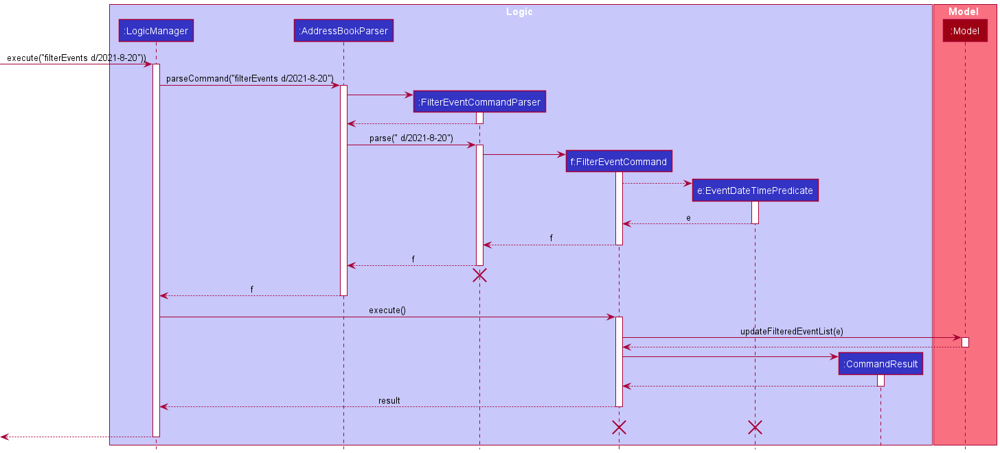
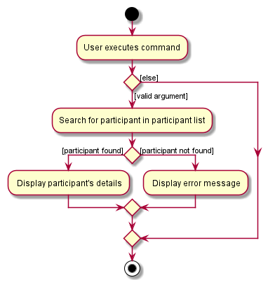

## Table of Contents
- [Table of Contents](#table-of-contents)
- [**Acknowledgements**](#acknowledgements)
- [**Introduction**](#introduction)
- [**Setting up, getting started**](#setting-up-getting-started)
- [**Design**](#design)
  - [Architecture](#architecture)
  - [UI component](#ui-component)
  - [Logic component](#logic-component)
  - [Model component](#model-component)
  - [Storage component](#storage-component)
  - [Common classes](#common-classes)
- [**Implementation**](#implementation)
    - [\[Completed\] Add Event feature](#completed-add-event-feature)
       - [Implementation Details](#implementation-details)
       - [Implementation Rationale](#implementation-rationale)
    - [\[Completed\] Remove Event feature](#completed-remove-event-feature)
       - [Implementation Details](#implementation-details)
       - [Design Considerations:](#design-considerations)
          - [Aspect: Specifying Event to be Removed:](#aspect-specifying-event-to-be-removed)
    - [\[Completed\] Filter Event feature](#completed-filter-event-feature)
      - [Implementation Details](#implementation-details)
      - [Implementation Rationale](#implementation-rationale)
      - [Design Considerations:](#design-considerations)
        - [Aspect: Criteria to filter by:](#aspect-criteria-to-filter-by)
        - [Aspect: With or without prefix:](#aspect-with-or-without-prefix)
    - [\[Completed\] View Participant's Details feature](#completed-view-participants-details-feature)
      - [Implementation Details](#implementation-details-1)
      - [Implementation Rationale](#implementation-rationale-1)
      - [Design Considerations:](#design-considerations-1)
        - [Aspect: Similar participant IDs:](#aspect-similar-participant-ids)
    - [\[Completed\] Add/Remove Participant to/from event by index](#completed-addremove-participant-tofrom-event-by-index)
      - [Implementation Details](#implementation-details-2)
      - [Implementation Rationale](#implementation-rationale-2)
    - [\[Completed\] View Event Details feature](#completed-view-event-details-feature)
      - [Implementation Details](#implementation-details-3)
      - [Implementation Rationale](#implementation-rationale-3)
      - [Design Considerations:](#design-considerations-2)
        - [Aspect: Similar Event names:](#aspect-similar-event-names)
    - [\[Proposed\] Undo/redo feature](#proposed-undoredo-feature)
      - [Proposed Implementation](#proposed-implementation)
      - [Design considerations:](#design-considerations-3)
    - [\[Proposed\] Data archiving](#proposed-data-archiving)
- [**Documentation, logging, testing, configuration, dev-ops**](#documentation-logging-testing-configuration-dev-ops)
- [**Appendix: Requirements**](#appendix-requirements)
  - [Product scope](#product-scope)
  - [User stories](#user-stories)
  - [Use cases](#use-cases)
  - [Non-Functional Requirements](#non-functional-requirements)
  - [Glossary](#glossary)
- [**Appendix: Instructions for manual testing**](#appendix-instructions-for-manual-testing)
  - [Launch and shutdown](#launch-and-shutdown)
  - [Deleting a participant](#deleting-a-participant)
  - [Saving data](#saving-data)
  

--------------------------------------------------------------------------------------------------------------------

## **Acknowledgements**

* {list here sources of all reused/adapted ideas, code, documentation, and third-party libraries -- include links to the original source as well}
* This project is based on the AddressBook-Level3 project created by the [SE-EDU initiative](https://se-education.org).

--------------------------------------------------------------------------------------------------------------------

## **Introduction**

Managera is a desktop application for managing your event details and its corresponding participant credentials. While it has a GUI, most of the user interactions happen using a CLI (Command Line Interface).

* For the detailed documentation of this project, see the **[Managera Product Website](https://ay2122s1-cs2103t-t10-2.github.io/tp/UserGuide.html)**.

--------------------------------------------------------------------------------------------------------------------

## **Setting up, getting started**

Refer to the guide [_Setting up and getting started_](SettingUp.md).

--------------------------------------------------------------------------------------------------------------------

## **Design**

:bulb: **Tip:** The `.puml` files used to create diagrams in this document can be found in the [diagrams](https://github.com/se-edu/addressbook-level3/tree/master/docs/diagrams/) folder. Refer to the [_PlantUML Tutorial_ at se-edu/guides](https://se-education.org/guides/tutorials/plantUml.html) to learn how to create and edit diagrams.

### Architecture

The ***Architecture Diagram*** given above explains the high-level design of the App.

Given below is a quick overview of main components and how they interact with each other.

**Main components of the architecture**

**`Main`** has two classes called [`Main`](https://github.com/se-edu/addressbook-level3/tree/master/src/main/java/seedu/address/Main.java) and [`MainApp`](https://github.com/se-edu/addressbook-level3/tree/master/src/main/java/seedu/address/MainApp.java). It is responsible for,
* At app launch: Initializes the components in the correct sequence, and connects them up with each other.
* At shut down: Shuts down the components and invokes cleanup methods where necessary.

[**`Commons`**](#common-classes) represents a collection of classes used by multiple other components.

The rest of the App consists of four components.

* [**`UI`**](#ui-component): The UI of the App.
* [**`Logic`**](#logic-component): The command executor.
* [**`Model`**](#model-component): Holds the data of the App in memory.
* [**`Storage`**](#storage-component): Reads data from, and writes data to, the hard disk.

**How the architecture components interact with each other**

The *Sequence Diagram* below shows how the components interact with each other for the scenario where the user issues the command `delete 1`.

Each of the four main components (also shown in the diagram above),

* defines its *API* in an `interface` with the same name as the Component.
* implements its functionality using a concrete `{Component Name}Manager` class (which follows the corresponding API `interface` mentioned in the previous point.

For example, the `Logic` component defines its API in the `Logic.java` interface and implements its functionality using the `LogicManager.java` class which follows the `Logic` interface. Other components interact with a given component through its interface rather than the concrete class (reason: to prevent outside component's being coupled to the implementation of a component), as illustrated in the (partial) class diagram below.

The sections below give more details of each component.

### UI component

The **API** of this component is specified in [`Ui.java`](https://github.com/se-edu/addressbook-level3/tree/master/src/main/java/seedu/address/ui/Ui.java)

The UI consists of a `MainWindow` that is made up of parts e.g.`CommandBox`, `ResultDisplay`, `ParticipantListPanel`, `StatusBarFooter` etc. All these, including the `MainWindow`, inherit from the abstract `UiPart` class which captures the commonalities between classes that represent parts of the visible GUI.

The `UI` component uses the JavaFx UI framework. The layout of these UI parts are defined in matching `.fxml` files that are in the `src/main/resources/view` folder. For example, the layout of the [`MainWindow`](https://github.com/se-edu/addressbook-level3/tree/master/src/main/java/seedu/address/ui/MainWindow.java) is specified in [`MainWindow.fxml`](https://github.com/se-edu/addressbook-level3/tree/master/src/main/resources/view/MainWindow.fxml)

The `UI` component,

* executes user commands using the `Logic` component.
* listens for changes to `Model` data so that the UI can be updated with the modified data.
* keeps a reference to the `Logic` component, because the `UI` relies on the `Logic` to execute commands.
* depends on some classes in the `Model` component, as it displays `Person` object residing in the `Model`.

### Logic component

**API** : [`Logic.java`](https://github.com/se-edu/addressbook-level3/tree/master/src/main/java/seedu/address/logic/Logic.java)

Here's a (partial) class diagram of the `Logic` component:

How the `Logic` component works:
1. When `Logic` is called upon to execute a command, it uses the `AddressBookParser` class to parse the user command.
1. This results in a `Command` object (more precisely, an object of one of its subclasses e.g., `AddCommand`) which is executed by the `LogicManager`.
1. The command can communicate with the `Model` when it is executed (e.g. to add a person).
1. The result of the command execution is encapsulated as a `CommandResult` object which is returned back from `Logic`.

The Sequence Diagram below illustrates the interactions within the `Logic` component for the `execute("delete 1")` API call.

:information_source: **Note:** The lifeline for `DeleteCommandParser` should end at the destroy marker (X) but due to a limitation of PlantUML, the lifeline reaches the end of diagram.

Here are the other classes in `Logic` (omitted from the class diagram above) that are used for parsing a user command:

How the parsing works:
* When called upon to parse a user command, the `AddressBookParser` class creates an `XYZCommandParser` (`XYZ` is a placeholder for the specific command name e.g., `AddCommandParser`) which uses the other classes shown above to parse the user command and create a `XYZCommand` object (e.g., `AddCommand`) which the `AddressBookParser` returns back as a `Command` object.
* All `XYZCommandParser` classes (e.g., `AddCommandParser`, `DeleteCommandParser`, ...) inherit from the `Parser` interface so that they can be treated similarly where possible e.g, during testing.

### Model component
**API** : [`Model.java`](https://github.com/se-edu/addressbook-level3/tree/master/src/main/java/seedu/address/model/Model.java)

The `Model` component,

* stores the address book data i.e., all `Participant` objects (which are contained in a `UniqueParticipantList` object).
* stores the currently 'selected' `Participant` objects (e.g., results of a search query) as a separate _filtered_ list which is exposed to outsiders as an unmodifiable `ObservableList<Participant>` that can be 'observed' e.g. the UI can be bound to this list so that the UI automatically updates when the data in the list change.
* stores a `UserPref` object that represents the user’s preferences. This is exposed to the outside as a `ReadOnlyUserPref` objects.
* does not depend on any of the other three components (as the `Model` represents data entities of the domain, they should make sense on their own without depending on other components)

:information_source: **Note:** An alternative (arguably, a more OOP) model is given below. It has a `Tag` list in the `AddressBook`, which `Participant` references. This allows `AddressBook` to only require one `Tag` object per unique tag, instead of each `Participant` needing their own `Tag` objects. 

### Storage component

**API** : [`Storage.java`](https://github.com/se-edu/addressbook-level3/tree/master/src/main/java/seedu/address/storage/Storage.java)

The `Storage` component,
* can save both address book data and user preference data in json format, and read them back into corresponding objects.
* inherits from both `AddressBookStorage` and `UserPrefStorage`, which means it can be treated as either one (if only the functionality of only one is needed).
* depends on some classes in the `Model` component (because the `Storage` component's job is to save/retrieve objects that belong to the `Model`)

### Common classes

Classes used by multiple components are in the `seedu.addressbook.commons` package.

--------------------------------------------------------------------------------------------------------------------

## **Implementation**

This section describes some noteworthy details on how certain features are implemented.

### \[Completed\] Add Event feature

This feature allows Managera users to create an event at the specified date and time.

#### Implementation Details

The `AddressBookParser` is responsible for determining the type of `Command` to be created from user input,
we can simply add a new `commandType` case for `AddEventCommand` in `AddressBookParser`. 

The `AddEventCommandParser` reads the user's input and passes it to `ParserUtil` to ensure that the event's name, 
date and time are valid. Then, an Event is created with the returned `EventName`, `EventDate` and `EventTime` objects. 
This event will be supplied to the `addEventCommand` to be executed.

Since Managera employs a UniqueEventList, it should not have more than one Event with the same name. The `addressBook` 
will check if the given event already exists. If not, it will be successfully added to the `addressBook` through the model.

#### Implementation Rationale

As events may span a full day, we decided to implement time as an optional attribute of the Event. However, to accommodate
this, Event is implemented with abstractions EventName, EventDate and EventTime. These abstractions are helpful in ensuring
reliability of the program.

### \[Completed\] Remove Event feature

This feature allows Managera users to remove an existing event at a particular index of the displayed list.

#### Implementation Details

The `AddressBookParser` is responsible for determining the type of `Command` to be created from user input,
we can simply add a new `commandType` case for `RemoveEventCommand` in `AddressBookParser`.

The `RemoveEventCommandParser` reads the user's input and passes it to `ParserUtil` which returns an `Index`. This 
`Index` will be supplied to the `removeEventCommand` to be executed. 

When the command is executed, there is a check to ensure the index is within the range of the displayed list. 

#### Design Considerations:
##### Aspect: Specifying Event to be Removed: 

* **Alternative 1 (Current Choice)**: Remove by Index:
    * Pros:
        1. The index of the event in the currently displayed list can be directly used.
        2. Faster and more intuitive for users.
    * Cons:
        1. The index is independent of the Event, which may lead to an inconsistent user experience. 

* **Alternative 2**: Remove by Event ID:
    * Pros:
        1. Every Event will have a unique ID, leading to a consistent user experience. 
    * Cons:
        1. The IDs will not be displayed in sequential order and may approach large numbers, which becomes less user-friendly.
         
* **Alternative 3**: Remove by Event Name:
    * Pros:
        1. User can be more sure of the event they are removing, since it is referencing the Event name.
    * Cons:
        1. The user has to fully match the Event name, which is much more cumbersome. 

### \[Completed\] Filter Event feature

This feature allows Managera users to filter the event list by date of event and by time.

#### Implementation Details

The `AddressBookParser` is responsible for determining the type of `Command` to be created from user input, 
we can simply add a new `commandType` case for `FilterEventCommand` in `AddressBookParser`. 

Since this feature requires Managera to take in user input and determine if the filter is by:

1. Date only; or
2. Date and Time

A `FilterEventCommandParser` is made to be responsible for this purpose. The `FilterEventCommandParser` parses user's 
input and creates the `EventDateTimePredicate` which the `FilterEventCommand` will use to execute the filtering.
`EventDateTimePredicate` implements `Predicate<Event>` which can be passed to a `FilteredList<Event>` to filter the 
event list. 

The `FilterEventCommand` created by `FilterEventCommandParser` will contain the `EventDateTimePredicate` to filter the 
event list. When the command is executed, the `model` will filter the `FilteredList<Event>` using the 
`EventDateTimePredicate` and display only events that fulfils the `EventDateTimePredicate` contained in 
`FilterEventCommand`.

#### Implementation Rationale

With considerations to how the `Event` class is implemented, some events do not have time associated to them.
We feel that since all `Event` have a date associated through the `EventDate` class, filtering should be done primarily 
through date i.e. `EventDate`. However, understanding that users might want to filter by time too, it is included as an 
optional criteria for filtering.

#### Design Considerations:
##### Aspect: Criteria to filter by:

* **Alternative 1 (Current Choice)**: By date and optionally time:
  * Pros: 
    1. Filtering by "date only" allows users to see both events with or without time on the specific date.
    2. Greater flexibility on how specific users want to filter the event list by.
  * Cons:
    1. Unable to filter for only events that do not have time associated.

* **Alternative 2**: By Date and Time: (both fields compulsory)
  * Pros:
    1. Able to filter for only events that do not have time on a specific date.
  * Cons:
    1. Unable to get a more general filter for events occurring on a specific date.
    2. Compulsory time field is too specific and the number of events displayed for a filter attempt might be too low. 

##### Aspect: With or without prefix:

* **Alternative 1 (Current Choice)**: With prefixes:
  * Pros:
    1. Sequence of parameters can be randomized, more flexible command syntax.
    2. Clear to user which field is being keyed in.
    3. Easy to implement with support of existing classes.
  * Cons:
    1. This adds up to the number of prefixes already present in Managera which may be hard for users to remember.

* **Alternative 2**: Without prefix:
  * Pros:
    1. Clean and slightly shorter command syntax.
    2. Less prefix to remember.
  * Cons:
    1. Rigid command syntax.
    2. Requires more comprehensive implementation to deal with user input (E.g. Date Only or Date and Time)

The following is the sequence diagram for how a `FilterEventCommand` works internally.

### \[Completed\] View Participant's Details feature

This feature allows Managera users to look for a specific participant and view their details. The search is done using
the participant's ID since each participant has a unique ID.

#### Implementation Details

The `AddressBookParser` is responsible for determining the type of `Command` to be created from user input,
we can simply add a new `commandType` case for `ViewCommand` in `AddressBookParser`.

A `ViewCommandParser` parses the user's input and creates the `ParticipantIdMatchesGivenIdPredicate` which the 
`ViewCommand` will use to search for the participant. `ParticipantIdMatchesGivenIdPredicate` implements 
`Predicate<Participant>` which can be passed to a `FilteredList<Participant>` to filter out the participant. Since the
predicate searches for the exact match, it would return only one result in the filtered list.

The `ViewCommand` created by `ViewCommandParser` will contain the `ParticipantIdMatchesGivenIdPredicate` to filter
the participant list. When the command is executed, the `model` will filter the `FilteredList<Participant>` using
the `ParticipantIdMatchesGivenIdPredicate` and display the participant that fulfils the 
`ParticipantIdMatchesGivenIdPredicate` contained in `ViewCommand`.

#### Implementation Rationale

Since each participant has a unique ID, it provides a convenient way for the user to look for a specific participant if
matching ID is used as the criterion. The `findParticipant` command provides similar functionality, but returns a list 
of participants instead because it uses names, which are more imprecise. Hence, a separate command was decidedly
implemented to allow users the ability to sieve out a single participant for a more detailed view.

#### Design Considerations:
##### Aspect: Similar participant IDs:

* **Alternative 1 (Current Choice)**: Exact match:
    * Pros:
        1. The details of the specific participant are returned immediately, provided that the user's input is an exact
           match of the participant's ID.
        2. Simpler implementation, simpler for the participant to use.
    * Cons:
        1. The user has to know the exact ID of the participant otherwise the wrong participant may be found.

* **Alternative 2**: Find similar IDs:
    * Pros:
        1. A list of participants that contain the user's input in their IDs are returned, offering greater flexibility 
        if the user does not fully recall the exact ID of the participant they are looking for. The search can be 
           further refined by subsequent user input to narrow it down to the specific participant.
    * Cons:
        1. Significantly harder implementation.

The following is the sequence diagram for how a `ViewCommand` works internally.

The following activity diagram summarizes what happens when a user executes a new command:

### \[Completed\] Add/Remove Participant to/from event by index

This feature allows Managera users to quickly add/remove participant to/from event according to the current filtered
 list of events and participant visible to user.

#### Implementation Details

The `AddressBookParser` is responsible for determining the type of `Command` to be created from user input, 
hence we add new `commandType` cases for `AddParticipantToEventByIndexCommand` and `RemoveParticipantFromEventByIndexCommand` in `AddressBookParser`

A `AddParticipantToEventByIndexParser` parses the user's input and obtain indexes for Participant and Event respectively. 
If the indexes given by the user are not zero-based indexes, a `ParseException` will be thrown before `AddParticipantByIndexParser` creates the command itself to prevent any further error. 
If all indexes are valid, a `AddParticipantByIndexCommand` will be created by the parser.

The `AddParticipantByIndexCommand` created by `AddParticipantToEventByIndexParser` contains 2 zero-based indexes. 
The first one is used to identify the `Participant` while the second is used to identify the `Event`. 
When the command is executed, the `model` first tries to obtain Participant at specified index (if unsuccessful, a `CommandException` will be thrown accordingly) and then event will be retrieved in the same manner (if unsuccessful, a `CommmandException` will be thrown accordingly). If the Event does not already contain the `Participant` object, the participant will be added to the event accordingly.
 Otherwise, a `CommandException` will be thrown.

A `RemoveParticipantFromEventByIndexParser` parses the user's input and obtain indexes for Participant and Event respectively. 
The workflow is nearly identical to `AddParticipantToEventByIndex`. It is only that instead of throwing `CommandException` if `Participant` object already exists in the event,
the `CommandException` will be thrown when `Participant` *doesn't* exist in the event. After all of that, the `Participant` object will be removed from the `Event`. 

#### Implementation Rationale

Since the command implies that the index of participant should come before event, there is no need for prefixes to be used as that would incur extra typing for the user and slow down the process.

The following activity diagrams summarise what happens when a user executes a new command in each case:

`AddParticipantToEventByIndex`

`RemoveParticipantFromEventByIndex`

### \[Completed\] View Event Details feature

This feature allows Managera users to find an Event by name and view its details. The search is done using the Event's 
name since Managera employs a UniqueEventList and will not have more than one Event with a given name.

#### Implementation Details

The `AddressBookParser` is responsible for determining the type of `Command` to be created from user input, hence we 
simply added a new `commandType` case for `ShowEventDetailsCommand` in `AddressBookParser`.

A `ShowEventDetailsCommandParser` parses the user's input and creates an `EventNamePredicate` which the
`ShowEventDetailsCommand` uses to search for the Event. `EventNamePredicate` implements `Predicate<Event>` which 
can be passed to a `FilteredList<Event>` to filter out the Event. Since the predicate searches for the Event with a name
that matches the predicate exactly, it returns only one result in the filtered list.

The `ShowEventDetailsCommand` created by `ShowEventDetailsParser` contains the `EventNamePredicate` used to filter the 
Event list. When the command is executed, the `model` obtains the Event by filtering the `FilteredList<Event>` using 
the `EventNamePredicate` and displays its details.

#### Implementation Rationale

Since each Event has a unique name, it provides a convenient way for the user to look for a specific Event if matching 
name is used as the criterion. 

Another command similar in function is `findEvent`, where the model will filter the existing Event list and display the 
Events with names that contain a given keyword. However, this implementation is meant for returning a list of possibly 
multiple Events. Since we are only looking for one particular Event, we decided that instead of filtering the Event list 
to display just the one Event, we leave the Event list untouched and simply return the Event details to the results 
display.

#### Design Considerations:
##### Aspect: Similar Event names:

* **Alternative 1 (Current Choice)**: Exact name match:
    * Pros:
        1. The details of the specific Event are returned immediately, provided that the user's input is an exact
           match of the Event's name.
        2. Simpler to implement.
    * Cons:
        1. The user has to know the exact name of the Event, otherwise no Event, or the wrong Event, may be found.
        2. If the Event name is long, typographical errors are likely, resulting in the desired Event not being found.

* **Alternative 2**: Find similar names, or by a given keyword:
    * Pros:
        1. A list of Events with names that contain the user's input are returned, offering greater flexibility
           if the user does not fully recall the entire name of the Event they are looking for. The search can be
           further refined by subsequent user input to narrow it down to the specific Event.
    * Cons:
        1. Significantly harder implementation.

The following is the sequence diagram for how a `ShowEventDetailsCommand` works internally.

The following activity diagram summarises what happens when a user executes a new command:

### \[Proposed\] Undo/redo feature

#### Proposed Implementation

The proposed undo/redo mechanism is facilitated by `VersionedAddressBook`. It extends `AddressBook` with an undo/redo history, stored internally as an `addressBookStateList` and `currentStatePointer`. Additionally, it implements the following operations:

* `VersionedAddressBook#commit()` — Saves the current address book state in its history.
* `VersionedAddressBook#undo()` — Restores the previous address book state from its history.
* `VersionedAddressBook#redo()` — Restores a previously undone address book state from its history.

These operations are exposed in the `Model` interface as `Model#commitAddressBook()`, `Model#undoAddressBook()` and `Model#redoAddressBook()` respectively.

Given below is an example usage scenario and how the undo/redo mechanism behaves at each step.

Step 1. The user launches the application for the first time. The `VersionedAddressBook` will be initialized with the initial address book state, and the `currentStatePointer` pointing to that single address book state.

Step 2. The user executes `delete 5` command to delete the 5th person in the address book. The `delete` command calls `Model#commitAddressBook()`, causing the modified state of the address book after the `delete 5` command executes to be saved in the `addressBookStateList`, and the `currentStatePointer` is shifted to the newly inserted address book state.

Step 3. The user executes `add n/David …​` to add a new person. The `add` command also calls `Model#commitAddressBook()`, causing another modified address book state to be saved into the `addressBookStateList`.

:information_source: **Note:** If a command fails its execution, it will not call `Model#commitAddressBook()`, so the address book state will not be saved into the `addressBookStateList`.

Step 4. The user now decides that adding the person was a mistake, and decides to undo that action by executing the `undo` command. The `undo` command will call `Model#undoAddressBook()`, which will shift the `currentStatePointer` once to the left, pointing it to the previous address book state, and restores the address book to that state.

:information_source: **Note:** If the `currentStatePointer` is at index 0, pointing to the initial AddressBook state, then there are no previous AddressBook states to restore. The `undo` command uses `Model#canUndoAddressBook()` to check if this is the case. If so, it will return an error to the user rather
than attempting to perform the undo.

The following sequence diagram shows how the undo operation works:

:information_source: **Note:** The lifeline for `UndoCommand` should end at the destroy marker (X) but due to a limitation of PlantUML, the lifeline reaches the end of diagram.

The `redo` command does the opposite — it calls `Model#redoAddressBook()`, which shifts the `currentStatePointer` once to the right, pointing to the previously undone state, and restores the address book to that state.

:information_source: **Note:** If the `currentStatePointer` is at index `addressBookStateList.size() - 1`, pointing to the latest address book state, then there are no undone AddressBook states to restore. The `redo` command uses `Model#canRedoAddressBook()` to check if this is the case. If so, it will return an error to the user rather than attempting to perform the redo.

Step 5. The user then decides to execute the command `list`. Commands that do not modify the address book, such as `list`, will usually not call `Model#commitAddressBook()`, `Model#undoAddressBook()` or `Model#redoAddressBook()`. Thus, the `addressBookStateList` remains unchanged.

Step 6. The user executes `clear`, which calls `Model#commitAddressBook()`. Since the `currentStatePointer` is not pointing at the end of the `addressBookStateList`, all address book states after the `currentStatePointer` will be purged. Reason: It no longer makes sense to redo the `add n/David …​` command. This is the behavior that most modern desktop applications follow.

The following activity diagram summarizes what happens when a user executes a new command:

#### Design considerations:

**Aspect: How undo & redo executes:**

* **Alternative 1 (current choice):** Saves the entire address book.
  * Pros: Easy to implement.
  * Cons: May have performance issues in terms of memory usage.

* **Alternative 2:** Individual command knows how to undo/redo by
  itself.
  * Pros: Will use less memory (e.g. for `delete`, just save the person being deleted).
  * Cons: We must ensure that the implementation of each individual command are correct.

_{more aspects and alternatives to be added}_

### \[Proposed\] Data archiving

_{Explain here how the data archiving feature will be implemented}_

--------------------------------------------------------------------------------------------------------------------

## **Documentation, logging, testing, configuration, dev-ops**

* [Documentation guide](Documentation.md)
* [Testing guide](Testing.md)
* [Logging guide](Logging.md)
* [Configuration guide](Configuration.md)
* [DevOps guide](DevOps.md)

--------------------------------------------------------------------------------------------------------------------

## **Appendix: Requirements**

### Product scope

**Target user profile**:

* has a need to manage a significant number of events and contacts
* prefer desktop apps over other types
* can type fast
* prefers typing to mouse interactions
* is reasonably comfortable using CLI apps

**Value proposition**: manage events and event participants faster than a typical mouse/GUI driven app

### User stories

Priorities: High (must have) - `* * *`, Medium (nice to have) - `* *`, Low (unlikely to have) - `*`

| Priority | As a …​                                    | I want to …​                     | So that I can…​                                                          |
| -------- | ------------------------------------------- | ---------------------------------- | ------------------------------------------------------------------------------ |
| `* * *`  | Event organiser                             | add an upcoming event to my list   | keep track of the details of all events I will be organising                   |
| `* * *`  | Event organiser                             | add a participant to an event      | keep track of the participants for an event                                    |
| `* * *`  | Event organiser with many concluded events  | delete events from my list         | keep my list of events tidy                                                    |
| `* * *`  | Event organiser                             | remove a participant from an event | maintain an accurate list of participants attending the event                  |
| `* * *`  | Event organiser that has concluded an event | mark the event as done             | safely ignore events in my list that have already passed                       |
| `* *`    | Event organiser with many events            | sort events by date and time       | keep track of which events occur when and prepare accordingly                  |
| `*`      | Event organiser with many participants      | find a participant by name         | I can contact the participant to inform him of updates or changes to the event |

*{More to be added}*

### Use cases

(For all use cases below, the **System** is `Managera` and the **Actor** is an `Event Organiser`, unless specified otherwise)

**Use case: UC01 - Add an Event**

**MSS**

1.  Event Organiser requests to add an Event.
2.  Managera adds the new Event with the given name and date to its Event list.

    Use case ends.

**Extensions**

* 1a. Managera detects missing details required for adding an Event.

    * 1a1. Managera shows an error message citing missing parameters.

      Use case resumes at step 1.

**Use case: UC02 - Add Participant to Event**

Preconditions: At least one Event and one Participant have been added to Managera.

**MSS**

1.  Event Organiser requests to add a Participant to an Event.
2.  Managera adds the Participant to the specified Event.

    Use case ends.

**Extensions**

* 1a. Managera detects missing details required for adding a Participant to an Event.

    * 1a1. Managera shows an error message citing missing parameters.

      Use case resumes at step 1.

* 1b. Managera cannot find the Participant.

    * 1b1. Managera shows an error message stating that the given ID does not correspond to an existing Participant.

      Use case resumes at step 1.

* 1c. Managera could not find the Event.

    * 1c1. Managera shows an error message stating that the given name does not correspond to an existing Event.

      Use case resumes at step 1.

**Use case: UC03 - Remove an Event**

Preconditions: At least one Event has been added to Managera.

**MSS**

1.  Event Organiser requests to remove an Event.
2.  Managera removes the Event from its Event list.

    Use case ends.

**Extensions**

* 1a. Managera could not find the specified Event.

    * 1a1. Managera shows an error message.

      Use case resumes at step 1.

**Use case: UC04 - Remove Participant from Event**

Preconditions: At least one Event and one Participant have been added to Managera. 

**MSS**

1.  Event Organiser requests to remove a Participant from an Event.
2.  Managera removes the Participant from the specified Event.

    Use case ends.

**Extensions**

* 1a. Managera could not find the Participant.

    * 1a1. Managera shows an error message stating that the Participant does not exist.

      Use case resumes at step 1.

* 1b. Managera could not find the Event.

    * 1b1. Managera shows an error message stating that the given name does not correspond to an existing Event.

      Use case resumes at step 1.

* 1c. Managera could not find the Participant in the specified Event.

    * 1c1. Managera shows an error message stating that the Participant is not taking part in the given Event.

      Use case resumes at step 1.

**Use case: UC05 - Mark Event as done**

Preconditions: At least one Event has been added to Managera.

**MSS**

1.  Event Organiser requests to mark an Event as done.
2.  Managera marks the Event in its Event list as done.

    Use case ends.

**Extensions**

* 1a. Managera detects missing details required to mark event as done.

    * 1a1. Managera shows an error message citing missing parameter.

      Use case resumes at step 1.

* 1b. Managera could not find the Event.

    * 1b1. Managera shows an error message stating that the given name does not correspond to an existing Event.

      Use case resumes at step 1.

**Use case: UC06 - Sort Events by time**

Preconditions: At least one Event has been added to Managera.

**MSS**

1.  Event Organiser requests to sort the current list of Events by time.
2.  Managera sorts the list of Events in chronological order and displays the list.

    Use case ends.

**Use case: UC07 - Find Participant and access details**

**Preconditions: At least one Participant has been added to Managera.**

**MSS**

1. Event Organiser requests Participant details.
2. Managera displays the details of all Participants with the given name.

    Use case ends.

**Extensions**

* 1a. Managera detects missing details for access to Participant's details.

    * 1a1. Managera shows an error message citing missing parameters.

      Use case resumes at step 1.

* 1b. Managera could not find the Participant.

    * 1b1. Managera shows an error message stating that the Participant does not exist.

      Use case resumes at step 1.

**Use case: UC08 - Filter Events by date**

Preconditions: At least one Event has been added to Managera.

**MSS**

1.  Event Organiser requests to filter Events from the current list of Events that take place on a specified date.
2.  Managera finds the Events that take place on the given date and displays them in a list.

    Use case ends.

**Extensions**

* 1a. Event Organiser omits date parameter required for filtering Events.

    * 1a1. Managera shows an error message citing missing parameter.

      Use case resumes at step 1.

**Use case: UC09 - Show Event details**

Preconditions: At least one Event has been added to Managera.

**MSS**

1.  Event Organiser requests Event details, specifying an Event name.
2.  Managera displays the details of the Event with the given name.

    Use case ends.

**Extensions**

* 1a. Managera detects missing details for showing Event details.

    * 1a1. Managera shows an error message citing missing parameter.

      Use case resumes at step 1.

* 1b. Managera could not find the Event.

    * 1b1. Managera shows an error message stating that the given name does not correspond to an existing Event.

      Use case resumes at step 1.

**Use case: UC10 - Show Event Participants**

Preconditions: At least one Event has been added to Managera.

**MSS**

1.  Event Organiser requests a list of Event Participants of a specific event.
2.  Managera displays the list of Participants of the Event.

    Use case ends.

**Extensions**

* 1a. Managera detects missing details to show Event participants.

    * 1a1. Managera shows an error message citing missing parameter.

      Use case resumes at step 1.

* 1b. Managera could not find the Event.

    * 1b1. Managera shows an error message stating that the given name does not correspond to an existing Event.

      Use case resumes at step 1.

### Non-Functional Requirements

1.  Should work on any _mainstream OS_ as long as it has Java `11` or above installed.
2.  Should be able to hold up to 1000 participants without a noticeable sluggishness in performance for typical usage. 
3.  Should be able to hold up to 100 events without a noticeable sluggishness in performance for typical usage.
4.  A user with above average typing speed for regular English text (i.e. not code, not system admin commands) should be able to accomplish most of the tasks faster using commands than using the mouse.
5.  Should work without having to use an installer or compiler.
6.  Should work without requiring an internet connection.
7.  Saved data should be kept in a single file to allow for easy transfer to a different device.
8.  The system should respond within two seconds.

*{More to be added}*

### Glossary

* **Mainstream OS**: Windows, Linux, Unix, OS-X
* **Command Line Interface (CLI)**: A CLI is a text-based interface that processes commands to a computer program in the form of lines of text.
* **Graphical User Interface (GUI)**: A GUI is a form of user interface through which users interact with electronic devices via visual indicator representations.

--------------------------------------------------------------------------------------------------------------------

## **Appendix: Instructions for manual testing**

Given below are instructions to test the app manually.

:information_source: **Note:** These instructions only provide a starting point for testers to work on;
testers are expected to do more *exploratory* testing.

### Launch and shutdown

1. Initial launch

   1. Download the jar file and copy into an empty folder

   1. Double-click the jar file Expected: Shows the GUI with a set of sample contacts. The window size may not be optimum.

1. Saving window preferences

   1. Resize the window to an optimum size. Move the window to a different location. Close the window.

   1. Re-launch the app by double-clicking the jar file. 
       Expected: The most recent window size and location is retained.

1. _{ more test cases …​ }_

### Deleting a participant

1. Deleting a participant while all participants are being shown

   1. Prerequisites: List all participants using the `list` command. Multiple participants in the list.

   1. Test case: `delete 1` 
      Expected: First contact is deleted from the list. Details of the deleted contact shown in the status message. Timestamp in the status bar is updated.

   1. Test case: `delete 0` 
      Expected: No participant is deleted. Error details shown in the status message. Status bar remains the same.

   1. Other incorrect delete commands to try: `delete`, `delete x`, `...` (where x is larger than the list size) 
      Expected: Similar to previous.

1. _{ more test cases …​ }_

### Saving data

1. Dealing with missing/corrupted data files

   1. _{explain how to simulate a missing/corrupted file, and the expected behavior}_

1. _{ more test cases …​ }_
