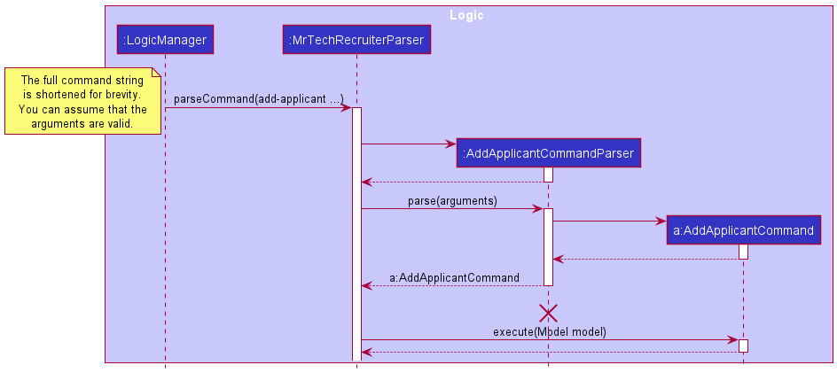
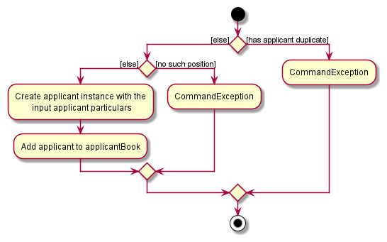
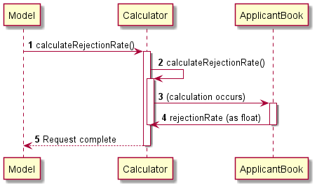
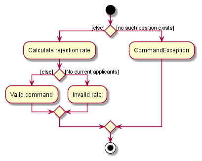

* Table of Contents
{:toc}
  
--------------------------------------------------------------------------------------------------------------------
## **Introduction**
MrTechRecruiter (MTR) is a standalone desktop app aimed in helping technology-related company recruiters overlook and administer job positions and applicants applying for various jobs in their companies.

With the advent of technology and related jobs, MTR uses Command-Line Interface (CLI) for quicker and easier typing for regular users while maintaining a exemplary Graphical User Interface (GUI).

--------------------------------------------------------------------------------------------------------------------

## **Acknowledgements**
* Adapted ideas from: [`AddressBook Level-3 (AB-3)`](https://se-education.org/addressbook-level3/)
* Logic Design for `Undo` from: [`Stack Overflow`](https://stackoverflow.com/questions/11530276/how-do-i-implement-a-simple-undo-redo-for-actions-in-java)  
* Documentation/Coding standard: [`SE Student Projects`](https://se-education.org/guides/conventions/java/intermediate.html)

--------------------------------------------------------------------------------------------------------------------

## **Setting up, getting started**

Refer to the guide [_Setting up and getting started_](SettingUp.md).

--------------------------------------------------------------------------------------------------------------------

## **Design**

:bulb: **Tip:** The `.puml` files used to create diagrams in this document can be found in the [diagrams](https://github.com/se-edu/addressbook-level3/tree/master/docs/diagrams/) folder. Refer to the [_PlantUML Tutorial_ at se-edu/guides](https://se-education.org/guides/tutorials/plantUml.html) to learn how to create and edit diagrams.

### Architecture

The ***Architecture Diagram*** given above explains the high-level design of the App.

Given below is a quick overview of main components and how they interact with each other.

**Main components of the architecture**

**`Main`** has two classes called [`Main`](https://github.com/se-edu/addressbook-level3/tree/master/src/main/java/seedu/address/Main.java) and [`MainApp`](https://github.com/se-edu/addressbook-level3/tree/master/src/main/java/seedu/address/MainApp.java). It is responsible for,
* At app launch: Initializes the components in the correct sequence, and connects them up with each other.
* At shut down: Shuts down the components and invokes cleanup methods where necessary.

[**`Commons`**](#common-classes) represents a collection of classes used by multiple other components.

The rest of the App consists of four components.

* [**`UI`**](#ui-component): The UI of the App.
* [**`Logic`**](#logic-component): The command executor.
* [**`Model`**](#model-component): Holds the data of the App in memory.
* [**`Storage`**](#storage-component): Reads data from, and writes data to, the hard disk.

**How the architecture components interact with each other**

The *Sequence Diagram* below shows how the components interact with each other for the scenario where the user issues the command `delete 1`.

Each of the four main components (also shown in the diagram above),

* defines its *API* in an `interface` with the same name as the Component.
* implements its functionality using a concrete `{Component Name}Manager` class (which follows the corresponding API `interface` mentioned in the previous point.

For example, the `Logic` component defines its API in the `Logic.java` interface and implements its functionality using the `LogicManager.java` class which follows the `Logic` interface. Other components interact with a given component through its interface rather than the concrete class (reason: to prevent outside component's being coupled to the implementation of a component), as illustrated in the (partial) class diagram below.

The sections below give more details of each component.

### UI component [need changes]

The **API** of this component is specified in [`Ui.java`](https://github.com/AY2122S1-CS2103-F10-1/tp/blob/master/src/main/java/seedu/address/ui/Ui.java)

The UI consists of a `MainWindow` that is made up of parts e.g.`CommandBox`, `ResultDisplay`, `PersonListPanel`, `StatusBarFooter` etc. All these, including the `MainWindow`, inherit from the abstract `UiPart` class which captures the commonalities between classes that represent parts of the visible GUI.

The `UI` component uses the JavaFx UI framework. The layout of these UI parts are defined in matching `.fxml` files that are in the `src/main/resources/view` folder. For example, the layout of the [`MainWindow`](https://github.com/se-edu/addressbook-level3/tree/master/src/main/java/seedu/address/ui/MainWindow.java) is specified in [`MainWindow.fxml`](https://github.com/se-edu/addressbook-level3/tree/master/src/main/resources/view/MainWindow.fxml)

The `UI` component,

* executes user commands using the `Logic` component.
* listens for changes to `Model` data so that the UI can be updated with the modified data.
* keeps a reference to the `Logic` component, because the `UI` relies on the `Logic` to execute commands.
* depends on some classes in the `Model` component, as it displays `Person` object residing in the `Model`.

### Logic component [need changes]

**API** : [`Logic.java`](https://github.com/AY2122S1-CS2103-F10-1/tp/blob/master/src/main/java/seedu/address/logic/Logic.java)

Here's a (partial) class diagram of the `Logic` component:

How the `Logic` component works:
1. When `Logic` is called upon to execute a command, it uses the `MrTechRecruiterParser` class to parse the user command.
1. This results in a `Command` object (more precisely, an object of one of its subclasses e.g., `AddCommand`) which is executed by the `LogicManager`.
1. The command can communicate with the `Model` when it is executed (e.g. to add a person).
1. The result of the command execution is encapsulated as a `CommandResult` object which is returned back from `Logic`.
1. While this command is happening, a record of the command's message and the original state of the model before the command occurred is recorded in the separate `Memento` class.
1. In the event the user wants to undo the changes from the command, the user can simply pass `undo` into the user command, which uses the `Undo` class. 
1. The abstract class `Command` is then called to return the `Memento` instance (via `Command#getMomento`) of that state of the model and restores the original state of the model.

The Sequence Diagram below illustrates the interactions within the `Logic` component for the `execute("delete 1")` API call.

:information_source: **Note:** The lifeline for `DeleteCommandParser` should end at the destroy marker (X) but due to a limitation of PlantUML, the lifeline reaches the end of diagram.

Here are the other classes in `Logic` (omitted from the class diagram above) that are used for parsing a user command:

How the parsing works:
* When called upon to parse a user command, the `AddressBookParser` class creates an `XYZCommandParser` (`XYZ` is a placeholder for the specific command name e.g., `AddCommandParser`) which uses the other classes shown above to parse the user command and create a `XYZCommand` object (e.g., `AddCommand`) which the `AddressBookParser` returns back as a `Command` object.
* All `XYZCommandParser` classes (e.g., `AddCommandParser`, `DeleteCommandParser`, ...) inherit from the `Parser` interface so that they can be treated similarly where possible e.g, during testing.

### Model component
**API** : [`Model.java`](https://github.com/AY2122S1-CS2103-F10-1/tp/blob/master/src/main/java/seedu/address/model/Model.java)

The `Model` component,

* stores the address book data i.e., all `Person` objects (which are contained in a `UniquePersonList` object).
* stores the currently 'selected' `Person` objects (e.g., results of a search query) as a separate _filtered_ list which is exposed to outsiders as an unmodifiable `ObservableList<Person>` that can be 'observed' e.g. the UI can be bound to this list so that the UI automatically updates when the data in the list change.
* stores a `UserPref` object that represents the user’s preferences. This is exposed to the outside as a `ReadOnlyUserPref` objects.
* does not depend on any of the other three components (as the `Model` represents data entities of the domain, they should make sense on their own without depending on other components)

:information_source: **Note:** An alternative (arguably, a more OOP) model is given below. It has a `Tag` list in the `AddressBook`, which `Person` references. This allows `AddressBook` to only require one `Tag` object per unique tag, instead of each `Person` needing their own `Tag` objects. 

### Storage component

**API** : [`Storage.java`](https://github.com/AY2122S1-CS2103-F10-1/tp/blob/master/src/main/java/seedu/address/storage/Storage.java)

The `Storage` component,
* can save both address book data and user preference data in json format, and read them back into corresponding objects.
* inherits from both `AddressBookStorage` and `UserPrefStorage`, which means it can be treated as either one (if only the functionality of only one is needed).
* depends on some classes in the `Model` component (because the `Storage` component's job is to save/retrieve objects that belong to the `Model`)

### Common classes

Classes used by multiple components are in the `seedu.addressbook.commons` package.

--------------------------------------------------------------------------------------------------------------------

## **Implementation**

This section describes some noteworthy details on how certain features are implemented.

**:information_source: Note:**  

* All commands that modify the `ApplicantBook` or `PositionBook` using the `undo` command. This is due to the introduction of the `Memento` class which captures the 
  existing model and success message from a command and stands by in the event of an `undo` scenario.
  
* All such commands will have a :heavy_check_mark: symbol beside it. Others will have no symbol displayed beside it.

* Such commands include add-applicant, add-position, delete-applicant & delete-position.

### Add applicant feature :heavy_check_mark:

The implementation of the add applicant feature is achieved by the `AddApplicantCommand` class. Just like all other
commands in MTR, it extends the Command class. The most important attribute that it has, is the `ApplicantParticulars`
attribute, which contains all the details of the applicant (Name, Phone, Email, Address,
Title of Position Applying to), parsed straight from the user input.

The `AddApplicantCommand#execute(Model model)` method will use guard clauses to check whether there is a duplicate
applicant, and whether the position (that this applicant is applying to) input by the user actually exists in
`positionBook`. If all parameters are valid, the `ApplicantParticulars` will then be passed to Model to add to
`applicantBook`, using the `Model#addApplicantWithParticulars` method.

Given below is an example usage scenario and how the add applicant feature behaves at each step.
Preconditions: The app is already launched and the appropriate position that the new applicant is applying to already
exist.

Step 1. The user inputs the command `add-applicant n/John Doe p/98765432 e/johnd@example.com a/John street,
block 123, #01-01 pos/software engineer`. The app parser will store all the user-input parameters into an
`applicantParticulars` object, and return the `AddApplicantCommand` instance.

The following sequence diagram shows the method invocation in this step.

Step 2. LogicManager will execute this `AddApplicantCommand` instance. This will invoke the
`Model#addApplicantWithParticulars` method.

Step 3. Here, we will retrieve the `position` object from `positionBook`, using the `positionTitle` that the user
input as argument, and create a new applicant instance using the `applicantParticulars` and `position` object. Then
we will add it to the `applicantBook`.

:information_source: **Note:** If any of the guard clauses fail, i.e. the
applicant already exist, or the position does not exist, an appropriate exception will be thrown and the applicant
will not be created.

The following activity diagram summarizes the actions taken when LogicManager executes the AddApplicantCommand:

#### Design considerations:

**Aspect: How and when the new applicant instance is created:**

* **Alternative 1 (current choice):** Saves all the user input as an applicantParticulars object.
    * Pros: Avoids the unnecessary clutter of passing multiple parameters to multiple method calls.
    * Cons: May have lead to greater coupling among classes.

* **Alternative 2:** Each user input parameter (e.g. Name, Address, PositionTitle etc.) are passed to multiple method
  calls.
    * Pros: Will reduce the usage of a new class, thereby reducing coupling.
    * Cons: This could lead to longer method signatures, longer code, and possibly a less OOP approach.
    
### Delete applicant feature :heavy_check_mark:

#### Implementation

The delete-applicant feature is achieved by the `DeleteApplicantCommand` class. Just like all other
commands in MTR, it extends the Command class. It is one of the simplest commands in the sense that the only parameter it
takes in is the index position of the applicant in the `ApplicantBook`. However, its implementation is not.

The `DeleteApplicantCommand#execute(Model model)` method will use the `Model#getFilteredApplicantList()` to indirectly
check whether the applicant exists by checking the size of the list against the index provided. The applicant to be deleted is then
obtained from the list via the standard `List#get()` and is removed from the model via `Model#deleteApplicant()`.

Given below is an example usage scenario and how the delete applicant feature behaves at each step.
Preconditions: The app is already launched and the applicant to be deleted exists in MTR.

Step 1: The user inputs the command `delete-applicant 1`. The app parser simply parses the index 1 and returns the `DeleteApplicantCommand` instance.

Step 2: After verifying that index 1 is valid, LogicManager executes this `DeleteApplicantCommand` instance, invoking the `Model#deleteApplicant()` method.

Step 3: This then calls the internal method for `ApplicantBook`, `ApplicantBook#removeApplicant()`, which then removes the applicant thereafter.

The following activity diagram summarizes the actions taken when LogicManager executes the DeleteApplicantCommand:
[to be added]

#### Design considerations:

**Aspect: How to access and delete an applicant**

* **Alternative 1 (current choice):** Let ModelManager handle the deletion but keep the ApplicantBook's methods separate from the ModelManager [to be added]
    * Pros: More accessible since ModelManager already contains the applicantBook, and reduces complication of code.
    * Cons: Higher coupling for ModelManager since it handles more commands.

* **Alternative 2:** [to be added]

### Edit applicant feature :heavy_check_mark:

#### Implementation
The implementation of the edit applicant feature uses the `EditApplicantCommand` class. A unique attribute for this 
class is that the user can simply edit any number of fields or attributes to a particular applicant, with at least 1 field being changed.

The `EditApplicantCommand` method takes in a non-null index and non-null description of the target applicant with the help of the `EditApplicantDescriptor` class.
It then checks if the input index is valid by comparing it to the size of the current applicant list in MTR, as well as ensuring it is a non-negative integer.
It also has guard clauses verifying that the description has a valid `Title` which is a valid position title in the current `positionBook`. A final check is done to check that the applicant
with the new description is not already existing in MTR. Once these criteria are met, the model then updates the target applicant with the new description via the
`Model#setApplicant` and `Model#updateFilteredApplicantList` methods.  

Given below is an example usage scenario and how the edit applicant feature behaves at each step.  
Preconditions: The app is already launched, the target applicant exists.

Step 1. User inputs command `edit-applicant 1 n/Jasmine Doe p/98761432 e/jdoe@example.com`.  The app parser will store 
all the user-input parameters into an `EditApplicantDescriptor` object.

Step 2. After verifying that index 1 and the new description are valid, LogicManager executes this `EditApplicantCommand` instance.
This invokes the `EditApplicantDescriptor#createEditedApplicant` method to create a new `Applicant` to replace the original one.

Step 3. A comparison is then done using the `Applicant#isSameApplicant` and `Model#hasApplicant` methods to ensure that the descriptions of the new applicant is different from the
target `Applicant` and that the target `Applicant` exists.

Step 4. Once step 3 is verified, we replace the existing applicant with the new one in the `applicantBook` via `Model#setApplicant` and reflect the updated list.

The following activity diagram summarizes the actions taken when LogicManager executes the EditApplicantCommand:
[to be added]

#### Design considerations:

**Aspect: How to access and delete an applicant**

* **Alternative 1 (current choice):** Have a separate class handle changing details of an applicant. [to be added]
    * Pros: Lowers coupling and makes logic of ModelManager simpler.
    * Cons: If a change is needed for the EditApplicantCommand, more classes need to be changed, making it more troublesome.

* **Alternative 2:** [to be added]

### Filter applicants feature

#### Implementation

The filter feature is achieved using the functionality of the `FilteredList` class built into JavaFX,
which filters its contents based on a specified `Predicate`.  
This `Predicate` is constructed from the filters specified whenever the `filter-applicant` command is called. 

The `FilterApplicantCommand#execute()` method has guard clauses to check that the contents of the input are valid through the
`FilterApplicantDescriptor#hasAnyFilter()` method. If contents are valid, it uses mapping via the `FilterApplicantCommand#applicantMatchesFilter`
method to filter out all applicants matching the given criteria. A new filtered list is now displayed on the MTR UI.  

Given below is an example usage scenario of the applicant filter feature.  
Preconditions: Applicant exists in MTR and valid filters provided. 

Step 1. User inputs command `filter-applicant status/rejected`. The app parser stores all information in a new `FilterApplicantDescriptor` instance.

Step 2. Model executes `FilterApplicantCommand#applicantMatchesFilter` method my mapping all applicants to check if they meet the criteria/information given.

Step 3. Results of this new filtered list is then passed to the model and is reflected onto the UI.

The following activity diagram summarizes the actions taken when LogicManager executes the FilterApplicantCommand:
[to be added]

*{More to be added}*

#### Rationale for implementation

The `Descriptor` pattern (used similarly in features such as the editing of applicants) comes in handy whenever its corresponding command accepts a variable number of arguments & unspecified arguments are assumed to be ignored.
For instance, the edit applicant feature accepts a variable number of fields to be edited, and leaves all unspecified fields untouched.

The filter feature fits in this category, as the user should be able to specify a variable number of filtering criteria,
and unspecified criteria should be left out of the filter.
Hence, the pattern is implemented here in `FilterApplicantDescriptor`, which is used to construct the `Predicate`.
It is also used to in the validation of the filtering criteria.

*{More to be added}*

#### Design considerations:

**Aspect: Accessing a list**

* **Alternative 1 (current choice):** Use of the Java Streams API to filter the applicants using chained calls to `Stream#filter`.
    * Pros: [to be added]
    * Cons: Does not make good use of the in-built functionality of `FilteredList`.

* **Alternative 2:** [to be added]

**Aspect: Filtering the inputs**

* **Alternative 1(current choice):** Separate class to handle parsing of filtering inputs.
    * Pros: Allows class with methods catered better to our needs (e.g. use of Optional so that fields not filtered by are untouched)
    * Cons: More time-consuming to create from scratch and creation of more test cases.

* **Alternative 2:** Modifying/improving original AB3 `FindCommand` and `FindCommandParser`.
    * Pros: Base code already exists and modifying it would take less time. Test cases also require little modification.
    * Cons: Requires understanding base of the code and high coupling exists.

*{More to be added}*

### Mark/update applicant's status feature :heavy_check_mark:
The mark feature is achieved using the `MarkApplicantStatusCommand` class. It is a simple command which only modifies the 
application status of the applicant for a particular position. It does so by taking in the applicant to be modified and the updated `ApplicationStatus`.

:information_source: **Note:** There are currently only 3 states for applicants: `Accepted`, `Rejected` and `Pending`.

The `MarkApplicantStatusCommand#execute` first confirms the existence of the target applicant to be marked using guard clauses.
If the applicant exists, the applicant is updated with the new application status and the model replaces this applicant.

Given below is an example usage scenario of the mark applicant feature.  
Preconditions: Applicant exists in MTR and valid mark status given.

Step 1. User inputs `mark john doe status/rejected`. The app parser stores the target applicant name and new `ApplicationStatus` internally in the `MarkApplicantStatusCommand` as private fields.

Step 2. LogicManager executes this `MarkApplicantStatusCommand` instance, invoking the `Model#getApplicantByNameIgnoreCase` method.

Step 3. After verifying that the applicant exists, a new applicant is created via `Applicant#markAs`, and the model calls the `Model#setApplicant` method replaces the existing applicant with the created one.

The following activity diagram summarizes the actions taken when LogicManager executes the MarkApplicantStatusCommand:
[to be added]

#### Design considerations:

**Aspect: Accessing the applicant's application status**

* **Alternative 1 (current choice):** Have application status as an enumeration under the `Application` class which serves as an association class between `Applicant` and `Position`.
    * Pros: Simplifies code base since it is accessible via the `Application` class directly.
    * Cons: Higher coupling for `Application` class.

* **Alternative 2:** Have application status in a separate class with enumerations inside it.
    * Pros: Separates code logic from Application, easier to digest and manipulate.
    * Cons: Increases complexity of code. Separate class has little usage.

### List applicants feature
The list applicants feature is achieved by the `ListApplicantCommand` class. Unlike most other commands in the MTR, 
it only has 1 action under the `ListApplicantCommand#execute` method besides creation of the command itself, which is 
`Model#updateFilteredApplicantList` which updates the UI to show all current applicants in the `applicantBook`.

If there are no current applicants in the `applicantBook`, the UI should appear empty.

Given below is an example usage scenario of the mark applicant feature.  
Preconditions: MTR has started up and is working.

Step 1. User inputs `list-applicant`.

Step 2. LogicManager executes this `ListApplicantCommand` instance, invoking the `Model#updateFilteredApplicantList`.

Step 3. The UI is updated to show the current list of applicants.
[display picture of current applicants here]

The following activity diagram summarizes the actions taken when LogicManager executes the ListApplicantCommand:
[to be added]

#### Design considerations:

**Aspect: Listing applicants**

* **Alternative 1 (current choice):** Create a separate command from the original AB3, but follow a similar style.
    * Pros: Better understanding of underlying code and how everything comes together.
    * Cons: More time-consuming.

* **Alternative 2:** Use existing `list` command in AB3 and adapt for MTR.
    * Pros: Many functions already in place and little modification is required.
    * Cons: Although less code to be added, due to coupling, more things are needed to be changed intricately and carefully (i.e. prone to errors/bugs).

### Add position feature :heavy_check_mark:

### Delete position feature :heavy_check_mark:

### Edit position feature :heavy_check_mark:

### List positions feature
The list positions feature is achieved by the `ListPositionCommand` class. Unlike most other commands in the MTR,
it only has 1 action under the `ListApplicantCommand#execute` method besides creation of the command itself, which is
`Model#updateFilteredPositionList` which updates the UI to show all current positions in the `positionBook`.

If there are no current positions in the `positionBook`, the UI should appear empty.

Given below is an example usage scenario of the mark applicant feature.  
Preconditions: MTR has started up and is working.

Step 1. User inputs `list-position`.

Step 2. LogicManager executes this `ListPositionCommand` instance, invoking the `Model#updateFilteredPositionList`.

Step 3. The UI is updated to show the current list of positions.
[display picture of current positions here]

The following activity diagram summarizes the actions taken when LogicManager executes the ListPositionCommand:
[to be added]

#### Design considerations:

**Aspect: Listing positions**

* **Alternative 1 (current choice):** Create a separate command from the original AB3, but follow a similar style.
    * Pros: Better understanding of underlying code and how everything comes together.
    * Cons: More time-consuming.

* **Alternative 2:** Use existing `list` command in AB3 and adapt for MTR.
    * Pros: Many functions already in place and little modification is required.
    * Cons: Due to coupling, requires changing code intricately and carefully (i.e. prone to errors/bugs).

### Rejection Rate feature

#### Proposed Implementation

The proposed rejection rate mechanism is facilitated by `Model` and `Calculator`.
The `Model` component checks if the position exists and accesses it, while `Calculator` calculates the rejection rate (if applicable).
Implements the following functions:
* `ModelManager#hasPositionWithTitle()`  — Checks if a position with a given title exists in the MTR.
* `Calculator#calculateRejectionRate()`  — Calculates the rejection rate of a position based on the number of total applicants and number of rejected applicants for that position.

These operations are exposed in the `Model` interface as `Model#hasPositionWithTitle()` and `Model#calculateRejectionRate` respectively.

Given below is an example usage scenario and how the rejection rate mechanism works at every step.  
Preconditions: Position exists in MTR and there is at least 1 applicant for this position (regardless of status).

Step 1. The user launches the application which is assumed to have some positions and corresponding applicants applying for them in the MTR.

Step 2. The user executes `rate pos/software engineer` command to calculate the rejection rate of Software Engineer in the PositionBook.
The `rate` command calls `Model#hasPositionWithTitle`, causing the model to check whether `Software Engineer` exists in the database as a Position.

Step 3. If the position exists, it will access the ApplicantBook via `Model#calculateRejectionRate()`, beginning a count of the number of applicants for the position as well as the number of rejected applicants of the same position.

Step 4. After these numbers have been obtained, the `Calculator` class is called and calculates via `Calculator#calculateRejectionRate`. This resulting floating point number is then the rejection rate of the position.

The following sequence diagram shows the method invocation in this step.

Step 5. Any command the user executes next simply refreshes the current state to its original state as shown in step 1.

#### Design considerations:

#### Aspect: How rejection rate executes:

* **Alternative 1** (current choice): Calculate the rejection rate only when needed. No storing required.
    * Pros: Saves a significant amount of space and reduces immutability. Implementation is simple.
    * Cons: A user could want to calculate many rejection rates frequently and hence not storing these values might have performance issues in the long run.
* **Alternative 2**: Store all rejection rates with their respective positions in a dictionary.
    * Pros: Accessing the rejection rates of a certain position will only require access to the dictionary and nothing else - limited accessibility.
      Also, accessing a rejection rate will be much quicker.
    * Cons: Potentially a large amount of space required, slowing performance. Also, the dictionary needs to be updated everytime an applicant's status changes or when a position/applicant is added/deleted,
      which could result in many inter-linked implementations for the dictionary, rendering it slow. May be difficult to show change in UI as well with many layers affected.

The following activity diagram summarizes the actions taken when LogicManager executes the RejectionRateCommand:

### Undo/redo feature

#### Proposed Implementation

The proposed undo/redo mechanism is facilitated by `VersionedAddressBook`. It extends `AddressBook` with an undo/redo history, stored internally as an `addressBookStateList` and `currentStatePointer`. Additionally, it implements the following operations:

* `VersionedAddressBook#commit()` — Saves the current address book state in its history.
* `VersionedAddressBook#undo()` — Restores the previous address book state from its history.
* `VersionedAddressBook#redo()` — Restores a previously undone address book state from its history.

These operations are exposed in the `Model` interface as `Model#commitAddressBook()`, `Model#undoAddressBook()` and `Model#redoAddressBook()` respectively.

Given below is an example usage scenario and how the undo/redo mechanism behaves at each step.

Step 1. The user launches the application for the first time. The `VersionedAddressBook` will be initialized with the initial address book state, and the `currentStatePointer` pointing to that single address book state.

Step 2. The user executes `delete 5` command to delete the 5th person in the address book. The `delete` command calls `Model#commitAddressBook()`, causing the modified state of the address book after the `delete 5` command executes to be saved in the `addressBookStateList`, and the `currentStatePointer` is shifted to the newly inserted address book state.

Step 3. The user executes `add n/David …​` to add a new person. The `add` command also calls `Model#commitAddressBook()`, causing another modified address book state to be saved into the `addressBookStateList`.

:information_source: **Note:** If a command fails its execution, it will not call `Model#commitAddressBook()`, so the address book state will not be saved into the `addressBookStateList`.

Step 4. The user now decides that adding the person was a mistake, and decides to undo that action by executing the `undo` command. The `undo` command will call `Model#undoAddressBook()`, which will shift the `currentStatePointer` once to the left, pointing it to the previous address book state, and restores the address book to that state.

:information_source: **Note:** If the `currentStatePointer` is at index 0, pointing to the initial AddressBook state, then there are no previous AddressBook states to restore. The `undo` command uses `Model#canUndoAddressBook()` to check if this is the case. If so, it will return an error to the user rather
than attempting to perform the undo.

The following sequence diagram shows how the undo operation works:

:information_source: **Note:** The lifeline for `UndoCommand` should end at the destroy marker (X) but due to a limitation of PlantUML, the lifeline reaches the end of diagram.

The `redo` command does the opposite — it calls `Model#redoAddressBook()`, which shifts the `currentStatePointer` once to the right, pointing to the previously undone state, and restores the address book to that state.

:information_source: **Note:** If the `currentStatePointer` is at index `addressBookStateList.size() - 1`, pointing to the latest address book state, then there are no undone AddressBook states to restore. The `redo` command uses `Model#canRedoAddressBook()` to check if this is the case. If so, it will return an error to the user rather than attempting to perform the redo.

Step 5. The user then decides to execute the command `list`. Commands that do not modify the address book, such as `list`, will usually not call `Model#commitAddressBook()`, `Model#undoAddressBook()` or `Model#redoAddressBook()`. Thus, the `addressBookStateList` remains unchanged.

Step 6. The user executes `clear`, which calls `Model#commitAddressBook()`. Since the `currentStatePointer` is not pointing at the end of the `addressBookStateList`, all address book states after the `currentStatePointer` will be purged. Reason: It no longer makes sense to redo the `add n/David …​` command. This is the behavior that most modern desktop applications follow.

The following activity diagram summarizes what happens when a user executes a new command:

#### Design considerations:

**Aspect: How undo & redo executes:**

* **Alternative 1 (current choice):** Saves the entire address book.
    * Pros: Easy to implement.
    * Cons: May have performance issues in terms of memory usage.

* **Alternative 2:** Individual command knows how to undo/redo by
  itself.
    * Pros: Will use less memory (e.g. for `delete`, just save the person being deleted).
    * Cons: We must ensure that the implementation of each individual command are correct.

_{more aspects and alternatives to be added}_

### \[Proposed\] Data archiving

_{Explain here how the data archiving feature will be implemented}_

--------------------------------------------------------------------------------------------------------------------

## **Documentation, logging, testing, configuration, dev-ops**

* [Documentation guide](Documentation.md)
* [Testing guide](Testing.md)
* [Logging guide](Logging.md)
* [Configuration guide](Configuration.md)
* [DevOps guide](DevOps.md)

--------------------------------------------------------------------------------------------------------------------

## **Appendix: Requirements**

### Product scope

**Target user profile**:

This product is for HR departments of tech companies that have a large number of applicants and complicated recruitment processes.

Additionally, the user:

* has a need to manage a significant number of contacts
* prefer desktop apps over other types
* can type fast
* prefers typing to mouse interactions
* is reasonably comfortable using CLI apps

**Value proposition**:

An efficient applicant management system for HR departments of technology companies to track application statuses and store applicant information.

### User stories

Priorities: High (must have) - `* * *`, Medium (nice to have) - `* *`, Low (unlikely to have) - `*`

| Priority | As a …​                                    | I want to …​                     | So that I can…​                                                        |
| -------- | ------------------------------------------ | ------------------------------ | ---------------------------------------------------------------------- |
| `* * *`  | general user                               | add new job positions | Add applicants to these positions.
| `* * *`  | general user                               | delete existing job positions | Remove irrelevant, out-of-date jobs.
| `* * *`  | general user                               | add a new applicant under a position      | Store his information within the system                                |
| `* * *`  | general user                               | delete an applicant from under a position | Remove applicants that are no longer related to this position          |
| `* * *`  | new user                                   | see usage instructions         | refer to instructions when I forget how to use the App                 |
| `* * *`  | user                                       | easily search all relevant applicants through keywords         | compare applicants' relevant information |
| `* *`    | user                                       | hide private applicant details   | ensure confidentiality of applicants' information. |
| `*`      | user with many applicants in the address book | sort applicants by name           | locate an applicant easily                                                 |
| `* * *`  | general user                               | view the average rejection rates of all job positions | gauge how competitive a job might be          |

*{More to be added}*

### Use cases
(For all use cases below, the **System** is `MrTechRecruiter` and the **Actor** is the `user`, unless specified otherwise)

**Use case: Add a new position**

**MSS**

1. User requests to add a new position, with necessary details
2. MrTechRecruiter adds the new position and shows a success message

   Use case ends.

* 1a. The format is invalid.

    * 1a1. MrTechRecruiter shows an error message.

  Use case ends.

**Use case: Edit a new position** [coming soon]

**Use case: Delete a new position**

**MSS**

1. User requests to list positions
2. MrTechRecruiter shows a list of positions
3. User requests to delete a specific position in the list
4. MrTechRecruiter deletes the position
   Use case ends.

**Extensions**

* 2a. The list is empty.

    * 2a1. MrTechRecruiter displays a message that no position is in the list.

  Use case ends.

* 3a The given name of the position is invalid.

    * 3a1. MrTechRecruiter shows an error message.

  Use case resumes at step 2.

**Use case: Add a new applicant**

**MSS**

1.  User requests to add a new applicant, with all the necessary parameters/details.
2.  MrTechRecruiter adds the new applicant and shows a success message.

    Use case ends.

**Extensions**

* 1a. The format is invalid.
    * 1a1. MrTechRecruiter shows an error message.

      Use case resumes at step 1.

**Use case: Edit a new applicant** [coming soon]

**Use case: Delete an applicant**

**MSS**

1.  User requests to list applicants.
2.  MrTechRecruiter shows a list of applicants.
3.  User requests to delete a specific applicant in the list using the exact name.
4.  MrTechRecruiter deletes the applicant.

    Use case ends.

**Extensions**

* 2a. The list is empty.

  Use case ends.

* 3a. The given name is invalid.

    * 3a1. MrTechRecruiter shows an error message.

      Use case resumes at step 2.

**Use case: Viewing average rejection rates for all job positions.**

**MSS**

1. User requests to see a list of all job positions
2. MrTechRecruiter displays the list of job positions, and their respective rejection rates.

   Use case ends.

**Extensions**

* 1a. No current job positions.

    * 1a1. MrTechRecruiter shows an 'No job positions' message.

      Use case ends.

* 2b. Job positions with relatively high rejection rates.

    * 2b1. MrTechRecruiter highlights the job positions with high rejection rates.

      Use case ends.

**Use case: Viewing average rejection rates for a particular job position.**

**MSS**

1. User searches for a particular job position using the 'find' function.
2. MrTechRecruiter displays the job position and its corresponding rejection rate.

   Use case ends.

**Extensions**

* 1a. Job position does not exist.

    * 1a1. MrTechRecruiter shows an 'No such job position found' message.

      Use case ends.

* 2b. Job position has relatively high rejection rate.

    * 2b1. MrTechRecruiter highlights its high rejection rate.

      Use case ends.

**Use case: Search for applicants through keywords**

**MSS**

1. User enters the keywords for MrTechRecruiter to search for.
2. MrTechRecruiter performs the search according to the keywords.
3. MrTechRecruiter displays the search results.

   Use case ends.

**Extensions**

* 1a. The list is empty.

      Use case ends.

* 2a. An invalid flag is specified.

    * 2a1. MrTechRecruiter shows an error message.

      Use case ends.

*{More to be added}*

**Use case: Calculate the rejection rate for a position** [coming soon]

### Non-Functional Requirements

1. Should work on any _mainstream OS_ as long as it has Java `11` or above installed.
2. Should be able to hold up to 1000 persons without a noticeable sluggishness in performance for typical usage.
3. A user with above average typing speed for regular English text (i.e. not code, not system admin commands) should be able to accomplish most of the tasks faster using commands than using the mouse.
4. A new user should be able to easily navigate through MrTechRecruiter and perform basic tasks (e.g. adding/deleting).
5. Should be portable (i.e. work without requiring an installer).
6. Should not depend on a remote server.
7. Should work for standard (i.e. industry-standard Full HD 1080p resolution) screen resolutions and higher.
8. Should be packaged into a single, compact (~100MB) file.
9. Developer & User guides should be PDF friendly.

*{More to be added}*

### Glossary

* **Mainstream OS**: Windows, Linux, Unix, OS-X
* **Private contact detail**: A contact detail that is not meant to be shared with others
* **Job position**: A job opening within the user's company that is looking for potential hires
* **Applicant**: A potential hire that is applying for a particular job position
* **CLI**: Command-line interface. CLI programs take in input in the form of text-based commands, usually input by the user, to execute the program's various functions.
* **CAP**: Cumulative average point. Similar to grade point average (GPA), it is a numerical measure of a student's average academic performance across their duration of study.
* **Rejection rate**: The percentage of jobs for a particular job position that was not accepted by the employee or employer.
* **Calculation** = `No. of rejected jobs` / `Total no. of jobs applied`.

--------------------------------------------------------------------------------------------------------------------

## **Appendix: Instructions for manual testing**

Given below are instructions to test the app manually.

:information_source: **Note:** These instructions only provide a starting point for testers to work on;
testers are expected to do more *exploratory* testing.

### Launch and shutdown

1. Initial launch

    1. Download the jar file and copy into an empty folder

    1. Double-click the jar file Expected: Shows the GUI with a set of sample contacts. The window size may not be optimum.

1. Saving window preferences

    1. Resize the window to an optimum size. Move the window to a different location. Close the window.

    1. Re-launch the app by double-clicking the jar file. 
       Expected: The most recent window size and location is retained.

1.  _{ more test cases …​ }_

### Deleting an applicant

1. Deleting an applicant from MrTechRecruiter

    1. Prerequisites: Multiple applicants in MrTechRecruiter. John Doe exists within MrTechRecruiter but Mary Jane does not.

    1. Test case: `delete applicant n/John Doe` 
       Expected: John Doe is deleted from the list. Details of the deleted contact shown in the status message. Timestamp in the status bar is updated.

    1. Test case: `delete applicant n/Mary Jane` 
       Expected: No person is deleted. Error details shown in the status message. Status bar remains the same.

1. _{ more test cases …​ }_

### Adding a new applicant

1. Adding an applicant to MrTechRecruiter

    1. Prerequisites: -

    1. Test case: `add applicant n/John Doe p/98765432 e/johnd@example.com a/John street, block 123, #01-01 pos/software engineer` 
       Expected: John Doe, with all the relevant details that were passed as parameters is added to MrTechRecruiter.

1. _{ more test cases …​ }_

### View average rate of a job

1. View average rate of a job in MrTechRecruiter

    1. Prerequisites:  
       a. Job must exist in address book.  
       b. Average rate already tabulated for the job.

    1. Test case: `find software engineer` 
       Expected: Software Engineer: [redacted], rejection rate: 10%

1. _{ more test cases …​ }_

### Saving data

1. Dealing with missing/corrupted data files

    1. _{explain how to simulate a missing/corrupted file, and the expected behavior}_

1. _{ more test cases …​ }
