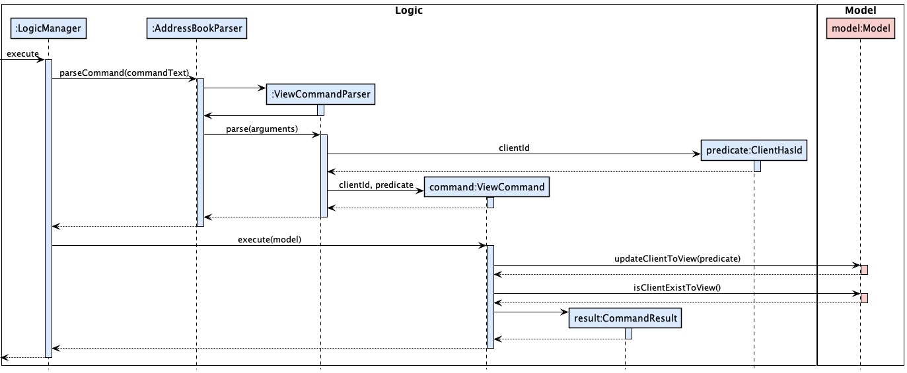
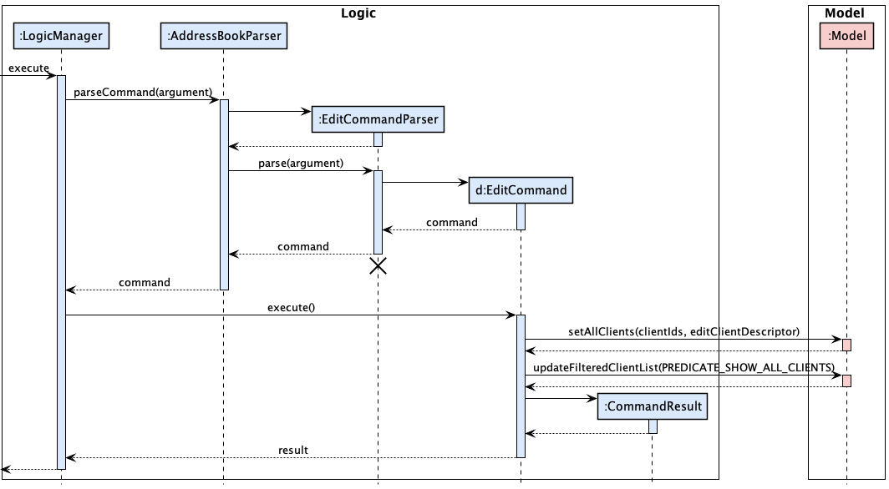
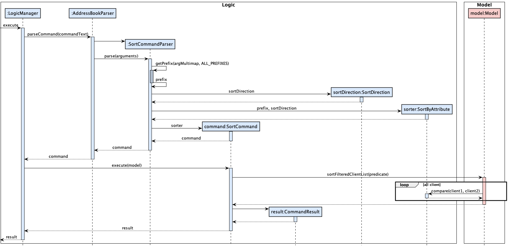
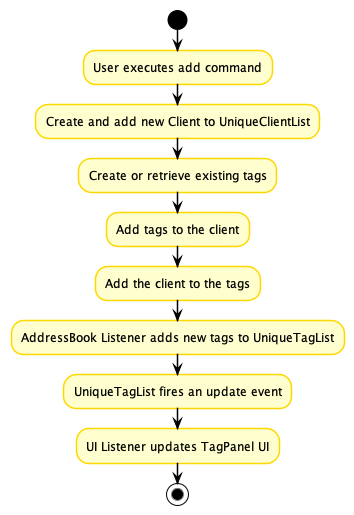
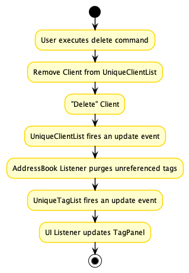

* Table of Contents
{:toc}

--------------------------------------------------------------------------------------------------------------------

# **LeadsForce - Developer Guide**

By: `AY2122S1-CS2103T-T17-3`

--------------------------------------------------------------------------------------------------------------------

## **1. Introduction**

LeadsForce is a desktop app that is optimized for use via a Command Line Interface (CLI) while still having the benefits of a Graphical User Interface (GUI). Catered towards student financial advisors, LeadsForce makes the process of managing client information seamless! LeadsForce does this by helping the financial advisors store and retrieve client information effortlessly and seamlessly.

LeadsForce's developer Guide is written for developers who wish to contribute to or extend our project. It is technical, and explains the inner workings of LeadsForce and how the different components of our application work together.

**Reading this Developer Guide**

| icon | remark |
| --- | --- |
| 💡 | This icon denotes useful tips to note of during development. |
| ❗️ | This icon denotes important details to take note of during development. |

This user guide is also colour coded according to the component. <br> 


--------------------------------------------------------------------------------------------------------------------

## **2. Setting up and getting started**

Refer to the guide [_Setting up and getting started_](SettingUp.md).

--------------------------------------------------------------------------------------------------------------------

## **3. Design**

### 3.1 Architecture
<p align="center">

</p>

LeadsForce is a brown field project adapted and developed upon from **AddressBook3**. Our team decided on reusing the overall architecture by maintaining the system with 6 components (as listed in the diagram above) while building upon each component to cater to the needs of LeadsForce. The ***Architecture Diagram*** given above explains the high-level design of the App, which was adapted from **AddressBook3**. In the subsequent chapters, we will be providing an overview of the component, explain how each component works internally, and how you could scale the system, which can server as a guideline for the developers to expand LeadsForce.

:bulb: **Tip:** The `.puml` files used to create diagrams in this document can be found in the [diagrams](https://github.com/AY2122S1-CS2103T-T17-3/tp/tree/master/docs/diagrams/) folder. Refer to the [_PlantUML Tutorial_ at se-edu/guides](https://se-education.org/guides/tutorials/plantUml.html) to learn how to create and edit diagrams.

**`Main`** has two classes called [`Main`](https://github.com/AY2122S1-CS2103T-T17-3/tp/blob/master/src/main/java/seedu/address/Main.java) and [`MainApp`](https://github.com/AY2122S1-CS2103T-T17-3/tp/blob/master/src/main/java/seedu/address/MainApp.java). It is responsible for,
* At app launch: Initializes the components in the correct sequence, and connects them up with each other.
* At shut down: Shuts down the components and invokes cleanup methods where necessary.

[**`Commons`**](#36-common-classes) represents a collection of classes used by multiple other components.

The rest of the App consists of four components.

* [**`UI`**](#32-ui-component): The UI of the App.
* [**`Logic`**](#33-logic-component): The command executor.
* [**`Model`**](#34-model-component): Holds the data of the App in memory.
* [**`Storage`**](#35-storage-component): Reads data from, and writes data to, the hard disk.

Each of the four main components,

* defines its *API* in an `interface` with the same name as the Component.
* implements its functionality using a concrete `{Component Name}Manager` class (which follows the corresponding API `interface` mentioned in the previous point)

For example, the `Logic` component defines its API in the `Logic.java` interface and implements its functionality using the `LogicManager.java` class which follows the `Logic` interface.
<p align="center">

</p>

**How the architecture components interact with each other**

The *Sequence Diagram* below shows how the components interact with each other for the scenario where the user issues the command `delete 1`.

<p align="center">

</p>
The sections below give more details of each component.

--------------------------------------------------------------------------------------------------------------------
### 3.2 UI component

The **API** of this component is specified in [`Ui.java`](https://github.com/AY2122S1-CS2103T-T17-3/tp/blob/master/src/main/java/seedu/address/ui/Ui.java)

<p align="center">

</p> 

The UI consists of a `MainWindow` that is made up of parts e.g.`CommandBox`, `ResultDisplay`, `ClientListPanel`, `StatusBarFooter` etc. All these, including the `MainWindow`, inherit from the abstract `UiPart` class which captures the commonalities between classes that represent parts of the visible GUI.

The `UI` component uses the JavaFX UI framework. The layout of these UI parts are defined in matching `.fxml` files that are in the `src/main/resources/view` folder. For example, the layout of the [`MainWindow`](https://github.com/AY2122S1-CS2103T-T17-3/tp/blob/master/src/main/java/seedu/address/ui/MainWindow.java) is specified in [`MainWindow.fxml`](https://github.com/AY2122S1-CS2103T-T17-3/tp/blob/master/src/main/resources/view/MainWindow.fxml)

The `UI` component,

* executes user commands using the `Logic` component.
* listens for changes to `Model` data so that the UI can be updated with the modified data.
* keeps a reference to the `Logic` component, because the `UI` relies on the `Logic` to execute commands.
* depends on some classes in the `Model` component, as it displays `Client` object residing in the `Model`.

LeadsForce's GUI is primarily adapted from `AddressBook3`, with the addition of a `SideBar` that conveniently displays information for the user.

Our `SideBar` has a `ClientViewPanel`, which like the `ClientCard`, has a dependency on the `Model` class to fully display the information of the `Client` of interest to the user.

The `SideBar` also has a `MeetingListPanel`, which holds a list of `NextMeetingCard`. `NextMeetingCard` has a dependency on the `Model` class to fully display all scheduled meetings of the user.

--------------------------------------------------------------------------------------------------------------------
### 3.3 Logic component

**API** : [`Logic.java`](https://github.com/AY2122S1-CS2103T-T17-3/tp/blob/master/src/main/java/seedu/address/logic/Logic.java)

Here's a (partial) class diagram of the `Logic` component:

<p align="center">

</p>

How the `Logic` component works:
1. When `Logic` is called upon to execute a command, it uses the `AddressBookParser` class to parse the user command.
1. This results in a `Command` object (more precisely, an object of one of its subclasses e.g., `AddCommand`) which is executed by the `LogicManager`.
1. The command can communicate with the `Model` when it is executed (e.g. to add a client).
1. The result of the command execution is encapsulated as a `CommandResult` object which is returned from `Logic`.

The Sequence Diagram below illustrates the interactions within the `Logic` component for the `execute("delete 1")` API call.


<div markdown="span" class="alert alert-info">:information_source: **Note:** The lifeline for `DeleteCommandParser` should end at the destroy marker (X) but due to a limitation of PlantUML, the lifeline reaches the end of diagram.
</div>

Here are the other classes in `Logic` (omitted from the class diagram above) that are used for parsing a user command:

<p align="center">

</p>

How the parsing works:
* When called upon to parse a user command, the `AddressBookParser` class creates an `XYZCommandParser` (`XYZ` is a placeholder for the specific command name e.g., `AddCommandParser`) which uses the other classes shown above to parse the user command and create a `XYZCommand` object (e.g., `AddCommand`) which the `AddressBookParser` returns back as a `Command` object.
* All `XYZCommandParser` classes (e.g., `AddCommandParser`, `DeleteCommandParser`, ...) inherit from the `Parser` interface so that they can be treated similarly where possible e.g, during testing.

--------------------------------------------------------------------------------------------------------------------
### 3.4 Model component
**API** : [`Model.java`](https://github.com/AY2122S1-CS2103T-T17-3/tp/blob/master/src/main/java/seedu/address/model/Model.java)

<p align="center">

</p>

The `Model` component,

* stores the address book data i.e., all `Client` objects (which are contained in a `UniqueClientList` object).
* has a `UniqueNextMeetingList` in `AddressBook` , which contains all `NextMeeting` objects belonging to all `Client` objects in the `UniqueClientList` object.
* has a `UniqueTagList` in `AddressBook` , which contains `Tag`(s) that a `Client` can reference. This allows `AddressBook` to only require one `Tag` object per unique tag.
* stores the currently 'selected' `Client` objects (e.g., results of a search query) as a separate _filtered_ list which is exposed to outsiders as an unmodifiable `ObservableList<Client>` that can be 'observed' e.g. the UI can be bound to this list so that the UI automatically updates when the data in the list change.
    * this `ObservableList<Client>` is used for to get the `Client` object to display in `ClientListPanel` and `ClientViewPanel`
* stores all `NextMeeting` objects belonging to all `Client` objects as a separate _sorted_ list which is exposed to outsiders as an unmodifiable `ObservableList<NextMeeting>` that can be 'observed' e.g. the UI can be bound to this list so that the UI automatically updates when the data in the list change.
    * this `ObservableList<NextMeeting>` is used for to get the `NextMeeting` object to display in `NextMeetingCard` in `MeetingsListPanel`
* stores a `UserPref` object that represents the user’s preferences. This is exposed to the outside as a `ReadOnlyUserPref` objects.
* does not depend on any of the other three components (as the `Model` represents data entities of the domain, they should make sense on their own without depending on other components)

--------------------------------------------------------------------------------------------------------------------
### 3.5 Storage component

**API** : [`Storage.java`](https://github.com/AY2122S1-CS2103T-T17-3/tp/blob/master/src/main/java/seedu/address/storage/Storage.java)

<p align="center">

</p>

The `Storage` component,
* can save both address book data and user preference data in json format, and read them back into corresponding objects.
* inherits from both `AddressBookStorage` and `UserPrefStorage`, which means it can be treated as either one (if only the functionality of only one is needed).
* depends on some classes in the `Model` component (because the `Storage` component's job is to save/retrieve objects that belong to the `Model`)

--------------------------------------------------------------------------------------------------------------------
### 3.6 Common classes

Classes used by multiple components are in the `seedu.address.commons` package.

--------------------------------------------------------------------------------------------------------------------
### 3.7 Client Fields

As client attributes often share a few similarities in their constraints, some with their own differences, we provide interfaces for developers to customise the constraints of client attributes.

### 3.7.1 Field options

We provide options for developers to easily customise the constraints on the user input such as whether the input is required or whether it is editable. These field options are encapsulated within the `Field` interface, which further branches into more concrete interfaces which can be implemented by `Client` attributes.

Field options largely dictate how the parsers respond to user's inputs.

Option | Description
--- | ---
IS_BLANK_VALUE_ALLOWED | If set to `true`, the field is allowed to be blank (for string fields such as phone, name, etc). Default to `true`.
IS_NULL_VALUE_ALLOWED | If set to `true`, the field is allowed to be null (for int/Date fields such as LastMet, etc). Default to `true`.
DEFAULT_VALUE | The default value for the field. Set when user does not pass in the prefix on `Client` creation. Default to `""`.
IS_EDITABLE | If set to `true`, the field is editable by the user through edit command. Default to `true`.

### 3.7.2 Field interfaces

<p align="center">

</p>

The following concrete interfaces inherit the `Field` interface. You can alternatively define your own interface or provide a concrete implementation of the field options within the `attribute` classes if they don't suit your needs.

#### 3.7.3 OptionalStringBasedField

Option | Default
--- | ---
IS_BLANK_VALUE_ALLOWED | `true`
IS_NULL_VALUE_ALLOWED | `false`
DEFAULT_VALUE | `""`
IS_EDITABLE | `true`

#### 3.7.4 OptionalNonStringBasedField

Option | Default
--- | ---
IS_BLANK_VALUE_ALLOWED | `true`
IS_NULL_VALUE_ALLOWED | `true`
DEFAULT_VALUE | `""`
IS_EDITABLE | `true`

#### 3.7.5 RequiredField

Option | Default
--- | ---
IS_BLANK_VALUE_ALLOWED | `false`
IS_NULL_VALUE_ALLOWED | `false`
DEFAULT_VALUE | `""`(But not used as value is required)
IS_EDITABLE | `true`

### 3.7.6 FieldLength interfaces

<p align="center">

</p>

There are FieldLength interfaces that contain a `MAX_LENGTH` field. This is used to help limit the number of characters that a user can input for a particular field.

FieldLength type | `MAX_LENGTH` value
--- | ---
StandardFieldLength | 30
ShorterFieldLength | 15
LongerFieldLength | 100

### 3.8 Comparable Client Attribute

All the clients attribute which the sort command support implements the IgnoreNullComparable interface to help
determine an ordering for the attributes.

#### 3.8.1 IgnoreNullComparable

The IgnoreNullComparable interface implements the Comparable interface and has the method compareWithDirection(T, SortDirection).
The compareWithDirection is similar to the compareTo in Comparable but has the following additional properties:
1) null or the null-equivalent of the attribute will be ordered last.
2) the ordering will also be determined by the SortDirection pass into it.


#### 3.8.2 StringComparable

StringComparable is an abstract class which implements the IgnoreNullComparable interface which determine the ordering
of an attributes based on the lexicographical ordering of the string representation of the attribute.

#### 3.8.3 NumberComparable

NumberComparable is an abstract class which implements the IgnoreNullComparable interface which determine the ordering
of an attributes based on the numerical ordering of the number representation of the string representation of the
attribute.

#### 3.8.4 Attribute's Comparable Interface Summary

Attribute | Comparable Interface
--- | ---
Client Id | NumberComparable
Name | StringComparable
Email | StringComparable
Phone | NumberComparable
Address | StringComparable
Risk Appetite | NumberComparable
Disposable Income | Number Comparable
Last Meeting | IgnoreNullComparable
Next Meeting | IgnoreNullComparable

### 3.9 Prefix Mapper

The PrefixMapper is a utility class which provides a mapping of a prefix to the relevant methods for the attribute of that prefix.
This class help to simplify segments of code which require operations that are dependent on the prefix and its corresponding attribute.
The PrefixMapper contains a HashMap which map a prefix to their respective PrefixMapperElement.
A PrefixMapperElement contains getter & setter method and values that are relevant to an attribute.

PrefixMapperElement contains the following:
* Name of the Attribute
* Default value of the Attribute
* Client Attribute getter Function 
* EditClientDescriptor Attribute setter BiConsumer 
* EditClientDescriptor Attribute getter Function 
* Attribute Parser Function

--------------------------------------------------------------------------------------------------------------------

## **4. Implementation**

This section describes some noteworthy details on how certain features are implemented.

## AddressBook feature

### 4.1 View Client Info

#### Description

LeadsForce allows users to view client info in the `ClientViewPanel` in the `SideBar` of the GUI using the `View` command.

#### Implementation

1. The `LogicManager` starts to parses the given input text using `AddressBookParser`.
2. The `AddressBookParser` invoke the respective `Parser` based on the first word of the input text.
3. The remaining input text will be passed to the `ViewCommandParser` to parse.
4. The `ViewCommandParser` will parse the `ClientId` from the remaining input text. In our implementation, a valid `ClientId` is any non-negative integer.
5. The `ViewCommandParser` will then create a new `ClientHasId` using the `ClientId` parsed.
6. The `ViewCommandParser` will then create a `ViewCommand` with the `ClientId` and `ClientHasId`.
7. The `LogicManger` will call the `execute` method of `ViewCommand`.
8. The `ViewCommand` wil then call the `updateClientToView` method of the provided `Model` with it's `ClientHasId`.
9. The `ViewCommand` will finally create a new `CommandResult` which will be returned to `LogicManager` and the client's information with the given `ClientId` in the `ClientViewPanel`.

The following sequence diagram shows how the view operation works:

<p align="center">

</p>

#### Implementation of ClientHasId

`ClientHasId` implements `Predicate<Client>` and allow filtering of a list of `Client` based on `ClientId` objects. `ClientHasId` contains a list which holds these 'ClientId'. This allows the `Model` to use this list of `ClientId` objects to filter for `Client`(s) that contain the given `ClientId`(s).

### 4.2 Edit Client Info

#### Description

LeadsForce allows users to edit client info. 

#### Implementation

1. The `LogicManager` starts to parses the given input text using `AddressBookParser`.
2. The `AddressBookParser` invoke the respective `Parser` based on the first word of the input text.
3. The remaining input text will be passed to the `EditCommandParser` to parse.
4. The `EditCommandParser` will tokenize the remaining input text using the `ArgumentTokenizer` into an `ArgumentMultiMap`.
5. The `EditCommandParser` will then create a new `clientId` which contains the list of client Ids. 
6. The `EditCommandParser` will then create a new `EditClientDescriptor` which contains the fields that the user is intending on editing.
7. The `EditCommandParser` will create a `EditCommand` containing both the list of client Ids and the `EditClientDescriptor`.  
8. The `LogicManger` will call the `execute` method of the aforementioned `EditCommand`.
9. The `EditCommand` will then call the `setAllClients` method of the provided `Model` with the `EditClientDescriptor` and the list of clients. 
10. The `EditCommand` will then call the `updateFilteredClientList` method of the provided `Model` with a predicate to show all clients in the client list. 
12. The `EditCommand` will finally create a new `CommandResult` which will be returned to `LogicManager` and the client's information will be edited as according to the command input. 

The following sequence diagram shows how the view operation works:

<p align="center">

</p>

#### Implementation of EditClientDescriptor 

The `EditClientDescriptor` keeps tracks of all the attributes that the user intends on updating, and does so by using the `set{ATTRIBUTE}` command for all the attributes of `Client`(such as setName, setPhone, etc.). 

### 4.3 Search Clients

#### Description

LeadsForce allows the user to `search` for clients using keywords. The keywords can be used to match generically
with any client's attribute or specifically with the specified attributes

#### Implementation

1. The `LogicManager` starts to parses the given input text using `AddressBookParser`.
2. The `AddressBookParser` invoke the respective `Parser` based on the first word of the input text.
3. The remaining input text will be passed to the `SearchCommandParser` to parse.
4. The `SearchCommandParser` will tokenize the remaining input text using the `ArgumentTokenizer` into an `ArgumentMultiMap`.
5. The `SearchCommandParser` will then create a new `ClientContainsKeywordPredicate` using the `ArgumentMultiMap`.
6. The `SearchCommandParser` will then create a `SearchCommand` with the `ClientContainsKeywordPredicate`.
7. The `LogicManger` will call the `execute` method of `SearchCommand`.
8. The `SearchCommand` wil then call the `updateFilteredClientList` method of the provided `Model` with it's `ClientContainsKeywordPredicate`.
9. The `SearchCommand` will finally create a new `CommandResult` which will be returned to `LogicManager`.

The following sequence diagram shows how the search operation works:

<p align="center">

</p>

#### Implementation of ClientContainsKeywordPredicate

`ClientContainsKeywordPredicate` implements `Predicate<Client>` and allow filtering of a list of `Client` based on
generic and attribute keywords.`ClientContainsKeywordPredicate` contains an `ArgumentMultiMap` which holds these
keywords. The `preamble` string of the `ArgumentMultiMap` corresponds to generic keywords. All the words in that string
will be used to match with all the attributes of the `Client`. The different `values` String that is mapped to the
different `Prefix` corresponds to attribute keywords. Each of these `values` string will then be matched with the
corresponding `Client`'s attribute that their `Prefix` refers to e.g. if the `Prefix` `e/` was mapped to `@gmail.com`,
then `@gmail.com` will be used to matched with the `Email` attribute of the `Client`. For this predicate to return true,
the given `Client` must match with any of the generic keywords if there is any and all the attribute keywords if there
is any.

### 4.4 Filter Clients

#### Description

LeadsForce allows the user to `filter` for clients using keywords. This works similar to the `search` but it allows
for multiple `filter` to be stacked, which allows for user to look for clients incrementally.

#### Implementation

1. The `LogicManager` starts to parses the given input text using `AddressBookParser`
2. The `AddressBookParser` invoke the respective `Parser` based on the first word of the input text.
3. The remaining input text will be passed to the `FilterCommandParser` to parse.
4. The `FilterCommandParser` will tokenize the remaining input text using the `ArgumentTokenizer` into an `ArgumentMultiMap`.
5. The `FilterCommandParser` will then create a new `ClientContainsKeywordPredicate` using the `ArgumentMultiMap`.
6. The `FilterCommandParser` will then create a `FilterCommand` with the `ClientContainsKeywordPredicate`
7. The `LogicManger` will call the `execute` method of `FilterCommand`.
8. The `FilterCommand` wil then call the `filterFilteredClientList` method of the provided `Model` with it's `ClientContainsKeywordPredicate`.
9. The `FilterCommand` will finally create a new `CommandResult` which will be returned to `LogicManager`.

The following sequence diagram shows how the filter operation works:

<p align="center">

</p>

#### Implementation of ClientContainsKeywordPredicate

See the above description in `Search Clients`.

### 4.5 Sort Clients

#### Description

LeadsForce allows the user to `sort` clients according to client fields. LeadsForce give clients the option to sort it in ascending or descending order.

#### Implementation
1. The `LogicManager` starts to parses the given input text using `AddressBookParser`
2. The `AddressBookParser` invoke the respective `Parser` based on the first word of the input text.
3. The remaining input text will be passed to the `SortCommandParser` to parse.
4. The `SortCommandParser` will tokenize the remaining input text using the `ArgumentTokenizer` into an `ArgumentMultiMap`.
5. The `SortCommandParser` will then create a new `SortByAttribute` based off the parsed field with the corresponding `SortDirection` using the `ArgumentMultiMap`.
6. The `SortCommandParser` will then create a `SortCommand` with the `SortByAttribute`
7. The `LogicManger` will call the execute method of `SortCommand`.
8. The `SortCommand` wil then call the `sortFilteredClientList` method of the provided `Model` with it’s `SortByAttribute`.
9. The `SortCommand` will finally create a new `CommandResult` which will be returned to `LogicManager`.

The following sequence diagram shows how the sort operation works:

<p align="center">

</p>

### 4.6 Multiple Address Book

LeadsForce allow the user to create and switch between multiple addressbook.

### Description 
LeadsForce allow the user to create and switch between multiple addressbook.

### Implementation
Each individual addressbook is stored as its own JSON file in the data folder that the LeadsForce jar file is stored in.
The following implementation will omit the details prior to the respective commands' parser.
Also, details with regard to AddressBookList has been omitted for simplicity if it is not critical to the function of the command.

### 4.6.1 Create new Address Book

1. The `AbCreateCommandParser` parse the name of the address book that is to be created into a `Path` to that new address book.
2. The `AbCreateCommandParser` will then create a new `AbCreateCommand` with the parsed `Path`.
3. The `LogicManger` then call the execute method of `AbCreateCommand` which set the address book `Path` and create a new `CommandResult` with the `SpecialCommandResult` type of `CREATE_ADDRESSBOOK`.
4. The `MainWindow` will then call its handleCreateAddressBook method after checking that the `CommandResult` is of type `CREATE_ADDRESSBOOK` which will call the createAddressBook method of `LogicManager`.
5. The `LogicManger` will retrieve the `Path` of the new address book and create a new `AddressBookStorage` with it and along with a new `AddressBook`.
6. The `LogicManger` then call setAddressBook method of `ModelManager` with the new `AddressBook` which will reset the `AddressBook` to a new `AddressBook`.
7. The `LogicManger` will also call switchAddressBook method of `StorageManager` with the new `AddressBookStorage`.

The following sequence diagram shows how the ab create operation works:

<p align="center">

</p>

### 4.6.2 Switch Address Book

1. The `AbSwitchCommandParser` parse the name of the address book that is to be switched to into a `Path` to that address book.
2. The `AbSwitchCommandParser` will then create a new `AbSwitchCommand` with the parsed `Path`.
3. The `LogicManger` then call the execute method of `AbSwitchCommand` which set the address book `Path` and create a new `CommandResult` with the `SpecialCommandResult` type of `SWITCH_ADDRESSBOOK`.
4. The `MainWindow` will then call its handleSwitchAddressBook method after checking that the `CommandResult` is of type `SWITCH_ADDRESSBOOK` which will call the switchAddressBook method of `LogicManager`.
5. The `LogicManger` will retrieve the `Path` of the address book to switched to and create a new `AddressBookStorage` with it
6. The `LogicManger` will also call readAddressBook method of `JsonAddressBookStorage` with the `Path` to get the `AddressBook` that is to be switched to.
7. The `LogicManger` then call setAddressBook method of `ModelManager` with the `AddressBook` which will reset the current `AddressBook` to that.
8. The `LogicManger` will also call switchAddressBook method of `StorageManager` with the new `AddressBookStorage`.

The following sequence diagram shows how the sort operation works:


### 4.6.3 Delete Address Book

1. The `AbDeleteCommandParser` parse the name of the address book that is to be deleted to into a `Path` to that address book.
2. The `AbDeleteCommandParser` will then create a new `AbDeleteCommand` with the parsed `Path`.
3. The `LogicManger` then call the execute method of `AbDeleteCommand`.
4. The `AbDeleteCommand` will then attempt to delete the address book specified by the `Path`
5. The `AbDeleteCommand` will finally create a new `CommandResult` which will be returned to `LogicManger`.

The following sequence diagram shows how the sort operation works:


### 4.6.4 List Address Book

1. The `AbListCommand` will call getAddressBookListString method of `ModelManager`.
2. The `ModelManager` will then subsequently call toString method of `AddressBookList`
3. The `AddressBookList` will append the name of all the addressbook in its list together and return it back to `AblistCommand`
4. The `AblistCommand` will finally then create a `CommandResult` with that String and return it to `LogicManager`.

The following sequence diagram shows how the sort operation works:


### 4.7 Undo/redo feature

#### 4.7.1 Proposed Implementation

The proposed undo/redo mechanism is facilitated by `VersionedAddressBook`. It extends `AddressBook` with an undo/redo history, stored internally as an `addressBookStateList` and `currentStatePointer`. Additionally, it implements the following operations:

* `VersionedAddressBook#commit()` — Saves the current address book state in its history.
* `VersionedAddressBook#undo()` — Restores the previous address book state from its history.
* `VersionedAddressBook#redo()` — Restores a previously undone address book state from its history.

These operations are exposed in the `Model` interface as `Model#commitAddressBook()`, `Model#undoAddressBook()` and `Model#redoAddressBook()` respectively.

Given below is an example usage scenario and how the undo/redo mechanism behaves at each step.

Step 1. The user launches the application for the first time. The `VersionedAddressBook` will be initialized with the initial address book state, and the `currentStatePointer` pointing to that single address book state.


Step 2. The user executes `delete 5` command to delete the 5th client in the address book. The `delete` command calls `Model#commitAddressBook()`, causing the modified state of the address book after the `delete 5` command executes to be saved in the `addressBookStateList`, and the `currentStatePointer` is shifted to the newly inserted address book state.


Step 3. The user executes `add n/David …​` to add a new client. The `add` command also calls `Model#commitAddressBook()`, causing another modified address book state to be saved into the `addressBookStateList`.


<div markdown="span" class="alert alert-info">:information_source: **Note:** If a command fails its execution, it will not call `Model#commitAddressBook()`, so the address book state will not be saved into the `addressBookStateList`.

</div>

Step 4. The user now decides that adding the client was a mistake, and decides to undo that action by executing the `undo` command. The `undo` command will call `Model#undoAddressBook()`, which will shift the `currentStatePointer` once to the left, pointing it to the previous address book state, and restores the address book to that state.


<div markdown="span" class="alert alert-info">:information_source: **Note:** If the `currentStatePointer` is at index 0, pointing to the initial AddressBook state, then there are no previous AddressBook states to restore. The `undo` command uses `Model#canUndoAddressBook()` to check if this is the case. If so, it will return an error to the user rather
than attempting to perform the undo.

</div>

The following sequence diagram shows how the undo operation works:


<div markdown="span" class="alert alert-info">:information_source: **Note:** The lifeline for `UndoCommand` should end at the destroy marker (X) but due to a limitation of PlantUML, the lifeline reaches the end of diagram.

</div>

The `redo` command does the opposite — it calls `Model#redoAddressBook()`, which shifts the `currentStatePointer` once to the right, pointing to the previously undone state, and restores the address book to that state.

<div markdown="span" class="alert alert-info">:information_source: **Note:** If the `currentStatePointer` is at index `addressBookStateList.size() - 1`, pointing to the latest address book state, then there are no undone AddressBook states to restore. The `redo` command uses `Model#canRedoAddressBook()` to check if this is the case. If so, it will return an error to the user rather than attempting to perform the redo.

</div>

Step 5. The user then decides to execute the command `list`. Commands that do not modify the address book, such as `list`, will usually not call `Model#commitAddressBook()`, `Model#undoAddressBook()` or `Model#redoAddressBook()`. Thus, the `addressBookStateList` remains unchanged.


Step 6. The user executes `clear`, which calls `Model#commitAddressBook()`. Since the `currentStatePointer` is not pointing at the end of the `addressBookStateList`, all address book states after the `currentStatePointer` will be purged. Reason: It no longer makes sense to redo the `add n/David …​` command. This is the behavior that most modern desktop applications follow.


The following activity diagram summarizes what happens when a user executes a new command:

<p align="center">

</p>

#### 4.7.2 Design considerations:

**Aspect: How undo & redo executes:**

* **Alternative 1 (current choice):** Saves the entire address book.
    * Pros: Easy to implement.
    * Cons: May have performance issues in terms of memory usage.

* **Alternative 2:** Individual command knows how to undo/redo by
  itself.
    * Pros: Will use less memory (e.g. for `delete`, just save the client being deleted).
    * Cons: We must ensure that the implementation of each individual command are correct.

_{more aspects and alternatives to be added}_

### 4.8 \[Proposed\] Data archiving

_{Explain here how the data archiving feature will be implemented}_

### 4.9 GUI Feature 
We will use this section to document implementation details regarding GUI-related features. 

#### 4.9.1 Filter tag panel
Filter tag panel involves the use of a listener to watch for any changes in the UniqueTagList. Once a change 
is detected, it will update the UI accordingly. The tricky part is to get UniqueTagList to work with the TagPanel
listener. We also have to constantly monitor the reference states of UniqueTagList so that tags panel automatically removes 
tags that are no longer referenced by any clients. For this, some sort of Garbage collection mechanism must exist.

Below, we will see how creating and modifying the client have an effect on the UniqueTagList. Client modification can be 
seen as the entry point that triggers the chain of tag modification operations and thus the UI update of the TagPanel.
#####4.9.1.1 Add a new client
The following activity diagram summarizes what happens when a user executes an add command:

<p align="center">

</p>

#####4.9.1.1 Edit a client
The following activity diagram summarizes what happens when a user executes an edit command:

<p align="center">

</p>

#####4.9.1.1 Delete a client
The following activity diagram summarizes what happens when a user executes an delete command:

<p align="center">

</p>

--------------------------------------------------------------------------------------------------------------------

## **5. Documentation, logging, testing, configuration, dev-ops**

* [Documentation guide](Documentation.md)
* [Testing guide](Testing.md)
* [Logging guide](Logging.md)
* [Configuration guide](Configuration.md)
* [DevOps guide](DevOps.md)

### 5.1 Extensions and customisations
In LeadsForce, we put a strong emphasis on ensuring not only the quality but also the extensibility and customizability of our product.
If you are wondering about how you can easily customise or add extensions to LeadsForce without worrying about the underlying implementations, 
you are at the right place.
This section details the workflows and features that we have developed that can help you to tweak certain features 
in LeadsForce without the need for you to delve too deeply into the codebase.

#### 5.1.1 Change the look of an existing theme
Let's say you dislike the look of our current `BookTheme`: you want the background to be dark brown instead of the current light brown.
Here's what you should do: 
1. cd to `tp/src/main/resources/view`.
2. Open `BookTheme.css`.
3. On the top of the css file, you will see that all the [css variables](https://www.w3schools.com/css/css3_variables.asp) are nicely organised and defined for you.
Here's the css snippet (The comment briefly describes what each of the variables does):
````
* {
    -fx-base1: #cb997e; // base color 1 (preferably the darkest tone) (the main background color of LeadsForce)
    -fx-base2: #eddcd2; // base color 2 
    -fx-base3: #fff1e6; // base color 3
    -fx-base4: #f0efeb; // base color 4
    -fx-base5: #ddbea9; // base color 5 (preferably the lightest tone)
    -fx-font-color: derive(-fx-base1, -30%); // the color of a generic font in LeadsForce
    -fx-font-color-bright: #ffffff; // the color of `bright` font in LeadsForce (for fonts that overlay component of base color 1) 
    -fx-menu-color: #263238; // color of the menu
    -fx-menu-color-highlighted: #455a64; // color of the menu when highlighted
    -fx-menu-font-color: #ffffff; // color of the font
    -fx-menu-font-color-highlighted: #ffffff; // color of the font when highlighted
}
````
4. Let's change the value of `-fx-base-1` to `#5C4033` instead (the color code for dark brown).
5. Save the file and boot up LeadsForce. You will see that the change in the background color of `BookTheme` is reflected immediately.
<p align="center">

</p>

#### 5.1.2 Give LeadsForce a new theme
If you want to add more themes on top of our existing themes, here's what you should do: 
1. cd to `tp/src/main/resources/view`.
2. Create a copy of `BookTheme.css`.
3. Rename the file to you preferred theme name and open it. e.g. `RainbowTheme.css`.
4. Similar to 5.1.1, tweak the css variables to suit your needs. 
5. Save the file and cd to `tp/src/main/java/seedu/address/storage/ThemeList.java`.
6. Add `RainbowTheme.css` to the static variable `THEMES` like so:<br>
````
private static final List<String> THEMES = List.of("BookTheme", "TwilightTheme", "DarkTheme", "SpaceTheme", "RainbowTheme");
````
7. Now boot up LeadsForce and you should see that your newly added theme is available in the menu bar. Hooray!
<p align="center">

</p>

--------------------------------------------------------------------------------------------------------------------

## **6. Appendix: Requirements**

### 6.1 Product scope

**Target user**: Student Financial Advisor

**Target user profile**:

* Studying in university currently
* Prefers using desktop applications, over others 
* Would much prefer to type, and can type fast
* Manages a significant number of contacts
* Short on time as they have to juggle both school and work at the same time
* Trying to sell financial products effectively by finding the right clients

**Value propositions**:
* Keep tracks of client information and meetings all in one place
* Much faster than a mouse driven GUI app
* Financial advisors can have a more targeted approach by categorising different clients

### 6.2 User stories

Priorities: High (must have) - `* * *`, Medium (nice to have) - `* *`, Low (unlikely to have) - `*`

| Priority | As a …​                                    | I can …​                     | So that I can…​                                                        |
| -------- | ------------------------------------------ | ------------------------------ | ---------------------------------------------------------------------- |
| `* * *`  | student financial advisor| add in my client's information| refer to my client's information later on|
| `* * *`  | student financial advisor| remove a client from my catalogue of clients | remove clients who I no longer keep in touch with |
| `* * *`  | student financial advisor | view my client's information | view in-depth information on the client which can allow me to better strategies the appropriate plan |
| `* * *`  | student financial advisor | categorise my clients | have a more targeted approach when approaching clients with new financial plans |
| `* * *`  | student financial advisor | list out all my clients | have an overview of the clients I have |
| `* * *`  | student financial advisor who is meeting with a client soon| lookup a client in the address book | strategies several plans that would be appropriate for my clients based on the client's financial information |
| `* * *`  | student financial advisor that forgot the client's name | search for a client by their information|be able to greet the client when we meet|
| `* * *`  | student financial advisor| save my address book locally   | access the information again when I reopen the application |
| `* * *`  | student financial advisor| see hints in error messages when I input a wrong command | know how to rectify my command |
| `* * *`  | student financial advisor| be warned that I am about to add the same user again | avoid having duplicate clients in my catalogue of clients|
| `* * *`  | student financial advisor| set meetings with my clients| keep track and not be late to my meetings with my clients |
| `* * *`  | student financial advisor who's client has changed client information | edit my client's information   | keep track of my client's information |
| `* * *`  | student financial advisor who is planning to attend an event | get an overview of my meeting schedule on the day | ensure that I can still attend my meetings with clients |
| `* *`   | student financial advisor trying to sell a particular financial plan | search for clients with a certain amount of financial appetite | suggest the plans to the appropriate clients |
| `* *`   | student financial advisor | sort clients in my catalogue of clients| quickly identify the clients based on the last time I've seen them or the number of financial plans they have |
| `*`  | student financial advisor who has gotten a new laptop | transfer my clients' information into another computer | transfer my clients' information onto my new laptop |

### 6.3 Use cases

(For all use cases below, the **System** is the `LeadsForce` and the **Actor** is the `user`, unless specified otherwise)

#### 6.3.1 UC01 Add a client to the client list

**MSS**

1. User adds a client into the contact book
2. LeadsForce adds the client to the contact book
   Use case ends.

**Extensions**

* 1a.  Missing parameters - name and email

    * 1a1. LeadsForce shows an invalid command error message. 
      Use case ends. 

#### 6.3.2 UC02 View a client's information

**MSS**

1. User requests to view the client's information 
2. LeadsForce shows the detailed view of the client's information 

**Extensions**

* 2a.  User inputs an invalid Client ID
    * 2a1. LeadsForce shows an invalid command error to user.
      Use case ends.

#### 6.3.3 UC03 Edit client information

**MSS**

1. User request to edit multiple attributes of a client 
2. LeadsForce updates the client's information.
3. User __UC02 Views a client's information__ to see that the information of the client have been changed. 

**Extensions**

* 1a.  User inputs invalid attributes
    * 1a1. LeadsForce shows an error to user, and informs the user of the valid attribute format. 
      Use case ends.

#### 6.3.4 UC04 Delete a client

**MSS**

1.  User requests to list clients
2.  LeadsForce shows a list of clients
3.  User requests to delete a specific client by their Client ID. 
4.  LeadsForce deletes the client

    Use case ends.

**Extensions**

* 2a. The list is empty.
  Use case ends.

* 3a. The given client id is invalid.
    * 3a1. LeadsForce shows an error message, informing the user that there is no client with the given Client ID .
      Use case resumes at step 2.

#### 6.3.5 UC05 Showcases list of clients

**MSS**

1. User request to view the full list of clients 
2. LeadsForce showcases the client's information.

#### 6.3.6 UC06 Search for a client

**MSS**

1. User requests to list clients
2. LeadsForce shows a list of clients
3. User requests to search using specific keywords
4. LeadsForce shows the list of all people which match the keyword
   Use case ends.

**Extensions**

* 2a.  LeadsForce returns an empty list since there is no clients in the list. 
  Use case ends.

* 3a. LeadsForce returns an empty list since there is no client who fits the inputted keyword
  Use case ends.


#### 6.3.7 UC07 Setting a meeting with clients

**MSS**

1. User requests to set a meeting with the client
2. LeadsForce updates the client's next meeting portion to show the meeting that was inputted

**Extensions**

* 1a.  User inputs invalid commands
    * 1a1. LeadsForce shows an error to user, and informs the user of the valid command format. 
      Use case ends.

#### 6.3.8 UC08 showing schedule for the day

**MSS**

1. User requests to see the schedule of meetings on a particular day
2. LeadsForce shows a schedule of meetings on the day

**Extensions**

* 1a.  User inputs an invalid date
    * 1a1. LeadsForce shows an invalid command error to user.
      Use case ends.

* 2a. The meeting schedule is empty as the user has no meetings on the day
  Use case ends.

#### 6.3.9 UC09 Clearing a client list

**MSS**

1. User requests to clear the client list.
2. LeadsForce asks for the user's validation (asking if the user is very sure in deleting clients' information) 
3. User validates the request
4. LeadsForce shows address book with no clients

**Extensions**

* 3a.  User does not validate the request
    * 3a1. LeadsForce does not clear the client list. 
      Use case ends.
      
* 3b.  User inputs invalid commands
    * 3b1. LeadsForce shows an error to user, and informs the user of the valid commands. 
      Use case resumes at step 3.

#### 6.3.10 UC10 Create a new address book

**MSS**

1. User requests to create another address book with a specified name
2. LeadsForce shows view of the new address book

**Extensions**

* 1a.  User inputs name that is the same as an existing address book
    * 1a1. LeadsForce shows an error to user, and informs the user that an address book with the same name already exists.
      Use case ends.

#### 6.3.11 UC11 clear an address book of clients

**MSS**

1. User requests to clear the address book.
2. LeadsForce asks for the user's validation (asking if the user is very sure in deleting clients' information) 
3. User validates the request
4. LeadsForce shows address book with no clients

**Extensions**

* 3a.  User does not validate the request
    * 3a1. LeadsForce does not clear the address book. 
      Use case ends.
      
* 3a.  User inputs invalid commands
    * 3b1. LeadsForce shows an error to user, and informs the user of the valid commands. 
      Use case resumes at step 3. 
     
### 6.4 Non-Functional Requirements

1. Should work on any _mainstream OS_ as long as it has Java `11` or above installed.
2. Should be able to hold up to 100 clients without a noticeable sluggishness in performance for typical usage.
3. A user with above average typing speed for regular English text (i.e. not code, not system admin commands) should be able to accomplish most of the tasks faster using commands than using the mouse.
4. The system should respond within two seconds after entering a command.
5. Should work without requiring an installer.
6. Should work on a 64-bit environment.
7. Should be usable by a student who has little to no experience in using computers.
8. The client information should be stored locally. 
9. Students who are inexperienced in using computers should be able to easily use LeadsForce.

### 6.5 Glossary

* **Mainstream OS**: Windows, Linux, Unix, OS-X
* **Command Line Interface (CLI)**: Text-based user interface that is used to view and manage device files
* **Graphical User Interface (GUI)**: A visual way of interacting with a device using a variety of items
* **Leads**: refers to contact with a potential customer, also known as a “prospect”
* **Risk Appetite**: level of risk that a lead is prepared to accept in pursuit of his/her objectives, before action is deemed necessary to reduce the risk
* **Disposable Income**: total clientele income minus clientele current taxes
* **Client list**: the list of clients that is displayed in the GUI
* **Address Book**: the list of clients where all clients inserted are kept


--------------------------------------------------------------------------------------------------------------------

## 7. Appendix: Instructions for manual testing

Given below are instructions to test the app manually.

<div markdown="span" class="alert alert-info">:information_source: **Note:** These instructions only provide a starting point for testers to work on;
testers are expected to do more *exploratory* testing.

</div>

### 7.1 Launch and shutdown

1. Initial launch

    1. Download the jar file and copy into an empty folder

    1. Double-click the jar file Expected: Shows the GUI with a set of sample contacts. The window size may not be optimum.

1. Saving window preferences

    1. Resize the window to an optimum size. Move the window to a different location. Close the window.

    1. Re-launch the app by double-clicking the jar file.<br>
       Expected: The most recent window size and location is retained.

1. shut down the application by using the `exit` command. 

### 7.2 Commands for manual testing (Client Management Features)
In this section, you can test general commands in LeadsForce. Below is a summary of every client management feature in LeadsForce. 

Action | Format | Examples
--------|---------|---------
**Create** | `add n/CLIENT_NAME e/EMAIL [<attribute>/VALUE]...`| add n/benedict e/benedict@gmail.com p/90909898 r/3
**View** | `view CLIENT_ID` | view 123
**Edit** | `edit CLIENT_ID... [<attribute>/CHANGED_VALUE]...` | edit 12 n/Dominic p/12345678
**Delete** | `delete CLIENT_ID...` | delete 4
**List** | `list` | -
**Sort** | `sort [<attribute>/SORT_DIRECTION]...` | sort r/asc
**Schedule** | `schedule [DATE]` | schedule 25-12-2021
**Search** | `search KEYWORD... [<attribute>/ATTRIBUTE_KEYWORD]...` | search e/doe@gmail.com r/5
**Filter** | `filter KEYWORD[... <attribute>/ATTRIBUTE_KEYWORD]...` | filter e/doe@gmail.com p/9
**Clear** | `clear` | -

#### 7.2.1 Adding a client

1. Adding a client to the client list 

    1. Prerequisites: in using the `add` command, the user must input the client's email and name. 

    1. Test case: `add n/Dominic e/dominicLovesCS@gmail.com`<br>
       Expected: A new client named `Dominic` with the email address `dominicLovesCS@gmail.com` is added to the client list

    1. Test case: `add n/Dominic p/97263912`<br>
       Expected: No client is added to the client list since email is not included. Invalid command error is shown to the user in the status message. 

    1. Other incorrect delete commands to try: `add n/Dominic i/6` (user is not allowed to give clients a Client ID) 
       Expected: Similar to previous.

#### 7.2.2 View a client

1. View the client's information in the side panel's client view panel. 

    1. Prerequisites: a client with the corresponding Client ID must exist in the client list

    1. Test case: `view 1` (supposing there is a client with client id 1) <br>
       Expected: Client with Client ID `1` is shown in the client view panel. Details of the command is shown in the status message. 

    1. Test case: `view `<br>
       Expected: No client is being selected to be viewed. Invalid command error is shown to the user in the status message. 

    1. Other incorrect delete commands to try: `view 999`(when the client id 999 does not exist)  <br>
       Expected: Similar to previous.


#### 7.2.3 Deleting a client

1. Deleting a client while all clients are being shown

    1. Prerequisites: List all clients using the `list` command. Multiple clients in the list.

    1. Test case: `delete 0`<br>
       Expected: Client with Client ID `0` is deleted from the client list. Details of the deleted contact shown in the status message. 

    1. Test case: `delete 999` <br>
       Expected: No client is deleted since there is no client with client id `999`. Error details shown in the status message. Status bar remains the same.

    1. Other incorrect delete commands to try: `delete`, `delete x`<br>
       Expected: Similar to previous.

#### 7.2.4 Edit clients information
1. Editing a client's information

    1. Prerequisites: Users are not allowed to change the client id of the client. 

    1. Test case: `edit 1 n/Benedict` <br>
       Expected: Client with Client ID `1` has the name changed to `Benedict`. Details of this change is shown in the status message. 

    1. Test case: `edit 1 2 3 4 5 n/Benedict` <br>
       Expected: Client with Client ID `1`, `2`,`3`,`4` have their name changed to `Benedict`. Details of this change is shown in the status message. 

    1. Test case: `edit 1 n/Benedict e/rebeccalovescs@gmail.com` <br>
       Expected: Client with Client ID `1` has the name changed to `Benedict`, and the email changed to `rebeccalovescs@gmail.com`. Details of this change is shown in the status message. 

    1. Test case: `edit 1 2 3 4 m/23-11-2021 (09:00~10:00), NUS SOC COM1` <br>
       Expected: Client with Client ID  `1`, `2`,`3`,`4` have their next meeting changed to the `23rd November 2021` from `9am to 10am` at `NUS SOC COM1`. Details of this change is shown in the status message. 
       
    1. Test case: `edit 1 i/9`<br>
       Expected: The client's id will not be changed and error details are shown in the status message. Client list remains the same. 

    1. Other incorrect delete commands to try: `delete`, `delete x`, `...` (where x is larger than the list size)<br>
       Expected: Similar to previous.
       
#### 7.2.5 Sort clients 

1. Sorts the lists of clients

    1. Prerequisites: the client list is not empty when the command is used

    1. Test case: `sort r/asc`<br>
       Expected: Sort the current based on their risk appetite in ascending order. Details of the sort is shown in the status message. 

    1. Test case: `sort r/dsc d/asc`<br>
       Expected: sorts clients by their risk appetite in descending order, then sorts the clients by their disposable income in ascending order for those who have the same risk appetite. Details of the sort is shown in the status message.

    1. Test case: `sort r/descending`<br>
       Expected: The client list will not be sorted and error details are shown in the status message. Details of the command will be shown in the status message.
       
    1. Other incorrect delete commands to try: `sort`, `sort r8` <br> 
       Expected: Similar to previous.

#### 7.2.6 Finding meeting schedule on day 

1. Find meetings that are scheduled on a specified day

    1. Prerequisites: User must have meetings on the day which is specified in the command.

    1. Test case: `schedule 25-11-2021`<br>
       Expected: Meetings that are schedule on the `25th November 2021` are shown in the meeting schedule panel.  Details of the command is shown in the status message. 
       
    1. Test case: `schedule`<br>
       Expected: Returns the full list of meetings that are scheduled. Details of the command is shown in the status message. 
       
    1. Test case: `schedule 2021-30-21`<br>
       Expected: Meeting schedule remains unchanged. Error details shown in the status message and informs user that the format is incorrect. 

    1. Other incorrect delete commands to try: `schedule 31-13-2021`, `schedule 32-12-2021`<br>
       Expected: Similar to previous.


#### 7.2.7 Filter Client List

1. Filter client list based on a given attribute 

    1. Prerequisites: there must be clients in the current client list.

    1. Test case: `filter Dominic`<br>
       Expected: Clients with the word `Dominic` in any of the client's attributes will be shown in the client list. Details of the command is shown in the status message. 

    1. Test case: `filter r/1`<br>
       Expected: Clients with the risk appetite `1` will be shown in the client list. Details of the command is shown in the status message. 
       
    1. Test case: `filter Dominic r/1` <br> 
       Expected: Clients with `Dominic` in any of its attributes and risk appetite of `1` will be shown on the client list. Details of the command is shown in the status message. 

    1. Test case: `filter`<br>
       Expected: The client list remains unchanged. Error details shown in the status message and informs user of the correct format. 


#### 7.2.8 Searching for clients 

1. Search for a client based on a given attribute

    1. Prerequisites: there must be clients in your address book. 

    1. Test case: `search Dominic`<br>
       Expected: Clients with the word `Dominic` in any of the client's attributes will be shown in the client list, regardless if the user was on the client list initially. Details of the command is shown in the status message. 

    1. Test case: `search r/1`<br>
       Expected: Clients with the risk appetite `1` will be shown in the client list, regardless if the user was on the client list initially. Details of the command is shown in the status message. 
         
    1. Test case: `search Dominic r/1` <br> 
       Expected: Clients with `Dominic` in any of its attributes and risk appetite of `1` will be shown on the client list, regardless if the user was on the client list initially. Details of the command is shown in the status message. 

    1. Test case: `search`<br>
       Expected: The client list remains unchanged. Error details shown in the status message and informs user of the correct format. 
       
#### 7.2.9 Show all clients 

 1. List all clients 
    1. Test case: `list`<br>
       Expected: Client list will contain all clients in the address book. Details of the command is shown in the status message. 

#### 7.2.10 Clear address book 

 1. Clear all clients in address book
    1. Test case: `clear`, and then `yes` when prompted by *Are you sure that you wish to clear the Address Book*
       Expected: Clients in the client list will be cleared and the client list and address book will be empty. Details of the command is shown in the status message. 
       
    1. Test case: `clear`, and then `no` when prompted by *Are you sure that you wish to clear the Address Book*
       Expected: Clients in the client list will not be cleared and the client list and address book will remain the same. Details of the command is shown in the status message. 
    
#### 7.2.11 General commands 

Action | Format
--- | ---
**Help** | `help`
**Exit** | `exit` 

**Help command** 
 1. Getting help information 
    1. Test case: `help` <br>
       Expected: A window with a link to LeadsForce's user guide
       
**Exit command** 
 1. Exit the application
    1. Test case: `exit` <br> 
       Expected: the application closes

### 7.3 Commands for manual testing (Multiple address book feature)
In this section, you can test multiple address book features in LeadsForce. Below is a summary of all multiple address book features in LeadsForce. 

Action | Format | Examples
--------|---------|---------
**Create Address Book** | `ab create ADDRESSBOOK_NAME` | ab create vip
**Delete Address Book** | `ab delete ADDRESSBOOK_NAME` | ab delete book
**Switch Address Book** | `ab switch ADDRESSBOOK_NAME` | ab switch another
**List Address Book** | `ab list` | -

#### 7.3.1 Create Address Book 

1. Create Address Book

    1. Prerequisites: -

    1. Test case: `ab create Young Adult`<br>
       Expected: Creates a new address book with the name `young adult`. Details of the command is shown in the status message.
       
    1. Test case: `ab create Addressbook`<br>
       Expected: Does not create a new address book and error details are shown in the status message, informing the user that the address book name already exists.
       
    1. Test case: `ab create`<br>
       Expected: Does not create a new address book and error details are shown in the status message, informing the user of a valid command format.
       

#### 7.3.2 Delete Address Book 

1. Delete Address Book

    1. Prerequisites: the user has to be using a different address book to delete another address book

    1. Test case: `ab delete Young Adult`<br>
       Expected: Deletes an address book with the name `young adult`. Details of the command is shown in the status message.
       
    1. Test case: `ab delete`<br>
       Expected: Does not delete a new address book and error details are shown in the status message, informing the user of a valid command format.
       

#### 7.3.3 Switch Address Book 

1. Switch between Address Book

    1. Prerequisites: have at least 2 address books

    1. Test case: `ab switch Young Adult`<br>
       Expected: Switch to the `Young Adult` address book. Details of the command is shown in the status message.
       

#### 7.3.4 List Address Books 

1. List the names of all address books

    1. Prerequisites: -

    1. Test case: `ab list`<br>
       Expected: Lists the name of all address books. Details of the command is shown in the status message.


### 7.4 Saving data

1. Dealing with missing/corrupted data files

    1. The data files can be found in the `data` folder of the repository, and are named accordingly to the name of the address books in your application (For instance, if you have an address book that's called `Young Adults`, there will be a JSON file called `Young Adults.json` in the data folder). Remove the `clientId` for one of the clients in the corrupted data file, and restart the application <br> Expected: LeadsForce should display an empty client list for the address book with the same name as the corrupted data file.
