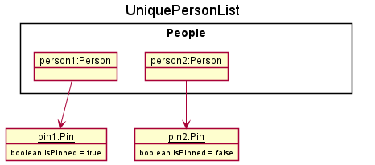
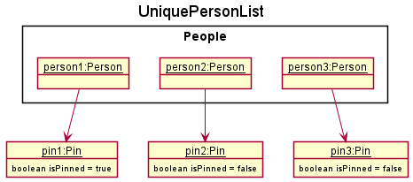

* Table of Contents
{:toc}

--------------------------------------------------------------------------------------------------------------------

## **Acknowledgements**

* [Opencsv](http://opencsv.sourceforge.net/)
--------------------------------------------------------------------------------------------------------------------

## **Setting up, getting started**

Refer to the guide [_Setting up and getting started_](SettingUp.md).

--------------------------------------------------------------------------------------------------------------------

## **Design**

:bulb: **Tip:** The `.puml` files used to create diagrams in this document can be found in the [diagrams](https://github.com/se-edu/addressbook-level3/tree/master/docs/diagrams/) folder. Refer to the [_PlantUML Tutorial_ at se-edu/guides](https://se-education.org/guides/tutorials/plantUml.html) to learn how to create and edit diagrams.

### Architecture

The ***Architecture Diagram*** given above explains the high-level design of the App.

Given below is a quick overview of main components and how they interact with each other.

**Main components of the architecture**

**`Main`** has two classes called [`Main`](https://github.com/se-edu/addressbook-level3/tree/master/src/main/java/seedu/address/Main.java) and [`MainApp`](https://github.com/se-edu/addressbook-level3/tree/master/src/main/java/seedu/address/MainApp.java). It is responsible for,
* At app launch: Initializes the components in the correct sequence, and connects them up with each other.
* At shut down: Shuts down the components and invokes cleanup methods where necessary.

[**`Commons`**](#common-classes) represents a collection of classes used by multiple other components.

The rest of the App consists of four components.

* [**`UI`**](#ui-component): The UI of the App.
* [**`Logic`**](#logic-component): The command executor.
* [**`Model`**](#model-component): Holds the data of the App in memory.
* [**`Storage`**](#storage-component): Reads data from, and writes data to, the hard disk.

**How the architecture components interact with each other**

The *Sequence Diagram* below shows how the components interact with each other for the scenario where the user issues the command `delete 1`.

Each of the four main components (also shown in the diagram above),

* defines its *API* in an `interface` with the same name as the Component.
* implements its functionality using a concrete `{Component Name}Manager` class (which follows the corresponding API `interface` mentioned in the previous point.

For example, the `Logic` component defines its API in the `Logic.java` interface and implements its functionality using the `LogicManager.java` class which follows the `Logic` interface. Other components interact with a given component through its interface rather than the concrete class (reason: to prevent outside component's being coupled to the implementation of a component), as illustrated in the (partial) class diagram below.

The sections below give more details of each component.

### UI component

The **API** of this component is specified in [`Ui.java`](https://github.com/se-edu/addressbook-level3/tree/master/src/main/java/seedu/address/ui/Ui.java)

The UI consists of a `MainWindow` that is made up of parts e.g.`CommandBox`, `ResultDisplay`, `PersonListPanel`, `StatusBarFooter`, `BirthdayReminderListPanel` etc. All these, including the `MainWindow`, inherit from the abstract `UiPart` class which captures the commonalities between classes that represent parts of the visible GUI.

The `UI` component uses the JavaFx UI framework. The layout of these UI parts are defined in matching `.fxml` files that are in the `src/main/resources/view` folder. For example, the layout of the [`MainWindow`](https://github.com/se-edu/addressbook-level3/tree/master/src/main/java/seedu/address/ui/MainWindow.java) is specified in [`MainWindow.fxml`](https://github.com/se-edu/addressbook-level3/tree/master/src/main/resources/view/MainWindow.fxml)

The `UI` component,

* executes user commands using the `Logic` component.
* listens for changes to `Model` data so that the UI can be updated with the modified data.
* keeps a reference to the `Logic` component, because the `UI` relies on the `Logic` to execute commands.
* depends on some classes in the `Model` component, as it displays `Person` object residing in the `Model`.

### Logic component

**API** : [`Logic.java`](https://github.com/se-edu/addressbook-level3/tree/master/src/main/java/seedu/address/logic/Logic.java)

Here's a (partial) class diagram of the `Logic` component:

How the `Logic` component works:
1. When `Logic` is called upon to execute a command, it uses the `AddressBookParser` class to parse the user command.
1. This results in a `Command` object (more precisely, an object of one of its subclasses e.g., `AddCommand`) which is executed by the `LogicManager`.
1. The command can communicate with the `Model` when it is executed (e.g. to add a person).
1. The result of the command execution is encapsulated as a `CommandResult` object which is returned back from `Logic`.

The Sequence Diagram below illustrates the interactions within the `Logic` component for the `execute("delete 1")` API call.

:information_source: **Note:** The lifeline for `DeleteCommandParser` should end at the destroy marker (X) but due to a limitation of PlantUML, the lifeline reaches the end of diagram.

Here are the other classes in `Logic` (omitted from the class diagram above) that are used for parsing a user command:

How the parsing works:
* When called upon to parse a user command, the `AddressBookParser` class creates an `XYZCommandParser` (`XYZ` is a placeholder for the specific command name e.g., `AddCommandParser`) which uses the other classes shown above to parse the user command and create a `XYZCommand` object (e.g., `AddCommand`) which the `AddressBookParser` returns back as a `Command` object.
* All `XYZCommandParser` classes (e.g., `AddCommandParser`, `DeleteCommandParser`, ...) inherit from the `Parser` interface so that they can be treated similarly where possible e.g, during testing.

### Model component
**API** : [`Model.java`](https://github.com/se-edu/addressbook-level3/tree/master/src/main/java/seedu/address/model/Model.java)

The `Model` component,

* stores the address book data i.e., all `Person` objects (which are contained in a `UniquePersonList` object).
* stores and sorts the currently 'selected' `Person` objects (e.g., results of a search query) as a separate _filtered_ list which is exposed to outsiders as an unmodifiable `ObservableList<Person>` that can be 'observed' e.g. the UI can be bound to this list so that the UI automatically updates when the data in the list change. The `Person` objects are sorted according to how they should be displayed. 
* stores and sorts the `Person` objects as a separate _sorted_ list according to their birthday which is exposed to outsiders as an unmodifiable `ObservableList<Person>` that can be 'observed' e.g. the UI can be bound to this list so that the UI automatically updates when the data in the list change.
* stores a `UserPref` object that represents the user’s preferences. This is exposed to the outside as a `ReadOnlyUserPref` objects.
* does not depend on any of the other three components (as the `Model` represents data entities of the domain, they should make sense on their own without depending on other components)

:information_source: **Note:** An alternative (arguably, a more OOP) model is given below. It has a `Tag` list in the `AddressBook`, which `Person` references. This allows `AddressBook` to only require one `Tag` object per unique tag, instead of each `Person` needing their own `Tag` objects. 

### Storage component

**API** : [`Storage.java`](https://github.com/se-edu/addressbook-level3/tree/master/src/main/java/seedu/address/storage/Storage.java)

The `Storage` component,
* can save both address book data and user preference data in json format, and read them back into corresponding objects.
* inherits from both `AddressBookStorage` and `UserPrefStorage`, which means it can be treated as either one (if only the functionality of only one is needed).
* depends on some classes in the `Model` component (because the `Storage` component's job is to save/retrieve objects that belong to the `Model`)

### Common classes

Classes used by multiple components are in the `seedu.addressbook.commons` package.

--------------------------------------------------------------------------------------------------------------------

## **Implementation**

This section describes some noteworthy details on how certain features are implemented.

### Tags

#### Implementation

Tags for contacts are implemented as a `Tag` class, and are stored internally in a `Set<Tag>` within the `Person` object. Tags are parsed and created through the `add`, `edit` and `tag` commands, and removed through the `edit` and `untag` commands. Multiple **distinct** tags can also be added for each person.

#### Usage

Given below is an example usage scenario and how the Tag mechanism behaves at each step.

Step 1. The user launches the application for the first time.

Step 2. The user executes `add ... t/friend` command to add a person tagged with `friend` into CONNECTIONS.

Step 3. CONNECTIONS displays the newly added contact with the added tag.

Step 4. The user decides to add additional tags to the contact at index 1, and executes `tag 1 t/classmate`.

Step 5. CONNECTIONS will update the specified contact to include the new tag `classmate`

Step 6. The user decides to remove the tag `student` from a contact at index 3, and executes `untag 3 t/student`.

Step 7. CONNECTIONS updates and removes the tag `student` from the contact.

#### Design considerations:

* **Current implementation: Tags are saved within a `Set<Tag>` within `Person`**
  * Pros: Easy to implement and doesn't allow for duplicates. 
  * Cons: Searching for contacts by tags may be slow, especially if there are many contacts, with each contact having multiple tags.
  
* **Alternative: Utilise a separate `HashMap` data structure to map contacts to tags.**
  * Pros: Fast retrieval of tagged contacts.
  * Cons: Difficult to maintain a separate data structure.

### Pin feature

#### Proposed Implementation

The proposed pin mechanism is facilitated by `UniquePersonList`. It stores all the list of people in CONNECTIONS and maintains the order of these people according to if they are pinned or not. Pinned people have a higher priority and hence are displayed first. It currently implements the following operations: 
* `UniquePersonList#add` - adds a person into the list of stored people and stores the people according to their priority. 
* `UniquePersonList#setPerson` - updates an edited person in the list of stored people and stores the people according to their priority. 

The operation are exposed in the `Command` interface as `Command#Execute`, specifically in `PinCommand#Execute`

Given below is an example usage scenario and how the pin mechanism behaves at each step.

Step 1. The user launches the application. Current `UniquePersonList` will contain previously added contacts `person1` and `person2`.

Step 2. The user executes `add n/person3 …​` to add a new person. This person is initially unpinned and will be added to the `UniquePersonList`. It will be added to the end of the `UniquePersonList`.

Step 3. CONNECTIONS UI displays the new person at the end of `PersonListPanel` using a `PersonCard`.

Step 4. The user decides that the contact will be frequently contacted and should be pinned. User executes `pin 3`.

Step 5. Person's `Pin` attribute will change to indicate that the person is pinned. Person will be brought forward to `UniquePersonList`, behind `person1` that was already pinned.

Step 6. CONNECTIONS UI will update to show the new person at the top of the list using a `PinnedPersonCard` which shows a pin next the person's name. 

Step 7. The user decides that the contact will no longer be frequently contacted and should be unpinned. User executres `unpin 2`.

Step 6. Person's `Pin` attribute will change to indicate that the person is not pinned. Person will be moved behind other pinned contacts in `UniquePersonList`.

Step 7. CONNECTIONS UI will update to show the person behind other pinned contacts using a `PersonCard`. 

The following sequence diagram shows how the pin operation works:

:information_source: **Note:** The lifeline for `PinCommandParser` should end at the destroy marker (X) but due to a limitation of PlantUML, the lifeline reaches the end of diagram.

#### Design considerations:

**Aspect: How pin executes:**

* **Alternative 1:** Person has a boolean field isPinned to indicate if the person is pinned or not.
    * Pros: Easy to implement, less memory usage
    * Cons: Less flexibility in expanding the usage of pin.

* **Alternative 2 (current choice):** Person has Pin object to indicate if the person is pinned or not.
    * Pros: More flexible to expand, other methods can be added to Pin if needed.
    * Cons: Will use more memory.

**Aspect: How each pinned contact is displayed:**

* **Alternative 1 (current choice):** Have two seperate cards, `PersonCard` and `PinnedPersonCard`, for a pinned contact and unpinned contact respectively.
    * Pros: Easier to implement.
    * Cons: More code duplication. 

* **Alternative 2:** Have one card that will add a pin if the contact is pinned.
    * Pros: Harder to implement.
    * Cons: Less code duplication. 

### Find feature

#### Implementation

The operation are exposed in the `Command` interface as `Command#Execute`, specifically in `FindCommand#Execute`.

The filtered list will be updated using `ModelManager#updateFilteredPersonList`. A `FindPredicate` is generated according to the user's command and passed as a argument into `ModelManager#updateFilteredPersonList`.
It will be displayed in `PersonListPanel`.

Given below is an example usage scenario and how the Find mechanism behaves at each step.

Step 1. The user launches the application for the first time. All people are displayed at default.

Step 2. The user executes `find n/David t/friend t/football` to search for a matching entry.

Step 3. A `FindPredicate`  which will only return `true` if person's name contains `David` **while also having** `friend` **and**
`football` tagged to them is made.

Step 4. This`FindPredicate` is passed into `ModelManager#updateFilteredPersonList`, updating the filtered list.

Step 5. CONNECTIONS' `UI` observes the filtered list is updated and displayed the updated filtered list in `PersonListPanel`.

#### Design considerations:

**Aspect: How Find executes:**

* **Alternative 1:** Utilise `NameContainsKeywordsPredicate` and `PersonsTagsContainsCaseInsensitiveTags`
    * Pros: Straightforward.
    * Cons: Introduces additional and unnecessary complexities to ModelManager.

* **Alternative 2 (current choice):** Create a `FindPredicate` to store Name(s) and Tag(s)
    * Pros: Cleaner implementation. Only need to modify a method to modify the functionality of `FindCommand`.
    * Cons: More code.

### FindAny feature

#### Implementation

The operation are exposed in the `Command` interface as `Command#Execute`, specifically in `FindAnyCommand#Execute`.

The filtered list will be updated using `ModelManager#updateFilteredPersonList`. A `FindAnyPredicate` is generated according to the user's command and passed as a argument into `ModelManager#updateFilteredPersonList`.
It will be displayed in `PersonListPanel`.

Given below is an example usage scenario and how the FindAny mechanism behaves at each step.

Step 1. The user launches the application for the first time. All people are displayed at default. 

Step 2. The user executes `findAny n/David n/Henry t/friend t/footnall` to search for a matching entry.

Step 3. A `FindAnyPredicate`  which will only return `true` if person's name contains **either** `David` **or** `Henry` **OR** are
tagged to **either** `friend` **or** `football` is made.

Step 4. This`FindAnyPredicate` is passed into `ModelManager#updateFilteredPersonList`, updating the filtered list. 

Step 5. CONNECTIONS' `UI` observes the filtered list is updated and displayed the updated filtered list in `PersonListPanel`.

#### Design considerations:

**Aspect: How FindAny executes:**

* **Alternative 1:** Utilise `NameContainsKeywordsPredicate` and `PersonsTagsContainsCaseInsensitiveTags`.
    * Pros: Straightforward.
    * Cons: Introduces additional and unnecessary complexities to ModelManager.

* **Alternative 2 (current choice):** Create a `FindAnyPredicate` to store Name(s) and Tag(s).
    * Pros: Cleaner implementation. Only need to modify a method to modify the functionality of `FindAnyCommand`.
    * Cons: More code.

### Help feature

#### Implementation

The operation are exposed in the `Command` interface as `Command#Execute`, specifically in `HelpCommand#Execute`.

Help messages will be displayed in the CONNECTIONS' `UI` through the `ResultDisplay`.

Given below is an example usage scenario and how the Help mechanism behaves at each step.

Step 1. The user launches the application for the first time.

Step 2. The user executes `help` to seek help on CONNECTION's usage.

Step 3. CONNECTIONS displays a list of available commands in `ResultDisplay`.

Step 4. The user decides to view the usage of `add` to learn to add a contact, and executes `help add`.

Step 5. CONNECTIONS will display a detailed help message on the usage of `add` command in `ResultDisplay`.

### Birthday Reminder feature

#### Proposed Implementation

Shows a list of people with upcoming birthdays. This list of birthday reminders is displayed to the user though the `UI`, specifically in `BirthdayReminderListPanel`. Each birthday is displayed as a `BirthdayReminderCard`.
The list of birthdays is generated in the `ModelManager`, which implements the following functions:
* `getBirthdayReminderList` which returns an `ObservableList<Person>` that is ordered according to upcoming birthdays.

Step 1. On app startup sort people with birthday by birth month and day only into a list of people. Birthdays that are one day away are coloured green while birthdays that within one week are coloured blue.

Step 2. The first person in the birthday reminder list will have the next birth month and day with respect 
to current day.

Step 3. The rest of the list with birthday after this first person will be displayed in sorted order. This list is displayed in CONNECTIONS' `UI` in `BirthdayReminderListPanel`.

Step 4. The user decides to scroll through the `BirthdayReminderListPanel`. Once at the end of the list (at person with latest birthday), cycle back to the person with the 
earliest birthday and display remaining people in sorted order. 

Step 5. The user executes `add n/person3 b/01012000 …​` to add a new person. 

Step 6. CONNECTIONS will store the new person. The `ObservableList<Person>` for `BirthdayReminderPanelList` will include the new person and sort it according to upcoming birthdays. 

Step 7. CONNECTIONS `UI` will observe a change in the `ObservableList<Person>` and update `BirthdayReminderPanelList`, displaying the new person. 

#### Design considerations:

**Aspect: How will the `ObservableList<Person>` update with a new person:**

* **Alternative 1 (current choice):** Clear the birthday reminders and regenerate it.
    * Pros: Straightforward.
    * Cons: Will be slower as whole list is regenerated.

* **Alternative 2:** Insert the person into the list. 
    * Pros: Faster than alternative.
    * Cons: Harder to implement and maintain.
    
### Mailing List feature
Allows user to download a CSV file mailing list of the current view
Users can use arguments to specify which fields to include in their download

#### Implementation

Step 1. The user filters the contacts using other commands, eg. `find`

Step 2. The user provides a series of prefixes to `mailingList` to pick the fields. If no arguments are provided, default selectors are used.

Step 3. The user is prompted to pick the name and download location of their generated CSV file.

#### Design considerations:
* Arguments for the command should follow the standard used in other parts of the software.
* Balancing between simplicity of use when no arguments are provided, and customisability for users who might want additional information.

--------------------------------------------------------------------------------------------------------------------

## **Documentation, logging, testing, configuration, dev-ops**

* [Documentation guide](Documentation.md)
* [Testing guide](Testing.md)
* [Logging guide](Logging.md)
* [Configuration guide](Configuration.md)
* [DevOps guide](DevOps.md)

--------------------------------------------------------------------------------------------------------------------

## **Appendix: Requirements**

### Product scope

**Target user profile**:

* has a need to manage a significant number of contacts
* sociable and has multiple different friend groups that can partially overlap
* regularly organises birthday parties for these contacts
* regularly invites other contacts to these parties
* is forgetful 
* needs to keep track of different groups who are invited to different parties
* prefer desktop apps over other types
* can type fast
* prefers typing to mouse interactions
* is reasonably comfortable using CLI apps

**Value proposition**:
* view reminders about birthdays
* retrieve contact details of all members of a group quickly and easily
* view contact details of frequently contacted people easily
* keep track of upcoming birthdays

### User stories

Chosen user stories v1.2

| As a... | I want to... | So that I can... |
|---|---|---|
| Person who loves Birthdays    | Track birthdays                       | Easy way of checking the birthday of friends
| Sociable person               | Partition frequent contacts           | Easy to access people within each group
| Party Organiser               | Add people to a party list            | Easily extend a party invite list
| Party Organiser               | Remove people to a party list         | Easily Remove people from only one party
| Party Organiser               | Search contacts by invited party      | Generate invite list
|  |  |  |
| User                          | App need to be bug free               | So that I can rely on the app to give me accurate contact details
| Fast typer                    | Use sentences to interact with the app| Can utilise the functions of the app quicker without using a mouse
| Sociable person               | To be able to save up to 100 contacts | I can keep all my friends contacts
| User with many contacts       | Search timings to be reasonable       | Do not have to wait too long for search results
| Forgetful user                | Track contacts                        | Retrieve Contact details whenever I need to contact somebody

Nice to have user stories v1.2

| As a... | I want to... | So that I can... |
|---|---|---|
| Beginner user                 | View feedback on wrong commands       | Format commands better
| User                          | Can modify contact details            | So that I can update my contact details
| Beginner user                 | View feedback on wrong commands       | To format commands better
| Advanced user                 | Add nicknames to my contacts          | Find my close friends using their nicknames

Future versions user stories

| As a... | I want to... | So that I can... |
| --- | --- | --- |
| Beginner              | See sample commands                               | To see what I should be typing.
| Beginner              | View tutorials                                    | To see how the app should be used
| Beginner              | View helpful prompts                              | To see what can be done with the app
| New user              | Immediately add my first contact                  | Use the product without reading a manual
|  |  |  |
| Advanced user         | Disable suggestions                               | Avoid accidentally pressing on them
| Experienced user      | Quickly add contact without my mouse              | Just type
| Experienced user      | Get suggestions on commonly run commands          | don't have to keep typing the commands they use frequently.
|  |  |  |
| Forgetful person      | Use the help button                               | Remind myself how to use the app
| Forgetful person      | Select from existing tags                         | Have consistent labelling
|  |  |  |
| Party Organiser       | Look for contacts details for all my friends      | Send out my invites
| Party Organiser       | Generate mailing list from my contacts            | Contact all invitees as a group
| Party Organiser       | Generate csv file of my invitees                  | Take attendance or make external notes
| Party Organiser       | Generate a mail to link for my selection          | Send emails to a group
|  |  |  |
| Loves Birthdays       | Birthday reminders                                | Won’t miss any of his/her friends’ birthdays
| Sociable person       | Pin frequent contacts                             | Access these contacts easily
|  |  |  |
| Fast typer            | Use the app with little lag                       | Can utilise functions of the app quickly
|  |  |  |
| Person                | Add new optional fields                           | Add my own types of data
| Youth                 | Use Emojis                                        | Add <3 to people i like and poop to people I don’t
| University student    | User experience to be smooth                      | Find who they want to contact easily
|  |  |  |
| User with many contacts   | Show search suggestions                       | Easily find contacts
| User with many contacts   | Search timings to be reasonable               | Do not have to wait too long for search results

### Use cases

(For all use cases below, the **System** is the `AddressBook` and the **Actor** is the `user`, unless specified otherwise)

**Use case: Add a person**

**MSS**

1.  User chooses to add a person
2.  User provides the person's details
3.  CONNECTIONS create an entry for that person's details

    Use case ends.

**Extensions**

* 2a. User provides incomplete details
    
    * 2a1. CONNECTIONS show an error message.
      
      Use case resumes at step 2
    
* 2b. User provides details identical to an existing entry in CONNECTIONS

    * 2b1. CONNECTIONS remind User that this is a duplicate
    
      Use case resumes at Step 1
    

**Use case: Clear all entries**

**MSS**

1.  User request to clear all entries
2.  CONNECTIONS deletes all entries

    Use case ends.

**Use case: Delete a person**

**MSS**

1.  User requests to list persons
2.  CONNECTIONS show a list of persons
3.  User requests to delete a specific person in the list
4.  CONNECTIONS delete the person

    Use case ends.

**Extensions**

* 2a. The list is empty.

  Use case ends.

* 3a. The given index is invalid.

    * 3a1. AddressBook shows an error message.

      Use case resumes at step 2.

**Use case: Edit a person's details**

**MSS**

1.  User requests to list persons
2.  CONNECTIONS show a list of persons
3.  User provides his/her index in the list along with the replacement information
4.  CONNECTIONS reflect the edits that were made

    Use case ends.

**Extensions**

* 2a. The list is empty.

  Use case ends.

* 3a. The given index is invalid.
    
    * 3a1. CONNECTIONS show an error message.
      
      Use case resumes at step 2.

**Use case: Exit the program**

**MSS**

1.  User request to exit
2.  CONNECTIONS exit

    Use case ends.

**Extensions**

**Use case: Find a person**

**MSS**

1.  User chooses to look for an entry
2.  Use provides the search term
3.  CONNECTIONS returns all entries that matches all search terms provided

    Use case ends.

**Extensions**

* 2a. CONNECTIONS is empty

    * 2a1. CONNECTIONS display a message to indicate no entries
    
      Use case ends.

* 2b. No existing entries match the search term provided
    
    * 2b1. CONNECTIONS display a message to indicate no matching entries
    
      Use case resumes at step 2.
    
* 2c. FindAny command is used
    
    * 2c1. CONNECTIONS return all entries that matches any of the search terms provided.

**Use case: Find people via Tags**

**MSS**

1.  User choose to look for an entry
2.  User provides the tag
3.  CONNECTIONS return all entries that matches the tag

    Use case ends.

**Extensions**

* 2a. CONNECTIONS is empty

    * 2a1. CONNECTIONS display a message to indicate no entries

      Use case ends.

* 2a. No existing entries match the tag provided

    * 2a1. CONNECTIONS display a message to indicate no matching entries

      Use case resumes at step 2.

**Use case: Pin a person**

**MSS**

1.  User provides index of person to pin
2.  CONNECTIONS pins the person to the top of the contacts

    Use case ends.

**Extensions**

* 1a. Index provided is invalid

    * 1a1. CONNECTIONS display a message to indicate index is invalid.

      Use case ends.

* 1b. Person at index is already pinned

    * 1b1. CONNECTIONS display a message to indicate person is already pinned.

      Use case end.

**Use case: Unpin a person**

**MSS**

1.  User provides index of person to unpin
2.  CONNECTIONS unpins the person

    Use case ends.

**Extensions**

* 1a. Index provided is invalid

    * 1a1. CONNECTIONS display a message to indicate index is invalid.

      Use case ends.

* 1b. Person at index is not pinned

    * 1b1. CONNECTIONS display a message to indicate person is not pinned.

      Use case end.
    

**Use case: List everyone in the address book**

**MSS**

1.  User requests to list all entries
2.  CONNECTIONS display all entries
    
    Use case ends.

**Extensions**

* 2a. CONNECTIONS is empty

  Use case ends.

**Use Case: Obtaining more information about a command**

**MSS**

1.  User requests for help
2.  User provides the command
3.  CONNECTIONS explain how to use the command and provide examples

    Use case ends.

**Extensions**

* 2a. Command provided is not supported

    * 2a1. CONNECTIONS display an error message
      
      Use case ends.

**Use case: Tag a person**

**MSS**

1.  User requests to list persons
2.  CONNECTIONS show a list of persons
3.  User provides his index in the list along with the tags to be added
4.  CONNECTIONS add those tags from that entry

    Use case ends.

**Extensions**

* 2a. CONNECTIONS is empty

  Use case ends.

* 3a. Index provided is out of range

    * 3a1. CONNECTIONS display an error message
    
      Use case resumes at step 2.
    
* 3b. Target entry already has the tag specified

    * 3b1. CONNECTIONS display an error message
    
      Use case resumes at step 2.

**Use case: Untag a person**

**MSS**

1.  User requests to list persons
2.  CONNECTIONS show a list of persons
3.  User provides his index in the list along with the tags to be removed
4.  CONNECTIONS remove those tags from that entry

    Use case ends.

**Extensions**

* 2a. CONNECTIONS is empty

  Use case ends.

* 3a. Index provided is out of range

    * 3a1. CONNECTIONS display an error message

      Use case resumes at step 2.

* 3b. Target entry do not have the tag specified

    * 3b1. CONNECTIONS display an error message

      Use case resumes at step 2.

**Use case: Getting help**

**MSS**

1.  User requests to show help for a command
2.  CONNECTIONS show the guide on how to use the command

    Use case ends.

**Extensions**

* 2a. Keyword `more` was provided
    * 2a1. CONNECTIONS shows a pop-up with a link to the UserGuide

      Use case ends.

* 2b. Command was not provided
  * 2b1. CONNECTIONS show all available commands

      Use case ends.

* 2c. Command provided is invalid
  * 2c1. CONNNECTIONS display an error message followed by a list of valid commands

  Use case ends.
    
*{More to be added}*

### Non-Functional Requirements

1.  Should work on any _mainstream OS_ as long as it has Java `11` or above installed.
2.  Should be able to hold up to 1000 persons without a noticeable sluggishness in performance for typical usage.
3.  A user with above average typing speed for regular English text (i.e. not code, not system admin commands) should be able to accomplish most of the tasks faster using commands than using the mouse.

*{More to be added}*

### Glossary
* **CONNECTIONS**: The name of our product
* **Entry**: An item written or printed in a diary, list, account book, or reference book.
* **Mainstream OS**: Windows, Linux, Unix, OS-X
* **Private contact detail**: A contact detail that is not meant to be shared with others
* **Search Term**: A search term is what users key in when they want to find something specific
* **Tag**: A label attached to someone or something for the purpose of identification or to give other information.

--------------------------------------------------------------------------------------------------------------------

## **Appendix: Instructions for manual testing**

Given below are instructions to test the app manually.

:information_source: **Note:** These instructions only provide a starting point for testers to work on;
testers are expected to do more *exploratory* testing.

### Launch and shutdown

1. Initial launch

   1. Download the jar file and copy into an empty folder

   1. Double-click the jar file Expected: Shows the GUI with a set of sample contacts. The window size may not be optimum.

1. Saving window preferences

   1. Resize the window to an optimum size. Move the window to a different location. Close the window.

   1. Re-launch the app by double-clicking the jar file. 
       Expected: The most recent window size and location is retained.

1. _{ more test cases …​ }_

### Deleting a person

1. Deleting a person while all persons are being shown

   1. Prerequisites: List all persons using the `list` command. Multiple persons in the list.

   1. Test case: `delete 1` 
      Expected: First contact is deleted from the list. Details of the deleted contact shown in the status message. Timestamp in the status bar is updated.

   1. Test case: `delete 0` 
      Expected: No person is deleted. Error details shown in the status message. Status bar remains the same.

   1. Other incorrect delete commands to try: `delete`, `delete x`, `...` (where x is larger than the list size) 
      Expected: Similar to previous.

1. _{ more test cases …​ }_

### Saving data

1. Dealing with missing/corrupted data files

   1. _{explain how to simulate a missing/corrupted file, and the expected behavior}_

1. _{ more test cases …​ }_
