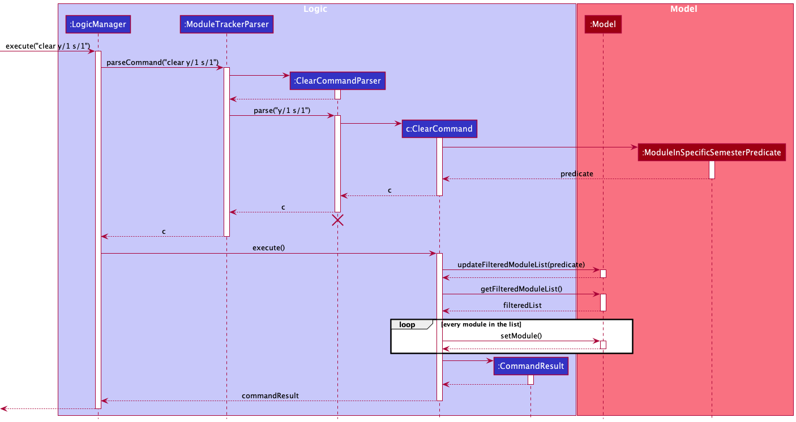
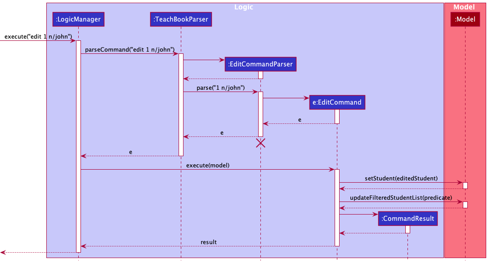

* Table of Contents
{:toc}

--------------------------------------------------------------------------------------------------------------------

## **Acknowledgements**

* {list here sources of all reused/adapted ideas, code, documentation, and third-party libraries -- include links to the original source as well}

--------------------------------------------------------------------------------------------------------------------

## **Setting up, getting started**

Refer to the guide [_Setting up and getting started_](SettingUp.md).

--------------------------------------------------------------------------------------------------------------------

## **Design**

:bulb: **Tip:** The `.puml` files used to create diagrams in this document can be found in the [diagrams](https://github.com/se-edu/addressbook-level3/tree/master/docs/diagrams/) folder. Refer to the [_PlantUML Tutorial_ at se-edu/guides](https://se-education.org/guides/tutorials/plantUml.html) to learn how to create and edit diagrams.

### Architecture

The ***Architecture Diagram*** given above explains the high-level design of the App.

Given below is a quick overview of main components and how they interact with each other.

**Main components of the architecture**

**`Main`** has two classes called [`Main`](https://github.com/se-edu/addressbook-level3/tree/master/src/main/java/seedu/address/Main.java) and [`MainApp`](https://github.com/se-edu/addressbook-level3/tree/master/src/main/java/seedu/address/MainApp.java). It is responsible for,
* At app launch: Initializes the components in the correct sequence, and connects them up with each other.
* At shut down: Shuts down the components and invokes cleanup methods where necessary.

[**`Commons`**](#common-classes) represents a collection of classes used by multiple other components.

The rest of the App consists of four components.

* [**`UI`**](#ui-component): The UI of the App.
* [**`Logic`**](#logic-component): The command executor.
* [**`Model`**](#model-component): Holds the data of the App in memory.
* [**`Storage`**](#storage-component): Reads data from, and writes data to, the hard disk.

**How the architecture components interact with each other**

The *Sequence Diagram* below shows how the components interact with each other for the scenario where the user issues the command `delete 1`.

Each of the four main components (also shown in the diagram above),

* defines its *API* in an `interface` with the same name as the Component.
* implements its functionality using a concrete `{Component Name}Manager` class (which follows the corresponding API `interface` mentioned in the previous point.

For example, the `Logic` component defines its API in the `Logic.java` interface and implements its functionality using the `LogicManager.java` class which follows the `Logic` interface. Other components interact with a given component through its interface rather than the concrete class (reason: to prevent outside component's being coupled to the implementation of a component), as illustrated in the (partial) class diagram below.

The sections below give more details of each component.

### UI component

The **API** of this component is specified in [`Ui.java`](https://github.com/se-edu/addressbook-level3/tree/master/src/main/java/seedu/address/ui/Ui.java)

The UI consists of a `MainWindow` that is made up of parts e.g.`CommandBox`, `ResultDisplay`, `PersonListPanel`, `StatusBarFooter` etc. All these, including the `MainWindow`, inherit from the abstract `UiPart` class which captures the commonalities between classes that represent parts of the visible GUI.

The `UI` component uses the JavaFx UI framework. The layout of these UI parts are defined in matching `.fxml` files that are in the `src/main/resources/view` folder. For example, the layout of the [`MainWindow`](https://github.com/se-edu/addressbook-level3/tree/master/src/main/java/seedu/address/ui/MainWindow.java) is specified in [`MainWindow.fxml`](https://github.com/se-edu/addressbook-level3/tree/master/src/main/resources/view/MainWindow.fxml)

The `UI` component,

* executes user commands using the `Logic` component.
* listens for changes to `Model` data so that the UI can be updated with the modified data.
* keeps a reference to the `Logic` component, because the `UI` relies on the `Logic` to execute commands.
* depends on some classes in the `Model` component, as it displays `Person` object residing in the `Model`.

### Logic component

**API** : [`Logic.java`](https://github.com/se-edu/addressbook-level3/tree/master/src/main/java/seedu/address/logic/Logic.java)

Here's a (partial) class diagram of the `Logic` component:

How the `Logic` component works:
1. When `Logic` is called upon to execute a command, it uses the `AddressBookParser` class to parse the user command.
1. This results in a `Command` object (more precisely, an object of one of its subclasses e.g., `AddCommand`) which is executed by the `LogicManager`.
1. The command can communicate with the `Model` when it is executed (e.g. to add a person).
1. The result of the command execution is encapsulated as a `CommandResult` object which is returned back from `Logic`.

The Sequence Diagram below illustrates the interactions within the `Logic` component for the `execute("delete 1")` API call.

:information_source: **Note:** The lifeline for `DeleteCommandParser` should end at the destroy marker (X) but due to a limitation of PlantUML, the lifeline reaches the end of diagram.

Here are the other classes in `Logic` (omitted from the class diagram above) that are used for parsing a user command:

How the parsing works:
* When called upon to parse a user command, the `AddressBookParser` class creates an `XYZCommandParser` (`XYZ` is a placeholder for the specific command name e.g., `AddCommandParser`) which uses the other classes shown above to parse the user command and create a `XYZCommand` object (e.g., `AddCommand`) which the `AddressBookParser` returns back as a `Command` object.
* All `XYZCommandParser` classes (e.g., `AddCommandParser`, `DeleteCommandParser`, ...) inherit from the `Parser` interface so that they can be treated similarly where possible e.g, during testing.

### Model component
**API** : [`Model.java`](https://github.com/AY2122S1-CS2103T-W17-2/tp/tree/master/src/main/java/seedu/tracker/model/Model.java)

The `Model` component,

* stores a `UserPrefs` object that represents the user's preferences.
* stores the `ModuleTracker` data, which contains data of modules, user's information and Mc progress.
* exposes various `ObservableList`s that can be 'observed' e.g. the UI can be bound to this list so that the UI automatically updates when the data in the list changes.
* does not depend on any of the other three components (as the `Model` represents data entities of the domain, they should make sense on their own without depending on other components).
  
  
A `Module` stores a `Title`, `Code`, `Description`, `Mc`, `AcademicCalendar` and zero or more `Tag`s.
  
A `UserInfo` stores a `Mc` as Mc goal and a `AcademicCalendar` as current semester.

### Storage component

**API** : [`Storage.java`](https://github.com/AY2122S1-CS2103T-W17-2/tp/tree/master/src/main/java/seedu/tracker/storage/Storage.java)

The `Storage` component,
* can save module tracker data, user's information and user preference data in JSON format, and read them back into corresponding objects.
* inherits from `ModuleTrackerStorage`, `UserInfoStorage` and `UserPrefStorage`, which means it can be treated as any one of the three (if only the functionality of only one is needed).
* depends on some classes in the `Model` component (because the `Storage` component's job is to save/retrieve objects that belong to the `Model`)

### Common classes

Classes used by multiple components are in the `seedu.moduletracker.commons` package.

--------------------------------------------------------------------------------------------------------------------

## **Implementation**

This section describes some noteworthy details on how certain features are implemented.

### Take a module feature

#### Implementation

The `take` command is implemented via the `TakeCommand` and `TakeCommandParser` classes.

The `TakeCommandParser` class implements the `Parser` interface and is responsible for parsing the user input to retrieve the index and `AcademicYear` object which represents the year and semester.  
The `TakeCommandParser#parse()` method does this, and returns a `TakeCommand` object containing the index and the `AcademicYear` object.

The `TakeCommand` class extends the `Command` class and implements the `TakeCommand#execute()` method which handles the main logic of the class.  
It contains non-null `index` and `academicCalendar` fields.  
When the `TakeCommand#execute()` method is called,

- The `Module` object corresponding to the `index` is found from the `Model`.
- A copy of the `Module` object containing the value of `academicCalendar` is created. The value of `academicCalendar` is stored in a corresponding field in this copy.
- The `Module` object in the `Model` is then replaced by this copy.

:information_source: **Note:**

- When a new `Module` object is added to the module tracker, its `academicCalendar` field is unassigned by default.
- Removing a schedule from a module is not supported in the `take` command, this functionality is instead moved to a separate `untake` command.
- If the module is already scheduled, its current `academicCalendar` field will be overridden by a new `AcademicCalendar` object.

Below is a sequence diagram, and an explanation of how `TakeCommand` is executed.

:information_source: **Note:** The lifeline for `TakeCommand` and `TakeCommandParser` should end at the destroy marker (X) but due to a limitation of PlantUML, the lifeline reaches the end of diagram.

**Step 1.** The user enters the command "take 2 y/1 s/2".

**Step 2.** ModuleTrackerParser takes in the user's input, and calls `TakeCommandParser#parse` to create a TakeCommand object containing the data parsed from the user input.
* In this case, the TakeCommand object contains the specified module index (`2`), and the academic year the specified module is scheduled for (`y/1 s/2`)

**Step 3.** The `TakeCommand` is then executed by calling its `execute` method.

**Step 4.** The module at the specified index (`2`) in the list is obtained from the `Model`.

**Step 5.** A copy of this module containing the specified academic calendar (`y/1 s/2`) is created. This copy is the scheduled module.

**Step 6.** The specified module in the `Model` is then replaced by the scheduled copy. The `Model` is also updated to reflect this change in the Mod Tracker.

Certain details have been omitted from the sequence diagram for simplicity, including:
* Details of how the specified module (`moduleToSchedule`) is obtained from the `Model`.
* Details of how the `Model` is updated to reflect the changes in the Mod Tracker.

#### Design considerations:

**Aspect: How the user can take a module**

- **Alternative 1 (current choice):** User uses a separate command (`take`) to take a module
    - Pros:
        - Allows some flexibility for the user if he has not decided when to take the module.
    - Cons:
        - More steps involved for the user to take a module.
- **Alternative 2:** User indicates the year and semester when adding the module to the tracker.
    - Pros:
        - Easier for the user to take a module as there are less steps involved.
    - Cons:
        - The `add` command will contain many arguments, which might make it difficult for users to remember.

**Aspect: Format of user input**

- **Alternative 1 (current choice):** Users use `y/`, `s/` prefixes to specify year and semester.
    - Pros:
        - Easier to parse user inputs to get the needed data.
    - Cons:
        - Less flexible for the user.
- **Alternative 2:** Users are allowed to specify the year and semester using string inputs (i.e. y1s2, year 1 semester 2)
    - Pros:
        - Greater flexibility for the user.
    - Cons:
        - More difficult to parse the user input to extract the needed data.
        - Is inconsistent with the format of other commands.

### Find modules feature

#### Implementation

The `find` command is implemented via the `FindCommand`, `FindCommandParser` and `NameContainsKeywordsPredicate` classes.

The `FindCommandParser` class implements the `Parser` interface and the `FindCommandParser#parse()` method is responsible for parsing the user input to retrieve the `args` String which represents the keywords to search the modules by.  
When the `FindCommandParser#parse()` method is called,

- The `args` String is converted into two arrays of String(s) called `nameKeywords` and `optionalFilter`.
- The `nameKeywords` array consists of the keywords to search the modules with and the `optionalFilter` array consists of specific components of the module to search for the keywords.
- A new `NameContainsKeywordsPredicate` object is created by passing in the arrays `nameKeywords` and `optionalFilter` as arguments.
- A `FindCommand` object is returned with the `NameContainsKeywordsPredicate` object as its argument.

The `NameContainsKeywordsPredicate` class implements the `Predicate` interface and the `NameContainsKeywordsPredicate#test()` method is responsible for checking if the given module contains any of the valid keywords.  
It contains the non-null `keywords` and `optionalFilter` fields, which is used to find the appropriate modules in the `NameContainsKeywordsPredicate#test()` method.  
When the `NameContainsKeywordsPredicate#test()` method is called, it takes in a `Module` and returns a boolean depending on whether the keyword is found inside the `module`.

The `FindCommand` class extends the `Command` class and implements the `FindCommand#execute()` method which handles the main logic of the class.  
It contains the non-null `predicate` field.  
When the `FindCommand#execute()` method is called,

- The `Model` object is updated with a new `predicate`.
- The `Model` filters the module list based on the given `predicate`.
- A `CommandResult` is returned with the updated `Model`.

#### Design considerations:

**Aspect: How the user can find a module**

- **Alternative 1 (current choice):** User uses a separate command (`find`) to take a module, along with additional optional parameters as filters.
    - Pros:
        - Gives the user more control when finding a specific module.
        - Allows the user to view a more curated/specific set of results.
    - Cons:
        - User might want to view a general set of modules.
        - Might be troublesome for the user to memorise all the optional parameters.
- **Alternative 2:** User uses a separate command (`find`) to take a module, without the use of additional optional parameters.
    - Pros:
        - Easier for the user to use as there is no need to memorise all the optional parameters.
    - Cons:
        - More error prone (such as users typing `find c` and the application returns all the modules, which has the same effect as using the list command.

**Aspect: Format of user input**

- **Alternative 1 (current choice):** Users use `c/`, `t/` prefixes to specify which components of the module to search in.
    - Pros:
        - Easier to parse user inputs to get the needed data.
    - Cons:
        - Less flexible for the user.
        - Might be troublesome for the user to memorise all the optional parameters.
- **Alternative 2:** Users are allowed to use generic prefixes to specify which components of the module to search in.
    - Pros:
        - Greater flexibility for the user and more intuitive for the user.
    - Cons:
        - Difficult for the application to differentiate between keywords and words for specifying a certain component.
        - Might be error prone (such as when the user wants to search the entire module with the keyword `title` but the program interprets it as searching inside the module title).
        - Is inconsistent with the format of other commands.
- **Alternative 3:** Users specify what value to search for in each prefix ie `y/3`, `s/2`.
    - Pros:
        - Allows search result to be more specific.
    - Cons:
        - Might be tedious for user to manually specify each field to search for.
        - Requires the user to know what to search for, which might be hard for users who do not have the specific details of the module.

### Clear modules feature

####Implementation

The `clear` command is implemented via the `ClearCommand`, `ClearCommandParser` and `ModuleInSpecificSemesterPredicate` classes.

The `ClearCommandParser` class implements the `Parser` interface.
The `ClearCommandParser#parse()` method is responsible for parsing the user input to retrieve the `AcademicYear` and `Semester` object which specify the semester that the user want to untake all modules in it. The method will return a `ClearCommand` object with `AcadenicCalendar` as its argument.
The `ClearCommandParser#arePrefixesPresent()` method is responsible to check if all fields stated in the arguments are provided.

The `ClearCommand` class extends the `Command` class and implements the `ClearCommand#execute()` method which handles the main logic of the class.
When the `ClearCommand#execute()` method is called,
- All `Module` objects which has the corresponding `AcademicCalendar` is filtered out from the `Model` and store in a list
- For each `Module` in the list, the `Module` is replaced by a copy of it without `AcademicCalander` field.
- A `CommandResult` is returned with the updated `Model`.

Below is a sequence diagram, and an explanation of how `ClearCommand` is executed.

**Step 1.** The user enters the command "clear 2 y/1 s/1".

**Step 2.** ModuleTrackerParser takes in the user's input, and calls `ClearCommandParser#parse` to create a `ClearCommand` object containing the data parsed from the user input.

**Step 3.** The `ClearCommand` is then executed by calling its `execute` method.

**Step 4.** The list of modules that is planed to take in the indicating semester is obtained from the `Model`.

**Step 5.** For each module in the filtered list, the academic plan is removed from the module.

**Step 6.** The `Model` is updated to reflect this change in the Mod Tracker.

#### Design Considerations:

**Aspect: How should clear command work**

- **Alternative 1(current choice)**: When a clear command is called, all modules in a specific semester will be untaked.
    - Pros:
      - Allow users to untake multiple modules conveniently.
      - User can replan the specific semester using clear command.
    - Cons:
      - The command name might be confusing
- **Alternative 2:** When a clear command is called, all modules in a specific semester will be deleted.
    - Pros:
      - Allow users to delete multiple modules conveniently.
      - User can replan the specific semester using clear command.
    - Cons:
      - User need to add all the modules again, if they want to use it later
- **Alternative 3:** When a clear command is called, all modules in the module tracker list will be deleted.
    - Pros:
      - Allow users to delete everything and restart conveniently
    - Cons:
      - All modules stored in the storage in advance will be deleted as well
      - User need to add all the modules again, once the clear command is called
      - It will be expensive, if the user accidentally use clear command

### Edit Module feature

####Implementation

The `edit` command is implemented via the `EditCommand`, `EditCommandParser` and `EditModuleDescriptor` classes.

The `EditCommandParser` class implements the `Parser` interface.
The `EditCommandParser#parse()` method is responsible for parsing the user input to retrieve the index of the module, fields user want to edit and its new value. The method will return an `EditCommand` object with parsed user input as its argument.

The `EditModuleDescriptor` is responsible for storing the details to edit the module with and replacing each non-empty field value to corresponding field value of the module.

The `EditCommand` class extends the `Command` class and implements the `EditCommand#execute()` method which handles the main logic of the class.
It contains non-null `index` and `editModuleDescriptor` fields.
When the `EditCommand#execute()` method is called,
- The `Module` object corresponding to the `index` is found from the `Model`.
- Create an edited copy of the module, and replace the original module.  
- A `CommandResult` is returned with the updated `Model`.

Below is an example sequence diagram and an explanation on how `EditCommand` is executed.

**Step 1.** The user enters the command "edit 1 c/2101".

**Step 2.** ModuleTrackerParser takes in the user's input, and calls `EditCommandParser#parse` to create an `EditCommand` object containing the data parsed from the user input.

**Step 3.** The `EditCommand` is then executed by calling its `execute` method.

**Step 4.** The module at the specified index (`2`) in the list is obtained from the `Model`.

**Step 5.** A copy of this module after substituting the edited fields with new values is created. 

**Step 6.** The specified module in the `Model` is then replaced by the edited copy. The `Model` is updated to reflect this change in the Mod Tracker.

### \[Proposed\] Undo/redo feature

#### Proposed Implementation

The proposed undo/redo mechanism is facilitated by `VersionedAddressBook`. It extends `AddressBook` with an undo/redo history, stored internally as an `addressBookStateList` and `currentStatePointer`. Additionally, it implements the following operations:

* `VersionedAddressBook#commit()` — Saves the current address book state in its history.
* `VersionedAddressBook#undo()` — Restores the previous address book state from its history.
* `VersionedAddressBook#redo()` — Restores a previously undone address book state from its history.

These operations are exposed in the `Model` interface as `Model#commitAddressBook()`, `Model#undoAddressBook()` and `Model#redoAddressBook()` respectively.

Given below is an example usage scenario and how the undo/redo mechanism behaves at each step.

Step 1. The user launches the application for the first time. The `VersionedAddressBook` will be initialized with the initial address book state, and the `currentStatePointer` pointing to that single address book state.

Step 2. The user executes `delete 5` command to delete the 5th person in the address book. The `delete` command calls `Model#commitAddressBook()`, causing the modified state of the address book after the `delete 5` command executes to be saved in the `addressBookStateList`, and the `currentStatePointer` is shifted to the newly inserted address book state.

Step 3. The user executes `add n/David …​` to add a new person. The `add` command also calls `Model#commitAddressBook()`, causing another modified address book state to be saved into the `addressBookStateList`.

:information_source: **Note:** If a command fails its execution, it will not call `Model#commitAddressBook()`, so the address book state will not be saved into the `addressBookStateList`.

Step 4. The user now decides that adding the person was a mistake, and decides to undo that action by executing the `undo` command. The `undo` command will call `Model#undoAddressBook()`, which will shift the `currentStatePointer` once to the left, pointing it to the previous address book state, and restores the address book to that state.

:information_source: **Note:** If the `currentStatePointer` is at index 0, pointing to the initial AddressBook state, then there are no previous AddressBook states to restore. The `undo` command uses `Model#canUndoAddressBook()` to check if this is the case. If so, it will return an error to the user rather
than attempting to perform the undo.

The following sequence diagram shows how the undo operation works:

:information_source: **Note:** The lifeline for `UndoCommand` should end at the destroy marker (X) but due to a limitation of PlantUML, the lifeline reaches the end of diagram.

The `redo` command does the opposite — it calls `Model#redoAddressBook()`, which shifts the `currentStatePointer` once to the right, pointing to the previously undone state, and restores the address book to that state.

:information_source: **Note:** If the `currentStatePointer` is at index `addressBookStateList.size() - 1`, pointing to the latest address book state, then there are no undone AddressBook states to restore. The `redo` command uses `Model#canRedoAddressBook()` to check if this is the case. If so, it will return an error to the user rather than attempting to perform the redo.

Step 5. The user then decides to execute the command `list`. Commands that do not modify the address book, such as `list`, will usually not call `Model#commitAddressBook()`, `Model#undoAddressBook()` or `Model#redoAddressBook()`. Thus, the `addressBookStateList` remains unchanged.

Step 6. The user executes `clear`, which calls `Model#commitAddressBook()`. Since the `currentStatePointer` is not pointing at the end of the `addressBookStateList`, all address book states after the `currentStatePointer` will be purged. Reason: It no longer makes sense to redo the `add n/David …​` command. This is the behavior that most modern desktop applications follow.

The following activity diagram summarizes what happens when a user executes a new command:

#### Design considerations:

**Aspect: How undo & redo executes:**

* **Alternative 1 (current choice):** Saves the entire address book.
  * Pros: Easy to implement.
  * Cons: May have performance issues in terms of memory usage.

* **Alternative 2:** Individual command knows how to undo/redo by
  itself.
  * Pros: Will use less memory (e.g. for `delete`, just save the person being deleted).
  * Cons: We must ensure that the implementation of each individual command are correct.

_{more aspects and alternatives to be added}_

### \[Proposed\] Data archiving

_{Explain here how the data archiving feature will be implemented}_

--------------------------------------------------------------------------------------------------------------------

## **Documentation, logging, testing, configuration, dev-ops**

* [Documentation guide](Documentation.md)
* [Testing guide](Testing.md)
* [Logging guide](Logging.md)
* [Configuration guide](Configuration.md)
* [DevOps guide](DevOps.md)

--------------------------------------------------------------------------------------------------------------------

## **Appendix: Requirements**

### Product scope

**Target user profile**:

* NUS CS students
* has a need to manage their Modular Credits(MCs)
* has a need to track the compulsory modules they are required to take
* can type fast
* prefers typing to mouse interactions
* is reasonably comfortable using CLI apps

**Value proposition**: keeps track of the number of MCs completed and how many left to complete for the whole course
of study, which is a feature lacking in current tools.

### User stories

Priorities: High (must have) - `* * *`, Medium (nice to have) - `* *`, Low (unlikely to have) - `*`

| Priority | As a …​                                                   | I want to …​                                         | So that I can…​                                                     |
| -------- | ------------------------------------------------------------ | ------------------------------------------------------- | ---------------------------------------------------------------------- |
| `* * *`  | user                                                         | see usage instructions                                  | refer to instructions when I forget how to use the App                 |
| `* * *`  | CS student                                                   | view the modules for my major                           | keep track of the modules I may take
| `* * *`  | CS student                                                   | mark the module as selected for the current semester    | make a academic plan for the current semester
| `* * *`  | CS student                                                   | view the modules I'm currently taking                   | remember the modules I am currently taking
| `* * *`  | CS student                                                   | delete modules                                          | remove modules that I no longer intend to take
| `* * *`  | CS student                                                   | edit the module details                                 | modify information for any module entry
| `* * *`  | CS student                                                   | add new modules                                         | specify new modules that I intend to take
| `* * *`  | CS student                                                   | view the modules I have taken                           | keep track of the modules that I have taken
| `* * *`  | CS student                                                   | view the modules I plan to take in the future           | be able to plan which modules I will take in advance
| `* * *`  | CS student                                                   | mark a module I have taken as done                      | only choose the modules I have not taken for my future plan
| `* * *`  | CS student who want to find a specific module                | search for a module by keywords/code                    | search for specific modules easily
| `* * *`  | CS student who is looking for a specific kind of modules     | view my module plan for each semester                   | see my plan for each semester easily
| `* * *`  | first time user                                              | see some sample modules when I open the app             | easily try out its features
| `* * *`  | CS student                                                   | view the number of MCs I have taken                     | keep track of my degree progress
| `* * *`  | CS student who is making a module plan                       | specify modules to take for each semester               | make a academic plan for my whole course of study
| `* *  `  | CS student                                                   | tag modules according to type                           | keep track of my modules for each degree requirement (such as GE/UE/Focus Area)
| `* *  `  | CS student                                                   | view the number of MCs left to take before graduating   | determine if I am on track to graduate on time
| `* *  `  | CS student                                                   | view the number of MCs completed for each course requirement   | keep track of my degree progress
| `* *  `  | CS student                                                   | add "DIY" modules                                       | keep track of "DYOM" modules
| `* *  `  | CS student who is looking for modules                        | sort the modules according to the level (1k/2k/3k…)     | know the workload difficulty of the modules
| `* *  `  | CS student                                                   | see which modules I can exercise my S/U option on        | decide how to use my S/Us better
| `* *  `  | CS student                                                   | see how many S/U credits I have left                    | have a better understanding of S/U credit usage
| `* *  `  | CS student                                                   | view my grade for modules I have taken                  | keep track of my grades
| `* *  `  | CS student                                                   | see the marking scheme for CS modules                   | have a full understanding of the module
| `* *  `  | CS student who needs module help                             | see the contact information of professors for the module| easily reach professors when needed
| `* *  `  | CS student who does not like the default font style/size     | change the font style/size                              | have a more comfortable user experience
| `* *  `  | clueless CS student                                          | see the recommended module plan for my major            | make a better plan according to the suggestion
| `*    `  | CS student                                                   | keep track of my CAP                                    | monitor my learning in NUS
| `*    `  | CS student who is making a module plan                       | change the colour scheme of each module                 | easily differentiate between different modules
| `*    `  | CS student who is making a module plan                       | find free slots in my plan                              | add other modules in these free slots
| `*    `  | forgetful CS student                                         | get notified when it's time for class                   | attend the classes on time
| `*    `  | forgetful CS student                                         | get notified when exam dates are approaching            | be aware of important assessments

*{More to be added}*

### Use cases

(For all use cases below, the **System** is `NUS Mod Tracker` and the **Actor** is the `user`, unless specified otherwise)

#### Database Features

**UC1: Delete a Module from the Database**

**MSS**

1. User requests to delete a specific module in the list of modules in the database.
2. NUS Mod Tracker deletes the module from the database.

    Use case ends.

**Extensions**

* 1a. The given module index is invalid.
    * 1a1. NUS Mod Tracker shows an error message.

      Use case resumes at step 1.

**UC2: Edit a module**

**MSS**

1. User requests to edit a specific module in the database.
2. NUS Mod Tracker edits the module.

    Use case ends.

**Extension**

* 1a. The given module index or arguments are invalid.
    * 1a1. NUS Mod Tracker shows an error message.
    
    Use case resumes at step 1.
* 1b. The user failed to provide any mandatory details to be edited.
    * 1b1. NUS Mod Tracker shows an error message.
    
    Use case resumes at step 1.
* 1c. The new value that is given to the code field is already exists in the database.
    * 1c1. NUS Mod Tracker shows an error message.
    
    Use case resumes at step 1.

#### Academic Plan Features

**UC3: Add a Module to the Academic Plan**

**MSS**

1. User requests to add a specific module to the academic plan.
2. NUS Mod Tracker adds the module to the academic plan under the specified year and semester.

    Use case ends.

**Extensions**
* 1a. The given module index or arguments are invalid.
  * 1a1. NUS Mod Tracker shows an error message.
  
    Use case resumes at step 1.

**UC4: Remove a Module from the Academic Plan**

**MSS**

1. User requests to remove a specific module from the academic plan.
2. NUS Mod Tracker removes the module from the academic plan.

   Use case ends.

**Extensions**
* 1a. The given module index is invalid.
  * 1a1. NUS Mod Tracker shows an error message.

    Use case resumes at step 1.
* 1b. The specified module is not in the academic plan.
  * 1b1. NUS Mod Tracker shows an error message.
    
    Use case resumes at step 1.
    
**UC5: Remove all modules in a specific semester from the academic plan**

**MSS**

1. User requests to remove modules in a specific semester from the academic plan.
2. NUS Mod Tracker removes all modules in that semester from the academic plan.

    Use case ends.

**Extension**

* 1a. The given semester is invalid.
    * 1a1. NUS Mod Tracker shows an error message.
    
    Use case resumes at step 1.

### Non-Functional Requirements

1.  Should work on any _mainstream OS_ as long as it has Java `11` or above installed.
2.  Should be able to hold up to 100 modules without a noticeable sluggishness in performance for typical usage.
3.  A user with above average typing speed for regular English text (i.e. not code, not system admin commands) should be able to accomplish most of the tasks faster using commands than using the mouse.
4.  New users can have a grasp of the core features quickly with the help of user guide.
5.  Should work properly no matter where the application is stored.
6.  This product will not be connected to the internet, it will be a totally offline application.
*{More to be added}*
### Glossary

* **Mainstream OS**: Windows, Linux, Unix, OS-X
* **Private contact detail**: A contact detail that is not meant to be shared with others

--------------------------------------------------------------------------------------------------------------------

## **Appendix: Instructions for manual testing**

Given below are instructions to test the app manually.

:information_source: **Note:** These instructions only provide a starting point for testers to work on;
testers are expected to do more *exploratory* testing.

### Launch and shutdown

1. Initial launch

   1. Download the jar file and copy into an empty folder

   1. Double-click the jar file Expected: Shows the GUI with a set of sample contacts. The window size may not be optimum.

1. Saving window preferences

   1. Resize the window to an optimum size. Move the window to a different location. Close the window.

   1. Re-launch the app by double-clicking the jar file. 
       Expected: The most recent window size and location is retained.

1. _{ more test cases …​ }_

### Deleting a person

1. Deleting a person while all persons are being shown

   1. Prerequisites: List all persons using the `list` command. Multiple persons in the list.

   1. Test case: `delete 1` 
      Expected: First contact is deleted from the list. Details of the deleted contact shown in the status message. Timestamp in the status bar is updated.

   1. Test case: `delete 0` 
      Expected: No person is deleted. Error details shown in the status message. Status bar remains the same.

   1. Other incorrect delete commands to try: `delete`, `delete x`, `...` (where x is larger than the list size) 
      Expected: Similar to previous.

1. _{ more test cases …​ }_

### Saving data

1. Dealing with missing/corrupted data files

   1. _{explain how to simulate a missing/corrupted file, and the expected behavior}_

1. _{ more test cases …​ }_
