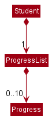
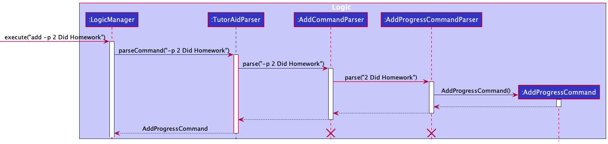
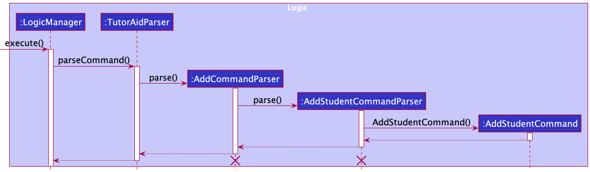
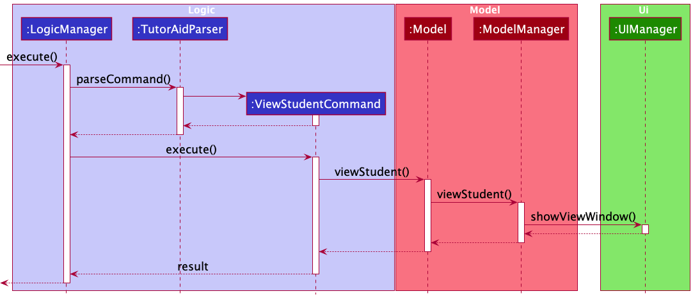
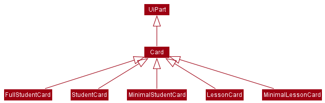
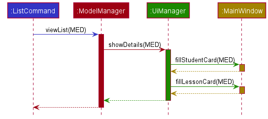
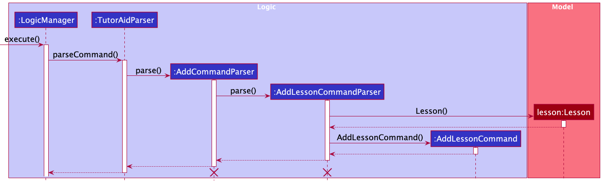
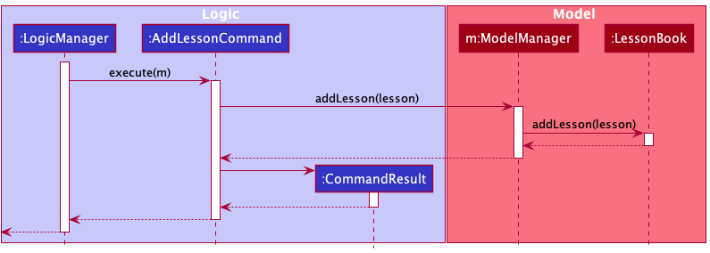

## Table of Contents
1. [Acknowledgements](#acknowledgements)
2. [Setting up, getting started](#setting-up-getting-started)
3. [Design](#design)
4. [Architecture](#architecture)
   - [UI component](#ui-component)
   - [Logic component](#logic-component)
   - [Model component](#model-component)
   - [Storage component](#storage-component)
   - [Common classes](#common-classes)
5. [Implementation](#implementation)
   - [Add progress feature](#add-progress-feature)
   - [Add student feature](#add-student-feature)
   - [View student/lesson feature](#view-studentlesson-feature)
   - [Card-like UI Elements](#card-like-ui-elements)
   - [Add lesson feature](#add-lesson-feature)
   - [[Proposed] Undo/redo feature](#proposed-undoredo-feature)
   - [[Proposed] Data archiving](#proposed-data-archiving)
7. [Documentation, logging, testing, configuration, dev-ops](#documentation-logging-testing-configuration-dev-ops)
8. [Appendix: Requirements](#appendix-requirements)
   - [Product Scope](#product-scope)
   - [User stories](#user-stories)
   - [Use cases](#use-cases)
   - [Non-Functional Requirements](#non-functional-requirements)
   - [Glossary](#glossary)
9. [Appendix: Instructions for manual testing](#appendix-instructions-for-manual-testing)
   - [Launch and shutdown](#launch-and-shutdown)
   - [Deleting a person](#deleting-a-person)
   - [Saving data](#saving-data)

--------------------------------------------------------------------------------------------------------------------

## **Acknowledgements**

* This project is based on the AddressBook-Level3 project created by the [SE-EDU initiative](https://se-education.org).

--------------------------------------------------------------------------------------------------------------------

## **Setting up, getting started**

Refer to the guide [_Setting up and getting started_](SettingUp.md).

--------------------------------------------------------------------------------------------------------------------

## **Design**

:bulb: **Tip:** The `.puml` files used to create diagrams in this document can be found in the [diagrams](https://github.com/AY2122S1-CS2103T-W16-3/tp/tree/master/docs/diagrams) folder. Refer to the [_PlantUML Tutorial_ at se-edu/guides](https://se-education.org/guides/tutorials/plantUml.html) to learn how to create and edit diagrams.

### Architecture

The ***Architecture Diagram*** given above explains the high-level design of TutorAid.

Given below is a quick overview of main components and how they interact with each other.

**Main components of the architecture**

The architecture of TutorAid can first be divided into 6 components: `Main`, `Commons`, `UI`, `Logic`, `Model` and `Storage`

1. `Main`
* Has two classes called [`Main`](https://github.com/AY2122S1-CS2103T-W16-3/tp/blob/master/src/main/java/tutoraid/Main.java) and [`MainApp`](https://github.com/AY2122S1-CS2103T-W16-3/tp/blob/master/src/main/java/tutoraid/MainApp.java).
* It is responsible for the following operations:
  * At app launch: Initializes the components in the correct sequence, and connects them up with each other. 
  * At shut down: Shuts down the components and invokes cleanup methods where necessary.

2. [**`Commons`**](#common-classes)
* Represents a collection of classes used by multiple other components.

3. [**`UI`**](#ui-component)
* Represents the UI of the App.
  
4. [**`Logic`**](#logic-component)
* Serves as the command executor.
  
5. [**`Model`**](#model-component)
* Holds the data of the App in memory.
  
6. [**`Storage`**](#storage-component)
* Reads data from, and writes data to, the hard disk.

**How the architecture components interact with each other**

The *Sequence Diagram* below shows how the components interact with each other for the scenario where the user issues the command `del -s 1`.

Each of the four main components shown in the diagram above:
* Defines its *API* in an `interface` with the same name as the component.
* Implements its functionality using a concrete `{Component Name}Manager` class (which follows the corresponding API `interface` mentioned above).

For example, the `Logic` component defines its API in the `Logic.java` interface. It also implements its functionality using the `LogicManager.java` class, which is based on the `Logic` interface. Other components interact with a given component through its interface rather than the concrete class as illustrated in the (partial) class diagram below. It is designed as such to prevent outside components being coupled to the implementation of a component.

### Components

The sections below provide more details on the following components: `UI`, `Logic`, `Model` and `Storage`.

#### UI component

The **API** of this component is specified in [`Ui.java`](https://github.com/AY2122S1-CS2103T-W16-3/tp/blob/master/src/main/java/tutoraid/ui/Ui.java)

The UI consists of a `MainWindow` that is made up of parts e.g.`CommandBox`, `ResultDisplay`, `StudentListPanel`, `LessonListPanel`, `StatusBarFooter` etc. All these, including the `MainWindow`, inherit from the abstract `UiPart` class which captures the commonalities between classes that represent parts of the visible GUI.

The `UI` component uses the JavaFx UI framework. The layout of these UI parts are defined in matching `.fxml` files that are in the `src/main/resources/view` folder. For example, the layout of the [`MainWindow`](https://github.com/AY2122S1-CS2103T-W16-3/tp/blob/master/src/main/java/tutoraid/ui/MainWindow.java) is specified in [`MainWindow.fxml`](https://github.com/AY2122S1-CS2103T-W16-3/tp/blob/master/src/main/resources/view/MainWindow.fxml)

The `UI` component,

* executes user commands using the `Logic` component.
* listens for changes to `Model` data so that the UI can be updated with the modified data.
* keeps a reference to the `Logic` component, because the `UI` relies on the `Logic` to execute commands.
* depends on some classes in the `Model` component, as it displays `Student` and `Lesson` objects residing in the `Model`.

#### Logic component

**API** : [`Logic.java`](https://github.com/AY2122S1-CS2103T-W16-3/tp/blob/master/src/main/java/tutoraid/logic/Logic.java)

Here's a (partial) class diagram of the `Logic` component:

The `Logic` component mainly works in 2 different ways for 2 different types of commands:

**Commands with a unique command word**

This applies to the commands `help`, `clear` and `exit`.
  
The `Logic` component works as such:
1. When `Logic` is called upon to execute a command, it uses the `TutorAidParser` class to parse the user command.
2. This results in a `Command` object (or more precisely, an object of one of its subclasses e.g., `HelpCommand`), which is executed by the `LogicManager`.
3. The command can communicate with the `Model` when it is executed (e.g. to open the help window).
4. The result of the command execution is encapsulated as a `CommandResult` object which is returned from `Logic`.

The Sequence Diagram below illustrates the interactions within the `Logic` component for the `execute("help")` API call.

  
**Commands with non-unique command word**

Commands that have the same command word as (at least) 1 other command (e.g. `add -s` and `add -l`) is known to have a non-unique command word.
This applies to all the commands in TutorAid apart from those mentioned in the section above.

The process of parsing for commands with non-unique command words differs from those with unique command words as an additional step is required to differentiate between commands that share the same command word.

Below are the other classes in `Logic` (omitted from the class diagram above) that are used for parsing a command with non-unique command words:

:bulb: All `XYCommandParser` classes (e.g., `AddCommandParser`, `DeleteCommandParser`, ...) inherit from the `Parser` interface so that they can be treated similarly where possible e.g, during testing

The `Logic` component works as such:
1. When `Logic` is called upon to execute a command, it uses the `TutorAidParser` class to parse the user command.
2. The result of the above step is then **further parsed** by another `Parser` class (specifically a class named after a command word e.g., `AddCommandParser`).
3. A `Command` object (or more precisely, an object of one of its subclasses e.g., `AddStudentCommand`) is then created and is executed by the `LogicManager`.
4. The command can communicate with the `Model` when it is executed (e.g. to add a student).
6. The result of the command execution is encapsulated as a `CommandResult` object which is returned from `Logic`.

Here's a Sequence Diagram that illustrates the interactions within the `Logic` component for the `execute("del -s 1")` API call.

:information_source: **Note:** The lifeline for `DeleteCommandParser` should end at the destroy marker (X) but due to a limitation of PlantUML, the lifeline reaches the end of diagram.

:bulb: Most of the interactions between the `DeleteStudentCommand` object and the objects of the `Model` class have not been depicted in this diagram as the focus lies in the interactions within the `Logic` class.

#### Model component
**API** : [`Model.java`](https://github.com/AY2122S1-CS2103T-W16-3/tp/blob/master/src/main/java/seedu/address/model/Model.java)

The `Model` component,

* stores the address book data i.e., all `Person` objects (which are contained in a `UniquePersonList` object).
* stores the currently 'selected' `Person` objects (e.g., results of a search query) as a separate _filtered_ list which is exposed to outsiders as an unmodifiable `ObservableList<Person>` that can be 'observed' e.g. the UI can be bound to this list so that the UI automatically updates when the data in the list change.
* stores a `UserPref` object that represents the user’s preferences. This is exposed to the outside as a `ReadOnlyUserPref` objects.
* does not depend on any of the other three components (as the `Model` represents data entities of the domain, they should make sense on their own without depending on other components)

:information_source: **Note:** An alternative (arguably, a more OOP) model is given below. It has a `Tag` list in the `AddressBook`, which `Person` references. This allows `AddressBook` to only require one `Tag` object per unique tag, instead of each `Person` needing their own `Tag` objects. 

#### Storage component

**API** : [`Storage.java`](https://github.com/AY2122S1-CS2103T-W16-3/tp/blob/master/src/main/java/tutoraid/storage/Storage.java)

The `Storage` component,
* can save students' data, lessons' data and user preference data in json format, and read them back into corresponding objects.
* inherits from `TutorAidStudentStorage`, `TutorAidLessonStorage` and `UserPrefStorage`, which means it can be treated as either one (if only the functionality of only one is needed).
* depends on some classes in the `Model` component (because the `Storage` component's job is to save/retrieve objects that belong to the `Model`)

### Common classes

Classes used by multiple components are in the `seedu.addressbook.commons` package.

## **Implementation**

This section describes some noteworthy details on how certain features are implemented.

### Add progress feature

#### Implementation

The add progress feature adds a progress entry to an existing student in TutorAid. Each student can have up to 10 progress entries. 
Adding a new entry to a student who already has 10 such entries will result in the deletion of the oldest entry.

This feature implements the following operations:
* `AddProgressCommand#execute()` —Creates a `Progress` object and adds it to a `ProgressList` object of a `Student` object
in TutorAid.

It is also facilitated by the methods below:
* `TutorAidParser#parseCommand()` — Checks for the command word that is required for the addition of a progress entry.
* `AddCommandParser#parse()` — Checks for the command flag that specifies the addition of a progress entry.
* `AddProgressCommandParser#parse()` — Parses the individual arguments to create a `Progress` object.

When a `Student` object is created, a `ProgressList` object is created for this `Student` object. This `ProgressList` object
stores an `ArrayList` of type `Progress` that keeps track of a maximum of 10 `Progress` objects. We implement `ProgressList`
as a field in `Student`.

Given below is an example of what happens when the user attempts to add a progress entry to a student in TutorAid
by entering a command:

`add -p 2 Did Homework​`

Below is the sequence diagram that depicts the parsing of the `add -p` command:

1. `LogicManager#execute()` is executed, where the above user input is passed into `TutorAidParser#parseCommand()`.

2. `TutorAidParser#parseCommand()` then extracts the first keyword of every command. Since the keyword `add` would be
   extracted, the remaining arguments of the command (`-p 2 Did Homework​`) are then passed into
   `AddCommandParser#parse()`.

3. `AddCommandParser#parse()` extracts the command flag `-p` at the start of its argument, which denotes the addition
   of a progress. Thus, the remaining (`2 Did Homework​`) is then passed into `AddProgressCommandParser#parse()`.

4. The remaining (`2 Did Homework​`) is then parsed into targetIndex `2` and progress with the description 
   `Did Homework`, which are then used to construct an `AddProgressCommand` object that will be returned to
   `LogicManager`. 

:information_source: **Note:** 
At this point, if `AddProgressCommandParser#parse()` detects that invalid input has been supplied, the command will fail 
its execution and `ParseException` will be thrown.

Below is the sequence diagram that depicts how `AddProgressCommand` gets the student to edit and then add the progress
to the student:

5. `LogicManager#execute()` then calls upon `AddProgressCommand#execute()`. It communicates with the `Model` to get the
   index-specified `Student` instance.

6. `AddProgressCommand` calls the `Student#addProgress()` to add the new progress to the specified student.

7. `AddProgressCommand` then calls the `Model#viewStudent()` to signal `Model` to view this student's details.

8. The result of the `AddProgressCommand` execution is then encapsulated as a `CommandResult` object, which is
   returned to `LogicManager`.

#### Design considerations:

**Aspect: How to keep track of all the progress (maximum 10) of a student:**

* **Alternative 1 (current choice):** Implements a ProgressList class.
    * Pros: Abstracts away the management of progress from the `Student` class.
    * Cons: Potentially more dependency.

* **Alternative 2:** Implements an `ArrayList` of type `Progress` in the `Student` class.
    * Pros: Easier to implement.
    * Cons: Student class may have too many responsibilities.

### Add student feature

#### Implementation

This feature adds a student contact to TutorAid. A student contact consists of the student's name, student's contact number, the parent's name and parent's contact number. 

The feature is mainly implemented by the following methods:
* `AddStudentCommand::execute()` — Adds a `Student` object to TutorAid.
  
It is also additionally facilitated by the methods below:
* `TutorAidParser#parseCommand()` — Checks for the command word that is required for the addition of a student 
  contact.
* `AddCommandParser#parse()` — Checks for the command flag that specifies the addition of a student contact.
* `AddStudentCommandParser#parse()` — Parses the individual arguments to create a `Student` object.
* `ModelManager#addStudent()` — Represents the in-memory model of TutorAid's student book data.
* `StudentBook#addStudent()` — Adds a student to TutorAid's student book.

Given below is an example of what happens when the user attempts to add a student contact to TutorAid by entering 
a command `add -s sn/John Doe …​`:

1. The command is first passed into `TutorAidParser#parseCommand()`, which extracts the first keyword of every command. 
   Since the keyword `add` would be extracted, the remaining arguments of the command (`-s sn/John Doe …​`) are passed 
   then into `AddCommandParser#parse()`.

2. `AddCommandParser#parse()` extracts the command flag `-s` at the start of its argument, which denotes the addition 
   of a student contact. Thus, the remaining (`sn/John Doe …​`) is passed into `AddStudentCommandParser#parse`.

3. Each of the different arguments of student contact, such as the student name, student contact number, parent name 
   and parent number, is parsed by `AddStudentCommandParser#parse()` based on the given input. 

:information_source: **Note:** 
At this point, if `AddStudentCommandParser#parse()` detects that no student name has been supplied, the command will fail 
its execution and `ParseException` will be thrown.

4. For optional parameters, which are all parameters other the student's name, if the argument is not supplied by the
   user, a default argument (`""`) is instead supplied by the `AddStudentCommandParser#parse()`.

Below is the sequence diagram that depicts the parsing of the `add -s` command:

5. The individual arguments for the student contact are then passed into `Model#Student()` to create a `Student` object. 

6. The `AddStudentCommand#execute()` is then called upon to add the student into TutorAid. This in turn calls on 
   `ModelManager#addStudent()` and `StudentBook#addStudent()` to store the details of the new student contact in memory. 
   
7. Lastly, a `CommandResult` object is returned to notify the user that the student has been successfully added.

:information_source: **Note:** 
If the student object created appears to be a duplicate of an existing contact (a contact is said to be a duplicate if 
all of its fields are the same as that of an existing contact), the new student object will not be stored in 
TutorAid and user will be alerted of the duplicate instead. 

Below is the sequence diagram that depicts an overview of a student contact being successfully added to TutorAid:

### Design considerations:

**Aspect: How to differentiate the `add -s` command from other `add` commands:**

* **Alternative 1 (current choice):** The `add` command word and `-s` command flag 
  are parsed one after another, in two different classes. 
    * Pros: Better use of abstraction and increases cohesion, where one class only extracts the command word and 
      another class extracts the command flag.
    * Cons: Time taken to execute the command may increase as more classes and methods are required to execute it.

* **Alternative 2:** The `add` command word and `-s` command flag are parsed in the same class, by the same method. 
    * Pros: Command can be executed quickly as only one method is required to parse the command.
    * Cons: Having a single parse method may result in the method having multiple responsibilities to parse various 
      parts of a command, such as the command word, command flag and arguments.

### View student/lesson feature

#### Implementation

The proposed view student/lesson mechanism is facilitated by `ModelManager`. It implements `Model`, stored internally as a `modelManagerStateList` and `currentStatePointer`. Additionally, it implements the following operations:

* `ModelManager#viewStudent()` — Updates student panel with the student of interest and lesson panel with the lessons the student of interest is in.
* `ModelManager#viewLesson()` — Updates lesson panel with the lesson of interest and student panel with the students that are in this lesson of interest.

This operation is exposed in the `Model` interface as `Model#viewStudent()` and `Model#viewLesson()`.

Given below is an example usage scenario and how the view student mechanism behaves at each step.

Step 1. The user launches the application for the first time. The `ModelManager` will be initialized with the initial model manager state, and the `currentStatePointer` pointing to that single model manager state.

Step 2. The user executes `view -s 1` command to view the 1st student in TutorAid. The `view -s` command calls `Model#viewStudent()`, causing the modified state of model manager after the `view -s 1` command executes to be saved in the `modelManagerStateList`, and the `currentStatePointer` pointing to that model manager state.

The following sequence diagram shows how the view student operation works:

A similar execution scenario can be expected for view lesson mechanism.

#### Design considerations

**Aspect: How view student/lesson executes:**

* **Alternative 1 (current choice):** Filters and updates view panel on command.
    * Pros: Easy to implement.
    * Cons: May have performance issues in terms of memory usage.

* **Alternative 2:** Filter list beforehand and update view panel on command.
    * Pros: Will use less memory (e.g. for `view -s`, just load the pre-generated student panel).
    * Cons: We must ensure that all possible view panels combinations are covered and this might cause slower application initialization.
    
### Card-like UI Elements

Card-like UI elements are objects that are shown to the user in their respective list panels, such as `StudentCard` which is displayed in the `StudentListPanel`. These cards come in two flavours: a fully-detailed variant and a minimally-detailed variant. The fully-detailed variant shows all properties while the minimally-detailed variant keeps the list compact and allows the user to view more entries. 

These UI elements inherit the `Card` class, which in turn inherits `UiPart<Region>`. 

At all times, the `LessonListPanel` and `StudentListPanel` in the `MainWindow` will display Lessons and Students from the model using either the fully-detailed or minimal `Card` objects. The variant being displayed depends on the user command: `list -a` will cause both panels to display all details while `list` will cause both panels to display only minimal details. Most other commands that affect the `Model` will cause all information to be displayed.

There are thus two static instances of `StudentListPanel` and `LessonListPanel` each - one for each variant. Every time the `Model` is updated, `MainWindow#fillStudentCard` and `MainWindow#fillLessonCard` will be called to ensure that the correct variant is displayed in the `MainWindow`. The sequence diagram below shows how this works:

When `fillStudentCard(true)` or `fillLessonCard(true)` are called, the `studentListPanelPlaceholder` and `lessonListPanelPlaceholder` in `MainWindow` are cleared of its nodes to prepare them to accept new nodes (panels). Then, the correct `studentListPanel` and `lessonListPanel` with all details are inserted, thus displaying the fully-detailed panels to the user.

Conversely, if a user chooses to hide the details, `UiManager#hideViewWindow()` will be called instead, which will call `fillStudentCard(false)` and `fillLessonCard(false)` and hide the details.

The above applies to the scenario when the user inputs a command which calls a method that changes the detail visibility of the cards. In contrast, during the application launch, `MainApp` calls the `start` method of `UiManager` which calls `MainWindow#fillInnerParts`. The details are shown below:

The panels default to the minimal panels for the application launch.

### Add lesson feature

#### Implementation

This feature adds a lesson to TutorAid. A lesson consists of the lesson name, capacity, pricing, timing and student list.

This feature implements the following operations:

* `AddLessonCommand#execute()` - Adds a `Lesson` object to TutorAid.

This feature is additionally facilitated by the following operations:

* `TutorAidParser#parseCommand()` - Checks for the command word that is required for the addition of a lesson.
* `AddCommandParser#parse()` - Checks for the command flag that specifies the addition of a lesson.
* `AddLessonCommandParser#parse()` - Parses the arguments provided to create a `Lesson` object.

To represent a lesson and its details, a `Lesson` class is introduced. Its class diagram can be seen below.

Given below is an example usage scenario for adding a lesson to TutorAid, and how the command is executed.

1. The user executes `add -l n/Maths 1 c/15` to add a lesson named `Maths 1` which has a capacity of `15` to TutorAid. `LogicManager#execute()` is executed, where the user input is passed into `TutorAidParser#parseCommand()`. 

2. This in turn calls `AddCommandParser#parse()`, where the string `-l n/Maths 1 c/15` is passed in as the argument. Due to the command flag `-l` at the start of the argument, `AddLessonCommandParser#parse()` is called to parse the remaining parameters `n/Maths 1 c/15` into lesson details.

:information_source: **Note:** 
At this point, if `AddLessonCommandParser#parse()` detects that no lesson name has been supplied, the command will fail 
its execution and `ParseException` will be thrown.

3. The original arguments (Maths 1 and 15) are used for the parameters `lessonName` and `capacity` respectively. Since the optional parameters (`price` and `timing`) are not provided in the command, a default argument (`""`)  is supplied for these parameters. These parameters are then used to create `LessonName`, `Price`, `Capacity` and `Timing` instances.

4. These individual instances, along with a `Students` object containing an empty `ArrayList<Student>`,  are then used to create a `Lesson` object. This `Lesson` instance is used to create a `AddLessonCommand` object.

Below is the sequence diagram that depicts the parsing of the command `add -l n/Maths 1 c/15`, and the instantiation of the `AddLessonCommand` object.

5. `AddLessonCommand#execute()` is then called to add the lesson to TutorAid. 

:information_source: **Note:** 
At this point, if the newly created lesson has the same lesson name as an existing lesson in TutorAid, the lesson will not be added into TutorAid, and the user will be alerted of this.

6. This in turn calls on `ModelManager#addLesson()` and `LessonBook#addLesson()` to store the details of the new lesson in memory. 

7. A `CommandResult` object is then created and returned to notify the user that the lesson, with the specified details, has been successfully added to TutorAid.

Below is the sequence diagram that depicts the adding of the newly created `Lesson` object to TutorAid.

### \[Proposed\] Undo/redo feature

#### Proposed Implementation

The proposed undo/redo mechanism is facilitated by `VersionedAddressBook`. It extends `AddressBook` with an undo/redo history, stored internally as an `addressBookStateList` and `currentStatePointer`. Additionally, it implements the following operations:

* `VersionedAddressBook#commit()` — Saves the current address book state in its history.
* `VersionedAddressBook#undo()` — Restores the previous address book state from its history.
* `VersionedAddressBook#redo()` — Restores a previously undone address book state from its history.

These operations are exposed in the `Model` interface as `Model#commitAddressBook()`, `Model#undoAddressBook()` and `Model#redoAddressBook()` respectively.

Given below is an example usage scenario and how the undo/redo mechanism behaves at each step.

Step 1. The user launches the application for the first time. The `VersionedAddressBook` will be initialized with the initial address book state, and the `currentStatePointer` pointing to that single address book state.

Step 2. The user executes `delete 5` command to delete the 5th person in the address book. The `delete` command calls `Model#commitAddressBook()`, causing the modified state of the address book after the `delete 5` command executes to be saved in the `addressBookStateList`, and the `currentStatePointer` is shifted to the newly inserted address book state.

Step 3. The user executes `add n/David …​` to add a new person. The `add` command also calls `Model#commitAddressBook()`, causing another modified address book state to be saved into the `addressBookStateList`.

:information_source: **Note:** If a command fails its execution, it will not call `Model#commitAddressBook()`, so the address book state will not be saved into the `addressBookStateList`.

Step 4. The user now decides that adding the person was a mistake, and decides to undo that action by executing the `undo` command. The `undo` command will call `Model#undoAddressBook()`, which will shift the `currentStatePointer` once to the left, pointing it to the previous address book state, and restores the address book to that state.

:information_source: **Note:** If the `currentStatePointer` is at index 0, pointing to the initial AddressBook state, then there are no previous AddressBook states to restore. The `undo` command uses `Model#canUndoAddressBook()` to check if this is the case. If so, it will return an error to the user rather
than attempting to perform the undo.

The following sequence diagram shows how the undo operation works:

:information_source: **Note:** The lifeline for `UndoCommand` should end at the destroy marker (X) but due to a limitation of PlantUML, the lifeline reaches the end of diagram.

The `redo` command does the opposite — it calls `Model#redoAddressBook()`, which shifts the `currentStatePointer` once to the right, pointing to the previously undone state, and restores the address book to that state.

:information_source: **Note:** If the `currentStatePointer` is at index `addressBookStateList.size() - 1`, pointing to the latest address book state, then there are no undone AddressBook states to restore. The `redo` command uses `Model#canRedoAddressBook()` to check if this is the case. If so, it will return an error to the user rather than attempting to perform the redo.

Step 5. The user then decides to execute the command `list`. Commands that do not modify the address book, such as `list`, will usually not call `Model#commitAddressBook()`, `Model#undoAddressBook()` or `Model#redoAddressBook()`. Thus, the `addressBookStateList` remains unchanged.

Step 6. The user executes `clear`, which calls `Model#commitAddressBook()`. Since the `currentStatePointer` is not pointing at the end of the `addressBookStateList`, all address book states after the `currentStatePointer` will be purged. Reason: It no longer makes sense to redo the `add n/David …​` command. This is the behavior that most modern desktop applications follow.

The following activity diagram summarizes what happens when a user executes a new command:

#### Design considerations:

**Aspect: How undo & redo executes:**

* **Alternative 1 (current choice):** Saves the entire address book.
  * Pros: Easy to implement.
  * Cons: May have performance issues in terms of memory usage.

* **Alternative 2:** Individual command knows how to undo/redo by
  itself.
  * Pros: Will use less memory (e.g. for `delete`, just save the person being deleted).
  * Cons: We must ensure that the implementation of each individual command are correct.

_{more aspects and alternatives to be added}_

### \[Proposed\] Data archiving

_{Explain here how the data archiving feature will be implemented}_

--------------------------------------------------------------------------------------------------------------------

## **Documentation, logging, testing, configuration, dev-ops**

* [Documentation guide](Documentation.md)
* [Testing guide](Testing.md)
* [Logging guide](Logging.md)
* [Configuration guide](Configuration.md)
* [DevOps guide](DevOps.md)

--------------------------------------------------------------------------------------------------------------------

## **Appendix: Requirements**

### Product scope
**Target user profile**:

A private tutor that:
* has a need to manage a significant number of students' details
* prefers desktop apps over other types
* can type fast
* prefers typing to mouse interactions
* is reasonably comfortable using CLI apps

**Value proposition**: manage students' details faster than a typical mouse/GUI driven app

### User stories

Priorities: High (must have) - `* * *`, Medium (nice to have) - `* *`, Low (unlikely to have) - `*`

| Priority | As a …​                                                          | I want to …​                                                               | So that I can…​                                                                                       |
| -------- | ------------------------------------------------------------------- | ----------------------------------------------------------------------------- | -------------------------------------------------------------------------------------------------------- |
| `* * *`  | tutor                                                               | add student contacts with ease                                                | keep up with a changing list of students                                                                 |
| `* * *`  | tutor                                                               | delete student contacts with ease                                             | keep up with a changing list of students                                                                 |
| `* * *`  | tutor                                                               | view my students’ parents' contacts                                           | update them on their children’s progress                                                                 |
| `* * *`  | tutor who teaches students with differing academic strengths        | update the progress of my students                                            | ensure that each student is being appropriately challenged                                               |
| `* * *`  | caring tutor                                                        | track my students' submissions and grades                                     | study how they have doing                                                                                |
| `* * *`  | tutor                                                               | check which student has not paid                                              | remind the student to make the payment soon                                                              |
| `* * *`  | tutor with many students to keep track of                           | record feedback of each student in the app after each class                   | recall any important details or information when giving feedback to parents on their child's performance |
| `* *`    | tutor                                                               | set up a to-do list for every lesson                                          | record what I need to cover for every lesson                                                            |
| `* *`    | tutor with many classes to keep track of                            | check my tasks for the day                                                    | refresh my memory of what needs to be done for each class                                                |
| `* *`    | new user                                                            | to be able to easily access and refer to the command guide                    | quickly and easily add details to the database without having prior experience of doing so               |
| `* *`    | tutor with a different schedule every day                           | easily access my schedule for the day and week ahead                          | manage my time well                                                                                      |
| `* *`    | tutor with many students in each class                              | to view which students are in my current class                                | know who is absent and contact them                                                                      |
| `* *`    | tutor                                                               | check if my students have any upcoming milestones                             | prepare the relevant materials for my students (e.g. past year papers / cheat sheets)                    |
| `* *`    | private tutor who may provide ad-hoc lessons to some of my students | track the number of lessons I provide for each student                        | ensure that I receive the correct payment from each student at the end of each month                     |
| `* *`    | tutor                                                               | add the topics to be covered for the next few weeks for each class            | plan the lessons for future weeks ahead of time                                                          |
| `* *`    | tutor who allows the enrollment of new students throughout the year | set the student capacity for each class                                       | check which of the classes new students are able to join                                                 |
| `* *`    | tutor who prices lessons for different classes at different rates   | record an individual price for each class                                     | track how much each of my students need to pay at the each month                                         |
| `* *`    | tutor                                                               | edit the students in each class                                               | record any changes in the classes that each of my students attend                                        |
| `* *`    | forgetful tutor                                                     | check for the TutorAid commands fast                                          | conveniently operate the app                                                                             |
| `* *`    | tutor                                                               | able to view when I have last updated the progress for each student           | ensure that I consistently update progress for all students                                              |
| `* *`    | tutor                                                               | add students into multiple classes in TutorAid                                | record students who are taking more than 1 of my classes                                                 |
| `*`      | expert user                                                         | bulk-edit my students’ details                                                | easily transit into the next school year                                                                 |

### Use cases

(For all use cases below, the **System** is the `TutorAid` and the **Actor** is the `tutor`, unless specified otherwise)

### Use cases that have been added to TutorAid

**Use Case 1: Add a student**

**MSS**

1. Tutor requests to add a student by passing all the relevant student details to TutorAid, such as the student's name and phone number.
2. TutorAid adds the student and displays a message indicating that this has been done.
    
Use case ends.

**Extensions**

* 1a. TutorAid detects that the command keyed in is incorrect. (e.g. wrong format, missing/invalid arguments)
  * 1a1. TutorAid displays an error message and requests the tutor to re-enter the command.
  * 1a2. Tutor re-enters the command, along with the necessary arguments.
    
Steps 1a1-1a2 are repeated until the data entered is correct. 
    
Use case resumes from Step 2.

* 1b. Tutor realises that they added the student's details wrongly.
  * 1b1. Tutor <u>deletes the student (UC02)</u> who was just added.
    
Use case resumes from Step 2.

* 1c. The list is empty.

Use case ends.

**Use Case 2: Delete a student**

**MSS**

1. Tutor requests to list all students. 
2. TutorAid shows the list of all students.
3. Tutor identifies the index of the student that is to be deleted in the list, and requests to delete the student at this index from TutorAid.
4. TutorAid successfully deletes the student corresponding to the given index and displays a message to indicate this.
   
Use case ends.

**Extensions**
* 1a. TutorAid detects an error in the list command.
    * 1a1. TutorAid displays an error message and requests the tutor to re-enter the command.
    * 1a2. User re-enters the command.
      
Steps 1a1-1a2 are repeated until the command entered is correct.

* 1b. The list is empty.

Use case ends.

Use case resumes from Step 2.
    
* 3a. TutorAid detects that the command keyed in is incorrect. (e.g. wrong format, missing arguments, invalid index)
    * 3a1. TutorAid displays an error message and requests the tutor to re-enter the command.
    * 3a2. Tutor re-enters the command, along with the necessary arguments.
    
Steps 3a1-3a2 are repeated until the command entered is correct.
      
Use case resumes from Step 4.

**Use case 3: View a student's details**

Pre-condition: The student contact (that contains the details) currently exists in TutorAid.

**MSS**

1. Tutor requests a list of students.
2. TutorAid shows the list of the students.
3. Tutor identifies the index of a specific student in the list and requests to view the details of the student at this index.
4. TutorAid displays all the details of the student corresponding to the given index.
   
Use case ends.

**Extensions**

* 1a. TutorAid detects an error in the list command.
    * 1a1. TutorAid displays an error message and requests the tutor to re-enter the command.
    * 1a2. User re-enters the command.

Steps 1a1-1a2 are repeated until the command entered is correct.

Use case resumes from Step 2.

* 1b. The list is empty.

Use case ends.

* 3a. TutorAid detects that the command keyed in is incorrect. (e.g. wrong format, missing arguments, invalid index)
    * 3a1. TutorAid displays an error message and requests the tutor to re-enter the command.
    * 3a2. Tutor re-enters the command, along with the necessary arguments.

Steps 3a1-3a2 are repeated until the command entered is correct.

Use case resumes from Step 4.
    
**Use Case 4: Edit a student’s details**

Pre-condition: The student's contact currently exists in TutorAid.

**MSS**

1. Tutor requests a list of students.
2. TutorAid shows the list of the students.
3. Tutor identifies the index of a specific student in the list and requests to edit the details of the student at this index by providing the updated details.
4. TutorAid updates the details and displays all the latest information of the student corresponding to the index, along with a message to indicate that the update has been done.

**Extensions**

* 1a. TutorAid detects an error in the list command.
    * 1a1. TutorAid displays an error message and requests the tutor to re-enter the command.
    * 1a2. User re-enters the command.

Steps 1a1-1a2 are repeated until the command entered is correct.

Use case resumes from Step 2.

* 1b. The list is empty.

Use case ends.

* 3a. TutorAid detects that the command keyed in is incorrect. (e.g. wrong format, missing arguments, invalid index)
    * 3a1. TutorAid displays an error message and requests the tutor to re-enter the command.
    * 3a2. Tutor re-enters the command, along with the necessary arguments.

Steps 3a1-3a2 are repeated until the command entered is correct.

Use case resumes from Step 4.

**Use Case 5: Add a progress note to a student**

Pre-condition: The student's contact currently exists in TutorAid.

**MSS**

1. Tutor requests a list of students.
2. TutorAid shows the list of the students.
3. Tutor identifies the index of a specific student in the list and requests to add a progress note to the student at this index by providing the details that are to be added in the note.
4. TutorAid adds the progress note to the student corresponding to the given index and displays a message to indicate that it has done it.

**Extensions**

* 1a. TutorAid detects an error in the list command.
    * 1a1. TutorAid displays an error message and requests the tutor to re-enter the command.
    * 1a2. User re-enters the command.

Steps 1a1-1a2 are repeated until the command entered is correct.

Use case resumes from Step 2.

* 1b. The list is empty.

Use case ends.

* 3a. TutorAid detects that the command keyed in is incorrect. (e.g. wrong format, missing arguments, invalid index)
    * 3a1. TutorAid displays an error message and requests the tutor to re-enter the command.
    * 3a2. Tutor re-enters the command, along with the necessary arguments.

Steps 3a1-3a2 are repeated until the command entered is correct.

Use case resumes from Step 4.

**Use Case 6: Delete a progress note from a student**

Pre-condition: The student's contact currently exists in TutorAid.

**MSS**

1. Tutor requests to <u>view the details of a specific student(UC03)</u>.
2. TutorAid displays the details of that specific student, including all the past progress notes added for that student.   
3. Tutor identifies the index of a specific note in that list, and requests to delete this progress note from this student by passing in both the indices of the student and the note.
4. TutorAid deletes the progress note from the student corresponding to the given index and displays a message to indicate that it has been done.

**Extensions**

* 3a. TutorAid detects that the command keyed in is incorrect. (e.g. wrong format, missing arguments, invalid indices)
    * 3a1. TutorAid displays an error message and requests the tutor to re-enter the command.
    * 3a2. Tutor re-enters the command, along with the necessary arguments.

Steps 3a1-3a2 are repeated until the command entered is correct.

Use case resumes from Step 4.

**Use case 7: Set up a lesson**

Preconditions: The students of the class have been added to TutorAid.

**MSS**

1. Tutor requests to add a class by providing the details of the class, such as the lesson time and price.
2. TutorAid creates the class and displays a message to indicate this.
3. Tutor then <u>adds a student to the class (UC06)</u>.
   
Step 3 is repeated until all students have been added.

Use case ends.

**Extensions**

* 1a. Lesson appears to overlap with another class as intended by the Tutor.
    * 1a1. TutorAid displays a warning message.
    * 1a2. Tutor dismisses the warning message.
    
Use case resumes at Step 2.

* 1b. Class appears to overlap with another class due to a mistake of the Tutor.
    * 1b1. TutorAid shows a warning message.
    * 1b2. Tutor acknowledges the warning message and cancels the creation of the class.
    
Use case resumes at Step 2.

* 1a. TutorAid detects that the command keyed in is incorrect. (e.g. wrong format, missing arguments, invalid index)
    * 1a1. TutorAid displays an error message and requests the tutor to re-enter the command.
    * 1a2. Tutor re-enters the command, along with the necessary arguments.

Steps 1a1-1a2 are repeated until the command entered is correct.

Use case resumes from Step 2.

:exclamation: Extensions 1a and 1b are to be implemented in the future.

**Use Case 8: Delete a lesson**

**MSS**

1. Tutor requests to list all lessons.
2. TutorAid shows the list of all lessons.
3. Tutor identifies the index of the lesson that is to be deleted in the list, and requests to delete the lesson at this index from TutorAid.
4. TutorAid successfully deletes the lesson corresponding to the given index and displays a message to indicate this.

Use case ends.

**Extensions**
* 1a. TutorAid detects an error in the list command.
    * 1a1. TutorAid displays an error message and requests the tutor to re-enter the command.
    * 1a2. User re-enters the command.

Steps 1a1-1a2 are repeated until the command entered is correct.

Use case resumes from Step 2.

* 1b. The list is empty.

Use case ends.

* 3a. TutorAid detects that the command keyed in is incorrect. (e.g. wrong format, missing arguments, invalid index)
    * 3a1. TutorAid displays an error message and requests the tutor to re-enter the command.
    * 3a2. Tutor re-enters the command, along with the necessary arguments.

Steps 3a1-3a2 are repeated until the command entered is correct.

Use case resumes from Step 4.

**Use case 9: View a lesson's details**

Pre-condition: The lesson (that contains the details) currently exists in TutorAid.

**MSS**

1. Tutor requests a list of lessons.
2. TutorAid shows the list of the lessons.
3. Tutor identifies the index of a specific lesson in the list and requests to view the details of the lesson at this index.
4. TutorAid displays all the details of the lesson corresponding to the index.

Use case ends.

**Extensions**

* 1a. TutorAid detects an error in the list command.
    * 1a1. TutorAid displays an error message and requests the tutor to re-enter the command.
    * 1a2. User re-enters the command.

Steps 1a1-1a2 are repeated until the command entered is correct.

Use case resumes from Step 2.

* 1b. The list is empty.

Use case ends.

* 3a. TutorAid detects that the command keyed in is incorrect. (e.g. wrong format, missing arguments, invalid index)
    * 3a1. TutorAid displays an error message and requests the tutor to re-enter the command.
    * 3a2. Tutor re-enters the command, along with the necessary arguments.

Steps 3a1-3a2 are repeated until the command entered is correct.

Use case resumes from Step 4.

**Use Case 10: Edit the details of a lesson**

Pre-condition: The lesson currently exists in TutorAid.

**MSS**

1. Tutor requests a list of lessons.
2. TutorAid shows the list of the lessons.
3. Tutor identifies the index of a specific lesson in the list and requests to edit the details of the lesson at this index by providing the updated details.
4. TutorAid updates the details and displays all the latest information of the lesson corresponding to the index, along with a message to indicate that it has done the update.

**Extensions**

* 1a. TutorAid detects an error in the list command.
    * 1a1. TutorAid displays an error message and requests the tutor to re-enter the command.
    * 1a2. User re-enters the command.

Steps 1a1-1a2 are repeated until the command entered is correct.

Use case resumes from Step 2.

* 1b. The list is empty.

Use case ends.

* 3a. TutorAid detects that the command keyed in is incorrect. (e.g. wrong format, missing arguments, invalid index)
    * 3a1. TutorAid displays an error message and requests the tutor to re-enter the command.
    * 3a2. Tutor re-enters the command, along with the necessary arguments.

Steps 3a1-3a2 are repeated until the command entered is correct.

Use case resumes from Step 4.

**Use case 11: Add a student to a lesson**

Pre-conditions: The student has been added to TutorAid and the lesson has been created.

**MSS**

1. Tutor requests the list of students and lessons.
2. TutorAid displays the list of all students and lessons.
3. Tutor identifies the indices of the specific student and the specific lesson to which they wish to add the student to. The Tutor then requests to add this student to this lesson by providing the indices.   
4. TutorAid adds the student to the lesson and displays a message to indicate that it has been done.
   
Use case ends.

**Extensions**

* 1a. TutorAid detects an error in the list command.
    * 1a1. TutorAid displays an error message and requests the tutor to re-enter the command.
    * 1a2. User re-enters the command.

Steps 1a1-1a2 are repeated until the command entered is correct.

Use case resumes from Step 2.

* 1b. The list is empty.

Use case ends.

* 3a. TutorAid detects that the command keyed in is incorrect. (e.g. wrong format, missing arguments, invalid indices)
    * 3a1. TutorAid displays an error message and requests the tutor to re-enter the command.
    * 3a2. Tutor re-enters the command, along with the necessary arguments.

Steps 3a1-3a2 are repeated until the command entered is correct.

Use case resumes from Step 4.

**Use case 12: Remove a student from a lesson**

Pre-conditions: The student has been added to the lesson prior to this.

**MSS**

1. Tutor requests the list of students and lessons.
2. TutorAid displays the list of all students and lessons.
3. Tutor identifies the indices of the specific student, and the specific lesson from which they wish to delete the student. The Tutor then requests to delete this student from this lesson by providing the indices.
4. TutorAid delete the student from the lesson and displays a message to indicate that it has been done.

Use case ends.

**Extensions**

* 1a. TutorAid detects an error in the list command.
    * 1a1. TutorAid displays an error message and requests the tutor to re-enter the command.
    * 1a2. User re-enters the command.

Steps 1a1-1a2 are repeated until the command entered is correct.

Use case resumes from Step 2.

* 1b. The list is empty. 
  
Use case ends.
  
* 3a. TutorAid detects that the command keyed in is incorrect. (e.g. wrong format, missing arguments, invalid indices)
    * 3a1. TutorAid displays an error message and requests the tutor to re-enter the command.
    * 3a2. Tutor re-enters the command, along with the necessary arguments.

Steps 3a1-3a2 are repeated until the command entered is correct.

Use case resumes from Step 4.

**Use case 13: View which students should be present for the lesson**

**MSS**

1. Tutor requests to <u>view the specific lesson (UC09)</u>.
2. TutorAid displays the details of that specific lesson, including the list of students enrolled in that lesson.
   
Use case ends.

### Use cases that are to be added to TutorAid in the future

**Use case 14: Edit a student's progress**

**MSS**

1. Tutor requests to <u>view the details of a specific student(UC03)</u>.
2. TutorAid displays the details of that specific student, including all the past progress notes added for that student.
3. Tutor identifies the index of a specific note in that list, and requests to edit this progress note for this student by passing in the index of the student, index of the note and the updated details to be included in the note.
4. TutorAid updates the progress note from the student corresponding to the given index and displays a message to indicate that it has done it.
   
Use case ends.

**Extensions**

* 3a. TutorAid detects that the command keyed in is incorrect. (e.g. wrong format, missing arguments, invalid indices)
    * 3a1. TutorAid displays an error message and requests the tutor to re-enter the command.
    * 3a2. Tutor re-enters the command, along with the necessary arguments.

Steps 3a1-3a2 are repeated until the command entered is correct.

Use case resumes from Step 4.

**Use case 15: Update payment status for a student**

Pre-condition: There is at least one student added to TutorAid.

**MSS**

1. Tutor requests to view the list of their students.
2. TutorAid shows the list of all students.
3. Tutor identifies the index of the specific student for which the payment is to be updated to 'paid' or 'unpaid' and requests to update the payment status for this student accordingly.
4. TutorAid successfully updates the payment status for the student corresponding to the given index number and displays a message to indicate this.
   
Use case ends.

**Extensions**

* 1a. TutorAid detects an error in the list command.
    * 1a1. TutorAid displays an error message and requests the tutor to re-enter the command.
    * 1a2. User re-enters the command.

Steps 1a1-1a2 are repeated until the command entered is correct.

Use case resumes from Step 2.

* 1b. The list is empty.

Use case ends.

* 3a. TutorAid detects that the command keyed in is incorrect. (e.g. wrong format, missing arguments, invalid indices)
    * 3a1. TutorAid displays an error message and requests the tutor to re-enter the command.
    * 3a2. Tutor re-enters the command, along with the necessary arguments.

Steps 3a1-3a2 are repeated until the command entered is correct.

Use case resumes from step 4.

**Use case 16: Add multiple students to multiple lessons**

Pre-conditions: The students have been added to TutorAid and the lessons have been created.

**MSS**

1. Tutor requests the list of students and lessons.
2. TutorAid displays the list of all students and lessons.
3. Tutor identifies the indices of the students, and the lessons to which they wish to add the students to. The Tutor then requests to add all the specified students to the specified lessons by providing the respective indices.
4. TutorAid adds all the students to all the lessons and displays a message to indicate that it has been done.

Use case ends.

**Extensions**

* 1a. TutorAid detects an error in the list command.
    * 1a1. TutorAid displays an error message and requests the tutor to re-enter the command.
    * 1a2. User re-enters the command.

Steps 1a1-1a2 are repeated until the command entered is correct.

Use case resumes from step 2.

* 3a. TutorAid detects that the command keyed in is incorrect. (e.g. wrong format, missing arguments, invalid indices)
    * 3a1. TutorAid displays an error message and requests the tutor to re-enter the command.
    * 3a2. Tutor re-enters the command, along with the necessary arguments.

Steps 3a1-3a2 are repeated until the command entered is correct.

Use case resumes from step 4.

* 3b. TutorAid detects that at least one of the given students have already been added to the at least one of the given lessons.
    * 3b1. TutorAid displays an alert about these students but continues to add the remaining students into the remaining lessons.

Use case ends.

**Use case 17: Remove multiple students from multiple lessons**

Pre-conditions: The students have been added to TutorAid and the lessons have been created.

**MSS**

1. Tutor requests the list of students and lessons.
2. TutorAid displays the list of all students and lessons.
3. Tutor identifies the indices of the students, and the lessons from which they wish to remove the students. The Tutor then requests to remove all the specified students to the specified lessons by providing the respective indices.
4. TutorAid removes all the students from all the lessons and displays a message to indicate that it has been done.

Use case ends.

**Extensions**

* 1a. TutorAid detects an error in the list command.
    * 1a1. TutorAid displays an error message and requests the tutor to re-enter the command.
    * 1a2. User re-enters the command.

Steps 1a1-1a2 are repeated until the command entered is correct.

Use case resumes from step 2.

* 3a. TutorAid detects that the command keyed in is incorrect. (e.g. wrong format, missing arguments, invalid indices)
    * 3a1. TutorAid displays an error message and requests the tutor to re-enter the command.
    * 3a2. Tutor re-enters the command, along with the necessary arguments.

Steps 3a1-3a2 are repeated until the command entered is correct.

Use case resumes from step 4.

* 3b. TutorAid detects that at least one of the given students are not currently enrolled in at least one of the given lessons.
    * 3b1. TutorAid displays an alert about these students but continues to remove the remaining students from the remaining lessons.

Use case ends.

**Use Case 18: View schedule for the upcoming week**

**MSS**

1.  Tutor enters the end date of the upcoming week, and requests to view the schedule up till that date.
2.  TutorAid shows the lessons and milestones in the upcoming week in a chronological order.
3.  Tutor requests to view the happenings for a specific date in the week.
4.  TutorAid shows the details of the lessons and milestones for that specific date in a chronological order.

Use case ends.
    
Steps 3-4 are repeated until Tutor wishes to stop viewing the details of lesson and milestones for a specific date in the upcoming week.

Use case ends.

**Extensions**

* 1a. The given date has an invalid format.
    * 1a1. TutorAid shows an error message.
    * 1a2. Tutor re-enters the date.
    
Steps 1a1 - 1a2 are repeated until a valid format for the date is given.
      
Use case resumes from step 2.

* 1b. TutorAid detects an error in the command to view schedule. (e.g. wrong format, missing arguments, invalid indices)
    * 1b1. TutorAid displays an error message and requests the tutor to re-enter the command.
    * 1a2. User re-enters the command, along with the necessary arguments.

Steps 1b1-1b2 are repeated until the command entered is correct.

Use case resumes from Step 2.

* 3a. The given date has an invalid format.
    * 3a1. TutorAid shows an error message.
    * 3a2. Tutor re-enters the date.

Steps 3a1 - 3a2 are repeated until a valid format for the date is given.

Use case resumes from step 4.
      
**Use case 19: Add a to-do list for a lesson**

Pre-condition: The lesson has been added to TutorAid prior to this.

**MSS**

1. Tutor requests to view their schedule.
2. TutorAid displays the schedule.
3. Tutor identifies the lesson to add a to-do list for and requests to add a to-do list for that lesson.
4. TutorAid creates a to-do list for that lesson.
5. Tutor enters a task to be added to the to-do list.
6. TutorAid adds the task to the to-do list.   

Steps 5-6 are repeated until the Tutor finishes adding all the tasks.

Use case ends.

**Extensions**
* 1a. TutorAid detects an error in the command to view schedule. (e.g. wrong format, missing arguments, invalid indices)
    * 1a1. TutorAid displays an error message and requests the tutor to re-enter the command.
    * 1a2. User re-enters the command, along with the necessary arguments.

Steps 1a1-1a2 are repeated until the command entered is correct.

Use case resumes from step 2.

* 3a. TutorAid detects an error in the command to add a to-do list. (e.g. wrong format, missing arguments, invalid indices)
    * 3a1. TutorAid displays an error message and requests the tutor to re-enter the command.
    * 3a2. User re-enters the command, along with the necessary arguments.

Steps 3a1-3a2 are repeated until the command entered is correct.

Use case resumes from step 4.

* 5a. TutorAid detects an error in the command to add a task to the to-do list. (e.g. wrong format, missing arguments, invalid indices)
    * 5a1. TutorAid displays an error message and requests the tutor to re-enter the command.
    * 5a2. User re-enters the command, along with the necessary arguments.

Steps 5a1-5a2 are repeated until the command entered is correct.

Use case resumes from step 6.

**Use case 20: Reset payment status for all students at the end of the month** 

Preconditions: There is at least one student in TutorAid who has the payment status 'paid'.

**MSS**

1. Tutor requests to show the list of their students.
2. TutorAid displays the list of all students.
3. Tutor identifies that all students have made payment for the month and requests to reset their payment statuses  to 'unpaid' by entering in their indices.
4. TutorAid successfully resets payment for all students, and displays a message to indicate this.
   
Use case ends.

**Extensions**

* 1a. TutorAid detects an error in the list command.
    * 1a1. TutorAid displays an error message and requests the tutor to re-enter the command.
    * 1a2. Tutor re-enters the command.

Steps 1a1-1a2 are repeated until the command entered is correct.

Use case resumes from step 2.

* 3a. TutorAid detects that the command keyed in is incorrect. (e.g. wrong format, missing arguments, invalid indices)
    * 3a1. TutorAid displays an error message and requests the tutor to re-enter the command.
    * 3a2. Tutor re-enters the command, along with the necessary arguments.

Steps 3a1-3a2 are repeated until the command entered is correct.

Use case resumes from step 4.

* 3b. TutorAid detects that at least one of the given students do not have the current payment status as 'paid'.
    * 3b1. TutorAid displays an alert about these students but continues to resetting the status for the remaining students.

Use case ends.

### Non-Functional Requirements
1.  The system should be able to run on any machine that has Java 11 or higher installed.
2.  The user should be able to access the list of available commands within 2 inputs/clicks.
3.  The length of the user commands should not be more than 20 characters (excluding the arguments).
4.  No user input should corrupt the data file. (The data file should still be able to be parsed by TutorAid at all times)
5.  The system should respond within 5 seconds for any action.
6.  The system should not crash even when hundreds of student data are stored.
7.  The system should only be able to handle up to 1000 students.
8.  The user input elements are still visible even with hundreds of data records being displayed.
9.  The project is expected to adhere to a schedule that delivers updates every 2 weeks.
10.  The product should be fully functional offline and should not rely on internet connection to carry out any of its functions.
11.  The product is not required to handle mobile phone capabilities.
12.  The product is not required to handle any other languages (other than English).
13.  The product is not required to facilitate monetary transactions for payment of tuition fees.
14.  The product data should be transferable from one computer to another.

### Glossary
* **Lesson**: Contains all the details of a particular tutoring session, such as the name and time of the session (e.g. Physics, Wednesday 3-4pm)
* **Milestone**: An upcoming/important assessment students
* **To-do list**: List of tasks to be done before and during a lesson
* **Schedule**: A calendar view of all lessons and milestones

--------------------------------------------------------------------------------------------------------------------

## **Appendix: Instructions for manual testing**

Given below are instructions to test the app manually.

:information_source: **Note:** These instructions only provide a starting point for testers to work on;
testers are expected to do more *exploratory* testing.

### Launch and shutdown of TutorAid

1. Initial launch
   
   1. Download the jar file and copy into an empty folder
      
   2. Double-click the jar file Expected: Shows the GUI with a set of sample data. The window size may not be optimum.

2. Saving window preferences
   
   1. Resize the window to an optimum size. Move the window to a different location. Close the window.
      
   2. Re-launch the app by double-clicking the jar file. 
      
      Expected: The most recent window size and location is retained.

### Deleting a student from TutorAid

1. Deleting a student while all students are being shown
   
   1. Prerequisites: List all student using the `list` command and there are multiple students in the list.
      
   2. Test case: `del -s 1` 
      
      Expected: First student is deleted from the list. Details of the deleted student contact shown in the status message. Timestamp in the status bar is updated.
   
   3. Test case: `del -s 0` 
      
      Expected: No student is deleted. Error details shown in the status message. Status bar remains the same.
      
   4. Other incorrect delete commands to try: `del`, `del -s x`, `...` (where x is larger than the list size) 
      
      Expected: Similar to previous.

### Saving data

1. Dealing with corrupted/missing data files
   
    1. Prerequisites: The file `data/tutorAidLessons.json` exists.
       
    2. Test case: Adding a duplicate lesson directly into `tutoraidLessons.json` 
    
       Add the following code snipped into `tutoraidLessons.json`: 
       `{
       "lessonName" : "Maths 1", 
       "capacity" : "", 
       "price" : "", 
       "students" : [], 
       "timing" : ""
       }`
       
        Now save the file and try to launch TutorAid.
       
       Expected: TutorAid will open but none of the sample data in `tutoraidLessons.json` will be displayed. Status bar remains the same.

    3. Test case: Delete `tutoraidLessons.json` 
    
       Now launch TutorAid.
    
       Expected: TutorAid will open and there will be no lessons displayed. Status bar remains the same.

    
