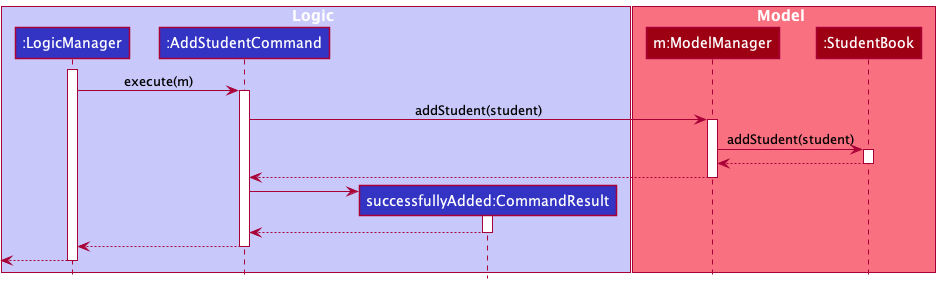
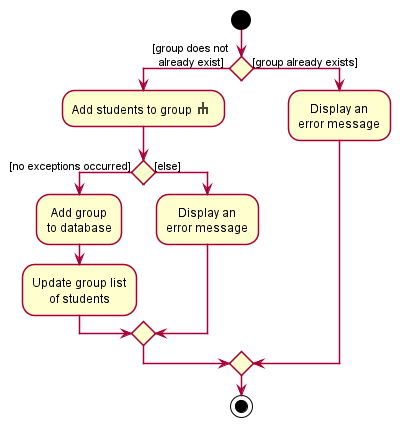
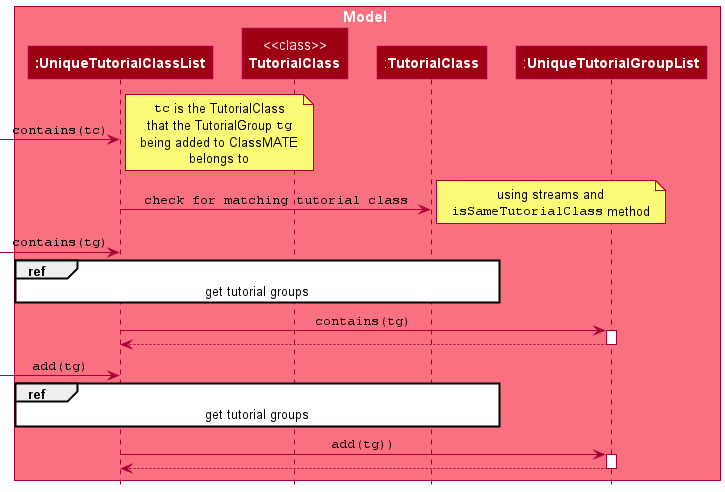
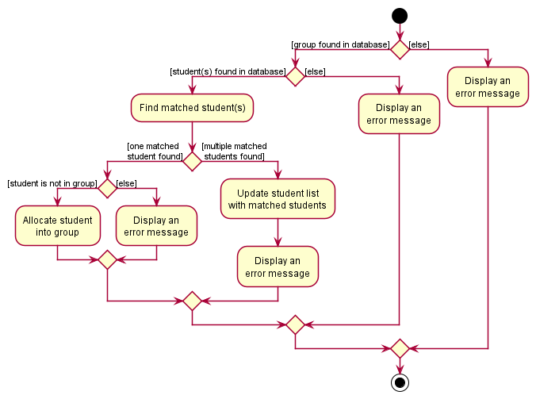
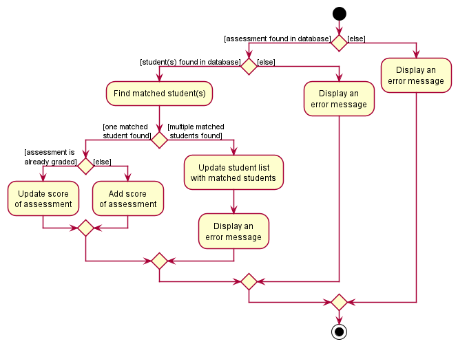
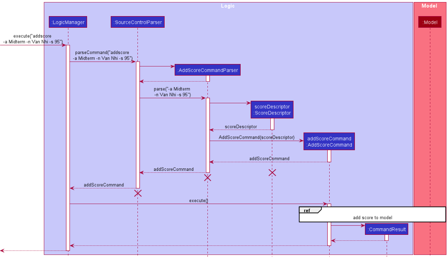
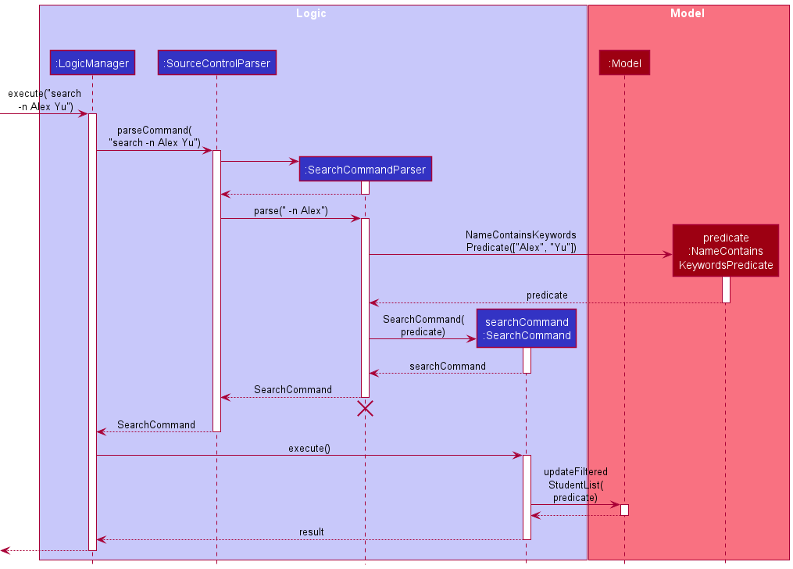
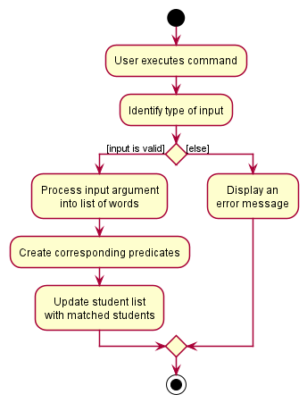
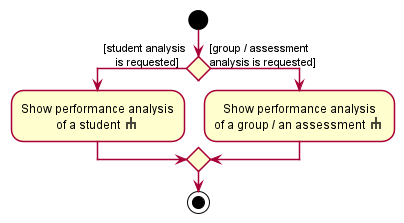
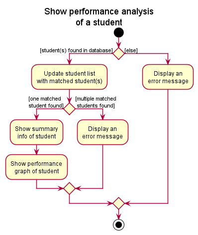

## **Table of Contents**

* Table of Contents
{:toc}

 

--------------------------------------------------------------------------------------------------------------------

## **Acknowledgements**

* Libraries used: [JavaFX](https://openjfx.io/), [Jackson](https://github.com/FasterXML/jackson), [JUnit5](https://github.com/junit-team/junit5)
* Original project: [AddressBook Level-3](https://se-education.org/addressbook-level3) project created as part of the [SE-EDU](https://se-education.org) initiative
* Application logo: Inspired by [Source Academy](https://sourceacademy.nus.edu.sg/)
* Code snippet for getting jar file directory: Taken from [this post](https://stackoverflow.com/questions/320542/how-to-get-the-path-of-a-running-jar-file)

 

--------------------------------------------------------------------------------------------------------------------

## **Setting up, getting started**

Refer to the guide [_Setting up and getting started_](SettingUp.md).

 

--------------------------------------------------------------------------------------------------------------------

## **Design**

:bulb: **Tip:** The `.puml` files used to create diagrams in this document can be found in the [diagrams](https://github.com/AY2122S1-CS2103T-W08-2/tp/tree/master/docs/diagrams/) folder. Refer to the [_PlantUML Tutorial_ at se-edu/guides](https://se-education.org/guides/tutorials/plantUml.html) to learn how to create and edit diagrams.

### Architecture

The ***Architecture Diagram*** given above explains the high-level design of the App.

Given below is a quick overview of main components and how they interact with each other.

**Main components of the architecture**

**`Main`** has two classes called [`Main`](https://github.com/AY2122S1-CS2103T-W08-2/tp/tree/master/src/main/java/seedu/sourcecontrol/Main.java) and [`MainApp`](https://github.com/AY2122S1-CS2103T-W08-2/tp/tree/master/src/main/java/seedu/sourcecontrol/MainApp.java). It is responsible for,
* At app launch: Initializes the components in the correct sequence, and connects them up with each other.
* At shut down: Shuts down the components and invokes cleanup methods where necessary.

[**`Commons`**](#common-classes) represents a collection of classes used by multiple other components.

The rest of the App consists of four components.

* [**`UI`**](#ui-component): The UI of the App.
* [**`Logic`**](#logic-component): The command executor.
* [**`Model`**](#model-component): Holds the data of the App in memory.
* [**`Storage`**](#storage-component): Reads data from, and writes data to, the hard disk.

**How the architecture components interact with each other**

The *Sequence Diagram* below shows how the components interact with each other for the scenario where the user issues the command `delete 1`.

Each of the four main components (also shown in the diagram above),

* defines its *API* in an `interface` with the same name as the Component.
* implements its functionality using a concrete `{Component Name}Manager` class (which follows the corresponding API `interface` mentioned in the previous point.

For example, the `Logic` component defines its API in the `Logic.java` interface and implements its functionality using the `LogicManager.java` class which follows the `Logic` interface. Other components interact with a given component through its interface rather than the concrete class (reason: to prevent outside component's being coupled to the implementation of a component), as illustrated in the (partial) class diagram below.

The sections below give more details of each component.

### UI Component

The **API** of this component is specified in [`Ui.java`](https://github.com/AY2122S1-CS2103T-W08-2/tp/tree/master/src/main/java/seedu/sourcecontrol/ui/Ui.java)

The UI consists of a `MainWindow` that is made up of parts e.g.`CommandBox`, `ResultDisplay`, `StudentListPanel`, `StatusBarFooter` etc. All these, including the `MainWindow`, inherit from the abstract `UiPart` class which captures the commonalities between classes that represent parts of the visible GUI.

The `UI` component uses the JavaFx UI framework. The layout of these UI parts are defined in matching `.fxml` files that are in the `src/main/resources/view` folder. For example, the layout of the [`MainWindow`](https://github.com/AY2122S1-CS2103T-W08-2/tp/tree/master/src/main/java/seedu/sourcecontrol/ui/MainWindow.java) is specified in [`MainWindow.fxml`](https://github.com/AY2122S1-CS2103T-W08-2/tp/tree/master/src/main/resources/view/MainWindow.fxml)

The `UI` component,

* executes user commands using the `Logic` component.
* listens for changes to `Model` data so that the UI can be updated with the modified data.
* keeps a reference to the `Logic` component, because the `UI` relies on the `Logic` to execute commands.
* depends on some classes in the `Model` component, as it displays `Student` object residing in the `Model`.

### Logic Component

**API** : [`Logic.java`](https://github.com/AY2122S1-CS2103T-W08-2/tp/tree/master/src/main/java/seedu/sourcecontrol/logic/Logic.java)

Here's a (partial) class diagram of the `Logic` component:

How the `Logic` component works:
1. When `Logic` is called upon to execute a command, it uses the `SourceControlParser` class to parse the user command.
1. This results in a `Command` object (more precisely, an object of one of its subclasses e.g., `AddCommand`) which is executed by the `LogicManager`.
1. The command can communicate with the `Model` when it is executed (e.g. to add a student).
1. The result of the command execution is encapsulated as a `CommandResult` object which is returned back from `Logic`.

The Activity Diagram below illustrates how user input is parsed by the `Logic` component.

The Sequence Diagram below illustrates the interactions within the `Logic` component for the `execute("delete 1")` API call.

:information_source: **Note:** The lifeline for `DeleteCommandParser` should end at the destroy marker (X) but due to a limitation of PlantUML, the lifeline reaches the end of diagram.

Here are the other classes in `Logic` (omitted from the class diagram above) that are used for parsing a user command:

How the parsing works:
* When called upon to parse a user command, the `SourceControlParser` class creates an `XYZCommandParser` (`XYZ` is a placeholder for the specific command name e.g., `AddCommandParser`) which uses the other classes shown above to parse the user command and create a `XYZCommand` object (e.g., `AddCommand`) which the `SourceControlParser` returns back as a `Command` object.
* All `XYZCommandParser` classes (e.g., `AddCommandParser`, `DeleteCommandParser`, ...) inherit from the `Parser` interface so that they can be treated similarly where possible e.g, during testing.

### Model component

**API** : [`Model.java`](https://github.com/AY2122S1-CS2103T-W08-2/tp/tree/master/src/main/java/seedu/sourcecontrol/model/Model.java)

The `Model` component,

* stores the application data i.e., all `Student` objects (which are contained in a `UniqueStudentList` object).
* stores the currently 'selected' `Student` objects (e.g., results of a search query) as a separate _filtered_ list which is exposed to outsiders as an unmodifiable `ObservableList<Student>` that can be 'observed' e.g. the UI can be bound to this list so that the UI automatically updates when the data in the list change.
* stores a `UserPref` object that represents the user’s preferences. This is exposed to the outside as a `ReadOnlyUserPref` objects.
* does not depend on any of the other three components (as the `Model` represents data entities of the domain, they should make sense on their own without depending on other components)

:information_source: **Note:** An alternative (arguably, a more OOP) model is given below. It has a `Tag` list in the `SourceControl`, which `Student` references. This allows `SourceControl` to only require one `Tag` object per unique tag, instead of each `Student` needing their own `Tag` objects. Note that other classes such as `Group` and `Assessment` are omitted here for brevity. 

### Storage Component

**API** : [`Storage.java`](https://github.com/AY2122S1-CS2103T-W08-2/tp/tree/master/src/main/java/seedu/sourcecontrol/storage/Storage.java)

The `Storage` component,
* can save both application data and user preference data in json format, and read them back into corresponding objects.
* inherits from both `SourceControlStorage` and `UserPrefStorage`, which means it can be treated as either one (if only the functionality of only one is needed).
* depends on some classes in the `Model` component (because the `Storage` component's job is to save/retrieve objects that belong to the `Model`)

### Common Classes

Classes used by multiple components are in the `seedu.sourcecontrol.commons` package.

 

--------------------------------------------------------------------------------------------------------------------

## **Implementation**

This section describes some noteworthy details on how certain features are implemented.

### Import : `import`

The following activity diagram summarizes what happens when the user inputs an import command:

There are several important details left out of the activity diagram for the sake of clarity:

1. The import feature is reliant on having a correctly formatted csv file (which is to be exported from sites like lumiNUS and Source Academy, and modified to fit the format).
The user needs to provide the number of `Groups`, `Assessments`, and `Tags` since we can't detect this automatically from the format of the file. The proper format of the file can be found in the user guide.

1. A `CommandException` will be thrown if any input does not follow the formatting specified in the respective classes such as `Name`, `ID`, and `Score`.

1. When reading a student's groups, the command will try to use an existing `Group` if possible, to ensure that the `Group` holds a reference to all `Students` in the group. A new `Group` will only be created in the case where the group hasn't already been created.

1. When reading a student's scores, the command will add the score to the `Student`, as well as the `Assessment` created from reading the first row.

1. Columns can be empty, except for the assessment name columns in the header row, and the name and ID columns of each student. Empty columns are assumed to be missing data.

### Add Student : `addstudent`

The add student feature adds a student with the provided name and NUSNET ID into the database. If the student comes with optionally specified groups and tags, these fields will be added accordingly.

#### AddCommand class
The `addstudent` mechanism is facilitated by the `AddCommand` class which extends the `Command` class. The `AddCommand` class overrides the `execute()` method in `Command`. In this implementation,
the method first checks if the `Student` object supplied as parameters is non-null. Then, it checks if the `Student` already exists in the database.
If this `Student` already exists, a `CommandException` will be thrown, telling the user that a duplicate `Student` is being added. If
the `Student` does not exist in the database yet, the `Model#addStudent()` method is called.

#### AddCommandParser class
The `AddCommandParser` class implements the `Parser<AddCommand>` interface. The `parse()` method checks for the presence of the compulsory prefixes corresponding to the name and NUSNET id of the `Student`, namely `-n` and `-i`.
It also checks for the presence of the optional group and tag prefixes, namely `-g` and `-t`.
It then retrieves the characters that follow each prefix and allocates them to the fields the `Student` object has accordingly.

In the case where the compulsory prefixes `-n` and `-i` are not present, a `ParseException` is thrown, prompting the user that the wrong command format has been used.

The following activity diagram summarizes what happens when the user inputs an add student command:

The following sequence diagram shows how the add student operation works:

:information_source: **Note:** The lifeline for `AddCommand` should end at the destroy marker (X) but due to a limitation of PlantUML, the lifeline reaches the end of diagram.

### Add Group : `addgroup`

The `addgroup` feature allows users to create new groups, as well as specify students to be added to the group to be created.

#### How the `AddGroupCommand` works:
1. The user specifies the group name, as well as a list of names and/or IDs of the students to be added into the group.
2. For each of the names and IDs, an `AllocDescriptor` is created.
3. For each of the `AllocDescriptors`, a search is done against the current `StudentList` to find students that match the descriptors.
   * If there is one and only one match, the student is added to the group.
4. The group is added to the application if Step 3 completes without any exceptions.

:information_source: **Note:** In the case where there are more than one students matched because they share the same name, an error message will be displayed to the user. The user will then have to specify the student to be added using his/her student ID.

The following activity diagrams summarizes what happens when a user executes a command to add a new group. In the case where the group is not added, an error message will be displayed with the reason.

The following sequence diagram summarizes what happens when the user inputs an add group command together with a student to be added:

### Add Allocation : `addalloc`

The `addalloc` feature allows users to allocate a student into a group.

#### How the `addalloc` command works

1. The user specifies the group name, and the name or ID of the student to be allocated into the group.
2. An `AllocDescriptor` containing info of the group and the student is created.
3. The `AllocDescriptor` is used to find the group and the student(s) as specified.
   * If there is only one matched student, the student is added to the group.
   * If there are multiple matched students, the allocation is not made successfully, and the student list is updated with all matched students.
4. The student is allocated into the group.

:information_source: **Note:** In the case where there are more than one students matched because they share the same name, an error message will be displayed to the user. The user will then have to specify the student to be added using his/her student ID.

The following activity diagram summarises what happens when a user executes the `addalloc` command to allocate a student into a group. In the case where the allocation is not made successfully, an error message will be displayed with the reason.

The following sequence diagram summarises what happens when the user inputs an `addalloc` command together with a group and a student, specified by name, to be allocated.

### Add Score : `addscore`

The `addscore` feature allows users to add score for an assessment of a student.

#### How the `addscore` command works

1. The user specifies the assessment name, the name or ID of the student, and the score to be added.
2. An `ScoreDescriptor` containing info of the group, the student and the score is created.
3. The `ScoreDescriptor` is used to find the assessment and the student(s) as specified.
   * If there is only one matched student, the assessment of the student will be updated with the new score.
   * If there are multiple matched students, the update is not made successfully, and the student list is updated with all matched students.
4. The score is updated in the assessment of the student.

:information_source: **Note:** In the case where there are more than one students matched because they share the same name, an error message will be displayed to the user. The user will then have to specify the student to be added using his/her student ID.

The following activity diagram summarises what happens when a user executes the `addscore` command to add score for an assessment of a student. In the case where the update is not made successfully, an error message will be displayed with the reason.

The following sequence diagram summarises what happens when the user inputs an `addscore` command together with an assessment, a student, specified by name, and a score to be added.

### Search : `search`

The `search` feature allows user to filter student list by name, NUSNET ID, groups, or tags.

#### How the `search` command works

The following diagram shows the search operation after user input `search -n Alex Yu`.

A `Predicate<Student>` object will be created for each search command.
It contains `test(Student student)` function which checks if the given student matches the list of keywords given.

To support the differentiated search functionality for different flags (e.g. name, NUSNET ID, group name, or tag),
multiple classes extending from `Predicate<Student>` can be created,
each with different implementation of the `test(Student student)` function.

* `NameContainsKeywordsPredicate`: checks if any word in the full name of student matches exactly any word in the
  given keywords. e.g. `Alex Yu` will match `Alex Yeoh` and `Bernice Yu`. Partial search is not supported
  e.g. `Han` will not match `Hans`.
* `IdContainsKeywordsPredicate`: checks if the ID of student contains any word in the given keywords.
  Partial search is supported. e.g. `E05` will match `E0523412`.
* `GroupContainsKeywordsPredicate`: checks if any group of student contains any word in the given keywords.
  Partial search is supported. e.g. `T02` will match `T02A` and `T02B`.
* `TagContainsKeywordsPredicate`: checks if the tag of student contains any word in the given keywords.
  Partial search is supported. e.g. `beginner` will match `beginners`.

The following diagram summarizes what happens after user input search command:

:information_source: **Note:** SearchCommandParser checks
if the command input is valid. The command is invalid if the user input is empty, or if the user entered more or less than one flag.

#### Design considerations

**Aspect: How search executes:**

* **Alternative 1:** Multiple search commands to search using different identifiers.
    * Pros: Easy to implement.
    * Cons: Inconvenient for user to remember different command words.

* **Alternative 2 (current choice):** Single search command to perform search for multiple identifiers.
    * Pros: More straightforward and convenient for users.
    * Cons: We need to identify the type of input given.

### Show : `show`

The `show` feature allows users to show the performance analysis of a student, a group or the cohort in an assessment.

#### How the `show` command works

1. The user specifies the student (by either name, ID or index), the group name or the assessment name.
2. An `ScoreDescriptor` containing info of the group, the student and the score is created.
3. The `ScoreDescriptor` is used to find the assessment and the student(s) as specified.
   * If there is only one matched student, the assessment of the student will be updated with the new score.
   * If there are multiple matched students, the update is not made successfully, and the student list is updated with all matched students.
4. The performance analysis of the student, the group or the cohort in an assessment is displayed.

:information_source: **Note:** In the case where the performance analysis of a student is requested by identity and there are more than one students matched because they share the same name, an error message will be displayed to the user. The user will then have to specify the student to be added using his/her student ID.

The following activity diagrams summarise what happens when a user executes the `show` command to show the performance analysis of a student, a group or the cohort in an assessment. In the case where the display is not presented successfully, an error message will be displayed with the reason.

The following sequence diagram summarises what happens when the user inputs an `show` command together with a student specified by name.

 

### Alias feature

The `alias` feature allows users to define their own aliases for commands. This is useful to shorten the input for commands that the user uses often. 

An alias is basically just a mapping of a user-provided string to a command word. It works by directly replacing the first word in the user's input command with the alias word, then parsing again.
An alias contains two strings: An `aliasWord` which is the new user-defined word, and a `commandWord` which is the command word of an existing default command (e.g. `addstudent`, `clear`, `exit`).

Parsing of an alias command follows the following steps:
1. The alias word is checked to ensure that it is one word long.
1. The alias word is also checked to ensure that it does not overlap with any default command word. This is to prevent the re-mapping of any default command words and potentially losing the functionality of the application.
1. If the command word is an alias, it is replaced with the command word that the alias maps to.
1. The command word is checked for validity by attempting to parse the command word. If the parser does not recognise the command word, it is not valid.
1. The new `Alias` and `AliasCommand` is created, and executed.
1. The alias is added to both the parser, and the model (so that it can be saved in the `UserPrefs`)
    * If the alias word is already present in the parser, the command word it is mapped to is replaced with the new command word instead.
    * If the alias word and the command word are identical, it is assumed that the user is trying to delete an existing alias. The existing alias is removed instead.
    
If the command word of any future user input matches the alias, the first word of the user input will be replaced by the command word of the alias.
The activity diagram of how a command is parsed can be found in the [Logic section of this guide](#logic-component).

#### Design Considerations

**Aspect 1: How aliases are stored and parsed**

There were two ideas on how this could be done:
1. Store the command's `Parser` in each alias. The parser attribute of the alias can then be retrieved and `Parser::execute` can be called when parsing.
    * Pros:
        * Very elegant and streamlined parsing. Almost no changes need to be made to the logic of `SourceControlParser`.
    * Cons:
        * It is not easy to obtain the type of `Parser` simply through the command word provided by the user given the current implementation of the project. You'd need to iterate through all possible `Commands`, and match their command word with the provided word. This approach would not be very extensible if more commands are to be added in the future. 
        * It is also not easy to save/load the alias to/from the `UserPrefs`. The best approach is likely to just save the command word, then generate the `Parser` when loading. However, this poses a similar problem as the previous point, which is that it is not easy to generate the `Parser` just from the command word.
1. Store the command word in each alias. Replace the command word of the user input if the user inputs an aliased command, and parse it again.
    * Pros:
        * Very easy to store. Each alias is essentially just two strings.
    * Cons: 
        * Have to be careful with the implementation to prevent any edge cases where the user can define aliases to create an infinite loop.
    
We decided to go with the easier implementation of storing each alias as two strings. However, there were still more aspects to be considered.

**Aspect 2: How to handle aliases of aliases**

That is, what happens when the user does `alias -c <existing_alias> -as <new_alias>`? There are two choices for this: 
1. The new alias maps to the existing alias word directly.
    * The command word stored in the new `Alias` would be the alias word of the existing `Alias`.
    * Assuming that an alias `ag` already exists for `addgroup`, the following commands have the following effects:
        * `alias -c ag -as addg` would make `addg` map to `ag`, which is in turn mapped to `addgroup`. When parsing, `addg` will be replaced with `ag`, which is then replaced by `addgroup`.
        * `alias -c addalloc -as ag` would make `ag` map to `addalloc`. `addg` would also then map to `addalloc`, since it gets replaced by `ag` when parsing, which then gets replaced by `addalloc`.
    * Pros:
        * Intuitive approach to aliases: "I want `addg` to mean `ag`".
    * Cons:
        * Possible to make parsing a very expensive task due to having to replace the command word and parsing multiple times.
        * Possible to have an infinite loop by mapping two aliases to each other.
        * It's not very useful to have two aliases always mean the same thing.
2. The new alias maps to the command word that the existing alias maps to.
    * The command word stored in the new `Alias` would be the command word of the existing `Alias`.
    * Assuming that an alias `ag` already exists for `addgroup`, the following commands have the following effects:
        * `alias -c ag -as addg` would make `addg` map to `addgroup` directly.
        * `alias -c addalloc -as ag` would make `ag` map to `addalloc`. `addg` would still map to `addgroup`.
    * Pros:
        * Naturally prevents the creation of infinite loops.
        * Parsing is guaranteed to only take one recursive call to the `parse` method.
    * Cons: 
        * It is a less intuitive approach to aliases: "I want `addg` to mean what `ag` means at the current moment"
    
We decided to go with implementation 2 due to its ability to naturally handle infinite loops and better performance. Our target audience is also Computer Science professors, who should be very familiar with this style of referencing, since that is exactly how names refer to primitive values in programming.

**Aspect 3: Removing aliases**

We believe that there needs to be a way to remove aliases. Otherwise, there will eventually be a very large amount of aliases, and some typo might lead to executing a command you didn't intend to execute. Hopefully, that command isn't `clear`.

Again, there are two choices we could take:
1. Make a new command for removing an alias, e.g. `removealias`.
    * Pros:
        * Intuitive to know what the new command does from its command word.
    * Cons:
        * Might end up having too many commands for a less prominent function like aliasing.
        * Takes a little more effort to implement.
2. Modify the existing `alias` command to accept a special case to remove aliases.
    * More specifically, `alias -c <existing_alias> -as <same_alias>` will remove the alias.
    * Pros:
        * Easy to implement: Just check if alias word and command word are the same.
        * One command for the whole alias functionality.
    * Cons:
        * Not particularly intuitive. The `alias` command feels like a command to use for adding aliases, but it is being used to remove one instead.
    
We ended up going with the second approach since the alias functionality was a very small part of the application. We also believe that it does make sense that mapping an alias to itself would remove it.

Furthermore, removing aliases is likely a very rare use case, and dedicating a whole command to it does feel like a bit of a waste.

--------------------------------------------------------------------------------------------------------------------

## **Documentation, Testing, Logging, Configuration, Dev-Ops**

* [Documentation Guide](Documentation.md)
* [Testing Guide](Testing.md)
* [Logging Guide](Logging.md)
* [Configuration Guide](Configuration.md)
* [DevOps Guide](DevOps.md)

 

--------------------------------------------------------------------------------------------------------------------

## **Appendix: Requirements**

### Product scope

**Target user profile**:

Targets professors of CS1101S who:
* has a need to manage a significant number of students
* has a need to analyse students' performance
* prefer desktop apps over other types
* can type fast
* prefers typing to mouse interactions
* is reasonably comfortable using CLI apps

**Value proposition**: This app will help CS1101S professors keep track of students' performance after each assessment,
doing so faster than a typical mouse/GUI driven app.
It can analyse results of individual students, tutorial groups, or the whole cohort in each assessment,
in order to identify students who may require additional help.

### User stories

Priorities: High (must have) - `* * *`, Medium (nice to have) - `* *`, Low (unlikely to have) - `*`

Importing and exporting data:

| Priority | As a …​                                    | I want to …​                     | So that I can…​                                                        |
| -------- | ------------------------------------------ | ------------------------------ | ---------------------------------------------------------------------- |
| `* * *`  | CS1101S Professor                          | Upload large amounts of data from a file      | Upload all assessment scores of all students at once          |
| `* *`  | Long-time user                         | Clear all data        | Remove records from the previous semester            |
| `* *`  | CS1101S Professor                          | Export data      | Share interesting findings with my colleagues          |
| `*`  | New user | Import data from the previous semester | Have an idea of how intakes of the previous cohort performed |

Adding and editing data fields:

| Priority | As a …​                                    | I want to …​                     | So that I can…​                                                        |
| -------- | ------------------------------------------ | ------------------------------ | ---------------------------------------------------------------------- |
| `* * *`  | CS1101S Professor                          | Add a new assessment        | Keep track of assessment scores of students           |
| `* * *`  | CS1101S Professor                          | Add a new student        | Add a new student without having to make a new file               |
| `* * *`  | CS1101S Professor                          | Allocate a student into existing group       | Allocate groupings without having to make a new file                  |
| `* * *`  | CS1101S Professor                          | Organise students into groups      | Encourage peer learning          |
| `* *`  | CS1101S Professor | Remove a specific student   | Update the system accordingly when a student drops the module  |
| `* *`  | CS1101S Professor | Annotate a student with a tag  | See categories of students quickly |
| `* *`  | CS1101S Professor | Add remarks to particular students | Be aware of any special conditions the student is facing |
| `* *`  | CS1101S Professor | Edit assessment score for a particular student | Make changes after the initial grading |
| `*`  | CS1101S Professor | Add attendance records for each class  | Track the students present at each class |
| `*`  | CS1101S Professor | Upload students’ feedback about their tutors | Provide timely feedback to the tutors |

Viewing and searching data:

| Priority | As a …​                                    | I want to …​                     | So that I can…​                                                        |
| -------- | ------------------------------------------ | ------------------------------ | ---------------------------------------------------------------------- |
| `* * *`  | CS1101S Professor                          | Search for specific student     | Track his/her progress to facilitate better learning          |
| `* * *`  | CS1101S Professor | Search for students by classes and groups  | Track them by groups easily |
| `* * *`  | CS1101S Professor | Check a student’s grades | See individual performance |
| `*`  | CS1101S Professor | Check attendance records for each student | Track if the student has been attending classes diligently |

Analysing data:

| Priority | As a …​                                    | I want to …​                     | So that I can…​                                                        |
| -------- | ------------------------------------------ | ------------------------------ | ---------------------------------------------------------------------- |
| `* * *`  | CS1101S Professor | Analyse the performances of individual students | Give special assistance to those in need |
| `* * *`  | CS1101S Professor | Analyse performance of cohort in each assessment | See how the cohort is performing |
| `* *`  | CS1101S Professor | Analyse the performances of students in groups | See which studio is under-performing and check in with the tutor |
| `* *`  | CS1101S Professor | Calculate overall grades  | Easily decide on grade ranges |
| `*`  | Detailed user | View the performances under different kinds of graph | Have better visualisation about the performances of students |
| `*`  | CS1101S Professor | Analyse the cohort performance for each question | Understand which are the topics students require more help with |
| `*`  | CS1101S Professor | Compare between different batches of students | See if the module is too hard this semester as compared to previous semesters |
| `*`  | CS1101S Professor | Check the overall performance of the tutors based on several indicators | Identify excellent tutors to be called back next semester |

Others:

| Priority | As a …​                                    | I want to …​                     | So that I can…​                                                        |
| -------- | ------------------------------------------ | ------------------------------ | ---------------------------------------------------------------------- |
| `* * *`  | New user | Get command prompts when typing | Do not have to keep checking user guide |
| `* *`  | Expert user | Have shortcuts for commands | Save time |
| `* *`  | Potential user | View the app populated with sample data | See how the app looks like when in use |
| `*`  | Forgetful user | Access the user guide with an easy to remember command | Lookup how to use a command/what command to use |
| `*`  | Long-term user | Store meeting timings | Not miss any meetings that have been planned |
| `*`  | Forgetful user | Have reminders about upcoming meetings | Avoid missing any important events |
| `*`  | CS1101S Professor | Add TODO bug fixes accumulated throughout the semester | Fix them during CP3108 |

### Use cases

(For all use cases below, the **System** is `Source Control` and the **Actor** is the `user`, unless specified otherwise)

**Use case: Import student roster**

**MSS**

1.  User has a comma-separated values (`.csv`) file of the student roster.
2.  User requests to import the file into Source Control.
3.  Source Control shows the list of students parsed and imported.

    Use case ends.

**Extensions**

* 2a. The csv file has badly formatted input.

    * 2a1. Source Control shows an error message displaying the bad input.

    * 2a2. User fixes the csv file.

      Use case resumes at step 2.

**Use case: Create a new group**

**MSS**

1.  User requests to create a new group and enters the group name and students' names or Student IDs.
2.  Source Control creates the group with the specified students.

    Use case ends.

**Extensions**

* 1a. There is an existing group with the same group name.

    * 1a1. Source Control shows an error message.

      Use case resumes at step 1.
* 1b. There are multiple students that match any of the specified student names.

    * 1b1. Source Control shows an error message with the different Student IDs.

      Use case resumes at step 1.

### Non-Functional Requirements

1. Should work on any _mainstream OS_ as long as it has Java `11` or above installed.
2. Should be able to hold up to 1000 students without a noticeable sluggishness in performance for typical usage.
3. Should be able to analyse data of up to 1000 students without a noticeable sluggishness in performance for typical usage.
4. A user with above average typing speed for regular English text (i.e. not code, not system admin commands) should be able to accomplish most of the tasks faster using commands than using the mouse.
5. Should work without internet connections.
6. New users can pick up the basic functionalities of Source Control easily.

### Glossary

* **Mainstream OS**: Windows, Linux, Unix, OS-X.
* **Student**: A student in the database, identified by their name and NUSNET ID. Each student can be in multiple groups, and can have scores for multiple assessments.
* **Group**: A group of students, identified by the group name.
* **Assessment**: An assessment is identified by the assessment name.
* **Score**: The score that a student has attained for an assessment, stored in percentage and can be recorded up to 2 decimal places. Each student can only have 1 score per assessment.
* **Student list**: The list of students displayed on the right panel of Source Control. Student list can be filtered to display selected students only.
* **Flag**: Arguments flags are used to indicate different types of user inputs e.g. `-n` for student name, and `-g` for group. More about flags can be found [here](https://ay2122s1-cs2103t-w08-2.github.io/tp/UserGuide.html#glossary).

 

--------------------------------------------------------------------------------------------------------------------

## **Appendix: Instructions for manual testing**

Given below are instructions to test the app manually.

:information_source: **Note:** These instructions only provide a starting point for testers to work on;
testers are expected to do more *exploratory* testing.

### Launch and Shutdown

1. Initial launch

   1. Download the jar file and copy into an empty folder.

   1. Double-click the jar file Expected: Shows the GUI with a set of sample contacts. The window size may not be optimum.

2. Saving window preferences

   1. Resize the window to an optimum size. Move the window to a different location. Close the window.

   1. Re-launch the app by double-clicking the jar file. 
       Expected: The most recent window size and location is retained.

3. Shutdown

   1. Test case: `exit` Expected: Source Control exits and shut down automatically. 

### Adding a group

1. Adding a group successfully.

   1. Prerequisites: Group should not already exist in database. Database contain a student with name `Hong Fai` and another student `A` with ID `E0123456`.
   
   2. Test case: `addgroup -g T01A`  Expected: Group `T01A` will be added to the database.
   
   3. Test case: `addgroup -g T02B -n Hong Fai -i E0123456`  Expected: Group `T02B` will be added to database with students `Hong Fai` and `A` in the group.
   
2. Adding a group with incorrect formats.

   1. Test case: `addgroup`  Expected: No group is created. Error detail shown in the status message to inform user of the correct command format.
   
   2. Test case: `addgroup -g`  Expected: No group is created. Error detail shown in the status message to inform user that group name cannot be blank.
   
   3. Test case: `addgroup -g Tutorial@Wednesday`  Expected: No group is created. Error detail shown in the status message to inform user that group name must be alphanumeric.

3. Adding a group that already exists in database.

   1. Prerequisite: Group specified already exists in database.
   
   2. Test case: `addgroup -g T01A`  Expected: The group will not be re-created. Error details shown in the status message to inform user group already exists.

4. Adding a group with duplicated student instances.

   1. Prerequisites: Database contain a student with name `Hong Fai` with the ID `E0123456`.
   
   2. Test case: `addgroup -g T01A -n Hong Fai -i E0123456`  Expected: The group will not be created. Error detail shown in the status message to inform user that the student `Hong Fai` has been specified more than once.

5. Adding a group with non-existent students.

   1. Prerequisites: Database does not contain a student with name `Hong Fai`.
   
   2. Test case: `addgroup -g T01A -n Hong Fai`  Expected: The group will not be created. Error detail shown in the status message to inform user that the student `Hong Fai` cannot be found in the database.

### Deleting a Student

1. Deleting a student while a list of all students are being shown.

    1. Prerequisites: List all students using the `list` command. Some students are displayed in the list.

    1. Test case: `delete 1` 
       Expected: First student is deleted from the list. Details of the deleted student is shown in the status message. Timestamp in the status bar is updated.

    1. Test case: `delete 0` 
       Expected: No student is deleted. Error details shown in the status message. Status bar remains the same.

    1. Other incorrect delete commands to try: `delete`, `delete x` (where x is an invalid number) 
       Expected: Similar to previous.

2. Deleting a student after searching.

    1. Prerequisites: List selected students using the `search` command. Some students are displayed in the list.
   
    2. Test case: `delete 1`  Expected: First student displayed on the sorted list is deleted. Details of the deleted student is shown in the status message. Timestamp in the status bar is updated.
   
    3. Other incorrect delete commands to try: `delete`, `delete x` (where x is an invalid number) 
       Expected: Similar to previous.

### Adding an alias
1. Adding an alias successfully.

   1. Test case: `alias -c addstudent -as example`  Expected: A new alias `example` is added for `addstudent`.  `example -n Zhiying -i E1234567` will add student `Zhiying` to the database.
   
   2. Test case: `alias -c example -as example2`  Expected: A new alias `examples` is added for `addstudent` (the command `example` is mapped to).
   
   3. Test case: `alias -c addgroup -as example`  Expected: The alias `example` is mapped to `addgroup` and no longer represent `addgroup`.  `example -g T02A` will create a new group `T02A`.

2. Deleting an alias successfully.

   1. Prerequisites: An alias `example` exists. 
   
   2. Test case: `alias -c example -as example`  Expected: Removes the alias `example`. `example` will no longer be recognised as a command.

3. Deleting an alias unsuccessfully.

   1. Test case: `alias -c addstudent -as addstudent`  Expected: The alias `addstudent` will not be removed. 
   Error detail shown in the status message to inform user that default command cannot be overwritten. 
    
4. Adding an alias unsuccessfully.

   1. Test case: `alias -c addgroup -as addstudent `  Expected: No alias will be created. Error detail shown in the status message to inform user that default command cannot be overwritten.
   
   2. Test case: `alias -c addstudent -as add student `  Expected: No alias will be created. Error detail shown in the status message to inform user that alias can only be one alphanumeric word.

### Saving Data

1. Dealing with missing data file

    1. Prerequisites: `./data/sourceControl.json` (or the file path specified in `preferences.json`) has been deleted.
    
    1. Test case: Run the application.   Expected: Application is populated with sample data. `./data/sourceControl.json` will be created after exiting the application.

1. Dealing with corrupted data file

    1. Prerequisites: Deleted the data file at `./data/sourceControl.json`, then launched the jar file to populate the data file with sample data.
    
    1. Test case: Add an `*` to the `name` of the first person in the data file and launch the jar file.   Expected: No data will be loaded into the application. The data file will lose all its data when the app exits.
    
    1. Test case: Add the group `new group` into the `groups` array of the first person and launch the jar file.    Expected: The new group is not added to the first person. The data file will no longer contain the new group when the app exits.
    
    1. Test case: Add the assessment `new assessment` into the `assessments` array of the first person and launch the jar file.   Expected: The new assessment is not added to the first person. The data file will no longer contain the new assessment when the app exits.
    
    1. Test case: Add an extra `{` as the first character of the data file.   Expected: No data will be loaded into the application. The data file will lose all its data when the app exits.

--------------------------------------------------------------------------------------------------------------------

## **Appendix: Effort**

In general, we believe that we have put in a lot of effort for this project. We managed to implement the target features we originally set out to do, plus a few extra nice-to-have features.

We also managed to keep the code coverage reasonably high at 76%, and there was only a small set of unique bugs found in the PE-D.

### Challenges faced

The following features were relatively hard to implement:
1. JavaFX Charts are a part of the JavaFX library which we had to learn how to use from scratch. However, it was an essential part of our goals for the application.
    * It was not easy to customise the chart styles (such as the colour scheme) to fit with the overall design of the application.
    * Many things about the format of the charts were difficult to customise, such as the direction and layout of axis labels.

1. Aliases were deceptively hard to implement, and took more time than expected.
    * Even though Jonas implemented an alias feature for his iP, the implementation had to be completely different since the parser was using a completely different design.
    * Many aspects had to be considered and carefully weighed. You can read more about it in the [alias section of this guide](#alias-feature).
    
1. Adapting the AB3 code to fit into the context of Source Control.
    * While adding and removing classes wasn't too bad, adapting the tests was on a whole new level.
    * There were a lot of tests that we didn't want to delete, and instead chose to adapt them as well. 
      This proved to be highly time-consuming, since you had to read through the test code and completely understand what it was doing in order to properly adapt it.
    * Our application has three different classes (`Student`, `Assessment`, `Group`) that are highly coupled to each other. AB3 did not have such problems as it only contained one `Person` class. 
      It was difficult to ensure that our objects are sharing information with each other properly, while trying to keep the level of coupling as low as possible. This coupling also proved to be the source of several hard-to-find bugs. 

### Features scrapped

The following features were scrapped due to the high difficulty or error-prone nature of their implementations.
1. Allowing the user to specify their file path to export data or graphs
    * From the feedback received from the PE-D, we realised how easy it was to exploit the ability to specify your file path through user input.
    * One problem was how different OSes handled file paths. Some paths were valid only on some OSes, and checking the user input was non-trivial.
    * Java's `Path` and `File` felt insufficient to properly check all possible user inputs for validity. Through testing, it seemed like some invalid file names were still leaking through any checks we had implemented.
    * These problems were discovered too late to settle with a good, bug-free solution. As such, we decided to drop the ability for users to specify files to write to.
    * While one solution was to use the `FileChooser` class from JavaFX, that would violate the requirements of the application being CLI-based. 
    
2. Commands longer than one word in length
    * Initially, `addstudent` was `add student` (the same goes for other similar commands in the `add` family). This required some minor tweaking of the parser which was relatively straightforward.
    * However, when it came to implementing aliases, we realised that it was difficult to ensure that the aliases don't overlap with the multiworded commands without drastically changing the parser.
    * Thankfully, the simple solution was to just enforce everything to be one word long.

3. Allowing non-alphanumeric characters in student names
    * As Source Control stores the official names of students, we had to consider that these names could contain non-alphanumeric characters, such as "Mary-Ann Tan". This is in contrast with AB3, where names of contacts do not need to be official names and these non-alphanumeric characters can be left out.
    * However, allowing non-alphanumeric characters in student names would lead to problems such as not being able to identify invalid names like "@@@". It also leads to complications with parsing, for example when "-g" is meant to be part of the student name but would be parsed as an argument.
    * As such, given the time constraint, we decided to maintain the original functionality of AB3, and only allow alphanumeric characters.
