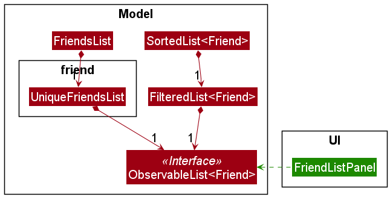
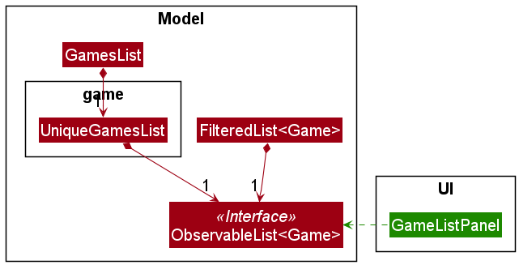
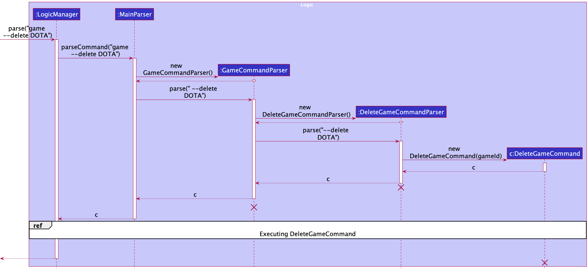
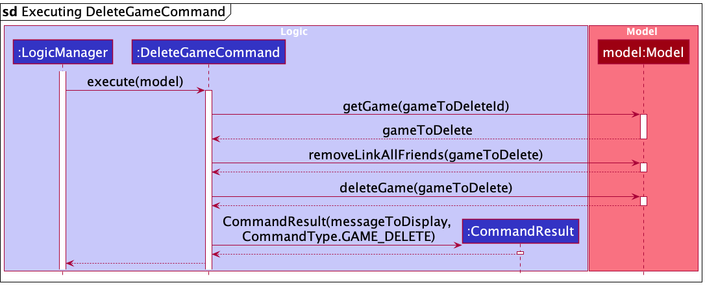
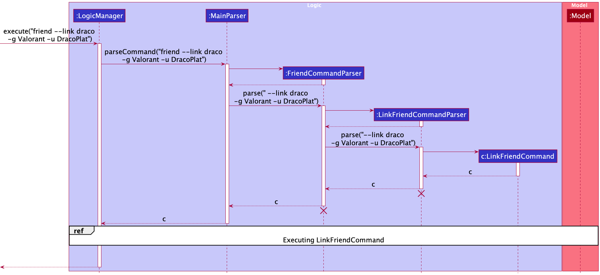
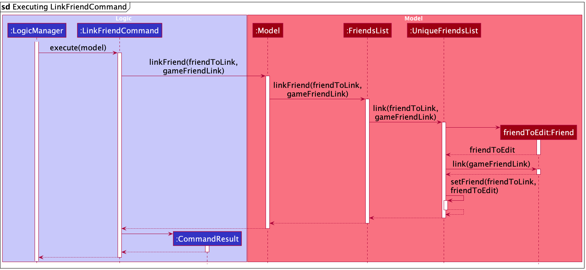
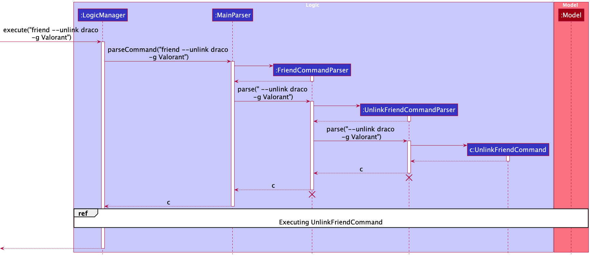
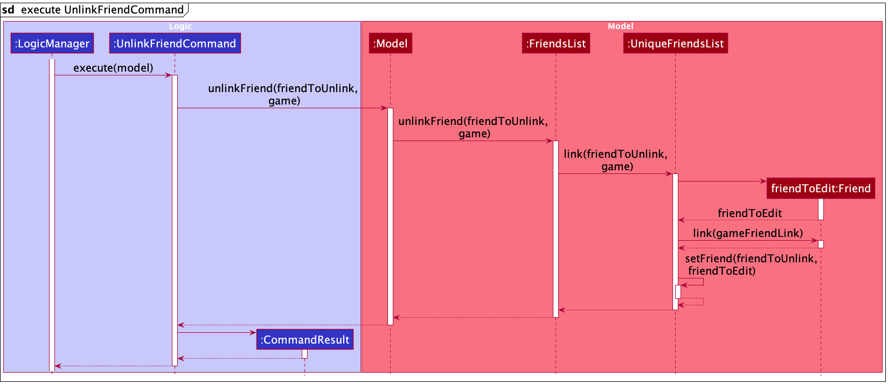

* Table of Contents
{:toc}

--------------------------------------------------------------------------------------------------------------------

## **1. Acknowledgements**

* This project is based on the AddressBook-Level3 project created by the [SE-EDU initiative](https://se-education.org).

--------------------------------------------------------------------------------------------------------------------

## **2. Setting up, getting started**

Refer to the guide [_Setting up and getting started_](SettingUp.md).

--------------------------------------------------------------------------------------------------------------------

## **3. Design**

:bulb: **Tip:** The `.puml` files used to create diagrams in this document can be found in the [diagrams](https://github.com/AY2122S1-CS2103T-W13-4/tp/tree/master/docs/diagrams) folder. Refer to the [_PlantUML Tutorial_ at se-edu/guides](https://se-education.org/guides/tutorials/plantUml.html) to learn how to create and edit diagrams.

### 3.1 Architecture

The ***Architecture Diagram*** given above explains the high-level design of gitGud.

Given below is a quick overview of main components and how they interact with each other.

**Main components of the architecture**

**`Main`** has two classes called [`Main`](https://github.com/AY2122S1-CS2103T-W13-4/tp/tree/master/src/main/java/seedu/address/Main.java) and [`MainApp`](https://github.com/AY2122S1-CS2103T-W13-4/tp/tree/master/src/main/java/seedu/address/MainApp.java). It is responsible for,
* At app launch: Initializes the components in the correct sequence, and connects them up with each other.
* At shut down: Shuts down the components and invokes cleanup methods where necessary.

[**`Commons`**](#36-common-classes) represents a collection of classes used by multiple other components.

The rest of gitGud consists of four components.

* [**`UI`**](#32-ui-component): The UI of the gitGud.
* [**`Logic`**](#33-logic-component): The command executor.
* [**`Model`**](#34-model-component): Holds application data for gitGud in memory.
* [**`Storage`**](#35-storage-component): Reads data from, and writes data to, the hard disk.

**How the architecture components interact with each other**

The *Sequence Diagram* below shows how the components interact with each other for the scenario where the user 
issues the command `friend --delete Draco`.

Each of the four main components (also shown in the diagram above),

* defines its *API* in an `interface` with the same name as the Component.
* implements its functionality using a concrete `{Component Name}Manager` class (which follows the corresponding API `interface` mentioned in the previous point.

For example, the `Logic` component defines its API in the `Logic.java` interface and implements its functionality using the `LogicManager.java` class which follows the `Logic` interface. Other components interact with a given component through its interface rather than the concrete class (reason: to prevent outside component's being coupled to the implementation of a component), as illustrated in the (partial) class diagram below.

The sections below give more details of each component.

### 3.2 UI component

**API** : [`Ui.java`](https://github.com/AY2122S1-CS2103T-W13-4/tp/blob/master/src/main/java/seedu/address/ui/Ui.java)

**Description** :

The `UI` component is responsible for managing the user interface of the application so that it responds correctly to any command to user inputs.

The `UI` component uses the JavaFX UI framework. The layout of these UI parts are defined in matching `.fxml` files 
that are in the `src/main/resources/view` folder. For example, the layout of the [`MainWindow`](https://github.com/AY2122S1-CS2103T-W13-4/tp/blob/master/src/main/java/seedu/address/ui/MainWindow.java) is specified in [`MainWindow.fxml`](https://github.com/AY2122S1-CS2103T-W13-4/tp/blob/master/src/main/resources/view/MainWindow.fxml)

**Functionality** :

The `UI` component,

* executes user commands using the `Logic` component.
* listens for changes to `Model` data so that the UI can be updated with the modified data.
* keeps a reference to the `Logic` component, because the `UI` relies on the `Logic` to execute commands.
* depends on some classes in the `Model` component, as it displays `Friend` and `Game` objects residing in the `Model`.

**Component Structure**

The UI consists of a `MainWindow` that is made up of parts e.g.`CommandBox`, `ResultDisplay`, `FriendListPanel`, 
`GameListPanel`. These parts are always being shown in `MainWindow`.

Depending on the state of the application, certain parts of the UI are shown and hidden in the `MainWindow`, e.g. 
`FriendMainCardTable`,`FriendSchedulePanel`, `GameMainCardTable`.

etc. All these, including the `MainWindow`, inherit from the abstract `UiPart` class which captures the commonalities between classes that represent parts of the visible GUI.

### 3.3 Logic component

### Description :
**API** : [`Logic.java`](https://github.com/AY2122S1-CS2103T-W13-4/tp/blob/master/src/main/java/seedu/address/logic/Logic.java)

**Description** :

The `Logic` component is responsible for handling the execution of the input entered by the user. Here, the user input 
is parsed to determine what command it is, before the command is executed.

**Functionality** :

How the `Logic` component works:
1. When `Logic` is called upon to execute a command, it uses the `MainParser` class to parse the user command.
2. This results in a `Command` object (more precisely, an object of one of its subclasses e.g., `HelpCommand`) which is executed by the `LogicManager`.
3. The command can communicate with the `Model` when it is executed (e.g. to add a friend).
4. The result of the command execution is encapsulated as a `CommandResult` object which is returned back from `Logic`.

The Sequence Diagram below illustrates the interactions within the `Logic` component for the `execute("friend --delete draco")` API call.

**:information_source: Note:** The lifeline for `DeleteCommandParser` should end at the destroy marker (X) but due to a limitation of PlantUML, the lifeline reaches the end of diagram.

**Component Structure**

Here's a (partial) class diagram of the `Logic` component:

Here are the other classes in `Logic` (omitted from the class diagram above) that are used for parsing a user command:

How the parsing works:
* When called upon to parse a user command, the `MainParser` class creates an `XYZCommandParser` (`XYZ` is a placeholder for the specific command name e.g., `HelpCommandParser`) which uses the other classes shown above to parse the user command and create a `XYZCommand` object (e.g., `HelpCommand`) which the `AddressBookParser` returns back as a `Command` object.
  * Note: For user commands with `friend` or `game` as the first arguments will go through an additional `FriendCommandParser` or `GameCommandParser` respectively for parsing, which will then create the respective `XYZFriendCommandParser` or `XYZGameCommandParser`
* All `XYZCommandParser` classes (e.g., `AddCommandParser`, `DeleteCommandParser`, ...) inherit from the `Parser` interface so that they can be treated similarly where possible e.g, during testing.

### 3.4 Model component

**API** : [`Model.java`](https://github.com/AY2122S1-CS2103T-W13-4/tp/blob/master/src/main/java/seedu/address/model/Model.java)

**Description** :

The `Model` component is responsible for storing and managing data. It achieves this by maintaining a runtime model of
the data using Java objects that represent real-world entities and associations that simulate relationships between these entities.

**Functionality** :

* The `UI` uses the data inside the `Model` to display to the user.
* The `Storage`uses the data inside the `Model` to store it on the local hard-disk.
* Does not depend on any of the other three components, as it represents data entities of the domain, which should make sense on their own without depending on other components

**Component Structure** :

The `Model` component consists of the following

* [`friend`](https://github.com/AY2122S1-CS2103T-W13-4/tp/tree/master/src/main/java/seedu/address/model/friend) subpackage
  * a `Friend` comprises of a `FriendId`, `FriendName`, `Schedule` and a map of `GameFriendLink`s.
  * a `Schedule` is made of 7 `Day`s, each consisting of a `DayOfWeek`.
  * stores the friends' data i.e., all `Friend` objects in a `UniqueFriendsList` object.

* [`game`](https://github.com/AY2122S1-CS2103T-W13-4/tp/tree/master/src/main/java/seedu/address/model/game) subpackage
  * a `Game` comprises of a `GameId` object.
  * stores the games' data i.e., all `Game` objects in a `UniqueGamesList` object.

* [`gamefriendlink`](https://github.com/AY2122S1-CS2103T-W13-4/tp/tree/master/src/main/java/seedu/address/model/gamefriendlink) subpackage
  * stores the relationship between a `Friend` and a `Game` through their respective `FriendId` and `GameId`, as a `GameFriendLink` object.
  * a `GameFriendLink` comprises of a `UserName` and a `SkillValue`.

* `UserPref` object that represents the user’s preferences. This is exposed to the outside as a `ReadOnlyUserPref` object.

The `Model` component manages the data in the following way:

Friends: 
* The Model manages a `FriendsList`, which is made up of a `UniqueFriendsList`, which contains an `ObservableList<Friend>`.
* This `ObservableList<Friend>` is wrapped inside a `FilteredList<Friend>`. This is to enable easy filtering of the friends list for commands like `--list` and `recommend`.
* This `FilteredList<Friend>` is wrapped inside a `SortedList<Friend>`. This is to enable easy sorting of the friends list for commands like `recommend`.
* The `ObservableList<Friend>` is exposed to the `UI` component and is displayed under the 'Friends' section of the User interface.

Games:
* The Model manages a `GamesList`, which is made up of a `UniqueGamesList`, which contains an `ObservableList<Game>`.
* This `ObservableList<Game>` is wrapped inside a `FilteredList<Games>`. This is to enable easy filtering of the games list for commands like `--list`.
* The `ObservableList<Game>` is exposed to the `UI` component and is displayed under the 'Games' section of the user interface.

### 3.5 Storage component

**API** : [`Storage.java`](https://github.com/AY2122S1-CS2103T-W13-4/tp/blob/master/src/main/java/seedu/address/storage/Storage.java)
             
**Description** :                                                                                    

The `Storage` component is responsible for persisting application data to be stored in JSON file format and reading stored data
back into the application. 

**Functionality** :

The storage component saves the following application data in JSON format and reads them back into corresponding objects:
* friends list
* games list
* user preferences

**Component Structure** : 

There are 3 main model objects stored by the Storage component in JSON format, namely `Friend`, `Game`,
and `UserPrefs`, each stored in separate JSON files.

The Storage component inherits from `FriendsListStorage`, `GamesListStorage` and 
`UserPrefStorage`, which means it can be treated as any one of the three.

### 3.6 Common classes

Classes used by multiple components are in the `seedu.addressbook.commons` package.

--------------------------------------------------------------------------------------------------------------------

## **4. Implementation**

* [4.1 Delete Feature](#41-delete-feature)
* [4.2 Link feature](#42-link-feature)
* [4.3 Unlink feature](#43-unlink-feature)
* [4.4 Schedule Feature](#44-schedule-feature)
* [4.5 Recommend Feature](#45-recommend-feature)
* [4.6 Get Feature](#46-get-feature)

### 4.1 Delete Feature

#### 4.1.1 Implementation
The `MainWindow#executeCommand()` calls `LogicManager#execute()` method, which proceeds 
to call `MainParser#parseCommand()` method, which then calls either `FriendCommandParser#parse()` or 
`GameCommandParser#parse()`, and returns a `Command` object.

The delete command is parsed using the following classes:
* For friends:
  * `FriendCommandParser` - Checks that the command contains the `DeleteFriendCommand.COMMAND_WORD`.
    * Subsequently, calls the `parse()` method from a newly created instance of `DeleteFriendCommandParser`.
  * `DeleteFriendCommandParser` - Parses the command to find the string representing the friend's ID.
    * The `parse()` command returns a `DeleteFriendCommand` object which is instantiated using the aforementioned 
      `FriendId` object.
  * `DeleteFriendCommand` - Represents delete friend command that is executed by gitGud.
    * Takes in a `FriendId` object to find the friend to be deleted from the Model.
    * Due to the unique nature of the `FriendId` objects, where no two friends have the same `FriendId`, it is 
      sufficient to search for the friend using the `FriendId`.
    
* For games:
  * `GameCommandParser` - Checks that the command contains the `DeleteGameCommand.COMMAND_WORD`.
    * Subsequently, calls the `parse()` method from a newly created instance of `DeleteGameCommandParser`.
  * `DeleteGameCommandParser` - Parses the command to find the string representing the game's ID.
      * The `parse()` command returns a `DeleteGameCommand` object which is instantiated using the aforementioned 
        `GameId` object.
  * `DeleteGameCommand` - Represents delete game command that is executed by gitGud.
      * Takes in a `GameId` object to find the game to be deleted from the Model.
    

After being parsed, the implementation for deleting friends and games is similar. The `Command#execute()` method is 
called, resulting in the deletion of a friend or a game.The following sequence diagram 
illustrates the description for deleting **games**:

#### 4.1.2 Design Considerations

The games of each friend is stored inside a `Map<GameId, GameFriendLinks>`. Before deleting a game, the links a 
friend has to the game has to be removed, by calling `Model#removeLinkAllFriends(Game)`, before deleting the game by 
calling `Model#deleteGame(Game)`. The game is then deleted from the list of games. This process is illustrated in the 
sequence diagram below:

### 4.2 Link Feature

#### 4.2.1 Implementation

The parsing of a link command is handled by the following classes:

- `FriendCommandParser` - Checks that the command contains the `LinkFriendCommand.COMMAND_WORD`.
    - A `LinkFriendCommandParser` object is then created, from which `LinkFriendCommandParser#parse()` is called.
- `LinkFriendCommandParser` - Parses the command to extract a `FriendId` object, a `GameId` object and a `UserName` object from the command.
    - `LinkFriendCommandParser#parse()` returns a `LinkFriendCommand` object instantiated with the aforementioned objects as parameters.
- `LinkFriendCommand` - Represents link friend command that is executed by gitGud.
    - It calls `Model#linkFriend()` with a `Friend` object argument and a `GameFriendLink` object argument.

The implementation of `Model#linkFriend()` is as follows:

- `FriendList#linkFriend()` is called, which in turns called `UniqueFriendList#link()`.
- A new `Friend` object, `friendToEdit` is created with the same fields as `friendToLink` (the target friend of the link command).
  `Friend#link()` is then called, which modifies `friendToEdit` so that it now contains the new `GameFriendLink`.
- `UniqueFriendsList#setFriend()` then replaces `friendToLink` with the edited `friendToEdit`, so that the `Friend` in the model is updated.

#### 4.2.2 Design Considerations

- A separate `GameFriendLink` class was created to represent the association between a friend and a game.
- Each `Friend` object has a `Map<GameId, GameFriendLink>`, which represents the links to the games it is associated with. However, each `Game` object does not
  have a corresponding data structure to the friends it is linked to. This reduces coupling between the two components such the implementation of the link feature does not require modification whenever the `Game` class is changed.

### 4.3 Unlink Feature

#### 4.3.1 Implementation

The parsing of the unlink command is handled by the following classes:

- `FriendCommandParser` - Checks that the command contains the `UnlinkFriendCommand.COMMAND_WORD`.
    - An `UnlinkFriendCommandParser` object is then created, from which `UnlinkFriendCommandParser#parse()` is called.
- `UnlinkFriendCommandParser` - Parses the command to extract a `FriendId` object and a `GameId` object.
    - `UnlinkFriendCommandParser#parse()` return an `UnlinkFriendCommand` object instantiated with the aforementioned objects as parameters.
- `UnlinkFriendCommand` - Represents unlink friend command that is executed by gitGud.
    - It calls `Model#unlinkFriend()` with a `Friend` object and a `Game` object.

The implementation of `Model#unlinkFriend()` is as follows:

- `FriendList#unlinkFriend()/FriendList#linkFriend()` is called, which in turns called `UniqueFriendList#unlink()`.
- A new `Friend` object, `friendToEdit` is created with the same fields as `friendToLink` (the target friend of the unlink command).
  `Friend#unlink()` is then called, which modifies `friendToEdit` so that it no longer contains a link to the game.
- `UniqueFriendsList#setFriend()` then replaces `friendToUnlink` with the edited `friendToEdit`, so that the `Friend` in the model is updated.

#### Design considerations:
 - As mentioned previously in the implementation for [link](#42-link-feature), the use of a separate `GameFriendLink` class to which only the `Friend` class has a reference to greatly simplifies the unlinking command as only the `Friend` objects (and not the `Game` objects) have to be changed.

### 4.4 Schedule Feature

#### 4.4.1 Implementation

* To enable storing the schedule of a friend, two new fields had to be added: `Schedule` and `Day`
    * `Schedule` contains a list of 7 `Day`s.
    * `Day` contains:
        * an array of 24 booleans, each boolean representing a 1 hour timeslot in the day, with `true` being free and 
          `false` being busy.
        * the `DayOfWeek`, which day of the week the `Day` is.

* Schedule has the command format of `friend --schedule FRIEND_ID -p START_HOUR END_HOUR DAY -f IS_FREE`, and as in
  [Logic component](#33-logic-component), it will follow a similar flow of other commands, with `LogicManager#execute()` 
  calling `MainParser#parseCommand()`, who in turn calls `FriendCommandParser#parse()` as it is a `friend` command, 
  which returns a `ScheduleFriendCommand` after determining the `commandType` is `ScheduleFriendCommand.COMMAND_WORD`.

  
* `LogicManager` will then call `Command#execute()`. In `ScheduleFriendCommand`, the friend to be updated will be 
  retrieved with `Model:getfriend()`, and a new friend will be created with `createScheduledFriend()`, with the schedule
  updated and all fields mapped over to from `friendToSchedule` to `scheduledFriend`.
* `ScheduleFriendCommand` will then call `Model:setfriend()` to set the updated `scheduledFriend`.
* Upon success, the `CommandResult` is created with the success message to display on the UI and the `CommandType` of
  `FRIEND_SCHEDULE`, before being returned.

#### 4.4.2 Design Considerations

* `Schedule` and `Day` were their own classes instead of storing them directly as an `ArrayList` or `boolean[]` as this
  would set a layer of abstraction, allowing us to change the data structure utilised to store the `Schedule` or `Day`.
  * Among other reasons, this also allows us to create custom methods, such as:
    * custom validators when used by serialization when being mapped from the saved data in the storage.
    * a method to group of adjacent 1h timeslots into a larger timeslots (e.g. `0800 - 0900` and `0900 - 1000` will be 
      displayed as `0800 - 1000`) to save space when displaying on the UI with finite space.
* `Day` only stores 24 hourly slots as we wanted to keep data compact, and the rational is that since this is a weekly 
  schedule, it is present to provide the user an easy way to estimate when their friends are free and thus need not be 
  accurate to the minute.
* A `Friend` is initialised with all busy timeslots in `Day` as our targer user profile is busy and would more often be 
  busy than free, so it would be easier for the user to just set when their friend is free.

### 4.5 Recommend Feature

#### 4.5.1 Description

The recommend feature provides the user a with a command (Format: `recommend -g GAME_ID -t HOUR DAY`) to enter into 
the gitGud text box which causes gitGud to display a list of friends who are: 
* available during the specified time (hour and day) based on schedule
* are linked to the specified game 
* and are ordered by the highest skill value

This command allows the user to easily find the highest-skilled available friends who play the specified game to coordinate 
gaming sessions with from the recommendations friends list displayed after the command is executed. 

#### 4.5.2 Implementation

To help you understand how the recommendation functionality is implemented, the activity diagram below summarises the actions 
gitGud undergoes to display the recommendations friends list to the user: 

<ins>Step 1: Parsing and triggering recommend command execution</ins> 

Similar to [delete](#41-delete-feature) and [link](#42-link-feature) features above, the parse and execute actions shown in the activity 
diagram are implemented via invoking`RecommendCommandParser#parse(String)`, which extracts a specified game and timing from the 
user input and constructs a `RecommendCommand` instance with the extracted data. 

Then, the `RecommendCommand#execute(model)` method is invoked by an instance of the `LogicManager` class which uses the extracted
data to produce a list of friend recommendations to the user.

<ins>Step 2: Filtering and sorting the friends list to get recommendations friends list</ins>  

The sequence diagram below illustrates what happens during the `RecommendCommand#execute(model)` method to produce the desired list of friend recommendations:

  

As shown, the recommend feature constructs an instance of `FriendRecommendFilterPredicate` which returns true
if the friend plays the specified game and whose schedule is available during the specified timing based on the extracted data. 
It also constructs an instance of `Comparator` which is used to sort friends in order of the highest skill value for the specified game.

Next, the continued sequence diagram below shows the `ModelManager#updateFilteredAndSortedFriendsList(Predicate, Comparator)`
setting the predicate of `FilteredList` and comparator of `SortedList` instances managed by the `ModelManager` with 
the new `FriendRecommendFilterPredicate` and `Comparator` instances, which causes filtering and sorting of the list and 
produces the list of friend recommendations. 

<ins>Step 3: Displaying the recommended friends</ins> 

The user interface is then notified of the changes to the `FilteredList` and `SortedList` managed by the `ModelManager` made in Step 2 
and is automatically updated to reflect the changes to the user (as explained in the [Model](#34-model-component) component).

Hence, the user sees the displayed list of friend recommendations and this completes the implementation of the recommend feature.  

#### 4.5.3 Design Considerations

<ins>Aspect: How should the user be allowed to filter friends timing by?</ins>

The user is able to retrieve an ordered list by skill for friends filtered by a specified game and timing. However, our first 
design consideration is the format the user should use for specifying the timing to filter by.

Below are the options we could allow the user to filter by:   
* Option #1: Filter by 24-hour clock and day (i.e. `1000` and `1` to represent `1000` on Monday)
* Option #2: Filter by minute, hour and day (i.e `0`, `10` and `1` to represent `1000` on Monday)
* Option #3: Filter by hour and day (i.e. `10` and `1` to represent `1000` on Monday)

<ins>Decision</ins>

We decided to limit the filtering to by **hour and day** for 3 main reasons: 
1. to be consistent with the [schedule](#44-schedule-feature) feature which stores schedules based on hours 
2. we found that accuracy to the exact minute is not necessary as our target users (students) usually have weekly schedules based on hourly blocks. 
3. we avoided the use of the 24-hour clock as a time filter as it can also represent minutes and could potentially mislead users, since `1059` 
seems to be a valid input but is not supported by our application which only supports schedules in hour blocks(rationale in point #2). 

Hence, we specifically limited the timing filter to hour and day only. 

<ins>Aspect: Implementation of sorting and filtering functionality</ins> 

To implement sorting and filtering of the friends list to be displayed, we had 2 main options: 
* Option #1: Implement specific sorting and filter methods at the ModelManager class, then invoke them with the specified game and timing as arguments.
* Option #2: Implement a general `ModelManager#updateFilteredAndSortedFriendsList(Predicate, Comparator)` method and pass in 
`FriendRecommendFilterPredicate` and `Comparator` instances as arguments. 

<ins>Decision</ins>

We decided to implement predicates and comparators for the implementation of Recommend command (option #2) for two key reasons: 
1. Option #2 reduces the coupling between the `RecommendCommand` and the `Model` component. Since the implemented general methods 
such as `ModelManager#updateFilteredAndSortedFriendsList(Predicate, Comparator)` are not dependent on the expected behaviour of Recommend, allowing us to change the Recommend feature without affecting the `Model` component.
2. Option #1 mixes Recommendation and Model concerns together, leading to reduced cohesion and increased coupling, which leads to poor software design. 

### 4.6 Get Feature

#### 4.6.1 Description

The `--get` command is used to get/obtain the complete information about a Friend or Game.

#### 4.6.2 Implementation

When called by the `MainWindow#executeCommand`, the `LogicManager#execute` method proceeds to call the `MainParser#parseCommand` method, which returns a `Command` object based on the workflow shown in the activity diagram below.

The `--get` command is parsed using the following classes:
* For friends:
    * `FriendCommandParser` - Checks that the command contains the `GetFriendCommand.COMMAND_WORD` i.e., '--get '.
    * Calls the `parse()` method of a newly created instance of `GetFriendCommandParser`.
        * `GetFriendCommandParser` - Parses the command to isolate the string representing the friendId and creates a `FriendId` object with that string.
        * A new `GetFriendCommand` object is created with the aforementioned `FriendId` object.
            * `GetFriendCommand` - Represents `friend --get` command that is to be executed by gitGud.
            * Takes in a `FriendId` object, used to find the friend from the Model.
            * Due to the unique nature of the `FriendId` objects, where no two friends have the same `FriendId`, it is
              sufficient to search for the friend using the `FriendId`.

* For games:
    * `GameCommandParser` - Checks that the command contains the `GetGameCommand.COMMAND_WORD` i.e., '--get '.
    * Calls the `parse()` method of a newly created instance of `GetGameCommandParser`.
        * `GetGameCommandParser` - Parses the command to isolate the string representing the gameId and creates a `GameId` object with that string.
        * A new `GetGameCommand` object is created with the aforementioned `GameId` object.
            * `GetGameCommand` - Represents `game --get` command that is to be executed by gitGud.
            * Takes in a `GameId` object, used to find the game from the Model.
            * Due to the unique nature of the `GameId` objects, where no two games have the same `GameId`, it is
              sufficient to search for the game using the `GameId`.

After the `LogicManager#execute` receives a `GetFriendCommand` or `GetGameCommand` based on the user input, it executes the command object using the `GetXXXCommand#execute` method.

An example execution of a `GetFriendCommand` is shown in the sequence diagram below.

`GetGameCommand` is executed similarly, but it deals with games and game lists.

Once a `CommandResult` is created with the correct `Friend` or `Game`, its passed on to the `Ui`, which then in turn takes care of filtering and displaying the right information of the object in focus.
* `CommandResult` with a `Friend` object
    * `Ui` creates a `FriendMainCard` that displays all the information of a friend like the `FriendId`, `Name`, `Schedule` and all the `GameFriendLink`s held in the `Friend` object.
* `CommandResult` with a `Game` object
    * `Ui` creates a `GameMainCard` that displays all the information of a game like the `GameId` and a list of `Friend`s that play the `Game` in focus, along with their gaming information.
    * To achieve the above list of `Friend`s, the `Ui` has to check all the friends if they contain a `GameFriendLink` made from the `GameId` of the `Game` in focus, and then use it to display the gaming information like `UserName` and `SkillValue`.

--------------------------------------------------------------------------------------------------------------------

## **5. Documentation, logging, testing, configuration, dev-ops**

* [Documentation guide](Documentation.md)
* [Testing guide](Testing.md)
* [Logging guide](Logging.md)
* [Configuration guide](Configuration.md)
* [DevOps guide](DevOps.md)

--------------------------------------------------------------------------------------------------------------------

## **6. Appendix: Requirements**

### 6.1 Product scope

**Target user profile**:
* Gamer who plays competitive games
* Computer Science university student
* Busy (can only play at specific times based on a weekly schedule)
* Plays multiple online competitive multiplayer games (e.g., Apex legends, Minecraft, Valorant, etc)
* Has a group of similar persona gamer friends who like him are busy with their computer science university degrees

Computer Science university student gamer who is busy but wants to keep track of equally busy friends who want to play 
online competitive multiplayer games together.

**Value proposition**:
#### 6.1.1 Problem:
For busy university student gamers who love playing multiplayer competitive games with their friends, it can
often be challenging scheduling times to play games with friends out of a packed schedule.
Additionally, it can be challenging to make the most out of the limited time available by choosing
the right friends to play with - those you have the most fun playing with or have great performance at the game.

#### 6.1.2 How gitGud solves the problem and make users' lives easier:
gitGud allows users to store your friends' available timeslots and find matching times to play multiplayer
competitive games together - allowing users to identify and coordinate gaming sessions with friends.
It also allows users to keep track of each friend's competitive gaming performance and rate how much fun they had gaming with a friend
after each gaming session. These factors are used for gitGud to recommend and help users to decide which friends to play with
for future multiplayer competitive gaming sessions.

### 6.2 User stories

Priorities: High (must have) - `* * *`, Medium (useful to have) - `* *`, Low (nice to have) - `*`

| Priority | As a (describes user) | I want to be able to (functionality)                               | So that I can (rationale)                                 |
|----------|-----------------------|--------------------------------------------------------------------|-----------------------------------------------------------|
| ***      | user                  | add my friends personal info/data (name, id)     | store a list of friends who I can possibly play with      |
| ***      | user                  | link my friends to the games they play                  | associate my friends with a particular game and store their usernames for each game               |
| ***      | user                  | view a list of my friends information                   | see who my friends are                                    |
| ***      | user                  | delete a friend from the contact list                   | remove friends that were mistakenly added                 |
| ***      | user                  | see full information of a friend from the contact list  | get any information I want about the friend               |
| ***      | user                  | add games that I want to play with my friends    | store the games that I plan to play with my friends       |
| ***      | user                  | view a list of my game information                      | see which of my friends play certain games                |
| ***      | user                  | delete a game from the games list                       | remove games that were mistakenly added or due to typos   |
| ***      | user                  | see full information of a game from the games list      | see information about which friends play the game and their in-game usernames    |
| **       | user                  | edit my friends name                                    | update my friends' name without having to recreate a friend                    |
| **       | user                  | unlink a game from a friend                             | remove the association between a friend and a certain game                       |
| **       | user                  | add my friends' availabilities to my friends' schedules | store what time they are free during the week             |
| **       | user                  | view my friends' availabilities in their schedules      | see what time they are free during the week to play with me                      |
| **       | user                  | update my friends' availabilities                       | update their availabilities should their availabilities change                   |
| **       | user                  | add my friends' skill levels for each game              | store their relative skill levels for each game that they play                   |
| **       | user                  | update my friends' skill levels for each game           | update their skill levels over time                                              |
| **       | user                  | view a recommended list of friends for a game and at a certain time             | find friends to play a game with me at a certain timing  |
| *       | user                   | track the match history of my friends                  | monitor my friends' progress  |
| *       | user                   | store my friends' skill levels of different genres of games                  | know which genre of games to play with my friend  |

### 6.3 Use cases

(For all use cases below, the **System** is the `gitGud` and the **Actor** is the `user`, unless specified otherwise)

**Use case: UC01 - Add a friend** 

**MSS**

1. User requests to add a friend and specifies a `FRIEND_ID` and optionally specifies a `NAME`.
2. gitGud adds a friend into the friends list and informs user of successful addition of friend.

    Use case ends.

**Extensions** 

* 1a. gitGud detects that the `FRIEND_ID` provided already exists and is not unique.
    * 1a1. gitGud informs user that it has failed to add a friend.
    * 1a2. User makes another request to add a friend with a different valid and unique `FRIEND_ID`.
    * Use case continues from step 2.

* 1b. gitGud detects that the `FRIEND_ID`/`NAME` provided is invalid and does not meet specifications provided in User Guide.
    * 1b1. 1b1. gitGud informs user that `FRIEND_ID`/`NAME` provided is invalid.
    * 1b2. User makes another request to add a friend with a different valid `FRIEND_ID`/`NAME` and unique `FRIEND_ID`.
    * Use case continues from step 2.

**Use case: UC02 - Edit a friend**

**MSS**

1. User requests to edit a friend and specifies a `FRIEND_ID` and new `NAME` to update.  
2. gitGud updates friend and informs user of successful edit of friend.  

   Use case ends.  

**Extensions**

* 1a. gitGud detects that the `FRIEND_ID` does not exist.  
    * 1a1. gitGud informs user that it has no friend was found with specified `FRIEND_ID`.  
    * 1a2. User makes another request to edit a friend with a different `FRIEND_ID` for an existing friend.  
    * Use case continues from step 2.  

* 1b. gitGud detects that the `NAME` provided is invalid and does not meet specifications provided in User Guide.
    * 1b1. gitGud informs user that `NAME` provided is invalid.
    * 1b2. User makes another request to edit friend with `FRIEND_ID` with a different valid `NAME`.
    * Use case continues from step 2.

**Use case: UC03 - Delete a friend**

**MSS**

1. User requests to delete a friend using a friend's `FRIEND_ID`.  
2. gitGud deletes the friend from friend list and informs user of successful deletion of friend.  

    Use case ends.

**Extensions**

* 1a. gitGud detects that the `FRIEND_ID` does not exist.  
    * 1a1. gitGud informs user that it has no friend was found with specified `FRIEND_ID`.  
    * 1a2. User makes another request to delete a friend with a different `FRIEND_ID` for an existing friend.
    * Use case continues from step 2.  

**Use case: UC04 - Link a game to a friend**

**MSS**

1. User requests to link a game with `GAME_ID` to a friend using with `FRIEND_ID`,  and an `IN_GAME_USERNAME`.
2. gitGud links the friend to the game, stores their in-game username and informs user of successful linking of friend.

   Use case ends.

**Extensions**

* 1a. gitGud detects that the `FRIEND_ID`/`GAME_ID` does not exist.
    * 1a1. gitGud informs user that it has no friend/game was found with specified `FRIEND_ID`/`GAME_ID`.  
    * 1a2. User makes another request to link a friend with a game, with a different `FRIEND_ID`/`GAME_ID` for an existing friend/game.  
    * Use case continues from step 2.     

* 1b. gitGud detects that the `IN_GAME_USERNAME` provided is invalid and does not meet specifications provided in User Guide.
    * 1b1. gitGud informs user that `IN_GAME_USERNAME` provided is invalid.
    * 1b2. User makes another request to link a friend with a game, with existing `FRIEND_ID` and `GAME_ID` and valid `IN_GAME_USERNAME`.
    * Use case continues from step 2.

**Use case: UC05 - Unlink a game from a friend**

**MSS**

1. User requests to unlink a game with `GAME_ID` from a friend with `FRIEND_ID`.
2. gitGud unlinks the friend from the game and informs user of successful unlinking of friend.

   Use case ends.

**Extensions**

* 1a. gitGud detects that the `FRIEND_ID`/`GAME_ID` does not exist.
    * 1a1. gitGud informs user that no friend/game was found with specified `FRIEND_ID`/`GAME_ID`.  
    * 1a2. User makes another request to unlink a friend with a game, with a different `FRIEND_ID`/`GAME_ID` for an existing friend/game.  
    * Use case continues from step 2.

* 1b. gitGud detects that the `FRIEND_ID` and `GAME_ID` link does not exist.
    * 1b1. gitGud informs user that it has no friend and game link was found with specified `FRIEND_ID` and `GAME_ID`.  
    * 1b2. User makes another request to unlink a friend with a game, with a different `FRIEND_ID`/`GAME_ID` for an existing friend/game with an existing link.
    * Use case continues from step 2.

**Use case: UC06 - Assign a skill value for a linked game to a friend**

**MSS**

1. User requests to assign a `SKILL_VALUE` for a linked game with `GAME_ID` to a friend with `FRIEND_ID`.
2. gitGud assigns the friend a skill value for the linked game and informs user of successful assigning of skill value.

   Use case ends.

**Extensions**

* 1a. gitGud detects that the `FRIEND_ID`/`GAME_ID` does not exist.
    * 1a1. gitGud informs user that it has no friend/game was found with specified `FRIEND_ID`/`GAME_ID`.  
    * 1a2. User makes another request to assign a skill value, with a different `FRIEND_ID`/`GAME_ID` for an existing friend/game with an existing link.  
    * Use case continues from step 2.

* 1b. gitGud detects that the `FRIEND_ID` and `GAME_ID` link does not exist.
    * 1b1. gitGud informs user that it has no friend and game link was found with specified `FRIEND_ID` and `GAME_ID`.  
    * 1b2. User makes another request to assign a skill value to a friend with a game, with a different `FRIEND_ID` and/or `GAME_ID`  for an existing friend and/or game.  
    * Use case continues from step 2.

* 1c. gitGud detects that the `SKILL_VALUE` provided is invalid and does not meet specifications provided in User Guide.
    * 1c1. gitGud informs user that `SKILL_VALUE` provided is invalid.
    * 1c2. User makes another request to assign a skill value to a friend with a game, with existing `FRIEND_ID` and `GAME_ID` with existing game link and valid `SKILL_VALUE`.
    * Use case continues from step 2.

**Use case: UC07 - Schedule a friend's availability**

**MSS**

1. User requests to update a friend's schedule using a friend's `FRIEND_ID`, the time period (`START_HOUR` to `END_HOUR`) of the `DAY` they wish to set, as well as whether the friend `IS_FREE` then.
2. gitGud updates the friend's schedule and informs user of successful scheduling of friend's availability.

   Use case ends.

**Extensions**

* 1a. gitGud detects that the `FRIEND_ID` does not exist.
    * 1a1. gitGud informs user that no friend was found with specified `FRIEND_ID`.  
    * 1a2. User makes another request to schedule a friend with a different `FRIEND_ID` for an existing friend.  
    * Use case continues from step 2.

* 1b. gitGud detects that the `START_HOUR`/`END_HOUR`/`DAY`/`IS_FREE` provided is invalid and does not meet specifications provided in User Guide.
    * 1b1. gitGud informs user that `START_HOUR`/`END_HOUR`/`DAY`/`IS_FREE` provided is invalid.
    * 1b2. User makes another request to schedule friend with `FRIEND_ID` with a different valid `START_HOUR`/`END_HOUR`/`DAY`/`IS_FREE`.
    * Use case continues from step 2.

**Use case: UC08 - Recommend friends available to play with**

**MSS**

1. User requests to recommend friends who play a game of `GAME_ID`, who are free during `HOUR` in `DAY`.
2. gitGud displays a list of friends free to play with during the time specified, sorted by the friends' skill for the game with `GAME_ID` and  informs user of successful recommendation of friends.

   Use case ends.

**Extensions**

* 1a. gitGud detects that the `GAME_ID` does not exist.
    * 1a1. gitGud informs user that no game was found with specified `GAME_ID`.  
    * 1a2. User makes another request to recommend friends for a game with a different `GAME_ID` for an existing game.  
    * Use case continues from step 2.

* 1b. gitGud detects that the `HOUR`/`DAY` provided is invalid and does not meet specifications provided in User Guide.
    * 1b1. gitGud informs user that `HOUR`/`DAY` provided is invalid.
    * 1b2. User makes another request to recommend friends for a game with `GAME_ID` with a different valid `HOUR`/`DAY`.
    * Use case continues from step 2.

**Use case: UC09 - Get a friend's complete information**

**MSS**

1. User requests for complete information about a friend of `FRIEND_ID`.
2. gitGud displays the complete information related to `FRIEND_ID` and informs user of successful retrieval of friend information.

   Use case ends.

**Extensions**

* 1a. gitGud detects that the `FRIEND_ID` does not exist.
    * 1a1. gitGud informs user that no friend was found with specified `FRIEND_ID`.  
    * 1a2. User makes another request to retrieve data of an existing friend with a different `FRIEND_ID`.
    * Use case continues from step 2.

**Use case: UC10 - List/filter friends whose `FRIEND_ID` contains a keyword**

**MSS**

1. User requests to list friends in gitGud using a `KEYWORD` filter.
2. gitGud displays a filtered list of friends whose `FRIEND_ID` contains the `KEYWORD` and informs user of successful listing of friends.

   Use case ends.

**Extensions**

* 1a. The user does not provide a `KEYWORD`.  
    * 1a1. All friends are listed.  
    * Use case ends.

**Use case: UC11 - Add a game**
* **MSS** and **Extensions** similar to <u> Add a Friend (UC1) </u>, except it is for a game with `GAME_ID`.

**Use case: UC12 - Delete a game**
* **MSS** and **Extensions** similar to <u> Delete a Friend (UC3) </u>, except it is for a game with `GAME_ID`.

**Use case: UC13 - Get a game's complete information**
* **MSS** and **Extensions** similar to <u> Get a friend's complete information (UC09) </u>, except it is for a game with `GAME_ID`.

**Use case: UC14 - List/filter games whose `GAME_ID` contains a keyword**
* **MSS** and **Extensions** similar to <u> List/filter friends whose `FRIEND_ID` contains a keyword (UC10) </u>, except it lists games whose `GAME_ID` contains the `KEYWORD`.
    

### 6.4 Non-Functional Requirements

1. Should work on any mainstream OS as long as it has Java 11 or above installed.
2. Should be able to hold up to 100 friends or games without a noticeable sluggishness in performance for typical usage.
3. A user with above average typing speed for regular English text (i.e. not code, not system admin commands) should be able to accomplish most of the tasks faster using commands than using the mouse.
4. Does not require internet connection.
5. The code should be open source.

### 6.5 Glossary

* **Competitive Game/s**: Multiplayer games with a ranking system
* **Busy**: Maximum of 7hrs/week to play games
* **Mainstream OS**: Windows, Linux, Unix, OS-X

--------------------------------------------------------------------------------------------------------------------

## **7. Appendix: Instructions for manual testing**

Given below are instructions to test the app manually.

**:information_source: Note:** These instructions only provide a starting point for testers to work on;
testers are expected to do more *exploratory* testing.

### 7.1 Launch and shutdown

* Launching:
   1. Download the jar file and copy into an empty folder.
   2. Double-click the jar file Expected: gitGud GUI launches.
  
* Shutdown:
  1. Run the `exit` command in gitGud. The application should exit and shut down. 
  
### 7.2 Adding a friend

* Prerequisites: There should not be a friend with `FRIEND_ID` 'Draco' or a friend with `FRIEND_ID` 'MrFeely' already 
stored in gitGud. 

* Test case: `friend --add Draco --name Marcus` 
   Expected: Friend with `FRIEND_ID` 'Draco' and `NAME` 'Marcus' is added. gitGud states that `FRIEND_ID` is added.

* Test case: `friend --add MrFeely` 
   Expected: Friend with `FRIEND_ID` 'MrFeely' and no `NAME` is added. gitGud states that `FRIEND_ID` is added. 

* Other incorrect add commands to try: `friend --name Marcus`, `friend --add`, `friend --name`
   Expected: No friend is added. Error details shown in the status message. Status bar remains the same.

### 7.3 Adding a game

* Prerequisites: List all games using the `game --list` command. There should not be a game with `GAME_ID` 
   'Valorant' already stored in gitGud.

* Test case: `game --add Valorant` 
   Expected: Game with `GAME_ID` 'Valorant' is added. gitGud states that `GAME_ID` is added.

* Test case: `game --add` 
   Expected: No game is added. Error details shown in the status message. Status bar remains the same.

### 7.4 Linking a friend to a game

* Prerequisites: There exists a friend with `FRIEND_ID` 'Draco', and there exists a game with `GAME_ID` 'Valorant'.

* Test case: `link --friend Draco --game Valorant --user Draconian` 
   Expected: A link between 'Draco' and 'Valorant' is created and the in-game username 'Draconian', is 
   stored in this link.

* Test case: `link --game Valorant --name Draco --user Draconian` 
   Expected: No link is added. Error details shown in the status message. Status bar remains the same.

* Test case: `link --friend Draco --game Valorant` 
   Expected: No link is added. Error details shown in the status message. Status bar remains the same.

* Other incorrect link commands to try: `link --friend Draco --user Draconian`, `link --game Valorant --user 
   Draconian`, `link --friend`
       Expected: Similar to previous.

### 7.5 Deleting a friend

* Prerequisites: Only one friend with `FRIEND_ID` 'Draco' exists in gitGud. 

* Test case: `friend --delete Draco` 
   Expected: Friend with `FRIEND_ID` 'Draco' is deleted. gitGud states that `FRIEND_ID` is deleted. 

* Test case: `friend --delete MrFeely` 
   Expected: No friend is deleted. Error details shown in the status message. Status bar remains the same. 

* Other incorrect delete commands to try: `friend --delete`
   Expected: Similar to previous.

### 7.6 Deleting a game

* Prerequisites: Only one game with `GAME_ID` 'Valorant' exists. 

* Test case: `game --delete Valorant` 
   Expected: Game with `GAME_ID` 'Valorant' is deleted. gitGud states that `GAME_ID` is deleted.

* Test case: `game --delete CSGO` 
   Expected: No game is deleted. Error details shown in the status message. Status bar remains the same.

* Other incorrect delete commands to try: `game --delete`
   Expected: Similar to previous.

### 7.7 Listing all friends / Filtering friends in friends' list using a keyword

* Prerequisites: There exists more than one friend in gitGud, one of which has the `FRIEND_ID` Draco.

* Test case: `friend --list Draco` 
       Expected: The friend 'Draco' is listed, as his `FRIEND_ID` contains the keyword `Draco`. Other friends with 
       the keyword `Draco` inside their `FRIEND_ID` are also listed.

* Test case: `friend --list Dra` 
       Expected: The friend 'Draco' is listed, as his `FRIEND_ID` contains the keyword `Dra`. Other friends with the 
       keyword `Dra` inside their `FRIEND_ID` are also listed.

* Test case: `friend --list co` 
       Expected: The friend 'Draco' is listed, as his `FRIEND_ID` contains the keyword `co`. Other friends with the 
       keyword `co` inside their `FRIEND_ID` are also listed.

### 7.8 Listing all games / Filtering games in games' list using a keyword

* Prerequisites: There exists more than one game in gitGud, one of which has the `GAME_ID` 'Valorant'. 

* Test case: `game --list` 
   Expected: All games are listed.

* Test case: `game --list Valorant` 
   Expected: The game 'Valorant' is listed, as its `GAME_ID` contains the keyword `Valorant`. Other games with the
   keyword `Valorant` inside their `GAME_ID` are also listed.

* Test case: `game --list Valo` 
   Expected: The game 'Valorant' is listed, as its `GAME_ID` contains the keyword `Valo`. Other games with the
   keyword `Valo` inside their `GAME_ID` are also listed.

* Test case: `game --list ant` 
   Expected: The game 'Valorant' is listed, as its `GAME_ID` contains the keyword `ant`. Other games with the
   keyword `ant` inside their `GAME_ID` are also listed.

### 7.9 Viewing a friend's full data

* Prerequisites: A friend with `FRIEND_ID` 'Draco' exists in gitGud. There is no friend with `FRIEND_ID` 
   'Dra' or `FRIEND_ID` 'co'.

* Test case: `friend --get Draco` 
   Expected: The full information about friend with `FRIEND_ID` 'Draco' is listed.

* Test case: `friend --get Dra` 
    Expected: No friend is found, as there are no friends with the `FRIEND_ID` 'Dra'. Error details shown in the 
   status 
   message. 
   Status bar remains the same.

* Test case: `friend --get co` 
   Expected: No friend is found, as there are no friends with the `FRIEND_ID` 'co'. Error details shown in the 
   status message. Status bar remains the same.

* Other incorrect get commands to try: `friend --get`
   Expected: Similar to previous.
   
### 7.10 Viewing a game's full data

* Prerequisites: A game with `GAME_ID` 'Valorant' exists in gitGud. There is no game with `GAME_ID`
   'Valo' or `GAME_ID` 'rant'.

* Test case: `game --get Valorant` 
   Expected: The full information about game with `GAME_ID` 'Valorant' is listed.

* Test case: `game --get Valo` 
   Expected: No game is found, as there are no games with the `GAME_ID` 'Valo'. Error details shown in the status 
   message. Status bar remains the same.

* Test case: `game --get rant` 
   Expected: No game is found, as there are no games with the `GAME_ID` 'rant'. Error details shown in the status 
   message. Status bar remains the same.

* Other incorrect get commands to try: `game --get`
   Expected: Similar to previous.
