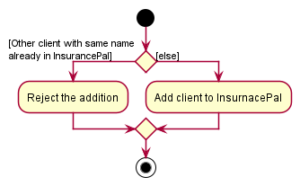
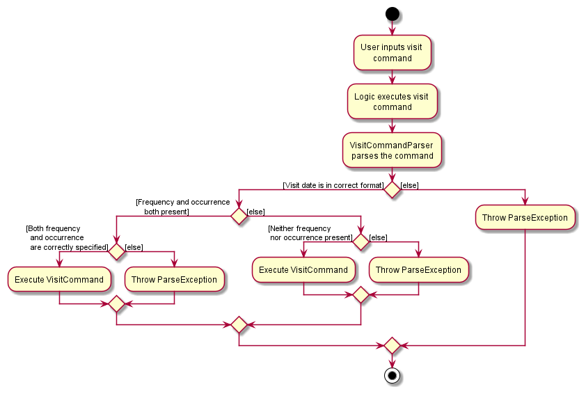
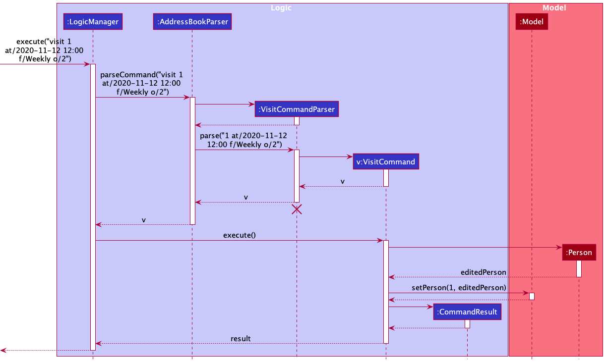
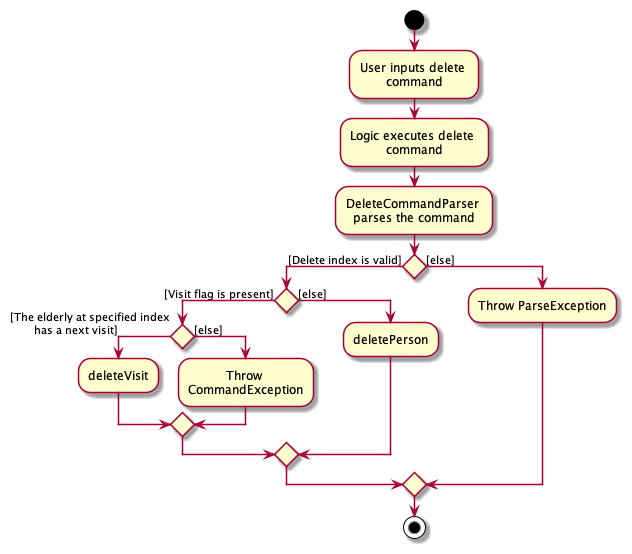
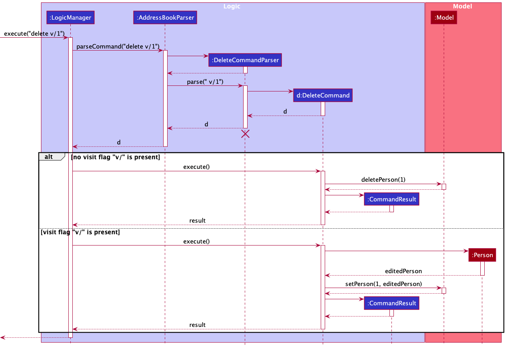
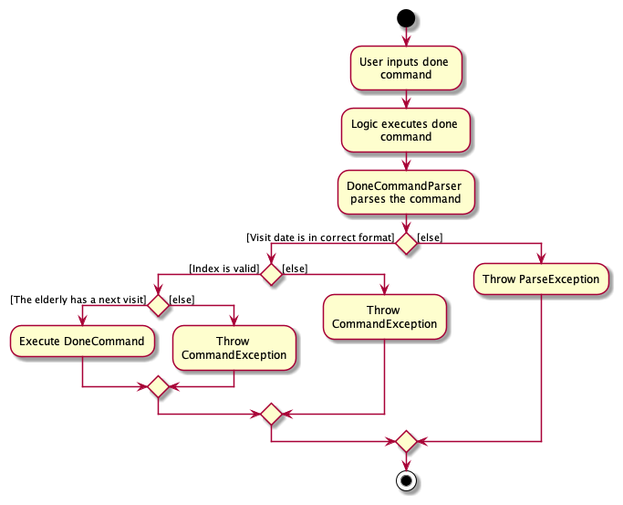
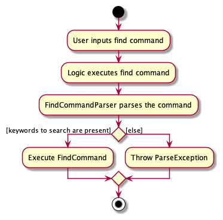

- Table of Contents
  {:toc}

---

## **Acknowledgements**

- {list here sources of all reused/adapted ideas, code, documentation, and third-party libraries -- include links to the original source as well}

---

## **Setting up, getting started**

Refer to the guide [_Setting up and getting started_](SettingUp.md).

---

## **Design**

:bulb: **Tip:** The `.puml` files used to create diagrams in this document can be found in the [diagrams](https://github.com/se-edu/addressbook-level3/tree/master/docs/diagrams/) folder. Refer to the [_PlantUML Tutorial_ at se-edu/guides](https://se-education.org/guides/tutorials/plantUml.html) to learn how to create and edit diagrams.

### Architecture

The **_Architecture Diagram_** given above explains the high-level design of the App.

Given below is a quick overview of main components and how they interact with each other.

**Main components of the architecture**

**`Main`** has two classes called [`Main`](https://github.com/AY2122S1-CS2103-T14-1/tp/blob/master/src/main/java/seedu/address/Main.java) and [`MainApp`](https://github.com/AY2122S1-CS2103-T14-1/tp/blob/master/src/main/java/seedu/address/MainApp.java). It is responsible for,

- At app launch: Initializes the components in the correct sequence, and connects them up with each other.
- At shut down: Shuts down the components and invokes cleanup methods where necessary.

[**`Commons`**](#common-classes) represents a collection of classes used by multiple other components.

The rest of the App consists of four components.

- [**`UI`**](#ui-component): The UI of the App.
- [**`Logic`**](#logic-component): The command executor.
- [**`Model`**](#model-component): Holds the data of the App in memory.
- [**`Storage`**](#storage-component): Reads data from, and writes data to, the hard disk.

**How the architecture components interact with each other**

The _Sequence Diagram_ below shows how the components interact with each other for the scenario where the user issues the command `delete 1`.

Each of the four main components (also shown in the diagram above),

- defines its _API_ in an `interface` with the same name as the Component.
- implements its functionality using a concrete `{Component Name}Manager` class (which follows the corresponding API `interface` mentioned in the previous point).

For example, the `Logic` component defines its API in the `Logic.java` interface and implements its functionality using the `LogicManager.java` class which follows the `Logic` interface. Other components interact with a given component through its interface rather than the concrete class (reason: to prevent outside component's being coupled to the implementation of a component), as illustrated in the (partial) class diagram below.

The sections below give more details of each component.

### UI component

The **API** of this component is specified in [`Ui.java`](https://github.com/AY2122S1-CS2103-T14-1/tp/blob/master/src/main/java/seedu/address/ui/Ui.java)

The UI consists of a `MainWindow` that is made up of parts e.g.`CommandBox`, `ResultDisplay`, `PersonListPanel`, `StatusBarFooter` etc. All these, including the `MainWindow`, inherit from the abstract `UiPart` class which captures the commonalities between classes that represent parts of the visible GUI.

The `UI` component uses the JavaFx UI framework. The layout of these UI parts are defined in matching `.fxml` files that are in the `src/main/resources/view` folder. For example, the layout of the [`MainWindow`](https://github.com/AY2122S1-CS2103-T14-1/tp/blob/master/src/main/java/seedu/address/ui/MainWindow.java) is specified in [`MainWindow.fxml`](https://github.com/AY2122S1-CS2103-T14-1/tp/blob/master/src/main/resources/view/MainWindow.fxml)

The `UI` component,

- executes user commands using the `Logic` component.
- listens for changes to `Model` data so that the UI can be updated with the modified data.
- keeps a reference to the `Logic` component, because the `UI` relies on the `Logic` to execute commands.
- depends on some classes in the `Model` component, as it displays `Person` object residing in the `Model`.

### Logic component

**API** : [`Logic.java`](https://github.com/AY2122S1-CS2103-T14-1/tp/blob/master/src/main/java/seedu/address/logic/Logic.java)

Here's a (partial) class diagram of the `Logic` component:

How the `Logic` component works:

1. When `Logic` is called upon to execute a command, it uses the `AddressBookParser` class to parse the user command.
1. This results in a `Command` object (more precisely, an object of one of its subclasses e.g., `AddCommand`) which is executed by the `LogicManager`.
1. The command can communicate with the `Model` when it is executed (e.g. to add a person).
1. The result of the command execution is encapsulated as a `CommandResult` object which is returned from `Logic`.

:information_source: More execution sequence can be found in the [Implementation](#implementation) section.

The Sequence Diagram below illustrates the interactions within the `Logic` component for the `execute("find attribute")` API call.

:information_source: **Note:** The lifeline for `DeleteCommandParser` should end at the destroy marker (X) but due to a limitation of PlantUML, the lifeline reaches the end of diagram. The same disclaimer applies to subsequent activity diagrams in this document.

Here are the other classes in `Logic` (omitted from the class diagram above) that are used for parsing a user command:

How the parsing works:

- When called upon to parse a user command, the `AddressBookParser` class creates an `XYZCommandParser` (`XYZ` is a placeholder for the specific command name e.g., `AddCommandParser`) which uses the other classes shown above to parse the user command and create a `XYZCommand` object (e.g., `AddCommand`) which the `AddressBookParser` returns back as a `Command` object.
- All `XYZCommandParser` classes (e.g., `AddCommandParser`, `DeleteCommandParser`, ...) inherit from the `Parser` interface so that they can be treated similarly where possible e.g, during testing.

### Model component

**API** : [`Model.java`](https://github.com/AY2122S1-CS2103-T14-1/tp/blob/master/src/main/java/seedu/address/model/Model.java)

The `Model` component,

- stores the address book data i.e., all `Person` objects (which are contained in a `UniquePersonList` object).
- stores the currently 'selected' `Person` objects (e.g., results of a search query) as a separate _filtered_ list which is exposed to outsiders as an unmodifiable `ObservableList<Person>` that can be 'observed' e.g. the UI can be bound to this list so that the UI automatically updates when the data in the list change.
- stores a `UserPref` object that represents the user’s preferences. This is exposed to the outside as a `ReadOnlyUserPref` objects.
- does not depend on any of the other three components (as the `Model` represents data entities of the domain, they should make sense on their own without depending on other components)

### Storage component

**API** : [`Storage.java`](https://github.com/AY2122S1-CS2103-T14-1/tp/blob/master/src/main/java/seedu/address/storage/Storage.java)

The `Storage` component,

- can save both address book data and user preference data in json format, and read them back into corresponding objects.
- inherits from both `AddressBookStorage` and `UserPrefStorage`, which means it can be treated as either one (if only the functionality of only one is needed).
- depends on some classes in the `Model` component (because the `Storage` component's job is to save/retrieve objects that belong to the `Model`)

### Common classes

Classes used by multiple components are in the `seedu.addressbook.commons` package.

---

## **Implementation**

This section describes some noteworthy details on how certain features are implemented.

### Datetime for Visit and LastVisit

#### Implementation details

Static class `DateTimeUtil` uses the library `java.time.LocalDateTime` and `java.time.format.DateTimeFormatter` to handle all datetime-related parsing and operations for `Visit` and `LastVisit` timings.
The datetime is stored and displayed differently in the system for both efficiency and readability:

- It is stored as `yyyy-MM-dd HH:mm` in the system and for parsing of commands.
- It is displayed as `dd LLL yyyy HH:mm` on the GUI.

For example, time at two o'clock in the afternoon of 1st November 2021 will be stored or parsed as `2021-11-01 14:00` and displayed as `01 Nov 2021 14:00`

### Add command

#### Implementation details

The add command is used to add an elderly to SeniorLove.
It makes use of polymorphism and interfaces, and is similar in implementation to other commands in SeniorLove:

- `AddCommand` extends `Command`
- `AddCommandParser` implements `Parser<AddCommand>`

The following activity diagram illustrates the activity flow of the add command:

The following sequence diagram illustrates how different components of SeniorLove interact with each other:

Given below is an example usage scenario:

1. User inputs the add command, specifying the name, phone number, address and preferred language of the elderly to be added. They may also optionally include their health conditions, last visit, and the next scheduled visit.
2. After successfully parsing the user input, the `AddCommand#execute(Model model)` method is called.
3. The elderly that the user wants to add will be stored.
4. Upon successfully adding the elderly to address book, a `CommandResult` object is instantiated and returned to `LogicManager`.

#### Design choices

- Optional last visit and visit attributes

  Both attributes are implemented as optional to allow users the flexibility to either add them on-the-go or omit them.

### Visit command

#### Implementation details

The visit command is used to add a visit to an existing elderly in SeniorLove.
It makes use of polymorphism and interfaces, and is similar in implementation to other commands in SeniorLove:

- `VisitCommand` extends `Command`
- `VisitCommandParser` implements `Parser<VisitCommand>`

The following activity diagram illustrates the activity flow of the visit command:

The following sequence diagram illustrates how different components of SeniorLove interact with each other when a visit with a visitation frequency and number of occurrence specified is called:

Given below is an example usage scenario:

1. User inputs the visit command, specifying the index of the elderly to visit and the datetime at which they will go for the visit. They may also optionally include the visitation frequency and number of occurrences at this specified frequency.
2. After successfully parsing the user input, the `VisitCommand#execute(Model model)` method is called.
3. The visit that the user wants to add to the elderly will be stored, and it will be converted into a separate format for displaying on the GUI.
4. Upon successfully adding the visit to the corresponding elderly, a `CommandResult` object is instantiated and returned to `LogicManager`.

#### Design choices

- Overloading `edit` to add/change visit:

  The `visit` command is similar to the `edit` command in the sense that they both alter the elderly's attributes, and it is possible to implement similar functionality without a new command.
  However, we chose to implement the `visit` command since a visit can be added without having any visit previously, and overloading the `edit` command can make it confusing to use.

- Replacing the existing elderly with a new instance with the visit changed:

  We want to keep the data safe by ensuring immutability of Person objects. Therefore, we create an instance of Person with modified visit to replace the previous Person object.

- Implementing recurring visits with an occurrence counter and frequency attribute:

  Both methods can achieve the intended effect of implementing the recurring visits. However, we chose to go with an occurrence counter and frequency attribute because it requires less resources.
  We were concerned that the recurring visits could have many occurrences and at a high frequency, and this could lead to extra overhead in storing and accessing these arrays.

### Delete command

#### Implementation details

Delete command is used to delete an existing elderly or the next visit of an elderly in SeniorLove. It makes use of polymorphism and is similar to the other commands in SeniorLove:

- `DeleteCommand` extends `Command`
- `DeleteCommandParser` implements `Parser<DeleteCommand>`

The following activity diagram illustrates the activity flow of the delete command:

The following sequence diagram illustrate how the components interact with each other:

Given below is an example usage scenario:

1. User inputs the delete command, specifying the visit flag and the index of the elderly to be removed visit from. (If user wants to remove the entry of the elderly entirely instead of only removing the visit, she/he only needs to specify the index without the visit flag.)
2. After successfully parsing the user input, the `DeleteCommand#execute(Model model)` method is called.
3. The elderly which the user wants to delete visit from will be replaced by a new entry of a copy of elderly without the existing next visit.
4. Upon successfully deleting the visit from the corresponding elderly, a `CommandResult` object is instantiated and returned to `LogicManager`.

#### Design choices

- Overloading `delete` to remove visit:

  Deleting elderly and deleting visits are overlapping functionalities dealing with removing information. It is possible to overload the `delete` command to achieve both functionalities without creating new command.

- Replace the existing elderly with a new instance (if deleting a visit):

  We want to keep the data safe by ensuring immutability of Person objects. Therefore, we create an instance of Person with visit removed to replace the previous Person object.

### Done Command

#### Implementation details

The done command is used to mark an elderly's next visit as done, and update the elderly's `LastVisit` datetime value with that of the completed `Visit`.
The `Visit` field will also be updated or deleted depending on the `Occurrence` field's value.
It makes use of polymorphism and interfaces, and is similar in implementation to other commands in SeniorLove:

- `DoneCommand` extends `Command`
- `DoneCommandParser` implements `Parser<DoneCommand>`

The following activity diagram illustrates the activity flow of the done command:

#### Design choices

- Overloading `edit` to change elderly:

  The `done` command makes use of the `edit` command to get a new copy of the `Person` object with the `Visit` and `LastVisit` fields being updated.

- Defensive Programming used:

  Execution of the `done` command makes use of defensive programming techniques to handle situations where `Visit` or its related `Frequency` and `Occurrence` fields are empty.

### Find command

#### Implementation details

The find command carries out a AND search on the attributes of all elderly in SeniorLove, and shows a list of elderly who match the find parameters. The find parameters are strings that are non-empty.

It makes use of polymorphism and interfaces, and is similar in implementation to other commands in SeniorLove:

- `FindCommand` extends `Command`
- `FindCommandParser` implements `Parser<FindCommand>`

The following activity diagram illustrates the activity flow of the visit command:

The following sequence diagram shows how different components of SeniorLove interact with each other when executing a find command with a non-empty keyword:

Given below is an example usage scenario:

1. User inputs the find command, specifying the keyword(s) to find.
2. After successfully parsing the user input, the `FindCommand#execute(Model model)` method is called.
3. Attributes of all elderly in the list are searched, and all elderly who satisfy the AND search will be returned.
4. `CommandResult` object is instantiated and returned to `LogicManager`.

#### Design choices

- Searching by specified attributes:

  This is a possible solution, but we chose to do a search across all attributes because we have many flags and formatting, and it makes `find` harder to use if each attribute has to be specified.

- AND search:

  We chose to implement this over OR search because we want each new keyword to narrow the search space, so that it is easy to find elderly that match all the given attributes.

- Substring match:

  Matching by substring was implemented because it makes it easier to search for an elderly without having to remember their full attributes.

### Sort command

#### Implementation details

Sort command is used to sort the list of people in SeniorLove. visit of an elderly in SeniorLove. It makes use of polymorphism:

As shown in the class diagram above:

- `SortCommand` extends `Command`
- `SortCommandParser` implements `Parser<SortCommand>`

Given below is an example usage scenario:

1. User inputs the sort command, specifying the visit flag (or the last visit flag if user wants to sort by last visit.)
2. After successfully parsing the user input, the `SortCommand#execute(Model model)` method is called with the appropriate `SortComparator` and the sorting direction `isAscending`.
3. The current list of people will be sorted by the visit date from the earliest to the latest. (or sorted by the last visit date from the latest to the earliest).
4. Upon successfully sorting the visit of the corresponding elderly, a `CommandResult` object is instantiated and returned to `LogicManager`.

#### Design choices

- Wrapping the `FilteredList` around a `SortedList`:

  We choose to add a wrapper for list of elderly so that the original FilteredList remains immutable.

- Implementing `SortComparator` class:

  Creating a class of `SortComparator` makes the `SortCommand` more extensible in the future if developers would like to sort the list of persons by other attributes.

### Summary command

#### Implementation details

The summary command displays the statistics of overdue visits, upcoming visits and recent last visits.

It makes use of polymorphism and is similar in implementation to other commands in SeniorLove:

- `SummaryCommand` extends `Command`

Given below is an example usage scenario:

1. User inputs the summary command.
2. The `SummaryCommand#execute(Model model)` method is called.
3. Statistics of the relevant visits and last visits are calculated and returned on the main panel.
4. `CommandResult` object is instantiated and returned to `LogicManager`.

### \[Proposed\] Undo/redo feature

#### Proposed Implementation

The proposed undo/redo mechanism is facilitated by `VersionedAddressBook`. It extends `AddressBook` with an undo/redo history, stored internally as an `addressBookStateList` and `currentStatePointer`. Additionally, it implements the following operations:

- `VersionedAddressBook#commit()` — Saves the current address book state in its history.
- `VersionedAddressBook#undo()` — Restores the previous address book state from its history.
- `VersionedAddressBook#redo()` — Restores a previously undone address book state from its history.

These operations are exposed in the `Model` interface as `Model#commitAddressBook()`, `Model#undoAddressBook()` and `Model#redoAddressBook()` respectively.

Given below is an example usage scenario and how the undo/redo mechanism behaves at each step.

Step 1. The user launches the application for the first time. The `VersionedAddressBook` will be initialized with the initial address book state, and the `currentStatePointer` pointing to that single address book state.

Step 2. The user executes `delete 5` command to delete the 5th elderly in the address book. The `delete` command calls `Model#commitAddressBook()`, causing the modified state of the address book after the `delete 5` command executes to be saved in the `addressBookStateList`, and the `currentStatePointer` is shifted to the newly inserted address book state.

Step 3. The user executes `add n/David …​` to add a new elderly. The `add` command also calls `Model#commitAddressBook()`, causing another modified address book state to be saved into the `addressBookStateList`.

:information_source: **Note:** If a command fails its execution, it will not call `Model#commitAddressBook()`, so the address book state will not be saved into the `addressBookStateList`.

Step 4. The user now decides that adding the elderly was a mistake, and decides to undo that action by executing the `undo` command. The `undo` command will call `Model#undoAddressBook()`, which will shift the `currentStatePointer` once to the left, pointing it to the previous address book state, and restores the address book to that state.

:information_source: **Note:** If the `currentStatePointer` is at index 0, pointing to the initial AddressBook state, then there are no previous AddressBook states to restore. The `undo` command uses `Model#canUndoAddressBook()` to check if this is the case. If so, it will return an error to the user rather
than attempting to perform the undo.

The following sequence diagram shows how the undo operation works:

:information_source: **Note:** The lifeline for `UndoCommand` should end at the destroy marker (X) but due to a limitation of PlantUML, the lifeline reaches the end of diagram.

The `redo` command does the opposite — it calls `Model#redoAddressBook()`, which shifts the `currentStatePointer` once to the right, pointing to the previously undone state, and restores the address book to that state.

:information_source: **Note:** If the `currentStatePointer` is at index `addressBookStateList.size() - 1`, pointing to the latest address book state, then there are no undone AddressBook states to restore. The `redo` command uses `Model#canRedoAddressBook()` to check if this is the case. If so, it will return an error to the user rather than attempting to perform the redo.

Step 5. The user then decides to execute the command `list`. Commands that do not modify the address book, such as `list`, will usually not call `Model#commitAddressBook()`, `Model#undoAddressBook()` or `Model#redoAddressBook()`. Thus, the `addressBookStateList` remains unchanged.

Step 6. The user executes `clear`, which calls `Model#commitAddressBook()`. Since the `currentStatePointer` is not pointing at the end of the `addressBookStateList`, all address book states after the `currentStatePointer` will be purged. Reason: It no longer makes sense to redo the `add n/David …​` command. This is the behavior that most modern desktop applications follow.

The following activity diagram summarizes what happens when a user executes a new command:

#### Design considerations:

**Aspect: How undo & redo executes:**

- **Alternative 1 (current choice):** Saves the entire address book.

  - Pros: Easy to implement.
  - Cons: May have performance issues in terms of memory usage.

- **Alternative 2:** Individual command knows how to undo/redo by
  itself.
  - Pros: Will use less memory (e.g. for `delete`, just save the elderly being deleted).
  - Cons: We must ensure that the implementation of each individual command are correct.

_{more aspects and alternatives to be added}_

### \[Proposed\] Data archiving

_{Explain here how the data archiving feature will be implemented}_

---

## **Documentation, logging, testing, configuration, dev-ops**

- [Documentation guide](Documentation.md)
- [Testing guide](Testing.md)
- [Logging guide](Logging.md)
- [Configuration guide](Configuration.md)
- [DevOps guide](DevOps.md)

---

## **Appendix: Requirements**

### Product scope

**Target user profile**:

- social worker who has a need to manage a significant number of elderly contacts with limited or no family support, and contact them regularly to check on their well-being
- prefer desktop apps over other types
- can type fast
- prefers typing to mouse interactions
- is reasonably comfortable using CLI apps

**Value proposition**:
Since social workers need to contact many elderly every day, we created this app to help them easily avoid missing out on any elderly while reducing the hassle of manually checking the frequency of contacts for each elderly.

### Glossary

| Term              | Meaning                                                                                                                    |
| ----------------- | -------------------------------------------------------------------------------------------------------------------------- |
| **User**          | Refers to Social Worker, a community worker using the app to manage multiple elderly.                                      |
| **Social Worker** | Workers at community centres to provide supports for needy seniors. They manage multiple elderly and visit them regularly. |
| **Elderly**       | The seniors who need social support due to limited family support. They are managed by social workers.                     |
| **Visit**         | A visit to an elderly's home scheduled by the user.                                                                        |
| **Attribute**     | Data that is assigned to an elderly                                                                                        |
| **Mainstream OS** | Windows, Linux, Unix, OS-X.                                                                                                |

### User stories

Priorities: High (must have) - `* * *`, Medium (nice to have) - `* *`, Low (unlikely to have) - `*`

| Priority | As a …​       | I want to …​                                                                         | So that I can…​                                           |
| -------- | ------------- | ------------------------------------------------------------------------------------ | --------------------------------------------------------- |
| `* * *`  | social worker | add entries                                                                          | keep track of new elderly who come under my care          |
| `* * *`  | social worker | delete entries                                                                       | keep track of elderly who are no longer under my care     |
| `* * *`  | social worker | see elderly's contacts and home address                                              | know how to contact them                                  |
| `* * *`  | social worker | add deadlines to contact a elderly                                                   | remember to check in on them                              |
| `* * *`  | social worker | add an ‘until’ date for recurring deadlines                                          | know when to stop visiting a elderly on a recurring basis |
| `* * *`  | social worker | see data from my previous session                                                    | save time spent importing entries each session            |
| `* * *`  | social worker | find elderly by their name, phone, language and address                              | find the elderly I am looking for                         |
| `* * *`  | social worker | find elderly by their health conditions                                              | know who needs more care                                  |
| `* * *`  | social worker | find elderly by their visits                                                         | know who I need to visit on a given day                   |
| `* * *`  | social worker | find elderly by their last visits                                                    | know which elderly I have last visited on a given day     |
| `* * *`  | social worker | view elderly's health conditions                                                     | know how well they are doing                              |
| `* * *`  | social worker | view overdue visits                                                                  | know I need to clear them up                              |
| `* * *`  | social worker | view the elderly's visitation frequency                                              | know how frequently I should visit them                   |
| `* * *`  | social worker | view the elderly's recurring occurrence                                              | know how many times I should visit them regularly         |
| `* * *`  | social worker | sort the elderly by the last visit date in descending chronological order            | know whom I visited recently                              |
| `* * *`  | social worker | sort the elderly by next contact date in ascending chronological order               | know whom I need to visit next                            |
| `* * *`  | social worker | list the upcoming visits in the next week/next month                                 | not miss out upcoming visits                              |
| `* *`    | social worker | download elderly data                                                                | access it on my computer at any time                      |
| `* *`    | social worker | view the summary statistics of the overdue visits, recent visits and upcoming visits | better gauge whether all elderly have been cared for      |

_{More to be added}_

### Use cases

(For all use cases below, the **System** is `SeniorLove` and the **Actor** is the `User`, unless specified otherwise)

**Use case: UC01 - Add an elderly**

**MSS**

1. User adds in a new senior’s name together with phone number, language and address
2. SeniorLove shows a new entry for the elderly just added

   Use case ends.

**Extensions**

- 1a. User also inputs last visited and visit date.

  - 1a1. SeniorLoves shows a new entry for the elderly added, with the optional details as well.

    Use case ends.

- 2a. User inputs a name that is already inside SeniorLove’s list.

  - 2a1. SeniorLove shows an error message notifying the user that the name already exists.

    Use case resumes at step 1.

- 3a. User inputs a new senior’s name with some compulsory details missing.

  - 3a1. SeniorLove shows an error message notifying the user about the missing details.

    Use case resumes at step 1.

**Use case: UC02 - Delete an elderly**

**MSS**

1. User requests to list seniors
2. SeniorLove shows a list of seniors
3. User requests to delete a specific senior in the list
4. SeniorLove deletes the senior

   Use case ends.

**Extensions**

- 2a. The list is empty.

  Use case ends.

- 3a. The given index is invalid.

  - 3a1. SeniorLove shows an error message.

    Use case resumes at step 2.

**Use case: UC03 - Mark a visit as done**

**MSS**

1. User requests to list seniors
2. SeniorLove shows a list of seniors
3. User requests to mark a specific visit as done
4. SeniorLove mark a specific visit as done

   Use case ends.

**Extension**

- 3a. There is no current pending visit.

  - 3a1. SeniorLove shows an error message.

    Use case resumes at step 2.

### Non-Functional Requirements

1.  Should work on any _mainstream OS_ as long as it has Java `11` or above installed.
2.  Should be able to hold up to 1000 elderly without a noticeable sluggishness in performance for typical usage.
3.  Should be usable by a novice who has never used the system.
4.  A user with above average typing speed for regular English text (i.e. not code, not system admin commands) should be able to accomplish most of the tasks faster using commands than using the mouse.

---

## **Appendix: Instructions for manual testing**

Given below are instructions to test the app manually.

:information_source: **Note:** These instructions only provide a starting point for testers to work on;
testers are expected to do more *exploratory* testing.

### Launch and shutdown

1. Initial launch

   1. Download the jar file and copy into an empty folder

   2. Double-click the jar file Expected: Shows the GUI with a set of sample contacts. The window size may not be optimum.

2. Saving window preferences

   1. Resize the window to an optimum size. Move the window to a different location. Close the window.

   2. Re-launch the app by double-clicking the jar file. 
      Expected: The most recent window size and location is retained.

### Sorting elderly

1. Sorting elderly while all elderly are being shown

   1. Prerequisites: List all elderly using the `list` command.

   2. Test case: `sort v/` 
      Expected: Elderly are displayed in increasing order of the next visit date. If an elderly does not have a next visit, he/she will be displayed at the bottom of the list.

   3. Test case: `delete lv/` 
      Expected: Elderly are displayed in decreasing order of the last visit date. If an elderly does not have a last visit, he/she will be displayed at the bottom of the list.

   4. Incorrect delete commands to try: `sort`, `sort n/`. 
      Expected: Error details shown in the status message. Status bar remains the same.

### Deleting an elderly

1. Deleting an elderly while all elderly are being shown

   1. Prerequisites: List all elderly using the `list` command. Multiple elderly in the list.

   2. Test case: `delete 1` 
      Expected: First contact is deleted from the list. Details of the deleted contact shown in the status message. Timestamp in the status bar is updated.

   3. Test case: `delete 0` 
      Expected: No elderly is deleted. Error details shown in the status message. Status bar remains the same.

   4. Other incorrect delete commands to try: `delete`, `delete x`, `...` (where x is larger than the list size) 
      Expected: Similar to previous.

### Deleting a visit of an elderly

1. Deleting a visit an elderly while all elderly are being shown

   1. Prerequisites: List all elderly using the `list` command. The first elderly listed has a next visit.

   2. Test case: `delete v/1` 
      Expected: Next visit of the first elderly is deleted from the list. Details of the deleted contact shown in the status message. Timestamp in the status bar is updated.

   3. Test case: `delete v/0` 
      Expected: No visit of the elderly is deleted. Error details shown in the status message. Status bar remains the same.

   4. Other incorrect delete commands to try: `delete v/x`, `...` (where x is larger than the list size) 
      Expected: Similar to previous.

1. _{ more test cases …​ }_

### Saving data

1. Dealing with missing/corrupted data files

   1. _{explain how to simulate a missing/corrupted file, and the expected behavior}_

1. _{ more test cases …​ }_
