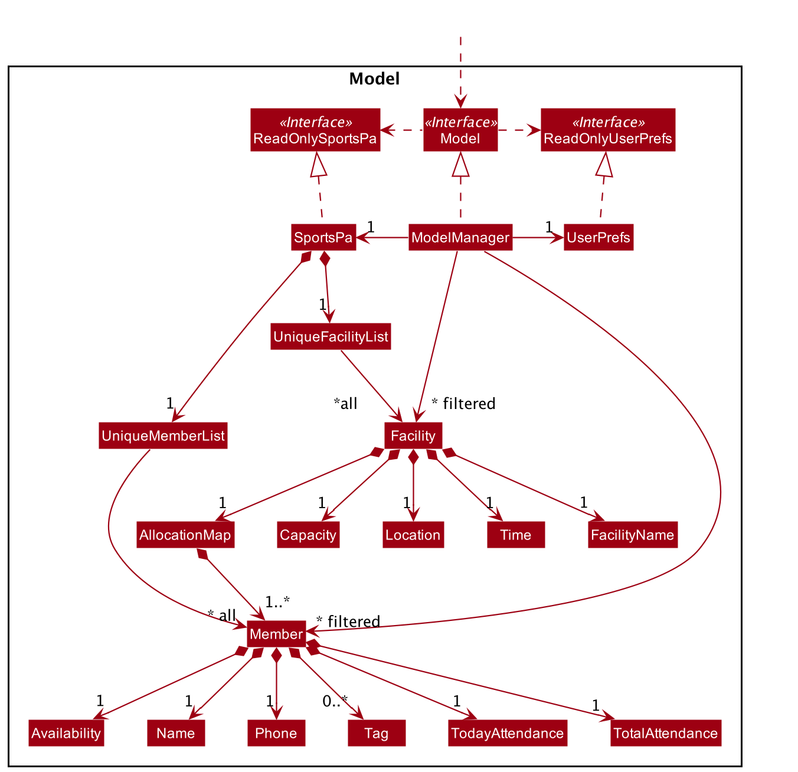
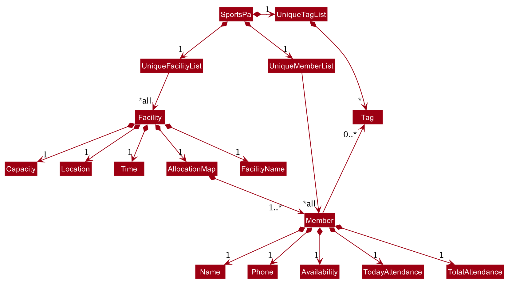
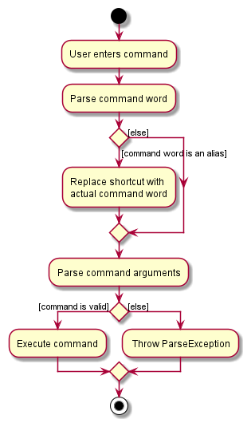
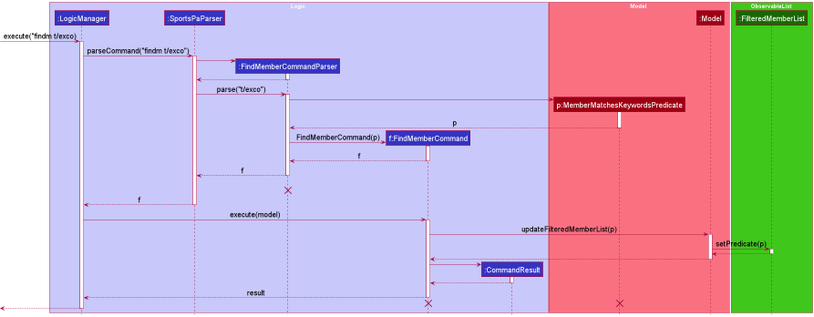
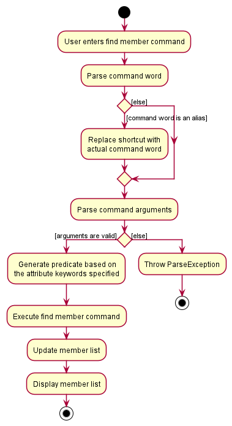
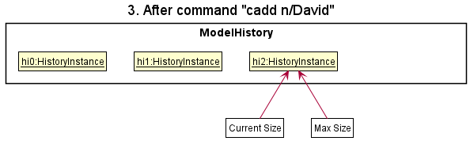

* Table of Contents
{:toc}

--------------------------------------------------------------------------------------------------------------------

## **Acknowledgements**

* {list here sources of all reused/adapted ideas, code, documentation, and third-party libraries -- include links to the
  original source as well}

--------------------------------------------------------------------------------------------------------------------

## **Setting up, getting started**

Refer to the guide [_Setting up and getting started_](SettingUp.md).

--------------------------------------------------------------------------------------------------------------------

## **Design**

:bulb: **Tip:** The `.puml` files used to create diagrams in this document can be found in
the [diagrams](https://github.com/se-edu/addressbook-level3/tree/master/docs/diagrams/) folder. Refer to the [_PlantUML
Tutorial_ at se-edu/guides](https://se-education.org/guides/tutorials/plantUml.html) to learn how to create and edit
diagrams.

### Architecture

The ***Architecture Diagram*** given above explains the high-level design of the App.

Given below is a quick overview of main components and how they interact with each other.

**Main components of the architecture**

**`Main`** has two classes
called [`Main`](https://github.com/se-edu/addressbook-level3/tree/master/src/main/java/seedu/address/Main.java)
and [`MainApp`](https://github.com/se-edu/addressbook-level3/tree/master/src/main/java/seedu/address/MainApp.java). It
is responsible for,

* At app launch: Initializes the components in the correct sequence, and connects them up with each other.
* At shut down: Shuts down the components and invokes cleanup methods where necessary.

[**`Commons`**](#common-classes) represents a collection of classes used by multiple other components.

The rest of the App consists of four components.

* [**`UI`**](#ui-component): The UI of the App.
* [**`Logic`**](#logic-component): The command executor.
* [**`Model`**](#model-component): Holds the data of the App in memory.
* [**`Storage`**](#storage-component): Reads data from, and writes data to, the hard disk.

**How the architecture components interact with each other**

The *Sequence Diagram* below shows how the components interact with each other for the scenario where the user issues
the command `delete 1`.

Each of the four main components (also shown in the diagram above),

* defines its *API* in an `interface` with the same name as the Component.
* implements its functionality using a concrete `{Component Name}Manager` class (which follows the corresponding
  API `interface` mentioned in the previous point.

For example, the `Logic` component defines its API in the `Logic.java` interface and implements its functionality using
the `LogicManager.java` class which follows the `Logic` interface. Other components interact with a given component
through its interface rather than the concrete class (reason: to prevent outside component's being coupled to the
implementation of a component), as illustrated in the (partial) class diagram below.

The sections below give more details of each component.

### UI component

The **API** of this component is specified
in [`Ui.java`](https://github.com/se-edu/addressbook-level3/tree/master/src/main/java/seedu/address/ui/Ui.java)

The UI consists of a `MainWindow` that is made up of parts e.g.`CommandBox`, `ResultDisplay`, `PersonListPanel`
, `StatusBarFooter` etc. All these, including the `MainWindow`, inherit from the abstract `UiPart` class which captures
the commonalities between classes that represent parts of the visible GUI.

The `UI` component uses the JavaFx UI framework. The layout of these UI parts are defined in matching `.fxml` files that
are in the `src/main/resources/view` folder. For example, the layout of
the [`MainWindow`](https://github.com/se-edu/addressbook-level3/tree/master/src/main/java/seedu/address/ui/MainWindow.java)
is specified
in [`MainWindow.fxml`](https://github.com/se-edu/addressbook-level3/tree/master/src/main/resources/view/MainWindow.fxml)

The `UI` component,

* executes user commands using the `Logic` component.
* listens for changes to `Model` data so that the UI can be updated with the modified data.
* keeps a reference to the `Logic` component, because the `UI` relies on the `Logic` to execute commands.
* depends on some classes in the `Model` component, as it displays `Person` and `Facility` object residing in the `Model`.

### Logic component

**API** : [`Logic.java`](https://github.com/se-edu/addressbook-level3/tree/master/src/main/java/seedu/address/logic/Logic.java)

Here's a (partial) class diagram of the `Logic` component:

How the `Logic` component works:

1. When `Logic` is called upon to execute a command, it uses the `AddressBookParser` class to parse the user command.
1. This results in a `Command` object (more precisely, an object of one of its subclasses e.g., `AddMemberCommand`)
   which is executed by the `LogicManager`.
1. The command can communicate with the `Model` when it is executed (e.g. to add a person).
1. The result of the command execution is encapsulated as a `CommandResult` object which is returned back from `Logic`.

The Sequence Diagram below illustrates the interactions within the `Logic` component for the `execute("delete 1")` API
call.

:information_source: **Note:** The lifeline for `DeleteCommandParser` should end at the destroy marker (X) but due to a limitation of PlantUML, the lifeline reaches the end of diagram.

Here are the other classes in `Logic` (omitted from the class diagram above) that are used for parsing a user command:

How the parsing works:

* When called upon to parse a user command, the `AddressBookParser` class creates an `XYZCommandParser` (`XYZ` is a
  placeholder for the specific command name e.g., `AddMemberCommandParser`) which uses the other classes shown above to
  parse the user command and create a `XYZCommand` object (e.g., `AddMemberCommand`) which the `AddressBookParser`
  returns back as a `Command` object.
* All `XYZCommandParser` classes (e.g., `AddMemberCommandParser`, `DeleteCommandParser`, ...) inherit from the `Parser`
  interface so that they can be treated similarly where possible e.g, during testing.

### Model component

**
API** : [`Model.java`](https://github.com/se-edu/addressbook-level3/tree/master/src/main/java/seedu/address/model/Model.java)

The `Model` component,

* stores the address book data i.e., all `Person` and `Facility` objects (which are contained in a `UniquePersonList`
and a `UniqueFacilityList` object respectively).
* stores the currently 'selected' `Person` and `Facility` objects (e.g., results of a search query) as a separate _filtered_ list which
  is exposed to outsiders as unmodifiable `ObservableList<Person>` and `ObservableList<Facility>` respectively which can be 'observed' e.g. the UI can be bound to
  this list so that the UI automatically updates when the data in the list change.
* stores a `UserPref` object that represents the user’s preferences. This is exposed to the outside as
  a `ReadOnlyUserPref` objects.
* does not depend on any of the other three components (as the `Model` represents data entities of the domain, they
  should make sense on their own without depending on other components)

:information_source: **Note:** An alternative (arguably, a more OOP) model is given below. It has a `Tag` list in the `AddressBook`, which `Person` references. This allows `AddressBook` to only require one `Tag` object per unique tag, instead of each `Person` needing their own `Tag` objects. 

### Storage component

**
API** : [`Storage.java`](https://github.com/se-edu/addressbook-level3/tree/master/src/main/java/seedu/address/storage/Storage.java)

The `Storage` component,

* can save both address book data (data on members and facilities) and user preference data in json format, and read them back into corresponding
  objects.
* inherits from both `AddressBookStorage` and `UserPrefStorage`, which means it can be treated as either one (if only
  the functionality of only one is needed).
* depends on some classes in the `Model` component (because the `Storage` component's job is to save/retrieve objects
  that belong to the `Model`)

### Common classes

Classes used by multiple components are in the `seedu.addressbook.commons` package.

--------------------------------------------------------------------------------------------------------------------

## **Implementation**

This section describes some noteworthy details on how certain features are implemented.

### Alias feature

#### Implementation

The aliases mechanism is facilitated by `AddressBookParser`. Aliases are stored in `AliasMap`, which keeps the mappings
between `Shortcut` and `CommandWord`, and is stored in `UserPrefs`. The association between `Shortcut` and `CommandWord`
is represented as `Alias`. `AliasMap` implements the following operations:

* `AliasMap#add(Alias)` — Adds an alias to the mapping.
* `AliasMap#remove(Shortcut)` — Removes an alias from the mapping.
* `AliasMap#convertAliasIfPresent(String)` — Replaces the input string with the command if it is an alias.

The first two operations are exposed in the `Model` interface as `Model#addAlias(Alias)`
and `Model#removeAlias(Shortcut)` respectively.

Given below is an example usage scenario and how the aliases mechanism behaves.

Step 1. The user launches the application for the first time. `UserPrefs` is initialised and `AliasMap` is created with
empty mappings.

Step 2. The user executes the `alias s/l cw/listf` command to create a shortcut `l` for the `listf` command. The `alias`
command calls `Model#addAlias(Alias)`, causing a mapping between `l` and `listf` to be stored in `AliasMap`.

Step 3. The user now wants to use the shortcut `l` for a different command, `listm`, instead. The user
executes `alias s/l cw/listm`. `Model#addAlias(Alias)` is called again and the mapping from `l` to `listf` is replaced
with `l` to `listm` in `AliasMap`.

Step 4. The user enters `l`, which the system understands as `listm` and executes the `listm` command, displaying all
members in the member list.

The following sequence diagram shows how the system understands aliases:

:information_source: **Note:** The lifeline for `ListMembersCommand` should end at the destroy marker (X) but due to a limitation of PlantUML, the lifeline reaches the end of diagram.

Step 5. The user then realises that the shortcut `l` was not to their liking and deletes the alias by
executing `unalias l`. The `unalias` command calls `Model#removeAlias(Shortcut)` and removes the mapping from `AliasMap`
.

Step 6. The user finally decides to use the shortcut `lm` for `listm` and executes `alias s/lm cw/lsitm`. The user
closes the application and the alias defined are saved into `UserPrefStorage`, available for use at the next launch.

The following activity diagram summarizes what happens when a user enters and executes a command:

#### Design considerations:

**Aspect: What the user can create shortcuts for**

* **Alternative 1 (current choice):** Valid commands only.
    * Pros: Easy to implement in parser.
    * Cons: Less flexibility for user.

* **Alternative 2:** Any defined text.
    * Pros: Very flexible, no validation required.
    * Cons: Difficult to parse user input as would need to scan exhaustively for aliases.

In modern CLI applications, an alias is mainly used for abbreviating system commands or adding default arguments to
regularly used commands. Considering the target use of SportsPA and time constraints, since command arguments are not
likely to be repeated, we decided that it was sufficient to allow users to create shortcuts for commands only.

### Split members to facilities feature

#### Implementation

The split mechanism is facilitated by `ModelManager` and `AddressBook`.  `ModelManager` stores a list of 
filtered members as `filteredPersons`. Each `Person` in the list has an `Availability`, which is implemented internally as a `List<DayOfWeek>`. 
 
`Address Book`stores a list of all facilities as `facilities`. Each `Facility` in the list has an `AllocationMap`, which is implemented internally as an `EnumMap<DayOfWeek, List<Person>>`. This `EnumMap` is initialized
with 7 key-value pairs, of which the keys are all the enums of the 
`java.time.DayOfWeek` (`{MONDAY, TUESDAY, WEDNESDAY, THURSDAY, FRIDAY, SATURDAY, SUNDAY}`) and the values are all initialized 
as an empty `ArrayList`. This is based on the assumption that facilities are available on every day of the week.
 
When the `split` command is executed with a given `DAY` parameter, all members available on that `DAY` are filtered and the `List<Person>` of all facilities for that `DAY` is cleared.
The available members are then added to the `List<Person>` of the corresponding `DayOfWeek` in the `EnumMap` of the facilities using a Greedy algorithm.  
i.e. The filtered members list and facility list are iterated and each person is allocated to the first facility which is not at max capacity. After 
a facility is at max capacity, any remaining members are allocated to the next available facility and so on.

`ModelManager` implements the following operations:
* `split(Predicate<Person> predicate, int dayNumber)` —  Filters the list of all members according to the given `predicate`.
When the `split` command is executed, `PersonAvailableOnDayPredicate` is passed to `predicate`, allowing a filtered list of members available 
on the given `dayNumber` to be created and passed to the `split` method of `Addressbook`.

`AddressBook` implements the following operations:
* `split(FilteredList<Person> membersFilteredList, int dayNumber)` — Splits the members in the given filtered member list into facilities on the given day.
Returns -1 if no members are available, the number of members that exceed the total capacity if the number of members is 
more than the total capacity on the given day and 0 if members can be split successfully.

Additionally, `UniqueFacilityList` implements the following operations:
* `allocateMembersToFacilitiesOnDay(FilteredList<Person> members, int dayNumber)` — Clears the `AllocationMap` of each `Facility`
and allocates the members in the given filtered member list to facilities greedily.

Given below is an example usage scenario and how the split feature behaves at each step.

Step 1.

The following sequence diagram shows how the split mechanism works.

:information_source: **Note:** 
The lifeline for `SplitCommand` should end at the destroy marker (X) but due to a limitation of PlantUML, the lifeline reaches the end of diagram.

#### Design considerations:

**Aspect: Format of values in `Availability`**

* **Alternative 1 (current choice):** Store values as `java.time.DayOfWeek`.
    * Pros: Easy to implement in parser, increases user-friendliness by allowing users to just type in numbers to
      represent days of a week instead of the names. Numbers can then be easily converted into `DayOfWeek` and formatted
      to get consistent display name formats. Easily sorted in the natural order of the days of a week, ensuring 
      uniformity when displayed and making it easier to read. 
    * Cons: May not be intuitive to some users that 1 represents Monday and 7 represents Sunday.

* **Alternative 2:** Store values as `String`
    * Pros: Intuitive for users to type in the names of the days which can be stored directly after parsing.
    * Cons: Difficult to parse user input as a complicated regular expression is needed to ensure names of days are given 
      in the correct format. Less user-friendly due to need to type out the names of the days and more difficult to sort.

**Aspect: Algorithm used to determine allocation**
* **Alternative 1 (current choice):** Greedy algorithm.
  * Pros: Easy to implement and test. Intuitive and produces results similar to manual allocation.
  * Cons: Can only produce 1 allocation mapping for a set of person and facilities with the same availabilities and capacities, which may
    not be ideal.

* **Alternative 2:** Other algorithms.
    * Pros: Possible increase in performance and able to produce multiple different mappings.
    * Cons: Harder to implement and test. May require the use of supporting data structures which adds on to the complexity.

### Mark/unmark attendance feature

#### Implementation

The proposed mark/unmark attendance mechanism is facilitated by `ModelManager`. The `ModelManager` stores a list of filtered members
as `filteredPersons`. Each `Person` in the list internally stores `totalAttendance` and `todayAttendance`
which will be updated accordingly when the attendance of that `Person` is marked or unmarked.

`ModelManager` implements the following operations:
* `ModelManager#markMembersAttendance(List<Index>)` — Marks attendance of members at the specified list of index.
* `ModelManager#unmarkMembersAttendance(List<Index>)` — Unmarks attendance of members at the specified list of index
as absent.
* `ModelManager#markOneMemberAttendance(Person)` — Marks attendance of specified member.
* `ModelManager#unmarkMembersAttendance(Person)` — Unmarks attendance of specified member.
  as absent.
  
Additionally, `Person` implements the following operations:
* `Person#setPresent()` — Sets `todayAttendance` as present and increments `totalAttendance`
* `Person#setNotPresent()` — Sets `todayAttendance` as not present and decrements `totalAttendance`

Given below is an example usage scenario and how the mark/unmark attendance feature behaves at each step.

Step 1. The user launches the application for the first time. The user then adds 2 members into an empty SportsPA
by executing the `addm` command. Each `Person` in the `filteredPersons` list will be initialized with their initial 
`todayAttendance` and `totalAttendance`. 

Step 2. The user executes `mark 1 2` command to mark the members at index 1 and 2 in the filtered list as present. The `mark` command
calls `ModelManager#markMembersAttendance(List<Index>)`. This then calls `ModelManager#markOneMemberAttendance(Person)` to increment `todayAttendance`
and `totalAttendance` of the `Person` at the 1st and 2nd index in the list by calling `Person#setPresent()` for each `Person`. The newly edited 
newly edited`Person`s with the updated attendance are now referenced by `ModelManager`.

The following sequence diagram shows how the mark attendance operation works.

:information_source: **Note:** 
The lifeline for `MarkCommand` should end at the destroy marker (X) but due to a limitation of PlantUML, the lifeline reaches the end of diagram.

The unmark command does the opposite — it calls the `ModelManager#unmarkMembersAttendance(List<Index>)`, which then
calls the `ModelManager#unmarkMembersAttendance(Person)` which decrements the `totalAttendance` and `todayAttendance` of the `Person` 
to be unmarked via the `Person#setNotPresent()` and `ModelManager` references the newly modified `Person`s.

#### Design considerations:

**Aspect: How mark & unmark executes:**

* **Alternative 1 (current choice):** Uses index to mark attendance.
    * Pros: Easy to implement (e.g there will be no two members with the same index in list, so there will be no
      ambiguity)
    * Cons: May require additional step of finding members' index using findm command then marking attendance.

* **Alternative 2:** Uses names of members to mark attendance.
    * Pros: Requires one less step of finding members.
    * Cons: There may be two members with same name, so when marking using names, it might result in ambiguity of whose
      attendance to mark.

### Find member feature

#### Implementation
The find member mechanism is facilitated by `FindMemberCommandParser`.
`FindMemberCommandParser` implements the following operations: 

* `FindMemberCommandParser#generatePredicate` — Generates the final predicate to be used for FindMemberCommand.
* `FindMemberCommandParser#generateNamePredicate` — Generates the unique name predicate.
* `FindMemberCommandParser#generatePhonePredicate` — Generates the unique phone predicate.
* `FindMemberCommandParser#generateTagPredicate` — Generates the unique tag predicate.
* `FindMemberCommandParser#generateAvailabilityPredicate` — Generates the unique availability predicate.
* `FindMemberCommandParser#generateTodayAttendancePredicate` — Generates the unique today attendance predicate.
* `FindMemberCommandParser#generateTotalAttendancePredicate` — Generates the unique total attendance predicate. 

The last six operations are facilitated by each attribute's unique `Predicate` class, the predicates generated are then chained together in `FindMemberCommandParser#generatePredicate` using the `Predicate#and` method. 

The final `Predicate` to filter the member list with is stored in `PersonMatchesKeywordsPredicate`, which is subsequently passed to the `FindMemberCommand` class to be executed. 

Lastly, the filtered member list is displayed through `Model#updateFilteredPersonList(Predicate)`

Given below is an example usage scenario and how the find member mechanism behaves.

Step 1. The user executes the `findm t/exco` command to find all members with the tag `exco` 
Step 2. `LogicManager` calls `AddressBookParser#parseCommand` and creates a new `FindMemberCommandParser`.  
Step 3. `FindMemberCommandParser#parse` is called to parse the argument `t/exco`. 
Step 4. Since `t/exco` is a valid argument,`FindMemberCommandParser#generatePredicate` is called. 
Step 5. The system recognises the `t/` prefix and calls on the `FindMemberCommandParser#generateTagPredicate` to generate a unique tag predicate from `exco`. 
Step 6. The unique tag predicate is returned in the `FindMemberCommandParser#generatePredicate` method and then chained together via the `Predicate#and` method. 
Step 7. A new `PersonMatchesKeywordPredicate` object is created to store the final predicate. 
Step 8. The `PersonMatchesKeywordPredicate` object is passed to `FindMemberCommand`. 
Step 9. `FindMemberCommand` is then executed through `FindCommand#execute`. 
Step 10. `FindMemberCommand` will update the member list using the `Model#updateFilteredPersonList` method. 
Step 11. Lastly, a new `CommandResult` is returned to the `LogicManager`.

The following sequence diagram shows how the find member operation works:

The following activity diagram summarizes what happens when a user enters and executes a find member command:

#### Design considerations
**Aspect: Implementation of the find member command**

* **Alternative 1 (current choice):** The find member command can search for members with multiple attributes.
    * Pros: Allows users to find members in a more precise manner e.g. Users can find members who are available on Monday and are EXCO members.
    * Cons: More complex implementation due to parsing multiple prefixes and chaining predicates, thus this alternative is more prone to bugs.
* ** Alternative 2: The find member command can search for members with only one attribute.
    * Pros: Simpler to parse a single prefix and thus less prone to bugs
      <<<<<<< HEAD
    * Cons: Compromising user experience as finding a member with only one attribute may generate a large list if there are many matching members.
      =======
    * Cons: Not maximising user experience as finding a member with only one attribute may generate a large list if there are many matching members.
### \[Proposed\] Undo/redo feature

#### Proposed Implementation

The proposed undo/redo mechanism is facilitated by `VersionedAddressBook`. It extends `AddressBook` with an undo/redo
history, stored internally as an `addressBookStateList` and `currentStatePointer`. Additionally, it implements the
following operations:

* `VersionedAddressBook#commit()` — Saves the current address book state in its history.
* `VersionedAddressBook#undo()` — Restores the previous address book state from its history.
* `VersionedAddressBook#redo()` — Restores a previously undone address book state from its history.

These operations are exposed in the `Model` interface as `Model#commitAddressBook()`, `Model#undoAddressBook()`
and `Model#redoAddressBook()` respectively.

Given below is an example usage scenario and how the undo/redo mechanism behaves at each step.

Step 1. The user launches the application for the first time. The `VersionedAddressBook` will be initialized with the
initial address book state, and the `currentStatePointer` pointing to that single address book state.

Step 2. The user executes `delete 5` command to delete the 5th person in the address book. The `delete` command
calls `Model#commitAddressBook()`, causing the modified state of the address book after the `delete 5` command executes
to be saved in the `addressBookStateList`, and the `currentStatePointer` is shifted to the newly inserted address book
state.

Step 3. The user executes `add n/David …​` to add a new person. The `add` command also calls `Model#commitAddressBook()`
, causing another modified address book state to be saved into the `addressBookStateList`.

:information_source: **Note:** If a command fails its execution, it will not call `Model#commitAddressBook()`, so the address book state will not be saved into the `addressBookStateList`.

Step 4. The user now decides that adding the person was a mistake, and decides to undo that action by executing
the `undo` command. The `undo` command will call `Model#undoAddressBook()`, which will shift the `currentStatePointer`
once to the left, pointing it to the previous address book state, and restores the address book to that state.

:information_source: **Note:** If the `currentStatePointer` is at index 0, pointing to the initial AddressBook state, then there are no previous AddressBook states to restore. The `undo` command uses `Model#canUndoAddressBook()` to check if this is the case. If so, it will return an error to the user rather
than attempting to perform the undo.

The following sequence diagram shows how the undo operation works:

:information_source: **Note:** The lifeline for `UndoCommand` should end at the destroy marker (X) but due to a limitation of PlantUML, the lifeline reaches the end of diagram.

The `redo` command does the opposite — it calls `Model#redoAddressBook()`, which shifts the `currentStatePointer` once
to the right, pointing to the previously undone state, and restores the address book to that state.

:information_source: **Note:** If the `currentStatePointer` is at index `addressBookStateList.size() - 1`, pointing to the latest address book state, then there are no undone AddressBook states to restore. The `redo` command uses `Model#canRedoAddressBook()` to check if this is the case. If so, it will return an error to the user rather than attempting to perform the redo.

Step 5. The user then decides to execute the command `list`. Commands that do not modify the address book, such
as `list`, will usually not call `Model#commitAddressBook()`, `Model#undoAddressBook()` or `Model#redoAddressBook()`.
Thus, the `addressBookStateList` remains unchanged.

Step 6. The user executes `clear`, which calls `Model#commitAddressBook()`. Since the `currentStatePointer` is not
pointing at the end of the `addressBookStateList`, all address book states after the `currentStatePointer` will be
purged. Reason: It no longer makes sense to redo the `add n/David …​` command. This is the behavior that most modern
desktop applications follow.

The following activity diagram summarizes what happens when a user executes a new command:

#### Design considerations:

**Aspect: How undo & redo executes:**

* **Alternative 1 (current choice):** Saves the entire address book.
    * Pros: Easy to implement.
    * Cons: May have performance issues in terms of memory usage.

* **Alternative 2:** Individual command knows how to undo/redo by itself.
    * Pros: Will use less memory (e.g. for `delete`, just save the person being deleted).
    * Cons: We must ensure that the implementation of each individual command are correct.

_{more aspects and alternatives to be added}_

### \[Proposed\] Data archiving

_{Explain here how the data archiving feature will be implemented}_

--------------------------------------------------------------------------------------------------------------------

## **Documentation, logging, testing, configuration, dev-ops**

* [Documentation guide](Documentation.md)
* [Testing guide](Testing.md)
* [Logging guide](Logging.md)
* [Configuration guide](Configuration.md)
* [DevOps guide](DevOps.md)

--------------------------------------------------------------------------------------------------------------------

## **Appendix: Requirements**

### Product scope

**Target user profile**:

* a NUS Sports CCA leader
* has a need to manage a significant number of member’s contacts
* has a need to organise training sessions in multiple facilities amidst changing COVID restrictions
* can type faster than average
* is reasonably comfortable using CLI apps

**Value proposition**:

* Sports CCAs have many members and it can be hard for the leaders to keep track of everyone’s information and
  availability to organise training sessions, especially with COVID restrictions.
* SportsPA will help NUS Sports CCA leaders to be able to better manage their members’ contacts and attendance as well
  as training facilities to better organise CCA sessions.

### User stories

Priorities: High (must have) - `* * *`, Medium (nice to have) - `* *`, Low (unlikely to have) - `*`

| Priority | As a …​                                    | I want to …​                     | So that I can…​                                                        |
| -------- | ------------------------------------------ | ------------------------------ | ---------------------------------------------------------------------- |
| `* * *`  | user                                       | add a new person        | keep track of them in the club                 | |
| `* * *`  | user                                       | delete a person                | remove entries that I no longer need                                   |
| `* * *`  | user                                       | add a facility          | facilitate planning of training sessions |
| `* * *`  | user                                       | add the available time slots of the facilities   | allocate members to train there               |
| `* * *`  | user                                       | delete a facility          | remove facilities that are no longer relevant                                                 |
| `* * *`  | user                                       | add a maximum capacity to each facility          | check whether we are complying with the group size regulations                                                 |
| `* * *`  | user                                       | update the members' availability weekly           | regularly organise the next training session                                                 |
| `* * *`  | user                                       | split the members into groups based on their availability         | allocate them to different facilities adhering to the group size regulations                                               |
| `* * *`  | user                                       | view all the members           | so that I can see the list of members in the club                      |
| `* * *`  | user                                       | view all the facilities        | so that I can see the list of facilities available                     |
| `* *`    | potential user exploring the app           | see the app populated with user data | see how the app works when its in use                            |
| `* *`    | new user                                   | see usage instructions         | refer to instructions when i forget how to use the app                 |
| `* *`    | new user                                   | purge all current data         | get rid of sample/experimental data I used when exploring the app and start entering my required data      |
| `* *`    | user                                       | edit a person's details        | have an updated version of their contact                               |
| `* *`    | user                                       | find a person by name          | locate details of persons without having to go through the entire list |
| `* *`    | user                                       | find a facility by name        | locate details of facility without having to go through the entire list|
| `* *`    | user                                       | edit a facility's data         | update the maximum capacity of each facility when group size regulations have shifted                        |
| `* *`    | user                                       | quickly key in attendance data | save time compared to adding them individually                         |
| `* *`    | user                                       | see the total attendance of each member| assess the level of commitment of members                      |
| `* *`    | user                                       | manually edit member's allocation to facilities | accomodate to last minute changes or requests made by members|
| `* *`    | user                                       | see all the dates              | know when are the days of training                                     |
| `* *`    | user                                       | add tags for members | sort the members by tags |
| `* *`    | lazy user                                  | add a list of people's contacts into the application| I don't have to individually add them manually     |
| `* *`    | user with many members added into the app  | sort persons by name           | locate a person easily       |
| `* * `    | expert user | create shortcut for tasks | save time on frequently performed tasks
| `* *` | long time user | add groups of people | quickly add in new members
| `*`      | user | hide private contact details | minimise chance of someone else seeing them by accident
| `*` | user | transfer my app's data to someone else | access accurate and updated data |                                             |
| `*` | user |archive/hide temporary data | not get distracted by irrelevant data
| `*` | user | unarchive archived data | view the neccessary data again
| `*` | user | export allocations into a readable format | share with club members' their allocated training session and venue
| `*` | user | recover data | retrieve the data I accidentally deleted
| `*` | long time user | delete data associated with a particular club | minimize exposure of confidential data I no longer need
| `*` | long time user | delete groups of people | remove graduating members
| `*` | long time user | keep track of people from different clubs | allocate members at one go regardless of what club they are from

### Use cases

(For all use cases below, the **System** is `SportsPA` and the **Actor** is the `user`, unless specified otherwise)

**Use case: UC01 - Get help**

**MSS**

1. User requests for help
2. SportsPA shows a pop-up message on accessing the help page
3. User navigates to the help page

   Use case ends.

**Use case: UC02 - Add a facility**

**MSS**

1. User requests to add a facility to the list
2. SportsPA adds the facility to the list

   Use case ends.

**Extensions**

* 1a. SportsPA detects missing field(s).

    * 1a1. SportsPA shows an error message.

      Use case resumes from step 1.

**Use case: UC03 - List all facilities**

**MSS**

1. User requests to list all facilities
2. SportsPA shows the list of all facilities to the user

   Use case ends.

**Use case: UC04 - Find facilities using keyword(s)**

**MSS**

1. User enters keyword or multiple keywords
2. SportsPA shows the list of facilities whose locations matches given keyword(s)

   Use case ends.

**Extensions**

* 1a. SportsPA detects missing field(s).

    * 1a1. SportsPA shows an error message.

      Use case resumes from step 1.

* 1a. No facilities have locations matching the given keyword(s)

    * 1a1. SportsPA informs user

      Use case ends.

**Use case: UC05 - Delete a facility**

**MSS**

1. User requests to list facilities (UC03)
   or find facilities using keyword(s) (UC04)
2. SportsPA shows the list of facilities
3. User requests to delete a specific facility in the list
4. SportsPA deletes the facility from the list

   Use case ends.

**Extensions**

* 2a. The list is empty

  Use case ends.

* 3a. User inputs an invalid index

    * 3a1. SportsPA shows an error message

      Use case resumes from step 3.

**Use case: UC06 - Add a member**

**MSS**

1. User requests to add a member to the list
2. SportsPA adds the member to the list

   Use case ends.

**Extensions**

* 1a. SportsPA detects missing field(s).

    * 1a1. SportsPA shows an error message.

      Use case resumes from step 1.

**Use case: UC07 - List all members**

**MSS**

1. User requests to list all members
2. SportsPA shows the list of all members

   Use case ends.

**Use case: UC08 - Find members using keyword(s)**

**MSS**

1. User enters a keyword or multiple keywords
2. SportsPA finds members whose names matches the keyword(s)
3. A list of members whose names matches at least one keyword will be displayed to the user

   Use case ends

**Extensions**

* 1a. User does not provide any keyword.

    * 1a1. SportsPA shows an error message

      Use case resumes from step 1.

* 3a. No members have names matching the keyword(s).

    * 3a1. SportsPA displays message to user that no members can be found

      Use case ends.

**Use case: UC09 - Delete a member**

**MSS**

1. User requests to list members (UC07)
   or find members using keyword(s) (UC08)
2. SportsPA shows the list of members
3. User requests to delete a specific member in the list
4. SportsPA deletes the member

   Use case ends.

**Extensions**

* 2a. The list is empty.

  Use case ends.

* 3a. The given index is invalid.

    * 3a1. SportsPA shows an error message

      Use case resumes at step 2.

**Use case: UC10 - Set a member’s availability**

**MSS**

1. User requests to list members (UC07)
   or find members using keyword(s) (UC08)
2. SportsPA shows the list of members
3. User requests to set availability of a specific member in the list
4. SportsPA updates the availability of the member

   Use case ends.

**Extensions**

* 2a. The list is empty.

  Use case ends.

* 3a. The given index is invalid.

    * 3a1. SportsPA shows an error message

      Use case resumes at step 2.

* 3b. The given availability (ie. day) is invalid.

    * 3b1. SportsPA shows an error message

      Use case resumes at step 2.

**Use case: UC11 - Split members into facilities**

**MSS**

1. User requests to split members into the facilities
2. SportsPA shows the list of allocations

   Use case ends.

**Extensions**

* 1a. SportsPA detects insufficient capacity to allocate all available members

    * 1a1. SportsPA shows an error message.

      Use case ends.

**Use case: UC12 - Clear all entries in facility list**

**MSS**

1. User requests to clear all entries in facility list
2. SportsPA deletes all existing facilities in the facility list.

   Use case ends.

**Extensions**

* 1a. Facility list is empty.

    * 1a1. SportsPA shows an error message

      Use case ends.

**Use case: UC13 - Clearing all entries in member list**

**MSS**

1. User requests to clear all entries in member list
2. SportsPA deletes all the existing members in the member list

   Use case ends.

**Extensions**

* 1a. Member list is empty

    * 1a1. SportsPA shows an error message

      Use case ends.

**Use case: UC14 - Importing member details from a CSV file**

**MSS**
1. User requests to import member details from a CSV file
2. SportsPA imports the member details from the CSV file
    
    Use case ends.

**Extensions**
* 1a. The CSV file does not exist
  * 1a1. SportsPA shows an error message telling the user that the file cannot be found
    
    Use case ends.
* 1b. The CSV file is not in the specified format
  * 1b1. SportsPA shows an error message informing the user why the error occurred

    Use case ends.

**Use case: UC15 - Exiting the program**

**MSS**

1. User requests to exit the program
2. SportsPA terminates

   Use case ends.

### Non-Functional Requirements

1. Should work on any mainstream OS as long as it has Java 11 or above installed
2. Should be able to hold up to 1000 entries (members and facilities) without a noticeable sluggishness in performance
   for typical usage
3. Should be able to process and execute user commands within 3 seconds
4. A user with above average typing speed for regular English text (i.e. not code, not system admin commands) should be
   able to accomplish most of the tasks faster using commands than using the mouse

### Glossary

* **Mainstream OS**: Windows, Linux, Unix, OS-X
* **Graphical User Interface (GUI)**: A user interface that includes graphical representation like buttons and icons for
  users to interact with
* **Command Line Interface (CLI)**: A text-based user interface that the user interacts with by typing in commands
* **Group size regulations**: Maximum allowable group size for sporting activities as specified by Covid-19 regulations
* **Above average typing speed**: faster than 40wpm (words per minute)

--------------------------------------------------------------------------------------------------------------------

## **Appendix: Instructions for manual testing**

Given below are instructions to test the app manually.

:information_source: **Note:** These instructions only provide a starting point for testers to work on;
testers are expected to do more *exploratory* testing.

### Launch and shutdown

1. Initial launch

    1. Download the jar file and copy into an empty folder

    1. Double-click the jar file Expected: Shows the GUI with a set of sample contacts. The window size may not be
       optimum.

1. Saving window preferences

    1. Resize the window to an optimum size. Move the window to a different location. Close the window.

    1. Re-launch the app by double-clicking the jar file. 
       Expected: The most recent window size and location is retained.

1. _{ more test cases …​ }_

### Deleting a person

1. Deleting a person while all persons are being shown

    1. Prerequisites: List all persons using the `list` command. Multiple persons in the list.

    1. Test case: `delete 1` 
       Expected: First contact is deleted from the list. Details of the deleted contact shown in the status message.
       Timestamp in the status bar is updated.

    1. Test case: `delete 0` 
       Expected: No person is deleted. Error details shown in the status message. Status bar remains the same.

    1. Other incorrect delete commands to try: `delete`, `delete x`, `...` (where x is larger than the list size) 
       Expected: Similar to previous.

1. _{ more test cases …​ }_

### Saving data

1. Dealing with missing/corrupted data files

    1. _{explain how to simulate a missing/corrupted file, and the expected behavior}_

1. _{ more test cases …​ }_
