* Table of Contents
{:toc}

--------------------------------------------------------------------------------------------------------------------

## **Acknowledgements**
* This project is a **part of the se-education.org** initiative. If you would like to contribute code to this project, see [se-education.org](https://se-education.org#https://se-education.org/#contributing) for more info.
* Libraries used: JavaFX, Jackson, JUnit5

--------------------------------------------------------------------------------------------------------------------

## **Setting up, getting started**

Refer to the guide [_Setting up and getting started_](SettingUp.md).

--------------------------------------------------------------------------------------------------------------------

## **Design**

:bulb: **Tip:** The `.puml` files used to create diagrams in this document can be found in the [diagrams](https://github.com/AY2122S1-CS2103T-T17-4/tp/tree/master/docs/diagrams/) folder. Refer to the [_PlantUML Tutorial_ at se-edu/guides](https://se-education.org/guides/tutorials/plantUml.html) to learn how to create and edit diagrams.

### Architecture

The ***Architecture Diagram*** given above explains the high-level design of the App.

Given below is a quick overview of main components and how they interact with each other.

**Main components of the architecture**

**`Main`** has two classes called [`Main`](https://github.com/AY2122S1-CS2103T-T17-4/tp/tree/master/src/main/java/seedu/insurancepal/Main.java) and [`MainApp`](https://github.com/AY2122S1-CS2103T-T17-4/tp/tree/master/src/main/java/seedu/insurancepal/MainApp.java). It is responsible for,
* At app launch: Initializes the components in the correct sequence, and connects them up with each other.
* At shut down: Shuts down the components and invokes cleanup methods where necessary.

[**`Commons`**](#common-classes) represents a collection of classes used by multiple other components.

The rest of the App consists of four components.

* [**`UI`**](#ui-component): The UI of the App.
* [**`Logic`**](#logic-component): The command executor.
* [**`Model`**](#model-component): Holds the data of the App in memory.
* [**`Storage`**](#storage-component): Reads data from, and writes data to, the hard disk.

**How the architecture components interact with each other**

The *Sequence Diagram* below shows how the components interact with each other for the scenario where the user issues the command `delete 1`.

Each of the four main components (also shown in the diagram above),

* defines its *API* in an `interface` with the same name as the Component.
* implements its functionality using a concrete `{Component Name}Manager` class (which follows the corresponding API `interface` mentioned in the previous point.)

For example, the `Logic` component defines its API in the `Logic.java` interface and implements its functionality using the `LogicManager.java` class which follows the `Logic` interface. Other components interact with a given component through its interface rather than the concrete class (reason: to prevent outside component's being coupled to the implementation of a component), as illustrated in the (partial) class diagram below.

The sections below give more details of each component.

### UI component

The **API** of this component is specified in [`Ui.java`](https://github.com/AY2122S1-CS2103T-T17-4/tp/tree/master/src/main/java/seedu/insurancepal/ui/Ui.java)

The UI consists of a `MainWindow` that is made up of parts e.g.`CommandBox`, `ResultDisplay`, `PersonListPanel`, `StatusBarFooter` etc. All these, including the `MainWindow`, inherit from the abstract `UiPart` class which captures the commonalities between classes that represent parts of the visible GUI.

The `UI` component uses the JavaFx UI framework. The layout of these UI parts are defined in matching `.fxml` files that are in the `src/main/resources/view` folder. For example, the layout of the [`MainWindow`](https://github.com/AY2122S1-CS2103T-T17-4/tp/tree/master/src/main/java/seedu/insurancepal/ui/MainWindow.java) is specified in [`MainWindow.fxml`](https://github.com/AY2122S1-CS2103T-T17-4/tp/tree/master/src/main/resources/view/MainWindow.fxml)

The `UI` component,

* executes user commands using the `Logic` component.
* listens for changes to `Model` data so that the UI can be updated with the modified data.
* keeps a reference to the `Logic` component, because the `UI` relies on the `Logic` to execute commands.
* depends on some classes in the `Model` component, as it displays `Person` object residing in the `Model`.

### Logic component

**API** : [`Logic.java`](https://github.com/AY2122S1-CS2103T-T17-4/tp/tree/master/src/main/java/seedu/insurancepal/logic/Logic.java)

Here's a (partial) class diagram of the `Logic` component:

How the `Logic` component works:
1. When `Logic` is called upon to execute a command, it uses the `InsurancePalParser` class to parse the user command.
1. This results in a `Command` object (more precisely, an object of one of its subclasses e.g., `AddCommand`) which is executed by the `LogicManager`.
1. The command can communicate with the `Model` when it is executed (e.g. to add a person).
1. The result of the command execution is encapsulated as a `CommandResult` object which is returned back from `Logic`.

The Sequence Diagram below illustrates the interactions within the `Logic` component for the `execute("delete 1")` API call.

:information_source: **Note:** The lifeline for `DeleteCommandParser` should end at the destroy marker (X) but due to a limitation of PlantUML, the lifeline reaches the end of diagram.

Here are the other classes in `Logic` (omitted from the class diagram above) that are used for parsing a user command:

How the parsing works:
* When called upon to parse a user command, the `InsurancePalParser` class creates an `XYZCommandParser` (`XYZ` is a placeholder for the specific command name e.g., `AddCommandParser`) which uses the other classes shown above to parse the user command and create a `XYZCommand` object (e.g., `AddCommand`) which the `InsurancePalParser` returns back as a `Command` object.
* All `XYZCommandParser` classes (e.g., `AddCommandParser`, `DeleteCommandParser`, ...) inherit from the `Parser` interface so that they can be treated similarly where possible e.g, during testing.

### Model component
**API** : [`Model.java`](https://github.com/AY2122S1-CS2103T-T17-4/tp/tree/master/src/main/java/seedu/insurancepal/model/Model.java)

The `Model` component,

* stores the data i.e., all `Person` objects (which are contained in a `UniquePersonList` object).
* stores the currently 'selected' `Person` objects (e.g., results of a search query) as a separate _filtered_ list which is exposed to outsiders as an unmodifiable `ObservableList<Person>` that can be 'observed' e.g. the UI can be bound to this list so that the UI automatically updates when the data in the list change.
* stores a `UserPref` object that represents the user’s preferences. This is exposed to the outside as a `ReadOnlyUserPref` objects.
* does not depend on any of the other three components (as the `Model` represents data entities of the domain, they should make sense on their own without depending on other components)

:information_source: **Note:** An alternative (arguably, a more OOP) model is given below. It has a `Tag` list in the `InsurancePal`, which `Person` references. This allows `InsurancePal` to only require one `Tag` object per unique tag, instead of each `Person` needing their own `Tag` objects. 

### Storage component

**API** : [`Storage.java`](https://github.com/AY2122S1-CS2103T-T17-4/tp/tree/master/src/main/java/seedu/insurancepal/storage/Storage.java)

The `Storage` component,
* can save both clients' data and user preference data in json format, and read them back into corresponding objects.
* inherits from both `InsurancePalStorage` and `UserPrefStorage`, which means it can be treated as either one (if only the functionality of only one is needed).
* depends on some classes in the `Model` component (because the `Storage` component's job is to save/retrieve objects that belong to the `Model`)

### Common classes

Classes used by multiple components are in the `seedu.insurancepal.commons` package.

--------------------------------------------------------------------------------------------------------------------

## **Implementation**

This section describes some noteworthy details on how certain features are implemented.

###  Revenue feature

#### Current Implementation
{:.no_toc}

A client's revenue is currently represented by the `revenue` field under `Person`,
which is represented by a `Revenue` object.

The `Revenue` object contains a `Money` field called `value` which represents the amount 
of money in Singapore Dollars(SGD) that the user earned from the client. This `value` can 
never be null.

The processing of a revenue command from the user can be split into 2 general steps:
1. Parsing the user input into a `RevenueCommand`
2. Executing the `RevenueCommand`

Each step will be described in the sections below.

**Step 1**: Parsing of user input

Parsing of the user input is primarily handled by the `RevenueCommandParser` which calls other
helper classes to parse the text into the data classes `Index` and `Revenue`.

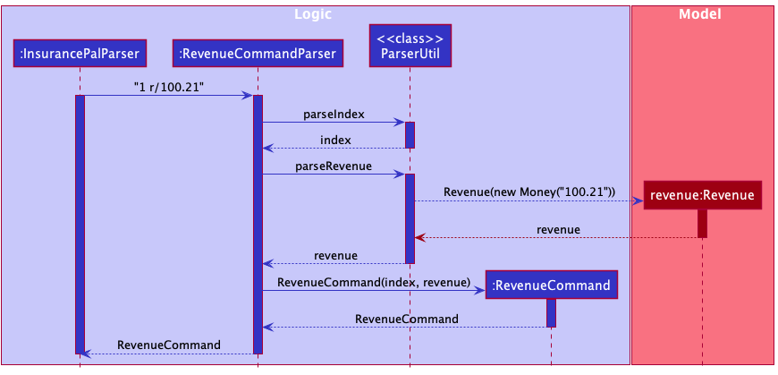

`RevenueCommandParser` then creates a `RevenueCommand` using the `Index` and `Revenue` objects created.

**Step 2**: Executing the RevenueCommand

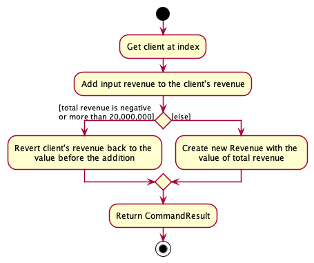

There are 2 possible outcomes from the execution of a RevenueCommand.

1. Add a new revenue to the client
2. No changes to the client's revenue after a RevenueCommand as the total value of
the new revenue and client's original revenue is negative

#### Design considerations
{:.no_toc}

*Aspect*: User interface of adding and editing revenue.

* **Alternative 1 (Current Choice):** `revenue` command adds to existing `revenue`
of client. `edit` command sets the `revenue` of client.
  * Pros: Easier to implement
  * Cons: User has to remember a lot of commands and to also understand the differences
  between each command
* **Alternative 2:** One `revenue` command adds and edits
  * Pros: Fewer commands for the user to remember
  * Cons: It will be difficult to give proper error messages since we are not sure
  of the user's intentions
### Add command

A user can use the add command to add a clients. A sequence diagram of this action is as shown:

###  Note feature

#### Current Implementation
{:.no_toc}

A client's note is currently represented by the `note` field under `Person`,
which is represented by an `Note` object.

The `Note` object contains a `value` field that has the type `String`, the `value` field is the description of the note given to a `Person`.

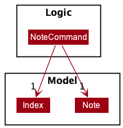

A `Note` can be given to a `Person` through any of these 3 methods:

1. Using the `NoteCommand` to add a note to an existing `Person`.
2. Through the `AddCommand`, a new `Person` with a `Note` can be created.
3. Editing a `Person` using the `EditCommand` to give the `Person` a `Note`.

The processing of a note command from the user can be split into 2 general steps:

1. Parsing the user input into a `NoteCommand`
2. Executing the `NoteCommand`
   Each step will be described in the sections below.

**Step 1:** Parsing of user input

The user input is parsed by the `NoteCommandParser` which calls other helper methods 
to parse the text into a `Note` object

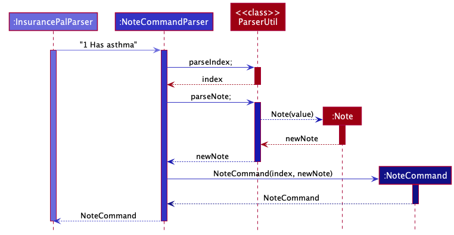

The `NoteCommandParser` uses the parsed data classes to create a `NoteCommand`. Unlike the `Claim` feature, as the `Note` command has no constraints on the text that can be inputted, the `NoteCommandParser` is able to create a `NoteCommand` without using a `EditNoteDescriptor.

**Step 2:** Executing the NoteCommand

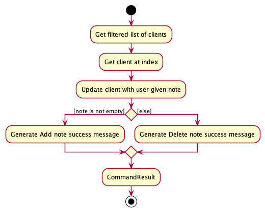

There are 3 possible outcomes from the execution of a `NoteCommand`.

1. Add a new Note to the client
2. Edit an existing Note of the client
3. Delete an existing Note of the client

#### Design considerations
{:.no_toc}

*Aspect*: User interface of adding, editing and deleting Note

* **Alternative 1 (Current choice):** The 'Note' command and 'Edit' command adds, edits and deletes. The 'Add' command is also able to create a person with a note.
    * Pros:
        * It is more intuitive as the note is a field that belongs to a `Person`.
        * The user has more flexibility when choosing how to add, edit or delete a note.
    * Cons:
        * It is difficult to give proper error messages since we are not sure of the user intentions
        * The user has to keep track of more prefixes
        * The "help message" for the 'Add' and 'Edit' commands become longer and harder to read due to the additional field.
* **Alternative 2:** One ‘Note’ command adds, edits and deletes
    * Pros: Fewer commands for the user to remember
    * Cons: It is difficult to give proper error messages since we are not sure of the user intentions
* **Alternative 3:** Different commands for add, edit and delete
    * Pros: Easier to implement
    * Cons: User has to remember a lot of commands

###  Claims feature

#### Current Implementation
{:.no_toc}

The processing of a claim command from the user can be split into 2 general steps:
1. Parsing the user input into a `ClaimCommand`
2. Executing the `ClaimCommand`
Each step will be described in the sections below.

**Step 1:** Parsing of user input

Parsing of the user input is primarily handled by the `ClaimCommandParser` which calls other helper classes to
parse the text into the data classes `Title`, `Description` and `Status`

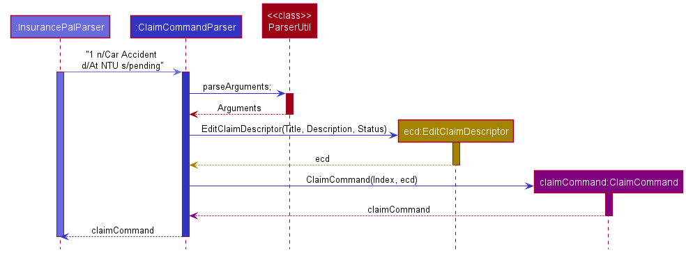

`ClaimCommandParser` uses the parsed data classes to create an `EditClaimDescriptor`. It does not create a `Claim` at
this stage because the user input could be giving an incomplete description of a `Claim` with missing fields. These
missing fields imply that the user wants to edit or delete an existing claim. The difference between a `Claim` and
`EditClaimDescriptor` can be seen in the class diagram below.

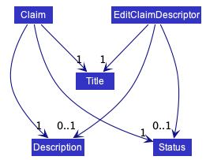

**Step 2:** Executing the ClaimCommand

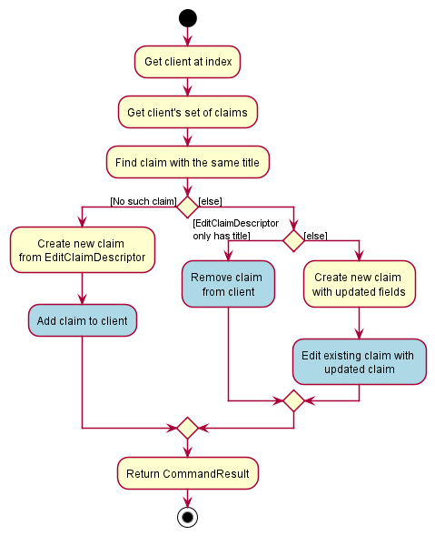

There are 3 possible outcomes from the execution of a ClaimCommand (shown in blue above).
1. Add a new claim to the client
2. Edit an existing claim of the client
3. Delete an existing claim of the client

#### Design considerations
{:.no_toc}

*Aspect*: User interface of adding, editing and deleting claims

* **Alternative 1 (Current choice):** One ‘claim’ command adds, edits and deletes
    * Pros: Fewer commands for the user to remember
    * Cons: It is difficult to give proper error messages since we are not sure of the user intentions
* **Alternative 2:** Different commands for add, edit and delete
    * Pros: Easier to implement
    * Cons: User has to remember a lot of commands
    
#### Future Improvements
{:.no_toc}

* A Java HashSet may not be the most appropriate data structure to store claims since it is unable to find a claim
  in O(1) time. Instead, a HashMap may be more appropriate, using the claim title as key.
* Currently, there is no relationship between Claim and EditClaimDescriptor. This means that any future changes
  to Claim would need a corresponding change to EditClaimDescriptor. Instead, Claim and EditClaimDescriptor should
  both extend from an abstract class to ensure that any future modification would not lead to regressions.

###  Schedule appointment feature

#### Current Implementation
{:.no_toc}

An appointment with a client is currently represented by the `appointment` field under `Person`,
which is represented by an `Appointment` object.

The `Appointment` object contains a `LocalDateTime` field called `appointmentTime` which represents the time that
the appointment with is scheduled for. An empty appointment is represented when `appointmentTime` is set to `null`.

The processing of a schedule command from the user can be split into 2 general steps:
1. Parsing the user input into a `ScheduleCommand`
2. Executing the `ScheduleCommand`

Each step will be described in the sections below.

**Step 1:** Parsing of user input

Parsing of the user input is primarily handled by the `ScheduleCommandParser` which calls other helper classes to
parse the text into the data classes `Index` and `Appointment`.

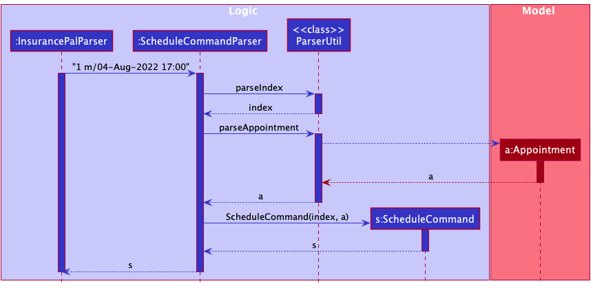

During this process, the Appointment object is being created using the user input.
Depending on the input, there are 2 possible outcomes:
1. A valid appointment containing a meeting time is created.
2. An empty appointment is created. This happens when the user input for `m/` is an empty string.

This process is illustrated by this diagram:

`ScheduleCommandParser` then creates a `ScheduleCommand` using the `Index` and `Appointment` objects created.

**Step 2:** Executing the ScheduleCommand

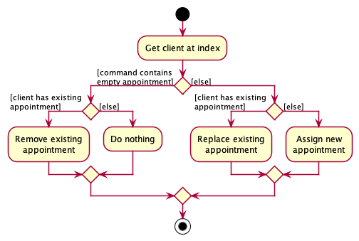

There are 4 possible outcomes from the execution of a ScheduleCommand.
1. Schedule a new appointment with the client
2. Reschedule an appointment with the client
3. Delete an existing appointment with the client
4. Do nothing.

#### Design considerations
{:.no_toc}
* Appointments with expired dates are not automatically deleted and scheduling appointments that are expired are permitted. This is because the user might want to check how long it has since they met a specific client.

*Aspect*: User interface of adding, editing and deleting appointments

* **Alternative 1 (Current choice):** One ‘schedule’ command adds, edits and deletes
    * Pros: Fewer commands for the user to remember
    * Cons: It is difficult to give proper error messages since we are not sure of the user intentions
* **Alternative 2:** Different commands for add, edit and delete
    * Pros: Easier to implement
    * Cons: User has to remember a lot of commands
    
### Insurance feature

#### Implementation
{:.no_toc}

`Insurance` is currently composed of two objects:

* `InsuranceType`, which is a `Enum` of types `Life`, `Health`, and `General`.
* `brand`, a `String` representing the brand of insurance.

A `Person` can have any number of different `Insurances`, stored as a `HashSet`.

`Insurance` can be added to a `Person` through the `add` command, and edited through the `edit` command.

A class diagram of `Insurance` is as shown:

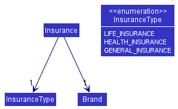

--------------------------------------------------------------------------------------------------------------------

## **Documentation, logging, testing, configuration, dev-ops**

* [Documentation guide](Documentation.md)
* [Testing guide](Testing.md)
* [Logging guide](Logging.md)
* [Configuration guide](Configuration.md)
* [DevOps guide](DevOps.md)

--------------------------------------------------------------------------------------------------------------------

## **Appendix: Requirements**

### Product scope

**Target user profile**:

* works as an insurance agent
* prefer desktop apps over other types
* has a need to manage a large number of his/her Singaporean clients and their details
* has a need to be reminded about his/her meeting timings with clients
* has a need to manage revenue and costs for his clients

**Value proposition**: manage clients faster than a typical mouse/GUI driven app and to also be able
to collate details of clients in one application.

### User stories

Priorities: High (must have) - `* * *`, Medium (nice to have) - `* *`, Low (unlikely to have) - `*`

| Priority   | As a …​                                    | I want to …​                     | So that I can…​                                                        |
| -----------| ------------------------------------------ | ------------------------------ | ---------------------------------------------------------------------- |
| `* * *`  | insurance agent                            | add clients' names to the client list        | connect with them easier on future meetups.              |
| `* * *`  | insurance agent whose clients live in Singapore                            | add the address of clients to the client list              | plan meetups with them in the future easily                                                                 |
| `* * *`  | insurance agent                            | add clients' client number to the client list               | contact them when I want to                                  |
| `* * *`  | insurance agent                            | keep track of clients' claim status         | update the client about it |
| `* * *`  | insurance agent                                     | add total revenue from each of my clients  |  determine the quality of my clients|
| `* * *`  | insurance agent                                     | add total costs from each of my clients         | determine how much to spend on gifts for clients.|
| `* * *`  | user                                                | save my total costs for future use         | save time on having to type them everytime.|
| `* * *`  | insurance agent                                     | keep notes about the client      | remember the health condition and ailments of all my clients.|

| `* * *`  | insurance agent                                     | add the time and place of my appointments for my respective clients in the contact page        | be punctual|
| `* * *`  | user                                     | save my contacts upon closing my address book        | save time on having to type them everytime |
| `* * *`  | organised user                                    | sort the clients in my address book by their first name         | locate a client easily|

| `* * *`  | organised and shrewd insurance agent                                     | sort my clients based on how much money I am making from them         | know which clients to prioritise|
| `* * *`  | insurance agent                                     | calculate the commissions I get from my client        | know the revenue obtained from the policy my client buys. |
| `* * *`  | organised insurance agent                                    | remember what insurance my client already has        |  sell the client insurance he/she does not have yet |

| `* * *`  | user with many contacts in the address book                                     | search for contacts in my contacts list whose name matches my input         |  navigate to the person I am looking for quickly |
| `* * *`  | user                                     | delete clients from my contact list         | remove a client from my contact list I no longer need to keep in contact with|
| `* * *`  | user                                    | use programs on Windows and Mac         | use it on all my laptops |
| `* * *`  | user                                    | exit the program safely        | free up resources on his computer |
| `* * *`  | new user                                     |  install the application        | I can use it |
| `* * *`  | insurance agent                                     | keep track of clients' claim status         | update the client about it |
| `* * *`  | insurance agent                                     | keep track of clients' claim status         | update the client about it |
| `* *`    | insurance agent                                      | keep track of the birthday of my clients   | maintain customer relations with them|
| `* *`    | insurance agent that labels my clients    | delete labels that I have assigned  | correct mislabels and inaccurate labels
| `* *`    | user                                       | import my contacts from a different source   | easily add multiple contacts at once
| `* *`    | user                                       | filter out the contacts in my address book based on address   | better plan out my appointments
| `* *`    | user                                       | see my contact list as a user interface   | read the list easily|
| `* *`    | experienced user                                      | back up my client data  | not lose the data|
| `* *`    | expert insurance agent                                      | give my clients a nickname   | more easily search for my regular contacts |
| `* *`    | insurance agent with a lot of clients                                       | create labels for my clients   |  classify and keep track of each of their characteristics|
| `* *`    | insurance agent                                      | see the labels attached to each client easily   |  quickly reference it when I am about to meet the client|
| `* *`    | user                                       | edit the information of entries in my address book   | ensure the information is accurate and up to date.|
| `* *`    | insurance agent with a lot of clients                                       | create labels for my clients   |  classify and keep track of each of their characteristics|
| `*`      | user | see how much space the program is using          | easily manage my computer memory |

*{More to be added}*

### Use cases

(For all use cases below, the **System** is the `InsurancePal` and the **Actor** is the `user`, unless specified otherwise)

**Use case: Viewing help**

**MSS**

1. User requests to see the help menu
2. InsurancePal shows the user how to access the help webpage
3. User accesses the help webpage

   Use case ends.

**Use case: Add a client**

**MSS**

1. User requests to add a client
2. InsurancePal adds the client

   Use case ends.

**Extensions**

* 1a. The given details are of an invalid format

    * 1a1. InsurancePal shows an error message

      Use case ends.

**Use case: List all clients**

**MSS**

1. User requests to list clients
2. InsurancePal shows a list of clients

   Use case ends.

**Extensions**

* 2a. The list is empty
    * 2a1. InsurancePal displays an empty list of clients

      Use case ends.

**Use case: Edit a client**

**MSS**

1. User requests to list clients
2. InsurancePal shows a list of clients
3. User requests to edit a specific client in the list
4. InsurancePal edits the client

   Use case ends.

**Extensions**

* 2a. The list is empty.

  Use case ends.

* 3a. The given index is invalid.
    * 3a1. InsurancePal shows an error message.

      Use case resumes at step 2.

**Use case: Finding a client**

**MSS**

1. User requests to find a client using keywords
2. InsurancePal shows a list of clients whose names match at least one keyword

   Use case ends.

**Use case: Delete a client**

**MSS**

1. User requests to list clients
2. InsurancePal shows a list of clients
3. User requests to delete a specific client in the list
4. InsurancePal delete the client

   Use case ends.

**Extensions**

* 2a. The list is empty.

  Use case ends.

* 3a. The given index is invalid.
    * 3a1. InsurancePal shows an error message.

      Use case resumes at step 2.

**Use case: Clear the InsurancePal**

**MSS**

1. User requests to clear the InsurancePal
2. InsurancePal clears all entries in it

   Use case ends.

**Use case: Add revenue to a client**

**MSS**

1. User requests to list clients
2. InsurancePal shows a list of clients
3. User requests to add revenue to a specific client in the list
4. InsurancePal adds revenue to the client

   Use case ends.

**Extensions**

* 2a. The list is empty.

  Use case ends.

* 3a. The given index is invalid.
    * 3a1. InsurancePal shows an error message.

      Use case resumes at step 2.

* 3b. The given revenue is of an invalid format
    * 3b1. InsurancePal shows an error message.

      Use case resumes at step 2.

**Use case: Add a claim to a client**

**MSS**

1. User requests to list clients
2. InsurancePal shows a list of clients
3. User requests to add a claim to a specific client in the list
4. InsurancePal adds the claim to the client

   Use case ends.

**Extensions**

* 2a. The list is empty.

  Use case ends.

* 3a. The given index is invalid.
    * 3a1. InsurancePal shows an error message.

      Use case resumes at step 2.
* 3b. The given claim is of an invalid format
    * 3b1. InsurancePal shows an error message.

      Use case resumes at step 2.

**Use case: Add a note to a client**

**MSS**

1. User requests to list clients
2. InsurancePal shows a list of clients
3. User requests to add a note to a specific client in the list
4. InsurancePal adds a note to the client

   Use case ends.

**Extensions**

* 2a. The list is empty.

  Use case ends.

* 3a. The given index is invalid.
    * 3a1. InsurancePal shows an error message.

      Use case resumes at step 2.

**Use case: Schedule a meeting**

**MSS**

1. User requests to list clients
2. InsurancePal shows a list of clients
3. User requests to schedule a meeting with a specific client in the list
4. InsurancePal schedules a meeting with the client

   Use case ends.

**Extensions**

* 2a. The list is empty.

  Use case ends.

* 3a. The given index is invalid.
    * 3a1. InsurancePal shows an error message.

      Use case resumes at step 2.

* 3b. The given meeting time is of an invalid format
    * 3b1. InsurancePal shows an error message.

      Use case resumes at step 2.

**Use case: Add insurance to a client**

**MSS**

1. User requests to list clients
2. InsurancePal shows a list of clients
3. User requests to add insurance to a specific client in the list
4. InsurancePal adds insurance to the client

   Use case ends.

**Extensions**

* 2a. The list is empty.

  Use case ends.

* 3a. The given index is invalid.
    * 3a1. InsurancePal shows an error message.

      Use case resumes at step 2.

* 3b. The given insurance is of an invalid format
    * 3b1. InsurancePal shows an error message.

      Use case resumes at step 2.

### Non-Functional Requirements

1. Should work on any _mainstream OS_ as long as it has Java `11` or above installed.
2. Should be able to hold up to 1000 clients without a noticeable sluggishness in performance for typical usage.
3. A user with above average typing speed for regular English text (i.e. not code, not system admin commands) should be able to accomplish most of the tasks faster using commands than using the mouse.
4. New users should be able to see where to find information on how to use the application within 2 actions upon launching the application.
5. Should inform user of the necessary amendments to make to their input when receiving a bad input.
6. Data should be transferable between different devices that are both running InsurancePal.
7. Each command should be successfully executed within 1 second.
8. Should not exit or crash without explicit permission or instruction by the user.
9. Should not modify information stored without explicit permission or instruction by the user.
10. Should not allow duplicate entries of clients.

### Glossary

* **Mainstream OS**: Windows, Linux, Unix, OS-X
* **Notes**: A short paragraph that is written for a person to remind the user about details of that person
* **Client**: A person the user is selling or trying to sell insurance to

--------------------------------------------------------------------------------------------------------------------

## **Appendix: Instructions for manual testing**

Given below are instructions to test the app manually.

:information_source: **Note:** These instructions only provide a starting point for testers to work on;
testers are expected to do more *exploratory* testing.

### Launch and shutdown

1. Initial launch

   1. Download the jar file and copy into an empty folder

   1. Double-click the jar file Expected: Shows the GUI with a set of sample clients. The window size may not be optimum.

1. Saving window preferences

   1. Resize the window to an optimum size. Move the window to a different location. Close the window.

   1. Re-launch the app by double-clicking the jar file. 
       Expected: The most recent window size and location is retained.

### Deleting a client

1. Deleting a client while all clients are being shown

   1. Prerequisites: List all clients using the `list` command. Multiple clients in the list.

   1. Test case: `delete 1` 
      Expected: First client is deleted from the list. Details of the deleted client shown in the status message. Timestamp in the status bar is updated.

   1. Test case: `delete 0` 
      Expected: No client is deleted. Error details shown in the status message. Status bar remains the same.

   1. Other incorrect delete commands to try: `delete`, `delete x`, `...` (where x is larger than the list size) 
      Expected: Similar to previous.

### Saving data

1. Dealing with missing/corrupted data files

   1. _{explain how to simulate a missing/corrupted file, and the expected behavior}_
