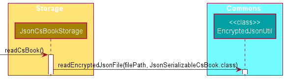
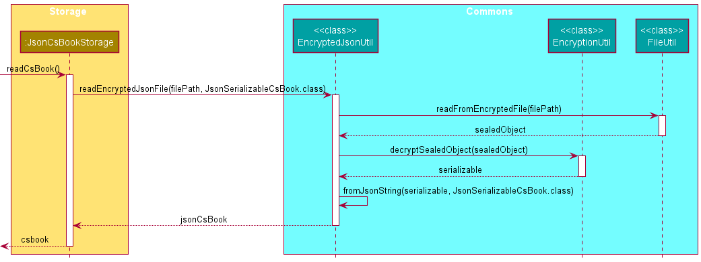
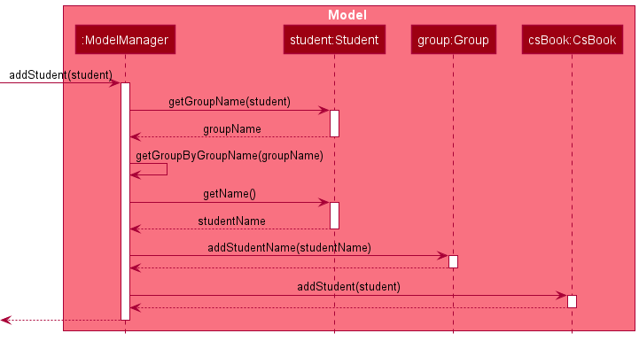
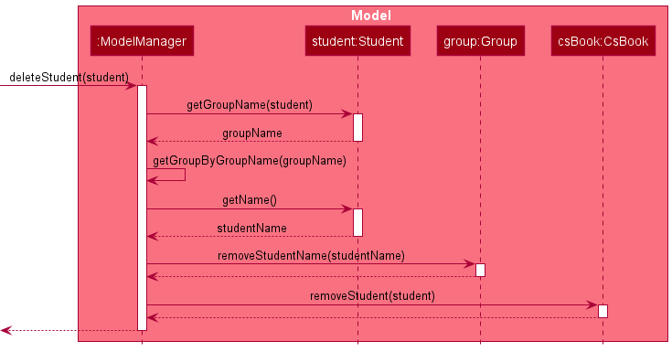
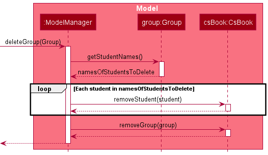

Welcome to the CSBook Developer Guide. CSBook is a **desktop app for teaching assistants (TAs) to manage their students, optimized for use via a Command Line Interface** (CLI) while still having the
benefits of a Graphical User Interface (GUI). This guide is designed for developers that are interested to work
on this app. It contains detailed information that will allow developers to maintain the app or
alter and extend the app for their own use.

* Table of Contents
{:toc}

---

## **Setting up, getting started**

Refer to the guide [_Setting up and getting started_](SettingUp.md).

---

## **Design**

:bulb: **Tip:** The `.puml` files used to create diagrams in this document can be found in the [diagrams](https://github.com/nus-cs2103-AY2122S1/tp/tree/master/docs/diagrams/) folder. Refer to the [_PlantUML Tutorial_ at se-edu/guides](https://se-education.org/guides/tutorials/plantUml.html) to learn how to create and edit diagrams.

### Architecture

The **_Architecture Diagram_** given above explains the high-level design of the App.

Given below is a quick overview of main components and how they interact with each other.

**Main components of the architecture**

**`Main`** has two classes called [`Main`](https://github.com/AY2122S1-CS2103T-T09-3/tp/blob/master/src/main/java/seedu/address/Main.java) and [`MainApp`](https://github.com/AY2122S1-CS2103T-T09-3/tp/blob/master/src/main/java/seedu/address/MainApp.java). It is responsible for,

- At app launch: Initializes the components in the correct sequence, and connects them up with each other.
- At shut down: Shuts down the components and invokes cleanup methods where necessary.

[**`Commons`**](#common-classes) represents a collection of classes used by multiple other components.

The rest of the App consists of four components.

- [**`UI`**](#ui-component): The UI of the App.
- [**`Logic`**](#logic-component): The command executor.
- [**`Model`**](#model-component): Holds the data of the App in memory.
- [**`Storage`**](#storage-component): Reads data from, and writes data to, the hard disk.

**How the architecture components interact with each other**

The _Sequence Diagram_ below shows how the components interact with each other for the scenario where the user issues the command `delete 1`.

Each of the four main components (also shown in the diagram above),

- defines its _API_ in an `interface` with the same name as the Component.
- implements its functionality using a concrete `{Component Name}Manager` class (which follows the corresponding API `interface` mentioned in the previous point.

For example, the `Logic` component defines its API in the `Logic.java` interface and implements its functionality using the `LogicManager.java` class which follows the `Logic` interface. Other components interact with a given component through its interface rather than the concrete class (reason: to prevent outside component's being coupled to the implementation of a component), as illustrated in the (partial) class diagram below.

The sections below give more details of each component.

### UI component

The **API** of this component is specified in [`Ui.java`](https://github.com/AY2122S1-CS2103T-T09-3/tp/blob/master/src/main/java/seedu/address/ui/Ui.java)

The UI consists of a `MainWindow` that is made up of parts: `CommandBox`, `ResultPopup`, `StudentListPanel`, `GroupListPanel`, `DetailedStudentCard`, `AssessmentListPanel` and `StatusBarFooter`. 

The `StudentListPanel` consists of a list of `StudentCard` objects, which displays the student's name and group they belong to. 

The `GroupListPanel` consists of a list of `GroupCard` objects, which displays the group's name and description.

The `AssessmentListPanel` consists of a list of `AssessmentCard` objects, which displays the assessment's name, score and percentage. 

The `DetailedStudentCard` displays the student's name, group, telegram handle, email and notes. 

All these, including the `MainWindow`, inherit from the abstract `UiPart` class which captures the commonalities between classes that represent parts of the visible GUI.

The `UI` component uses the JavaFx UI framework. The layout of these UI parts are defined in matching `.fxml` files that are in the `src/main/resources/view` folder. For example, the layout of the [`MainWindow`](https://github.com/AY2122S1-CS2103T-T09-3/tp/blob/master/src/main/java/seedu/address/ui/MainWindow.java) is specified in [`MainWindow.fxml`](https://github.com/AY2122S1-CS2103T-T09-3/tp/blob/master/src/main/resources/view/MainWindow.fxml)

The `UI` component,

- executes user commands using the `Logic` component.
- listens for changes to `Model` data so that the UI can be updated with the modified data.
- keeps a reference to the `Logic` component, because the `UI` relies on the `Logic` to execute commands.
- depends on some classes in the `Model` component, as it displays `Student`,`Group`, `Assessment` and `Note` objects residing in the `Model`.

### Logic component

**API** : [`Logic.java`](https://github.com/AY2122S1-CS2103T-T09-3/tp/blob/master/src/main/java/seedu/address/logic/Logic.java)

Here's a (partial) class diagram of the `Logic` component:

How the `Logic` component works:

1. When `Logic` is called upon to execute a command, it uses the `CsBookParser` class to parse the user command.
1. This results in a `Command` object (more precisely, an object of one of its subclasses e.g., `AddCommand`) which is executed by the `LogicManager`.
1. The command can communicate with the `Model` when it is executed (e.g. to add a student).
1. The result of the command execution is encapsulated as a `CommandResult` object which is returned back from `Logic`.

The Sequence Diagram below illustrates the interactions within the `Logic` component for the `execute("delete 1")` API call.

:information_source: **Note:** The lifeline for `DeleteCommandParser` should end at the destroy marker (X) but due to a limitation of PlantUML, the lifeline reaches the end of diagram.

Here are the other classes in `Logic` (omitted from the class diagram above) that are used for parsing a user command:

How the parsing works:

- When called upon to parse a user command, the `CsBookParser` class creates an `XYZCommandParser` (`XYZ` is a placeholder for the specific command name e.g., `AddCommandParser`) which uses the other classes shown above to parse the user command and create a `XYZCommand` object (e.g., `AddCommand`) which the `CsBookParser` returns back as a `Command` object.
- All `XYZCommandParser` classes (e.g., `AddCommandParser`, `DeleteCommandParser`, ...) inherit from the `Parser` interface so that they can be treated similarly where possible e.g, during testing.

### Model component

**API** : [`Model.java`](https://github.com/AY2122S1-CS2103T-T09-3/tp/blob/master/src/main/java/seedu/address/model/Model.java)

The `Model` component,

- stores the CS book data i.e., all `Student` and `Group` objects (which are contained in a `UniqueStudentList` and `UniqueGroupList` object respectively).
- stores the currently 'selected' `Student` objects (e.g., results of a search query) as a separate _filtered_ list which is exposed to outsiders as an unmodifiable `ObservableList<Student>` that can be 'observed' e.g. the UI can be bound to this list so that the UI automatically updates when the data in the list change.
- stores the currently 'selected' `Group` objects (e.g., results of a search query) as a separate _filtered_ list similarly to `Student` objects with an `ObservableList<Group>`.
- stores a `UserPref` object that represents the user’s preferences. This is exposed to the outside as a `ReadOnlyUserPref` objects.
- does not depend on any of the other three components (as the `Model` represents data entities of the domain, they should make sense on their own without depending on other components)

:information_source: **Note:** How `Group` and `Student` objects are stored and referenced by each other is shown in the diagram below. In the future, the model will be changed such that each `Student` will only have a `GroupName` to identify the `Group` it is associated with, and each `Group` will only store the `Name` of the `Student` in the `Group`. This will be done in hopes of looser coupling between the two classes. 

### Storage component

**API** : [`Storage.java`](https://github.com/AY2122S1-CS2103T-T09-3/tp/blob/master/src/main/java/seedu/address/storage/Storage.java)

The `Storage` component,

- can save both CS book data and user preference data in json format, and read them back into corresponding objects.
- inherits from both `CsBookStorage` and `UserPrefStorage`, which means it can be treated as either one (if only the functionality of only one is needed).
- depends on some classes in the `Model` component (because the `Storage` component's job is to save/retrieve objects that belong to the `Model`)

### Common classes

Classes used by multiple components are in the `seedu.csbook.commons` package.

---

## **Implementation**

This section describes some noteworthy details on how certain features are implemented.

### Loading data

The loading of data into CsBook is facilitated by `JsonCsBookStorage`, `JsonSerializableCsBook`, `JsonAdaptedGroup` and
`JsonAdaptedStudent`. The relevant operations for loading CSBook data is as follows:

- `JsonCsBookStorage#readCsBook()`  —  Reads the current CSBook data
- `JsonSerializableCsBook#toModelType()`  —  Converts the JsonSerializableCsBook to a CsBook object
- `JsonSerializableCsBook#addStudentsToCsBook(csBook)`  —  Adds all students to a given CsBook
- `JsonSerializableCsBook#addGroupsToCsBook(csBook)`  —  Adds all groups to a given CsBook
- `JsonSerializableCsBook#addStudentsToGroups(csBook)`  —  Adds all students to their corresponding Groups
- `JsonAdaptedStudent#toModelType(groupList)`  —  Converts the JsonAdaptedStudent to a Student object
- `JsonAdaptedGroup#toModelType()`  —  Converts the JsonAdaptedGroup to a Group object

Given below how loading data behaves at each step.

**Step 1**. The user starts the app and an encrypted data file containing CsBook's information is present. The data
is decrypted and a call to `JsonCsBookStorage#readCsBook()` is made. After this, a call to `JsonSerializableCsBook#toModelType()`
is made to convert the data into a CsBook object.

\
&nbsp;
\
&nbsp;

**Step 2**. First, we add the groups from the data into CsBook by calling `JsonSerializableCsBook#addGroupsToCsBook(csBook)`.
Next, we add the students from the data into Csbook by calling `JsonAdaptedStudent#toModelType(groupList)`. `groupList` is
required to add students to ensure that each student has a valid group.

\
&nbsp;
\
&nbsp;

**Step 3**. Currently, each group does not have its lists of students, we would need to add it in using `JsonSerializableCsBook#addStudentsToGroups(csBook)`.
The group list is retrieved from `csBook`. For each group in the group list, we will filter the list of students by checking if the student belongs to the group,
then add the students in by calling `Group#addAll(StudentsInGroup)`. This would return us a new group that contains the students, and we will update `csBook` by calling
`CsBook#setGroup(group, groupWithStudentList)`.

\
&nbsp;
\
&nbsp;

The following sequence diagram shows how the overall loading data operation works:

\
&nbsp;
\
&nbsp;

#### Design considerations

**Aspect: How we choose to load data:**

- **Alternative 1 (current choice):** Load groups without their student list, load students, then update each group's student list using the loaded students.

    - Pros: Allows us to validate the student's group name field and saves space as we do not need to store the student list for each group in our data file.
    - Cons: May take more time to load as we need to do more computation.

- **Alternative 2:** Have each group store their student's information in the data file, load students and load groups separately.

    - Pros: Less computation as we can immediately convert the data file to retrieve the students and groups.
    - Cons: Wastes space as each student's details is recorded twice in the data file, once in the list of students and
    once in the list of groups.

### JSON encryption feature

The JSON encryption mechanism is facilitated by `JsonCsBookStorage`, `EncryptedJsonUtil`, `EncryptionUtil` and `FileUtil`.
Java's `SealedObject` class is also used to encrypt and contain a `Serializable` object. The relevant operations for saving the
CSBook data to an encrypted JSON file are as follows:

- `JsonCsBookStorage#saveCsBook(ReadOnlyCsBook)`  —  Saves the current CSBook data
- `EncryptedJsonUtil#saveEncryptedJsonFile(T, Path)`  —  Saves the given data to a encrypted JSON file
- `EncryptionUtil.encryptSerializableObject(Serializable)`  —  Encrypts a `Serializable` object
- `FileUtil#writeToEncryptedFile(Path, SealedObject)`  —  Writes the encrypted object to a file

Decrypting an encrypted JSON file goes through a similar process. The relevant operations for decrypting the
encrypted JSON file to the CSBook are as follows:

- `JsonCsBookStorage#readCsBook()`  —  Reads the CSBook data from the encrypted JSON file
- `EncryptedJsonUtil#readEncryptedJsonFile(Path, Class<T>)`  —  Reads the data from a encrypted JSON file
- `EncryptionUtil#decryptSealedObject(SealedObject)`  —  Decrypts a `SealedObject`
- `FileUtil#readFromEncryptedFile(Path)`  —  Reads the encrypted object from a file

Given below is an example usage scenario and how encryption/decryption behaves at each step.

**Step 1**. The user executes a command which causes the data in `csbook` of `ModelManager` to be altered. This prompts a call to
`JsonCsBookStorage#saveCsBook(ReadOnlyCsBook)`, which creates a new `JsonSerializableCsBook` object. The CSBook data which is
now in `Serializable` form is passed to `EncryptedJsonUtil#saveEncryptedJsonFile(T, Path)` to be saved as an encrypted JSON file.

\
&nbsp;
\
&nbsp;

**Step 2**. `EncryptedJsonUtil#saveEncryptedJsonFile(T, Path)` uses the `JsonSerializableCsBook` object, which is a `Serializable`,
and encrypts it using `EncryptionUtil.encryptSerializableObject(Serializable)`. The method returns a `SealedObject` object,
which contains the encrypted JSON data.

\
&nbsp;
\
&nbsp;

**Step 3**. Now that the CSBook JSON data has been encrypted, the final step is to write the encrypted data to a file.
`EncryptedJsonUtil` passes the `SealedObject` object to `FileUtil#writeToEncryptedFile(Path, SealedObject)` to be written to a file.

\
&nbsp;
\
&nbsp;

The following sequence diagram shows how the overall encryption operation works:

\
&nbsp;
\
&nbsp;

The decryption operation accomplishes the opposite of the encryption operation.

**Step 4**. When a user launches the application for the first time, a call it made to `JsonCsBookStorage#readCsBook()`
to read the encrypted CSBook data, which then calls `EncryptedJsonUtil#readEncryptedJsonFile(Path, Class<T>)` to
read the encrypted JSON file.

\
&nbsp;
\
&nbsp;

**Step 5**. `EncryptedJsonUtil#readEncryptedJsonFile(Path, Class<T>)` calls `FileUtil#readFromEncryptedFile(Path)` to
read the encrypted JSON file from the `filePath`. The method results in a `SealedObject` object containing the
encrypted CSBook data.

\
&nbsp;
\
&nbsp;

**Step 6**. The `SealedObject` object is then passed to `EncryptionUtil#decryptSealedObject(SealedObject)` to be decrypted into a `Serializable`
object, which is then converted to a JSON file using `EncryptedJsonUtil#fromJsonString(String, Class<T>)`. The resulting file is then
transformed by `JsonCsBookStorage#readCsBook()` into a `ReadOnlyCsBook` that is used to populate the model.

\
&nbsp;
\
&nbsp;

The following sequence diagram shows how the overall decryption operation works:

\
&nbsp;
\
&nbsp;

#### Design considerations

**Aspect: How JSON encryption and decryption executes:**

- **Alternative 1 (current choice):** Encrypts the entire CSBook data.

    - Pros: More secure.
    - Cons: May take up more storage due to excessive encryption.

- **Alternative 2:** Encrypts individual fields.

    - Pros: Uses less storage by encrypting data and not fields.
      (e.g. `name: Jun Wei` is encrypted to become `name: [ENCRYPTED]`)
    - Cons: Less secure compared to encrypting the entire JSON file.

### Student Group Management Feature

The management of `Group` objects and `Student` objects is done by the `ModelManager`.
While the choosing of operations to perform is determined by the user through the use of commands
(E.g. `AddCommand`), we mainly discuss how `Group` objects reference `Student` objects and vice versa
through discussing the implementation of the `ModelManager` class and `Student`, `Group` object fields.

The relevant operations for managing groups, with regard to `Student` operations are as follows:
- `ModelManager#deleteStudent(Student)` - Deletes a `Student` from the model, and remove the `Student` reference from
  the respective `Group` that the student belongs to
- `ModelManager#addStudent(Student)` - Adds a `Student` to the model, and add a reference to the `Student` in the
  respective `Group` the student is assigned to

The relevant operations for managing groups, with regard to `Group` operations are as follows:
- `ModelManager#deleteGroup(Group)` - Deletes a `Group` from the model, as well as delete all `Student` objects
  associated with the group
- `ModelManager#addGroup(Group)` - Adds a `Group` to the model

Given below is an example usage scenario and how the management of groups behaves at each step.

**Step 1**. Starting with an empty model, the user will first have to create an empty `Group` to be able to add `Student`
objects to. The user executes a command that will create a new `Group` and add it to the model by calling
`ModelManager#addGroup(Group)`.

\
&nbsp;
\
&nbsp;

**Step 2**. After the `Group` is added to the model, the user then executes a command to create a new `Student` that will
be a part of an existing group. This command will then call `ModelManager#addStudent(Student)` with the created
`Student` which finds the `Group` that the `Student` is to be added to, include a reference to the `Student` in the `Group`,
 then finally add the `Student` into the `CsBook` model.

\
&nbsp;
\
&nbsp;

(Optional steps) The user may manipulate the groups or individual students using any of the available commands, but
these will not be discussed here as the focus is on how the grouping of students is done.

**Step 3**. The user executes a command to delete a `Student` in order to, for example, remove a past student. The command
then invokes `ModelManager#deleteStudent(Student)`, which will find the respective `Group` that the `Student` belongs to
using the stored `GroupName` reference in the `Student` and remove the `Group`'s reference to the `Student` (`StudentName`).
Then, the `Student` itself is deleted from the model.

\
&nbsp;
\
&nbsp;

**Step 4**. The user executes a command to delete a `Group` in order to, for example, remove an entire group and its
students after the user has finished teaching a module. The command invokes `ModelManager#deleteGroup(Group)`, which
finds the `Group` in the model, and for each `Name` found, remove the associated `Student` from `csbook`.
After all `Student` objects associated with the `Group` has been removed, the `Group` itself is then deleted.

\
&nbsp;
\
&nbsp;

#### Design considerations

**Aspect: How a Student references a Group and vice versa:**

- **Alternative 1 (current choice):** Each `Group` only stores unique student `Name`s and `Student` stores unique `GroupName`s
    - Pros: Reduces coupling between `Group` and `Student` significantly
    - Cons: We must ensure that both `Name` and `GroupName`s are all unique throughout the `csbook`

- **Alternative 2 (old implementation):** Each `Group` stores a reference of `Student` and vice versa

    - Pros: More straightforward to implement.
    - Cons: Increases coupling between `Group` and `Student` significantly

**Aspect: What happens when `ModelManager#deleteGroup(Group)` command is executed:**

- **Alternative 1 (current choice):** Deletes all `Student` objects associated with the `Group`

    - Pros: Easy to implement.
    - Cons: Restricts us to just one `Group` per `Student` when implemented as-is

- **Alternative 2:** Only delete the `Group` itself and only remove the `Group` reference within `Student` objects

    - Pros: Allows for a `Student` to belong to multiple `Group`s
    - Cons: When implemented as-is, allows `Student`s to not belong to any `Group`, violating our assumption that all
      `Student`s have a `Group`

---
## **Proposed Implementation**

This section describes implementation details of new features that can be included in future versions of this application.

### Undo/redo feature

The proposed undo/redo mechanism is facilitated by `VersionedCsBook`. It extends `CsBook` with an undo/redo history, stored internally as an `csBookStateList` and `currentStatePointer`. Additionally, it implements the following operations:

- `VersionedCsBook#commit()` — Saves the current CS book state in its history.
- `VersionedCsBook#undo()` — Restores the previous CS book state from its history.
- `VersionedCsBook#redo()` — Restores a previously undone CS book state from its history.

These operations are exposed in the `Model` interface as `Model#commitCsBook()`, `Model#undoCsBook()` and `Model#redoCsBook()` respectively.

Given below is an example usage scenario and how the undo/redo mechanism behaves at each step.

**Step 1**. The user launches the application for the first time. The `VersionedCsBook` will be initialized with the initial CS book state, and the `currentStatePointer` pointing to that single CS book state.

\
&nbsp;
\
&nbsp;

**Step 2**. The user executes `delete 5` command to delete the 5th student in the CS book. The `delete` command calls `Model#commitCsBook()`, causing the modified state of the CS book after the `delete 5` command executes to be saved in the `csBookStateList`, and the `currentStatePointer` is shifted to the newly inserted CS book state.

\
&nbsp;
\
&nbsp;

**Step 3**. The user executes `add n/David …​` to add a new student. The `add` command also calls `Model#commitCsBook()`, causing another modified CS book state to be saved into the `csBookStateList`.

\
&nbsp;
\
&nbsp;

:information_source: **Note:** If a command fails its execution, it will not call `Model#commitCsBook()`, so the CS book state will not be saved into the `csBookStateList`.

**Step 4**. The user now decides that adding the student was a mistake, and decides to undo that action by executing the `undo` command. The `undo` command will call `Model#undoCsBook()`, which will shift the `currentStatePointer` once to the left, pointing it to the previous CS book state, and restores the CS book to that state.

\
&nbsp;
\
&nbsp;

:information_source: **Note:** If the `currentStatePointer` is at index 0, pointing to the initial CsBook state, then there are no previous CsBook states to restore. The `undo` command uses `Model#canUndoCsBook()` to check if this is the case. If so, it will return an error to the user rather
than attempting to perform the undo.

The following sequence diagram shows how the undo operation works:

\
&nbsp;
\
&nbsp;

:information_source: **Note:** The lifeline for `UndoCommand` should end at the destroy marker (X) but due to a limitation of PlantUML, the lifeline reaches the end of diagram.

The `redo` command does the opposite — it calls `Model#redoCsBook()`, which shifts the `currentStatePointer` once to the right, pointing to the previously undone state, and restores the CS book to that state.

:information_source: **Note:** If the `currentStatePointer` is at index `csBookStateList.size() - 1`, pointing to the latest CS book state, then there are no undone CsBook states to restore. The `redo` command uses `Model#canRedoCsBook()` to check if this is the case. If so, it will return an error to the user rather than attempting to perform the redo.

**Step 5**. The user then decides to execute the command `list`. Commands that do not modify the CS book, such as `list`, will usually not call `Model#commitCsBook()`, `Model#undoCsBook()` or `Model#redoCsBook()`. Thus, the `csBookStateList` remains unchanged.

\
&nbsp;
\
&nbsp;

**Step 6**. The user executes `clear`, which calls `Model#commitCsBook()`. Since the `currentStatePointer` is not pointing at the end of the `csBookStateList`, all CS book states after the `currentStatePointer` will be purged. Reason: It no longer makes sense to redo the `add n/David …​` command. This is the behavior that most modern desktop applications follow.

\
&nbsp;
\
&nbsp;

The following activity diagram summarizes what happens when a user executes a new command:

\
&nbsp;
\
&nbsp;

#### Design considerations:

**Aspect: How undo & redo executes:**

- **Alternative 1 (current choice):** Saves the entire CS book.

  - Pros: Easy to implement.
  - Cons: May have performance issues in terms of memory usage.

- **Alternative 2:** Individual command knows how to undo/redo by
  itself.
  - Pros: Will use less memory (e.g. for `delete`, just save the student being deleted).
  - Cons: We must ensure that the implementation of each individual command are correct.

---

## **Maintaining the application**

This section contains links to additional guides that will help you maintain the code base of this application.

- [Documentation guide](Documentation.md)
- [Testing guide](Testing.md)
- [Logging guide](Logging.md)
- [Configuration guide](Configuration.md)
- [DevOps guide](DevOps.md)

---

## **Appendix: Requirements**

### Product scope

**Target user profile**:

* has a need to manage a large number of students
* teaches more than one module
* prefers desktop apps over other types
* can type fast
* prefers typing to mouse interactions
* is reasonably comfortable using CLI apps

**Value proposition**: manage student details faster than a typical mouse/GUI driven app

### User stories

Priorities: High (must have) - `* * *`, Medium (nice to have) - `* *`, Low (unlikely to have) - `*`

| Priority | As a …​                                    | I want to …​                     | So that I can…​                                                        |
| -------- | ------------------------------------------| ------------------------------ | ---------------------------------------------------------------------- |
| `* * *`  | new user                                   | add a new student entry         |                  |
| `* * *`  | new user                                   | edit a student entry         | can make changes to my students' information without removing and adding them separately                 |
| `* * *`  | new user                                   | delete a student entry         | remove students that I no longer teach                 |
| `* * *`  | new user                                   | group my weaker students together         | easily identify these students and focus more on them                 |
| `* * *`  | new user                                   | view the students in a particular group        | check on their performance as a group                 |
| `* * *`  | new user                                   | remove students from a group        | ensure that each group contains the correct students as their performance changes                 |
| `* * *`  | new user                                   | search for my groups with a parameter        | find a specific group given a detail I know about that group              |
| `* * *`  | new user                                   | delete a group       | remove certain groups which are no longer needed              |
| `* * *`  | new user                                   | export my students' information containing their grades        | share/document all the data               |
| `* *`  | new user                                   | record my student's assessment grade         | keep track of their individual performance                 |
| `* *`  | new user                                   | take down notes on my students               | keep track of their strengths and weaknesses to be able to help them better |
| `* *`  | new user                                   | search for my students with a parameter        | find specific students given a detail I know about them               |
| `* *`  | new user                                   | sort my students by their grades        | find the top and bottom performers of my class               |
| `* *`  | lazy user                                  | be able to autocomplete my student's name       | easily find my student's name in the event that I forget their full name              |
| `* *`  | lazy user                                  | access commands that I frequently use easily      | save time on typing out my most-used commands              |
| `* *`  | lazy user                                  | import my students' details from luminus      | avoid having to manually key in my students' information             |
| `* *`  | user that cares about security             | safeguard my CSBook    | ensure only authorized users can view my students' data            |
| `* *`  | user that cares about security             | encrypt my students' information    | protect my students' sensitive data from potential malware            |
| `* *`  | user that cares about security             | backup my students' information   | in the event that my student's information gets corrupted            |
| `*`  | new user                                   | visualise my student's assessment data        | visualize graphically how my students are performing in class                 |
| `*`  | lazy user                                  | chat with my student via Telegram directly from the app      | avoid having to open the Telegram app separately             |
| `*`  | experienced user                           | set-up custom shortcuts     | easily access my most frequently used commands            |
| `*`  | experienced user                           | be able to undo my commands     | backtrack when a mistake is made            |

_{More to be added}_

### Use cases

(For all use cases below, the **System** is the `CSBook` and the **Actor** is the `user` or teaching assistant, unless specified otherwise)

**Use case: UC01 - Add a group**

1. User creates a new group.
2. CSBook shows the newly created group.

   Use Case ends. 

**Extensions**

- 1a. CSBook detects that a group with the same name exists.

    - 1a1. CSBook shows an error message.

  Use case resumes at step 1.

**Use case: UC02 - Add a Student**

1. User creates a new student entry.
2. CSBook shows the newly created student.

   Use Case ends.

**Extensions**
- 1a. CSBook detects that the student already exists. 

  - 1a1. CSBook shows an error message.
  - 1a2. User enters new student entry.
 
     Steps 1a1-1a2 are repeated until the student entered does not already exist.
  
  Use case resumes from Step 2. 

- 1b. CSBook detects that the student details entered are invalid.

  - 1b1. CSBook shows an error message. 
  - 1b2. User enters new student data. 
  
    Steps 1b1-1b2 are repeated until the student details entered are valid. 
  
  Use Case resumes from Step 2. 
  

**Use case: UC03 - Record a student's grade for an assessment**

**MSS**

1. User adds an assessment to an existing student. 
2. CSBook shows the newly created assessment. 

   Use case ends.

**Extensions**

- 1a. CSBook detects that the student cannot be found.

  - 1a1. CSBook shows an error message.
  - 1a2. User adds assessment to existing student.
    
    Steps 1a1-1a2 are repeated until given student is an existing one.
    
  Use case resumes from Step 2.

- 1b. CSBook detects that the assessment already exists. 
  
  Use Case ends. 

- 1c. CSBook detects that the assessment details are of an invalid format.
  
  - 1c1. CSBook shows an error message. 
  - 1c2. User enters new details for assessment. 
  
    Steps 1c1-1c2 are repeated until the assessment details are valid.
  
  Use Case resumes from Step 2. 
  

**Use case: UC04 - Group students together**

**MSS**

1. User creates a new group.
2. CSBook shows the newly created group.
3. User creates student entry and assigns student to the group.
4. CSBook updates and shows the student with the group's name.
   Steps 3-4 are repeated until all students belonging to the group are added.

   Use case ends.

**Extensions**

- 1a. CSBook detects that a group with the same name exists.

  - 1a1. CSBook shows an error message.
  
  Use case resumes at step 3.

- 3a. CSBook detects that the student exists.

  - 3a1. CSBook shows an error message.
  - 3a2. User changes group of the student. 
  
  Use case resumes at step 4. 

**Use case: UC05 - View a particular student**

**MSS** 

1. User requests to view a particular student. 
2. CSBook retrieves and displays the student's information. 

Use case ends. 

**Extensions** 

- 1a. CSBook detects that the student does not exist. 
  
  - 1a1. CSBook shows an error message. 
  - 1a2. User enters the name of an existing student. 

  Steps 1a1-1a2 are repeated until the name entered belongs to an existing student.

  Use Case resumes at step 2.  

**Use case: UC06 - View students in a specific group**

**MSS**

1. User requests to show a specific group.
2. CSBook retrieves and displays students in the specific group. 

   Use case ends.

**Extensions**

- 1a. CSBook detects that a group does not exist.
  
  - 1a1. CSBook shows an error message. 
  - 1a2. User enters an existing group name. 
  
    Steps 1a1-1a2 are repeated until the group name entered belongs to an existing group.

  Use case resumes at 2. 

- 1b. CSBook detects that the input provided to view group is of invalid format. 
  
  - 1b1. CSBook shows an error message. 
  - 1b2. User enters correct format to view group. 

    Steps 1b1-1b2 are repeated until the group exists.

  Use case resumes at 2.

**Use case: UC07 - Change student's group to another group**

**MSS**

1. User creates a new group.
2. CSBook shows the newly created group.
3. User request to change the group of a student to the group. 
4. CSBook updates and shows the student with the group's name.

Use Case ends. 

**Extensions**

- 1a. CSBook detects that a group with the same name exists.

    - 1a1. CSBook shows an error message.

  Use case resumes at step 3.

- 3a. CSBook detects that the student does not exist.
  
  - 3a1. CSBook shows an error message. 
  - 3a2. User enters a student's name.

    Steps 3a1-3a2 repeats until the student's name entered belongs to an existing student. 
  
  Use case resumes at step 4. 

**Use case: UC08 - Add note to a particular student** 

**MSS** 

1. User adds note to a student.
2. CSBook updates and shows the student's information with the new note. 

Use case ends. 

**Extensions**

- 1a. CSBook detects that the student does not exist.

    - 1a1. CSBook shows an error message.
    - 1a2. User enters a student's name.

      Steps 1a1-1a2 repeats until the student's name entered belongs to an existing student.

  Use case resumes at step 2.

- 1b. CSBook detects that invalid format used to add note. 

  - 1b1. CSBook shows an error message. 
  - 1b2. User adds note with valid format. 

    Steps 1b1-1b2 repeats until the user adds note with valid format.

  Use case resumes at step 2.

_{More to be added}_

### Non-Functional Requirements

1.  (Compatibility) Should work on any _mainstream OS_ as long as it has Java `11` or above installed.
2.  (Capacity/Scalability) Should be able to hold up to 100 students without a noticeable sluggishness in performance for typical usage.
3.  (Usability) A user with above average typing speed for regular English text (i.e. not code, not system admin commands) should be able to accomplish most of the tasks faster using commands than using the mouse.
4.  (Recoverability) Should the stored student data of the application be corrupted, it can still recover and function on a clean slate by itself.
5.  (Security) The stored student data of the application should be encrpyted/stored securely to reduce the chances of an unintended leak of information from the application.

_{More to be added}_

### Glossary

- **Mainstream OS**: Windows, Linux, Unix, OS-X
- **Student**: A student that is studying any specific module in university
- **Group**: A group of students that the user chooses to group together
- **Module**: An academic unit usually comprising lectures, tutorials and sometimes laboratory sessions. Teaching assistants may assist in teaching tutorial classes to a group of students
- **Teaching Assistant (TA)**: The intended user of the application, in charge of teaching at least 1 module
- **CSBook**: The name of the application

---

## **Appendix: Instructions for manual testing**

Given below are instructions to test the app manually.

:information_source: **Note:** These instructions only provide a starting point for testers to work on;
testers are expected to do more *exploratory* testing.

### Launch and shutdown

1. Initial launch

   1. Download the jar file and copy into an empty folder

   1. Double-click the jar file Expected: Shows the GUI with a set of sample students and groups. The window size may not be optimum.

1. Saving window preferences

   1. Resize the window to an optimum size. Move the window to a different location. Close the window.

   1. Re-launch the app by double-clicking the jar file. 
      Expected: The most recent window size and location is retained.

### Deleting a student

1. Deleting a student while all students are being shown

   1. Prerequisites: List all students using the `list` command. Multiple students in the list.

   1. Test case: `delete 1` 
      Expected: First student is deleted from the list. Details of the deleted student shown in the status message. Timestamp in the status bar is updated.

   1. Test case: `delete 0` 
      Expected: No student is deleted. Error details shown in the status message. Status bar remains the same.

   1. Other incorrect delete commands to try: `delete`, `delete x`, `...` (where x is larger than the list size) 
      Expected: Similar to previous.
