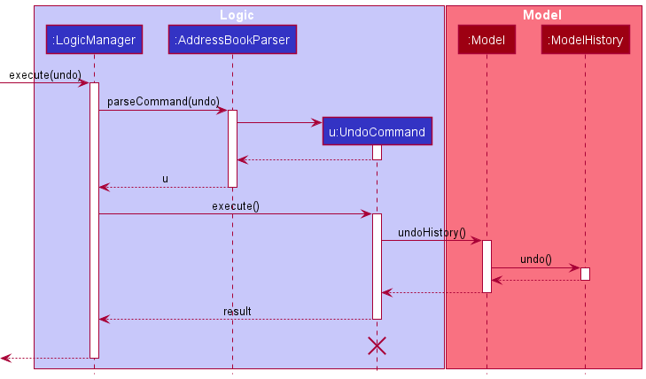

* Table of Contents
{:toc}

--------------------------------------------------------------------------------------------------------------------

## **Acknowledgements**

* This project is based on the AddressBook-Level3 project created by the [SE-EDU initiative](https://se-education.org).

--------------------------------------------------------------------------------------------------------------------

## **Setting up, getting started**

Refer to the guide [_Setting up and getting started_](SettingUp.md).

--------------------------------------------------------------------------------------------------------------------

## **Design**

:bulb: **Tip:** The `.puml` files used to create diagrams in this document can be found in the [diagrams](https://github.com/AY2122S1-CS2103T-W15-1/tp/tree/master/docs/diagrams/) folder. Refer to the [_PlantUML Tutorial_ at se-edu/guides](https://se-education.org/guides/tutorials/plantUml.html) to learn how to create and edit diagrams.

### Architecture

The ***Architecture Diagram*** given above explains the high-level design of the App.

Given below is a quick overview of main components and how they interact with each other.

**Main components of the architecture**

**`Main`** has two classes called [`Main`](https://github.com/AY2122S1-CS2103T-W15-1/tp/tree/master/src/main/java/seedu/address/Main.java) and [`MainApp`](https://github.com/AY2122S1-CS2103T-W15-1/tp/tree/master/src/main/java/seedu/address/MainApp.java). It is responsible for,
* At app launch: Initializes the components in the correct sequence, and connects them up with each other.
* At shut down: Shuts down the components and invokes cleanup methods where necessary.

[**`Commons`**](#common-classes) represents a collection of classes used by multiple other components.

The rest of the App consists of four components.

* [**`UI`**](#ui-component): The UI of the App.
* [**`Logic`**](#logic-component): The command executor.
* [**`Model`**](#model-component): Holds the data of the App in memory.
* [**`Storage`**](#storage-component): Reads data from, and writes data to, the hard disk.

**How the architecture components interact with each other**

The *Sequence Diagram* below shows how the components interact with each other for the scenario where the user issues the command `delete 1`.

Each of the four main components (also shown in the diagram above),

* defines its *API* in an `interface` with the same name as the Component.
* implements its functionality using a concrete `{Component Name}Manager` class (which follows the corresponding API `interface` mentioned in the previous point.

For example, the `Logic` component defines its API in the `Logic.java` interface and implements its functionality using the `LogicManager.java` class which follows the `Logic` interface. Other components interact with a given component through its interface rather than the concrete class (reason: to prevent outside component's being coupled to the implementation of a component), as illustrated in the (partial) class diagram below.

The sections below give more details of each component.

### UI component

The **API** of this component is specified in [`Ui.java`](https://github.com/AY2122S1-CS2103T-W15-1/tp/tree/master/src/main/java/seedu/address/ui/Ui.java)

The UI consists of a `MainWindow` that is made up of parts e.g.`CommandBox`, `ResultDisplay`, `StudentListPanel`, `StatusBarFooter` etc. All these, including the `MainWindow`, inherit from the abstract `UiPart` class which captures the commonalities between classes that represent parts of the visible GUI.

The `UI` component uses the JavaFx UI framework. The layout of these UI parts are defined in matching `.fxml` files that are in the `src/main/resources/view` folder. For example, the layout of the [`MainWindow`](https://github.com/AY2122S1-CS2103T-W15-1/tp/tree/master/src/main/java/seedu/address/ui/MainWindow.java) is specified in [`MainWindow.fxml`](https://github.com/AY2122S1-CS2103T-W15-1/tp/tree/master/src/main/resources/view/MainWindow.fxml)

The `UI` component,

* executes user commands using the `Logic` component.
* listens for changes to `Model` data so that the UI can be updated with the modified data.
* keeps a reference to the `Logic` component, because the `UI` relies on the `Logic` to execute commands.
* depends on some classes in the `Model` component, as it displays `Student` object residing in the `Model`.

### Logic component

**API** : [`Logic.java`](https://github.com/AY2122S1-CS2103T-W15-1/tp/tree/master/src/main/java/seedu/address/logic/Logic.java)

Here's a (partial) class diagram of the `Logic` component:

How the `Logic` component works:
1. When `Logic` is called upon to execute a command, it uses the `ClassmateParser` class to parse the user command.
1. This results in a `Command` object (more precisely, an object of one of its subclasses e.g., `AddCommand`) which is executed by the `LogicManager`.
1. The command can communicate with the `Model` when it is executed (e.g. to add a student).
1. The result of the command execution is encapsulated as a `CommandResult` object which is returned from `Logic`.

The Sequence Diagram below illustrates the interactions within the `Logic` component for the `execute("delete 1")` API call.

:information_source: **Note:** The lifeline for `DeleteCommandParser` should end at the destroy marker (X) but due to a limitation of PlantUML, the lifeline reaches the end of diagram.

Here are the other classes in `Logic` (omitted from the class diagram above) that are used for parsing a user command:

How the parsing works:
* When called upon to parse a user command, the `ClassmateParser` class creates an `XYZCommandParser` (`XYZ` is a placeholder for the specific command name e.g., `AddCommandParser`) which uses the other classes shown above to parse the user command and create a `XYZCommand` object (e.g., `AddCommand`) which the `ClassmateParser` returns back as a `Command` object.
* All `XYZCommandParser` classes (e.g., `AddCommandParser`, `DeleteCommandParser`, ...) inherit from the `Parser` interface so that they can be treated similarly where possible e.g, during testing.

### Model component
**API** : [`Model.java`](https://github.com/AY2122S1-CS2103T-W15-1/tp/tree/master/src/main/java/seedu/address/model/Model.java)

The `Model` component,

* stores the ClassMATE data i.e., all `Student` objects (which are contained in a `UniqueStudentList` object).
* stores the currently 'selected' `Student` objects (e.g., results of a search query) as a separate _filtered_ list which is exposed to outsiders as an unmodifiable `ObservableList<Student>` that can be 'observed' e.g. the UI can be bound to this list so that the UI automatically updates when the data in the list change.
* stores a `UserPref` object that represents the user’s preferences. This is exposed to the outside as a `ReadOnlyUserPref` objects.
* does not depend on any of the other three components (as the `Model` represents data entities of the domain, they should make sense on their own without depending on other components)

:information_source: **Note:** An alternative (arguably, a more OOP) model is given below. It has a `Tag` list in the `ClassMATE`, which `Student` references. This allows `ClassMATE` to only require one `Tag` object per unique tag, instead of each `Student` needing their own `Tag` objects. 

### Storage component

**API** : [`Storage.java`](https://github.com/AY2122S1-CS2103T-W15-1/tp/tree/master/src/main/java/seedu/address/storage/Storage.java)

The `Storage` component,
* can save both ClassMATE data and user preference data in json format, and read them back into corresponding objects.
* inherits from both `ClassmateStorage` and `UserPrefStorage`, which means it can be treated as either one (if only the functionality of only one is needed).
* depends on some classes in the `Model` component (because the `Storage` component's job is to save/retrieve objects that belong to the `Model`)

### Common classes

Classes used by multiple components are in the `seedu.address.commons` package.

--------------------------------------------------------------------------------------------------------------------

## **Implementation**

This section describes some noteworthy details on how certain features are implemented.

### \[Proposed\] Undo/redo feature

#### Proposed Implementation

The proposed undo/redo mechanism is facilitated by `VersionedClassmate`. It extends `Classmate` with an undo/redo history, stored internally as an `classmateStateList` and `currentStatePointer`. Additionally, it implements the following operations:

* `VersionedClassmate#commit()` — Saves the current ClassMATE state in its history.
* `VersionedClassmate#undo()` — Restores the previous ClassMATE state from its history.
* `VersionedClassmate#redo()` — Restores a previously undone ClassMATE state from its history.

These operations are exposed in the `Model` interface as `Model#commitClassmate()`, `Model#undoClassmate()` and `Model#redoClassmate()` respectively.

Given below is an example usage scenario and how the undo/redo mechanism behaves at each step.

Step 1. The user launches the application for the first time. The `VersionedClassmate` will be initialized with the initial ClassMATE state, and the `currentStatePointer` pointing to that single ClassMATE state.

Step 2. The user executes `deletestu 5` command to delete the 5th student in the student list. The `deletestu` command calls `Model#commitClassmate()`, causing the modified state of ClassMATE after the `deletestu 5` command executes to be saved in the `classmateStateList`, and the `currentStatePointer` is shifted to the newly inserted ClassMATE state.

Step 3. The user executes `addstu n/David …​` to add a new student. The `addstu` command also calls `Model#commitClassmate()`, causing another modified ClassMATE state to be saved into the `classmateStateList`.

:information_source: **Note:** If a command fails its execution, it will not call `Model#commitClassmate()`, so the ClassMATE state will not be saved into the `classmateStateList`.

Step 4. The user now decides that adding the student was a mistake, and decides to undo that action by executing the `undo` command. The `undo` command will call `Model#undoClassmate()`, which will shift the `currentStatePointer` once to the left, pointing it to the previous ClassMATE state, and restores ClassMATE to that state.

:information_source: **Note:** If the `currentStatePointer` is at index 0, pointing to the initial ClassMATE state, then there are no previous ClassMATE states to restore. The `undo` command uses `Model#canUndoClassmate()` to check if this is the case. If so, it will return an error to the user rather
than attempting to perform the undo.

The following sequence diagram shows how the undo operation works:

:information_source: **Note:** The lifeline for `UndoCommand` should end at the destroy marker (X) but due to a limitation of PlantUML, the lifeline reaches the end of diagram.

The `redo` command does the opposite — it calls `Model#redoClassmate()`, which shifts the `currentStatePointer` once to the right, pointing to the previously undone state, and restores the ClassMATE to that state.

:information_source: **Note:** If the `currentStatePointer` is at index `classmateStateList.size() - 1`, pointing to the latest ClassMATE state, then there are no undone ClassMATE states to restore. The `redo` command uses `Model#canRedoClassmate()` to check if this is the case. If so, it will return an error to the user rather than attempting to perform the redo.

Step 5. The user then decides to execute the command `list`. Commands that do not modify ClassMATE, such as `list`, will usually not call `Model#commitClassmate()`, `Model#undoClassmate()` or `Model#redoClassmate()`. Thus, the `classmateStateList` remains unchanged.

Step 6. The user executes `clear`, which calls `Model#commitClassmate()`. Since the `currentStatePointer` is not pointing at the end of the `classmateStateList`, all ClassMATE states after the `currentStatePointer` will be purged. Reason: It no longer makes sense to redo the `add n/David …​` command. This is the behavior that most modern desktop applications follow.

The following activity diagram summarizes what happens when a user executes a new command:

#### Design considerations:

**Aspect: How undo & redo executes:**

* **Alternative 1 (current choice):** Saves the entire ClassMATE.
  * Pros: Easy to implement.
  * Cons: May have performance issues in terms of memory usage.

* **Alternative 2:** Individual command knows how to undo/redo by
  itself.
  * Pros: Will use less memory (e.g. for `deletestu`, just save the student being deleted).
  * Cons: We must ensure that the implementation of each individual command are correct.

_{more aspects and alternatives to be added}_

### \[Proposed\] Data archiving

_{Explain here how the data archiving feature will be implemented}_

--------------------------------------------------------------------------------------------------------------------

## **Documentation, logging, testing, configuration, dev-ops**

* [Documentation guide](Documentation.md)
* [Testing guide](Testing.md)
* [Logging guide](Logging.md)
* [Configuration guide](Configuration.md)
* [DevOps guide](DevOps.md)

--------------------------------------------------------------------------------------------------------------------

## **Appendix: Requirements**

### Product scope

**Target user profile**:

* CS2101 Tutors with multiple tutorial classes
* prefer desktop apps over other types
* can type fast
* prefers typing to mouse interactions
* is reasonably comfortable using CLI apps

**Value proposition**: Manage and store student details faster than a typical mouse/GUI driven app. Organise students within classes and groups.

### User stories

Priorities: High (must have) - `* * *`, Medium (nice to have) - `* *`, Low (unlikely to have) - `*`

| Priority | As a …​                                    | I want to …​                     | So that I can…​                                                        |
| -------- | ------------------------------------------ | ------------------------------ | ---------------------------------------------------------------------- |
| `* * *`  | new user                                   | see usage instructions         | refer to instructions when I forget how to use the App                 |
| `* *`  | new user                                       | view sample data              | see what the app looks like when in use                               |
| `* * *`  | user                                       | add a new student              |                                                                        |
| `* * *`  | user                                       | view a student's details       | easily check the details and progress of the students                  |
| `* * *`  | user                                       | add a new class                |                                                                        |
| `* * `   | user                                       | add a class schedule           | plan my week in advance  
| `* * *`  | user                                       | view a class' details          | easily check the details of a particular class                         |
| `* * *`  | user                                       | delete a student               | remove entries that I no longer need       
| `* * *`  | user                                       | delete a class                 | remove classes that I no longer need                                                                 |
| `* * *`  | user                                       | find a student by name          | locate details of students without having to go through the entire list |
| `* * *`  | user                                       | find a class by code           | locate details of a class without having to go through the entire list |
| `* * *`  | user                                       | view all classes               | see which classes I'm taking                                           |
| `* * *`  | user                                       | view all students in a class   | see the students enrolled in a particular class                                         |
| `* *`    | experienced user                           | add class participation details to a student | track the paricipation of each student                   |
| `* *`    | user                                       | hide private contact details   | minimize chance of someone else seeing them by accident                |
| `*`      | user with many students in ClassMATE | sort students by name           | locate a student easily                                                 |
| `*`      | user with many classes in ClassMATE | sort classes by name           | locate a class easily                                                 |

*{More to be added}*

### Use cases

(For all use cases below, the **System** is the `ClassMATE` and the **Actor** is the `user`, unless specified otherwise)

**Use case: Delete a student**

**MSS**

1.  User requests to list students
2.  ClassMATE shows a list of students
3.  User requests to delete a specific student in the list
4.  ClassMATE deletes the student

    Use case ends.

**Extensions**

* 2a. The list is empty.

  Use case ends.

* 3a. The given index is invalid.

    * 3a1. ClassMATE shows an error message.

      Use case resumes at step 2.

**Use case: List students**

**MSS**

1.  User requests to list students
2.  ClassMATE shows a list of students

    Use case ends.

**Extensions**

* 1a. User decides to specify a class to list students

    * 1a1. ClassMATE shows a list of students in the specified  tutorial class

      Use case ends.

* 2a. The list is empty.

  Use case ends.

**Use case: Add a tutorial class**

**MSS**

1.  User requests to add a tutorial class.
2.  ClassMATE adds the tutorial class.

    Use case ends.

**Extensions**

* 1a. The tutorial class already exists.
    *  1a1. ClassMATE shows a message informing the user.

  Use case ends.

**Use case: Find and view a tutorial class**

**MSS**

1.  User requests to find a tutorial class
2.  ClassMATE shows a list of classes with the given keyword
3.  User requests to view a specific class in the list
4.  ClassMATE shows the class details

    Use case ends.

**Extensions**

* 2a. The list is empty.

  Use case ends.

* 3a. The given index is invalid.

    * 3a1. ClassMATE shows an error message.

      Use case resumes at step 2.

### Non-Functional Requirements

1. Should work on any _mainstream OS_ as long as it has Java `11` or above installed.
2. Should be able to hold at least 1000 students, 400 groups and 100 classes without a noticeable sluggishness in performance for typical usage.
3. A user with above average typing speed for regular English text (i.e. not code, not system admin commands) should be able to accomplish most of the tasks faster using commands than using the mouse.
4. Readable font, at least size 12.
5. Should not cause noticeable lag for other applications when running.
6. Light Mode.
7. Able to function in the background.
8. Able to respond to user actions within three seconds.
9. A tutorial class should be able to hold up to 20 students.
10. A group should be able to hold up to 5 students.
11. Each action should not take more than 3 commands.

### Glossary

* **Mainstream OS**: Windows, Linux, Unix, (MAC) OS-X
* **Private student detail**: A student detail that is not meant to be shared with others
* **Tutorial class**: A CS2101 tutorial class. Each student can only have up to one tutorial class
* **Student**: An NUS student taking the CS2101(T) module
* **Group**: A group is a subsection of the class and contains a few students for the purpose of small activities or group project

--------------------------------------------------------------------------------------------------------------------

## **Appendix: Instructions for manual testing**

Given below are instructions to test the app manually.

:information_source: **Note:** These instructions only provide a starting point for testers to work on;
testers are expected to do more *exploratory* testing.

### Launch and shutdown

1. Initial launch

   1. Download the jar file and copy into an empty folder

   1. Double-click the jar file Expected: Shows the GUI with a set of sample contacts. The window size may not be optimum.

1. Saving window preferences

   1. Resize the window to an optimum size. Move the window to a different location. Close the window.

   1. Re-launch the app by double-clicking the jar file. 
       Expected: The most recent window size and location is retained.

1. _{ more test cases …​ }_

### Deleting a student

1. Deleting a student while all students are being shown

   1. Prerequisites: List all students using the `liststu` command. Multiple students in the list.

   1. Test case: `deletestu 1` 
      Expected: First student is deleted from the list. Details of the deleted student shown in the status message. Timestamp in the status bar is updated.

   1. Test case: `deletestu 0` 
      Expected: No student is deleted. Error details shown in the status message. Status bar remains the same.

   1. Other incorrect delete commands to try: `delete`, `delete x`, `...` (where x is larger than the list size) 
      Expected: Similar to previous.

1. _{ more test cases …​ }_

### Saving data

1. Dealing with missing/corrupted data files

   1. _{explain how to simulate a missing/corrupted file, and the expected behavior}_

1. _{ more test cases …​ }_
