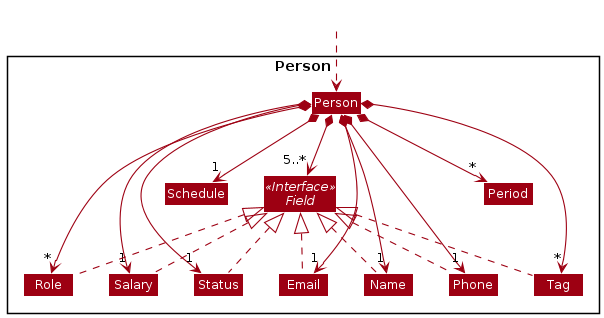
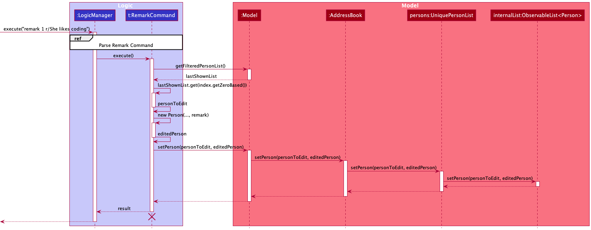
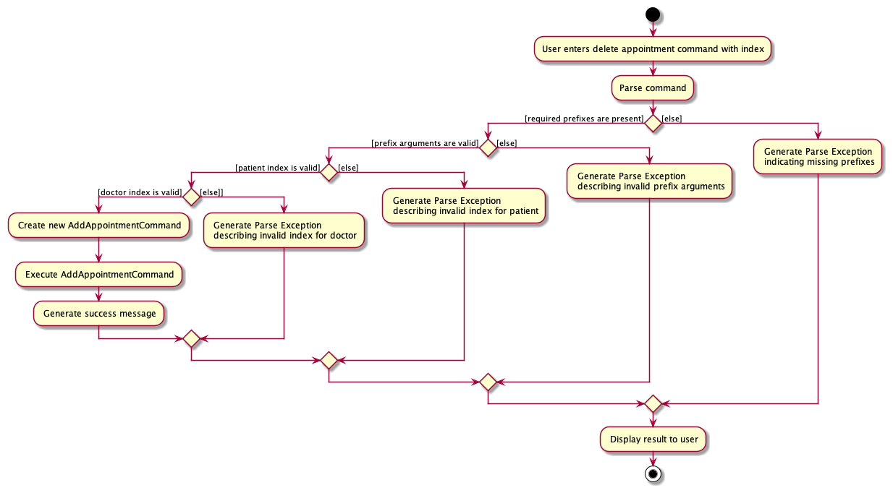
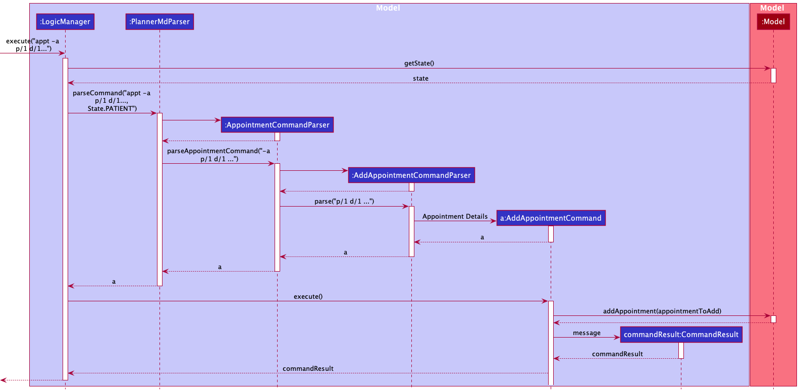
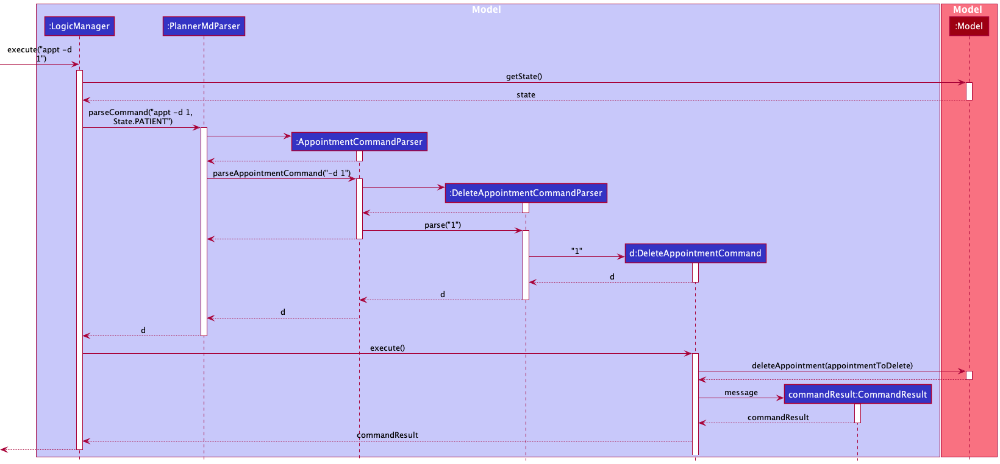
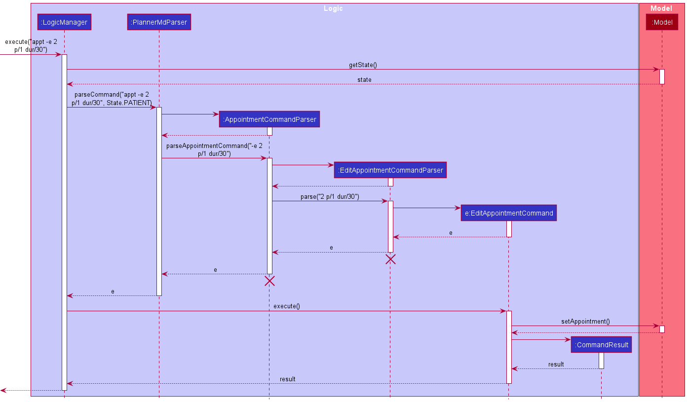
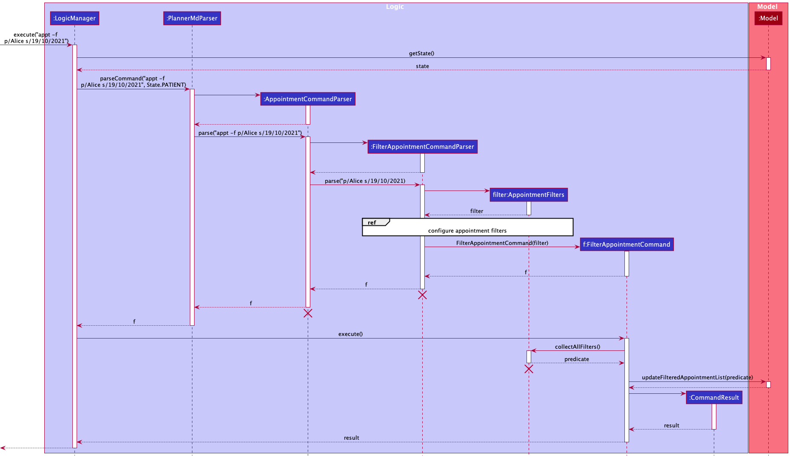
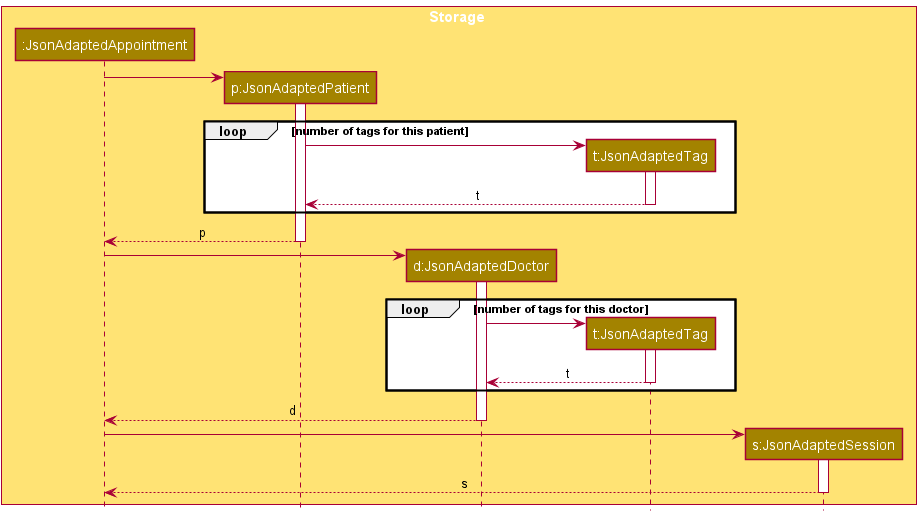

PlannerMD is an easy-to-use command-line interface (CLI) application that helps clinic receptionists seamlessly integrate the daily appointments and the unique requirements of each patient into a single application. PlannerMD expedites the manual processes found in a clinic and saves clinics receptionists plenty of time while also reducing human error.

The purpose of the Developer Guide is to guide you through the architecture of our program, so you can familiarise yourself with its underlying structure.

## Navigating this Developer Guide
Take note of some syntax we will frequently use throughout the Developer Guide:

| Syntax | Description |
|--------|------------|
| **Bold** | keywords |
| :bulb: **Tip:** | Useful tips |
| `markdown` | Classes or methods |
| :information_source: **Note:** | Noteworthy information |

* Table of Contents
    - [Acknowledgements](#acknowledgements) 
    - [Setting up, getting started](#setting-up)
    - [Design](#design)
        - [Architecture](#architecture)
        - [UI Component](#ui)
        - [Logic Component](#logic)
        - [Model Component](#model)
        - [Storage Component](#storage) 
        - [Common classes](#common-classes)
    - [Implementation](#implementation)
        - [Stateful PlannerMD](#stateful-plannermd)
        - [Toggle Command](#toggle-command)
        - [Remark](#remark)
        - [Propagating Person Changes to Appointment List](#propagating-person-changes-to-appointment-list)
        - [Adding an appointment](#adding-an-appointment)
        - [Deleting an appointment](#deleting-an-appointment)
        - [Editing an appointment](#editing-an-appointment)
        - [Filtering appointments](#filtering-appointments)
        - [Storing an appointment](#storing-an-appointment)
    - [Documentation, logging, testing, configuration, dev-ops](#documentation)
    - [Appendix: Requirements](#appendix-requirements)
        - [Product scope](#product-scope)
        - [User stories](#user-stories)
        - [Use cases](#use-cases)
        - [Non-functional Requirements](#nfr)
        - [Glossary](#glossary)
    - [Appendix: Instructions for manual testing](#appendix-instructions-for-manual-testing)
        - [Launch and shutdown](#launch-and-shutdown)
        - [Adding a patient](#add-patient-manual-testing)
        - [Listing all patients](#list-patients-manual-testing)
        - [Finding patients](#find-patient-manual-testing)
        - [Deleting a patient](#delete-patient-manual-testing)
        - [Editing a patient](#edit-patient-manual-testing)
        - [Editing a patient's remark](#remark-patient-manual-testing)
        - [Adding a tag to a patient](#add-tag-patient-manual-testing)
        - [Deleting a tag of a patient](#delete-tag-patient-manual-testing)
        - [Adding a doctor](#add-doctor-manual-testing)
        - [Listing all doctors](#list-doctors-manual-testing)
        - [Finding doctors](#find-doctor-manual-testing)
        - [Deleting a doctor](#delete-doctor-manual-testing)
        - [Editing a doctor](#edit-doctor-manual-testing)
        - [Editing a doctor's remark](#remark-patient-manual-testing)
        - [Adding a tag to a patient](#add-tag-doctor-manual-testing)
        - [Deleting a tag of a patient](#delete-tag-doctor-manual-testing)
        - [Adding an appointment](#add-appointment-manual-testing)
        - [Deleting an appointment](#deleting-appointment-manual-testing)
        - [Editing an appointment](#edit-appointment-manual-testing)
        - [Filtering all appointments](#filter-all-manual-testing)
        - [Filtering upcoming appointments](#filter-upcoming-manual-testing)
        - [Listing all appointments](#list-all-manual-testing)
        - [Saving data](#saving-data)

--------------------------------------------------------------------------------------------------------------------

## **Acknowledgements** <a name="acknowledgements"/> 

* This project is based on the AddressBook-Level3 project created by the [SE-EDU initiative](https://se-education.org/).

--------------------------------------------------------------------------------------------------------------------

## **Setting up, getting started** <a name="setting-up"/>

Refer to the guide [_Setting up and getting started_](SettingUp.md).

--------------------------------------------------------------------------------------------------------------------

## **Design** <a name="design"/>

:bulb: **Tip:** The `.puml` files used to create diagrams in this document can be found in the [diagrams](https://github.com/se-edu/addressbook-level3/tree/master/docs/diagrams/) folder. Refer to the [_PlantUML Tutorial_ at se-edu/guides](https://se-education.org/guides/tutorials/plantUml.html) to learn how to create and edit diagrams.

### Architecture <a name="architecture"/>

The ***Architecture Diagram*** given above explains the high-level design of the App.

Given below is a quick overview of main components and how they interact with each other.

**Main components of the architecture**

**`Main`** has two classes called [`Main`](https://github.com/AY2122S1-CS2103T-T11-3/tp/blob/master/src/main/java/seedu/plannermd/Main.java) and [`MainApp`](https://github.com/AY2122S1-CS2103T-T11-3/tp/blob/master/src/main/java/seedu/plannermd/MainApp.java). It is responsible for,
* At app launch: Initializes the components in the correct sequence, and connects them up with each other.
* At shut down: Shuts down the components and invokes cleanup methods where necessary.

[**`Commons`**](#common-classes) represents a collection of classes used by multiple other components.

The rest of the App consists of four components.

* [**`UI`**](#ui): The UI of the App.
* [**`Logic`**](#logic): The command executor.
* [**`Model`**](#model): Holds the data of the App in memory.
* [**`Storage`**](#storage): Reads data from, and writes data to, the hard disk.

**How the architecture components interact with each other**

The *Sequence Diagram* below shows how the components interact with each other for the scenario where the user issues the command `delete 1`.

Each of the four main components (also shown in the diagram above),

* defines its *API* in an `interface` with the same name as the Component.
* implements its functionality using a concrete `{Component Name}Manager` class (which follows the corresponding API `interface` mentioned in the previous point.

For example, the `Logic` component defines its API in the `Logic.java` interface and implements its functionality using the `LogicManager.java` class which follows the `Logic` interface. Other components interact with a given component through its interface rather than the concrete class (reason: to prevent outside component's being coupled to the implementation of a component), as illustrated in the (partial) class diagram below.

The sections below give more details of each component.

### UI component <a name="ui"/>

The **API** of this component is specified in [`Ui.java`](https://github.com/se-edu/addressbook-level3/tree/master/src/main/java/seedu/address/ui/Ui.java)

The UI consists of a `MainWindow` that is made up of parts e.g.`CommandBox`, `ResultDisplay`, `PersonTab`, `StatusBarFooter` etc. All these, including the `MainWindow`, inherit from the abstract `UiPart` class which captures the commonalities between classes that represent parts of the visible GUI.

The `PersonTab` is a tab layout that consists of a `PatientListPanel` and a `DoctorListPanel`. Only one of the tabs is displayed to the user at a particular time, and the user can toggle between the 2 tabs.

The `UI` component uses the JavaFx UI framework. The layout of these UI parts are defined in matching `.fxml` files that are in the `src/main/resources/view` folder. For example, the layout of the [`MainWindow`](https://github.com/se-edu/addressbook-level3/tree/master/src/main/java/seedu/address/ui/MainWindow.java) is specified in [`MainWindow.fxml`](https://github.com/se-edu/addressbook-level3/tree/master/src/main/resources/view/MainWindow.fxml)

The `UI` component,

* executes user commands using the `Logic` component.
* listens for changes to `Model` data so that the UI can be updated with the modified data.
* keeps a reference to the `Logic` component, because the `UI` relies on the `Logic` to execute commands.
* depends on some classes in the `Model` component, as it displays `Person` object residing in the `Model`.

### Logic component <a name="logic"/>

**API** : [`Logic.java`](https://github.com/se-edu/addressbook-level3/tree/master/src/main/java/seedu/address/logic/Logic.java)

Here's a (partial) class diagram of the `Logic` component:

How the `Logic` component works:
1. When `Logic` is called upon to execute a command, it gets the current state (i.e. whether the user is on the `Patients` or `Doctors` tab) from the `Model`.
2. It then uses the `PlannerMdParser` class to parse the user command.
3. This results in a `Command` object (more precisely, an object of one of its subclasses e.g., `AddPatientCommand`) which is executed by the `LogicManager`.
4. The command can communicate with the `Model` when it is executed (e.g. to add a patient).
5. The result of the command execution is encapsulated as a `CommandResult` object which is returned back from `Logic`.

The Sequence Diagram below illustrates the interactions within the `Logic` component for the `execute("delete 1")` API call.

:information_source: **Note:** The lifeline for `DeleteCommandParser` should end at the destroy marker (X) but due to a limitation of PlantUML, the lifeline reaches the end of diagram.

Here are the other classes in `Logic` (omitted from the class diagram above) that are used for parsing a user command:

How the parsing works:
* When called upon to parse a user command, the `PlannerMdParser` class creates an `XYZCommandParser` (`XYZ` is a placeholder for the specific command name e.g., `AddPatientCommandParser`) which uses the other classes shown above to parse the user command and create a `XYZCommand` object (e.g., `AddPatientCommand`) which the `PlannerMdParser` returns back as a `Command` object.
* If the `PlannerMdParser` parses an appointment command (e.g., `appt -a`, `appt -e`, ...), it first creates an `AppointmentCommandParser` to parse the flags given (e.g., `-a`, `-e`, ...). The `AppointmentCommandParser` then creates an `XYZCommandParser` (e.g., `AddAppointmentCommandParser`) to parse the remaining user command.
* All `XYZCommandParser` classes (e.g., `AddPatientCommandParser`, `DeleteDoctorCommandParser`, ...) inherit from the `Parser` interface so that they can be treated similarly where possible e.g, during testing.

### Model component <a name="model"/>
**API** : [`Model.java`](https://github.com/AY2122S1-CS2103T-T11-3/tp/blob/master/src/main/java/seedu/plannermd/model/Model.java)

Here's the class diagram of the `Person` component within `Model`:

Heres the class diagram of the `Appointment` component within `Model`:

The `Model` component,

* stores the plannerMD data  
  * all `Patient` and `Doctor` objects (which are contained in `UniquePersonList<Patient>` and `UniquePersonList<Doctor>` respectively).
  * all `Appointment` objects (which are contained in `UniqueAppointmentList<Patient>`).
* stores the currently active `State` (which determines which list of Person, `Patient` or `Doctor`, to interact with)
* stores the currently 'selected' `Patient`, `Doctor` and `Appointment` objects (e.g., results of a search query) as a separate _filtered_ list which is exposed to outsiders as unmodifiable `ObservableList<Patient>`, `ObservableList<Doctor>`  and `ObservableList<Appointment>` respectively that can be 'observed' e.g. the UI can be bound to this list so that the UI automatically updates when the data in the list change.
* stores a `UserPref` object that represents the user’s preferences. This is exposed to the outside as a `ReadOnlyUserPref` objects.
* does not depend on any of the other three components (as the `Model` represents data entities of the domain, they should make sense on their own without depending on other components)

### Storage component <a name="storage"/>

**API** : [`Storage.java`](https://github.com/AY2122S1-CS2103T-T11-3/tp/blob/master/src/main/java/seedu/plannermd/storage/Storage.java)

The `Storage` component,
* can save both PlannerMD data and user preference data in json format, and read them back into corresponding objects.
* inherits from both `PlannerMdStorage` and `UserPrefStorage`, which means it can be treated as either one (if only the functionality of only one is needed).
* depends on some classes in the `Model` component (because the `Storage` component's job is to save/retrieve objects that belong to the `Model`)

### Common classes  <a name="common-classes"/>

Classes used by multiple components are in the `seedu.plannermd.commons` package.

--------------------------------------------------------------------------------------------------------------------

## **Implementation** <a name="implementation"/>

This section describes some noteworthy details on how certain features are implemented.

### Stateful PlannerMD <a name="stateful-plannermd"/>
With the introduction of two types of `Person` (`Patient` and `Doctor`) and their respective lists,
a state is used to determine which list should be interacted with.

The state is maintained in `ModelManager`
* Two possible states (`State.PATIENT` and `State.DOCTOR`)
* `ModelManager::toggleState` is used to switch between states
* The UI displays the list according to the state. (eg. if the state is `State.PATIENT`, UI displays the filtered list of patients)
* Commands are parsed based on the state. (eg. if a valid 'add' command is parsed and the state is `State.PATIENT`, an `AddPatientCommand` is executed)

#### Design considerations
Since it is likely that clinic would be mainly interacting with patient records, we did not want to display both lists within the UI  at the same time as the additional clutter
would be less user-friendly. Also, since commands for records are applicable to both patients and doctors, we wanted to avoid flags for record commands and keep them as succinct as possible.  
Therefore, we decided to introduce a state, allowing us to display the list the user desires and execute commands according to the state.

### Toggle Command <a name="toggle-command"/>
Command used to toggle displayed tab and the current state of PlannerMD.

The Activity Diagram below illustrates the execution flow when the user executes a `remark` command. 

1. The user inputs a `toggle` command.
2. A `ToggleCommand` is generated and executed.
   * If the currently displayed tab is the patient tab, it is toggled to the doctor tab.
   * If the currently displayed tab is the doctor tab, it is toggled to the patient tab.
3. The GUI displays a success message.

#### Implementation
The Sequence Diagram below illustrates the interactions within the Logic component for the execute("toggle") API call in Patient state.

1. `plannerMdParser::parseCommand` is called with the user input "toggle" along with the current `Model.state` (`State.Pateint`).  
   1.1 A `ToggleCommand` instance is instantiated.
2. `ToggleCommand::execute` is called 
   3.1. `Model::toggleState` is called and toggles `Model.State` from `State.Patient` to `State.Doctor` 
   3.2. A `CommandResult` instance is instantiated with a success message.
3. The `CommandResult` is then returned

The GUI updates the list according to the current state(eg. displays patient list if `Model.state` is `State.Patient`) and display the success message given by `CommandResult`.

### Remark <a name="remark"/>

#### Remark field
A field added for `Person` and thus applies to both `Patient` and `Doctor`. Remark is miscellaneous information
stored as a String.
* No restrictions, `Remark` can be any `String`, including empty.
* `Remark` is an empty String by default.

#### Remark command
Command used to edit the `Remark` field of a Person.
* No input restrictions, input can be any `String`, including empty.
    * empty input effectively deletes the current `Remark` and the Remark field will not be displayed in the UI at all.

The activity Diagram below illustrates the execution flow when the user executes a `remark` command.  

1. The user inputs a `remark` command.
2. The input is parsed  
    * If the `INDEX` is invalid, invalid prefixes are inputted or the remark prefix `/r` is missing, a `ParseException` is thrown and an error message is displayed.
3. A `RemarkCommand` is generated and executed.
    * If remark input is empty, effectively deletes the remark, generate successful delete remark message.
    * If remark input is not empty, effectively deletes the remark, generate successful edit remark message.
4. The GUI displays a success message.

#### Implementation
The Sequence Diagram below illustrates the interactions within the Logic component for the execute("remark 1 r/bad cough") API call.  

1. `plannerMdParser::parseCommand` is called with the user input "remark 1 r/bad cough" along with the current `Model.state`.  
   1.1 A `RemarkCommandParser` instance is instantiated.
2. `RemarkCommandParser::parse` is called with input "1 r/bad cough"  
   2.1 A `RemarkCommand` instance is instantiated.
3. `RemarkCommand::execute` is called 
   3.1. `Model::setPatient` is called and replaces the patient with edited patient in the patient list. 
   3.2. A `CommandResult` instance is instantiated with a success message.
4. The `CommandResult` is then returned

The GUI updates the patient record in the displayed list and displays a success message.

### Propagating Person Changes to Appointment List  <a name="propagating-person-changes-to-appointment-list"/>
Since specific patients and doctors within the records are directly referenced in appointments,
changes in patients and doctors through user command or otherwise needs to be propagated through the Appointment list.
* When patients or doctor deleted, appointments they are a part of will be deleted as well.
  * `DeleteCommand`
* When patients or doctor details are changed, these changes will be reflected in appointments they are a part of.
  * `RemarkCommand`, `EditCommand` and `TagCommand`

#### Implementation
The Sequence Diagram below illustrates the interactions within the Model component for the deletePatient(target) API call.

1. `PlannerMd::removePatient` is called and deletes `target` from the list of patients.  
2. `UniqueAppointmentList::deleteAppointmentWithPerson` is called  
   * Loops through `UniqueAppointmentList` and deletes `appointment` which references `target`.

The Sequence Diagram below illustrates the interactions within the Model component for the setPatient(patientToEdit, editedPatient) API call.

1. `PlannerMd::setPatient` is called and replaces `patientToEdit` with `editedPatient` in the list of patients.  
2. `UniqueAppointmentList::editAppointmentWithPerson` is called  
    * Loops through `UniqueAppointmentList` and replaces `appointment` which references `patientToEdit` with a new `editedAppointment` which has the same fields as `appointment` but references `editedPatient`.
    

GUI is updated to display the propagated changes in the appointment list.

#### Design considerations
Since `Appointment` unilaterally has references `Patient` and `Doctor`, the `UniqueAppointmentList` has to be iterated
to update `Appointment` with references to `Patient` or `Doctor` which were edited or delete them when they have references to the deleted `Patient` or `Doctor`.

### Adding an appointment <a name="adding-an-appointment"/>
Adding an appointment requires the user to input valid patient and doctor indexes, and the correct format for each prefix.
The diagram below illustrates the flow of adding an appointment:

1. After user enters the add appointment command `appt -a` with the relevant prefix, the input will be sent
   to `AddAppointmentCommandParser` for parsing.
2. `AddAppointmentCommandParser` will check if the prefixes are relevant. If the prefixes are relevant, a new `AddAppointmentCommand` which extends `AppointmentCommand`
   is created. The `AddAppointmentCommand` implements the `execute()` method from the abstract class `Command`. If the prefixes are not relevant,
   a `ParseException` will be thrown, and the missing prefixes' error message will be shown.
3. The `AddAppointmentCommand` will run `execute()`. First, it retrieves the `Patient` object and the `Doctor` object at the given index from the model. If the index is out of range of the
   `Model#FilteredPatientList` or `Model#FilteredDoctorList`, it will throw an error, and the invalid index message will be shown.
   If not, the `Appointment` object with the is created and added to the model. The add appointment success message is then returned.
4. The UI will then display the result

### Deleting an appointment <a name="deleting-an-appointment"/>
Deleting an appointment requires the user to input a valid index of the desired appointment in the appointment list.
The diagram below illustrates the flow of deleting an appointment: 

1. After user enters the delete appointment command `appt -d` with an index, the input will be sent
   to `DeleteAppointmentCommandParser` for parsing.
2. `DeleteAppointmentCommandParser` will check if the index is valid. If the index is valid, a new `DeleteAppointmentCommand` 
   which extends `AppointmentCommand` is created. If not, a `ParseException` will be thrown, and the invalid index message will be shown.
3. The `DeleteAppointmentCommand` will run `execute()`, removing the appointment at the inputted index. Then, it will return the
   success message as a `CommandResult` object.
4. The UI will then display the result

### Editing an appointment <a name="editing-an-appointment"/> 

#### What it is

Edits the details of an existing appointment.

The edit appointment command accepts at least one of the following parameters:
* Patient index
* Doctor index
* Start date and time
* Duration (in minutes)
* Remark

#### Implementation

1. An `EditAppointmentCommandParser` is used to parse the edit appointment command. It checks if the patient and doctor indices are not out of bounds (based on the current filtered patient and doctor lists). The validity and format of the date and time as well as duration are also checked.
2. If the inputs are valid, an `EditAppointmentCommand` is created. The command is executed and attempts to edit the fields as specified in the user input. The edited appointment will be reflected in the filtered appointment list in `Model`.
3. Whenever an edited appointment results in a clash with existing appointments, the command is aborted and an error message is shown to the user.

The sequence diagram below illustrates the interactions within the `Logic` component for the `execute("appt -e 2 p/1 dur/30")` API call.

:information_source: **Note:** The lifeline for `AppointmentCommandParser` and `EditAppointmentCommandParser` should end at the destroy marker (X) but due to a limitation of PlantUML, the lifeline reaches the end of diagram.

### Filtering appointments <a name="filtering-appointments"/>

#### What it is

Filters through the appointment records in PlannerMD and shows the appointments that matches the filter parameters.

There are 4 possible parameters provided to a filter appointment command are:
* Patient keywords (Filters appointments whose patient's name contains one of the keywords provided)
* Doctor keywords (Filters appointments whose doctor's name contains one of the keywords provided)
* Start date (Filters appointments which has a starting date greater or equal to the start date provided)
* End date (Filters appointment which has a starting date lesser or equal to the end date provided)

If no parameters are provided, the command simply lists all appointments in the appointment records.

#### Implementation

Upon entry of a filter appointment command, it is parsed by a `FilterAppointmentCommandParser` to check if the input parameters are valid (Dates are formatted correctly, `startDate` <= `endDate` if both parameters are provided). If the inputs are valid, an 'AppointmentFilters' is created and the filter parameters are stored in it. An 'AppointmentFilters' is an object that stores the different filter conditions a user can provide.

After that, the filter is used to create a `FilterAppointmentCommand`. When executed, the `FilterAppointmentCommand` takes the `AppointmentFilters` and converts it into a single predicate based on the filter parameters provided. The predicate is then used to update the filtered appointment list in `Model`.

Given below, is an example of a filter appointment command with the patient keywords and start date parameter provided.

A clearer view of this sequence diagram can be found [here](https://github.com/AY2122S1-CS2103T-T11-3/tp/blob/master/docs/images/AppointmentFilterSequenceDiagram.png).

### Storing an appointment <a name="storing-an-appointment"/>

#### What it is

Stores an Appointment object in the Json file by first creating the `JsonAdaptedAppointment` object, which is the Json representation of the `Appointment` object. 
Then, the `JsonAdaptedAppointment` is then contained within the `JsonSerializablePlannerMd` object and `JsonSerializablePlannerMd` is passed as parameter to `JsonUtil.saveJsonFile` to write all records,
including the `Appointment` object, into the file.

The implementation focuses on the creation of a single `JsonAdapatedAppointment` object after the user keys in a command that changes the current records.

#### Implementation

The creation of a `JsonAdaptedAppointment` will create the respective `JsonAdaptedPatient` and `JsonAdaptedDoctor` involved in the appointment. 
The creation of `JsonAdaptedPatient` and `JsonAdaptedDoctor` will create the number of tags that the respective `Patient` and `Doctor` objects have.

We use `JsonAdaptedPatient` and `JsonAdaptedDoctor` that are used to store `Patient` and `Doctor` standalone objects 
as Json to ensure that these objects are stored in a consistent format, whether as a standalone `Patient`/`Doctor` or
a `Patient`/`Doctor` in an `Appointment`.

The creation of a `JsonAdaptedAppointment` will also create the `JsonAdaptedSession`
which is synonymous to the `Session` object contained in an `Appointment`.

The Sequence Diagram below illustrates the interactions within the Storage component for the creation of a `JsonAdaptedAppointment`.

--------------------------------------------------------------------------------------------------------------------

## **Documentation, logging, testing, configuration, dev-ops**  <a name="documentation"/>

* [Documentation guide](Documentation.md)
* [Testing guide](Testing.md)
* [Logging guide](Logging.md)
* [Configuration guide](Configuration.md)
* [DevOps guide](DevOps.md)

--------------------------------------------------------------------------------------------------------------------

## **Appendix: Requirements**  <a name="appendix-requirements"/>

### Product scope  <a name="product-scope"/>

**Target user profile**:

* has a need to manage a significant number of patients
* needs quick access to a patient's data and profile
* needs to arrange/deconflict appointments for doctors
* prefers desktop applications over other types
* can type fast and prefers typing to mouse interactions
* is reasonably comfortable using CLI apps

**Value proposition**: easily manage patients' information and doctors' appointments faster than a typical mouse/GUI driven app

### User stories  <a name="user-stories"/>
These are some user stories we took into account when designing PlannerMD:

Priorities: High (must have) - `* * *`, Medium (nice to have) - `* *`, Low (unlikely to have) - `*`

| Priority | As a …​                                    | I want to …​                     | So that I can…​                                                        |
| -------- | ------------------------------------------ | ------------------------------ | ---------------------------------------------------------------------- |
| `* * *`  | new user            | see usage instructions         | refer to instructions when I forget how to use an instruction              |
| `* * *`  | clinic receptionist | add patients' personal details | better understand them and have a way of easily contacting them                                                                       |
| `* * *`  | clinic receptionist | delete a patient from the patient records  | remove entries that I no longer need and keep my database clean   |
| `* * *`  | clinic receptionist | view a patient's personal details | contact him/her |
| `* * *`  | clinic receptionist | view a patient's risk profile| decide whether or not the patient should be given priority to see the doctor |
| `* * *`  | clinic receptionist | edit a patient's personal details | change his/her personal details should it change and keep my database updated|
| `* * *`  | clinic receptionist | edit a patient's risk profile| change his/her risk profile should it change and keep my database updated |
| `* * *`  | clinic receptionist | find a patient by name | locate details of patients without having to go through the entire list |
| `* * *`  | clinic receptionist | add doctors' personal details | easily contact the doctor when the need arises|
| `* * *`  | clinic receptionist | delete a doctor from the doctors records | remove entries that I no longer need and keep my database clean |
| `* * *`  | clinic receptionist | view a doctor's personal details | contact him/her |
| `* * *`  | clinic receptionist | edit a doctor's personal details| edit his/her details should it change and keep my database updated |
| `* * *`  | clinic receptionist | add an appointment | so that I can easily manage my schedule without having to rely on a physical planner |
| `* * *`  | clinic receptionist | delete an appointment | cancel the appointment and keep my schedule updated |
| `* * *`  | clinic receptionist | edit an appointment | reschedule the appointment when the patient or doctor asks for it |
| `* * *`  | clinic receptionist | search and filter through all my scheduled appointments | see what appointments a particular patient or doctor has at a particular point in time  |
| `* * *`  | clinic receptionist | list the appointments that have been scheduled today | see what appointments the clinic has today|
| `* *`    | clinic receptionist | add remarks for a patient | add additional information about the patient |            |
| `* *`    | clinic receptionist | edit remarks for a patient| change any additional information about the patient    |
| `* *`    | clinic receptionist | add remarks for a doctor | add additional information about the doctor |            |
| `* *`    | clinic receptionist | edit remarks for a doctor | change any additional information about the doctor    |
| `*`      | clinic receptionist | write tags for a patient  | easily identify important things to note about the patient             |
| `*`      | clinic receptionist | write tags for a doctor  | easily identify important things to note about the doctor      |
 
### Use cases  <a name="use-cases"/>
These are some use cases to familiarise with the flow of our application: 

(For all use cases below, the **System** is `PlannerMD` and the **Actor** is the `receptionist`, unless specified otherwise)

**Use case: UC01P Adding a patient**  

**MSS**

1. Receptionist requests to add a patient by typing in their details.
2. PlannerMD adds the patient which is reflected immediately in the list

   Use case ends.

**Extensions**

* 1a. PlannerMD detects that compulsory details are missing.

    * 1a1. PlannerMD shows an error message.

  Use case resumes at step 1.

* 1b. PlannerMD detects data entered with invalid format.

    * 1b1. PlannerMD shows an error message stating the required format.

  Use case resumes at step 1.

**Use case: UC01D Adding a doctor**  

Same as UC01P but references to patient is replaced with doctor instead.

**Use case: UC02P Listing all patient**

**MSS**

1. Receptionist requests to list all patients.
2. All patients are displayed in the patient records tab.

   Use case ends.

**Use case: UC02D Listing all patient**  

Same as UC02P but references to patient is replaced with doctor instead.

**Use case: UC03P Finding patients**  

**MSS**

1. Receptionist requests to find patients with desired keywords.
2. All patients with desired keywords are displayed in the patient records tab.

   Use case ends.

**Extensions**
* 1a. No keywords given.

    * 1a1. PlannerMD shows an error message.

       Use case ends.

**Use case: UC03D Finding doctors**  

Same as UC03P but references to patient is replaced with doctor instead.

**Use case: UC04P Deleting a patient**  

**MSS**

1. Receptionist <u>lists (UC02P)</u> or <u>finds (UC03P)</u> relevant patients.
2. Receptionist shows the list of relevant patients.
3. Receptionist requests to delete a specific patient/doctor in the list
4. PlannerMD deletes the patient/doctor which is reflected immediately in the list

    Use case ends.

**Extensions**

* 2a. The list is empty.

  Use case ends.

* 3a. The given index is invalid.

    * 3a1. PlannerMD shows an error message.

      Use case resumes at step 2.

**Use case: UC04D Deleting a doctor**  

Same as UC04P but with the following changes:
* Replace references of patients with doctors
* Replace references of <u>listing patients (UC02P)</u> with <u>listing doctors (UC02D)</u>
* Replace references of <u>finding patients (UC03P)</u> with <u>finding doctors (UC03D)</u>

**Use case: UC05P Editing personal details of a patient**

**MSS**

1. Receptionist <u>lists (UC02P)</u> or <u>finds (UC03P)</u> relevant patients.
2. Receptionist shows the list of relevant patients.
3. Receptionist requests to edit the personal details of a specific patient in the list
4. PlannerMD edits the patient's personal details which is reflected immediately

   Use case ends.

**Extensions**

* 2a. The list is empty.

  Use case ends.

* 3a. The given index is invalid.

    * 3a1. PlannerMD shows an error message.

      Use case resumes at step 2.

**Use case: UC05D Editing personal details of a doctor**  

Same as UC05P but with the following changes:
* Replace references of patients with doctors
* Replace references of <u>listing patients (UC02P)</u> with <u>listing doctors (UC02D)</u>
* Replace references of <u>finding patients (UC03P)</u> with <u>finding doctors (UC03D)</u>

**Use case: UC06P Editing the remark of a patient**  

**MSS**

1. Receptionist <u>lists (UC02P)</u> or <u>finds (UC03P)</u> relevant patients.
2. Receptionist shows the list of relevant patients.
3. Receptionist requests to edit the remark of a specific person in the list
4. PlannerMD edits the remark which is reflected immediately in the list

    Use case ends.

**Extensions**

* 2a. The list is empty.

  Use case ends.

* 3a. The given index is invalid.

    * 3a1. PlannerMD shows an error message.

      Use case resumes at step 2.

**Use case: UC06D Editing the remark of a patient**  

Same as UC06P but with the following changes:
* Replace references of patients with doctors
* Replace references of <u>listing patients (UC02P)</u> with <u>listing doctors (UC02D)</u>
* Replace references of <u>finding patients (UC03P)</u> with <u>finding doctors (UC03D)</u>

**Use case: UC07P Adding a tag to a patient** 

**MSS**

1. Receptionist <u>lists (UC02P)</u> or <u>finds (UC03P)</u> relevant patients.
2. Receptionist shows the list of relevant patients.
3. Receptionist requests to add a tag to a specific person in the list
4. PlannerMD adds the tag which is reflected immediately in the list

    Use case ends.

**Extensions**

* 2a. The list is empty.

  Use case ends.

* 3a. The given index is invalid.

    * 3a1. PlannerMD shows an error message.

      Use case resumes at step 2.

* 3b. The given tag is invalid.

    * 3b1. PlannerMD shows an error message.

      Use case resumes at step 2.
  
* 3c. The given tag already exists.

    * 3c1. PlannerMD shows an error message.

      Use case resumes at step 2.

**Use case: UC07D Adding a tag to a doctor**  

Same as UC07P but with the following changes:
* Replace references of patients with doctors
* Replace references of <u>listing patients (UC02P)</u> with <u>listing doctors (UC02D)</u>
* Replace references of <u>finding patients (UC03P)</u> with <u>finding doctors (UC03D)</u>

**Use case: UC08P Deleting a tag from a patient** 

**MSS**

1. Receptionist <u>lists (UC02P)</u> or <u>finds (UC03P)</u> relevant patients.
2. Receptionist shows the list of relevant patients.
3. Receptionist requests to delete a tag from a specific person in the list
4. PlannerMD deletes the tag which is reflected immediately in the list

    Use case ends.

**Extensions**

* 2a. The list is empty.

  Use case ends.

* 3a. The given index is invalid.

    * 3a1. PlannerMD shows an error message.

      Use case resumes at step 2.

* 3b. The given tag is non-existent.

    * 3b1. PlannerMD shows an error message.

      Use case resumes at step 2.

**Use case: UC08D Deleting a tag from a doctor**  

Same as UC08P but with the following changes:
* Replace references of patients with doctors
* Replace references of <u>listing patients (UC02P)</u> with <u>listing doctors (UC02D)</u>
* Replace references of <u>finding patients (UC03P)</u> with <u>finding doctors (UC03D)</u>

**Use case: UC09 Scheduling an appointment**

**MSS**

1. Receptionist <u>lists (UC02P)</u> or <u>finds (UC03P)</u> relevant patients.
2. Receptionist shows the list of relevant patients.
3. Receptionist <u>lists (UC02D)</u> or <u>finds (UC03D)</u> relevant doctors.
4. Receptionist shows the list of relevant doctors.
5. Receptionist requests to schedule the appointment with patients and doctors listed.
6. PlannerMD updates the doctor's schedule which is reflected immediately

    Use case ends.

**Extensions**

* 2a. The list is empty.

  Use case ends.

* 4a. The list is empty.

  Use case ends.

* 5a. The given index for patient is invalid.

    * 5a1. PlannerMD shows an error message.

      Use case resumes at step 2.

* 5b. The given index for doctor is invalid.

    * 5b1. PlannerMD shows an error message.

      Use case resumes at step 4.

* 5c. The appointment time clashes with the doctor's schedule

    * 5c1. Receptionist requests to reschedule to a different time. 
    
      Step 5c1 is repeated until the appointment does not clash.

    * 5c2. PlannerMD updates the doctor's schedule which is reflected immediately.

      Use case ends.

**Use case: UC10 Listing today's appointments**

**MSS**
1. Receptionist request to list all of today's appointments with his/her desired parameters.
2. All of today's appointments are displayed in the appointment list.

   Use case ends.

**Extensions**
* 1a. There are no appointments for the current day.

    * 1a1. A message is shown informing the user that there are no appointments for the current day.

      Use case ends.

**Use case: UC11 Filtering appointments**

**MSS**
1. Receptionist request to filter through all appointments with his/her desired parameters.
2. The filtered results are displayed in the appointment list.

   Use case ends.

**Extensions**

* 1a. The user does not specify any parameters when filtering through the appointment records.
    * 1a1. All appointments in the appointment records are displayed in the appointment list.

      Use case ends.

* 1b. The user enters a parameter that is invalid.
    * 1b1. An error message is shown, informing the user of an invalid parameter.
    * 1b2. User enters the new parameters.

      Steps 1b1-1b2 are repeated until the new parameters entered are valid.

      Use case resumes from step 2.
    
**Use case: UC12 Deleting an appointment**

**MSS**
1. Receptionist <u>lists (UC10)</u> or <u>filters (UC11)</u> for relevant appointments .
2. Receptionist shows the list of relevant appointments.
3. Receptionist requests to delete an appointment
4. PlannerMD deletes the appointment from the appointment list which is reflected immediately

    Use case ends.

**Extensions**

* 2a. The given index is invalid.

    * 2a1. PlannerMD shows an error message.

      Use case resumes at step 2.

**Use case: UC13 Editing an appointment**

**MSS**
1. Receptionist <u>lists (UC10)</u> or <u>filters (UC11)</u> for relevant appointments.
2. Receptionist shows the list of relevant appointments.
3. Receptionist requests to edit a specific appointment
4. PlannerMD edits the appointment which is reflected immediately

    Use case ends.

**Extensions**

* 1a. The appointment list is empty.

    Use case ends.

* 2a. The given index is invalid.

    * 3a1. PlannerMD shows an error message.

      Use case resumes at step 1.

* 2b. The given parameters are invalid.

    * 2b1. PlannerMD shows an error message.

      Use case resumes at step 1.

* 2c. The edited appointment date or time clashes with an existing appointment.

    * 3c1. PlannerMD shows an error message and lists the clashing appointment(s).

      Use case resumes at step 1.
    
### Non-Functional Requirements  <a name="nfr"/>

1. Should work on any _mainstream OS_ as long as it has Java `11` or above installed.
2. Should work independent of network connection.
3. Should respond to users' commands within two seconds.
4. Should be able to store 5000 unique entries of patients and doctors.
5. The data should be stored on the user's local machine.
6. The data should be available for backup and portable to another computer.
7. The user interface should be simple and intuitive enough for any users.
8. A user with above average typing speed for regular English text (i.e. not code, not system admin commands) should be able to accomplish most of the tasks faster using commands than using the mouse.

### Glossary <a name="glossary"/>

* **Appointment**: Arrangement to meet between a doctor and a patient
* **CLI**: Command Line Interface
* **GUI**: Graphical User Interface
* **Mainstream OS**: Windows, Linux, Unix, OS-X
* **Patient**: The individual that visits the clinic
* **Personal details** personal information including a name, contact number, email, address, date of birth, whatever tags the receptionist gives
* **Risk profile**: The health status and severity of the condition of a patient
* **Tag**: A label attached to a patient for easy identification or providing additional information
* **MSS**: Main Success Scenario in the use cases.
* **Extensions**: "Add-ons" to the MSS that describes an exceptional/alternative flow of events. 

--------------------------------------------------------------------------------------------------------------------

## **Appendix: Instructions for manual testing** <a name="appendix-instructions-for-manual-testing"/>

Given below are instructions to test the app manually.

:information_source: **Note:** These instructions only provide a starting point for testers to work on;
testers are expected to do more *exploratory* testing.

### Launch and shutdown  <a name="launch-and-shutdown"/>

1. Initial launch

   1. Download the jar file and copy into an empty folder

   1. Double-click the jar file Expected: Shows the GUI with a set of sample patients, doctors and appointments. The window size may not be optimum.

1. Saving window preferences

   1. Resize the window to an optimum size. Move the window to a different location. Close the window.

   1. Re-launch the app by double-clicking the jar file. 
       Expected: The most recent window size and location is retained.

1. Exiting the app
    1. While the app is still open, enter `exit` in the command box or click on the close window button. 
        Expected: The application closes.

### Adding a patient <a name="add-patient-manual-testing"/>
1. Adding a patient
    1. Prerequisites: `toggle` to the `Patients` tab. The following patient must already exists:
       John Doe; Phone: 98765432; Email: johnd@example.com; Address: 311, Clementi Ave 2, #02-25; Date of Birth: 20/7/1964; Tags: vaccinated; Risk: LOW
       
    2. Test case: `add n/Bob Doe hp/99999999 eml/bobdoe@example.com a/311, Clementi Ave 2, #02-25 dob/20/07/1964 t/vaccinated risk/LOW`
        
        Expected: Patient named Bob Doe is added successfully. Details of the added patient are shown in the status message.

    3. Test case: `add n/John Doe hp/98765432 eml/johnd@example.com a/311, Clementi Ave 2, #02-25 dob/20/07/1964 t/vaccinated risk/LOW`
        Expected: No Patient is added. Error details are shown in the status message.

    4. Test case: `add n/John Doe hp/98765432 eml/johnd@example.com a/311, Kent Ridge Ave 2, #02-25 dob/25/12/0000 t/vaccinated risk/LOW`
        Expected: No Patient is added. Error details are shown in the status message.

    5. Other incorrect add commands to try: `add`, `add n/Bob hp/`, `add n/` (not all fields, except tags and risk, are filled) 
       Expected: No Patient is added. Error details are shown in the status message.

### Listing all patients <a name="list-patients-manual-testing"/>

1. List all patients

    1. Prerequisites: `toggle` to the `Patients` tab.

    2. Test case: `list` 
       Expected: All existing patients are listed.

    3. Test case: `list extra-parameters` 
       Expected: All existing patients are listed.

### Finding patients <a name="find-patient-manual-testing"/>

1. Find patients
   1. Prerequisites: The tests for finding patients uses the sample data from `SampleDataUtil#getSamplePatients`. This is the sample data loaded at initial launch of the application, or in the absence of the `data/plannermd.json` file. 
      `toggle` to the `Patients` tab.

   2. Test case: `find Aaron` 
      Expected: Patient list shows only one patient "Aaron Yeoh". Status message shows that 1 patient is listed.

   3. Test case: `find aaron` 
      Expected: `find` command is case-insensitive. Patient list shows only one patient "Aaron Yeoh". Status message shows that 1 patient is listed.

   4. Test case: `find aaron Bobby` 
      Expected: `find` command is able to search multiple patients using multiple keywords. Patient list shows two patients "Aaron Yeoh" and "Bobby Yu". Status message shows that 2 patients are listed.

   5. Test case: `find aar` 
      Expected: Patient list shows that no patients are found. Status message shows that 0 patients are listed.

   6. Test case: `find Alex` 
      Expected: Patient list shows that no patients are found. Status message shows that 0 patients are listed.

### Deleting a patient  <a name="delete-patient-manual-testing"/>

1. Deleting a patient while all patients are being shown
    1. Prerequisites: `toggle` to the `Patients` tab. There must be existing patients. List all patients using the `list` command.

    2. Test case: `delete 1` 
       Expected: First patient is deleted from the patients list. Details of the deleted patient are shown in the status message.

    3. Test case: `delete 0` 
       Expected: No patient is deleted. Error details are shown in the status message.

    4. Other incorrect delete commands to try: `delete`, `delete x`, `delete abcd` (where x is larger than the list size, and abcd are any alphabets) 
       Expected: No patient deleted. Error details are shown in the status message.

2. Delete a patient while some patients are being shown
    1. Prerequisites: `toggle` to the `Patients` tab. There must be existing patients. List some patients using `find XYZ` (XYZ is the name of an existing patient).

     2. Test cases are similar to those above.

### Editing a patient <a name="edit-patient-manual-testing"/>

1. Editing a patient while all patients are being shown

    1. Prerequisites: `toggle` to the `Patients` tab. There must be existing patients. List all patients using the `list` command. 

    2. Test case: `edit 1 n/John Doe` 
       Expected: First patient's name is edited to `John Doe`. Details of the edited patient are shown in the status message.

    3. Test case: `edit 1 hp/91234567 eml/johndoe@example.com` 
       Expected: First patient's phone and email are edited to `91234567` and `johndoe@example.com` respectively. Details of the edited patient are shown in the status message.

    4. Test case: `edit 1 hp/abc` 
       Expected: No patient is edited. Error details are shown in the status message.

    5. Test case: `edit 1 eml/xyz` 
       Expected: No patient is edited. Error details are shown in the status message.

    6. Test case: `edit 1 a/Blk 50, Clementi Ave 2` 
       Expected: First patient's address is edited to `Blk 50, Clementi Ave 2`. Details of the edited doctor are shown in the status message.

    7. Test case: `edit 1 dob/20/12/1960` 
       Expected: First patient's date of birth is edited to `1960-12-20`. Details of the edited patient are shown in the status message.

    8. Test case: `edit 1 dob/20/14/1960` 
       Expected: No patient is edited. Error details are shown in the status message.

    9. Test case: `edit 1 t/covid` 
       Expected: First patient's tag is edited to `covid`. Details of the edited patient are shown in the status message.

    10. Test case: `edit 1 t/` 
        Expected: First patient's tags are deleted. Details of the edited patient are shown in the status message.

    11. Test case: `edit 1 risk/HIGH` 
        Expected: First patient's risk is edited to `HIGH`. Details of the edited patient are shown in the status message.

    12. Test case: `edit 1 risk/ABC` 
        Expected: No patient is edited. Error details are shown in the status message.

    13. Test case: `edit 0 hp/91234567` 
        Expected: No patient is edited. Error details are shown in the status message.

    14. Other incorrect edit commands to try: `edit`, `edit x`, `...` (where x is larger than the list size) 
        Expected: No patient is edited. Error details are shown in the status message.

2. Editing a patient while some patients are being shown

    1. Prerequisites: `toggle` to the `Patients` tab. There must be existing patients. List some patients using `find XYZ` (XYZ is the name of an existing patient).

    2. Test cases are similar to those above.
    
### Editing a patient's remark <a name="remark-patient-manual-testing"/>

1. Editing a patient's remark while all patient are being shown

    1. Prerequisites: `toggle` to the `Patients` tab. There must be existing patients. List all patients using the `list` command.

    2. Test case: `remark 1 r/Prefers Dr. Mok` 
        1. If the first patient had no remarks initially,
           Expected: A new remark field displaying `Prefers Dr. Mok` is added to the first patient's fields. Details of the edited patient are shown in the status message.
        2. If the first patient had remarks initially,
           Expected: First patient's remarks are edited to `Prefers Dr. Mok`. Details of the edited patient are shown in the status message.

    3. Test case: `remark 1 r/` 
       Expected: First patient's remarks are deleted and the remark field is no longer displayed for the patient. Details of the edited patient are shown in the status message.

    4. Test case: `remark 0 r/Prefers Dr. Mok` 
       Expected: No patient's remarks are edited. Error details are shown in the status message.

    5. Other incorrect edit commands to try: `remark`, `remark x`, `...` (where x is larger than the list size) 
       Expected: Similar to previous test case.

2. Editing a patient's remark while some patients are being shown
    1. Prerequisites: `toggle` to the `Patients` tab. There must be existing patients. List some patient using `find XYZ` (XYZ is the name of an existing patient).

    2. Test cases are similar to those above.

### Adding a tag to a patient <a name="add-tag-patient-manual-testing"/>

1. Adding a tag to a patient while all patient are being shown

    1. Prerequisites: `toggle` to the `Patients` tab. There must be existing patients. List all patients using the `list` command.

    2. Test case: `tag -a 1 t/Immunocompromised` 
       1. If the patient does not have a `Immunocompromised` tag
          Expected: A new tag `Immunocompromised` is added to the first patient. Details of the edited patient are shown in the status message.
       2. If the patient has a `Immunocompromised` tag
          Expected: No tag is added to the patient. Error details are shown in the status message.
       
    3. Test case: `tag -a 1 t/` 
       Expected: No tag is added to the patient. Error details are shown in the status message.

    4. Test case: `tag -a 0 t/Immunocompromised` 
       Expected: No tag is added to any patient. Error details are shown in the status message.

    5. Other incorrect tag commands to try: `tag`, `tag -a t/`, `tag -a x t/`, `tag -e`, `...` (where x is larger than the list size) 
       Expected: Similar to previous test case.

2. Adding a tag to a patient while some patients are being shown
    1. Prerequisites: `toggle` to the `Patients` tab. There must be existing patients. List some patient using `find XYZ` (XYZ is the name of an existing patient).
   
    2. Test cases are similar to those above.

### Deleting a tag of a patient <a name="delete-tag-patient-manual-testing"/>

1. Deleting a tag of a patient while all patient are being shown

    1. Prerequisites: `toggle` to the `Patients` tab. There must be existing patients. List all patients using the `list` command. 
       First patient has `Immunocompromised` tag. Tag can be added using the following command: `tag -a 1 t/Immunocompromised`.

    2. Test case: `tag -d 1 t/Immunocompromised` 
       Expected: First patient's `Immunocompromised` tag is deleted. Details of the edited patient are shown in the status message.
   
    3. Test case: `tag -d 1 t/Osteopath` 
       Expected: No tag is deleted from the patient. Error details are shown in the status message.

    4. Test case: `tag -d 1 t/` 
       Expected: No tag is deleted from the patient. Error details are shown in the status message.

    5. Test case: `tag -d 0 t/Immunocompromised` 
       Expected: No tag is deleted from any patient. Error details are shown in the status message.

    6. Other incorrect tag commands to try: `tag`, `tag -d t/`, `tag -d x t/`, `tag -e`, `...` (where x is larger than the list size) 
       Expected: Similar to previous test case.

2. Deleting a tag of a patient while some patients are being shown
    1. Prerequisites: `toggle` to the `Patients` tab. There must be existing patients. List some patient using `find XYZ` (XYZ is the name of an existing patient).  
       First patient has `Immunocompromised` tag. Tag can be added using the following command: `tag -a 1 t/Immunocompromised`.
   
    2. Test cases are similar to those above.
    
### Adding a doctor <a name="add-doctor-manual-testing"/>

1. Adding a doctor
    1. Prerequisites: `toggle` to the `Doctors` tab. The following doctor must already exists:
       John Doe; Phone: 98765432; Email: johnd@example.com; Address: 311, Clementi Ave 2, #02-25; Date of Birth: 20/7/1964; Tags: experienced
    
    2. Test case: `add n/Bob Doe hp/99999999 eml/bobd@example.com a/311, Clementi Ave 2, #02-25 dob/20/07/1964 t/experienced`
         Expected: Doctor named Bob Doe is added successfully. Details of the added doctor are shown in the status message.
       
    3. Test case: `add n/John Doe hp/98765432 eml/johnd@example.com a/311, Clementi Ave 2, #02-25 dob/20/07/1964 t/experienced`
         Expected: No doctor is added. Error details are shown in the status message.
       
    4. Test case: `add n/John Doe hp/98765432 eml/johnd@example.com a/311, Kent Ridge Ave 2, #02-25 dob/25/12/0000 t/experienced`
         Expected: No doctor is added. Error details are shown in the status message.

    5. Other incorrect add commands to try: `add`, `add n/Bob hp/`, `add n/` (not all fields, except tags, are filled) 
        Expected: No doctor is added. Error details are shown in the status message.

### Listing all doctors <a name="list-doctors-manual-testing"/>

1. List all doctors

    1. Prerequisites: `toggle` to the `Doctors` tab.

    2. Test case: `list` 
       Expected: All existing doctors are listed.

    3. Test case: `list extra-parameters` 
       Expected: All existing doctors are listed.

### Finding doctors <a name="find-doctor-manual-testing"/>

1. Finding doctors
   1. Prerequisites: The tests for finding doctors uses the sample data from `SampleDataUtil#getSampleDoctors`. This is the sample data loaded at initial launch of the application, or in the absence of the `data/plannermd.json` file.  
      `toggle` to the `Patients` tab.

   2. Test case: `find Alex` 
      Expected: Doctor list shows only one doctor "Alex Yeoh". Status message shows that 1 doctor is listed.

   3. Test case: `find alex` 
      Expected: `find` command is case-insensitive. Doctor list shows only one doctor "Alex Yeoh". Status message shows that 1 doctor is listed.

   4. Test case: `find alex bernice` 
      Expected: `find` command is able to search multiple doctors using multiple keywords. Doctor list shows two doctors "Alex Yeoh" and "Bernice Yu". Status message shows that 2 doctors are listed.

   5. Test case: `find ale` 
      Expected: Doctor list shows that no doctors are found. Status message shows that 0 doctors are listed.

   6. Test case: `find Aaron` 
      Expected: Doctor list shows that no doctors are found. Status message shows that 0 doctors are listed.
   
### Deleting a doctor  <a name="delete-doctor-manual-testing"/>
1. Deleting a doctor while all doctors are being shown
    1. Prerequisites: `toggle` to the `Doctors` tab. There must be existing doctors. List all doctors using the `list` command. There must be multiple doctors. 

    2. Test case: `delete 1` 
       Expected: First doctor is deleted from the doctors list. Details of the deleted doctor are shown in the status message.

    3. Test case: `delete 0` 
       Expected: No doctor is deleted. Error details are shown in the status message.

    4. Other incorrect delete commands to try: `delete`, `delete x`, `delete abcd` (where x is larger than the list size, and abcd are any alphabets) 
       Expected: Similar to previous.

2. Delete a doctor while some doctors are being shown

    1. Prerequisites: `toggle` to the `Doctors` tab. There must be existing doctors. List some doctors using `find XYZ` (XYZ is the name of an existing doctor).

    2. Test cases are similar to those above.
    
### Editing a doctor <a name="edit-doctor-manual-testing"/>

1. Editing a doctor while all doctors are being shown

    1. Prerequisites: `toggle` to the `Doctors` tab. There must be existing doctors. List all doctors using the `list` command.

    2. Test case: `edit 1 n/John Doe` 
       Expected: First doctor's name is edited to `John Doe`. Details of the edited doctor are shown in the status message.

    3. Test case: `edit 1 hp/91234567 eml/johndoe@example.com` 
       Expected: First doctor's phone and email are edited to `91234567` and `johndoe@example.com` respectively. Details of the edited doctor are shown in the status message.

    4. Test case: `edit 1 hp/abc` 
       Expected: No doctor is edited. Error details are shown in the status message.

    5. Test case: `edit 1 eml/xyz` 
       Expected: No doctor is edited. Error details are shown in the status message.

    6. Test case: `edit 1 a/Blk 30, Clementi Ave 2` 
       Expected: First doctor's address is edited to `Blk 30, Clementi Ave 2`. Details of the edited doctor are shown in the status message.

    7. Test case: `edit 1 dob/20/12/1960` 
       Expected: First doctor's date of birth is edited to `1960-12-20`. Details of the edited doctor are shown in the status message.

    8. Test case: `edit 1 dob/20/14/1960` 
       Expected: No doctor is edited. Error details are shown in the status message.

    9. Test case: `edit 1 t/experienced` 
       Expected: First doctor's tag is edited to `experienced`. Details of the edited doctor are shown in the status message.

    10. Test case: `edit 1 t/` 
        Expected: First doctor's tags are deleted. Details of the edited doctor are shown in the status message.

    11. Test case: `edit 0 hp/91234567` 
        Expected: No doctor is edited. Error details are shown in the status message.

    12. Other incorrect edit commands to try: `edit`, `edit x`, `...` (where x is larger than the list size) 
        Expected: No doctor is edited. Error details are shown in the status message.

2. Editing a doctor while some doctors are being shown

    1. Prerequisites: `toggle` to the `Doctors` tab. There must be existing doctors. List some doctors using `find XYZ` (XYZ is the name of an existing doctor).

    2. Test cases are similar to those above.
    
### Editing a doctor's remark <a name="remark-doctor-manual-testing"/>

1. Editing a doctor's remark while all doctors are being shown

    1. Prerequisites: `toggle` to the `Doctors` tab. There must be existing doctors. List all doctors using the `list` command.

    2. Test case: `remark 1 r/Comes at 8am` 
       Expected: First doctor's remarks are edited to `Orthopedic`. Details of the edited patient are shown in the status message.
   
    3. Test case: `remark 1 r/` 
       Expected: First doctor's remarks are deleted. Details of the edited patient are shown in the status message.

    4. Test case: `remark 0 r/Comes at 8am` 
       Expected: No doctor's remarks are edited. Error details are shown in the status message.

    5. Other incorrect remark commands to try: `remark`, `remark x`, `...` (where x is larger than the list size) 
       Expected: Similar to previous test case.

2. Editing a doctor while some doctors are being shown
    1. Prerequisites: `toggle` to the `Doctors` tab. There must be existing doctors. List some doctors using `find XYZ` (XYZ is the name of an existing doctor).

    2. Test cases are similar to those above.

### Adding a tag to a doctor <a name="add-tag-doctor-manual-testing"/>

1. Adding a tag to a doctor while all doctors are being shown

    1. Prerequisites: `toggle` to the `Doctors` tab. There must be existing doctors. List all doctor using the `list` command.

    2. Test case: `tag -a 1 t/Pediatrician` 
        1. If the first doctor does not have a `Pediatrician` tag
           Expected: A new tag `Pediatrician` is added to the first doctor. Details of the edited patient are shown in the status message.
        2. If the first doctor has a `Pediatrician` tag
           Expected: No tag is added to the doctor. Error details are shown in the status message.

    3. Test case: `tag -a 1 t/` 
       Expected: No tag is added to the doctor. Error details are shown in the status message.

    4. Test case: `tag -a 0 t/Pediatrician` 
       Expected: No tag is added to any doctor. Error details are shown in the status message.

    5. Other incorrect tag commands to try: `tag`, `tag -a t/`, `tag -a x t/`, `tag -e`, `...` (where x is larger than the list size) 
       Expected: Similar to previous test case.

2. Adding a tag to a doctor while some doctors are being shown
    1. Prerequisites: `toggle` to the `Patients` tab. There must be existing doctors. List some doctor using `find XYZ` (XYZ is the name of an existing doctor).
      
    2. Test cases are similar to those above.

### Deleting a tag of a doctor <a name="delete-tag-doctor-manual-testing"/>

1. Deleting a tag of a doctor while all doctors are being shown

    1. Prerequisites: `toggle` to the `Doctors` tab. There must be existing doctors. List all doctors using the `list` command. 
       First doctor has `Pediatrician` tag. Tag can be added using the following command: `tag -a 1 t/Pediatrician`.

    2. Test case: `tag -d 1 t/Pediatrician` 
       Expected: First doctor's `Pediatrician` tag is deleted. Details of the edited patient are shown in the status message.
   
    3. Test case: `tag -d 1 t/Osteopath` 
       Expected: No tag is deleted from the doctor. Error details are shown in the status message.

    4. Test case: `tag -d 1 t/` 
       Expected: No tag is deleted from the doctor. Error details are shown in the status message.

    5. Test case: `tag -d 0 t/Pediatrician` 
       Expected: No tag is deleted from any doctor. Error details are shown in the status message.

    6. Other incorrect tag commands to try: `tag`, `tag -d t/`, `tag -d x t/`, `tag -e`, `...` (where x is larger than the list size) 
       Expected: Similar to previous test case.

2. Deleting a tag of a doctor while some doctors are being shown
    1. Prerequisites: `toggle` to the `Doctors` tab. There must be existing doctors. List some doctor using `find XYZ` (XYZ is the name of an existing doctor).  
       First doctor has `Pediatrician` tag. Tag can be added using the following command: `tag -a 1 t/Pediatrician`.

    2. Test cases are similar to those above.
    

### Adding an appointment <a name="add-appointment-manual-testing"/>

1. Add an appointment 
    1. Prerequisites: There must be existing patients and doctors in the patient and doctor lists. There are less than 100 patients and doctors. 
       
    1. Test case: `appt -a p/1 d/1 s/31/12/2050 12:00 dur/5 r/Patient wants a blood test` 
      Expected: An appointment is added. Details of the appointment shown in the response box. The appointment shows up in the appointment list.

    1. Test case: `appt -a p/1 d/1 s/31/12/2050 12:05 r/Patient wants a blood test` 
      Expected: An appointment is added. Details of the appointment shown in the response box. The appointment shows up in the appointment list.

    1. Test case: `appt -a p/1 d/1 s/31/12/2050 12:30 dur/50` 
      Expected: An appointment is added. Details of the appointment shown in the response box. The appointment shows up in the appointment list.

    1. Test case: `appt -a p/1 d/1 s/31/12/2050 14:00` 
       Expected: An appointment is added. Details of the appointment is shown in the response box. The appointment shows up in the appointment list.

    1. Test case: `appt -a p/1 d/1 s/DATE_AND_TIME dur/5 r/Patient wants a blood test,` where `DATE_AND_TIME` is today's date and any time 
       Expected: An appointment is added. Details of the appointment is shown in the response box. The appointment shows up in the appointment list.
       
    1. Test case: `appt -a` 
       Expected: No appointment is added. Error details are shown in the status message.

    1. Test case: `appt -a p/1 d/1 s/30/02/2021 dur/5 r/Patient wants a blood test` 
       Expected: No appointment is added. Error details are shown in the status message.

    1. Test case: `appt -a p/100 d/1 s/30/02/2021 dur/5 r/Patient wants a blood test` 
      Expected: No appointment is added. Error details are shown in the status message.
    
    1. Test case: `appt -a p/1 d/100 s/30/02/2021 dur/5 r/Patient wants a blood test` 
       Expected: No appointment is added. Error details are shown in the status message.

    1. Test case: `appt -a p/1 d/1 s/30/02/2021 dur/xxx r/Patient wants a blood test` 
      Expected: No appointment is added. Error details are shown in the status message.

   1. Test case: `appt -a p/1 d/1 s/30/02/2021 dur/121 r/Patient wants a blood test` 
      Expected: No appointment is added. Error details are shown in the status message.

   1. Test case: `appt -a p/1 d/1 s/30/02/2021 dur/0 r/Patient wants a blood test` 
      Expected: No appointment is added. Error details are shown in the status message.

### Deleting an appointment  <a name="deleting-appointment-manual-testing"/>

1. Deleting an appointment while all appointments are being shown

    1. Prerequisites: List all appointments using `appt -f`. There must be existing appointments in the list.

    2. Test case: `appt -d 1` 
       Expected: First appointment is deleted from the list. Details of the deleted appointment shown in the response box.

    3. Test case: `appt -d 0` 
       Expected: No appointment is deleted. Error details are shown in the status message.

    4. Other incorrect delete commands to try: `delete`, `delete x`, `...` (where x is larger than the appointment list size) 
       Expected: Similar to previous.

    5. Delete an appointment while some appointments are being shown

        1. Prerequisites: List some appointment using `appt -f [p/PATIENT_KEYWORD] [d/DOCTOR_KEYWORD] [s/START_DATE] [e/END_DATE]`. E.g., `appt -f s/01/11/2021` to list only appointments `01/11/2021` onwards. There must be existing appointments in the list.

        2. Test cases are similar to those above.

### Editing an appointment <a name="edit-appointment-manual-testing"/>

1. Editing an appointment while all appointments are being shown

    1. Prerequisites: List all appointments using `appt -f`. There must be existing appointments in the list.

    2. Test case: `appt -e 1 p/1 s/31/12/2021 10:00 dur/30` 
       Expected: First appointment's patient is edited to the first patient in the filtered patient list. The date and session are edited to `31 Dec 21, Fri` and `10:00 - 10:30` respectively. Details of the edited appointment are shown in the status message.

    3. Test case: `appt -e 1 d/1 r/blood test` 
       Expected: First appointment's doctor is edited to the first doctor in the filtered doctor list. The remark is edited to `blood test`. Details of the edited appointment are shown in the status message.

    4. Test case: `appt -e 1 s/31/12/2021` 
       Expected: No appointment is edited. Error details are shown in the status message.

    5. Test case: `appt -e 1 s/10:00` 
       Expected: No appointment is edited. Error details are shown in the status message.

    6. Test case: `appt -e 1 dur/1000` 
       Expected: No appointment is edited. Error details are shown in the status message.

    7. Test case: `appt -e 0 dur/30` 
       Expected: No appointment is edited. Error details are shown in the status message.

    8. Other incorrect edit appointment commands to try: `appt -e`, `appt -e x`, `...` (where x is larger than the list size) 
       Expected: No appointment is edited. Error details are shown in the status message.

    9. Test case: Edit a patient/doctor's appointment to clash with their existing appointments (edit the date and time to be the same or overlapping with an existing appointment). 
        Expected: No appointment is edited. Error details are shown in the status message.

2. Editing an appointment while some appointments are being shown

    1. Prerequisites: List some appointment using `appt -f [p/PATIENT_KEYWORD] [d/DOCTOR_KEYWORD] [s/START_DATE] [e/END_DATE]`. E.g., `appt -f s/01/11/2021` to list only appointments `01/11/2021` onwards. There must be existing appointments in the list.

    2. Test cases are similar to those above.

### Filtering all appointments <a name="filter-all-manual-testing"/>

1. Searches through all appointment based on the filter parameters provided.
   
    1. Prerequisites: None, but if there are no appointments added, upcoming filter searches will not return any results.

    2. Test case: `appt -f` 
       Expected: All appointments in the appointment records will be listed in the appointment list.

    3. Test case: `appt -f p/Aaron` 
       Expected: Searches for appointments that has a patient with a name that contains the keyword `Aaron` in it and displays the results in the appointment list.
       
    4. Test case: `appt -f p/Aaron Yeoh` 
        Expected: Searches for appointments that has a patient with a name that contains the keyword `Aaron` **or** `Yeoh` in it and displays the results in the appointment list.

    5. Test case: `appt -f d/Irfan` 
       Expected: Searches for appointments that has a doctor with a name that contains the keyword `Irfan` in it and displays the results in the appointment list.
       
    6. Test case: `appt -f d/Irfan Ibrahim` 
        Expected: Searches for appointments that has a doctor with a name that contains the keyword `Irfan` **or** `Ibrahim` in it and displays the results in the appointment list.
        
    7. Test case: `appt -f s/01/11/2021` 
        Expected: Searches for appointments that has a starting date after `01/11/2021` [inclusive] and displays the results in the appointment list.
    
    8. Test case: `appt -f e/30/11/2021` 
        Expected: Searches for appointments that has a starting date before `31/11/2021` [inclusive] and displays the results in the appointment list.
    
    9. Test case: `appt -f p/Aaron e/Irfan s/01/11/2021 e/30/11/2021` 
        Expected: Searches for appointments that has a patient with a name that contains the keyword `Aaron` in it, a doctor with a name that contains the keyword `Irfan` in it and has a starting date after `01/11/2021` [inclusive] and before `30/11/2021` [inclusive]. The search results are then displayed in the appointment list.
       
    10. Test case: `appt -f s/01/14/2021` 
        Expected: Displayed appointments are not changed. Error details are shown in the status message indicating an invalid date.
        
    11. Test case: `appt -f d/` 
        Expected: Displayed appointments are not changed. Error details are shown in the status message indicating that there is an empty parameter.

### Filtering upcoming appointments <a name="filter-upcoming-appointments"/>

1. Searches for upcoming appointment based on the filter parameters provided. An appointment is considered upcoming if it has a date and time greater or equal than the current date and time.
   
    1. Prerequisites: None, but if there are no upcoming appointments in the appointment records, upcoming filter searches will not return any results.
       
    2. Test case: `appt -u` 
       Expected: All upcoming appointments in the appointment records will be listed in the appointment list.
       
    3. Test case: `appt -u p/Aaron` 
       Expected: Searches for upcoming appointments that has a patient name with `aaron` in it and displays the results in the appointment list.

    4. Test case: `appt -u p/Aaron Yeoh` 
      Expected: Searches for upcoming appointments that has a patient with a name that contains the keyword `Aaron` **or** `Yeoh` in it and displays the results in the appointment list.
      
    5. Test case: `appt -u d/Irfan` 
       Expected: Searches for appointments that has a patient name with `aaron` in it and displays the results in the appointment list.

    6. Test case: `appt -u d/Irfan Ibrahim` 
      Expected: Searches for appointments that has a doctor with a name that contains the keyword `Irfan` **or** `Ibrahim` in it and displays the results in the appointment list.
      
    7. Test case: `appt -u d/Aaron s/21/10/2021` 
        Expected: Displayed appointments are not changed. Error details are shown in the status message indicating that the command should not be used with a date parameter.

    8. Test case: `appt -u d/` 
       Expected: Displayed appointments are not changed. Error details are shown in the status message indicating that there is an empty parameter.

### Listing all appointments for today <a name="list-all-manual-testing"/>

1. List all appointments for the current day in the appointment list.
   
    1. Test case: `appt -l` 
       1. If there are no appointments for the current day (when `appt -f` does not show any appointment for the current day) 
        Expected: No appointments are displayed in the appointment list.
          
       2. If there are appointments for the current day 
        Expected: All of today's appointments are displayed in the appointment list

### Saving data  <a name="saving-data"/>

1. Dealing with missing data files
   
    1. Prerequisites: If there is a plannermd.json file in the data folder at the root of the application directory, delete the plannermd.json file.
    
    1. Test case: Double-click on the jar file to run the application.
        Expected: Application runs and loads the sample data from `SampleDataUtil#getSamplePlannerMd`.

1. Dealing with corrupted data files

    1. Prerequisites: Modify the plannermd.json file to be an illegal format, such as deleting the "name" field of a patient.
    
    1. Test case: Double-click on the jar file to run the application.
       Expected: Application runs and has no data on initial load. Running the next command overwrites the current corrupted plannermd.json file.
