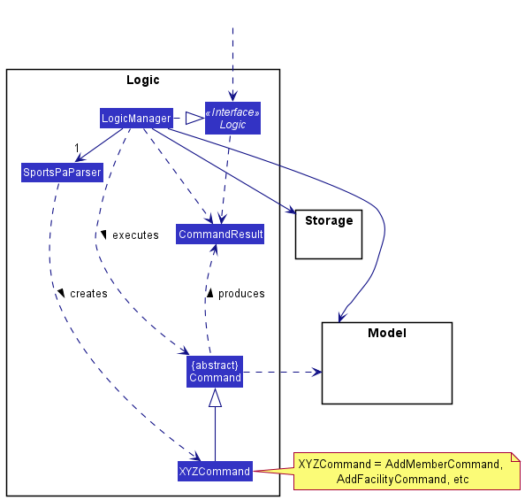
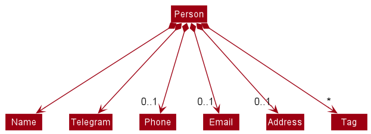
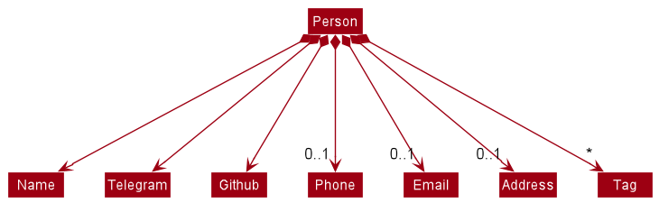
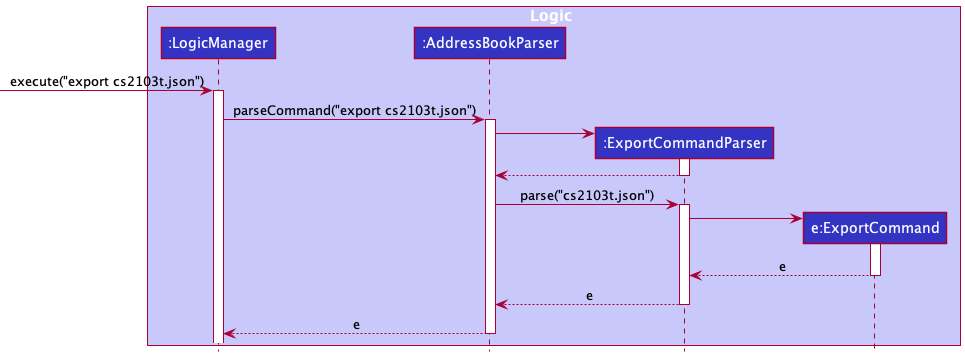
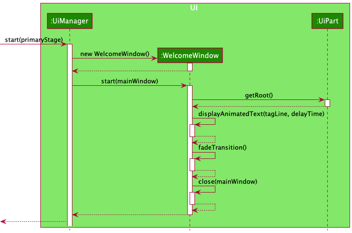
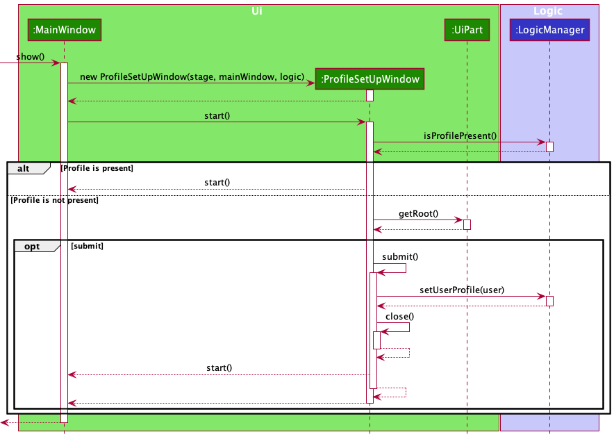

<div>

  <h1> CohortConnect v1.4 </h1>

  <b> Type. Explore. Connect. </b>
</div>

<br><br>

CohortConnect is an advanced desktop address book which facilitates networking among Computer Science (CS) students. It is optimized for use via a Command Line Interface (CLI) while still having the benefits of a Graphical User Interface (GUI).

With advanced features for managing large groups of contacts, CohortConnect is intended for use in a university setting. At the start of the semester, professors will distribute `csv` or `json` files containing a list of students. Instantly load them into CohortConnect with a single **Import** command. With data collected from students before the semester, our **Find A Buddy** feature helps you find potential groupmates by leveraging GitHub’s metadata using a proprietary algorithm. In the **Events** tab, you can identify events and hackathons that your peers will be attending.

--------------------------------------------------------------------------------------------------------------------

## Table of Contents

* Table of Contents
{:toc}

--------------------------------------------------------------------------------------------------------------------

## Purpose

This guide is intended for current or future developers working on features for CohortConnect, or developers who want to learn
more about how CohortConnect is built. It explains the requirements of CohortConnect, the implementation of each
individual component, as well as how they are pieced together to execute user commands.

--------------------------------------------------------------------------------------------------------------------

## Prerequisites

1. General knowledge of Java.
2. Object-Oriented Programming.
3. UML Notation.
4. Basic knowledge of `csv` and `json` file formats.
5. Basic knowledge of technical terms like `CLI`, `UI`, and `JAR`.
6. `Java 11` installed on the system.

--------------------------------------------------------------------------------------------------------------------

## Acknowledgements

* This project is based on the AddressBook-Level3 project created by the [SE-EDU initiative](https://se-education.org).
* This project uses [jackson-dataformat-csv](https://github.com/FasterXML/jackson-dataformats-text/tree/master/csv) for reading from and writing to CSV files.

--------------------------------------------------------------------------------------------------------------------

## Getting Started

Refer to our [Quick Start](https://ay2122s1-cs2103t-t10-1.github.io/tp/UserGuide.html#QuickStart) in our User Guide.

--------------------------------------------------------------------------------------------------------------------

## Design

<div markdown="span" class="alert alert-primary">

:bulb: **Tip:** The `.puml` files used to create diagrams in this document can be found in the [diagrams](https://github.com/se-edu/addressbook-level3/tree/master/docs/diagrams/) folder.
</div>

### Architecture


The ***Architecture Diagram*** given above explains the high-level design of the App.

Given below is a quick overview of main components and how they interact with each other.

**Main components of the architecture**

**`Main`** has two classes called [`Main`](https://github.com/se-edu/addressbook-level3/tree/master/src/main/java/seedu/address/Main.java) and [`MainApp`](https://github.com/se-edu/addressbook-level3/tree/master/src/main/java/seedu/address/MainApp.java). It is responsible for,
* At app launch: Initializes the components in the correct sequence, and connects them up with each other.
* At shut down: Shuts down the components and invokes cleanup methods where necessary.

[**`Commons`**](#common-classes) represents a collection of classes used by multiple other components.

The rest of the App consists of four components.

* [**`UI`**](#ui-component): The UI of the App.
* [**`Logic`**](#logic-component): The command executor.
* [**`Model`**](#model-component): Holds the data of the App in memory.
* [**`Storage`**](#storage-component): Reads data from, and writes data to, the hard disk.


**How the architecture components interact with each other**

The *Sequence Diagram* below shows how the components interact with each other for the scenario where the user issues the command `delete 1`.


Each of the four main components (also shown in the diagram above),

* defines its *API* in an `interface` with the same name as the Component.
* implements its functionality using a concrete `{Component Name}Manager` class (which follows the corresponding API `interface` mentioned in the previous point.

For example, the `Logic` component defines its API in the `Logic.java` interface and implements its functionality using the `LogicManager.java` class which follows the `Logic` interface. Other components interact with a given component through its interface rather than the concrete class (reason: to prevent outside component's being coupled to the implementation of a component), as illustrated in the (partial) class diagram below.


The sections below give more details of each component.

### UI component

The **API** of this component is specified in [`Ui.java`](https://github.com/se-edu/addressbook-level3/tree/master/src/main/java/seedu/address/ui/Ui.java)


The UI consists of a `MainWindow` that is made up of parts e.g.`CommandBox`, `ResultDisplay`, `PersonListPanel`, `StatusBarFooter` etc. All these, including the `MainWindow`, inherit from the abstract `UiPart` class which captures the commonalities between classes that represent parts of the visible GUI.

The `UI` component uses the JavaFx UI framework. The layout of these UI parts are defined in matching `.fxml` files that are in the `src/main/resources/view` folder. For example, the layout of the [`MainWindow`](https://github.com/se-edu/addressbook-level3/tree/master/src/main/java/seedu/address/ui/MainWindow.java) is specified in [`MainWindow.fxml`](https://github.com/se-edu/addressbook-level3/tree/master/src/main/resources/view/MainWindow.fxml)

The `UI` component,

* executes user commands using the `Logic` component.
* listens for changes to `Model` data so that the UI can be updated with the modified data.
* keeps a reference to the `Logic` component, because the `UI` relies on the `Logic` to execute commands.
* depends on some classes in the `Model` component, as it displays `Person` object residing in the `Model`.

### Logic component

**API** : [`Logic.java`](https://github.com/se-edu/addressbook-level3/tree/master/src/main/java/seedu/address/logic/Logic.java)

Here's a (partial) class diagram of the `Logic` component:



How the `Logic` component works:
1. When `Logic` is called upon to execute a command, it uses the `AddressBookParser` class to parse the user command.
1. This results in a `Command` object (more precisely, an object of one of its subclasses e.g., `AddCommand`) which is executed by the `LogicManager`.
1. The command can communicate with the `Model` when it is executed (e.g. to add a person).
1. The result of the command execution is encapsulated as a `CommandResult` object which is returned back from `Logic`.

The Sequence Diagram below illustrates the interactions within the `Logic` component for the `execute("delete 1")` API call.


<div markdown="span" class="alert alert-info">:information_source: **Note:** The lifeline for `DeleteCommandParser` should end at the destroy marker (X) but due to a limitation of PlantUML, the lifeline reaches the end of diagram.
</div>

Here are the other classes in `Logic` (omitted from the class diagram above) that are used for parsing a user command:


How the parsing works:
* When called upon to parse a user command, the `AddressBookParser` class creates an `XYZCommandParser` (`XYZ` is a placeholder for the specific command name e.g., `AddCommandParser`) which uses the other classes shown above to parse the user command and create a `XYZCommand` object (e.g., `AddCommand`) which the `AddressBookParser` returns back as a `Command` object.
* All `XYZCommandParser` classes (e.g., `AddCommandParser`, `DeleteCommandParser`, ...) inherit from the `Parser` interface so that they can be treated similarly where possible e.g, during testing.

### Model component
**API** : [`Model.java`](https://github.com/se-edu/addressbook-level3/tree/master/src/main/java/seedu/address/model/Model.java)


The `Model` component,

* stores the address book data i.e., all `Person` objects (which are contained in a `UniquePersonList` object).
* stores the currently 'selected' `Person` objects (e.g., results of a search query) as a separate _filtered_ list which is exposed to outsiders as an unmodifiable `ObservableList<Person>` that can be 'observed' e.g. the UI can be bound to this list so that the UI automatically updates when the data in the list change.
* stores a `UserPref` object that represents the user’s preferences. This is exposed to the outside as a `ReadOnlyUserPref` objects.
* does not depend on any of the other three components (as the `Model` represents data entities of the domain, they should make sense on their own without depending on other components)

<div markdown="span" class="alert alert-info">:information_source: **Note:** An alternative (arguably, a more OOP) model is given below. It has a `Tag` list in the `AddressBook`, which `Person` references. This allows `AddressBook` to only require one `Tag` object per unique tag, instead of each `Person` needing their own `Tag` objects.<br>


</div>


### Storage component

**API** : [`Storage.java`](https://github.com/se-edu/addressbook-level3/tree/master/src/main/java/seedu/address/storage/Storage.java)


The `Storage` component,
* can save both address book data and user preference data in json format, and read them back into corresponding objects.
* inherits from both `AddressBookStorage` and `UserPrefStorage`, which means it can be treated as either one (if only the functionality of only one is needed).
* depends on some classes in the `Model` component (because the `Storage` component's job is to save/retrieve objects that belong to the `Model`)

### Common classes

Classes used by multiple components are in the `seedu.addressbook.commons` package.

--------------------------------------------------------------------------------------------------------------------

## Implementation

This section describes noteworthy details on how certain features are implemented.

### Telegram

#### Implementation

The telegram handle field is facilitated by the `Telegram` class. It is stored internally as a `String` in the data file `addressbook.json` and is then initialized as a `Telegram` object. 

The `Telegram` class implements the following operation:

* `Telegram#isValidTelegram(String test)` — Returns true if a given string is a valid telegram handle.

Regex used in verifying the validity of telegram handle:

`public static final String VALIDATION_REGEX = "\\w{5,32}";`
* `\w` — **Word**. Any word character (alphanumeric & underscore)
* `{5,32}` — **Quantifier**. Match between 5 and 32 of the preceding token.

The `Telegram` class is first integrated into the `Person` class and added as a new field to the `Person` class. This is illustrated by the class diagram below, where every field, including the `Telegram` field, is compulsory except the `Tag` field.


### Optional Fields

#### Implementation

The `Phone`, `Email` and `Address` fields were modified such that these fields are no longer compulsory. The class diagram below illustrates the `Person` class after the addition of the `Telegram` field. The `Name` and `Telegram` fields are compulsory while the rest are optional.



In order to accomodate to the above mentioned new optional fields, the respective constructors were modified such that the following examples are considered valid inputs.

Example 1: Adding new contact without email and address.

```
add n/John Doe te/@johndoe123 p/98765432 
```

Example 2: Adding new contact without phone, email and address.

```
add n/John Doe te/@johndoe123
```

A more interesting input would be as such.

Example 3: Adding new contact without email and address but with empty phone input.

```
add n/John Doe te/@johndoe123 p/
```

In such a case, the constructors are modified such that the above input is also deemed as valid. The rationale behind this is that there is nothing for the `VALIDATION_REGEX` to verify, unlike in the following example.

Example 4: Adding new contact without email and address but with invalid phone input.

```
add n/John Doe te/@johndoe123 p/invalidPhoneNumber
```

For the case above, the respective constructors will carry out validation on the given input.

In order to allow for optional fields, the `AddCommandParser` also has to be modified. In particular, the following methods are modified
* `AddCommandParser#arePrefixesPresent(argumentMultimap, prefixes)`
* `AddCommandParser#parse(args)`

For the `arePrefixesPresent` method, the prefixes provided were changed to only include the following mandatory fields:
* `PREFIX_NAME`
* `PREFIX_TELEGRAM`

`AddCommandParser#arePrefixesPresent(argumentMultimap, prefixes)` uses the static parsing methods in `ParserUtil` to parse the different fields in `Person`. The individual fields are first initialised with an empty string, which is now a valid input. The method then calls the `arePrefixesPresent` method to check if the provided prefix is present. If present, the method will then call the respective static parsing methods in `ParserUtil`.

### GitHub

#### Implementation

The GitHub field is facilitated by the `Github` class. It is stored interally as a `String` in the data file `addressbook.json` and is then initialized as a `Github` object. 

The `Github` class implements the following operation:

* `Github#isValidGithub(String test)` — Returns true if a given string is a valid GitHub username.

Regex used in verifying the validity of GitHub username:

`public static final String VALIDATION_REGEX = "[a-zA-Z\d](?:[a-zA-Z\d]|-(?=[a-zA-Z\d])){0,38}";`
* `[a-zA-Z\d]` — **Character set**. Match any character in the set.
* `a-z` — **Range**. Matches a character in the range "a" to "z" (char code 97 to 122). Case sensitive.
* `A-Z` — **Range**. Matches a character in the range "A" to "Z" (char code 65 to 90). Case sensitive.
* `\d` — **Digit**. Matches any digit character (0-9).
* `(?:[a-zA-Z\d]|-(?=[a-zA-Z\d]))` — **Non-capturing group**. Groups multiple tokens together without creating a capture group.
* `|` — **Alternation**. Acts like a boolean OR. Matches the expression before or after the sign.
* `-` — **Character**. Matches a "-" character (char code 45).
* `{0,38}` — **Quantifier**. Match between 0 and 38 of the preceding token.

The `Github` class is first integrated into the `Person` class and added as a new field to the `Person` class. This is illustrated by the class diagram below, where only the `Name`, `Telegram` and `Github` fields are compulsory.



### Export command

#### Implementation

The Export command exports the current list of contacts to the specified JSON or CSV file, with help from [Jackson](https://github.com/FasterXML/jackson), an external library. It does not overwrite existing files.

Executing an Export Command can be summarized with the following steps:
1. User command is handed over to `ExportCommandParser`. After verification of arguments, an ExportCommand is generated.
2. Upon executing the `ExportCommand`, one of the 2 methods are called, depending on the file type specified.
   * `ImportCommand#exportAddressBookToJson(ReadOnlyAddressBook)`
   * `ImportCommand#exportAddressBookToCsv(ReadOnlyAddressBook)`

Firstly, the user command is handed over to `ExportCommandParser`. `ExportCommandParser` implements `Parser<ExportCommand>`. It implements the `parse()` method, which parses the user's command and returns an `ExportCommand` with the filename. In `parse()`, it verifies 3 requirements:
* Arguments are not empty
* Not more than 1 argument
* Filename provided is a .csv or .json file

The Sequence Diagram below illustrates the interactions within the `Logic` component during the first step of executing `execute("export cs2103t.json")`.



Next, The `ExportCommand` is then executed in `LogicManager`. The `ExportCommand` class extends `Command`. It stores the filename as a class variable and its implementation of `Command#execute()`. Here, the filename is checked again to verify that it is a .csv or .json file. The current address book is obtained by `Model#getAddressBook()`. Then, depending on the file type, one of the following methods are called:

1. `exportAddressBookToJson(ReadOnlyAddressBook)`

   A temporary instance of `JsonAddressBookStorage` is created by passing in the filename, and `saveAddressBook(ReadOnlyAddressBook)` saves the current address book to the specified file.
    ```
   temporaryStorage.saveAddressBook(currentAddressBook, filePath, true);
   ```
   <div markdown="span" class="alert alert-primary">
    :bulb: **Note:** The third argument `true` indicates that `saveAddressBook(ReadOnlyAddressBook)` is triggered by an export command. This distinction is necessary as default saving of contact data to the address book is performed with the same method, but requires overwriting of the storage file, whereas the export command does not overwrite files.
    </div>

   In the Storage component, utility classes are used to check, create and write to the JSON file.
    1. `FileUtil#isFileExists(Path)` checks if there exists a file with the specified name. If there is, a `FileAlreadyExistsException` is thrown.
    2. `FileUtil#createIfMissing(Path)` creates the JSON file.
    3. The current `ReadOnlyAddressBook` is used to instantiate a new `JsonSerializableAddressBook`, a JSON-friendly equivalent of `ReadOnlyAddressBook` containing Jackson annotations. It stores a list of `JsonAdaptedPerson` instead of `Person`, which is also JSON-friendly.
    4. `JsonUtil#saveJsonFile(T, Path)` serializes the address book and writes to the file, using `ObjectMapper`, a Jackson class.
    ```
    /**
     * Converts a given instance of a class into its JSON data string representation.
     *
     * @param instance The T object to be converted into the JSON string
     * @param <T> The generic type to create an instance of
     * @return JSON data representation of the given class instance, in string
     */
    public static <T> String toJsonString(T instance) throws JsonProcessingException {
        return objectMapper.writerWithDefaultPrettyPrinter().writeValueAsString(instance);
    }
    ```

2. `exportAddressBookToCsv(ReadOnlyAddressBook)`

   A temporary instance of `CsvAddressBookStorage` is created by passing in the filename, and `saveAddressBook(ReadOnlyAddressBook)` saves the current address book to the specified file.
    ```
   temporaryStorage.saveAddressBook(currentAddressBook, filePath);
   ```
   In the Storage component, utility classes are used to check, create and write to the JSON file.
    1. `FileUtil#isFileExists(Path)` checks if there exists a file with the specified name. If there is, a `FileAlreadyExistsException` is thrown.
    2. `FileUtil#createIfMissing(Path)` creates the CSV file.
    3. The current `ReadOnlyAddressBook` is used to instantiate a new `CsvSerializableAddressBook`, a CSV-friendly equivalent of `ReadOnlyAddressBook` containing Jackson annotations. It stores a list of `CsvAdaptedPerson` instead of `Person`, which is also CSV-friendly.
    4. `CsvUtil#saveCsvFile(T, Path)` serializes the address book and writes to the file, using `CsvMapper`, a Jackson class.


The Sequence Diagram below illustrates the interactions during the second step of executing `execute("export cs2103t.json")`.


### Import command

The Import command imports contacts from a JSON or CSV file and adds them to the current contact list, with help from [Jackson](https://github.com/FasterXML/jackson), an external library. Import does not remove existing contacts, and ignores duplicate contacts.

Executing an Import command can be summarized with the following steps:
1. Similar to Export, the first step is parsing the user command, which is done in `ImportCommandParser`. After verification, an `ImportCommand` is generated.
2. Upon executing the `ImportCommand`, one of the 2 methods are called to obtain a `List<Person>` from the specified file.
   * `ImportCommand#getImportedPersonsFromJson()`
   * `ImportCommand#getImportedPersonsFromCsv()`
3. By iterating through the list, each person is added to the current contact list in `Model`, skipping duplicates.
4. Command Result with success message is returned.

The sequence diagram for the first step is similar to the Export Command. The following sequence diagram illustrates the execution of an import command from part 2 onwards.


#### Reading JSON / CSV file

In both scenarios, a new `JsonAddressBookStorage` or `CsvAddressBookStorage` is created. The `AddressBookStorage` method `readAddressBook()` then reads the respective file using `JsonUtil#readJsonFile()` or `CsvUtil#readCsvFile()`. In both cases, the files are read using Jackson's `ObjectMapper` or `CsvMapper` classes respectively.


### Find command

#### Implementation

The Find command accepts names, tags, Telegram handles or GitHub usernames as parameters with the following prefixes :
* no prefix : for names
* `t/` : for tags
* `te/` : for Telegram handles
* `g/` : for GitHub usernames

and allows users to search for contacts based on the specified criterion.
It is facilitated by the `FindCommandParser` class, which implements `Parser<FindCommand>`.
It implements the `parse()` method, which parses the find parameter (eg: name, tag, etc) and returns a `FindCommand`, to be executed in
`LogicManager`.

The `FindCommand` class extends `Command`. Its instance is created by providing a predicate (condition to be fulfilled by the elements of 
the `FilteredPersonList` that contains the contact(s) matching the find parameters). Its implementation of
`Command#execute()` is where the updation of the `FilteredPersonList` to reflect the search performed on the contacts in the address book.

The Sequence Diagram below illustrates the interactions within the `Logic` and `Model` components for
the `execute("find te/alex_1")` API call.


### Welcome Window

#### Implementation

The class `WelcomeWindow` is responsible for displaying the welcome window at the
start when the application is launched. It is facilitated by the `WelcomeWindow.fxml` file, which is
responsible for how various components inside this window are arranged.

The `WelcomeWindow` class extends `UiPart<Stage>`.

When the app is launched, an instance of this class is created, and the
`WelcomeWindow#start` is invoked to display the window. Various methods, including 
`fadeTransition` and `displayAnimatedText`, are used within this
class to achieve the fading image and character typing effect, respectively.



### Profile SetUp Window

#### Implementation

The class `ProfileSetUpWindow` is responsible for displaying the Profile SetUp Window. 
It is only shown once when the User launches the app for the first time and has input 
their credentials as required. It is facilitated by `ProfileSetUpWindow.fxml` and 
`ProfileSetUpWindow.css`. The `.fxml` file is responsible for the layout of the 
various components in this window, and the `.css` file adds a style and enhances 
the overall UI.

The `ProfileSetUpWindow` class extends `UiPart<Stage>`.

This window would only be visible after the Welcome Window Splash Screen. 
`WelcomeWindow` hands over the control to `MainWindow` after execution, which 
then sets up the `ProfileSetUpWindow`. On Initializing and calling `start()` 
method of the `ProfileSetUpWindow`, the `ProfileSetUpWindow` with the help of 
a `Logic` object (which is obtained during initialization) checks, if a 
User Profile is present. If it is present, it 
again hands over the control to the `MainWindow` by calling the `start()` method 
of the `MainWindow` Object. Else, It displays the Profile SetUp Window and 
waits for a response from the User.

After the User has input their credentials in the text fields, they are expected to 
click the `Submit` button. When that button is clicked upon, the `submit()` method is 
invoked. This method calls the `areUserCredentialsValid()` method to verify if the
entered credentials are valid or not. If they are valid, the User Profile is deemed 
complete and is set up with the help of the `Logic` object obtained during
the object's initialization. If the credentials are not valid, an error message
is shown in the Window, highlighting which credential is invalid. The User cannot proceed
forward without entering all valid Credentials.

The `areUserCredentialsValid()` class checks if the entered Name, Telegram Handle,
and the GitHub Username are valid. 

1. Class level method `isValidName()`, of `Name` class 
   verifies the Name entered.
2. Class level method `isValidTelegram()`, of `Telegram` class
   verifies the Telegram Handle entered.
3. Class level method `isValidGithub()`, of `Github` class
   verifies the GitHub Username entered.

This method is also responsible for displaying the appropriate error message
in the Window.



### User Profile Window

#### Implementation

The class `UserProfileWindow` is responsible for displaying the User Profile
Window. It is shown when the user either uses the keyboard shortcut, 
`Command/Control + P`, or clicks on the User Profile located in the top right in
the Menu Bar. It is facilitated by `UserProfileWindow.fxml`
and `UserProfileWindow.css`. The `.fxml` file is responsible for the layout of the
various components in this window, and the `.css` file adds a style and enhances the
overall UI.

The `UserProfileWindow` class extends `UiPart<Stage>`.

This window can only be viewed when the app has successfully started up and 
has valid User Credentials.

This window is initialized when the `MainWindow` is initialized. It is
initialized in the `MainWindow` constructor. This window, to be seen, has to be 
triggered as an event by the user. The `MainWindow` class has a method 
`handleUserProfileWindow()`, which is responsible for displaying this window.

The `handleUserProfileWindow()` when called, calls the method `isShowing()` via 
the object initialized earlier. If it is not showing, the `show()` method of the
`UserProfileWindow` class is called upon. Else, if it is already showing, the
`focus()` method is called upon. Along with that, in case the window had been
minimized by the User, `UserProfileWindow#getRoot()#toFront()` is called to
bring the window to the maximized state.

The `UserProfileWindow#show()`, first calls the `UserProfileWindow#initializeFields()`,
to initialize all the fields with the latest User Profile Credentials. This would, in turn
also call `UserProfileWindow#setFields()`, to set them up in the UI. After all the setting
up is done, the User Profile Window is shown.

The `UserProfileWindow#focus()`, calls the `getRoot()` method to obtain the root object.
On that root object, `requestFocus()` is called upon to request focus.


### Help Window

#### Implementation

The class `HelpWindow` is responsible for displaying the Help
Window. It is shown when the user either uses the keyboard shortcut,
`F1`, or clicks on `Help` located on the top left in
the Menu Bar. It is facilitated by `HelpWindow.fxml`
and `HelpWindow.css`. The `.fxml` file is responsible for the layout of the
various components in this window, and the `.css` file adds a style and enhances the
overall UI.

The `HelpWindow` class extends `UiPart<Stage>`.

This window can only be viewed when the app has successfully started up and 
has valid User Credentials.

This window is initialized when the `MainWindow` is initialized. It is
initialized in the `MainWindow` constructor. This window, to be seen, has to be
triggered as an event by the user. The `MainWindow` class has a method
`handleHelpWindow()`, which is responsible for displaying this window.

On initializing the `HelpWindow` class, `HelpWindow#setUpCommandDetails()` and
`HelpWindow#setUpHelpTableView()` are called.

`setUpCommandDetails()` creates multiple objects of `CommandDetails`, all of them
representing a unique command that the app supports. Those are then added to an
`ObservableList<CommandDetails>`, which is linked to the `TableView` in the UI.

`setUpHelpTableView()` sets and places various restrictions on the table.
It restricts any events or scrolling on the table. Also, It adjusts the height
of the table according to the number of `CommandDetails` present in it.

The `handleHelpWindow()` when called, calls the method `isShowing()` via
the object initialized earlier. If it is not showing, the `show()` method of the
`HelpWindow` class is called upon. Else, if it is already showing, the
`focus()` method is called upon. Along with that, in case the window had been
minimized by the User, `HelpWindow#getRoot()#toFront()` is called to
bring the window to the maximized state.


### User Profile in Menu Bar

#### Implementation

The class `UserProfileInMenuBar` is responsible for displaying the User
Profile in the Menu Bar. It is shown in the Main Window, in the top right
of the Menu Bar beside the Bell icon. It is facilitated by `UserProfileInMenuBar.fxml`.
The `.fxml` file is responsible for the layout of the various components inside
this Region.

The `UserProfileInMenuBar` class extends `UiPart<Region>` and implements
`UserProfileWatcher`.

This Region can only be viewed when the app has successfully started up and
has valid User Credentials.

This Region is initialized when the `MainWindow#start()` is called. On 
initializing the `UserProfileInMenuBar` class, `UserProfileInMenuBar#setUserProfileOnMenuBar()` 
and `UserProfileInMenuBar#addToUserProfileWatcherList()` are called.

`setUserProfileOnMenuBar()` is responsible for retrieving the User Credentials with
the help of the `Logic` object obtained during initialization and setting up the 
`ImageView` and `Label` with the User Credentials retrieved.

`addToUserProfileWatcherList()` is responsible for adding `this` (UserProfileWatcher)
to a watchers list, such that, in the scenario, the User updates their profile
credentials, the changes are reflected immediately. As the User is able to 
edit their Credentials via the `EditCommand`, the profile watchers list is present there.
A static method in `EditCommand`, `addUserProfileWatcher(this)` is called upon, by
passing `this` (UserProfileWatcher) as an argument, to add it to the profile watchers list.

Whenever there is a change in the User Credentials, the `updateUserProfile()` is
called upon in the `UserProfileInMenuBar`, which in turn calls the 
`setUserProfileOnMenuBar()`. This method then retrieves the new User Credentials
and sets them up.


### Show command

#### Implementation

The Show command accepts the index in list or name of a contact as a parameter, and shows all the details of the contact to the
Person Details Pane on the right-hand side of the screen. It is facilitated by the `ShowCommandParser` class, which implements `Parser<ShowCommand>`.
It implements the `parse()` method, which parses the index/name and returns a `ShowCommand`, to be executed in
`LogicManager`.

The `ShowCommand` class extends `Command`. It stores the index/name as a class variable and its implementation of
`Command#execute()` calls `Command#executeWithIndex()` or `Command#executeWithName()` based on whether parameter is index or name.

#### Implementation of `Command#executeWithIndex()`

This is called if the parameter is a parsable Integer. 
The method calls `model.setSelectedIndex(index)` which displays the details of the contact on the Details Pane.


The Sequence Diagram below illustrates the interactions within the `Logic`, `Model` and `UI` components for
the `execute("show 5")` API call.


#### Implementation of `Command#executeWithName()`

This is called if the parameter is **NOT** a parsable Integer.
The method calls `model.setSelectedIndex(index)` with index gotten from the `filteredList` which displays the details of the contact on the Details Pane.
If there are multiple contacts with names that contain the parameter keyword then a list of such persons are shown.
If there is no contact with name that contain the parameter keyword in the `filteredList`, then the entire addressbook is searched.


The Sequence Diagram below illustrates the interactions within the `Logic`, `Model` and `UI` components for
the `execute("show alex")` API call.


--------------------------------------------------------------------------------------------------------------------

## Documentation, logging, testing, configuration, dev-ops

* [Documentation guide](Documentation.md)
* [Testing guide](Testing.md)
* [Logging guide](Logging.md)
* [Configuration guide](Configuration.md)
* [DevOps guide](DevOps.md)

--------------------------------------------------------------------------------------------------------------------

## Appendix: Requirements

### Product scope

**Target user profile**:

* Students, Professors and Teaching Assistants
* has a need to manage a significant number of contacts
* prefer desktop apps over other types
* can type fast
* prefers typing to mouse interactions
* is reasonably comfortable using CLI apps

**Value proposition**: Helps to improve connectivity among students and teaching staff


### User stories

Priorities: High (must have) - `* * *`, Medium (nice to have) - `* *`, Low (unlikely to have) - `*`

| Priority | As a …​                                    | I want to …​                     | So that I can…​                                             |
| -------- | ------------------------------------------ | ------------------------------ | ---------------------------------------------------------------------- |
| `* * *`  | user                                       | delete contacts                | make sure that the address book remains relevant and up to date        |
| `* * *`  | user                                       | edit individual contacts       | update any of the fields when necessary                                |
| `* * *`  | user                                       | add individual contacts        | reach out to them later                                                |
| `* *`    | user                                       | search for contact(s) by tag(s)| contact them based on their grouping                                   |
| `* *`    | user                                       | search for contact(s) by Telegram handles(s)| contact them conveniently                                 |
| `* *`    | user                                       | search for contact(s) by GitHub username(s)| contact them conveniently                                 |
| `* * *`  | Prof                                       | be able to export a set of contacts | let other professors, TAs and students get a set of contacts quickly |
| `* * *`  | new user                                   | be able to import a set of contacts          | have some to begin with                                  |
| `* * *`  | new user                                   | have an introduction splash screen           | utilise the app and its feature well                     |
| `* * *`  | CLI user                                   | avoid using my mouse as much as possible     | -                                                        |
| `* * *`  | user                                       | group/tag people into teammates, classmates, TA's and Profs | easily manage my contacts                 |
| `* * *`  | user                                       | connect with seniors who have taken the same module         | have more guidance                        |
| `* * *`  | TA                                         | be able to get in touch with the students in my class through Telegram handles | -                          |
| `* * *`  | new user                                   | know all the different commands                             | fully utilise the tools available         |
| `* * *`  | new user                                   | learn the command formats                                   | perform tasks quickly and efficiently     |
| `* * *`  | new user                                   | save contacts                                               | contact these people in the future        |
| `* * *`  | user                                       | be able to store my contact omitting certain fields         | save contact without having to include email or address |
| `* *`    | user                                       | have a clean and uncluttered GUI                           | navigate easily between different functions in the application |
| `* *`    | user                                       | retrieve previous and next commands with up and down arrow key | browse my command history to retype misspelled commands |
| `* * *`  | CS student                                 | sync my data with GitHub account | identify my colleagues by their profiles and connect with other users |
| `* * *`  | CS student                                 | view the profiles of my contacts | learn more about them and connect with them |
| `* *`    | user                                       | navigate to a contact's Telegram or GitHub in a single click | easily contact and interact with them |

### Use cases

(For all use cases below, the **System** is the `CohortConnect` and the **Actor** is the `user`, unless specified otherwise)

**Use Case 1: Add user**

MSS

1. User enters command to add a contact.
2. CohortConnect shows a successfully added message.
3. CohortConnect shows the updated list of contacts.

Extensions

* 1a. The input command is invalid.
  * 1a1. CohortConnect shows an error message.
  * 1a2. CohortConnect requests for correct format.
  * 1a3. User enters new data.
  * 1a1-1a3 are repeated until the data entered are valid.
  * Use case resumes from step 2.

* 1b. User enters an existing name.
  * 1b1. CohortConnect prompts that name is already taken.
  * 1b2. CohortConnect requests for correct format.
  * 1b3. User enters new data.
  * Steps 1b1-1b3 are repeated until the data entered are valid.
  * Use case resumes from step 2.

**Use Case 2: Edit user**

MSS

1. User enters command to edit a contact.
2. CohortConnect shows a successfully edited message.
3. CohortConnect shows the updated list of contacts.

   Use case ends.

Extensions

* 1a. The given index is not present.
  * 1a1. CohortConnect shows an error message.
  * 1a2. CohortConnect requests for correct format.
  * 1a3. User enters new data.
  * Steps 1a1-1a3 are repeated until the data entered are valid.
  * Use case resumes from step 2.

**Use Case 3: Delete user**

MSS

1. User enters command to delete a contact.
2. CohortConnect shows a successfully deleted message.
3. CohortConnect shows the updated list of contacts.

   Use case ends.

Extensions
    
* 1a. The given index is not present.
  * 1a1. CohortConnect shows an error message.
  * 1a2. CohortConnect requests for correct format.
  * 1a3. User enters new data.
  * Steps 1a1-1a3 are repeated until the data entered are valid.
  * Use case resumes from step 2.
  
**Use Case 4: Find a contact using name**

MSS

1. User enters command to find a contact by name.
2. CohortConnect shows list of contacts with matching name.

   Use case ends.
        
Extensions

* 1a. The given name is not present.
  * 1a1. CohortConnect shows an error message.
  * Use case ends.

* 2a. The list is empty.
  * Use case ends.
    
**Use Case 5: Find a contact using tag**

MSS

1. User enters command to find a contact by tag.
2. CohortConnect shows list of contacts labelled with matching tag.
    
    Use case ends.

Extensions
    
* 1a. The given tag doesn't exist.
  * 1a1. CohortConnect shows an error message.
  * Use case ends.
        
* 2a. The list is empty.
  * Use case ends.


**Use Case 6: Show a person's details using Index**

MSS

1.  User requests to list persons.
2.  CohortConnect shows a list of persons.
3.  User requests to show details of person at a specific index in the list.
4.  CohortConnect shows a pop-up with the person's details.

    Use case ends.

Extensions

* 2a. The list is empty.
  * Use case ends.

* 3a. The given index is invalid.
  * 3a1. CohortConnect shows an error message.
  * Use case resumes at step 2.
    

**Use Case 7: Show a person's details using Name**

MSS

1.  User requests to list persons.
2.  CohortConnect shows a list of persons.
3.  User requests to show details of a specific person in the list.
4.  CohortConnect shows a pop-up with the person's details.
    
    Use case ends.

Extensions

* 2a. The list is empty.
  * Use case ends.

* 3a. The given name is not present.
  * 3a1. CohortConnect shows an error message.
  * Use case resumes at step 2.

* 3b. Multiple matching names.
  * 3b1. CohortConnect shows an error message.
  * 3b2. Displays list of users with the same name.
  * Use case resumes at step 2.

**Use Case 8: Import contacts from JSON file**

MSS

1. User enters command to import from a JSON file.
2. CohortConnect shows a list of persons to be imported.
3. User confirms the import.
4. CohortConnect shows the updated list of contacts.
   
   Use case ends.

Extensions

* 1a. CohortConnect cannot find the JSON file.
  * 1a1. CohortConnect shows an error message.
  * 1a2. CohortConnect prompts for new filename.
  * 1a3. User enters new filename.
  * Steps 1a1-1a3 are repeated until the filename received is valid.

* 2a. User decides to cancel the import.
  * Use case ends.

**Use Case 9: Export contacts to JSON file**

MSS

1. User enters command to export contacts to a named JSON file.
2. CohortConnect shows a success message.
   
   Use case ends.

Extensions

* 1a. File name already exists.
  * 1a1. CohortConnect shows an error message.
  * 1a2. CohortConnect prompts for new filename.
  * 1a3. User enters new filename.
  * Steps 1a1-1a3 are repeated until the filename received is valid.

### Non-Functional Requirements

1. Should work on any _mainstream OS_ as long as it has Java `11` or above installed.
2. Should be able to hold up to 1000 persons without a noticeable sluggishness in performance for typical usage.
3. A user with above average typing speed for regular English text (i.e. not code, not system admin commands) should be able to accomplish most of the tasks faster using commands than using the mouse.
4. Data should be saved locally.
5. Product is not required to handle communication between users.


### Glossary

* **Mainstream OS**: Windows, Linux, Unix, OS-X
* **Private contact detail**: A contact detail that is not meant to be shared with others
* **Main Success Scenario (MSS)**: The most straightforward interaction for a given use case, which assumes that nothing goes wrong.
* **JSON**: JavaScript Object Notation, is a common file format which stores data in key-value pairs and arrays. 

--------------------------------------------------------------------------------------------------------------------

## Appendix: Instructions for manual testing

Given below are instructions to test the app manually.

<div markdown="span" class="alert alert-info">:information_source: **Note:** These instructions only provide a starting point for testers to work on;
testers are expected to do more *exploratory* testing.

</div>

### Launch and shutdown

1. Initial launch

   1. Download the jar file and copy into an empty folder

   1. Double-click the jar file Expected: Shows the GUI with a set of sample contacts. The window size may not be optimum.

1. Saving window preferences

   1. Resize the window to an optimum size. Move the window to a different location. Close the window.

   1. Re-launch the app by double-clicking the jar file.<br>
       Expected: The most recent window size and location is retained.


### Deleting a person

1. Deleting a person while all persons are being shown

   1. Prerequisites: List all persons using the `list` command. Multiple persons in the list.

   1. Test case: `delete 1`<br>
      Expected: First contact is deleted from the list. Details of the deleted contact shown in the status message. Timestamp in the status bar is updated.

   1. Test case: `delete 0`<br>
      Expected: No person is deleted. Error details shown in the status message. Status bar remains the same.

   1. Other incorrect delete commands to try: `delete`, `delete x`, `...` (where x is larger than the list size)<br>
      Expected: Similar to previous.


### Saving data

1. Dealing with missing/corrupted data files

   1. Navigate to and open `/data/addressbook.json` in a text editor.

   2. Delete one line of code from a Person object, such as `"tagged" : [ "friends" ]`

   3. Restart CohortConnect.

   4. CohortConnect will start with no contacts.

   5. An error message will be shown in the `ResultDisplay`, stating that the file is corrupted.
   

