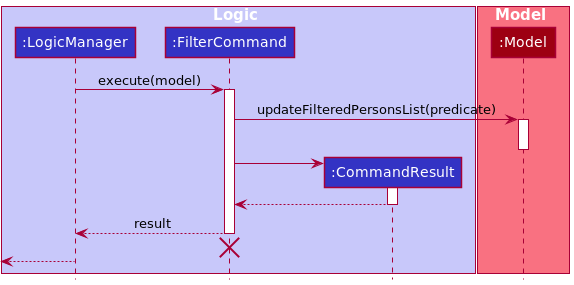
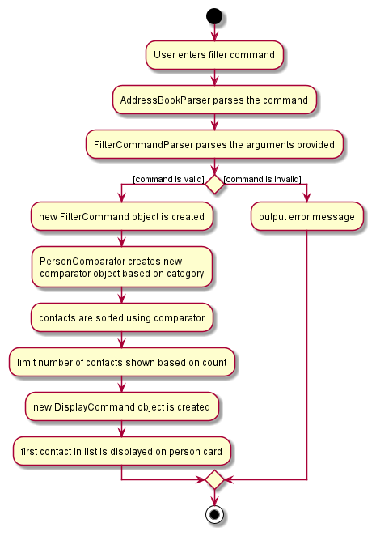
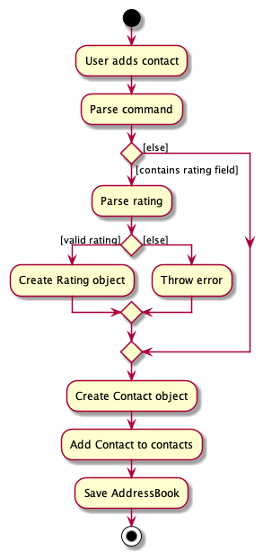
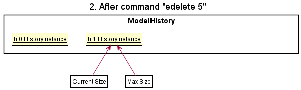

* Table of Contents
{:toc}

--------------------------------------------------------------------------------------------------------------------

## **Acknowledgements**

* This project is based on the AddressBook-Level3 project created by the [SE-EDU initiative](https://se-education.org).

--------------------------------------------------------------------------------------------------------------------

## **Setting up, getting started**

Refer to the guide [_Setting up and getting started_](SettingUp.md).

--------------------------------------------------------------------------------------------------------------------

## **Design**

:bulb: **Tip:** The `.puml` files used to create diagrams in this document can be found in the [diagrams](https://github.com/se-edu/addressbook-level3/tree/master/docs/diagrams/) folder. Refer to the [_PlantUML Tutorial_ at se-edu/guides](https://se-education.org/guides/tutorials/plantUml.html) to learn how to create and edit diagrams.

### Architecture

The ***Architecture Diagram*** given above explains the high-level design of the App.

Given below is a quick overview of main components and how they interact with each other.

**Main components of the architecture**

**`Main`** has two classes called [`Main`](https://github.com/se-edu/addressbook-level3/tree/master/src/main/java/seedu/address/Main.java) and [`MainApp`](https://github.com/se-edu/addressbook-level3/tree/master/src/main/java/seedu/address/MainApp.java). It is responsible for,
* At app launch: Initializes the components in the correct sequence, and connects them up with each other.
* At shut down: Shuts down the components and invokes cleanup methods where necessary.

[**`Commons`**](#common-classes) represents a collection of classes used by multiple other components.

The rest of the App consists of four components.

* [**`UI`**](#ui-component): The UI of the App.
* [**`Logic`**](#logic-component): The command executor.
* [**`Model`**](#model-component): Holds the data of the App in memory.
* [**`Storage`**](#storage-component): Reads data from, and writes data to, the hard disk.

**How the architecture components interact with each other**

The *Sequence Diagram* below shows how the components interact with each other for the scenario where the user issues the command `delete 1`.

Each of the four main components (also shown in the diagram above),

* defines its *API* in an `interface` with the same name as the Component.
* implements its functionality using a concrete `{Component Name}Manager` class (which follows the corresponding API `interface` mentioned in the previous point.

For example, the `Logic` component defines its API in the `Logic.java` interface and implements its functionality using the `LogicManager.java` class which follows the `Logic` interface. Other components interact with a given component through its interface rather than the concrete class (reason: to prevent outside component's being coupled to the implementation of a component), as illustrated in the (partial) class diagram below.

The sections below give more details of each component.

### UI component

The **API** of this component is specified in [`Ui.java`](https://github.com/se-edu/addressbook-level3/tree/master/src/main/java/seedu/address/ui/Ui.java)

The UI consists of a `MainWindow` that is made up of parts e.g.`CommandBox`, `ResultDisplay`, `ContactListPanel`, `StatusBarFooter` etc. All these, including the `MainWindow`, inherit from the abstract `UiPart` class which captures the commonalities between classes that represent parts of the visible GUI.

The `UI` component uses the JavaFx UI framework. The layout of these UI parts are defined in matching `.fxml` files that are in the `src/main/resources/view` folder. For example, the layout of the [`MainWindow`](https://github.com/se-edu/addressbook-level3/tree/master/src/main/java/seedu/address/ui/MainWindow.java) is specified in [`MainWindow.fxml`](https://github.com/se-edu/addressbook-level3/tree/master/src/main/resources/view/MainWindow.fxml)

The `UI` component,

* executes user commands using the `Logic` component.
* listens for changes to `Model` data so that the UI can be updated with the modified data.
* keeps a reference to the `Logic` component, because the `UI` relies on the `Logic` to execute commands.
* depends on some classes in the `Model` component, as it displays `Contact` object residing in the `Model`.

### Logic component

**API** : [`Logic.java`](https://github.com/se-edu/addressbook-level3/tree/master/src/main/java/seedu/address/logic/Logic.java)

Here's a (partial) class diagram of the `Logic` component:

How the `Logic` component works:
1. When `Logic` is called upon to execute a command, it uses the `AddressBookParser` class to parse the user command.
1. This results in a `Command` object (more precisely, an object of one of its subclasses e.g., `AddCommand`) which is executed by the `LogicManager`.
1. The command can communicate with the `Model` when it is executed (e.g. to add a contact).
1. The result of the command execution is encapsulated as a `CommandResult` object which is returned back from `Logic`.

The Sequence Diagram below illustrates the interactions within the `Logic` component for the `execute("delete 1")` API call.

:information_source: **Note:** The lifeline for `DeleteCommandParser` should end at the destroy marker (X) but due to a limitation of PlantUML, the lifeline reaches the end of diagram.

Here are the other classes in `Logic` (omitted from the class diagram above) that are used for parsing a user command:

How the parsing works:
* When called upon to parse a user command, the `AddressBookParser` class creates an `XYZCommandParser` (`XYZ` is a placeholder for the specific command name e.g., `AddCommandParser`) which uses the other classes shown above to parse the user command and create a `XYZCommand` object (e.g., `AddCommand`) which the `AddressBookParser` returns back as a `Command` object.
* All `XYZCommandParser` classes (e.g., `AddCommandParser`, `DeleteCommandParser`, ...) inherit from the `Parser` interface so that they can be treated similarly where possible e.g, during testing.

### Model component
**API** : [`Model.java`](https://github.com/se-edu/addressbook-level3/tree/master/src/main/java/seedu/address/model/Model.java)

The `Model` component,

* stores the address book data i.e., all `Contact` objects (which are contained in a `UniqueContactList` object).
* stores the currently 'selected' `Contact` objects (e.g., results of a search query) as a separate _filtered_ list which is exposed to outsiders as an unmodifiable `ObservableList<Contact>` that can be 'observed' e.g. the UI can be bound to this list so that the UI automatically updates when the data in the list change.
* stores a `UserPref` object that represents the user’s preferences. This is exposed to the outside as a `ReadOnlyUserPref` objects.
* does not depend on any of the other three components (as the `Model` represents data entities of the domain, they should make sense on their own without depending on other components)

:information_source: **Note:** An alternative (arguably, a more OOP) model is given below. It has a `Tag` list in the `AddressBook`, which `Contact` references. This allows `AddressBook` to only require one `Tag` object per unique tag, instead of each `Contact` needing their own `Tag` objects. 

### Storage component

**API** : [`Storage.java`](https://github.com/se-edu/addressbook-level3/tree/master/src/main/java/seedu/address/storage/Storage.java)

The `Storage` component,
* can save both address book data and user preference data in json format, and read them back into corresponding objects.
* inherits from both `AddressBookStorage` and `UserPrefStorage`, which means it can be treated as either one (if only the functionality of only one is needed).
* depends on some classes in the `Model` component (because the `Storage` component's job is to save/retrieve objects that belong to the `Model`)

### Common classes

Classes used by multiple components are in the `seedu.addressbook.commons` package.

--------------------------------------------------------------------------------------------------------------------

## **Implementation**

This section describes some noteworthy details on how certain features are implemented.
### Category feature

#### Implementation
The category feature adds to the attributes of the `Contact` object. Similar to the other fields of the `Contact` object,
it can be added and edited by calling the relevant `add` and `edit` commands by using `c/` prefix.

Additionally, it implements the following operations:
* `isValidCategory()`  — Determines if the input is a valid category
* `stringToCategory()`  — Converts the input into a constant

:information_source: **Note:** The category field is compulsory and requires
one of the available category codes (att, fnb, com, acc, tpt, oth). In the absence or invalidity of the category code,
the contact will not be saved and the user will be prompted to give a valid one.

Given below is an example usage scenario and how category mechanism behaves at each step

Step 1. The user executes the command `filter c/oth` to filter all "others" category contacts in the address book. And
gets a list of all contacts with the category "others".

Step 2. The user executes the command `edit 1 c/att` which changes the category of the 1st contact from "others" to
"attraction".

The following sequence diagram shows how modifying the category field with `edit` works:

The following activity diagram shows what happens when a user executes the `edit` command with category specified

####Design considerations:

**Aspect: How Category is called by the user:**

* **Alternative 1 (current choice):** Category field is added through `add` or `edit` commands.
  * Pros: Easy to implement
  * Cons: May cause `add` command to be too long

* **Alternative 2:** Exclusive command to add Category field
  * Pros: Reduces the chance of Feature Overload for `add` and `edit` commands
  * Cons: Reduces usability due to the need to remember another command

### Find feature

#### Implementation

The Find feature works such that it modifies the GUI of the application without modifying any contacts in the list.
It is implemented with the following operation:

* `FindCommand#execute()`  —  Obtains the contacts found to have the specified keyword(s).

The feature makes use of `FindableContainsKeywordsPredicate`, which represents a boolean-valued function that indicates whether there is any _findable_ property of the contacts that contains the keyword(s) given.
The operation `FindableContainsKeywordsPredicate#test` returns a boolean that indicates whether a specific contact has a _findable_ property that matches the keyword(s) provided by Tour Guide.

The aforementioned _findable_ properties of the contacts that are checked are as follows:

* name
* phone
* email
* address
* review

Given below is an example usage scenario and how the Find feature behaves at each step:

Step 1. The user executes the command `list` to look at all contacts.

Step 2. The user executes the command `find bay ...` to find contacts with properties that contain the keywords *bay*, ...
The `find` command calls `FindCommandParser#parse()`.

Step 3. If user command is in the correct format, a `FindCommand` is created with the list of keywords attached to a `FindableContainsKeywordPredicate`.
The `FindCommand` will then be executed. Otherwise, no command is executed and a `ParseException` is thrown.

The following sequence diagram shows how the Find operation works to show the relevant contacts:

The following activity diagram summarises what happens when a Tour Guide executes a new command:

#### Design considerations:

**Aspect: How Find functions:**

* **Alternative 1 (current choice):** Displays contacts with non-full word matches and searches five properties of a contact.
    * Pros: Shows more contacts as a result of half-matches and more fields.
    * Cons: Less targeted search, more time needed to go through the list of matches.

* **Alternative 2:** Displays contacts with full word matches and only searches the name.
    * Pros: More accurate matches assuming Tour Guide searches for exact keywords.
    * Cons: Less likely to find contacts other than the intended one(s) that might be relevant for a themed or location-based tour itinerary.

=======
### Filter feature

#### Proposed Implementation

The filter mechanism works by modifying the GUI of the application to display the contacts in that category without making any changes to the actual contacts stored. The filter implementation makes use of the following operations:

* `Model#updateFilteredContactList(Predicate p)` - iterates through the addressBook `ContactList`. If a `Contact` returns true, the `Contact` is added to the `filteredContacts` list.
* `IsInCategoryPredicate(Set<CategoryCode> categories)` - returns true if a contact’s `categoryCode` is in the Set

Given below is an example usage scenario of the filter mechanism.

Step 1. The user launched the application for the first time. The `filteredContact` List will be initialized with all contacts in the addressBook `UniqueContactList`.

Step 2. The user executes `filter c/att` command to filter all the attraction contacts in the address book. The `Parser` parses the user input and creates a `FilterCommand`.

Step 3. The filter command creates an `IsInCategoryPredicate` instance with the `ATT` CategoryCode and calls `Model#updateFilteredContactList()` with the predicate as an argument, causing the `filteredContact` List to be modified to contain only attraction contacts in the address book.

The following sequence diagram shows how the filter operation works:

The following activity diagram summarizes what happens when a user executes a new filter command:

#### Design considerations:

**Aspect: Functionality of Filter feature**

* **Alternative 1 (current choice):** Filters one or multiple categories.
    * Pros: More flexible usage as users can choose to enter one or more category codes.
    * Cons: May need to use a more complex data structure such as a `Set` to store the category codes entered by user.

* **Alternative 2:** Only handles filter by one category.
    * Pros: More targeted results.
    * Cons: Need to execute multiple filter commands to search for contacts in more than one category.

### Ratings feature

#### Implementation

The Ratings feature is implemented as an additional field in the `Contact` object. Similar to the other fields in the `Contact` object, the `rating` field is implemented with the following two operations:

* `AddCommand#execute()` —  Optionally initialises rating of contact added.
* `EditCommand#execute()` —  Optionally modifies rating of contact added.

:information_source: **Note:** The ratings field is not compulsory. If the `add` command is used without specifying a rating for the new contact, the contact will be 'unrated' and assigned a default value of 0. Similarly, when a contact's rating is cleared using `edit` command, it is also assigned a default value of 0.

Given below is an example usage scenario and how the rating mechanism behaves at each step.

Step 1. The user launches the application. For each contact, the `ContactCard` object is constructed with rating as one of the fields.

Step 2. The user executes `add ... ra/3` to add a new contact. The `add` command calls `ParserUtil#ParseRating()`, creating a `Rating` object if a valid input rating is received.

Step 3. The user executes `edit 1 ... ra/5` to update the 1st contact's rating. The `edit` command calls `ParserUtil#ParseRating()`, creating a `Rating` object if a valid input rating is received.

:information_source: **Note:** If the input rating is invalid (i.e. a non-integer or outside of the range 1 to 5), the parsers use `Rating#isValidRating()` to check if this is the case. If so, it will return an error to the user rather than attempting to perform the modification on rating.

The following sequence diagram shows how ratings are modified using `add` command:

The following activity diagram summarizes what happens when a user executes an `add` command with rating specified:

#### Design considerations:

**Aspect: How user modifies rating field:**

* **Alternative 1 (current choice):** As a field written by `AddCommand` and `EditCommand`.
    * Pros: Easy to implement.
    * Cons: Rating a contact is less straightforward.
      Ratings do not stand out among another features.

* **Alternative 2:** As an individual command `RateCommand`.
    * Pros: Dedicated all-in-one feature for ratings, easy modification.
    * Cons: Duplicates functionality of `AddCommand` and `EditCommand`, not particularly essential.

### \[Proposed\] Undo/redo feature

#### Proposed Implementation

The proposed undo/redo mechanism is facilitated by `VersionedAddressBook`. It extends `AddressBook` with an undo/redo history, stored internally as an `addressBookStateList` and `currentStatePointer`. Additionally, it implements the following operations:

* `VersionedAddressBook#commit()` — Saves the current address book state in its history.
* `VersionedAddressBook#undo()` — Restores the previous address book state from its history.
* `VersionedAddressBook#redo()` — Restores a previously undone address book state from its history.

These operations are exposed in the `Model` interface as `Model#commitAddressBook()`, `Model#undoAddressBook()` and `Model#redoAddressBook()` respectively.

Given below is an example usage scenario and how the undo/redo mechanism behaves at each step.

Step 1. The user launches the application for the first time. The `VersionedAddressBook` will be initialized with the initial address book state, and the `currentStatePointer` pointing to that single address book state.

Step 2. The user executes `delete 5` command to delete the 5th contact in the address book. The `delete` command calls `Model#commitAddressBook()`, causing the modified state of the address book after the `delete 5` command executes to be saved in the `addressBookStateList`, and the `currentStatePointer` is shifted to the newly inserted address book state.

Step 3. The user executes `add n/David …​` to add a new contact. The `add` command also calls `Model#commitAddressBook()`, causing another modified address book state to be saved into the `addressBookStateList`.

:information_source: **Note:** If a command fails its execution, it will not call `Model#commitAddressBook()`, so the address book state will not be saved into the `addressBookStateList`.

Step 4. The user now decides that adding the contact was a mistake, and decides to undo that action by executing the `undo` command. The `undo` command will call `Model#undoAddressBook()`, which will shift the `currentStatePointer` once to the left, pointing it to the previous address book state, and restores the address book to that state.

:information_source: **Note:** If the `currentStatePointer` is at index 0, pointing to the initial AddressBook state, then there are no previous AddressBook states to restore. The `undo` command uses `Model#canUndoAddressBook()` to check if this is the case. If so, it will return an error to the user rather
than attempting to perform the undo.

The following sequence diagram shows how the undo operation works:

:information_source: **Note:** The lifeline for `UndoCommand` should end at the destroy marker (X) but due to a limitation of PlantUML, the lifeline reaches the end of diagram.

The `redo` command does the opposite — it calls `Model#redoAddressBook()`, which shifts the `currentStatePointer` once to the right, pointing to the previously undone state, and restores the address book to that state.

:information_source: **Note:** If the `currentStatePointer` is at index `addressBookStateList.size() - 1`, pointing to the latest address book state, then there are no undone AddressBook states to restore. The `redo` command uses `Model#canRedoAddressBook()` to check if this is the case. If so, it will return an error to the user rather than attempting to perform the redo.

Step 5. The user then decides to execute the command `list`. Commands that do not modify the address book, such as `list`, will usually not call `Model#commitAddressBook()`, `Model#undoAddressBook()` or `Model#redoAddressBook()`. Thus, the `addressBookStateList` remains unchanged.

Step 6. The user executes `clear`, which calls `Model#commitAddressBook()`. Since the `currentStatePointer` is not pointing at the end of the `addressBookStateList`, all address book states after the `currentStatePointer` will be purged. Reason: It no longer makes sense to redo the `add n/David …​` command. This is the behavior that most modern desktop applications follow.

The following activity diagram summarizes what happens when a user executes a new command:

#### Design considerations:

**Aspect: How undo & redo executes:**

* **Alternative 1 (current choice):** Saves the entire address book.
  * Pros: Easy to implement.
  * Cons: May have performance issues in terms of memory usage.

* **Alternative 2:** Individual command knows how to undo/redo by
  itself.
  * Pros: Will use less memory (e.g. for `delete`, just save the contact being deleted).
  * Cons: We must ensure that the implementation of each individual command are correct.

_{more aspects and alternatives to be added}_

### Review Feature

#### Implementation

The review feature builds upon the `Contact` class by adding more functionality to the class. It utilises the `rv/` tag in the `add` command to add a review stored internally as a `Review` object.
It implements the following operations:
* `isValidReview()`  — Determines if the input value is valid.
* `isEmptyReview()`  — Determines if the stored Review is empty (stored as `-No Review-` String).

In addition, numerous classes had to be updated to accommodate the Review feature:
* `AddCommandParser` to parse the new `rv/` tag.
* `ParserUtil` to parse the Review content.
* `EditCommand` and `EditCommandParser` to enable editing of Reviews.

The following sequence diagram gives the overview of the add command with a review:

The following activity diagram shows how the review operation works:

Given below is an example usage scenario of adding a Review:

Step 1. The user adds a new Review using the `add` command e.g. `add n/test e/test@gmail.com p/12344321 a/test c/att rv/test review`

Step 2. The user can click on the contact on the GUI to expand it and display the full review

#### Design considerations:

**Aspect: How Review is called by the user:**

* **Alternative 1 (current choice):** Adds a review through the `add` command.
    * Pros: Easier to implement.
    * Cons: Add command can become very lengthy.

* **Alternative 2:** Separate command for review
    * Pros: Increases modularity by making review an entirely new command.
    * Cons: Too many commands which may confuse the User.
### Summary Feature

#### Implementation

The `Summary` class summarises the contents of the entire `AddressBook`. It utilises the `AddressBook` class to
obtain a read-only copy of `AddressBook` to summarise the data within. It implements the following operations:
* `setNumberOfContacts`  — Calculates and sets the number of contacts in the addressbook.
* `setPercentageReviews()`  — Calculates and sets the percentage of contacts that have a review.
* `setNumberCategory`  — Calculates and sets the number of contacts in each category defined by `CatergoryCode`.

Additionally, `Summary` will communicate with `UI` to display the summarised results

The following sequence diagram gives an overview of how `Summary` works:

#### Design considerations:

**Aspect: How Summary summarises data from the internal AddressBook:**

* **Alternative 1 (current choice):** Works on a Read-Only copy of `AddressBook`.
    * Pros: Easier to implement, guaranteed to not edit the internals.
    * Cons: Exposing internal workings of `AddressBook`.

* **Alternative 2:** Gets data directly from `Contact`, `Review` etc.
    * Pros: Data is kept directly with the low-level classes and pulled from there.
    * Cons: Extremely complex, especially after user adds, deletes or edits a contact.
--------------------------------------------------------------------------------------------------------------------

## **Documentation, logging, testing, configuration, dev-ops**

* [Documentation guide](Documentation.md)
* [Testing guide](Testing.md)
* [Logging guide](Logging.md)
* [Configuration guide](Configuration.md)
* [DevOps guide](DevOps.md)

--------------------------------------------------------------------------------------------------------------------

## **Appendix: Requirements**

### Product scope

**Target user profile**:

* tour guides in Singapore
* has a need to manage a significant number of contacts
* has a need to collate and access contacts
* prefer desktop apps over other types
* can type fast
* prefers typing to mouse interactions
* is reasonably comfortable using CLI apps

**Value proposition**: manage contacts faster than a typical mouse/GUI driven app and is able to find the necessary contact details quickly

### User stories

Priorities: High (must have) - `* * *`, Medium (nice to have) - `* *`, Low (unlikely to have) - `*`

| Priority | As a …​                                    | I want to …​                     | So that I can…​                                                        |
| -------- | ------------------------------------------ | ------------------------------ | ---------------------------------------------------------------------- |
|`**`|Tour Guide|Edit contact details|ensure that my contacts are up to date|
|`***`|Tour Guide|Add contacts to my list|build a list of all my contacts|
|`***`|Tour Guide|Add contact details such as address, phone number, and contact description to my list|store the relevant information of a contact in one place.|
|`***`|Tour Guide|Delete contacts from my list|remove irrelevant or unwanted details|
|`***`|Tour Guide|View all the contacts in my list |find contacts whose names I have forgotten|
|`*`|Tour Guide|Sort my contacts by name or by rating||
|`*`|Seasoned tour guide|Merge contacts |prevent duplicates or inaccurate information.|
|`*`|Forgetful|Retrieve recently viewed/most frequently used contacts|easily access certain contacts|
|`**`|Busy|Filter contacts|Retrieve relevant information based on a criteria|
|`***`|Organized|Label contacts with category|Access information more efficiently|
|`**`|Creative|Add customised tags to contacts|Describe contacts simply and make them easy to find|
|`***`|Busy |Search for a specific contact|View information about the contact|
|`**`|Objective|Rate contacts (1 to 5 stars?)|Refer to them during itinerary planning|
|`*`|Experienced|Add reviews to contacts|Recommend services based on reviews|
|`***`|Forgetful|Scroll through my list manually|Find contacts that I may have forgotten the names of|
|`***`|Visual|View my contacts on a GUI|Have a more user-friendly experience|
|`**`|New|Access a help page|Remind myself / learn how to use the app|
|`*`|Non tech-savvy|Easy search button|Search for information easily|
|`*`|Busy|See the overview of my current data upon start up|Quick summary of my data at a glance|
|`*`|Confused|Have sample data shown to me|Have a rough idea of what the app has to offer|
|`*`|Helpful|Share my data with other tour guides (through the .txt file?)|Hopefully receive more contacts from other guides|
|`*`|Tech-savvy|Transfer my contact information conveniently||

*{More to be added}*

### Use cases

(For all use cases below, the **System** is the `AddressBook` and the **Actor** is the `tour guide`, unless specified otherwise)

**UC01 - Add a Contact**

**MSS**

1.Tour Guide decides to add a contact

2.Tour Guide inputs the add command to the interface

3.AddressBook informs the Tour Guide that the contact was added

4.AddressBook displays updated list of contacts
Use case ends.

**Extensions**
* 2a. The format is wrong

    * 2a1. Address books show an error message

  Use case resumes at step 2.

* 2b.  Contact already exists in the AddressBook

    * 2b1. Address books show an error message

  Use case resumes at step 2

**UC02 - List All Contacts**

**MSS**

1.  Tour Guide requests to list all contacts
2.  AddressBook shows a list of contacts

    Use case ends.

**Extensions**

* 2a. The list is empty.

  Use case ends.

**UC03 - Delete a Contact**
***Preconditions: Tour Guide has <u>listed all contacts UC02</u>***

**MSS**

1.  Tour Guide requests to delete a specific contact in the list
2.  AddressBook deletes the contact

    Use case ends.

**Extensions**

* 2a. The given index is invalid.

    * 2a1. AddressBook shows an error message.

      Use case ends.

**UC04 - Find a Contact**

**MSS**

1.  Tour Guide requests to find a contact
2.  AddressBook displays a list of all contacts with the given keywords

    Use case ends.

**Extensions**

* 2a. The keyword cannot be found

  Use case ends.

* 2b. No keywords are provided

    * 2b1. AddressBook shows an error message

      Use case resumes at step 2.

*{More to be added}*

### Non-Functional Requirements

1.  Should work on any _mainstream OS_ as long as it has Java `11` or above installed.
2.  Should be able to hold up to 1000 contacts without a noticeable sluggishness in performance for typical usage.
3.  A user with above average typing speed for regular English text (i.e. not code, not system admin commands) should be able to accomplish most of the tasks faster using commands than using the mouse.
4.  The system should respond within a second.
5.  The system should not be able to connect to online services.
6.  The product will be offered as a free service to all.
7.  The source code should be open source.

*{More to be added}*

### Glossary

* **Mainstream OS**: Windows, Linux, Unix, OS-X
* **Private contact detail**: A contact detail that is not meant to be shared with others

--------------------------------------------------------------------------------------------------------------------

## **Appendix: Instructions for manual testing**

Given below are instructions to test the app manually.

:information_source: **Note:** These instructions only provide a starting point for testers to work on;
testers are expected to do more *exploratory* testing.

### Launch and shutdown

1. Initial launch

   1. Download the jar file and copy into an empty folder

   1. Double-click the jar file Expected: Shows the GUI with a set of sample contacts. The window size may not be optimum.

1. Saving window preferences

   1. Resize the window to an optimum size. Move the window to a different location. Close the window.

   1. Re-launch the app by double-clicking the jar file. 
       Expected: The most recent window size and location is retained.

1. _{ more test cases …​ }_

### Deleting a contact

1. Deleting a contact while all contacts are being shown

   1. Prerequisites: List all contacts using the `list` command. Multiple contacts in the list.

   1. Test case: `delete 1` 
      Expected: First contact is deleted from the list. Details of the deleted contact shown in the status message. Timestamp in the status bar is updated.

   1. Test case: `delete 0` 
      Expected: No contact is deleted. Error details shown in the status message. Status bar remains the same.

   1. Other incorrect delete commands to try: `delete`, `delete x`, `...` (where x is larger than the list size) 
      Expected: Similar to previous.

1. _{ more test cases …​ }_

### Saving data

1. Dealing with missing/corrupted data files

   1. _{explain how to simulate a missing/corrupted file, and the expected behavior}_

1. _{ more test cases …​ }_
