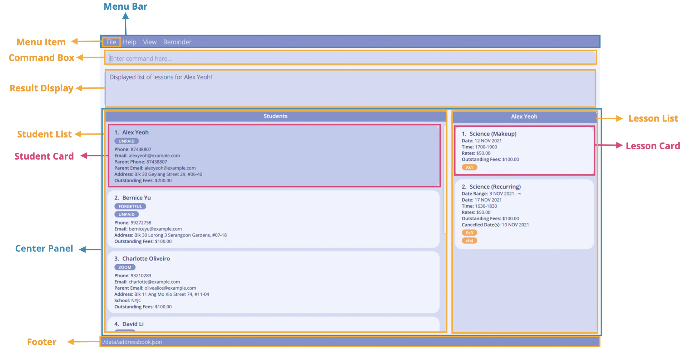
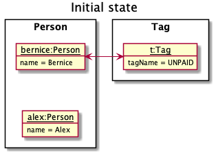
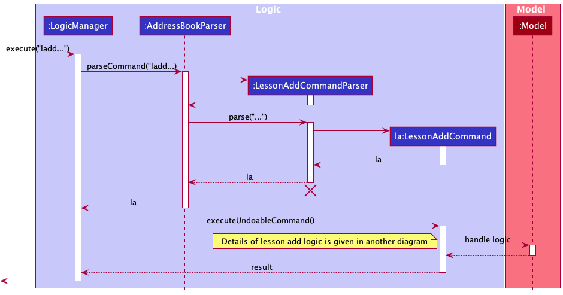
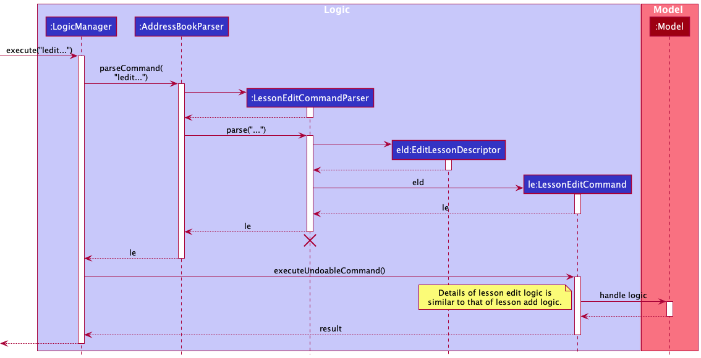
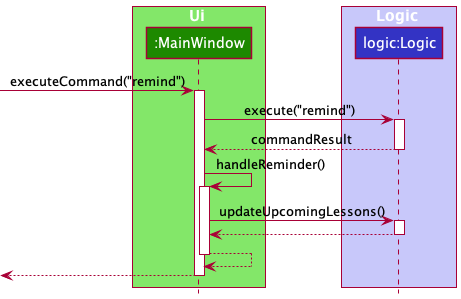
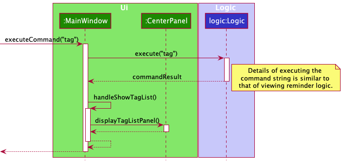
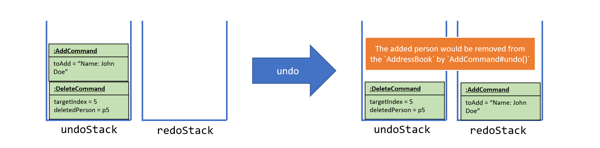
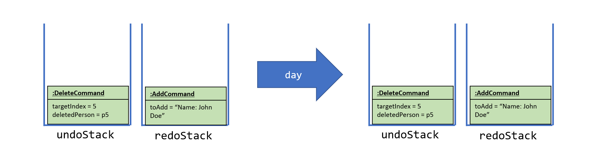
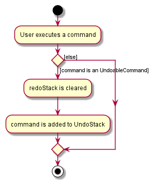
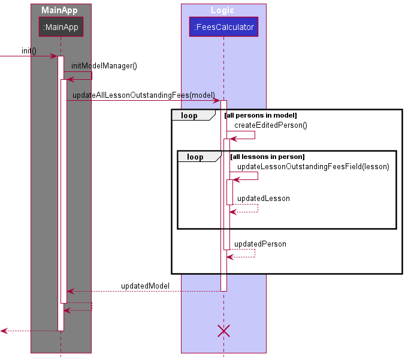

* Table of Contents
{:toc}

--------------------------------------------------------------------------------------------------------------------

## About This Guide

This guide is intended for any developers looking to contribute to TAB.
It aims to contain all the information required to help you quickly get started. 

In the [Table of Contents](#), each item listed is a link which you can click on to go directly to that section in the guide.

**Conventions Used**

Syntax | Meaning
--------|------------------
`text` | A command, or a code block
<kbd>text</kbd> | A keyboard input, or a button to be clicked on.
[text](#about-this-guide) | Links to other parts of the document, or links to be opened in the browser.
_text_ | A _technical_ word with definitions provided in the [Glossary](#appendix-b-glossary), or a caption for images.

 :information_source: 
 | Indication that the following text is a note, which is useful in helping you understand how TAB works.

--------------------------------------------------------------------------------------------------------------------

## **Acknowledgements**

List of sources of all reused/adapted ideas, code, documentation, and third-party libraries:

* This project is based on the AddressBook-Level3 project created by the [SE-EDU initiative](https://se-education.org).
* UndoRedoStack implementation referenced: [SE-EDU AddressBook 4](https://github.com/nus-cs2103-AY1718S2/addressbook-level4/blob/master/src/main/java/seedu/address/logic/UndoRedoStack.java).
* Libraries used: [CalendarFX](https://dlsc.com/products/calendarfx/), [Jackson](https://github.com/FasterXML/jackson), [JavaFX](https://openjfx.io/), [JUnit5](https://github.com/junit-team/junit5)
* The [`SchedulePanel#createTimeThread()`](https://github.com/AY2122S1-CS2103T-F13-3/tp/blob/master/src/main/java/seedu/address/ui/SchedulePanel.java#L114) method was reused with minimal changes from the CalendarFX [developer manual](http://dlsc.com/wp-content/html/calendarfx/manual.html#_quick_start).
* Initialising the `CalendarView` in the `[SchedulePanel](https://github.com/AY2122S1-CS2103T-F13-3/tp/blob/master/src/main/java/seedu/address/ui/SchedulePanel.java#L32)` was done with reference to the CalendarFX [_API_](https://dlsc.com/wp-content/html/calendarfx/apidocs/index.html).
* The [CenterPanel](https://github.com/AY2122S1-CS2103T-F13-3/tp/blob/master/src/main/java/seedu/address/ui/CenterPanel.java#L138) JavaFX solution was inspired by [this StackOverflow post](https://stackoverflow.com/questions/16176701/switch-between-panes-in-javafx#:~:text=Replace%20just%20a%20specific%20pane,of%20the%20stack's%20child%20list.).
* UG and DG Table cells with copy and paste and wrap-text functions reference: [Roland09](https://gist.github.com/Roland09/6fb31781a64d9cb62179#file-tableutils-java), [James_D](https://stackoverflow.com/questions/22732013/javafx-tablecolumn-text-wrapping).
* Detection of overlapping dates: [Ole V.V.](https://stackoverflow.com/questions/60785426/)

--------------------------------------------------------------------------------------------------------------------

## **Setting up, getting started**

Refer to the guide [_Setting up and getting started_](SettingUp.md).

--------------------------------------------------------------------------------------------------------------------

## **Design**

:bulb: **Note:** 
The `.puml` files used to create diagrams in this document can be found in the [diagrams](https://github.com/AY2122S1-CS2103T-F13-3/tp/tree/master/docs/diagrams) folder. 
You can refer to the [_PlantUML Tutorial_ at se-edu/guides](https://se-education.org/guides/tutorials/plantUml.html) to learn how to create and edit diagrams.

### Architecture

*Figure A.0.1: Architecture Diagram that explains high-level design of the App.*

Given below is a quick overview of the components and how they interact with each other.

**Key components of the architecture**

**`Main`** has two classes called [`Main`](https://github.com/se-edu/addressbook-level3/tree/master/src/main/java/seedu/address/Main.java) and [`MainApp`](https://github.com/se-edu/addressbook-level3/tree/master/src/main/java/seedu/address/MainApp.java). It is responsible for the following:
* At app launch: Initializes the components in the correct sequence, and connects them with each other.
* At shut down: Shuts down the components and invokes cleanup methods where necessary.

[**`Commons`**](https://github.com/AY2122S1-CS2103T-F13-3/tp/tree/master/src/main/java/seedu/address/commons) represents a collection of classes used by multiple other components. In particular, the `LogsCenter` class plays an important role in the high-level design of the App as it is used to write log messages to the App's log file, which will be helpful for tracing and debugging.

The rest of the App consists of four components.

* [**`Ui`**](#ui-component): Handles the _UI_ of the App.
* [**`Logic`**](#logic-component): Executes the user's commands.
* [**`Model`**](#model-component): Holds the data of the App in memory while the App is running.
* [**`Storage`**](#storage-component): Reads data from, and writes data to, the hard disk. Allows the user to save and load data.

**How the architecture components interact with each other**

The *Sequence Diagram* below is an example of how the components interact with each other for the scenario where the user issues the command `delete 1`.

*Figure A.0.2: Sequence Diagram of main components when executing Delete Command*

Each of the four main components (also shown in the diagram above)

* defines its *API* in an `interface` with the same name as the Component.
* implements its functionality using a concrete `{Component Name}Manager` class (which follows the corresponding API `interface` mentioned in the previous point).

For example, the `Logic` component defines its API in the `Logic.java` interface and implements its functionality using the `LogicManager.java` class which follows the `Logic` interface. Other components interact with a given component through its interface rather than the concrete class (reason: to prevent outside component's being coupled to the implementation of a component), as illustrated in the (partial) class diagram below.

*Figure A.0.3: Interaction of the Main Components*

The sections below give more details of each component.

### UI component

*Figure A.1.1: Graphical User Interface of TAB*

The *API* of this component is specified in the [`Ui.java`](https://github.com/AY2122S1-CS2103T-F13-3/tp/tree/master/src/main/java/seedu/address/ui/Ui.java) interface.

*Figure A.1.2: Class Diagram of GUI using JavaFX framework*

The `Ui` component uses the JavaFX framework and consists of a `MainWindow` that is made up of parts e.g.`CommandBox`, `ResultDisplay`, `CenterPanel`, `StatusBarFooter` etc. All these, including the `MainWindow`, inherit from the abstract `UiPart` class which captures the commonalities between classes that represent parts of the visible _GUI_.

The layout of these _UI_ parts are defined in matching `.fxml` files that are in the `src/main/resources/view` folder. For example, the layout of the [`MainWindow`](https://github.com/AY2122S1-CS2103T-F13-3/tp/blob/master/src/main/java/seedu/address/ui/MainWindow.java) is specified in [`MainWindow.fxml`](https://github.com/AY2122S1-CS2103T-F13-3/tp/blob/master/src/main/resources/view/MainWindow.fxml)

The `Ui` component

* executes user commands using the `Logic` component.
* listens for changes to `Model` data so that the _UI_ can be updated with the modified data.
* keeps a reference to the `Logic` component, as it relies on `Logic` to execute commands.
* depends on some classes in the `Model` component, as it displays `Person`, `Calendar` objects residing in the `Model`.
* chooses which component it displays based on the `CommandResult` returned by `Logic` component after executing the user command. 
  * e.g., if `CommandResult#getDisplayType()` is a `CommandResult.DisplayType.CALENDAR` enumerator, it tells the `Ui` to display the calendar view.

### Logic component

**API** : [`Logic.java`](https://github.com/AY2122S1-CS2103T-F13-3/tp/tree/master/src/main/java/seedu/address/logic/Logic.java)

Here's a (partial) *class diagram* of the `Logic` component:

*Figure A.2.1: Class Diagram of Logic Component* 

How the `Logic` component works:
1. When `Logic` is called upon to execute a command, it uses the `AddressBookParser` class to parse the user command.
2. This results in a `Command` object (more precisely, an object of one of its subclasses, e.g., `AddCommand`) which is then executed by the `LogicManager`.
3. The command can communicate with the `Model` when it is executed (e.g. to add a person).
4. The result of the command execution is encapsulated as a `CommandResult` object which is returned from `Logic`.

The _Sequence Diagram_ below illustrates the interactions within the `Logic` component for the `execute("delete 1")` _API_ call.

*Figure A.2.2: Sequence Diagram of execution Delete Command*

:information_source: Note: The lifeline for `DeleteCommandParser` should end at the destroy marker (X) but due to a limitation of PlantUML, the lifeline reaches the end of diagram.

Here are the other classes in `Logic` (omitted from the class diagram above) that are used for parsing a user command:

*Figure A.2.3: Class Diagram of Parser Component*

How the parsing works:
* When called upon to parse a user command, the `AddressBookParser` class creates an `XYZCommandParser` (`XYZ` is a placeholder for the specific command name e.g., `AddCommandParser`) which uses the other classes shown above to parse the user command and create a `XYZCommand` object (e.g., `AddCommand`) which the `AddressBookParser` returns back as a `Command` object.
* All `XYZCommandParser` classes (e.g., `AddCommandParser`, `DeleteCommandParser`, ...) inherit from the `Parser` interface so that they can be treated similarly where possible e.g, during testing.

### Model component

**API** : [`Model.java`](https://github.com/AY2122S1-CS2103T-F13-3/tp/tree/master/src/main/java/seedu/address/model/Model.java)

*Figure A.3.1: Class Diagram of Model Component*

The `Model` component

* stores the tuition address book data, i.e., all `Person`, calendar `Entry`, and `Tag` objects (which are contained in the `UniquePersonList`, `CalendarEntryList`, and `UniqueTagList` objects respectively).
* stores the currently 'filtered' `Person` objects (e.g., results of a search query) as a separate filtered list which is exposed to outsiders as an unmodifiable `ObservableList<Person>` that can be 'observed', e.g., the `Ui` component can be bound to this list so that it automatically updates when the data in the list change.
* stores a `UserPref` object that represents the user’s preferences. This is exposed to the outside as a `ReadOnlyUserPref` objects.
* stores a `LocalDateTime` object of the date and time the `AddressBook` was last updated.
* does not depend on any of the other three components (as the `Model` represents data entities of the domain, they should make sense on their own without depending on other components).

The _Sequence Diagram_ below illustrates the interactions when a person, p, is removed from the model.

*Figure A.3.2: Sequence Diagram of Deleting a Person from the Model*

Note that deleting a person in the tuition address book requires
1. removing that person from the `UniquePersonList`
2. removing all calendar `Entry`s related to that person from the `CalendarEntryList`
3. removing all `Tag`s related to that person from the `UniqueTagList`

Working together, the `UniquePersonList`, `CalendarEntrylist`, and `UniqueTagList` manage all of TAB's data.
**All three of these lists must be updated together, whenever a change is made to TAB's data.**

:information_source: **Note:** 
The `UniqueTagList` stores all existing distinct tags created, `Tag` objects with the same tag name may not have the same reference.
This means that each `Person` object still has its own `Tag` objects and the `Tag` is only added from the `Person` into `UniqueTagList` if an equivalent `Tag` (with the same tag name) does not exist in the tag list.
 
An alternative (arguably, a more OOP) model will have the `UniqueTagList` storing all `Tag` objects which `Person` references. 
This allows `AddressBook` to only require one `Tag` object per unique tag, instead of each `Person` needing their own `Tag` objects. 
e.g. Suppose `Bernice` was the only person tagged with `UNPAID`. Then the user adds the tag `UNPAID` to `Alex` as well, the state of the dependencies will be as shown in the Final State Diagram, instead of TAB creating another `Tag` named `UNPAID` for `Alex` as per current implementation.  
   

### Storage component

**API** : [`Storage.java`](https://github.com/AY2122S1-CS2103T-F13-3/tp/tree/master/src/main/java/seedu/address/storage/Storage.java)

*Figure A.4.1: Class Diagram of Storage Component*
 

The `Storage` component
* can save both address book data and user preference data in json format, and read them back into corresponding objects.
* inherits from both `AddressBookStorage` and `UserPrefStorage`, which means it can be treated as either one (if only the functionality of only one is needed).
* depends on some classes in the `Model` component (because the `Storage` component's job is to save/retrieve objects that belong to the `Model`).

### Common classes

Classes used by multiple components are in the `seedu.addressbook.commons` package.

--------------------------------------------------------------------------------------------------------------------

## **Implementation**

This section describes some noteworthy details on how certain features are implemented.

### Lesson management features

Weekly recurring or one-off (makeup) lessons are classified as `Lesson` objects. These lessons can be added to any particular
student in TAB. Added lessons can also be edited and deleted. 

A `Lesson` is represented in the application as shown in the figure below. It contains a start `Date`, an end `Date`, a `CancelledDates` set,  a `TimeRange` for the
`Lesson`, a `Subject`, a `LessonRates` and `Homework` fields. There are 2 types of `Lesson` – `RecurringLesson` and `MakeUpLesson`. `RecurringLesson`
represents a **weekly** recurring lesson. `MakeUpLesson` represents a one-off lesson outside the regular schedule. 

*Figure I.3.1: Class Diagram of Lessons* 

The model checks for clashing lessons to ensure that TAB does not contain any duplicate `Lesson` objects as well as `Lesson`
objects with overlapping time ranges.

Operations on lessons can be done using the `LessonAddCommand`, `LessonEditCommand` and `LessonDeleteCommand` commands.
The class diagram given below shows how these commands are part of the `Logic` Component. 

*Figure I.3.2: Class Diagram of Logic Component with Lesson implementation details* 

These commands are described in greater detail in the sections below.

#### Adding lessons
The `LessonAddCommand` adds a lesson to the list of lessons of a student in TAB. 

A simple illustration of how TAB might interact with the user for `LessonAddCommand` is shown below.

*Figure I.3.3.1: Activity diagram of `LessonAddCommand`* 

The lesson added will be displayed in the `LessonListPanel` in TAB. 

The figure below shows the sequence diagram for adding a lesson to a student.

*Figure I.3.3.2: Sequence Diagram of `LessonAddCommand`* 

*Figure I.3.3.3: Continued Sequence Diagram of `LessonAddCommand`* 

The `LessonAddCommand#executeUndoableCommand()` method updates the `Lesson` objects in the `Person` in the `UniquePersonList` 
by adding `toAdd` to the list of lessons the student currently has. Note that `toAdd` will not be added if there is an 
existing lesson with a clashing date and timeslot.

#### Editing lessons
The `LessonEditCommand` edits the lesson identified by its index in the displayed list of lessons with respect to the student
with this lesson. The lesson will be edited per the given information input by the user. 

A simple illustration of how TAB might interact with the user for `LessonEditCommand` is shown below.
Note that edits involving dates mean that changes are made to the start or end dates of the lesson and/or to the cancelled dates of the lesson.

*Figure I.3.4.1: Activity diagram of `LessonEditCommand`* 

The figure below shows the sequence diagram for editing a lesson.

*Figure I.3.4.2: Sequence Diagram of Lesson Edit Command* 

In the `LessonEditCommand` class, a new class called `EditLessonDescriptor` is defined to create `Lesson` objects that will store
the new values for the fields that have been specified to be edited. The `createEditedLesson()` method uses the `EditLessonDescriptor`
object to create the `editedLesson` object. The detailed sequence diagram for LessonEditCommand is the similar to LessonAddCommand's
with an additional step for retrieving the lesson to edit from the student of interest. Refer to Figure I.3.3.2 above. 

The `executeUndoableCommand()` method of the `LessonEditCommand` uses this `editedLesson` object to update the `model` of TAB.
The new lesson is stored in TAB in place of the old lesson. The student's list of lessons will be updated to reflect
the changes made to the specified lesson. 

#### Cancelling and Uncancelling Lessons

Cancelling and uncancelling of lessons is done using the `LessonEditCommand`, which allows the user to specify multiple dates to be cancelled and uncancelled.

Cancelled dates of a lesson are stored as a field, `CancelledDates` in the lesson object. When a user specifies a valid lesson date to be cancelled, the date is added into the `CancelledDates` set. When a user specifies a valid lesson date to be uncancelled, the date is removed from `CancelledDates`.

#### Deleting lessons

The `LessonDeleteCommand` deletes the lesson specified by its lesson index in the displayed list of lessons with respect to the
student with this lesson.

The logic for `LessonDeleteCommand` is similar to that of the `DeleteCommand`. The only exception is that a `Person` with the updated lesson
list without the deleted lesson will be created and will replace the original `Person` in the model (same as with `LessonAddCommand` and 
`LessonEditCommand`. 

The specified `Lesson` object will be deleted from the `model` of TAB, and the updated list of lessons of the student will be displayed. 

#### Storing lessons

The set of `Lesson` objects are stored within the `Person` who is referencing these `Lesson` objects. The `JsonAdaptedLesson` is used
to convert the `Lesson` objects to Jackson-friendly `JsonAdaptedLesson` objects that can be stored in the `.json` file, where all the
`Person` objects in TAB is stored. When the application starts up, this class is also used to convert the `JsonAdaptedLesson` objects
into `model`-friendly `Lesson` objects. 

#### Displaying lessons in the GUI

Each `Lesson` is displayed on a `LessonCard` in the `LessonListPanel`, next to the `PersonListPanel`.
Selecting a student in the `PersonListPanel` through the `view` command or clicking on the GUI will display their lessons in the `LessonListPanel`.
(see also: [Switching between students, calendar, and tags](#switching-between-students-calendar-and-tags)). 

#### Design considerations

**Aspect: Data Structures to support lesson operations**

* **Alternative 1 (current choice):** Store the `Lesson` objects in a set referenced by a `Person` object.
    * Pros: Easy to implement.
    * Cons: Operations have to be done with respect to the `Person` with the set containing the target lesson.

* **Alternative 2:** Store a `UniqueLessonList` containing the lessons of all the students in TAB.
    * Pros: No need to edit `Person` for `Lesson` operations.
    * Cons: Operations are done with respect to the full list of lessons in the application, which means user cannot
      isolate the list of lessons of a student of choice to operate on.

Alternative 1 is our choice as it fits the way private tutors handle each student better, 
where the lessons are isolated to the student for more personalised teaching. 

**Aspect: Recurrence rule for recurring lessons**

* **Alternative 1 (current choice):** Only allow weekly recurrence
    * Pros: Easy to implement and allow room for other features (such as detecting of clashes). Weekly recurring lessons are
      common for private 1-to-1 tuition in Singapore.
    * Cons: Users cannot set their own recurrence rule. Workaround for schedule-keeping possible through adding singular lessons
      when needed.

* **Alternative 2:** Allow user to define their own recurrence rule.
    * Pros: Greater flexibility in planning lessons outside the regular weekly recurrence.
    * Cons: Difficult to detect clashes with so many possibilities.

Alternative 1 is our choice as weekly recurring lessons are common for private 1-to-1 tuition in Singapore and also allows us
to implement the clashing warning feature more easily. As alternative 2 required more thinking on how to calculate overlapping dates,
we decided to put off alternative 2 for future considerations.

 

### Calendar View

TAB uses the [CalendarFX](https://dlsc.com/products/calendarfx/) library to implement its calendar interface, allowing users to view a calendar that contains all their existing lessons, so that they can visualise their schedule and plan ahead.

*Figure C.1.1: Integration of the CalendarView in our GUI*

A CalendarFX `CalendarView` with custom display settings is integrated into our GUI through the `SchedulePanel` class in the `Ui` component.
This `CalendarView` displays every CalendarFX `Entry` that we store in model component's `CalendarEntryList`.
Any changes made to the `CalendarEntryList` in `Model` will automatically update the `CalendarView` through CalendarFX's internal implementation (see how in their [manual](http://dlsc.com/wp-content/html/calendarfx/manual.html)).

`CalendarEntryList` converts every `Lesson` in TAB and maintains them as CalendarFX `Entry`(s) (see also: [Model Component](#model-component)).
Some knowledge of the CalendarFX `Entry` _API_ (provided [here](https://dlsc.com/wp-content/html/calendarfx/apidocs/index.html)) 
is necessary to understand the conversion that happens in [`CalendarEntryList#convertRecurringLessonToEntries(Person, Lesson)`](https://github.com/AY2122S1-CS2103T-F13-3/tp/blob/master/src/main/java/seedu/address/model/lesson/CalendarEntryList.java#L331)
and [`CalendarEntryList#convertToMakeupEntry(Person, Lesson)`](https://github.com/AY2122S1-CS2103T-F13-3/tp/blob/master/src/main/java/seedu/address/model/lesson/CalendarEntryList.java#L384).

It is important to understand the limitations of CalendarFX `Entry`. In particular, it does not support recurrence exceptions. See [Displaying of recurring lessons with cancelled dates](#displaying-of-recurring-lessons-with-cancelled-dates) for more details.

#### Design considerations

**Aspect: How the calendar interface is implemented:**

* **Alternative 1:**  Create a calendar view using JavaFX.
  * Pros: More customisable as we are not limited by CalendarFX's _API_.
  * Cons: Much more difficult to implement.

* **Alternative 2 (current implementation):** Use CalendarFX to display entries while storing entry data locally.
  * Pros: Less code is written to implement it and the difficulty of implementing a calendar is completely abstracted away.
  * Cons: There is the initial difficulty in picking up and learning CalendarFX's API, and a risk that it might not work out the way we want it to. We will also be limited to the features of CalendarFX, and any bug or issues will be inevitably find its way into our system as well.

We chose alternative 2 and integrated CalendarFX into our app as the possibility of introducing bugs seems small due to it being a well-used and well-tested library. Furthermore, the schedule feature will be much more robust and can be implemented much faster as compared with alternative 1.

**Aspect: How to implement different calendar views such as week view and month view:**

* **Alternative 1 (current implementation):**  Use CalendarFX's `CalendarView` which is a complete calendar interface.
  * Pros: Very easy to implement, as most things are done internally by CalendarFX. We also benefit from additional features such as their search bar, buttons for navigation, and fancy animations and transitions.
  * Cons: Each page becomes very small in our GUI, limiting its usefulness for users with smaller screens. Furthermore, we have no choice but to display all four of the default calendarFX pages (i.e., day, week, month and year pages), even if we do not want to.

* **Alternative 2:**  Create our own JavaFX panels for each page for displaying week and month.
  * Pros: Month view will be slightly bigger, increasing the number of entries that can be seen by a small amount. Bugs and inconsistencies in other pages can be avoided as we will have better control what we want to display.
  * Cons: Much harder to implement, no more fancy transitions or inbuilt buttons, and GUI improvements seem marginal at best.

Alternative 1 is our preferred choice as its pros and cons seem much better than alternative 2, especially due to its ease of implementation. The main difficulty of alternative 1 becoming familiar with the CalendarFX _API_, but this difficulty is also present in alternative 2.

#### Displaying of recurring lessons with cancelled dates

Entries of recurring lessons are displayed with the help of recurrence rules in CalendarFX. However, CalendarFX does not support the exclusion of specific dates in the recurrence. For example, suppose we have a lesson entry that recurs weekly starting from 1st Jan till 31st Dec. There is no in-built way to change the details of a single date, such as cancelling a lesson only on 15th Jan. However, cancelling lessons for a particular week is a valid and common behaviour of a 1-to-1 private home tutor.

As a work around, we create multiple `Entry`s to represent a single `RecurringLesson` with the method [`CalendarEntryList#convertRecurringLessonToEntries(Person, Lesson)`](https://github.com/AY2122S1-CS2103T-F13-3/tp/blob/master/src/main/java/seedu/address/model/lesson/CalendarEntryList.java#L331).

Example:
* A recurring lesson has a start date of `1 Sep 2021` with no end date.
* The user cancels the lesson on `22 Sep 2021` and `13 Oct 2021`.

To represent this recurring lesson, 3 calendar entries are created:
1. Recurring entry 1 with start date of `1 Sep 2021`, and end date of `15 Sep 2021`
2. Recurring entry 2 with start date of `29 Sep 2021` and end date of `6 Oct 2021`
3. Recurring entry 3 with start date of `20 Oct 2021` and no end date.

This effectively "cancels" the lesson that occurs on `22 Sep 2021` and `13 Oct 2021` in the calendar interface.

The figure below shows the recurring lesson displayed on the yearly calendar, where the lesson occurs on the dates marked green.

*Figure I.1.2: Recurring lesson displayed on the yearly calendar*

### Upcoming lesson reminders
The reminder feature allows users to view a list of upcoming lessons that ends in the next 48 hours.

- Example: Suppose the date today is 1 Nov 2021 and current time is 1500h,
  - lessons with the following dates and time are considered upcoming:
    - 1 Nov 2021 with end time at or after 1500h,
    - 2 Nov 2021 with any valid time range,
    - 3 Nov 2021 with start time before or at 1500h.
  - lessons with the following dates and time are not considered upcoming:
    - dates before 1 Nov 2021 (has passed),
    - 1 Nov 2021 with end time before 1500h (has passed),
    - 3 Nov 2021 with start time after 1500h (beyond 48 hours).

Viewing a list of upcoming lessons is facilitated by `CalendarEntryList`.
- `CalendarEntryList` holds all lesson entries as well as a separate list of lessons that are considered upcoming.
- Whenever data modifications are made to lessons, `CalendarEntryList` will update the list of calendar entries accordingly.
- At the same time, `CalendarEntryList#isUpcoming(Entry<Lesson>)` checks if the lesson modified ends within the next 48 hours and `CalendarEntryList` will make changes accordingly to the list of upcoming lessons.
  - e.g. if the user edits an upcoming lesson such that the date and time are no longer considered upcoming, the lesson will be removed from the reminder list.

Given below is a simple illustration of how the reminder list might change with user inputs.
  

*Figure I.5.1: Reminder activity diagram for adding a lesson.*

:information_source: **Note:** 
Reminder does not refresh the list of upcoming lessons automatically if no data modifications were made to lessons. Users need to enter `remind`, click <kbd>Reminder</kbd> on the menu bar or press <kbd>F5</kbd> to update the list of upcoming lessons. 

Given below is an example usage scenario and how viewing reminder is executed:
- **Step 1:** The user enter the command `remind` to view the list of upcoming lessons. `Logic` calls `AddressBookParser` to parse this command string, creating a `RemindCommand`.
- **Step 3:** `Logic` executes the `RemindCommand`. During execution, `RemindCommand#execute()` instantiates a `CommandResult` with the `DisplayType` of `REMINDER` as a signal for `MainWindow` to open the `ReminderWindow` or focus on it if it was already opened.
- **Step 4:** `MainWindow` then handles this command by calling `MainWindow#showReminder()`. `Logic#updateUpcomingLessons()` is then called to display the updated list of upcoming lessons to the user.

Figure I.5.2 shows a sequence diagram of how viewing reminder's logic works. 

*Figure I.5.2: View reminder logic sequence diagram*

Figure I.5.3 shows a sequence diagram of how the reminder window is displayed with the UI components. 
  

*Figure I.5.3: View reminder sequence diagram.*

#### Design considerations
**Aspect: Date and time range of lessons to be considered as upcoming**

* **Alternative 1 (current implementation):** Lessons are considered upcoming if they end within the next 48 hours.
  * Pros: Easy to implement and detect misbehavior.
  * Cons: Low flexibility towards users customization. Users are unable to determine the time range that they want to consider lessons as "upcoming".
* **Alternative 2:** Allow users to define the time range within which lessons are considered "upcoming".
  * Pros: Greater flexibility in planning lesson materials.
  * Cons: Higher chance of causing the app to misbehave.

As Alternative 2 requires more testing and hence more time to minimize bugs, we decided to put off alternative 2 for future considerations given the limited amount of time we have.

### Viewing Tags

Viewing tag is facilitated by `UniqueTagList`.

- `UniqueTagList` stores a list of alphabetically sorted unique unmodifiable tags with case-insensitive tag names.
- `UniqueTagList` holds a private field `tagCounter` that maps `Tag` to `Integer`, where `Integer` is the number of persons labelled under each tag.
- `Tag` objects in `UniqueTagList` may not have the same reference as the `Person` object's `Tag`, i.e. each `Person` has a set of `Tag` objects on its own.

Operations include:
- `UniqueTagList#addTagFromPerson(Person)` - Adds tags from the specified person to the tag list if the tags do not exist in the tag list. If there is already a tag with same case-insensitive name, it increments the `Integer` that this tag is mapped to in `tagCounter`.
- `UniqueTagList#removeTagFromPerson(Person)` - Removes tags belonging to the specified person from the tag list if there is no person labelled under this tag after removal, else, decrements the `Integer` that this tag is mapped to in `tagCounter`.
- `UniqueTagList#editTagFromPerson(Person)` - Removes the original tags belonging to the specified person from the tag list and adds the new tags labelled for the specified person to the tag list.

These operations are called when a person is added, edited, or deleted with `AddCommand`, `EditCommand` and `DeleteCommand` respectively.

Given below is an example usage scenario and how viewing tag is executed:
- **Step 1:** The user launches the application. The `Model` is initialized with the saved data (or sample data if there were no saved data). Tags from each person is loaded into `UniqueTagList` and `tagCounter` will store the corresponding number of students labelled with the tags.
- **Step 2:** The user enter the command `tag` to view all tags. `Logic` calls `AddressBookParser` to parse this command string, creating a `TagCommand`.
- **Step 3:** `Logic` executes the `TagCommand`. During execution, `TagCommand#execute()` instantiates a `CommandResult` with the `DisplayType` of `TAGS` as a signal for `MainWindow` to switch the center panel to show the tag list.
- **Step 4:** `MainWindow` then handles this command by calling `CenterPanel#displayTagListPanel()` to display the tag list to the user.

:information_source: **Note:** Tags with duplicate case-insensitive tag names for a person is not allowed. If the user tries to adds a tag with the same tag name to the person already with that tag, the new tag will not be added and `tagCounter` will not increment the count for this tag. 

Figure I.4.1 shows a sequence diagram of how the tag list is displayed to the user with UI components. 

*Figure I.4.1: View tags UI sequence diagram*

#### Design considerations
**Aspect: Data Structures to support lesson operations**

* **Alternative 1 (current implementation):** Use a `UniqueTagList` to store the tags created and a class field `tagCounter` to map each unique `Tag` to the number of persons labelled under it.
  - Pros:
    - Quicker retrieval and update of data using a `HashMap` for `tagCounter`.
  - Cons:
    - Each `Person` object has its own set of `Tags` which may be repetitive and memory-consuming if there is a large number of same tags.
    - Retrieval of all tags and calculation of the number of persons labelled under each tag during the initialization of the application requires iterating through all persons in TAB.

* **Alternative 2:** Each tag stores a list of persons or number of persons labelled with that tag.
  - Pros:
    - Faster retrieval of the number of persons under each tag.
  - Cons:
    - This could result in circular dependency since a `Person` keeps reference of a set of `Tags` and a `Tag` has to keep a reference to a list of `Persons` simultaneously.
    - Updating the tags labelled for a `Person` requires modification of the data fields of the `Person`. Since TAB objects are immutable, this means that new copies of `Person` and `Tag` have to be created after every command that modifies the data. This could slow down the application when there is a large amount of data stored.
    
### Switching between students, calendar, and tags

The `CenterPanel` in the `Ui` component consists of the `PersonGridPanel`, `SchedulePanel`, and `TagListPanel` and handles the switching between each of them for users to view their list of students and lessons, schedule, and list of tags respectively.

The *Sequence Diagram* below shows how the `Ui` components interact with each other when user inputs the `calendar` command.

*Figure I.1.1: Sequence Diagram of Calendar Command*

When the user requests to view the calendar interface, the `displaySchedulePanel()` method of `CenterPanel` is called, which sets the current display to show the `SchedulePanel`.
Switching to the student view and tag list is similarly achieved by calling `displayPersonGridPanel()` and `displayTagListPanel()` methods respectively.

How `PersonGridPanel`, `SchedulePanel`, and `TagListPanel` work is described in detail in the
[Displaying Lessons in the GUI](#displaying-lessons-in-the-gui), [Calendar Interface](#calendar-interface) and [Tag list interface](#tag-list-interface) sections respectively.

### Undo/redo

The undo/redo mechanism is facilitated by an `UndoRedoStack`, which resides in `LogicManager`. It supports the undoing and redoing of commands that modifies the state of the address book (e.g. `add`, `edit`). Such commands will inherit from `UndoableCommand`.

`UndoRedoStack` only deals with `UndoableCommand`. Commands that cannot be undone will inherit from `Command` instead.

*Figure I.2.1: Class Diagram of Undoable Command*

`UndoableCommand` adds an extra layer between the abstract `Command` class and the concrete commands that can be undone such as `AddCommand`, `DeleteCommand`.
`UndoableCommand` makes the `Command#execute()` method concrete, while the child classes implement an `executeUndoableCommand()` method that preprocesses the Command before execution. 
Each child class of `UndoableCommand` knows how to undo/redo by itself.

Commands that are not undoable have similar implementations as the code snippet below:

    public class ListCommand extends Command {
        @Override
        public CommandResult execute() {
            //..list logic
        }
    }

With `UndoableCommand`, the commands that are undoable are implemented similarly to the code snippet below:

    public abstract class UndoableCommand extends Command {
        protected abstract CommandResult executeUndoableCommand();
        @Override
        public CommandResult execute() {
            return executeUndoableCommand();
        }
        protected abstract Person undo;
    }
    
    public class DeleteCommand extends UndoableCommand {
        @Override
        protected CommandResult executeUndoableCommand() {
            //...delete logic
        }
        @Override
        protected Person undo {
            //...undo logic
        }
    }

Step 1. Suppose that a user has just launched our application. The `undoRedoStack` will be empty at the beginning.

Step 2. The user then executes an `UndoableCommand` which modifies the existing `Model` as per the definition of an `UndoableCommand`. 
The specific `UndoableCommand` called will process the command during the method call `UndoableCommand#executeUndoableCommand()` so that it can undo itself.

For instance, the executed command is `delete 5`, to delete the 5th person in the `AddressBook` that resides in the `Model`. 
The deleted Person, referred to in the Figure I3 as `p5` is stored in the `deletedPerson` field in `DeleteCommand`. 
The Figure I.2.2 below shows the state of `UndoRedoStack` before and after the execution of `delete 5`.

*Figure I.2.2: UndoRedoStack before and after executing 1 Delete Command*

In Figure I.2.2, when `delete 5` command finishes, the command will be pushed onto the `undoStack`.

Step 3. As the user continues to use the program, more commands are added into the `undoStack`. For example, the user may execute `add n/John Doe ...` to add a new person. 
Figure I.2.3 below shows the change in `undoStack` when `add` command is executed right after `delete 5` command.

 

*Figure I.2.3: UndoRedoStack before and after executing 1 `AddCommand`.*

In Figure I.2.3, `undoStack` initially contains `delete 5` command alongside the specific changed portion of the `Model`, namely `deletedPerson`. 
Upon executing `add` command, `add` command that has been processed such that it can undo itself is added to the `undoStack`.

:information_source: **Note:** If a command fails its execution, it will not be pushed to the `UndoRedoStack` at all. 

Step 4. The user now decides that adding the person was a mistake, and decides to undo that action using `undo`.

`UndoRedoStack` will pop the most recent command out of the `undoStack` and push it to the `redoStack`. For instance, the popped command in this example would be `add`,
`add` would the call its own `AddCommand#undo()` to undo itself.

 

*Figure I.2.4: UndoRedoStack before and after executing Undo Command*

In Figure I.2.4, `undo` results in `add` command in the `undoStack` being popped out and pushed into `redoStack`. 
At the same time, the `add` command would undo itself, restoring the `AddressBook` to the previous state.

:information_source: **Note:** If the `undoStack` is empty, then there are no other commands left to be undone, and an `Exception` will be thrown when popping the `undoStack`. 

The sequence diagram in Figure I6 shows how the undo operation works:

 

*Figure I.2.5: Sequence diagram of executing Undo Command*

In Figure I.2.5, when the user enters the command to `undo`, `AddressBookParser` will parse the given command and create an `UndoCommand` to be returned to `LogicManager`.
`LogicManager` will call `execute()` method in `UndoCommand`, which in turn calls `popUndo()` method in `UndoRedoStack`. `UndoRedoStack` will return the most recently executed `UndoableCommand`popped from
the `UndoRedoStack`. `UndoCommand` will call `undo()` on the `XYZCommand` so that `XYZCommand` can undo itself, restoring the `AddressBook`.

The redo does the exact opposite (pops from `redoStack`, push to `undoStack`, and calls the `XYZCommand` to redo itself).

:information_source: **Note:** If the `redoStack` is empty, then there are no other commands left to be redone, and an `Exception` will be thrown when popping the `redoStack`. 

There are 2 cases for redoing commands - `UndoableCommand` v.s. non-`UndoableCommand`. The `UndoRedoStack` reacts differently depending on the type of the command.

**Case 1: `UndoableCommand` called before `redo`**

Continuing from the previous example, suppose that after the user undoes the `AddCommand`, the user now decides to add another student with the same name `John Doe`.
The user executes a new command, `add`. Figure I.2.6 below shows the change in `UndoRedoStack` after executing the `add` command. Note that the `AddCommand` before and after are 2 different commands.
The one before is named `a1` and the one after is named `a2` for better readability.

*Figure I.2.6: UndoRedoStack before and after executing Add Command.*

In Figure I.2.6, `add` will be pushed into the `undoStack` since `add` is an `UndoableCommand`. At the same time, the `redoStack` is cleared.
Its contents are cleared as we no longer makes sense be able to redo `add n/John Doe ...` as it would result in duplicate students 
(this is the behaviour that most modern desktop applications follow).

**Case 2: Commands that does not modify any data called before `redo`**

Continuing from the previous example, suppose that after the user undoes the `AddCommand`, the user now decides to view the calendar.
The user executes a new command, `day`. Figure I.2.7 below shows the change in `UndoRedoStack` after executing the `day` command.

*Figure I.2.7: UndoRedoStack before and after executing Day Command.*

In Figure I.2.7, `day` will not be pushed into the `undoStack` since `day` is not an `UndoableCommand`. Unlike for the `add` command in Case 1,
the `redoStack` is not cleared as there were no changes to the data after undoing `AddCommand`, executing `redo` would not result in any errors.
Hence, the `UndoRedoStack` remains identical.

The following activity diagram in Figure I.2.8 summarizes what happens inside the `UndoRedoStack` when a user executes a new command:

*Figure I.2.8: Activity Diagram after a `Command` is executed.*

In Figure I.2.8, after execution, any `Command` that is **not** an `UndoableCommand` will not change the `UndoRedoStack`.
If the `Command` is an `UndoableCommand`, it will be pushed to the `undoStack` before the control is returned to the user eventually.

#### Design considerations

**Aspect: How undo & redo executes:**

* **Alternative 1:** Saves the entire address book.
  * Pros: Easy to implement.
  * Cons: May have performance issues in terms of memory usage.

* **Alternative 2 (current implementation):** Individual command knows how to undo/redo by
  itself.
  * Pros: Will use less memory (e.g. for `delete`, just save the person being deleted).
  * Cons: We must ensure that the implementation of each individual command are correct.

### Finding students

The `FindCommand` allows users to find students based on person fields and lesson fields.

Finding students is facilitated by the `PersonMatchesKeywordsPredicate`.
* `PersonMatchesKeywordsPredicate` stores a list of keywords for each field that is being searched for.
* It also stores a `FindCondition` which takes on one of the values `ALL`, `ANY`, or `NONE`, and defaults to `ALL`. It determines whether all, any or none of the fields specified are required to match with a given person, for the person to be returned.

Given below is an example usage scenario and how the Find Command is executed:
* **Step 1:** The user enters the `find` command with name keyword `John` and tag keyword `unpaid`.
* **Step 2:** The `FindCommandParser` parses this command and creates a `PersonMatchesKeywordsPredicate` that stores the respective keywords for name and tag.
* **Step 3:** This predicate is passed into the method `Model#updateFilteredPersonList`.
* **Step 4:** When the `PersonMatchesKeywordsPredicate#test(person)` method is called, a predicate is created for each searched field, name and tag, which tests if the given person's fields contain all the specified keywords.
* **Step 5:** All searched field predicates are composed into a single predicate, depending on the find condition. This composed predicate is then applied on the person to determine whether there is a match.

The Sequence Diagrams below is an example of how the components interact with each other for the scenario where the user issues the command `find n/Jo t/paid`.

*Figure I.5.1: Sequence Diagram of Find Command*

*Figure I.5.2: Continued Sequence Diagram of Find Command*

#### Design considerations:

**Aspect: Data structure of predicates**
* **Alternative 1 (current choice):** Use a single `PersonMatchesKeywordsPredicate` class to represent all fields' predicates.
    * Pros: All predicates meant for testing on person fields can be consolidated in one place and reduce code duplication. It can also encapsulate the composition of all predicates.
    * Cons: If fields have different matching behaviour, it may result in the class having more than one responsibility.
* **Alternative 2:** Use multiple `{field}MatchesKeywordsPredicate` classes to represent each field's predicate.
    * Pros: It offers greater flexibility for each field predicate to have its own matching behavior.
    * Cons: There is greater probability of bugs introduced if a new field to search is to be added, or if the matching behaviour of all predicates are required to be changed.
    
### Fees Management

TAB automates the updating of individual lesson fees after the lesson has ended. The Fees Calculation is facilitated by:
* `FeesCalculator` implements the `Calculator` interface. It is responsible for calculating the amount to update for each specific lesson. 
* `LastUpdatedDate` stores a `LocalDateTime` of when the `AddressBook` was last updated. `LastUpdatedDate` is stored in `AddressBook`.
* `Money` and its subclass facilitates the payment mechanism. Each `Lesson` contains a `LessonRates` field and a `OutstandingFees` field. Both of which extend `Money`.

When the user launches TAB, in `MainApp#initModelManager()`, the `FeesCalculator` would update all the outstanding lesson fees in the model. Figure I.6.1 is a sequence diagram after the user launches TAB.

*Figure I.6.1: Sequence diagram of Update Fees.*

In `initModelManager()`, after the `model` has been built from storage, `FeesCalculator#UpdateAllLessonOutstanding()` is called to update the lesson fees. For each person in `addressBook`, a new `updatedPerson` would be created.
When creating the new `updatedPerson`, for each lesson that the person has, `updateLessonOutstandingFeesField()` will update all the outstanding fees fields using `lastUpdatedDate` and the current local date time.  

:information_source: **Note:** 
FeesCalculator does not update the outstanding fees immediately after a lesson ends when TAB is open. Users need to relaunch TAB to see the updated outstanding fees. 

The following is the logic of `FeesCalculator` to decide whether to update the specific lesson:
* To construct a `FeesCalculator` object, the `lastUpdatedDate` and `currentDateTime`, which is simply the `LocalDateTime.now()`, are required. 
* `FeesCalculator` would count the number of lessons that have ended between `lastUpdatedDate` and `currentDateTime` at the time of initialization.
  * **For Makeup Lessons:** 
    * Use `Date#getLocalDate()` to get the date of the lesson and `TimeRange#getEnd()` to get the end time of the lesson. Then check for these conditions:
      * Lesson end date and time is after `lastUpdatedDate`.
      * Lesson end date and time is before `currentDateTime`.
      
    If both conditions are true, update the fees by adding the cost of the lesson (as calculated by multiplying the hourly rates and the duration of the lesson) to the current outstanding fees.
  * **For Recurring Lessons:** 
    * Find the `laterStart` by comparing `startDate` of lesson and `lastUpdatedDate`. This is to handle cases where lesson starts after the last time TAB was launched.
    * Find the `earlierEnd` by comparing `endDate` of lesson and `currentDateTime`. This is to handle cases where lesson ends before the current launching of TAB.
    * Calculate the number of lessons that have passed between the `laterStart` and `earlierEnd`.
    * Check if any of the cancelled dates falls between `laterStart` and `earlierEnd`. If true, deduct the number of lessons accordingly.
    * Check for the cases in which the day of `lastUpdatedDate` and `currentDateTime` falls on the day of the lesson and deduct accordingly.
* Multiply the number of lessons calculated with the cost per lesson to get the amount to be added to `OutstandingFees` field.

The following activity diagram starts from the creation of the updated lesson. Firstly, copy all lesson details to the new lesson object for defensive coding. 
Then, the following depicts the logic of how to calculate the amount to be added to `OutstandingFees`.

*Figure I.6.2: Activity Diagram of Update Fees from creation of a new Lesson object onwards.*

This means that once the outstanding fees have been updated, any changes to fields that would affect outstanding fees (e.g. start date, end date, cancelling and uncancelling lessons in the past, change in lesson rates) will not be accounted for.

The `Fees` field in person is the sum of all the person's lesson's outstanding fees. Users are not allowed to directly edit `Fees` field, instead they should edit individual lesson's `OutstandingFeesField` should the fees be incorrect.

#### Payment

Payment of outstanding fees is facilitated by `Money` and its subclasses as well as `FeesCalculator`.

*Figure I.6.3: Class diagram of Money and related classes.*

`OutstandingFees` and `LessonRates` extends `Money` whereas `Fees` field in `Person` is composed of `OutstandingFees` as it is the sum of `OutstandingFees`. Money uses `BigDecimal` for all calculations.

The user can record payment of the lesson using the `PaidCommand`. Payment made must be greater than 0 and lesser than or equals to the current outstanding fees.
The `OutstandingFees` field would then be deducted by the paid amount. `PaidCommand` extends `UndoableCommand`. The following is the sequence diagram of the `PaidCommand`.

*Figure I.6.4: Sequence diagram of executing paid command.*

#### Design Consideration

**Aspect: How to keep track of last updated date time**
* **Alternative 1 (current choice):** Keep track of when the fees were last added.
  * Pros: Simple implementation. Less information to store as all lessons share the same last added date and time.
  * Cons: Less flexibility for edited lesson fields such that the past calculations are affected.
* **Alternative 2:** Keep track of when the fees were last paid for each student.
  * Pros: It offers greater flexibility for TAB to automate changes if lesson fields edited affect the past calculations.
  * Cons: Complex implementation. Need to keep track of each lesson's last paid separately, more information to store.
  
--------------------------------------------------------------------------------------------------------------------

## **Documentation, logging, testing, configuration, dev-ops**

* [Documentation guide](Documentation.md)
* [Testing guide](Testing.md)
* [Logging guide](Logging.md)
* [Configuration guide](Configuration.md)
* [DevOps guide](DevOps.md)

--------------------------------------------------------------------------------------------------------------------

## **Appendix A: Requirements**

### Product scope

**Target user profile**:

A private 1-to-1 home tuition teacher that:

1. has a need to manage not more than 50 student contacts
2. has a need to manage payment details of each student
3. has a need to keep track of lesson details for each student
4. teaches lessons anytime between typical working hours of 8am and 10pm, on any day of the week
5. has a need to manage a busy schedule of not more than 50 lessons
6. prefers desktop apps over other types
7. can type fast
8. prefers keyboard interactions to mouse interactions
9. is reasonably comfortable using CLI apps

**Value proposition**: TAB is an all-in-one app that manages work schedule and client relationships faster than 
a typical mouse/_GUI_ driven app. TAB effortlessly keeps track of large amounts of necessary 
student and lesson information, to empower tutors to provide the best quality home tuition service.

### User stories

We categorise our user stories into three main epics:
1. [S] - Keeping track of student information
2. [L] - Keeping track of lesson information
3. [U] - Having a simple, efficient, and intuitive _UI/UX_

Priorities: High - must have; Medium - nice to have;  Low - unlikely to have.

| ID  | Priority | As a …​                                 | I want to …​                                                     | So that I can…​                                                      |
|-----| -------- | ------------------------------------------ | ------------------------------------------------------------------- | ----------------------------------------------------------------------- |
| S1  | `HIGH`   | user                                       | add a new student                                                   | track student information with TAB                                  |
| S2  | `HIGH`   | user                                       | view a student                                                      | track student information with TAB                                  |
| S3  | `HIGH`   | user                                       | delete a student                                                    | remove entries that I no longer need                                    |
| S4  | `HIGH`   | user                                       | edit a student                                                      | update student information                                              |
| S5  | `HIGH`   | user                                       | categorise my students with tags                                    |                                                                         |
| S6  | `HIGH`   | user                                       | add remarks to a student                                            | keep track of supplementary information related to a student            |
| S7  | `HIGH`   | user                                       | view remarks of a student                                           |                                                                         |
| S8  | `HIGH`   | user                                       | edit remarks of a student                                           |                                                                         |
| S9  | `HIGH`   | user                                       | delete remarks of a student                                         |                                                                         |
| S10 | `HIGH`   | user                                       | add a student's contacts                                            | maintain direct avenues of contact with the student                     |
| S11 | `HIGH`   | user                                       | view a student's contacts                                           |                                                                         |
| S12 | `HIGH`   | user                                       | edit a student's contacts                                           |                                                                         |
| S13 | `HIGH`   | user                                       | delete a student's contacts                                         |                                                                         |
| S14 | `HIGH`   | user                                       | add a student's parent contacts                                     | maintain direct avenues of contact with their parents                   |
| S15 | `HIGH`   | user                                       | view a student's parent contacts                                    |                                                                         |
| S16 | `HIGH`   | user                                       | edit a student's parent contacts                                    |                                                                         |
| S17 | `HIGH`   | user                                       | delete a student's parent contacts                                  |                                                                         |
| S18 | `HIGH`   | user                                       | add a student's address                                             | know where to go to conduct my home tuition service                     |
| S19 | `HIGH`   | user                                       | view a student's address                                            |                                                                         |
| S20 | `HIGH`   | user                                       | edit a student's address                                            |                                                                         |
| S21 | `HIGH`   | user                                       | delete a student's address                                          |                                                                         |
| S22 | `HIGH`   | user                                       | add a student's school                                              | be reminded of the content that is relevant to the student              |
| S23 | `HIGH`   | user                                       | view a student's school                                             |                                                                         |
| S24 | `HIGH`   | user                                       | edit a student's school                                             |                                                                         |
| S25 | `HIGH`   | user                                       | delete a student's school                                           |                                                                         |
| S26 | `HIGH`   | user                                       | add a student's academic stream                                     | be reminded of the content that is relevant to the student              |
| S27 | `HIGH`   | user                                       | view a student's academic stream                                    |                                                                         |
| S28 | `HIGH`   | user                                       | edit a student's academic stream                                    |                                                                         |
| S29 | `HIGH`   | user                                       | delete a student's academic stream                                  |                                                                         |
| S30 | `HIGH`   | user                                       | add a student's academic level                                      | be reminded of the content that is relevant to the student              |
| S31 | `HIGH`   | user                                       | view a student's academic level                                     |                                                                         |
| S32 | `HIGH`   | user                                       | edit a student's academic level                                     |                                                                         |
| S33 | `HIGH`   | user                                       | delete a student's academic level                                   |                                                                         |
| S34 | `HIGH`   | user                                       | add a student's outstanding fees                                    | be reminded of the fees I have yet to collect                           |
| S35 | `HIGH`   | user                                       | view a student's outstanding fees                                   |                                                                         |
| S36 | `HIGH`   | user                                       | edit a student's outstanding fees                                   |                                                                         |
| S37 | `HIGH`   | user                                       | delete a student's outstanding fees                                 |                                                                         |
| S38 | `LOW`    | user                                       | have an archive for removed students                                | revisit the archived data if the need arises                            |
| S39 | `LOW`    | user with many students stored in TAB      | sort students by name                                               | locate a student easily                                                 |
| S40 | `LOW`    | user with many students stored in TAB      | sort students by tag                                                | locate a student easily                                                 |
| L1  | `HIGH`   | user                                       | add lessons for a student                                           | keep track of the lessons each student has                              |
| L2  | `HIGH`   | user                                       | add recurring lessons for a student                                 | keep track of the regular lessons                                       |
| L3  | `HIGH`   | user                                       | add makeup lessons for a student                                    | track lessons outside of my usual lesson schedule                       |
| L4  | `HIGH`   | user                                       | delete a student's lesson                                           | remove lessons that I no longer have                                    |
| L5  | `MEDIUM` | user                                       | add a start date for a lesson                                       | be updated with my lesson schedule                                      |
| L6  | `MEDIUM` | user                                       | edit the start date of a lesson                                     |                                                                         |
| L7  | `MEDIUM` | user                                       | view the start date of a lesson                                     |                                                                         |
| L8  | `MEDIUM` | user                                       | add a time period for a lesson                                      | be updated with my lesson schedule                                      |
| L9  | `MEDIUM` | user                                       | edit the time period of a lesson                                    |                                                                         |
| L10 | `MEDIUM` | user                                       | view the time period of a lesson                                    |                                                                         |
| L11 | `MEDIUM` | user                                       | delete the time period of a lesson                                  |                                                                         |
| L12 | `MEDIUM` | user                                       | add a subject for a lesson                                          | plan and prepare for that specific subject                              |
| L13 | `MEDIUM` | user                                       | edit the subject of a lesson                                        |                                                                         |
| L14 | `MEDIUM` | user                                       | view the subject of a lesson                                        |                                                                         |
| L15 | `MEDIUM` | user                                       | delete the subject of a lesson                                      |                                                                         |
| L16 | `MEDIUM` | user                                       | add each assigned piece of homework for a particular lesson         | keep track of what I have to go through that lesson                     |
| L17 | `MEDIUM` | user                                       | edit a student's assigned homework for a particular lesson          |                                                                         |
| L18 | `MEDIUM` | user                                       | view the assigned homework of a particular lesson                   |                                                                         |
| L19 | `MEDIUM` | user                                       | view a calendar of my scheduled lessons                             | plan ahead while managing my schedule                                   |
| U1  | `HIGH`   | new user                                   | see usage instructions                                              | refer to instructions whenever I need guidance on how to use TAB    |
| U2  | `HIGH`   | new user                                   | purge all current data                                              | remove all sample/experimental data I used while exploring TAB      |
| U3  | `HIGH`   | user                                       | find a student by keyword                                           | locate details of students without having to go through the entire list |
| U4  | `HIGH`   | user                                       | undo accidental changes                                             |                                                                         |
| U5  | `MEDIUM` | user                                       | filter students by tags                                             | view a list of all the students that feature the specified tags         |
| U6  | `MEDIUM` | user with incomplete information           | skip less important information to add                              | update later when I have the rest of the information                    |
| U7  | `MEDIUM` | user                                       | select and copy data to desktop clipboard                           | paste and use the data outside of TAB                               |
| U8  | `LOW`    | user who uses many tags                    | view all tags                                                       | remember my tags easily                                                 |
| U9  | `LOW`    | expert user                                | customise the commands and input fields                             | choose not to follow the given template                                 |
| U10 | `LOW`    | user                                       | be reminded to update data after a lesson                           | ensure that data stays up to date                                       |

*{More to be added}*

### Use cases

(For all use cases below, the **System** is the `TuitionAddressBook` aka TAB, and the **Actor** is the tutor `user`, unless specified otherwise)

 

**Use case: UC1 - Get a list of students**

**MSS**

1. User requests to list all students
2. TAB displays a list of all students

   Use case ends.

**Extensions**

* 1a. User requests for a list of students filtered by a specified tag

  * 1a1. TAB displays a filtered list of students with the specified tag
  
    Use case ends.
  
* 1b. User requests for a list of students that match a specified keyword

  * 1b1. TAB displays a list of students with data matching the keyword

    Use case ends.

* 2a. The list is empty.
    
    Use case ends.
* 
 

**Use case: UC2 - Add a new student**

**MSS**

1. User requests to add a new student with specified fields
2. TAB adds the student with the specified fields

   Use case ends.

**Extension**

* 1a. TAB detects that the entered student data does not satisfy requirements

    * 1a1. TAB displays an error message and the recommended changes

      Use case resumes at step 2.

* 1b. TAB detects a duplicate student

    * 1b1. TAB displays an error message

      Use case ends.

 

**Use case: UC3 – Edit a student**

**MSS**

1. User <ins>gets a list of students (UC1)</ins>
2. User requests to edit certain fields of specific student in the list
3. TAB updates the corresponding fields of the student

   Use case ends.

**Extensions**

* 2a. The given index is invalid

    * 2a1. TAB displays an error message

      Use case resumes at step 1.

* 2b. No fields to be edited are specified

    * 2b1. TAB shows an error message

      Use case resumes at step 1.

* 2c. TAB detects that the entered student data does not satisfy requirements

    * 2c1. TAB displays an error message and the recommended changes

      Use case resumes at step 1.

* 2d. TAB detects a duplicate student

    * 2d1. TAB shows an error message

      Use case ends.

 

**Use case: UC4 - Delete a student**

**MSS**

1. User <ins>gets a list of students (UC1)</ins>
2. User requests to delete a specific student in the list
3. TAB deletes the student

   Use case ends.

**Extensions**

* 2a. The given index is invalid

    * 2a1. TAB displays an error message

      Use case resumes at step 1.

 

**Use case: UC5 - Add a student's lesson information**

**MSS**

1. User <ins>gets a list of students (UC1)</ins>
2. User requests to add a lesson for a specific student in the list
3. TAB adds the lesson to the student specified
    
    Use case ends.

**Extensions**

* 2a. The given index is invalid

  * 2a1. TAB shows an error message
    
    Use case resumes at step 1.
  
* 2b. TAB detects that the entered lesson data does not satisfy requirements

    * 2b1. TAB displays an error message and the recommended changes

      Use case resumes at step 1.

 

**Use case: UC6 – Edit a student’s lesson information**

**MSS**

1. User <ins>gets a list of students (UC1)</ins>
2. User requests to edit certain fields of a specific lesson of a specific student in the list
3. TAB updates the corresponding fields of the lesson for the specified student

   Use case ends.

**Extensions**

* 2a. The specified student has no lessons

  Use case ends.

* 2b. The given index of the student is invalid

    * 2b1. TAB displays an error message

      Use case resumes at step 1.

* 2c. The given index of the lesson of the student is invalid

    * 2b1. TAB displays an error message

      Use case resumes at step 1.

* 2b. No lesson fields to be edited are specified

    * 2b1. TAB displays an error message

      Use case resumes at step 1.

* 2d. TAB detects that the entered lesson data does not satisfy requirements

    * 2d1. TAB displays an error message and the recommended changes

      Use case resumes at step 1.

* 2e. TAB detects clashing lessons

    * 2e1. TAB displays an error message

      Use case ends.

 

**Use case: UC7 – Delete a student’s lesson information**

**MSS**

1. User <ins>gets a list of students (UC1)</ins>
2. User requests to delete a specific lesson for a specific student
3. TAB deletes the specified lesson from the specified student in the list

   Use case ends.

**Extensions**

* 2a. The given index of the student is invalid

    * 2a1. TAB displays an error message

      Use case resumes at step 1.

* 2b. The given index of the lesson of the specified student is invalid

    * 2b1. TAB displays an error message

      Use case resumes at step 1.

 

**Use case: UC8 – Find student by student fields**

**MSS:**

1.  User requests to list students.
2.  TAB shows a list of students.
3.  User requests to find student with a specified name and address.
4.  TAB shows a list of students with matching name and address.

    Use case ends.

**Extensions:**
* 1a. The user specifies an invalid keyword
    
    * 1a1. TAB displays an error message

      Use case resumes at step 1.
    
* 2a. The list is empty.

  Use case ends.

 

**Use Case: UC8 – View quick start instructions**

**MSS**

1. User opens the app
2. TAB displays quick start instructions

   Use case ends.
   
 

**Use case: UC9 – Get help**

**MSS**

1. User requests for help.
2. TAB displays usage guide.

   Use case ends.

 

**Use case: UC10 - Undo an accidental modification**

**MSS**

1. User requests to undo a previous modification to TAB's data within the session
2. TAB undoes the previous modification

   Use case ends.

**Extension**

* 1a. There are no previous modifications

  * 1a1. TAB shows an error message
  
    Use case ends.

 

**Use case: UC11 - Redo an undone modification**

**MSS**

1. User requests to redo a modification to TAB's data that was previously undone within the session
2. TAB reverts the previous undo command

   Use case ends.

**Extension**

* 1a. There are no previous undo requests within the session

    * 1a1. TAB shows an error message
  
      Use case ends.
    
 

**Use case: UC12 – View reminder**

**MSS**

1. User requests for reminders.
2. TAB displays a list of upcoming lessons.

Use case ends.

**Extension**

* 1a. There are no upcoming lessons.

    Use case ends.

 

**Use case: UC13 – View tags**

**MSS**

1. User requests to view the list of tags.
2. TAB displays a list of existing tags created for all students in TAB.

Use case ends.

**Extension**

* 1a. There are no tags.

  Use case ends.

 

### Non-Functional Requirements

1. Should work on any _mainstream OS_ as long as it has Java `11` or above installed
2. The response to any user action should become visible within 2 seconds
3. Should be able to hold up to 50 students and 50 lessons without a noticeable sluggishness in performance for typical usage
4. A user with above average typing speed for regular English text (i.e. not code, not system admin commands) should be able to accomplish most of the tasks faster using commands than using the mouse
5. The source code should be open source
6. The product is offered as a free service
7. This product is for individual use
8. Student and lesson data should be persistent
9. All features should be easily testable
10. Should be portable, i.e. user can transfer data from one device to another easily
11. Should allow users to easily navigate the app interface

## Appendix B: Glossary

* **Academic level**: Mainstream academic years from primary to tertiary education in Singapore (i.e. Primary 1-6, Secondary 1-5, Junior College 1-2 and Year 1-6).
* **Academic stream**: Mainstream tracks in Singapore (i.e. Express, NA, NT, IP, IB) as well as other common exam streams (e.g. IELTS, SAT, ACT).
* **Class Diagram**: UML class diagrams describe the structure (but not the behavior) of an _OOP_ solution. These are possibly the most often used diagrams in the industry and are an indispensable tool for an OO programmer (as defined in the Software Engineering for Self-Directed Learners CS2103/T edition [textbook](https://nus-cs2103-ay2122s1.github.io/website/se-book-adapted/index.html)).
* **GUI**: Graphical User Interface - a type of user interface through which users interact with the app via visual representations.
* **Makeup lesson**: A lesson that occurs only once, for a student who has missed a previous lesson.
* **Mainstream OS**: Windows, Linux, Unix, OS-X.
* **OOP**: Object-Oriented Programming - a programming paradigm that organizes software design around data, or objects, rather than functions and logic
* **Private contact detail**: A contact detail that is not meant to be shared with others.
* **Recurring lesson**: A lesson that will occur more than once in patterned intervals.
* **Sequence Diagram**: A UML sequence diagram models the interactions between various entities in a system, in a specific scenario. Modelling such scenarios is useful, for example, to verify the design of the internal interactions is able to provide the expected outcomes (as defined in the Software Engineering for Self-Directed Learners CS2103/T edition [textbook](https://nus-cs2103-ay2122s1.github.io/website/se-book-adapted/index.html)).
* **Session**: A session begins when the app is started and ends when the app is exited.
* **UI**: User Interface - the means by which the user and the app interact.
* **UML**: Unified Modeling Language - a modeling language that software engineers use to provide a standard way to visualize the design of a system.
* **UX**: User Experience - The experience a user has when using the app.

--------------------------------------------------------------------------------------------------------------------

## **Appendix C: Instructions for manual testing**

Given below are instructions to test the app manually.

:information_source: **Note:** These instructions only provide a starting point for testers to work on;
testers are expected to do more *exploratory* testing.

### Launch and shutdown

**Initial launch**

   1. Download the jar file and copy into an empty folder.

   2. Double-click the jar file Expected: Shows the _GUI_ with a set of sample contacts. The window size may not be optimum.

**Saving window preferences**

   1. Resize the window to an optimum size. Move the window to a different location. Close the window.

   2. Re-launch the app by double-clicking the jar file. 
      Expected: The most recent window size and location is retained.

3. Closing all windows
   
   1. Open TAB, then open the help window and reminder window.
  
   2. Close the TAB window. 
      Expected: All windows should close.

### Deleting a student

**Deleting a student while all persons are being shown **
Prerequisites: List all students using the `list` command. Multiple students in the list.

   * Test case: `delete 1` 
      Expected: First student is deleted from the list. Details of the deleted student shown in the status message.

   * Test case: `delete 0` 
      Expected: No student is deleted. Error details shown in the status message.

**Deleting a student after a find command is executed **
Prerequisites: Filter students with the command `find t/new`. Multiple students in the filtered list.

  * Test case: `delete 1 1` 
    Expected: The first student is removed from the filtered list and the list remains filtered. Details of the deleted contact shown in the status message.

Incorrect delete commands to try: `delete...`
1. `delete x` where x is larger than the list size
2. `delete`

Expected: Error details shown in the status message.

### Editing a student

**Editing a student while all students are being shown **
Prerequisites: List all students using the `list` command. Multiple students in the list.
   
  * Test case: `edit 1 n/Alex` 
    Expected: First student is edited to have the name `Alex`. Details of the edited contact shown in the status message.
    
  * Test case: `edit 1` 
    Expected: No student is edited. Error details shown in the status message.
      
Incorrect edit commands to try: `edit...`
1. `edit x` where x is larger than the list size
2. `edit`
3. `edit 1 2 n/Alex`

### Finding a student

**Finding a student by tag **
Prerequisites: List all students using the `list` command. Multiple students in the list.

  * Test case: `find t/new t/unpaid cond/any` 
    Expected: All students with either the `NEW` tag or the `UNPAID` tag are shown.
    
  * Test case: `find t/new unpaid` 
    Expected: The list is not filtered. Error details shown in the status message.

**Finding a student by student fields **
Prerequisites: List all students using the `list` command. Multiple students in the list.

  * Test case: `find a/serangoon cond/none` 
    Expected: All students without the address `serangoon` are shown.
    
  * Test case: `find n/` 
    Expected: The list is not filtered. Error details shown in the status message.

**Finding a student by lesson fields **
Prerequisites: List all students using the `list` command. Multiple students in the list with lessons.

  * Test case: `find time/1400-1900` 
    Expected: All students with at least one lesson overlapping with the time range `1400-1900` will be shown.
    
  * Test case: `find date/20 oct 2021 12 nov 2021` 
    Expected: The list is not filtered. Error details shown in the status message.

Incorrect find commands to try: `find...`
1. `find cond/every`
2. `find`
3. `find time/1200-1000`

### Adding a lesson

**Adding a lesson to a students while all students are being shown **
Prerequisites: List all students using the `list` command. Multiple students in the list.

  * Test case: `ladd 1 date/12 Oct 2021 time/1100-1200 subject/Science rates/40` 
     Expected: A lesson with the corresponding details will be added to the lesson list of the 1st person in the displayed list.
     Details of the added lesson, and the person with the lesson will be shown in the status message.

  * Test case: `ladd 1 time/1100-1200 subject/Science rates/40` 
     Expected: Missing start date for lesson. Error details will be shown in the status message.

**Adding a lesson to a student after a `find` command is executed.**
  
  * Test case: `ladd 2 date/12 Oct 2021 time/1100-1200 subject/Science rates/40` 
    Expected: A lesson with the corresponding details will be added to the lesson list of the 2nd student in the resulting list after `find`.
    Details of the added lesson, and the student with the lesson will be shown in the status message. If there is no 2nd student, an error message will be shown.

Incorrect `ladd` commands to try: `ladd...`

1. `ladd 2 date/32 Oct 2021 time/1100-1200 subject/Science rates/40` (Invalid date)
2. `ladd 2 date/32 Oct 2021 time/2100-2230 subject/Science rates/40` (Invalid time range; must be between 0800h - 2200h)
3. `ladd 2 date/32 Oct 2021 time/1100-1200 subject/Science rates/12.2.21.3` (Invalid rates)
4. `ladd x ...` where x > number of students in the displayed list or x <= 0
5. `ladd ...` where the index number of the student is not specified.

Expected: Error details will be shown in the status message.

### Editing a lesson of a student

**Editing a lesson of a student while all students are being shown **
Prerequisites: List all students using the `list` command. Multiple students in the list.

* Test case: `ledit 1 1 date/20 Jan 2022`  
  Expected: First lesson of the lesson list of the first student is edited to start on 20 Jan 2022.
  Details of the edited lesson will be shown in the status message.

* Test case: `ledit 2 1 date/12 Dec 2021 recurring/10 Oct 2021` 
  Expected: No lesson is edited. Error details shown in the status message.

* Test case: `ledit 1 3 hw/` 
  Expected: Third lesson of the lesson list of the first student is edited to have no homework.
  Details of the edited lesson will be shown in the status message.

Incorrect `ledit` commands to try: `ledit...`

1. `ledit 1 x` where x > the number of lessons that the 1st student has or x <= 0.
2. `ledit x 1` where x > the number of students in the displayed list or x <= 0.
3. `ledit x` where either the student index or lesson index is not specified.
4. `ledit x y PREFIX/...` where x and y are valid indices and `PREFIX/` represents a compulsory field.

Expected: Error details will be shown in the status message.

### Deleting a lesson from a student

**Deleting a lesson from a student while all persons are being shown **
Prerequisites: List all students using the `list` command. Multiple students in the list.

  * Test case: `ldelete 1 1` 
     Expected: First lesson is deleted from the lesson list of the first student. 
     Details of the deleted lesson will be shown in the status message.

  * Test case: `ldelete 0 1` 
     Expected: No lesson is deleted. Error details shown in the status message.
    
  * Test case: `ldelete 1 0` 
    Expected: No lesson is deleted. Error details shown in the status message.

Incorrect `ldelete` commands to try: `ldelete...`

1. `ldelete 1 x` where x > the number of lessons that the 1st student has or x <= 0.
2. `ldelete x 1` where x > the number of students in the displayed list or x <= 0.
3. `ldelete x` where either the student index or lesson index is not specified.

Expected: Error details will be shown in the status message.

### Navigation

**Navigating the Calendar**

   * Test case: `week` 
     Expected: `CenterPanel` displays the week page of the Calendar Interface. 
   
   * Test case: `next` 
     Expected: `CenterPanel` displays the Calendar Interface and navigates forward in the calendar.
   
   * Test case: `today` 
     Expected: `CenterPanel` displays the Calendar Interface and jumps to the current day/week/month/year.

:bulb: **Note:**
The Calendar remembers where you left off in the current _session_, so it is expected that calling `today` 
will bring you to today in the month page, if you left off on the month page. 
If you haven't previously entered the calendar interface, it will default to starting on the week page, which is typically
the most used page.

**Navigating the student list**

  * Test case: `list`
  * Expected: `CenterPanel` displays the list of **all** students.

  * Test case: `view 2`
  * Expected: If there is a second student, this command will select and shows the lessons of the second student
    (selecting the student in the GUI should do the same thing).
    Otherwise, it will show an error message for trying to view a non-existent student 
    ("The student index provided is invalid!").

**Viewing the list of tags**

  * Test case: `tag`
  * Expected: `CenterPanel` displays the list of **all** tags.
  
**Viewing Help:**

  * Test case: `help`
  * Expected: Help window gets opened/focused, showing a table of all available commands and their details, 
    as well as a link to the User Guide.

### Shortcuts

**Typing from anywhere in Tab:**
  
   * Test case: 
     1. Click anywhere on the main window outside the CommandBox, such that it is no longer in focus.
     2. Begin typing any command.
   * Expected: CommandBox shifts back to focus, allowing you to type in it without having to click on it again.
   
**Going back to the previous commands:** 
Prerequisites: Have a previous command entered, and an empty CommandBox in focus.
   
   * Test case: <kbd>Ctrl</kbd> + <kbd>z</kbd> 
   * Expected: Brings back the previous command entered into the CommandBox.
     

:bulb: **Note:**
<kbd>Ctrl</kbd> + <kbd>z</kbd> is **NOT** a shortcut for the `undo` command.

**Function Key Accelerators:**

  * Test case: <kbd>F1</kbd>
  * Expected: Help window gets opened/focused
  
### Viewing reminder

1. Add a lesson to a student.  
   Prerequisites: This lesson does not clash with existing lessons. If there were clashes, delete the clashing lesson(s).
2. Enter `remind` to open the reminder window.

:information_source: <b>Note:</b> Please vary the date and time accordingly (adding or subtracting by an equivalent amount of day(s) and time), 
depending on the date and time when you are testing.

Suppose the date today is 1 Nov 2021 and current time is 1500 hours,
* Test case: `ladd 1 date/1 nov 2021 time/1500-1501 rates/40 subject/math` followed by `remind`.  
  Expected: This lesson will appear in the reminder window.  
  Suppose the time now is 1502 hours, enter `remind`.  
  Expected: This lesson no longer appears in the reminder window.

* Test case: `ladd 1 date/2 nov 2021 time/1600-1700 rates/40 subject/math` followed by `remind`. 
  Expected: This lesson appears in the reminder window.

* Test case: `ladd 1 date/3 nov 2021 time/1600-1700 rates/40 subject/math` followed by `remind`. 
  Expected: This lesson does not end within the next 48 hours and hence does not appear in the reminder window.

* Test case: `ladd 1 date/31 oct 2021 time/1600-1700 rates/40 subject/math` followed by `remind`. 
  Expected: This lesson has passed and hence does not appear in the reminder window.

Incorrect `remind` command to try:

1. `remind x` where x is any character.

Expected: Error details will be shown in the status message.

### Fees Calculator

:information_source: <b>Note:</b> The test cases below are designed separately and independent of each other. i.e. Test the different test cases separately.

1. Add the recurring lessons and makeup lessons to a student, following the test cases.  
   Prerequisites: The lessons do not clash with each other and other existing lessons. If there were clashes, delete the clashing lesson(s). The student to which the lesson is to be added has no other lessons.
2. Close TAB and open the json file `./data/addressbook.json`. 
3. At the bottom of the json file there is `lastUpdated` field with a `DateTime` object. Edit the `DateTime` object according to the test cases.

:information_source: <b>Note:</b> Please vary the date and time accordingly (adding or subtracting by an equivalent amount of day(s) and time), 
depending on the date and time when you are testing.

Suppose the date today is 6 Nov 2021 and current time is 1800 hours,
* Test case: 
  1. `ladd 1 recurring/ date/30 Oct 2021 time/1400-1500 rates/25 subject/math`
  2. Set the `DateTime` in `./data/addressbook.json` to `2021-10-31T12:00`
  Expected: Outstanding lesson fees for the first lesson of the first student is `$25`. The lesson that has passed is:
    * 6 Nov 2021 1400-1500

* Test case:
  1. `ladd 1 recurring/ date/30 Oct 2021 time/1400-1500 rates/25 subject/math`
  2. Set the `DateTime` in `./data/addressbook.json` to `2021-10-30T12:00`
  Expected: Outstanding lesson fees for the first lesson of the first student is `$50`. The lessons that have passed are:
     * 30 Oct 2021 1400-1500
     * 6 Nov 2021 1400-1500

* Test case:
  1. `ladd 1 recurring/ date/3 Nov 2021 time/1400-1500 rates/25 subject/math` 
  2. Set the `DateTime` in `./data/addressbook.json` to `2021-10-20T00:00`
  Expected: Outstanding lesson fees for the first lesson of the first student is `$25`. The lesson that have passed is:
     * 3 Nov 2021 1400-1500

* Test case:
  1. `ladd 1 date/6 Nov 2021 time/2000-2130 rates/25 subject/math`
  2. Set the `DateTime` in `./data/addressbook.json` to `2021-11-06T18:00`
  Expected: Outstanding lesson fees for the first lesson of the first student is `$0`. No lessons have passed.

### Saving data

**Dealing with missing data files **
* Test case: The data folder does not have the file `addressbook.json`. Open TAB. 
  Expected: TAB creates the `addressbook.json` file with sample data.

**Dealing with corrupted data files **
Prerequisites: `addressbook.json` has an initial list of students.
* Test case: 
  1. Edit `addressbook.json` such that the name of a student is empty, e.g. `name: ""`
  2. Open TAB. 
  Expected: TAB shows no students. Person list has been reset to empty.
      
* Test case:
  1. Edit `addressbook.json` such that the two students have the same name.
  2. Open TAB. 
  Expected: TAB shows no students. Person list has been reset to empty.

## **Appendix D: Efforts**

In this Appendix, we highlight the difficulty level, challenges faced, effort required, and achievements of our project.

**Calendar Interface and CenterPanel**

The Calendar interface was implemented using the CalendarFX library -- our work on adapting CalendarFX into TAB is contained in the `SchedulePanel` class (see how in the [Calendar interface](#calendar-interface) section).
A lot of effort was required to make this feature work as there was very a steep learning curve due to the massive size and complexity of the library, and minimal documentation on how to customise it.
Integrating the interface into our app with JavaFX was also extremely difficult, as the learning curve was just as steep with JavaFX and FXML elements.
It took two weeks (from v1.1 to v1.2b) of learning and trial-and-error to achieve a working prototype of a weekly calendar and the CenterPanel which houses it.
Furthermore, additional complex calendar logic had to be added to customise behaviours to fit our target audience, such as allowing recurrence exceptions.
Implementation of these features took ~4k LOC.

**Undo/Redo feature**

The implementation of `UndoableCommand` and `UndoRedoStack` was a solution adapted from [SE-EDU AddressBook 4](https://github.com/nus-cs2103-AY1718S2/addressbook-level4/blob/master/src/main/java/seedu/address/logic/UndoRedoStack.java).
However, we have modified the implementations such that each command knows how to undo itself, while more tedious, allows us to control which panels to display e.g. student, tags, calendar etc.
Furthermore, the implementation of `undo` command such that if `undo` was executed in a `filteredPersonsList`, after the execution of `undo`, the display panel would remain on the `filteredPersonsList` if the `undo` command affects a student that is already in the `filteredPersonsList` else it would return to the list with all the students,
was unexpectedly tedious with the need to check through each command and ensuring that the referenced indexes are universal. Similar challenges were faced for `redo` as well.

Arguably, one of the most challenging aspects of implementing `undo` and `redo` feature was to handle all the regression errors. With our approach of making each command know how to undo itself and also our many types of display,
the debugging of regression error to make undo compatible with all the new commands was a tedious process.

**Finding students**

The finding students feature required much consideration in designing the find constraints to ensure it is flexible and usable for users. It was challenging to implement a data structure to allow searching by multiple fields concurrently, which may each accept multiple keywords, and may have different search behaviours. In addition to student fields, lesson fields were also used in the find feature, increasing its complexity. The find feature also allows users to optionally customise the matching condition, which required more effort to implement. The large number of parameters and variations also meant that it was more susceptible to bugs, and it required intensive and careful testing. 

**Lessons**

Adding lesson required changes to the current model. AB3's implementation only involves a single entity `Person`, whereas TAB deals with an additional entity, `Lesson`. Handling interactions between the two different entities becomes more complicated due to their differing behaviours and interactions with the model. The difficulty came in ensuring the addition of `Lesson` can interact with the `Model` to produce the desired behaviour. For the fields in `Lesson`, we had to ensure the validity checks are accurate to prevent the application from misbehaving. This required in-depth analysis to how the commands should be parsed and is not trivial.

Furthermore, we also factored in many considerations when implementing the GUI to allow users to visualise both lessons and students at the same time, conveniently. The final implementation involved a grid layout, where the list of lessons are displayed side-by-side the student's list. The displayed list of lessons are isolated to the specific student selected. Users can select a student to view the list of lessons of that student.

**Clashing Lessons**

Arguably, one of the toughest part about lessons was implementing the checks for lessons with overlapping timings. Clashing lessons mean that at one point of time, one of the lessons will be happening concurrently with another lesson or lessons. 

There were many factors we had to take into consideration:

* Makeup lesson vs recurring: Do the timings overlap? Does the makeup lesson fall on the same day of week as the recurring lesson? If so, is the date of the makeup lesson before the recurring lesson's start date? Is either of the lessons cancelled on the overlapping date?
  
* Recurring lesson vs recurring lesson: Do the date ranges overlap? Do the timings overlap? Do they fall on the same day of week? For the overlapping regions, are the overlapping dates cancelled for the lessons in a way that there are no clashes?

Implementation of the `Lesson` features took ~6-7k LOC, including tests.

**Fee Calculator**

We have undergone many lengthy discussions on how to implement the automated Fees Update as we needed to decide all the different cases of when fees should be automatically update. 
The implementation of Fees Calculation was also extremely tedious with many new fields to add to `lesson` as well as a new `lastUpdatedDate` field to be added to `AddressBook`. Along with all these new fields, we needed to design the implementation of these fields as well 
e.g. Initially we used `float` to implement Monetary fields and realised it was not optimal due to the rounding off errors and changed it to `BigDecimal`. There were many such instances during the implementation of the many fields to facilitate `FeesCalculator` hence the long and tedious implementation.

While the groundwork for `FeesCalculator` was tedious, the implementation of the algorithm to get the number of lessons was extremely challenging. There were many edge cases to account for, and we have cycled through multiple versions of the algorithm.
The current method `FeesCalculator#getNumOfLessonsSinceLastUpdated()` was mainly contributed by [Eliana](http://github.com/eeliana) with earlier versions contributed by various members of the team as well ([Lingshan](http://github.com/lingshanng) and [Koon Hwee](http://github.com/angkoonhwee)). 
The test scripts were written by multiple team members to ensure a bug-free implementation of `FeesCalculator`. The implementation of the automated fees update feature was thoroughly tested and reviewed by all members of the team due to its complexity.

**Viewing tags feature**

There are multiple ways of implementing this enhancement. The simplest way would be to just create a method in `Addressbook` to add `Tag` objects from each `Person` in `UniquePersonList` whenever users request to view the list of tags.
However, to abide by the Separation of Concerns (SoC) principle, the `UniqueTagList` class is created for adding distinct tags from `Person` into the tag list. 
One of the alternative implementations is to keep a list of `Person` objects with the same `Tag` in the `Tag` object to keep track of the number of students labeled with that `Tag`. However, this could introduce circular dependencies.
The implementation of `UniqueTagList` involved multifaceted considerations and multiple changes to ensure a balance between ease of implementation, efficiency as well as space allocation. The implementation of this feature took ~1k LOC including test cases.
