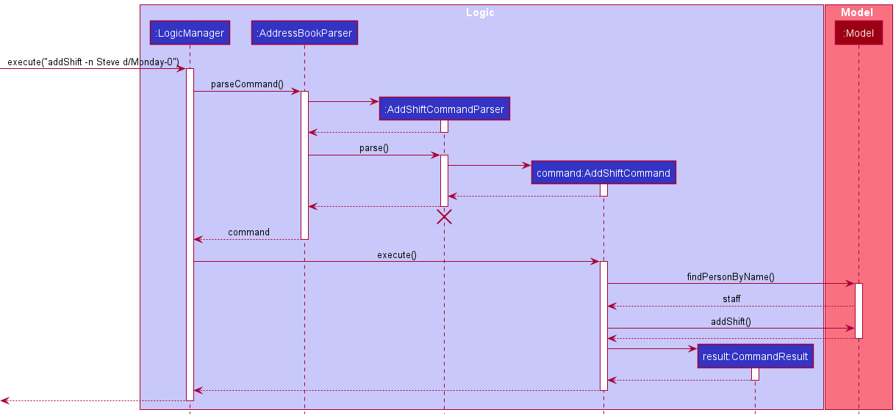
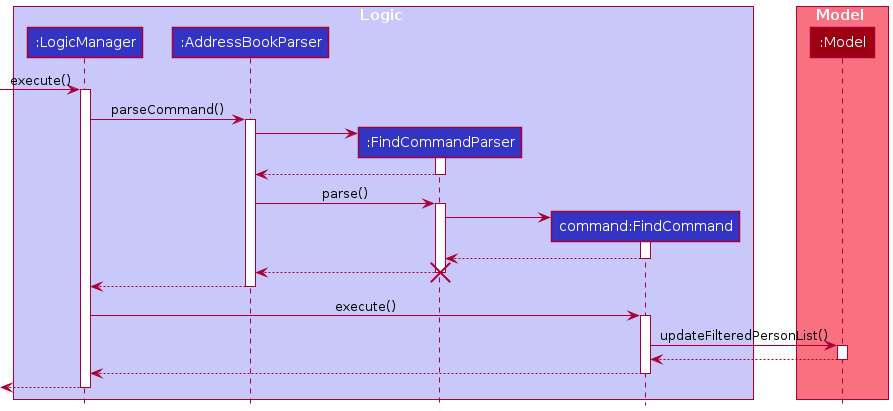
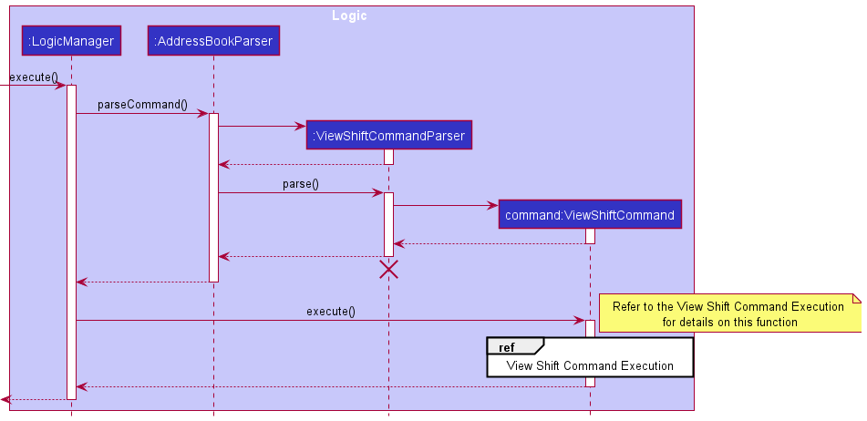
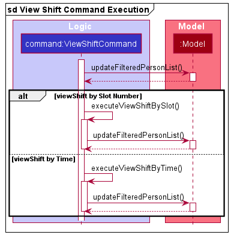

## Table of Contents

* Table of Contents 
{:toc}

--------------------------------------------------------------------------------------------------------------------

## **Introduction**

Staff’d helps food & beverage managers manage details and schedules of their staff. It is optimized for CLI users so 
that frequent tasks can be done faster by typing in commands. It is optimized for restaurants with two active shifts. 
Please refer to the [_User Guide_](https://ay2122s1-cs2103t-w11-2.github.io/tp/UserGuide.html) for more information 
about Staff'd.

--------------------------------------------------------------------------------------------------------------------

## **Overview**

This guide is intended for future developers, current contributors and users. This guide mainly aims to explain the 
implementation of Staff'd to future developers and deepen their knowledge in software development. By the end of this 
guide, you can expect to get an overview of the design architecture of Staff'd and comprehensive details of some of its 
core features, backed up by UML diagrams.

--------------------------------------------------------------------------------------------------------------------

## **Acknowledgements**

This project is based on the [AddressBook-Level3](https://github.com/nus-cs2103-AY2122S1/tp) ([UG](https://se-education.org/addressbook-level3/UserGuide.html), 
[DG](https://se-education.org/addressbook-level3/DeveloperGuide.html)) project created by the [SE-EDU initiative](https://se-education.org).

--------------------------------------------------------------------------------------------------------------------

## **Setting up, getting started**

Refer to the guide [_Setting up and getting started_](SettingUp.md).

--------------------------------------------------------------------------------------------------------------------

## **Design**

:bulb: **Tip:** The `.puml` files used to create diagrams in this document can be found in
the [diagrams](https://github.com/AY2122S1-CS2103T-W11-2/tp/tree/master/docs/diagrams/) folder. Refer to the [_PlantUML
Tutorial_ at se-edu/guides](https://se-education.org/guides/tutorials/plantUml.html) to learn how to create and edit
diagrams.

### Architecture

The ***Architecture Diagram*** given above explains the high-level design of the App.

Given below is a quick overview of main components and how they interact with each other.

**Main components of the architecture**

**`Main`** has two classes
called [`Main`](https://github.com/se-edu/AY2122S1-CS2103T-W11-2/tree/master/src/main/java/seedu/address/Main.java)
and [`MainApp`](https://github.com/se-edu/AY2122S1-CS2103T-W11-2/tree/master/src/main/java/seedu/address/MainApp.java). It
is responsible for,

* At app launch: Initializes the components in the correct sequence, and connects them up with each other.
* At shut down: Shuts down the components and invokes cleanup methods where necessary.

[**`Commons`**](#common-classes) represents a collection of classes used by multiple other components.

The rest of the App consists of four components.

* [**`UI`**](#ui-component): The UI of the App.
* [**`Logic`**](#logic-component): The command executor.
* [**`Model`**](#model-component): Holds the data of the App in memory.
* [**`Storage`**](#storage-component): Reads data from, and writes data to, the hard disk.

**How the architecture components interact with each other**

The *Sequence Diagram* below shows how the components interact with each other for the scenario where the user issues
the command `delete -i 1`.

Each of the four main components (also shown in the diagram above),

* defines its *API* in an `interface` with the same name as the Component.
* implements its functionality using a concrete `{Component Name}Manager` class (which follows the corresponding
  API `interface` mentioned in the previous point.

For example, the `Logic` component defines its API in the `Logic.java` interface and implements its functionality using
the `LogicManager.java` class which follows the `Logic` interface. Other components interact with a given component
through its interface rather than the concrete class (reason: to prevent outside component's being coupled to the
implementation of a component), as illustrated in the (partial) class diagram below.

The sections below give more details of each component.

### UI component

The **API** of this component is specified
in [`Ui.java`](https://github.com/se-edu/AY2122S1-CS2103T-W11-2/tree/master/src/main/java/seedu/address/ui/Ui.java)

The UI consists of a `MainWindow` that is made up of parts e.g.`CommandBox`, `ResultDisplay`, `PersonListPanel`
, `StatusBarFooter` etc. All these, including the `MainWindow`, inherit from the abstract `UiPart` class which captures
the commonalities between classes that represent parts of the visible GUI.

The `UI` component uses the JavaFx UI framework. The layout of these UI parts are defined in matching `.fxml` files that
are in the `src/main/resources/view` folder. For example, the layout of
the [`MainWindow`](https://github.com/se-edu/AY2122S1-CS2103T-W11-2/tree/master/src/main/java/seedu/address/ui/MainWindow.java)
is specified
in [`MainWindow.fxml`](https://github.com/se-edu/AY2122S1-CS2103T-W11-2/tree/master/src/main/resources/view/MainWindow.fxml)

The `UI` component,

* executes user commands using the `Logic` component.
* listens for changes to `Model` data so that the UI can be updated with the modified data.
* keeps a reference to the `Logic` component, because the `UI` relies on the `Logic` to execute commands.
* depends on some classes in the `Model` component, as it displays `Person` object residing in the `Model`.

The `Schedule view` subcomponent of the `UI` component,

* displays 2 `SlotCard` for each `DayCard`
* listens to changes in `Model` data to be updated with the modified data

### Logic component

**API** : [`Logic.java`](https://github.com/se-edu/AY2122S1-CS2103T-W11-2/tree/master/src/main/java/seedu/address/logic/Logic.java)

Here's a (partial) class diagram of the `Logic` component:

How the `Logic` component works:

1. When `Logic` is called upon to execute a command, it uses the `AddressBookParser` class to parse the user command.
1. This results in a `Command` object (more precisely, an object of one of its subclasses e.g., `AddCommand`) which is
   executed by the `LogicManager`.
1. The command can communicate with the `Model` when it is executed (e.g. to add a person).
1. The result of the command execution is encapsulated as a `CommandResult` object which is returned back from `Logic`.

The Sequence Diagram below illustrates the interactions within the `Logic` component for the `execute("delete -i 1")` API
call.

:information_source: **Note:** The lifeline for `DeleteCommandParser` should end at the destroy marker (X) but due to a limitation of PlantUML, the lifeline reaches the end of diagram.

Here are the other classes in `Logic` (omitted from the class diagram above) that are used for parsing a user command:

How the parsing works:

* When called upon to parse a user command, the `AddressBookParser` class creates an `XYZCommandParser` (`XYZ` is a
  placeholder for the specific command name e.g., `AddCommandParser`) which uses the other classes shown above to parse
  the user command and create a `XYZCommand` object (e.g., `AddCommand`) which the `AddressBookParser` returns back as
  a `Command` object.
* All `XYZCommandParser` classes (e.g., `AddCommandParser`, `DeleteCommandParser`, ...) inherit from the `Parser`
  interface so that they can be treated similarly where possible e.g, during testing.

### Model component

**API** : [`Model.java`](https://github.com/se-edu/AY2122S1-CS2103T-W11-2/tree/master/src/main/java/seedu/address/model/Model.java)

The `Model` component,

* stores the staff data i.e., all `Person` objects (which are contained in a `UniquePersonList` object).
* stores the currently 'selected' `Person` objects (e.g., results of a search query) as a separate _filtered_ list which
  is exposed to outsiders as an unmodifiable `ObservableList<Person>` that can be 'observed' e.g. the UI can be bound to
  this list so that the UI automatically updates when the data in the list change.
* stores a `UserPref` object that represents the user’s preferences. This is exposed to the outside as
  a `ReadOnlyUserPref` objects.
* does not depend on any of the other three components (as the `Model` represents data entities of the domain, they
  should make sense on their own without depending on other components)

:information_source: **Note:** An alternative (arguably, a more OOP) model is given below. It has a `Tag` list and a `Role` list in the `AddressBook`, which `Person` references. This allows `AddressBook` to only require one `Tag` object per unique tag and one `Role` object per unique role, instead of each `Person` needing their own `Tag` and `Role` objects. 

The `Person` subcomponent,

* stores what a `Person` should have, i.e. all `Field` objects and details of employment (e.g. Schedule, dates of being absent).
* does not depend on any of the other three components as it is part of the `Model` component.

### Storage component

**API** : [`Storage.java`](https://github.com/se-edu/AY2122S1-CS2103T-W11-2/tree/master/src/main/java/seedu/address/storage/Storage.java)

The `Storage` component,

* can save both address book data and user preference data in json format, and read them back into corresponding
  objects.
* inherits from both `AddressBookStorage` and `UserPrefStorage`, which means it can be treated as either one (if only
  the functionality of only one is needed).
* depends on some classes in the `Model` component (because the `Storage` component's job is to save/retrieve objects
  that belong to the `Model`)

The storage of `Person`,

* can save all the details of a staff in `JsonAdaptedPerson`
* depends on the `Model` component as it is in the `Storage` component

### Common classes

Classes used by multiple components are in the `seedu.addressbook.commons` package.

--------------------------------------------------------------------------------------------------------------------

## **Implementation**

This section describes some noteworthy details on how certain features are implemented.

### Mark/unmark feature

#### Implementation

The mark/unmark feature is facillated by `Person`. It uses the following
operations of `Person`.

 * `Person#mark()` — Adds the input time period to the person to be marked as absent. 
 * `Person#unmark()` — Removes the input time period from the person.

These operations make use of `Period#union()` and `Period#complement` and are exposed
by `MarkCommand#execute()` and `RemoveMarkCommand#execute()`.

Given below is an example usage scenario and how the mark/unmark command
changes the information stored.

Step 1. The user launches the application for the first time. The staff all
the staff information is read from the save file `addressbook.json`.
The initial information of the staff that we are looking at 
will look something like this. The `Period` object that we are using can be taken to
represent 1/1/2001 to 2/1/2001

Step 2. The user executes the command `mark -i 1 d/2001-01-04`. The `mark` command
calls `ParserUtil#parsePeriod()`, to obtain the time period to mark, and `Person#mark()` to mark this time period on this person. This method uses
`Period#union()` to union the time period with the set.

Step 3. The user executes the command `mark -i 1 d/2001-01-03`. The `mark` command
calls `ParserUtil#parsePeriod()`, to obtain the period to mark as before. As this time period makes the current range, 1/1/2001 to 2/1/2001 and 4/1/2001
become a single range, `Period#union()` that is called, merges the two `Period`
objects into one.

The following sequence diagram shows how the mark command works.

The `unmark` command does the opposite — it calls `Person#mark()`, which replaces the
`Period` that are contained in the `Person` with the `Period` objects representing
the initial `Period` without the input `Period`.

#### Design considerations

**Aspect: How to mark attendance**

 * **Alternative 1 (current implementation):** Mark absent.
   * Pros: Changes less amount of data in the case of high turnout rate.
   * Cons: Harder to implement features that make use of a staff not being present.
 * **Alternative 2**: Mark present.
   * Pros: Easier to implement other features that make use of a staff being present. 
   * Cons: Changes more data in the case of high turnout rate.

**Aspect: How mark and unmark is represented**

 * **Alternative 1 (current implementation):** Stored in the class for a staff.
   * Pros: Easy to implement.
   * Cons: Increased reliance on 
 * **Alternative 2**: Stored in the class representing a shift. 
   * Pros: Easier to implement features related to both shifts and attendance.
   * Cons: More memory intensive.

**Aspect: Representation of a `Period`**

 * **Alternative 1(current implementation):** Use `LocalDate` to represent a period
   * Pros: Makes the command easier to enter. 
   * Cons: Makes shift related features and attendance related features harder to use.
 * **Alternative 2(possible implementation):** Use `LocalDateTime` to represent a period
   * Pros: Makes shift related features easier to implement.
   * Cons: Parser becomes more complicated.

### Add shift to staff's schedule

#### Implementation

`addShift` is a command for the app to add a shift into a staff's schedule. When the user want to use this command, the
target staff, and the specific shift should be indicated.

The add shift functionality is facilitated by  `ModelManager`. It uses the following operation of `ModelManager`.

- `ModelManager#findPersonByName()` — Find the first person with given Name from the address book. If the person is not
  found, null will be returned.

- `ModelManager#addShift()` — Add a shift to the target person's schedule. If that shift has already existed, a
  `DuplicateShiftException` will be thrown.

Also, `AddShiftCommandParser` and `AddShiftCommand` are created to achieve this functionality.

The way of implementing `addShift` functionality follows the architecture of the app. Given below is an example usage
scenario and the workflow of the
`addShift` command.

Step 1. The user executes command `addShift -n Steve d/Monday-0`.
`Ui` component reads the command as a string from user's input. After that, `MainWindow`
passes the string to `LogicManager` to manipulate the command.

Step 2. `LogicManager` passes the command to `AddressBookParser` to parse the command. Since the command starts
with `addShift`, a new `AddShiftCommandParser` is created to parse the command further.

Step 3. `AddShiftCommandParser` uses `ArgumentMultimap` to tokenize the prefixes part the command. After extracting the
information the target staff, the shift, and the date, A new
`AddShiftCommand` is created with the information. In this case, the name of the target staff is "Steve", and the
proposed shift is on Monday morning, and the period is seven days starting from the current date when the user runs the
command.

Step 4. `AddShiftCommand` passes the given name to `ModelManager#findPersonByName()`. After finding the specific
staff, `AddShiftCommand` passes the `targetStaff`
`dayOfWeek`, `slot` and `startDate`, `endDate` of the shift to `ModelManager#addShift()`.

Step 5. `Modelmanager#addShift()` updates the schedule of the `targetStaff` with a new `Shift` created with the given
`dayOfWeek`, `slot` and `startDate`, `endDate`.

The sequence diagram of this `addShift` command is shown below:

Notes:

1. User can also search the target staff with the staff's index in `lastShownList`
2. A command is considered as a valid `addShift` command if it follows these formats:

- `addShift -n name d/fullDayName-slotNumber`
- `addShift -i index d/fullDayName-slotNumber`

3. `fullDayName` can be any day from "monday" to "sunday". Noticed that it's not case-sensitive.
4. `slotNumber` can only be 0 or 1 currently.

#### Design considerations

**Aspect: Add the shift to a group of staffs**

* **Alternative 1 (current implementation):** Add one by one
    * Pros: Easy to implemented. Decrease the chance to add shift to a wrong person.
    * Cons: Time consuming for user to add one by one.
* **Alternative 2 (proposed implementation):** Add shift to a group of staffs.
    * Pros: Save time for users.
    * Cons: User need to specify the group of staffs before adding shift to their schedules.

--------------------------------------------------------------------------------------------------------------------
### Find Staff

#### Implementation

`Find` is a command for the app to search for staff by a specific index or name. When the command is called,
whether it is a search by name or search by index should be indicated with the respective tags `-n` and `-i` along with any additional fields.

The Find functionality is facilitated by  `ModelManager`. It uses the following operation of `ModelManager`.

- `ModelManager#updateFilteredPersonList(Predicate<Person)` — Update the filtered list based on the predicate set.
- `ModelManager#getUnFilteredPersonList()`— Retrieve the filtered list of staff

Also, `FindCommandParser` was created to achieve this functionality.

The way of implementing `find` functionality follows the architecture of the app. Given below is an example usage
scenarios and the workflow of the `find` command.

Step 1. The user executes command `find -n John`.
`Ui` component reads the command as a string from user's input. After that, `MainWindow`
passes the string to `LogicManager` to manipulate the command.

Step 2. `LogicManager` passes the command to `AddressBookParser` to parse the command. Since the command starts
with `find`, a new `FindCommandParser` is created to parse the command further.

Step 3. `FindCommandParser` determines that the search is by name, due to the `-n` tag. Hence, `FindCommand` is created with the information. In this case, the name of staff to search is "John".

Step 4. `FindCommand` creates a NameContainsKeywordsPredicates object which is then used as a parameter in `ModelManager#updateFilteredPersonList` to filter the list
for staff whose names match the keywords.

Step 5. Following this, the displayed staff list will display the updated filtered list. 

The sequence diagram of this `Find` command is shown below:

Notes:

1. The process is similar for a search by index, but with `NameContainsKeywordsPredicate` replaced with `StaffHasCorrectIndexPredicate`
2. A command is considered as a valid `Find` command if it follows these formats:

- `find -n keywords`
- `find -i index`

3. The keywords are not case-sensitive.
4. Index search operates on the filtered list, which is the displayed staff list, and not the overall staff list.

--------------------------------------------------------------------------------------------------------------------
### ViewShift

#### Implementation

`viewShift` is a command for the app to search for the staff working at a specific day and shift. The search is either conducted
by a specific time or by the slot number. When the command is used, whether it is a search by slot number or search by time
should be indicated with the respective tags `-d` and `-t`.

The Find functionality is facilitated by  `ModelManager`. It uses the following operation of `ModelManager`.

- `ModelManager#updateFilteredPersonList(Predicate<Person)` — Update the filtered list based on the predicate set.
- `ModelManager#getUnFilteredPersonList()`— Retrieve the filtered list of staff

Also, `FindCommandParser` was created to achieve this functionality.

The way of implementing `viewShift` follows the architecture of the app. Given below is an example usage scenarios and the 
workflow of the `find` command.

Step 1. The user executes command `viewShift -t monday-17:00`.
`Ui` component reads the command as a string from user's input. After that, `MainWindow`
passes the string to `LogicManager` to manipulate the command.

Step 2. `LogicManager` passes the command to `AddressBookParser` to parse the command. Since the command starts
with `viewShift`, a new `viewShiftCommand` object is created to parse the command further.

Step 3. `ViewShiftCommandParser` determines that the search is by time, due to the `-t` tag. 
Hence, `viewShift` is created with the information. In this case, the day of the week is `MONDAY` and the time is `17:00`.

Step 4. `viewShiftCommand` creates a PersonIsWorkingPredicate object which is then used as a parameter in `ModelManager#updateFilteredPersonList` to filter the list
for staff who are working at that particular timing.

Step 5. Following this, the displayed staff list will display the updated filtered list, and the names of those working will
also be outputted on the left of the GUI.

The sequence diagram of this `viewShift` command is shown below:

Notes:

1. The process is similar for a search by slot number.
2. A command is considered as a valid `viewShift` command if it follows these formats:
- `viewShift -d dayofweek-slotnumber`
- `viewShift -t dayofweek-time`

3. Note that the `dayofweek` is not case-sensitive, and that time must be inputted in a `HH:mm` format.
4. The viewShift Command operates on the overall staff list and not just the displayed list.
5. Inputting `viewShift` alone also outputs the staff currently working.

--------------------------------------------------------------------------------------------------------------------
## **Proposed future features** ##

### Operating a command on a group of people together ###

Currently, most of the commands of Staff'd are targeting on a single person, which means user need to specify
the staff's index, name to identify that single staff. In future iterations, we can expand some commands to work on
a group of staff at the same time.

### Make marking absent by time ###

Currently, `mark` functionality can only mark from a start date to an end date, but in reality, it's common that
a staff is only absent a few hours in a day. In future iterations, we can expand the `mark` command to make it available
to make marking absent by time.

### Track salary changes ###

Currently, Staff'd supports calculating a staff's current month salary. In future iterations, we can expand the
functionality to let it track the changes on a staff's salary, store the salary history of a staff.

--------------------------------------------------------------------------------------------------------------------

## **Documentation, logging, testing, configuration, dev-ops**

* [Documentation guide](Documentation.md)
* [Testing guide](Testing.md)
* [Logging guide](Logging.md)
* [Configuration guide](Configuration.md)
* [DevOps guide](DevOps.md)

--------------------------------------------------------------------------------------------------------------------

## **Appendix: Requirements**

### Product scope

**Target user profile**:

* can type fast
* is tech-savvy
* prefers typing to mouse interactions
* is a manager of food-chain services
* prefer desktop apps over other types
* has a need to manage staff schedules
* is reasonably comfortable using CLI apps
* has a need to manage a significant number of staff

**Value proposition**: It can be complicated and tedious for managers of such food chain services to manually keep track
of their staff information, schedules, working hours, and salaries. Staff’d provides a central management system of
staff that allows for easy and intuitive tracking and handling of the aforementioned data.

### User stories

Priorities: High (must have) - `* * *`, Medium (nice to have) - `* *`, Low (unlikely to have) - `*`

| Priority | As a …​                                    | I want to …​                     | So that I can…​                                             |
| -------- | ------------------------------------------ | ------------------------------ | ---------------------------------------------------------------------- |
| `* * *`  | user                                       | add a new staff                |                                                                        |
| `* * *`  | user                                       | delete a staff                 | remove entries that I no longer need                                   |
| `* * *`  | user                                       | edit a staff's details         | update relevant information where necessary                            |
| `* * *`  | user                                       | add a staff's schedule         | keep track of their schedule and update the overall work schedule      |
| `* * *`  | user                                       | delete a staff's schedule      | remove schedule and update the overall work schedule                   |
| `* * *`  | user                                       | edit a staff's schedule        | make changes to their schedule and update the overall work schedule    |
| `* * *`  | user                                       | view a staff's schedule        | view an individual staff's schedule and the overall work schedule      |
| `* * *`  | user                                       | find a person by name          | locate details of persons without having to go through the entire list |
| `* * *`  | new user                                   | see usage instructions         | refer to instructions when I forget how to use the App                 |
| `* * *`  | new user                                   | understand why my command fails| be guided towards using the App correctly                              |
| `* * *`  | user with many new staff                   | add multiple staff             | add several new staff quickly                                          |
| `* * *`  | user with many retiring staff              | delete multiple staff          | remove multiple entries that I no longer need                          |
| `* *`    | user                                       | hide private contact details   | minimize chance of someone else seeing them by accident                |
| `* *`    | user in charge of salary calculation       | use Staff'd to calculate the salaries  | Manage salary payments accurately and quickly                  |
| `*`      | user with many persons in the address book | sort persons by name           | locate a person easily                                                 |

### Use cases

(For all use cases below, the **System** is the `Staff'd` and the **Actor** is the `user`, unless specified otherwise)

**Use case: UC01 - Edit staff details**

**MSS**

1. User chooses to edit the staff details.
1. User inputs relevant details.
1. Staff’d requests for confirmation.
1. User confirms.
1. Staff’d updates the new staff details.

   Use case ends.

**Extensions**

* 3a. Staff'd detects an error in the entered data.

    * 3a1. Staff'd displays an error message.
    * 3a2. User enters new data.
    * 3a2. Steps 3a1-3a2 are repeated until the data entered are correct.

      Use case resumes at step 4.

**Use case: UC02 - Edit staff schedule**

**MSS**

1. User chooses to edit a staff's schedule.
1. User inputs relevant details.
1. Staff’d requests for confirmation.
1. User confirms.
1. Staff’d updates the new staff schedule.

   Use case ends.

**Extensions**

* 3a. Staff'd detects an error in the entered data.

    * 3a1. Staff'd displays an error message.
    * 3a2. User enters new data.
    * 3a2. Steps 3a1-3a2 are repeated until the data entered are correct.

      Use case resumes at step 4.

*{More to be added}*

### Non-Functional Requirements

Performance requirements:

1. Should be able to hold up to 1000 persons without a noticeable sluggishness in performance for typical usage.
1. The number of time periods for each person can go up to 50 without a noticeable sluggishness in performance.
1. The project should respond within 2 seconds.

Technical requirements:

1. Should work on any _mainstream OS_ as long as it has Java `11` or above installed.
1. The system should work on both 32-bit and 64-bit environments.

Constraints:

1. System should be compatible with the saved data from previous versions.
1. The size of the release binary should not exceed 100mb.
1. The system does not require the internet to use.

Business rules:

1. The status of an employee only has two.
1. The role of an employee is only active during the scheduled time period.
1. There can be a maximum of 1000 employees.
1. The salary of an employee cannot exceed $9999999 an hour.

Quality requirements:

1. A user with above average typing speed for regular English text (i.e. not code, not system admin commands) should be
   able to accomplish most of the tasks faster using commands than using the mouse.
1. The system can be used for basic function without reading the user guide.

Project scope:

1. Does not handle printing of output to paper.
1. Does not send out emails.
1. Does not provide graphical representation of statistics.

### Glossary

[uml-user-guide]: ## "The Unified Modeling Language User Guide, 2e, G Booch, J Rumbaugh, and I Jacobson"

* **Mainstream OS**: Windows, Linux, Unix, OS-X
* **Private contact detail**: A contact detail that is not meant to be shared with others
* **Java**: A high level, classed based, object-oriented programming language. Java `11` can be
  downloaded [here](https://www.oracle.com/java/technologies/downloads/#java11).
* **Gradle**: Gradle is a build automation tool for multi-language software development.
  Installation [here](https://gradle.org/install/).
* **Time Period**: A time period from one date to another.
* **Status**: The working status of the staff. i.e. A part-timer or a full-timer.
* **Schedule**: The staffs work schedule with a description of the work carried out.
* **Role**: The role(s) of the staff. i.e. Bartender.
* **Salary**: The salary of the staff per hour.
* **Address**: The address of the staff.
* **Constraints**: The constraints the project is working with.
* **MSS**: Main success scenario
* **Non-Functional Requirements**: Requirements specifying the constraints under which the system is developed and
  operated.
* **User**: For the project purposes, the user is specified to be a manager at a F&B outlet.
* **UI**: The user interface of the application.
* **Model**: The model that is used by the programme to represent the data.
* **logic**: The logic used to dictate the behavior of the model.
* **parser**: The interpreter of the user input.
* **commons**: Commonly used data structures.
* **storage**: The part of the programme which handles the writing to disk of the data in the programme.
* **index**: The current person on the list of staff that can be viewed.
* **Use cases**: A use case describes an interaction between the user and the system for a specific functionality of the
  system. [uml-user-guide][uml-user-guide]
* **User stories**: User story: User stories are short, simple descriptions of a feature told from the perspective of
  the person who desires the new capability, usually a user or customer of the
  system. [Mike Cohn](https://www.mountaingoatsoftware.com/agile/user-stories)
* **Home folder**: The folder where _staffd.jar_ is stored at.

--------------------------------------------------------------------------------------------------------------------

## **Appendix A: Instructions for manual testing**

Given below are instructions to test the app manually.

:information_source: **Note:** These instructions only provide a starting point for testers to work on;
testers are expected to do more *exploratory* testing.

### Launch and shutdown

1. Initial launch

    1. Download the latest _staffd.jar_ file and copy into an empty folder from [latest release](https://github.com/AY2122S1-CS2103T-W11-2/tp/releases). 

    2. Double-click the jar file Expected: Shows the GUI with a set of sample contacts. The window size may not be
       optimum.

2. Saving window preferences

    1. Resize the window to an optimum size. Move the window to a different location. Close the window.

    2. Re-launch the app by double-clicking the jar file. 
       Expected: The most recent window size and location is retained.

### Adding a person
1. Adding a person to the address book

    1. Test case: `add n/John Doe p/98765432 e/johnd@example.com $/100`  
       Expected: If there is already a person called `John Doe` in the address book, then an error message will appear
       at the left output box. Otherwise, a new staff will be added to the list in the right output box, with name `John Doe`,
       phone number `98765432`, email `johnd@example.com`, and salary `100`.
       
    1. Test case: `add n/John Doe p/98765432` 
       Expected: No person is added. Error details shown in the status message. 
       Status bar remains the same.
       
    1. Other incorrect `add` commands to try: `add p/98765432 e/johnd@example.com $/100`,
       `add n/John Doe p/98765432 e/johnd@example.com`, `...` (where one or more attributes
       are missing in the command)
       Expected: A wrong message of `Invalid command format` will be shown in the status message.
       

### Deleting a person

1. Deleting a person while all persons are being shown

    1. Prerequisites: List all persons using the `list` command. Multiple persons in the list.

    1. Test case: `delete -i 1` 
       Expected: First contact is deleted from the list. Details of the deleted contact shown in the status message.
       Timestamp in the status bar is updated.

    1. Test case: `delete -i 0` 
       Expected: No person is deleted. Error details shown in the status message. Status bar remains the same.

    1. Other incorrect `delete` commands to try: `delete`, `delete x`, `...` (where x is larger than the list size) 
       Expected: Similar to previous.

### Adding a shift to a person's schedule
1. Adding a shift to an existing person's schedule, given the target person's index in the list.
    
    1. Prerequisites: List all persons using the `list` command. Multiple persons in the list.
    
    1. Test case: `addShift -i 1 d/Monday-0`
       Expected: A shift on next Monday morning will be added to the first staff's schedule in the list, 
       if that slot does not have a shift yet. Otherwise, no shift is added and error details will be shown
       in the status message. 
       
    1. Test case: `addShift -i 1 d/Monday-0 da/2021-11-07`
       Expected: A new shift will be added to the first person in the list schedule. In this case, 
       the date of that shift will be `2021-11-08`, and the slot is `morning`.
       Otherwise, no shift is added and error details will be shown in the status message.
       
    1. Test case: `addShift -i 1 d/Monday-0 da/2021-11-06 da/2021-12-06` 
       Expected: New shifts will be added to the first person in the list schedule. In this case,
       the date of shifts will be `2021-11-08`, `2021-11-15`, `2021-11-22`, `2021-11-29`, `2021-12-06`
       and the slot is `morning`. Otherwise, no shift is added and error details will be shown in the status message.
       
    1. Other incorrect `addShift` commands to try: `addShift -i 0 d/Monday-0`, `addShift -i x d/Monday-0`, (where 
       x is larger than the list size) `addShift -i 0 d/mon-0`, `...`.
       Expected: A wrong details will be shown in the status message.
       
### Saving data

1. Getting the default save file.

    1. Prerequisites: Place _staffd.jar_ in an empty _home folder_.

    1. Test case: `addShift -i 1 d/monday-0` 
       Expected: _staffd.json_ appears in _data_ folder inside _home folder_. Staff with name `Alex Yeoh` has a field history in _staffd.json_ whereas the other staff do not. Sample output [here](sample/addShift.json). Note the time period output will be different with date.

    1. Test case: `delete -i 1` 
       Expected: _staffd.json_ is updated with `Alex Yeoh removed`. Sample output [here](sample/deleteAlex.json). 

1. Clearing the save file.

    1. Prerequisites: Have _staffd.json_ in the _data_ folder. Perform the previous step if the file isn't there.

    1. Test case: `clear` 
       Expected: An empty _staffd.json_ file like [here](sample/empty.json).
    
--------------------------------------------------------------------------------------------------------------------

## **Appendix B: Effort**

During the V1.2 iteration, we had set out to revamp the entire codebase to accommodate F&B staff and their details as 
compared to regular people. This task was moderately difficult as on one hand, we only had to refactor any instances of 
`person` to `staff` but on the other hand, we had to spend a lot of time implementing and adding fields such as `salary`, 
`schedule`, `role` and `status`. The implementation of `schedule` alone warranted a 4-hour meeting as there was a debate 
on how staff shifts should be stored and how many shifts we would have or even whether we should allow users to choose 
how many shifts they would want in a day and the timing of each shift. This iteration was also the time when we just 
started adding code to the existing codebase and as such, we faced the difficulty of understanding it. Not only did we 
have to understand the code, we had to also understand the abstraction behind the code and adhere to it when adding new 
`person` fields and functions. For all of us, this was the portion that required the most of our effort.

V1.3 was the most difficult and time-consuming iteration. The GUI was one of the hardest parts of this project. Due to 
our unfamiliarity with JavaFX (the library that we used for our GUI), we spent a significant amount of our effort
changing the GUI to fit the staff details, showing the staff schedule and putting it on another tab. From having almost 
zero knowledge about JavaFX to changing the whole GUI was a huge achievement for our team as a whole. Besides that, this 
was the last iteration where we could add new features, so we ramped up the number of commands that we added such as 
`mark`, `swapShift` and `setShiftTime` just to name a few. However, this also led to some unfortunate circumstances. 
By the end of this iteration and subsequent iterations, this led to numerous bugs. A majority of our time was spent on 
fixing these bugs and add comprehensive tests for them.
