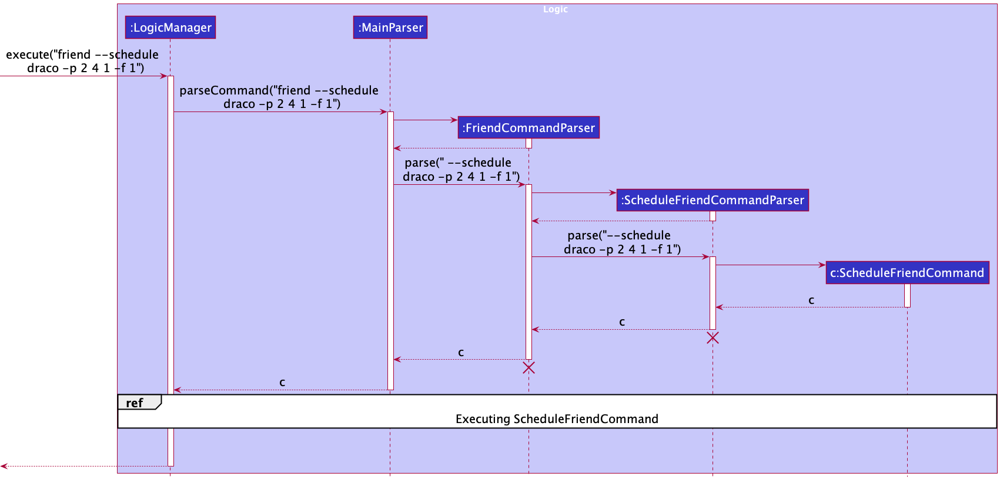
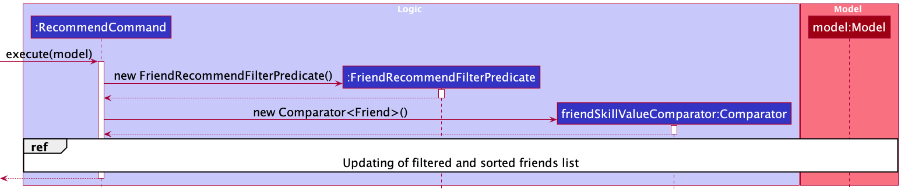

* Table of Contents
{:toc}

--------------------------------------------------------------------------------------------------------------------

## **Acknowledgements**

* This project is based on the AddressBook-Level3 project created by the [SE-EDU initiative](https://se-education.org).

--------------------------------------------------------------------------------------------------------------------

## **Setting up, getting started**

Refer to the guide [_Setting up and getting started_](SettingUp.md).

--------------------------------------------------------------------------------------------------------------------

## **Design**

:bulb: **Tip:** The `.puml` files used to create diagrams in this document can be found in the [diagrams](https://github.com/AY2122S1-CS2103T-W13-4/tp/tree/master/docs/diagrams) folder. Refer to the [_PlantUML Tutorial_ at se-edu/guides](https://se-education.org/guides/tutorials/plantUml.html) to learn how to create and edit diagrams.

### Architecture

The ***Architecture Diagram*** given above explains the high-level design of gitGud.

Given below is a quick overview of main components and how they interact with each other.

**Main components of the architecture**

**`Main`** has two classes called [`Main`](https://github.com/AY2122S1-CS2103T-W13-4/tp/tree/master/src/main/java/seedu/address/Main.java) and [`MainApp`](https://github.com/AY2122S1-CS2103T-W13-4/tp/tree/master/src/main/java/seedu/address/MainApp.java). It is responsible for,
* At app launch: Initializes the components in the correct sequence, and connects them up with each other.
* At shut down: Shuts down the components and invokes cleanup methods where necessary.

[**`Commons`**](#common-classes) represents a collection of classes used by multiple other components.

The rest of gitGud consists of four components.

* [**`UI`**](#ui-component): The UI of the gitGud.
* [**`Logic`**](#logic-component): The command executor.
* [**`Model`**](#model-component): Holds application data for gitGud in memory.
* [**`Storage`**](#storage-component): Reads data from, and writes data to, the hard disk.

**How the architecture components interact with each other**

The *Sequence Diagram* below shows how the components interact with each other for the scenario where the user 
issues the command `friend --delete Draco`.

Each of the four main components (also shown in the diagram above),

* defines its *API* in an `interface` with the same name as the Component.
* implements its functionality using a concrete `{Component Name}Manager` class (which follows the corresponding API `interface` mentioned in the previous point.

For example, the `Logic` component defines its API in the `Logic.java` interface and implements its functionality using the `LogicManager.java` class which follows the `Logic` interface. Other components interact with a given component through its interface rather than the concrete class (reason: to prevent outside component's being coupled to the implementation of a component), as illustrated in the (partial) class diagram below.

The sections below give more details of each component.

### UI component

**API** : [`Ui.java`](https://github.com/AY2122S1-CS2103T-W13-4/tp/blob/master/src/main/java/seedu/address/ui/Ui.java)

**Description** :

The `UI` component is responsible for managing the user interface of the application so that it responds correctly to any command to user inputs.

The `UI` component uses the JavaFx UI framework. The layout of these UI parts are defined in matching `.fxml` files that are in the `src/main/resources/view` folder. For example, the layout of the [`MainWindow`](https://github.com/se-edu/addressbook-level3/tree/master/src/main/java/seedu/address/ui/MainWindow.java) is specified in [`MainWindow.fxml`](https://github.com/se-edu/addressbook-level3/tree/master/src/main/resources/view/MainWindow.fxml)

**Functionality** :

The `UI` component,

* executes user commands using the `Logic` component.
* listens for changes to `Model` data so that the UI can be updated with the modified data.
* keeps a reference to the `Logic` component, because the `UI` relies on the `Logic` to execute commands.
* depends on some classes in the `Model` component, as it displays `Person` object residing in the `Model`.

**Component Structure**

The UI consists of a `MainWindow` that is made up of parts e.g.`CommandBox`, `ResultDisplay`, `PersonListPanel`, `StatusBarFooter` etc. All these, including the `MainWindow`, inherit from the abstract `UiPart` class which captures the commonalities between classes that represent parts of the visible GUI.

### Logic component

**API** : [`Logic.java`](https://github.com/se-edu/addressbook-level3/tree/master/src/main/java/seedu/address/logic/Logic.java)

Here's a (partial) class diagram of the `Logic` component:

How the `Logic` component works:
1. When `Logic` is called upon to execute a command, it uses the `MainParser` class to parse the user command.  
2. This results in a `Command` object (more precisely, an object of one of its subclasses e.g., `HelpCommand`) which is executed by the `LogicManager`.
3. The command can communicate with the `Model` when it is executed (e.g. to add a person).
4. The result of the command execution is encapsulated as a `CommandResult` object which is returned back from `Logic`.

The Sequence Diagram below illustrates the interactions within the `Logic` component for the `execute("friend --delete draco")` API call.

:information_source: **Note:** The lifeline for `DeleteCommandParser` should end at the destroy marker (X) but due to a limitation of PlantUML, the lifeline reaches the end of diagram.

Here are the other classes in `Logic` (omitted from the class diagram above) that are used for parsing a user command:

How the parsing works:
* When called upon to parse a user command, the `MainParser` class creates an `XYZCommandParser` (`XYZ` is a placeholder for the specific command name e.g., `HelpCommandParser`) which uses the other classes shown above to parse the user command and create a `XYZCommand` object (e.g., `HelpCommand`) which the `AddressBookParser` returns back as a `Command` object.
    * Note: For user commands with `friend` or `game` as the first arguments will go through an additional `FriendCommandParser` or `GameCommandParser` respectively for parsing, which will then create the respective `XYZFriendCommandParser` or `XYZGameCommandParser`
* All `XYZCommandParser` classes (e.g., `AddCommandParser`, `DeleteCommandParser`, ...) inherit from the `Parser` interface so that they can be treated similarly where possible e.g, during testing.

### Model component
**API** : [`Model.java`](https://github.com/AY2122S1-CS2103T-W13-4/tp/blob/master/src/main/java/seedu/address/model/Model.java)

The `Model` component is made up of the following subpackages,

* [`friend`](https://github.com/AY2122S1-CS2103T-W13-4/tp/tree/master/src/main/java/seedu/address/model/friend)
  * a `Friend` comprises of a `FriendId`, `FriendName` and a set of `GameFriendLink`s.
  * stores the friends' data i.e., all `Friend` objects (which are contained in a `UniqueFriendsList` object).

* [`game`](https://github.com/AY2122S1-CS2103T-W13-4/tp/tree/master/src/main/java/seedu/address/model/game)
  * a `Game` comprises of a `GameId` object. 
  * stores the games' data i.e., all `Game` objects (which are contained in a `UniqueGamesList` object).
  
* [`gamefriendlink`](https://github.com/AY2122S1-CS2103T-W13-4/tp/tree/master/src/main/java/seedu/address/model/gamefriendlink)
  * stores the relationship between a `Friend` and a `Game` as a `GameFriendLink` object.
  * a `GameFriendLink` object comprises of a `UserName` object.

The `Model` component also,

* stores the currently 'selected' `Friend` objects (e.g., results of a search query) as a separate _filtered_ list which is exposed to outsiders as an unmodifiable `ObservableList<Friend>` that can be 'observed' e.g. the UI can be bound to this list so that the UI automatically updates when the data in the list change.
* stores the currently 'selected' `Game` objects (e.g., results of a search query) as a separate _filtered_ list which is exposed to outsiders as an unmodifiable `ObservableList<Game>` that can be 'observed' e.g. the UI can be bound to this list so that the UI automatically updates when the data in the list change.
* stores a `UserPref` object that represents the user’s preferences. This is exposed to the outside as a `ReadOnlyUserPref` object.
* does not depend on any of the other three components (as the `Model` represents data entities of the domain, they should make sense on their own without depending on other components)

### Storage component

**API** : [`Storage.java`](https://github.com/AY2122S1-CS2103T-W13-4/tp/blob/master/src/main/java/seedu/address/storage/Storage.java)
             
**Description** :                                                                                    

The `Storage` component is responsible for persisting application data to be stored in json file format and reading stored data
back into the application. 

**Functionality** :

The storage component saves the following application data in json format and reads them back into corresponding objects:
* friends list
* games list
* user preferences

**Component Structure** : 

There are 3 main model objects stored by the Storage component in json format, namely `Friend`, `Game`,
and `UserPrefs`, each stored in separate json files.

The Storage component inherits from `FriendsListStorage`, `GamesListStorage` and 
`UserPrefStorage`, which means it can be treated as any one of the three.

### Common classes

Classes used by multiple components are in the `seedu.addressbook.commons` package.

--------------------------------------------------------------------------------------------------------------------

## **Implementation**

* [Delete Feature](#delete-feature)
* [Link Feature](#link-feature)
* [Unlink Feature](#unlink-feature)
* [Schedule Feature](#schedule-feature)
* [Recommend Feature](#recommend-feature)

--- 

### Delete Feature

#### Implementation
The `MainWindow#executeCommand()` calls `LogicManager#execute()` method, which proceeds 
to call `MainParser#parseCommand()` method, which them calls either `FriendCommandParser#parse()` or 
`GameCommandParser#parse()`, and returns a `Command` object.

The delete command is parsed using the following classes:
* For friends:
  * `FriendCommandParser` - Checks that the command contains the `DeleteFriendCommand.COMMAND_WORD`.
    * Subsequently, calls the `parse()` method from a newly created instance of `DeleteFriendCommandParser`.
  * `DeleteFriendCommandParser` - Parses the command to find the string representing the friend's ID.
    * The `parse()` command returns a `DeleteFriendCommand` object which is instantiated using the aforementioned 
      `FriendId` object.
  * `DeleteFriendCommand` - Represents delete friend command that is executed by gitGud.
    * Takes in a `FriendId` object to find the friend to be deleted from the Model.
    * Due to the unique nature of the `FriendId` objects, where no two friends have the same `FriendId`, it is 
      sufficient to search for the friend using the `FriendId`.
    
* For games:
  * `GameCommandParser` - Checks that the command contains the `DeleteGameCommand.COMMAND_WORD`.
    * Subsequently, calls the `parse()` method from a newly created instance of `DeleteGameCommandParser`.
  * `DeleteGameCommandParser` - Parses the command to find the string representing the game's ID.
      * The `parse()` command returns a `DeleteGameCommand` object which is instantiated using the aforementioned 
        `GameId` object.
  * `DeleteGameCommand` - Represents delete game command that is executed by gitGud.
      * Takes in a `GameId` object to find the game to be deleted from the Model.
    

After being parsed, the implementation for deleting friends and games is similar. The `Command#execute()` method is 
called, resulting in the deletion of a friend or a game.The following sequence diagram 
illustrates the description for deleting **games**:

#### Design considerations:

The games of each friend is stored inside a `Map<GameId, GameFriendLinks>`. Before deleting a game, the links a 
friend has to a game has to be removed, before deleting the game from the list of games.

### Link Feature

#### Implementation

The parsing of a link command is handled by the following classes:

- `FriendCommandParser` - Checks that the command contains the `LinkFriendCommand.COMMAND_WORD`.
    - A `LinkFriendCommandParser` object is then created, from which `LinkFriendCommandParser#parse()` is called.
- `LinkFriendCommandParser` - Parses the command to extract a `FriendId` object, a `GameId` object and a `UserName` object from the command.
    - `LinkFriendCommandParser#parse()` returns a `LinkFriendCommand` object instantiated with the aforementioned objects as parameters.
- `LinkFriendCommand` - Represents link friend command that is executed by gitGud.
    - It calls `Model#linkFriend()` with a `Friend` object argument and a `GameFriendLink` object argument.

The sequence diagram of the parsing is similar to that of the other friend commands.

The implementation of `Model#linkFriend()` is as follows:

- `FriendList#linkFriend()` is called, which in turns called `UniqueFriendList#link()`.
- A new `Friend` object, `friendToEdit` is created with the same fields as `friendToLink` (the target friend of the link command).
  `Friend#link()` is then called, which modifies `friendToEdit` so that it now contains the new `GameFriendLink`.
- `UniqueFriendsList#setFriend()` then replaces `friendToLink` with the edited `friendToEdit`, so that the `Friend` in the model is updated.

#### Design considerations:

- A separate `GameFriendLink` class was created to represent the association between a friend and a game.
- Each `Friend` object has a `Map<GameId, GameFriendLink>`, which represents the links to the games it is associated with. However, each `Game` object does not
  have a corresponding data structure to the friends it is linked to. This reduces coupling between the two components such the implementation of the link feature does not require modification whenever the `Game` class is changed.

### Unlink Feature

#### Implementation

The parsing of the unlink command is handled by the following classes:

- `FriendCommandParser` - Checks that the command contains the `UnlinkFriendCommand.COMMAND_WORD`.
    - An `UnlinkFriendCommandParser` object is then created, from which `UnlinkFriendCommandParser#parse()` is called.
- `UnlinkFriendCommandParser` - Parses the command to extract a `FriendId` object and a `GameId` object.
    - `UnlinkFriendCommandParser#parse()` return an `UnlinkFriendCommand` object instantiated with the aforementioned objects as parameters.
- `UnlinkFriendCommand` - Represents unlink friend command that is executed by gitGud.
    - It calls `Model#unlinkFriend()` with a `Friend` object and a `Game` object.

The sequence diagram of the parsing is similar to that of the other friend commands.

The implementation of `Model#unlinkFriend()` is as follows:

- `FriendList#unlinkFriend()/FriendList#linkFriend()` is called, which in turns called `UniqueFriendList#unlink()`.
- A new `Friend` object, `friendToEdit` is created with the same fields as `friendToLink` (the target friend of the unlink command).
  `Friend#unlink()` is then called, which modifies `friendToEdit` so that it no longer contains a link to the game.
- `UniqueFriendsList#setFriend()` then replaces `friendToUnlink` with the edited `friendToEdit`, so that the `Friend` in the model is updated.

### Schedule Feature

#### Implementation

* To enable storing the schedule of a friend, two new fields had to be added: `Schedule` and `Day`
    * `Schedule` contains a list of 7 `Day`s.
    * `Day` contains:
        * an array of 24 booleans, each boolean representing a 1 hour timeslot in the day, with `true` being free and 
          `false` being busy.
        * the `DayOfWeek`, which day of the week the `Day` is.

* Schedule has the command format of `friend --schedule FRIEND_ID -p START_HOUR END_HOUR DAY -f IS_FREE`, and as in
  [Logic component](#logic-component), it will follow a similar flow of other commands, with `LogicManager#execute()` 
  calling `MainParser#parseCommand()`, who in turn calls `FriendCommandParser#parse()` as it is a `friend` command, 
  which returns a `ScheduleFriendCommand` after determining the `commandType` is `ScheduleFriendCommand.COMMAND_WORD`.

  
* `LogicManager` will then call `Command#execute()`. In `ScheduleFriendCommand`, the friend to be updated will be 
  retrieved with `Model:getfriend()`, and a new friend will be created with `createScheduledFriend()`, with the schedule
  updated and all fields mapped over to from `friendToSchedule` to `scheduledFriend`.
* `ScheduleFriendCommand` will then call `Model:setfriend()` to set the updated `scheduledFriend`.
* Upon success, the `CommandResult` is created with the success message to display on the UI and the `CommandType` of
  `FRIEND_SCHEDULE`, before being returned.

#### Design considerations:

* `Schedule` and `Day` were their own classes instead of storing them directly as an `ArrayList` or `boolean[]` as this
  would set a layer of abstraction, allowing us to change the data structure utilised to store the `Schedule` or `Day`.
  * Among other reasons, this also allows us to create custom methods, such as:
    * custom validators when used by serialization when being mapped from the saved data in the storage.
    * a method to group of adjacent 1h timeslots into a larger timeslots (e.g. `0800 - 0900` and `0900 - 1000` will be 
      displayed as `0800 - 1000`) to save space when displaying on the UI with finite space.
* `Day` only stores 24 hourly slots as we wanted to keep data compact, and the rational is that since this is a weekly 
  schedule, it is present to provide the user an easy way to estimate when their friends are free and thus need not be 
  accurate to the minute.
* A `Friend` is initialised with all busy timeslots in `Day` as our targer user profile is busy and would more often be 
  busy than free, so it would be easier for the user to just set when their friend is free.

### Recommend feature:

#### Description: 

The recommend feature provides the user a with a command (Format: `recommend -g GAME_ID -t HOUR DAY`) to enter into 
the gitGud text box which causes gitGud to display a list of friends who are: 
* available during the specified time (hour and day) based on schedule
* are linked to the specified game 
* and are ordered by the highest skill value

This command allows the user to easily find the highest-skilled available friends who play the specified game to coordinate 
gaming sessions with from the recommendations friends list displayed after the command is executed. 

#### Implementation: 

To help you understand how the recommendation functionality is implemented, the activity diagram below summarises the actions 
gitGud undergoes to display the recommendations friends list to the user: 

<ins>Step 1: Parsing and triggering recommend command execution</ins> 

Similar to [delete](#delete-feature) and [link](#link-feature) features above, the parse and execute actions shown in the activity 
diagrams are implemented via invoking`RecommendCommandParser#parse(String)`, which will construct a `RecommendCommand` instance 
of which its `RecommendCommand#execute(model)` method will then be invoked by an instance of the `LogicManager` class. 

<ins>Step 2: Filtering and sorting the friends list to get recommendations friends list</ins>  

The sequence diagram below illustrates the interactions made in detail used to produce the desired recommendations friends list:

  

As shown, the recommend feature execution makes use of an instance of `FriendRecommendFilterPredicate` which returns true
if the friend plays the specified game and schedule is available during the specified timing and
an instance `Comparator` which is used to sort friends in order of the highest skill value for the specified game.

Next, the continuation to the sequence diagram below shows how the `ModelManager#updateFilteredAndSortedFriendsList(Predicate, Comparator)`
interacts with the `FriendRecommendFilterPredicate` and `Comparator` instances. 

<ins>Step 3: Displaying the recommended friends</ins> 

Due to the use of JavaFX's `FilteredList` and `SortedList`, which listens for and tracks for changes whenever the
`FilteredList#setPredicate(Predicate)` or `SortedList#setComparator(Comparator)` methods are invoked, the UI is updated 
to display the filtered and sorted friends list based on the newly set `FriendRecommendFilterPredicate` 
and `Comparator` instances. 

This completes the display of the recommendations friends list to the user. 

#### Design considerations:

* The recommend command allows users to filter by hour and day instead of filtering by minute and day.
  * We decided to limit the filtering to a **chosen hour of a chosen day** in order to both be consistent with 
  the [schedule](#schedule-feature) feature and as we find that accuracy to the exact minute is not necessary as our 
  target users (students) usually have weekly schedules based on hourly blocks.

* Usage of predicates and comparators for filtering and ordering the filtered and sorted friends list.
  * We decided to implement predicates and comparators for the implementation of Recommend command which reduces the coupling 
  between the `RecommendCommand` and the `Model` component. Hence, we have implemented general methods 
  such as `ModelManager#updateFilteredAndSortedFriendsList(Predicate, Comparator)` which are not dependent 
  on the expected behaviour of Recommend, allowing us to change the Recommend feature without affecting the `Model` component.

--------------------------------------------------------------------------------------------------------------------

## **Documentation, logging, testing, configuration, dev-ops**

* [Documentation guide](Documentation.md)
* [Testing guide](Testing.md)
* [Logging guide](Logging.md)
* [Configuration guide](Configuration.md)
* [DevOps guide](DevOps.md)

--------------------------------------------------------------------------------------------------------------------

## **Appendix: Requirements**

### Product scope

**Target user profile**:
* Gamer who plays competitive games
* Computer Science university student
* Busy (can only play at specific times based on a weekly schedule)
* Plays multiple online competitive multiplayer games (e.g., Apex legends, Minecraft, Valorant, etc)
* Has a group of similar persona gamer friends who like him are busy with their computer science university degrees

Computer Science university student gamer who is busy but wants to keep track of equally busy friends who want to play 
online competitive multiplayer games together.

**Value proposition**:
#### Problem:
For busy university student gamers who love playing multiplayer competitive games with their friends, it can
often be challenging scheduling times to play games with friends out of a packed schedule.
Additionally, it can be challenging to make the most out of the limited time available by choosing
the right friends to play with - those you have the most fun playing with or have great performance at the game.

#### How gitGud solves the problem and make users' lives easier:
gitGud allows users to store your friends' available timeslots and find matching times to play multiplayer
competitive games together - allowing users to identify and coordinate gaming sessions with friends.
It also allows users to keep track of each friend's competitive gaming performance and rate how much fun they had gaming with a friend
after each gaming session. These factors are used for gitGud to recommend and help users to decide which friends to play with
for future multiplayer competitive gaming sessions.

### User stories

Priorities: High (must have) - `* * *`, Medium (nice to have) - `* *`, Low (unlikely to have) - `*`

| Priority | As a (describes user) | I want to (functionality)                                          | So that I can (rationale)                                 |
|----------|-----------------------|--------------------------------------------------------------------|-----------------------------------------------------------|
| ***      | user                  | be able to easily add my friends personal info/data (name, userid) | store a list of friends who I can possibly play with      |
| ***      | user                  | be able to link my friends to the games they play                  | associate my friends with a particular game and store their usernames for each game               |
| ***      | user                  | be able to view a list of my friends information                   | see who my friends are                                    |
| ***      | user                  | be able to delete a friend from the contact list                   | remove friends that were mistakenly added                 |
| ***      | user                  | be able to see full information of a friend from the contact list  | get any information I want about the friend               |
| ***      | user                  | be able to easily add games that I want to play with my friends    | store the games that I plan to play with my friends       |
| ***      | user                  | be able to view a list of my game information                      | see which of my friends play certain games                |
| ***      | user                  | be able to delete a game from the games list                       | remove games that were mistakenly added or due to typos   |
| ***      | user                  | be able to see full information of a game from the games list      | see information about which friends play the game and their in-game usernames   |

*{More to be added}*

### Use cases

(For all use cases below, the **System** is the `gitGud` and the **Actor** is the `user`, unless specified otherwise)

**Use case: UC01 - Add a friend** 

**MSS**

1. User requests to add a friend and specifies a `FRIEND_ID`.
2. gitGud adds a friend into the friends list and informs user of successful addition of friend.

    Use case ends.

**Extensions** 

* 1a. gitGud detects that the `FRIEND_ID` provided already exists and is not unique.
    * 1a1. gitGud informs user that it has failed to add a friend. 
      1a2. User makes another request to add a friend with a different `FRIEND_ID`. 
      Use case continues from step 2.

**Use case: UC02 - Delete a friend**

**MSS**

1. User requests to delete a friend using the friend's `FRIEND_ID`
2. gitGud deletes the person

    Use case ends.

**Extensions**

* 2a. The given `FRIEND_ID` is invalid.

    * 2a1. gitGud shows an error message.

      Use case resumes at step 1.

**Use case: UC03 - List friends whose `FRIEND_ID` contains a keyword**

**MSS**

1. User requests to list friends in gitGud using a keyword filter.
2. gitGud shows a filtered list of friends whose `FRIEND_ID` contains the keyword.

   Use case ends.

**Extensions**

* 2a. The user does not provide a keyword.

    * 2a1. All friends are listed.

      Use case ends.

**Use case: UC04 - List games whose `GAME_NAME` contains a keyword**

**MSS**

1. User requests to list games in gitGud using a keyword filter.
2. gitGud shows a filtered list of games whose `GAME_NAME` contains the keyword.

   Use case ends.

**Extensions**

* 2a. The user does not provide a keyword.

    * 2a1. All games are listed.

      Use case ends.

**Use case: UC05 - Link a friend to a particular game**

**MSS**

1. User links a friend (using `FRIEND_ID`) with a particular game (using `GAME_NAME`) and the username for that game 
   (using `USERNAME`).
2. gitGud associates the friend with the game provided.

    Use case ends.

**Extensions**

* 2a. The given `FRIEND_ID` is invalid.

    * 2a1. gitGud shows an error message.
    * 2a2. User can list friends currently in gitGud or add new friends.

      Use case resumes at step 1.

* 2b. The given `GAME_NAME` is invalid.

    * 2b1. gitGud shows an error message.
    * 2b2. User can list games currently in gitGud or add new games.

      Use case resumes at step 1.

**Use case: UC06 - Get a friend's complete information**

**MSS**

1. User <u>list friends (UC03)</u> and chooses a `FRIEND_ID`.
2. User requests for complete information about `FRIEND_ID`.
3. gitGud displays the complete information related to  `FRIEND_ID`.

    Use case ends.

**Extensions**

* 3a. The given `FRIEND_ID` is invalid.
    * 3a1. gitGud shows an error message.

      Use case resumes at step 1.

### Non-Functional Requirements

1. Should work on any mainstream OS as long as it has Java 11 or above installed.
2. Should be able to hold up to 100 friends or games without a noticeable sluggishness in performance for typical usage.
3. A user with above average typing speed for regular English text (i.e. not code, not system admin commands) should be able to accomplish most of the tasks faster using commands than using the mouse.
4. Does not require internet connection.
5. The code should be open source.

### Glossary

* **Competitive Game/s**: Multiplayer games with a ranking system
* **Busy**: Maximum of 7hrs/week to play games
* **Mainstream OS**: Windows, Linux, Unix, OS-X

--------------------------------------------------------------------------------------------------------------------

## **Appendix: Instructions for manual testing**

Given below are instructions to test the app manually.

:information_source: **Note:** These instructions only provide a starting point for testers to work on;
testers are expected to do more *exploratory* testing.

### Launch and shutdown

1. Initial launch

   1. Download the jar file and copy into an empty folder.

   1. Double-click the jar file Expected: gitGud GUI launches.

### Adding a friend
1. Adding a friend to gitGud

    1. Prerequisites: There should not be a friend with `FRIEND_ID` Draco or a friend with `FRIEND_ID` MrFeely already stored in gitGud. 

    2. Test case: `friend --add Draco --name Marcus` 
       Expected: Friend with `FRIEND_ID` Draco is added. gitGud states that `FRIEND_ID` is added.
       
    3. Test case: `friend --add MrFeely` 
       Expected: Friend with `FRIEND_ID` MrFeely is added. gitGud states that `FRIEND_ID` is added.

    4. Other incorrect add commands to try: `friend --name Marcus`, `friend --add`, `friend --name`
       Expected: No friend is added. Error details shown in the status message. Status bar remains the same.

### Adding a game
1. Adding a game to gitGud

    1. Prerequisites: List all games using the `game --list` command. There should not be a game with `GAME_NAME` 
       Valorant already stored in gitGud.

    2. Test case: `game --add Valorant` 
       Expected: Game with `GAME_NAME` Valorant is added. gitGud states that `GAME_NAME` is added.

    3. Test case: `game --add` 
       Expected: No game is added. Error details shown in the status message. Status bar remains the same.

### Linking a friend to a game
1. Linking a friend to a game in gitGud.

    1. Prerequisites: There exists a friend with `FRIEND_ID` Draco, and there exists a game with `GAME_NAME` Valorant.

    2. Test case: `link --friend Draco --game Valorant --user Draconian` 
       Expected: A link between Draco and Valorant is created and Draco's username for Valorant, Draconian, is 
       stored in the link.

    3. Test case: `link --game Valorant --name Draco --user Draconian` 
       Expected: No link is added. Error details shown in the status message. Status bar remains the same.

    3. Test case: `link --friend Draco --game Valorant` 
       Expected: No link is added. Error details shown in the status message. Status bar remains the same.

    4. Other incorrect link commands to try: `link --friend Draco --user Draconian`, `link --game Valorant --user 
       Draconian`, `link --friend`
       Expected: Similar to previous.

### Deleting a friend

1. Deleting a friend from gitGud

   1. Prerequisites: Only one friend with `FRIEND_ID` Draco exists in gitGud.

   1. Test case: `friend --delete Draco` 
      Expected: Friend with `FRIEND_ID` Draco is deleted. gitGud states that `FRIEND_ID` is deleted.

   1. Test case: `friend --delete MrFeely` 
      Expected: No friend is deleted. Error details shown in the status message. Status bar remains the same.

   1. Other incorrect delete commands to try: `friend --delete`
      Expected: Similar to previous.

### Deleting a game

1. Deleting a game from gitGud

    1. Prerequisites: Only one game with `GAME_NAME` Valorant exists.

    1. Test case: `game --delete Valorant` 
       Expected: Game with `GAME_NAME` Valorant is deleted. gitGud states that `GAME_NAME` is deleted.

    1. Test case: `game --delete CSGO` 
       Expected: No game is deleted. Error details shown in the status message. Status bar remains the same.

    1. Other incorrect delete commands to try: `game --delete`
       Expected: Similar to previous.

### Filtering friends in friends' list using a keyword

1. Filtering friends' list using a keyword

    1. Prerequisites: There exists more than one friend in gitGud, one of which has the `FRIEND_ID` Draco.

    2. Test case: `friend --list` 
       Expected: All friends are listed.

    3. Test case: `friend --list Draco` 
       Expected: The friend Draco is listed, as his `FRIEND_ID` contains the keyword Draco.

    4. Test case: `friend --list Dra` 
       Expected: The friend Draco is listed, as his `FRIEND_ID` contains the keyword `Dra`.

    5. Test case: `friend --list co` 
       Expected: The friend Draco is listed, as his `FRIEND_ID` contains the keyword `co`.

### Filtering friends in games' list using a keyword

1. Filtering games' list using a keyword

    1. Prerequisites: There exists more than one game in gitGud, one of which has the `GAME_NAME` Valorant.

    2. Test case: `game --list` 
       Expected: All games are listed.

    3. Test case: `game --list Valorant` 
       Expected: The game Valorant is listed, as its `GAME_ID` contains the keyword `Valorant`.

    4. Test case: `game --list Valo` 
       Expected: The game Valorant is listed, as its `GAME_ID` contains the keyword `Valo`.

    4. Test case: `game --list ant` 
       Expected: The game Valorant is listed, as its `GAME_ID` contains the keyword `ant`.

### Viewing a friend's full data

1. View a friend's full game information, including their in-game usernames

    1. Prerequisites: A friend with `FRIEND_ID` Draco exists in gitGud.

    2. Test case: `friend --get Draco` 
       Expected: The full information about friend with `FRIEND_ID` Draco is listed.

    3. Test case: `friend --get Dra` 
        Expected: No friend is found. Error details shown in the status message. Status bar remains the same.

    4. Test case: `friend --get co` 
       Expected: No friend is found. Error details shown in the status message. Status bar remains the same.

    5. Other incorrect get commands to try: `friend --get`
       Expected: Similar to previous.
   
### Viewing a game's full data

1. View a game's full information, including the friends which play that game.

    1. Prerequisites: A game with `GAME_NAME` Valorant exists in gitGud.

    2. Test case: `game --get Valorant` 
       Expected: The full information about game with `GAME_NAME` Valorant is listed.

    3. Test case: `game --get Valo` 
       Expected: No game is found. Error details shown in the status message. Status bar remains the same.

    4. Test case: `game --get rant` 
       Expected: No game is found. Error details shown in the status message. Status bar remains the same.

    5. Other incorrect get commands to try: `game --get`
       Expected: Similar to previous.
