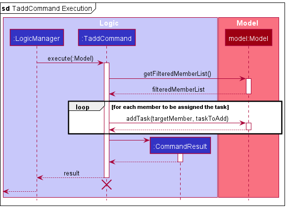
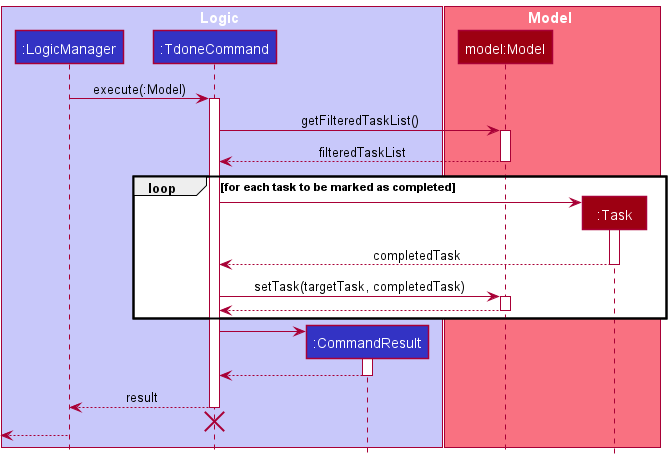

Ailurus is a **desktop application** designed to aid Organising Committees from the Computing Faculty in managing and accounting for their administrative concerns. It provides users with the ability to plan and manage events and tasks for their members. 

The Developer Guide seeks to provide detailed documentation for developers to set up their environment, and understand the architecture and the different components, as well as their implementations in various commands.
It also informs developers of the requirements and instructions for manual testing for Ailurus.

* Table of Contents
{:toc}
--------------------------------------------------------------------------------------------------------------------

## **Acknowledgements**

* This project is an extension of [SE-EDU AddressBook Level-3](https://se-education.org/addressbook-level3/)
* Our document formatting and content is referenced from [AY2122S1-CS2103T-T15-1](https://ay2122s1-cs2103t-t15-1.github.io/tp)
* Our project uses Scene Builder for UI components
* Libraries included: [JavaFX 8](https://docs.oracle.com/javase/8/javafx), [Jackson](https://github.com/FasterXML/jackson), [Junit5](https://github.com/junit-team/junit5)

--------------------------------------------------------------------------------------------------------------------

## **Setting up, getting started**

Refer to the guide [_Setting up and getting started_](SettingUp.md).

--------------------------------------------------------------------------------------------------------------------

## **Design**

:bulb: **Tip:** The `.puml` files used to create diagrams in this document can be found in the [diagrams](https://github.com/AY2122S1-CS2103T-T15-2/tp/tree/master/docs/diagrams/) folder. Refer to the [_PlantUML Tutorial_ at se-edu/guides](https://se-education.org/guides/tutorials/plantUml.html) to learn how to create and edit diagrams.

### Architecture

The ***Architecture Diagram*** given above explains the high-level design of the App.

Given below is a quick overview of main components and how they interact with each other.

**Main components of the architecture**

**`Main`** has two classes called [`Main`](https://github.com/AY2122S1-CS2103T-T15-2/tp/tree/master/src/main/java/seedu/address/Main.java) and [`MainApp`](https://github.com/AY2122S1-CS2103T-T15-2/tp/tree/master/src/main/java/seedu/address/MainApp.java). It is responsible for,
* At app launch: Initializes the components in the correct sequence, and connects them up with each other.
* At shut down: Shuts down the components and invokes cleanup methods where necessary.

[**`Commons`**](#common-classes) represents a collection of classes used by multiple other components.

The rest of the App consists of four components.

* [**`UI`**](#ui-component): The UI of the App.
* [**`Logic`**](#logic-component): The command executor.
* [**`Model`**](#model-component): Holds the data of the App in memory.
* [**`Storage`**](#storage-component): Reads data from, and writes data to, the hard disk.

**How the architecture components interact with each other**

The *Sequence Diagram* below shows how the components interact with each other for the scenario where the user issues the command `mdel /m 1`.

Each of the four main components (also shown in the diagram above),

* defines its *API* in an `interface` with the same name as the Component.
* implements its functionality using a concrete `{Component Name}Manager` class (which follows the corresponding API `interface` mentioned in the previous point.

For example, the `Logic` component defines its API in the `Logic.java` interface and implements its functionality using the `LogicManager.java` class which follows the `Logic` interface. Other components interact with a given component through its interface rather than the concrete class (reason: to prevent outside component's being coupled to the implementation of a component), as illustrated in the (partial) class diagram below.

The sections below give more details of each component.

### UI component

[comment]: <> (TODO: LEEROY)

The **API** of this component is specified in [`Ui.java`](https://github.com/AY2122S1-CS2103T-T15-2/tp/tree/master/src/main/java/seedu/address/ui/Ui.java)

The UI consists of a `MainWindow` that is made up of parts e.g.`CommandBox`, `ResultDisplay`, `MemberListPanel`, 
`EventListPanel`, `TasKListPanel`, `StatusBarFooter` etc. All these, including the `MainWindow`, inherit from the abstract `UiPart` 
class which captures the commonalities between classes that represent parts of the visible GUI.

The `UI` component uses the JavaFx UI framework. The layout of these UI parts are defined in matching `.fxml` files 
that are in the `src/main/resources/view` folder. For example, the layout of the [`MainWindow`](https://github.
com/AY2122S1-CS2103T-T15-2/tp/tree/master/src/main/java/seedu/address/ui/MainWindow.java) is specified in 
[`MainWindow.fxml`](https://github.com/AY2122S1-CS2103T-T15-2/tp/tree/master/src/main/resources/view/MainWindow.fxml)

The `UI` component,

* executes user commands using the `Logic` component.
* listens for changes to `Model` data so that the UI can be updated with the modified data.
* keeps a reference to the `Logic` component, because the `UI` relies on the `Logic` to execute commands.
* depends on some classes in the `Model` component, as it displays `Member`, `Event` and `Task` object residing in the `Model`.

#### Current Implementations of UI

The GUI currently reflects the entered events, members and tasks recorded in Ailurus. Currently, there are three main columns that reflect the `Event`, `Member` and `Task` objects that are residing in the `Model`. Directly adding or removing `Event`, `Member` or `Task` would update the `EventListPanel`, `MemberListPanel` and `TaskListPanel` to show their respective `EventListCard`, `MemberListCard` and `TaskListCard` respectively. Each of the `EventListCard`, `MemberListCard` and `TaskListCard` would display the fields under the 
corresponding `Event`, `Member` and `Task` objects as discussed under [Model Component](#model-component).

### Logic component

[comment]: <> (TODO: LEEROY)
**API** : [`Logic.java`](https://github.com/AY2122S1-CS2103T-T15-2/tp/tree/master/src/main/java/seedu/address/logic/Logic.java)

Here's a (partial) class diagram of the `Logic` component:

How the `Logic` component works:
1. When `Logic` is called upon to execute a command, it uses the `AddressBookParser` class to parse the user command.
1. This results in a `Command` object (more precisely, an object of one of its subclasses e.g., `MaddCommand`) which is executed by the `LogicManager`.
1. The command can communicate with the `Model` when it is executed (e.g. to add a member).
1. The result of the command execution is encapsulated as a `CommandResult` object which is returned from `Logic`.

The Sequence Diagram below illustrates the interactions within the `Logic` and `Model` components for the `execute("mdel /m 1")` 
API call.

:information_source: **Note:** The lifeline for `DeleteCommandParser` should end at the destroy marker (X) but due to a limitation of PlantUML, the lifeline reaches the end of diagram.

Here are the other classes in `Logic` (omitted from the class diagram above) that are used for parsing a user command:

How the parsing works:
* When called upon to parse a user command, the `AddressBookParser` class creates an `XYZCommandParser` (`XYZ` is a placeholder for the specific command name e.g., `AddCommandParser`) which uses the other classes shown above to parse the user command and create a `XYZCommand` object (e.g., `AddCommand`) which the `AddressBookParser` returns back as a `Command` object.
* All `XYZCommandParser` classes (e.g., `AddCommandParser`, `DeleteCommandParser`, ...) inherit from the `Parser` interface so that they can be treated similarly where possible e.g, during testing.

### Model component

**API** : [`Model.java`](https://github.com/AY2122S1-CS2103T-T15-2/tp/tree/master/src/main/java/seedu/address/model/Model.java)

The `Model` component,

* stores the address book data i.e., all `Member` objects (which are contained in a `UniqueMemberList` object), all `Event` objects (which are contained in a `UniqueEventList` object).
* stores a `TaskList` reference that points to the `TaskList` object that contains all the `Task` objects of the currently 'selected' `Member` object (e.g. result of a `tlist` command)
* stores the currently 'selected' `Member`, `Event` and `Task` objects (e.g., results of a search query) as separate _filtered_ lists which are exposed to outsiders as an unmodifiable `ObservableList<Member>`, `ObservableList<Event>` and `ObservableList<Task>` respectively that can be 'observed' e.g. the UI can be bound to this list so that the UI automatically updates when the data in the list change.
* stores a `UserPref` object that represents the user’s preferences. This is exposed to the outside as a `ReadOnlyUserPref` objects.
* does not depend on any of the other three components (as the `Model` represents data entities of the domain, they should make sense on their own without depending on other components)

Within the `Model` component,
* `Module` is the superclass of `Member`, `Event` and `Task`. `Module` has a `Name` field as the common attribute of its subclasses.
* `Event` has a `Name` field, `EventDate` field, and a field of a `HashMap<Member, Boolean>` to serve as a participant list with attendance.
* `Member` has its original fields from AB3 and an additional field of a `TaskList` to store all tasks assigned to the member.
* `Task` has a `Name` field, `TaskDeadline` field, and a `Boolean` field to represent the completion status of the task.

An alternative (arguably, a more OOP) model design is given below,

* `AddressBook` also stores all `Task` objects (which are contained in a `UniqueTaskList` object).
* Each `Member` object references `Task` object in the `UniqueTaskList`, instead of needing its own list of tasks.
However, this design has some issues in storage,
* Since Ailurus uses json files to store user data, json format members should at least store the unique identifier of each task the member had.
In our implementation, the unique identifier is `Name` and `TaskDeadline`, which are actually the main part of a `Task`.
* At the same time, json format member need to store the completion status of each referencing task.
* In all, implementing the storage of this member-task relation by using json file is likely to incur redundancy and error-prone,
so we decided to use an easier implementation, which is the current one.

A better implementation of the alternative design may involve using database management system like PostgreSQL,
a proposed entity relationship model diagram for the member-task relation is given here:[ER_diagram](https://github.com/AY2122S1-CS2103T-T15-2/tp/tree/master/docs/images/ER.png)

[comment]: <> (
:information_source: **Note:** An alternative &#40;arguably,) 

[comment]: <> (a more OOP&#41; model is given below. It has a `Position` list in the `AddressBook`, which `Member` references. This allows `AddressBook` to only require one `Position` object per unique POSITION, instead of each `Member` needing their own set of `Position` objects. )

[comment]: <> ()

[comment]: <> (
)

### Storage component

[comment]: <> (TODO: SAMUEL)
**API** : [`Storage.java`](https://github.com/AY2122S1-CS2103T-T15-2/tp/tree/master/src/main/java/seedu/address/storage/Storage.java)

The `Storage` component converts data from Ailurus to `json` format and back. It utilizes the `Jackson` library for this purpose.
Address book data is both saved and read from `./data/ailurus.json` while user preference data is from `./preferences.json`.
If the files and directories do not exist, they are created with sample data when the Ailurus application is launched.

The `Storage` component,
* can save both address book data and user preference data in `json` format, and read them back into corresponding objects.
* inherits from both `AddressBookStorage` and `UserPrefStorage`, which means it can be treated as either one (only one) depending on which functionality is needed.
* depends on some classes such as `Member`, `Event` and `Task` in the `Model` component (because the `Storage` component's job is to save/retrieve objects that belong to the `Model` thus depends on them to convert data to json format).

From the name of the classes(beginning with JsonAdapted), we can tell which class they are storing in `json` format. All of these data are stored
in the `JsonSerializableAddressBook`.

For Example,
* `JsonAdaptedTask` stores `Task` in `json` format.
* `JsonAdaptedEvent` stores `Event` in `json` format. 

### Common classes

Classes used by multiple components are in the `seedu.addressbook.commons` package.

--------------------------------------------------------------------------------------------------------------------

## **Workflow**

[comment]: <> (TODO: CHI XU)
Here is the Activity Diagram for a User when choosing the module and command to interact with in Ailurus:

## **Implementation**

This section describes some noteworthy details on how certain features are implemented.

<!--- TODO
#### Current Implementation of Event
New feature: Events
* Events can be added and deleted from event list via `eadd` and `edel` commands
* The participating members can be listed using the command `mlist /e EVENT_INDEX`
* New events created can have many participants selected from member list.
* <u>Design Decision</u>: Instead of only allowing adding of events and creating a command
  for adding participants separately, eadd command allows creation of complete event to
  minimise commands required to add them individually. The format is similar to `mdel` and `mlist` commands
  for familiarity with similar commands for other modules.

#### Future Plans for Event
Future plans for Events
* Include searching for the list of events for a participant
* Include filtering of events by month or events that are happening today.
* Include sorting of events by date, name or number of participants.
    * Dates should be in reverse chronological order so that upcoming events are shown first
* Include additional remarks or description for an event
#### Current Implementation for adding tasks
The proposed feature is achieved by getting the member(s) from the filtered member list
and use API from the model manager to add the task with given task name to each of the members.
The operations are exposed in the `Model` interface as `Model#getFilteredMemberlist()` and `Model#addTask()`.
Given below is an example usage scenario:
The user executes `tadd /n Take Attendance /d 21/10/2021 23:59 /m 1 /m 2`. The parser will be called upon to create a TaddCommandParser.
The parser will then parse the input to create a TaddCommand with task name as "Take Attendance", task deadline of "21/10/2021 23:59" and member indexes 1 and 2.
This command will add the task "Take Attendance" to the first and second member of the member list.
#### Current Implementation for deleting tasks
The proposed feature is achieved by getting the member(s) from the filtered member list
and use API from the model manager to delete the task with given task index from the member with given member index.
The operations are exposed in the `Model` interface as `Model#getFilteredMemberlist()` and `Model#deleteTask()`.
Given below is an example usage scenario:
The user executes `tdel /t 1`. The parser will be called upon to create a TdelCommandParser.
The parser will then parse the input to create a TdelCommand with task index as 1.
This command will delete the first task from the task list.
### List tasks feature for a member
#### Current Implementation for lists
The proposed feature is achieved by getting the member with given member index from the filtered member list
and use API from the model manager to list all the tasks of the member.
The operations are exposed in the `Model` interface as `Model#getFilteredMemberlist()` and `Model#updateFilteredTaskList()`.
Given below is an example usage scenario:
The user executes `tlist /m 1`. The parser will be called upon to create a TlistCommandParser.
The parser will then parse the input to create a TlistCommand with member index as 1.
This command will display all the tasks of the first member of the member list.
-->

### List members who attended event

This feature allows Ailurus users to list all members who have attended a particular event, identified by the event's `EVENT_INDEX` displayed in the current event list shown.

This feature can be accessed using `mlist` command with parameters `/e EVENT_INDEX` and `/att`. Once the user enters the command, the **Sequence Diagram** below illustrates the interactions within the `Logic` and `Model` components for the `execute("mlist /e 1 /att")` API call.

After the `LogicManager` receives the new `MlistCommand` object, `MlistCommand` would call the appropriate commands from `Model` and `Event` to get the correct index of the event from the filtered event list, get the list of members who attended the specific event, and set the current event while updating the filtered member list, as shown below.

### Add member to an event

This feature allows Ailurus users to add a list of members, identified by the members' `MEMBER_INDEX` displayed in the current member list shown, to a specific event, identified by the event's `EVENT_INDEX` displayed in the current event list shown.

This feature can be accessed using `emadd` command with parameters `/e EVENT_INDEX` and multiple `/m MEMBER_INDEX` to add multiple members to an event. Once the user enters the command, the **Sequence Diagram** below illustrates the interactions within the `Logic` and `Model` components for the `execute("emadd /e 1 /m 1 /m 2")` API call.

After the `LogicManager` receives the new `EmaddCommand` object, `EmaddCommand` would call the appropriate commands from `Model` and `Event` to get the indices from the current filtered event and member list, and add the members to be added in the event as shown below.

### Add event to Event List

[comment]: <> (TODO: SAMUEL)

### Mark event members as attended

[comment]: <> (TODO: SAMUEL)

### Task add command: `tadd`
This feature allows Ailurus users to add a new task for multiple members identified by their `MEMBER_INDEX` displayed in the currently shown member list.

This feature can be accessed by using `tadd` command with parameters of
* `/n NAME`: the name of the task to add
* `/d DATE_TIME`: the deadline of the task to add
* multiple `/m MEMBER_INDEX`: multiple target members identified by the index displayed in the currently shown member list

Given below is the sequence diagram when a user provides a valid `tadd` command: `tadd /n meeting /d 11/11/2021 20:00 /m 1 /m 2`
to add a new task with its name and deadline to the first and second member displayed in the currently shown member list.

As seen in the diagram above, once the user entered the `tadd` command,
the `Logic` component will parse the parameters and create a `Task` object based on the parameters and a `TaddCommand` object.

After `LogicManager` receives the `TaddCommand` object, 
1. `LogicManager` will call the `execute` method of `TaddCommand`.
2. `TaddCommand` will call `Model#getFilteredMemberList` to get the last shown member list.
3. `TaddCommand` will get the list of target members based on the `MEMBER_INDEX` list and the last shown member list.
4. `TaddCommand` will call `Model#addTask(targetMember, taskToAdd)` to add the new task to each target member .
5. `TaddCommand` will create a `CommandResult` object and return it to `LogicManager`.

### Mark a task as done command: `tdone`
This feature allows Ailurus users to mark multiple tasks as done. These tasks are identified by their `TASK_INDEX` displayed in the currently shown task list.

This feature can be accessed by using `tdone` command with multiple `/t TASK_INDEX` parameters.

Given below is the sequence diagram when a user provides a valid `tdone` command: `tdone /t 1 /t 2` to mark the first and second tasks in the task list as done.

:information_source: **Note:** The diagram below does not include the details of the construction of `TdoneCommand` object,
because its implementation is similar to the construction of `TaddCommand` shown in the previous example.

After `LogicManager` receives the `TdoneCommand` object,
1. `LogicManager` will call the `execute` method of `TdonedCommand`.
2. `TdoneCommand` will call `Model#getFilteredTaskList` to get the last shown task list.
3. `TdoneCommand` will get the list of target tasks based on the `TASK_INDEX` list and the last shown task list.
4. `TdoneCommand` will construct a completed `Task` object based on each target task.
5. `TdoneCommand` will call `Model#setTask(targetTask, completedTask)` to set each original target task to a completed task.
6. `TdoneCommand` will create a `CommandResult` object and return it to `LogicManager`.

### \[Proposed\] Undo/redo feature

#### Proposed Implementation

The proposed undo/redo mechanism is facilitated by `VersionedAddressBook`. It extends `AddressBook` with an undo/redo history, stored internally as an `addressBookStateList` and `currentStatePointer`. Additionally, it implements the following operations:

* `VersionedAddressBook#commit()` — Saves the current address book state in its history.
* `VersionedAddressBook#undo()` — Restores the previous address book state from its history.
* `VersionedAddressBook#redo()` — Restores a previously undone address book state from its history.

These operations are exposed in the `Model` interface as `Model#commitAddressBook()`, `Model#undoAddressBook()` and `Model#redoAddressBook()` respectively.

Given below is an example usage scenario and how the undo/redo mechanism behaves at each step.

Step 1. The user launches the application for the first time. The `VersionedAddressBook` will be initialized with the initial address book state, and the `currentStatePointer` pointing to that single address book state.

Step 2. The user executes `mdel /m 5` command to delete the 5th member in the address book. The `mdel` command calls `Model#commitAddressBook()`, causing the modified state of the address book after the `mdel /m 5` command executes to be saved in the `addressBookStateList`, and the `currentStatePointer` is shifted to the newly inserted address book state.

Step 3. The user executes `madd /n David …​` to add a new member. The `madd` command also calls `Model#commitAddressBook()`, causing another modified address book state to be saved into the `addressBookStateList`.

:information_source: **Note:** If a command fails its execution, it will not call `Model#commitAddressBook()`, so the address book state will not be saved into the `addressBookStateList`.

Step 4. The user now decides that adding the member was a mistake, and decides to undo that action by executing the `undo` command. The `undo` command will call `Model#undoAddressBook()`, which will shift the `currentStatePointer` once to the left, pointing it to the previous address book state, and restores the address book to that state.

:information_source: **Note:** If the `currentStatePointer` is at index 0, pointing to the initial AddressBook state, then there are no previous AddressBook states to restore. The `undo` command uses `Model#canUndoAddressBook()` to check if this is the case. If so, it will return an error to the user rather
than attempting to perform the undo.

The following sequence diagram shows how the undo operation works:

:information_source: **Note:** The lifeline for `UndoCommand` should end at the destroy marker (X) but due to a limitation of PlantUML, the lifeline reaches the end of diagram.

The `redo` command does the opposite — it calls `Model#redoAddressBook()`, which shifts the `currentStatePointer` once to the right, pointing to the previously undone state, and restores the address book to that state.

:information_source: **Note:** If the `currentStatePointer` is at index `addressBookStateList.size() - 1`, pointing to the latest address book state, then there are no undone AddressBook states to restore. The `redo` command uses `Model#canRedoAddressBook()` to check if this is the case. If so, it will return an error to the user rather than attempting to perform the redo.

Step 5. The user then decides to execute the command `mlist`. Commands that do not modify the address book, such as `mlist`, will usually not call `Model#commitAddressBook()`, `Model#undoAddressBook()` or `Model#redoAddressBook()`. 
Thus, the `addressBookStateList` remains unchanged.

The following activity diagram summarizes what happens when a user executes a new command:

#### Design considerations:

**Aspect: How undo & redo executes:**

* **Alternative 1 (current choice):** Saves the entire address book.
  * Pros: Easy to implement.
  * Cons: May have performance issues in terms of memory usage.

* **Alternative 2:** Individual command knows how to undo/redo by
  itself.
  * Pros: Will use less memory (e.g. for `mdel`, just save the member being deleted).
  * Cons: We must ensure that the implementation of each individual command are correct.

_{more aspects and alternatives to be added}_

### \[Proposed\] Data archiving

_{Explain here how the data archiving feature will be implemented}_

--------------------------------------------------------------------------------------------------------------------

## **Documentation, logging, testing, configuration, dev-ops**

* [Documentation guide](Documentation.md)
* [Testing guide](Testing.md)
* [Logging guide](Logging.md)
* [Configuration guide](Configuration.md)
* [DevOps guide](DevOps.md)

--------------------------------------------------------------------------------------------------------------------

## **Appendix: Requirements**

### Product scope

**Target user profile**:

* prefer desktop apps over other types
* has trouble managing the multitude of details related to the members of his club
* want to assign tasks for members
* has a need to organize and plan events for members
* likes typing and comfortable with CLI
* prefers typing to mouse interactions

**Value proposition**: 

* manage contacts faster than a typical mouse/GUI driven app
* manage club events and tasks/activities for large amount of members
* contact and personal information of members collated in an easily accessible location
* able to update details relating to members
* categorise members into groups for smoother planning

### User stories

Priorities: High (must have) - `* * *`, Medium (nice to have) - `* *`, Low (unlikely to have) - `*`

#### Member-related Functions

| Priority | As a …​                                    | I want to …​                     | So that I can…​                                                        |
| -------- | ------------------------------------------ | ------------------------------ | ---------------------------------------------------------------------- |
| `* * *`  | user                                       | add a new member               | update the increase or change in members |
| `* * *`  | user                                       | have address fields for members | |
| `* * *`  | user                                       | kick a member                | remove members or troublemakers from the club |
| `* * *`  | user                                       | have email address field for members | |

#### Task Functions

| Priority | As a …​                                    | I want to …​                     | So that I can…​                                                        |
| -------- | ------------------------------------------ | ------------------------------ | ---------------------------------------------------------------------- |
| `* * *`  | user                                       | create tasks for my members or myself | |
| `* *`  | user                                       | see the completion status and description of tasks for members | know the requirements and status of the task |
| `*`  | user                                       | mark a task as completed, overdue or uncompleted | keep track of my tasks that are on-hand |
| `* *`  | user                                       | add a deadline to task | keep track of who has overdue tasks |
| `* * *`  | user                                       | delete already obscure and unnecessary tasks | have a cleaner task list |

#### Storage Functions

| Priority | As a …​                                    | I want to …​                     | So that I can…​                                                        |
| -------- | ------------------------------------------ | ------------------------------ | ---------------------------------------------------------------------- |
| `* * *`  | user                                       | load members from other files | access and manage different sets of data |
| `*`  | user                                       | write my data to a file as save data | access them and resume at a later date |

#### Event Functions

| Priority | As a …​                                    | I want to …​                     | So that I can…​                                                        |
| -------- | ------------------------------------------ | ------------------------------ | ---------------------------------------------------------------------- |
| `* * *`  | user                                       | add all members of a particular event to one group | send notifications to only those involved |

#### Other miscellaneous Functions

| Priority | As a …​                                    | I want to …​                     | So that I can…​                                                        |
| -------- | ------------------------------------------ | ------------------------------ | ---------------------------------------------------------------------- |
| `* * *`  | new user                                   | see usage instructions         | refer to instructions when I forget how to use the App                 |
| `* * *`  | user                                       | find a member by name          | locate details of members without having to go through the entire list |
| `*`    | user                                       | hide private contact details   | minimize chance of someone else seeing them by accident                |
| `*`      | user with many members in the address book | sort members by name           | locate a member easily                                                 |

*{More to be added}*

### Use cases

(For all use cases below, the **System** is the `Ailurus` and the **Actor** is the `user`, unless specified otherwise)

**Use case: UC1 - Add a member**

**MSS**

1.  User requests to add a member, providing necessary details.
2.  Ailurus adds the member.

    Use case ends.

**Extensions**

* 1a. Invalid format or incomplete details provided by user

    * 1a1. Ailurus shows an error message about missing or invalid input.

      Use case ends.

**Use case: UC2 - Delete a member**

**MSS**

1.  User requests to list members
2.  Ailurus shows a list of members
3.  User requests to delete a specific member in the list
4.  Ailurus deletes the member

    Use case ends.

**Extensions**

* 2a. The list is empty.

  Use case ends.

* 3a. The given index is invalid.

    * 3a1. Ailurus shows an error message.

      Use case resumes at step 2.

**Use case: UC3 - Add a task to a member**

**MSS**

1.  User requests to add a task to a specific member, providing details if necessary.
2.  Ailurus adds the task to the member.

    Use case ends.

**Extensions**

* 1a. Invalid format or incomplete details provided by user

    * 1a1. Ailurus shows an error message about missing or invalid input.

      Use case ends.

* 1b. The given index is invalid.

    * 1b1. Ailurus shows an error message about invalid index.

      Use case ends.

**Use case: UC4 - Delete a task from a member**

**MSS**

1.  User requests to list tasks of a specific member
2.  Ailurus shows a list of tasks
3.  User requests to delete a specific task in the list
4.  Ailurus deletes the task

    Use case ends.

**Extensions**

* 1a. The given index of member is invalid

    * 1a1. Ailurus shows an error message.

      Use case ends.

* 2a. The list is empty.

  Use case ends.

* 3a. The given index of task is invalid.

    * 3a1. Ailurus shows an error message.

      Use case resumes at step 2.

**Use case: UC5 - Mark a task as done**

**MSS**

1.  User requests to list tasks of a specific member
2.  Ailurus shows a list of tasks
3.  User requests to mark a specific task as done
4.  Ailurus marks task as done

    Use case ends.

**Extensions**

* 1a. The given index of member is invalid

    * 1a1. Ailurus shows an error message.

      Use case ends.

* 2a. The list is empty.

  Use case ends.

* 3a. The given index of task is invalid.

    * 3a1. Ailurus shows an error message.

      Use case resumes at step 2.

**Use case: UC6 - Add an event**

**MSS**

1.  User requests to add an event, providing necessary details.
2.  Ailurus adds the event.

    Use case ends.

**Extensions**

* 1a. Invalid format or incomplete details provided by user

    * 1a1. Ailurus shows an error message about missing or invalid input.

      Use case ends.

**Use case: UC7 - Delete an event**

**MSS**

1.  User requests to list events
2.  Ailurus shows a list of events
3.  User requests to delete a specific event in the list
4.  Ailurus deletes the event

    Use case ends.

**Extensions**

* 1a. Invalid format or incomplete details provided by user

    * 1a1. Ailurus shows an error message about missing or invalid input.

      Use case ends.

*{More to be added}*

### Non-Functional Requirements

1.  Should work on any _mainstream OS_ as long as it has Java `11` or above installed.
2.  Should be able to hold up to 1000 members without a noticeable sluggishness in performance for typical usage.
3.  A user with above average typing speed for regular English text (i.e. not code, not system admin commands) should be able to accomplish most of the tasks faster using commands than using the mouse.
4.  Should run on user computer with double-click - no installer or additional libraries required.
5.  The system should respond within two seconds.
6.  The system should work on both 32-bit and 64-bit environments.
7.  The system should be usable by a novice who has never used a CLI app before.
8.  The project is expected to adhere to a schedule that delivers features of a milestone for every two weeks.    
9.  Should be able to hold up to 1000 event managers and participants without a noticeable delay (less than 2 seconds) in performance for typical usage.
10. The product should be for a single user i.e. (not a multi-user product), and should not depend on a remote server and does not require an installer. 
11. The software should work on the Windows, Linux, and OS-X platforms.
12. The GUI should work well with standard screen resolutions 1920x1080 and higher, and
    for screen scales 100% and 125%. It should be usable for resolutions 1280x720 and higher, and
    for screen scales 150%.    
    *{More to be added}*

### Glossary

* **Mainstream OS**: Windows, Linux, Unix, OS-X
* **Private contact detail**: A contact detail that is not meant to be shared with others

*{More to be added}*

--------------------------------------------------------------------------------------------------------------------

## **Appendix: Instructions for manual testing**

Given below are instructions to test the app manually.

:information_source: **Note:** These instructions only provide a starting point for testers to work on;
testers are expected to do more *exploratory* testing.

### Launch and shutdown

1. Initial launch

   1. Download the jar file and copy into an empty folder

   2. Double-click the jar file. If unable to double click, running `java -jar ailurus.jar` may be required, at the directory where `ailurus.jar` is in. Expected: Shows the GUI with a set of sample events and members. The window size may not be optimum.

2. Saving window preferences

   1. Resize the window to an optimum size. Move the window to a different location. Close the window.

   2. Re-launch the app by double-clicking the jar file. 
       Expected: The most recent window size and location is retained.

### Member tests

#### Adding a member

1. Adding a member to the `Member List`. 

   1. Test case: `madd /n James Tan /ph 91234567` 
   Expected: New member with name and phone number is present, but email and address are `NIL`.

   2. Test case: `madd /n Amy Lee2 /ph 98765432 /em amylee89@example.com /a Amos Street 52 Blk 22 #05-12 /p Finance Assistant /p Secretary` 
   Expected: New member with all fields present, including 2 positions `Finance Assistant` and `Secretary`.

   3. Test case: `madd /n Jamie Lee /ph 92345678 /p Vice-President`
   Expected: Error message that positions should only contain alphanumeric characters and spaces, so `-` character is not allowed.

#### Deleting a member

1. Deleting a member while all members are being shown

   1. Prerequisites: List all members using the `mlist` command. Multiple members in the list.

   2. Test case: `mdel /m 1` 
      Expected: First contact is deleted from the list. Details of the deleted contact shown in the status message.

   3. Test case: `mdel /m 0` 
      Expected: No member is deleted. Error details shown in the status message. Status bar remains the same.

   4. Other incorrect delete commands to try: `mdel`, `mdel /m x`, `...` (where x is larger than the list size) 
      Expected: Similar to previous.

#### Listing members of an event

1. Listing all members participating in an event in `EVENT LIST`

   1. Prerequisite: `EVENT LIST` must have at least one event, and the event should have at least one member participating.

   2. Test case: `mlist /e 1`
   Expected: List all participating members in the event in `MEMBER LIST` column

   3. Test case: `mlist /e 0`
   Expected: Error message that `MEMBER_INDEX` should be a non-zero unsigned integer.

#### Finding all members with a task

1. Listing all members with a task that contains specific word(s) (non-exact match)
   1. Prerequisite: `MEMBER LIST` must have at least one member with a task with the word `form` in it
   2. Test case: `mtfind form`
   Expected: List only members with `form` word in the list of tasks.
   3. Test case: `mtfind -`
   Expected: 0 members listed, because `-` is not a valid name for task name.

### Event tests

#### Listing an event

1. List all events

    1. Test case: `elist` 
       Expected: All events are shown in the event list. Success message shown.
       
#### Adding an event

1. Adding an event with zero or more members while all members are being shown

    1. Prerequisites: List all members using the `mlist` command. At least 3 members in the list.

    2. Test case: `eadd /n Music Concert /d 11/09/2022` 
       Expected: A new event will be added to the event list. Name and date of the added event is shown in the status message.

    3. Test case: `eadd /n Music Concert /d 11/09/2022 /m 2 /m 3` 
       Expected: A new event will be added to the event list with second and third member of the member list. Name and date of the added event is shown in the status message.
       In the event list, in the card for the event added, two red labels representing the second and third members are present.
       
    4. Test case: `eadd /n boat trip /d 11/09/1800 /m 2 /m 3` 
       Expected: No event is added due to wrong input for date out of range. Error details shown in the status message.
       
#### Deleting event

1. Deleting an event while all events are being shown

    1. Prerequisites: List all events using the `elist` command. Multiple events in the list.

    2. Test case: `edel /e 1` 
       Expected: First event is deleted from the event list. Name and date of the deleted event shown in the status message.

    3. Test case: `edel /e 0` 
       Expected: No event is deleted. Error details shown in the status message. Status bar remains the same.

    4. Other incorrect delete commands to try: `edel`, `edel /e x`, `...` (where x is larger than the list size) 
       Expected: Similar to previous.
       
#### Editing an event

1. Editing an existing event while all members and events are being shown

    1. Prerequisites: List all members using the `mlist` command.
       List all events using the `elist` command. Multiple members and events in member and event list respectively.
       At least two events in event list and three members in member list.

    2. Test case: `eedit /e 1 /n Freshman Orientation Project Discussion /d 22/11/2021` 
       Expected: First event has new name and date displayed on its card in the event list.
       New name and date of the edited event shown in the status message.

    3. Test case: `eedit /e 2 /m 1 /m 2 /m 3` 
       Expected: Second event now only has first, second and third member. Displayed in its own event card.

    4. Test case: `eedit /e 2 /m` 
       Expected: Second event now has no members. Displayed in its own event card with no labels for member present.
       
#### Adding a member to an event

1. Adds existing members to an existing event while all members and events are being shown

    1. Prerequisites: List all members using the `mlist` command.
       List all events using the `elist` command. Multiple members and events in member and event list respectively.
       At least two events in event list and three members in member list.

    2. Test case: `emadd /e 1 /m 2 /m 3` 
       Expected: First event now also has second and third members displayed on its card in the event list.

    3. Test case: `emadd /e 2 /m 0` 
       Expected: No member is added to the second event. Error details shown in the status message.

    4. Test case: `emadd /e 2 /m 1` 
       Expected: Second event now also has the first member displayed on its card in the event list.
       
#### Deleting a member from an event

1. Deletes existing members from an existing event while all members and events are being shown

    1. Prerequisites: List all members using the `mlist` command.
       List all events using the `elist` command. Multiple members and events in member and event list respectively.
       At least one event in event list and three members in member list.

    2. Test case: `emdel /e 1 /m 2 /m 3` 
       Expected: First event no longer has the second and third members displayed on its card in the event list.

    3. Test case: `emdel /e 1 /m 0` 
       Expected: No member is deleted from the first event. Error details shown in the status message.

    4. Test case: `emdel /e 1 /m 1` 
       Expected: First event no longer has the first member displayed on its card in the event list.
       
#### Mark all members of event as attended

1. Marks all members of an event.

    1. Prerequisites: List all events using the `elist` command. 
       At least one event in the list with at least two members. If not use `eadd` and/or `emadd` to obtain this event.

    2. Test case: `emarkall /e 1` 
       Expected: First event has all its members marked as attended. The member labels on its card are all green
       and no red. 
       
#### Mark specific members of event as attended

1. Marks members of an event.

    1. Prerequisites: List all members attending the first event using `mlist /e 1`.
       At least one event in the list with at least two members. If not use `eadd` and/or `emadd` to obtain this event.

    2. Test case: `emark /e 1 /m 1` 
       Expected: First event has the first member marked as attended. The member label on its card for the first
       member is green.
       
    2. Test case: `emark /e 1 /m 1 /m 2` 
       Expected: First event has the first member and second member marked as attended.
       The member label on its card for the first and second members are green.   
       
       
#### Unmark specific members of event

1. Unmarks members of an event.

    1. Prerequisites: List all members attending the first event using `mlist /e 1`.
       At least one event in the list with at least two members. If not use `eadd` and/or `emadd` to obtain this event.

    2. Test case: `eunmark /e 1 /m 1` 
       Expected: First event has the first member marked as absent. The member label on its card for the first
       member is red.

    2. Test case: `emark /e 1 /m 1 /m 2` 
       Expected: First event has the first member and second member marked as absent.
       The member label on its card for the first and second members are red.

#### Finding an event

1. Finds and list all events with names containing any of the given keywords. Matching is not strict. Case-insensitive
search for name.

    1. Prerequisites: Have an event with the name cat, and an event with the name DOG.

    2. Test case: `efind ca` 
       Expected: Event list has the event with the name cat in it. All other events with 'ca' as part of its name is
       in the event list. 

    3. Test case: `efind c dog` 
       Expected: Event list has both the events with the name cat and dog in it. All other events with 'c' 
       and/or 'dog 'as part of its name is in the event list.
      
### Task tests

#### Adding a task

1. Adding a task to one or more members while all members are being shown

    1. Prerequisites: List all members using the `mlist` command. At least 3 members in the list.

    2. Test case: `tadd /n group meeting /d 22/11/2021 12:00 /m 1` 
    Expected: A new task will be added to the first member's task list. Details of the added task shown in the status message.

    3. Test case: `tadd /n submit report /d 11/11/2021 23:59 /m 2 /m 3` 
    Expected: A new task will be added to the second and third members' task lists. Details of the added task shown in the status message.
    
#### Deleting a task

1. Deleting a task from the currently selected member's task list while the task list is being shown

   1. Prerequisites: List all tasks of the first member using the `tlist /m 1` command. Multiple tasks in the list.

   2. Test case: `tdel /t 1` 
   Expected: First task is deleted from the currently shown task list. Success message will be shown in the status message.

#### Marking one or more task(s) as completed

1. Marking one or more task(s) as completed while the currently selected member's task list is being shown

    1. Prerequisites: List all tasks of the first member using the `tlist /m 1` command. At least 3 tasks in the list.

    2. Test case: `tdone /t 1` 
       Expected: First task is marked as completed. Success message will be shown in the status message.

    3. Test case: `tdone /t 2 /t 3` 
       Expected: Second and third tasks are marked as completed. Success message will be shown in the status message.

#### Marking one or more task(s) as incomplete

1. Marking one or more task(s) as incomplete while the currently selected member's task list is being shown

    1. Prerequisites: List all tasks of the first member using the `tlist /m 1` command. At least 3 tasks in the list.

    2. Test case: `tundone /t 1` 
       Expected: First task is marked as incomplete. Success message will be shown in the status message.

    3. Test case: `tundone /t 2 /t 3` 
       Expected: Second and third tasks are marked as incomplete. Success message will be shown in the status message.

#### Editing a task

1. Editing an existing task while the currently selected member's task list is being shown

    1. Prerequisites: List all tasks of the first member using the `tlist /m 1` command. Multiple tasks in the list.

    2. Test case: `tedit /t 1 /n CS2103T submission` 
       Expected: First task's name is changed to `CS2103T submission`. Success message will be shown in the status message.

    3. Test case: `tedit /t 1 /d 10/11/2021 23:59` 
        Expected: First task's deadline is changed to `10/11/2021 23:59`. Success message will be shown in the status message.

    4. Test case: `tedit /t 2 /n CS2101 submission /d 12/11/2021 23:59` 
       Expected: Second task's name is changed to `CS2101 submission`, and its deadline is changed to `12/11/2021 23:59`. Success message will be shown in the status message.

#### Listing of tasks

1. Listing all tasks of a member

    1. Prerequisites: List all members using the `mlist` command. Multiple members in the list.

    2. Test case: `tlist /m 1` 
       Expected: All tasks of the first member displayed in the currently shown member list will be displayed. Success message will be shown in the status message.

2. Listing all incomplete tasks of a member

   1. Prerequisites: List all members using the `mlist` command. Multiple members in the list.

   2. Test case: `tlist /m 1 /dn n` 
      Expected: All incomplete tasks of the first member displayed in the currently shown member list will be displayed. Success message will be shown in the status message.

3. Listing all completed tasks of a member

    1. Prerequisites: List all members using the `mlist` command. Multiple members in the list.

    2. Test case: `tlist /m 1 /dn y` 
       Expected: All completed tasks of the first member displayed in the currently shown member list will be displayed. Success message will be shown in the status message.

4. Listing all overdue tasks of a member

    1. Prerequisites: List all members using the `mlist` command. Multiple members in the list.

    2. Test case: `tlist /m 1 /ovd` 
       Expected: All overdue tasks of the first member displayed in the currently shown member list will be displayed. Success message will be shown in the status message.

### Saving data

1. Dealing with missing/corrupted data files

   1. Test case: Add invalid characters such as `@` to the file, such as after any `{`.
   Expected: Ailurus launches with no data.
   Solution: remove data file and restart ailurus application.

## **Appendix: Effort**

[comment]: <> (https://docs.google.com/document/d/10rPMnwmrThbKavWpjAlYiz8w-_u1WaiaiBqwbc30VcA/edit)

Overall, the team felt that this project was moderately difficult, due to the lack of experience in [JavaFX](https://openjfx.io/) library and managing a codebase that was larger than expected. Most of the features added were `CRUD` (Create, Read, Update, Delete) related, with exceptions to find and filtering features in `tlist` and `mlist` commands, as well as marking commands.

### Challenges faced

The difficulty lies in the increased complexity of the application as it grows. While the original `Addressbook-level-3 (AB3)` only handles one module, which is the `Person` module, we refactored it to `Member` and added 2 more layers of complexity to it: the `Task` and the `Event` modules, which all inherit from a generic `Module` class. As such, we had to deal with more interactions between the modules, such as in listing all members in an event, or listing all overdue tasks of a member, and so on. Also, we had to update the state of the JavaFX UI constantly with each change in state. Hence, there is a need to monitor the communications between the `Logic`, `Model` and `UI` APIs to allow smooth transitions and updating of `FilteredList<T>` passed to the UI, and it would not be easy to do so if we only display one screen at a time. As our JavaFX knowledge was limited, we decided to go with 3 columns showing `Event`, `Members` and `Tasks`. [This was our Mockup UI for illustration.](https://ay2122s1-cs2103t-t15-2.github.io/tp/images/UImockup.png)

We also faced difficulties in deciding our architecture for our `Model` component, as we had different iterations of possible UML class diagram of the proposed `Model` component ([overview idea](https://ay2122s1-cs2103t-t15-2.github.io/tp/images/modeloverview.png), [v1](https://ay2122s1-cs2103t-t15-2.github.io/tp/images/modelv1.png), [v2](https://ay2122s1-cs2103t-t15-2.github.io/tp/images/modelv2.png), [final version](https://ay2122s1-cs2103t-t15-2.github.io/tp/images/ModelClassDiagram.png)). At first, there was the idea that events have multiple members, but members should also have many events, and therefore they could have a many-to-many relationship. However, we realised that this was not a trivial case, as our storage uses JSON objects, which in itself is limited as it is unlike relational databases like [SQL](https://en.wikipedia.org/wiki/SQL). Therefore, having no foreign keys in such a database requires a lot of duplication of data, which we felt was unnecessary considering the simplicity of our product, hence we decided not to go forth with the idea.

### Achievements in the project

* To implement the 3 columns for `Event List`, `Member List` and `Task List`, we had to learn about [SplitPane](https://docs.oracle.com/javase/8/javafx/api/javafx/scene/control/SplitPane.html) and made it such that the positions are approximately a third of the whole size and that the columns are resizable to a certain degree.

* We also learnt about the property of `textwrap` to allow larger words and names to be stored and shown. The `textwrap` property also allows dynamic text wrapping with different width of the column, to ensure that the data is fully visible by the user.

* The `CRUD` commands for `Event`, `Member` and `Task` were mostly referred from AB3’s `Person` commands and classes. However, some fields were created and tested by the team, such as the use of `LocalDateTime` and `LocalDate` from the Java library for `Event` and `Task` respectively, to capture the date and time parsed as string by user.

* We increased user experience by color coding the tasks of members and members of events with red and green, red being undone tasks or absent members, while red being done tasks or present members who attended the event.

* We enforced commands to require a space between the prefix and the parameter, to allow easier readability of parameter, and it is also more intuitive to use `/prefix` commands with `/` before the prefix, similar to chatbots and UNIX commands usually have the symbol before the flag or prefix.

* We showed the number of members / tasks / events listed for most listing and finding command, except those commands which show the full list.

* We customized our UI to produce blue highlighting of cards if you click on them for selecting of a specific card if the list gets very long.

