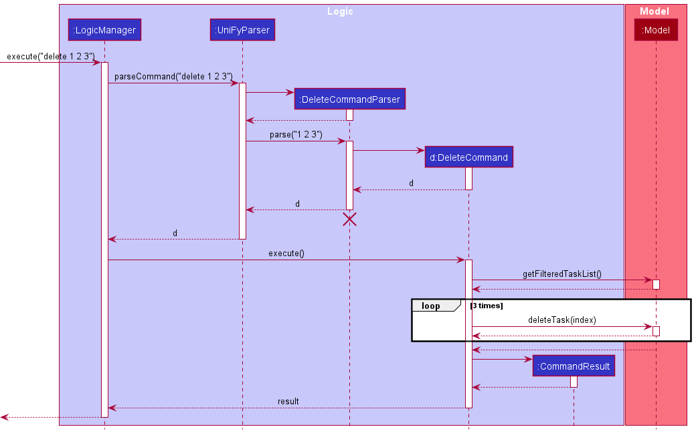
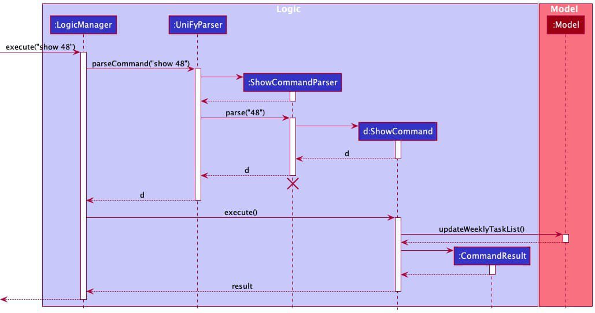

* Table of Contents
{:toc}

--------------------------------------------------------------------------------------------------------------------
## 1. Introduction 

### 1.1 Overview
This developer guide provides an overview and details of Uni-Fy's system architecture and implementation. We hope it provides you a useful reference should you wish to understand the technical details behind Uni-Fy's implementation. 

### 1.2 Acknowledgements

- Adapted from  AddressBook Level-3 project created as part of the SE-EDU initiative
- The application logo was generated with Wix Logo Maker. 
- Our diagrams were mostly generated with PlantUML.

### 1.3 Setting up, getting started

Refer to the guide [_Setting up and getting started_](SettingUp.md).

--------------------------------------------------------------------------------------------------------------------

## 2. Design

:bulb: **Tip:** The `.puml` files used to create diagrams in this document can be found in the [diagrams](https://github.com/se-edu/addressbook-level3/tree/master/docs/diagrams/) folder. Refer to the [_PlantUML Tutorial_ at se-edu/guides](https://se-education.org/guides/tutorials/plantUml.html) to learn how to create and edit diagrams.

### 2.1 Architecture

The ***Architecture Diagram*** given above explains the high-level design of the App.

Given below is a quick overview of main components and how they interact with each other.

**Main components of the architecture**

**`Main`** has two classes called [`Main`](https://github.com/se-edu/addressbook-level3/tree/master/src/main/java/seedu/address/Main.java) and [`MainApp`](https://github.com/se-edu/addressbook-level3/tree/master/src/main/java/seedu/address/MainApp.java). It is responsible for,
* At app launch: Initializes the components in the correct sequence, and connects them up with each other.
* At shut down: Shuts down the components and invokes cleanup methods where necessary.

[**`Commons`**](#common-classes) represents a collection of classes used by multiple other components.

The rest of the App consists of four components.

* [**`UI`**](#ui-component): The UI of the App.
* [**`Logic`**](#logic-component): The command executor.
* [**`Model`**](#model-component): Holds the data of the App in memory.
* [**`Storage`**](#storage-component): Reads data from, and writes data to, the hard disk.

**How the architecture components interact with each other**

The *Sequence Diagram* below shows how the components interact with each other for the scenario where the user issues the command `delete 1`.

Each of the four main components (also shown in the diagram above),

* defines its *API* in an `interface` with the same name as the Component.
* implements its functionality using a concrete `{Component Name}Manager` class (which follows the corresponding API `interface` mentioned in the previous point.

For example, the `Logic` component defines its API in the `Logic.java` interface and implements its functionality using the `LogicManager.java` class which follows the `Logic` interface. Other components interact with a given component through its interface rather than the concrete class (reason: to prevent outside component's being coupled to the implementation of a component), as illustrated in the (partial) class diagram below.

The sections below give more details of each component.

### 2.2 UI component

The **API** of this component is specified in [`Ui.java`](https://github.com/AY2122S1-CS2103T-W17-4/tp/blob/master/src/main/java/seedu/unify/ui/Ui.java)

The UI consists of a `MainWindow` that is made up of parts e.g.`CommandBox`, `ResultDisplay`, `TaskListPanel`, `StatusBarFooter` etc. All these, including the `MainWindow`, inherit from the abstract `UiPart` class which captures the commonalities between classes that represent parts of the visible GUI.

The `UI` component uses the JavaFx UI framework. The layout of these UI parts are defined in matching `.fxml` files that are in the `src/main/resources/view` folder. For example, the layout of the [`MainWindow`](https://github.com/se-edu/addressbook-level3/tree/master/src/main/java/seedu/address/ui/MainWindow.java) is specified in [`MainWindow.fxml`](https://github.com/se-edu/addressbook-level3/tree/master/src/main/resources/view/MainWindow.fxml)

The `UI` component,

* executes user commands using the `Logic` component.
* listens for changes to `Model` data so that the UI can be updated with the modified data.
* keeps a reference to the `Logic` component, because the `UI` relies on the `Logic` to execute commands.
* depends on some classes in the `Model` component, as it displays `Task` object residing in the `Model`.

### 2.3 Logic component

**API** : [`Logic.java`](https://github.com/AY2122S1-CS2103T-W17-4/tp/blob/master/src/main/java/seedu/unify/logic/Logic.java)

Here's a (partial) class diagram of the `Logic` component:

How the `Logic` component works:
1. When `Logic` is called upon to execute a command, it uses the `UniFyParser` class to parse the user command.
1. This results in a `Command` object (more precisely, an object of one of its subclasses e.g., `AddCommand`) which is executed by the `LogicManager`.
1. The command can communicate with the `Model` when it is executed (e.g. to add a task).
1. The result of the command execution is encapsulated as a `CommandResult` object which is returned back from `Logic`.

The Sequence Diagram below illustrates the interactions within the `Logic` component for the `execute("delete 1")` API call.

:information_source: **Note:** The lifeline for `DeleteCommandParser` should end at the destroy marker (X) but due to a limitation of PlantUML, the lifeline reaches the end of diagram.

Here are the other classes in `Logic` (omitted from the class diagram above) that are used for parsing a user command:

How the parsing works:
* When called upon to parse a user command, the `UniFyParser` class creates an `XYZCommandParser` (`XYZ` is a placeholder for the specific command name e.g., `AddCommandParser`) which uses the other classes shown above to parse the user command and create a `XYZCommand` object (e.g., `AddCommand`) which the `UniFyParser` returns back as a `Command` object.
* All `XYZCommandParser` classes (e.g., `AddCommandParser`, `DeleteCommandParser`, ...) inherit from the `Parser` interface so that they can be treated similarly where possible e.g, during testing.

### 2.4 Model component
**API** : [`Model.java`](https://github.com/AY2122S1-CS2103T-W17-4/tp/blob/master/src/main/java/seedu/unify/model/Model.java)

The `Model` component,

* stores Uni-Fy data i.e., all `Task` objects (which are contained in a `UniqueTaskList` object).
* stores the currently 'selected' `Task` objects (e.g., results of a search query) as a separate _filtered_ list which is exposed to outsiders as an unmodifiable `ObservableList<Task>` that can be 'observed' e.g. the UI can be bound to this list so that the UI automatically updates when the data in the list change.
* stores a `UserPref` object that represents the user’s preferences. This is exposed to the outside as a `ReadOnlyUserPref` objects.
* does not depend on any of the other three components (as the `Model` represents data entities of the domain, they should make sense on their own without depending on other components)

### 2.5 Storage component

**API** : [`Storage.java`](https://github.com/AY2122S1-CS2103T-W17-4/tp/blob/master/src/main/java/seedu/unify/storage/Storage.java)

The `Storage` component,
* can save both Uni-Fy data and user preference data in json format, and read them back into corresponding objects.
* inherits from both `UniFyStorage` and `UserPrefStorage`, which means it can be treated as either one (if only the functionality of only one is needed).
* depends on some classes in the `Model` component (because the `Storage` component's job is to save/retrieve objects that belong to the `Model`)

### 2.6 Common classes

Classes used by multiple components are in the `seedu.unify.commons` package.

--------------------------------------------------------------------------------------------------------------------

## 3. Implementation

This section describes some noteworthy details on how certain features are implemented.

### 3.1 Add task feature

The add feature enables users to add tasks by specifying the mandatory parameters which are task name and date as well as other parameters such as time, tags and priority level.

#### 3.1.1 Implementation

##### AddCommand class

The `AddCommand` class extends the `Command` class. It manages the addition of tasks specified by the user based on the task name, date, time, tags and priority provided. It contains a `String` representing its command word to be used by the parser, a `String` representing its usage to be displayed if used incorrectly, a `String` representing the successful addition of a task, 
a `String` representing the duplicate message if the task added is a duplicate and a `Task` which is the task to be added to the list.

The `execute` method in `AddCommand` overrides that in `Command`. 
In this implementation, it exemplifies defensive programming by ensuring the `model` provided is non-`null`. It then checks if the task provided by the user is a duplicate for the current list shown, and continues only if the task is unique. A `CommandException` is thrown in cases of addition of a duplicate task. In the happy path, the task is added at the end of the list with the index being the new size of the list.

##### AddCommandParser class

The `AddCommandParser` class implements the `Parser<AddCommand>` interface. 
It manages the parsing of the arguments in the user input.
The `parse` method in `AddCommandParser` first converts the argument into `Name`, `Date`, `Time`, `Priority` and `Set<Tags>` respectively and creates a `Task` with the converted arguments. 
It then returns a `AddCommand` back to `UniFyParser`, initialized with the `Task`.

##### Usage Scenario

The following demonstrates a usage scenario where the user wants to add a task with name Test, date 2021-10-10, time 23:59 (default time), priority level LOW(default priority level) and tag CS2103

1. The method `execute("add n/Test d/2021-10-10 tg/CS2103")` inside LogicManager calls the `parseCommand` method of `UniFyParser`.
2. `parseCommand` in `UniFyParser` takes in the String `"add n/Test d/2021-10-10 tg/CS2103"` as its parameter and initializes a `AddCommandParser` object.
3. It then calls the `parse` method in `AddCommandParser` to parse the string `"n/Test d/2021-10-10 tg/CS2103"`.
4. An `AddCommand` object will be initialized, taking in the `Task` with a `Name`, `Date`, `Time`, `Priority` and `Set<Tag>`, in this case containing `Name`: `Test`, `Date`: `2021-10-10`, `Time`: `23:59`, `Priority`: `LOW` and one tag in `Set<Tag>`: `CS2103`.
5. The method call then returns to `LogicManager`, which calls the `execute` method of `AddCommand`.
6. By using the `hasTask` method of the `Model` , the `AddCommand` checks for a duplicate task in its `execute` method.
7. If no errors are found, the `addTask` method under `Model` is called.
8. A `CommandResult` object is created with the appropriate messages and returned to `LogicManager`.

The sequence diagram below illustrates the interactions within `LogicManager` for the usage scenario.

:information_source: **Note:** The lifeline for `AddCommandParser` should end at the destroy marker (X) but due to a limitation of PlantUML, the lifeline reaches the end of diagram.

### 3.2 Delete task feature

The delete feature enables users to delete tasks by specifying the task index or task name.

#### 3.2.1 Implementation

##### DeleteCommand class

The `DeleteCommand` class extends the `Command` class. It manages the deletion of tasks specified by the user based on the index(es) provided. It contains a `String` representing its command word to be used by the parser, a `String` representing its usage to be displayed if used incorrectly, a `String` representing the successful deletion of a task, and a `List<Index>`, `targetIndexes`, which contains the indexes of all tasks to be deleted.

The `execute` method in `DeleteCommand` overrides that in `Command`. In this implementation, it exemplifies defensive programming by ensuring the `model` provided is non-`null`. It then checks if the indexes provided by the user are valid for the current list shown, and continues only if they are all valid (between 1 and the total number of items in the task list). A `CommandException` is thrown in cases of invalid indexes. In the happy path, the tasks are deleted iteratively starting from the last index provided to the first, to prevent future deletions from operating on wrong indexes due to the task list updating itself in each iteration.

##### DeleteCommandParser class

The `DeleteCommandParser` class implements the `Parser<DeleteCommand>` interface. It manages the parsing of the arguments (index(es) in the case of a delete command) in the user input.
The `parse` method in `DeleteCommandParser` first converts the argument provided into a `List<Index>`. It then returns a `DeleteCommand` back to `UniFyParser`, initialized with the `List<Index>`.

##### Usage Scenario

The following demonstrates a usage scenario where the user wants to delete the first, second and third item in her/his task list.

1. The method `execute("delete 1 2 3")` inside LogicManager calls the `parseCommand` method of `UniFyParser`.
2. `parseCommand` in `UniFyParser` takes in the String "delete 1 2 3" as its parameter and initializes a `DeleteCommandParser` object.
3. It then calls the `parse` method in `DeleteCommandParser` to parse the string `"1 2 3"`.
4. A `DeleteCommand` object will be initialized, taking in the list of parsed indexes `List<Index>`, in this case containing three `Index` `1`, `2` and `3`.
5. The method call then returns to `LogicManager`, which calls the `execute` method of `DeleteCommand`.
6. By using a `Set`, the `DeleteCommand` checks for duplicate indexes in its `execute` method.
7. If no errors are found, the `deleteTask` method under `Model` is called three times, one for each index.
    * Note that the tasks are deleted from the last `Index` to prevent future deletes operating on wrong tasks.
8. A `CommandResult` object is created with the appropriate messages and returned to `LogicManager`.

The sequence diagram below illustrates the interactions within `LogicManager` for the usage scenario.

:information_source: **Note:** The lifeline for `DeleteCommandParser` should end at the destroy marker (X) but due to a limitation of PlantUML, the lifeline reaches the end of diagram.

#### 3.2.2 Design Consideration

##### Aspect: Reference to use to delete tasks

* **Alternative 1 (current choice):** Allow users to delete tasks using task id.
    * Pros: Short and really quick for users to type
    * Cons: If list is long, users might have to spend time scrolling to find task id before deletion

* **Alternative 2:** Allows users to delete tasks by task name
    * Pros: Tasks sharing task name can be easily deleted together (e.g. user can delete every assignment in Uni-Fy by typing `delete assignment`)
    * Cons: Might result in collateral deletion accidentally; Takes much longer to input
    
Due to the repercussions of Alternative 2 and the efficiency of Alternative 1, we have decided to adopt Alternative 1 as our current implementation.

### 3.3 Show feature

The show feature enables users to show tasks by specifying the given week or date.

#### 3.3.1 Implementation

##### ShowCommand class

The `ShowCommand` class extends the `Command` class. It manages the showing of tasks specified by the user based on the week number or date provided. It contains an `Integer` representing the number of Weeks in a given Calendar Year, a `String` representing its command word to be used by the parser, a `String` representing its usage to be displayed if used incorrectly, a `String` representing an error message if the week provided is not valid, a `String` representing the successful execution of a show command through the use of the week number, a `String` representing the successful execution of a show command through the use a date, a `String` representing if the week is already shown, a `String`, `suppliedDate` which contains the date provided if any, a `String`,`dayOfDate` which contains the day of that date provided, a `String`, `weekNumber` which contains the provided week number of the command or the week which the given date of the command falls, a `Boolean`, `isValidWeekNumber` to store if the week number provided is a valid one, and an `int`, `commandType` which acts as a success message selector.

The `execute` method in `ShowCommand` overrides that in `Command`. In this implementation, it exemplifies defensive programming by ensuring the `model` provided is non-`null`. It then checks if the week number is valid, and continues only if they are all valid (between 1, and the number of weeks in a calendar year). It then checks if the week number provided by the command and the week number of the provided model are equal, and continues only if they are not. A separate `CommandException` is thrown in cases of the same week. In the happy path, the Weekly Panel is updated through updating the week number of the model, which then updates the weekly Task List object of the model.

##### ShowCommandParser class

The `ShowCommandParser` class implements the `Parser<DeleteCommand>` interface. It manages the parsing of the arguments in the user input.
The `parse` method in `ShowCommandParser` first checks for the presence of the `Date` in the argument. If the `Date` is present, it returns a `ShowCommand` back to `UniFyParser`, initialized with a `Date` and an `int` 2, which represents the message selector. Otherwise, it checks if the provided argument is a parsable `Integer` and continues only if the argument can be parsed as an `Integer` (Note that the `Integer` class is used here and not the `int` data type). A `ParseException` is thrown if the provided argument cannot be parsed as an `Integer`. In the happy path, it returns a `ShowCommand` back to `UniFyParser`, initialized with an `Integer` which represents the `weekNumber` and an `int` 1, which represents the message selector.

##### Usage Scenario

The following demonstrates a usage scenario where the user wants to show the 48th week.

1. The method `execute("show 48")` inside LogicManager calls the `parseCommand` method of `UniFyParser`.
2. `parseCommand` in `UniFyParser` takes in the String "show 48" as its parameter and initializes a `ShowCommandParser` object.
3. It then calls the `parse` method in `ShowCommandParser` to parse the string `"48"` into an `Integer` type `48`.
4. A `ShowCommand` object will be initialized, with `48` initialised as the `weekNumber`.
5. The method call then returns to `LogicManager`, which calls the `execute` method of `ShowCommand`.
6. The `ShowCommand` then checks for a valid week number provided to the `execute` method and whether the week is already being shown.
7. If no errors are found, the `updateWeeklyTaskList` method under `Model` is called to update the `WeeklyTaskList` in the Model to refelct the tasks of the provided week, `48` in this case.
8. A `CommandResult` object is created with the appropriate messages and returned to `LogicManager`.

The sequence diagram below illustrates the interactions within `LogicManager` for the usage scenario.

:information_source: **Note:** The lifeline for `ShowCommandParser` should end at the destroy marker (X) but due to a limitation of PlantUML, the lifeline reaches the end of diagram.

#### 3.3.2 Design Consideration

##### Aspect: Reference to use to show tasks

* **Alternative 1 (current choice):** Allow users to show by week number or week of the given date.
    * Pros: Straightforward and users can see the week's tasks instead of the date alone
    * Cons: users are not able to set their own date range

* **Alternative 2:** Allows users to show by date
    * Pros: Users can view a specified date (e.g. user can show a date's worth of tasks in Uni-fy by showing `show d/2021-08-09`)
    * Cons: Users lose the ability to see a weekly perspective on tasks

Due to the repercussions of Alternative 2 and the efficiency of Alternative 1, we have decided to adopt Alternative 1 as our current implementation.

### 3.4 Find task feature

The find feature enables users to find tasks by specifying part of the task name or date.

#### 3.4.1 Implementation

##### FindCommand class

The `FindCommand` class extends the `Command` class. It manages the filtering of tasks specified by the user based on the parameters provided. 
It contains a `String` representing its command word to be used by the parser, a `String` representing its usage to be displayed if used incorrectly, and a `Predicate<Task>`, `predicate`, which is the predicate used to filter the task list.

The `execute` method in `FindCommand` overrides that in `Command`. In this implementation, it exemplifies defensive programming by ensuring the `model` provided is non-`null`. It then updates the filtered task list with the predicate.

##### FindCommandParser class

The `FindCommandParser` class implements the `Parser<FindCommand>` interface. It manages the parsing of the arguments (keywords, date and tag in the case of a find command) in the user input.
The `parse` method in `FindCommandParser` first converts the argument provided into a `Predicate<Task>`. It then returns a `FindCommand` back to `UniFyParser`, initialized with the `Predicate<Task>`.

The following are the changes made to achieve this feature:

* A `TaskContainsDatePredicate` class is added under the `model/task` package.
* The `NameContainsKeywordsPredicate` class is modified to allow partial words.
* `FindCommand` class is modified to accept multiple predicate object.
* `FindCommandParser` class is modified to parser both task name and date.

Given below is a usage scenario of this feature using name, date and tag as inputs.

1. The user executes `add n/Quiz d/2021-01-08 t/23:59 tg/GEQ1000` to add a task named Quiz with a deadline of 11:59pm, 8 January 2021 and a tag of GEQ1000.

2. The user executes `add n/Tutorial d/2021-01-05 t/12:00 tg/CS2103T` to add a task named Tutorial with a deadline of 12:00pm, 5 January 2021.

3. The user executes `find Quiz` command to find all task with the name "Quiz".

4. The user executes `find Tutorial d/2021-01-05 tg/CS2103T` command to find all Tutorial on 5 January 2021 with the tag of CS2103T.

5. The user executes `list` command to view the full list of tasks.

The sequence diagram below illustrates the interaction between Logic and Model components when the user executes `find Quiz` command as in Step 3.

**:information_source: Note on sequence diagram:** 

* The lifeline for `findCommand` should end at the destroy marker (X) but due to a limitation of PlantUML, the lifeline reaches the end of the diagram.

In the **Logic** Component, when user inputs `find Math d/2021-10-10`, these are the key methods invoked:
* `LogicManager#execute("find Math d/2021-10-10")`: The `LogicManager` takes in the command text string ("find Math d/2021-10-10").
* `UniFyParser#parseCommand("find")`: The `UniFyParser` parses the users' input and recognizes the command word, "find", and a `FindCommand` is created.
* `FindCommand#execute(model)`: The `FindCommand` uses the `updateFilteredTaskList` method of `Model` to update the displayed patient list and returns a `CommandResult` object which represents the result of a
  command execution.

In the **Model** Component, This is the key method invoked:
* `Model#updateFilteredTaskList(predicate)`: `Model` uses this method to update the displayed patients list.

The following activity diagram summarizes what happens when the user inputs a find command.

#### 3.4.2 Design Consideration

##### Aspect: What to use as reference to find the task?

* **Alternative 1 (current choice):** Allow users to enter task name with date.
    * Pros: Easier for users to find the task if they know the task name and what date the task in on.
    * Cons: Harder to implement because multiple predicates have to be used.

* **Alternative 2:** Users can only enter name
    * Pros: Easy to implement, and only one predicate is required.
    * Cons: Inconvenient for users if they have recurring task on different dates.
    

### 3.5 Sort task feature

The sort feature enables users to sort tasks by specifying whether to sort by time or priority as well as sort in ascending or descending order.

#### 3.5.1 Implementation

##### SortCommand class

The `SortCommand` class extends the `Command` class. It manages the sorting of the task list as specified by the user based on time or priority. The user also specifies the order in which the tasks have to be sorted i.e. ascending or descending order. It contains a `String` representing its command word to be used by the parser, a `String` representing its usage to be displayed if used incorrectly, a `String` representing the successful sorting of task list, a functional interface `BiFunction` that accepts two Task class arguments and produces an Integer result.

The `execute` method in `SortCommand` overrides that in `Command`. In this implementation, it exemplifies defensive programming by ensuring the `model` provided is non-`null`. A `CommandException` is thrown in case of `model` being `null`. In the happy path, the task list is sorted depending on the time or priority and the given ascending or descending order.

##### SortCommandParser class

The `SortCommandParser` class implements the `Parser<SortCommand>` interface. It manages the parsing of the arguments (sorting type and sorting order in the case of a sort command) in the user input. The `parse` method in `SortCommandParser` first checks if the sorting order has been given or not. It uses a BiFunction function that accepts two Long variables and produces an Integer result. This function decides the sorting order. If the sorting order is not specified, then ascending order is chosen to be the default option. If an invalid sorting order is entered by the user, a `ParseException` is thrown with the feedback message of Invalid Command Format and correct usage message for the sort command. The second if condition checks if the sorting type has been given or not. If the sorting type has not been specified, then time is chosen to be the default option. If an invalid sorting type is entered by the user, a `ParseException` is thrown with the feedback message of Invalid Command Format and correct usage message for the sort command. It then returns a `SortCommand` back to `UniFyParser`, applying the sort function to the given arguments.

##### Usage Scenario

The following demonstrates a usage scenario where the user wants to delete the first, second and third item in her/his task list.

1. The method `execute("sort x/time o/asc")` inside LogicManager calls the `parseCommand`method of `UniFyParser`.
2. `parseCommand` in `UniFyParser` takes in the String “sort x/time o/asc” as its parameter and initializes a `SortCommandParser` object.
3. It then calls the `parse` method in `SortCommandParser` to parse the string `”x/time o/asc”`.
4. A `SortCommand` object will be initialized, taking in the sort type and sort order in the function, in this case the type being time and order being asc (ascending order).
5. The method call then returns to `LogicManager`, which calls the `execute` method of `SortCommand`.
6. By using a functional interface called ‘BiFunction’, the `SotCommand` sorts the task list by calling a method ‘sortTasks’ under ‘Model’.
7. A `CommandResult` object is created with the appropriate messages and returned to `LogicManager`.

### 3.6 \[Proposed\] Undo/redo feature

#### 3.6.1 Proposed Implementation

The proposed undo/redo mechanism is facilitated by `VersionedUniFy`. It extends `UniFy` with an undo/redo history, stored internally as an `uniFyStateList` and `currentStatePointer`. Additionally, it implements the following operations:

* `VersionedUniFy#commit()` — Saves the current Uni-Fy state in its history.
* `VersionedUniFy#undo()` — Restores the previous Uni-Fy state from its history.
* `VersionedUniFy#redo()` — Restores a previously undone Uni-Fy state from its history.

These operations are exposed in the `Model` interface as `Model#commitUniFy()`, `Model#undoUniFy()` and `Model#redoUniFy()` respectively.

Given below is an example usage scenario and how the undo/redo mechanism behaves at each step.

Step 1. The user launches the application for the first time. The `VersionedUniFy` will be initialized with the initial Uni-Fy state, and the `currentStatePointer` pointing to that single Uni-Fy state.

Step 2. The user executes `delete 5` command to delete the 5th task in Uni-Fy. The `delete` command calls `Model#commitUniFy()`, causing the modified state of Uni-Fy after the `delete 5` command executes to be saved in the `uniFyStateList`, and the `currentStatePointer` is shifted to the newly inserted Uni-Fy state.

Step 3. The user executes `add n/David …​` to add a new task. The `add` command also calls `Model#commitUniFy()`, causing another modified Uni-Fy state to be saved into the `uniFyStateList`.

:information_source: **Note:** If a command fails its execution, it will not call `Model#commitUniFy()`, so the Uni-Fy state will not be saved into the `uniFyStateList`.

Step 4. The user now decides that adding the task was a mistake, and decides to undo that action by executing the `undo` command. The `undo` command will call `Model#undoUniFy()`, which will shift the `currentStatePointer` once to the left, pointing it to the previous Uni-Fy state, and restores Uni-Fy to that state.

:information_source: **Note:** If the `currentStatePointer` is at index 0, pointing to the initial Uni-Fy state, then there are no previous Uni-Fy states to restore. The `undo` command uses `Model#canUndoUniFy()` to check if this is the case. If so, it will return an error to the user rather
than attempting to perform the undo.

The following sequence diagram shows how the undo operation works:

:information_source: **Note:** The lifeline for `UndoCommand` should end at the destroy marker (X) but due to a limitation of PlantUML, the lifeline reaches the end of diagram.

The `redo` command does the opposite — it calls `Model#redoUniFy()`, which shifts the `currentStatePointer` once to the right, pointing to the previously undone state, and restores Uni-Fy to that state.

:information_source: **Note:** If the `currentStatePointer` is at index `uniFyStateList.size() - 1`, pointing to the latest Uni-Fy state, then there are no undone Uni-Fy states to restore. The `redo` command uses `Model#canRedoUniFy()` to check if this is the case. If so, it will return an error to the user rather than attempting to perform the redo.

Step 5. The user then decides to execute the command `list`. Commands that do not modify Uni-Fy, such as `list`, will usually not call `Model#commitUniFy()`, `Model#undoUniFy()` or `Model#redoUniFy()`. Thus, the `uniFyStateList` remains unchanged.

Step 6. The user executes `clear`, which calls `Model#commitUniFy()`. Since the `currentStatePointer` is not pointing at the end of the `uniFyStateList`, all Uni-Fy states after the `currentStatePointer` will be purged. Reason: It no longer makes sense to redo the `add n/David …​` command. This is the behavior that most modern desktop applications follow.

The following activity diagram summarizes what happens when a user executes a new command:

#### 3.6.2 Design considerations:

**Aspect: How undo & redo executes:**

* **Alternative 1 (current choice):** Saves the entire Uni-Fy.
    * Pros: Easy to implement.
    * Cons: May have performance issues in terms of memory usage.

* **Alternative 2:** Individual command knows how to undo/redo by
  itself.
    * Pros: Will use less memory (e.g. for `delete`, just save the task being deleted).
    * Cons: We must ensure that the implementation of each individual command are correct.

--------------------------------------------------------------------------------------------------------------------

## 4. Documentation, logging, testing, configuration, dev-ops

* [Documentation guide](Documentation.md)
* [Testing guide](Testing.md)
* [Logging guide](Logging.md)
* [Configuration guide](Configuration.md)
* [DevOps guide](DevOps.md)

--------------------------------------------------------------------------------------------------------------------

## Appendix A: Product Scope

**Target user profile**:

* has a need to manage a significant number of academic tasks in schedule
* prefer desktop apps over other types
* can type fast
* prefers typing to mouse interactions
* is reasonably comfortable using CLI apps

**Value proposition**: 
* manage academic tasks to allow students to have more control over their time
* provides a weekly progress bar for students to track their progress while having a sense of achievement on completing tasks
* provides a weekly overview for students to get a good idea of what needs to be done, and by when

## Appendix B: User Stories

Priorities: High (must have) - `* * *`, Medium (nice to have) - `* *`, Low (unlikely to have) - `*`

| Priority | As a …​                                    | I want to …​                   | So that I can…​                                               |
| -------- | ------------------------------------------ | ------------------------------ | ---------------------------------------------------------------------- |
| `* * *`  | new user                                   | get help                       | refer to instructions when I forget how to use the app                 |
| `* * *`  | user                                       | add tasks                      | see them in the product                                                |
| `* * *`  | user                                       | mark tasks as done             | track which tasks are done/undone                                      |
| `* * *`  | user                                       | delete tasks                   | remove tasks that I no longer need to track                            |
| `* * *`  | user                                       | find tasks                     | locate details of a task without having to go through the entire list  |
| `* *`    | user                                       | edit tasks                     | more easily change specifics of a task without deleting and re-adding  |
| `* *`    | user                                       | show tasks                     | show the tasks that I have for the week                                |
| `* *`    | user                                       | tag tasks                      | add a category for the task                                            |
| `* *`    | user with many tasks in the address book   | search for tasks               | locate a task easily                                                   |
| `* *`    | user with many tasks in the address book   | sort tasks                     | organise my tasks in a better way                                      |
| `*`      | unmotivated student                        | track my weekly progress       | get a sense of achievement on completion of tasks                      |

## Appendix C: Use cases

(For all use cases below, the **System** is `Uni-Fy` and the **Actor** is the `user`, unless specified otherwise)

**Use case: UC01 - Add a task**

**MSS**

1.  User requests to add a task at a certain date, time, priority level and tags.
2.  Uni-Fy adds the task at the given date and time and displays success message.

    Use case ends.

**Extensions**

* 1a. User requests to add a task at a certain date, a priority level and tags but without time.
    * 1a1. Uni-Fy adds the task at the given date and time of 23:59 and displays success message

      Use case ends.
* 1b. User requests to add a task without a priority level.
  * 1b1. Uni-Fy adds the task at the given date, time and tags with the default priority level LOW.

    Use case ends.
* 1c. User enters invalid date format.
  * 1c1. Uni-Fy shows an error message.

    Use case resumes at step 1.

**Use case: UC02 - List all tasks**

**MSS**

1.  User requests to list every task in Uni-Fy.
2.  Uni-Fy displays all of user's tasks.

    Use case ends.

**Extensions**

* 1a. The list is empty.
  
  Use case ends.

**Use case: UC03 - Tag a task**

**MSS**

1.  User requests to tag a task using a keyword.
2.  Uni-Fy sets tag for that particular task with the matching keyword.

    Use case ends.

**Extensions**

* 1a. User requests to tag task using multiple keywords.
    * 1a1. Uni-Fy sets multiple tags for the particular task with corresponding keywords.
      
  Use case ends.

**Use case: UC04 - Mark a task as done**

**MSS**

1.  User requests to mark a task as done base on its index.
2.  Uni-Fy sets the state for that particular task(s) to DONE.
3.  Uni-Fy shows the updated weekly progress.

    Use case ends.

**Extensions**

* 1a. The given index is invalid.
    * 1a1. Uni-Fy shows an error message.
      
  Use case reverts to step 3.

**Use case: UC05 - Mark a task as undone**

**MSS**

1.  User requests to mark a task as undone based on its index.
2.  Uni-Fy sets the state for that particular task(s) to TODO.
3.  Uni-Fy shows the updated weekly progress.

    Use case ends.

**Extensions**

* 1a. The given index is invalid.
    * 1a1. Uni-Fy shows an error message.
      
  Use case reverts to step 3.

**Use case: UC06 - Show tasks**

**MSS**

1.  User requests to show tasks based on week number.
2.  Uni-Fy displays the weekly view of tasks for the given week number

**Extensions**

* 1a1. The list is empty.
  
  Use case ends.

* 1a2. The given index is invalid.
    * 2a1. Uni-Fy shows an error message.
      
  Use case reverts to step 1.

* 1a3. A date is given.
    * 3a1. Uni-Fy displays the weekly view of tasks for the week which the date falls in
      
  Use case ends.

      
**Use case: UC07 - Find a task**

**MSS**

1.  User requests to find tasks that contains one or more keywords along with date or tag.
2.  Uni-Fy displays the filtered list of tasks that matches all the given input.

    Use case ends.

**Extensions**

* 1a. The list is empty.
  
  Use case ends.

* 1b. The keyword is invalid.
    * 1b1. Uni-Fy shows an error message.
    
  Use case ends.
  

**Use case: UC08 - Delete a task**

**MSS**

1.  User <ins>requests for all their tasks to be listed (UC02)</ins>.
2.  Uni-Fy displays user's list of tasks.
3.  User requests to delete a specific task based on its index.
4.  Uni-Fy deletes the specified task.

    Use case ends.

**Extensions**

* 2a. The list is empty.

  Use case ends.

* 3a. The given index is invalid.

    * 3a1. Uni-Fy shows an error message.

  Use case resumes at step 2.
    

## Appendix D: Non-Functional Requirements

1.  Should work on any _mainstream OS_ as long as it has Java `11` or above installed.
2.  Should be able to hold up to 1000 tasks without a noticeable sluggishness in performance for typical usage.
3.  A user with above average typing speed for regular English text (i.e. not code, not system admin commands) should be able to accomplish most of the tasks faster using commands than using the mouse.
4.  Should be able to run without the need for internet connection.
5.  Should be easily picked up by new users without much difficulty. 
6.  Data generated by the product should be stored locally in a human-editable file.

## Appendix E: Glossary

|Term |Explanation |
|-----|------------|
|**Mainstream OS** | Windows, Linux, Unix, OS-X|
|**GUI** | A GUI (graphical user interface) is a system of interactive visual components for the user to interact with. |
|**Index**| The position of a task in the list. Indexes start from 1. |
|**Parameter**| Specific information to be provided for commands. |

--------------------------------------------------------------------------------------------------------------------

## Appendix F: Instructions for manual testing

Given below are instructions to test the app manually.

:information_source: **Note:** These instructions only provide a starting point for testers to work on;
testers are expected to do more *exploratory* testing.

### Launch and shutdown

1. Initial launch

   1. Download the jar file and copy into an empty folder

   1. Double-click the jar file Expected: Shows the GUI with a set of sample contacts. The window size may not be optimum.

2. Saving window preferences

   1. Resize the window to an optimum size. Move the window to a different location. Close the window.

   1. Re-launch the app by double-clicking the jar file. 
       Expected: The most recent window size and location is retained.

3. _{ more test cases …​ }_

### Adding a task

1. Adding a task 

   1. Test case: `add n/CS2103 d/2021-11-11 t/20:00 p/LOW tg/Important` 
       Expected: Task is added to the list with the index being the length of the list. Details of the added task is shown in the status message.
   2. Test case: `add n/CS2103 d/2021-11-11` 
      Expected: Task is added with the default value of `23:59` for time and `LOW` for priority level and empty `Set<Tag>` for tags.Details of the added task is shown in the status message.

   3. Test case: `add n/Task` 
       Expected: No task is added. Error details for invalid command shown in the status message. Status bar remains the same.

   4. Other incorrect delete commands to try: `add`, `add abcd`, `...` 
       Expected: Similar to previous.

### Deleting a task

1. Deleting a task while all tasks are being shown

   1. Prerequisites: List all tasks using the `list` command. At least one task in the list.

   2. Test case: `delete 1` 
      Expected: First task is deleted from the list. Details of the deleted task shown in the status message.

   3. Test case: `delete 1 2` 
      Expected: First and second tasks are deleted from the list. Details of the deleted tasks shown in the status message.

   4. Test case: `delete 0` 
      Expected: No task is deleted. Error details for invalid command shown in the status message. Status bar remains the same.

   5. Other incorrect delete commands to try: `delete`, `delete x`, `...` (where x is larger than the list size) 
      Expected: Similar to previous.

2. Deleting a task after a search
   1. Prerequisites: List searched tasks using the `search` command. At least one task in the list.
   
   2. Test case: `delete 1` 
      Expected: First task from the searched list is deleted. Details of the deleted task shown in the status message.
   
   3. Test case: `delete 0` 
   Expected: No task is deleted. Error details for invalid command shown in the status message. Status bar remains the same.

   4. Other incorrect delete commands to try: `delete`, `delete x`, `...` (where x is larger than the list size) 
      Expected: Similar to previous.

### Finding a task

1. Finding a task from the task list
    1. Test case: `find task` 
       Expected: Task list is filtered to show only the tasks that matches the keyword task.
       
    2. Test case: `find weekly task d/2021-11-11 tg/CS2103T` 
       Expected: Task list is filtered to show only the tasks that matches the keywords "weekly" and "task" with a due date of 2021-11-11 and a tag of CS2103T.

    3. Test case: `find d/2021-11-11` 
       Expected: Task list is not filtered. Error details for invalid command shown in the status message.

    4. Other incorrect delete commands to try: `find`, `find tg/CS2103T`, `...` 
       Expected: Similar to previous.

### Showing tasks

1. Show tasks using week number
    1. Test case: `show 48` 
       Expected: Weekly Panel shows the 48th Week and the tasks occurring on that week

    2. Test case: `show 0` 
       Expected: Week Number is invalid. Error details for invalid command shown in the status message.

    4. Other incorrect delete commands to try: `show`, `show 78`, `...` 
       Expected: Similar to previous.

2. Show tasks using date
    1. Test case: `show d/2021-08-07` 
       Expected: Weekly Panel shows the week which the date 2021-08-07 falls under and the tasks for that entire week.

    2. Test case: `show /d2021-08-07` 
       Expected: Argument Selector is Invalid. Error details for invalid command usage shown in the status message.

    2. Test case: `show d/2021-13-13` 
       Expected: Date is Invalid. Error details for invalid command usage shown in the status message.

    4. Other incorrect delete commands to try: `show d/2022-01-01`, `show 2021-01-01`, `...` 
       Expected: Similar to previous.

### Saving data

1. Dealing with missing/corrupted data files

   1. _{explain how to simulate a missing/corrupted file, and the expected behavior}_

1. _{ more test cases …​ }_
