* Table of Contents
{:toc}

--------------------------------------------------------------------------------------------------------------------

## **Introduction**
Financial Advisor Smart Tracker (FAST), is a free and open-source desktop app for Financial Advisors to manage their contacts.
FAST is optimized for those who prefer to work with a Command Line Interface (CLI) while still having the benefits of a Graphical User Interface (GUI).

This document is a Developer Guide written to help developers who wish to understand more about the design and implementation of FAST. 
It explains the internal structure of FAST and how the different components in FAST work together to execute the different commands.
We hope that this Developer Guide will help any developers who wish to contribute to FAST to have a better understanding of FAST.

--------------------------------------------------------------------------------------------------------------------

## **Setting up, getting started**

Refer to the guide [_Setting up and getting started_](SettingUp.md).

--------------------------------------------------------------------------------------------------------------------

## **Design**

In this section, you will learn more about the design and structure of **FAST**.

:bulb: **Tip:** The `.puml` files used to create diagrams in this document can be found in the [diagrams](https://github.com/AY2122S1-CS2103T-T09-4/tp/tree/master/docs/diagrams) folder. Refer to the [_PlantUML Tutorial_ at se-edu/guides](https://se-education.org/guides/tutorials/plantUml.html) to learn how to create and edit diagrams.

### Architecture

  *Figure 1: Architecture Diagram of FAST*

**FAST** is developed and built upon **AddressBook3**. We have decided to keep the 6 components used in **AddressBook3**
while modifying and enhancing each component to fit the needs of **FAST**.
The **Architecture diagram** given above explains the high-level design of FAST.

Given below is a quick overview of the main components and how they interact with each other.

**Main components of the architecture**

There are 6 major components of **FAST**:
1. **`Main`** has two classes called [`Main`](https://github.com/AY2122S1-CS2103T-T09-4/tp/blob/master/src/main/java/seedu/fast/Main.java) and [`MainApp`](https://github.com/AY2122S1-CS2103T-T09-4/tp/blob/master/src/main/java/seedu/fast/MainApp.java). It is responsible for,
   * At app launch: Initializes the components in the correct sequence, and connects them up with each other.
   * At shut down: Shuts down the components and invokes cleanup methods where necessary.

2. [**`Commons`**](#common-classes): A collection of classes used by multiple other components.
3. [**`UI`**](#ui-component): The UI of **FAST**.
4. [**`Logic`**](#logic-component): The command executor.
5. [**`Model`**](#model-component): Holds the data of **FAST** in memory.
6. [**`Storage`**](#storage-component): Reads data from, and writes data to, the hard disk.

Each of the four main components(*labelled 3-6*) (also shown in the diagram above),

* defines its *API* in an `interface` with the same name as the Component.
* implements its functionality using a concrete `{Component Name}Manager` class (which follows the corresponding API `interface` mentioned in the previous point).

For example, the `Logic` component defines its API in the `Logic.java` interface and implements its functionality 
using the `LogicManager.java` class which follows the `Logic` interface. 
Other components interact with a given component through its interface rather than the concrete class 
(reason: to prevent outside component's being coupled to the implementation of a component), as illustrated in the (partial) class diagram below.

  *Figure 2: Components Managers of FAST*

**How the architecture components interact with each other**

The *Sequence Diagram* below shows how the components interact with each other for the scenario where the user issues the command `delete 1`.

  *Figure 3: Architecture Sequence Diagram of FAST*

The sections below give more details of each component.

### UI component

This section will explain the structure of the UI component.

**API**: [`Ui.java`](https://github.com/AY2122S1-CS2103T-T09-4/tp/blob/master/src/main/java/seedu/fast/ui/Ui.java)

 
  *Figure 4: UI Class Diagram of FAST*

Our `UI` component uses the JavaFx UI framework. 
The layout of these UI parts are defined in matching `.fxml` files that are in the [`src/main/resources/view`](https://github.com/AY2122S1-CS2103T-T09-4/tp/tree/master/src/main/resources/view) folder. 

The UI consists of a `MainWindow` that is made up of parts such as:
* `CommandBox`
* `ResultDisplay`
* `PersonListPanel`
* `StatusBarFooter`
* `HelpWindow`
* `StatsWindow`
All these, including the `MainWindow`, inherit from the abstract `UiPart` class which captures the commonalities between classes that represent parts of the visible GUI.

The `UI` component,
* executes user commands using the `Logic` component.
* listens for changes to `Model` data so that the UI can be updated with the modified data.
* keeps a reference to the `Logic` component, because the `UI` relies on the `Logic` to execute commands.
* depends on some classes in the `Model` component, as it displays `Person` object residing in the `Model`.

The `PersonCard` class will create new `ItemComponent` and `TagComponent` that will help to add and load the icons used in FAST.

The `StatsWindow` will display a *pie chart*, and a *brief analysis message*. 
The data used in the *pie chart* are obtained from the 'Person' object residing in the `Model` component, which is obtained from `StatsWindowData`. 

### Logic component

This section will explain the structure of the Logic component.

**API**: [`Logic.java`](https://github.com/AY2122S1-CS2103T-T09-4/tp/blob/master/src/main/java/seedu/fast/logic/Logic.java)

 
  *Figure 5: Logic Class Diagram of FAST*

Here are the other classes in `Logic` (omitted from *Figure 5* above):
   *Figure 6: Parser Class Diagram of FAST*

How the `Logic` component works:
1. When `Logic` is called upon to execute a command, it uses the `FastParser` class to parse the user input.
2. The `FastParser` will create a specific `XYZCommandParser` object to parse the arguments for the `XYZ` command.
3. The `XYZCommandParser` will create the `XYZCommand` object.
4. This results in a `Command` object  which is executed by the `LogicManager`.
5. The `Command` object can communicate with the `Model` and update `Storage` when it is executed (e.g. to add a client).
6. The result of the command execution is encapsulated as a `CommandResult` object which is returned from `LogicManager`.

How the parsing works:
* When called upon to parse a user command, the `FastParser` class creates an `XYZCommandParser` which uses the other classes shown above to parse the user command and create a `XYZCommand` object which the `FastParser` returns back as a `Command` object.
* All `XYZCommandParser` classes inherit from the `Parser` interface so that they can be treated similarly where possible e.g, during testing.

The Sequence Diagram below illustrates the interactions within the `Logic` component for the `execute("delete 1")` API call.

  *Figure 7: Logic Sequence Diagram of FAST (Delete Command)*

:information_source: **Note:** The lifeline for `DeleteCommandParser` should end at the destroy marker (X) but due to a limitation of PlantUML, the lifeline reaches the end of diagram.

### Model component
This section will explain the structure of the Model component.

**API**: [`Model.java`](https://github.com/AY2122S1-CS2103T-T09-4/tp/blob/master/src/main/java/seedu/fast/model/Model.java)

 
  *Figure 8: Model Class Diagram of FAST*

The `Model` component,

* stores Fast data, i.e. all `Person` objects (which are contained in a `UniquePersonList` object).
* stores the currently 'selected' `Person` objects (e.g., results of a search query) as a separate _filtered_ list which is exposed to outsiders as an unmodifiable `ObservableList<Person>` that can be 'observed' e.g. the UI can be bound to this list so that the UI automatically updates when the data in the list change.
* stores a `UserPref` object that represents the user’s preferences. This is exposed to the outside as a `ReadOnlyUserPref` objects.
* does not depend on any of the other three components (as the `Model` represents data entities of the domain, they should make sense on their own without depending on other components)

### Storage component
This section will explain the structure of the Storage component.

**API**: [`Storage.java`](https://github.com/AY2122S1-CS2103T-T09-4/tp/blob/master/src/main/java/seedu/fast/storage/Storage.java)

  *Figure 9: Storage Class Diagram of FAST*

The `Storage` component,
* can save both Fast data and user preference data in json format, and read them back into corresponding objects.
* inherits from both `FastStorage` and `UserPrefStorage`, which means it can be treated as either one (if only the functionality of only one is needed).
* depends on some classes in the `Model` component (because the `Storage` component's job is to save/retrieve objects that belong to the `Model`)

### Common classes

Classes used by multiple components are in the `seedu.fast.commons` package.

--------------------------------------------------------------------------------------------------------------------

## **Implementation**

This section describes some noteworthy details on how certain features are implemented.

 

### Appointment feature

#### Current Implementation
Currently, the appointment feature supports 5 different type of command:
1. `add appointment`
2. `edit appointment` 
3. `delete appointment` 
4. `mark appointment` 
5. `unmark appointment`

This 5 features will allow users to be able to manage the appointments they have with their clients.
All 5 features extends from the `abstract` `Command` class.   
These 5 features help clients to manage their appointment by manipulating the `Appointment` and the `AppointmentCount` class.
`add appointment`, `edit appointment` and `delete appointment` functions similarly to the features `add`, `edit` and `delete` respectively.
The table below summarises the purpose of the 5 different appointment commands.

| Command      | Command Word | Purpose |
| ----------- | ----------- | ----- |
| `add appointment` | `aa` | Adds a new appointment. |
| `edit appointment` | `ea` | Edits an existing appointment. |
| `delete appointment` | `da` | Delete an existing appointment.|
| `mark appointment` | `ma` | Mark an appointment as done.|
| `unmark appointment` | `ua` | Undo the marking of an appointment as done.|

 

**Appointment**

Managed by: [`Appointment.java`](https://github.com/AY2122S1-CS2103T-T09-4/tp/blob/master/src/main/java/seedu/fast/model/person/Appointment.java)

This class contains the details of the appointment with a specific client.

Data stored in an `Appointment` object:
1) The `date` of an appointment in `dd-MMM-yyyy` format as a String.
2) The `time` of an appointment in `HHmm` format as a String.
3) The `venue` of an appointment has to be within 20 characters as a String.

 

**Appointment Count**

Managed by: [`AppointmentCount.java`](https://github.com/AY2122S1-CS2103T-T09-4/tp/blob/master/src/main/java/seedu/fast/model/person/AppointmentCount.java)

This class contains the number of completed / marked appointment with a specific client.

Data stored in an `AppointmentCount` object:
1) `count` (number) of completed appointment as an int.

 

**Add Appointment**

Managed by: [`AppointmentCommand.java`](https://github.com/AY2122S1-CS2103T-T09-4/tp/blob/master/src/main/java/seedu/fast/logic/commands/AppointmentCommand.java) 
and [`AppointmentCommandParser.java`](https://github.com/AY2122S1-CS2103T-T09-4/tp/blob/master/src/main/java/seedu/fast/logic/parser/AppointmentCommandParser.java)

`Add apppointment` requires the user to input 4 fields (`index`, `date`, `time` and `venue`), 
of which only 2 (`index` and `date`) are compulsory for FAST to be able to execute the command.

`Add appointment` requires the `date` to be of the format `yyyy-mm-dd` and `time` to be of the format `HH:mm`.
Additionally, the `date` entered by the user must be a date in the future (i.e. cannot be a date in the past).
If the `date` and/or `time` input does not follow the required format, Fast will display an error message to the user.

`AppointmentCommandParser::parse()` makes use of `ParserUtil::parseDateString()` and `ParserUtil::parseTimeString()` to check if the input `date` and `time` follows the format.
If the input `date` and `time` passes the check, `ParserUtil::parseDateString()` and `ParserUtil::parseTimeString()` will then format the `date` and `time` to be `dd-MMM-yyyy` and `HHmm` respectively.
The new `Appointment` object created by `AppointmentCommandParser::parse()` will receive the formatted `date` and `time` as its parameter.

`Add appointment` prevents the user from adding another appointment if an appointment already exist for the specified user.
`AppointmentCommand::execute()` checks if the current `Appointment` is an `empty` appointment and only allows the `AppointmentCommand` to be executed if it is `true`.

 

**Edit Appointment**

Managed by: [`EditAppointmentCommand.java`](https://github.com/AY2122S1-CS2103T-T09-4/tp/blob/master/src/main/java/seedu/fast/logic/commands/EditAppointmentCommand.java)
and [`EditAppointmentCommandParser.java`](https://github.com/AY2122S1-CS2103T-T09-4/tp/blob/master/src/main/java/seedu/fast/logic/parser/EditAppointmentCommandParser.java)

`Edit Appointment` function similar to `Add Appointment` except that `date` field is no longer compulsory.
The `EditAppointmentDescriptor` is included to help to duplicate and transfer over existing data that are not edited by the `ea` command.

`EditAppointmentCommandParser::parse()` makes use of `EditAppointmentDescriptor::isAnyFieldEmpty()` to ensure that at least one of the 3 fields (excluding `index`) is entered.

`Edit Appointment` prevents user from editing an appointment if an appointment does not exist yet. It uses the same mechanism as `add appointment` to do the check except that this time, 
the `EditAppointmentCommand` will execute if the current `Appointment` does not equal to an `empty` appointment.

 

**Delete Appointment**

Managed by: [`DeleteAppointmentCommand.java`](https://github.com/AY2122S1-CS2103T-T09-4/tp/blob/master/src/main/java/seedu/fast/logic/commands/DeleteAppointmentCommand.java)
and [`DeleteAppointmentCommandParser.java`](https://github.com/AY2122S1-CS2103T-T09-4/tp/blob/master/src/main/java/seedu/fast/logic/parser/DeleteAppointmentCommandParser.java)

`Delete appointment` only requires the user to specify the `index` parameter. 
It deletes an appointment by creating a new `Appointment` object with empty `date`, `time` and `venue` to replace the current `Appointment` object.
The new `Appointment` object is created in `DeleteAppointmentCommandParser::parse()`.

`Delete Appointment` prevents user from deleting an appointment if an appointment does not exist yet. It uses the same mechanism as `edit appointment` to do the check.

 

**Mark Appointment**

Managed by: [`MarkAppointmentCommand.java`](https://github.com/AY2122S1-CS2103T-T09-4/tp/blob/master/src/main/java/seedu/fast/logic/commands/MarkAppointmentCommand.java)
and [`MarkAppointmentCommandParser.java`](https://github.com/AY2122S1-CS2103T-T09-4/tp/blob/master/src/main/java/seedu/fast/logic/parser/MarkAppointmentCommandParser.java)

Similar to `Delete Appointment`, `Mark Appointment` only requires the user to specify the `index` parameter. 

`Mark Appointment` prevents user from marking an appointment if an appointment does not exist yet. It uses the same mechanism as `edit appointment` to do the check.
If it passes the check, `MarkAppointment::execute()` will make use of `AppointmentCount::incrementAppointmentCount()` to increase the count by 1.
The existing `Appointment` object will be replaced by a new `Appointment` object with an empty `date`, `time` and `venue`.
The new `Appointment` object is created in `MarkAppointmentCommandParser::parse()`. 

 

**Unmark Appointment**

Managed by: [`UnmarkAppointmentCommand.java`](https://github.com/AY2122S1-CS2103T-T09-4/tp/blob/master/src/main/java/seedu/fast/logic/commands/UnmarkAppointmentCommand.java)
and [`UnmarkAppointmentCommandParser.java`](https://github.com/AY2122S1-CS2103T-T09-4/tp/blob/master/src/main/java/seedu/fast/logic/parser/UnmarkAppointmentCommandParser.java)

Similar to `Delete Appointment`, `Unmark Appointment` only requires the user to specify the `index` parameter.

`Unmark Appointment` prevents user from marking an appointment if an appointment already exist. It uses the same mechanism as `add appointment` to do the check.
If it passes the check, `UnmarkAppointment::execute()` will make use of `AppointmentCount::decrementAppointmentCount()` to decrease the count by 1.

#### Usage Scenario

**1**) The user launches the application for the first time and wants to add an appointment to a client in FAST.
For example, the user input this command: `aa 1 d/2022-10-11 t/10:00 v/NUS`
The initial state of the `Appointment` object present in the specified client `Person` object before the command is executed is shown below:

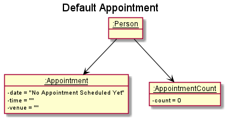
  *Figure 10: Default State of Appointment (Object Diagram) of FAST*

**2**) `LogicManager::execute()` will be called which will in turn calls `FastParser::parseCommand()` to parse the given input.
`FastParser::parseCommand()` will determine that it is an add appointment command which will then call `AppointmentCommandParser::parse()`.

**3**) Inside `AppointmentCommandParser::parse()`:
* `ArgumentTokenizer::tokenize()` will be called to recognise the required prefixes for appointment feature.
* `ParserUtil::parseIndex()`, `ParserUtil::parseDateString()`, `ParserUtil::parseTimeString()` and
   `AddAppointmentCommandParser::checkVenue()` will be called to check and parse the input if it passes the check (for requirement). 
* A new `Appointment` object with the input `date`, `time` and `venue` will be created as shown in the diagram below.

    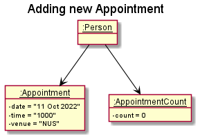
      *Figure 11: Added State of Appointment (Object Diagram) of FAST*

**4**) `AppointmentCommandParser::parse()` will return a new `AppointmentCommand` object that contains the index of the
specified client and the new `Appointment` object.

**5**)`LogicManager` then calls the method `AppointmentCommand::execute()`, which will attempt to add the new `Appointment`
after verifying that no appointments had been created for the specified contact yet.

**6**) Inside `AppointmentCommand::execute()`:
* `Model::setPerson` will be called to update the contact details in the model.
* `AppointmentCommand::generateSuccessMessage` will be called to generate the message to be displayed. 
* Message and changes will be reflected afterwards.

The sequence diagram below illustrates step 2 to step 6.

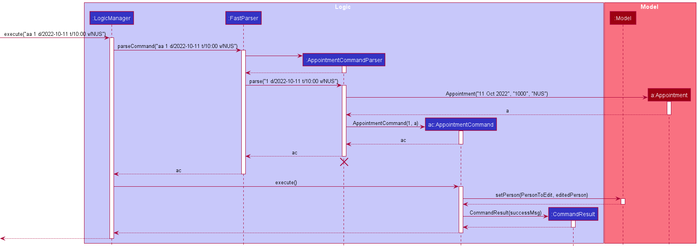
  *Figure 12: Appointment Sequence Diagram of FAST*

**7**) Suppose that the user makes a mistake in the `date` of the appointment, and he wants to change it.
Example: `ea 1 d/2022-05-15`

**8**) Similar course of actions mentioned to step 2 to step 6 will occur except that this time it involves the `EditAppointmentCommand` class and `EditAppointmentCommandParser` class instead.
The diagram below shows the updated object diagram after the `ea` command is executed.

  *Figure 13: Edited State of Appointment (Object Diagram) of FAST*

**9a**) Suppose that the user cancels the appointment and wants to delete it using the command `da 1`.
Similar course of actions mentioned to step 2 to step 6 will occur except that this time it involves the `DeleteAppointmentCommand` class and `DeleteAppointmentCommandParser` class instead.
The update object diagram will be reverted to the initial state (as shown in step 3).

**9b**) Suppose that the user did not delete the appointment. Instead, he wants to mark the appointment using the command `ma 1`.
A similar course of action mentioned to step 2 to step 6 will occur, except that in this case it involves the `MarkAppointmentCommand` class and `MarkAppointmentCommandParser` class instead.
The diagram below shows the updated object diagram.

  *Figure 14: Marked State of Appointment (Object Diagram) of FAST*

**10**) Finally, suppose that the user marks the appointment (in step 9b) by accident and wants to unmark it using `ua 1`.
Similar course of actions mentioned to step 2 to step 6 will occur except that this time it involves the `UnmarkAppointmentCommand` class and `UnmarkAppointmentCommandParser` class instead.
The update object diagram will reflect the changes in the `AppointmentCount` object (decrementing count by 1), and in this case it will be similar to the object diagram shown in step 3 (since the count is 1 as shown in the diagram in step 9b).

Given below is Activity Diagram for FAST Appointment procedure. It includes scenarios that are not mentioned in step 1 to step 10 above.

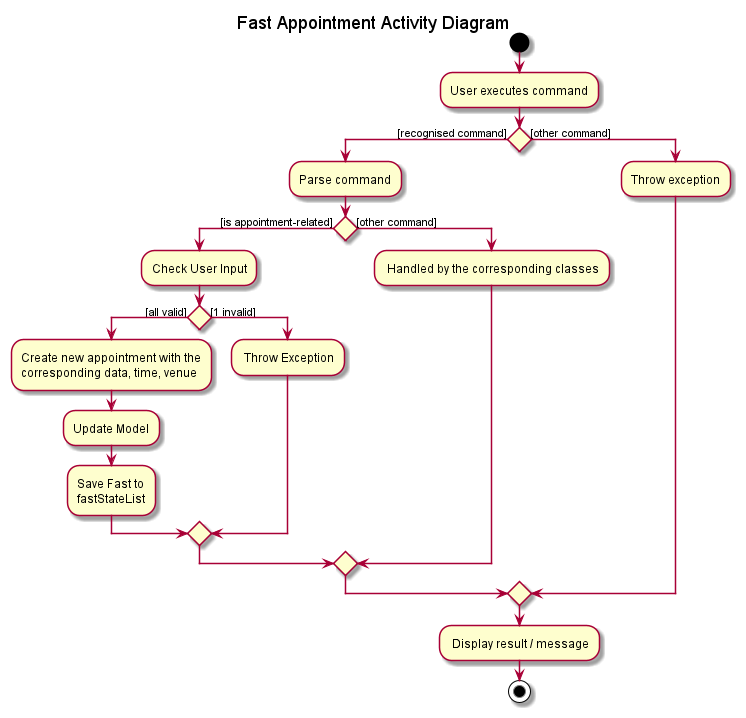
  *Figure 15: Appointment Activity Diagram of FAST*

  

#### Design Considerations
**Aspect: How the application feature is implemented**
* **Alternative 1 (current choice):** Divide the appointment features into 5 sub-features.
    * Pros:
        1. Isolation of a single sub-feature to a specific command: more intuitive to use.
        2. Reduces coupling. One Appointment command class handles one type of operation.
        3. Improvement for the command syntax. Less prefixes required.
        4. Improvement over `edit appointment` command: retains data fields not directly affected by the command.
    * Cons:
        1. More classes added, resulting in more lines of codes in the program.
        2. More checks and testcases needed.
        3. May have some very similar codes.

* **Alternative 2:** Combine all 5 sub-features into one appointment command.
    * Pros:
        1. Reduce the number of commands in the application: less to manage, easier to remember.
    * Cons:
        1. More prefixes required, more complex syntax: less intuitive to use. 
        2. Less abstraction, more coupling and more bug-prone: The same command class and parser class will handle all 
      the four different feature. 
        3. Unnecessary code would be executed to check for the type of sub-features is called in the parser class.

 

### Find feature

#### Current implementation

The find mechanism uses a few implementations of Predicate<Person> using the inbuilt `Predicate` class.
It uses these predicates to determine which persons to display in the search results.
There are currently 4 custom predicates implemented in FAST:
- `NameContainsQueriesPredicate` -- checks if the person's name contains the query.
- `PriorityPredicate` -- checks if the person has the given priority tag.
- `TagMatchesKeywordPredicate` -- checks if any of the person's tags match the keyword.
- `RemarkContainsKeywordPredicate` -- checks if the person's remark contains the keyword.

`NameContainsQueriesPredicate` implemented by running the person's name through a for-loop to see if any word starts with the query.
`PriorityPredicate` implemented by running the person's tags through a for-loop and checking if any of them match the given priority.
`TagMatchesKeywordPredicate` implemented by running the person's tags through a for-loop and checking if any of them match the given keyword.
`RemarkContainsKeywordPredicate` implemented by using the inbuilt `String::contains`. The person's remark is checked to see if it contains the given query.

Each `Predicate` has a `test` method which will be called on every `Person` in the list to see if they fit the search.
If the `test` method returns `true`, that `Person` will be displayed in the search results.

  *Figure 16: Find Command Class Diagram of FAST*

#### Usage Scenario

Given below is an example usage scenario and how the find mechanism behaves at each step.

**1**) The user launches the application for the first time. 

**2**) The user inputs `find john` in the CLI to find all contacts whose names contain `john`. This calls `LogicManager::execute` which in turn
calls `FastParser::parseCommand` to parse the given input. 

**3**) `FastParser` will determine that it is a find command and will call `FindCommandParser::parse`. From the given input,
`FindCommandParser` will determine that the user is searching for a name and return a `FindCommand` with a `NameContainsQueriesPredicate` 
containing a `List` of all the search queries (only "john" in this case) 

**4**). After execution of the user input, `LogicManager` calls `FindCommand::execute(model)` where model contains methods that mutate
the state of our contacts. 

**5**) Through a series of method chains, it calls `ModelManager::getFilteredPersonList()`, which will display the results
of the search.
 

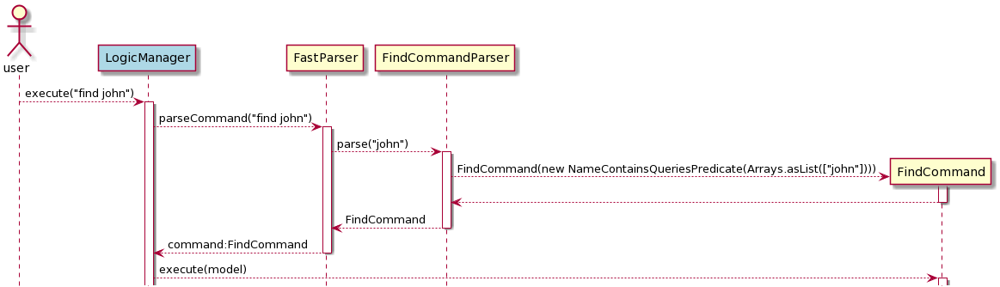
  *Figure 17: Find Command Sequence Diagram of FAST*

#### Design Considerations

**Aspect: How find executes**

* **Alternative 1 (current choice):** Use many `Predicate<Person>` implementations.
    * Pros: Easy to implement.
    * Cons: For every type of find added, a new class must be made.

* **Alternative 2:** Implement a custom Find method.
    * Pros: May be able to condense into 1 class
    * Cons: Very complicated and difficult to implement.

 

### Multiple Delete feature

#### Current Implementation

Managed by: [`DeleteCommand.java`](https://github.com/AY2122S1-CS2103T-T09-4/tp/blob/master/src/main/java/seedu/fast/logic/commands/DeleteCommand.java)
and [`DeleteCommandParser.java`](https://github.com/AY2122S1-CS2103T-T09-4/tp/blob/master/src/main/java/seedu/fast/logic/parser/DeleteCommandParser.java)

The `multiple delete` feature built on the existing `delete` feature. With the introduction of `multiple delete`, 
the `DeleteCommand` class is designed to handle both types of delete. 
`DeleteCommand::isSingleDelete()` and `DeleteCommand::executeSingleDelete()` handles the scenario of deleting just one client.
`DeleteCommand::isMultipleDelete()` and `DeleteCommand::executeMultipleDelete()` handles the scenario of deleting multiple client.

`Multiple delete` allows user to delete up to 10 clients in one go. 

Duplicated and out of bound indexes are not allowed. If these indexes are detected,
the command will not be executed. `HashSet` is used to check for duplicates in the extracted indexes.
The indexes will also be sorted in descending order to check for any out of bound indexes.

Currently, `multiple delete` allows 2 different format of user input:
1) `del INDEX...`
2) `del INDEX-INDEX`

To handle this 2 types of scenario, the `DeleteCommandParser::isRangeInput()` is implemented to determine whether the user input follows format 2.
`DeleteCommandParser::isRangeInput()` makes use of `DeleteCommandParser::CountDash()` to ensure that the input is a valid input that contains only one dash.
On top of checking the number of dashes, it also ensures that the length of the input is at least 3 after all whitespaces have been removed.
The end index must be greater than or equals to the start index. If the end index is equals to the start index, it will be treated as a `single delete`.
After validation, `DeleteCommandParser::parseRangeInput()` will extract all the indexes that the user wish to delete and create a new `DeleteCommand`.
The indexes are generated using a loop, starting from the first index, slowly incrementing by 1 until it reaches the end index.
As for format 1, the indexes are extracted from the user input by breaking up the input between the whitespaces.

The activity diagram below shows the flow of a multiple delete command.

  *Figure 18: Multiple Delete Activity Diagram of FAST*

#### Usage Scenario

**1**) The user enters this command `del 1-5` into FAST.

**2**) `LogicManage::execute()` will be called which will in turn call `FastParser::parseCommand()`

**3**) `FastParser::ParseCommand()` will determine that it is a delete command, and it will call the `DeleteCommandParser::parse()`

**4**) Inside `DeleteCommandParser::parse()`:
 * `DeleteCommandParser::isRangeInput()` will check if the user input contains exactly 1 dash and if the length is at least 3, after removing all the whitespaces. The result will be `true`
 * `DeleteCommandParser::spiltRangeInput()` will parse the input and extract out the start index, and the end index.
 * `DeleteCommandParser::parseRangeInput()` will generate all the indexes in between the start and end index and return a new `DeleteCommand` object.

**5**) `LogicManager` will call `DeleteCommand::execute()`.

**6**) Inside `DeleteCommand::execute()`:
 * It will check if the length of the Index array is more than 10 or more than the number of clients that FAST currently has.
 * After validation, `DeleteCommand::isMultipleDelete()` will determine that it is a multiple delete.
 * `DeleteCommand::sortOrder()` will sort the indexes in descending order.
 * `DeleteCommand::getInvalidIndex()` will traverse through the Index array to collate a list of invalid index.
 * `DeleteCommand::checkIndex()` will check and determine that there is no invalid index.
 * `DeleteCommand::checkDuplicates()` will check and determine that there is no duplicated index.
 * `DeleteCommand::executeMultipleDelete()` will start to delete the 5 clients in a for-loop through `Model::deletePerson()`.
 * Success message will be displayed afterwards.

The sequence diagram below shows step 1 to step 6 mentioned above.
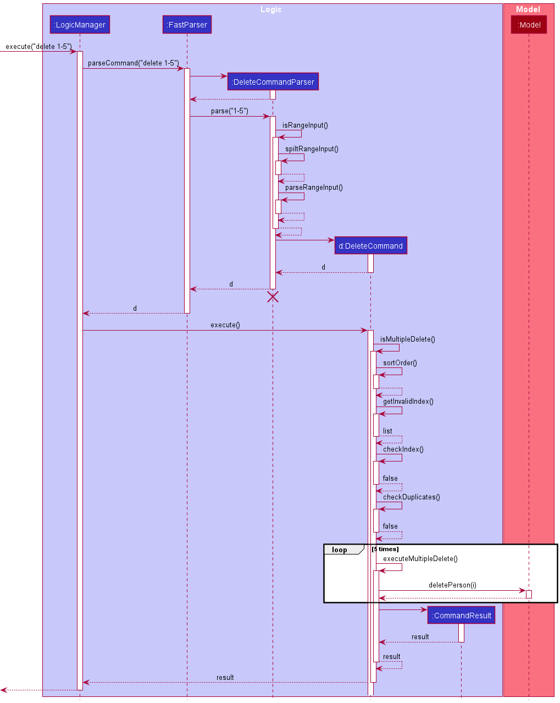
  *Figure 19: Multiple Delete Sequence Diagram of FAST*

#### Design Consideration
**Aspect: How multiple delete performs the order of commands**
* **Alternative 1 (current choice):** Execute multiple delete in descending order of indexes.
    * Pros:
      1. Detects out of bound index first.
    
    * Cons:
      1. Have to introduce another method to do the sorting.
      2. Slower time as the index array needs to be sorted first.
    
*  **Alternative 2:** Execute multiple delete in the order of indexes input by user.
    * Pros:
        1. Faster process, do not need to sort.
    
    * Cons:
        1. More bug-prone, have to account for the differences between the currently deleted index, and the to-be deleted index as the model updates after each delete, hence the index may not be the same as what the user has input.
        2. Will delete contacts until the first invalid index is detected, might be confusing for the user.

 

### Sort feature

#### Current Implementation

The sort mechanism is facilitated by the inbuilt `Collections::sort` method.
This is done by passing a custom comparator that implements the Comparator interface to the sort method.
There are currently three custom comparators implemented in FAST:
- `SortByName` -- Sorts the contacts alphabetically by name.
- `SortByAppointment` -- Sorts the contact's appointment chronologically by date and time.
- `SortByPriority` -- Sorts the contacts by `priority tags`.

`SortByName`: Implemented by using the inbuilt `String::compareTo`.   
`SortByAppointment`: Implemented by first converting the appointment date and time from `String` to a `Date` object before using
the inbuilt `Date::compareTo` method.   
`SortByPriority`: Implemented by first assigning int values to `tags`, `tags` with the highest priority will have the smallest int value.
Using those priority values, the inbuilt `Integer::compareTo` is used.  

The activity diagram below illustrates the flow of a sort command.

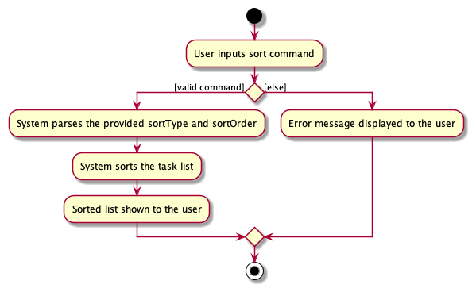
  *Figure 20: Sort Activity Diagram of FAST*

#### Usage Scenario

Given below is an example usage scenario and how the sort mechanism behaves at each step.

**1**) The user launches the application for the first time.

**2**) The user inputs `sort name` in the CLI to sort all contacts by name. This calls `LogicManager::execute` which in turn
calls `FastParser::parseCommand` to parse the given input. 

**3**) `FastParser` will determine that it is a sort command and will call `SortCommandParser::parse`. From the given input,
`SortCommandParser` will create the corresponding `SortByName` Comparator and return a `SortCommand` with that comparator.

**4**) After execution of the user input, `LogicManager` calls `SortCommand::execute(model)` where model contains methods that mutate
the state of our contacts.

**5**) Through a series of method chains, it calls `UniquePersonList::sortPersons(SortByName)`, which executes the sort method
to sort the list of persons by their name.

The sequence diagram below illustrates the execution of `sort name`.

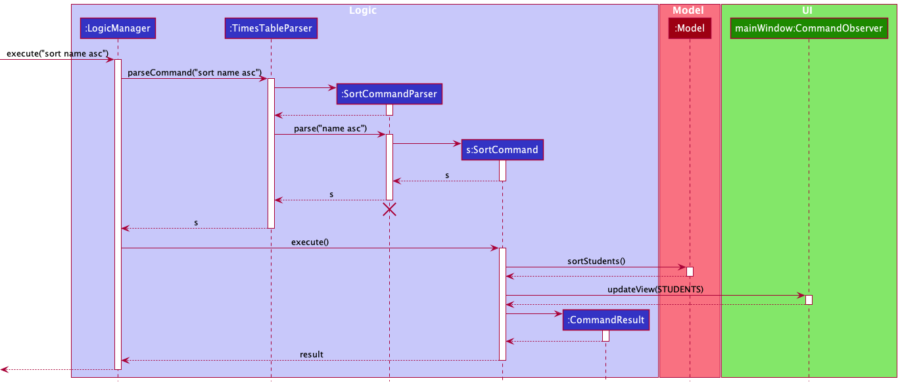
  *Figure 21: Sort Sequence Diagram of FAST*

#### Design Considerations

**Aspect: How sort executes**

* **Alternative 1 (current choice):** Use the inbuilt `Collections::sort`.
    * Pros: Easy to implement.
    * Cons: May need additional attributes to implement the `compareTo` method.

* **Alternative 2:** Implement a custom Sort method.
    * Pros: May not need additional attributes
    * Cons: Very complicated, may have performance issues if the sort is not efficient.

**Aspect: How SortByDate is implemented**

* **Alternative 1 (current choice):** Convert the String date and time value to a Date object before using inbuilt `compareTo`.
    * Pros: Easy to implement.
    * Cons: Need to account for empty appointment dates and empty appointment times.

* **Alternative 2:** Compare dates in String.
    * Pros: No need to convert the values to another type.
    * Cons: Complicated since there is a need for 4 different comparisons namely; year, month, date and time.

 

### Help Window

#### Current Implementation
The Help Windows is a separate window and displays the command usage for each of the command. To access the help
window, users have 3 ways to get to the help page:
1. Using the menu bar. Click on `Help` > `Help`.
2. Pressing `F1` while using FAST.
3. Typing the command `help [HELP_TOPIC]`.

Using the methods 1 and 2 will open the Help Window to the default help window view (currently the Quick start page).

However, using method 3 gives the user the option to directly access the help page of the respective HELP_TOPIC. For
example, using the command `help add` or `help Add` will open the Add command help page directly. Whereas if no HELP_TOPIC
was given as parameter, or an invalid parameter is given, the default help window will open. Either ways, the help
window will open to allow users to view help regardless. For reference, the current valid HELP_TOPICS are:
* `Quick Start`
* `Add`
* `Appointment`
* `Edit Appointment`
* `Delete Appointment`
* `Mark Appointment`
* `Clear`
* `Delete`
* `Edit`
* `Find`
* `List`
* `Help`
* `Remark`
* `Sort`
* `Statistic`
* `Tag`
* `Investment Plan Tag`
* `Priority Tag`
* `Misc`

The activity diagram below shows the many ways a user can utilise the help command

  *Figure 22: Help Command Activity Diagram of FAST*

The way the help command is parsed is slightly different from the other commands. This is due to the help command not
interacting with the `model` and `storage` components like other commands. Instead, the parsing of the help command
parameter is done by `ParserUtil` and verification of the parameter is done in `HelpWindow` itself. After verification,
`HelpWindow` will set the text of the `JavaFX::Label` to be the corresponding help topic. This is as shown in the sequence
diagram as shown below.

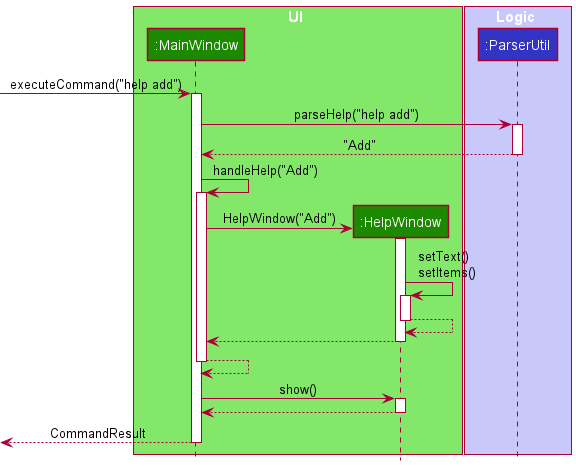
  *Figure 23: Help Command Sequence Diagram of FAST*

To access the different commands' help page from within the help window, there is a dropdown selector which will
navigate to the different help pages. To achieve this, a `JavaFX::ComboBox` commandList was used which toggles between all
the available HELP_TOPICS. A method then reads from commandList's current value and displays the corresponding help message in a
`JavaFX::Label`. A code snippet is shown below:

`EventHandler<ActionEvent> event =
e -> commandInstruction.setText(showCommandUsage(commandList.getValue()));`

#### Design Considerations

**Aspect: How to access various commands' help page**
* **Alternative 1 (Current choice):** Using `JavaFX::ComboBox`which provides a dropdown selector.
    * Pros: Compact and easy to hide the selector in plain sight without distracting the user. Quick to navigate
      between the pages.
    * Cons: To new users, might not be immediately obvious that the `JavaFX::ComboBox` can be interacted with. Users
      might also miss the scroll bar and miss out some commands available.

* **Alternative 2:** Using a single-page design where all commands' help messages are viewable at once
    * Pros: Easier to be understood by new users.
    * Cons: Cumbersome to users as they would have to scroll down a lot to find their desired command.

* **Alternative 3:** Using a Table of Contents (ToC) landing page.
    * Pros: Users can see all the available commands at a glance and can select their desired commands easily.
    * Cons: Users have to navigate back to the ToC to navigate between each command.

We decided on the first choice as it provided users with the greatest ease of use. It is also the fastest way of
navigating between help pages. While we understand that most experienced users might not need to access the help menu,
by providing them a quick and easy way to access the commands' help page when they do need it is very important.

**Aspect: How to access the help window**

Initially, the help command only involved inputting `help` into FAST. However, we chose to revamp it to allow an
additional `[COMMAND]` parameter for the help command, which navigates to the selected command's help page.
* Pros: Allows experienced users to quickly navigate to their desired help page, without having to open the help menu
  first and selecting the command help page from there.
* Cons: Users might not know the exact `[COMMAND]` parameter to enter, which is counter-intuitive for a help command

To address the cons of our implementation, we decided to compromise by still opening the help menu regardless of a
valid input. If an incorrect `[COMMAND]` was entered, FAST will provide feedback to the user and still open the help
window to the default page.

 

### Statistics window

#### Current Implementation

The statistics window displays statistics and insights into the user's client base. To access the stats window, users have 
2 ways of getting to the stats page:
* Using the menu bar. Click on `Stats` > `Stats`.
* Pressing `F2` while using FAST.

Currently, the stats window provides information for the client's Priority Tags, and their Insurance Plans Tags. We used 
`JavaFX::PieChart` to visualise the client's data and display them to the user. We also provided a few template insights
for the user to make sense of the data provided.

To calculate the statistics to be shown in the Priority pie chart, we took the data from `Fast` by applying different predicates
and creating a new `FilteredList` each time. We then encapsulated all these data into a `PriorityData`, which is then 
passed to `StatsWindow` to populate the pie chart with the data and generate the labels. This is illustrated in the sequence diagram
as shown below.

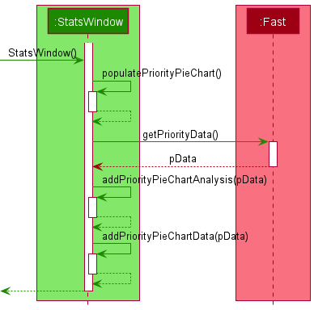.
  *Figure 24: Stats Window Sequence Diagram of FAST*

The implementation for Investment Plan Tag statistics is identical, except instead of a `PriorityData`, the data is encapsulated
into a `InvestmentPlanData`, and uses the methods `populateInvestmentPieChart()`, `getInvestmentPlanData()` and 
`addInvestmentPlanPieChartData()` instead. 

#### Design Considerations

**Aspect: How to visualise the data**
* **Alternative 1 (Current choice):** Using `JavaFX::PieChart`.
    * Pros: Can be easily understood by the user. Provides a good overview of the proportion at a glance.
    * Cons: Gets messy if there are a lot of variables. Data elements with a small count will be hidden to the
            user.

* **Alternative 2:** Using `JavaFX::BarChart`.
    * Pros: Easier to be understood by new users. 
    * Cons: The information might be overbearing. Does not provide an immediate overview of the client base. New
            users might also be confused by the large amount of information displayed at once.

Ultimately, as our main focus was speed and ease of use, we decided on the pie chart implementation as it is both 
easily understood, yet is able to convey the essence of the data to the user. Other chart types are less common and 
thus might be confusing to the user. To address the cons of the pie chart, we also included some analysis of the 
pie chart to help users better understand the data and provide a more complete statistic.

**Aspect: How to open the stats window**
* **Alternative 1 (Current choice):** Using `F2` or the menu item.
    * Pros: More intuitive, and provides a one-key shortcut to open the stats window.
    * Cons: Certain devices do not have the function keys, hence they would require to use their mouse and click 
    on the menu item, which goes against the CLI-focused approach of FAST.

* **Alternative 2:** Using a dedicated stats command.
    * Pros: Consistent with the other features, as they all are accessible with commands.
    * Cons: Typing in "stats" into the command box would take longer time than simply pressing the `F2` key. 
    
For our current version of FAST, we felt that using the first alternative is more optimal as it is the fastest alternative.
It also provides a distinction between Commands like `add` or `find` and utility features like `help` and `stats`. 
However, in future iterations of FAST, alternative 2 might be more useful if there are different stats to view. For 
instance there could be a pie chart window, or another one with a bar chart, and using the stats command with different
parameters can be used to view these different windows.

 

### Tagging feature

#### Current Implementation

Other than the edit command. a tag command has also been added to make adding and deleting tags easier.
This command has a relatively straightforward implementation:
1. A `Set` of currently assigned tags is retrieved from the specified `Person`.
2. A new `Set` is created using the retrieved `Set`, then tags are deleted and added as necessary.
3. If there are no issues with adding and deleting, and certain conditions are satisfied, the `Person` 
   will be updated with the new `Set` of tags. Any violations of the conditions will result in an error being 
   shown to the user. The conditions are as follows:
    1. All tag names have a maximum character length of 20 alphanumeric characters
    2. A maximum of 1 Priority tag exists in the `Set` of tags
    3. A maximum of 1 of each Investment Plan tag exists in the `Set` of tags
    4. No duplicate tag is added to the `Set`
    5. No non-existent tag is attempted to be deleted from the 'Set'

The activity diagram below shows the flow of a typical tag command.

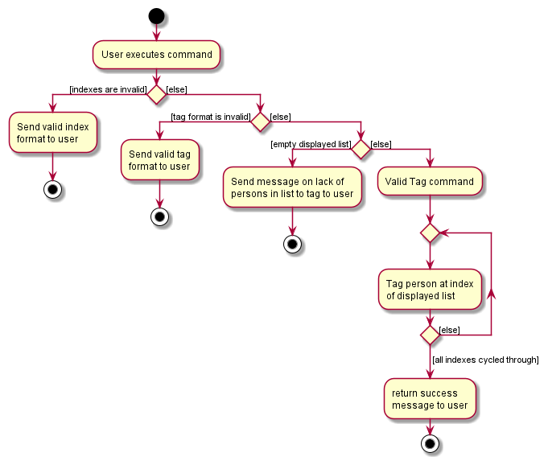
  *Figure 25: Tag Activity Diagram of FAST*

#### Usage Scenario 

**1**) The user launches the application and inputs `tag 1 a/pr/low d/friend`, to add a priority tag `LowPriority` and 
delete a tag `friend` from the first listed contact. We assume the first listed contact only has one tag at this 
point in time, which is the `friend` tag.

**2**) This calls `LogicManager::execute` which further calls `FastParser::parseCommand` to parse the given input.

**3**) `FastParser` determines that it is a tag command, and further calls `TagCommandParser::parse`.

**4**) `TagCommandParser` will then identify the tags to add and delete, and proceed to instantiate them then
return a `TagCommand` that contains a Set of tags to delete and another Set of tags to add. At this point, the 
object diagram below shows the state of the `Person` object and the `Tag` associated with it.

  *Figure 26: Before Command Executed Object Diagram of FAST*

**5**) `LogicManager` then calls the method `TagCommand::execute`, which will attempt to add and delete the specified 
tags, while ensuring that certain conditions are met.

**6**) If there are no issues, the command will finish executing, and a message indicating success will appear.
Any changes to the tags will be reflected immediately: In this case, the tag `LowPriority` will be added while the
tag `friend` will be deleted. The object diagram below shows the final state of the `Person` object 
and the `Tag` associated with it.

  *Figure 27: After Command Executed Object Diagram of FAST*
   
The sequence diagram below shows the process for the usage scenario as described above.
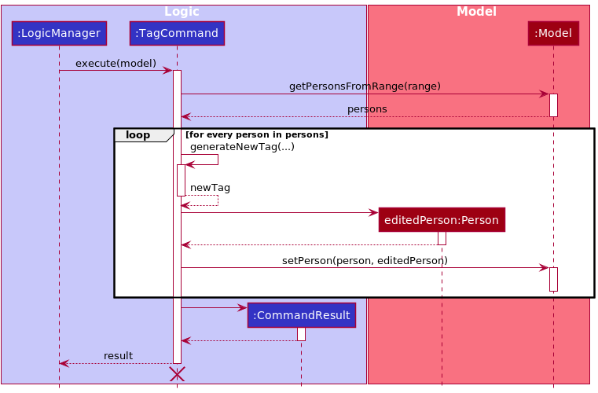
  *Figure 28: Tag Sequence Diagram of FAST*
   
#### Design Considerations

**Aspect: How to add more functionality to the tagging system**
* **Alternative 1 (current choice):** Implement a dedicated Tag command.
    * Pros: 
      1. Isolation of a single feature to a specific command: more intuitive to use.
      2. Improvement over `edit` command: retains tags not directly affected by the command
    * Cons:
      1. Repeated functionality that already exists in `edit` command
    
* **Alternative 2:** Augment the `edit` command.
    * Pros:
      1. Reduce the number of commands in the application: less to manage, easier to remember.
    * Cons:
      1. Overloading the `edit` command, which already accepts many parameters and modifiers in its
         command format, could make it much more confusing to use, especially for newer users.
      2. Harder to implement, as many existing dependencies could be affected.   
    

--------------------------------------------------------------------------------------------------------------------

## **Documentation, logging, testing, configuration, dev-ops**

* [Documentation guide](Documentation.md)
* [Testing guide](Testing.md)
* [Logging guide](Logging.md)
* [Configuration guide](Configuration.md)
* [DevOps guide](DevOps.md)

--------------------------------------------------------------------------------------------------------------------

## **Appendix: Requirements**

### Product scope

**Target user profile**:

* No time/busy
* Might not be tech-savvy
* Many contacts to manage
* Has a need to manage a significant number of contacts
* Can type fast
* Prefers typing to mouse interactions
* Is reasonably comfortable using CLI apps
* Needs to profile clients

**Value proposition**: Financial Advisors are busy. We will help them save time by optimising our system for them. FAST keeps track of client details and information for them.

### User stories

Priorities: High (must have) - `* * *`, Medium (nice to have) - `* *`, Low (unlikely to have) - `*`

| Priority | As a …​                                 | I want to …​                                              | So that I …​                                                                |
| -------- | ------------------------------------------ | ------------------------------------------------------------ | ------------------------------------------------------------------------------ |
| `* * *`  | user                                       | use the application offline                                  | can view my contacts without an internet connection                            |
| `* * *`  | FA                                         | delete contact info                                          | will not have useless data in my app                                           |
| `* * *`  | FA                                         | store my clients contact info                                | can contact them in the future more easily                                     |
| `* * *`  | user                                       | see all of my contacts                                       | know who is in my contacts                                                     |
| `* * *`  | new user                                   | learn how to use the app                                     | can effectively use the app                                                    |
| `* * *`  | busy person                                | use the app with friendlier syntax that's easier to type     | can add contacts with less trouble                                             |
| `* * *`  | busy person                                | see all the available commands at a glance                   | can focus on managing my client base rather than dealing with the syntax       |
| `* * *`  | FA                                         | update my clients contact info                               | have up to date information                                                    |
| `* * *`  | forgetful person                           | quickly check for the highest priority client                | can move on to the next client quickly without delay                           |
| `* * *`  | FA with many clients                       | tag my clients' info                                         | can see different groups of clients according to the tags                      |
| `* *`    | FA                                         | store my clients contact information                         | do not need to store them on my phone                                          |
| `* *`    | numbers person                             | delete multiple contacts in one go                           | do not have to delete contacts individually                                    |
| `* *`    | FA with many clients                       | search through my clients                                    | can easily find a specific client                                              |
| `* *`    | FA                                         | have fast access to important numbers (e.g. office, partners | can quickly contact my partners should something arise                         |
| `* *`    | potential user                             | see how the app works with sample data                       | can understand what the app will look like with real data                      |
| `* *`    | FA                                         | group my clients according to their investment strategies    | can easily manage each group                                                   |
| `* *`    | FA                                         | archive data that might be obsolete at the moment            | do not flood my app with obsolete data and can still access them in the future |
| `*`      | FA                                         | store appointments info of my clients                        | will not forget about important meetings                                       |
| `*`      | person with many devices                   | import and export the client info                            | can switch between devices quickly                                             |
| `*`      | FA with many clients                       | view stats of my client base                                 | can know how much income I am making                                           |
| `*`      | FA                                         | reminded to contact potential clients                        | can disturb potential clients into signing on                                  |
| `*`      | FA                                         | check the number of clients and deals currently              | can check if i have fulfilled my monthly quota                                 |
| `*`      | FA                                         | store extra info that could be useful                        | can remember extra details that could be useful in clinching a deal            |
| `*`      | FA                                         | see frequently contacted clients                             | don't have to keep searching for the same person over and over again           |
| `*`      | FA                                         | list out all my investment plans                             | know what investment plans I am selling                                        |
| `*`      | user                                       | color-code my contacts                                       | can differentiate between the tags, and it looks nicer                         |
| `*`      | Responsible FA                             | be reminded of clashes in my appointments                    | will not lose any potential clients                                            |

### Use cases

(For all use cases below, the **System** is the `Financial Advisor Smart Tracker (FAST)` and the **Actor** is the `user`, unless specified otherwise)

#### Use case: UC01 - Add Contact

**MSS**

1. User requests to add a new contact.
2. FAST displays a message indicating success.
3. FAST displays the new contact below.

   Use case ends.

**Extensions**

* 1a. The given command syntax is invalid.
    * 1a1. FAST shows an error message.
    * 1a2. FAST shows an example of add contact command to user.

* 1b. The given input parameters is invalid.
    * 1b1. FAST shows an error message.
    * 1b2. FAST shows an example of add contact command to user.

      Use case ends.

#### Use case: UC02 - Delete Contact

**MSS**

1. User requests to list persons (UC06).
2. User requests to delete a specific person in the list.
3. FAST deletes the person.

   Use case ends

**Extensions**

* 2a. The given index is invalid.
    * 2a1. FAST shows an error message.
    * 2a2. FAST shows an example of delete contact command to user.

      Use case ends.

#### Use case: UC03 - Edit Contact

**MSS**

1. User requests to list contacts (UC06).
2. User requests to edit a contact.
3. FAST displays the updated contact.

   Use case ends.

**Extensions**

* 2a. The given index is invalid.
    * 2a1. FAST shows an error message.
    * 2a2. FAST shows an example of edit contact command to user.

      Use case ends.

* 2b. The given command syntax is invalid.
    * 2b1. FAST displays an error message.
    * 2b2. FAST displays an example of the edit contact command to the user.

      Use case ends.

* 2c. The given input parameters is invalid.
    * 2c1. FAST shows an error message.
    * 2c2. FAST shows an example of add contact command to user.
    
#### Use case: UC04 - Add a remark

**MSS**

1. User requests to list persons (UC06).
2. User requests to add a remark to a specific person in the list.
3. FAST displays the new remark in the contact.

   Use case ends

**Extensions**

* 2a. The given index is invalid.
    * 2a1. FAST shows an error message.
    * 2a2. FAST shows an example of remark command to user.

      Use case ends

* 2b. The given command syntax is invalid
    * 2b1. FAST displays an error message.
    * 2b2. FAST displays an example of the remark command to the user.

      Use case ends

* 2c. The given input parameters is invalid.
    * 2c1. FAST shows an error message.
    * 2c2. FAST shows an example of add contact command to user.

      Use case ends
    
* 2d. User removes an existing remark
    * 2c1. FAST displays a message that the remark has been removed.

      Use case ends.

#### Use case: UC05 - Find Contact by name

**MSS**

1. User searches for a name.
2. FAST shows a list of persons with the specified name or people whose name starts with the search query.

   Use case ends.

**Extensions**

* 1a. The given search query is invalid.
    * 1a1. FAST shows an error message.
    * 1a2. FAST shows an example of find command to user.

      Use case ends.

* 1b FAST cannot find any contacts with the given search query.
    * 1b1. FAST displays a message to inform user no contacts that matches the query was found.

      Use case ends.

#### Use case: UC06 - List Contacts

**MSS**

1. User requests to list contacts.
2. FAST displays a list of contacts.

   Use case ends.

**Extensions**

* 2a. The list is empty.

  Use case ends.

#### Use case: UC07 - Add Appointment

**MSS**

1. User requests to list persons (UC06)
2. User requests to add a new appointment.
3. FAST displays a message indicating success.
4. FAST displays the new contact below.

   Use case ends.

**Extensions**

* 2a. The given index is invalid.
    * 2a1. FAST shows an error message.
    * 2a2. FAST shows an example of add appointment command to user. 

* 2b. The given command syntax is invalid.
    * 2b1. FAST shows an error message.
    * 2b2. FAST shows an example of add appointment command to user.

      Use case ends.

* 2c. The given input parameters is invalid.
    * 2c1. FAST shows an error message.
    * 2c2. FAST shows an example of add contact command to user.

      Use case ends.

* 2d. An appointment has already been scheduled.
    * 2d1. FAST shows an error message.

      Use case ends.

#### Use case: UC08 - Delete Appointment

**MSS**

1. User requests to list persons (UC06)
2. User requests to delete an appointment.
3. FAST displays a message indicating success.
4. FAST displays the new contact below.

   Use case ends.

**Extensions**

* 2a. The given index is invalid.
    * 2a1. FAST shows an error message.
    * 2a2. FAST shows an example of delete appointment command to user.

* 2b. No appointment scheduled yet.
    * 2b1. FAST shows an error message.

      Use case ends.

#### Use case: UC09 - Edit Appointment

**MSS**

1. User requests to list persons (UC06)
2. User requests to edit an appointment.
3. FAST displays a message indicating success.
4. FAST displays the new contact below.

   Use case ends.

**Extensions**

* 2a. The given index is invalid.
    * 2a1. FAST shows an error message.
    * 2a2. FAST shows an example of edit appointment command to user.

* 2b. The given command syntax is invalid.
    * 2b1. FAST shows an error message.
    * 2b2. FAST shows an example of edit appointment command to user.

      Use case ends.

* 2c. The given input parameters is invalid.
    * 2c1. FAST shows an error message.
    * 2c2. FAST shows an example of add contact command to user.

      Use case ends.
    
* 2d. No appointment scheduled yet.
    * 2d1.FAST shows an error message.

      Use case ends.

#### Use case: UC10 - Mark Appointment

**MSS**

1. User requests to list persons (UC06)
2. User requests to mark an appointment.
3. FAST displays a message indicating success.
4. FAST displays the new contact below.

   Use case ends.

**Extensions**

* 2a. The given index is invalid.
    * 2a1. FAST shows an error message.
    * 2a2. FAST shows an example of mark appointment command to user.

* 2b. No appointment scheduled yet.
    * 2b1. FAST shows an error message.

      Use case ends.

#### Use case: UC11 - Unmark Appointment

**MSS**

1. User requests to list persons (UC06)
2. User requests to unmark an appointment.
3. FAST displays a message indicating success.
4. FAST displays the new contact below.

   Use case ends.

**Extensions**

* 2a. The given index is invalid.
    * 2a1. FAST shows an error message.
    * 2a2. FAST shows an example of unmark appointment command to user.

* 2b. Appointment already exist.
    * 2b1. FAST shows an error message.

      Use case ends.

#### Use case: UC12 - Sort contacts

**MSS**

1. User requests to sort persons
2. FAST displays a list of contacts sorted by the given keyword.
   Use case ends.

**Extensions**

* 2a. The given command syntax is invalid.
    * 2a1. FAST shows an error message.
    * 2a2. FAST shows an example of sort command to user.

* 2b. The list is empty.
      Use case ends.

#### Use case: UC13 - Find Contact by priority

**MSS**

1. User searches for a priority.
2. FAST shows a list of persons with the specified priority.

   Use case ends.

**Extensions**

* 1a. The given priority is invalid and does not follow the format of a priority tag.
    * 1a1. FAST shows an error message.
    * 1a2. FAST shows an example of find command and correct format for priority to user.

      Use case ends.

* 1b FAST cannot find any contacts with the given priority.
    * 1b1. FAST displays a message to inform user no contacts with the given priority were found.

      Use case ends.

#### Use case: UC14 - Find Contact by tag

**MSS**

1. User searches for some tags.
2. FAST shows a list of persons with the specified tags.

   Use case ends.

**Extensions**

* 1a. The given tags are invalid.
    * 1a1. FAST shows an error message.
    * 1a2. FAST shows an example of find command.

      Use case ends.

#### Use case: UC15 - Find Contact by remark

**MSS**

1. User searches for a remark.
2. FAST shows a list of persons whose remarks contain the searched remark.

   Use case ends.

**Extensions**

* 1a. The given remark is invalid.
    * 1a1. FAST shows an error message.
    * 1a2. FAST shows an example of find command.

      Use case ends.

* 1b FAST cannot find any contacts with the given remark.
    * 1b1. FAST displays a message to inform user no contacts with the given remark were found.

      Use case ends.

#### Use case: UC16 - Help command

**MSS**

1. User requests to open the help window.
2. FAST opens a new help window. Use case ends.

**Extension**
* 1a. There is already a help window opened.
    * 1a1. FAST focuses on the existing help window. Use case ends.

#### Use case: UC17 - Statistics window

**MSS**

1. User requests to open the stats window.
2. FAST opens a new stats window. Use case ends.

**Extension**
* 1a. There is already a stats window opened.
    * 1a1. FAST updates and focuses on the existing help window. Use case ends.

#### Use case: UC18 - Edit tags of a contact

**MSS**

1. User requests to list contacts (UC06)
2. User requests to edit tags of a contact
3. FAST displays a message indicating success.
4. FAST displays the updated contact below.

  Use case ends.
  
**Extensions**

* 2a. The given index is invalid.
    * 2a1. FAST shows an error message.
    * 2a2. FAST shows an example of the tag command to the user.
    
      Use case ends.
    
* 2b. A tag to be added to the specified contact already exists.
    * 2b1. FAST shows an error message to the user that the tag already exists.
    
      Use case ends.
    
* 2c. A tag to be deleted from the specified contact does not exist.
    * 2c1. FAST shows an error message to the user that the tag does not exist.
    
      Use case ends.

* 2d. More than one Priority tag is added to a contact.
    * 2d1. FAST shows an error message to the user that each contact may only have one Priority tag.

      Use case ends.
    
* 2e. More than one of each Insurance Plan tag is added to a contact.
    * 2e1. FAST shows an error message to the user that each contact may only have one of each Investment Plan tag.    

      Use case ends.
    
* 2f. Tag name exceeds maximum length of 20 characters.
    * 2f1. FAST shows an error message to the user that the maximum tag length is 20 characters.
    
      Use case ends.
    

### Non-Functional Requirements

1.  Should work on any _mainstream OS_ as long as it has Java `11` or above installed.
2.  Should be able to hold up to 1000 persons without a noticeable sluggishness in performance for typical usage.
3.  A user with above average typing speed for regular English text (i.e. not code, not system admin commands) should be able to accomplish most of the tasks faster using commands than using the mouse.
4.  Should work fully offline, and users should not have to overly rely on external links for important guides and documentation
5.  Application should be usable by a single user

### Glossary

* **Contact**: A client to be stored in FAST, includes information on the client
* **CLI**: Command Line Interface
* **FAST**: Financial Advisor Smart Tracker, the name of this software
* **FXML**: FX Markup Language, the format in which the GUI layout is stored in
* **Java 11**: Version of the programming language, used in the coding of this software
* **Mainstream OS**: Windows, Linux, Unix, OS-X
* **MSS**: Main success scenario  
* **Private contact detail**: A contact detail that is not meant to be shared with others
* **Remark**: A comment/note about a specific contact
  **Tag** A short note about a specific contact, used for sorting and grouping contacts
* **URL**: Uniform Resource Locator, known more commonly as a link to a website.
* **XML**: Extensible MarkUp Language, used to format the layout of this software

--------------------------------------------------------------------------------------------------------------------

## **Appendix: Instructions for manual testing**

Given below are instructions to test the app manually.

:information_source: **Note:** These instructions only provide a starting point for testers to work on;
testers are expected to do more *exploratory* testing.

### Launch and shutdown

1. Initial launch

   1. Download the jar file and copy into an empty folder

   2. Double-click the jar file Expected: Shows the GUI with a set of sample contacts. The window size may not be optimum.

2. Saving window preferences

   1. Resize the window to an optimum size. Move the window to a different location. Close the window.

   2. Re-launch the app by double-clicking the jar file. 
       Expected: The most recent window size and location is retained.
      

### Adding a Client

1. Adds a new Client to FAST.
   1. **Prerequisites**: Arguments are valid, compulsory parameters are provided. Client added must not be a duplicated client.
   
   2. **Test case**: `add n/Matthew p/98523146 e/Matt@example.com a/Seletar Lane 12` 
      **Expected**: Adds a client with name `Matthew`, phone `98523146`, email `Matt@example.com` and address `Seletar Lane 12`. Success message with details of the newly added client will be shown.

   3. **Test case**: `add n/Matthew` 
      **Expected**: No client added. Error message is shown.
   
   4. **Other incorrect add commands to try**: `add n/Matthew p/98523146... e/Matt@example.com a/Seletar Lane 12`, `add n/Matthew... p/98523146 e/Matt@example.com a/Seletar Lane 12`, `add n/Matthew p/98523146 e/Matt...@example.com a/Seletar Lane 12`, `add n/Matthew p/98523146 e/Matt@example.com a/Seletar Lane 12...` (where ... represents string that exceeds the character limit).   
      **Expected**: Similar to previous (in Point 3).

:information_source:
**Character limits:**  
1) Name - 0 to 50 characters  
2) Phone - 3 to 20 digits  
3) Email - max 100 characters (at least 2 for domain portion, before @ symbol)  
4) Address - max 100 characters  
5) Remark - max 45 characters  
6) Tag - max 20 characters

### Editing a Client

1. Edits an existing Client in FAST.
    1. **Prerequisites**: Arguments are valid, compulsory parameters are provided. Multiple clients in the list.

    2. **Test case**: `edit 1 n/Mattias` 
       **Expected**: Edits the name of the first client in the displayed list. Success message with details of the edited client is shown.
   
    3. **Test case**: `edit n/Mattias` 
       **Expected**: No client added. Error message is shown.

    4. **Other incorrect edit commands to try**: `edit 1 n/ `, `edit 1 p/11`, `edit 1 e/mattias@u`  
       **Expected**: Similar to previous (in Point 3).

### Finding a Client

#### Finding by name
1. Finding a client by their name in FAST.
    1. **Prerequisites**: Arguments are valid, compulsory parameters are provided. Multiple clients in the list.
    
    2. **Test case**: `find john` 
       **Expected**: All clients with the name "John" or whose names start with "John" are displayed. Success message with details of
       search is shown.
       
    3. **Test case**: `find `
       **Expected**: No search results are displayed. Error message is shown.

#### Finding by priority
1. Finding a client by their priority tag in FAST.
    1. **Prerequisites**: Arguments are valid, compulsory parameters are provided. Multiple clients in the list.
    
    2. **Test case**: `find pr/high` 
       **Expected**: All clients with a "HighPriority" tag are displayed. Success message with details of search is shown.
       
    3. **Test case**: `find pr/friend`
       **Expected**: No search results are displayed. Error message is shown.
       
    4. **Other incorrect find commands to try**: `find pr/`, `find pr/    `
       **Expected**: Similar to previous (in Point 3).
       
#### Finding by tag
1. Finding a client by their tag in FAST.
    1. **Prerequisites**: Arguments are valid, compulsory parameters are provided. Multiple clients in the list.
    
    2. **Test case**: `find t/friend` 
       **Expected**: All clients with a "friend" tag are displayed. Success message with details of search is shown.
       
    3. **Test case**: `find t/`
       **Expected**: No search results are displayed. Error message is shown.
       
    4. **Other incorrect find commands to try**: `find t/    `
       **Expected**: Similar to previous (in Point 3).
       
#### Finding by remark
1. Finding a client by their tag in FAST.
    1. **Prerequisites**: Arguments are valid, compulsory parameters are provided. Multiple clients in the list.
    
    2. **Test case**: `find r/likes to eat` 
       **Expected**: All clients with remarks containing "likes to eat" are displayed. Success message with details of search is shown.
       
    3. **Test case**: `find r/`
       **Expected**: No search results are displayed. Error message is shown.
       
    4. **Other incorrect find commands to try**: `find r/    `
       **Expected**: Similar to previous (in Point 3).

### Deleting a Client

#### Single delete

1. Deleting a client while all clients are being shown

   1. **Prerequisites**: List all clients using the `list` command. Multiple clients in the list.

   1. **Test case**: `del 1` 
      **Expected**: First contact is deleted from the list. Success message with details of the deleted contact shown in the status message.

   1. **Test case**: `del 0` 
      **Expected**: No person is deleted. Error message displayed.

   1. **Other incorrect delete commands to try**: `del`, `del x`(where x is larger than the list size) 
      **Expected**: Similar to previous (in Point 3).

#### Multiple delete

1. Deleting multiple clients using range input while all clients are being shown
   1. **Prerequisites**: List all clients using the `list` command. Multiple clients in the list. Argument is valid.
   
   2. **Test case**: `del 1-3` 
      **Expected**: First, second and third contacts are deleted from the list. Success message showing number of contacts deleted is shown .
   
   3. **Test case**: `del 3-1` 
      **Expected**: No client is deleted. Error message displayed.
   
   4. **Other incorrect delete commands to try**: `del`, `del 1-`, `del 1-x`(where x is larger than the list size) 
      **Expected**: Similar to previous (in Point 3).
   
2. Deleting multiple clients using several indexes input while all clients are being shown
    1. **Prerequisites**: List all clients using the `list` command. Multiple clients in the list. Argument is valid.

    2. **Test case**: `del 1 3 5` 
       **Expected**: First, third and fifth contacts are deleted from the list. Success message showing number of contacts deleted is shown .

    3. **Test case**: `del 1 0 ` 
       **Expected**: No client is deleted. Error message displayed.

    4. **Other incorrect delete commands to try**: `del`, `del 1 x 2`(where x is larger than the list size) 
       **Expected**: Similar to previous.

### Adding a remark

1. Adds a remark to an existing Client in FAST.
    1. **Prerequisites**: Arguments are valid, compulsory parameters are provided. Multiple clients in the list.

    2. **Test case**: `rmk 1 r/He loves to sleep.` 
       **Expected**: Add a remark `He loves to sleep` to the first client in the displayed list. Success message with details of the client, and the new remark is shown.

    3. **Test case**: `rmk 1 r/` 
       **Expected**: Removes the remark of the first client in the displayed list. Success message with details of the client, and an empty remark is shown.
    4. **Test case**: `rmk 1` 
       **Expected**: No remark added. Error message is shown.
   
    5. **Other incorrect remark commands to try**: `rmk r/ `, `rmk 1 r/remark...`(where remark... represents a remark longer than 45 characters)  
       **Expected**: Similar to previous (in Point 4).

### Appointment Feature

#### Adding an appointment
1. Adds a new appointment to FAST
   1. **Prerequisites**: Arguments are valid, compulsory parameters provided and appointment does not exist for the specified client yet.
   
   2. **Test Case**: `aa 1 d/2030-05-15 t/07:00 v/NUS`  
   **Expected**: Adds an appointment to the first client in the displayed list with date `15 May 2030`, time `0700hrs` and venue `NUS`. Success message with details of the client name and appointment added is shown.
   
   3. **Test Case**: `aa 1 v/NUS`  
      **Expected**: No appointment added. Error message displayed.
   
   4. **Other invalid commands to try**: `aa d/2023-05-15`, `aa 1 d/2019-05-15`,  `aa 1 d/2023-15-05`, `aa 1 d/2023-05-15 t/0700`, `aa y d/2023-05-15`(where y is an index with an appointment), `aa 1 v/venue...`(where venue... is longer than 20 characters)  
      **Expected**: Similar to previous testcase (in Point 3).

#### Editing an appointment
1. Edits an existing appointment in FAST
    1. **Prerequisites**: Arguments are valid, compulsory parameters provided and appointment exists for the specified client yet.
   
    2. **Test Case**: `ea 1 d/2030-12-16 t/17:00 v/SOC`  
       **Expected**: Edits the appointment of the first client in the displayed list. Changes the date to `16 Dec 2030`, time to `1700hrs` and venue to `SOC`. Success message with details of the client name and edited appointment is shown.
   
    3. **Test Case**: `ea 1`  
       **Expected**: No appointment edited. Error message displayed.
   
    4. **Other invalid commands to try**: `ea d/2023-12-16`, `ea 1 d/2019-12-16`,  `ea 1 d/2023-16-12`, `ea 1 d/2023-12-16 t/1700` `ea y v/SOC`(where y is an index with no appointment), `ea 1 v/venue...`(where venue... is longer than 20 characters) 
       **Expected**: Similar to previous testcase (in Point 3).

#### Deleting an appointment
1. Deletes an existing appointment in FAST
    1. **Prerequisites**: Arguments are valid, compulsory parameters provided and appointment exists for the specified client yet.

    2. **Test Case**: `da 1`  
       **Expected**: Deletes the appointment of the first client in the displayed list. Success message with client name is shown.
   
    3. **Test Case**: `da 0`  
       **Expected**: No appointment deleted. Error message displayed.
   
    4. **Other invalid commands to try**: `da`, `da x`(where x is larger than the list size)  
       **Expected**: Similar to previous testcase (in Point 3).

#### Marking an appointment
1. Marks an existing appointment in FAST
    1. **Prerequisites**: Arguments are valid, compulsory parameters provided and appointment exists for the specified client yet.
   
    2. **Test Case**: `ma 1`  
       **Expected**: Marks and deletes the appointment of the first client in the displayed list. Appointment count is incremented by 1. Success message with details of the client name and edited appointment is shown.
   
    3. **Test Case**: `ma 0`  
       **Expected**: No appointment marked. Error message displayed.
   
    4. **Other invalid commands to try**: `ma`, `ma x`(where x is larger than the list size), `ma y`(where y is an index with no appointment).  
       **Expected**: Similar to previous testcase (in Point 3).

#### Unmarking an appointment
1. Unmarks an existing appointment in FAST
    1. **Prerequisites**: Arguments are valid, compulsory parameters provided and appointment does not exist for the specified client yet.
   
    2. **Test Case**: `ua 1`  
       **Expected**: Unmarks the appointment of the first client in the displayed list. Appointment count is decremented by 1. Success message with client name is shown.
   
    3. **Test Case**: `ua 0`  
       **Expected**: No appointment unmarked. Error message displayed.
   
    4. **Other invalid commands to try**: `ua`, `ua x`(where x is larger than the list size), `ua y`(where y is an index with an appointment).  
       **Expected**: Similar to previous testcase (in Point 3).
       
### Viewing help
1. Opening a new help window via command
    1. **Prerequisites**: No help window is open currently.

    2. **Test Case**: `help add`  
       **Expected**: A help window will open on top of the main window. It should display the `Add` command usage page.

    3. **Test Case**: `help priority tag`  
       **Expected**: The existing help window will focus on top of the main window. It should display the `Priority Tag` 
       command usage page.

    4. **Test Case**: `help test`  
       **Expected**: The existing help window will focus on top of the main window. It should display the default command usage page
       as an invalid HELP_TOPIC was used.

    5. **Other invalid commands to try**: `help`  
       **Expected**: Similar to previous testcase (in Point 4)

### Viewing stats
1. Opening a new stats window
    1. **Prerequisites**: No stats window is open currently. No new persons are added to FAST.

    2. **Test Case**: Open the stats window (with `F2` or with the menu item)  
       **Expected**: A stats window will open on top of the main window. There should be 2 pie charts displayed, one for
       Priority Tags and one for Investment Plan Tags, and the counts should tally with the data in FAST.

    3. **Test Case**:
        1. Add a new person with a Priority Tag.
        2. Open the stats window again. 
        
       **Expected**: The stat window will focus on top of the main window. The pie charts should be updated to include
       the new person's data.

   4. **Test Case**:
       1. `clear` the persons in FAST.
       2. Open the stats window. 
       
       **Expected**: The existing stats window will focus on top of the main window. There should be no pie charts displayed
       and there should be a message at the side informing the user that there are no Tags detected.

    5. **Other invalid commands to try**: Editing the Tags instead of adding a new persons  
       **Expected**: Similar to previous testcase (in Point 3).

### Sorting Clients
1. Sorts the list of clients by a given keyword
    1. **Prerequisites**: Arguments are valid, FAST contains clients.

    2. **Test Case**: `sort name`  
       **Expected**: The list of clients is sorted alphabetically by name.

    3. **Test Case**: `sort nam`  
       **Expected**: No sorting happens. Error message displayed.
       

### Tag Feature

#### Editing tags of a client

1. Add tags to a client
    1. **Prerequisites**: Arguments are valid, FAST contains clients, tags to be added do not already exist on the client. 
       After adding, the client should not have more than 1 priority tag. 

    2. **Test Case**: `tag 1 a/pr/low`  
       **Expected**: The priority tag `LowPriority` is added to the client in index 1. Success message with updated list of tags is shown.

    3. **Test Case**: `tag 2 a/friend a/ip/save`  
       **Expected**: The tag `friend` and investment plan tag `Savings` is added to the client in index 2. Success message with updated list of tags is shown.
       
    4. **Test Case**: `tag 1 a/thisisalongtaghahahaahahahaahhahaah`  
       **Expected**: No tag is added. Error message displayed stating the constraints for adding a tag.
       
    5. **Test Case**: `tag 1 a/pr/low a/ pr/high`  
       **Expected**: No tag is added. Error message displayed stating that each client can only have 1 priority tag.

    5. **Other invalid commands to try**: `tag`, `tag x`(where x is larger than the list size, or 0 or a negative number), 
       `tag y a/friend`(where y is the index of a client that already has the `friend` tag).  
       **Expected**: No tag is added. Error message displayed describing the nature of the issue.

2. Delete tags from a client
    1. **Prerequisites**: Arguments are valid, FAST contains clients, tags to be deleted do exist on the client.

    2. **Test Case**: `tag 1 d/pr/high`  
       **Expected**: The priority tag `HighPriority` is deleted from the client in index 1. Success message with updated list of tags is shown.

    3. **Test Case**: `tag 2 a/boss a/ip/property`  
       **Expected**: The tag `boss` and investment plan tag `PropertyInsurance` is deleted from the client in index 2. Success message with updated list of tags is shown.

    4. **Test Case**: `tag 2 d/friend`(where the client at index 2 does not have the `friend` tag).  
       **Expected**: No tag is deleted. Error message displayed stating that the specified tag does not exist.
       
       
### Saving data

1. Dealing with missing/corrupted data files

    1. **Prerequisites**: At least one modification has been made to the persons list (e.g. `add n/Matthew p/98523146 e/Matt@example.com a/Seletar Lane 12`). FAST is not currently open.
    
    2. **Test Case**: 
        1. Go to the directory that contains FAST.jar.
        2. navigate to `data` and open `fast.json`.
        3. In line 3, change "name" to "test".
        4. Launch FAST.  
       
        **Expected**: FAST should be completely blank, with no data displayed.
        
    3. **Test Case**:
        1. Go to the directory that contains FAST.jar.
        2. navigate to `data` and delete `fast.json`.
        3. Launch FAST.  
    
        **Expected**: FAST should contain a default set of persons.

2. Ensuring FAST saves your data

    1. **Prerequisites**: FAST is not empty.

    2. **Test Case**:
        1. `add` a new person to FAST.
        2. Close FAST by closing the window and relaunch it

        **Expected**: The newest person should have been saved and displayed at the bottom of the person list.

    2. **Test Case**:
       1. Modify the appointment details of a person in FAST.
       2. Close FAST by closing the window and relaunch it
    
        **Expected**: The affected person's appointment should have been saved and displayed correctly.
    
    2. **Test Case**:
       1. `clear` the data in FAST.
       2. Close FAST by closing the window and relaunch it
          
        **Expected**: FAST should be completely blank, with no data displayed.

    
