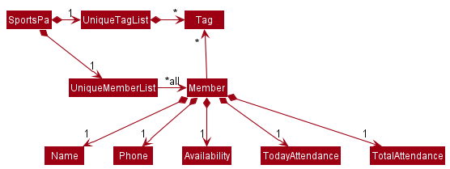

* Table of Contents
{:toc}

--------------------------------------------------------------------------------------------------------------------
## 1. Introduction 

### 1.1 Overview
This developer guide provides an overview and details of Uni-Fy's system architecture and implementation. We hope it provides you a useful reference should you wish to understand the technical details behind Uni-Fy's implementation. 

### 1.2 Acknowledgements

- Adapted from  AddressBook Level-3 project created as part of the SE-EDU initiative

--------------------------------------------------------------------------------------------------------------------

### 1.2 Setting up, getting started

Refer to the guide [_Setting up and getting started_](SettingUp.md).

--------------------------------------------------------------------------------------------------------------------

## 2. Design

:bulb: **Tip:** The `.puml` files used to create diagrams in this document can be found in the [diagrams](https://github.com/se-edu/addressbook-level3/tree/master/docs/diagrams/) folder. Refer to the [_PlantUML Tutorial_ at se-edu/guides](https://se-education.org/guides/tutorials/plantUml.html) to learn how to create and edit diagrams.

### 2.1 Architecture

The ***Architecture Diagram*** given above explains the high-level design of the App.

Given below is a quick overview of main components and how they interact with each other.

**Main components of the architecture**

**`Main`** has two classes called [`Main`](https://github.com/se-edu/addressbook-level3/tree/master/src/main/java/seedu/address/Main.java) and [`MainApp`](https://github.com/se-edu/addressbook-level3/tree/master/src/main/java/seedu/address/MainApp.java). It is responsible for,
* At app launch: Initializes the components in the correct sequence, and connects them up with each other.
* At shut down: Shuts down the components and invokes cleanup methods where necessary.

[**`Commons`**](#common-classes) represents a collection of classes used by multiple other components.

The rest of the App consists of four components.

* [**`UI`**](#ui-component): The UI of the App.
* [**`Logic`**](#logic-component): The command executor.
* [**`Model`**](#model-component): Holds the data of the App in memory.
* [**`Storage`**](#storage-component): Reads data from, and writes data to, the hard disk.

**How the architecture components interact with each other**

The *Sequence Diagram* below shows how the components interact with each other for the scenario where the user issues the command `delete 1`.

Each of the four main components (also shown in the diagram above),

* defines its *API* in an `interface` with the same name as the Component.
* implements its functionality using a concrete `{Component Name}Manager` class (which follows the corresponding API `interface` mentioned in the previous point.

For example, the `Logic` component defines its API in the `Logic.java` interface and implements its functionality using the `LogicManager.java` class which follows the `Logic` interface. Other components interact with a given component through its interface rather than the concrete class (reason: to prevent outside component's being coupled to the implementation of a component), as illustrated in the (partial) class diagram below.

The sections below give more details of each component.

### 2.2 UI component

The **API** of this component is specified in [`Ui.java`](https://github.com/AY2122S1-CS2103T-W17-4/tp/blob/master/src/main/java/seedu/unify/ui/Ui.java)

The UI consists of a `MainWindow` that is made up of parts e.g.`CommandBox`, `ResultDisplay`, `TaskListPanel`, `StatusBarFooter` etc. All these, including the `MainWindow`, inherit from the abstract `UiPart` class which captures the commonalities between classes that represent parts of the visible GUI.

The `UI` component uses the JavaFx UI framework. The layout of these UI parts are defined in matching `.fxml` files that are in the `src/main/resources/view` folder. For example, the layout of the [`MainWindow`](https://github.com/se-edu/addressbook-level3/tree/master/src/main/java/seedu/address/ui/MainWindow.java) is specified in [`MainWindow.fxml`](https://github.com/se-edu/addressbook-level3/tree/master/src/main/resources/view/MainWindow.fxml)

The `UI` component,

* executes user commands using the `Logic` component.
* listens for changes to `Model` data so that the UI can be updated with the modified data.
* keeps a reference to the `Logic` component, because the `UI` relies on the `Logic` to execute commands.
* depends on some classes in the `Model` component, as it displays `Task` object residing in the `Model`.

### 2.3 Logic component

**API** : [`Logic.java`](https://github.com/se-edu/addressbook-level3/tree/master/src/main/java/seedu/address/logic/Logic.java)

Here's a (partial) class diagram of the `Logic` component:

How the `Logic` component works:
1. When `Logic` is called upon to execute a command, it uses the `AddressBookParser` class to parse the user command.
1. This results in a `Command` object (more precisely, an object of one of its subclasses e.g., `AddCommand`) which is executed by the `LogicManager`.
1. The command can communicate with the `Model` when it is executed (e.g. to add a task).
1. The result of the command execution is encapsulated as a `CommandResult` object which is returned back from `Logic`.

The Sequence Diagram below illustrates the interactions within the `Logic` component for the `execute("delete 1")` API call.

:information_source: **Note:** The lifeline for `DeleteCommandParser` should end at the destroy marker (X) but due to a limitation of PlantUML, the lifeline reaches the end of diagram.

Here are the other classes in `Logic` (omitted from the class diagram above) that are used for parsing a user command:

How the parsing works:
* When called upon to parse a user command, the `AddressBookParser` class creates an `XYZCommandParser` (`XYZ` is a placeholder for the specific command name e.g., `AddCommandParser`) which uses the other classes shown above to parse the user command and create a `XYZCommand` object (e.g., `AddCommand`) which the `AddressBookParser` returns back as a `Command` object.
* All `XYZCommandParser` classes (e.g., `AddCommandParser`, `DeleteCommandParser`, ...) inherit from the `Parser` interface so that they can be treated similarly where possible e.g, during testing.

### 2.4 Model component
**API** : [`Model.java`](https://github.com/se-edu/addressbook-level3/tree/master/src/main/java/seedu/address/model/Model.java)

The `Model` component,

* stores the address book data i.e., all `Task` objects (which are contained in a `UniqueTaskList` object).
* stores the currently 'selected' `Task` objects (e.g., results of a search query) as a separate _filtered_ list which is exposed to outsiders as an unmodifiable `ObservableList<Task>` that can be 'observed' e.g. the UI can be bound to this list so that the UI automatically updates when the data in the list change.
* stores a `UserPref` object that represents the user’s preferences. This is exposed to the outside as a `ReadOnlyUserPref` objects.
* does not depend on any of the other three components (as the `Model` represents data entities of the domain, they should make sense on their own without depending on other components)

:information_source: **Note:** An alternative (arguably, a more OOP) model is given below. It has a `Tag` list in the `AddressBook`, which `Task` references. This allows `AddressBook` to only require one `Tag` object per unique tag, instead of each `Task` needing their own `Tag` objects. 

### 2.5 Storage component

**API** : [`Storage.java`](https://github.com/se-edu/addressbook-level3/tree/master/src/main/java/seedu/address/storage/Storage.java)

The `Storage` component,
* can save both address book data and user preference data in json format, and read them back into corresponding objects.
* inherits from both `AddressBookStorage` and `UserPrefStorage`, which means it can be treated as either one (if only the functionality of only one is needed).
* depends on some classes in the `Model` component (because the `Storage` component's job is to save/retrieve objects that belong to the `Model`)

### 2.6 Common classes

Classes used by multiple components are in the `seedu.addressbook.commons` package.

--------------------------------------------------------------------------------------------------------------------

## 3. Implementation

This section describes some noteworthy details on how certain features are implemented.

### 3.1 Add task feature

### 3.2 Delete task feature

The delete feature enables users to delete tasks by specifying the task index or task name.

#### 3.2.1 Implementation

##### DeleteCommand class

The `DeleteCommand` class extends the `Command` class. It manages the deletion of tasks specified by the user based on the index(es) provided. It contains a `String` representing its command word to be used by the parser, a `String` representing its usage to be displayed if used incorrectly, a `String` representing the successful deletion of a task, and a `List<Index>`, `targetIndexes`, which contains the indexes of all tasks to be deleted.

The `execute` method in `DeleteCommand` overrides that in `Command`. In this implementation, it exemplifies defensive programming by ensuring the `model` provided is non-`null`. It then checks if the indexes provided by the user are valid for the current list shown, and continues only if they are all valid (between 1 and the total number of items in the task list). A `CommandException` is thrown in cases of invalid indexes. In the happy path, the tasks are deleted iteratively starting from the last index provided to the first, to prevent future deletions from operating on wrong indexes due to the task list updating itself in each iteration.

##### DeleteCommandParaser class

The `DeleteCommandParser` class implements the `Parser<DeleteCommand` interface. It manages the parsing of the arguments (index(es) in the case of a delete command) in the user input.
The `parse` method in `DeleteCommandParser` first converts the argument provided into a `List<Index>`. It then returns a `DeleteCommand` back to `UniFyParser`, initialized with the `List<Index>`.

##### Usage Scenario
TODO

#### 3.2.2 Design Consideration

##### Aspect: Reference to use to delete tasks

* **Alternative 1 (current choice):** Allow users to delete tasks using task id.
    * Pros: Short and really quick for users to type
    * Cons: If list is long, users might have to spend time scrolling to find task id before deletion

* **Alternative 2:** Allows users to delete tasks by task name
    * Pros: Tasks sharing task name can be easily deleted together (e.g. user can delete every assignment in Uni-Fy by typing `delete assignment`)
    * Cons: Might result in collateral deletion accidentally; Takes much longer to input
    
Due to the repercussions of Alternative 2 and the efficiency of Alternative 1, we have decided to adopt Alternative 1 as our current implementation.

### 3.3 Show feature

### 3.4 Find task feature

The find feature enables users to find tasks by specifying part of the task name or date.

#### 3.4.1 Implementation

The following are the changes made to achieve this feature:

* A `TaskContainsDatePredicate` class is added under the `model/task` package.
* The `NameContainsKeywordsPredicate` class is modified to allow partial words.
* `FindCommand` class is modified to accept multiple predicate object.
* `FindCommandParser` class is modified to parser both task name and date.

Given below is a usage scenario of this feature using both name and date as inputs.

Step 1. The user executes `add n/Math Quiz 5 d/2021-10-10 t/18:00 tg/Important` to add a task named Math Quiz 5 and with a deadline of 6pm, 10 October 2021.

Step 2. The user executes `add n/Math Assignment 2 d/2021-10-12 t/18:00 tg/Important` to add a task named Math Assignment 2 and with a deadline of 6pm, 12 October 2021.

Step 3. The user executes `find Quiz` command to find all task with the name "Quiz".

Step 4. The user executes `find Math d/2021-10-10` command to find all Math task with a dateline of 10 October 2021.

Step 5. The user executes `list` command to view the full list of tasks.

The sequence diagram below illustrates the interaction between Logic and Model components when the user executes `find Math d/2021-10-10` command as in Step 4.

**:information_source: Note on sequence diagram:** 

* The lifeline for `findCommand` should end at the destroy marker (X) but due to a limitation of PlantUML, the lifeline reaches the end of the diagram.

In the **Logic** Component, when user inputs `find Math d/2021-10-10`, these are the key methods invoked:
* `LogicManager#execute("find Math d/2021-10-10")`: The `LogicManager` takes in the command text string ("find Math d/2021-10-10").
* `UniFyParser#parseCommand("find")`: The `UniFyParser` parses the users' input and recognizes the command word, "find", and a `FindCommand` is created.
* `FindCommand#execute(model)`: The `FindCommand` uses the `updateFilteredTaskList` method of `Model` to update the displayed patient list and returns a `CommandResult` object which represents the result of a
  command execution.

In the **Model** Component, This is the key method invoked:
* `Model#updateFilteredTaskList(predicate)`: `Model` uses this method to update the displayed patients list.

The following activity diagram summarizes what happens when the user inputs a find command.

#### 3.4.2 Design Consideration

##### Aspect: What to use as reference to find the task?

* **Alternative 1 (current choice):** Allow users to enter task name with date.
    * Pros: Easier for users to find the task if they know the task name and what date the task in on.
    * Cons: Harder to implement because multiple predicates have to be used.

* **Alternative 2:** Users can only enter name
    * Pros: Easy to implement, and only one predicate is required.
    * Cons: Inconvenient for users if they have recurring task on different dates.

_{more aspects and alternatives to be added}_

### 3.5 Tag task feature

### 3.6 \[Proposed\] Undo/redo feature

#### 3.6.1 Proposed Implementation

The proposed undo/redo mechanism is facilitated by `VersionedAddressBook`. It extends `AddressBook` with an undo/redo history, stored internally as an `addressBookStateList` and `currentStatePointer`. Additionally, it implements the following operations:

* `VersionedAddressBook#commit()` — Saves the current address book state in its history.
* `VersionedAddressBook#undo()` — Restores the previous address book state from its history.
* `VersionedAddressBook#redo()` — Restores a previously undone address book state from its history.

These operations are exposed in the `Model` interface as `Model#commitAddressBook()`, `Model#undoAddressBook()` and `Model#redoAddressBook()` respectively.

Given below is an example usage scenario and how the undo/redo mechanism behaves at each step.

Step 1. The user launches the application for the first time. The `VersionedAddressBook` will be initialized with the initial address book state, and the `currentStatePointer` pointing to that single address book state.

Step 2. The user executes `delete 5` command to delete the 5th task in the address book. The `delete` command calls `Model#commitAddressBook()`, causing the modified state of the address book after the `delete 5` command executes to be saved in the `addressBookStateList`, and the `currentStatePointer` is shifted to the newly inserted address book state.

Step 3. The user executes `add n/David …​` to add a new task. The `add` command also calls `Model#commitAddressBook()`, causing another modified address book state to be saved into the `addressBookStateList`.

:information_source: **Note:** If a command fails its execution, it will not call `Model#commitAddressBook()`, so the address book state will not be saved into the `addressBookStateList`.

Step 4. The user now decides that adding the task was a mistake, and decides to undo that action by executing the `undo` command. The `undo` command will call `Model#undoAddressBook()`, which will shift the `currentStatePointer` once to the left, pointing it to the previous address book state, and restores the address book to that state.

:information_source: **Note:** If the `currentStatePointer` is at index 0, pointing to the initial AddressBook state, then there are no previous AddressBook states to restore. The `undo` command uses `Model#canUndoAddressBook()` to check if this is the case. If so, it will return an error to the user rather
than attempting to perform the undo.

The following sequence diagram shows how the undo operation works:

:information_source: **Note:** The lifeline for `UndoCommand` should end at the destroy marker (X) but due to a limitation of PlantUML, the lifeline reaches the end of diagram.

The `redo` command does the opposite — it calls `Model#redoAddressBook()`, which shifts the `currentStatePointer` once to the right, pointing to the previously undone state, and restores the address book to that state.

:information_source: **Note:** If the `currentStatePointer` is at index `addressBookStateList.size() - 1`, pointing to the latest address book state, then there are no undone AddressBook states to restore. The `redo` command uses `Model#canRedoAddressBook()` to check if this is the case. If so, it will return an error to the user rather than attempting to perform the redo.

Step 5. The user then decides to execute the command `list`. Commands that do not modify the address book, such as `list`, will usually not call `Model#commitAddressBook()`, `Model#undoAddressBook()` or `Model#redoAddressBook()`. Thus, the `addressBookStateList` remains unchanged.

Step 6. The user executes `clear`, which calls `Model#commitAddressBook()`. Since the `currentStatePointer` is not pointing at the end of the `addressBookStateList`, all address book states after the `currentStatePointer` will be purged. Reason: It no longer makes sense to redo the `add n/David …​` command. This is the behavior that most modern desktop applications follow.

The following activity diagram summarizes what happens when a user executes a new command:

#### 3.6.2 Design considerations:

**Aspect: How undo & redo executes:**

* **Alternative 1 (current choice):** Saves the entire address book.
    * Pros: Easy to implement.
    * Cons: May have performance issues in terms of memory usage.

* **Alternative 2:** Individual command knows how to undo/redo by
  itself.
    * Pros: Will use less memory (e.g. for `delete`, just save the task being deleted).
    * Cons: We must ensure that the implementation of each individual command are correct.

_{more aspects and alternatives to be added}_

### 3.7 \[Proposed\] Data archiving

_{Explain here how the data archiving feature will be implemented}_

--------------------------------------------------------------------------------------------------------------------

## 4. Documentation, logging, testing, configuration, dev-ops

(TODO: maybe separate this into individual sections)
* [Documentation guide](Documentation.md)
* [Testing guide](Testing.md)
* [Logging guide](Logging.md)
* [Configuration guide](Configuration.md)
* [DevOps guide](DevOps.md)

--------------------------------------------------------------------------------------------------------------------

## Appendix A: Product Scope

**Target user profile**:

* has a need to manage a significant number of academic tasks in schedule
* prefer desktop apps over other types
* can type fast
* prefers typing to mouse interactions
* is reasonably comfortable using CLI apps

**Value proposition**: manage academic tasks to allow students to have more control over their time

## Appendix B: User Stories

Priorities: High (must have) - `* * *`, Medium (nice to have) - `* *`, Low (unlikely to have) - `*`

| Priority | As a …​                                    | I want to …​                   | So that I can…​                                                        |
| -------- | ------------------------------------------ | ------------------------------ | ---------------------------------------------------------------------- |
| `* * *`  | new user                                   |                                | refer to instructions when I forget how to use the App                 |
| `* * *`  | user                                       | add tasks                      |                                                                        |
| `* * *`  | user                                       | delete tasks                   | remove tasks that I no longer need to track                            |
| `* * *`  | user                                       | find tasks                     | locate details of a task without having to go through the entire list  |
| `* *`    | user                                       | show tasks                     | show the tasks that I have for the week or according to the date       |
| `* *`    | user                                       | tag tasks                      | set a tasks priority                                                   |
| `*`      | user with many tasks in the address book |                                | locate a task easily                                                 |

*{More to be added}*

## Appendix C: Use cases

(For all use cases below, the **System** is `Uni-Fy` and the **Actor** is the `user`, unless specified otherwise)

**Use case: Add a task**

**MSS**

1.  User requests to add a task at a certain date and time.
2.  Uni-Fy adds the task at the given date and time and displays success message.

    Use case ends.

**Extensions**

* 1a. User requests to add a task at a certain date without time.
    * 1a1. Uni-Fy adds the task at the given date and time of 23:59 and displays success message

      Use case ends.
* 1b. User enters invalid date format.
  * 1b1. Uni-Fy shows an error message.

    Use case resumes at step 1.

**Use case: Delete a task**

**MSS**

1.  User requests to show tasks for a specific week
2.  Uni-Fy displays the list of tasks for that week
3.  User requests to delete a specific task based on its index
4.  Uni-Fy deletes the specified task

    Use case ends.

**Extensions**

* 2a. The list is empty.

  Use case ends.

* 3a. The given index is invalid.

    * 3a1. Uni-Fy shows an error message.

      Use case resumes at step 2.

* 3b. User requests to delete a specific task based on its task name
  * 3b1. Uni-Fy deletes the specified task

    Use case ends.

**Use case: Find a task**

**MSS**

1.  User requests to find tasks that contains some keywords
2.  Uni-Fy displays the list of tasks with matching keywords

    Use case ends.

**Extensions**

* 1a. User requests to find tasks that contains some keywords with a due date.
    * 1a1. Uni-Fy displays the list of tasks with matching keywords with that due date.
  Use case ends.

**Use case: Show tasks**

**MSS**

1.  User requests to show tasks based on a given date or week number
2.  Uni-Fy displays the list of tasks occurring in that week or on the given date.

**Extensions**

* 1a. The list is empty.
  Use case ends.

* 2a. The given index is invalid.
    * 3a1. Uni-Fy shows an error message.
      Use case reverts to step 1.

**Use case: Tag a task**

**MSS**

1.  User requests to tag tasks that contains some keywords
2.  Uni-Fy sets priority for that particular task(s) with the matching keywords

    Use case ends.

**Extensions**

* 1a. User requests to tag tasks that contains some keywords with a due date.
    * 1a1. Uni-Fy sets priority for the particular task(s) with matching keywords with that due date.
      Use case ends.

*{More to be added}*

## Appendix D: Non-Functional Requirements

1.  Should work on any _mainstream OS_ as long as it has Java `11` or above installed.
2.  Should be able to hold up to 1000 tasks without a noticeable sluggishness in performance for typical usage.
3.  A user with above average typing speed for regular English text (i.e. not code, not system admin commands) should be able to accomplish most of the tasks faster using commands than using the mouse.

*{More to be added}*

## Appendix E: Glossary

* **Mainstream OS**: Windows, Linux, Unix, OS-X

--------------------------------------------------------------------------------------------------------------------

## Appendix F: Instructions for manual testing

Given below are instructions to test the app manually.

:information_source: **Note:** These instructions only provide a starting point for testers to work on;
testers are expected to do more *exploratory* testing.

### Launch and shutdown

1. Initial launch

   1. Download the jar file and copy into an empty folder

   1. Double-click the jar file Expected: Shows the GUI with a set of sample contacts. The window size may not be optimum.

1. Saving window preferences

   1. Resize the window to an optimum size. Move the window to a different location. Close the window.

   1. Re-launch the app by double-clicking the jar file. 
       Expected: The most recent window size and location is retained.

1. _{ more test cases …​ }_

### Deleting a task

1. Deleting a task while all tasks are being shown

   1. Prerequisites: List all tasks using the `list` command. Multiple tasks in the list.

   1. Test case: `delete 1` 
      Expected: First contact is deleted from the list. Details of the deleted contact shown in the status message. Timestamp in the status bar is updated.

   1. Test case: `delete 0` 
      Expected: No task is deleted. Error details shown in the status message. Status bar remains the same.

   1. Other incorrect delete commands to try: `delete`, `delete x`, `...` (where x is larger than the list size) 
      Expected: Similar to previous.

1. _{ more test cases …​ }_

### Saving data

1. Dealing with missing/corrupted data files

   1. _{explain how to simulate a missing/corrupted file, and the expected behavior}_

1. _{ more test cases …​ }_
