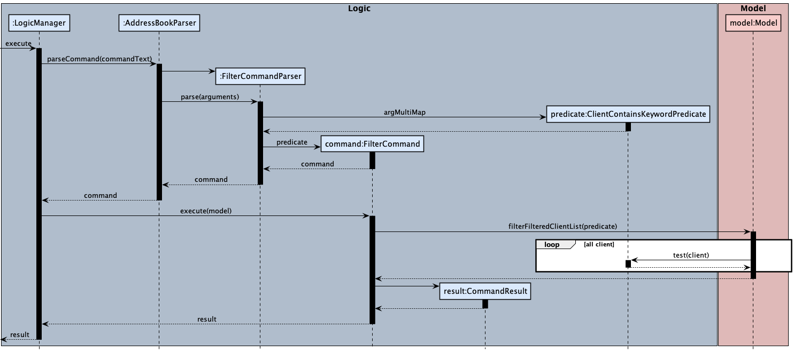

* Table of Contents
{:toc}

--------------------------------------------------------------------------------------------------------------------

## **1. Acknowledgements**
*ComputingConnection* makes use of the following third-party libraries:
Libraries used: [JavaFX](https://openjfx.io/), [JSON in Java](https://mvnrepository.com/artifact/org.json/json), [Jackson](https://github.com/FasterXML/jackson), [JUnit5](https://github.com/junit-team/junit5)

--------------------------------------------------------------------------------------------------------------------

## **2. Setting up, getting started**

Refer to the guide [_Setting up and getting started_](SettingUp.md).

--------------------------------------------------------------------------------------------------------------------

## **3. Design**

:bulb: **Tip:** The `.puml` files used to create diagrams in this document can be found in the [diagrams](https://github.com/AY2122S1-CS2103T-W10-3/tp/tree/master/docs/diagrams/) folder.

### 3.1 Architecture

The ***Architecture Diagram*** given above explains the high-level design of the App.

Given below is a quick overview of main components and how they interact with each other.

**Main components of the architecture**

**`Main`** has two classes called [`Main`](https://github.com/AY2122S1-CS2103T-W10-3/tp/tree/master/src/main/java/seedu/address/Main.java) and [`MainApp`](https://github.com/AY2122S1-CS2103T-W10-3/tp/tree/master/src/main/java/seedu/address/MainApp.java). It is responsible for,
* At app launch: Initializes the components in the correct sequence, and connects them up with each other.
* At shut down: Shuts down the components and invokes cleanup methods where necessary.

[**`Commons`**](#common-classes) represents a collection of classes used by multiple other components.

The rest of the App consists of four components.

* [**`UI`**](#ui-component): The UI of the App.
* [**`Logic`**](#logic-component): The command executor.
* [**`Model`**](#model-component): Holds the data of the App in memory.
* [**`Storage`**](#storage-component): Reads data from, and writes data to, the hard disk.

**How the architecture components interact with each other**

The *Sequence Diagram* below shows how the components interact with each other for the scenario where the user issues the command `delete 1`.

Each of the four main components (also shown in the diagram above),

* defines its *API* in an `interface` with the same name as the Component.
* implements its functionality using a concrete `{Component Name}Manager` class (which follows the corresponding API `interface` mentioned in the previous point.

For example, the `Logic` component defines its API in the `Logic.java` interface and implements its functionality using the `LogicManager.java` class which follows the `Logic` interface. Other components interact with a given component through its interface rather than the concrete class (reason: to prevent outside component's being coupled to the implementation of a component), as illustrated in the (partial) class diagram below.

The sections below give more details of each component.

### 3.2 UI component

The **API** of this component is specified in [`Ui.java`](https://github.com/AY2122S1-CS2103T-W10-3/tp/tree/master/src/main/java/seedu/address/ui/Ui.java)

The UI consists of a `MainWindow` that is made up of parts e.g.`CommandBox`, `ResultDisplay`, `PersonListPanel`, `StatusBarFooter` etc. All these, including the `MainWindow`, inherit from the abstract `UiPart` class which captures the commonalities between classes that represent parts of the visible GUI.

The `UI` component uses the JavaFx UI framework. The layout of these UI parts are defined in matching `.fxml` files that are in the `src/main/resources/view` folder. For example, the layout of the [`MainWindow`](https://github.com/se-edu/AY2122S1-CS2103T-W10-3/tp/master/src/main/java/seedu/address/ui/MainWindow.java) is specified in [`MainWindow.fxml`](https://github.com/AY2122S1-CS2103T-W10-3/tp/tree/master/src/main/resources/view/MainWindow.fxml)

The `UI` component,

* executes user commands using the `Logic` component.
* listens for changes to `Model` data so that the UI can be updated with the modified data.
* keeps a reference to the `Logic` component, because the `UI` relies on the `Logic` to execute commands.
* depends on some classes in the `Model` component, as it displays `Person` object residing in the `Model`.

### 3.3 Logic component

**API** : [`Logic.java`](https://github.com/AY2122S1-CS2103T-W10-3/tp/tree/master/src/main/java/seedu/address/logic/Logic.java)

Here's a (partial) class diagram of the `Logic` component:

How the `Logic` component works:
1. When `Logic` is called upon to execute a command, it uses the `AddressBookParser` class to parse the user command.
1. This results in a `Command` object (more precisely, an object of one of its subclasses e.g., `AddCommand`) which is executed by the `LogicManager`.
1. The command can communicate with the `Model` when it is executed (e.g. to add a contact).
1. The result of the command execution is encapsulated as a `CommandResult` object which is returned back from `Logic`.

The Sequence Diagram below illustrates the interactions within the `Logic` component for the `execute("delete 1")` API call.

:information_source: **Note:** The lifeline for `DeleteCommandParser` should end at the destroy marker (X) but due to a limitation of PlantUML, the lifeline reaches the end of diagram.

Here are the other classes in `Logic` (omitted from the class diagram above) that are used for parsing a user command:

How the parsing works:
* When called upon to parse a user command, the `AddressBookParser` class creates an `XYZCommandParser` (`XYZ` is a placeholder for the specific command name e.g., `AddCommandParser`) which uses the other classes shown above to parse the user command and create a `XYZCommand` object (e.g., `AddCommand`) which the `AddressBookParser` returns back as a `Command` object.
* All `XYZCommandParser` classes (e.g., `AddCommandParser`, `DeleteCommandParser`, ...) inherit from the `Parser` interface so that they can be treated similarly where possible e.g, during testing.

### 3.4 Model component
**API** : [`Model.java`](https://github.com/AY2122S1-CS2103T-W10-3/tp/tree/master/src/main/java/seedu/address/model/Model.java)

The `Model` component,

* stores the address book data i.e., all `Person` objects (which are contained in a `UniquePersonList` object).
* stores the currently 'selected' `Person` objects (e.g., results of a search query) as a separate _filtered_ list which is exposed to outsiders as an unmodifiable `ObservableList<Person>` that can be 'observed' e.g. the UI can be bound to this list so that the UI automatically updates when the data in the list change.
* stores a `UserPref` object that represents the user’s preferences. This is exposed to the outside as a `ReadOnlyUserPref` objects.
* does not depend on any of the other three components (as the `Model` represents data entities of the domain, they should make sense on their own without depending on other components)

:information_source: **Note:** An alternative (arguably, a more OOP) model is given below. It has a `Skill` list in the `AddressBook`, which `Person` references. This allows `AddressBook` to only require one `Skill` object per unique skill, instead of each `Person` needing their own `Skill` objects. This can also be applied to the `Faculty` class (as shown in the diagram), `Major`, `Language`, `Framework` and `Tag` classes.
 

### 3.5 Storage component

**API** : [`Storage.java`](https://github.com/AY2122S1-CS2103T-W10-3/tp/tree/master/src/main/java/seedu/address/storage/Storage.java)

The `Storage` component,
* can save both address book data and user preference data in json format, and read them back into corresponding objects.
* inherits from both `AddressBookStorage` and `UserPrefStorage`, which means it can be treated as either one (if only the functionality of only one is needed).
* depends on some classes in the `Model` component (because the `Storage` component's job is to save/retrieve objects that belong to the `Model`)

### 3.6 Common classes

Classes used by multiple components are in the `seedu.addressbook.commons` package.

--------------------------------------------------------------------------------------------------------------------

## **4. Implementation**

This section describes some noteworthy details on how certain features are implemented.

### 4.1 Optional and Multiple Data Fields Feature

#### 4.1.1 Implementation
The **optional and multiple data fields** feature allows the user to add labels to a particular contact under these specific categories: **skill, programming language, programming framework, tag,** and **remark**.

This implementation uses the following classes in the `Model` component:
* `Skill` in the skill package
* `Language` in the skill package
* `Framework` in the skill package
* `Tag` in the tag package
* `Remark` in the remark package

Furthermore, this implementation introduces the following classes in the `Logic` component: 
* `AppendCommand` that extends Command
* `AppendPersonDescriptor` that is nested in AppendCommand
* `AppendCommandParser` that implements Parser<AppendCommand>
* `RemoveCommand` that extends Command
* `RemovePersonDescriptor` that is nested in RemoveCommand
* `RemoveCommandParser` that implements Parser<RemoveCommand>

In addition, the following classes are utilised in the `Ui` component
* `PersonCard` that extends UiPart<Region>
* `PersonListCard.fxml` to display the labels

Given below is an example usage scenario and how the `append` and `remove` mechanism behaves at each step.  

Step 1. The user launches the application with existing contacts from previous uses. 

Step 2. The user executes `append 3 l/python` to append "python" to the list of programming languages of the contact at index 3. The command passes through `LogicManager`, `AddressBookParser`, and `AppendCommandParser` which creates an `AppendPersonDescriptor` object and subsequently an `AppendCommand` object to be executed.

In this sequence diagram, the focus is on the `Logic` component and how an `AppendCommand` object is created once the user inputs `append 3 l/python`.
   

Step 3. After the `AppendCommand` is executed and the interaction with the `Model` component is complete and fed back to the `Ui` component, the item `python` is now seen under the 3rd contact's list of programming languages, with no change to the previous existing programming languages. Languages are then sorted alphanumerically in the display. 

In this next sequence diagram, the focus is on the interactions between the `Logic` and `Model` components when the `AppendCommand` is executed.
   

:information_source: **Note:** The lifeline for `AppendCommand` should end at the destroy marker (X) but due to a limitation of PlantUML, the lifeline reaches the end of diagram.

Step 4. If the user realises that a mistake in assigning the wrong language, i.e. should have been "java" instead of "python", the user executes the `rm 3 l/INDEX`, where index is the index of the "python" language in the display of the 3rd contact. Similar to the `AppendCommand`, the `RemoveCommand` deletes only the targeted language specified by the index, with no change to the other existing data fields.   

The following activity diagram summarizes what happens when a user executes `append` command:

#### 4.1.2 Design  considerations
The previous implementation of **AB3's** `edit` command deleted all `Tags` when editing. There was no way to add new data fields to existing ones without re-entering all data fields manually. Similarly, there was no way to remove a specific `Tag`. Therefore, for optional and multiple data fields such as **skills**, **programming languages**, etc, appending and specific removal were significant design improvements. 

One of the main considerations was to deal with the project constraints of not using a separate database. Therefore, the design implementation would have to be done over data structures stored in a JSON format. 

Another consideration regarding the display design was to display the data fields alphanumerically instead of when they were chornologically added. This facilitates the user's visual categorisation across multiple contacts. (i.e. "backend" would always appear before "frontend" for all contacts that are applicable).

Finally, defensive coding techniques were used by making a copy of the `AppendPersonDescriptor` class. 

#### 4.1.3 Alternatives
**Aspect: How the new data fields are implemented:**
* **Alternative 1 (current choice):** Each `Person` object references their own data field objects. I.e. multiple `Language` objects named "python" may exist, with each object related to a specific `Person`.
* **Alternative 2 (future implementation):** An alternative implementation (arguably, more object oriented) would be to have a unique data field list for each **optional and mulitple data field**, i.e. skill, programming language, framework, tag, and remark, that `Person` references. This allows us to only require one data field object per unique element, instead of each `Person` needing their own data field objects. See [Model component alternative](#34-model-component) for more information. 

**Aspect: How the append command executes:**
* **Alternative 1 (current choice):** HashSets are currently used for the appending of unique data field objects. The first HashSet is used to store the new data fields to append (provided by input). The second HashSet stores the existing data fields of the specified contact. The third HashSet is used to combine the first and second, and is then set to the target contact's data field HashSet. 
* **Alternative 2 (future implementation):** An alternative implementation, which uses one data field object per unique element (e.g.  [Model component alternative](#34-model-component)), would be to append new pointers to a list of existing pointers a `Person` has to various data field elements.

**Aspect: How the remove command executes:**
* **Alternative 1 (current choice):** Similar to the `append` command, the `rm` command also uses HashSets to store indexes and existing data fields. Additionally, the ArrayList data structure was used to implement Java generics for better code quality.
* **Alternative 2 (future implementation):** Similar to the `append` command, an alternative implementation would be to remove pointers in a list of existing pointers a `Person` has.

### 4.2 Interactions feature

#### 4.2.1 Implementation
The interaction mechanism utilizes the same concept as other commands like `add` and `edit` with some tweaks.

Given below is an example usage scenario and how the interaction mechanism behaves at each step.

Step 1. The user inputs the command `interaction int/we just met on/2020-02-02`

Step 2. The command passes through the `LogicManager`. `LogicManager` creates a `AddressBookParser` which would help to parse and tokenize the command.

Step 3. `AddressBookParser` sees that it's a interaction command and creates a `InteractionCommandParser` object.

Step 4. `InteractionCommandParser` helps to extract out the tokens and generate a `InteractionCommand`. The input validation is mostly done at this stage.

:information_source: **Note:** Most input validation will be done at this stage.

The following sequence diagram visually describes the steps above:

#### 4.2.2 Design considerations
  **Aspect: How interactions is stored:**
  
  * **Alternative 1 (current choice):** As a list of interactions in the Person object.
  * Pros: Easy to implement, intuitive design and navigatability
  * Cons: Heavy coupling with the Person class
  
  * **Alternative 2:** As a list by itself, containing a reference to the Person it is attached to.
  * Pros: More isolated from the Person class, so less changes to overall code
  * Cons: Navigatability is reduced significantly

###  4.3 View feature

#### 4.3.1 Implementation
The view mechanism utilizes the same concept as other commands 
like `add` and `edit`, but has a few distinct changes.

Given below is an example usage scenario and how the view mechanism
behaves at each step.

Step 1. The user inputs the command `view 2`

Step 2. The command passes through the `LogicManager`. 
`LogicManager` creates a `AddressBookParser` which would help to 
parse and tokenize the command.

Step 3. `AddressBookParser` sees that it's a view command and creates a
`ViewCommandParser` object.

Step 4. `ViewCommandParser` helps to extract out the tokens and 
generate a `ViewCommand`.

Step 5. `ViewCommand` helps to call the updateViewedPerson method,
so that the GUI shows the correct Person.

The following sequence diagram visually describes the steps above:

#### 4.3.2 Design considerations:
**Aspect: How viewedPerson is stored:**

* **Alternative 1 (current choice):** As a FilteredList in the ModelManager.
  * Pros: Easy to implement, similar logic to filteredPersons, making it easy
    to understand. Easy to implement future versions in case there is a need
    to add functionality to view multiple contacts at once.
  * Cons: Not necessarily a good usage of a FilteredList since there should
    only be a single contact viewed at once for the current version.

* **Alternative 2:** As a single Person instance in the ModelManager.
  * Pros: More intuitive as there is only a single contact viewed at once currently.
  * Cons: More rigid and harder to improve upon for future versions.

### 4.4 Filter feature

#### 4.4.1 Implementation
The filter mechanism utilizes the same concept as other commands like `find` with some tweaks.

Given below is an example usage scenario and how the filter mechanism behaves at each step.

Step 1. The user inputs the command `filter f/computing`

Step 2. The command passes through the `LogicManager`. `LogicManager` creates a `AddressBookParser` which would help to parse and tokenize the command.

Step 3. `AddressBookParser` sees that it's a filter command and creates an `FilterCommandParser` object.

Step 4. `FilterCommandParser` helps to extract out the tokens and generate a `FilterCommand`. The input validation is mostly done at this stage.

:information_source: **Note:** Most input validation will be done at this stage.

The following sequence diagram visually describes the steps above:

### 4.5 Organisations feature

#### 4.5.1 Implementation
The Organisation commands utilize the same concept as other commands like `add` and `delete` with some tweaks.

Given below is an example usage scenario and how the organisation commands behave at each step.

Step 1. The user inputs the command `addorg n/Facebook e/hello@facebook.com`

Step 2. The command passes through the `LogicManager`. `LogicManager` creates a `AddressBookParser` which would help to parse and tokenize the command.

Step 3. `AddressBookParser` sees that it's an AddOrg command and creates a `AddOrgCommandParser` object.

Step 4. `AddOrgCommandParser` helps to extract out the tokens and generate a `AddOrgCommand`. The input validation is mostly done at this stage.

:information_source: **Note:** Most input validation will be done at this stage.

The following sequence diagram visually describes the steps above:

#### 4.5.2 Design considerations:

**Aspect: How contacts in organisations are stored:**

* **Alternative 1 (current choice):** As a list of contacts in each organisation in the Address Book.
    * Pros: Easy to implement, intuitive design
    * Cons: Any updates to a contact in Address Book have to be checked and updated in each organisation

* **Alternative 2:** List of contacts in each organisation stores the references to the contacts
    * Pros: Any updates to a contact in Address Book is synchronised with the organisations the contact is in
    * Cons: Harder to implement

### 4.6 \[Proposed\] Undo/redo feature

#### 4.6.1 Proposed Implementation

The proposed undo/redo mechanism is facilitated by `VersionedAddressBook`. It extends `AddressBook` with an undo/redo history, stored internally as an `addressBookStateList` and `currentStatePointer`. Additionally, it implements the following operations:

* `VersionedAddressBook#commit()` — Saves the current address book state in its history.
* `VersionedAddressBook#undo()` — Restores the previous address book state from its history.
* `VersionedAddressBook#redo()` — Restores a previously undone address book state from its history.

These operations are exposed in the `Model` interface as `Model#commitAddressBook()`, `Model#undoAddressBook()` and `Model#redoAddressBook()` respectively.

Given below is an example usage scenario and how the undo/redo mechanism behaves at each step.

Step 1. The user launches the application for the first time. The `VersionedAddressBook` will be initialized with the initial address book state, and the `currentStatePointer` pointing to that single address book state.

Step 2. The user executes `delete 5` command to delete the 5th contact in the address book. The `delete` command calls `Model#commitAddressBook()`, causing the modified state of the address book after the `delete 5` command executes to be saved in the `addressBookStateList`, and the `currentStatePointer` is shifted to the newly inserted address book state.

Step 3. The user executes `add n/David …​` to add a new contact. The `add` command also calls `Model#commitAddressBook()`, causing another modified address book state to be saved into the `addressBookStateList`.

:information_source: **Note:** If a command fails its execution, it will not call `Model#commitAddressBook()`, so the address book state will not be saved into the `addressBookStateList`.

Step 4. The user now decides that adding the contact was a mistake, and decides to undo that action by executing the `undo` command. The `undo` command will call `Model#undoAddressBook()`, which will shift the `currentStatePointer` once to the left, pointing it to the previous address book state, and restores the address book to that state.

:information_source: **Note:** If the `currentStatePointer` is at index 0, pointing to the initial AddressBook state, then there are no previous AddressBook states to restore. The `undo` command uses `Model#canUndoAddressBook()` to check if this is the case. If so, it will return an error to the user rather
than attempting to perform the undo.

The following sequence diagram shows how the undo operation works:

:information_source: **Note:** The lifeline for `UndoCommand` should end at the destroy marker (X) but due to a limitation of PlantUML, the lifeline reaches the end of diagram.

The `redo` command does the opposite — it calls `Model#redoAddressBook()`, which shifts the `currentStatePointer` once to the right, pointing to the previously undone state, and restores the address book to that state.

:information_source: **Note:** If the `currentStatePointer` is at index `addressBookStateList.size() - 1`, pointing to the latest address book state, then there are no undone AddressBook states to restore. The `redo` command uses `Model#canRedoAddressBook()` to check if this is the case. If so, it will return an error to the user rather than attempting to perform the redo.

Step 5. The user then decides to execute the command `list`. Commands that do not modify the address book, such as `list`, will usually not call `Model#commitAddressBook()`, `Model#undoAddressBook()` or `Model#redoAddressBook()`. Thus, the `addressBookStateList` remains unchanged.

Step 6. The user executes `clear`, which calls `Model#commitAddressBook()`. Since the `currentStatePointer` is not pointing at the end of the `addressBookStateList`, all address book states after the `currentStatePointer` will be purged. Reason: It no longer makes sense to redo the `add n/David …​` command. This is the behavior that most modern desktop applications follow.

The following activity diagram summarizes what happens when a user executes a new command:

#### 4.6.2 Design considerations:

**Aspect: How undo & redo executes:**

* **Alternative 1 (current choice):** Saves the entire address book.
    * Pros: Easy to implement.
    * Cons: May have performance issues in terms of memory usage.

* **Alternative 2:** Individual command knows how to undo/redo by
  itself.
    * Pros: Will use less memory (e.g. for `delete`, just save the contact being deleted).
    * Cons: We must ensure that the implementation of each individual command are correct.

--------------------------------------------------------------------------------------------------------------------

## **5. Documentation, logging, testing, configuration, dev-ops**

* [Documentation guide](Documentation.md)
* [Testing guide](Testing.md)
* [Logging guide](Logging.md)
* [Configuration guide](Configuration.md)
* [DevOps guide](DevOps.md)

--------------------------------------------------------------------------------------------------------------------

## **6. Appendix: Requirements**

### 6.1 Product scope

**Target user profile**:

* NUS computer science university students with entrepreneurial mindset.
* has a need to manage a significant number of contacts of friends and staff with a particular skill set.
* prefer desktop apps over other types
* can type fast
* prefers typing to mouse interactions
* is reasonably comfortable using CLI apps

**Value proposition**: Through an address book, this product aims to store information such as faculty, major, programming languages, interests, past projects, remarks of peers that the user has encountered throughout university. ComputingConnection will help the student remember and document his/her network of students encountered in NUS for easy reference in the future.

### 6.2 User stories

Priorities: High (must have) - `* * *`, Medium (nice to have) - `* *`, Low (unlikely to have) - `*`

User stories are listed based on the chronological use of a user.

| Priority | As a …​                                    | I want to …​                     | So that I can…​                                                        |
| -------- | ------------------------------------------ | ------------------------------ | ---------------------------------------------------------------------- |
| `*`      | potential user exploring the app           | see the app populated with sample data | easily see how the app will look when in use                   |
| `*`      | user ready to start using the app          | view a list of basic commands  | refer to instructions when I forget how to use the App                 |
| `*`      | user ready to start using the app          | purge all current data         | get rid of sample/experiment data I used for exploring the App         |
| `*`      | user ready to start using the app          | confirm to purge the existing data         | not accidentally execute a ‘clear’ command               |
| `* * *`  | new user                                   | add a new contact              | record basic contact information of a contact                  |
| `*`      | new user                                   | view valid faculty and major data fields to assign to a contact            | begin adding new contacts in a valid manner                  |
| `*`  | new user                                   | view valid skills and misc data fields to assign to a contact              | begin adding new contacts in a valid manner                  |
| `* * *`  | beginner user                              | list all current contacts      | have an overview of my populated contacts                              |
| `* * *`  | beginner user                              | assign tags or categories to users | categorise contacts by groups                                      |
| `* * *`  | beginner user                              | append data fields to a contact | add on new data fields to existing ones                          |
| `* * *`  | beginner user                              | remove specific data fields | precisely remove incorrect data fields of a contact                       |
| `* * *`    | slightly familiar user                                       | edit information pertaining to a specific contact   | stay updated with the new details of all my contacts               |
| `* * *`  | slightly familiar user                 | delete a contact                | can remove clutter or errors                                   |
| `* * *`  | slightly familiar user                 | remove appended data fields          | remove outdated or incorrect data fields                                   |
| `* * *`  | slightly familiar user                 | view a contact in detail                | view the miscellaneous data fields such as remarks and interactions                            |
| `* * *`  | slightly familiar user                                       | search for a specific contact          | can narrow down my contact book to the specific contact I am looking for |
| `* * *`  | slightly familiar user                 | list all my organisations               | have an overview of my populated organisations                                  |
| `* * *`  | slightly familiar user                 | add a new organisation                | record basic information of the organisation and the people related to it                                   |
| `* * *`  | slightly familiar user                 | delete an organisation                | remove any organisations that are irrelevant or errors                                   |
| `* * *`  | slightly familiar user                 | add a contact to an organisation                | record a contact's link to an organsiation                                   |
| `* * *`  | slightly familiar user                 | delete a contact from an organisation                | remove a contact's link to an organisation or errors                                   |
| `* * `  | slightly familiar user                 | list all my interactions               | have an overview of my interactions with a particular contact                                  |
| `* *`  | slightly familiar user                 | edit information pertaining to a specific organisation               | stay updated with the new details of all my organisations and contacts within                                  |
| `* *`  | slightly familiar user                 | view the details of a specific organisation                | reconnect with the organisation or the contact related to it                             |
| `*`  | slightly familiar user                                       | confirm deletion of a contact         | not accidentally execute a ‘delete’ command |
| `*`  | slightly familiar user                                       | confirm deletion of a data field         | not accidentally execute a ‘delete’ command |
| `*`      | user with many contacts in the address book | sort contacts by name           | locate a contact easily                                                 |
| `* * *`  | expert user                 | filter my list of contacts                | view a list of contacts based on a list of tags attached to them                                   |
| `*`      | expert user                                | sort contacts by faculty           | consult them should i need help for a project                       |
| `*`      | expert user                                | mass delete information that is not required anymore          | get rid of redundant info                      |
| `*`  | expert user                 | filter my organisation list                | view a list of organisations based on the specific tag attached to them                                  |

### 6.3 Use cases

(For all use cases below, the **System** is the `ComputingConnection` and the **Actor** is the `entrepreneurial student in NUS Computing`, unless specified otherwise)

#### Use case: UC01 Add a contact

**MSS**

1.  Student enters a command to add a contact.
2.  ComputingConnection adds the contact.

    Use case ends.

**Extensions**

* 1a. The input data field formats are incorrect.
    * 1a1. ComputingConnection shows an error message to prompt the wrong data field. 
    Use case resumes at step 1.
* 1b. The student already exists.
    * 1b1. ComputingConnection shows an error message about a duplicate contact.  
    Use case resumes at step 1.

#### Use case: UC02 Edit a contact

**MSS**

1.  Student enters a command to edit a contact.
2.  ComputingConnection shows the current details of the contact with editable fields.
3.  ComputingConnection updates the contact accordingly.

    Use case ends.

**Extensions**

* 1a. The student leaves a required field empty.
    * 1a1. ComputingConnection shows an error message to prompt user to edit that field.  
    Use case ends.

#### Use case: UC03 Append to a contact

**MSS**

1. Student requests for a specific list of contacts.
2. Student enters a command to append an element to a data field of a contact.
3. ComputingConnection appends the data field to the specific contact. 
4. ComputingConnection displays the new details of the contact.

    Use case ends. 

**Extensions**
* 1a. The displayed list is empty.   
  
  Step 1 is repeated until the desired contact is shown.  
  Use case resumes from step 2.
    
* 2a. ComputingConnection detects an error in the entered data.
    * 2a1. ComputingConnection shows an error message to prompt user of the correct format. 
    * 2a2. Student enters valid data fields.  
      
      Steps 2a1-2a2 are repeated until the data entered is correct.  
      Use case resumes from step 3.
      
#### Use case: UC04 Remove a specific item from a data field of a contact.
**MSS**

1. Student requests for a specific list of contacts.
2. Student enters a command to remove an element from a data field of a contact.
3. ComputingConnection removes the element in the specific data field of the contact. 
4. ComputingConnection displays the new details of the contact.

    Use case ends.

**Extensions**
* 1a. The displayed list is empty.  
  
  Step 1 is repeated until the desired contact is shown.  
  Use case resumes from step 2.

* 2a. ComputingConnection detects the given index of the contact or element is invalid. 
    * 2a1. ComputingConnection shows an error message to prompt user of out of bounds error.
    * 2a2. Student enters a valid index  
      
      Steps 2a1-2a2 are repeated until the index entered is correct.  
      Use case resumes from step 3.  
 
* 2b. ComputingConnection detects the entered data field is invalid.
    * 2b1. ComputingConnection shows an error message to prompt user of the correct format.
    * 2b2. User enters valid data fields  
      
      Steps 2a1-2a2 are repeated until the data entered is correct.  
      Use case resumes from step 3.

#### Use case: UC05 Search for a specific contact

**MSS**

1. Student searches a contact by name.
2. ComputingConnection shows the contact with the searched name.

   Use case ends.

**Extensions**

* 2a. Searched contact is invalid.
   * 2a1. ComputingConnection shows an error message.

      Use case ends.

#### Use case: UC06 Filter contact list based on a tag.

**MSS**

1. Student requests for filtering the contact list by the mentioned tag.
2. ComputingConnection shows a filtered contact list based on the mentioned tag.

   Use case ends.

**Extensions**

* 2a. Filter tag is invalid.
    * 2a1. ComputingConnection shows an error message.

      Use case ends.

#### Use case: UC07 Delete a specific contact

**MSS**

1. User searches a contact by name.
2. ComputingConnection shows the contact with the searched name.
3. User Requests to delete the contact.
4. Computing connection deletes the contact.

   Use case ends.

**Extensions**

* 2a. Searched contact is invalid.

    * 2a1. ComputingConnection shows an error message.

      Use case ends.

#### Use case: UC08 Add interactions to a specific contact

**MSS**

1.  User requests to add an interaction to a contact
2.  ComputingConnection adds the interaction to the specific contact

    Use case ends.

**Extensions**

* 1a. The input tag formats are incorrect.
    * 1a1. ComputingConnection shows an error message.

  Use case ends.

#### Use case: UC09 View a specific contact

**MSS**

1.  User requests to view a contact
2.  ComputingConnection shows the contact's details in the app,
    with details like remarks and interactions.

    Use case ends.

**Extensions**

* 1a. The input index is invalid.
    * 1a1. ComputingConnection shows an error message.

  Use case ends.

#### Use case: UC10 Add an organisation

**MSS**

1.  User requests to add an organisation
2.  ComputingConnection adds the organisation

    Use case ends.

**Extensions**

* 1a. The input tag formats are incorrect.
    * 1a1. ComputingConnection shows an error message.

  Use case ends.

#### Use case: UC11 Delete an organisation

**MSS**

1.  User requests to delete an organisation
2.  ComputingConnection deletes the organisation

    Use case ends.

**Extensions**

* 1a. The index provided is invalid.
    * 1a1. ComputingConnection shows an error message.

  Use case ends.

#### Use case: UC12 Add a contact to an organisation

**MSS**

1.  User requests to add a contact to an organisation
2.  ComputingConnection adds the contact to the organisation

    Use case ends.

**Extensions**

* 1a. The contact index provided is invalid.
    * 1a1. ComputingConnection shows an error message.
* 2a. The organisation name provided is invalid.
    * 2a1. ComputingConnection shows an error message.
* 3a. The contact already exists in the organisation.
    * 3a1. ComputingConnection shows an error message.
    
  Use case ends.

#### Use case: UC13 Removing a contact from an organisation

**MSS**

1.  User requests to remove a contact from an organisation
2.  ComputingConnection removes the contact from the organisation

    Use case ends.

**Extensions**

* 1a. The contact index provided is invalid.
    * 1a1. ComputingConnection shows an error message.
* 2a. The organisation name provided is invalid.
    * 2a1. ComputingConnection shows an error message.

  Use case ends.

### 6.4 Non-Functional Requirements

1. Should work on any _mainstream OS_ as long as it has Java `11` or above installed.
2. A student with above average typing speed should be able to accomplish most of the tasks faster using commands than using the mouse.
3. Should be intuitive and simple to remember commands after several uses. 
4. Should be able to hold up to 1000 contacts without a noticeable sluggishness in performance for typical usage.
5. Data should be stored locally in a JSON format. 
6. The GUI should work well for standard Full HD screen resolutions 1920x1080 (i.e. columns or sections should not be cut off))
7. Each command request and GUI response time should be processed within 2 seconds.

### 6.5 Glossary

* **Mainstream OS**: Windows, Linux, Unix, OS-X
* **Contact**: Represents a Person in *ComputingConnection*
* **Data Field**: Categorised data that you can assign to a contact
* **MSS**: Main Success Scenario (for use cases)

--------------------------------------------------------------------------------------------------------------------

## **7. Appendix: Instructions for manual testing**

Given below are instructions to test the app manually.

:information_source: **Note:** These instructions only provide a starting point for testers to work on;
testers are expected to do more *exploratory* testing.

### 7.1 Launch and shutdown

1. Initial launch

   1. Download the jar file and copy into an empty folder

   1. Double-click the jar file Expected: Shows the GUI with a set of sample contacts. The window size should be maximized to your computer screen.

1. Saving window preferences

   1. Resize the window to an optimum size. Move the window to a different location. Close the window.

   1. Re-launch the app by double-clicking the jar file. 
       Expected: The most recent window size and location is retained.

### 7.2 Deleting a contact

1. Deleting a contact while all contacts are being shown

   1. Prerequisites: List all contacts using the `list` command. Multiple contacts in the list.

   1. Test case: `delete 1` 
      Expected: First contact is deleted from the list. Details of the deleted contact shown in the status message. Timestamp in the status bar is updated.

   1. Test case: `delete 0` 
      Expected: No contact is deleted. Error details shown in the status message. Status bar remains the same.

   1. Other incorrect delete commands to try: `delete`, `delete x`, `...` (where x is larger than the list size) 
      Expected: Similar to previous.
      
### 7.3 Appending optional data fields to a contact

1. Appending data fields to a contact

    1. Prerequisites: At least one contact is shows in the displayed list
    
    1. Test case: `append 1 l/python s/frontend s/backend`  
        Expected: "python" gets appended to "Programming Languages" of the first contact in the list. "frontend" and "backend" get appended to "Skills" of the same contact.

    1. Test case: `append 1 l/python s/frontend s/backend random/failure`  
        Expected: No contact gets appended to. Error details shown in the result display box.
       
    1. Other incorrect append commands to try: `append`, `append x` (where x is larger than the list size), `append 1 y/testing` (where y is a data field not equivalent to `s/`, `l/`, `fr/`, `t/` or `r/`).
        Expected: Similar to previous.

