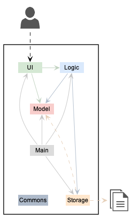
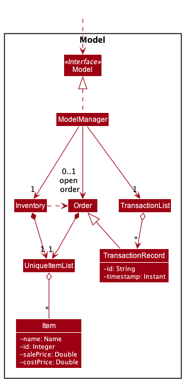
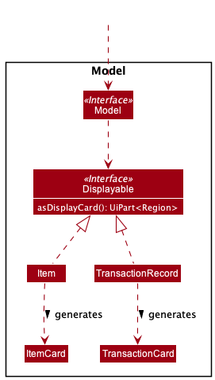
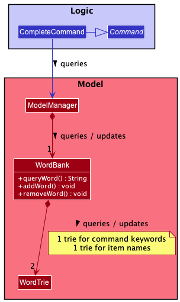

<details open markdown="block">
  <summary>
    Table of contents
  </summary>
  {: .text-delta }
1. TOC
{:toc}
</details>

--------------------------------------------------------------------------------------------------------------------

## **Acknowledgements**

* BogoBogo is forked from [Addressbook Level 3](https://se-education.org/addressbook-level3/)
* Libraries used: [JavaFX](https://openjfx.io/), [Jackson](https://github.com/FasterXML/jackson), [JUnit5](https://github.com/junit-team/junit5)
* Theme used: [just-the-docs](https://github.com/pmarsceill/just-the-docs)

--------------------------------------------------------------------------------------------------------------------

## **Setting up, getting started**

Refer to the guide [_Setting up and getting started_](SettingUp.md).

--------------------------------------------------------------------------------------------------------------------

## **Design**

<div class="code-example bg-grey-lt-000">

:bulb: The `.puml` files used to create diagrams in this document can be found in
the [diagrams](https://github.com/AY2122S1-CS2103-F10-2/tp/blob/master/docs/diagrams) folder. Refer to the [_PlantUML
Tutorial_ at se-edu/guides](https://se-education.org/guides/tutorials/plantUml.html) to learn how to create and edit
diagrams.
</div>

### Architecture



The ***Architecture Diagram*** given above explains the high-level design of the App.

Given below is a quick overview of main components and how they interact with each other.

**Main components of the architecture**

**`Main`** has two classes
called [`Main`](https://github.com/AY2122S1-CS2103-F10-2/tp/blob/master/src/main/java/seedu/address/Main.java)
and [`MainApp`](https://github.com/AY2122S1-CS2103-F10-2/tp/blob/master/src/main/java/seedu/address/MainApp.java). It is
responsible for,

* At app launch: Initializes the components in the correct sequence, and connects them up with each other.
* At shut down: Shuts down the components and invokes cleanup methods where necessary.

[**`Commons`**](#common-classes) represents a collection of classes used by multiple other components.

The rest of the App consists of four components.

* [**`UI`**](#ui-component): The UI of the App.
* [**`Logic`**](#logic-component): The command executor.
* [**`Model`**](#model-component): Holds the data of the App in memory.
* [**`Storage`**](#storage-component): Reads data from, and writes data to, the hard disk.

**How the architecture components interact with each other**

The *Sequence Diagram* below shows how the components interact with each other for the scenario where the user issues
the command `delete Milk c/5`.


Each of the four main components (also shown in the diagram above),

* defines its *API* in an `interface` with the same name as the Component.
* implements its functionality using a concrete `{Component Name}Manager` class (which follows the corresponding
  API `interface` mentioned in the previous point.

For example, the `Logic` component defines its API in the `Logic.java` interface and implements its functionality using
the `LogicManager.java` class which follows the `Logic` interface. Other components interact with a given component
through its interface rather than the concrete class (reason: to prevent outside component's being coupled to the
implementation of a component), as illustrated in the (partial) class diagram below.


The sections below give more details of each component.

### UI component

The **API** of this component is specified
in [`Ui.java`](https://github.com/AY2122S1-CS2103-F10-2/tp/blob/master/src/main/java/seedu/address/ui/Ui.java)


The UI consists of a `MainWindow` that is made up of parts e.g.`CommandBox`, `ResultDisplay`, `PersonListPanel`
, `StatusBarFooter` etc. All these, including the `MainWindow`, inherit from the abstract `UiPart` class which captures
the commonalities between classes that represent parts of the visible GUI.

The `UI` component uses the JavaFx UI framework. The layout of these UI parts are defined in matching `.fxml` files that
are in the `src/main/resources/view` folder. For example, the layout of
the [`MainWindow`](https://github.com/AY2122S1-CS2103-F10-2/tp/blob/master/src/main/java/seedu/address/ui/MainWindow.java)
is specified
in [`MainWindow.fxml`](https://github.com/AY2122S1-CS2103-F10-2/tp/blob/master/src/main/resources/view/MainWindow.fxml)

The `UI` component,

* executes user commands using the `Logic` component.
* listens for changes to `Model` data so that the UI can be updated with the modified data.
* keeps a reference to the `Logic` component, because the `UI` relies on the `Logic` to execute commands.
* depends on some classes in the `Model` component, as it displays `Displayable` objects residing in the `Model`.

### Logic component
The **API** of this component is specified
in [`Logic.java`](https://github.com/AY2122S1-CS2103-F10-2/tp/blob/master/src/main/java/seedu/address/logic/Logic.java)

Here's a (partial) class diagram of the `Logic` component:


How the `Logic` component works:

1. When `Logic` is called upon to execute a command, it uses the `AddressBookParser` class to parse the user command.
2. This results in a `Command` object (more precisely, an object of one of its subclasses e.g. `AddCommand`) which is
   executed by the `LogicManager`.
3. The command can communicate with the `Model` when it is executed (e.g. to add an item).
4. The result of the command execution is encapsulated as a `CommandResult` object which is returned by `Logic` back to the caller.

The Sequence Diagram below illustrates the interactions within the `Logic` component for the `execute("delete 1")` API
call.


<div class="code-example bg-grey-lt-000">
:information_source: **Note:** The lifeline for `DeleteCommandParser` should end at the destroy marker (X) but due to a limitation of PlantUML, the lifeline reaches the end of diagram.
</div>

Here are the other classes in `Logic` (omitted from the class diagram above) that are used for parsing a user command:


How the parsing works:

* When called upon to parse a user command, the `AddressBookParser` class creates an `XYZCommandParser` (`XYZ` is a
  placeholder for the specific command name e.g. `AddCommandParser`) which uses the other classes shown above to parse
  the user command and create a `XYZCommand` object (e.g. `AddCommand`) which the `AddressBookParser` returns back as
  a `Command` object.
* All `XYZCommandParser` classes (e.g. `AddCommandParser`, `DeleteCommandParser`, ...) inherit from the `Parser`
  interface so that they can be treated similarly where possible e.g, during testing.

### Model component

The **API** of this component is specified
in [`Model.java`](https://github.com/AY2122S1-CS2103-F10-2/tp/blob/master/src/main/java/seedu/address/model/Model.java)


The `Model` component:

- stores an `Inventory` object that encapsulates the inventory data.
- stores an optional `Order` object that encapsulates the current order data.
- stores a `TransactionList` object that encapsulates the history of past transactions.
- stores a `UserPref` object that encapsulates the user’s preferences.
- does not depend on any of the other three components (as the Model represents data entities of the domain, they should
  make sense on their own without depending on other components)

- The `Model` component interacts with `Ui` component through a `Displayable` interface.



Lower level details of `Model` component:

- `Inventory` and `Order` are each consists of an `UniqueItemList` which contains `Items`.
- The `TransactionList` stores `TransactionRecord` which are the records of history orders.
- Each `TransactionRecord` has a unique id and timestamp, with a list of `Item` transacted in the history order.

### Storage component

The **API** of this component is specified
in [`Storage.java`](https://github.com/AY2122S1-CS2103-F10-2/tp/blob/master/src/main/java/seedu/address/storage/Storage.java)


The `Storage` component's responsibility is to read and write persistent data. 
It can save inventory data, user preference data, bookkeeping data, and transaction history in json format, 
and read them back into corresponding objects.

The storage of different aspects of BogoBogo's data are each managed by their own class:

* Inventory Data: `JsonInventoryStorage` 
* User Preferences: `JsonUserPrefStorage`
* BookKeeping Data: `JsonBookKeepingStorage`
* Transaction History: `JsonTransactionStorage`

Each of these classes employ a facade interface that `Storage` inherits from. 
This ensures that `Storage` will have the necessary API for `Logic` to call when it wishes to save BogoBogo's state.

### Common classes

Classes used by multiple components are in the `seedu.addressbook.commons` package.

--------------------------------------------------------------------------------------------------------------------

## **Implementation**

This section describes some noteworthy details on how certain features are implemented.

### Ordering

When ModelManager is initialised, optionalOrder is set to Optional.empty(). At this point, the user has 1 order record
with 2 items in his transaction list.


Step 1. The user enters ordering mode via the `sorder` command.

Upon entering the ordering mode, optionalOrder now has a new Order() which is empty.


Step 2. The user adds an item to the order via the `iorder` command.

Upon entering `iorder Banana c/1`, the order now contains 1 banana item.


Next, upon entering `iorder Strawberry c/1`, the order now contains 1 strawberry item.


Step 3. The user transacts and ends the order via the `eorder` command.

After the transaction is done, optionalOrder is reinitialised to Optional.empty().


Step 4. The new transactions are saved to the json file.


### Mutating Inventory

This section explains how various commands update the list of items in the inventory and display the result.

As described in the UML diagram of the Model component above, `Inventory` contains a `UniqueItemList` object which in turn
has `Item` objects. Every time add, remove, edit, delete, or clear is called, the `UniqueItemList` inside Inventory is
mutated, after which the UI will be changed upon the call of a method that mutates the `DisplayList` field inside
`ModelManager` such as `UpdateFilteredItemList()`. More specifically, the `ObservableList<Displayable>` inside the
`DisplayList` class is mutated.

The following sequence diagram shows what happens upon an addition of item to inventory until the 
`ObservableList<Displayable>` inside DisplayList changes.

<<<<<<< HEAD
**`EditCommand:`**       
EditCommand#execute() -> Model#setItem() -> Inventory#setItem() -> UniqueItemList#setItem() -> ObservableList<Item>

# set()
=======

>>>>>>> master

Another design decision that we have done is that `Item` objects are strictly immutable, as seen by all the
final fields. Thus, when any field is mutated, the previous `Item` is destroyed and a new `Item` is created. The
following activity diagram shows some possible actions that a user might take. Take note also on the difference
between Remove and Delete command.

<<<<<<< HEAD
**`DeleteCommand:`**      
DeleteCommand#execute() -> Model#deleteItem() -> Inventory#deleteItems() -> UniqueItemList#removeItem() ->
ObservableList<Item>#remove()

**`SortCommand:`**      
SortCommand#execute() -> Model#sortItem() -> Inventory#sortItems() -> UniqueItemList#sortItem() -> ObservableList<Item>

# sort()

#### Design considerations:

**Aspect:**

* **Finding Multiple Names, Ids or Tags:** The FindCommand supports finding by multiple names, ids or tags.
  `IdContainsNumberPredicate`, `NameContainsKeywordsPredicate` and `TagContainsKeywordsPredicate` takes in a list of
  strings which allows storing of multiple predicates. The items in the list are then matched with each predicate to
  update the filtered list. Thus, the displayed list contains items that matches multiple predicates given.
=======

>>>>>>> master

### Controlling the Display Panel in UI

The main panel of displayed items in the UI is managed by `DisplayListPanel` in the UI component. 
This panel is dependent on changes made by command logic and should be able to be toggled to display different lists. 
(e.g. inventory items, items in current order, list of transactions, etc.).

To minimise coupling between the logic and UI component, `DisplayListPanel` adopts an **observer pattern**.


`DisplayListPanel` observes an `ObservableList<Displayable>` which is controlled by a `DisplayList` in the model component.
This way, any changes to model can be propagated to the ui without having to explicitly have knowledge about the ui component.

`DisplayList` is composed of 3 lists.
1. `DisplayList#filtered` —  A filtered list that is observed by `DisplayListPanel`.
2. `DisplayList#displayed` —  An observable list that acts as the base for `DisplayList#filtered`. 
Observes the current `DisplayList#source`.
3. `DisplayList#source` —  An observable list that acts as the base for `DisplayList#displayed`.

To propagate any changes to the filtered list, to be reflected to the ui, `DisplayList` can:

1. **Filter the displayed list**. 

Set a predicate on the filtered list. This is done when items to be displayed already exists in `DisplayList#source`.

2. **Mutate the displayed list**.

When the source is edited outside `DisplayList`, it will notify `DisplayList#displayed`, which will then copy and reflect all changes.
This, resultantly updates the `DisplayList#filtered` and the display panel.

3. **Update the source**.

Call `DisplayList#setItems` which takes in an observable list of items as a new source. 
`DisplayList` removes the listener from the previous source and adds a new listener to the new source.
It also updates `DisplayList#displayed` to reflect the new source.
This is done when we want to switch between lists to display. (e.g. displaying transactions instead of inventory)

<div class="code-example bg-grey-lt-000">:information_source:
<code>DisplayList</code> uses a 3 list approach because of the way JavaFX has implemented `FilteredList`.
`FilteredList` is bound to a `ObservableList` which is bound to a regular `List`. 
</div>

### Displaying an object

Any object can be displayed in the display panel by implementing the `Displayable` interface. 
The object must implement `Displayable#asDisplayCard()` which should return a `UIPart<Region>` that will act as the object's list cell.



### Design Considerations

**Time complexity**

Each update to source requires DisplayList to copy over an entire list (complexity: _O(n)_).
This is definitely inefficient since updates usually involve appending or removing an item from source.
(e.g. when the user adds an item to the inventory).

This inefficiency does not create observable latency given the envisioned scale of BogoBogo (1000 items).
However, if BogoBogo is to be scaled up in the future, there might be a need for a more advanced implementation.

Proposed upgrade: 
Instead of relying on JavaFX's `ObservableList`, we can create a customised observable list that can reference multiple sources.
From there, we should be able to toggle which source we want to be displaying on the `filteredlist`. This way, copying is no longer required.

### [Proposed Feature] Autocompleting commands

BogoBogo is optimised for users that prefer the speed of CLI-based applications. 
The application will be more attractive to typists if there is an autocompleting feature.
With the feature, the user doesn't need to type entire command keywords or product names.

```
System: BogoBogo
Sugggested Use Case —  Autocompleting a command
Actor: User
MSS:
  1. User types half a command.
  2. User requests for BogoBogo to autocomplete the command.
  3. BogoBogo suggests to the user a complete command.
     Step 2 - 3 is repeated until User finds the intended command.
  4. User submits the autocompleted command.
  5. BogoBogo processes the command.

Extensions:
  2a. BogoBogo cannot guess the user's command.
    2a1. BogoBogo notifies the user it cannot autocomplete the command.
    2a2. User enters the entire command.
         Use case resumes from step 5.
```

*Lower level details*{: .text-purple-000 }

Autocompletion can be facilitated by a `Wordbank` class which contains:
* A trie for command keywords
* A trie for existing item names.

A `CompleteCommand` can then query `Wordbank` to complete either a command keyword or item name. 
`Wordbank` also has to be updated when the user adds or removes a unique item name.



*Higher level details*{: .text-purple-000 }

BogoBogo will have 2 different ways to react to a command.


1. The user hits the `enter` key: the command is processed normally.
2. The user hits the `tab` key: the command is autocompleted.

For the ui to distinguish the 2, we will need to implement a `CommandSuggestion` class that extends `CommandResult`.
Should `CommandBox` detect a `CommandSuggestion` class when executing a command, it will adopt the suggestion stored in the result.

Here's an example of how BogoBogo can react to the command text "add noo" followed by the user hitting the `tab` character.


### Design considerations

BogoBogo adopts an [MVC pattern](https://nus-cs2103-ay2021s1.github.io/website/se-book-adapted/chapters/designPatterns.html#model-view-controller-mvc-pattern). 
By utilising a `CommandSuggestion` class to store the autocompleted command, the partition between view and controller is retained.

Alternatively, `CommandBox` can give `Logic` a callback to edit its text field. 
However, implementing auxiliary methods to support the callback pattern will likely require more effort.

--------------------------------------------------------------------------------------------------------------------

## **Documentation, logging, testing, configuration, dev-ops**

* [Documentation guide](Documentation.md)
* [Testing guide](Testing.md)
* [Logging guide](Logging.md)
* [Configuration guide](Configuration.md)
* [DevOps guide](DevOps.md)

--------------------------------------------------------------------------------------------------------------------

## **Appendix: Requirements**

### Product scope

**Target user profile**:

* small business owner / entrepreneur
* prefers desktop apps over other types
* can type fast
* prefers typing to mouse interactions
* is reasonably comfortable using CLI apps

**Value proposition**: manage a small business' inventory and finances faster than a typical mouse/GUI driven app

### User stories

Priorities: High (must have) - `* * *`, Medium (nice to have) - `* *`, Low (unlikely to have) - `*`

| Priority | As a …​                         | I want to …​                                               | So that I can…​                                      |
| -------- | ------------------------------- | ---------------------------------------------------------- | ---------------------------------------------------- |
| `* * *`  | small business owner            | add items into the inventory list                          | account for newly stocked items                      |
| `* * *`  | small business owner            | record item related information (name, price, cost, id)    | record and track items' details easily               |
| `* * *`  | small business owner            | delete items from the inventory                            | account for discarded or sold items                  |
| `* * *`  | small business owner            | look at all my inventory items, with their count           | review and track my inventory                        |
| `* * *`  | small business owner            | record new orders and update the inventory accordingly     | account for newly confirmed orders                   |
| `* * *`  | small business owner            | list past transactions                                     | review verify transaction details                    |
| `* * *`  | budget-savvy business owner     | track the cost that each item incurs                       | manage business costs closely                        |

*{More to be added}*

### Use cases

For all use cases below, the **System** is the `Bogo Bogo` and the **Actor** is the `user`, unless specified otherwise.

<div class="code-example bg-grey-lt-000">
</div>

*Mutating the Inventory*{: .text-purple-000 }

### Adding Item
```
MSS:
1. User requests to add a certain amount of an item into the inventory.
2. BogoBogo saves the item(s) into the  inventory.
   Use case ends.

Extensions:
1a. User is adding the item for the first time, and did not specify the id, cost price or sell price of the item.
    1a1. BogoBogo informs user of the missing details.
    1a2. User reenters the missing details.
    Use case resumes at step 2.

1b. User did not specify the count.
    1b1. BogoBogo assumes count to be 1.
    Use case resumes at step 2.

1c. The given id and name corresponds to 2 separate items in the inventory.
    1c1. BogoBogo notifies user of the ambiguity and shows the list of possible matches.
    1c2. User reenters the corrected details.

1d. The given name matches an item, but the given id is non-existent,
    or the given id matches the item but the given name is non existent.
    1d1. BogoBogo notifies user of the mismatch.
    1d2. User reenters the corrected details.
    Use case resumes at step 2.
```

### Deleting Item
```
MSS:
1. User requests to delete an item from the inventory.
2. BogoBogo deletes the item from the inventory.
   Use case ends.

Extensions:
1a. User specified neither the name nor id of the item.
    1a1. BogoBogo notifies user of missing details.
    Use case ends.

1b. The specified item is not in the inventory.
    1b1. BogoBogo notifies user that the item is not found.
    Use case ends.

1c. The given id and name corresponds to 2 separate items in the inventory.
    1c1. BogoBogo notifies user of the ambiguity and shows the list of possible matches.
    1c2. User reenters the corrected details.
    Use case resumes at step 2.
    
1d. The given name matches an item, but the given id is non-existent,
    or the given id matches the item but the given name is non existent.
    1d1. BogoBogo notifies user of the mismatch.
    1d2. User reenters the corrected details.
    Use case resumes at step 2.
```

### Removing Item
```
MSS:
1. User requests to remove a certain amount of an item from the inventory.
2. BogoBogo removes the specified amount of that item.
   Use case ends.

Extensions:
1a. User specified neither the name nor id of the item.
    1a1. BogoBogo notifies user of missing details.
    Use case ends.
    
1b. The specified item is not in the inventory.
    1b1. BogoBogo notifies user that the item is not found.
    Use case ends.

1c. The given id and name corresponds to 2 separate items in the inventory.
    1c1. BogoBogo notifies user of the ambiguity and shows the list of possible matches.
    1c2. User reenters the corrected details.
    Use case resumes at step 2.

1d. The given name matches an item, but the given id is non-existent,
    or the given id matches the item but the given name is non existent.
    1d1. BogoBogo notifies user of the mismatch.
    1d2. User reenters the corrected details.
    Use case resumes at step 2.
    
1e. User did not specify the count.
    1e1. BogoBogo assumes count to be 1.
    Use case resumes at step 2.
    
1f. The specified amount is greater than what the inventory has.
    1f1. BogoBogo notifies user of the actual amount of item in the inventory.
    Use case ends.
```

### Editing Item
```
Precondition: BogoBogo is displaying the inventory.
MSS:
1. User requests to edit an item, specifying an item by index, with the fields and values to change.
2. BogoBogo updates the fields of the item at the specified index with the new values given.
   Use case ends.

Extensions:
1a. The specified index does not point to any item.
    1a1. BogoBogo notifies the user that the index is invalid.
    Use case ends.

1b. User specified a new ID/name that already belongs to a different item. 
    1b1. BogoBogo notifies the user of clashing IDs/names.
    Use case ends.

1c.  User attempted to edit the count of an item 
    1c1.  BogoBogo notifies the user that directly editing count is not supported.
    Use case ends.
```

### Clearing the Inventory
```
MSS:
1. User requests to clear the inventory.
2. BogoBogo acknowledges the request and clears the inventory.
   Use case ends.
```

### Finding an Item
```
MSS:
1. User searches for an item in the inventory by specifying possible id(s), name(s) or tag(s).
2. BogoBogo finds all items in the inventory that matches any of the descriptors.
   Use case ends.
```

### Sorting the Inventory
```
Precondition: BogoBogo is displaying the inventory.
MSS:
1. User requests to sort the inventory (either by name or count).
2. BogoBogo sorts the inventory accordingly.
   Use case ends.

Extensions:
1a. User specifies to sort by both name and count.
    1a1. BogoBogo notifies user that user can only sort by either name or count, not both.
    Use case ends.
```

### Listing the Inventory
```
MSS:
1. User requests to list out all items in the inventory
2. BogoBogo lists out all items in inventory.
   Use case ends.
```

*Managing Orders*{: .text-purple-000 }

### Placing an Order
```
MSS:
1. User requests to start an order.
2. BogoBogo creates an order and requests for item names and quantities.
3. User adds an item into the order.
4. BogoBogo saves  the  item into the order.
   Step 3-4 is repeated until the user wishes to end the order.
5. User requests to end entering item and place the order.
6. BogoBogo transacts the order and updates inventory and transaction history.
   Use case ends.


Extensions:
1a. User is already in ordering mode
    1a1. BogoBogo informs the user that the current mode is already ordering mode.
    Use case resumes at step 3.

3a. User adds an item that is not in the inventory.
    3a1. BogoBogo notifies user that item is not found.
    Use case resumes at step 3.
    
3b. There is an insufficient supply of added items in the inventory.
    3b1. BogoBogo notifies user of the supply shortage.
    Use case resumes at step 3.
      
3c. User did not specify count.
    3c1. BogoBogo assumes count to be 1.
    Use case resumes at step 4.
    
3d. The given id and name corresponds to 2 separate items in the inventory.
    3d1. BogoBogo notifies user of the ambiguity and shows the list of possible matches.
    3d2. User reenters the corrected details.
    Use case resumes at step 4.
    
3e. The given name matches an item, but the given id is non-existent,
    or the given id matches the item but the given name is non existent.
    3e1. BogoBogo notifies user of the mismatch.
    3e2. User reenters the corrected details.
    Use case resumes at step 4.
    
4a. User incorrectly added an item into the order.
    4a1. User removes specified item from the order (UC10).
    Use case resumes at step 3.

5a. The order is empty.
    5a1. BogoBogo notifies user that the order is empty and closes the order.
    Use case ends.
```

### Removing Item from Order
```
Precondition: The user has started an order.
MSS:
1. User requests to remove the specified item from the order.
2. BogoBogo removes the item from the order.
   Use case ends.

Extensions:
1a. The specified item is not in the order
    1a1 BogoBogo notifies user the specified item is not in the order.
    Use case ends.
          
1b. User did not specify count.
    1b1. BogoBogo assumes count to be 1.
    Use case resumes at step 2.
    
1c. The given id and name corresponds to 2 separate items in the inventory.
    1c1. BogoBogo notifies user of the ambiguity.
    1c2. User reenters the corrected details.
    Use case resumes at step 2.
    
1d. The given name matches an item, but the given id is non-existent,
    or the given id matches the item but the given name is non existent.
    1d1. BogoBogo notifies user of the mismatch.
    1d2. User reenters the corrected details.
    Use case resumes at step 2.
```

### Listing the Current Order
```
MSS:
1. User requests to list out current order.
2. BogoBogo lists out all items in current order.
   Use case ends.

Extensions:
1a. There is currently no open order.
    1a1. BogoBogo notifies user there is currently no open order.
    Use case ends.
```

### Viewing Past Transactions
```
MSS:
1. User requests to view list of past transactions.
2. BogoBogo lists past transactions, each with an id.
3. User requests to view a specific transaction's contents.
4. BogoBogo opens up the specified transaction and displays its items.
   Use case ends.

Extensions:
3a. The transaction specified does not exist.
    3a1. BogoBogo notifies the user the transaction does not exist.
    Use case ends.
```

*Others*{: .text-purple-000 .text-gamma }

### Seeking Help
```
MSS:
1. User requests for guidance in using BogoBogo.
2. BogoBogo shares a link to the user guide.
   Use case ends.
   
Extensions:
1a. User requests guidance for a specific command.
    1a1. BogoBogo shares with the user a brief how-to guide.
    Use case ends.

1b. User requests guidance for an inexistent command.
    1b1. BogoBogo notifies the user that the command does not exist.
    Use case resumes at step 2.
```

### Exiting the Application
```
MSS:
1. User requests to exit the application

2. BogoBogo exits.
   Use case ends.
```

### Non-Functional Requirements

1. Should work on any _mainstream OS_ as long as it has Java `11` or above installed.
2. Should be able to hold up to 1000 distinct inventory items without a noticeable sluggishness in performance for
   typical usage.
3. A user with above average typing speed for regular English text (i.e. not code, not system admin commands) should be
   able to accomplish most of the tasks faster using commands than using the mouse.

*{More to be added}*

### Glossary

* **Mainstream OS**: Windows, Linux, Unix, OS-X
* **Item**: An inventory good that the business owner is/was selling
* **Order**: Information regarding a transaction whereby the business sells a list of items to a customerfor revenue

--------------------------------------------------------------------------------------------------------------------

## **Appendix: Instructions for manual testing**

Given below are instructions to test the app manually.

<div markdown="span" class="alert alert-info">:information_source: **Note:** These instructions only provide a starting point for testers to work on;
testers are expected to do more *exploratory* testing.

</div>

### Launch and shutdown

1. Initial launch

   a. Download the jar file and copy into an empty folder

   b. Double-click the jar file Expected: Shows the GUI with a set of sample contacts. The window size may not be
   optimum.

2. Saving window preferences

   a. Resize the window to an optimum size. Move the window to a different location. Close the window.

   b. Re-launch the app by double-clicking the jar file.<br>
   Expected: The most recent window size and location is retained.


<div class="code-example bg-grey-lt-000">
</div>

*Mutating the Inventory*{: .text-purple-000 }

## Adding Item
    1. Test case: `add milk id/232433 c/4 cp/3.0 sp/3.0`
       <br>Expected: Milk item is successfully added into the inventory.
    2. Test case: `add milk id/232433 c/4 sp/3.0`
       <br>Expected: Bogobogo displays error saying that name, id, costprice and salesprice must all be provided.
    3. Test case: `add milk`
       <br>Expected: Milk item is replenished by count 1 in the inventory.
    4. Test case: `add id/247937`
       <br>Expected: Item with the specified id is replenished by count 1 in the inventory.

### Deleting Item
    1. Test case: `delete milk id/232433`
       <br>Expected: Milk item is successfully deleted from the inventory.
    2. Test case: `delete milk`
       <br>Expected: Milk item is successfully deleted from the inventory.
    3. Test case: `delete id/232433`
       <br>Expected: Milk item is successfully deleted from the inventory.
    4. Test case: `delete milk cp/3.0`
       <br>Expected: Milk is not deleted. Bogobogo outputs error that DeleteCommand does not require costprice, 
       salesprice and tag fields.

### Removing Item
    1. Test case: `remove milk id/232433`
       <br>Expected: Milk item is successfully removed from the inventory.
    2. Test case: `remove milk`
       <br>Expected: Milk item is successfully removed from the inventory.
    3. Test case: `remove id/232433`
       <br>Expected: Milk item is successfully removed from the inventory.
    4. Test case: `remove id/232433 c/5`
       <br>Expected: x5 Milk item is successfully removed from the inventory.
    5. Test case: `remove milk cp/3.0`
       <br>Expected: Milk is removed. Bogobogo outputs message that extra price fields are ignored.

### Editing Item
    1. Test case: `edit 0 n/milk`
       <br>Expected: Bogobogo outputs error as index is 1 based.
    2. Test case: `edit 1 n/milk`
       <br>Expected: Name of the first item in the inventory is edited to milk.
    3. Test case: `edit 1 id/329749`
       <br>Expected: Id of the first item in the inventory is edited to 329749.
    4. Test case: `edit 1 cp/3.0 sp/3.0`
       <br>Expected: Costprice and Salesprice of the first item in the inventory is edited to $3.0.
    5. Test case: `edit 1 c/5`
       <br>Expected: First item is not edited. Bogobogo outputs error that count cannot be edited directly.

### Clearing the Inventory
    1. Test case: `clear`
       <br>Expected: Bogobogo clears the entire inventory.
    2. Test case: `clear milkandcookie`
       <br>Expected: Extra words are ignored. Bogobogo clears the entire inventory.

### Finding Item
    1. Test case: `find n/milk`
       <br>Expected: Bogobogo outputs the list of items that matches the field specified.
    2. Test case: `find n/milk n/cookie`
       <br>Expected: Bogobogo outputs the list of items that matches the field specified.
    3. Test case: `find id/329749`
       <br>Expected: Bogobogo outputs the list of items that matches the field specified.
    4. Test case: `find t/popular`
       <br>Expected: Bogobogo outputs the list of items that matches the field specified.
    5. Test case: `find cp/3.0`
       <br>Expected: Bogobogo outputs error that there is unexpected prefix identified.
    6. Test case: `find cookie`
       <br>Expected: Bogobogo outputs error that the command format is invalid.

### Sorting the Inventory
    1. Test case: `sort`
       <br>Expected: Bogobogo outputs error that the command format is invalid.
    2. Test case: `sort n/`
       <br>Expected: Bogobogo outputs the list of items sorted by name in alphabetical order.
    3. Test case: `sort n/milk`
       <br>Expected: Bogobogo outputs error that the command format is invalid.
    4. Test case: `sort hello`
       <br>Expected: Bogobogo outputs error that the command format is invalid.

### Listing an Inventory
    1. Test case: `list`
       <br>Expected: Bogobogo outputs the list of items in the inventory.
    2. Test case: `list oo`
       <br>Expected: Bogobogo outputs error that the command format is invalid.
    3. Test case: `list n/milk`
       <br>Expected: Bogobogo outputs error that the command format is invalid.

*Managing Order*{: .text-purple-000 }

### Starting Order
    1. Test case: `sorder`
       <br>Expected: Bogobogo starts a new order and enters ordering mode.
    2. Test case: `sorder milkandcookie`
       <br>Expected: Extra words are ignored. Bogobogo starts a new order and enters ordering mode.

### Adding Item into Order
    1. Test case: `iorder milk`
       <br>Expected: Bogobogo inputs milk into the order.
    2. Test case: `iroder id/276434`
       <br>Expected: Bogobogo inputs item with id 276434 into the order.
    3. Test case: `iorder milk cp/3.0`
       <br>Expected: Bogobogo inputs milk into the order. Bogobogo outputs message that extra price flags are ignored.
    4. Test case: `iorder milk t/baked`
       <br>Expected: Bogobogo inputs milk into the order. Bogobogo outputs message that extra tag flags are ignored.
    5. Test case: `iorder g/`
       <br>Expected: Bogobogo outputs error that there is unexpected prefix identified.

### Removing Item from Order
    1. Test case: `corder milk`
       <br>Expected: Bogobogo inputs milk into the order.
    2. Test case: `croder id/276434`
       <br>Expected: Bogobogo inputs item with id 276434 into the order.
    3. Test case: `corder g/`
       <br>Expected: Bogobogo outputs error that there is unexpected prefix identified.

### Ending Order
    1. Test case: `eorder`
       <br>Expected: Bogobogo processes the current order and saves it.
    2. Test case: `eorder oo`
       <br>Expected: Bogobogo ignores the extra paramaters and process the current order to save it.

### Listing the Current Order
    1. Test case: `list order`
       <br>Expected: Bogobogo outputs the list of items in the current order.
    2. Test case: `list oo`
       <br>Expected: Bogobogo outputs error that the command format is invalid.

### Viewing Past Transactions
    1. Test case: `list txns`
       <br>Expected: Bogobogo outputs the list of past transactions together with total cost, profit and revenue.
    2. Test case: `list txns bchfirwvb`
       <br>Expected: Bogobogo outputs the list of past transaction with id bchfirwvb together with total cost, profit 
    and revenue.

*Others*{: .text-purple-000 }

### Seeking Help
    1. Test case: `help`
       <br>Expected: Bogobogo userguide is displayed in the feedback box. 
    2. Test case: `help add`
       <br>Expected: Message usage of AddCommand is displayed in the feedback box.

### Exiting the Application
    1. Test case: `exit`
       <br>Expected: Bogobogo exits the application.
    2. Test case: `exit oo`
       <br>Expected: Bogogbogo ignores the extra parameters and exits the application.


