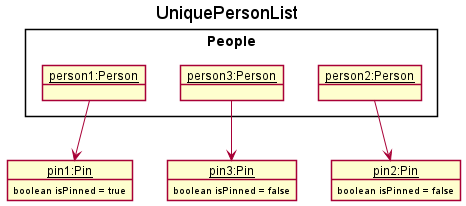
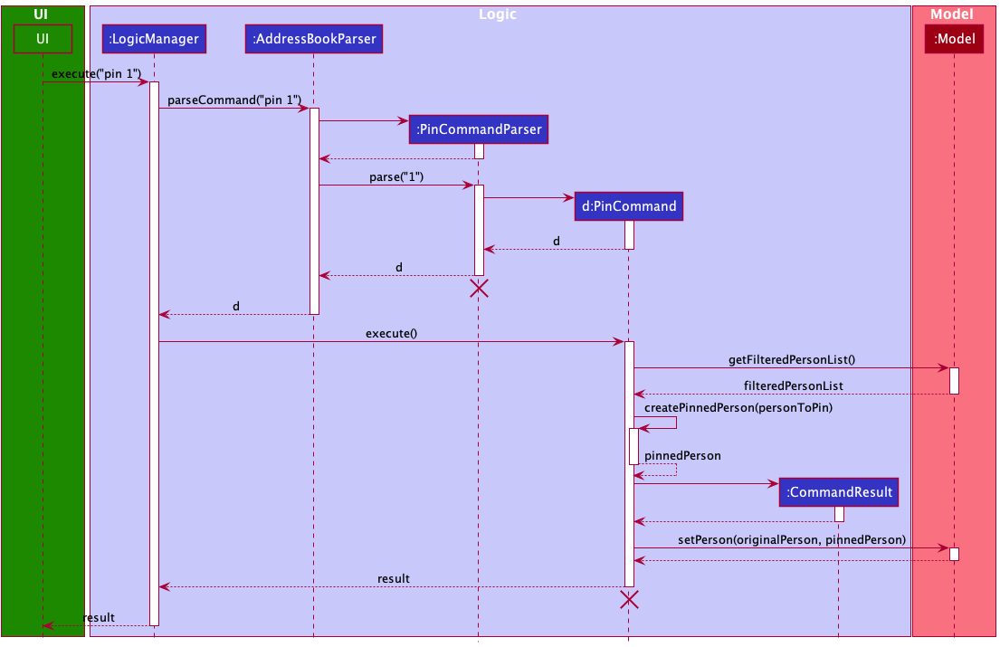
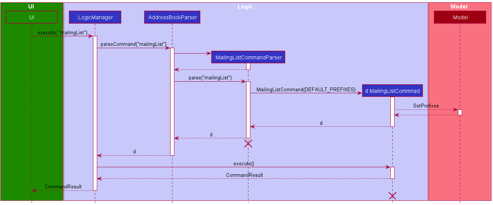

* [Acknowledgements](#acknowledgements)
* [Setting up, getting started](#setting-up-getting-started)
* [Design](#design)
    * [Architecture](#architecture)
    * [UI component](#ui-component)
    * [Logic component](#logic-component)
    * [Model component](#model-component)
    * [Storage component](#storage-component)
    * [Command classes](#common-classes)

* [Implementation](#implementation)
    * [Tags](#tags)
    * [Pin feature](#pin-feature)
    * [Find feature](#find-feature)
    * [FindAny feature](#findany-feature)
    * [Help feature](#help-feature)
    * [Birthday Reminder feature](#birthday-reminder-feature)
    * [Mailing List feature](#mailing-list-feature)

* [Documentation, logging, testing, configuration, dev-ops](#documentation-logging-testing-configuration-dev-ops)
* [Appendix: Requirements](#appendix-requirements)
* [Appendix: Instructions for manual testing](#appendix-instructions-for-manual-testing)

--------------------------------------------------------------------------------------------------------------------

## **Acknowledgements**

  * [Opencsv](http://opencsv.sourceforge.net/)
--------------------------------------------------------------------------------------------------------------------

## **Setting up, getting started**

Refer to the guide [_Setting up and getting started_](SettingUp.md).

--------------------------------------------------------------------------------------------------------------------

## **Design**

:bulb: **Tip:** The `.puml` files used to create diagrams in this document can be found in the [diagrams](https://github.com/AY2122S1-CS2103-F09-4/tp/blob/master/docs/diagrams/) folder. Refer to the [_PlantUML Tutorial_ at se-edu/guides](https://se-education.org/guides/tutorials/plantUml.html) to learn how to create and edit diagrams.

### Architecture

The ***Architecture Diagram*** given above explains the high-level design of the App.

Given below is a quick overview of main components and how they interact with each other.

**Main components of the architecture**

**`Main`** has two classes called [`Main`](https://github.com/AY2122S1-CS2103-F09-4/tp/blob/master/src/main/java/seedu/address/Main.java) and [`MainApp`](https://github.com/AY2122S1-CS2103-F09-4/tp/blob/master/src/main/java/seedu/address/MainApp.java). It is responsible for,
* At app launch: Initializes the components in the correct sequence, and connects them up with each other.
* At shut down: Shuts down the components and invokes cleanup methods where necessary.

[**`Commons`**](#common-classes) represents a collection of classes used by multiple other components.

The rest of the App consists of four components.

* [**`UI`**](#ui-component): The UI of the App.
* [**`Logic`**](#logic-component): The command executor.
* [**`Model`**](#model-component): Holds the data of the App in memory.
* [**`Storage`**](#storage-component): Reads data from, and writes data to, the hard disk.

**How the architecture components interact with each other**

The *Sequence Diagram* below shows how the components interact with each other for the scenario where the user issues the command `delete 1`.

Each of the four main components (also shown in the diagram above),

* defines its *API* in an `interface` with the same name as the Component.
* implements its functionality using a concrete `{Component Name}Manager` class (which follows the corresponding API `interface` mentioned in the previous point.

For example, the `Logic` component defines its API in the `Logic.java` interface and implements its functionality using the `LogicManager.java` class which follows the `Logic` interface. Other components interact with a given component through its interface rather than the concrete class (reason: to prevent outside component's being coupled to the implementation of a component), as illustrated in the (partial) class diagram below.

The sections below give more details of each component.

### UI component

The **API** of this component is specified in [`Ui.java`](https://github.com/AY2122S1-CS2103-F09-4/tp/blob/master/src/main/java/seedu/address/ui/Ui.java)

The UI consists of a `MainWindow` that is made up of parts e.g.`CommandBox`, `ResultDisplay`, `PersonListPanel`, `StatusBarFooter`, `BirthdayReminderListPanel` etc. All these, including the `MainWindow`, inherit from the abstract `UiPart` class which captures the commonalities between classes that represent parts of the visible GUI.

The `UI` component uses the JavaFx UI framework. The layout of these UI parts are defined in matching `.fxml` files that are in the `src/main/resources/view` folder. For example, the layout of the [`MainWindow`](https://github.com/AY2122S1-CS2103-F09-4/tp/blob/master/src/main/java/seedu/address/ui/MainWindow.java) is specified in [`MainWindow.fxml`](https://github.com/AY2122S1-CS2103-F09-4/tp/blob/master/src/main/resources/view/MainWindow.fxml).

The `UI` component,

* executes user commands using the `Logic` component.
* listens for changes to `Model` data so that the UI can be updated with the modified data.
* keeps a reference to the `Logic` component, because the `UI` relies on the `Logic` to execute commands.
* depends on some classes in the `Model` component, as it displays `Person` object residing in the `Model`.

### Logic component

**API** : [`Logic.java`](https://github.com/AY2122S1-CS2103-F09-4/tp/blob/master/src/main/java/seedu/address/logic/Logic.java)

Here's a (partial) class diagram of the `Logic` component:

How the `Logic` component works:
1. When `Logic` is called upon to execute a command, it uses the `AddressBookParser` class to parse the user command.
1. This results in a `Command` object (more precisely, an object of one of its subclasses e.g., `AddCommand`) which is executed by the `LogicManager`.
1. The command can communicate with the `Model` when it is executed (e.g. to add a contact).
1. The result of the command execution is encapsulated as a `CommandResult` object which is returned back from `Logic`.

The Sequence Diagram below illustrates the interactions within the `Logic` component for the `execute("delete 1")` API call.

:information_source: **Note:** The lifeline for `DeleteCommandParser` and `DeleteCommand` should end at the destroy marker (X) but due to a limitation of PlantUML, the lifeline reaches the end of diagram.

Here are the other classes in `Logic` (omitted from the class diagram above) that are used for parsing a user command:

How the parsing works:
* When called upon to parse a user command, the `AddressBookParser` class creates an `XYZCommandParser` (`XYZ` is a placeholder for the specific command name e.g., `AddCommandParser`) which uses the other classes shown above to parse the user command and create a `XYZCommand` object (e.g., `AddCommand`) which the `AddressBookParser` returns back as a `Command` object.
* All `XYZCommandParser` classes (e.g., `AddCommandParser`, `DeleteCommandParser`, ...) inherit from the `Parser` interface so that they can be treated similarly where possible e.g, during testing.

### Model component
**API** : [`Model.java`](https://github.com/AY2122S1-CS2103-F09-4/tp/blob/master/src/main/java/seedu/address/model/Model.java)

The `Model` component,

* stores the address book data i.e., all `Person` objects (which are contained in a `UniquePersonList` object).
* stores and sorts the currently 'selected' `Person` objects (e.g., results of a search query) as a separate _filtered_ list which is exposed to outsiders as an unmodifiable `ObservableList<Person>` that can be 'observed' e.g. the UI can be bound to this list so that the UI automatically updates when the data in the list change. The `Person` objects are sorted according to how they should be displayed.
* stores and sorts the `Person` objects as a separate _sorted_ list according to their birthday which is exposed to outsiders as an unmodifiable `ObservableList<Person>` that can be 'observed' e.g. the UI can be bound to this list so that the UI automatically updates when the data in the list change.
* stores a `UserPref` object that represents the user’s preferences. This is exposed to the outside as a `ReadOnlyUserPref` objects.
* does not depend on any of the other three components (as the `Model` represents data entities of the domain, they should make sense on their own without depending on other components).

:information_source: **Note:** An alternative (arguably, a more OOP) model is given below. It has a `Tag` list in the `AddressBook`, which `Person` references. This allows `AddressBook` to only require one `Tag` object per unique tag, instead of each `Person` needing their own `Tag` objects. 

### Storage component

**API** : [`Storage.java`](https://github.com/AY2122S1-CS2103-F09-4/tp/blob/master/src/main/java/seedu/address/storage/Storage.java)

The `Storage` component,
* can save both address book data and user preference data in json format, and read them back into corresponding objects.
* inherits from both `AddressBookStorage` and `UserPrefStorage`, which means it can be treated as either one (if only the functionality of only one is needed).
* depends on some classes in the `Model` component (because the `Storage` component's job is to save/retrieve objects that belong to the `Model`).

### Common classes

Classes used by multiple components are in the `seedu.addressbook.commons` package.

--------------------------------------------------------------------------------------------------------------------

## **Implementation**

This section describes some noteworthy details on how certain features are implemented.

### Tags

#### Implementation

Tags for contacts are implemented as a `Tag` class, and are stored internally in a `Set<Tag>` within the `Person` object. Tags are parsed and created through the `add`, `edit` and `tag` commands, and removed through the `edit` and `untag` commands. Multiple **distinct** tags can also be added for each contact.

#### Usage

Given below is an example usage scenario and how the Tag mechanism behaves at each step.

Step 1. The user launches the application for the first time.

Step 2. The user executes `add ... t/friend` command to add a contact tagged with `friend` into CONNECTIONS.

Step 3. CONNECTIONS displays the newly added contact with the added tag.

Step 4. The user decides to add additional tags to the contact at index 1, and executes `tag 1 t/classmate`.

Step 5. CONNECTIONS will update the specified contact to include the new tag `classmate`.

Step 6. The user decides to remove the tag `student` from a contact at index 3, and executes `untag 3 t/student`.

Step 7. CONNECTIONS updates and removes the tag `student` from the contact.

#### Design considerations:

* **Option 1 (Current choice): Tags are saved within a `Set<Tag>` within `Person`**
  * Pros: Easy to implement and doesn't allow for duplicates. 
  * Cons: Searching for contacts by tags may be slow, especially if there are many contacts, with each contact having multiple tags.
  
* **Option 2: Utilise a separate `HashMap` data structure to map contacts to tags.**
  * Pros: Fast retrieval of tagged contacts.
  * Cons: Difficult to maintain a separate data structure.

### Pin feature

#### Implementation

The pin mechanism is facilitated by `UniquePersonList`. It stores all the list of contacts in CONNECTIONS and maintains the order of these contacts according to if they are pinned or not. Pinned contacts have a higher priority and hence are displayed first. It currently implements the following operations:
* `UniquePersonList#add` - adds a contact into the list of stored contacts and stores the contacts according to their priority. 
* `UniquePersonList#setPerson` - updates an edited contact in the list of stored contacts and stores the contacts according to their priority. 

The operation are exposed in the `Command` interface as `Command#Execute`, specifically in `PinCommand#Execute`.

Given below is an example usage scenario and how the pin mechanism behaves at each step.

Step 1. The user launches the application. Current `UniquePersonList` will contain previously added contacts `person1` and `person2`.

Step 2. The user executes `add n/person3 …​` to add a new contact. This contact is initially unpinned and will be added to the `UniquePersonList`. It will be added to the end of the `UniquePersonList`.

Step 3. CONNECTIONS UI displays the new contact at the end of `PersonListPanel` using a `PersonCard`.

Step 4. The user decides that `person3` will be frequently contacted and should be pinned. User executes `pin 3`.

Step 5. Contact's `Pin` attribute will change to indicate that the contact is pinned. Contact will be brought forward in `UniquePersonList`, behind `person1` that was already pinned.

Step 6. CONNECTIONS UI will update to show the new contact at the top of the list using a `PinnedPersonCard` which shows a pin next the contact's name. 

Step 7. The user decides that `person3` will no longer be frequently contacted and should be unpinned. User executes `unpin 2` which unpins `person3` which is second in the list.

Step 6. Contact's `Pin` attribute will change to indicate that the contact is not pinned. Contact will be moved behind other pinned contacts in `UniquePersonList`.

Step 7. CONNECTIONS UI will update to show the contact behind other pinned contacts using a `PersonCard`. 

The following sequence diagram shows how the pin operation works:

:information_source: **Note:** The lifeline for `PinCommandParser` and `PinCommand` should end at the destroy marker (X) but due to a limitation of PlantUML, the lifeline reaches the end of diagram.

#### Design considerations:

**Aspect: How pin executes:**

* **Option 1:** Contact has a boolean field isPinned to indicate if the contact is pinned or not.
    * Pros: Easy to implement, less memory usage.
    * Cons: Less flexibility in expanding the usage of pin.

* **Option 2 (current choice):** Contact has Pin object to indicate if the contact is pinned or not.
    * Pros: More flexible to expand, other methods can be added to Pin if needed.
    * Cons: Will use more memory.

**Aspect: How each pinned contact is displayed:**

* **Option 1 (current choice):** Have two seperate cards, `PersonCard` and `PinnedPersonCard`, for a pinned contact and unpinned contact respectively.
    * Pros: Easier to implement.
    * Cons: More code duplication.

* **Option 2:** Have one card that will add a pin if the contact is pinned.
    * Pros: Harder to implement.
    * Cons: Less code duplication.

### Find feature

#### Implementation

The operation are exposed in the `Command` interface as `Command#Execute`, specifically in `FindCommand#Execute`.

The filtered list will be updated using `ModelManager#updateFilteredPersonList`. A `FindPredicate` is generated according to the user's command and passed as a argument into `ModelManager#updateFilteredPersonList`.
It will be displayed in `PersonListPanel`.

Given below is an example usage scenario and how the Find mechanism behaves at each step.

Step 1. The user launches the application for the first time. All contacts are displayed at default.

Step 2. The user executes `find n/David t/friend t/football` to search for a matching entry.

Step 3. A `FindPredicate`  which will only return `true` if contact's name contains `David` **while also having** `friend` **and**
`football` tagged to them is made.

Step 4. This`FindPredicate` is passed into `ModelManager#updateFilteredPersonList`, updating the filtered list.

Step 5. CONNECTIONS' `UI` observes the filtered list is updated and displayed the updated filtered list in `PersonListPanel`.

#### Design considerations:

**Aspect: How Find executes:**

* **Option 1:** Utilise `NameContainsKeywordsPredicate` and `PersonsTagsContainsCaseInsensitiveTags`
    * Pros: Straightforward.
    * Cons: Introduces additional and unnecessary complexities to ModelManager.

* **Option 2 (current choice):** Create a `FindPredicate` to store Name(s) and Tag(s)
    * Pros: Cleaner implementation. Only need to modify a method to modify the functionality of `FindCommand`.
    * Cons: More code.

### FindAny feature

#### Implementation

The operation are exposed in the `Command` interface as `Command#Execute`, specifically in `FindAnyCommand#Execute`.

The filtered list will be updated using `ModelManager#updateFilteredPersonList`. A `FindAnyPredicate` is generated according to the user's command and passed as a argument into `ModelManager#updateFilteredPersonList`.
It will be displayed in `PersonListPanel`.

Given below is an example usage scenario and how the FindAny mechanism behaves at each step.

Step 1. The user launches the application for the first time. All contacts are displayed at default. 

Step 2. The user executes `findAny n/David n/Henry t/friend t/football` to search for a matching entry.

Step 3. A `FindAnyPredicate`  which will only return `true` if contact's name contains **either** `David` **or** `Henry` **OR** are
tagged to **either** `friend` **or** `football` is made.

Step 4. This`FindAnyPredicate` is passed into `ModelManager#updateFilteredPersonList`, updating the filtered list.

Step 5. CONNECTIONS' `UI` observes the filtered list is updated and displayed the updated filtered list in `PersonListPanel`.

#### Design considerations:

**Aspect: How FindAny executes:**

* **Option 1:** Utilise `NameContainsKeywordsPredicate` and `PersonsTagsContainsCaseInsensitiveTags`.
    * Pros: Straightforward.
    * Cons: Introduces additional and unnecessary complexities to ModelManager.

* **Option 2 (current choice):** Create a `FindAnyPredicate` to store Name(s) and Tag(s).
    * Pros: Cleaner implementation. Only need to modify a method to modify the functionality of `FindAnyCommand`.
    * Cons: More code.

### Help feature

#### Implementation

The operation are exposed in the `Command` interface as `Command#Execute`, specifically in `HelpCommand#Execute`.

Help messages will be displayed in the CONNECTIONS' `UI` through the `ResultDisplay`.

Given below is an example usage scenario and how the Help mechanism behaves at each step.

Step 1. The user launches the application for the first time.

Step 2. The user executes `help` to seek help on CONNECTION's usage.

Step 3. CONNECTIONS displays a list of available commands in `ResultDisplay`.

Step 4. The user decides to view the usage of `add` to learn to add a contact, and executes `help add`.

Step 5. CONNECTIONS will display a detailed help message on the usage of `add` command in `ResultDisplay`.

### Birthday Reminder feature

#### Implementation

Shows a list of contacts with upcoming birthdays. This list of birthday reminders is displayed to the user though the `UI`, specifically in `BirthdayReminderListPanel`. Each birthday is displayed as a `BirthdayReminderCard`.
The list of birthdays is generated in the `ModelManager`, which implements the following functions:
* `ModelManager#getBirthdayReminderList` returns an `ObservableList<Person> birthdayReminders` that is ordered according to upcoming birthdays.

Given below is an example usage scenario and how the birthday reminders mechanism behaves at each step.

Step 1. On app startup sort contacts with birthday by birth month and day only. Contacts with birthdays that fall on the present day are coloured green while birthdays that are within one week are coloured blue. Additionally, a customised message with each contact's phone number and age is displayed in the birthday reminder list.

Step 2. The `BirthdayReminderListPanel` in CONNECTIONS' `UI` displays birthday reminders in sorted order, starting with the earliest upcoming birthday to the latest upcoming birthday for the year, afterwhich displays birthdays that have pass for the current year in sorted order.

Step 3. The user executes `add n/person3 b/01012000 …​` to add a new contact. 

Step 4. CONNECTIONS will store the new contact. The `ObservableList<Person> birthdayReminders` for `BirthdayReminderPanelList` will include the new contact and place it in the right slot, ensuring the birthday reminder list remains sorted. 

Step 5. CONNECTIONS `UI` will observe for changes in the `ObservableList<Person> birthdayReminders` and update `BirthdayReminderPanelList`, displaying the new contact. 

#### Design considerations:

**Aspect: How will the `ObservableList<Person> birthdayReminders` update with a new contact:**

* **Option 1 (current choice):** Clear the birthday reminders and regenerate it.
    * Pros: Straightforward.
    * Cons: Will be slower as whole list is regenerated.

* **Option 2:** Insert the contact into the list. 
    * Pros: Faster than alternative.
    * Cons: Harder to implement and maintain.
    
### Mailing List feature
Allows user to download a CSV file mailing list of the current view.  
Users can use arguments to specify which fields to include in their download.

#### Implementation
Given below is an example usage scenario and how the Mailing List mechanism behaves at each step.

Step 1. The user filters the contacts using other commands, eg. `find`.  
Step 2. The `FilteredList` in `Model` is updated.  
Step 3. The UI is updated to reflect this new state.  
Step 4. The user provides a series of prefixes to `mailingList` to pick the fields. If no arguments are provided, default selectors are used.  
Step 5. These `Prefix` arguments are stored in `Model`.  
Step 6. The user is prompted to pick the name and download location of their generated CSV file.  
Step 7. The `FilteredList`, `Prefixes` and `Path` are passed to `CsvUtil#modelToCsv`, which will serialize and write the CSV file.   

:information_source: **Note:** The lifeline for `MailingListCommandParser` and MailingListCommand` should end at the destroy marker (X) but due to a limitation of PlantUML, the lifeline reaches the end of diagram.

Step 8. The header row is created based on `Prefix` arguments stored in `Model`, based on a mapping in `CsvUtil`.  
Step 9. Individual rows are generated based on the `Prefix` arguments stored in `Model` and the `FilteredPerson` in `ModelManager`, based on a mapping in `CsvUtil`.  
Step 10. The headers and rows are written to the CSV file that is specified by the user.  

#### Design considerations:
* Arguments for the command should follow the standard used in other parts of the software.
* Balancing between simplicity of use when no arguments are provided, and flexibility for users who might want additional information.

### [Proposed] Partial data recovery feature
Allows user to recover partial data in event of corruption in data file. 

#### Proposed Implementation
If data file is corrupt, CONNECTIONS will use an empty data file upon start up. 
The proposed implementation can be facilitated by `JsonAdaptedPerson` and `JsonAddressBookStorage`. Upon getting an invalid data format for compulsory fields, `JsonAdaptedPerson` can return `null` and 
not be added to `JsonAddressBookStorage`. If optional fields are corrupt, default values can be used. This allows other contacts and the other fields of the corrupt contact to be recovered. 

Given below is an example usage scenario and how the Help mechanism behaves at each step.

Step 1. The user edits the data file and changes `Tag` field of the first contact to an invalid value.

Step 2. The user edits the data file and changes the `Email` field of the second contact to an invalid value.

Step 3. Upon start up, `JsonAddressBookStorage` attempts to load the data file. Since the value of `Tag` (optional field) for the first contact is invalid, `JsonAdaptedPerson` will not add the invalid `Tag`.

Step 4. Since the value of `Email` (compulsory field) for the second contact is invalid, `JsonAdaptedPerson` returns `null` which is not added to `JsonAddressBookStorage`.

Step 3. CONNECTIONS will not display the first contact's invalid `Tag` and will not display the second contact. The other fields and contacts will be displayed as per normal.  

#### Design considerations:
* Arguments for the command should follow the standard used in other parts of the software.
* Balancing between simplicity of use when no arguments are provided, and customisability for users who might want additional information.

--------------------------------------------------------------------------------------------------------------------

## **Documentation, logging, testing, configuration, dev-ops**

* [Documentation guide](Documentation.md)
* [Testing guide](Testing.md)
* [Logging guide](Logging.md)
* [Configuration guide](Configuration.md)
* [DevOps guide](DevOps.md)

--------------------------------------------------------------------------------------------------------------------

## **Appendix: Requirements**

### Product scope

**Target user profile**:

* has a need to manage a significant number of contacts
* sociable and has multiple different friend groups that can partially overlap
* regularly organises birthday parties for these contacts
* regularly invites other contacts to these parties
* is forgetful 
* needs to keep track of different groups who are invited to different parties
* prefer desktop apps over other types
* can type fast
* prefers typing to mouse interactions
* is reasonably comfortable using CLI apps

**Value proposition**:
* retrieve contact details of all members of a group quickly and easily
* view contact details of frequently contacted contacts easily
* keep track of upcoming birthdays
* easy to use

### User stories

| As a... | I want to... | So that I can... |
|---|---|---|
| Person who loves birthdays    | Track birthdays                       | Easily check the birthday of friends
| Person who loves birthdays and is forgetful    | Have birthday reminders            | Avoid missing any of my friends’ birthdays
| Party Organiser       | Look for contact details for all my friends      | Send out invites
| Party Organiser       | Generate csv file of my invitees                  | Take attendance or make external notes
| Party Organiser               | Tag contacts with a party           | Easily keep track of those coming for parties
| Party Organiser               | Untag contacts from a party         | Easily remove those who are not coming for parties
| Party Organiser               | Search contacts by party      | Generate invite list
| Party Organiser               | Search contacts by parties      | View who is coming for these parties
| Party Organiser               | Delete multiple contacts at once      | Quickly delete contacts that I no longer need
| Sociable person               | Pin frequent contacts           | Easily access contacts that I contact often
| Sociable person               | Save up to 100 contacts | Keep all my friends contacts
| Sociable person               | Search for contacts within a reasonable timing | Avoid waiting too long for search results
| Beginner              | See sample commands                               | See what I should be typing
| Beginner              | View helpful prompts                              | See what can be done with the app
| Beginner                 | View feedback on wrong commands       | Format commands better
| Beginner     | Get help on specific commands                                 | Learn how to use the app
| Fast typer                    | Use sentences to interact with the app | Utilise the functions of the app quicker without using a mouse
| User                          | Can modify contact details            | Update my contacts' details
| Experienced user      | Retrieve previously run commands          | Avoid typing the commands I use frequently again and again

### Use cases

**Use case: Add a contact**

**MSS**

1.  User chooses to add a contact.
2.  User provides the contact's details.
3.  CONNECTIONS create an entry for that contact's details

    Use case ends.

**Extensions**

* 2a. User provides incomplete details.
    
    * 2a1. CONNECTIONS show an error message.
      
      Use case resumes at step 2.
    
* 2b. User provides details identical to an existing entry in CONNECTIONS

    * 2b1. CONNECTIONS informs user that this is a duplicate.
    
      Use case resumes at Step 1.
    

**Use case: Clear all entries**

**MSS**

1.  User request to clear all entries.
2.  CONNECTIONS deletes all entries.

    Use case ends.

**Use case: Delete a contact**

**MSS**

1.  User requests to list contacts.
2.  CONNECTIONS shows a list of contacts.
3.  User requests to delete a specific contact in the list.
4.  CONNECTIONS deletes the contact.

    Use case ends.

**Extensions**

* 2a. The list is empty.

  Use case ends.

* 3a. The given index is invalid.

    * 3a1. CONNECTIONS shows an error message.

      Use case resumes at step 2.

**Use case: Edit a contact's details**

**MSS**

1.  User requests to list contacts.
2.  CONNECTIONS show a list of contacts.
3.  User provides his/her index of the contact that is to be edited in the list, along with the replacement information.
4.  CONNECTIONS reflect the edits that were made.

    Use case ends.

**Extensions**

* 2a. The list is empty.

  Use case ends.

* 3a. The given index is invalid.
    
    * 3a1. CONNECTIONS show an error message.
      
      Use case resumes at step 2.

**Use case: Exit the program**

**MSS**

1.  User request to exit
2.  CONNECTIONS exit

    Use case ends.

**Extensions**

**Use case: Find a contact**

**MSS**

1.  User chooses to look for an entry.
2.  Use provides the search term.
3.  CONNECTIONS returns all entries that matches all search terms provided.

    Use case ends.

**Extensions**

* 2a. CONNECTIONS is empty.

    * 2a1. CONNECTIONS display a message to indicate no entries.
    
      Use case ends.

* 2b. No existing entries match the search term provided.
    
    * 2b1. CONNECTIONS display a message to indicate no matching entries.
    
      Use case resumes at step 2.
    
* 2c. User requests for `or` search (at least one search term is matches).
    
    * 2c1. CONNECTIONS return all entries that matches any of the search terms provided.
    
      Use case ends.

**Use case: Find contacts via Tags**

**MSS**

1.  User choose to look for an entry.
2.  User provides the tag.
3.  CONNECTIONS return all entries that matches the tag.

    Use case ends.

**Extensions**

* 2a. CONNECTIONS is empty.

    * 2a1. CONNECTIONS display a message to indicate no entries.

      Use case ends.

* 2a. No existing entries match the tag provided.

    * 2a1. CONNECTIONS display a message to indicate no matching entries.

      Use case resumes at step 2.

**Use case: Pin a contact**

**MSS**

1.  User provides index of contact to pin.
2.  CONNECTIONS pins the contact to the top of the displayed list.

    Use case ends.

**Extensions**

* 1a. Index provided is invalid.

    * 1a1. CONNECTIONS display a message to indicate index is invalid.

      Use case ends.

* 1b. Contact at index is already pinned.

    * 1b1. CONNECTIONS display a message to indicate contact is already pinned.

      Use case ends.

**Use case: Unpin a contact**

**MSS**

1.  User provides index of contact to unpin.
2.  CONNECTIONS unpins the contact.

    Use case ends.

**Extensions**

* 1a. Index provided is invalid.

    * 1a1. CONNECTIONS display a message to indicate index is invalid.

      Use case ends.

* 1b. Contact at index is not pinned.

    * 1b1. CONNECTIONS display a message to indicate contact is not pinned.

      Use case ends.
    

**Use case: List everyone in the address book**

**MSS**

1.  User requests to list all entries
2.  CONNECTIONS display all entries
    
    Use case ends.

**Extensions**

* 2a. CONNECTIONS is empty.

  Use case ends.

**Use case: Tag a contact**

**MSS**

1.  User requests to list contacts.
2.  CONNECTIONS shows a list of contacts.
3.  User provides his index in the list along with the tags to be added.
4.  CONNECTIONS add those tags to that entry.

    Use case ends.

**Extensions**

* 2a. CONNECTIONS is empty

  Use case ends.

* 3a. Index provided is out of range.

    * 3a1. CONNECTIONS displays an error message.
    
      Use case resumes at step 2.
    
* 3b. Target entry already has the tag specified.

    * 3b1. CONNECTIONS displays an error message.
    
      Use case resumes at step 2.

**Use case: Untag a contact**

**MSS**

1.  User requests to list contacts.
2.  CONNECTIONS show a list of contacts.
3.  User provides his index in the list along with the tags to be removed.
4.  CONNECTIONS remove those tags from that entry.

    Use case ends.

**Extensions**

* 2a. CONNECTIONS is empty.

  Use case ends.

* 3a. Index provided is out of range.

    * 3a1. CONNECTIONS display an error message.

      Use case resumes at step 2.

* 3b. Target entry do not have the tag specified.

    * 3b1. CONNECTIONS display an error message.

      Use case resumes at step 2.

**Use case: Getting help**

**MSS**

1.  User requests to show help for a command.
2.  CONNECTIONS show the guide on how to use the command.

    Use case ends.

**Extensions**

* 1a. Keyword `more` was provided.
    * 1a1. CONNECTIONS shows a pop-up with a link to the UserGuide.

      Use case ends.

* 1b. Command was not provided.
  * 1b1. CONNECTIONS shows all available commands.

      Use case ends.

* 1c. Command provided is invalid.
  * 1c1. CONNNECTIONS displays an error message followed by a list of valid commands.

      Use case ends.

**Use case: Generate CSV file**

**MSS**

1. User requests to generate a CSV file containing selected data fields of the contacts displayed.
2. CONNECTIONS requests for user to input export location and file name.
3. User selects export location and file name.
4. CONNECTIONS generates CSV file in export location with file name.

    Use case ends.

**Extensions**

* 1a. User inputs invalid fields.
    * 1a1. CONNECTIONS displays an error message.
    
      Use case ends.
    
* 2a. User fails to choose export location.
    * 2a1. CONNECTIONS does not export the CSV file.
      
      Use case ends.

**Use case: Deleting multiple contacts**

**MSS**

1. User requests to delete multiple contacts.
2. CONNECTIONS deletes the contacts.

   Use case ends.

**Extensions**

* 1a. User inputs indexes that are out of range.
    * 1a1. CONNECTIONS display an error message.

      Use case ends.

* 1b. User inputs negative numbers.
    * 1b1. CONNECTIONS display an error message.

      Use case ends.
    
* 1c. User inputs start index that is bigger then end index.
    * 1c1. CONNECTIONS display an error message.

      Use case ends.

**Use case: View prompts for commands**

**MSS**

1. User starts typing command.
2. CONNECTIONS displays a prompt to help user write command.

   Use case ends.

**Extensions**

* 1a. User is not writing a valid command.
    * 1a1. CONNETIONS will not display prompt.

      Use case ends.

**Use case: View previous command history**

**MSS**

1. User requests to view previous commands.
2. CONNECTIONS displays previous commands.

   Use case ends.

**Extensions**

* 1a. There is no previous command history.
    * 1a1. CONNETIONS will not display command.

      Use case ends.

### Non-Functional Requirements

1.  Should work on any _mainstream OS_ as long as it has Java `11` or above installed.
2.  Should be able to hold up to 100 contacts without a noticeable sluggishness in performance for typical usage.
3.  A user with above average typing speed for regular English text (i.e. not code, not system admin commands) should be able to accomplish most of the tasks faster using commands than using the mouse.

### Glossary
* **CONNECTIONS**: The name of our product
* **Entry**: An item written or printed in a diary, list, account book, or reference book.
* **Mainstream OS**: Windows, Linux, Unix, MacOS
* **Search Term**: A search term is what users key in when they want to find something specific
* **Tag**: A label attached to someone or something for the purpose of identification or to give other information.

--------------------------------------------------------------------------------------------------------------------

## **Appendix: Instructions for manual testing**

Given below are instructions to test the app manually.

:information_source: **Note:** These instructions only provide a starting point for testers to work on;
testers are expected to do more *exploratory* testing.

### Launch and shutdown

1. Initial launch

   1. Download the jar file and copy into an empty folder.

   1. Launch the jar file using the `java -jar connections.jar` in powershell for Windows users and terminal for Linux user. Double-click the jar file as last resort. 
      Expected: Shows the GUI with a set of sample contacts. The birthday reminder list shows a birthday reminder message for each contact with non-empty birthday field. 
      The window size may not be optimum.

1. Saving window preferences

   1. Resize the window to an optimum size. Move the window to a different location. Close the window.

   1. Re-launch the app by double-clicking the jar file. 
       Expected: The most recent window size and location is retained.

### Adding a contact

1. Adding a contact with all fields

    1. Prerequisites: No existing contact with phone number 98989898 and existing contact with phone number 32323232.

    1. Test case: `add n/James p/98989898 e/james@gmail.com a/311, Clementi Ave 2, #02-25 t/friends t/owesMoney b/04071999` 
       Expected: Contact with correct details added to contact list. Contact's birthday added to birthday reminder list in correct position. Details of the added contact shown in the status message.

    1. Test case: `add n/James p/32323232 e/james@gmail.com a/311, Clementi Ave 2, #02-25 t/friends t/owesMoney b/04071999` 
       Expected: No contact is added due to duplicated phone number. Error details shown in the status message.

    1. Other incorrect add commands to try: `add <other valid params> b/<future date>`, `add <other valid params> p/hp:1200123`, `...`.

1. Adding a contact without optional fields
    1. Prerequisites: No existing contact with phone number 98989898.

    1. Test Case: `add n/James p/98989898 e/james@gmail.com a/311, Clementi Ave 2, #02-25` 
       Expected: Contact with correct details added to contact list. Birthday reminder list unchanged. Details of the added contact shown in the status message.

    1. Test case: `add n/James p/98989898 e/jamesgmail.com a/311, Clementi Ave 2, #02-25` 
       Expected: No contact is added due to invalid email format. Error details shown in the status message.

    1. Other incorrect add commands to try: `add n/James! <other valid params>`, `add <one invalid param amongst other valid params>`, `...`. 
       Expected: Similar to previous.

### Find a contact
1. Find a contact by name

    1. Prerequisites: Multiple contacts in the list with at least one contact named Roy.

    1. Test case: `find n/Roy` 
       Expected: Display contacts with name Roy. Number of contacts found shown in the status message.
    1. Test case: `find n/roy!` 
       Expected: No changes made. Error details shown in the status message.

    1. Other incorrect untag commands to try: `find`, `find n/<non existent name>`, `...`. 
       Expected: Similar to previous.

1. Find a contact by tag
    1. Prerequisites: Multiple contacts in the list with one contact having tag name colleagues and one with tag name Colleagues.

    1. Test case: `find t/Colleagues` 
       Expected: Display contacts with tag colleagues. Number of contacts found shown in the status message.
    1. Test case: `find c/ t/Colleagues` 
       Expected: Display contacts with tag Colleagues (case-sensitive). Number of contacts found shown in the status message.
    1. Test case: `find t/123!` 
       Expected: No changes made. Error details shown in the status message.

    1. Other incorrect untag commands to try: `find`, `find t/<non existent tag>`, `find t/<non existent tag> c/`, `...`. 
       Expected: Similar to previous.

### Deleting a contact

1. Deleting a contact while all contacts are being shown

   1. Prerequisites: List all contacts using the `list` command. Multiple contacts in the list.

   1. Test case: `delete 1` 
      Expected: First contact is deleted from the list. If deleted contact has a birthday, it's birthday reminder message is deleted from the birthday reminder list. Details of the deleted contact are shown in the status message.

   1. Test case: `delete 0` 
      Expected: No contact is deleted. Error details shown in the status message. Status bar remains the same.

   1. Other incorrect delete commands to try: `delete`, `delete x`, `...` (where x is larger than the list size) 
      Expected: Similar to previous.
       
1. Deleting a contact while some contacts are being shown
    1. Prerequisites: Viewing only some contacts using the `find` or `findAny` command. Multiple contacts in the list.
    
    1. Test Case: `delete 1` 
       Expected: First contact that is being viewed is deleted from the list. Details of the deleted contact shown in the status message.

   1. Test case: `delete 0` 
      Expected: No contact is deleted. Error details shown in the status message.

   1. Other incorrect delete commands to try: `delete`, `delete x`, `...` (where x is larger than the size of the contacts that are currently being viewed). 
      Expected: Similar to previous.

### Deleting multiple contacts

1. Deleting multiple contact while all contacts are being shown
    1. Prerequisites: List all contacts using the `list` command. At least 10 contacts in the list.
    
    1. Test case: `deletem 8 - 10` 
       Expected: Eighth, ninth and tenth contact deleted from the list. If deleted contact has birthday, it's birthday reminder message is deleted from the birthday reminder list. Details of the deleted contact shown in the status message.

    1. Test case: `deletem 6 - 4` 
       Expected: No contact is deleted since end index smaller than start index. Error details shown in the status message. Status bar remains the same.

    1. Other incorrect delete commands to try: `deletem`, `deletem -2 - -1 `, `deletem x - y`, `...` (where x is not less than y, either x or y is not a positive integer within list size currently being viewed). 
       Expected: Similar to previous.

1. Deleting a contact while some contacts are being shown
    1. Prerequisites: Viewing only some contacts using the `find` or `findAny` command. At least 10 contacts in the list displayed.
    
    1. Test case: `deletem 8 - 10` 
       Expected: Eighth, ninth and tenth contact deleted from the list. If deleted contact has birthday, it's birthday reminder message is deleted from the birthday reminder list. Details of the deleted contact shown in the status message.

    1. Test case: `deletem 6 - 4` 
       Expected: No contact is deleted since end index smaller than start index. Error details shown in the status message. Status bar remains the same.

    1. Other incorrect delete commands to try: `deletem`, `deletem -2 - -1 `, `deletem x - y`, `...` (where x is not less than y, either of x or y is not a positive integer within list size currently being viewed). 
       Expected: Similar to previous.

### Pinning a contact

1. Pin a contact

    1. Prerequisites: Contact at index 1 pinned and index 2 not pinned.

    1. Test case: `pin 2` 
       Expected: Contact at index 2 pinned. Details of the recently pinned contact shown in the status message.
    
    1. Test case: `pin 1` 
       Expected: No changes made. Error details shown in the status message.

    1. Other incorrect pin commands to try: `pin`, `pin -1`, `pin x`, `...` (where x is larger than the size of the contacts that are currently being viewed). 
       Expected: Similar to previous. 

### Unpinning a contact
1. Unpin a contact

    1. Prerequisites: Contact at index 1 pinned and index 2 not pinned.

    1. Test case: `unpin 1` 
       Expected: Contact at index 1 unpinned. Details of the recently unpinned contact shown in the status message.

    1. Test case: `unpin 2` 
       Expected: No changes made. Error details shown in the status message.

    1. Other incorrect unpin commands to try: `unpin`, `unpin -1`, `unpin x`, `...` (where x is larger than the size of the contacts that are currently being viewed). 
       Expected: Similar to previous.

### Tag a contact

1. Tag a contact with multiple tags

    1. Prerequisites: Contact at index 1 no tag and contact at index 2 has no tag.

    1. Test case: `tag 1 t/johnBirthday t/party` 
       Expected: Tags added to contact at index 1. Details of the tags added to contact shown in the status message.

    1. Test case: `tag 2 t/<existing tag in contact at index 2>` 
       Expected: No changes made. Error details shown in the status message.

    1. Other incorrect tag commands to try: `tag`, `tag -1 t/<valid tag name>`, `tag <tag name longer than 60 characters>`, `...`. 
       Expected: Similar to previous.

### Untag a contact
1. Untag a contact

    1. Prerequisites: Contact at index 1 has tags johnBirthday and party and contact at index 2 has no tags.

    1. Test case: `untag 1 t/johnBirthday t/party` 
       Expected: Remove specified tags from contact at index 1. Details of the removed tags shown in the status message.

    1. Test case: `untag 2 t/<non-existent tag in contact at index 2>` 
       Expected: No changes made. Error details shown in the status message.
       
    1. Other incorrect untag commands to try: `untag`, `untag -1 t/<valid tag name>`, `...`. 
       Expected: Similar to previous.

### Export Mailing List Command
1.  Export list with default attributes   
    1. Prerequisites: List all contacts using the `list` command. Multiple contacts in the list.
    1. Test case: `mailingList` 
       Expected: Generate CSV file with name phone and email of all contacts displayed in the list.
    1. Test case: `mailingList b/ a/` 
       Expected: Generate CSV file with name, phone, email, birthday and address of all contacts displayed in the list.

       
### Saving data

1. Dealing with missing/corrupted data files
    1. Prerequisite: Have some contacts saved in `[JAR file location]/data/CONNECTIONS.json`.
   
    1. Test Case: edit the first contact name to `Alice Lee` and launch CONNECTIONS 
        Expected: CONNECTIONS launches successfully. The first contact's name is changed to `Alice Lee`.
       
    1. Test Case: edit the first contact email to `hellogmail` and launch CONNECTIONS 
        Expected: CONNECTIONS launches successfully with 0 entries. 
       
    1. Other incorrect formating of data or invalid fields: birthday to `00000000`, phone to `mynumber`, `...`
        Expected: Similiar to previous.

1. _{ more test cases …​ }_
