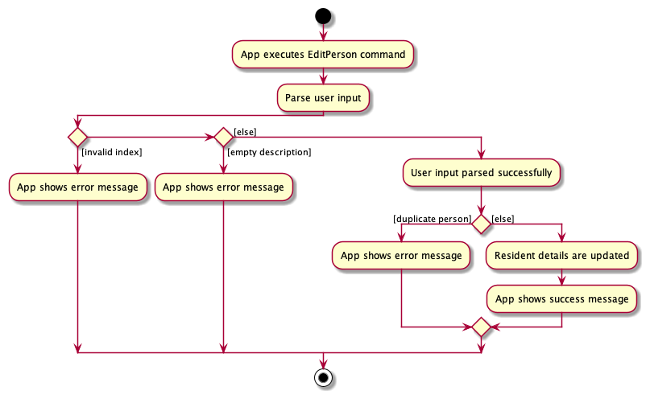
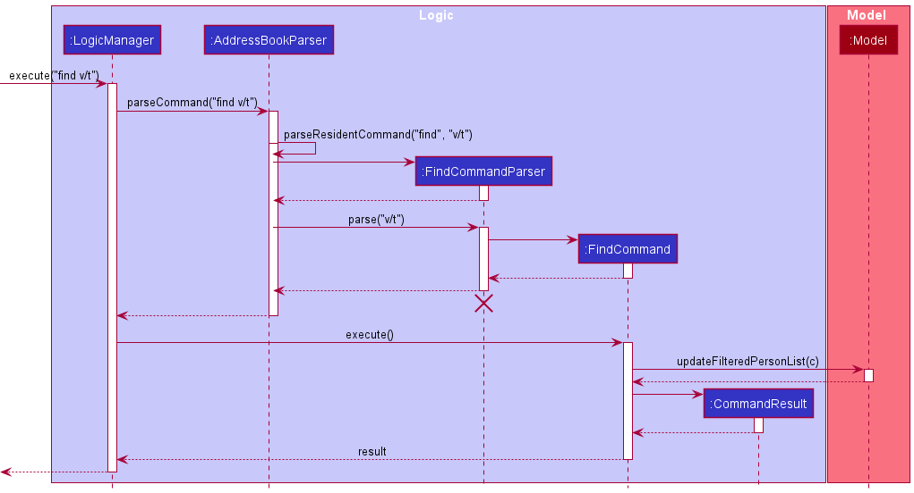
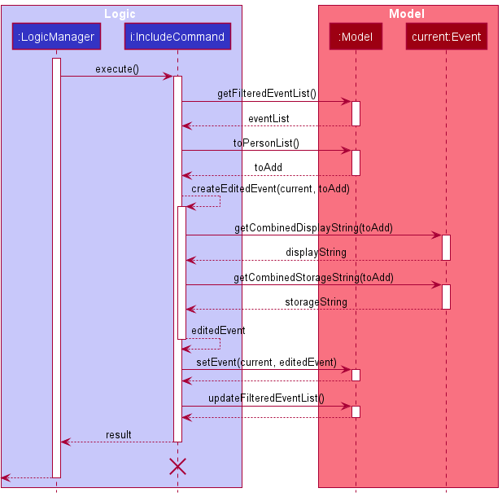
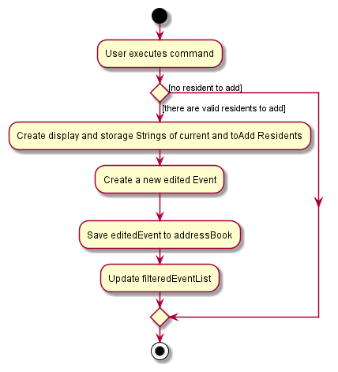

* Table of Contents
{:toc}

--------------------------------------------------------------------------------------------------------------------

## **Acknowledgements**

* {list here sources of all reused/adapted ideas, code, documentation, and third-party libraries -- include links to the original source as well}

--------------------------------------------------------------------------------------------------------------------

## **Setting up, getting started**

Refer to the guide [_Setting up and getting started_](SettingUp.md).

--------------------------------------------------------------------------------------------------------------------

## **Design**

<div markdown="span" class="alert alert-primary">

:bulb: **Tip:** The `.puml` files used to create diagrams in this document can be found in the [diagrams](https://github.com/se-edu/addressbook-level3/tree/master/docs/diagrams/) folder. Refer to the [_PlantUML Tutorial_ at se-edu/guides](https://se-education.org/guides/tutorials/plantUml.html) to learn how to create and edit diagrams.
</div>

### Architecture


The ***Architecture Diagram*** given above explains the high-level design of the App.

Given below is a quick overview of main components and how they interact with each other.

**Main components of the architecture**

**`Main`** has two classes called [`Main`](https://github.com/se-edu/addressbook-level3/tree/master/src/main/java/seedu/address/Main.java) and [`MainApp`](https://github.com/se-edu/addressbook-level3/tree/master/src/main/java/seedu/address/MainApp.java). It is responsible for,
* At app launch: Initializes the components in the correct sequence, and connects them up with each other.
* At shut down: Shuts down the components and invokes cleanup methods where necessary.

[**`Commons`**](#common-classes) represents a collection of classes used by multiple other components.

The rest of the App consists of four components.

* [**`UI`**](#ui-component): The UI of the App.
* [**`Logic`**](#logic-component): The command executor.
* [**`Model`**](#model-component): Holds the data of the App in memory.
* [**`Storage`**](#storage-component): Reads data from, and writes data to, the hard disk.


**How the architecture components interact with each other**

The *Sequence Diagram* below shows how the components interact with each other for the scenario where the user issues the command `delete 1`.


Each of the four main components (also shown in the diagram above),

* defines its *API* in an `interface` with the same name as the Component.
* implements its functionality using a concrete `{Component Name}Manager` class (which follows the corresponding API `interface` mentioned in the previous point.

For example, the `Logic` component defines its API in the `Logic.java` interface and implements its functionality using the `LogicManager.java` class which follows the `Logic` interface. Other components interact with a given component through its interface rather than the concrete class (reason: to prevent outside component's being coupled to the implementation of a component), as illustrated in the (partial) class diagram below.


The sections below give more details of each component.

### UI component

The **API** of this component is specified in [`Ui.java`](https://github.com/se-edu/addressbook-level3/tree/master/src/main/java/seedu/address/ui/Ui.java)


The UI consists of a `MainWindow` that is made up of parts e.g.`CommandBox`, `ResultDisplay`, `PersonListPanel`, `StatusBarFooter` etc. All these, including the `MainWindow`, inherit from the abstract `UiPart` class which captures the commonalities between classes that represent parts of the visible GUI.

The `UI` component uses the JavaFx UI framework. The layout of these UI parts are defined in matching `.fxml` files that are in the `src/main/resources/view` folder. For example, the layout of the [`MainWindow`](https://github.com/se-edu/addressbook-level3/tree/master/src/main/java/seedu/address/ui/MainWindow.java) is specified in [`MainWindow.fxml`](https://github.com/se-edu/addressbook-level3/tree/master/src/main/resources/view/MainWindow.fxml)

The `UI` component,

* executes user commands using the `Logic` component.
* listens for changes to `Model` data so that the UI can be updated with the modified data.
* keeps a reference to the `Logic` component, because the `UI` relies on the `Logic` to execute commands.
* depends on some classes in the `Model` component, as it displays `Person` object residing in the `Model`.

### Logic component

**API** : [`Logic.java`](https://github.com/se-edu/addressbook-level3/tree/master/src/main/java/seedu/address/logic/Logic.java)

Here's a (partial) class diagram of the `Logic` component:


How the `Logic` component works:
1. When `Logic` is called upon to execute a command, it uses the `AddressBookParser` class to parse the user command.
1. This results in a `Command` object (more precisely, an object of one of its subclasses e.g., `AddCommand`) which is executed by the `LogicManager`.
1. The command can communicate with the `Model` when it is executed (e.g. to add a person).
1. The result of the command execution is encapsulated as a `CommandResult` object which is returned back from `Logic`.

The Sequence Diagram below illustrates the interactions within the `Logic` component for the `execute("delete 1")` API call.


<div markdown="span" class="alert alert-info">:information_source: **Note:** The lifeline for `DeleteCommandParser` should end at the destroy marker (X) but due to a limitation of PlantUML, the lifeline reaches the end of diagram.
</div>

Here are the other classes in `Logic` (omitted from the class diagram above) that are used for parsing a user command:


How the parsing works:
* When called upon to parse a user command, the `AddressBookParser` class creates an `XYZCommandParser` (`XYZ` is a placeholder for the specific command name e.g., `AddCommandParser`) which uses the other classes shown above to parse the user command and create a `XYZCommand` object (e.g., `AddCommand`) which the `AddressBookParser` returns back as a `Command` object.
* All `XYZCommandParser` classes (e.g., `AddCommandParser`, `DeleteCommandParser`, ...) inherit from the `Parser` interface so that they can be treated similarly where possible e.g, during testing.

### Model component
**API** : [`Model.java`](https://github.com/se-edu/addressbook-level3/tree/master/src/main/java/seedu/address/model/Model.java)


The `Model` component,

* stores the address book data i.e., all `Person` objects (which are contained in a `UniquePersonList` object).
* stores the currently 'selected' `Person` objects (e.g., results of a search query) as a separate _filtered_ list which is exposed to outsiders as an unmodifiable `ObservableList<Person>` that can be 'observed' e.g. the UI can be bound to this list so that the UI automatically updates when the data in the list change.
* stores a `UserPref` object that represents the user’s preferences. This is exposed to the outside as a `ReadOnlyUserPref` objects.
* does not depend on any of the other three components (as the `Model` represents data entities of the domain, they should make sense on their own without depending on other components)


### Storage component

**API** : [`Storage.java`](https://github.com/se-edu/addressbook-level3/tree/master/src/main/java/seedu/address/storage/Storage.java)


The `Storage` component,
* can save both address book data and user preference data in json format, and read them back into corresponding objects.
* inherits from both `AddressBookStorage` and `UserPrefStorage`, which means it can be treated as either one (if only the functionality of only one is needed).
* depends on some classes in the `Model` component (because the `Storage` component's job is to save/retrieve objects that belong to the `Model`)

### Common classes

Classes used by multiple components are in the `seedu.addressbook.commons` package.

--------------------------------------------------------------------------------------------------------------------

## **Implementation**

This section describes some noteworthy details on how certain features are implemented.

### Add Command

This command allows the user to add residents or events to the SafeFor(H)All application depending on the currently active tab.

The workflow of the Add command is shown in the Activity diagram illustrated below.


#### Design considerations:

**Aspect: Optional `LastDate` fields when adding residents**

* **Alternative 1 (current choice):** `lastFetDate` and `lastCollectionDate` are optional fields
  * Pros:
    - Provides more flexibility for users when adding residents to the application, as users have the choice to include or exclude these fields.
    - Saves time as all fields can be added in a single command
  * Cons: The length of command is increased as there are potentially more fields for the user to type.

* **Alternative 2:** Add `lastFetDate` and `lastCollectionDate` by editing the Person object
  * Pros: Makes add command more user-friendly as the command is more succinct
  * Cons: User has to go through a two-step process of `add` and `edit` to initialise a residents information

### Delete Command

This command allows the user to delete residents or events to the SafeFor(H)All application depending on the currently active tab.

The workflow of the Delete command is shown in the Activity diagram illustrated below.


#### Design considerations:

**Aspect: Delete the correct resident/event:**

* **Alternative 1 (current choice):** `Index` field
    * Pros: No need to type out the full name of the resident/event, and risk typos. `Index` is also unique, which prevents the user
      from deleting the wrong resident/event.
    * Cons: The user needs to scroll through the GUI to find the index of the resident/event to be deleted.

* **Alternative 2:** `Name` and `eventName` fields for Resident and Event respectively.
    * Pros: The user does not need to scroll through the GUI to find the index of the resident/event to be deleted.
    * Cons: There is a higher risk of erroneous user input, as a `Name`/`eventName` field will inevitably be longer than
      an index.


### Edit Command

This command allows the user to edit residents or events to the SafeFor(H)All application depending on the currently active tab.

The workflow of the Edit command is shown in the Activity diagram illustrated below.



Note:
- Mass operations for residents can be carried out by inputting multiple indexes after the command `edit`, each separated by a whitespace.
- `Residents` field in `Event` is not editable by `edit` command

#### Design considerations:

**Aspect: Edit parameters:**

* **Alternative 1 (current choice):** Excluding `Residents` parameter for Events.
    * Pros:
        - Simpler implementation as there are less `EditDescriptors` to maintain.
        - `include` and `exclude` commands exist to enhance the updating of the `Residents` field.
          `edit` currently replaces the specified fields with the user input, which will not be user-friendly for the `Residents` field.
          It might also cause confusion of possible overlapping functionality on the user's side.
    * Cons: Increases the number of commands the user has to remember.

* **Alternative 2:** `edit` is used to edit the residents involved in an event
    * Pros: More instinctive, and less commands for the user to remember.
    * Cons: Users will have to rewrite the entire list of residents involved in the event whenever they want to modify the list of residents involved.


### View Command

This command allows the user to view the additional details of a specific resident or event in the sidebar, depending on the currently active tab.

How it works:
1. When the app is started, the `Ui` component calls on `Logic` to get the `Model` to be displayed in the sidebar. `Model` is first set to an empty list.
2. When a `ViewCommand` with a valid index is executed, the `Model` is updated to contain only the specified resident or event.
3. When the `ViewCommand` is executed without index parameters, the main panel will show all residents or events, and the sidebar will be cleared.
4. If the command is run in the `ResidentTab`, the details of the resident with the corresponding index being displayed in the sidebar. Vice versa for `EventTab`.

The following sequence diagram demonstrates what happens when the `ViewCommand` is executed:


#### Design considerations:

**Aspect: How to reference residents/ events in the CLI:**

* **Alternative 1 (current choice):** Reference by `Index`.
    * Pros:
      - Easy to reference and no need to type out the whole `residentName`/ `eventName`.
      - `Index` is unique.
    * Cons: Need to first determine the `Index` of the resident/ event in the UI. `View` could become a two-step process if the database is large.

* **Alternative 2:** Reference by `residentName`/ `eventName`.
    * Pros: Do not have to first determine the `Index` of the resident/ event.
    * Cons:
      - Hard to type when the `residentName`/ `eventName` is long.
      - `eventName` is not unique, which might cause issues.


### Find Command

This command allows searching for residents subjected to 1 or more filters for the different available parameters.

How the parsing works:
1. When `Logic` is called upon to execute the command, it uses the `AddressBookParser` class to parse the user command.
1. If the command was run in the `ResidentTab` it results in a `FindCommandParser` object created and it's `parse` method called with the user input.
1. The parsing attempts to create a `FindCommand` object. For each existing prefix, it sets the relevant field of a new `FindCompositePredicate` object.
1. Parsing of any of the provided values can throw a `ParseException` if invalid. If at least one field is set, a `FindCommand` object is returned. If all are unspecified, an exception is thrown.
1. The command is executed and the result encapsulated as a `CommandResult` object which is returned back from `Logic`.

Note:
 - Name can take in multiple keywords separated by whitespace
 - `lastFetDate` and `lastCollectionDate` are not included
 - Room filtering is extended to allow block, level and block-level filtering as well


The following sequence diagram demonstrates what happens when the `FindCommand` is executed:



The command extends the `Command` class and implements `FindCommand#execute()` to execute the command.

The crucial logic underlying is encapsulated in the `FindCompositePredicate` class. This class holds the filtering variables and constructs the required predicate for filtering. The `test` method creates and combines the predicates as shown:

```java
@Override
public boolean test(Person person) {
    List<Predicate<Person>> allPredicates = Arrays.asList(
        p -> getName().orElse(x -> true).test(p),
        p -> getRoom().orElse(x -> true).test(p),
        p -> getPhone().orElse(x -> true).test(p.getPhone()),
        p -> getEmail().orElse(x -> true).test(p.getEmail()),
        p -> getVaccStatus().orElse(x -> true).test(p.getVaccStatus()),
        p -> getFaculty().orElse(x -> true).test(p.getFaculty()));

    return allPredicates
            .stream()
            .reduce(p -> true, Predicate::and)
            .test(person);
}
```

Most variables are checked against using it's respective `equals` method except for `Name` and `Room` for which separate predicates implementing `Predicate<Person>` have been created. This is done to support 1. Multiple keywords matching for name and 2. Room matching by block, level and block-level.

#### Design considerations:

**Aspect: Filtering parameters:**

* **Alternative 1 (current choice):** Excluding `lastFetDate` and `lastCollectionDate` parameters.
    * Pros:
        - Simpler implementation as there are less filtering predicates to maintain.
        - `list` command exists to enhance the usage of these 2 fields to extract information. A simple equality check on date is less likely from the user's POV and `list` handles this. Thus excluding this, prevents confusion of possible overlapping functionality on the user's side.
    * Cons:
        - The user is unable to search for an exact fet/collection date alongside other filters.


### Include Command

This command adds multiple residents to an event by referencing the `Event` by its `Index` and the `Person` to add by their `Name` or `Room` through the `AddressBook#findPerson()` method.

The following activity diagram illustrates how the `AddressBook#findPerson()` method works:


The command extends the `Command` class and implements `IncludeCommand#execute()` to execute the command. A `ResidentList` which contains a list of `Person` to add to an `Event`, is a field added to an `Event`.

When `Event#addResidentsToEvent()` is called, it calls `ResidentList#addResidentList()` to create a new String `newResidents` that consists of current `Person` in the `Event` and append all the `Person` in `toAdd` to this String while making sure that there is no duplicate.

The following sequence diagram demonstrates what happens when the `IncludeCommand` is executed:



The following activity diagram summarizes what happens when the `IncludeCommand` is executed:



#### Design considerations:

**Aspect: How to reference event in the CLI:**

* **Alternative 1 (current choice):** Reference by `Index`.
    * Pros: Easy to reference and no need to type out the whole `eventName`, `Index` is also unique.
    * Cons: Need to find the `Index` of the `Event` in the UI to know what `Index` the `Event` has if the number of `Event` is large.

* **Alternative 2:** Reference by `eventName`.
  itself.
    * Pros: Do not need to have the `Index` in UI to know what `Event` it is, can just reference it by its name.
    * Cons: Hard to type when the `eventName` is long, `eventName` not being unique will also cause issues.

### \[Proposed\] Undo/redo feature

#### Proposed Implementation

The proposed undo/redo mechanism is facilitated by `VersionedAddressBook`. It extends `AddressBook` with an undo/redo history, stored internally as an `addressBookStateList` and `currentStatePointer`. Additionally, it implements the following operations:

* `VersionedAddressBook#commit()` — Saves the current address book state in its history.
* `VersionedAddressBook#undo()` — Restores the previous address book state from its history.
* `VersionedAddressBook#redo()` — Restores a previously undone address book state from its history.

These operations are exposed in the `Model` interface as `Model#commitAddressBook()`, `Model#undoAddressBook()` and `Model#redoAddressBook()` respectively.

Given below is an example usage scenario and how the undo/redo mechanism behaves at each step.

Step 1. The user launches the application for the first time. The `VersionedAddressBook` will be initialized with the initial address book state, and the `currentStatePointer` pointing to that single address book state.


Step 2. The user executes `delete 5` command to delete the 5th person in the address book. The `delete` command calls `Model#commitAddressBook()`, causing the modified state of the address book after the `delete 5` command executes to be saved in the `addressBookStateList`, and the `currentStatePointer` is shifted to the newly inserted address book state.


Step 3. The user executes `add n/David …​` to add a new person. The `add` command also calls `Model#commitAddressBook()`, causing another modified address book state to be saved into the `addressBookStateList`.


<div markdown="span" class="alert alert-info">:information_source: **Note:** If a command fails its execution, it will not call `Model#commitAddressBook()`, so the address book state will not be saved into the `addressBookStateList`.

</div>

Step 4. The user now decides that adding the person was a mistake, and decides to undo that action by executing the `undo` command. The `undo` command will call `Model#undoAddressBook()`, which will shift the `currentStatePointer` once to the left, pointing it to the previous address book state, and restores the address book to that state.


<div markdown="span" class="alert alert-info">:information_source: **Note:** If the `currentStatePointer` is at index 0, pointing to the initial AddressBook state, then there are no previous AddressBook states to restore. The `undo` command uses `Model#canUndoAddressBook()` to check if this is the case. If so, it will return an error to the user rather
than attempting to perform the undo.

</div>

The following sequence diagram shows how the undo operation works:


<div markdown="span" class="alert alert-info">:information_source: **Note:** The lifeline for `UndoCommand` should end at the destroy marker (X) but due to a limitation of PlantUML, the lifeline reaches the end of diagram.

</div>

The `redo` command does the opposite — it calls `Model#redoAddressBook()`, which shifts the `currentStatePointer` once to the right, pointing to the previously undone state, and restores the address book to that state.

<div markdown="span" class="alert alert-info">:information_source: **Note:** If the `currentStatePointer` is at index `addressBookStateList.size() - 1`, pointing to the latest address book state, then there are no undone AddressBook states to restore. The `redo` command uses `Model#canRedoAddressBook()` to check if this is the case. If so, it will return an error to the user rather than attempting to perform the redo.

</div>

Step 5. The user then decides to execute the command `list`. Commands that do not modify the address book, such as `list`, will usually not call `Model#commitAddressBook()`, `Model#undoAddressBook()` or `Model#redoAddressBook()`. Thus, the `addressBookStateList` remains unchanged.


Step 6. The user executes `clear`, which calls `Model#commitAddressBook()`. Since the `currentStatePointer` is not pointing at the end of the `addressBookStateList`, all address book states after the `currentStatePointer` will be purged. Reason: It no longer makes sense to redo the `add n/David …​` command. This is the behavior that most modern desktop applications follow.


The following activity diagram summarizes what happens when a user executes a new command:


#### Design considerations:

**Aspect: How undo & redo executes:**

* **Alternative 1 (current choice):** Saves the entire address book.
  * Pros: Easy to implement.
  * Cons: May have performance issues in terms of memory usage.

* **Alternative 2:** Individual command knows how to undo/redo by
  itself.
  * Pros: Will use less memory (e.g. for `delete`, just save the person being deleted).
  * Cons: We must ensure that the implementation of each individual command are correct.

_{more aspects and alternatives to be added}_

### \[Proposed\] Data archiving

_{Explain here how the data archiving feature will be implemented}_


--------------------------------------------------------------------------------------------------------------------

## **Documentation, logging, testing, configuration, dev-ops**

* [Documentation guide](Documentation.md)
* [Testing guide](Testing.md)
* [Logging guide](Logging.md)
* [Configuration guide](Configuration.md)
* [DevOps guide](DevOps.md)

--------------------------------------------------------------------------------------------------------------------

## **Appendix: Requirements**

### Product scope

**Target user profile**:

* administrator of on-campus halls and residences
* has a need to manage a large amount of resident information
* prefer desktop apps over other types
* can type fast
* prefers typing to mouse interactions
* is reasonably comfortable using CLI apps

**Value proposition**: Manage residents' information faster than a typical mouse/GUI driven app and allow easy enforcement of Covid-19 restrictions


### User stories

Priorities: High (must have) - `* * *`, Medium (nice to have) - `* *`, Low (unlikely to have) - `*`

[EPIC] Basic CRUD Functionality
| Priority | As a …​                                 | I want to …​                                                                                       | So that I can…​                                                                                                                    |
| -------- | ------------------------------------------ | ----------------------------------------------------------------------------------------------------- | ------------------------------------------------------------------------------------------------------------------------------------- |
| `* * *`  | admin in a hall/ residence                 | add a resident’s information into the database                                                        | keep track of the residents' data                                                                                                     |
| `* * *`  | admin in a hall/ residence                 | add a resident's last FET date                                                                        | track and be aware of the new residents’ FET progress                                                                                 |
| `* * *`  | admin in a hall/ residence                 | add a new event                                                                                       | keep track of current and upcoming events happening in the hall/ residence                                                            |
| `* * *`  | admin in a hall/ residence                 | add residents to an event                                                                             | keep track of the residents attending an event and their information                                                                  |
| `* * *`  | admin in a hall/ residence                 | delete a resident’s information from the database                                                     | remove the data of a resident who has moved out                                                                                       |
| `* * *`  | admin in a hall/ residence                 | delete many residents in a single command                                                             | save a lot of time when deleting multiple residents                                                                                   |
| `* * *`  | admin in a hall/ residence                 | delete an event                                                                                       | remove an event that has been cancelled                                                                                               |
| `* * *`  | admin in a hall/ residence                 | update a resident’s details                                                                           | update and reflect any changes in the residents’ details                                                                              |
| `* * *`  | admin in a hall/ residence                 | update the particulars of many residents in a single command                                          | save a lot of time when editing the details of multiple residents                                                                     |
| `* * *`  | admin in a hall/ residence                 | update a resident's last FET date                                                                     | update the current residents’ last FET dates when they take a new FET                                                                 |
| `* * *`  | admin in a hall/ residence                 | update an event's details                                                                             | update an event’s details if there are any changes                                                                                    |


[EPIC] Information Retrieval
| Priority | As a …​                                 | I want to …​                                                                                       | So that I can…​                                                                                                                    |
| -------- | ------------------------------------------ | ----------------------------------------------------------------------------------------------------- | ------------------------------------------------------------------------------------------------------------------------------------- |
| `* * *`  | admin in a hall/ residence                 | view the residents’ information                                                                       | see all the information of the current residents                                                                                      |
| `* * *`  | admin in a hall/ residence                 | search for the residents by their name, room, email, phone number                                     | find a resident based on the information given                                                                                        |
| `* * *`  | admin in a hall/ residence                 | filter the residents by faculty                                                                       | easily disseminate faculty-specific information to the residents                                                                      |
| `* * *`  | admin in a hall/ residence                 | filter the residents by block and level                                                               | easily contact a group of students in order to disseminate group-specific information                                                 |
| `* * *`  | admin in a hall/ residence                 | filter the residents by their vaccination status                                                      | use the information to disseminate information or guidelines that may be different for vaccinated and unvaccinated individuals        |
| `* * *`  | admin in a hall/ residence                 | immediately see residents who have missed their FET deadlines                                         | disseminate a reminder to these residents to take a new FET test                                                                      |
| `* * *`  | admin in a hall/ residence                 | retrieve all residents whose FETs that are due within a given date                                    | ensure residents do not miss their FET deadlines by reminding them to do their FETs                                                   |
| `* * *`  | admin in a hall/ residence                 | retrieve a resident's test kit collection deadlines                                                   | ensure residents do not miss their test kit collections by reminding them to collect their kits on time                               |
| `* * *`  | admin in a hall/ residence                 | check the date of the events                                                                          | identify who was in contact with the infected person on the day of the event                                                          |
| `* * *`  | admin in a hall/ residence                 | retrieve the event venues and its maximum capacity and the number of residents attending an event     | ensure that the number of residents attending the event will not exceed the capacity of the event venue                               |
| `* * *`  | admin in a hall/ residence                 | view a list of residents who were present at an event                                                 | identify who is at risk if someone in the group catches COVID                                                                         |
| `* *`    | admin in a hall/ residence                 | retrieve the vaccination statuses of the residents attending an event                                 | ensure that COVID restrictions are adhered to and everyone attending the event is vaccinated                                          |
| `*`      | admin in a hall/ residence                 | check which CCA booked a certain facility                                                             | find out which CCA is responsible in case trouble arises                                                                              |
| `*`      | admin in a hall/ residence                 | check a resident’s prior activities (events/ CCAs)                                                    | find out which group has come into contact with the infected person                                                                   |


[EPIC] Miscellaneous
| Priority | As a …​                                 | I want to …​                                                                                       | So that I can…​                                                                                                                    |
| -------- | ------------------------------------------ | ----------------------------------------------------------------------------------------------------- | ------------------------------------------------------------------------------------------------------------------------------------- |
| `* * *`  | admin in a hall/ residence                 | view the help guide whenever I need to                                                                | refresh my memory on how to use the app                                                                                               |
| `* *`    | admin in a hall/ residence                 | import user data from a CSV file                                                                      | input multiple residents' information into the system at once without having to add each resident's information line-by-line          |
| `*`      | admin in a hall/ residence                 | output the emails of the residents whose FET/collection are due soon into a file                      | disseminate information to the residents more easily                                                                                  |
| `*`      | new user of the app                        | view a detailed guide on how to use basic functions                                                   | learn how to navigate within the app and use the commands                                                                             |
| `*`      | admin in a hall/ residence                 | easily carry out contact tracing                                                                      | quarantine can be done quickly in the case where one person in the group catches COVID                                                |
| `*`      | admin in a hall/ residence                 | see a pop-up of the format of the command once I type it

*{More to be added}*

### Use cases

(For all use cases below, the **System** is the `SafeFor(H)All app` and the **Actor** is the `Hall admin`, unless specified otherwise)

**Use case: UC01 - Delete a resident**

**MSS**

1.  Actor requests to list residents
2.  System shows a list of residents
3.  Actor requests to delete a specific resident in the list
4.  System deletes the resident

    Use case ends.

**Extensions**

* 2a. The list is empty.

  Use case ends.

* 3a. The given index is invalid.

    * 3a1. System shows an error message.

      Use case resumes at step 2.

**Use case: UC02 - Remind residents to take FET**

**MSS**

1. Actor filters residents, specifying desired FET due date.
2. System shows the list of residents filtered.
3. Actor requests for a list of the email addresses of the residents shown.
4. System outputs the list email addresses.
5. Actor sends an email to these residents to remind them to take their FET soon.

    Use case ends.

**Extensions**

* 2a. The list is empty.

  Use case ends.

**Use case: UC03 - View residents involved in an event**

**MSS**

1. Actor navigates to the `events` tab of the application.
2. Actor requests to view an event.
3. System shows the list of residents involved in the event and their relevant personal information.

   Use case ends.

**Extensions**

* 3a. The list is empty.

  Use case ends.

**Use case: UC04 - View any unvaccinated residents involved in an event**

**MSS**

1. Actor <u>views residents involved in an event (UC03)</u>
2. Actor filters for unvaccinated residents.
3. System shows the list of unvaccinated residents.

   Use case ends.

**Extensions**

* 3a. The list is empty.

  Use case ends.

*{More to be added}*

### Non-Functional Requirements

1.  Should work on any _mainstream OS_ as long as it has Java `11` or above installed.
2.  Should be able to hold up to 1000 persons without a noticeable sluggishness in performance for typical usage.
3.  A user with above average typing speed for regular English text (i.e. not code, not system admin commands) should be able to accomplish most of the tasks faster using commands than using the mouse.
4.  Should be targeted towards a single user and not multi-users.
5.  Data stored locally should be in a human editable text file.
6.  Do not make use of a DBMS to manage data.
7.  Final software should be platform-independent.
8.  The software shouldn't depend on our own remote server.
9.  Application is to be packaged into a single JAR file.
10. JAR file size to be limited to 100MB and documents to 15MB/file.
11. UG and DG are to be pdf-friendly.

### Glossary

* **Mainstream OS**: Windows, Linux, Unix, OS-X
* **API**: An Application Programming Interface is a connection between computers or between computer programs. It is a type of software interface, offering a service to other pieces of software.
* **GUI**: A Graphical User Interface (GUI) is a form of user interface through which users interact with electronic devices via visual indicator representations.
* **CLI**: A Command Line Interface (CLI) processes commands to a computer program in the form of lines of text.
* **FET**: Fast and Easy Test for COVID-19, which is self-administered using Antigen Rapid Test (ART) kits.
--------------------------------------------------------------------------------------------------------------------

## **Appendix: Instructions for manual testing**

Given below are instructions to test the app manually.

<div markdown="span" class="alert alert-info">:information_source: **Note:** These instructions only provide a starting point for testers to work on;
testers are expected to do more *exploratory* testing.

</div>

### Launch and shutdown

1. Initial launch

   1. Download the jar file and copy into an empty folder

   1. Double-click the jar file Expected: Shows the GUI with a set of sample contacts. The window size may not be optimum.

1. Saving window preferences

   1. Resize the window to an optimum size. Move the window to a different location. Close the window.

   1. Re-launch the app by double-clicking the jar file.<br>
       Expected: The most recent window size and location is retained.

1. _{ more test cases …​ }_

### Viewing a resident

1. View a list of all the residents in the app, or the information on a specific resident

    1. Prerequisites: NIL

    1. Test case: `view`<br>
       Expected: A list of all the residents is displayed in the app's GUI

    1. Test case: `view 3`<br>
       Expected: The details of the resident at index 3 (meaning the 3rd resident in the list when `view` without the 
       index parameter is called) of the address book are displayed in the GUI.

    1. Other incorrect delete commands to try: `view 0`, `view x` (where x is larger than the list size)<br>
       Expected: Error message shown

### Deleting a person

1. Deleting a person while all persons are being shown

   1. Prerequisites: List all persons using the `list` command. Multiple persons in the list.

   1. Test case: `delete 1`<br>
      Expected: First contact is deleted from the list. Details of the deleted contact shown in the status message. Timestamp in the status bar is updated.

   1. Test case: `delete 0`<br>
      Expected: No person is deleted. Error details shown in the status message. Status bar remains the same.

   1. Other incorrect delete commands to try: `delete`, `delete x`, `...` (where x is larger than the list size)<br>
      Expected: Similar to previous.

1. _{ more test cases …​ }_

### Finding an event

1. Shows a list of events that match the provided keywords for different available parameters.

    1. Prerequisites: NIL

    1. Test case: `find c/5`<br>
       Expected: A list of all the events with capacity 5 is displayed in the app's GUI

    1. Test case: `find n/Football Training`<br>
       Expected: A list of all the events which contain the words "Football" and "Training" is displayed in the app's GUI

    1. Other incorrect delete commands to try: `find`, `find d/03-01` (invalid date input)<br>
       Expected: Error message shown

### Deleting an event

1. Deleting an event while all persons are being shown

    1. Prerequisites: List all events using the `view` command (without any parameters). Multiple events in the list.

    1. Test case: `delete 3`<br>
       Expected: The third event is deleted from the list. Details of the deleted event shown in the status message.

    1. Test case: `delete 0`<br>
       Expected: No event is deleted. Error details shown.

    1. Other incorrect delete commands to try: `delete -1`, `delete x` (where x is larger than the list size)<br>
       Expected: Similar to previous.

### Switch between tabs

1. Switch between the event and resident tabs

    1. Prerequisites: NIL

    1. Test case: `switch`<br> when the user is at the Event tab
       Expected: The GUI switches from displaying the Event tab to the Resident tab

### Saving data

1. Dealing with missing/corrupted data files

   1. _{explain how to simulate a missing/corrupted file, and the expected behavior}_

1. _{ more test cases …​ }_
