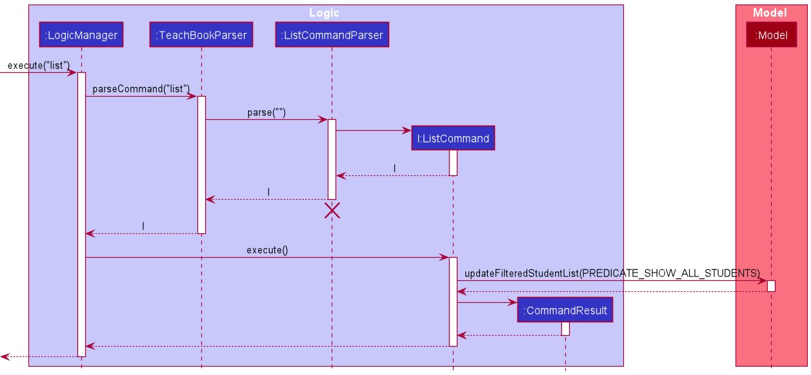

* Table of Contents
{:toc}

--------------------------------------------------------------------------------------------------------------------

## **Acknowledgements**

* {list here sources of all reused/adapted ideas, code, documentation, and third-party libraries -- include links to the original source as well}

--------------------------------------------------------------------------------------------------------------------

## **Setting up, getting started**

Refer to the guide [_Setting up and getting started_](SettingUp.md).

--------------------------------------------------------------------------------------------------------------------

## **Design**

:bulb: **Tip:** The `.puml` files used to create diagrams in this document can be found in the [diagrams](https://github.com/AY2122S1-CS2103T-T10-4/tp/tree/master/docs/diagrams/) folder. Refer to the [_PlantUML Tutorial_ at se-edu/guides](https://se-education.org/guides/tutorials/plantUml.html) to learn how to create and edit diagrams.

### Architecture

The ***Architecture Diagram*** given above explains the high-level design of the App.

Given below is a quick overview of main components and how they interact with each other.

**Main components of the architecture**

**`Main`** has two classes called [`Main`](https://github.com/AY2122S1-CS2103T-T10-4/tp/blob/master/src/main/java/seedu/anilist/Main.java) and [`MainApp`](https://github.com/AY2122S1-CS2103T-T10-4/tp/blob/master/src/main/java/seedu/anilist/MainApp.java). It is responsible for,
* At app launch: Initializes the components in the correct sequence, and connects them up with each other.
* At shut down: Shuts down the components and invokes cleanup methods where necessary.

[**`Commons`**](#common-classes) represents a collection of classes used by multiple other components.

The rest of the App consists of four components.

* [**`UI`**](#ui-component): The UI of the App.
* [**`Logic`**](#logic-component): The command executor.
* [**`Model`**](#model-component): Holds the data of the App in memory.
* [**`Storage`**](#storage-component): Reads data from, and writes data to, the hard disk.

**How the architecture components interact with each other**

The *Sequence Diagram* below shows how the components interact with each other for the scenario where the user issues the command `delete 1`.

Each of the four main components (also shown in the diagram above),

* defines its *API* in an `interface` with the same name as the Component.
* implements its functionality using a concrete `{Component Name}Manager` class (which follows the corresponding API `interface` mentioned in the previous point.

For example, the `Logic` component defines its API in the `Logic.java` interface and implements its functionality using the `LogicManager.java` class which follows the `Logic` interface. Other components interact with a given component through its interface rather than the concrete class (reason: to prevent outside component's being coupled to the implementation of a component), as illustrated in the (partial) class diagram below.

The sections below give more details of each component.

### UI component

The **API** of this component is specified in [`Ui.java`](https://github.com/AY2122S1-CS2103T-T10-4/tp/blob/master/src/main/java/seedu/anilist/ui/Ui.java)

The UI consists of a `MainWindow` that is made up of parts e.g.`CommandBox`, `ResultDisplay`, `AnimeListPanel`, `StatusBarFooter` etc. All these, including the `MainWindow`, inherit from the abstract `UiPart` class which captures the commonalities between classes that represent parts of the visible GUI.

The `UI` component uses the JavaFx UI framework. The layout of these UI parts are defined in matching `.fxml` files that are in the `src/main/resources/view` folder. For example, the layout of the [`MainWindow`](https://github.com/AY2122S1-CS2103T-T10-4/tp/blob/master/src/main/java/seedu/anilist/ui/MainWindow.java) is specified in [`MainWindow.fxml`](https://github.com/AY2122S1-CS2103T-T10-4/tp/blob/master/src/main/resources/view/MainWindow.fxml)

The `UI` component,

* executes user commands using the `Logic` component.
* listens for changes to `Model` data so that the UI can be updated with the modified data.
* keeps a reference to the `Logic` component, because the `UI` relies on the `Logic` to execute commands.
* depends on some classes in the `Model` component, as it displays `Anime` object residing in the `Model`.

### Logic component

**API** : [`Logic.java`](https://github.com/AY2122S1-CS2103T-T10-4/tp/blob/master/src/main/java/seedu/anilist/logic/Logic.java)

Here's a (partial) class diagram of the `Logic` component:

How the `Logic` component works:
1. When `Logic` is called upon to execute a command, it uses the `AnimeListParser` class to parse the user command.
1. This results in a `Command` object (more precisely, an object of one of its subclasses e.g., `AddCommand`) which is executed by the `LogicManager`.
1. The command can communicate with the `Model` when it is executed (e.g. to add a anime).
1. The result of the command execution is encapsulated as a `CommandResult` object which is returned back from `Logic`.

The Sequence Diagram below illustrates the interactions within the `Logic` component for the `execute("delete 1")` API call.

:information_source: **Note:** The lifeline for `DeleteCommandParser` should end at the destroy marker (X) but due to a limitation of PlantUML, the lifeline reaches the end of diagram.

Here are the other classes in `Logic` (omitted from the class diagram above) that are used for parsing a user command:

How the parsing works:
* When called upon to parse a user command, the `AnimeListParser` class creates an `XYZCommandParser` (`XYZ` is a placeholder for the specific command name e.g., `AddCommandParser`) which uses the other classes shown above to parse the user command and create a `XYZCommand` object (e.g., `AddCommand`) which the `AnimeListParser` returns back as a `Command` object.
* All `XYZCommandParser` classes (e.g., `AddCommandParser`, `DeleteCommandParser`, ...) inherit from the `Parser` interface so that they can be treated similarly where possible e.g, during testing.

### Model component
**API** : [`Model.java`](https://github.com/AY2122S1-CS2103T-T10-4/tp/blob/master/src/main/java/seedu/anilist/model/Model.java)

The `Model` component,

* stores the anime list data i.e., all `Anime` objects (which are contained in a `UniqueAnimeList` object).
* stores the currently 'selected' `Anime` objects (e.g., results of a search query) as a separate _filtered_ list which is exposed to outsiders as an unmodifiable `ObservableList<Anime>` that can be 'observed' e.g. the UI can be bound to this list so that the UI automatically updates when the data in the list change.
* stores a `UserPref` object that represents the user’s preferences. This is exposed to the outside as a `ReadOnlyUserPref` objects.
* does not depend on any of the other three components (as the `Model` represents data entities of the domain, they should make sense on their own without depending on other components)

:information_source: **Note:** An alternative (arguably, a more OOP) model is given below. It has a `Genre` list in the `AnimeList`, which `Anime` references. This allows `AnimeList` to only require one `Genre` object per unique genre, instead of each `Anime` needing their own `Genre` objects. 

### Storage component

**API** : [`Storage.java`](https://github.com/AY2122S1-CS2103T-T10-4/tp/blob/master/src/main/java/seedu/anilist/storage/Storage.java)

The `Storage` component,
* can save both anime list data and user preference data in json format, and read them back into corresponding objects.
* inherits from both `AnimeListStorage` and `UserPrefStorage`, which means it can be treated as either one (if only the functionality of only one is needed).
* depends on some classes in the `Model` component (because the `Storage` component's job is to save/retrieve objects that belong to the `Model`)

### Common classes

Classes used by multiple components are in the `seedu.anilist.commons` package.

--------------------------------------------------------------------------------------------------------------------

## **Implementation**

This section describes some noteworthy details on how certain features are implemented.

### Tabs Feature

#### Implementation

There are 4 tabs in AniList:
1. `ALL` which contains all animes in the list.
2. `TOWATCH` which contains all animes that the user wants to watch but have not started watching.
3. `WATCHING` which contains all animes that the user is currently watching.
4. `FINISHED` which contains all animes that the user has finished watching.

To switch between tabs, the user can use the `list` command which accepts an optional parameter `status`, representing the `status` of the animes that will be listed in the tab. If no parameter is given, the current tab will switch to the `ALL` tab.
The user can also use the hotkeys `CTRL-S` and `CTRL-D` to cycle between tabs.

#### Design considerations:

**Aspect: Determining which tab to switch to after updating the list:**

* **Alternative 1 (current choice):** AniList will remain at current tab after the list is updated
    * Pros: User will not have to input a command or use hotkeys to switch back to his previous tab. This is the more intuitive and logical solution.
    * Cons: Harder to implement as there is a need to compound predicates to maintain a properly filtered list. Prone to more bugs.

* **Alternative 2:** AniList will switch back to `all` tab after the list is updated.
    * Pros: Allows users to view all animes after the list is updated. Easy to implement.
    * Cons: If the user wants to remain at his previous tab, he will have to manually switch his tab back by using the list command or the tab switching hotkeys. Not very intuitive.

**Aspect: Determining whether there should be a list maintained per tab or all tabs take reference from a single list**
* **Alternative 1 (current choice):** All the tabs will take reference to the same `ObservableList`.
  * Pros: Minimal complications to rendering lifecycle. Easy updating of list as there is no need to sync between lists as there is only one list.
  * Cons: The ObservableList needs to be filtered with every tab switch. This may pose as a performance issue as tab switching is expected
to be instantaneous. With a large list of animes, filtering can take a significant amount of time.

* **Alternative 2:** Each tab will have its own `ObservableList`.
  * Pros: Switching through tabs will not require the list to be re-filtered and re-rendered. This will increase the performance
for tab switching.
  * Cons: Will cause complications due to changing anime watch status, adding and deleting anime, and keeping sync with the master list.

### Clear Feature

#### Implementation

The current clear mechanism is facilitated by 3 `Command`s, namely `ClearCommand`,
`AbortClearCommand` and `ConfirmClearCommand`. This results in a confirmation message to be displayed
to the user when the user executes `clear`, after which it can either be confirmed (by entering `clear` again) or
aborted (by entering any other input).

The last command executed by the user is stored internally as a `Command` in `LogicManager`.
`LogicManager` makes use of the method `Command#requiresConfirmation` to check whether the
last command requires a user confirmation. If this is the case, the `Parser` parses the next user input
as a confirmation message instead.

{To be added later}

#### Design considerations:

**Aspect: Determining valid confirmation input messages:**

* **Alternative 1 (current choice):** User enters `clear` again to actually clear displayed animes; else to abort.
    * Pros: The least ambiguous; message reflects what is to be done. Only two scenarios (user input is
      `clear` vs user input is not `clear`) to handle.
    * Cons: Entering regular commands such as `list` will abort the `clear` command instead of
      executing as per normal.

* **Alternative 2:** User enters `y` to actually clear displayed animes and `n` to abort; otherwise
  the input is deemed invalid and an exception is thrown.
    * Pros: These are common CLI confirmation formats that the user may be familiar with.
    * Cons: Entering `clear` again will simply result in an exception thrown, which may add to the
      confusion. In addition, if the input is invalid, the `clear` command is aborted anyway,
      making having invalid inputs redundant.

### Find Feature

#### Implementation

The proposed find mechanism is implemented through the use of 2 `Predicate<Anime>`, one for the tab options and one for
the regular search filter. For multiple categories, the `and` method from `Predicate<Anime>` is used to create a conjunctive search. For multiple keywords within categories, a

#### Design considerations:

**Aspect: Executing find:**

* **Alternative 1 (current choice):** Search the keywords with the prefixes `g/` and `n/`. Does not reset tab and resets after each search.
    * Pros: Allows for search with multiple spaces in between, searching within tabs and a more granular search.
    * Cons: Complicated to implement.

* **Alternative 2:** Search the keywords with the prefixes `g/` and `n/`. Does not reset tab and does
not reset after each search.
    * Pros: Provides all of the benefits of the current implementation and an even more granular search.
    * Cons: Added complexity of having a command to remove previous searches or reset searches, less optimized for CLI
    as it requires an additional command.

* **Alternative 3:** Search each keyword split by whitespace. Resets tab after each search.
    * Pros: Less complicated and less coupling.
    * Cons: Does not allow for searches with specific criteria nor keywords with whitespaces in between, does not allow searching within tabs.

**Aspect: Handling search terms:**

* **Alternative 1 (current choice):** Parses it into a valid object before searching.
    * Pros: Ensures that the search term is a valid term for the particular category before searching.
    * Cons: Less efficient search as an additional parsing is required.

* **Alternative 2:** Handles it as a string without parsing.
    * Pros: More efficient search as no additional parsing is not required.
    * Cons: Allows for invalid search terms, which are somewhat problematic for `genres` as it has
    a fixed list of terms.

### Themes Feature

#### Implementation

The proposed theme mechanism is simply done by completely altering the base css file of the program. The active css file will be saved in `preferences.json` upon exiting the application.

If `preferences.json` is empty or the theme css file given is not valid, the default theme will be used instead and
will replace the invalid css file specification in `preferences.json`.

**Current Implementation**

CSS files have been optimized for theme creation. Devs are only needed to edit the list of colors at the top of the CSS file
and the source path for the background image.
* Pros: More advanced users may be able to create their own CSS files by setting the color and changing the source of
the background image.
* Cons: There is a limited choice of color blocking. The bulk of the theming is made from a specified color shading.

### [Proposed] Theme adding feature
#### Current Implementation

Currently, users are allowed to switch between pre-defined and pre-made themes that are provided by the application. However, we
currently only support a limited number of themes which may not fit the user's preferences. Users are currently not allowed to
create their own themes even if they create their own CSS files. The only way to define their own theme would be to overwrite
current CSS files and replace the theme completely.

#### Proposed Implementation
We can create an interface to allow users to create their own themes and their own CSS files. The CSS files has been refactored
for easy creation of new themes.
  
User only needs to provide the following:
* Theme Name
* Background image
* Primary color
* Secondary color
* Tertiary color

With this information, it would be possible to create a new theme that is custom to the user's preference.

Given below is an MSS of an example usage scenario of a user creating their own theme.

**Use case: UCP1-Add user defined Theme**

**MSS**

1. User requests to add theme to the application
2. User provides theme name, background image and color blocking
3. New theme is created
4. Application switches to the new theme Use case ends

### [Proposed] Genre adding feature

#### Current Implementation

The `Genre` command allows the user to specify any `Genre` for an `Anime`, and stores it in a `Set` in the `Anime`.
However, the list of `Genre` is fixed and the user cannot modify the `GenreList`. 
The user can only add or delete a `Genre` from an `Anime` if the `Genre` is in the `GenreList`

* Pros: Easy to implement, and easy to manage as we don't have to worry about syncing the `Genres` in multiple lists
* Cons: Inconvenient for the user, as user can only use a `Genre` if it is in the `GenreList`.

#### Proposed Implementation

We can allow the user to modify the `GenreList` by adding both a add `Genre` command and a delete `Genre` command.
* Pros: User no longer restricted by the provided `Genres`, and this can use his own `Genre` definitions.
* Cons: `Genre` must be synced in multiple locations, and deletion of a `Genre` from the `GenreList` would require the system to remove the `Genre` from all tagged `Animes`.

Given below is an MSS of an example usage scenario of a user adding a `Genre` to an `Anime`.

**Use case: UCP2 - Add Genre to the GenreList**

**MSS**
1.  User requests to add a genre to the genre list
2.  AniList adds the genre
    Use case ends

**Extensions**

- 1a. The genre is a duplicate

    - 1a1. AniList shows an error message

      Use case resumes at step 1

- 1b. The given genre is invalid

    - 1b1. AniList shows an error message

      Use case resumes at step 1

#### Design considerations:

**Aspect: Interaction with `find`:**

* **Alternative 1** `Genre` keeps track of which anime is tagged by this `Genre`. Find searches from the `GenreList`.
    * Pros: Very efficient, as we do not need to go through the list of anime checking each of the anime. Works well when number of `Anime` is large.
    * Cons: More storage intensive, requires us to store the list of tagged `Anime` for every `Genre`.
      Could also cause problems if the save file is tempered with, as there is bi-directional referencing between `Anime` and `Genre`

* **Alternative 2 (Suggested)** Find searches through the list of `Anime` and see if each `Anime` is tagged with this `Genre`
    * Pros: Less bug prone, easy to implement, doesn't require a bi-directional navigability between `Anime` and `Genre`
    * Cons: Can have an effect on performance when a large number of `Anime` is in the list

**Aspect: How to implement `GenreList`**
* `GenreList` as a `HashSet`
    * Pros: Prevents duplication, easy to implement.

## **Glossary, Naming Conventions**

### Action
Used to provide more information to some commands, like `genre`.

### AniList
The name of our app. Only used for package name.

### Anime
Represents a single season of an anime series.

### AnimeList
A list of Anime, also the overall structure of the data.
I.e. the user data is stored as an instance of AnimeList in json format.

### Animes
We chose this to denote multiple anime even though the plural for anime is anime.
This is to distinct between a single anime and multiple animes.

### Genre
Represents a genre of an anime.

### Status
Represents the watch status of an anime

--------------------------------------------------------------------------------------------------------------------

## **Documentation, logging, testing, configuration, dev-ops**

* [Documentation guide](Documentation.md)
* [Testing guide](Testing.md)
* [Logging guide](Logging.md)
* [Configuration guide](Configuration.md)
* [DevOps guide](DevOps.md)

--------------------------------------------------------------------------------------------------------------------

## **Appendix: Requirements**

### Product scope

**Target user profile**:

* has a need to manage a significant number of anime
* prefer desktop apps over other types
* can type fast
* prefers typing to mouse interactions
* is reasonably comfortable using CLI apps

**Value proposition**: Keep track of animes that they are interested in faster than a typical mouse/GUI driven app

### User stories

Priorities: High (must have) - `* * *`, Medium (nice to have) - `* *`, Low (unlikely to have) - `*`

| Priority | As a …​                                    | I want to …​                                | So that I can…​                                                        |
| -------- | ------------------------------------------ | ------------------------------------------- | ---------------------------------------------------------------------- |
| `* * *`  | new user                                   | see usage instructions                      | refer to instructions when I forget how to use the App                 |
| `* * *`  | user                                       | add a new anime                             | keep track of the anime                                                |
| `* * *`  | user                                       | delete an anime                             | remove anime that I no longer need                                     |
| `* * *`  | user                                       | list all anime                              | see all animes I have added                                            |
| `* *`  | user                                         | list all anime with a specific watch status | see all animes with the specific watch status                          |
| `* *`  | user                                         | clear the anime list in a specific tab      | remove all animes in the specific tab                                  |
| `* *`  | user                                         | update anime episode                        | ensure I am on the right episode of the anime                          |
| `* *`  | user                                         | update anime status                         | know if I have watched or am watching the anime                        |
| `* *`  | user                                         | change anime name                           | rename the anime if I made a mistake                                   |
| `* *`  | user                                         | view available genres                       | modify animes with the available genres                                |
| `* *`  | user                                         | add a genre to an anime                     | keep track of what genre the anime is in                               |
| `* *`  | user                                         | delete a genre from an anime                | remove unnecessary genres from an anime                                |
| `* *`  | user                                         | find specific animes by name                | see all animes with a specific name                                    |
| `* *`  | user                                         | find specific animes by genres              | see all animes with specific genres                                    |
| `* *`  | user                                         | view my watching statistics                 | know which genres I have watched the most, total number of episodes I have watched|
| `* *`  | user                                         | change the theme of the application         | personalise the application                                            |

*{More to be added}*

### Use cases

(For all use cases below, the **System** is the `Anilist` and the **Actor** is the `user`, unless specified otherwise)

**Use case: UC01 - View Help**

**MSS**

1.  User requests to view usage instructions
2.  AniList shows a list of commands and a link to the UserGuide

    Use case ends.

**Use case: UC02 - List all anime**

**MSS**

1.  User requests to list anime
2.  AniList shows a list of anime

    Use case ends.

**Use case: UC03 - List all anime with a specific watch status**

**MSS**

1.  User requests to list anime with a specific watch status
2.  AniList shows a list of anime with that watch status

    Use case ends.

**Extensions**

- 1a. The given status is invalid

    - 1a1. AniList shows an error message

      Use case resumes at step 1

**Use case: UC04 - Clear all anime from the current tab**

**MSS**

1.  User requests to clear all anime from the current tab
2.  AniList asks for confirmation
3.  User provides confirmation
4.  AniList clears all anime from the current tab

    Use case ends.

**Extensions**

- 3a. User aborts command

    - 3a1. AniList shows an abort message

      Use case ends

**Use case: UC05 - Add an anime**

**MSS**

1.  User requests to add an anime to the list
2.  AniList adds the anime

    Use case ends

**Extensions**

- 1a. The anime name is a duplicate

    - 1a1. AniList shows an error message

      Use case resumes at step 1

- 1b. The given episode is invalid

    - 1b1. AniList shows an error message

      Use case resumes at step 1

- 1c. The given status is invalid

    - 1c1. AniList shows an error message

      Use case resumes at step 1

- 1d. The given genre is invalid

    - 1d1. AniList shows an error message

      Use case resumes at step 1

- 1e. The given name is invalid

    * 1e1. AniList shows an error message

      Use case resumes at step 1

**Use case: UC06 - Delete an anime**

**MSS**

1.  <ins>User lists all anime(UC02)</ins>
2.  User requests to delete a specific anime in the list
3.  AniList deletes the anime

    Use case ends

**Extensions**

* 1a. The list is empty

  Use case ends

* 2a. The given index is invalid

    * 2a1. AniList shows an error message

      Use case resumes at step 2

**Use case: UC07 - Update the episode of an anime**

**MSS**

1.  <ins>User lists all anime(UC02)</ins>
2.  User requests to update the episode number of a specific anime
3.  AniList updates the episode number of the anime

    Use case ends

**Extensions**

* 1a. The list is empty

  Use case ends

* 2a. The given index is invalid

    * 2a1. AniList shows an error message

      Use case resumes at step 2

* 2b. The given episode is invalid

    * 2b1. AniList shows an error message

      Use case resumes at step 2

**Use case: UC08 - Update the status of an anime**

**MSS**

1.  <ins>User lists all anime(UC02)</ins>
2.  User requests to update the status of a specific anime
3.  AniList updates the status of the anime

    Use case ends

**Extensions**

* 1a. The list is empty

  Use case ends

* 2a. The given index is invalid

    * 2a1. AniList shows an error message

      Use case resumes at step 2

* 2b. The given status is invalid

    * 2b1. AniList shows an error message

      Use case resumes at step 2

**Use case: UC09 - Update the name of an anime**

**MSS**

1.  <ins>User lists all anime(UC02)</ins>
2.  User requests to update the name of a specific anime
3.  AniList updates the name of the anime

    Use case ends

**Extensions**

* 1a. The list is empty

  Use case ends

* 2a. The given index is invalid

    * 2a1. AniList shows an error message

      Use case resumes at step 2

* 2b. The anime name is a duplicate

    * 2b1. AniList shows an error message

      Use case resumes at step 2

* 2c. The given name is invalid

    * 2c1. AniList shows an error message

      Use case resumes at step 2

**Use case: UC10 - List all genres**

**MSS**

1.  User requests to list genres
2.  AniList shows a list of genres

    Use case ends.

**Use case: UC11 - Add genre to an anime**

**MSS**
1. <ins>User lists all anime(UC02)</ins>
2. User decides which `Anime` to add a `Genre`
3. <ins>User lists all genres(UC10)</ins>
4. User chooses a `Genre` to tag the `Anime` with
5. User requests to tag an `Anime` with a `Genre`
6. System tags the Anime with the specified `Genre`

    Use case ends

**Extensions**

* 1a. The list is empty

  Use case ends

* 5a. The given index is invalid

    * 5a1. AniList shows an error message

      Use case resumes at step 5

* 5b. The given genre is invalid

    * 5b1. AniList shows an error message

      Use case resumes at step 5

* 5c. The given genre is a duplicate

    * 5c1. AniList shows an error message

      Use case resumes at step 5

**Use case: UC12 - Delete genre from an anime**

**MSS**
1. <ins>User lists all anime(UC02)</ins>
2. User decides which `Anime` to delete a `Genre` from
3. User chooses a `Genre` to delete
4. User requests to delete the `Genre` from the `Anime`
5. System deletes the specified `Genre` from the `Anime`

    Use case ends

**Extensions**

* 1a. The list is empty

  Use case ends

* 4a. The given index is invalid

    * 4a1. AniList shows an error message

      Use case resumes at step 4

* 4b. The given genre is invalid

    * 4b1. AniList shows an error message

      Use case resumes at step 4

* 4c. The given genre is not in the anime

    * 4c1. AniList shows an error message

      Use case resumes at step 4

**Use case: UC13 - Find anime by name and genre**

1. User requests to find anime based on some name and genre
2. AniList shows a list of anime filtered based on these criteria and the current tab

   Use case ends

**Extensions**

* 1a. The given genre is invalid

    * 1a1. AniList shows an error message

      Use case resumes at step 1

* 1b. The given name is invalid

    * 1b1. AniList shows an error message

      Use case resumes at step 1

**Use case: UC14 - View user statistics**

1. User requests to view statistics
2. AniList shows user statistics on another window

   Use case ends

**Use case: UC15 - Change application theme**

1. User changes the anime theme based on the menu bar theme options
2. AniList applies the required css file based on the theme selected

   Use case ends

*{More to be added}*

### Non-Functional Requirements

1.  Should work on any _mainstream OS_ as long as it has Java `11` or above installed.
2.  Should be able to hold up to 1000 anime without a noticeable sluggishness in performance for typical usage.
3.  A user with above average typing speed for regular English text (i.e. not code, not system admin commands) should be able to accomplish most of the tasks faster using commands than using the mouse.
4.  Should be able to work offline.

*{More to be added}*

### Glossary

* **Mainstream OS**: Windows, Linux, Unix, OS-X
* **Anime**: a style of Japanese film and television animation, typically aimed at adults as well as children.

--------------------------------------------------------------------------------------------------------------------

## **Appendix: Instructions for manual testing**

Given below are instructions to test the app manually.

:information_source: **Note:** These instructions only provide a starting point for testers to work on;
testers are expected to do more *exploratory* testing.

### Launch and shutdown

1. Initial launch

    1. Download the jar file and copy into an empty folder

    2. Double-click the jar file Expected: Shows the GUI with a set of sample animes. The window size may not be optimum.

2. Saving window preferences

    1. Resize the window to an optimum size. Move the window to a different location. Close the window.

    2. Re-launch the app by double-clicking the jar file. 
       Expected: The most recent window size and location is retained.
       

### Deleting an anime

1. Deleting an anime while all animes are being shown

    1. List all animes using the `list` command. Multiple animes in the list.

    2. Test case 1: `delete 1` 
       Expected: First anime is deleted from the list. Details of the deleted anime shown in the status message. Timestamp in the status bar is updated.

    3. Test case 2: `delete 0` 
       Expected: No anime is deleted. Error details shown in the status message. Status bar remains the same.

    4. Other incorrect delete commands to try: `delete`, `delete x` (where x is larger than the list size), `delete n/attack on titan` 
       Expected: Similar to previous.
        
2. Deleting an anime while not all animes are being shown

   1. Use `list s/watching` to list out only the animes with a `watching` status

   2. Use `delete 1` to delete the first anime 
      Expected: First anime is deleted from the list. Details of the deleted anime shown in the status message. Timestamp in the status bar is updated.
      
   3. Use `list` to list out all animes, make sure that the deleted anime is not shown here
    
### Genres

1. Adding Genres

    1. List all animes using the `list` command. Multiple animes in the list

    2. Add in a new anime without any genres using `add n/test`
    
    3. Use command `genre 1 c/add g/action`
    Expected: The `action` genre will be added to the test anime
       
    4. After the previous command, use command `genre 1 c/add g/action g/fantasy`
    Expected: The `fantasy` genre will be added to the test anime, while a message tells the user that the `action` genre is already present
   
2. Deleting Genres

   1. List all animes using the `list` command. Multiple animes in the list

   2. Add in a new anime with two genres using `add n/test g/action g/fantasy`

   3. Use command `genre 1 c/delete g/action`
      Expected: The `action` genre will be deleted from the anime

   4. After the previous command, use command `genre 1 c/delete g/action g/fantasy`
      Expected: The `fantasy` genre will be deleted to the test anime, while a message tells the user that the `action` genre is not present

### Saving data

1. Dealing with missing/corrupted data files
    1. Close all Anilist windows
       
    2. Open data/anilist.json
       
    3. Remove the first opening brace `{`
       
    4. Open Anilist again
       
    5. Now that the data file is corrupted, the app should start out without any anime in the list

### Clearing all data

1. Clearing all data in AniList
   1. Prerequisites: List all animes using the `list` command. There are animes in the list.
   2. Test case: Clear all animes in the application. Run `list`, `clear`, `clear` one after the other.  
   Expected: First command will switch the current tab to the `all tab`. Second command will result in the application prompting the user for confirmation.
   Third command will be the confirmation and **ALL** animes will be deleted from the application.
   3. Test case: Cancelled clear. Run `clear`, `ANYTHING_BUT_CLEAR` one after the other.  
            Expected: The user will be prompted for confirmation after the first `clear` command. On running any other string besides `clear`, the `clear` command will be cancelled. If the string was a command, the command will not be executed.
2. Clearing animes from a specific tab
   1. Prerequisites: List all anime in the chosen tab using the `list s/CHOSEN_TAB` command.
   2. Test case: Clear animes in a specific tab. Run `list s/f`, `clear`, `clear` one after the other.  
         Expected: All animes in the `finished` tab will be deleted. All animes in `towatch` and `watching` tab should still remain.

### Listing animes

1. List all animes in AniList
   1. Test case: `list`  
   Expected: The current tab will switch to `all tab` and all animes will be listed.
   2. Test case: `LisT` 
   Expected: Error stating unknown command. AniList commands are case sensitive.
2. List animes based on their watch status
   1. Test case: `list s/w`, `list s/watching` 
   Expected: The current tab will switch to `watching tab` and all animes with watch status `watching` will be listed.
   2. Test case: `list s/t`, `list s/towatch` 
      Expected: The current tab will switch to `towatch tab` and all animes with watch status `towatch` will be listed.
   3. Test case: `list s/w`, `list s/finished` 
      Expected: The current tab will switch to `finished tab` and all animes with watch status `finished` will be listed.
   4. Test case: `list s/tw`  
      Expected: Error message stating that an invalid status was provided.
