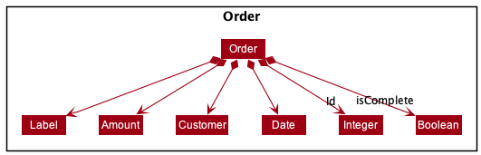

## Table of Contents

- [Acknowledgements](#acknowledgements)
- [Setting up, getting started](#setting-up-getting-started)
- [Design](#design)
    - [Architecture](#architecture)
    - [UI Component](#ui-component)
    - [Logic Component](#logic-component)
    - [Model Component](#model-component)
    - [Storage Component](#storage-component)
    - [Common classes](#common-classes)
- [Implementation](#implementation)
- [Documentation, logging, testing, configuration, dev-ops](#documentation-logging-testing-configuration-dev-ops)
- [Appendix: Requirements](#appendix-requirements)
    - [Product scope](#product-scope)
    - [User stories](#user-stories)
    - [Use cases](#use-cases)
    - [Non-functional Requirements](#non-functional-requirements)
    - [Glossary](#glossary)
- [Appendix: Instructions for manual testing](#appendix-instructions-for-manual-testing)
    - [Launch and shutdown](#launch-and-shutdown)
    - [Deleting a client](#deleting-a-client)
    - [Saving data](#saving-data)

--------------------------------------------------------------------------------------------------------------------

## **Acknowledgements**

* Application logo - Copyright by **[yupiramos](https://www.canva.com/media/MADeEQ5DO1Y)**
* Adapted code - [`formatTotalColumn`](https://stackoverflow.com/a/34924734/13896417) and [`setCloseOnEsc`](https://stackoverflow.com/a/42104595/13896417)

--------------------------------------------------------------------------------------------------------------------

## **Setting up, getting started**

Refer to the guide [_Setting up and getting started_](SettingUp.md).

--------------------------------------------------------------------------------------------------------------------

## **Design**

:bulb: **Tip:** The `.puml` files used to create diagrams in this document can be found in the [diagrams](https://github.com/AY2122S1-CS2103T-W08-3/tp/tree/master/docs/diagrams) folder. Refer to the [_PlantUML Tutorial_ at se-edu/guides](https://se-education.org/guides/tutorials/plantUml.html) to learn how to create and edit diagrams.

### Architecture

The ***Architecture Diagram*** given above explains the high-level design of the App.

Given below is a quick overview of main components and how they interact with each other.

**Main components of the architecture**

**`Main`** has two classes called [`Main`](https://github.com/AY2122S1-CS2103T-W08-3/tp/tree/master/src/main/java/seedu/address/Main.java) and [`MainApp`](https://github.com/se-edu/SalesNote-level3/tree/master/src/main/java/seedu/address/MainApp.java). It is responsible for,
* At app launch: Initializes the components in the correct sequence, and connects them up with each other.
* At shut down: Shuts down the components and invokes cleanup methods where necessary.

[**`Commons`**](#common-classes) represents a collection of classes used by multiple other components.

The rest of the App consists of four components.

* [**`UI`**](#ui-component): The UI of the App.
* [**`Logic`**](#logic-component): The command executor.
* [**`Model`**](#model-component): Holds the data of the App in memory.
* [**`Storage`**](#storage-component): Reads data from, and writes data to, the hard disk.

**How the architecture components interact with each other**

The *Sequence Diagram* below shows how the components interact with each other for the scenario where the user issues the command `delete 1`.

Each of the four main components (also shown in the diagram above),

* defines its *API* in an `interface` with the same name as the Component.
* implements its functionality using a concrete `{Component Name}Manager` class (which follows the corresponding API `interface` mentioned in the previous point.

For example, the `Logic` component defines its API in the `Logic.java` interface and implements its functionality using the `LogicManager.java` class which follows the `Logic` interface. Other components interact with a given component through its interface rather than the concrete class (reason: to prevent outside component's being coupled to the implementation of a component), as illustrated in the (partial) class diagram below.

The sections below give more details of each component.

### UI component

The **API** of this component is specified in [`Ui.java`](https://github.com/AY2122S1-CS2103T-W08-3/tp/tree/master/src/main/java/seedu/address/ui/Ui.java)

The UI consists of a `MainWindow` that is made up of parts e.g.`CommandBox`, `ResultDisplay`, `PersonListPanel`, `StatusBarFooter` etc. All these, including the `MainWindow`, inherit from the abstract `UiPart` class which captures the commonalities between classes that represent parts of the visible GUI.

The `UI` component uses the JavaFx UI framework. The layout of these UI parts are defined in matching `.fxml` files that are in the `src/main/resources/view` folder. For example, the layout of the [`MainWindow`](https://github.com/AY2122S1-CS2103T-W08-3/tp/tree/master/src/main/java/seedu/address/ui/MainWindow.java) is specified in [`MainWindow.fxml`](https://github.com/se-edu/SalesNote-level3/tree/master/src/main/resources/view/MainWindow.fxml)

The `UI` component,

* executes user commands using the `Logic` component.
* listens for changes to `Model` data so that the UI can be updated with the modified data.
* keeps a reference to the `Logic` component, because the `UI` relies on the `Logic` to execute commands.
* depends on some classes in the `Model` component, as it displays `Person` object residing in the `Model`.

### Logic component

**API** : [`Logic.java`](https://github.com/AY2122S1-CS2103T-W08-3/tp/tree/master/src/main/java/seedu/address/logic/Logic.java)

Here's a (partial) class diagram of the `Logic` component:

How the `Logic` component works:
1. When `Logic` is called upon to execute a command, it uses the `SalesNoteParser` class to parse the user command.
1. This results in a `Command` object (more precisely, an object of one of its subclasses e.g., `AddCommand`) which is executed by the `LogicManager`.
1. The command can communicate with the `Model` when it is executed (e.g. to add a client).
1. The result of the command execution is encapsulated as a `CommandResult` object which is returned back from `Logic`.

The Sequence Diagram below illustrates the interactions within the `Logic` component for the `execute("deletetask 1")` API call.

    

:information_source: **Note:** The lifeline for `DeleteTaskCommandParser` should end at the destroy marker (X) but due to a limitation of PlantUML, the lifeline reaches the end of diagram.

Here are the other classes in `Logic` (omitted from the class diagram above) that are used for parsing a user command:

How the parsing works:
* When called upon to parse a user command, the `SalesNoteParser` class creates an `XYZCommandParser` (`XYZ` is a placeholder for the specific command name e.g., `AddCommandParser`) which uses the other classes shown above to parse the user command and create a `XYZCommand` object (e.g., `AddCommand`) which the `SalesNoteParser` returns back as a `Command` object.
* All `XYZCommandParser` classes (e.g., `AddCommandParser`, `DeleteCommandParser`, ...) inherit from the `Parser` interface so that they can be treated similarly where possible e.g, during testing.

### Model component
**API** : [`Model.java`](https://github.com/AY2122S1-CS2103T-W08-3/tp/tree/master/src/main/java/seedu/address/model/Model.java)

Class Diagram of the `Person`'s entity:

Class Diagram of the `Task`'s entity:

Class Diagram of the `Order`'s entity:

The `Model` component,

* stores these three types of data in SalesNote
  * Address book data i.e., all `Person` objects (which are contained in a `UniquePersonList` object).
  * Task book data i.e., all `Task` objects (which are contained in a `UniqueTaskList` object).
  * Order book data i.e., all `Order` objects (which are contained in a `UniqueOrderList` object).

* stores the currently 'selected' `Person`, `Tasks`, and `Orders` objects (e.g., results of a search query) as separate _filtered_ lists which are exposed to outsiders as unmodifiable `ObservableList<Person>`, `ObservableList<Task>` and `ObservableList<Order>` respectively  that can be 'observed' e.g. the UI can be bound to these lists so that the UI automatically updates when the data in the lists change.
* stores a `UserPref` object that represents the user’s preferences. This is exposed to the outside as a `ReadOnlyUserPref` objects.
* does not depend on any of the other three components (as the `Model` represents data entities of the domain, they should make sense on their own without depending on other components)

### Storage component

**API** : [`Storage.java`](https://github.com/AY2122S1-CS2103T-W08-3/tp/tree/master/src/main/java/seedu/address/storage/Storage.java)

How the Storage component works:
* Saves address book data, task book data, sales order book data
  and user preference data in json format, and read them back into corresponding objects.
* The main storage class inherits from all of `AddressBookStorage`, `TaskBookStorage`, `OrderBookStorage`,
  and `UserPrefStorage`, which means it can be treated as either one (if only the functionality of only one is needed).
* Each Book Storage component (`AddressBookStorage`, `TaskBookStorage`, `OrderBookStorage`) has a `JsonSerializable` class which is in charge of converting the model's data into correct json file and retrieving the data from 
  the json file to convert it to a model data.
* Each `JsonSerializable` class implements its own `JsonAdapted` class which specifies methods to convert model Object
  (i.e `Person`, `Task`, `Order`) into json object and vise versa. 
* The `JsonSerializable` class and `JsonAdapted` class also checks the correctness of the json files format, and in the 
  case when any of the format is wrong, it will then throw a `DataConversionException` and  `IllegalValueException`
### Common classes

Classes used by multiple components are in the `seedu.address.commons` package.

--------------------------------------------------------------------------------------------------------------------
## **Implementation - Shawn **

(this division and header is temporary; and is just to demarcate my part of the DG update for this week's requirement)

###`task` and `order` package
This section describes the implementation of the `task` and `order` packages in the application. These two packages are 
similar in functionality to the `person` package, now allowing the user to track tasks and orders. Below is a diagram
showing the partial implementation of these packages in the application:

`OrderList` and `TaskList` manage `Order` and `Task` objects, in the same way a `UniquePersonList` manages `Person`
objects, and there are a few significant points about this implementation.

The first is the distinction between the `Person` class, and the `Customer` class. Since every order is made by 
a customer, and the `Person` class is used to track customers, we initially considered linking the two classes, and tying
every `Order` to a `Person`. However, the issue with this is that we did not want deleting of a `Person` to affect 
sales records, which should continue to show all completed orders. We thus decided instead to create the `Customer` 
class which essentially serves as a field for the `Order` class, implementing validity checks for the input, similar to 
how the `Name` field works for the `Person` class.

The next note is that a `UniquePersonList` has a `AddressBook` wrapper that contains other functionalities needed in
the application (e.g. storage related functions). Our Implementation intends to mirror this with a `TaskBook` and 
`OrderBook` wrapper around `TaskList` and `OrderList` respectively, but this was not handled by me, and hence these 
were omitted from the diagram above.

Finally, as mentioned partially above, the `Amount` `Customer` `Date` and `Label` classes are what handle checking the 
validity of fields, similar to the implementation in the associated classes for Person, and also respect a whole-part 
relationship. The validity checking in all cases was implemented using regular expressions, and they respect the
following guarantees:

`Amount` Begins with 1 or more numbers, followed optionally by a block that consists of a '.' followed by 1 or 2 numbers.

`Customer` Blocks of 1 or more alphanumeric characters, separated by at most one space.

`Date` `Label` Nonempty block of alphanumeric characters of length at most 100 characters. We felt this was a reasonable
length for both fields, and would guarantee the UI display worked the way we intended.'

### Addressing feature flaws

A small and related task I addressed was input validation for customers, and adjusting the way we treated equality 
between person objects. The original AB3 treated two people as equal only if their names were spelt exactly the same, 
with this being case-sensitive. When we discussed this as a group, we decided that multiple clients having the exact same name was rare
enough that this notion of equality made sense. However, we felt it should apply regardless of case, i.e. john doe 
should be recognised as the same person as JOHN DOE. I updated the implementation to take care of this, and also changed
the input validation for `Name` to allow at most one space between blocks of characters.

### Implementing commands

Lastly, I implemented several commands related to the `Task` and `Order` classes. These are fairly self-explanatory, 
and their implementation closely mirrors that of similar commands for the `Person` class. The exception is the marktask
and markorder commands, which allow the user to mark tasks and orders as completed. The list of implemented commands
is below:

* addtask
* deletetask
* listtasks
* marktask
* markorder

--------------------------------------------------------------------------------------------------------------------

## **Implementation**

This section describes some noteworthy details on how certain features are implemented.

### Update Person Changes in Order List and Task List

SalesNote's clients are directly referenced in orders. Any changes in the clients through user commands should be propagated to the Order list.

* When a client is deleted, their orders and the tasks linked to the orders will be deleted as well.
* When a client name is modified, this change will be updated in their existing orders.

#### Execution

The sequence diagram below shows the interaction within the Logic component for a delete command is executed.

1. `DeleteCommand::execute` is called and deletes the client from the list.
2. Related orders are obtained by matching the client's name and the customer of the existing orders.
3. Tasks linked to the orders and the orders themselves are deleted.

![Interactions Inside the Logic Component for the `edit 1 n/[new name]` command ](images/EditSequenceDiagram.png)

1. `EditCommand::execute` is called and the client's details are modified.
2. Related orders are obtained by matching the client's **old** name and the customer of the existing orders.
3. The related orders' customer's name are updated.

#### Result
The changes in person objects are updated in their order and task objects.

### Sort orders by amount feature

The feature sorts all the orders in the addressbook by their amount in descending order. 

To ensure that the orders can be sorted, both `Order` and its attribute `Amount` implement the `Comparable` interface. 
Order uses its `id` field to produce the default ordering of the `OrderList`. 

{to be completed}

### Display client's total orders feature

The feature displays the total orders for all clients except those without orders in a new window. 
Its mechanism is a mix of the mechanisms for `MainWindow` and `HelpWindow`.

Similar to `help` and `exit`, `CommandResult` has a dedicated `boolean` field to indicate whether the command is a 
`totalorders` command. There is also a dedicated method to handle `totalorders` command in `MainWindow` class.
By calling this method, the data of total orders is reloaded similar to loading other data (`Client/Task/Order`) in the Main Window, i.e. 
through the `Logic` component. After reloading data, that method shows or focuses the total orders window similar to that of the 
help window.

#### Execution

The sequence diagram below shows the interaction within the `UI` component when a `totalorders` command is executed.

The sequence diagram below shows the interaction within the `Logic` component when the `UI` component calls 
`execute("totalorders")`. Note that there is no need to have a `TotalOrdersCommandParser`. This is because the 
`SalesNoteParser` can directly create and return a `TotalOrdersCommand`, similar to that of `help` and `exit` commands.  

--------------------------------------------------------------------------------------------------------------------

## **Documentation, logging, testing, configuration, dev-ops**

* [Documentation guide](Documentation.md)
* [Testing guide](Testing.md)
* [Logging guide](Logging.md)
* [Configuration guide](Configuration.md)
* [DevOps guide](DevOps.md)

--------------------------------------------------------------------------------------------------------------------

## **Appendix: Requirements**

### Product scope

**Target user profile**:

* has a need to manage a significant number of clients
* prefer desktop apps over other types
* can type fast
* prefers typing to mouse interactions
* is reasonably comfortable using CLI apps
* needs help managing tasks
* needs help keeping financial record of sales

**Value proposition**: lightweight application that helps manage contacts faster than a typical mouse/GUI driven app, 
and provides simple but helpful features to assist with managing a business.

### User stories

Priorities: High (must have) - `* * *`, Medium (nice to have) - `* *`, Low (unlikely to have) - `*`

| Priority | As a …​                                    | I want to …​                     | So that I can…​                                             |
| -------- | ------------------------------------------ | ------------------------------ | ---------------------------------------------------------------------- |
| `* * *`  | user                                       | add a deadline to a sales order                            | I can keep track of when I must complete it by  |
| `* * *`  | user                                       | keep track of the contact details of my clients            |it is easier to find their contact details      |
| `* * *`  | user                                       | maintain the preferences and body dimensions of my clients | I can cater to their requirements |
| `* * *`  | user                                       | mark tasks as done                                         |        |
| `* * *`  | user                                       | key customer orders into the application                   | I know what I need to complete   |
| `* * *`  | user                                       | delete a task                                              | get rid of task no longer needed to track       |
| `* * *`  | user                                       | know the valid commands when I key in the wrong command    | to help me remember what I should do     |
| `* * *`  | new user                                   | categorise my customers, to group them by categories relevant to me     | I can find the group of customers that I want easily   |
| `* * *`  | non-tech-savvy user                        | add users in a simple and straightforward way              | I can get up to speed easily   |
| `* * *`  | user                                       | easily update contact details as these are likely to change over time.  | I can get up to speed easily   |
| `* * *`  | forgetful user                             | have reminders about deadlines                             | I am on track with my work   |
| `* * *`  | user                                       | know how much in total sales each of my customers has brought in for me  |      |
| `* * `   | user                                       | track how much money I’m making each month                 | I can plan my budget accordingly    |
| `* * `   | experienced user                           | clear past entries                                         | the application is less cluttered   |
| `* * `   | user                                       | sort my deadlines by date                                  | I can keep track of which are the most urgent.   |
| `* * `   | user                                       | add notes to tasks                                         | I can add details about special requests or notes for myself, for tasks that might be more difficult and/or take up more time  |
| `* * `   | user                                       | update the requirements of my clients as their needs and preferences change | I am aware of their latest preference |
| `* * `   | new user                                   | have a tutorial to guide my on how to use the product      | I can get myself started   |
| `* * `   | user with poor eyesight                    | the text in the interface to be easily readable            |    |
| `* * `   | experienced user                           | the application to be fast and easy                        |    |
| `* * `   | user                                       | keep track of the sales                                    | I don’t have to remember them   |
| `*`      | user                                       | keep track of outstanding payments                         |    |
| `*`      | user                                       | know the breakdown of my sales each month                  | to understand better which of my products are more popular   |
| `*`      | user                                       | backup/undo my actions                                     | I can recover my lost data easily    |
| `*`      | experienced user                           | sort my clients by how much in sales they have brought in for me | I can focus more on clients that brings me more profit   |
| `*`      | skilled user                               | define my own shortcuts for commands                       |       |
| `*`      | user who is picky about UI                 | redesign aspects of the application.                       |       |
| `*`      | user                                       | know how much I spent on materials                         | I don’t exceed my budget      |
| `*`      | secure my data/information                 | secure my data/information                                 |     |
| `*`      | experienced user                           | use the app to track my material usage                     | I know when to order more in advance   |

### Use cases

(For all use cases below, the **System** is the `SalesNote` and the **Actor** is the `user`, unless specified otherwise)

#### Use case: Add a client

**MSS**

1. User requests to add a specific client to the list
2. SalesNote adds the client

    Use case ends.

**Extensions**

* 1a. The format of the request is invalid.

    * 1a1. SalesNote shows an error message.
    
      Use case ends.

#### Use case: Delete a client

**MSS**

1.  User requests to list clients
2.  SalesNote shows a list of clients
3.  User requests to delete a specific client in the list
4.  SalesNote deletes the client

    Use case ends.

**Extensions**

* 2a. The list is empty.

  Use case ends.

* 3a. The given index is invalid.

    * 3a1. SalesNote shows an error message.

      Use case resumes at step 2.
    
#### Use case: Add a task

**MSS**

1. User requests to add a specific task to the list
2. SalesNote adds the task

   Use case ends.

**Extensions**

* 1a. The format of the request is invalid.

    * 1a1. SalesNote shows an error message.

      Use case ends.

#### Use case: Delete a task

**MSS**

1.  User requests to list tasks
2.  SalesNote shows a list of tasks
3.  User requests to delete a specific task in the list
4.  SalesNote deletes the task

    Use case ends.

**Extensions**

* 2a. The list is empty.

  Use case ends.

* 3a. The given index is invalid.

    * 3a1. SalesNote shows an error message.

      Use case resumes at step 2.

#### Use case: Add an order

**MSS**

1. User requests to add a specific order to the list
2. SalesNote adds the order

   Use case ends.

**Extensions**

* 1a. The format of the request is invalid.

    * 1a1. SalesNote shows an error message.

      Use case ends.

#### Use case: Delete an order

**MSS**

1.  User requests to list orders
2.  SalesNote shows a list of orders
3.  User requests to delete a specific order in the list
4.  SalesNote deletes the order

    Use case ends.

**Extensions**

* 2a. The list is empty.

  Use case ends.

* 3a. The given index is invalid.

    * 3a1. SalesNote shows an error message.

      Use case resumes at step 2.

*{More to be added}*

### Non-Functional Requirements

1. Should work on any _mainstream OS_ as long as it has Java `11` or above installed.
2. Should be able to hold up to 1000 clients without a noticeable sluggishness in performance for typical usage.
3. A user with above average typing speed for regular English text (i.e. not code, not system admin commands) should be able to accomplish most of the tasks faster using commands than using the mouse.
4. Currency amounts, dates, and times should follow Singapore standards.

*{More to be added}*

### Glossary

* **Mainstream OS**: Windows, Linux, Unix, OS-X
* **Client**: A customer in the database, identified by their name. 
* **Order**: A sales order from a customer scheduled for a target date.
* **Task**: A task for the user that has a due date and a completion status.

--------------------------------------------------------------------------------------------------------------------

## **Appendix: Instructions for manual testing**

Given below are instructions to test the app manually.

:information_source: **Note:** These instructions only provide a starting point for testers to work on;
testers are expected to do more *exploratory* testing.

### Launch and shutdown

1. Initial launch

   1. Download the jar file and copy into an empty folder

   1. Double-click the jar file Expected: Shows the GUI with a set of sample contacts. The window size may not be optimum.

1. Saving window preferences

   1. Resize the window to an optimum size. Move the window to a different location. Close the window.

   1. Re-launch the app by double-clicking the jar file. 
       Expected: The most recent window size and location is retained.

1. _{ more test cases …​ }_

### Deleting a client

1. Deleting a client while all clients are being shown

   1. Prerequisites: List all clients using the `list` command. Multiple clients in the list.

   1. Test case: `delete 1` 
      Expected: First contact is deleted from the list. Details of the deleted contact shown in the status message. Timestamp in the status bar is updated.

   1. Test case: `delete 0` 
      Expected: No client is deleted. Error details shown in the status message. Status bar remains the same.

   1. Other incorrect delete commands to try: `delete`, `delete x`, `...` (where x is larger than the list size) 
      Expected: Similar to previous.

1. _{ more test cases …​ }_

### Saving data

1. Dealing with missing/corrupted data files

   1. _{explain how to simulate a missing/corrupted file, and the expected behavior}_

1. _{ more test cases …​ }_
