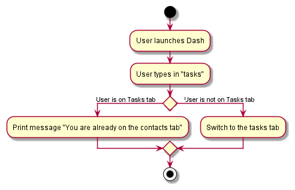
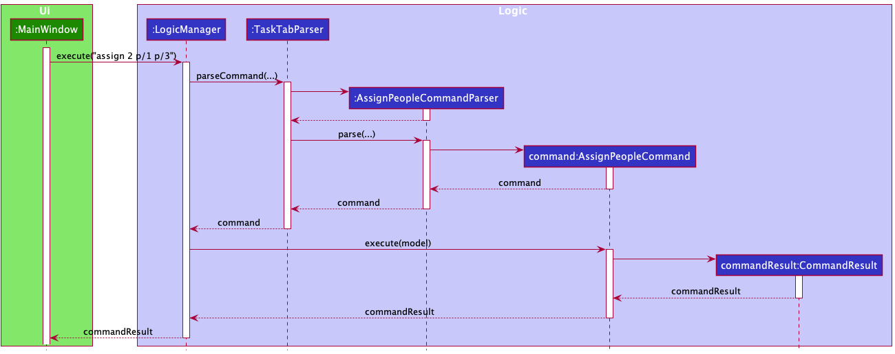

* Table of Contents
{:toc}

--------------------------------------------------------------------------------------------------------------------

## **Acknowledgements**

Dash is adapted from AddressBook Level 3 (or AB3 for short), a sample project for software engineering students
provided by [SE-EDU](https://se-education.org/). AB3 initially encompassed 6 KLoC and included a reasonable level of 
user and developer documentation. In developing Dash, we expanded the code base to 11 KLoC and made large updates to 
the User Guide and Developer Guide.

--------------------------------------------------------------------------------------------------------------------

## **Setting up, getting started**

Refer to the guide [_Setting up and getting started_](SettingUp.md).

--------------------------------------------------------------------------------------------------------------------

## **Design**

:bulb: The `.puml` files used to create diagrams in this document can be found in the 
[diagrams](https://github.com/AY2122S1-CS2103T-W15-2/tp/tree/master/docs/diagrams) folder. 
Refer to the [_PlantUML Tutorial_ at se-edu/guides](https://se-education.org/guides/tutorials/plantUml.html) to learn 
how to create and edit diagrams.

### Architecture

The ***Architecture Diagram*** given above explains the high-level design of the App.

Given below is a quick overview of main components and how they interact with each other.

**Main components of the architecture**

**`Main`** has two classes called 
[`Main`](https://github.com/AY2122S1-CS2103T-W15-2/tp/blob/master/src/main/java/dash/Main.java) and 
[`MainApp`](https://github.com/AY2122S1-CS2103T-W15-2/tp/blob/master/src/main/java/dash/MainApp.java). 

It is responsible for:

* At app launch: Initializes the components in the correct sequence, and connects them up with each other.
* At shut down: Shuts down the components and invokes cleanup methods where necessary.

[**`Commons`**](#common-classes) represents a collection of classes used by multiple other components.

The rest of the App consists of four components:

* [**`UI`**](#ui-component): The UI of the App.
* [**`Logic`**](#logic-component): The command executor.
* [**`Model`**](#model-component): Holds the data of the App in memory.
* [**`Storage`**](#storage-component): Reads data from, and writes data to, the hard disk.

**How the architecture components interact with each other**

The sequence diagram below shows how the components interact with each other for the scenario where the user issues 
the command `delete 1`.

Each of the four main components (also shown in the diagram above):

* defines its *API* in an `interface` with the same name as the Component.
* implements its functionality using a concrete `{Component Name}Manager` class (which follows the corresponding API 
  `interface` mentioned in the previous point.

For example, the `Logic` component defines its API in the `Logic.java` interface and implements its functionality using 
the `LogicManager.java` class which follows the `Logic` interface. Other components interact with a given component 
through its interface rather than the concrete class (reason: to prevent outside component's being coupled to the 
implementation of a component), as illustrated in the (partial) class diagram below.

The sections below give more details of each component.

### UI component

The **API** of this component is specified in 
[`Ui.java`](https://github.com/AY2122S1-CS2103T-W15-2/tp/blob/master/src/main/java/dash/ui/Ui.java).

The UI consists of a `MainWindow` that is made up of parts e.g.`CommandBox`, `ResultDisplay`, `TabMenu`, 
`StatusBarFooter` etc. 
The `TabMenu` component utilises JavaFx's TabPane to implement the tab system. The `TabMenu` is then broken up into 3 
tabs: the contacts, tasks and help tab. 
The contacts tab comprises `PersonListPanel`.
The tasks tab comprises `TaskListPanel` and `PersonListPanelMinimal`.
The help tab comprises `HelpPanel`.
All these, including the `MainWindow`, inherit from the abstract `UiPart` class which captures the commonalities 
between classes that represent parts of the visible GUI.

The `UI` component uses the JavaFx UI framework. The layout of these UI parts are defined in matching `.fxml` files 
that are in the `src/main/resources/view` folder. For example, the layout of the 
[`MainWindow`](https://github.com/AY2122S1-CS2103T-W15-2/tp/blob/master/src/main/java/dash/ui/MainWindow.java) 
is specified in 
[`MainWindow.fxml`](https://github.com/AY2122S1-CS2103T-W15-2/tp/blob/master/src/main/resources/view/MainWindow.fxml).

The `UI` component:

* executes user commands using the `Logic` component.
* listens for changes to `Model` data so that the UI can be updated with the modified data.
* keeps a reference to the `Logic` component, because the `UI` relies on the `Logic` to execute commands.
* depends on some classes in the `Model` component, as it displays the `Person` and `Task` objects residing in the 
  `Model`.

### Logic component

**API** : [`Logic.java`](https://github.com/AY2122S1-CS2103T-W15-2/tp/blob/master/src/main/java/dash/logic/Logic.java)

Here's a (partial) class diagram of the `Logic` component:

How the `Logic` component works:

1. When `Logic` is called upon to execute a command, it uses the respective tab parser to parse the command
   - `ContactsTabParser` while on the contacts tab
   - `TaskTabParser` while on the tasks tab
   - `HelpTabParser` while on the help tab
1. This results in a `Command` object (more precisely, an object of one of its subclasses e.g., `AddPersonCommand`) 
   which is executed by the `LogicManager`.
1. The command can communicate with the `Model` when it is executed (e.g. to add a person).
1. The result of the command execution is encapsulated as a `CommandResult` object which is returned back from `Logic`.
1. If a command execution is successful, the user input corresponding to the command is added to the `Model`.

The sequence diagram below illustrates the interactions within the `Logic` component for the `execute("delete 1")` API 
call while on the contacts tab.

:information_source: **Note:** The lifeline for `DeleteTaskCommandParser` should end at the destroy marker (X) but due 
to a limitation of PlantUML, the lifeline reaches the end of the diagram.

Here are the other classes in `Logic` (omitted from the class diagram above) that are used for parsing a user command:

How the parsing works:

* When called upon to parse a user command, the relevant tab parser (e.g. `ContactsTabParser`) class creates an 
  `XYZCommandParser` (`XYZ` is a placeholder for the specific command name e.g., `AddTaskCommandParser`) which uses the 
  other classes shown above to parse the user command and create a `XYZCommand` object (e.g., `AddTaskCommand`) which 
  the tab parser returns back as a `Command` object.
* All `XYZCommandParser` classes (e.g., `AddTaskCommandParser`, `DeleteTaskCommandParser`, ...) inherit from the 
  `Parser` interface so that they can be treated similarly where possible e.g, during testing.
* Some parsers require the use of the filtered person list, and they extend `ParserRequiringPersonList` instead.

Here are the remaining classes in logic, mainly utility classes:

### Model component

**API** : [`Model.java`](https://github.com/AY2122S1-CS2103T-W15-2/tp/blob/master/src/main/java/dash/model/Model.java)

The `Model` component:

* stores the contacts' data i.e., all `Person` objects (which are contained in a `UniquePersonList` object).
* stores the task list data i.e., all `Task` objects  (which are contained in a `TaskList` object).
* stores the currently 'selected' `Person` or `Task` objects (e.g., results of a search query) as separate _filtered_ 
  lists which are exposed to outsiders as unmodifiable `ObservableList<Person>` or `ObservableList<Task>` that can be 
  'observed' e.g. the UI can be bound to this list so that the UI automatically updates when the data in the list 
  change.
* stores a `UserPref` object that represents the user’s preferences. This is exposed to the outside as a 
  `ReadOnlyUserPref` objects.
* stores a `UserInputList` object that represents the user's past 10 valid inputs (i.e. resulted in successful command 
  execution).
* does not depend on any of the other three components (as the `Model` represents data entities of the domain, they 
  should make sense on their own without depending on other components)

### Storage component

**API** : [`Storage.java`](https://github.com/AY2122S1-CS2103T-W15-2/tp/blob/master/src/main/java/dash/storage/Storage.java)

The `Storage` component:

* can save user preference data, address book data, task list data, and past user input data in json format
* can read json files containing the above data back into objects
* inherits from `UserPrefsStorage`,`AddressBookStorage`, `TaskListStorage` and `UserInputListStorage`, which means it 
  can be treated as any one of these interfaces.
* depends on some classes in the `Model` component (because the `Storage` component's job is to save/retrieve objects 
  that belong to the `Model`)

### Common classes

Classes used by multiple components are in the `seedu.addressbook.commons` package.

--------------------------------------------------------------------------------------------------------------------

## **Implementation**

This section describes some noteworthy details on how certain features are implemented.

### \[Implemented\] Tabs System

#### Implementation
The tab system is implemented using the JavaFX `javafx.scene.control.Tab` class. It is
encapsulated in its own class `TabMenu` within the `dash.ui` package as a UI component.

Additionally, it expands the number of parsers from `ContactsTabParser` to have a `TasksTabParser` 
and `HelpTabParser` to allow for a different list of commands to be parsed per tab/page.

The following commands are implemented:
* `SwitchTabContactsCommand`
* `SwitchTabTasksCommand`
* `SwitchTabHelpCommand`

The following operations are implemented:
* `MainWindow#handleHelp()`
* `MainWindow#handleSwitchContactsTab()`
* `MainWindow#handleSwitchTasksTab()`
These operations handle the switching of tabs within the MainWindow class.

Here is an example of how the tab system works:

Step 1: The user launches the application. By default, the contacts
tab will be shown. 

Step 2: The user adds a contact by using the `add` command. The `LogicManager` object is passed the command and
parses the command using the `ContactsTabParser` since it is on the contacts page and hence uses the contacts parser.

Step 3: The user decides to switch to the task tab by entering the command: `task`. The command follows a similar
path like in Step 2.

Step 4: The commandResult object returned after execution indicates that the user wants to switch to the Task tab and 
the method `handleSwitchTasksTab()` is called.

Step 5: The method first calls the `switchTab()` method within `TabMenu`, which directs the UI 
to switch to the selected tab index (1 for the Tasks tab). Then, it calls `setTabNumber` within `LogicManager` so
the `LogicManager` can keep track of the current tab, and use 1 out of the 3 parsers to fit the tab the user is on.

Step 6: The user attempts to add a contact by using the same `add` command. However, since Step 5 has recorded the tab
number inside `LogicManager` to be 1, the `LogicManager` detects that the user is still on the Task tab and hence uses 
the `TaskTabParser` to parse the `add` command. 

Step 7: The `TaskTabParser` returns an `AddTaskCommand` instead of an `AddPersonCommand`.

The following sequence diagram shows how the switch tab system works when the command `task` is entered on the Contacts
Tab:

The following activity diagram summarises what happens when a user executes a switch tab command:

#### Design considerations:

**Aspect: How switching tabs execute:**

* **Alternative 1 (current choice):** Uses the JavaFX implementation of tabs.
    * Pros: Easy to implement.
    * Cons: Have to disable clicking of tabs because clicking in JavaFX has a different
            implementation to how the Logic component parses commands.

* **Alternative 2:** One single panel/list that changes/updates its displayed list depending on 
user choice.
    * Pros: Lesser dependence on JavaFX components.
    * Cons: Not very scalable in case more tabs are needed in the future, hard to implement multiple segments
            within a tab.

### \[Implemented\] Assigning People to Tasks

We integrated the existing address book system of storing contacts with our new task list system by adding the ability
to assign people from your address book to tasks in your task list.   
Possible use cases:
- Assigning group members to group tasks to keep track of who to contact.
- Assigning people who have RSVPed to a gathering to keep track of who is attending.
- Assigning which prof to email after completing a piece of work.

#### Implementation
In the `Task.java` class, `people` is a Set of `Person` objects that represents a task being assigned people, similar to
`tags`. A user can assign people to a task in 2 ways:
- The `assign` command, which adds more `Person` objects to the existing `people` set.
- The `edit` command, which replaces the existing `people` set with a new one. 

The `Person` objects are assigned to a task using the relevant index currently being displayed on the filtered person 
list. All indices that represent people are preceded with the `p/` prefix. We added the side panel on the tasks tab 
so that it would be easier to see the list of contacts to assign people to tasks, instead of needing to switch tabs 
back and forth when assigning people.
Example usage of either command is as follows:
- `assign 2 p/1 p/3` - Assigns persons 1 and 3 to task 2.
- `edit 2 p/1 p/3` - Replaces task 2's set of people with a set consisting of persons 1 and 3.

A sequence diagram is provided below:

#### Challenges  

This was the first set of commands that required access to the address book, so implementing the parser for the 
commands simply by implementing the `Parser` interface was not sufficient. An extension to the `Parser`
interface, `ParserRequiringPersonList` was created for these commands specifically, and an alternative parse function
was created which took in the person list from the command parser `TaskTabParser`.

#### Alternatives Considered  

- Assigning people using their names instead of index

Pros: No need to remember indices  
Cons: Too much of a hassle with long names, and using only parts of a name was not feasible due to
the possibility of multiple people with the same first name, etc. The side panel was implemented to circumvent
this problem

### \[Implemented\] Adding Date/Time to Tasks

To add onto our new task list system, just like how the address book allows storing of additional information like
phone number and email, the user can now add in a task's date with an optional time information. The addition of
date/time as a new type of information to be stored opens the door to more functionalities such as listing upcoming
tasks and finding tasks based on date/time.

Possible use cases:
- Adding date/time of a task that is due at the specified date and time.
- Adding date/time of a task that the user wants to start working on at the specified date and time.

#### Implementation

The `TaskDate.java` class is created to represent a date/time object of a task, which is stored inside a `Task` object
upon creating a `Task` through an `add` command. Inside `TaskDate.java` class, date and time are represented by Java 
class objects `LocalDate` and `LocalTime`. As the user can choose to either omit both date and time or have time as optional
information, both of these objects are wrapped in Java `Optional` objects as `Optional<LocalDate>` and `Optional<LocalTime>`.
This makes handling of a `TaskDate` object safer as the date and time objects do not exist in a `TaskDate` of a `Task` which
the user adds in without stating date/time information. 

When the user states the time of a task only, this will be detected in the constructor of `TaskDate` and the current date will
be stored instead through the use of `LocalDate#now`. When the user states the date of a task only, this will also be detected 
in the constructor and time will be left as empty.

The user is also required to follow a specific date and time format which the validity is checked by `DateTask#isValidTaskDate`.
Java `LocalDate#parse` and `LocalTime#parse` are used to help verify validity of the format keyed in by the user.

Example usage of `add` command to add date/time is as follows:
- `add d/Homework dt/21/11/2021` - Adds a task "Homework" that is due on 21/11/2021 at an unspecified time.
- `add d/Tutorial dt/1600` - Adds a task "Tutorial" that starts at 4:00 PM with date as that current day.
- `add d/Event dt/25/10/2021, 10:00 AM` - Adds a task "Event" that starts at the given date and time.

A sequence diagram is provided below that shows how TaskDate class works when the command "add d/Homework dt/21/11/2021"
is entered. The details of the **create Task** interactions have been omitted from the diagram for clarity:

The omitted details are shown below in a separate sequence diagram:

The following activity diagram summarises what happens when a user executes an add command with date and/or time:

#### Design considerations:

**Aspect: How to store date and time in TaskDate:**

* **Alternative 1 (current choice):** Uses `LocalDate` and `LocalTime` to store date and time respectively.
    * Pros: More flexibility and better abstraction as both can be handled separately. Less complex to implement.
    * Cons: More methods and code are needed to handle the different types of Object separately which results in 
            methods with similar code.

* **Alternative 2:** Uses `LocalDateTime` to store date and time together.
    * Pros: Less code and methods to handle one Object type and it also results in easier implementation of
            comparison methods between two `LocalDateTime` objects.
    * Cons: Less flexibility and more tedious to check different combinations of DateTime formats.

#### Challenges

`TaskDate` class was initially implemented with only `add` command in mind but there were some changes that had to be made
when `edit` command was implemented to allow editing of date and time. There are several cases to consider when a task has
to be edited.

- Case 1: A task has no date and no time.
- Case 2: A task has date only.
- Case 3: A task has date and time.

Keep in mind the special condition that a task cannot have a time without a date. Editing a task's date/time also has 3 cases,
where a user can input date only, time only, or both at once. 

In the first case, no problem is encountered as all the 3 possible types of inputs result in successful outcomes when editing
a task with no date or time. When only date is input in the `edit` command, the edited task will now have the input date. When
only time is input, the edited task will now have the input time and current date. When both are input, the edited task will now have
both of the input date and time.

In the second case however, a problem is encountered when only time is input in the `edit` command. With the initial implementation of
the constructor of `TaskDate`, this will result in the edited task having the current date and the input time. This is an undesirable side
effect where the current date overwrites the existing date of the task to be edited. There are no issues with other two possible input types.

In the third case, there is also a problem encountered when only time is input in the `edit` command. Similar to the second case, this will
result in the current date overwriting the existing date of the task to be edited.

To differentiate between an `edit` command and `add` command involving `TaskDate`, a new boolean argument was added to `ParserUtil#parseTaskDate`.
This boolean is propagated down as another additional argument of `TaskDate` constructor and using that, a new `TaskDate` will be created without
using `LocalDate#now` if it is used for editing purposes. 

### \[Implemented\] Viewing all Upcoming Tasks

With the implementation of `TaskDate.java`, we can easily look up upcoming tasks by comparing dates and times.

#### Implementation
In `UpcomingTaskCommand.java`, a field of type `Predicate<Task>` named `TaskDateAfterCurrentDatePredicate` is used to 
encapsulate the logic of determining whether or not a task is upcoming. It contains fields that store the current date 
and time via `LocalDateTime.now()`, and the current date via `LocalDate.now()`. The overridden 
`Predicate#test(Task task)` method first filters out completed tasks. It then checks if the `task.TaskDate` object has 
a date, then if it has a date but no time, and finally whether it has both date and time.

When `UpcomingTaskCommand.execute(Model model)` is called by `LogicManager`, 
`Model#sortTaskList()` is called which sorts the task list chronologically, with the use of a `Comparator` to define 
an ordering between tasks by comparing `TaskDates`. `UpcomingTaskCommand` then calls
`Model#updateFilteredTaskList(Predicate<Task> predicate)`, which filters out the upcoming tasks and updates the viewable
`ObservableList<Task>`. 

The user is then able to view their upcoming tasks, in chronological order.

A sequence diagram is provided below:

#### Alternative Considered and Design Considerations
* Changing the syntax of the `upcoming` command to include a number i.e. `upcoming 7` to indicate upcoming tasks in the 
  next 7 days.
  * Pros: More specific, limits the scope of viewable tasks which would help usability.
  * Cons: Not immediately clear what unit of time the number would represent. 
    On one hand, it would be too limiting if we as developers decided the unit of time, and on the other hand it would 
    be too clunky to have the user define it themselves. 
    
  * Conclusion: It was decided that implementing sort functionality into the `upcoming` command would sufficiently 
    improve its usability, without imposing unnecessarily longer syntax upon the user, which would decrease the speed at
    which they would be able to operate. This would go against Dash's primary design goal of prioritizing speed.
    

### \[Implemented\] Using the Up/Down Arrow Keys to Select Previous User Inputs

An implemented improvement to the text-based input method is to allow users to easily reenter previously inputted 
commands by retrieving their past inputs to the CLI using the up and down arrow keys. We feel that this is a subtle 
feature which greatly improves the speed and usability of the app.

Suppose the user is on the Tasks tab. The following activity diagram illustrates a possible workflow for a user 
entering tasks, and shows how the workflow is enhanced by this feature.

A concrete example would be when a user wants to add two tasks with descriptions "CS2100 Tutorial 7" and "CS2100 
Tutorial 8" to their task List. Instead of typing out a near-identical command for the second task, they could press 
the up arrow key, access their previously entered commmand and change '7' to '8'. 

Another example use case would be when a user accidentally deletes an entry in Dash by entering the wrong index. As 
long as the entry was added within the past 10 commands, the user can press the up arrow key until the command that 
corresponds to adding that entry is set in the command box. The user can then simply press enter to add the entry again.

#### Implementation

The implementation involves adding a new class `UserInputList` to `Model`. When a user enters an input in the command 
box, the `UserInputList` is updated in `LogicManager` if this user input results in a valid command execution. The 
following sequence diagram shows how the `UserInputList` is updated when the valid input `help` is entered while not
already on the help tab. It also shows how `Storage` is updated. Details related to command parsing and execution are 
omitted.

Since the storage of the`UserInputList` is very similar to the storage of the `TaskList` and `AddressBook`, 
implementation details are not shown above. In summary, when the app is started, a `UserInputList` is constructed using 
the `userinputlist.json` file in the `data` folder. Conversely, when the app is closed, the `userinputlist.json` file 
is updated using the `UserInputList`.

On startup and after any successful command execution, the `CommandBox` is reinitialised with an updated list of user 
input strings from the `Model`. 

In order to allow the user to look through their past inputs to select a particular one, we must keep track of which 
input string the CLI is currently displaying. This is implemented in `CommandBox` by keeping track of the index of the 
string being displayed within the list of input strings. When the up or down arrow keys are pressed, `CommandBox` 
increments or decrements the index, retrieves the new string corresponding to it, and displays it.

#### Alternatives Considered and Design Considerations

- Keeping track of different lists of user inputs for different tabs

We decided against keeping track of different lists of user inputs corresponding to commands on different tabs. We 
judged the benefits of this feature to be minimal and not worth the extra complexity in `Model` and `Storage`. 
Moreover, we would have to make an arbitrary decision on where to store the user inputs corresponding to switching 
tabs.
  
- Storing the index of the list in `Model`

Due to the fact that the index should reset between uses of the app, we decided that there is not need to store the 
index of the currently in-focus user input in `Model` or `Storage`. The index can safely be reset to 0 upon input of a 
command or upon opening the app. 
  
- Storing user inputs that are invalid

We decided not to store user inputs that are invalid due to the current behaviour of the text box: when an invalid 
input is entered, the input remains in the text box with a red font. In the case of a typo, since the user can easily 
modify this previous input, there seems to be no need to store it.

- Storing more user inputs

The current implementation only stores 10 past user inputs. We decided to put a cap on the number of inputs stored due 
to concerns about performance when the user input list is updated. This cap is set in `UserInputList` as 
`LIST_MAX_LENGTH`. If, in testing, we find that a higher cap could be more convenient for users, this value can easily 
be changed.

--------------------------------------------------------------------------------------------------------------------

## **Documentation, logging, testing, configuration, dev-ops**

* [Documentation guide](Documentation.md)
* [Testing guide](Testing.md)
* [Logging guide](Logging.md)
* [Configuration guide](Configuration.md)
* [DevOps guide](DevOps.md)

--------------------------------------------------------------------------------------------------------------------

## **Appendix: Requirements**

### Product scope

**Target user profile**:

* A university student,
  * University students generally have different types of tasks they need to organize and deadlines to keep track of
  * University students have many contacts from various places such as modules, CCAs, etc, that they would like to 
    organize better

* On his laptop/computer very often,
  * Typing is mainly an advantage with a physical keyboard
  * Some students may choose to avoid using their mobile phone often to avoid distractions

* A person who prefers/is more skilled at typing,
  * Typing is only faster with experience
  * Tasks and deadlines are easier to be specified with typing, instead of clicking through multiple options with a 
    laptop trackpad
  * Students may encounter situations where they need to take down tasks or contacts very quickly (e.g. during a 
    lecture or tutorial)

**Value proposition**:
 * Manage contacts and tasks faster than a typical mouse/GUI driven app.

### User stories

| Priority | As a(n) ...                                | I want to ...                                 | So that I can ...                                               |
|----------|--------------------------------------------|-----------------------------------------------|-----------------------------------------------------------------|
| * * *    | user who prefers typing                    | use a CLI over a GUI                          | be faster and efficient in using the app                        |
| * * *    | user                                       | add contacts                                  | store them for later reference                                  |
| * * *    | user                                       | delete contacts                               | remove contacts when I want to                                  |
| * * *    | user                                       | view all contacts                             | keep track of all my contacts                                   |
| * * *    | user                                       | edit contacts                                 | change them later when my contacts update their contact details |
| * * *    | user                                       | tag contacts                                  | keep track of who they are                                      |
| * * *    | new user                                   | view a list of available commands             | refer to them easily                                            |
| * * *    | user                                       | add tasks                                     | record the tasks I need to do                                   |
| * * *    | user                                       | delete tasks                                  | clear my list of tasks if it gets too cluttered                 |
| * * *    | user                                       | view all tasks                                | see all the tasks I have at the moment                          |
| * * *    | user                                       | edit tasks                                    | keep track of changing real-life requirements                   |
| * * *    | user                                       | mark a task as completed                      | keep track of which tasks I have completed                      |
| * *      | stressed student with many tasks to handle | view all upcoming tasks                       | see which tasks are most urgent                                 |
| * *      | lazy student                               | go back to previously used full command lines | waste less time typing the lines all over again                 |
| * *      | student with many contacts                 | assign contacts to tasks                      | keep track of who is involved with which tasks                  |
| * *      | student with many CCAs                     | tag tasks with CCA tags                       | easily identify what I need to do for a particular CCA          |
| * *      | student taking many modules                | tag tasks with module tags                    | easily identify what I need to do for a particular module       |
| * *      | organized student                          | clear all completed tasks                     | declutter and focus on the tasks I have yet to complete         |

### Use cases

(The System is Dash and the Actor is the user for all Use Cases, unless specified otherwise.)

#### Use case 01: Add a task

Preconditions: Dash is launched and user is on tasks tab

<u>MSS:</u>

1. User requests to add a task, specifying task information
2. Dash adds task to the list and shows the updated task list

Use case ends.

<u>Extensions:</u>

* 1a. Incorrect syntax is used
  * 1a1. Dash shows an error message

Use case resumes at step 1.

* 1b. User inputs an invalid person index
  * 1b1. Dash shows an error message

Use case resumes at step 1.  

#### Use case 02: Delete a task

Preconditions: Dash is launched and user is on tasks tab

<u>MSS:</u>

1. User requests to delete a task, specifying the index to be deleted
2. Dash deletes the task and shows the updated task list

Use case ends.

<u>Extensions:</u>

* 1a. The given index is invalid
  * 1a1. Dash shows an error message

Use case resumes at step 1.

* 1b. Incorrect syntax is used
  * 1b1. Dash shows an error message
    
Use case resumes at step 1.

#### Use case 03: Edit a task

Preconditions: Dash is launched and user is on tasks tab

<u>MSS:</u>

1. User inputs the task index to be edited, specifying updated information for the task
2. Dash edits the task with the provided information and shows the updated task list

Use case ends.

<u>Extensions:</u>

* 1a. The given index is invalid
   * 1a1. Dash shows an error message

Use case resumes at step 1.

* 1b. Incorrect syntax is used
    * 1b1. Dash shows an error message

Use case resumes at step 1.

* 1c. User did not provide at least 1 field to be edited
    * 1c1. Dash shows an error message

Use case resumes at step 1.

#### Use case 04: View all tasks

Precondition: Dash is launched and user is on tasks tab

<u>MSS:</u>

1. User requests to show all tasks
2. Dash shows a list of all tasks

Use case ends.

#### Use case 05: Add a contact

Preconditions: Dash is launched and user is on contacts tab

<u>MSS:</u>

1. User requests to add a contact, specifying contact information
2. Dash adds contact to the list and shows the updated contact list

Use case ends.

<u>Extensions:</u>

* 1a. Incorrect syntax is used
    * 1a1. Dash shows an error message

Use case resumes at step 1.

* 1b. User tries to add a contact with the same name as an existing contact in the contact list
  * 1b1. Dash shows an error message
    
Use case resumes at step 1.

#### Use case 06: Delete a contact

Preconditions: Dash is launched and user is on contacts tab

<u>MSS:</u>

1. User requests to delete a contact, specifying the index to be deleted
2. Dash deletes the contact and shows the updated contact list

Use case ends.

<u>Extensions:</u>

* 1a. The given index is invalid
    * 1a1. Dash shows an error message

Use case resumes at step 1.

* 1b. Incorrect syntax is used
    * 1b1. Dash shows an error message

Use case resumes at step 1.

#### Use case 07: Edit a contact

Preconditions: Dash is launched and user is on contacts tab

<u>MSS:</u>

1. User inputs the contact index to be edited, specifying the updated information for the contact
2. Dash edits the contact with the provided information and shows the updated contact list

Use case ends.

<u>Extensions:</u>

* 1a. The given index is invalid
    * 1a1. Dash shows an error message

Use case resumes at step 1.

* 1b. Incorrect syntax is used
    * 1b1. Dash shows an error message

Use case resumes at step 1.

* 1c. User did not provide at least 1 field to be edited
    * 1c1. Dash shows an error message

Use case resumes at step 1.   

* 1d. User tries to edit the contact's name to be the same as an existing contact's name in the contact list
    * 1d1. Dash shows an error message

Use case resumes at step 1.

#### Use case 08: View all contacts

Precondition: Dash is launched and user is on contacts tab

<u>MSS:</u>

1. User requests to show all contacts
2. Dash shows a list of all contacts

Use case ends.

#### Use case 09: Tagging a contact

Precondition: Dash is launched and user is on contacts tab

<u>MSS:</u>

1. User requests to tag a contact by specifying the contact index and tag(s) for the contact
2. The contact that the user specifies is updated by Dash to show the newly added tag(s)

Use case ends.

<u>Extensions:</u>

* 1a. The given index is invalid
    * 1a1. Dash shows an error message

Use case resumes at step 1.

* 1b. Incorrect syntax is used
    * 1b1. Dash shows an error message

Use case resumes at step 1.

* 1c. User did not provide at least 1 tag to be added
    * 1c1. Dash shows an error message

Use case resumes at step 1.

#### Use case 10: Tagging a task

Precondition: Dash is launched and user is on tasks tab

<u>MSS:</u>

1. User requests to tag a task by specifying the task index and tag(s) for the task
2. The task that the user specifies is updated by Dash to show the newly added tag(s)

Use case ends.

<u>Extensions:</u>

* 1a. The given index is invalid
    * 1a1. Dash shows an error message

Use case resumes at step 1.

* 1b. Incorrect syntax is used
    * 1b1. Dash shows an error message

Use case resumes at step 1.

* 1c. User did not provide at least 1 tag to be added
    * 1c1. Dash shows an error message

Use case resumes at step 1.

#### Use case 11: View a list of available commands

Precondition: Dash is launched and user is not on the help tab

<u>MSS:</u>

1. User switches to the help tab
2. Dash shows a list of all available commands

Use case ends.

#### Use case 12: Finding for a task

Precondition: Dash is launched and user is on the tasks tab

<u>MSS:</u>
1. User requests to find a task and inputs the search term(s)
2. Dash shows a list of tasks that match all the search term(s)

Use case ends.

<u>Extensions:</u>

* 1a. Incorrect syntax is used
    * 1a1. Dash shows an error message

Use case resumes at step 1.

#### Use case 13: Finding for a contact

Precondition: Dash is launched and user is on the contacts tab

<u>MSS:</u>
1. User requests to find a contact and inputs the search term(s)
2. Dash shows a list of contacts that match all the search term(s)

Use case ends.

<u>Extensions:</u>

* 1a. Incorrect syntax is used
    * 1a1. Dash shows an error message

Use case resumes at step 1.

#### Use case 14: Assigning contacts to tasks

Precondition: Dash is launched and user is on the tasks tab

<u>MSS:</u>
1. User requests to assign contacts to a task by specifying the task index, and a person index for each person to be 
   assigned
2. The task that the user specifies is updated by Dash to show the newly assigned contacts  

Use case ends.

<u>Extensions:</u>

* 1a. Incorrect syntax is used
  * 1a1. Dash shows an error message

Use case resumes at step 1.

* 1b. The given task index is invalid
  * 1b1. Dash shows an error message

Use case resumes at step 1.

* 1c. A given person index is invalid
  * 1c1. Dash shows an error message

Use case resumes at step 1.

* 1d. User did not specify at least 1 person to be assigned
  * 1d1. Dash shows an error message

Use case resumes at step 1.

#### Use case 15: Completing a task

Precondition: Dash is launched and user is on the tasks tab

<u>MSS:</u>
1. User requests to complete a task by specifying a task index
2. The task that the user specifies is updated by Dash to show that it is completed

Use case ends.

<u>Extensions:</u>

* 1a. Incorrect syntax is used
  * 1a1. Dash shows an error message

Use case resumes at step 1.

* 1b. The given index is invalid
  * 1b1. Dash shows an error message

Use case resumes at step 1.

#### Use case 16: Listing all upcoming tasks

Precondition: Dash is launched and user is on the tasks tab

<u>MSS:</u>
1. User requests to view all upcoming tasks, which are incomplete tasks after the current date and time
2. Dash shows a list of all upcoming tasks, sorted in chronological order

Use case ends.

#### Use case 17: Clearing all tasks

Precondition: Dash is launched and user is on the tasks tab

<u>MSS:</u>
1. User requests to clear all tasks
2. Dash shows an empty task list

Use case ends.

#### Use case 18: Clearing completed tasks

Precondition: Dash is launched and user is on the tasks tab

<u>MSS:</u>
1. User requests to clear completed tasks
2. Dash clears completed tasks and shows a task list that contains only incomplete tasks

Use case ends.

#### Use case 19: Clearing all contacts

Precondition: Dash is launched and user is on the contacts tab

<u>MSS:</u>
1. User requests to clear all contacts
2. Dash shows an empty contact list

Use case ends.

### Non-Functional Requirements

1. Should work on any _mainstream OS_ as long as it has Java `11` or above installed.
2. Should be able to hold up to 250 persons and tasks without a noticeable sluggishness in performance for typical usage.
3. A user with above average typing speed for regular English text (i.e. not code, not system admin commands) 
   should be able to accomplish most of the tasks faster using commands than using the mouse.
4. Should be lightweight.
5. Should run smoothly even on low-end systems.
6. Contact and task data should be stored locally.
7. Contact and task data should persist between instances (unless the data files are deleted).
8. New users should be easily able to adjust to the CLI.
9. Should be fully functional without an internet connection.

### Glossary

* **Mainstream OS**: Windows, Linux, Unix, OS-X

--------------------------------------------------------------------------------------------------------------------

## **Appendix: Instructions for manual testing**

Given below are instructions to test the app manually.

:information_source: **Note:** These instructions only provide a starting
point for testers to work on; testers are expected to do more *exploratory* testing.

### Launch and shutdown

1. Initial launch

   1. Download the jar file and copy into an empty folder.

   2. Double-click the jar file.  
      Expected: Shows the GUI with a set of sample contacts. The window size may not be optimum.

2. Saving window preferences

   1. Resize the window to an optimum size. Move the window to a different location. Close the window.

   2. Re-launch the app by double-clicking the jar file. 
      Expected: The most recent window size and location is retained.

3. _Shutting down Dash_

    1. Test case: `exit`  
       Expected: Application shuts down. It needs to be launched again to re-open.

### Deleting a person

1. Deleting a person while all persons are being shown

   1. Prerequisites: List all persons using the `list` command. Multiple persons in the list.

   2. Test case: `delete 1` 
      Expected: First contact is deleted from the list. Details of the deleted contact shown in the status message.

   3. Test case: `delete 0` 
      Expected: No person is deleted. Error details shown in the status message.
   
2. Deleting a person while no person is being shown

   1. Prerequisites: List all persons using the `list` command. No person in the list.

   2. Test case: `delete 1` 
      Expected: No person is deleted. Error details shown in status message. 

### Adding a task

1. Adding a task with correct format

   1. Prerequisites: Go to task tab using the `tasks` command.
   
   2. Test case: `add d/Test Task dt/21/10/2021, 1900 t/Important` 
      Expected: A task with the given details is added on the GUI of task tab. Details of added task shown in the status message.

2. Adding a task with incorrect formats of description, date/time, person or tag
    
    1. Prerequisites: Go to task tab using the `tasks` command.

    2. Test case: `add Test Task` 
       Expected: No task is added. Error details stating 'Invalid command format!' is shown.
   
    3. Test case: `add d/`  
       Expected: No task is added. Error details stating 'Task descriptions should not be blank.' is shown.

    4. Test case: `add d/Test Task dt/19:00` 
       Expected: No task is added. Error details stating how Date/Time format works is shown.
   
    5. Test case: `add d/Test Task p/0` 
       Expected: No task is added. Error details stating 'The person index provided is invalid.' is shown.
    
    6. Test case: `add d/Test Task t/an extremely long tag` 
       Expected: No task is added. Error details stating how Tag names should be one word, alphanumeric and limited to 15 characters is shown.

### Editing a task

1. Editing a task's description

    1. Prerequisites: List all tasks using the `list` command. Multiple tasks in the list.
    
    2. Test case: `edit 1 d/Changed Description` 
       Expected: First task has description changed to the stated description. Details of the new edited task shown in the status message.

    3. Test case: `edit 0 d/Changed Description` 
       Expected: No task has been edited. Error details stating 'The task index provided is invalid.' is shown.

2. Editing a task's date/time

    1. Prerequisites: List all tasks using the `list` command. Multiple tasks in the list.
    
    2. Test case: `edit 1 dt/20/10/2021` 
       Expected: First task has Date only changed to the stated Date. Details of the new edited task shown in the status message.

    3. Test case: `edit 1 dt/1900`  
       Expected: If First task has Date and Time or Date only, it has Time only changed to the stated Time. Details of the new edited task shown in the status message.
       If First task has neither Date nor Time, the stated Time will be added along with current day's Date. 

3. Editing a task's tag
    
    1. Prerequisites: List all tasks using the `list` command. Multiple tasks in the list.

    2. Test case: `edit 2 t/Test`  
       Expected: Second task has all of its existing tags (even if none) changed to the stated tag. Details of the new edited task shown in the status message. 

    3. Test case: `edit 1 t/`  
       Expected: First task has all of its existing tags removed. Details of the new edited task shown in the status message.

4. Editing a task's assigned person

    1. Prerequisites: List all tasks using the `list` command. Multiple tasks in the list. Multiple assignees in the list at the right-hand side.

    2. Test case: `edit 1 p/1 p/2`  
       Expected: First task has first and second assignees added to the current list of person of the task. Details of the new edited task shown in the status message.

    3. Test case: `edit 1 p/`  
       Expected: No task has been edited. Error details stating 'Arguments cannot be empty' is shown.
    
### Tagging a task

1. Tagging a task with one tag

    1. Prerequisites: List all tasks using the `list` command. Multiple tasks in the list.
    
    2. Test case: `tag 1 t/Important`  
       Expected: First task has the new tag 'Important' added as a tag in addition to its existing list of tags. If it already has the same existing tag, no additional tag is added.
       Details of the task with added tag shown in the status message for both cases.

    3. Test case: `tag 0 t/Important`  
        Expected: No task has been added a tag. Error details stating 'The task index provided is invalid.' is shown with a description of how to use tag command with proper format.

    4. Test case: `tag 1 t/`  
       Expected: No task has been added a tag. Error details stating 'Arguments cannot be empty' is shown.

2. Tagging a task with multiple tags

    1. Prerequisites: List all tasks using the `list` command. Multiple tasks in the list.

    2. Test case: `tag 1 t/Important t/Assignment`  
       Expected: First task has the new tags 'Important' and 'Assignment added as tags in addition to its existing list of tags. If it already has same existing tags, no additional tag is added.
       Details of the task with added tag shown in the status message for both cases.
    
    3. Test case: `tag 1 t/ t/`  
       Expected: No task has been added a tag. Error details stating 'Arguments cannot be empty' is shown.
    
### Assigning people to a task

1. Assigning one person to a task
    
    1. Prerequisites: List all tasks using the `list` command. Multiple tasks in the list. Multiple assignees in the list at the right-hand side.

    2. Test case: `assign 1 p/1`  
       Expected: First task has the first person under assignees list assigned in addition to its existing list of people. If that person is already assigned, no additional person is assigned.
       Details of the task with assigned person shown in the status message for both cases.

    3. Test case: `assign 0 p/1`  
       Expected: No task has been assigned a person. Error details stating 'The task index provided is invalid.' is shown with a description of how to use assign command with proper format.

2. Assigning multiple people to a task

    1. Prerequisites: List all tasks using the `list` command. Multiple tasks in the list. Multiple assignees in the list at the right-hand side.

    2. Test case: `assign 1 p/1 p/3`  
       Expected: First task has the first and third person under assignees list assigned in addition to its existing list of people. If the people are already assigned, no additional person is assigned.
       Details of the task with assigned people shown in the status message for both cases.

### Completing a task

1. Completing a task (Note there is currently no way to mark the task as incomplete)

    1. Prerequisites: List all tasks using the `list` command. Multiple tasks in the list, second task is marked completed, first task is not.

    2. Test case: `complete 1`  
       Expected: First task has been marked as completed. Details of task that is just marked completed shown in the status message.

    3. Test case: `complete 0`  
       Expected: No task has been marked as completed. Error details stating 'The task index provided is invalid.' is shown with a description of how to use complete command with proper format.

    4. Test case: `complete 2`  
       Expected: Third task has been marked as completed. Details of task that is just marked completed shown in the status message.

       
### Finding tasks of sample data through task description

1. Finding a task containing the stated one word

    1. Prerequisites: Sample data is loaded for the first time without any modification. List all tasks using the `list` command. Multiple tasks in the list.

    2. Test case: `find review`  
       Expected: Task with description "Do PR review" shown as the only task in the task list. Number of task listed shown in status message.

    3. Test case: `find task`  
       Expected: No task shows up on the task list. Number of task listed shown in status message.

2. Finding a task containing multiple words

    1. Prerequisites: Sample data is loaded for the first time without any modification. List all tasks using the `list` command. Multiple tasks in the list.

    2. Test case: `find before friday`  
       Expected: Task with description "ST2334 quiz before Friday" shown as the only task in the list. Number of task listed shown in status message.

    3. Test case: `find with catch`  
       Expected: Task with description "Catch up with ST lectures" shown as the only task in the list. Number of task listed shown in status message.
    
### Finding task through searching one or more specific fields

1. Finding a task containing a date/time

   1. Prerequisites: List all tasks using the `list` command. Multiple tasks in the list.

   2. Test case: `find dt/1900`  
      Expected: Tasks with 7:00 PM as time shown as tasks in the list. None shown if no matching time. Number of task listed shown in status message.

   3. Test case: `find dt/05/10/2021`  
      Expected: Tasks with 05 Oct 2021 as date shown as tasks in the list. None shown if no matching date. Number of task listed shown in status message.

   4. Test case: `find dt/05/10/2021 dt/1900 dt/2000`  
      Expected: Tasks with 8:00 PM as time shown as tasks in the list. None shown if no matching time of the time stated in second command. Number of task listed shown in status message.

2. Finding a task containing a person

    1. Prerequisites: List all tasks using the `list` command. Multiple tasks in the list. Multiple assignees in the list at the right-hand side.
    
    2. Test case: `find p/1`  
       Expected: Tasks assigned with first person in the assignee list shown as tasks in the list. None shown if no matching assignee. Number of task listed shown in status message.
    
    3. Test case: `find p/1 p/2`  
       Expected: Tasks assigned with first and second person in the assignee list shown as tasks in the list. None shown if no matching both assignees. Number of task listed shown in status message.

3. Finding a task containing a tag

    1. Prerequisites: List all tasks using the `list` command. Multiple tasks in the list.

    2. Test case: `find t/homework`  
       Expected: Tasks tagged with "homework" shown as tasks in the list. None shown if no matching tag. Number of task listed shown in status message.

    3. Test case: `find t/homework t/assignment` 
       Expected: Tasks tagged with both "homework" and "assignment" show as tasks in the list. None shown if no matching tag. Number of task listed shown in status message.

### Find all upcoming tasks:

1. Find a task that is upcoming from your current date and time

    1. Prerequisites: List all tasks using the `list` command. Multiple tasks in the list.

    2. Test case: `upcoming`  
       Expected: Incomplete tasks that have Date/Time after the current Date/Time as determined by your PC shown as tasks in the list, sorted by the closest Date/Time
       to current Date/Time appearing at the top. None shown if no upcoming tasks. Number of task listed shown in status message.

    3. Test case: `upcoming random text`  
       Expected: Same behaviour as above test case.

### Saving data

1. Dealing with missing data files

   1. Prerequisites: Follow steps to launch Dash for the first time.

   2. In the empty folder where the jar file is, go to data folder. 

   3. Delete any of the json files in the folder. 
      
   4. Go back to the folder before and double-click the jar file. 
      Expected: Shows the GUI with a set of sample contacts.
   
2. Dealing with corrupted data files

    1. Prerequisites: Follow steps to launch Dash for the first time.
   
    2. In the empty folder where the jar file is, go to data folder.

    3. Edit addressbook.json file through the use of a text editor and delete the whole field for "name".

    4. Go back to the folder before and double-click the jar file. 
       Expected: Shows the GUI with empty page of no sample contacts.
