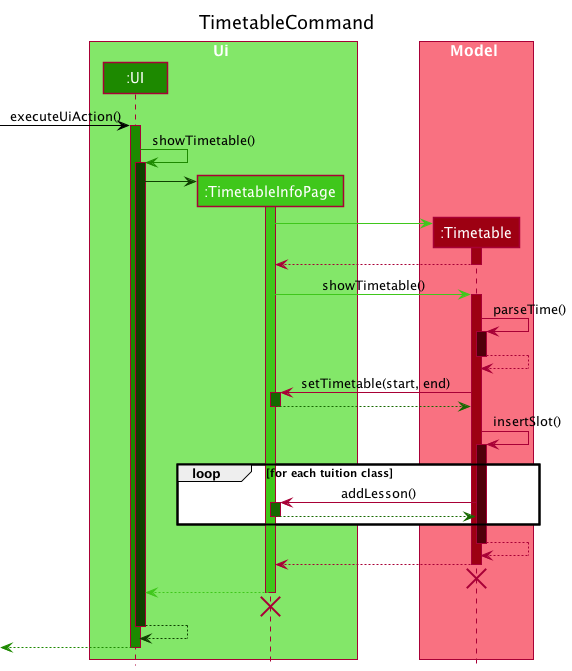
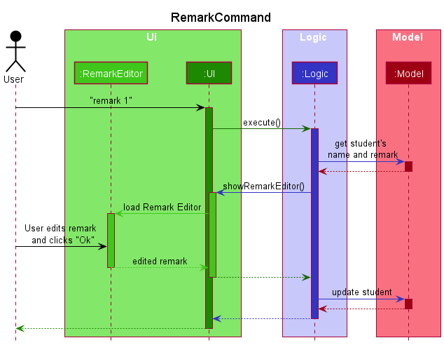
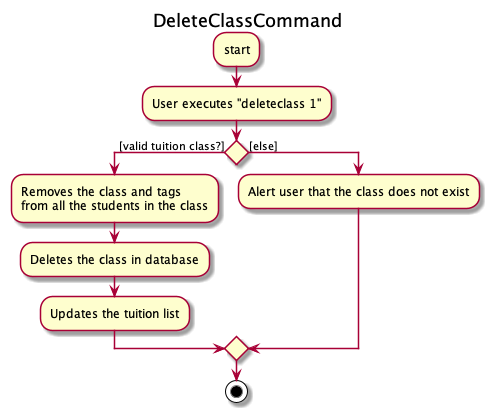
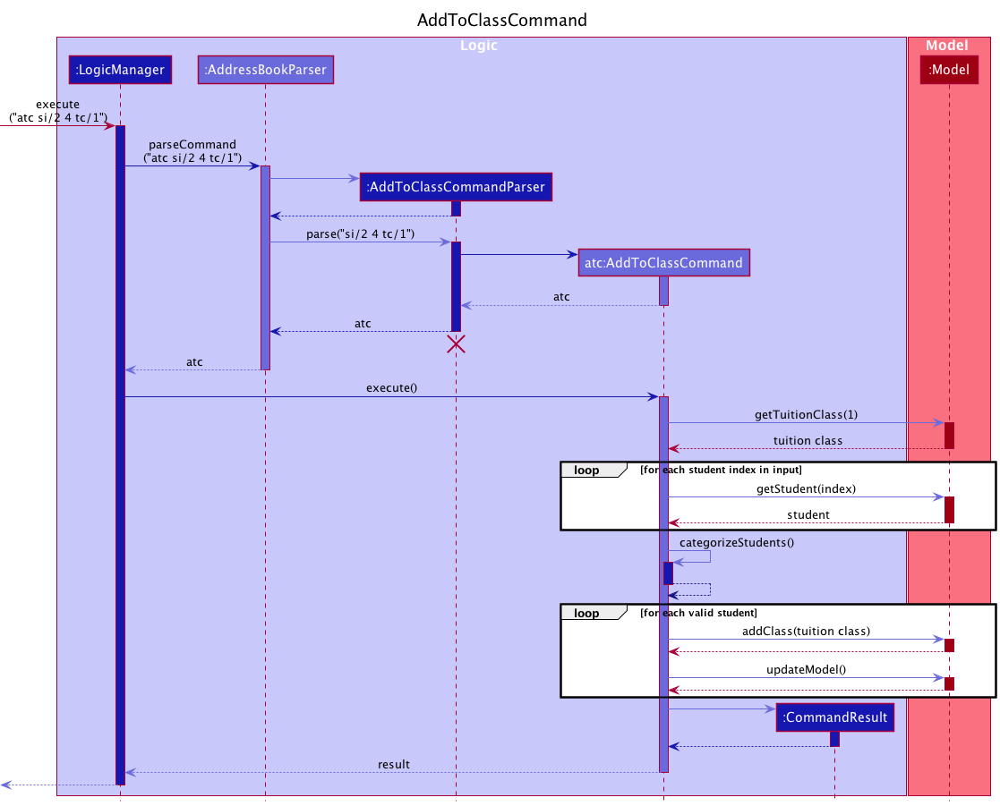

* Table of Contents
{:toc}

--------------------------------------------------------------------------------------------------------------------

## **Acknowledgements**

* This software is built upon [SE-EDU's AddressBook Level-3](https://se-education.org/addressbook-level3/) project.
* Implementation of CLI History Navigation feature referenced from [YaleChen299's ip](https://github.com/yalechen299/ip) for CS2103T.
* Implementation of opening User Guide in user's browser feature referenced from [samyipsh's tP](https://github.com/samyipsh/tp) for CS2103T.

--------------------------------------------------------------------------------------------------------------------

## **Setting up, getting started**

Refer to the guide [_Setting up and getting started_](SettingUp.md).

--------------------------------------------------------------------------------------------------------------------

## **Design**

### Architecture

The ***Architecture Diagram*** given above explains the high-level design of the App.

Given below is a quick overview of main components and how they interact with each other.

**Main components of the architecture**

**`Main`** has two classes called [`Main`](https://github.com/se-edu/addressbook-level3/tree/master/src/main/java/seedu/address/Main.java) and [`MainApp`](https://github.com/se-edu/addressbook-level3/tree/master/src/main/java/seedu/address/MainApp.java). It is responsible for,
* At app launch: Initializes the components in the correct sequence, and connects them up with each other.
* At shut down: Shuts down the components and invokes cleanup methods where necessary.

[**`Commons`**](#common-classes) represents a collection of classes used by multiple other components.

The rest of the App consists of four components.

* [**`UI`**](#ui-component): The UI of the App.
* [**`Logic`**](#logic-component): The command executor.
* [**`Model`**](#model-component): Holds the data of the App in memory.
* [**`Storage`**](#storage-component): Reads data from, and writes data to, the hard disk.

**How the architecture components interact with each other**

The *Sequence Diagram* below shows how the components interact with each other for the scenario where the user issues the command `delete 1`.

Each of the four main components (also shown in the diagram above),

* defines its *API* in an `interface` with the same name as the Component.
* implements its functionality using a concrete `{Component Name}Manager` class (which follows the corresponding API `interface` mentioned in the previous point.

For example, the `Logic` component defines its API in the `Logic.java` interface and implements its functionality using the `LogicManager.java` class which follows the `Logic` interface. Other components interact with a given component through its interface rather than the concrete class (reason: to prevent outside component's being coupled to the implementation of a component), as illustrated in the (partial) class diagram below.

The sections below give more details of each component.

### UI component

The **API** of this component is specified in [`Ui.java`](https://github.com/se-edu/addressbook-level3/tree/master/src/main/java/seedu/address/ui/Ui.java)

The UI consists of a `MainWindow` that is made up of parts e.g.`CommandBox`, `ResultDisplay`, `StudentListPanel`, `StatusBarFooter` etc. All these, including the `MainWindow`, inherit from the abstract `UiPart` class which captures the commonalities between classes that represent parts of the visible GUI.

The `UI` component uses the JavaFx UI framework. The layout of these UI parts are defined in matching `.fxml` files that are in the `src/main/resources/view` folder. For example, the layout of the [`MainWindow`](https://github.com/se-edu/addressbook-level3/tree/master/src/main/java/seedu/address/ui/MainWindow.java) is specified in [`MainWindow.fxml`](https://github.com/se-edu/addressbook-level3/tree/master/src/main/resources/view/MainWindow.fxml)

The `UI` component,

* executes user commands using the `Logic` component.
* listens for changes to `Model` data so that the UI can be updated with the modified data.
* keeps a reference to the `Logic` component, because the `UI` relies on the `Logic` to execute commands.
* depends on some classes in the `Model` component, as it displays `Student` object residing in the `Model`.

### Logic component

**API** : [`Logic.java`](https://github.com/se-edu/addressbook-level3/tree/master/src/main/java/seedu/address/logic/Logic.java)

Here's a (partial) class diagram of the `Logic` component:

How the `Logic` component works:
1. When `Logic` is called upon to execute a command, it uses the `AddressBookParser` class to parse the user command.
1. This results in a `Command` object (more precisely, an object of one of its subclasses e.g., `AddCommand`) which is executed by the `LogicManager`.
1. The command can communicate with the `Model` when it is executed (e.g. to add a student).
1. The result of the command execution is encapsulated as a `CommandResult` object which is returned back from `Logic`.

The Sequence Diagram below illustrates the interactions within the `Logic` component for the `execute("delete 1")` API call.

:information_source: **Note:** The lifeline for `DeleteCommandParser` should end at the destroy marker (X) but due to a limitation of PlantUML, the lifeline reaches the end of diagram.

Here are the other classes in `Logic` (omitted from the class diagram above) that are used for parsing a user command:

How the parsing works:
* When called upon to parse a user command, the `AddressBookParser` class creates an `XYZCommandParser` (`XYZ` is a placeholder for the specific command name e.g., `AddCommandParser`) which uses the other classes shown above to parse the user command and create a `XYZCommand` object (e.g., `AddCommand`) which the `AddressBookParser` returns back as a `Command` object.
* All `XYZCommandParser` classes (e.g., `AddCommandParser`, `DeleteCommandParser`, ...) inherit from the `Parser` interface so that they can be treated similarly where possible e.g, during testing.

### Model component

**API** : [`Model.java`](https://github.com/se-edu/addressbook-level3/tree/master/src/main/java/seedu/address/model/Model.java)

The `Model` component,

* stores the address book data i.e., all `Student` objects (which are contained in a `UniqueStudentList` object).
* stores the currently 'selected' `Student` objects (e.g., results of a search query) as a separate _filtered_ list which is exposed to outsiders as an unmodifiable `ObservableList<Student>` that can be 'observed' e.g. the UI can be bound to this list so that the UI automatically updates when the data in the list change.
* stores a `UserPref` object that represents the user’s preferences. This is exposed to the outside as a `ReadOnlyUserPref` objects.
* does not depend on any of the other three components (as the `Model` represents data entities of the domain, they should make sense on their own without depending on other components)

:information_source: **Note:** An alternative (arguably, a more OOP) model is given below. It has a `Tag` list in the `AddressBook`, which `Student` references. This allows `AddressBook` to only require one `Tag` object per unique tag, instead of each `Student` needing their own `Tag` objects. 

##### Storage component

**API** : [`Storage.java`](https://github.com/se-edu/addressbook-level3/tree/master/src/main/java/seedu/address/storage/Storage.java)

The `Storage` component,
* can save both address book data and user preference data in json format, and read them back into corresponding objects.
* inherits from both `AddressBookStorage` and `UserPrefStorage`, which means it can be treated as either one (if only the functionality of only one is needed).
* depends on some classes in the `Model` component (because the `Storage` component's job is to save/retrieve objects that belong to the `Model`)

### Common classes

Classes used by multiple components are in the `seedu.addressbook.commons` package.

--------------------------------------------------------------------------------------------------------------------

## **Implementation**
This section describes some noteworthy details on how certain features are implemented.

### [Developed] Time conflict management

The time conflict management mechanism is facilitated by `TimeSlot`. It is encapsulated in `Tuition` package which
defines time slot format, checks time slot format and manage time conflict. It implements the following operations:
* `Timeslot#checkClassConflict()` - Compares two time slots to detect time conflict
* `Timeslot#parseString()` - Parses the String to check the format of the String and creates a new `Timeslot` if the format is correct

Given below is an example usage scenario and how the time conflict management mechanism behaves at each step.

Step1: The user enters `addclass` command. The `Timeslot` will check the correctness of the format of the
time slot entered by user through `Timeslot#parseString()`. If it is incorrect, a `ParseException` will be thrown, and the 
exception will be handled by throwing `IllegalValueException`. Then user will receive a guidance to correct the time slot format.

Step2: After confirmed the time slot format is correct, `TuitionClass` will check whether there is a conflict in
time slot exists. If there is a conflict, a `CommandException` will be thrown.

Step3: If time slot follows the format and no conflict exist, a new `TuitionClass` will be created

The interactions between the components during the usage scenario is show in the *Sequence Diagram* below. 

### [Developed] Display of Timetable

The construction of the read-only timetable is facilitated by the `Timetable` class in the `Tuition` package.
The `Timetable` receives an updated `tuitionClassList` from `UniqueTuitionList`, and then processes the `TimeSlot` occupied by each `TuitionClass` to construct a timetable.
It generates a timetable with the help of the `TimetableInfoPage` class using the following operations:

* `Timetable#parseTime()` - Extracts `TimeSlot` occupied by each `TuitionClass`. Determines the size of the timetable using the earliest starting time and latest ending time of the tuition class list.
* `TimetableInfoPage#setTableTime(start, end)` - Constructs a timetable given the starting and ending time.
* `Timetable#insertSlot()` - Inserts all tuition classes into the timetable.
* `TimetableInfoPage#addLesson(lesson, columnStartInsert, rowStartInsert, columnSpan, rowSpan)` - Inserts a lesson to the corresponding rows and columns of the timetable.

:information_source:**Note:** 
The above operations in the `Timetable` class is responsible for processing data of `tuitionClassList` and determining the details of timetable.
And operations in the `TimetableInfoPage` class interact with `UI` to construct the timetable according to details provided by the `Timetable` class.

Given below is an example usage scenario of how the timetable is generated.

Step1: The user executes `timetable` command to view a read-only timetable. 

Step2: The `TimetableCommand` class checks whether the `mostRecentTuitionClasses` maintained in `UniqueTuitionList` is empty.

Step2.1: If there is not any tuition class, a `CommandResult` will be returned to alert the user that no class has been found.

Step2.2: Otherwise, the `mostRecentTuitionClasses` in `UniqueTuitionList` is passed to the `Timetable` class.

Step3: `Timetable` will proceed to parse the `TimeSlot` in each tuition class.
After comparing the time when each `TuitionClass` takes place, the time range and thus the size of the timetable to be produced can be decided.
The intended size of timetable is then passed to the `TimetableInfoPage` class.

Step4: Following the construction of the timetable, each `TuitionClass` is then inserted into the timetable by calling `TimetableInfoPage#addLesson`.

The following *Sequence Diagram* illustrates how `Timetable` interacts with `TimetableInfoPage` as explained by `step 3` and `step 4`:

Step5: The complete timetable is displayed to user through the `UI` component.

The following activity diagram summarizes what happens when a user executes a "timetable" command:

#### Design considerations

**Aspect: Size of timetable:**

* **Alternative 1 (current choice):** Change the size of timetable according to lessons added.
    * Pros: Easier for users to view lessons scheduled.
    * Cons: May produce a timetable at a slightly slower speed and is more prone to bugs.

* **Alternative 2:** Fix the size of timetable.
    * Pros: Easy to implement.
    * Cons: User experience would be compromised as the timetable will include many empty slots.
    
### [Developed] Adding Remarks With Editor
Users can add, edit, or remove remarks for students or tuition classes, which is facilitated by `RemarkEditor`. The `UIManager` displays a dialog box with a text area for users to type in the description of the remark. Additionally, the `RemarkEditor` supports the following operations:

* `RemarkEditor#setRemark(name, remark)` — Sets the name and remark of the identified student or tuition class.
* `RemarkEditor#getRemark()`— Retrieves the description input by the user as a `Remark`.

The interactions between the components during the execution of the `RemarkCommand` is show in the *Sequence Diagram* below. The interactions and execution paths for `RemarkClassCommand` are the same.  

Given below is an example usage scenario of how a user can interact with the `RemarkEditor` dialog.

Step 1. The user executes `remark 1` to edit the remark of the 1st student. A dialog box pops up for the user to edit the remark description.

Step 2.1. The user clicks `Ok`  and the remark for the student is automatically updated to the new description.

Step 2.2 The user may choose to click `Cancel` or exit the dialog box and the remark will remain unchanged.

### \[Developed\] CLI input history navigation
Users are able to navigate through their previously entered String inputs from the Command Box in the UI, using the up and down arrow keys.
This is facilitated by the `InputHistory` class.

### [Developed] Editing a Student
Users can edit a student by editing the following fields: `Name`, `Phone`, `Email` and `Address`.
This is implemented using the `EditCommand`,  `EditStudentDescriptor` and `EditCommandParser` classes.

#### Current Implementation
The `EditCommand` receives an index that indicates the student to be edited and an
editable `EditStudentDescriptor` class which consists of the updated fields of the student.
The student is then updated with the help of the following methods:

* `Student#sameStudent(Student)` - Checks if the name of the student has been changed.
* `ModelManager#hasStudent(Student)` - Checks if the updated name already exists in the database.
* `Student#equals(Student)` - Checks if any of the four fields have been changed.
* `TuitionClass#updateStudent(Student)` - Updates the student's name in the class.
* `ModelManager#setStudent(Student)` - Updates the student's details in database.

 
Given below is an example usage scenario of how an `edit` command is executed.

#### Steps
Step 1: The user enters `edit 1 n/Tom p/98989898` command.

Step 2: The `EditCommandParser` parses the student index to ensure that it is valid. 

Step 3: An `EditStudentDescriptor` object is constructed. 
The `EditCommandParser` parses the arguments for the `n/` and `p/` prefixes to ensure that the arguments are valid.
If the arguments are valid, the `EditStudentDescriptor` object is then updated with the relevant values - namely 
the edited values for `Phone` and `Name` as well as the existing values for the `Email` and `Address` fields.

Step 4: An `EditCommand` object is then constructed with the student index and the `EditStudentDescriptor` object.

Step 5: The `EditCommand` object checks if any of the fields have been updated using `Student#equals(Student)`. If none of the four fields are updated a `CommandException` is thrown to alert the user that the details are up-to-date.

Step 6: Otherwise, it proceeds to check if the student name has been changed using `Student#sameStudent(Student)`. If the name has been changed, it ensures that the name does not exist in the database using `ModelManager#hasStudent(Student)`.

Step 7: If the updated name is valid, the name of the student is updated in all the tuition classes he/she is enrolled in using `TuitionClass#updateStudent(Student)`.

Step 8: Finally, the student is updated in the database using `ModelManager#setStudent(Student)`.

### [Developed] Editing Tuition Classes
Users can edit tuition classes by editing the following fields: limit, name and timeslot of a class. 
This is implemented using the `EditClassCommand`, `EditClassDescriptor` and `EditClassCommandParser` classes.

#### Current Implementation 
Similar to `EditCommand`, the `EditClassCommand` receives an index that indicates the class to be edited and an editable `EditClassDescriptor` class which contains the updated fields of the class.

The tuition class is then updated with the help of the following methods: 

* `TuitionClass#sameClassDetails()` - Checks if any field of the tuition class has been updated. 
* `Timeslot#checkTimetableConflicts` - Checks if the updated time slot has been taken or overlaps with another class's timselot.
* `ModelManager#setTuition(TuitionClass, TuitionClass)` - Updates the tuition class.
 
Given below is an example usage scenario of how an `editclass` command is executed.
#### Steps
Step 1: The user enters `editclass 1 l/5 ts/Mon 10:00-11:00` command.

Step 2: The `EditClassCommand` class will first check if any field of the tuition class has been updated.
If there are no changes, a `CommandException` will be thrown to alert the user that the class details are up-to-date.
Otherwise, it proceeds to verify that the updated `limit` is at least equal to the current number of students.

Step 3: Upon ensuring that the limit is valid, it checks for potential conflicts by comparing the updated `timeslot`
against those of other classes using the `Timeslot#checkTimetableConflicts` method.
If there are conflicts, a `CommandException` will be thrown to the user to alert the class that the slot has been taken.

Step 4: If there are no conflicts, the class tag of the students enrolled in the class which shows the `ClassName` and`Timeslot` of the updated class.

Step 5: Finally, it replaces the existing class with the updated class in the database using `ModelManager#setTuition(TuitionClass, TuitionClass)`.

### [Developed] Deleting Students
This feature allows students to be deleted using the `deletestudent` or `del` command.
This is facilitated by the `DeleteStudentCommand` and `DeleteStudentCommandParser` classes.

#### Current Implementation
The `DeleteStudentCommandParser` parses the input from user to ensure that the student indices are valid. Then,
students are removed from the database with the help of the following methods:

* `ModelManager#getStudent(Student)` - Retrieves the `Student` indicated by its index from `UniqueStudentList`.
* `TuitionClass#removeStudent(Student)` - Removes the student's name from  the `StudentList` of the class.
* `ModelManager#getStudent(Student)` - Deletes the `Student` indicated by its index from `UniqueStudentList`.

Given below is an example usage of how a `DeleteStudentCommand` is executed.

#### Steps
Step 1: The user enters `deletestudent 1 2` command.

Step 2: The `DeleteStudentCommandParser` will parse the student indices to ensure that they are valid.
Additionally, the parser removes any duplicates among the student indices and sorts the indices in descending order.

:information_source: **Note:** 
Removing duplicate indices ensures that only one student is deleted at a particular index. 
Sorting ensures that the students at the indices are deleted in the correct order - which is important as the student list uses an internal
`ObservableList` that tracks the changes to the list while students are being deleted.

A `DeleteStudentCommand` object with the student indices as arguments is constructed.

Step 3: The `DeleteStudentCommand` is executed. Student indices - 1 and 2, are used to retrieve the students by calling the `ModelManager#getStudent(Index)` method.
If the student exists, then the student is deleted by calling `ModelManager#getStudent(Student)`.

Step 4:`CommandResult` is returned informing the user of the students that have been deleted successfully.

### [Developed] Deleting Tuition Classes
This feature allows tuition classes to be deleted using the `deleteclass` or `delc` command.
This is facilitated by the `DeleteClassCommand` and `DeleteClassCommandParser` classes.

#### Current Implementation
The `DeleteClassCommandParser` parses the input from user to ensure that the class indices are valid. Then,
classes are removed from the database with the help of the following methods:

* `ModelManager#getTuitionClass(Index)` - Retrieves the `TuitionClass` indicated by its index from `UniqueTuitionList`.
* `Student#removeClass(TuitionClass)` - Removes the class identified by an internal id and the class tag from the enrolled students.
* `ModelManager#deleteTuition(TuitionClass)` - Removes the tuition class from `UniqueTuitionList`.

Given below is an example usage of how a `DeleteClassCommand` is executed.

#### Steps
Step 1: The user enters `deleteclass 1` command.

Step 2: The `DeleteClassCommandParser` will parse the class index to ensure that it is valid. A `DeleteClassCommand` object with the class index as arguments is constructed.

Step 3: The `DeleteClassCommand` is executed. Class index - 1, is used to retrieve the class by calling the `ModelManager#getTuitionClass(Index)` method.

Step 4: If the tuition class exists, `Student#removeClass(TuitionClass)` is called to remove the Tuition class using it's id from the all the students. 
It also removes the class tag for all the enrolled students by using the `ClassName` and unique `TimeSlot` of the tuition class.

Step 5: `ModelManager#deleteTuition(TuitionClass)` to delete the tuition class and update the list of tuition classes accordingly.

Step 6: `CommandResult` is returned informing the user of the classes that have been deleted successfully.

#### Activity Diagram

The user flow is shown in the *Activity Diagram* below. 

  

### [Developed] Removing Students from Tuition Classes
This feature allows students enrolled in existing classes to be removed using student indices and a class index using the `remove` command.
This is facilitated by the `RemoveStudentCommand` and `RemoveStudentCommandParser` classes.

#### Current Implementation
The `RemoveStudentCommandParser` parses the input from user to ensure that the indices are valid. Then, 
students are removed from the respective tuition class with the help of the following methods:

* `TuitionClass#containsStudent(Student)` - Checks if the student is enrolled in the class.
* `TuitionClass#removeStudent(Student)` - Removes an existing student from a class.
* `RemoveStudentCommand#updateInvalidStudents(Student)` - Updates the list of invalid students who do not exist in the class.

Given below is an example usage of how a `RemoveStudentCommand` is executed.

#### Sequence Diagram

The following sequence diagram shows the interactions between the components when the `RemoveStudentCommand` is executed. 

#### Steps
Step 1: The user enters `remove si/1 4 tc/1` command.

Step 2: The `RemoveStudentCommandParser` will parse the student indices and class index to ensure that they are valid. 
Additionally, it removes any duplicates among the student indices. A `RemoveStudentCommand` object with the student indices and class index as arguments is constructed.

Step 3: The `RemoveStudentCommand` is executed. Student indices - 1 and 2, are used to retrieve the unique student names using the `UniqueStudentList`.

Step 4: `TuitionClass#containsStudent(Student)` is called to confirm that the student exists in the class. 

Step 5: If the student exists, the student is removed from the class using TuitionClass#removeStudent(Student). The tuition class is also removed the particular student using
`Student#removeClass(TuitionClass)`. Otherwise, the names of the invalid students are tracked using `RemoveStudentCommand#updateInvalidStudents(Student)`

Step 6: `CommandResult` is returned informing the user of both the students that have been removed successfully and the students who could not be removed as they do not exist in the tuition class.

#### Design considerations

**Aspect: Whether to allow users to remove single or multiple students at once:**

* **Alternative 1 (current choice):** Allows multiple students to be removed.
    * Pros: More efficient for users to remove students from tuition classes.
    * Cons: More bug-prone due to parsing errors or duplicate indices. This is later resolved by providing more specific instructions in user guide and detailed command feedback in TutAssistor.

* **Alternative 2:** Allows only one student to be removed.
    * Pros: Easy to implement and reduced possibility of parsing errors.
    * Cons: Users who wish to mass-update class enrollment will find it inefficient.

### [Developed] Adding Students to Existing Tuition Classes

Users can add students to existing tuition classes using student index or name.
This is facilitated by the `AddToClassCommand` and `AddToClassCommandParser` classes.

The `AddToClassCommandParser` parses the input from user and decides whether student indices or student names are used.
Students are added to the respective tuition class with the help of the following operations in `AddToClassCommand`:

* `AddToClassCommand#categorizeStudents()` - Categorizes students into four types, namely students that are added successfully, students with invalid names, students with valid names but not added due to class size limit, and students already enrolled in the class. 
* `AddToClassCommand#updateModel()` - Updates the capacity of the corresponding tuition class and updates the class tag of students enrolled.

Given below is an example usage scenario and how an `addtoclass` command is executed.

The interactions between the components during the usage scenario is show in the *Sequence Diagram* below. 

Step 1: The user enters `atc si/2 4 tc/1` command.

Step 2: The `AddToClassCommandParser` will check and confirm that student indices are used. An `AddToClassCommand` object with student indices as parameter is constructed.

Step 3: The `AddToClassCommand` is executed. Student indices, namely 2 and 4, are converted to student names using the `UniqueStudentList`.

:information_source: **Note:** 
Student indices that are not found in the `UniqueStudentList` would be regarded as invalid indices.
Valid students who are not added due to tuition class size limit or who have been enrolled in the same class previously are identified using the `AddToClassCommand#categorizeStudents()` method.

Step 4: `AddToClassCommand#updateModel()` is called to add the valid students to the tuition class and change the capacity of the class. It also updates the class tag of the students enrolled ito show the `ClassName` and
`Timeslot` of the class.

#### Design considerations

**Aspect: Whether to allow users to add students using names:**

* **Alternative 1 (current choice):** Allows both student indices and student names.
    * Pros: More flexible for users to add students to tuition classes. 
    * Cons: More bug-prone and more difficult for users to learn the commands. This is later resolved by providing more specific instructions in user guide and detailed command feedback in TutAssistor.

* **Alternative 2:** Allows only student indices.
    * Pros: Easy to implement and avoid confusions to users as command is easy to learn.
    * Cons: Users with a lot of students will need to scroll down to find student indices.
    
### \[Proposed\] Undo/redo feature

The proposed undo/redo mechanism is facilitated by `VersionedAddressBook`. It extends `AddressBook` with an undo/redo history, stored internally as an `addressBookStateList` and `currentStatePointer`. Additionally, it implements the following operations:

* `VersionedAddressBook#commit()` — Saves the current address book state in its history.
* `VersionedAddressBook#undo()` — Restores the previous address book state from its history.
* `VersionedAddressBook#redo()` — Restores a previously undone address book state from its history.

These operations are exposed in the `Model` interface as `Model#commitAddressBook()`, `Model#undoAddressBook()` and `Model#redoAddressBook()` respectively.

Given below is an example usage scenario and how the undo/redo mechanism behaves at each step.

Step 1. The user launches the application for the first time. The `VersionedAddressBook` will be initialized with the initial address book state, and the `currentStatePointer` pointing to that single address book state.

Step 2. The user executes `delete 5` command to delete the 5th student in the address book. The `delete` command calls `Model#commitAddressBook()`, causing the modified state of the address book after the `delete 5` command executes to be saved in the `addressBookStateList`, and the `currentStatePointer` is shifted to the newly inserted address book state.

Step 3. The user executes `add n/David …​` to add a new student. The `add` command also calls `Model#commitAddressBook()`, causing another modified address book state to be saved into the `addressBookStateList`.

:information_source: **Note:** If a command fails its execution, it will not call `Model#commitAddressBook()`, so the address book state will not be saved into the `addressBookStateList`.

Step 4. The user now decides that adding the student was a mistake, and decides to undo that action by executing the `undo` command. The `undo` command will call `Model#undoAddressBook()`, which will shift the `currentStatePointer` once to the left, pointing it to the previous address book state, and restores the address book to that state.

:information_source: **Note:** If the `currentStatePointer` is at index 0, pointing to the initial AddressBook state, then there are no previous AddressBook states to restore. The `undo` command uses `Model#canUndoAddressBook()` to check if this is the case. If so, it will return an error to the user rather
than attempting to perform the undo.

The following sequence diagram shows how the undo operation works:

:information_source: **Note:** The lifeline for `UndoCommand` should end at the destroy marker (X) but due to a limitation of PlantUML, the lifeline reaches the end of diagram.

The `redo` command does the opposite — it calls `Model#redoAddressBook()`, which shifts the `currentStatePointer` once to the right, pointing to the previously undone state, and restores the address book to that state.

:information_source: **Note:** If the `currentStatePointer` is at index `addressBookStateList.size() - 1`, pointing to the latest address book state, then there are no undone AddressBook states to restore. The `redo` command uses `Model#canRedoAddressBook()` to check if this is the case. If so, it will return an error to the user rather than attempting to perform the redo.

Step 5. The user then decides to execute the command `list`. Commands that do not modify the address book, such as `list`, will usually not call `Model#commitAddressBook()`, `Model#undoAddressBook()` or `Model#redoAddressBook()`. Thus, the `addressBookStateList` remains unchanged.

Step 6. The user executes `clear`, which calls `Model#commitAddressBook()`. Since the `currentStatePointer` is not pointing at the end of the `addressBookStateList`, all address book states after the `currentStatePointer` will be purged. Reason: It no longer makes sense to redo the `add n/David …​` command. This is the behavior that most modern desktop applications follow.

The following activity diagram summarizes what happens when a user executes a new command:

#### Design considerations

**Aspect: How undo & redo executes:**

* **Alternative 1 (current choice):** Saves the entire address book.
    * Pros: Easy to implement.
    * Cons: May have performance issues in terms of memory usage.

* **Alternative 2:** Individual command knows how to undo/redo by
  itself.
    * Pros: Will use less memory (e.g. for `delete`, just save the student being deleted).
    * Cons: We must ensure that the implementation of each individual command are correct.

_{more aspects and alternatives to be added}_

--------------------------------------------------------------------------------------------------------------------

## **Documentation, logging, testing, configuration, dev-ops**

* [Documentation guide](Documentation.md)
* [Testing guide](Testing.md)
* [Logging guide](Logging.md)
* [Configuration guide](Configuration.md)
* [DevOps guide](DevOps.md)

--------------------------------------------------------------------------------------------------------------------

## **Appendix: Requirements**

### Product scope

**Target user profile**:

* has a need to manage a significant number of students and classes
* prefer desktop apps over other types
* can type fast
* prefers typing to mouse interactions
* is reasonably comfortable using CLI apps

**Value proposition**: manage students and classes faster than a typical mouse/GUI driven app, and facilitate deconflicting of time slots

### User stories

Priorities: High (must have) - `* * *`, Medium (nice to have) - `* *`, Low (unlikely to have) - `*`

| Priority | As a …​                                    | I want to …​                     | So that I can…​                                                      |
| -------- | ------------------------------------------ | ------------------------------ | ---------------------------------------------------------------------- |
| `* * *`  | Tutor                                      | save the data I put            | refer back to the same data at a later time                            |
| `* * *`  | Tutor                                      | create a new student           | keep track of relevant details about that student                      |
| `* * *`  | Tutor                                      | exit the program               | log off from the app                                                   |
| `* * *`  | Tutor                                      | set maximum number of students per class | avoid overbooking a class                                    |
| `* * *`  | Tutor                                      | add time slots for classes     | schedule extra classes for weaker students                             |
| `* * *`  | Tutor                                      | delete a student               |                                                                        |
| `* * *`  | Tutor with many students                   | view the classes scheduled in a timeslot | avoid double-booking a timeslot                              |
| `* * *`  | Tutor                                      | add new information about an existing student |                                                         |
| `* * *`  | Tutor                                      | delete a class                 |                                                                        |
| `* * *`  | Tutor                                      | add a student to a class       |                                                                        |
| `* *`    | Tutor                                      | filter students based on class | see which students will be attending a class                           |
| `* *`    | Tutor                                      | create notes for each class    | track the homework assigned to students                                |
| `* *`    | Tutor                                      | view all classes that are scheduled on a day | prepare the relevant materials early                     |
| `* *`    | Tutor                                      | create tags for each student   | track which students have not paid tuition fees                        |
| `* *`    | New user                                   | clear all data                 | start using the program after testing it out                           |
| `* *`    | New user                                   | see a list of commands         | learn what I can do with the software                                  |
| `* *`    | Tutor                                      | search for students by name    | follow-up with students who are absent                                 |
| `* *`    | Tutor                                      | bind and edit class fee to a student | remember students’ different fees                                |
| `* *`    | Tutor                                      | edit a student                 | keep my information about students up to date                          |
| `* *`    | Unfamiliar/returning user                  | check the syntax for specific commands | be reminded of how to use commands                             |
| `*`      | Forgetful tutor                            | set a reminder for when I open the app | not forget to prepare for the lessons                          |
| `*`      | Organised tutor                            | customise the view of the class schedules | see the relevant classes                                    |
| `*`      | Tutor                                      | export weekly schedule         | refer to the notes even on my phone                                    |

### Use cases

(For all use cases below, the **System** is  `TutAssistor` and the **Actor** is the `tutor`, unless specified otherwise)

**Use case: UC01 - Add Student/Tuition class**

**MSS**

1. Tutor chooses to add a new student/tuition class and keys in information about his student/tuition class.
2. TutAssistor adds the student/tuition class and displays successful information.

Use case ends.

**Extensions**

* 1a. TutAssistor detects the wrong format in the user input.
    * 1a1. TutAssitor reminds the tutor the right format.
    * 1a2. Tutor enters a new command.

      Steps 1a1-1a2 are repeated until the Tutor keys in information in the correct format by TutAssistor.

      Use case resumes from step 2.

**Use case:  UC02 - Delete Student/Tuition Class**

**MSS**

1. Tutor chooses to delete an existing Student/Tution Class.
2. TutAssitor deletes the Student/Tuition Class and displays successful information.

Use case ends.

**Extensions**

* 1a. TutAssistor detects the wrong format in the user input.
    * 1a1. TutAssitor reminds the tutor the right format.
    * 1a2. Tutor enters a new command.

     Steps 1a1-1a2 are repeated until the Tutor keys in information in the correct format by TutAssistor.

     Use case resumes from step 2.

* 1b. TutAssistor does not detect existing Student/Tuition Class with names indicated by the user.
  * 1b1. TutAssistor alerts that the Student/Class does not exist.
  * 1b2. Tutor keys in new command.

      Steps 1b1-1b2 are repeated until the Tutor keys in the existing student/class.

      Use case resumes from step 2.

**Use Case: UC03 - Add student to a tuition class**

**MSS**

1. Tutor decides to add a particular student to a class.
2. Tutor keys in command to add an existing student to class.
3. TutAssistor adds student to the class successfully

Use case ends.

**Extensions**

* 3a. TutAssistor detects an error when the number of students exceeds the limit.
    * 3a1. TutAssistor displays error.

    Use case ends.

**Use Case: UC04 - Edit Student/Tuition class**

**MSS**

1. Tutor  chooses to edit Student/Tuition class information and keys in the information.
2. TutAssistor updates Student/Tuition class information and displays successful information.

Use case ends.

**Extensions**

* 1a. TutAssistor detects the wrong format in the user input.
  * 1a1. TutAssitor reminds the tutor the right format.
  * 1a2. Tutor enters a new command.

      Steps 1a1-1a2 are repeated until the Tutor keys in information in the correct format by TutAssistor.

      Use case resumes from step 2.

**Use Case: UC05 - Search Student/Tuition class**

**MSS**

1. Tutor chooses to search Student/Tuition class information and keys in the information.
2. TutAssistor displays Student/Tuition class information and displays successful information.

Use case ends.

**Use Case: UC06 - View tuition classes**

**MSS**

1. Tutor keys in command to view the list of tuition classes for the week.
2. TutAssistor displays a list of tuition classes for the week.

Use case ends.

**Extensions**

* 1a. Tutor keys in an unrecognised command.
    * 1a1. TutAssistor displays an error message.
    * 1a2. Tutor keys in a new command.

    Steps 1a1-1a2 are repeated until the Tutor keys in a command recognised by TutAssistor.

    Use case resumes from step 2.

**Use Case: UC07 - Edit student in a tuition class**

**MSS**

1. Tutor decides to edit a student’s details in a tuition class.
2. TutAssistor edits the student’s details and displays successful information.

Use case ends.

**Use case: UC08 - Remove student from tuition class**

**MSS**

1. Tutor chooses to remove a student from a tuition class and keys in the command.
2. TutAssistor removes the student from the tuition class and displays the successful information.

Use case ends.

**Use case: UC09 - View student**

**MSS**

1. Tutor keys in command to view a particular student’s details.
2. TutAssistor displays the student’s details successfully.

Use case ends.

**Use case: UC10 - Exit**

**MSS**

1. Tutor chooses to exit the TutAssistor.
2. TutAssistor exits.

Use case ends.

### Non-Functional Requirements

1.  Should work on any _mainstream OS_ as long as it has Java `11` or above installed.
2.  Should be able to hold up to 2000 tutees without a noticeable sluggishness in performance for typical usage.
3.  A user with above average typing speed for regular English text (i.e. not code, not system admin commands) should be able to accomplish most of the tasks faster using commands than using the mouse.
4.  The response to any command should become visible within 5 seconds.

### Glossary

* **Mainstream OS**: Windows, Linux, Unix, OS-X
* **Private contact detail**: A contact detail that is not meant to be shared with others

--------------------------------------------------------------------------------------------------------------------

## **Appendix: Instructions for manual testing**

Given below are instructions to test the app manually.

:information_source: **Note:** These instructions only provide a starting point for testers to work on;
testers are expected to do more *exploratory* testing.

### Launch and shutdown

1. Initial launch

   1. Download the jar file and copy into an empty folder

   1. Double-click the jar file Expected: Shows the GUI with a set of sample contacts. The window size may not be optimum.

1. Saving window preferences

   1. Resize the window to an optimum size. Move the window to a different location. Close the window.

   1. Re-launch the app by double-clicking the jar file. 
       Expected: The most recent window size and location is retained.

1. Exiting the program

   1. Close the window or click on **File** > **Exit** in the top left corner.
       Expected: The user logs off the programme.

### Deleting a student

1. Deleting a student while all students are being shown

   1. Prerequisites: List all students using the `list` command. Multiple students in the list.

   1. Test case: `delete 1` 
      Expected: First student is deleted from the list. Details of the deleted student shown in the status message. Timestamp in the status bar is updated.

   1. Test case: `delete 0` 
      Expected: No student is deleted. Error details shown in the status message. Status bar remains the same.

   1. Other incorrect delete commands to try: `delete`, `delete x`, `...` (where x is larger than the list size) 
      Expected: Similar to previous.

### Editing remarks

1. Editing the remarks of a student
   
   1. Prerequisites: List all students using the `list` command. At least one student in the list.

   1. Test case: `remark 1`, input `Hello World!`, then click **Ok**. 
      Expected: The remarks of first student is changed to `Hello World!`. Details of the edited student shown in the status message. Timestamp in the status bar is updated.
      
   1. Test case: `remark 1`, input `Hello World!`, then click **Cancel** or close the window. 
      Expected: The remarks of first student remains as the previous input`. Details of the edited student shown in the status message. Timestamp in the status bar is updated.
      
   1. Test case: `remark 0` 
      Expected: Remark Editor window does not open. Error details shown in the status message. Status bar remains the same.
      
   1. Other incorrect delete commands to try: `remark`, `remark x`, `...` (where x is larger than the list size) 
      Expected: Similar to previous.

1. Removing remarks of a student

   1. Prerequisites: List all students using the `list` command. At least one student in the list.

   1. Test case: `remark 1`, remove all input in the text area of the Remark Editor, then click **Ok**. 
      Expected: The remarks of first student is removed. Details of the edited student shown in the status message. Timestamp in the status bar is updated.

### Viewing help

1. Viewing help for TutAssistor
   
   1. Enter help and press enter
      Expected: A help message is displayed in a separate help window. It also contains a **Open User Guide** button which opens up the TutAssistor user guide.

### Saving data

1. Dealing with missing/corrupted data files

   1. _{explain how to simulate a missing/corrupted file, and the expected behavior}_

1. _{ more test cases …​ }_
