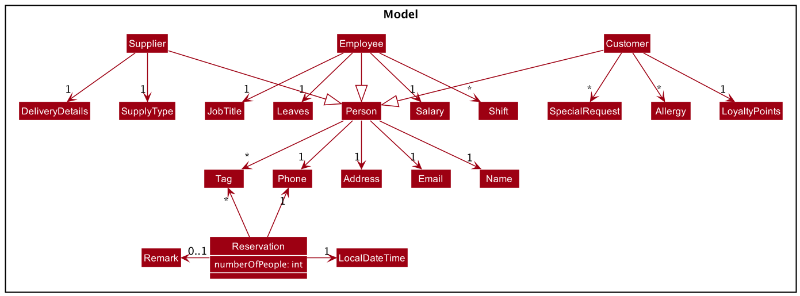
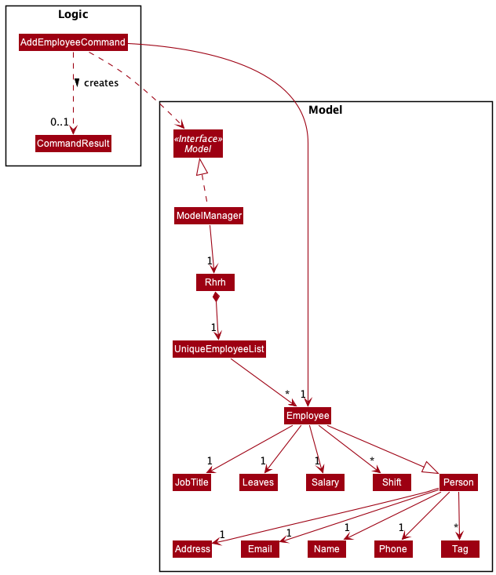
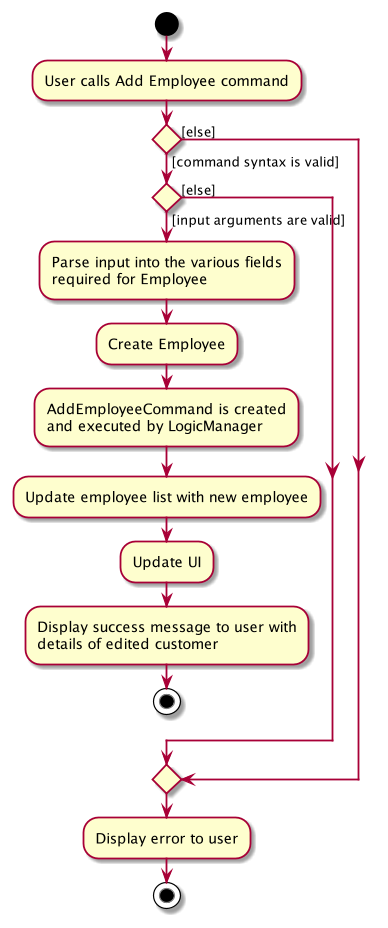
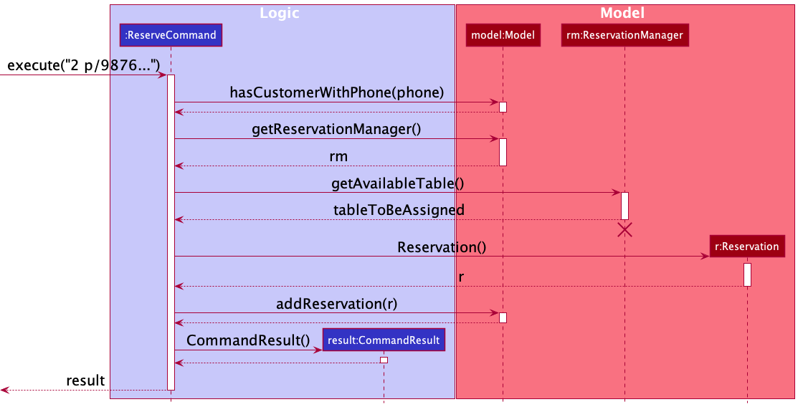
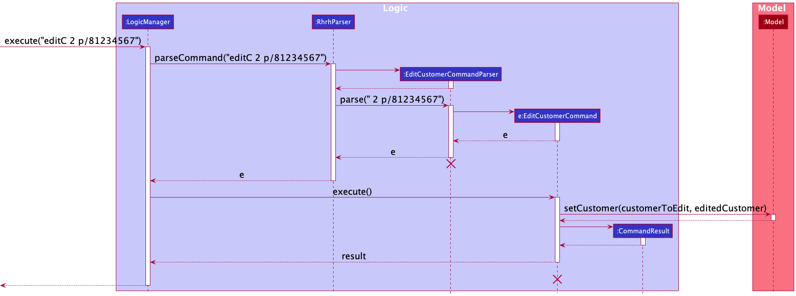
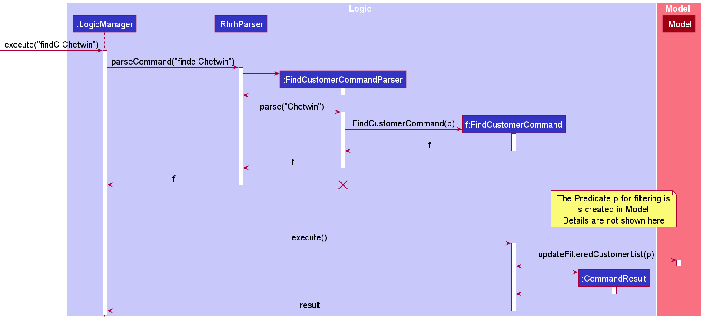
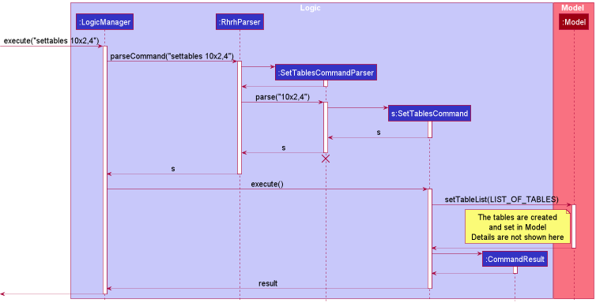
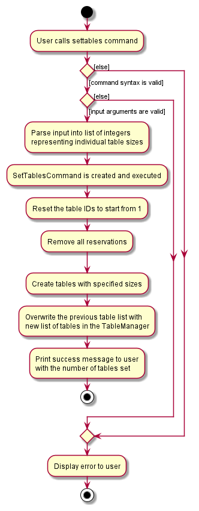
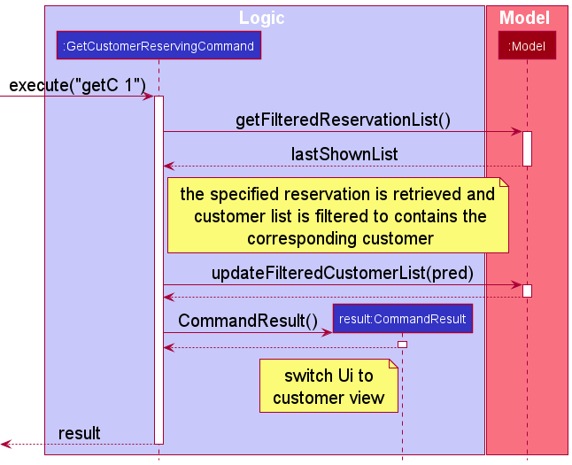

* Table of Contents
{:toc}

--------------------------------------------------------------------------------------------------------------------

## **Acknowledgements**

* This project is based on the AddressBook-Level3 project created by the [SE-EDU initiative](https://se-education.org).
* We would like to thank Jun Xiong for the invaluable guidance.

--------------------------------------------------------------------------------------------------------------------

## **Setting up, getting started**

Refer to the guide [_Setting up and getting started_](SettingUp.md).

--------------------------------------------------------------------------------------------------------------------

## **Design**

:bulb: **Tip:** The `.puml` files used to create diagrams in this document can be found in the [diagrams](https://github.com/se-edu/addressbook-level3/tree/master/docs/diagrams/) folder. Refer to the [_PlantUML Tutorial_ at se-edu/guides](https://se-education.org/guides/tutorials/plantUml.html) to learn how to create and edit diagrams.

### Architecture

The ***Architecture Diagram*** given above explains the high-level design of the App.

Given below is a quick overview of main components and how they interact with each other.

**Main components of the architecture**

**`Main`** has two classes called [`Main`](https://github.com/AY2122S1-CS2103T-T17-1/tp/blob/master/src/main/java/seedu/address/Main.java) and [`MainApp`](https://github.com/se-edu/addressbook-level3/tree/master/src/main/java/seedu/address/MainApp.java). It is responsible for,
* At app launch: Initializes the components in the correct sequence, and connects them up with each other.
* At shut down: Shuts down the components and invokes cleanup methods where necessary.

[**`Commons`**](#common-classes) represents a collection of classes used by multiple other components.

The rest of the App consists of four components.

* [**`UI`**](#ui-component): The UI of the App.
* [**`Logic`**](#logic-component): The command executor.
* [**`Model`**](#model-component): Holds the data of the App in memory.
* [**`Storage`**](#storage-component): Reads data from, and writes data to, the hard disk.

**How the architecture components interact with each other**

The *Sequence Diagram* below shows how the components interact with each other for the scenario where the user issues the command `delete 1`.

Each of the four main components (also shown in the diagram above),

* defines its *API* in an `interface` with the same name as the Component.
* implements its functionality using a concrete `{Component Name}Manager` class (which follows the corresponding API `interface` mentioned in the previous point.

For example, the `Logic` component defines its API in the `Logic.java` interface and implements its functionality using the `LogicManager.java` class which follows the `Logic` interface. Other components interact with a given component through its interface rather than the concrete class (reason: to prevent outside component's being coupled to the implementation of a component), as illustrated in the (partial) class diagram below.

The sections below give more details of each component.

### UI component

The **API** of this component is specified in [`Ui.java`](https://github.com/AY2122S1-CS2103T-T17-1/tp/blob/master/src/main/java/seedu/address/ui/Ui.java)

The UI consists of a `MainWindow` that is made up of parts e.g.`CommandBox`, `ResultDisplay`, `PersonListPanel`, `StatusBarFooter` etc. All these, including the `MainWindow`, inherit from the abstract `UiPart` class which captures the commonalities between classes that represent parts of the visible GUI.

The `UI` component uses the JavaFx UI framework. The layout of these UI parts are defined in matching `.fxml` files that are in the `src/main/resources/view` folder. For example, the layout of the [`MainWindow`](https://github.com/se-edu/addressbook-level3/tree/master/src/main/java/seedu/address/ui/MainWindow.java) is specified in [`MainWindow.fxml`](https://github.com/se-edu/addressbook-level3/tree/master/src/main/resources/view/MainWindow.fxml)

The `UI` component,

* executes user commands using the `Logic` component.
* listens for changes to `Model` data so that the UI can be updated with the modified data.
* keeps a reference to the `Logic` component, because the `UI` relies on the `Logic` to execute commands.
* depends on some classes in the `Model` component, as it displays `Person` object residing in the `Model`.

### Logic component

**API** : [`Logic.java`](https://github.com/AY2122S1-CS2103T-T17-1/tp/blob/master/src/main/java/seedu/address/logic/Logic.java)

Here's a (partial) class diagram of the `Logic` component:

How the `Logic` component works:
1. When `Logic` is called upon to execute a command, it uses the `RhrhParser` class to parse the user command.
2. This results in a `Command` object (more precisely, an object of one of its subclasses e.g., `AddEmployeeCommand`) 
   which is executed by the `LogicManager`.
3. The command can communicate with the `Model` when it is executed (e.g. to add a person).
4. The result of the command execution is encapsulated as a `CommandResult` object which is returned back from `Logic`.

Here are the other classes in `Logic` (omitted from the class diagram above) that are used for parsing a user command:

How the parsing works:
* When called upon to parse a user command, the `RhrhParser` class creates an `XYZCommandParser` (`XYZ` is a placeholder for the specific command name e.g., `AddSupplierCommandParser`) which uses the other classes shown above to parse the user command and create a `XYZCommand` object (e.g., `AddSupplierCommand`) which the `RhrhParser` returns back as a `Command` object.
* All `XYZCommandParser` classes (e.g., `AddSupplierCommandParser`, `DeleteSupplierCommandParser`, ...) inherit from the `Parser` interface so that they can be treated similarly where possible e.g, during testing.

### Model component

**API** : [`Model.java`](https://github.com/AY2122S1-CS2103T-T17-1/tp/blob/master/src/main/java/seedu/address/model/Model.java)

The `Model` component,

* stores RHRH data i.e., all `Customer`, `Employee`, `Supplier` and `Reservation` objects (which are contained in a `UniqueCustomerList`, `UniqueEmployeeList`, `UniqueSupplierList` and `UniqueReservationList` object respectively).
* stores the currently 'selected' `Customer`/`Employee`/`Supplier`/`Reservation` objects (e.g., results of a search query) as a separate _filtered_ list which is exposed to outsiders as an unmodifiable `ObservableList<Customer>`/`ObservableList<Employee>`/`ObservableList<Supplier>`/`ObservableList<Reservation>` respectively that can be 'observed' e.g. the UI can be bound to this list so that the UI automatically updates when the data in the list change.
* stores a `UserPref` object that represents the user’s preferences. This is exposed to the outside as a `ReadOnlyUserPref` objects.
* does not depend on any of the other three components (as the `Model` represents data entities of the domain, they should make sense on their own without depending on other components)

:information_source: **Note:** An alternative (arguably, a more OOP) model is given below. It has a `Tag` list in the `Rhrh`, which `Person` references. This allows `Rhrh` to only require one `Tag` object per unique tag, instead of each `Person` needing their own `Tag` objects. 

### Storage component

**API** : [`Storage.java`](https://github.com/AY2122S1-CS2103T-T17-1/tp/blob/master/src/main/java/seedu/address/storage/Storage.java)

The `Storage` component,
* can save both RHRH data and user preference data in json format, and read them back into corresponding objects.
* inherits from both `RhrhStorage` and `UserPrefStorage`, which means it can be treated as either one (if only the functionality of only one is needed).
* depends on some classes in the `Model` component (because the `Storage` component's job is to save/retrieve objects that belong to the `Model`)

### Common classes

Classes used by multiple components are in the `seedu.addressbook.commons` package.

--------------------------------------------------------------------------------------------------------------------

## **Implementation**

This section describes some noteworthy details on how certain features are implemented.

:information_source: **Note:**

The lifeline for all activation bars should end at their respective destroy markers (X) but due to a limitation of PlantUML, the lifeline
  reaches the end of diagram.

### Add command

In the following section, we will be going through how our add command works. Since the add command is very similar across all person types, we will be using the `AddEmployeeCommand` to illustrate how the add command works. More information on the differences in adding `Customer`, `Employee` and `Supplier` can be found in our [User Guide](https://ay2122s1-cs2103t-t17-1.github.io/tp/UserGuide.html)

#### Current Implementation

{:no_toc}

Adding an employee can be split into 2 steps: `Parse` and `Execute`.

Below is a partial class diagram for `AddEmployeeCommand`. Note that to make it more comprehensible, details not
related to `AddEmployeeCommand` are abstracted away.

The sequence Diagram below illustrates the interactions within the `Logic` component for the `execute` API call. 

`Parse`:
1. When `Logic` is called upon to execute `AddEmployeeCommand`, it uses the `RhrhParser` class to parse the user command.
2. The `RhrhParser` then creates an `AddEmployeeCommandParser` to parse the command input.
3. If successful, this results in an `AddEmployeeCommand` object being created which will then be executed by the `LogicManager`.

`Execute`:
1. The instance of `AddEmployeeCommand` created can communicate with the `Model` when it is executed to add an employee to the `UniqueEmployeeList`.
2. The result of the command execution is encapsulated as a `CommandResult` object which is returned back from `Logic`.

**Flow of execution**

The activity diagram below shows the flow of execution when a user calls the `AddEmployeeCommand` together with the
details when this command is executed

#### Design Considerations

* Current Design: We separated `AddCustomerCommmand`, `AddEmployeeCommmand` and `AddSupplierCommmand` as different
  command types.
    * Pros
        * It is much neater as everything is divided based on the Person type and prefixes are easily separated based on whichever Person Type it is.
        * Errors in user input is easier to identify due to the separation of Person type.

    * Cons
        * Additional classes have to be implemented.
        * More commands for a similar feature.

* Alternative Design: We could have a singular `AddCommand` and parse the user's input to see what Person Type the user wanted to add.
    * Pros
        * Fewer commands for the user to remember.

    * Cons
        * Error messages would have been confusing to select.
    
#### Differences regarding adding reservation command

Parsing `Reservecommand` is similar to other add commands. However, since for `Reservation`, we need some logic to check for restaurant availability, then there are some differences regarding how a `Reservecommand` is executed.

The class diagram below demonstrates the class structure of `Reservecommand`.

The sequence diagram below shows how a valid `ReserveCommand` is executed.

### Edit command

In the following section, we will be going through how our edit command works. Since the edit command is very similar across all person types, we will be using the `EditCustomerCommand` to illustrate how the edit command works. More information on the differences in editing `Customer`, `Employee` and `Supplier` can be found in our [User Guide](https://ay2122s1-cs2103t-t17-1.github.io/tp/UserGuide.html)

#### Current Implementation

{:no_toc}

Editing a customer can be split into 2 steps: `Parse` and `Execute`.

Below is a partial class diagram for `EditCustomerCommand`. Note that to make it more comprehensible, details not
related to `EditCustomerCommand` are abstracted away.

The sequence Diagram below illustrates the interactions within the `Logic` component for the `execute` API call.

`Parse`:
1. When `Logic` is called upon to execute `EditCustomerCommand`, it uses the `RhrhParser` class to parse the user command.
2. The `RhrhParser` then creates an `EditCustomerCommandParser` to parse the command input.
3. If successful, this results in an `EditCustomerCommand` object being created which will then be executed by the `LogicManager`.

`Execute`:
1. The instance of `EditCustomerCommand` created can communicate with the `Model` when it is executed to add an customer to the `UniqueCustomerList`.
2. The result of the command execution is encapsulated as a `CommandResult` object which is returned back from `Logic`.

**Flow of execution**

The activity diagram below shows the flow of execution when a user calls the `EditCustomerCommand` together with the
details when this command is executed

#### Design Considerations

Due to the similarities of the design considerations between this command and the `Add` command, please refer to the `Design Considerations` section of the `Add` command above for more information.

#### Differences regarding editing reservation command

Implementation of `EditReservationcommand` is similar to other edit commands. However, to avoid clashing of the edited reservation with other reservations, only the editing of tags and remark is allowed.

### Delete Command

In the following section, we will be going through how our delete command works. Since the delete command is very 
similar across all person types, we will be using the `DeleteSupplierCommand` to illustrate how the delete 
command 
works. More information on the differences in deleting `Customer`, `Employee` and `Reservation` can be found in our 
[User Guide](https://ay2122s1-cs2103t-t17-1.github.io/tp/UserGuide.html)

#### Current Implementation

Deleting a supplier can be split into 2 steps: `Parse` and `Execute`.

Here's a partial class diagram for the `DeleteSupplierCommand`. Note that to make it more comprehensible, details
not related to the `DeleteSupplierCommand` are abstracted away.

The Sequence Diagram below illustrates the interactions within the `Logic` component for the `execute("deleteS 1")`
API call.

`Parse`:
1. When `Logic` is called upon to execute a command, it uses the `RhrhParser` class to parse the user command.
2. The `RhrhParser` then creates a `DeleteSupplierCommandParser` to parse the command input.
3. If successful, this results in a `DeleteSupplierCommand` object being created which then is executed by the
   `LogicManager`.

`Execute`:
1. The instance of `DeleteSupplierCommand` created can communicate with the `Model` when it is executed to delete a 
   supplier from the `UniqueSupplierList`.
2. The result of the command execution is encapsulated as a `CommandResult` object which is returned back from `Logic`.

**Flow of execution**

The activity diagram below shows the flow of execution when a user calls the `DeleteSupplierCommand` together with the
details when this command is executed

#### Design Considerations

Due to the similarities of the design considerations between this command and the `Add` command, please refer to the `Design Considerations` section of the `Add` command above for more information.

### Find Command

In the following section, we will be going through how our find command works. Since the find command is also very
similar across all person types, we will be using the `FindCustomerCommand` to illustrate how the find command
works. More information on the differences in finding `Supplier` and `Employee` can be found in our
[User Guide](https://ay2122s1-cs2103t-t17-1.github.io/tp/UserGuide.html)

#### Current Implementation

Finding of customers can be divided into two steps: `Parse` and `Execute`.

Below is a partial class diagram for `FindCustomerCommand`. Note that to make it more comprehensible, details not
related to `FindCustomerCommand` are abstracted away.

The Sequence Diagram below illustrates the interactions within the `Logic` component for the `execute("findC Chetwin")` API call.

`Parse`:
1. When `Logic` is called upon to execute the `FindCustomerCommand`, it uses the `RhrhParser` class to parse the user command.
2. The `RhrhParser` then creates a `FindCustomerCommandParser` to parse the command input.
3. If successful, the `FindCustomerCommandParser` then creates a `CustomerClassContainsKeywordsPredicate` in `Model`
4. This finally results in a `FindCustomerCommand` object being created from the newly created `CustomerClassContainsKeywordsPredicate` and is then executed by the
   `LogicManager`.

`Execute`:
1. The instance of `FindCustomerCommand` created can communicate with the `Model` when it is executed to filter the
   `UniqueCustomerList` based on the `CustomerClassContainsKeywordsPredicate`.
2. The result of the command execution is encapsulated as a `CommandResult` object which is returned back from `Logic`.

**Flow of execution**

The activity diagram below shows the flow of execution when a user calls the `FindCustomerCommand` together with the 
details when this command is executed

#### Design Considerations

Due to the similarities of the design considerations between this command and the `Add` command, please refer to the `Design Considerations` section of the `Add` command above for more information.

### Sort Command
In the following section, we will be going through how our sort command works. Since the sort command is also very
similar across all person types, we will be using the `SortSupplierCommand` to illustrate how the sort command
works. More information on the differences in sorting `Customer` and `Employee` can be found in our
[User Guide](https://ay2122s1-cs2103t-t17-1.github.io/tp/UserGuide.html)

#### Current Implementation
Sorting of a supplier list can be divided into two steps: `Parse` and `Execute`.

Here's a partial class diagram for the `SortSupplierCommand`. Note that to make it more comprehensible, details
not related to the `SortSupplierCommand` are abstracted away.

The Sequence Diagram below illustrates the interactions within the `Logic` component for the `execute("sortS by/dd
o/a")` API call.

`Parse`:
1. When `Logic` is called upon to execute the `SortSupplierCommand`, it uses the `RhrhParser` class to parse the user command.
2. The `RhrhParser` then creates a `SortSupplierCommandParser` to parse the command input.
3. If successful, this results in a `SortSupplierCommand` object being created which then is executed by the
   `LogicManager`.

`Execute`:
1. The instance of `SortSupplierCommand` created can communicate with the `Model` when it is executed to sort the 
   `UniqueSupplierList` based on a sorting type and sorting order.
2. The `Comparator` that is used to sort the `UniqueSupplierList` is generated by the `SupplierComparator` class
3. The result of the command execution is encapsulated as a `CommandResult` object which is returned back from `Logic`.

**Flow of execution**

The activity diagram below shows the flow of execution when a user calls the `SortSupplierCommand` together with the
details when this command is executed

#### Design Considerations

Due to the similarities of the design considerations between this command and the `Add` command, please refer to the `Design Considerations` section of the `Add` command above for more information.

### Set Tables Command

#### Implementation

Set Tables command `settables` takes in a list of numbers as arguments and creates a TableList that is stored in RHRH

A SetTablesCommand is created through the usage of our `settables` command.

The process in which a new list of tables is set can be broken down into 2.

1. User input is sent into the RhrhParser and a SetTablesCommand is created.

2. The SetTablesCommand then proceeds to create and add the new tables to RHRH.

In the first step, the user input is parsed in SetTableCommandParser and broken down for other methods from other classes to create a SetTablesCommand. This is depicted in the Sequence Diagram below. 

Once the SetTablesCommand is created, the LogicManager will then execute the SetTablesCommand and add the newly created list of tables to the model

Finally, a success message is printed to the user saying how many tables were set

**Flow of execution:**

The activity diagram below shows the flow of execution when a user calls this command together with the details when SetTablesCommand is executed

After user calls the command:

1. Command syntax and user input arguments are checked if they are valid

2. User input arguments are parsed and a SetTablesCommand is created and executed

During the SetTablesCommand execution:

1. The Table ID will be reset

2. All current reservations will be removed

3. New tables with the specified sizes will be created and added into a new list

4. New list of tables will overwrite the old list of tables in the TableManager inside the RHRH

#### Design Considerations

1. User is allowed to format the argument for table sizes as a singular table size (e.g. `2` = 1 table that accommodates 2 people) or, with an `x` for multiple tables with the same size (e.g. `10x3` = 3 tables that accommodate 10 people)
    * This is because we find that in an actual restaurant, there will be many tables with the same sizes so this allows the user to set the tables faster without repeating the same table sizes many times. Hence, the design choice is to allow for these `x` syntax.

2. Table IDs will be reset to start from 1
   * This is because we want the new set of tables to have the correct table IDs starting from 1 and not be affected by the old set of tables

3. All current reservations will be removed
    * This is because each reservation is linked to exactly one table so changing the tables in the restaurant will mess up the reservation and thus the reservations and tables will not be in sync. Hence, the design choice is to remove all reservations.
    

4. There is no add/remove/edit table or table list
    * Again, this is because reservations are linked to the tables themselves and if the user alters the list of tables, the reservations will not be in sync.

**Alternatives considered:**

Alternatively, we plan to allow editing of tables and allowing the user to shift reservations to specific tables if they want to overwrite the original assigned table.

Checks would have to be implemented to ensure that the reservations-table pairings are still valid.

This will allow for greater flexibility for restaurant managers where they can manually assign seats to certain reservations (e.g. Assigning a big table to a small group of VIPs even though the table space is not optimized)

### Get corresponding customer command

For more information about this command and its usage, please refer to our [User Guide](https://ay2122s1-cs2103t-t17-1.github.io/tp/UserGuide.html)

#### Implementation

Getting corresponding customer can be divided into two steps, `Parse` and `Execute`.
Parsing for this command is similar to any Delete Command, where we only need to parse for an `INDEX`.
Hence, this section will focus on the executing aspect of this command.

The Sequence Diagram below illustrates how `getC 1` is executed, assuming `1` is a valid reservation index.

1. When a command is executed, it will interact with the `Model` to get the display reservation list. The `Reservation`
   specified by the given index is obtained from the list.
2. A `CustomerContainsPhonePredicate` is instantiated with the `Phone` of the `Reservation`, 
   and it is used to update the filtered customer list to contain only the corresponding customer.
3. The result of the command execution is encapsulated as a `CommandResult` object and returned back to the caller. 
   The Ui is also switched to customer view and display the corresponding customer.
   
#### Design Considerations

* Current design: We have a separate command to support viewing the information of a customer who made a reservation.
    * Pros: 
      * There is no overlapping information between customer view and reservation view, hence less coupling between reservation and customer code, thus it improves coding quality.
      *  We can manipulate reservations and customers separately, which is more flexible.
    * Cons: 
      * We need an extra step for viewing customer information corresponding to a reservation

* Alternative Design: Instead of a separate command, we can display the customer information with the reservation, or
display the reservations along with customer information.
  * Pros: 
    * This implementation is more intuitive as we do not need an extra step to view corresponding customer information.
  * Cons: 
    * It is harder to implement properly, as it will introduce more couplings to the codebase, espeacially when
    the database used is NoSQL, which hinders the ability to create relationship between entities.

### \[Proposed\] Undo/redo feature

#### Proposed Implementation

The proposed undo/redo mechanism is facilitated by `VersionedRhrh`. It extends `Rhrh` with an undo/redo history, stored internally as an `rhrhStateList` and `currentStatePointer`. Additionally, it implements the following operations:

* `VersionedRhrh#commit()` — Saves the current RHRH state in its history.
* `VersionedRhrh#undo()` — Restores the previous RHRH state from its history.
* `VersionedRhrh#redo()` — Restores a previously undone RHRH state from its history.

These operations are exposed in the `Model` interface as `Model#commitRhrh()`, `Model#undoRhrh()` and `Model#redoRhrh()` respectively.

Given below is an example usage scenario and how the undo/redo mechanism behaves at each step.

Step 1. The user launches the application for the first time. The `VersionedRhrh` will be initialized with the initial RHRH state, and the `currentStatePointer` pointing to that single RHRH state.

Step 2. The user executes `delete 5` command to delete the 5th person in RHRH. The `delete` command calls `Model#commitRhrh()`, causing the modified state of RHRH after the `delete 5` command executes to be saved in the `rhrhStateList`, and the `currentStatePointer` is shifted to the newly inserted RHRH state.

Step 3. The user executes `add n/David …​` to add a new person. The `add` command also calls `Model#commitRhrh()`, causing another modified RHRH state to be saved into the `rhrhStateList`.

:information_source: **Note:** If a command fails its execution, it will not call `Model#commitRhrh()`, so RHRH state will not be saved into the `rhrhStateList`.

Step 4. The user now decides that adding the person was a mistake, and decides to undo that action by executing the `undo` command. The `undo` command will call `Model#undoRhrh()`, which will shift the `currentStatePointer` once to the left, pointing it to the previous RHRH state, and restores RHRH to that state.

:information_source: **Note:** If the `currentStatePointer` is at index 0, pointing to the initial Rhrh state, then there are no previous Rhrh states to restore. The `undo` command uses `Model#canUndoRhrh()` to check if this is the case. If so, it will return an error to the user rather
than attempting to perform the undo.

The following sequence diagram shows how the undo operation works:

:information_source: **Note:** The lifeline for `UndoCommand` should end at the destroy marker (X) but due to a limitation of PlantUML, the lifeline reaches the end of diagram.

The `redo` command does the opposite — it calls `Model#redoRhrh()`, which shifts the `currentStatePointer` once to the right, pointing to the previously undone state, and restores RHRH to that state.

:information_source: **Note:** If the `currentStatePointer` is at index `rhrhStateList.size() - 1`, pointing to the latest RHRH state, then there are no undone Rhrh states to restore. The `redo` command uses `Model#canRedoRhrh()` to check if this is the case. If so, it will return an error to the user rather than attempting to perform the redo.

Step 5. The user then decides to execute the command `list`. Commands that do not modify RHRH, such as `list`, will usually not call `Model#commitRhrh()`, `Model#undoRhrh()` or `Model#redoRhrh()`. Thus, the `rhrhStateList` remains unchanged.

Step 6. The user executes `clear`, which calls `Model#commitRhrh()`. Since the `currentStatePointer` is not pointing at the end of the `rhrhStateList`, all RHRH states after the `currentStatePointer` will be purged. Reason: It no longer makes sense to redo the `add n/David …​` command. This is the behavior that most modern desktop applications follow.

The following activity diagram summarizes what happens when a user executes a new command:

#### Design considerations:

**Aspect: How undo & redo executes:**

* **Alternative 1 (current choice):** Saves the entire RHRH.
  * Pros: Easy to implement.
  * Cons: May have performance issues in terms of memory usage.

* **Alternative 2:** Individual command knows how to undo/redo by
  itself.
  * Pros: Will use less memory (e.g. for `delete`, just save the person being deleted).
  * Cons: We must ensure that the implementation of each individual command are correct.

_{more aspects and alternatives to be added}_

--------------------------------------------------------------------------------------------------------------------

## **Documentation, logging, testing, configuration, dev-ops**

* [Documentation guide](Documentation.md)
* [Testing guide](Testing.md)
* [Logging guide](Logging.md)
* [Configuration guide](Configuration.md)
* [DevOps guide](DevOps.md)

--------------------------------------------------------------------------------------------------------------------

## **Appendix: Requirements**

### Product scope

**Target user profile**:

* managers of restaurant in charge of overseeing the list of customers, employees and suppliers
* has a need to manage a significant number of contacts
* prefer desktop apps over other types
* can type fast
* prefers typing to mouse interactions
* is reasonably comfortable using CLI apps

**Value proposition**: This application is created with the purpose of helping restaurant managers to manage the employees’ information (shift schedule, contact), diners (reservation timing, diner contacts) and suppliers (supplier meet up timing/weekly collection schedule, contacts), and at the same time manage contacts faster than a typical mouse/GUI driven app

### User stories

Categories: Administrative, Customer, Employee, Supplier

Priorities: High, Low

| As a ... | I can ...                                                                                                             | so that ...                                                                            | Category       | Priority |
| -------- | --------------------------------------------------------------------------------------------------------------------- | -------------------------------------------------------------------------------------- | -------------- | -------- |
| Manager  | log in                                                                                                                | \-                                                                                     | Administrative | High     |
|          | View specific table capacity                                                                                          | I can assign the correct group to the correct table                                    | Administrative | High     |
|          | Update table availability                                                                                             | I can ensure that people will not assign any more customers to that table              | Administrative | High     |
|          | Check table availability                                                                                              | I can assign a new group to the table                                                  | Administrative | High     |
|          | Add reservations (number of people, time, reserve table availability)                                                 | \-                                                                                     | Customer       | High     |
|          | Check if a particular timeslot is available for reservation                                                           | Organise the customer's reservation slots                                              | Customer       | High     |
|          | Add/View/Change/Delete particulars for customer(number, initials, allergies, special requests, number of people etc.) | I can contact the customers and also provide them with personalised dining experiences | Customer       | High     |
|          | View the amount of unclaimed loyalty points a customer has                                                            | I can give them the option of redeeming the points for a reward                        | Customer       | High     |
|          | Change the amount of loyalty points a customer has                                                                    | We can track the amount of loyalty points a customer has                               | Customer       | High     |
|          | View reservations on a particular day                                                                                 | manage the reservations better                                                         | Customer       | High     |
|          | Add customers to waiting list                                                                                         | Manage walk in customers                                                               | Customer       | Low      |
|          | Add waiting list customers particulars                                                                                | Organise walk in customers turn to enter the restaurant                                | Customer       | Low      |
|          | View customer's special payment method(vouchers)                                                                      | I can keep track of finances correctly                                                 | Customer       | Low      |
|          | Add/View/Change/Delete employees' personal information                                                                | \-                                                                                     | Employee       | High     |
|          | View/Change the number of leaves remaining a particular employee has                                                  | I can ensure he is only claiming leaves that he is entitled to                         | Employee       | High     |
|          | View/Change who is supposed to be on shift today                                                                      | I know who is turning up for work today                                                | Employee       | High     |
|          | View/Change who is supposed to be on shift this week                                                                  | I am aware of the week's scheduling                                                    | Employee       | High     |
|          | View/Change who is supposed to be on shift this month                                                                 | I know who is turning up for work this month                                           | Employee       | High     |
|          | View work shifts that have yet to be filled                                                                           | I can assign employees in to fill the manpower needs                                   | Employee       | High     |
|          | Add employees to available slots in a work shift                                                                      | there would be no lack of personnel                                                    | Employee       | High     |
|          | View/Change the monthly salary for a particular employee                                                              | I know if he is earning too much or too little                                         | Employee       | High     |
|          | View/Change the job type for a particular employee (full time, part time etc)                                         | I know his payout scheme and if he deserves his pay                                    | Employee       | High     |
|          | View which shifts a particular employee is working in a week                                                          | I know when he should be turning up                                                    | Employee       | Low      |
|          | Add observations of an employee during a shift                                                                        | I can review them with him/her afterwards                                              | Employee       | Low      |
|          | View/Change number of hours worked by a particular employee per period                                                | I can reward employees (employee of the month)                                         | Employee       | Low      |
|          | Add/View/Update/Delete supplier particular(name, contact info, food type)                                             | \-                                                                                     | Supplier       | High     |
|          | View all suppliers delivering today                                                                                   | I can know who to expect today                                                         | Supplier       | High     |
|          | View all suppliers delivering this week                                                                               | I can know who to expect this week                                                     | Supplier       | High     |
|          | View all deliveries for a particular supplier                                                                         | I can know the deliveries made by the supplier                                         | Supplier       | High     |
|          | Add/View/Update/Delete delivery datetime by a particular supplier                                                     | I know what deliveries i will have for what time                                       | Supplier       | High     |
|          | View status of deliveries                                                                                             | I know which delivies have been completed and which are outstanding                    | Supplier       | High     |
|          | Update deliveries as done                                                                                             | I won't accidentally wait for deliveries that have already been completed              | Supplier       | High     |
|          | View past deliveries                                                                                                  | I can keep a receipt of the deliveries made in a specific period                       | Supplier       | High     |
|          | View all suppliers by food type                                                                                       | I can know which supplier i have for a particular food type                            | Supplier       | Low      |

*{More to be added}*

### Use cases

(For all use cases below, the **System** is the `RHRH` and the **Actor** is the `user`, unless specified otherwise)

**Use case (UC01): Add a Customer**

**MSS**

1. User keys in basic information shared among different classes of people like **name, email, phone number**.
2. RHRH prompts the user to enter the class of the person being entered into the system.
3. User enters the keyword corresponding to the customer class.
4. RHRH prompts the user to enter the following optional customer-specific information 1 at a time:
   1. Customer ID
   2. Loyalty points
   3. Allergies
   4. Special request
5. Upon entering the last customer-specific information, the customer will be added successfully.
Use case ends

**Extensions**

* 1a1. RHRH requests for the format to be corrected.
     * 1a2. User enters the command again.  

     Steps 1a1 - 1a2 are repeated until the command is correctly formatted.

     Use case resumes from step 2.

 * 1b. RHRH detects missing details in the command entered.
     * 1b1. RHRH requests for the missing details to be filled in.
     * 1b2. User enters missing data.

     Steps 1b1 - 1b2 are repeated until the command is correctly formatted.

     Use case resumes at step 2.
     
     
 * 1c. RHRH detects an incorrect format for the email/phone number entered. 
     * 1c1. RHRH requests for the format to be corrected.
     * 1c2. User enters the command again.
     
     Steps 1c1 - 1c2 are repeated until the command is correctly formatted.

     
     Use case resumes from step 2.

 * 3a. RHRH detects an invalid class entered. 
   * 3a1. RHRH requests for the class to be corrected.
   * 3a2. User enters the class again.

   Steps 3a1 - 3a2 are repeated until the command is correctly formatted.

 
    Use case resumes from step 4.

**Use case (UC02): Add a Supplier**

**MSS**

1. User keys in basic information shared among different classes of people like **name, email, phone number**.
2. RHRH prompts the user to enter the class of the person being entered into the system.
3. User enters the keyword corresponding to the supplier class.
4. RHRH prompts the user to enter the following supplier-specific information 1 at a time:
   1. Supplier ID
   2. Type of supply 
5. Upon entering the last supplier-specific information, the supplier will be added successfully.
Use case ends

**Extensions**

* 1a. RHRH detects an incorrect format command entered.
     * 1a1. RHRH requests for the format to be corrected.
     * 1a2. User enters the command again.  

     Steps 1a1 - 1a2 are repeated until the command is correctly formatted.

     Use case resumes from step 2.

 * 1b. RHRH detects missing details in the command entered.
     * 1b1. RHRH requests for the missing details to be filled in.
     * 1b2. User enters missing data.

     Steps 1b1 - 1b2 are repeated until the command is correctly formatted.

     Use case resumes at step 2.
     
     
 * 1c. RHRH detects an incorrect format for the email/phone number entered. 
     * 1c1. RHRH requests for the format to be corrected.
     * 1c2. User enters the command again.
     
     Steps 1c1 - 1c2 are repeated until the command is correctly formatted.

     Use case resumes from step 2.

 * 3a. RHRH detects an invalid class entered. 
   * 3a1. RHRH requests for the class to be corrected.
   * 3a2. User enters the class again.

   Steps 3a1 - 3a2 are repeated until the command is correctly formatted.

 
    Use case resumes from step 4.
    
**Use case (UC03): Add an Employee**

**MSS**

1. User keys in basic information shared among different classes of people like **name, email, phone number**.
2. RHRH prompts the user to enter the class of the person being entered into the system.
3. User enters the keyword corresponding to the employee class.
4. RHRH prompts the user to enter the following employee-specific information 1 at a time:
   1. Employee ID
   2. Employment type
   3. Monthly salary
5. Upon entering the last employee-specific information, the employee will be added successfully.
Use case ends

**Extensions**

* 1a. RHRH detects an incorrect format command entered.
     * 1a1. RHRH requests for the format to be corrected.
     * 1a2. User enters the command again.  

     Steps 1a1 - 1a2 are repeated until the command is correctly formatted.

     Use case resumes from step 2.

 * 1b. RHRH detects missing details in the command entered.
     * 1b1. RHRH requests for the missing details to be filled in.
     * 1b2. User enters missing data.

     Steps 1b1 - 1b2 are repeated until the command is correctly formatted.

     Use case resumes at step 2.
     
     
 * 1c. RHRH detects an incorrect format for the email/phone number entered. 
     * 1c1. RHRH requests for the format to be corrected.
     * 1c2. User enters the command again.
     
     Steps 1c1 - 1c2 are repeated until the command is correctly formatted.

 
     Use case resumes from step 2.

 * 3a.  RHRH detects an invalid class entered. 
   * 3a1. RHRH requests for the class to be corrected.
   * 3a2. User enters the class again.

   Steps 3a1 - 3a2 are repeated until the command is correctly formatted.

 
    Use case resumes from step 4.

**Use case (UC04): Search for reservation availability**

**MSS**

1. User requests to search for reservation availability at a date and time.
2. RHRH shows the availability for the indicated date time.  
   Use case ends.

**Extensions:**

* 1a. User requests to search for reservation availability at a date.
    * 1a1. RHRH shows all the available slots on the indicated date.
      
    Use case ends.

* 1b. User requests to search for reservation availability at a time.
    * 1b1. RHRH shows the availability for the indicated time today
      
    Use case ends.

* 1c. RHRH detects information missing from the command entered.
    * 1c1. RHRH requests for the missing details to be filled in.
    * 1c2. User enters missing data.

    Steps 1c1 - 1c2 are repeated until the date/time is correctly formatted.

    Use case resumes from step 2.

* 1d. RHRH detects an incorrect format of date/time.
    * 1d1. RHRH requests for the format to be corrected.
    * 1d2. User enters the command again.

    Steps 1d1 - 1d2 are repeated until the command is correctly formatted.

    Use case resumes from step 2.

**Use case (UC05): Add a reservation**

**MSS**

1. User keys in reservations details.
2. RHRH <u>finds the reservation slot based on the date and/or time entered (UC04)</U>.
3. RHRH displays all reservation slots on that date and/or time to users.
4. User selects the reservation slot.
5. RHRH requests for confirmation on the selected reservation slot.
6. User confirms.
7. Reservation is added.

Use case ends.

**Extensions**

* 1a. RHRH detects an incorrect format command entered.
    * 1a1. RHRH requests for the format to be corrected.
    * 1a2. User enters the command again.  
    
    Steps 1a1 - 1a2 are repeated until the command is correctly formatted.

    Use case resumes from step 2.
      

* 1b. RHRH detects missing details in the command entered.
    * 1b1. RHRH requests for the missing details to be filled in.
    * 1b2. User enters missing data.
      
    Steps 1b1 - 1b2 are repeated until the command is correctly formatted.

    Use case resumes from step 2.

* 2a. RHRH is unable to find a reservation slot based on the date and/or time entered.
    * 2a1. RHRH informs the user that the reservation slot is taken.
    * 2a2. RHRH prompts user to choose another date and/or time.
    * 2a3. User enters new date and/or time.  
      
    Steps 2a1 - 2a2 are repeated until there is a reservation slot available.
  

    Use case resumes from step 3.

*{More to be added}*

### Non-Functional Requirements

1.  Should work on any _mainstream OS_ as long as it has Java `11` or above installed.
2.  Should be able to hold up to 1000 persons without a noticeable sluggishness in performance for typical usage.
3.  A user with above average typing speed for regular English text (i.e. not code, not system admin commands) should be able to accomplish most of the tasks faster using commands than using the mouse.
4.  Should not be stored in a **Database Management system**(DBMS).
5.  Should be stored *locally* and can be *manually* edited by the user.
6.  Program should be delivered to users in a single **JAR** file.
7.  Program should be able to run with just a *double-click* and no CLI required.
8.  Should be runnable on both `32-bit` and `64-bit` processors.
9.  New users should be able to navigate and use the program effectively.
10.  Software should not exceed **100MB**.
11.  Documents should not exceed **15MB** per file.
12.  Developer Guide and User Guide should be *PDF-friendly*(no expandable panels, embedded videos, animated GIFs etc.).
13.  Does not require a server component as the software will not perform automated tasks.
14.  Should only allow use by **authorized** personnel.

*{More to be added}*

### Glossary

* **Mainstream OS**: Windows, Linux, Unix, OS-X
* **Contact**: A contact containing details about the particular person
* **Customer**: One of the types of contact, used to represent a customer of the restaurant
* **Loyalty** points: Points stored by each customer
* **Employee**: One of the types of contact, used to represent an employee of the restaurant
* **Employment type** : Used to distinguish the different categories of employees (Part-time, Full-time etc.)
* **Shift**: Time slot that employee is supposed to be working
* **Supplier**: One of the types of contact, used to represent a supplier of the restaurant
* **Table**: Contains a size and a table ID, and is used to ensure that each reservation has an available table
* **Reservation**: Reservations can be made by customers for a specific timeslot in the restaurant
* **Waiting list**: List of customers who are unable to get a reservation due to maxed-out reservations

--------------------------------------------------------------------------------------------------------------------

## **Appendix: Instructions for manual testing**

Given below are instructions to test the app manually.

:information_source: **Note:** These instructions only provide a starting point for testers to work on;
testers are expected to do more *exploratory* testing.

### Launch and shutdown

1. Initial launch

   1. Download the jar file and copy into an empty folder

   2. Double-click the jar file Expected: Shows the GUI with a set of sample contacts. The window size may not be optimum.

1. Saving window preferences

   1. Resize the window to an optimum size. Move the window to a different location. Close the window.

   2. Re-launch the app by double-clicking the jar file. 
       Expected: The most recent window size and location is retained.

      
### Deleting a customer/employee/supplier/reservation

1. Deleting a customer/employee/supplier/reservation while all customers/employees/suppliers/reservation are being shown.

   1. Prerequisites: List all customers/employees/suppliers/reservations using the `listC`/`listE`/`listS`/`listR` command.
   2. Test case: `deleteC 1`/`deleteE 1`/`deleteS 1`/`deleteR 1`  
      Expected: First customer/employee/supplier/reservation is deleted from the list. Details of the deleted customer/employee/supplier/reservation shown in the status message. Timestamp in the status bar is updated.
   1. Test case: `deleteC 0`/`deleteE 0`/`deleteS 0`/`deleteR 0` 
      Expected: Nobody is deleted. Error details shown in the status message. Status bar remains the same.
   2. Other incorrect delete commands to try: `deleteS`, `delete 1`, `deleteC x` (where x is larger than the customer list size), `...`  
      Expected: Similar to previous.
      
2. Deleting a customer/employee/supplier/reservation while customer list is filtered.
   
   1. Prerequisites: Filter display list by using the `findC KEYWORD`/`findE KEYWORD`/`findS KEYWORD`/`check DATE` command,
      where `KEYWORD` must exist in at least 1 of the customers/employees/suppliers and there must be at least 1 reservation on `DATE`.
   2. Repeat the same test cases as the previous case.
      
### Get the corresponding customer of a reservation

1. Getting the corresponding customer of a reservation while all reservations are shown
    
   1. Prerequisites: List all reservations using `listR`
   2. Test case: `getC 1` 
      Expected: The customer who made the first reservation is displayed.
   3. Test case: `getC 0` 
      Expected: No customer is shown. Error details are shown in the status message. Status bar remains the same.
   4. Other incorrect commands to try: `getC`, `getC -1`, `getC x` (where x is larger than the customer list size), `...`  
      Expected: Similar to previous.
      
1. Getting the corresponding customer of a reservation while reservation list is filtered.

    1. Prerequisites: Filter display reservation list using `check DATE`, where there must be at least 1 resevation on `DATE`.
    2. Repeat the same test cases as the previous case.
