### Table of Contents
* [Information About this Developer Guide](#information-about-this-developer-guide)
  * [Purpose of User Guide](#purpose)
  * [Target Audience of Developer Guide](#target-audience)
* [Acknowledgements](#acknowledgements)
* [Setting Up, Getting Started](#setting-up-getting-started)
* [Design](#design)
  * [Architecture](#architecture)
  * [UI Component](#ui-component)
  * [Logic Component](#logic-component)
  * [VersionedModel Component](#versionedmodel-component)
  * [Storage Component](#storage-component)
  * [Common Classes](#common-classes)
* [Implementation](#implementation)
  * [Managing Student's Personal Details](#managing-students-personal-details)
    * [AddCommand](#addcommand)
    * [DeleteCommand](#deletecommand)
    * [TagCommand](#tagcommand)
    * [GetCommand](#getcommand)
    * [EditCommand](#editcommand)
  * [Track Students' Grades, Studio Attendance, and Participation](#track-students-grades-studio-attendance-and-participation)
    * [GradeCommand](#gradecommand)
    * [AttendanceCommand](#attendancecommand)
    * [ParticipationCommand](#participationcommand)
  * [Visualization Tools](#visualization-tools)
    * [ViewCommand](#viewcommand)
    * [ShowCommand](#showcommand)
    * [VisualizeCommand](#visualizecommand)
    * [FilterCommand](#filtercommand)
    * [SortCommand](#sortcommand)
  * [Others](#others)
    * [ListCommand](#listcommand)
    * [ClearCommand](#clearcommand)
    * [UndoCommand](#undocommand)
    * [RedoCommand](#redocommand)
    * [HelpCommand](#helpcommand)
* [Guides](#guides)
* [Appendix](#appendix)
  * [Requirement](#appendix-a-requirements)
    * [Product Scope](#product-scope)
    * [User Stories](#user-stories)
    * [Use cases](#use-cases)
    * [Non-Functional Requirements](#non-functional-requirements)
    * [Glossary](#glossary)
  * [Manual Testing](#appendix-b-instructions-for-manual-testing)
    * [Feature Testing](#feature-testing)
    * [GUI Testing](#graphical-user-interface-gui-testing)
  * [Version Controlled Commands](#appendix-c-version-controlled-commands)
    
--------------------------------------------------------------------------------------------------------------------
## Information about this Developer Guide
### Purpose
This developer guide aims to provide information regarding design and implementation of Academy Directory. 
To do this effectively, the following details can be found: 
- Design considerations of certain features
- Implementation details of certain features
- Possible future extensions

### Target Audience
The current version of Academy Directory is specifically designed for
**CS1101S Avengers**. Therefore, the main Target Audience of this developer guide are Java developers who 
are or formerly were CS1101S Avengers. As such, the following assumptions are made regarding the Target Audience:
- Is familiar with the common terms relating to Computer Science.
- Is familiar with CS1101S module structure and teaching pedagogy.

Technical background is assumed. We also provide the definitions for
certain technical terms commonly used in this user guide [here](#glossary).

## **Acknowledgements**
- This project is based on the AddressBook-Level3 project created by the [SE-EDU initiative](https://se-education.org/).
- The formatting and content of this User Guide is referenced from [AY2122S1-CS2103T-w17-1/tp](https://ay2122s1-cs2103t-w17-1.github.io/tp/).
- Design of the internal version control system is heavily inspired by [Git](https://github.com/git/git).
- Certain code implementations may have been inspired by [Baeldung tutorials](https://www.baeldung.com/)
- Libraries used:
  - [JavaFX](https://openjfx.io/) for the amazing GUI
  - [Jackson](https://github.com/FasterXML/jackson) to save your data
  - [JUnit5](https://github.com/junit-team/junit5) so that we can deliver to you bug-free!
  - [MDFX](https://github.com/JPro-one/markdown-javafx-renderer) so that you can see User Guide in help without internet
  - [JFreeChart](https://www.jfree.org/jfreechart/) for the amazing graph and data visualization tools!

--------------------------------------------------------------------------------------------------------------------

## **Setting Up, Getting Started**

Refer to the guide [_Setting up and getting started_](SettingUp.md).

--------------------------------------------------------------------------------------------------------------------

## **Design**

### Architecture

The ***Architecture Diagram*** given above explains the high-level design of the App.

Given below is a quick overview of main components and how they interact with each other.

**Main components of the architecture**

**`Main`** has two classes called [`Main`](https://github.com/AY2122S1-CS2103T-T15-3/tp/blob/master/src/main/java/seedu/academydirectory/Main.java) and [`MainApp`](https://github.com/AY2122S1-CS2103T-T15-3/tp/blob/master/src/main/java/seedu/academydirectory/MainApp.java). It is responsible for,
* At app launch: Initializes the components in the correct sequence, and connects them up with each other.
* At shut down: Shuts down the components and invokes cleanup methods where necessary.

[**`Commons`**](#common-classes) represents a collection of classes used by multiple other components.

The rest of the App consists of four main components.

* [**`UI`**](#ui-component): The UI of the App.
* [**`Logic`**](#logic-component): The command executor.
* [**`VersionedModel`**](#versionedmodel-component): Holds the data of the App in memory.
* [**`Storage`**](#storage-component): Reads data from, and writes data to, the hard disk.

On top of the above four main components, there is also an additional [`VersionControl`](#versioncontrol-component) which 
provides common API for `VersionedModel` and `Storage` to implement version control. Because of this, the `VersionControl` component is usually left out in the diagrams in this 
developer guide. For more information regarding the `VersionControl` component, read [here](#versioncontrol-component)

**How the architecture components interact with each other**

The *Sequence Diagram* below shows how the components interact with each other for the scenario where the user issues the command `delete 1`.

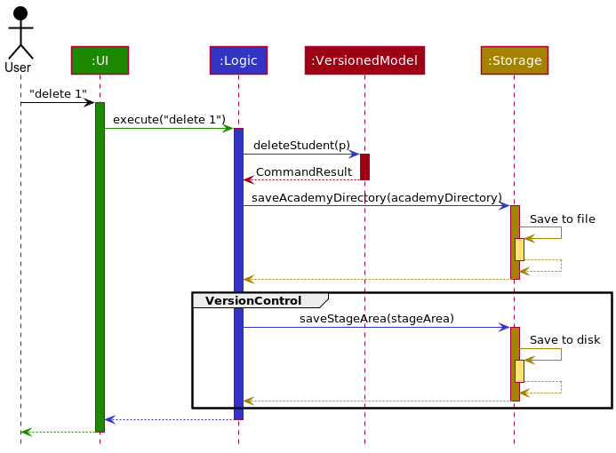

The part labeled "VersionControl" occurs because `delete` is a version controlled command. For non-version controlled
commands the sequence diagram stays largely the same; the difference is the lack of the "VersionControl" part. 
For a list of version controlled command, refer [here](#appendix-c-version-controlled-commands).

Each of the four main components (also shown in the diagram above),

* defines its *API* in an `interface` with the same name as the Component.
* implements its functionality using a concrete `{Component Name}Manager` class (which follows the corresponding API `interface` mentioned in the previous point.

For example, the `Logic` component defines its API in the `Logic.java` interface and implements its functionality using the `LogicManager.java` class which follows the `Logic` interface. Other components interact with a given component through its interface rather than the concrete class (reason: to prevent outside component's being coupled to the implementation of a component), as illustrated in the (partial) class diagram below.

The sections below give more details of each component.

### UI component

The **API** of this component is specified in [`Ui.java`](https://github.com/AY2122S1-CS2103T-T15-3/tp/blob/master/src/main/java/seedu/academydirectory/ui/Ui.java)

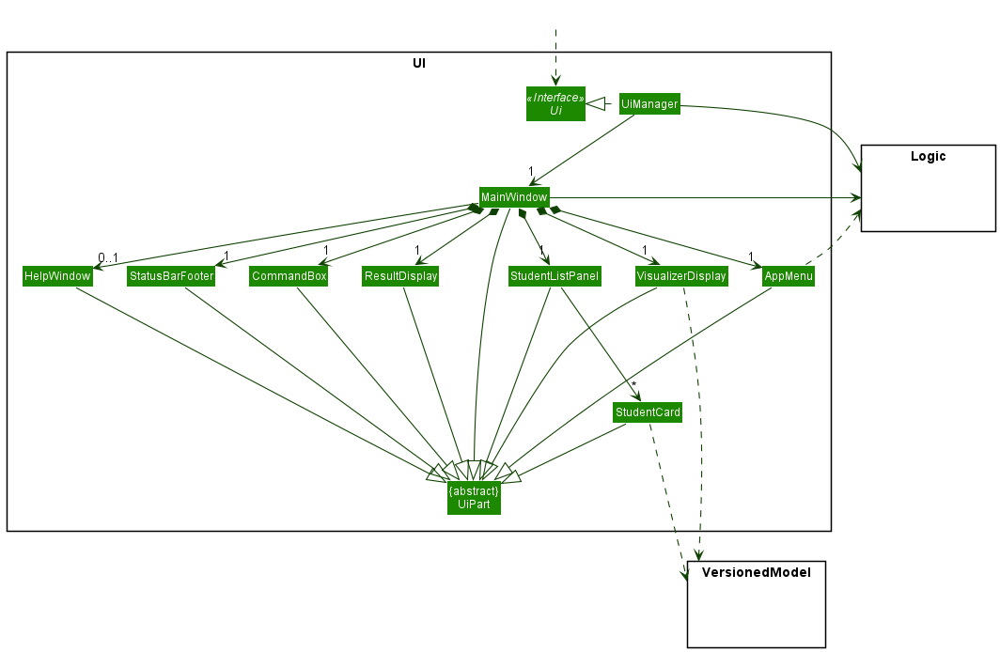

The UI consists of a `MainWindow` that is made up of parts smaller UI-part components, including `CommandBox`, `ResultDisplay`, 
`VisualizerDisplay`, `StudentListPanel`, `StatusBarFooter` etc. All these, including the `MainWindow`, inherit from the abstract 
`UiPart` class which captures the commonalities between classes that represent smaller parts of the visible GUI. Of these, all components are always presented,
except for the Help Window which can be shown or hide depending on the results of user command.

Some classes of the UI, notably `CommandBox` and `AppMenu`, keeps a reference of a functional interface called `CommandExecutor` that
executes a Command from the Logic `component`. In consideration of this design - it is done allow components of UI to execute user commands 
while still maximizing abstraction and reducing reliance of UI on the Logic component - rather it will be dependent on an intermediate component within UI.

The `UI` component uses the JavaFx UI framework. The layout of these UI parts are defined in their respective matching `.fxml` files stored in the `src/main/resources/view` folder. For example, the layout of the 
[`MainWindow`](https://github.com/AY2122S1-CS2103T-T15-3/tp/blob/master/src/main/java/seedu/academydirectory/ui/MainWindow.java) is 
specified in [`MainWindow.fxml`](https://github.com/AY2122S1-CS2103T-T15-3/tp/blob/master/src/main/resources/view/MainWindow.fxml)

The `UI` component,

* executes user commands using the `Logic` component.
* listens for changes to `VersionedModel` data so that the UI can be updated with the modified data.
* keeps a reference (for Main Window) or depends (for AppMenu) on the `Logic` component, because the `UI` relies on the `Logic` to execute commands.
* keeps a reference of some classes in the `VersionedModel` component, particularly the Student class, as it displays `Student` object residing in 
  the `VersionedModel` and requires grades statistics from `Student` object in the `VersionedModel`.
  
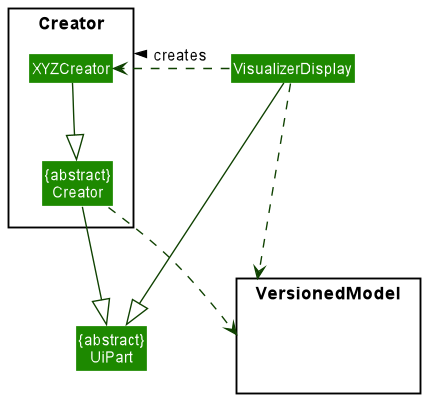

One important component of the UI is the specialized Creator class which extends the abstract class UiPart - for the purpose of reusing the Visualizer Display
to show users the result of a command execution. The Creator class takes in an AdditionalInfo object from Versioned Model, and convert it to the specific view
for displaying to users in the Visualizer Display.

### Logic component

**API** : [`Logic.java`](https://github.com/AY2122S1-CS2103T-T15-3/tp/blob/master/src/main/java/seedu/academydirectory/logic/Logic.java)

Here's a (partial) class diagram of the `Logic` component:

How the `Logic` component works:
1. When `Logic` is called upon to execute a command, it uses the `AcademyDirectoryParser` class to parse the user command.
1. This results in a `Command` object (more precisely, an object of one of its subclasses e.g., `AddCommand`) which is executed by the `LogicManager`.
1. The command can communicate with the `VersionedModel` when it is executed (e.g. to add a student).
1. The result of the command execution is encapsulated as a `CommandResult` object which is returned back from `Logic`.

The Sequence Diagram below illustrates the interactions within the `Logic` component for the `execute("delete 1")` API call.

:information_source: **Note:** The lifeline for `DeleteCommandParser` should end at the destroy marker (X) but due to a limitation of PlantUML, the lifeline reaches the end of diagram.

Here are the other classes in `Logic` (omitted from the class diagram above) that are used for parsing a user command:

How the parsing works:
* When called upon to parse a user command, the `AcademyDirectoryParser` class creates an `XYZCommandParser` (`XYZ` is a placeholder for the specific command name e.g., `AddCommandParser`) which uses the other classes shown above to parse the user command and create a `XYZCommand` object (e.g., `AddCommand`) which the `AcademyDirectoryParser` returns back as a `Command` object.
* All `XYZCommandParser` classes (e.g., `AddCommandParser`, `DeleteCommandParser`, ...) inherit from the `Parser` interface so that they can be treated similarly where possible e.g, during testing.

### VersionedModel component
**API** : [`VersionedModel.java`](https://github.com/AY2122S1-CS2103T-T15-3/tp/blob/master/src/main/java/seedu/academydirectory/model/VersionedModel.java)
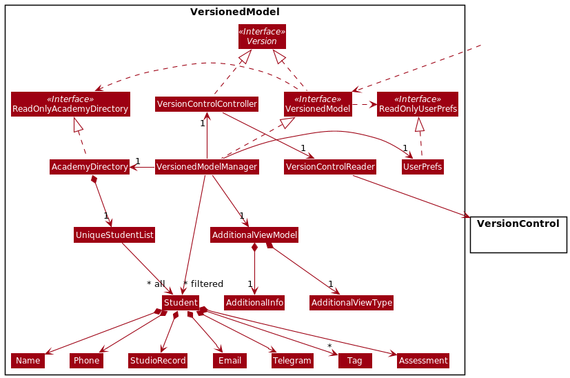

The `VersionedModel` component,

* stores the academy directory data i.e., all `Student` objects (which are contained in a `UniqueStudentList` object).
* stores the currently 'selected' `Student` objects (e.g., results of a search query) as a separate _filtered_ list which is exposed to outsiders as an unmodifiable `ObservableList<Student>` that can be 'observed' e.g. the UI can be bound to this list so that the UI automatically updates when the data in the list change.
* stores a `UserPref` object that represents the user’s preferences. This is exposed to the outside as a `ReadOnlyUserPref` objects.
* does not depend on any of the other three components (as the `VersionedModel` represents data entities of the domain, they should make sense on their own without depending on other components)
* interfaces with `VersionControl` via the `VersionControlController`, which implements the `Version` API
and thus gives the `VersionedModel` component the ability to interface with version control entities such as `Commit`.
* stores a `AddtionalViewModel` that stores additional information required by the UI's `VisualizerDisplay` such as number statistic for the `Visualize` command.

The above implementation is chosen because it makes _turning off_ version control relatively simple; a stub `VersionControlController`
can be used instead.

For more information regarding `VersionControl`, read [here](#versioncontrol-component).

:information_source: **Note:** An alternative (arguably, a more OOP) model is given below. It has a `Tag` list in the `AcademyDirectory`, which `Student` references. This allows `AcademyDirectory` to only require one `Tag` object per unique tag, instead of each `Student` needing their own `Tag` objects. 

### Storage component

**API** : [`Storage.java`](https://github.com/AY2122S1-CS2103T-T15-3/tp/blob/master/src/main/java/seedu/academydirectory/storage/Storage.java)

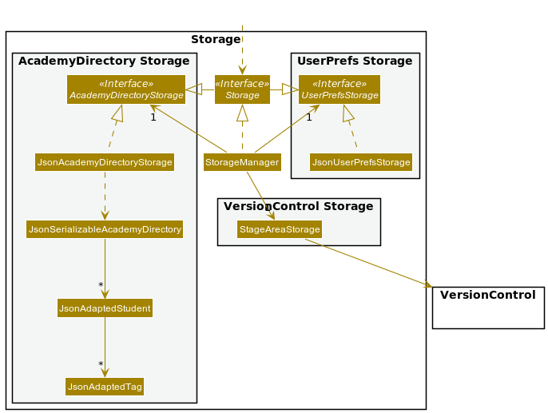

The `Storage` component,
* can save both academy directory data and user preference data in json format, and read them back into corresponding objects.
* inherits from both `AcademyDirectoryStorage` and `UserPrefStorage`, which means it can be treated as either one (if only the functionality of only one is needed).
* depends on some classes in the `VersionedModel` component (because the `Storage` component's job is to save/retrieve objects that belong to the `VersionedModel`)
* can write version control objects to disk

### Common classes

Classes used by multiple components are in the `seedu.academydirectory.commons` package.

### VersionControl Component
The internal version control system in AcademyDirectory is inspired by Git. As such, `VersionControl` 
keeps track of AcademyDirectory data state by using `VcObject` which corresponds to Git objects.

**Design Considerations:**

**Aspect: How to save state changes**
- **Alternative 1 (current choice):** Saves state changes to disk ala Git
  - Pros:
    - future-proof; even when AcademyDirectory supports adding and tracking many files e.g. 
    profile pictures of students, code screenshots etc. 
    - provides backbone for additional features e.g. regeneration of data even when data becomes 
    corrupted, etc.
    - Undo, redo, and history operations can be implemented easily
    - Undo and redo operations can still be done even when application is closed and opened again
  - Cons: Complex implementation
    
- **Alternative 2:** Saves state changes in memory: 
  - Pros: Easy to implement
  - Cons: Lacks future-proof*ness* of the first alternative

#### VersionControl Objects
Shown below is the corresponding class diagram:

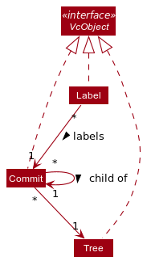

**Explanation of the objects shown above:**
- `Tree`: 
  - represents a snapshot of `data` directory of AcademyDirectory.  It maintains a mapping between version-controlled
filenames and actual filename of tracked blobs.
  - Version controlled name is by default `SHA-1` hash of the blob. However, it is possible 
  to change this to `SHA-256` or even `MD5`. 
  - Supported hash functions are present in `HashMethod`
- `Commit`:
  - saves information regarding the changes to AcademyDirectory data:
    - who makes the change
    - when was the change made
    - what change was made exactly. 
  - points to a `Tree` which represents the snapshot of data _after_ the change is made
  - points to a `Commit` object which represents the parent of the current `Commit` object
- `Label`:
  - labels a `Commit`
  - relevant labels are `HEAD` which represents the current commit, `MAIN` which represents
current branch, and `OLD` which represents the most recent branch before the current branch.

**A few implementation details:**
- A `VcObject` does not actually hold a reference to 
another `VcObject`; rather it has a `Supplier` of the `VcObject` that it's supposed to have
a reference to. This is to defer read operations to avoid memory overhead.
- Equality of `VcObject` is checked using its _hash_. This follows the idea that a _hash_ is 
intended to be a reliable fingerprint, and the chosen hash function (SHA1) has a (very) low probability 
of collision. 
- All classes which extends `VcObject` class should have a singleton NULL private instance. This reduces headache in terms of 
handling edge cases e.g. root of commit tree, exception handling, etc. The NULL singleton is used to indicate failure
for whatever reason, and allows the application to remain operational.
- Class-specific implementation details: 
  - `Tree` supports an additional method `Tree#regenerateBlobs()`, which regenerate the files
  maintained by the said `Tree`.
  - `Commit` supports a few additional methods which reflect the underlying commit tree: 
    - `Commit#findLca(Commit)` finds the lowest common ancestor of two commits, returning `Commit.emptyCommit()` 
    if no common ancestor can be found.
    - `Commit#getHistory()` returns all commits from given commit to the root of the commit tree.
    - `Commit#getHighestAncestor()` returns the commit ancestor that is the furthest away,
    limited by the given end Commit or by the root of the commit tree.

**Design Considerations:**

**Aspect: Which change to track**
- **Alternative 1 (current choice):** Tracks changes at the file level
  - Pros: Easy to implement
  - Cons: May have performance issues in terms of disk space and memory usage

- **Alternative 2:** Tracks changes at the line level of the file:
  - Pros: Lower disk space requirements
  - Cons: Difficult to implement
  
**Possible improvements in the future:** 
- Explore implementing `VcObject` as a proper monad with the bind operator, considering the clear relationship
between the different `VcObject`.

#### Interfacing with other components
Both the `Storage` component and `VersionedModel` component interfaces with `VersionControl`
for different reasons:
- `Storage`: needs to be able to write `VcObject`s to disk
- `VersionedModel`:
  - needs to be able to read `VcObject`s from disk.
  - needs to be able to create new `VcObject`s. However, this requires computing the `VcObject`
  file representation's hash i.e. `VersionedModel` needs minimum write access to disk to be able to compute hash

As such, `VersionControl` provides three facade classes, each representing one of the above requirements. The following
class diagram shows this:

The facade classes are: 
- `VersionControlGeneralReader`: to read `VcObject` from disk
- `VersionControlGeneralWriter`: to write `VcObject` to disk
- `HashComputer`: to compute hash of a file or hash of a `VcObject`. MUST NOT expose actual
write methods as this would allow `VersionedModel` to write to disk, breaking abstractions.

To modify disk representation of a particular class which extends from `VcObject`, modify both its `Reader`
  and `Writer`.

**Design Considerations:**

**Aspect: How to represent `VcObject` in disk**
- **Alternative 1 (current choice)**: Custom representation
  - Pros: Smaller disk space utilisation
  - Cons: Added layer of complexity
- **Alternative 2**: Standard representation e.g. JSON
  - Pros: Parsing is simple i.e. use Jackson library
  - Cons: Larger disk space utilisation

Considering that `VcObject`s are not very complicated, the added layer of complexity does not outweigh 
the benefits of smaller disk space utilisation in our opinion. Hence, we go for alternative 1.

**Possible improvements in the future:**
- Make version control folder hidden from user
- Make version control files read-only. This is best done if future iterations implement a login system
- Use delta encoding to keep track of `VcObject`

--------------------------------------------------------------------------------------------------------------------

## **Implementation**

This section describes some noteworthy details on how certain features are implemented.

### Managing Students' Personal Details
### AddCommand

This command adds a new `Student` to `AcademyDirectory`.

#### Implementation
`AddCommand` will extend the `Command` class and will consequently `@Override` the `Command#execute()` method to serve the aforementioned purpose. 
The `AddCommand` is a version controlled command. For the list of version controlled command, refer [here](#appendix-c-version-controlled-commands)

`AddCommand` adds students to the `AcademyDirectory`. This command prevents addition of duplicate students by ensuring that each `Student` has a unique `NAME`. 
The `NAME` field is a sufficiently unique field to identify a unique instance of a student because `AcademyDirectory` is scoped to 
service CS1101S Avengers. In the CS110S module each _Studio_ has at most 10 `Students`. Thus, the probability of a `NAME` collision being sufficiently minimised.

:information_source: **Note:** The responsibility of ensuring that `Student` 
does not have unnecessary duplicate personal detail (e.g same `PHONE`) is left to the Avenger.

The specifics are shown in the sequence diagram below:
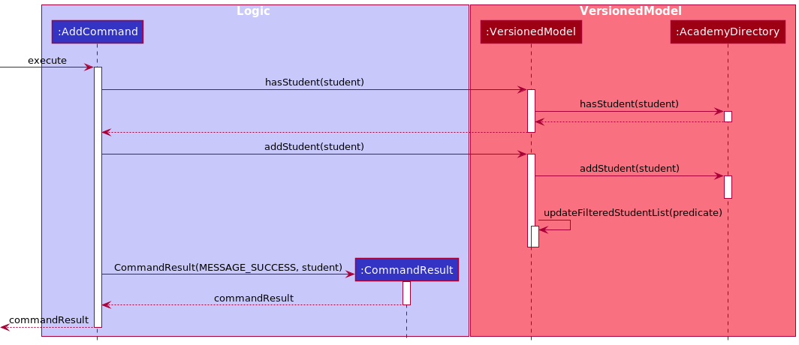

### DeleteCommand

This command deletes a `Student` from `AcademyDirectory`.

#### Implementation
`DeleteCommand` will extend the `Command` class and will consequently `@Override` the `Command#execute()` method to serve the aforementioned purpose.
The `DeleteCommand` is a version controlled command. For the list of version controlled command, refer [here](#appendix-c-version-controlled-commands).

`DeleteCommand` deletes `Student` based on the relative `INDEX` in the `ObservableList` which is the list of `Student` viewed by the `Avenger`. To do this, `DeleteCommand` makes a call to `VersionedModel#deleteStudent()`.

The specifics are shown in the sequence diagram below:

### TagCommand
This command assigns tags to a `Student`.

#### Implementation
`TagCommand` will extend the `Command` class and consequently `@Override` the `Command#execute()` method
to serve the aforementioned purpose. The `TagCommand` is a version controlled command. For the list of version controlled command, refer [here](#appendix-c-version-controlled-commands).

`TagCommand` tags a `Student` based on the relative `INDEX` in the `ObservableList`. The `Tag` is implemented with a HashSet
that stores the `Tag`. When `TagCommand` is executed, the `Student`'s `Tag` attribute will be replaced by a new HashSet
containing the input `Tag` object(s). In the event the input `Tag` is empty, the `Student`'s `Tag` attribute will be replaced by an
empty HashSet.

The following sequence diagram describes what happens when `TagCommand` is executed:

### GetCommand
This command serves to retrieve a specific `PersonalDetail` of students or a student.

#### Implementation
`GetCommand` will extend the `Command` class and will consequently `@Override` the `Command#execute()` method to serve the aforementioned purpose.

All fields of `Student` class which implements the `PersonalDetail` interface and whose prefix is present in
`GetCommand#SUPPORTED_PREFIX` can be queried by `GetCommand`.

A `GetCommand` is initialized with a list of `Prefix` objects which represents the prefix of the `PersonalDetail`
to be retrieved, and a list of `String` which represents the keywords that will be matched with 
the names of students in Academy Directory. List of `Prefix` cannot be empty, but list of keywords can be.
An empty list of keywords is interpreted as retrieving personal details of all students in the model. If 
list of keywords is not empty, then the pattern-matching behavior for name in `GetCommand` is similar to that
of the [`FilterCommnd`](#filtercommand).

The specifics are shown in the sequence diagram below:

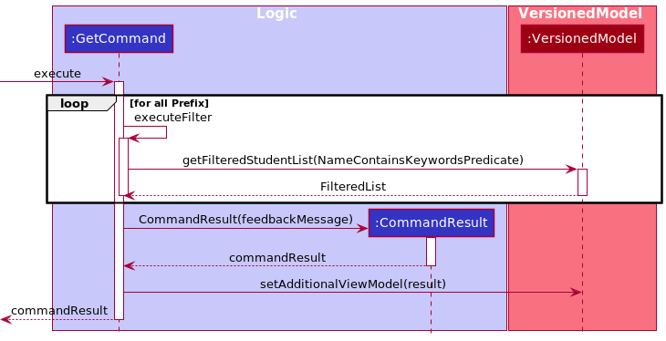

Because the output of `GetCommand` can be long, for readability reasons the result is displayed
in the `AdditionalView` part of the UI. 

### EditCommand
This command edits a `Student`'s personal details such as their `NAME`, `PHONE`, `TELEGRAM` and `EMAIL`.

#### Implementation
`EditCommand` will extend the `Command` class and will consequently `@Override` the `Command#execute()` method to serve the aforementioned purpose.
The `EditCommand` is a version controlled command. For the list of version controlled command, refer [here](#appendix-c-version-controlled-commands)

Similar to `AddCommand`, `EditCommand` supports duplicate prevention by checking that the `NAME` being edited is unique in the list
unless the `NAME` is the same  as the `Student` being edited.

:information_source: **Note:** The responsibility of ensuring that `Student` 
does not have unnecessary duplicate information (e.g same `PHONE`) is left to an Avenger.

The following sequence diagram describes what happens when `GradeCommand` is executed:

### Track Students' Grades, Studio Attendance, and Participation

### GradeCommand

This command serves to update the `Grade` of various `Assessment` that the students will undergo in CS1101S. The assessments include RA1, Midterm, RA2, Practical Exam (PE), and Final.

#### Implementation

`GradeCommand` will extend the `Command` class and will consequently `@Override` the `Command#execute()` method to serve the aforementioned purpose.
The `GradeCommand` is a version controlled command. For the list of version controlled command, refer [here](#appendix-c-version-controlled-commands)

The recording of grade is facilitated by adding an `Assessment` parameter to the `Student`.
The `Assessment` is implemented with a HashMap that stores the String representation of the assessments as the keys, and the integer `Grade` as the values.

The following sequence diagram describes what happens when `GradeCommand` is executed:

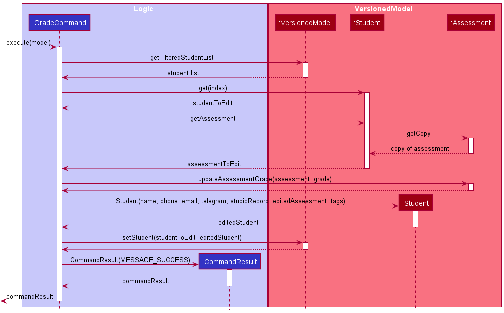

### AttendanceCommand

This command serves to update the attendance status of students. A student's `Attendance` can be either attended or unattended.

#### Implementation

`AttendanceCommand` will extend the `Command` class and will consequently `@Override` the `Command#execute()` method to serve the aforementioned purpose.
The `AttendanceCommand` is a version controlled command. For the list of version controlled command, refer [here](#appendix-c-version-controlled-commands)

The attendance mechanism is facilitated by adding a `StudioRecord` parameter to the `Student`. This `StudioRecord` has an `Attendance` object which we can use to track and update the `Attendance` of the `Student`. `Attendance` implements `Information` and the actual storing of the attendance status is done with a `boolean array`.

The following sequence diagram describes what happens when `AttendanceCommand` is executed:

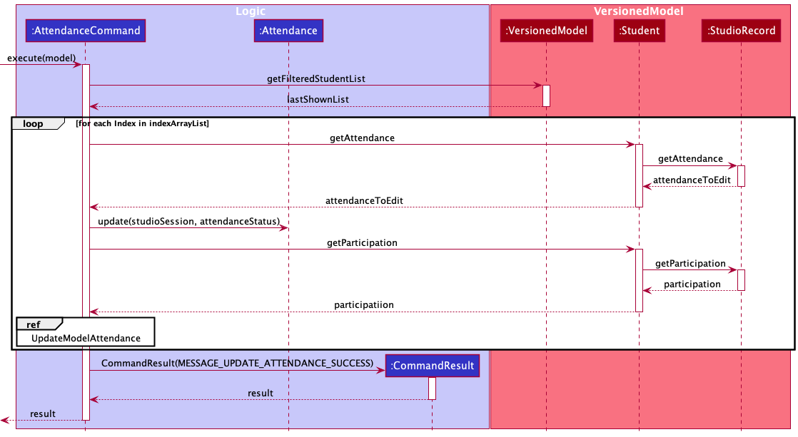

For `UpdateModelAttendanceSequenceDiagram`, the sequential diagrams can be found below:

### ParticipationCommand

This command serves to update the `Participation` score of students. Following the XP system for CS1101S, each student is awarded between 0 and 500 XP (inclusive) per Studio session.

#### Implementation

`ParticipationCommand` will extend the `Command` class and will consequently `@Override` the `Command#execute()` method to serve the aforementioned purpose.
The `ParticipationCommand` is a version controlled command. For the list of version controlled command, refer [here](#appendix-c-version-controlled-commands)

The implementation is similar to `AttendanceCommand`, with the same sequence diagram being applicable for Participation given that the proper refactoring to `Participation` is done.

`ParticipationCommand` has an additional section in the sequence diagram located above the loop in `AttendanceCommand`. The purpose of the logic below is to update a student's `Attendance` to be marked as present if the `participationUpdate` is greater than 0. This is because a student that has a positive `Participation` score would also count as having attended the `Studio`.

:information_source: **Note:** The logic above is to update the `Attendance` and is only executed in the event that `participationUpdate` is more than 0. Otherwise, it will not run.

 

### Visualization Tools

### ViewCommand

This command serves to display the summarised details of a single `Student` in the `AcademyDirectory`.

`ViewCommand` displays the `Student` based on the relative `INDEX` in the `ObservableList` which is the list of `Student` viewed by the `Avenger`.
Once the index and the student associated with the index is retrieved, it is set on the Additional View Model - with its associated type and info,
to send to the UI for display.

It extends the abstract class `Command` and will consequently `@Override` the `Command#execute()` method to serve the aforementioned purpose.

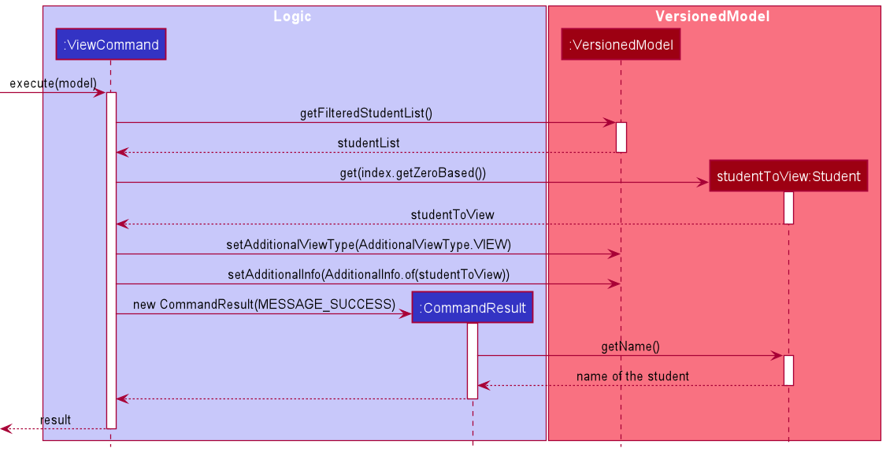

#### Implementation

`ViewCommand` will extend the `Command` class and will consequently `@Override` the `Command#execute()` method to serve the aforementioned purpose.

### ShowCommand

This command serves to display the collated score of all students in the Academy Directory for a specific `Assessment`. The assessments that can be queried are: RA1, Midterm, RA2, Practical Exam (PE), and Final.

#### Implementation

`ShowCommand` will extend the `Command` class and will consequently `@Override` the `Command#execute()` method to serve the aforementioned purpose.

The grades are collated by iterating through all the students and extracting the score from the `Assessment` HashMap using the input `Assessment` as the key.
The information is formatted into a String and displayed in the AdditionalView. The success message is parsed into `CommandResult` to be returned by `ShowCommand`.

The following sequence diagram describes what happens when `ShowCommand` is executed:

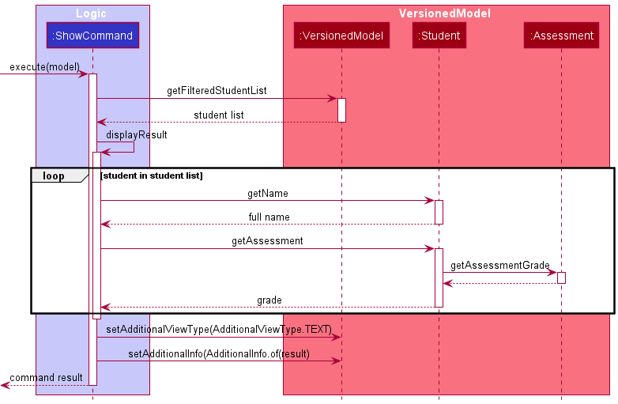

### VisualizeCommand

This command provides a Box Plot of the performance of all `Student` in `AcademyDirectory` in all `Assessment`.

#### Implementation

`VisualizeCommand` will extend the `Command` class and will consequently `@Override` the `Command#execute()` method to serve the aforementioned purpose.

The grades are collated by iterating through all the students and extracting the grades from the `Assessment` HashMap using the input `Assessment` as the key.

The information is returned as a HashMap with key being the `Assessment` name and value being a list containing the class' grade in that assessment.
The information will be displayed in the AdditionalView. The success message is parsed into `CommandResult` to be returned by `VisualizeCommand`.

The following sequence diagram describes what happens when `VisualizeCommand` is executed:

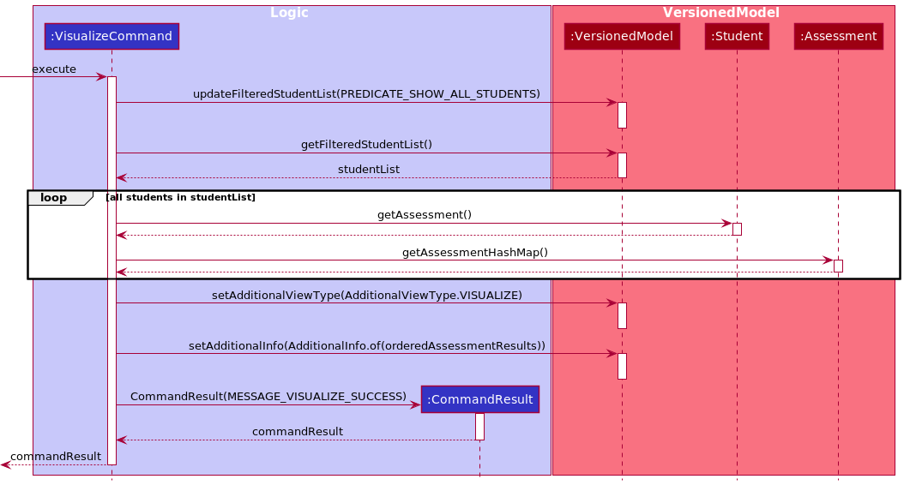

### FilterCommand

This command filters the `ObservableList` by `Name` or `Tag`.  

#### Implementation

`FilterCommand` will extend the `Command` class and will consequently `@Override` the `Command#execute()` method to serve the aforementioned purpose.

The `FilterCommand` searches the `AcademyDirectory` for students with `Name` or `Tag` matching the keyword and displays
the student list with the filtered students.

The following sequence diagram describes what happens when `FilterCommand` is executed:

### SortCommand

This command sorts the `AcademyDirectory` student list based on their `Participation`, `Assessment` and `Name`. When sorting by `Assessment`, users have the option of sorting by individual `Assessment` or by the average grade among. Users can also choose if they want to sort by ascending or descending.

#### Implementation

`SortCommand` will extend the `Command` class and will consequently `@Override` the `Command#execute()` method to serve the aforementioned purpose.
The `SortCommand` is a version controlled command. For the list of version controlled command, refer [here](#appendix-c-version-controlled-commands)

The sorting mechanism is based on the `List` interface as it sorts the various `FilteredList` instances using `Comparator`. Based on the `attribute` of the `SortCommand` being executed, the `Comparator` differs as shown by the sequential diagram below:

The reference frame for GetComparator can be found below. It details the selection process based on the `attribute` of the `SortCommand`.

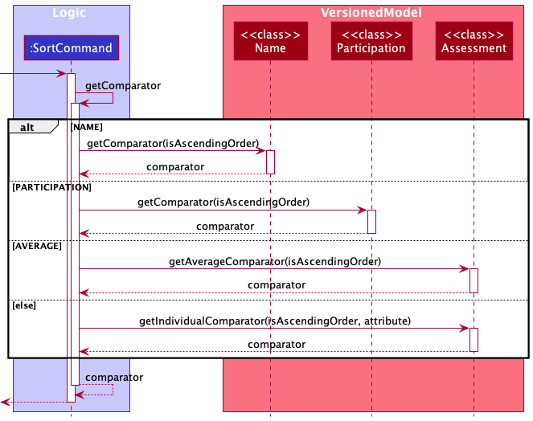

### Others

### ExitCommand

This command allows user to exit the application after saving all operations and data
It extends the `Command` class and will consequently `@Override` the `Command#execute()` method to serve this purpose.

#### Implementation

### ListCommand

This command shows all students on the class, ordered by when the student is added to the Academy.

#### Implementation

`ListCommand` will extend the `Command` class and will consequently `@Override` the `Command#execute()` method to serve the aforementioned purpose.
`ListCommand` retrieves the student list and display it on the student list panel on the left side. All students will be displayed.

### ClearCommand

This command clears all `Student` entries from `AcademyDirectory`.

#### Implementation

`ClearCommand` will extend the `Command` class and will consequently `@Override` the `Command#execute()` method to serve the aforementioned purpose 
and is Version Controllable. A new Academy Directory is created to replace the current one, meaning that the student list is set to empty.
The `ClearCommand` is a version controlled command. For the list of version controlled command, refer [here](#appendix-c-version-controlled-commands)

### HistoryCommand
This command shows the commit history. Each commit will be shown with its five character hash, 
author, date, and commit message. Only commands that are _version controlled_ will result in a commit
being created and thus shown by `HistoryCommand`. Commands which can be undone are referred to as _version controlled commands_ (read [here](#glossary)
for details on what this means).

This command is meant for:
* reminding users what changes were made to the underlying AcademyDirectory Data
* revealing (five character) hash of commits that can be used with `RevertCommand`.

#### Implementation
`HistoryCommand` will extend the `Command` class and will consequently `@Override` the `Command#execute()` method to
serve the aforementioned purpose.

The `HistoryCommand` makes use of the following set of invariance:
- The most recent commit that belongs to the current branch is always labelled as `MAIN`
- The most recent commit that belongs to the second-most-recent branch is always labelled
as `OLD`

These guarantees are assured by the `VersionedModel#commit` method. Note that `HEAD` and `MAIN` need not
refer to the same commit e.g. if the user reverts to a previous commit then `MAIN` and `HEAD` will refer to 
different commits. 

Because this set of invariance are respected, thus `HistoryCommand` can show commit history by doing the following: 
- fetch the commits labelled as `MAIN` and `OLD` from disk (methods to do this exposed by `VersionedModel`)
- find the lowest common ancestor between `MAIN` and `OLD` (`Commit#findLca` method used here)
- show all commits from initial commit until the lowest common ancestor found above normally
- show all commits from the lowest common ancestor until `MAIN` and `OLD` as per the desired
formatting

The following sequence diagram shows the above implementation:

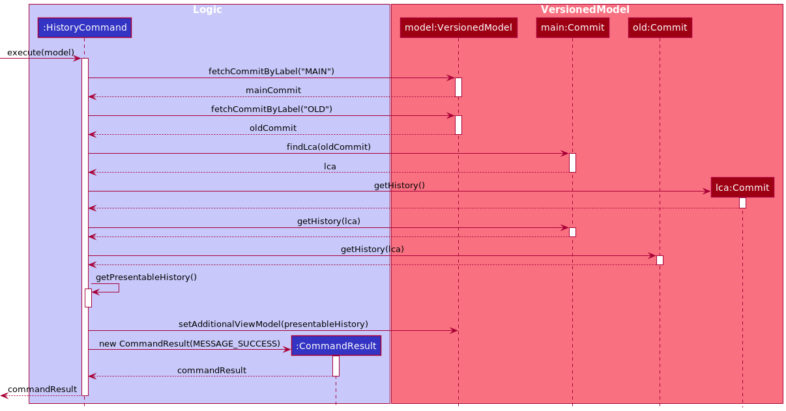

Note that the above diagram is omits several details but should be sufficient to grasp how `HistoryCommand` works.

#### Limitation
The current implementation can only show two commit branches: `MAIN` and `OLD`. While this is
sufficient in most cases, the ability to show arbitrary number of commit branches to give users
the ability to revert to any previous commits easily without having to look for the commit's hash
manually in disk. However, due to the implementer's inability to figure out how best to show
arbitrary number of commit branches, the current `HistoryCommand` thus can only show two branches. 

### RevertCommand
This command reverts the underlying `AcademyDirectory` data to a previous commit, as identified by the commit's hash.
Commands which can be undone are referred to as _version controlled commands_ (read [here](#glossary) 
for details on what this means). The following is true regarding `RevertCommand`:

- If any of the following occurs which leads to a failure in parsing commit file in disk, no changes
are made to the underlying disk: 
  - provided hash cannot be found on disk
  - commit file with the given hash exists, but is corrupted
  - commit file with the given hash exists, but no read access is given to AcademyDirectory
  - other reasons which leads to failure in reading commit file
- Otherwise, the `AcademyDirectory` storage data will be restored according to the target commit
to be reverted to. 

#### Implementation
`RevertCommand` will extend the `Command` class and will consequently `@Override` the `Command#execute()` method to
serve the aforementioned purpose.

`RevertCommand` reverts state of AcademyDirectory data by doing the following:
- fetch commit identified by the given hash
- shift `VersionedModel`'s `HEAD` pointer to the commit
- restores the academy directory data according to the tree that the fetched commit points to

The following sequence diagram shows the above implementation:

Note that the above diagram is incomplete; it is approximately accurate but is sufficient to help explain the limitation
of `RevertCommand`, as in below. 

#### Limitation
Because `RevertCommand` has to restore academy directory data which is the responsibility of the
`Storage` component, `RevertCommand` creates a `StorageManager` and uses it to load data from disk 
and set the current `VersionedModel` internal data to the newly reloaded data. This is indicated in the sequence diagram
as the sudden use of `Storage` component directly from `RevertCommand`. This is (highly) not 
ideal, but the implementer has no idea how to do this properly i.e. without sudden creation of a new `StorageManager`
... Right now the solution is to ensure that this newly created `StorageManager` is destroyed immediately to prevent
access from elsewhere, and to put this limitation in this documentation to be solved one day. 

### UndoCommand
This command undoes a change done to the underlying `AcademyDirectory` data. Note that this is
different from the _view_ of the data e.g. when the `ViewCommand` is used, the _view_ visible to 
the user changes, but the underlying data does not change. Commands which can be undone are referred to 
as _version controlled commands_ (read [here](#glossary) for details on what this means).

#### Implementation
`UndoCommand` will extend the `Command` class and will consequently `@Override` the `Command#execute()` method to
serve the aforementioned purpose. Internally, the `UndoCommand` makes use of the `RevertCommand`. 
Hence `UndoCommand` serves as _syntactic sugar_ for the `RevertCommand`.

### RedoCommand
This command redoes a change done to the underlying `AcademyDirectory` data. Note that this is
different from the _view_ of the data e.g. when the `ViewCommand` is used, the _view_ visible to
the user changes, but the underlying data does not change. Commands which can be redone are referred to
as _version controlled commands_ (read [here](#glossary) for details on what this means).

#### Implementation
`RedoCommand` will extend the `Command` class and will consequently `@Override` the `Command#execute()` method to
serve the aforementioned purpose. Internally, the `RedoCommand` makes use of the `RevertCommand`.
Hence `RedoCommand` serves as _syntactic sugar_ for the `RevertCommand`.

### HelpCommand

This command serves to guide new users on using the application, which syntax to use and when to use them. Users can view a summary of all commands' syntax,
or a specific guide on how to use a particular command.

#### Implementation

`HelpCommand` will extend the `Command` class, and consequently `@Override` the `Command#execute()` method to serve its initial purposes.

The mechanism of the command is done by retrieving a `HELP_MESSAGE` field in each of the other command classes (other than HelpCommand itself). This help command will
be displayed to the user on a separate window later on.

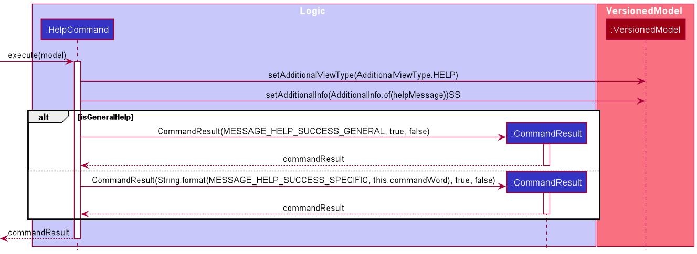

As seen from the diagram, the `HelpCommand` involves the use of conditional branches. If the optional condition is met, a `CommandException` is thrown to let
users know that the input is invalid.

Otherwise, the HelpCommand will use conditional branch to guide users to two different scenarios, as shown above. If it is a general help, a general help command
will be created. If it is a specific help, then a specific help command associated with a command will be created.

--------------------------------------------------------------------------------------------------------------------

## **Guides**

The following links to guides on: Documentation, Logging, Testing, Configuration, Dev-Ops.

* [Documentation guide](Documentation.md)
* [Testing guide](Testing.md)
* [Logging guide](Logging.md)
* [Configuration guide](Configuration.md)
* [DevOps guide](DevOps.md)

--------------------------------------------------------------------------------------------------------------------
## **Appendix**

## Appendix A: Requirements

### Product scope

**Target user profile**:

* has a need to manage a significant number of contacts
* can type fast
* prefers typing to mouse interactions
* is reasonably comfortable using CLI apps
* is an Avenger for CS1101S (a tutor in CS1101S is known as an Avenger)

**Value proposition**:

Currently, Avengers are able to utilise Source Academy as a platform to aid in their students'
learning. However, there is no proper feature that allows Avengers to
maintain a nominal roll for their class, or to track their students' performance.

Academy Directory is designed to fill that gap! It is specifically tailored to help Avengers
better manage their students. The app provides ease of communication, and allows Avengers to
track their students' performance, in terms of attendance, participation and assessments.

### User stories

Priorities: High (must have) - `* * *`, Medium (nice to have) - `* *`, Low (unlikely to have) - `*`

| Priority | As a …​                | I want to …​                                                    | So that I can…​                                                     |
| -------- | --------------------------| ------------------------------------------------------------------ | ---------------------------------------------------------------------- |
| `* * *`  | CS1101S Avenger           | add, delete and edit student's information                         | update my class list                                                   |
| `* * *`  | CS1101S Avenger           | retrieve specific details of a student                             | view and analyse the data                                              |
| `* * *`  | CS1101S Avenger           | keep track of my students' tutorial performance                    | accurately reward class participation marks                            |
| `* * *`  | CS1101S Avenger           | record my students' assessment results                             | monitor my students' progress and provide timely assistance to them    |
| `* * *`  | first time user           | access the relevant commands with a "help" command                 | learn how to use the app more easily                                   |
| `* *`    | CS1101S Avenger           | view the average scores of my students for specific assessments    | focus on the aspects to improve on during tutorial                     |
| `* *`    | CS1101S Avenger           | visualize the class scores for specific assessments                | gauge how well my students are doing in assessments                    |
| `* *`    | CS1101S Avenger           | add tags to certain students to take note of their weaker topics   | focus on topics that they are struggling with                          |
| `* * `   | CS1101S Avenger           | see history of changes to Academy Directory data                   | easily revert accidental changes to data                               |
| `* * `   | CS1101S Avenger           | undo changes made to Academy Directory data                        | easily revert accidental changes to data                               |
| `* * `   | CS1101S Avenger           | redo changes made to Academy Directory data                        | easily revert accidental undos to data                                 |

### Use cases

(For all use cases below, the **System** is the `AcademyDirectory` and the **Actor** is the `User`, unless specified otherwise)

**Use case: Seeking help**

**MSS**

1. User requests for assistance
2. Academy Directory shows a list of all commands available
3. User requests for help in a specific command
4. Academy Directory shows the User Guide instructions for that command
   
   Use case ends

**Extensions**
* 3b. User requests for help in a command that does not exist
  * 3b1. Academy Directory shows an error message
    
    Use case resumes at step 2.

**Use case: Delete a student**

**MSS**

1.  User requests to list students
2.  Academy Directory shows a list of students
3.  User requests to delete a specific student in the list
4.  Academy Directory deletes the student

    Use case ends.

**Extensions**

* 2a. The list is empty.

  Use case ends.

* 3a. The given index is invalid.

    * 3a1. Academy Directory shows an error message.

      Use case resumes at step 2.

**Use case: Edit a student**

**MSS**

1.  User requests to list students
2.  Academy Directory shows a list of students
3.  User requests to edit a specific student in the list
4.  Academy Directory edit the student

    Use case ends.

**Extensions**

* 2a. The list is empty.

  Use case ends.

* 3a. The given index is invalid.

    * 3a1. Academy Directory shows an error message.

      Use case resumes at step 2.

**Use case: Update Studio attendance of student**

**MSS**

1.  User requests to list students attending the relevant Studio session
2.  Academy Directory shows a list of students attending the relevant Studio session
3.  User requests to update the attendance of the student in the relevant Studio session
4.  Academy Directory updates the student's attendance for the relevant Studio session

    Use case ends.

**Extensions**

* 1a. The given index for the Studio group is invalid.

  * 1a1. Academy Directory shows an error message.
      Use case resumes at step 1.

* 1b. The given index for the Studio group's Studio session is invalid.

  * 1b1. Academy Directory shows an error message.
      Use case resumes at step 1.

* 2a. The list is empty.

  Use case ends.

* 3a. The given keyword to search for the student is gives no result.

    * 3a1. Academy Directory shows an error message.

      Use case resumes at step 2.

**Use case: Update Studio participation of student**

**MSS**

1. User requests to list students attending the relevant Studio session
2. Academy Directory shows a list of students attending the relevant Studio session
3. User requests to update the Studio participation of the student in the relevant Studio session with the appropriate Studio participation score
4. Academy Directory updates the student's Studio participation for the relevant Studio session

    Use case ends.

**Extensions**

* 1a. The given index for the Studio group is invalid.

    * 1a1. Academy Directory shows an error message.

      Use case resumes at step 1.

* 1b. The given index for the Studio group's Studio session is invalid.

    * 1b1. Academy Directory shows an error message.

      Use case resumes at step 1.

* 2a. The list is empty.

  Use case ends.

* 3a. The given keyword to search for the student is gives no result.

    * 3a1. Academy Directory shows an error message.

      Use case resumes at step 2.

* 3b. The given Studio participation score is invalid (non-integer).

    * 3b1. Academy Directory shows an error message.

      Use case resumes at step 2.

**Use case: Add student's grade for an assessment**

**MSS**

1. User enters a command to add the grade for an assessment to a student.
2. Academy Directory checks for existing instance of the assessment.
3. Academy Directory records the input grade for the assessment.
   
    Use case ends.

**Extensions**

* 1a. The student's name does not match any of the names in the directory.

    * 1a1. Academy Directory shows an error message.

      Use case resumes at step 1.
    
* 1b. The input grade is not a non-negative integer.

    * 1b1. Academy Directory requests for user to enter a non-negative integer.

      Use case resumes at step 1.

* 2a. The assessment already exists.

    * 2a1. Academy Directory edits the grade for the existing assessment.

      Use case ends.

* 2b. The assessment is new.

    * 2b1. Academy Directory adds a new assessment with the input grade.

      Use case ends.

**Use case: Show grades for an assessment**

**MSS**

1. User enters a command to display the grades for an assessment.
2. Academy Directory parses through the students to obtain the grades.
3. Academy Directory displays a list of students with the grades.

   Use case ends.

**Extensions**

* 1a. The assessment does not exist.

    * 1a1. Academy Directory shows an error message.
    * 1a2. Academy Directory requests for the user to try another assessment.

      Use case resumes at step 1.

**Use case: Retrieve information**

**MSS**

1. User enters a command to retrieve information
2. Academy Directory obtain the queried information from the students.
3. Academy Directory displays the list of information queried.

   Use case ends.

**Extensions**

* 1a. User specifies exact student name.

    * 1a1. Academy Directory displays the queried information associated with the queried student.
  
         Use case ends.
  
* 1a. User's queried information is not supported 
    * 1a1. Academy Directory shows an error message.
    * 1a2. Academy Directory requests for the user to try another information.
  
        Use case ends.
  
**Use case: View student information**

**MSS**

1. User enter a command to view all information of one student
2. Academy Directory fetches all related data of one student
3. Academy Directory displays all these information to users.

**Extensions**
* 1a. The index number entered exceeds the size of the list
    * 1a1. Academy Directory informs users that the index is invalid via an error message
    
    Use case resumes at step 1
* 1a. The argument followed is not a positive integer
    * 1a1. Academy Directory informs users that the index must be a positive integer for the command to be executed
     
    Use case resumes at step 1

### Non-Functional Requirements

1. Should work on any _mainstream OS_ as long as it has Java `11` or above installed.
2. Should be able to hold up to _3000_ student without a noticeable sluggishness in performance for typical usage.
3. A user with above-average typing speed for regular English text (i.e. not code, not system admin commands) should be able to accomplish most of the tasks faster using commands than using the mouse.
4. Should work in computer with `32-bit` or `64-bit` processor.
5. User data should be in human editable file and stored locally.
6. Should run on user computer with double-click - no installer or additional libraries required.
7. Should not require internet connection for any of its feature.
8. All user and app data should be stored locally, not through an online database solution.
9. Logs and previous commits stored should be based on the _Principle of Least-Privilege_.
10. Logs and previous commits should be recoverable even when `AcademyDirectory` itself is deleted.
11. Logs and previous commits should be transferable and functional after transfer onto other computers.
12. Users should be able to undo up to at least _100_ commands.
13. Software default file size should not exceed _50_ Megabytes.

### Glossary

| Term | Definition | Comments |
|-----| ----------- | ---------- |
| Operating System (OS) | Software that manages computer hardware and other computer software. | |
| Mainstream OS | Examples of mainstream OS includes: Windows, Linux, Unix, OS-X, MacOS, etc. | |
| Personal Detail | A contact detail of a student | Phone number, Telegram handle, and email address |
| CS1101S | An introductory Computer Science module for year 1 students in the the National University of Singapore. | |
| Studios | Tutorials held in CS1101S and are essential in aiding the students to improve their grasp on the concepts taught during the lecture. | < 10 students in a studio |
| Avengers | A special term to call a CS1101S tutor. An avenger organizes a Studio session to improve on CS1101S concepts taught in lecture, recording attendance and grades. | An avenger holds at most one class. |
| Principle of Least-Privilege | Minimum levels of access – or permissions – needed to perform function. | |
| Command Line Interface (CLI) | A text-based user interface, where users type commands to instruct the computer to do something. | |
| Graphical User Interface (GUI) | A graphics-based user interface, where users click buttons to instruct the computer to do something. | |
| Java | A program that allows running other programs written in Java programming language. | |
| `Command` | An interface representing an instruction typed by a user to Academy Directory. | |
| Version controlled `Command` | a `Command` that logs a commit message, and thus stages at least one `VcObject` object upon execution. | Refer to the list of such commands [here](#appendix-c-version-controlled-commands) |
| Command Box | A part of the Academy Directory's GUI which can be used by users to type commands. | |
| Field | Additional information that can be provided to a command for correct command execution. | May or may not have an associated prefix |
| Parameter | Part of the command which provides additional information provided by the user. | Actual values for the fields |
| Prefix | An abbreviation of a field. | Always ends with a backslash ('/') |

--------------------------------------------------------------------------------------------------------------------

## **Appendix B: Instructions for manual testing**

Given below are instructions to test the app manually.

:information_source: **Note:** These instructions only provide a starting point for testers to work on;
testers are expected to do more *exploratory* testing.

### Feature Testing

***

#### Launch and shutdown

1. Initial launch

   1. Download the jar file and copy into an empty folder

   1. Double-click the jar file Expected: Shows the GUI with a set of sample contacts. The window size may not be optimum.

1. Saving window preferences

   1. Resize the window to an optimum size. Move the window to a different location. Close the window.

   1. Re-launch the app by double-clicking the jar file. 
       Expected: The most recent window size and location is retained.

1. _{ more test cases to come …​ }_

***

#### Add Student

1. Adding a student while all students are being shown

   1. Prerequisites: List all students using the `list` command. All students are shown in the list.

   2. Test cases:
      1. `add n/Charles Ng te/@charles e/e0123434@u.nus.edu p/90390421` 
      Expected: One new student will be added to the list. Details of the added student shown in the status message. Result display remains the same. Students can be found in Student Panel List on the left.
      2. `add n/Charles Ng te/@charles e/e0123434@u.nus.edu` 
      Expected: One new student will be added to the list. Phone Number is not supplied and will be defaulted to `NA`. Details of the added student shown in the status message. Result display remains the same. Students can be found in Student Panel List on the left.
      3. `add n/Charles Ng te/@charles` 
      Expected: Required field `EMAIL` is not supplied. No student is added. Error `Invalid command format!` will be shown alongside with a proper usage of command. Result display remains the same.
      4. `add n/Charles Ng te/@charles e/e0123434@u.nus.edu p/90` 
      Expected: `PHONE` field must be number with at least 3 digits or string `NA`. No new student is added. Error will be shown alongside with a proper usage of command. Result display remains the same.
      5. `add n/Charles Ng te/@charles e/e0123434@u.nus.edu` followed by `add n/Charles Ng te/@charles e/e0123434@u.nus.edu` 
      Expected: Student with existing name exists. No new student is added. Error `This student already exists ...` will be shown. Result display remains the same.

   3. Other incorrect delete commands to try:
      1. `add` 
      Expected: Similar to cases of missing required field.
      2. `add n/Charles` 
      Expected: Similar to cases of missing required field.
      
2. Adding a student while only one student is being shown, with there being more than one student in the list

   1. Prerequisites: Filter students by their tag `streams` using the `filter streams` command. A subset of students shown.

   2. Test cases:
      1. `add n/Charles Ng te/@charles e/e0123434@u.nus.edu p/90390421` 
      Expected: One new student will be added. Details of the added student shown in the status message. Result display remains the same. Students can be found in Student Panel List on the left. This student will also be added to the actual list of students.
      2. `add n/Charles Ng te/@charles e/e0123434@u.nus.edu` followed by `filter streams` followed by `add n/Charles Ng te/@charles e/e0123434@u.nus.edu` 
      Expected: Student with the same found in full list of students. Duplicate detection is done on the full list of students, not on the current list in student list panel. No new student is added. Error `This student already exists ...` will be shown. Result display remains the same.
       
   3. Other incorrect delete commands to try:
      1. `add` 
      Expected: Similar to cases of missing required field.
      2. `add n/Charles` 
      Expected: Similar to cases of missing required field.
***

#### Delete Student

1. Deleting a student while all students are being shown

   1. Prerequisites: List all students using the `list` command. Multiple students in the list.

   2. Test cases:
      1. `delete 1` 
      Expected: First student is deleted from the list. Details of the deleted student shown in the status message. Result display remains the same.
      2. `delete 0` 
      Expected: No student is deleted. Error details shown in the status message. Result display remains the same.

   3. Other incorrect delete commands to try: 
      1. `delete` 
      2. `delete -1` 
      3. `delete x` (where x is larger than the list size) 
         Expected: Similar to previous.

2. Deleting a student while a selected group of students is being shown
   1. Prerequisites: Filter students by their tag `streams` using the `filter streams` command. A subset of students shown.

   2. Test cases:
      1. `delete 1` 
      Expected: First student is deleted from the list. Details of the deleted student shown in the status message. Result display remains the same. This student will also be deleted in the main list. 
      2. `delete 0` 
      Expected: No student is deleted. Error details shown in the status message. Result display remains the same.

   3. Other incorrect delete commands to try:
      1. `delete` 
      2. `delete x` (where x is larger than the current list size) 
      Expected: Similar to previous.

***

#### Tag Student

1. Tag a student while all students are being shown, and no student is being viewed.
   1. Prerequisites: List all students using `list` command. List must contain at least 1 student.
   2. Test case: `tag 1 t/test`  
      Expected: First student's tag(s) is/are now replaced by "test".
   3. Test case: `tag 1 t/tag1 t/tag2`  
      Expected: First student's tag(s) is/are now replaced by "tag1" and "tag2".
   4. Test case: `tag 1 t/`  
      Expected: First student's tag(s) is/are now removed.
   5. Test case: `tag 1 t/!!!!`  
      Expected: First student's tag(s) remain unchanged. Error details shown in the status message. Result display remain the same.
   6. Other incorrect tag commands to try:
      1. `tag t/test` (Missing `INDEX`)
      2. `tag -1 t/test` (`INDEX` out of bound)
      3. `tag 1 t/test t/` (Multiple tag entries cannot contain empty tags)
      4. `tag 1 t/test tag1` (Tags can only contain one word)

2. Tag a student while all students are being shown, with a student being viewed.
   1. Prerequisites: List all students using `list` command. List must contain at least 1 student. View a student using `view 1` command.
   2. The test cases mirror `Test 1`, with he student being viewed in the result display still being viewed in the same 
   state after execution of the command regardless if the execution of the command is successful or not.
   To view the changes in `Tag` for the student being viewed in the result display, use `view 1` after the tag command.

***

#### Get Personal Detail
List of invariance to guide additional test case generation:
- At least one of `p/`, `e/`, or `te/` must be provided
- Name tag `n/` is optional; its use indicates intention to get personal detail of students whose name matches
  the given keywords
- Lack of phone number will not be explicitly shown, unless there are no other information to show.
- Current view of AcademyDirectory does not affect result
- View of AcademyDirectory always resets to the view that will be obtained when running [`ListCommand`](#listcommand)
- Order of tags present to `GetCommand` does not matter. `GetCommand` will prioritise showing phone number, followed
  by email address, followed by telegram handle.
- If duplicates of the same tag is given, the last tag will be used regardless of its validity.

Below are a few test cases which checks for the above. The test cases are by no means exhaustive. 

1. Retrieving personal detail of all students while all students have a phone number. 
   1. Prerequisites:
       - All students in the list must have a phone number 
       - Run each test case twice, the first time by having all students listed using the `list` command, 
      and the second time by having the view only show some students e.g. by using `filter` command 
      on the tags. Expected outcome is the same in both cases for all test cases
   2. Test cases:
      1. `get p/` 
      Expected: Phone number of all students are shown in the result display. 
      2. `get e/` 
      Expected: Email address of all students are shown in the result display.
      3. `get te/`  
      Expected: Telegram handle of all students are shown in the result display.
      4. `get p/ e/`  
      Expected: Phone number of all students are shown in the result display, followed by email address
      of all students.
      5. `get e/ p/`  
      Expected: Phone number of all students are shown in the result display, followed by email address
      of all students.
      6. `get e/ p/ te/`  
      Expected: Phone number of all students are shown in the result display, followed by email address
      and then by telegram handle.

2. Retrieving personal detail of all students. At least one student has no phone number and
at least one student has a phone number.
   1. Prerequisites:
      - At least one student has no phone number and at least one student has a phone number.
      - Run each test case twice, the first time by having all students listed using the `list` command,
        and the second time by having the view only show some students e.g. by using `filter` command
        on the tags. Expected outcome is the same in both cases for all test cases
   2. Test Cases: Same as point 1  
      Expected: Same as point 1, but only students who have phone numbers will have their phone numbers displayed.
      No change in email address results and/or telegram handle results

3. Retrieving personal detail of all students. No student has a phone number. 
   1. Prerequisites:
       - No student has a phone number.
       - Run each test case twice, the first time by having all students listed using the `list` command,
         and the second time by having the view only show some students e.g. by using `filter` command
         on the tags. Expected outcome is the same in both cases for all test cases
   2. Test Cases: Same as point 1  
      Expected: Same as point 1, with the following (minor) changes 
         1. Feedback box will always say "Failed to receive one or more personal details. Showing what I can..." for all 
         test cases.
         2. For test cases with tags `e/` and/or `te/`, result display will still show email addresses and/or telegram handles
         3. For test cases without the above tags, result display will show "Nothing to show..."

4. Retrieving personal detail of all students. No students are present in AcademyDirectory
   1. Prerequisites: Use `clear` command before beginning testing to make sure no students are present in AcademyDirectory 
   2. Test Cases: Same as point 1  
      Expected:
         1. Feedback box will always say "Failed to receive one or more personal details. Showing what I can..." for all 
            test cases.
         2. Result display will always show "Nothing to show..."
   

5. Retrieving personal detail of a student by keyword. At least one student whose name
matches the given keyword is present in AcademyDirectory. Said student has a phone number.
   1. Prerequisites:
       - At least one student has a name matches `alex`. By match, we mean a case-insensitive keyword match i.e. both "Alex"
   and "aLeX" will match to `alex`. See this matching behavior in [`FilterCommand`](#filtercommand) for more details.
       - Matched students have a phone number.
       - Run each test case twice, the first time by having all students listed using the `list` command, 
      and the second time by having the view only show some students e.g. by using `filter` command
      on the tags. Expected outcome is the same in both cases for all test cases
   2. Test cases:
       1. `get p/ n/alex` 
        Expected: Phone number of all students whose name matches `alex` are shown in the result display.
       2. `get e/ n/alex` 
        Expected: Email address of all students whose name matches `alex` are shown in the result display.
       3. `get te/ n/alex`  
        Expected: Telegram handle of all students whose name matches `alex` are shown in the result display.
       4. `get p/ e/ n/alex`  
        Expected: Phone number of all students whose name matches `alex` are shown in the result display, followed by email address
        of all students.
       5. `get e/ p/ te/ n/alex`  
        Expected: Phone number of all students whose name matches `alex` are shown in the result display, followed by email address
        and then by telegram handle.
       6. `get e/ n/alex p/ te/`  
      Expected: Phone number of all students whose name matches `alex` are shown in the result display, followed by email address
      and then by telegram handle.
       7. `get n/alex e/ p/ te/`  
      Expected: Phone number of all students whose name matches `alex` are shown in the result display, followed by email address
      and then by telegram handle.

6. Retrieving personal detail of a student by keyword. At least one student whose name matches the given keyword 
is present in AcademyDirectory. Said student/s have no phone numbers.
   1. Prerequisites:
       - At least one student has a name matches `alex`. By match, we mean a case-insensitive keyword match i.e. both "Alex"
       and "aLeX" will match to `alex`. See this matching behavior in [`FilterCommand`](#filtercommand) for more details.
       - Matched students have no phone numbers.
       - Run each test case twice, the first time by having all students listed using the `list` command,
       and the second time by having the view only show some students e.g. by using `filter` command
       on the tags. Expected outcome is the same in both cases for all test cases
   2. Test cases: Same as point 5  
      Expected: Same as point 5, with the following (minor) changes
       1. Feedback box will always say "Failed to receive one or more personal details. Showing what I can..." for all
        test cases.
       2. For test cases with tags `e/` and/or `te/`, result display will still show email addresses and/or telegram handles
       3. For test cases without the above tags, result display will show "Nothing to show..."

7. Retrieving personal detail of a student by keyword. No student whose name matches the given keyword is present in AcademyDirectory. 
   1. Prerequisites:
        - No student has a name which matches `alex`. By match, we mean a case-insensitive keyword match i.e. both "Alex"
        and "aLeX" will match to `alex`. See this matching behavior in [`FilterCommand`](#filtercommand) for more details.
        - Run each test case twice, the first time by having all students listed using the `list` command,
        and the second time by having the view only show some students e.g. by using `filter` command
        on the tags. Expected outcome is the same in both cases for all test cases
   2. Test cases: Same as point 5  
      Expected: Same as point 5, with the following (minor) changes
      1. Feedback box will always say "Failed to receive one or more personal details. Showing what I can..." for all
         test cases.
      2. Result display will always show "Nothing to show..."

***

#### Edit Personal Detail

1. Edit a student while all students are being shown

   1. Prerequisites: List all students using the `list` command. All students are shown in the list.

   2. Test cases:
      1. `edit 1 te/@charles` 
      Expected: The first student in the list will have their telegram changed to `@charles`. Details of the added student shown in the status message. Result display remains the same. Changes in that student can be viewed immediately in Student Panel List on the left.
      2. `delete 0 te/@charles` 
      Expected: No student is edited. Error details shown in the status message. Result display remains the same.
      3. `edit 1 as/@charles` 
      Expected: Edit command only works with personal details such as `NAME`(`n/`), `PHONE`(`p/`), `EMAIL`(`e/`) and `TELEGRAM`(`te/`). Assessment (`as/`) can not be edited by this edit command. No student will be edited. Error `Invalid command format!` will be shown alongside with a proper usage of command. Result display remains the same.
      4. `edit 1 p/90` 
      Expected: `PHONE` field must be number with at least 3 digits or string `NA`. The first student is edited. Error will be shown alongside with a proper usage of command. Result display remains the same.
      5. `edit 1 n/Charles` followed by `edit 2 n/@charles` 
      Expected: Student with existing name exists. First student is successfully edited. The second student is not edited. Error `This student already exists ...` will be shown. Result display remains the same.

   3. Other incorrect delete commands to try:
      1. `edit` 
      Expected: No `INDEX` is supplied. Error `invalid command format!` will be shown.
      2. `edit -1` 
      Expected: Similar to cases of invalid `INDEX` field.
      3. `edit 1 t/streams` 
      Expected: Similar to cases of editing non-personal details.

2. Editing a student while a selected group of students is being shown

   1. Prerequisites: Filter students by their tag `streams` using the `filter streams` command. A subset of students shown.

   2. Test cases:
      1. `edit 1 n/Charles` 
      Expected: The first student's name will be added. Details of the edited student shown in the status message. Result display remains the same. Changes in that student can be viewed immediately in Student Panel List on the left. This student information will also be updated to in the full list of students.
      2. `edit 2 n/Charles`  
      Expected: Student with the same found in full list of students. Duplicate detection is done on the full list of students, not on the current list in student list panel. No student is edited. Error `This student already exists ...` will be shown. Result display remains the same.

   3. Other incorrect delete commands to try:
      1. `edit` 
      Expected: No `INDEX` is supplied. Error `invalid command format!` will be shown.
      2. `edit -2` 
      Expected: No `INDEX` is supplied. Error `invalid command format!` will be shown.

***

#### Add Grade
After every positive test case, use the command `view 1` or simply click on the first student panel, 
and open the "View Test Score" tab to view the changes in the grade.

1. Record the grade of a single student's assessment, while all students are being shown in the list and no student is being viewed.
   1. Prerequisites: List all students using the `list` command. Multiple students in the list.
   2. Test case: `grade 1 as/ra1 g/15`  
      Expected: First student's RA1 score is now updated to 15.
   3. Test case: `grade 1 as/readingassessment1 g/15`  
      Expected: No student's grade is modified. Error details are shown in the status message indicating invalid assessment. Result display remains the same.
   4. Test case: `grade 1 as/ra1 g/101`  
      Expected: No student's grade is modified. Error details are shown in the status message indicating invalid grade. Result display remains the same.
   5. Other incorrect grade commands to try:
      1. `grade` (Missing index, assessment and grade)
      2. `grade 1` (Missing assessment and grade)
      3. `grade 1 as/ra1` (Missing grade)
      4. `grade 1 g/15` (Missing assessment)
      5. `grade -1 as/ra1 g/15` (Index out of bound)

2. Record the grade of a single student's assessment, while all students are being shown in the list and a single student is being viewed with no tabs open.
   1. Prerequisites: List all students using `list` command. Multiple students in the list. View a single student using `view 1`.
   2. The test cases mirror `Test 1`, with the student being viewed in the result display still being viewed in the same state with no tabs open after execution of the command regardless if the execution of the command is successful or not.

3. Record the grade of a single student's assessment, while all students are shown in list and a student is being viewed with the "View Test Score" open 
   1. Prerequisites: List all students using the list command. Multiple students in the list. View a single student using view 1. Click on "View Participation" in the result display. 
   2. The test cases mirror Test 1, with the student being viewed in the result display in the state with no tabs open after successful execution of the command. If the execution of the command fails, the result display still shows the student with the "View Test Score" tab open.
***

#### Edit Attendance

1. Marking a single student's attendance while all students are being shown in list and no student is being viewed
   1. Prerequisites: List all students using the `list` command. Multiple students in the list.
   2. Test case: `attendance 1 ses/1 att/1`  
      Expected: First student's first Studio session is now marked as having attended
   3. Test case: `attendance 1 att/1 ses/1`  
      Expected: First student's first Studio session is now marked as having attended
   4. Test case: `attendance 1 ses/0 att/1`  
      Expected: No student's attendance is modified. Error details are shown in the status message indicating invalid session. Result display remains the same.
   5. Test case: `attendance 1 ses/0 att/-1`  
      Expected: No student's attendance is modified. Error details are shown in the status message indicating invalid attendance. Result display remains the same.
   6. Test case: `attendance 0 ses/1 att/1`  
      Expected: No student's attendance is modified. Error details are shown in the status message indicating invalid index. Result display remains the same.
   7. Other incorrect attendance commands to try:
      1. `attendance` (Missing index, session and attendance)
      2. `attendance 1` (Missing session and attendance)
      3. `attendance 1 att/1` (Missing session)
      4. `attendance 1 ses/1` (Missing attendance)
      5. `attendance x ses/y att/z` (Any case where x is an integer greater than the size of the student list, y is an integer out of the range of 0 and 12 inclusive or z is not 0 or 1)

2. Marking a single student's attendance while all students are shown in list and a student is being viewed with no tabs open
   1. Prerequisites: List all students using the `list` command. Multiple students in the list. View a single student using `view 1`.
   2. The test cases mirror `Test 1`, with the student being viewed in the result display still being viewed in the same state with no tabs open after execution of the command regardless if the execution of the command is successful or not.

3. Marking a single student's attendance while all students are shown in list and a student is being viewed with the "View Participation" open
   1. Prerequisites: List all students using the `list` command. Multiple students in the list. View a single student using `view 1`. Click on "View Participation" in the result display.
   2. The test cases mirror `Test 1`, with the student being viewed in the result display in the state with no tabs open after successful execution of the command. If the execution of the command fails, the result display still shows the student with the "View Participation" tab open.

4. Marking a single student's attendance while all students are shown in list and a student is being viewed with the "View Test Score" open
   1. Prerequisites: List all students using the `list` command. Multiple students in the list. View a single student using `view 1`. Click on "View Test Score" in the result display.
   2. The test cases mirror `Test 1`, with the student being viewed in the result display in the state with no tabs open after successful execution of the command. If the execution of the command fails, the result display still shows the student with the "View Test Score" tab open.
   
***

#### Edit Participation

1. Updating a single student's participation score while all students are being shown in list and no student is being viewed
   1. Prerequisites: List all students using the `list` command. Multiple students in the list.
   2. Test case: `participation 1 ses/1 add/1`  
      Expected: First student's first Studio session's participation score is 1 greater than it was previously. If it was 500 previously, it would still be 500.
   3. Test case: `participation 1 add/1 ses/1`  
      Expected: First student's first Studio session's participation score is 1 greater than it was previously. If it was 500 previously, it would still be 500.
   4. Test case: `participation 1 ses/0 add/1`  
      Expected: No student's participation is modified. Error details are shown in the status message indicating invalid session. Result display remains the same.
   5. Test case: `participation 1 ses/1 add/-501`  
      Expected: No student's participation is modified. Error details are shown in the status message indicating invalid participation. Result display remains the same.
   6. Test case: `participation 0 ses/1 add/1`  
      Expected: No student's participation is modified. Error details are shown in the status message indicating invalid index. Result display remains the same.
   7. Other incorrect participation commands to try:
       1. `participation` (Missing index, session and attendance)
       2. `participation 1` (Missing session and attendance)
       3. `participation 1 add/1` (Missing session)
       4. `participation 1 ses/1` (Missing participation)
       5. `participation x ses/y add/z` (Any case where x is an integer greater than the size of the student list, y is an integer out of the range of 0 and 12 inclusive or z is either greater than 500, or smaller than -501)

2. Updating a single student's participation while all students are shown in list and a student is being viewed with no tabs open
   1. Prerequisites: List all students using the `list` command. Multiple students in the list. View a single student using `view 1`.
   2. The test cases mirror `Test 1`, with the student being viewed in the result display still being viewed in the same state with no tabs open after execution of the command regardless if the execution of the command is successful or not.

3. Updating a single student's participation while all students are shown in list and a student is being viewed with the "View Participation" open
   1. Prerequisites: List all students using the `list` command. Multiple students in the list. View a single student using `view 1`. Click on "View Participation" in the result display.
   2. The test cases mirror `Test 1`, with the student being viewed in the result display in the state with no tabs open after successful execution of the command. If the execution of the command fails, the result display still shows the student with the "View Participation" tab open.

4. Updating a single student's participation while all students are shown in list and a student is being viewed with the "View Test Score" open
   1. Prerequisites: List all students using the `list` command. Multiple students in the list. View a single student using `view 1`. Click on "View Test Score" in the result display.
   2. The test cases mirror `Test 1`, with the student being viewed in the result display in the state with no tabs open after successful execution of the command. If the execution of the command fails, the result display still shows the student with the "View Test Score" tab open.

***

#### View student information

1. View all related information of a student
   1. Prerequisite: List all student using the `list` command. Multiple students are shown in the list. **List should have exactly 6 students** (can using sample data provided as default)
   2. Test case: `view 1`
      Expected: All related information of the first student is shown on the result display visualizer on the right side. This includes: Student name, current tags, all academic-related information (assessment score, studio participation, studio attendance), and personal contact information (phone, email, telegram)
      Expected: No information is modified, Academy Directory runs as normal
      Expected: Status message is that users are viewing student at position 1 of the list
   3. Test case: `view 6`
      Expected: All related information of the last student is shown on the result display visualizer on the right side. This includes: Student name, current tags, all academic-related information (assessment score, studio participation, studio attendance), and personal contact information (phone, email, telegram)
      Expected: No information is modified, Academy Directory runs as normal
      Expected: Status message is that users are viewing student at position 6 of the list
   4. Test case: `view 7`
      Expected: No view is shown on the result display. An error message is shown stating that index number is invalid
   5. Test case: `view 0`, `view add`, `view myself in front of the mirror as a failure of society`
      Expected: No view is shown on the result display. An error message is shown stating that index number is invalid (in a sense that it must be a positive integer)

   6. View students when list is altered
   7. Prerequisite: Using filter to reduce the list view to 1 only. List should only have one student filtered.
   8. Test case: `view 1`
      Expected: All related information are shown about the student
      Expected: Status message is that users are viewing student at position 1 of the list
   9. Test case: `view 2`
      Expected: No view is shown on the result display. An error message is shown stating that index number is invalid
      Significance: View works for the current index number shown on the student list only.
    
***

#### Show Grade

1. Shows the collated scores of all the students in Academy Directory along with the average score, while grades for "RA1" not recorded for all students.
   1. Prerequisites:
      1. Clear the Academy Directory using the `clear` command.
      2. Add three students:  
         `add n/Alex e/alex@email.com te/@alex`  
         `add n/Bob e/bob@email.com te/@bob`  
         `add n/Carol e/carol@email.com te/@carol`  
   2. Test case: `show ra1`
   3. Expected: Scores displayed for all students should be "NA", the number of students recorded should be "0", and the
   average should be "NaN".

2. Shows the collated scores of all the students in Academy Directory along with the average score, while grades for "RA1" recorded for some students.
   1. Prerequisites:
      1. Clear the Academy Directory using the `clear` command.
      2. Add three students:  
         `add n/Alex e/alex@email.com te/@alex`  
         `add n/Bob e/bob@email.com te/@bob`  
         `add n/Carol e/carol@email.com te/@carol`  
      3. Add grades for all students  
         `grade 1 as/ra1 g/15`  
         `grade 2 as/ra1 g/16`  
   2. Test case: `show ra1`
   3. Expected: Scores displayed for the students should match the input grades, the number of students recorded should be "2", and the
      average should be "15.50".

3. Shows the collated scores of all the students in Academy Directory along with the average score, while grades for "RA1" recorded for all students.
  1. Prerequisites:
    1. Clear the Academy Directory using the `clear` command.
    2. Add three students:  
       `add n/Alex e/alex@email.com te/@alex`  
       `add n/Bob e/bob@email.com te/@bob`  
       `add n/Carol e/carol@email.com te/@carol`  
    3. Add grades for all students  
       `grade 1 as/ra1 g/15`  
       `grade 2 as/ra1 g/16`  
       `grade 3 as/ra1 g/17`  
  2. Test case: `show ra1`
  3. Expected: Scores displayed for the students should match the input grades, the number of students recorded should be "3", and the
     average should be "16".
***

#### Visualize all Grades

1. Visualize class performance when all students grades are entered
   1. Prerequisites: All students grade from all assessments are entered
   2. Test case: `visualize`
      Expected: Box and Whisker plot shown in Result Display. The box includes median, 25%, 75%, max and min grades of all assessments.

2. Visualize class performance when there are no grade.
   1. Prerequisites: No grade from any students or assessments are entered.
   2. Test case: `visualize`
      Expected: Box and Whisker plot shown in Result Display. The plot axis are shown without the data bar.

3. Visualize class performance when some students' grade are not entered.
   1. Prerequisites: There are grades from all assessments, however there are some students' grades that are not entered yet.
   2. Test case: `visualize`
   Expected: Box and Whisker plot shown in Result Display. The box includes median, 25%, 75%, max and min grades of all assessments for **the group of students with grades**.

4. Visualize class performance when some assessments' grades are not entered. 
   1. Prerequisites: There are some assessments' grades that are not entered yet.
   2. Test case: `visualize`
      Expected: Box and Whisker plot shown in Result Display. The box includes median, 25%, 75%, max and min grades of assessments with grades. Assessments without grade will not show the data bar.
***

#### Filter Academy Directory

1. Filters the student list while all students are being shown in the list.
   1. Prerequisites:
      1. Create students with the following commands:   
         `add n/Student 1 e/test1@email.com te/@test1 t/tag1`
         `add n/Student 2 e/test2@email.com te/@test2 t/tag2`
      2. List all the students using the `list` command. After every test case, use `list` to display all the students.
   2. Test case: `filter student`  
      Expected: Student list should be filtered to show Student 1 and Student 2.
   3. Test case: `filter student 1`
      Expected: Student list should be filtered to show Student 1 and Student 2.
   4. Test case: `filter 1`
      Expected: Student list should be filtered to show Student 1 only.
   5. Test case: `filter tag1`
      Expected: Student list should be filtered to show Student 1 only.
   6. Test case: `filter Student1`
      Expected: Student list should not show Student 1 and/or Student 2.
   7. Test case: `filter tag`
      Expected: Student list should not show Student 1 and/or Student 2.
   8. Test case: `filter`
      Expected: Student list should remain unchanged. Error details are shown in the status message indicating invalid command format. Result display remains the same.

***

#### Sort Student List

1. Sorting the student list while all students are shown in and a student is being viewed with no tabs open
   1. Prerequisites: List all students using the `list` command. Multiple students in the list.
   2. Test case: `sort attr/name ord/asc`  
      Expected: Student list is now sorted by name in ascending order.
   3. Test case: `sort ord/asc attr/name`  
      Expected: Student list is now sorted by name in ascending order.
   4. Test case: `sort attr/name ord/as`  
      Expected: Student list's sorting state remains unchanged. Error details are shown in the status message indicating invalid order. Result display remains the same.
   5. Test case: `sort attr/nam ord/asc`  
      Expected: Student list's sorting state remains unchanged. Error details are shown in the status message indicating invalid attribute. Result display remains the same.
   6. Other incorrect sort commands to try:
      1. `sort` (Missing attribute and order)
      2. `sort attr/name` (Missing order)
      3. `sort ord/asc`
      4. `sort attr/[ATTRIBUTE] ord/[ORDER]` (Any case where [ATTRIBUTE] is not any of the valid attributes, case-insensitive or [ORDER] is not 'asc' or 'desc', case-insensitive)

2. Sorting the student list while all students are shown in list and a student is being viewed with no tabs open
   1. Prerequisites: List all students using the `list` command. Multiple students in the list. View a single student using `view 1`.
   2. The test cases mirror `Test 1`, with the student being viewed in the result display still being viewed in the same state with no tabs open after execution of the command regardless if the execution of the command is successful or not.

3. Sorting the student list while all students are shown in list and a student is being viewed with the "View Participation" open
   1. Prerequisites: List all students using the `list` command. Multiple students in the list. View a single student using `view 1`. Click on "View Participation" in the result display.
   2. The test cases mirror `Test 1`, with the student being viewed in the result display in the state with no tabs open after successful execution of the command. If the execution of the command fails, the result display still shows the student with the "View Participation" tab open.

4. Sorting the student list while all students are shown in list and a student is being viewed with the "View Test Score" open
   1. Prerequisites: List all students using the `list` command. Multiple students in the list. View a single student using `view 1`. Click on "View Test Score" in the result display.
   2. The test cases mirror `Test 1`, with the student being viewed in the result display in the state with no tabs open after successful execution of the command. If the execution of the command fails, the result display still shows the student with the "View Test Score" tab open.

***

#### List All Students

1. List all students on Academy Directory
   1. Prerequisite: Application database is not empty (meaning that the `clear` command has not been executed, or that there are student entries on the student list)
   2. Test case: `list`
      Expected: All students are shown on the student list panel
   3. Test case: `list 3`
      Expected: Error message is shown on the status message display stating that there is an invalid usage detected, no other argument should follow, and that the command is highlighted in red.
   4. Test case: `list 02it0hg204`
      Expected: Error message is shown on the status message display, stating that there is an invalid usage detected, no other argument should follow, and that the command is highlighted in red.
***

#### Clear Student List

1. List all students on Academy Directory
  1. Prerequisite: Application database is not empty (meaning that the `clear` command has not been executed, or that there are student entries on the student list)
  2. Test case: `clear`
     Expected: Student list panel on the left is emptied, with a status message stating that the entries have been cleared.
  3. Test case: `clear 3`
     Expected: Error message is shown on the status message display stating that there is an invalid usage detected, no other argument should follow, and that the command is highlighted in red.
***

#### Undo Changes

1. _{ more test cases to come …​ }_

***

#### Redo Changes

1. _{ more test cases to come …​ }_

***

#### Help

1. Test general help
   1. Prerequisite: Application is started
   2. Test case: `help`
      Expected: A pop-up window is shown summarizing the format of all commands for users, as well as a link to the web User Guide of Academy Directory
      Expected: All commands used in Academy Directory are shown, and the summary table does not lack any command. To assert this, compare the table to the
      actual User Guide web version and see the matched commands.
2. Test specific help
   1. Prerequisite: Application is started
   2. Test case: `help edit`
      Expected: A pop-up window is shown with a customized help message (based on the User Guide of `edit` command) on how to use `edit`, including significance, format, and example.
   3. Test case: `help visualize`
      Expected: A pop-up window is shown with a customized help message (based on the User Guide of `visualize` command) on how to use `visualize`, including significance, format, and example.
   4. Test case: `help ad`, `help addd`
      Expected: No pop-up window is shown, and an error message is shown as status message explaining that there exists no instruction for command `ad`. 
      Significance of the test case is that specific `help` can only be useful when the command is typed in full rather than in partial - to view help for command `add`, users need to type in `help add` exactly.
   5. Test case: `help r230thg4b0p2nnbtpbgetbi03`
      Expected: No pop-up window is shown, and an error message is shown as status message explaining that there exists no instruction for the command.
3. Test functionality of pop-up window
   1. Prerequisite: Help window is already opened before by any mean, and is kept opened for testing
   2. Test case: Focus on the Main Window, do not close Help Window, and type in `help add` or any other equivalent command
      Expected: The help window is refocused with its content change to the new `help` instead.
   3. Test case: Click on the `Copy UG Guide` button on the right side, and access the link
      Expected: The User Guide web-version of Academy Directory can be accessed, meaning that the link is indeed copied.
***

#### Saving data

1. Dealing with missing/corrupted data files

   1. _{explain how to simulate a missing/corrupted file, and the expected behavior}_

2. _{ more test cases to come …​ }_

***

### Graphical User Interface (GUI) Testing

#### Menus
   1. Test the 5 menu items on the bar
      1. Prerequisite: Application is started
      2. Test case: Click on the second menu item
         Expected: Menu item is expanded to show 5 entries: `show RA1`, `show RA2`, `show MIDTERM`, `show PE`, `show FINAL`
      3. Test case: Click on the third menu-item
         Expected: Menu item is expanded to show 1 entry: `visualize`
   2. Test a random menu item
      1. Prerequisite: The second menu is opened
      2. Test case: Click on entry `Show RA1`
         Expected: The command `show RA1` is executed as an equivalent command-button
         
#### User Interface and Experience
   1. Test application user interface
      1. Prerequisite: Application is started, application has not been cleared of data and has student records inside
      2. Test case: Ensure that Academy Directory has a student list with the various student cards inside.
         Expected: Student list and student cards are shown, if the list is not empty
         Expected: Student cards are clickable
      3. Test case: Ensure that Academy Directory has an opaque rectangle in the top-right corner of the Main Window.
         Expected: The rectangle is shown to the user, and users cannot edit it or remove it.
      4. Test case: Ensure that Academy Directory has an opaque rectangle in the bottom-right corner of the Main Window.
         Expected: The rectangle is shown to the user, and users cannot edit it or remove it.
      5. Test case: Ensure that Academy Directory has a command box at the bottom of Main Window that users can enter something in
         Expected: The command box is shown, users can enter something in and see what they have typed in.
      6. Test case: Expand Academy Directory to full screen
         Expected: Background image also expanded, alongside other components of the internal controls (result display, student list, and status message)
         Expected: No other visual misbehavior of the User Interface (image is cropped or lacking in any visual design)
      7. Test case: Shrink Academy Directory to the smallest possible size
         Expected: Academy Directory is not minimized completely as there is a minimal size for users to still see the data
      8. Test case: Enter `help` to the command box
         Expected: The word `help` is shown on the command box for users to see
      9. Test case: Press Enter to execute the command
         Expected: Status logger displays a message that informs user a general help message is being shown
         Expected: Help Window is pop-up
      10. Test case: Resize the Help Window by expand it to full screen
         Expected: Help Window is expanded to full screen without compromising the content inside (the message is not being minimized or expanded, users are able to view the message regardless of the size).
         Expected: All commands are inside the help message. To check, scroll the window and see whether commands `participation`, or `revert`, or `visualize` are in the table
      11. Test case: Close the help window
         Expected: Help Window is closed successfully, without the Main Window being closed or affected as well
      12. Test case: Click on the logger display and try to edit the message
         Expected: Users cannot edit the message or remove the message. Reason is to avoid confusion in usage of the application
      13. Test case: Enter `visualize` to the command box, and press enter.
         Expected: A box-whisker plot is shown to the users visualizing relative performance on student exam.
      14. Test case: Attempt to click on the bottom-right rectangle and remove the data visualization
         Expected: Users cannot remove the data.
      15. Test case: Enter `view 1` to the command box, and press enter
         Expected: A visualized view of the student is shown in the bottom-right corner
      16. Test case: Click on the drop-down menu with "View Participation" on the current view
         Expected: The menu is dropped, and users can see the summary of student participation and attendance of CS1101S studio
      17. Test case: Click on the drop-down menu with "View Test Score" on the current view
         Expected: The previous menu is closed, the clicked menu is dropped, and users can see the summary of student test score of CS1101S
      18. Test case: Enter `list` to the command box, and press enter
         Expected: The `view` visualization of student information does not disappear even though the application is still functioning good enough.
          

### System testing

#### Performance testing
    
Purpose: Test and record the average time of which Academy Directory execute users' command

#### Compatibility testing
#### Portability testing

## **Appendix C: Version Controlled Commands**
The following list is a list of commands that are version controlled i.e. they can be undone and
redone using the `UndoCommand` and the `RedoCommand` command. Furthermore, the use of these commands
will be reflected in the commit history, using the `HistoryCommand`. More concretely, these commands _stages_
`VcObject`/s that will be saved to disk, thus facilitating `VersionControl`
- [`AddCommand`](#addcommand)
- [`DeleteCommand`](#deletecommand)
- [`TagCommand`](#tagcommand)
- [`EditCommand`](#editcommand)
- [`GradeCommand`](#gradecommand)
- [`AttendanceCommand`](#attendancecommand)
- [`ParticipationCommand`](#participationcommand)
- [`SortCommand`](#sortcommand)
- [`ClearCommand`](#clearcommand)

Commands not shown in the above list _will not_ appear in the commit history, and thus
cannot be reverted to and / or be undone or redone.
