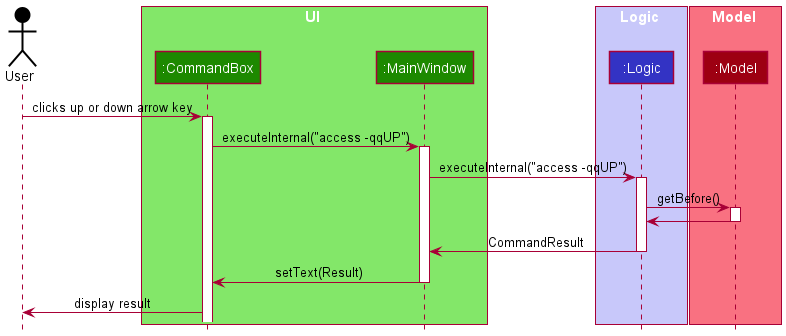
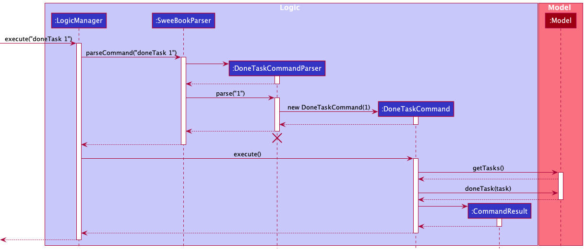
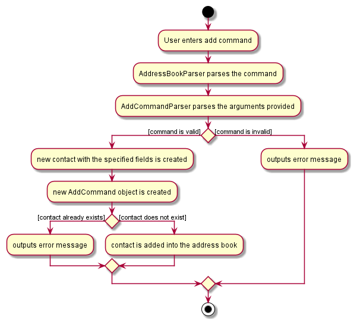

* Table of Contents
{:toc}

--------------------------------------------------------------------------------------------------------------------

## **Acknowledgements**

* {list here sources of all reused/adapted ideas, code, documentation, and third-party libraries -- include links to the original source as well}

--------------------------------------------------------------------------------------------------------------------

## **Setting up, getting started**

Refer to the guide [_Setting up and getting started_](SettingUp.md).

--------------------------------------------------------------------------------------------------------------------

## **Design**

:bulb: **Tip:** The `.puml` files used to create diagrams in this document can be found in the [diagrams](https://github.com/se-edu/addressbook-level3/tree/master/docs/diagrams/) folder. Refer to the [_PlantUML Tutorial_ at se-edu/guides](https://se-education.org/guides/tutorials/plantUml.html) to learn how to create and edit diagrams.

### Architecture

The ***Architecture Diagram*** given above explains the high-level design of the App.

Given below is a quick overview of main components and how they interact with each other.

**Main components of the architecture**

**`Main`** has two classes called [`Main`](https://github.com/se-edu/addressbook-level3/tree/master/src/main/java/seedu/address/Main.java) and [`MainApp`](https://github.com/se-edu/addressbook-level3/tree/master/src/main/java/seedu/address/MainApp.java). It is responsible for,

* At app launch: Initializes the components in the correct sequence, and connects them up with each other.
* At shut down: Shuts down the components and invokes cleanup methods where necessary.

[**`Commons`**](#common-classes) represents a collection of classes used by multiple other components.

The rest of the App consists of four components.

* [**`UI`**](#ui-component): The UI of the App.
* [**`Logic`**](#logic-component): The command executor.
* [**`Model`**](#model-component): Holds the data of the App in memory.
* [**`Storage`**](#storage-component): Reads data from, and writes data to, the hard disk.

**How the architecture components interact with each other**

The *Sequence Diagram* below shows how the components interact with each other for the scenario where the user issues the command `delete 1`.

Each of the four main components (also shown in the diagram above),

* defines its *API* in an `interface` with the same name as the Component.
* implements its functionality using a concrete `{Component Name}Manager` class (which follows the corresponding API `interface` mentioned in the previous point).

For example, the `Logic` component defines its API in the `Logic.java` interface and implements its functionality using the `LogicManager.java` class which follows the `Logic` interface. Other components interact with a given component through its interface rather than the concrete class (reason: to prevent outside component's being coupled to the implementation of a component), as illustrated in the (partial) class diagram below.

The sections below give more details of each component.

### UI component

The **API** of this component is specified in [`Ui.java`](https://github.com/se-edu/addressbook-level3/tree/master/src/main/java/seedu/address/ui/Ui.java)

The UI consists of a `MainWindow` that is made up of parts e.g.`CommandBox`, `ResultDisplay`, `PersonListPanel`, `StatusBarFooter` etc. All these, including the `MainWindow`, inherit from the abstract `UiPart` class which captures the commonalities between classes that represent parts of the visible GUI.

The `UI` component uses the JavaFx UI framework. The layout of these UI parts are defined in matching `.fxml` files that are in the `src/main/resources/view` folder. For example, the layout of the [`MainWindow`](https://github.com/se-edu/addressbook-level3/tree/master/src/main/java/seedu/address/ui/MainWindow.java) is specified in [`MainWindow.fxml`](https://github.com/se-edu/addressbook-level3/tree/master/src/main/resources/view/MainWindow.fxml)

The `UI` component,

* executes user commands using the `Logic` component.
* listens for changes to `Model` data so that the UI can be updated with the modified data.
* keeps a reference to the `Logic` component, because the `UI` relies on the `Logic` to execute commands.
* depends on some classes in the `Model` component, as it displays `Person` and `Task` objects residing in the `Model`.

### Logic component

**API** : [`Logic.java`](https://github.com/se-edu/addressbook-level3/tree/master/src/main/java/seedu/address/logic/Logic.java)

Here's a (partial) class diagram of the `Logic` component:

How the `Logic` component works:

1. When `Logic` is called upon to execute a command, it uses the `AddressBookParser` class to parse the user command.
1. This results in a `Command` object (more precisely, an object of one of its subclasses e.g., `AddCommand`) which is executed by the `LogicManager`.
1. The command can communicate with the `Model` when it is executed (e.g. to add a person).
1. The result of the command execution is encapsulated as a `CommandResult` object which is returned back from `Logic`.

The Sequence Diagram below illustrates the interactions within the `Logic` component for the `execute("delete 1")` API call.

:information_source: **Note:** The lifeline for `DeleteCommandParser` should end at the destroy marker (X) but due to a limitation of PlantUML, the lifeline reaches the end of diagram.

Here are the other classes in `Logic` (omitted from the class diagram above) that are used for parsing a user command:

How the parsing works:
* When called upon to parse a user command, the `AddressBookParser` class creates an `XYZCommandParser` (`XYZ` is a placeholder for the specific command name e.g., `AddCommandParser`) which uses the other classes shown above to parse the user command and create a `XYZCommand` object (e.g., `AddCommand`) which the `AddressBookParser` returns back as a `Command` object.
* All `XYZCommandParser` classes (e.g., `AddCommandParser`, `DeleteCommandParser`, ...) inherit from the `Parser` interface so that they can be treated similarly where possible e.g, during testing.

### Model component
**API** : [`Model.java`](https://github.com/se-edu/addressbook-level3/tree/master/src/main/java/seedu/address/model/Model.java)

The `Model` component,

* stores the address book data i.e., all `Person` objects (which are contained in a `UniquePersonList` object).
* stores the currently 'selected' `Person` objects (e.g., results of a search query) as a separate _filtered_ list which is exposed to outsiders as an unmodifiable `ObservableList<Person>` that can be 'observed' e.g. the UI can be bound to this list so that the UI automatically updates when the data in the list change.
* stores the previous user input into the `UserCommandCache`
* stores a `TaskListManager` object which is responsible of managing task display operations. It maintains a `Name` object of the person whose tasks is currently displayed.  
* stores a `UserPref` object that represents the user’s preferences. This is exposed to the outside as a `ReadOnlyUserPref` objects.
* does not depend on any of the other three components (as the `Model` represents data entities of the domain, they should make sense on their own without depending on other components)

:information_source: **Note:** An alternative (arguably, a more OOP) model is given below. It has a `Tag` list in the `AddressBook`, which `Person` references. This allows `AddressBook` to only require one `Tag` object per unique tag, instead of each `Person` needing their own `Tag` objects. 

### Storage component

**API** : [`Storage.java`](https://github.com/se-edu/addressbook-level3/tree/master/src/main/java/seedu/address/storage/Storage.java)

The `Storage` component,
* can save both address book data and user preference data in json format, and read them back into corresponding objects.
* inherits from both `AddressBookStorage` and `UserPrefStorage`, which means it can be treated as either one (if only the functionality of only one is needed).
* depends on some classes in the `Model` component (because the `Storage` component's job is to save/retrieve objects that belong to the `Model`)

### Common classes

Classes used by multiple components are in the `seedu.addressbook.commons` package.

--------------------------------------------------------------------------------------------------------------------

## **Implementation**

This section describes some noteworthy details on how certain features are implemented.

### View Task list feature

Displays the task list associated to the specified person onto the `taskListPanel` of the GUI.

The view task list feature is facilitated by :

`TaskListManager` :

- It serves as a archive to track the task lists reference of every `Person`.
- It maintains an `ObservableList` which encapsulates a `Person`'s task list, and is referenced by the `UI ` for display on the GUI.

- It implements the following operation that support the view task list feature:
  - `TaskListManager#setToDisplayTaskList` — set the currently displayed task list to the task list of the specified person.

This operation is exposed in the `Model` interface as `Model#displayPersonTaskList`.

Given below is the example usage scenario:

Step 1. The user launches the ContactSh application. Data will be loaded from the storage to the application memory. The `TaskListManager` will populate itself with the references of every `Person`'s task list.

Step 2. The user executes `cat 2` command to view the task list of the 2nd `Person` that is shown on the currently displayed person list.

step 3. If the parameters entered by the user is valid, the application will retrieve the task list reference of the specified `Person` from the archive. The task list reference currently encapsulated by the `ObservableList` is cleared and is then replaced by the specified `Person`'s task list reference. Else, ContactSh will display an error message indicating that the user did not type in the parameters correctly.

The following sequence diagram show how the view task list operation works:

:information_source: **Note:** If the parameters provided by the user is of non-integer form, ParseException will be thrown and an error message providing the correct format will be shown. Also, if the provided INDEX does not exists within the indices of the displayed person list, CommandException is thrown and an error message that warns of invalid INDEX will be shown.

The following activity diagram summarises what happens when a user executes a `cat` command:

#### Design consideration:

##### Aspect: How to display the task list on the GUI

- **Alternative 1 (current choice):** Have two side-by-side panels, left for person list and right for task list.

  * Pros:
    * User is able to concurrently view more information.

  * Cons:
    * More work to create and optimize the split panel.
    * Content wrapping can was tricky since there is a slider in the middle to resize either panels.

* **Alternative 2:** Have only one panel. The person list gets replaced by task list when cat is executed.

  * Pros:
    * More convenient to implement.

  * Cons:
    * `list` has to be executed again if user wants to redirect back to the person list (extra overhead
      which reduces efficiency).
    * Lesser view of information.

### Command Cache

The command Cache is the aspect of the program which stores the previous user input. This allows the user to browse
through the previous input using the up and down arrow key which simulates the Linux experience.

This function is facilitated by 3 aspects of the program:
1. CommandBox in GUI
2. InternalCommand in Logic
3. UserCommandCache in Model

#### Caching the command
The following sequence diagram demonstrates how the caching mechanism in the Model and Logic unit:

:information_source: **Note:** The execution of the command happens after the caching
(and is omitted in the above diagram). This means invalid commands are also stored.

The following activity diagram illustrates how the storage in the cache is handled:

With the current iteration, the cache may hold up to 50 most recent command. However, only the newest 25 command is
guaranteed to be saved at all times. The user is not blocked from accessing older commands as it provides additional
functionality without too much loss.

#### Accessing the Cache
As mentioned before, the caching feature utilises a different kind of command as with other features. The reason will be
explored in the design consideration section. Nonetheless, both command type are handled by the Logic unit almost
exactly the same way.

The diagram below shws the generation of the internal command in the GUI:

The cache, stored in the Model, is implemented using the Singleton design pattern as there should, at all times,
be only one cache existing.

#### Design Consideration
##### Aspect: Accessing cache
* **Alternative 1** : Have cache stored in model and piggyback on existing command code.
    * Pros:
        * A relatively simple design with less possibility of bug
        * Less effort needed
        * Still maintain cohesion and separation of responsibility

    * Cons:
        * Could not differentiate between internal and external input command. This leads to either the possibility
          for user to input the internal commands accidentally, causing bug, or some commands being blocked from running

* **Alternative 2 (current choice):** Have cache stored in model and create new internal command.
    * Pros:
        * No need for command blocking and no possibility for user to accidentally type in the command
        * Still maintain cohesion and separation of responsibility

    * Cons:
        * Increased avenue for bugs
        * More coding to be done
        * Relatively worse in terms of "repeating yourself"

* **Alternative 3:** Have cache stored in UI.
    * Pros:
        * No need for extraction using commands
        * Simple implementation

    * Cons:
        * Breaks the MVC pattern as UI now saves things
        * Decreased cohesion

### Find people feature

Displays the people associated with the specified search keywords onto the `PersonListPanel` of the GUI.

Given below is the example usage scenario:

Step 1. The user launches the ContactSh application. Data will be loaded from the storage to the application memory. The `PersonListPanel` will be populated with a `PersonCard` for every person from memory.

Step 2. The user executes `find -n Alex` command to find anyone whose name could be abbreviated to be `Alex` on the currently displayed person list.

Step 3. If the parameters entered by the user is valid, the application will retrieve any `Person` that matches the keywords given. The person list reference currently encapsulated by the `FilteredList` will then be filtered based on whether a person has an attribute that matches the keywords. The updated `FilteredList` is then shown to the user with all matching persons via the `PersonListPanel`. Else, ContactSh will display an error message indicating that the user did not type in the parameters correctly.

The following sequence diagram show how the find operation works:

:information_source: **Note:** If the user does not provide any keywords or uses an invalid flag, ParseException will be thrown and an error message providing the correct format will be shown.

The following activity diagram summarises what happens when a user executes a `find -n Alex` command:

#### Design consideration:

##### Aspect: How to find based on the keywords

- **Alternative 1 (current choice):** Check that the order of the keywords matches the order they appear in for any person's attribute (e.g. name) and whether each separate word of a person's attribute starts with the keywords, ignoring case.

    - Pros: The user is able to use abbreviations for certain attributes to find people and not have to worry about exact matching
    - Cons:
        - The user can no longer find multiple people (using different keywords) and even if at least one of the keywords matches a person's attribute, it will not display the person if the keywords are out of order and do not all appear in the person's attribute.

- **Alternative 2:** Use exact matching and check if any of the keywords matches a person's attribute

    - Pros: Easier to implement.

    - Cons:

        - Keywords provided must be exact, so even if the user is missing one letter, it will not display the expected person

### Mark Tasks as done/not done feature

Marks the task specified by the user as done or not done. Tasks that are marked as done are coloured green in the `tasklistpanel`. Tasks marked as done will not show up as overdue or soon to be due.

Given below is an example usage scenario:

Step 1: The user launches the ContactSH application.  Data will be loaded from the storage to the application memory. The `PersonListPanel` will be populated with a `PersonCard` for every person from memory.

Step 2: The user executes `donetask 2 -ti3` to mark the 3rd task of the second person in the list as done.

Step 3: If the specified person and their corresponding tasks exists, the tasks will be marked as done. Else, an error message will be displayed indicating that the parameters are wrong.
If the tasks are already marked as done, it will not be marked again. A message will then be displayed showing how many tasks are marked as done, and how many are already marked as done.

The following sequence diagram shows how the mark task as done operation works:

The following activity diagram summarizes what happens when a user executes `donetask 2 -ti3`:

The `undotask` command does the opposite - it marks the specified tasks as not done. Tasks that were previously marked as done have their colour in the `tasklistpanel` changed from green to orange, red or gray, depending if they are soon to be due, overdue, or neither, respectively.

#### Design consideration:

##### Aspect: How to mark tasks as done or not done

- **Alternative 1 (current choice):** Have separate commands for marking a task as done or not done.
  - Pros: Easy to implement, commands have singular purpose.
  - Cons: Users need to be use another command to mark task as done.
- **Alternative 2:** Add another flag to `edit` command to edit if a task is done or not done.
  - Pros: Tasks can be marked as done and edited at the same time.
  - Cons: Harder to implement, more flags to take note of in the edit command.

### Add new task with the same command word as add new person feature

Adds a new task to an existing person using the `add` command word, similar to adding a new person.

Given below is an example usage scenario:

Step 1: The user launches the ContactSH application.  Data will be loaded from the storage to the application memory. The `PersonListPanel` will be populated with a `PersonCard` for every person from memory.

Step 2: The user executes `add 1 -tn Task` to add a new task named "Task" to the first person in the list.

Step 3: If the specified person exists, a new task named "Task" will be added to the person's task list. Else, an error message will be displayed indicating that either the person index is invalid or the parameters given are wrong.

The following sequence diagram shows how the add task operation works:

The `rm` command follows a similar operation sequence. Users are able to delete either a person or a task using the same `rm` command word.

The following activity diagram summarizes what happens when a user executes `add 1 -tn Task`:

#### Design consideration:

##### Aspect: How to either add a new person or task using the same `add` command word

- **Alternative 1 (current choice):** If the command is to add a new task, invoke `AddTaskCommandParser` from `AddCommandParser`, returning a `AddTaskCommand`. Else if the command is to add a new person, return a `AddCommand` directly from `AddCommandParser`.
    - Pros: 
        - Commands encapsulate the exact command to execute.
        - Easier to debug if either command demonstrates erroneous behaviour.
    - Cons:
        - More testing needed to ensure correct integration.
        - More coding to be done.
- **Alternative 2:** Handle all commands to add either a new person or task in the same `AddCommandParser` and `AddCommand`.
    - Pros:
        - Simple implementation.
        - Less effort needed.
    - Cons: 
        - Increased avenue for bugs.

### \[Proposed\] Undo/redo feature

#### Proposed Implementation

The proposed undo/redo mechanism is facilitated by `VersionedAddressBook`. It extends `AddressBook` with an undo/redo history, stored internally as an `addressBookStateList` and `currentStatePointer`. Additionally, it implements the following operations:

* `VersionedAddressBook#commit()` — Saves the current address book state in its history.
* `VersionedAddressBook#undo()` — Restores the previous address book state from its history.
* `VersionedAddressBook#redo()` — Restores a previously undone address book state from its history.

These operations are exposed in the `Model` interface as `Model#commitAddressBook()`, `Model#undoAddressBook()` and `Model#redoAddressBook()` respectively.

Given below is an example usage scenario and how the undo/redo mechanism behaves at each step.

Step 1. The user launches the application for the first time. The `VersionedAddressBook` will be initialized with the initial address book state, and the `currentStatePointer` pointing to that single address book state.

Step 2. The user executes `delete 5` command to delete the 5th person in the address book. The `delete` command calls `Model#commitAddressBook()`, causing the modified state of the address book after the `delete 5` command executes to be saved in the `addressBookStateList`, and the `currentStatePointer` is shifted to the newly inserted address book state.

Step 3. The user executes `add n/David …​` to add a new person. The `add` command also calls `Model#commitAddressBook()`, causing another modified address book state to be saved into the `addressBookStateList`.

:information_source: **Note:** If a command fails its execution, it will not call `Model#commitAddressBook()`, so the address book state will not be saved into the `addressBookStateList`.

Step 4. The user now decides that adding the person was a mistake, and decides to undo that action by executing the `undo` command. The `undo` command will call `Model#undoAddressBook()`, which will shift the `currentStatePointer` once to the left, pointing it to the previous address book state, and restores the address book to that state.

:information_source: **Note:** If the `currentStatePointer` is at index 0, pointing to the initial AddressBook state, then there are no previous AddressBook states to restore. The `undo` command uses `Model#canUndoAddressBook()` to check if this is the case. If so, it will return an error to the user rather
than attempting to perform the undo.

The following sequence diagram shows how the undo operation works:

:information_source: **Note:** The lifeline for `UndoCommand` should end at the destroy marker (X) but due to a limitation of PlantUML, the lifeline reaches the end of diagram.

The `redo` command does the opposite — it calls `Model#redoAddressBook()`, which shifts the `currentStatePointer` once to the right, pointing to the previously undone state, and restores the address book to that state.

:information_source: **Note:** If the `currentStatePointer` is at index `addressBookStateList.size() - 1`, pointing to the latest address book state, then there are no undone AddressBook states to restore. The `redo` command uses `Model#canRedoAddressBook()` to check if this is the case. If so, it will return an error to the user rather than attempting to perform the redo.

Step 5. The user then decides to execute the command `list`. Commands that do not modify the address book, such as `list`, will usually not call `Model#commitAddressBook()`, `Model#undoAddressBook()` or `Model#redoAddressBook()`. Thus, the `addressBookStateList` remains unchanged.

Step 6. The user executes `clear`, which calls `Model#commitAddressBook()`. Since the `currentStatePointer` is not pointing at the end of the `addressBookStateList`, all address book states after the `currentStatePointer` will be purged. Reason: It no longer makes sense to redo the `add n/David …​` command. This is the behavior that most modern desktop applications follow.

The following activity diagram summarizes what happens when a user executes a new command:

#### Design considerations:

**Aspect: How undo & redo executes:**

* **Alternative 1 (current choice):** Saves the entire address book.
    * Pros: Easy to implement.
    * Cons: May have performance issues in terms of memory usage.

* **Alternative 2:** Individual command knows how to undo/redo by
  itself.
    * Pros: Will use less memory (e.g. for `delete`, just save the person being deleted).
    * Cons: We must ensure that the implementation of each individual command are correct.

_{more aspects and alternatives to be added}_

### \[Proposed\] Data archiving

_{Explain here how the data archiving feature will be implemented}_

--------------------------------------------------------------------------------------------------------------------

## **Documentation, logging, testing, configuration, dev-ops**

* [Documentation guide](Documentation.md)
* [Testing guide](Testing.md)
* [Logging guide](Logging.md)
* [Configuration guide](Configuration.md)
* [DevOps guide](DevOps.md)

--------------------------------------------------------------------------------------------------------------------

## **Appendix: Requirements**

### Product scope

**Target user profile**:

* NUS Student Entrepreneurs
* Proficient in Linux style CLIs
* Has many meetings and is in contact with different people (students, mentors,
  stakeholders, clients, partners)
* Carries Laptop around (prefers Laptop)

**Value proposition**:

* Users familiar with Unix commands can quickly master using the app efficiently.
* Allow users to keep track of tasks/meetings associated with contacts.
* Enhanced contact searchability and organisation.
* Eliminates the need to remember and recall interpersonal details of contacts.

### User stories

Priorities: High (must have) - `* * *`, Medium (nice to have) - `* *`, Low (unlikely to have) - `*`

:memo: **Bolded** user stories are `epics`.

| Priority | As a …​                                    | I want to …​                     | So that I can…​                                                        |
| -------- | ------------------------------------------ | ------------------------------ | ---------------------------------------------------------------------- |
| | **general user** | **have essential functionalities**| |
| `***` | general user | update contact details | keep track of up to date details |
| `***` | general user | delete contacts | get rid of contacts who are no longer relevant |
| `***` | general user | save contacts | keep track of them |
| `***` | general user | look through the list of contacts| see the contacts I have added |
| | **new user** | **start using the app normally as soon as possible**| |
| `***` | new user | purge all example contacts | start adding my own contacts |
| | **Linux CLI user** | **have a CLI similar to Linux CLI** | |
| `***` | Linux CLI user | use similar commands to Linux CLI | reduce the need to learn new commands |
| `***` | Linux CLI user | backtrack commands i have entered before | save time on retyping them |
| | **student entrepreneur** | **categorize my business contacts** | **organize them better** |
| `**` | student entrepreneur | differentiate between business and student contacts | differentiate easily |
| `*` | student entrepreneur | organise my contacts according to specific groups | find the ones i want easily |
| `**` | student entrepreneur | mark my contacts as important | know which contacts i prioritize |
| | **student entrepreneur** | **have statistics and indicators for my tasks** | **improve my tasks management** |
| `**` | student entrepreneur | view the overall statistics of all my tasks | have an idea of my tasks progression |
| `**` | student entrepreneur | be reminded when tasks are due or due soon | be aware and take necessary actions to deal with them |
| | **beginner user** | **learn how to use the app fast** | **spend less time on learning** |
| `***` | beginner user | view the user guide easily | learn the commands as and when I need |
| `***` | beginner user | view the list of instructions | know what instructions are available |
| `***` | beginner user | see examples of contacts | have an idea of how contacts will be presented |
| | **intermediate user** | **sort and filter my contacts** | **sieve out irrelevant contacts** |
| `***` | intermediate user | search for contacts with the attribute of my choice | find my contacts faster and more accurately |
| `**` | intermediate user | sort contacts by tasks | identify connections between contacts |
| `*` | intermediate user | choose what information about my contacts to view | read the information easier |
| `**` | intermediate user | search for contacts using abbreviations | improve my work efficiency |
| | **intermediate user** | **keep track of tasks related to my contacts** |  |
| `***` | intermediate user | assign tasks to contacts | know what I should contact them for |
| `***` | intermediate user | delete tasks from contacts | remove task which are done |
| `**` | intermediate user | mark a task as complete | still keep the task but know that it has been done |
| `***` | intermediate user | view tasks of a specific contact | see what tasks are connected to said contact |
| `***` | intermediate user | view every contact's tasks in a form of a list | an overview of all my tasks |
| `**` | intermediate user | filter what tasks i view using keywords | narrow down tasks that i am looking for |
| | **experienced user** |	**manipulate multiple contacts with one command** | **improve my work efficiency** |
| `**` | experienced user | delete multiple contacts using only one command | improve my work efficiency |
| `*` | experienced user |	move multiple contacts using only one command | improve my work efficiency |
| `**` | experienced user |	add multiple contacts using only one command | improve my work efficiency |
| | **experienced user** | **update large number of contacts at once** | **exclude manually adding them myself** |
| `**` | experienced user | import a list of contacts | add a large number of contacts at once |
| `**` | experienced user | export a list of contacts | send them to other people |
| | **expert Linux CLI user** | **use high-level CLI instructions** | **directly use the app at a high-level** |
| `*` | expert Linux CLI user | make command combinations | execute multiple instructions in one line |
| `*` | expert Linux CLI user | redirect input/output | input/output from/to files instead of stdin |
| `*` | expert Linux CLI user | create scripts | automate specific tasks |

### Use cases

(For all use cases below, the **System** is the `ContactSH` and the **Actor** is the `user`, unless specified otherwise)

**Use case: Add a contact**

**MSS**

1. User requests to add a contact.
2. ContactSH adds the contact

    Use case ends.

**Extensions**

* 1a. The given contact is invalid.

    * 1a1. ContactSH shows an error message.

      Use case resumes at step 1.

**Use case: Edit a contact**

**MSS**

1. User requests a list of contacts.
2. ContactSH shows a list of contacts.
3. User requests to edit a specific contact in the list.
4. ContactSH edits the contact.

   Use case ends.

**Extensions**

* 2a. The list is empty.

  Use case ends.

* 3a. The given index is invalid.

    * 3a1. ContactSH shows an error message.

      Use case resumes at step 2.

* 3b. The given edit information is invalid.

    * 3b1. ContactSH shows an error message.

      Use case resumes at step 2.

**Use case: Delete a contact**

**MSS**

1.  User requests to list contacts
2.  ContactSH shows a list of contacts
3.  User requests to delete contacts in the list
4.  ContactSH deletes the contact

    Use case ends.

**Extensions**

* 2a. The list is empty.

  Use case ends.

* 3a. The given index is invalid.

    * 3a1. ContactSH shows an error message.

      Use case resumes at step 2.

* 3b. User requests to delete all contacts in the list.

    * 3b1. ContactSH deletes all contacts in the list.

      Use case ends.

**Use case: Find contact(s) by a criterion**

**MSS**

1. User requests for contacts satisfying a criterion.
2. ContactSH searches for contacts that satisfy the criterion.
3. ContactSH displays the list of contacts that satisfy the criterion.

   Use case ends.

**Extensions**

* 1a. The given criterion is invalid.

    * 1a1. ContactSH shows an error message.

      Use case ends.

* 2a. No result matches the criterion.

    * 2a1. ContactSH returns message stating no contact found.

      Use case ends.

**Use case: Find command and its usage**

**MSS**

1. User requests for a list of commands.
2. ContactSH returns a list of commands.
3. User requests for details of a specific command in the list.
4. ContactSH returns the details of the command.

   Use case ends.

**Extensions**

* 3a. The given command is invalid.

    * 3a1. ContactSH shows an error message.

    Use case resumes at step 2.

**Use case: Sort contacts by name**

**MSS**

1. User requests to sort contacts by name.
2. ContactSH returns a sorted list of contacts.

    Use case ends.

**Extensions**

* 1a. The reverse flag is given.

    * 1a1. ContactSH returns a reverse sorted list of contacts.

    Use case ends.

**Use case: Edit a task**

**MSS**

1. User requests for a list of contacts.
2. ContactSh returns a list a contacts.
3. User requests for a list of tasks of a contact.
4. ContactSH returns a list of tasks of that contact.
5. User provides parameters to edit tasks.
6. ContactSH edits tasks.

    Use case ends.

**Extensions**

* 1a. The list is empty.

  Use case ends.

* 3a. User requests for list of tasks of all users.

    * 3a1. ContactSH returns list of tasks of all users.

      Use case resumes at step 5.

* 3b. The list is empty.

  Use case ends.

* 5a. The given edit information is invalid.

    * 5a1. ContactSH shows an error message.

      Use case resumes at step 5.

*{More to be added}*

### Non-Functional Requirements

1. Should work on any _mainstream OS_ as long as it has Java `11` or above installed.
2. Should be able to hold up to 1000 persons without a noticeable sluggishness in performance for typical usage.
3. A user with above average typing speed for regular English text (i.e. not code, not system admin commands) should be able to accomplish most of the tasks faster using commands than using the mouse.
4. Any changes to the data should be saved permanently and automatically.
5. Should be easy to learn and use at all times regardless of the user's skill with the user interface.
6. The project is expected to push deliverables according to the module schedule.
7. Should be compliant with the coding standards of the module.
8. Documentation for the project, such as the user and developer guides, should be effective and concise.
9. Should be logging useful information and tracking sources of errors as they are identified.
10. Should be easily testable from different testing approaches (e.g. Integration testing, System testing, automated
    functional tests, manual tests etc.)

*{More to be added}*

### Glossary

* **Mainstream OS**: Windows, Linux, Unix, OS-X
* **Private contact detail**: A contact detail that is not meant to be shared with others

--------------------------------------------------------------------------------------------------------------------

## **Appendix: Instructions for manual testing**

Given below are instructions to test the app manually.

:information_source: **Note:** These instructions only provide a starting point for testers to work on;
testers are expected to do more *exploratory* testing.

### Launch and shutdown

1. Initial launch

    1. Download the jar file and copy into an empty folder

    1. Double-click the jar file Expected: Shows the GUI with a set of sample contacts. The window size may not be optimum.

1. Saving window preferences

    1. Resize the window to an optimum size. Move the window to a different location. Close the window.

    1. Re-launch the app by double-clicking the jar file. 
       Expected: The most recent window size and location is retained.

1. _{ more test cases …​ }_

### Deleting a person

1. Deleting a person while all persons are being shown

    1. Prerequisites: List all persons using the `list` command. Multiple persons in the list.

    1. Test case: `rm 1` 
       Expected: First contact is deleted from the list. Details of the deleted contact shown in the status message. Timestamp in the status bar is updated.

    1. Test case: `rm 0` 
       Expected: No person is deleted. Error details shown in the status message. Status bar remains the same.

    1. Other incorrect delete commands to try: `rm`, `rm x`, `...` (where x is larger than the list size) 
       Expected: Similar to previous.

1. _{ more test cases …​ }_

### Saving data

1. Dealing with missing/corrupted data files

    1. _{explain how to simulate a missing/corrupted file, and the expected behavior}_

1. _{ more test cases …​ }_
