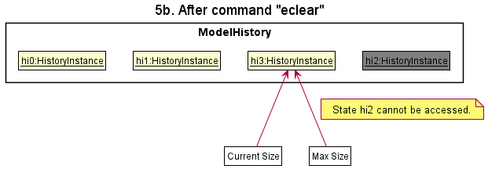
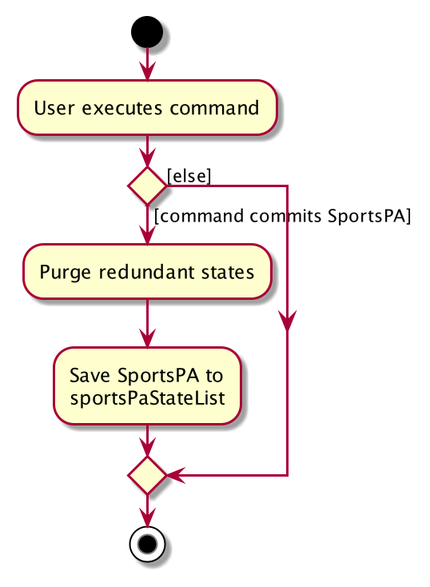

## Table of Contents
1. [Acknowledgements](#acknowledgements)
2. [Setting up, getting started](#setting-up-getting-started)
3. [Design](#design)
4. [Architecture](#architecture)
   - [UI component](#ui-component)
   - [Logic component](#logic-component)
   - [Model component](#model-component)
   - [Storage component](#storage-component)
   - [Common classes](#common-classes)
5. [Implementation](#implementation)
   - [[Proposed] Undo/redo feature](#proposed-undoredo-feature)
   - [[Proposed] Data archiving](#proposed-data-archiving)
6. [Documentation, logging, testing, configuration, dev-ops](#documentation-logging-testing-configuration-dev-ops)
7. [Appendix: Requirements](#appendix-requirements)
   - [Product Scope](#product-scope)
   - [User stories](#user-stories)
   - [Use cases](#use-cases)
   - [Non-Functional Requirements](#non-functional-requirements)
   - [Glossary](#glossary)
8. [Appendix: Instructions for manual testing](#appendix-instructions-for-manual-testing)
   - [Launch and shutdown](#launch-and-shutdown)
   - [Deleting a person](#deleting-a-person)
   - [Saving data](#saving-data)

--------------------------------------------------------------------------------------------------------------------

## **Acknowledgements**

* This project is based on the AddressBook-Level3 project created by the [SE-EDU initiative](https://se-education.org).

--------------------------------------------------------------------------------------------------------------------

## **Setting up, getting started**

Refer to the guide [_Setting up and getting started_](SettingUp.md).

--------------------------------------------------------------------------------------------------------------------

## **Design**

:bulb: **Tip:** The `.puml` files used to create diagrams in this document can be found in the [diagrams](https://github.com/AY2122S1-CS2103T-W16-3/tp/tree/master/docs/diagrams) folder. Refer to the [_PlantUML Tutorial_ at se-edu/guides](https://se-education.org/guides/tutorials/plantUml.html) to learn how to create and edit diagrams.

### Architecture

The ***Architecture Diagram*** given above explains the high-level design of the App.

Given below is a quick overview of main components and how they interact with each other.

**Main components of the architecture**

**`Main`** has two classes called [`Main`](https://github.com/AY2122S1-CS2103T-W16-3/tp/blob/master/src/main/java/seedu/address/Main.java) and [`MainApp`](https://github.com/AY2122S1-CS2103T-W16-3/tp/blob/master/src/main/java/seedu/address/MainApp.java). It is responsible for,
* At app launch: Initializes the components in the correct sequence, and connects them up with each other.
* At shut down: Shuts down the components and invokes cleanup methods where necessary.

[**`Commons`**](#common-classes) represents a collection of classes used by multiple other components.

The rest of the App consists of four components.

* [**`UI`**](#ui-component): The UI of the App.
* [**`Logic`**](#logic-component): The command executor.
* [**`Model`**](#model-component): Holds the data of the App in memory.
* [**`Storage`**](#storage-component): Reads data from, and writes data to, the hard disk.

**How the architecture components interact with each other**

The *Sequence Diagram* below shows how the components interact with each other for the scenario where the user issues the command `delete 1`.

Each of the four main components (also shown in the diagram above),

* defines its *API* in an `interface` with the same name as the Component.
* implements its functionality using a concrete `{Component Name}Manager` class (which follows the corresponding API `interface` mentioned in the previous point).

For example, the `Logic` component defines its API in the `Logic.java` interface and implements its functionality using the `LogicManager.java` class which follows the `Logic` interface. Other components interact with a given component through its interface rather than the concrete class (reason: to prevent outside component's being coupled to the implementation of a component), as illustrated in the (partial) class diagram below.

The sections below give more details of each component.

### UI component

The **API** of this component is specified in [`Ui.java`](https://github.com/AY2122S1-CS2103T-W16-3/tp/blob/master/src/main/java/seedu/address/ui/Ui.java)

The UI consists of a `MainWindow` that is made up of parts e.g.`CommandBox`, `ResultDisplay`, `PersonListPanel`, `StatusBarFooter` etc. All these, including the `MainWindow`, inherit from the abstract `UiPart` class which captures the commonalities between classes that represent parts of the visible GUI.

The `UI` component uses the JavaFx UI framework. The layout of these UI parts are defined in matching `.fxml` files that are in the `src/main/resources/view` folder. For example, the layout of the [`MainWindow`](https://github.com/AY2122S1-CS2103T-W16-3/tp/blob/master/src/main/java/seedu/address/ui/MainWindow.java) is specified in [`MainWindow.fxml`](https://github.com/AY2122S1-CS2103T-W16-3/tp/blob/master/src/main/resources/view/MainWindow.fxml)

The `UI` component,

* executes user commands using the `Logic` component.
* listens for changes to `Model` data so that the UI can be updated with the modified data.
* keeps a reference to the `Logic` component, because the `UI` relies on the `Logic` to execute commands.
* depends on some classes in the `Model` component, as it displays `Person` object residing in the `Model`.

### Logic component

**API** : [`Logic.java`](https://github.com/AY2122S1-CS2103T-W16-3/tp/blob/master/src/main/java/seedu/address/logic/Logic.java)

Here's a (partial) class diagram of the `Logic` component:

How the `Logic` component works:
1. When `Logic` is called upon to execute a command, it uses the `TutorAidParser` class to parse the user command.
1. This results in a `Command` object (more precisely, an object of one of its subclasses e.g., `AddCommand`) which is executed by the `LogicManager`.
1. The command can communicate with the `Model` when it is executed (e.g. to add a person).
1. The result of the command execution is encapsulated as a `CommandResult` object which is returned from `Logic`.

The Sequence Diagram below illustrates the interactions within the `Logic` component for the `execute("delete 1")` API call.

:information_source: **Note:** The lifeline for `DeleteCommandParser` should end at the destroy marker (X) but due to a limitation of PlantUML, the lifeline reaches the end of diagram.

Here are the other classes in `Logic` (omitted from the class diagram above) that are used for parsing a user command:

How the parsing works:
* When called upon to parse a user command, the `TutorAidParser` class creates an `XYZCommandParser` (`XYZ` is a placeholder for the specific command name e.g., `AddCommandParser`) which uses the other classes shown above to parse the user command and create a `XYZCommand` object (e.g., `AddCommand`) which the `TutorAidParser` returns back as a `Command` object.
* All `XYZCommandParser` classes (e.g., `AddCommandParser`, `DeleteCommandParser`, ...) inherit from the `Parser` interface so that they can be treated similarly where possible e.g, during testing.

### Model component
**API** : [`Model.java`](https://github.com/AY2122S1-CS2103T-W16-3/tp/blob/master/src/main/java/seedu/address/model/Model.java)

The `Model` component,

* stores the address book data i.e., all `Person` objects (which are contained in a `UniquePersonList` object).
* stores the currently 'selected' `Person` objects (e.g., results of a search query) as a separate _filtered_ list which is exposed to outsiders as an unmodifiable `ObservableList<Person>` that can be 'observed' e.g. the UI can be bound to this list so that the UI automatically updates when the data in the list change.
* stores a `UserPref` object that represents the user’s preferences. This is exposed to the outside as a `ReadOnlyUserPref` objects.
* does not depend on any of the other three components (as the `Model` represents data entities of the domain, they should make sense on their own without depending on other components)

:information_source: **Note:** An alternative (arguably, a more OOP) model is given below. It has a `Tag` list in the `AddressBook`, which `Person` references. This allows `AddressBook` to only require one `Tag` object per unique tag, instead of each `Person` needing their own `Tag` objects. 

### Storage component

**API** : [`Storage.java`](https://github.com/AY2122S1-CS2103T-W16-3/tp/blob/master/src/main/java/seedu/address/storage/Storage.java)

The `Storage` component,
* can save both address book data and user preference data in json format, and read them back into corresponding objects.
* inherits from both `AddressBookStorage` and `UserPrefStorage`, which means it can be treated as either one (if only the functionality of only one is needed).
* depends on some classes in the `Model` component (because the `Storage` component's job is to save/retrieve objects that belong to the `Model`)

### Common classes

Classes used by multiple components are in the `seedu.addressbook.commons` package.

--------------------------------------------------------------------------------------------------------------------

## **Implementation**

This section describes some noteworthy details on how certain features are implemented.

### \[Proposed\] Undo/redo feature

#### Proposed Implementation

The proposed undo/redo mechanism is facilitated by `VersionedAddressBook`. It extends `AddressBook` with an undo/redo history, stored internally as an `addressBookStateList` and `currentStatePointer`. Additionally, it implements the following operations:

* `VersionedAddressBook#commit()` — Saves the current address book state in its history.
* `VersionedAddressBook#undo()` — Restores the previous address book state from its history.
* `VersionedAddressBook#redo()` — Restores a previously undone address book state from its history.

These operations are exposed in the `Model` interface as `Model#commitAddressBook()`, `Model#undoAddressBook()` and `Model#redoAddressBook()` respectively.

Given below is an example usage scenario and how the undo/redo mechanism behaves at each step.

Step 1. The user launches the application for the first time. The `VersionedAddressBook` will be initialized with the initial address book state, and the `currentStatePointer` pointing to that single address book state.

Step 2. The user executes `delete 5` command to delete the 5th person in the address book. The `delete` command calls `Model#commitAddressBook()`, causing the modified state of the address book after the `delete 5` command executes to be saved in the `addressBookStateList`, and the `currentStatePointer` is shifted to the newly inserted address book state.

Step 3. The user executes `add n/David …​` to add a new person. The `add` command also calls `Model#commitAddressBook()`, causing another modified address book state to be saved into the `addressBookStateList`.

:information_source: **Note:** If a command fails its execution, it will not call `Model#commitAddressBook()`, so the address book state will not be saved into the `addressBookStateList`.

Step 4. The user now decides that adding the person was a mistake, and decides to undo that action by executing the `undo` command. The `undo` command will call `Model#undoAddressBook()`, which will shift the `currentStatePointer` once to the left, pointing it to the previous address book state, and restores the address book to that state.

:information_source: **Note:** If the `currentStatePointer` is at index 0, pointing to the initial AddressBook state, then there are no previous AddressBook states to restore. The `undo` command uses `Model#canUndoAddressBook()` to check if this is the case. If so, it will return an error to the user rather
than attempting to perform the undo.

The following sequence diagram shows how the undo operation works:

:information_source: **Note:** The lifeline for `UndoCommand` should end at the destroy marker (X) but due to a limitation of PlantUML, the lifeline reaches the end of diagram.

The `redo` command does the opposite — it calls `Model#redoAddressBook()`, which shifts the `currentStatePointer` once to the right, pointing to the previously undone state, and restores the address book to that state.

:information_source: **Note:** If the `currentStatePointer` is at index `addressBookStateList.size() - 1`, pointing to the latest address book state, then there are no undone AddressBook states to restore. The `redo` command uses `Model#canRedoAddressBook()` to check if this is the case. If so, it will return an error to the user rather than attempting to perform the redo.

Step 5. The user then decides to execute the command `list`. Commands that do not modify the address book, such as `list`, will usually not call `Model#commitAddressBook()`, `Model#undoAddressBook()` or `Model#redoAddressBook()`. Thus, the `addressBookStateList` remains unchanged.

Step 6. The user executes `clear`, which calls `Model#commitAddressBook()`. Since the `currentStatePointer` is not pointing at the end of the `addressBookStateList`, all address book states after the `currentStatePointer` will be purged. Reason: It no longer makes sense to redo the `add n/David …​` command. This is the behavior that most modern desktop applications follow.

The following activity diagram summarizes what happens when a user executes a new command:

#### Design considerations:

**Aspect: How undo & redo executes:**

* **Alternative 1 (current choice):** Saves the entire address book.
  * Pros: Easy to implement.
  * Cons: May have performance issues in terms of memory usage.

* **Alternative 2:** Individual command knows how to undo/redo by
  itself.
  * Pros: Will use less memory (e.g. for `delete`, just save the person being deleted).
  * Cons: We must ensure that the implementation of each individual command are correct.

_{more aspects and alternatives to be added}_

### \[Proposed\] Data archiving

_{Explain here how the data archiving feature will be implemented}_

--------------------------------------------------------------------------------------------------------------------

## **Documentation, logging, testing, configuration, dev-ops**

* [Documentation guide](Documentation.md)
* [Testing guide](Testing.md)
* [Logging guide](Logging.md)
* [Configuration guide](Configuration.md)
* [DevOps guide](DevOps.md)

--------------------------------------------------------------------------------------------------------------------

## **Appendix: Requirements**

### Product scope
**Target user profile**:

A private tutor that:
* has a need to manage a significant number of students' details
* prefers desktop apps over other types
* can type fast
* prefers typing to mouse interactions
* is reasonably comfortable using CLI apps

**Value proposition**: manage students' details faster than a typical mouse/GUI driven app

### User stories

Priorities: High (must have) - `* * *`, Medium (nice to have) - `* *`, Low (unlikely to have) - `*`

| Priority | As a …​                                                          | I want to …​                                                               | So that I can…​                                                                                       |
| -------- | ------------------------------------------------------------------- | ----------------------------------------------------------------------------- | -------------------------------------------------------------------------------------------------------- |
| `* * *`  | tutor                                                               | add student contacts with ease                                                | keep up with a changing list of students                                                                 |
| `* * *`  | tutor                                                               | delete student contacts with ease                                             | keep up with a changing list of students                                                                 |
| `* * *`  | tutor                                                               | view my students’ parents' contacts                                           | update them on their children’s progress                                                                 |
| `* * *`  | tutor who teaches students with differing academic strengths        | update the progress of my students                                            | ensure that each student is being appropriately challenged                                               |
| `* * *`  | caring tutor                                                        | track my students' submissions and grades                                     | study how they have doing                                                                                |
| `* * *`  | tutor                                                               | check which student has not paid                                              | remind the student to make the payment soon                                                              |
| `* * *`  | tutor with many students to keep track of                           | record feedback of each student in the app after each class                   | recall any important details or information when giving feedback to parents on their child's performance |
| `* *`    | tutor                                                               | set up a to-do list for every session                                         | record what I need to cover for every session                                                            |
| `* *`    | tutor with many classes to keep track of                            | check my tasks for the day                                                    | refresh my memory of what needs to be done for each class                                                |
| `* *`    | new user                                                            | to be able to easily access and refer to the command guide                    | quickly and easily add details to the database without having prior experience of doing so               |
| `* *`    | tutor with a different schedule every day                           | easily access my schedule for the day and week ahead                          | manage my time well                                                                                      |
| `* *`    | tutor with many students in each class                              | to view which students are in my current class                                | know who is absent and contact them                                                                      |
| `* *`    | tutor                                                               | check if my students have any upcoming milestones                             | prepare the relevant materials for my students (e.g. past year papers / cheat sheets)                    |
| `* *`    | private tutor who may provide ad-hoc lessons to some of my students | track the number of lessons I provide for each student                        | ensure that I receive the correct payment from each student at the end of each month                     |
| `* *`    | tutor                                                               | add the topics to be covered for the next few weeks for each class            | plan the lessons for future weeks ahead of time                                                          |
| `* *`    | tutor who allows the enrollment of new students throughout the year | set the student capacity for each class                                       | check which of the classes new students are able to join                                                 |
| `* *`    | tutor who prices lessons for different classes at different rates   | record an individual price for each class                                     | track how much each of my students need to pay at the each month                                         |
| `* *`    | tutor                                                               | edit the students in each class                                               | record any changes in the classes that each of my students attend                                        |
| `* *`    | forgetful tutor                                                     | check for the TutorAid commands fast                                          | conveniently operate the app                                                                             |
| `* *`    | tutor                                                               | able to view when I have last updated the progress for each student           | ensure that I consistently update progress for all students                                              |
| `* *`    | tutor                                                               | add students into multiple classes in TutorAid                                | record students who are taking more than 1 of my classes                                                 |
| `*`      | expert user                                                         | bulk-edit my students’ details                                                | easily transit into the next school year                                                                 |

### Use cases

(For all use cases below, the **System** is the `TutorAid` and the **Actor** is the `tutor`, unless specified otherwise)

**Use Case 1: Add a student**

**MSS**

1. Tutor collates information related to the student to be added

2. Tutor adds the student by passing the student's name and other details to TutorAid

3. TutorAid adds the student and displays a message indicating that this has been done

   Use case ends.

**Extensions**

* 1a. Tutor enters the `add` command without using the correct format

  * 1a1. TutorAid displays an error message and requests the tutor to re-enter the command

  * 1a2. Tutor re-enters the command, along with the necessary arguments

    Steps 1a1-1a2 are repeated until the data entered is correct.

    Use case resumes from step 3.

* 2a. Tutor realises that they added the student's details wrongly

  * 2a1. Tutor <u>deletes the student (UC02)</u> who was just added

    Use case resumes from step 2

**Use Case 2: Delete a student**

**MSS**

1. Tutor requests to view the list of his/her students
2. TutorAid shows the list of students, including each student's index number
3. Tutor identifies the contact of the student that is to be deleted and takes note of the index number
4. Tutor requests to delete the specified student from the list
5. TutorAid successfully deletes the contact of the student corresponding to the given index number, and displays a 
   message to indicate this

   Use case ends.

**Extensions**

* 1a. TutorAid detects an error in the list command.

    * 1a1. TutorAid displays an error message and requests the tutor to re-enter the command.

    * 1a2. User re-enters the command.

      Steps 1a1-1a2 are repeated until the command entered is correct.

      Use case resumes from step 2.
      
* 4a. TutorAid detects an error in the command to delete a student.

    * 4a1. TutorAid displays an error message and requests the tutor to re-enter the command.

    * 4a2. Tutor re-enters the command.

      Steps 4a1-4a2 are repeated until the command entered is correct.

      Use case resumes from step 5.

**Use Case 3: Updating a student’s detail record**

Preconditions: The student's details have been previously added to TutorAid.

**MSS**

1. Tutor <u>deletes the student (UC02)</u> whose details are to be updated.

2. Tutor requests to add the student back into the list, and provides the updated details of the student

3. TutorAid adds the updated student to the list

4. TutorAid displays a message indicating the student has been successfully added

    Use case ends.

**Extensions**

* 2a. The given syntax is invalid.

    * 2a1. TutorAid shows an error message.
    * 2a2. Tutor re-enters the student details.

      Steps 2a1 - 2a2 are repeated until a valid syntax is given.
      Use case resumes from step 3.

**Use case 4: Update a student's progress**

**MSS**

1. Tutor views the list of his/her students
2. TutorAid displays the list of students
3. Tutor identifies the student index to update their progress
4. Tutor updates progress for that student
5. TutorAid registers the new progress for the student at the specified index number

   Use case ends.

**Extensions**

* 1a. Invalid list command syntax

    * 1a1. TutorAid displays an error message and requests the tutor to re-enter the command.

    * 1a2. Tutor re-enters the command.

      Steps 1a1-1a2 are repeated until the syntax entered is correct. Use case resumes from step 2.

* 1b. The list is empty. Use case ends.

* 4a. Invalid progress commands syntax

    * 4a1. TutorAid displays an error message and requests the tutor to re-enter the command.

    * 4a2. Tutor re-enters the command

      Steps 3a1 - 3a2 are repeated until a valid syntax is given. Use case resumes from step 5

**Use case 5: Updating payment for student**

Preconditions: There is at least one student added to TutorAid.

**MSS**

1. Tutor requests to view the list of his/her students
2. TutorAid shows the list of students, including each student's index number
3. Tutor identifies the student index to update his/her payment status
4. Tutor requests to update payment status for the student
5. TutorAid successfully updates the payment status for the student corresponding to the given index number, and
   displays a message to indicate this

    Use case ends.

**Extensions**

* 1a. TutorAid detects an error in the list command

    * 1a1. TutorAid displays an error message and requests the tutor to re-enter the command.

    * 1a2. Tutor re-enters the command.

      Steps 1a1-1a2 are repeated until the command entered is correct.
      
      Use case resumes from step 2.

* 4a. TutorAid detects a wrongly formatted command to update payment status of a student

    * 4a1. TutorAid displays an error message and requests the tutor to re-enter the command.

    * 4a2. Tutor re-enters the command with a revised format.

      Steps 4a1-4a2 are repeated until the command entered is correct.

      Use case resumes from step 5.

* 4b. TutorAid detects an invalid student index number
      (e.g. a negative index number, a non-integer index number, a non-existent index number)

    * 4b1. TutorAid displays an error message and requests the tutor to re-enter the command.

    * 4b2. User re-enters the command with another student index number.

      Steps 4b1-4b2 are repeated until the command entered is correct.

      Use case resumes from step 5.

**Use case 6: View a student's details**

Precondition: The student's details have been added to TutorAid.

**MSS**

1. Tutor requests a list of students

2. TutorAid shows the list of students

3. Tutor finds the specific student in the list and requests to view the student's details

4. TutorAid shows the student's details

   Use case ends.

**Extensions**

* 3a. The given index is invalid

    * 3a1. TutorAid shows an error message

      Use case resumes at step 3

**Use case 7: Add a todo list for a session**

**MSS**

1. Tutor views his schedule
2. TutorAid displays the schedule
3. Tutor identifies the session to add a todo list for
4. Tutor adds a todo task to that session
5. TutorAid registers the task to the session
6. Tutor repeats from step 4 until he/she finishes adding all the tasks

   Use case ends.

**Extensions**
* 1a. Invalid view schedule command syntax

    * 1a1. TutorAid displays an error message and requests the tutor to re-enter the command.

    * 1a2. Tutor re-enters the command.

      Steps 1a1-1a2 are repeated until the syntax entered is correct. Use case resumes from step 2.

* 4a. Invalid add task command syntax

    * 4a1. TutorAid displays an error message and requests the tutor to re-enter the command.

    * 4a2. Tutor re-enters the command.

      Steps 4a1-4a2 are repeated until the syntax entered is correct. Use case resumes from step 5.

* 4b. The session does not exist.

    * 4b2. TutorAid displays an error message that the session does not exist.

  Use case ends.

**Use Case 8: View schedule for the upcoming week**

**MSS**

1.  Tutor enters the end date of the upcoming week, and requests to view the schedule up till that date
2.  TutorAid shows the sessions and milestones happening in the upcoming week, in a calendar view
3.  Tutor clicks on a specific date in the calendar
4.  TutorAid shows the details of the sessions and milestones happening on that specific date, in a list view
5.  Tutor requests to return to the calendar view
    Steps 2 - 5 are repeated until Tutor decides to stop viewing the details of sessions and milestones
    happening on a specific date in the upcoming week.

    Use case ends.

**Extensions**

* 1a. The given date has an invalid format.

    * 1a1. TutorAid shows an error message.
    * 1a2. Tutor re-enters the date.

      Steps 1a1 - 1a2 are repeated until a valid format for the date is given.
      Use case resumes from step 2.

* 1b. TutorAid detects an error in the view schedule command.

    * 1b1. TutorAid displays an error message and requests the tutor to re-enter the command.
    * 1b2. User re-enters the command.

      Steps 1b1-1b2 are repeated until the command entered is correct.
      Use case resumes from step 2.

**Use case 9: Check which students should be present for the class**

**MSS**

1. Tutor views his schedule
2. TutorAid displays the schedule
3. Tutor identifies the session for which he/she wants to check the list of students for
4. Tutor requests the list of students for that session
5. TutorAid displays the list of students in the session

   Use case ends.

**Extensions**

* 1a. Invalid view schedule command syntax

    * 1a1. TutorAid displays an error message and requests the tutor to re-enter the command.

    * 1a2. Tutor re-enters the command.

      Steps 1a1-1a2 are repeated until the syntax entered is correct. Use case resumes from step 2.

* 4a. Invalid view session students command syntax

    * 4a1. TutorAid displays an error message and requests the tutor to re-enter the command.

    * 4a2. Tutor re-enters the command.

      Steps 4a1-4a2 are repeated until the syntax entered is correct. Use case resumes from step 5.

**Use case 10: Reset payment status for all students at the end of the month**

Preconditions: There is at least one student added to TutorAid.

**MSS**

1. Tutor requests to view the list of his/her students
2. TutorAid shows the list of students, including each student's index number
3. Tutor identifies that all students have made payment for the month, and the month has ended
4. Tutor keys in the reset payment command to set all student payments as unpaid
5. TutorAid successfully resets payment for all students, and displays a message to indicate this

    Use case ends.

**Extensions**

* 1a. TutorAid detects an error in the list command

    * 1a1. TutorAid displays an error message and requests the tutor to re-enter the command.

    * 1a2. Tutor re-enters the command.

      Steps 1a1-1a2 are repeated until the command entered is correct.

      Use case resumes from step 2.

* 4a. TutorAid detects an error in the reset payment command

    * 4a1. TutorAid displays an error message and requests the tutor to re-enter the command.
  
    * 4a2. Tutor re-enters the command.

      Steps 4a1-4a2 are repeated until the data entered are correct.
      
      Use case resumes from step 4.

**Use Case 11: View upcoming milestones for all students**

**MSS**

1.  Tutor requests to view the students' upcoming milestones
2.  TutorAid shows the upcoming milestones in a chronological order

    Use case ends.

**Extensions**

* 1a. TutorAid detects an error in the view milestones command.

    * 1a1. TutorAid displays an error message and requests the tutor to re-enter the command.
    * 1a2. User re-enters the command.

      Steps 1a1-1a2 are repeated until the command entered is correct.
      Use case resumes from step 2.

**Use case 12: View income for the month**

Preconditions: There is at least one student added to TutorAid.

**MSS**

1. Tutor keys in the view income command to view income earned for the month
2. Tutor successfully views income earned for the month

   Use case ends.

**Extensions**

* 1a. TutorAid detects an error in the view income command

    * 1a1. TutorAid displays an error message and requests the tutor to re-enter the command.

    * 1a2. User re-enters the command.

      Steps 1a1-1a2 are repeated until the data entered are correct.
      
      Use case resumes from step 2.

**Use case 13: Set up a recurring class**

Preconditions: The students of the class have been added to TutorAid.

**MSS**

1. Tutor requests to add a class

2. TutorAid requests for details of the class including the day of the week, time and price

3. Tutor enters the details of the class

4. TutorAid creates the class

5. Tutor <u>adds a student to the class (UC14)</u>

   Step 5 is repeated until all students have been added

   Use case ends.

**Extensions**

* 3a. Class appears to overlap with another class as intended by the Tutor

    * 3a1. TutorAid shows a warning message

    * 3a2. Tutor dismisses the warning message

      Use case resumes at step 4

* 3b. Class appears to overlap with another class due to a mistake of the Tutor

    * 3b1. TutorAid shows a warning message

    * 3b2. Tutor acknowledges the warning message and cancels the creation of the class

      Use case resumes at step 1

* 3c. TutorAid detects invalid input

    * 3c1. TutorAid shows a warning message

    * 3c2. Tutor acknowledges the warning message

      Use case resumes at step 3

**Use case 14: Add a student to a class**

Preconditions: The students of the class have been added to TutorAid, and the class has been created correctly.

**MSS**

1. Tutor requests a list of classes

2. TutorAid displays a list of classes

3. Tutor requests to add students to a specific class

4. TutorAid displays the list of students

5. Tutor chooses some students from the list to be added

6. TutorAid shows a confirmation message

7. Tutor confirms the action

8. TutorAid adds the selected students to the class

   Use case ends.

**Extensions**

* 6a. Tutor declines the confirmation message.

    * 6a1. TutorAid stops the action.

      Use case resumes at step 3.

**Use Case 15: Edit students in a class**

**MSS**

1. Tutor requests to view the list of his/her students
2. TutorAid shows the list of students, including each student's index number
3. Tutor identifies the contact of the student who is to be removed from a specific class and takes note of the index number
4. Tutor requests to view the list of his/her classes
5. TutorAid shows the list of classes, including each class's index number
6. Tutor identifies the class he/she wishes to modify and takes note of the index number
7. Tutor keys in the student index number and the class index number along with the command to remove a student from a class
8. TutorAid successfully removes the student corresponding to the given index number from the class corresponding to the 
   given class index number, and displays a message to indicate this

   Use case ends.

**Extensions**

* 1a. TutorAid detects an error in the command to list students (e.g. command is misspelt)

    * 1a1. TutorAid displays an error message and requests the tutor to re-enter the command.

    * 1a2. Tutor re-enters the command.

      Steps 1a1-1a2 are repeated until the command entered is correct.

      Use case resumes from step 2.

* 4a. TutorAid detects an error in the command to list classes (e.g. command is misspelt)

    * 4a1. TutorAid displays an error message and requests the tutor to re-enter the command.

    * 4a2. Tutor re-enters the command.

      Steps 4a1-4a2 are repeated until the command entered is correct.

      Use case resumes from step 5.
      
* 7a. TutorAid detects an error in the command to remove a student from a class.

    * 7a1. TutorAid displays an error message and requests the tutor to re-enter the command.

    * 7a2. Tutor re-enters the command.

      Steps 7a1-7a2 are repeated until the command entered is correct.

      Use case resumes from step 8.

**Use Case 16: Edit timing of a recurring class**

**MSS**

1. Tutor requests to view the list of his/her classes
2. TutorAid shows the list of classes, including each class's index number
3. Tutor identifies the recurring class he/she wishes to modify and takes note of the index number
4. Tutor keys in the command to modify the timing of a class, along with the new day, start and end timings of the class, and the class index number
5. TutorAid successfully updates the start and end timings of the class corresponding to the given class index number,
   and displays a message to indicate this

   Use case ends.

**Extensions**

* 1a. TutorAid detects an error in the command to list classes (e.g. command is misspelt)

    * 1a1. TutorAid displays an error message highlighting the wrongly formatted command and requests the tutor to re-enter the command.

    * 1a2. Tutor re-enters the command.

      Steps 1a1-1a2 are repeated until the command entered is correct.

      Use case resumes from step 2.

* 4a. TutorAid detects an error in the command to edit the timing of a recurring class

    * 4a1. TutorAid displays an error message and requests the tutor to re-enter the command.
    
    * 4a2. Tutor re-enters the command.

      Steps 4a1-4a2 are repeated until the command entered is correct.

      Use case resumes from step 5.

* 4b. TutorAid detects a clash with another existing class (e.g. overlapping timings on the same day)

    * 4b1. TutorAid displays an error message highlighting the clash in classes and requests the tutor to key in a different day and/or a pair of timings.

    * 4b2. Tutor re-enters the command with a different day and/or different pair of timings.

      Steps 4b1-4b2 are repeated until the command entered is correct.

      Use case resumes from step 5.

**Use Case 17: Edit timing of an ad-hoc class**

**MSS**

1. Tutor requests to view the list of his/her classes
2. TutorAid shows the list of classes, including each class's index number
3. Tutor identifies the ad-hoc class he/she wishes to modify and takes note of the index number
4. Tutor keys in the command to modify the timing of a class, along with the new date, start and end timings of the class, and the class index number
5. TutorAid successfully updates the start and end timings of the class corresponding to the given class index number,
   and displays a message to indicate this

   Use case ends.

**Extensions**

* 1a. TutorAid detects an error in the command to list classes (e.g. command is misspelt)

    * 1a1. TutorAid displays an error message highlighting the wrongly formatted command and requests the tutor to re-enter the command.

    * 1a2. Tutor re-enters the command.

      Steps 1a1-1a2 are repeated until the command entered is correct.

      Use case resumes from step 2.

* 4a. TutorAid detects an error in the command to edit the timing of an ad-hoc class.

    * 4a1. TutorAid displays an error message and requests the tutor to re-enter the command.
    
    * 4a2. Tutor re-enters the command.

      Steps 4a1-4a2 are repeated until the command entered is correct.

      Use case resumes from step 5.

* 4b. TutorAid detects a clash with another existing class (e.g. overlapping timings on the same date)

    * 4b1. TutorAid displays an error message highlighting the clash in classes and requests the tutor to key a different day and/or a pair of timings.

    * 4b2. Tutor re-enters the command with a different day and/or different pair of timings.

      Steps 4b1-4b2 are repeated until the command entered is correct.

      Use case resumes from step 5.

**Use Case 18: Edit pricing of a class**

**MSS**

1. Tutor requests to view the list of his/her classes
2. TutorAid shows the list of classes, including each class's index number
3. Tutor identifies the class he/she wishes to modify and takes note of the index number
4. Tutor keys in the command to modify the pricing of a class, along with the new price of the class and the class's index number
5. TutorAid successfully updates the pricing of the class corresponding to the given class index number,
   and displays a message to indicate this

   Use case ends.

**Extensions**

* 1a. TutorAid detects an error in the command to list classes (e.g. command is misspelt)

    * 1a1. TutorAid displays an error message highlighting the wrongly formatted command and requests the tutor to re-enter the command.

    * 1a2. Tutor re-enters the command.

      Steps 1a1-1a2 are repeated until the command entered is correct.

      Use case resumes from step 2.

* 4a. TutorAid detects an error in the command to edit the pricing of a class.

    * 4a1. TutorAid displays an error message and requests the tutor to re-enter the command.
    
    * 4a2. Tutor re-enters the command.

      Steps 4a1-4a2 are repeated until the command entered is correct.

      Use case resumes from step 5.

### Non-Functional Requirements
1.  The system should be able to run on any machine that has Java 11 or higher installed.
2.  The user should be able to access the list of available commands within 2 inputs/clicks.
3.  The length of the user commands should not be more than 20 characters (excluding the arguments).
4.  No user input should corrupt the data file. (The data file should still be able to be parsed by TutorAid at all times)
5.  The system should respond within 5 seconds for any action.
6.  The system should not crash even when hundreds of student data are stored.
7.  The system should only be able to handle up to 1000 students.
8.  The user input elements are still visible even with hundreds of data records being displayed.
9.  The project is expected to adhere to a schedule that delivers updates every 2 weeks.
10.  The product should be fully functional offline and should not rely on internet connection to carry out any of its functions.
11.  The product is not required to handle mobile phone capabilities.
12.  The product is not required to handle any other languages (other than English).
13.  The product is not required to facilitate monetary transactions for payment of tuition fees.
14.  The product data should be transferable from one computer to another.

### Glossary
* **Class**: Contains all the details and constructs the timing and structure of a session (e.g. Physics, Wednesday 3-4pm)
* **Session**: A occurrence of a class (e.g. Physics, 1 Sept 2021 3-4pm)
* **Milestone**: An upcoming, important assessment for a class
* **To-do list**: Tasks to be done before and during a session
* **Schedule**: A calendar view of all sessions and milestones

--------------------------------------------------------------------------------------------------------------------

## **Appendix: Instructions for manual testing**

Given below are instructions to test the app manually.

:information_source: **Note:** These instructions only provide a starting point for testers to work on;
testers are expected to do more *exploratory* testing.

### Launch and shutdown

1. Initial launch

   1. Download the jar file and copy into an empty folder

   1. Double-click the jar file Expected: Shows the GUI with a set of sample contacts. The window size may not be optimum.

1. Saving window preferences

   1. Resize the window to an optimum size. Move the window to a different location. Close the window.

   1. Re-launch the app by double-clicking the jar file. 
       Expected: The most recent window size and location is retained.

1. _{ more test cases …​ }_

### Deleting a person

1. Deleting a person while all persons are being shown

   1. Prerequisites: List all persons using the `list` command. Multiple persons in the list.

   1. Test case: `delete 1` 
      Expected: First contact is deleted from the list. Details of the deleted contact shown in the status message. Timestamp in the status bar is updated.

   1. Test case: `delete 0` 
      Expected: No person is deleted. Error details shown in the status message. Status bar remains the same.

   1. Other incorrect delete commands to try: `delete`, `delete x`, `...` (where x is larger than the list size) 
      Expected: Similar to previous.

1. _{ more test cases …​ }_

### Saving data

1. Dealing with missing/corrupted data files

   1. _{explain how to simulate a missing/corrupted file, and the expected behavior}_

1. _{ more test cases …​ }_
