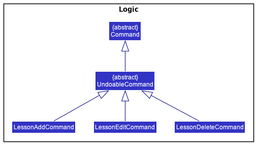
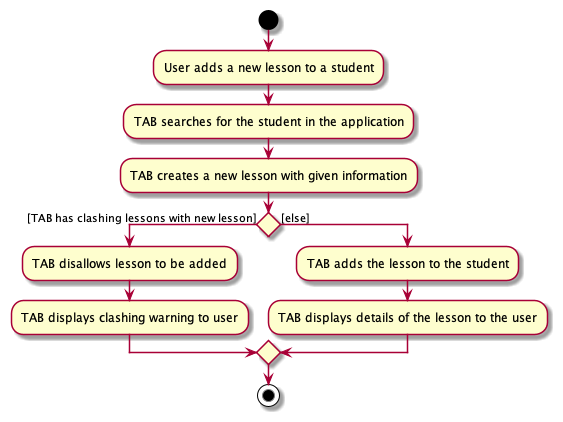
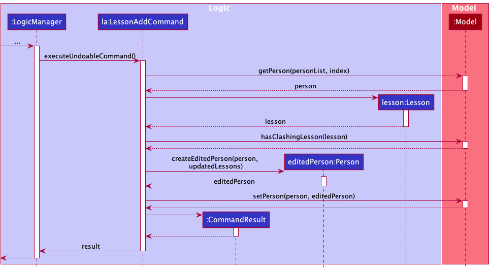
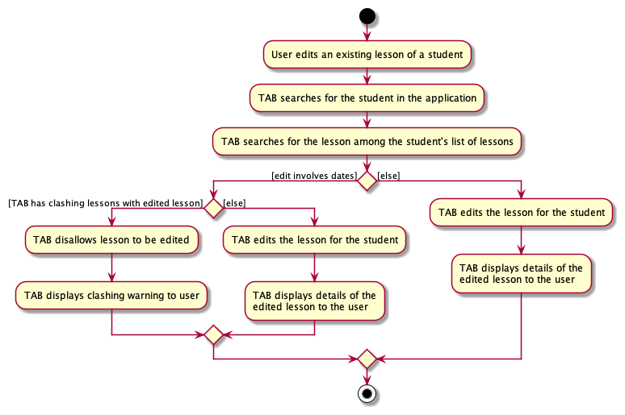
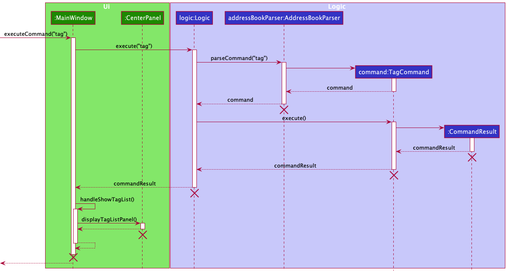
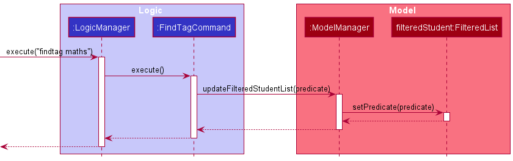

* Table of Contents
{:toc}

--------------------------------------------------------------------------------------------------------------------

## **Acknowledgements**

List of sources of all reused/adapted ideas, code, documentation, and third-party libraries:

* This project is based on the AddressBook-Level3 project created by the [SE-EDU initiative](https://se-education.org).
* UndoRedoStack implementation referenced: [SE-EDU AddressBook 4](https://github.com/nus-cs2103-AY1718S2/addressbook-level4/blob/master/src/main/java/seedu/address/logic/UndoRedoStack.java).
* Libraries used: [CalendarFX](https://dlsc.com/products/calendarfx/), [Jackson](https://github.com/FasterXML/jackson), [JavaFX](https://openjfx.io/), [JUnit5](https://github.com/junit-team/junit5)

--------------------------------------------------------------------------------------------------------------------

## **Setting up, getting started**

Refer to the guide [_Setting up and getting started_](SettingUp.md).

--------------------------------------------------------------------------------------------------------------------

## **Design**

:bulb: **Note:** 
The `.puml` files used to create diagrams in this document can be found in the [diagrams](https://github.com/AY2122S1-CS2103T-F13-3/tp/tree/master/docs/diagrams) folder. 
You can refer to the [_PlantUML Tutorial_ at se-edu/guides](https://se-education.org/guides/tutorials/plantUml.html) to learn how to create and edit diagrams.

### Architecture

*Figure A.0.1: Architecture Diagram that explains high-level design of the App.*

Given below is a quick overview of the components and how they interact with each other.

**Key components of the architecture**

**`Main`** has two classes called [`Main`](https://github.com/se-edu/addressbook-level3/tree/master/src/main/java/seedu/address/Main.java) and [`MainApp`](https://github.com/se-edu/addressbook-level3/tree/master/src/main/java/seedu/address/MainApp.java). It is responsible for the following:
* At app launch: Initializes the components in the correct sequence, and connects them with each other.
* At shut down: Shuts down the components and invokes cleanup methods where necessary.

[**`Commons`**](https://github.com/AY2122S1-CS2103T-F13-3/tp/tree/master/src/main/java/seedu/address/commons) represents a collection of classes used by multiple other components. In particular, the `LogsCenter` class plays an important role in the high-level design of the App as it is used to write log messages to the App's log file, which will be helpful for tracing and debugging.

The rest of the App consists of four components.

* [**`Ui`**](#ui-component): Handles the _UI_ of the App.
* [**`Logic`**](#logic-component): Executes the user's commands.
* [**`Model`**](#model-component): Holds the data of the App in memory while the App is running.
* [**`Storage`**](#storage-component): Reads data from, and writes data to, the hard disk. Allows the user to save and load data.

**How the architecture components interact with each other**

The *Sequence Diagram* below is an example of how the components interact with each other for the scenario where the user issues the command `delete 1`.

*Figure A.0.2: Sequence Diagram of main components when executing Delete Command*

Each of the four main components (also shown in the diagram above)

* defines its *API* in an `interface` with the same name as the Component.
* implements its functionality using a concrete `{Component Name}Manager` class (which follows the corresponding API `interface` mentioned in the previous point).

For example, the `Logic` component defines its API in the `Logic.java` interface and implements its functionality using the `LogicManager.java` class which follows the `Logic` interface. Other components interact with a given component through its interface rather than the concrete class (reason: to prevent outside component's being coupled to the implementation of a component), as illustrated in the (partial) class diagram below.

*Figure A.0.3: Interaction of the Main Components*

The sections below give more details of each component.

### UI component

The *API* of this component is specified in the [`Ui.java`](https://github.com/AY2122S1-CS2103T-F13-3/tp/tree/master/src/main/java/seedu/address/ui/Ui.java) interface.

*Figure A.1.1: Class Diagram of GUI using JavaFX framework*

The `Ui` component uses the JavaFX framework and consists of a `MainWindow` that is made up of parts e.g.`CommandBox`, `ResultDisplay`, `CenterPanel`, `StatusBarFooter` etc. All these, including the `MainWindow`, inherit from the abstract `UiPart` class which captures the commonalities between classes that represent parts of the visible _GUI_.

The layout of these _UI_ parts are defined in matching `.fxml` files that are in the `src/main/resources/view` folder. For example, the layout of the [`MainWindow`](https://github.com/AY2122S1-CS2103T-F13-3/tp/blob/master/src/main/java/seedu/address/ui/MainWindow.java) is specified in [`MainWindow.fxml`](https://github.com/AY2122S1-CS2103T-F13-3/tp/blob/master/src/main/resources/view/MainWindow.fxml)

The `Ui` component

* executes user commands using the `Logic` component.
* listens for changes to `Model` data so that the _UI_ can be updated with the modified data.
* keeps a reference to the `Logic` component, as it relies on `Logic` to execute commands.
* depends on some classes in the `Model` component, as it displays `Person` and `Calendar` objects residing in the `Model`.
* chooses which component it displays based on the `CommandResult` returned by `Logic` component after executing the user command (e.g., `CommandResult#isShowSchedule()` tells the `Ui` to display the user's schedule. See also: [Schedule feature](#schedule-feature)). 

### Logic component

**API** : [`Logic.java`](https://github.com/AY2122S1-CS2103T-F13-3/tp/tree/master/src/main/java/seedu/address/logic/Logic.java)

Here's a (partial) *class diagram* of the `Logic` component:

*Figure A.2.1: Class Diagram of Logic Component* 

How the `Logic` component works:
1. When `Logic` is called upon to execute a command, it uses the `AddressBookParser` class to parse the user command.
1. This results in a `Command` object (more precisely, an object of one of its subclasses, e.g., `AddCommand`) which is then executed by the `LogicManager`.
1. The command can communicate with the `Model` when it is executed (e.g. to add a person).
1. The result of the command execution is encapsulated as a `CommandResult` object which is returned from `Logic`.

The _Sequence Diagram_ below illustrates the interactions within the `Logic` component for the `execute("delete 1")` _API_ call.

*Figure A.2.2: Sequence Diagram of execution Delete Command*

:information_source: Note: The lifeline for `DeleteCommandParser` should end at the destroy marker (X) but due to a limitation of PlantUML, the lifeline reaches the end of diagram.

Here are the other classes in `Logic` (omitted from the class diagram above) that are used for parsing a user command:

*Figure A.2.3: Class Diagram of Parser Component*

How the parsing works:
* When called upon to parse a user command, the `AddressBookParser` class creates an `XYZCommandParser` (`XYZ` is a placeholder for the specific command name e.g., `AddCommandParser`) which uses the other classes shown above to parse the user command and create a `XYZCommand` object (e.g., `AddCommand`) which the `AddressBookParser` returns back as a `Command` object.
* All `XYZCommandParser` classes (e.g., `AddCommandParser`, `DeleteCommandParser`, ...) inherit from the `Parser` interface so that they can be treated similarly where possible e.g, during testing.

### Model component

**API** : [`Model.java`](https://github.com/AY2122S1-CS2103T-F13-3/tp/tree/master/src/main/java/seedu/address/model/Model.java)

*Figure A.3.1: Class Diagram of Model Component*

The `Model` component

* stores the tuition address book data, i.e., all `Person` and calendar `Entry` objects (which are contained in a `UniquePersonList` object and `CalendarEntryList` object respectively).
* stores the currently 'selected' `Person` objects (e.g., results of a search query) as a separate filtered list which is exposed to outsiders as an unmodifiable `ObservableList<Person>` that can be 'observed', e.g., the `Ui` component can be bound to this list so that it automatically updates when the data in the list change.
* stores a `UserPref` object that represents the user’s preferences. This is exposed to the outside as a `ReadOnlyUserPref` objects.
* does not depend on any of the other three components (as the `Model` represents data entities of the domain, they should make sense on their own without depending on other components).

:information_source: **Note:** An alternative (arguably, a more OOP) model is given below. It has a `Tag` list in the `AddressBook`, which `Person` references. This allows `AddressBook` to only require one `Tag` object per unique tag, instead of each `Person` needing their own `Tag` objects. 

### Storage component

**API** : [`Storage.java`](https://github.com/AY2122S1-CS2103T-F13-3/tp/tree/master/src/main/java/seedu/address/storage/Storage.java)

*Figure A.4.1: Class Diagram of Storage Component*
 

The `Storage` component
* can save both address book data and user preference data in json format, and read them back into corresponding objects.
* inherits from both `AddressBookStorage` and `UserPrefStorage`, which means it can be treated as either one (if only the functionality of only one is needed).
* depends on some classes in the `Model` component (because the `Storage` component's job is to save/retrieve objects that belong to the `Model`).

### Common classes

Classes used by multiple components are in the `seedu.addressbook.commons` package.

--------------------------------------------------------------------------------------------------------------------

## **Implementation**

This section describes some noteworthy details on how certain features are implemented.

### Lesson Management

Weekly recurring or one-off (makeup) lessons are classified as `Lesson` objects. These lessons can be added to any particular
student in TAB. Added lessons can also be edited and deleted. 

A `Lesson` is represented in the application as shown in the figure below. It contains a start `Date`, an end `Date`, a `TimeRange` for the
`Lesson`, a `Subject`, a `LessonRates` and `Homework` fields. There are 2 types of `Lesson` – `RecurringLesson` and `MakeUpLesson`. `RecurringLesson`
represents a **weekly** recurring lesson. `MakeUpLesson` represents a one-off lesson outside the regular schedule. 

*Figure I.3.1: Class Diagram of Lessons* 

The model checks for clashing lessons to ensure that TAB does not contain any duplicate `Lesson` objects as well as `Lesson`
objects with overlapping time ranges.

Operations on lessons can be done using the `LessonAddCommand`, `LessonEditCommand` and `LessonDeleteCommand` commands.
The class diagram given below shows how these commands are part of the `Logic` Component. 

*Figure I.3.2: Class Diagram of Logic Component with Lesson implementation details* 

These commands are described in greater detail in the sections below.

#### Adding Lessons
The `LessonAddCommand` adds a lesson to the list of lessons of a student in TAB. 

A simple illustration of how TAB might interact with the user for `LessonAddCommand` is shown below.

*Figure I.3.3.1: Activity diagram of `LessonAddCommand`* 

The lesson added will be displayed in the `LessonListPanel` in TAB. 

The figure below shows the sequence diagram for adding a lesson to a student.

*Figure I.3.3.2: Sequence Diagram of `LessonAddCommand`* 

*Figure I.3.3.3: Continued Sequence Diagram of `LessonAddCommand`* 

The `LessonAddCommand#executeUndoableCommand()` method updates the `Lesson` objects in the `Person` in the `UniquePersonList` 
by adding `toAdd` to the list of lessons the student currently has. Note that `toAdd` will not be added if there is an 
existing lesson with a clashing date and timeslot. 

#### Editing Lessons
The `LessonEditCommand` edits the lesson identified by its index in the displayed list of lessons with respect to the student
with this lesson. The lesson will be edited per the given information input by the user. 

A simple illustration of how TAB might interact with the user for `LessonEditCommand` is shown below.
Note that edits involving dates mean that changes are made to the start or end dates of the lesson and/or to the cancelled dates of the lesson.

*Figure I.3.4.1: Activity diagram of `LessonEditCommand`* 

The figure below shows the sequence diagram for editing a lesson.

*Figure I.3.4.2: Sequence Diagram of Lesson Edit Command* 

In the `LessonEditCommand` class, a new class called `EditLessonDescriptor` is defined to create `Lesson` objects that will store
the new values for the fields that have been specified to be edited. The `createEditedLesson()` method uses the `EditLessonDescriptor`
object to create the `editedLesson` object. The detailed sequence diagram for LessonEditCommand is the similar to LessonAddCommand's
with an additional step for retrieving the lesson to edit from the student of interest. Refer to Figure I.3.3.2 above. 

The `executeUndoableCommand()` method of the `LessonEditCommand` uses this `editedLesson` object to update the `model` of TAB.
The new lesson is stored in TAB in place of the old lesson. The student's list of lessons will be updated to reflect
the changes made to the specified lesson. 

#### Deleting Lessons
The `LessonDeleteCommand` deletes the lesson specified by its lesson index in the displayed list of lessons with respect to the
student with this lesson.

The logic for `LessonDeleteCommand` is similar to that of the `DeleteCommand`. The only exception is that a `Person` with the updated lesson
list without the deleted lesson will be created and will replace the original `Person` in the model (same as with `LessonAddCommand` and 
`LessonEditCommand`. 

The specified `Lesson` object will be deleted from the `model` of TAB, and the updated list of lessons of the student will be displayed. 

#### Storing Lessons
The set of `Lesson` objects are stored within the `Person` who is referencing these `Lesson` objects. The `JsonAdaptedLesson` is used
to convert the `Lesson` objects to Jackson-friendly `JsonAdaptedLesson` objects that can be stored in the `.json` file, where all the
`Person` objects in TAB is stored. When the application starts up, this class is also used to convert the `JsonAdaptedLesson` objects
into `model`-friendly `Lesson` objects. 

#### Displaying Lessons in GUI
A single `Lesson` is displayed using a `LessonCard`. All `Lesson` objects belonging to a student is displayed in a list using
the `LessonListPanel`, which contains a `ListView` of multiple `LessonCard`s.
The list of lessons is displayed side by side the list of students. The `ViewCommand` is used to specify which student's
list of lessons to view. The `PersonListPanel` also has a listener that displays the selected student's list of lesson. 

#### Design considerations:

**Aspect: Data Structures to support lesson operations**

* **Alternative 1 (current choice):** Store the `Lesson` objects in a set referenced by a `Person` object.
    * Pros: Easy to implement.
    * Cons: Operations have to be done with respect to the `Person` with the set containing the target lesson.

* **Alternative 2:** Store a `UniqueLessonList` containing the lessons of all the students in TAB.
    * Pros: No need to edit `Person` for `Lesson` operations.
    * Cons: Operations are done with respect to the full list of lessons in the application, which means user cannot
      isolate the list of lessons of a student of choice to operate on.

Alternative 1 is our choice as it fits the way private tutors handle each student better, 
where the lessons are isolated to the student for more personalised teaching. 

**Aspect: Recurrence rule for recurring lessons**

* **Alternative 1 (current choice):** Only allow weekly recurrence
    * Pros: Easy to implement and allow room for other features (such as detecting of clashes). Weekly recurring lessons are
      common for private 1-to-1 tuition in Singapore.
    * Cons: Users cannot set their own recurrence rule. Workaround for schedule-keeping possible through adding singular lessons
      when needed.

* **Alternative 2:** Allow user to define their own recurrence rule.
    * Pros: Greater flexibility in planning lessons outside the regular weekly recurrence.
    * Cons: Difficult to detect clashes with so many possibilities.

Alternative 1 is our choice as weekly recurring lessons are common for private 1-to-1 tuition in Singapore and also allows us
to implement the clashing warning feature more easily. As alternative 2 required more thinking on how to calculate overlapping dates,
we decided to put off alternative 2 for future considerations. 

### Schedule feature

This feature allows users to view a calendar that contains all existing lessons to visualise their schedule and plan ahead.

TAB uses the [CalendarFX](https://dlsc.com/products/calendarfx/) library to implement its calendar interface.
Each lesson stored in the `Model` component is also converted to a CalendarFX `Entry`and maintained in the `CalendarEntryList` of `AddressBook` (see also: [`Model` component](#model-component)). 
The `Ui` component shows this list of entries in the `SchedulePanel` using CalendarFX's `CalendarView` with our custom display settings.

Any changes made to the `Calendar` in `Model` will automatically update the `CalendarView` through CalendarFX's internal implementation (see how in their [manual](http://dlsc.com/wp-content/html/calendarfx/manual.html)). 

#### CenterPanel

We allow the user to toggle between viewing the schedule and viewing the list of students with the `CenterPanel` class in the `Ui` component.

The *Sequence Diagram* below shows how the `Ui` components interact with each other when user inputs the `schedule` command.

*Figure I.1.1: Sequence Diagram of Schedule Command*

When the user requests to view the schedule,the `displaySchedulePanel()` method of `CenterPanel` is called, which sets the current display to show the `SchedulePanel`.
Switching back is similarly achieved by calling the `displayPersonListPanel()` method of `CenterPanel`.

#### Design considerations

**Aspect: How the calendar interface is implemented:**

* **Alternative 1:**  Create a calendar view using JavaFX.
    * Pros: More customisable as we are not limited by CalendarFX's _API_.
    * Cons: Much more difficult to implement.

* **Alternative 2 (current implementation):** Use CalendarFX to display entries while storing entry data locally.
    * Pros: Less code is written to implement it and the difficulty of implementing a calendar is completely abstracted away.
    * Cons: There is the initial difficulty in picking up and learning CalendarFX's API, and a risk that it might not work out the way we want it to. We will also be limited to the features of CalendarFX, and any bug or issues will be inevitably find its way into our system as well.

We chose alternative 2 and integrated CalendarFX into our app as the possibility of introducing bugs seems small due to it being a well-used and well-tested library. Furthermore, the schedule feature will be much more robust and can be implemented much faster as compared with alternative 1.

**Aspect: How to implement different calendar views such as week view and month view:**

* **Alternative 1 (current implementation):**  Use CalendarFX's `CalendarView` which is a complete calendar interface.
    * Pros: Very easy to implement, as most things are done internally by CalendarFX. We also benefit from additional features such as their search bar, buttons for navigation, and fancy animations and transitions. 
    * Cons: Each page becomes very small in our GUI, limiting its usefulness for users with smaller screens. Furthermore, we have no choice but to display all four of the default calendarFX pages (i.e., day, week, month and year pages), even if we do not want to.

* **Alternative 2:**  Create our own JavaFX panels for each page for displaying week and month.
    * Pros: Month view will be slightly bigger, increasing the number of entries that can be seen by a small amount. Bugs and inconsistencies in other pages can be avoided as we will have better control what we want to display.
    * Cons: Much harder to implement, no more fancy transitions or inbuilt buttons, and GUI improvements seem marginal at best.

Alternative 1 is our preferred choice as its pros and cons seem much better than alternative 2, especially due to its ease of implementation. The main difficulty of alternative 1 becoming familiar with the CalendarFX _API_, but this difficulty is also present in alternative 2.

### Undo/redo feature

The undo/redo mechanism is facilitated by an `UndoRedoStack`, which resides in `LogicManager`. It supports the undoing and redoing of commands that modifies the state of the address book (e.g. `add`, `edit`). Such commands will inherit from `UndoableCommand`.

`UndoRedoStack` only deals with `UndoableCommand`. Commands that cannot be undone will inherit from `Command` instead.

*Figure I.2.1: Class Diagram of Undoable Command*

`UndoableCommand` adds an extra layer between the abstract `Command` class and the concrete commands that can be undone such as `AddCommand`, `DeleteCommand`.
`UndoableCommand` makes the `Command#execute()` method concrete, while the child classes implement an `executeUndoableCommand()` method that preprocesses the Command before execution. 
Each child class of `UndoableCommand` knows how to undo/redo by itself.

Commands that are not undoable have similar implementations as the code snippet below:

    public class ListCommand extends Command {
        @Override
        public CommandResult execute() {
            //..list logic
        }
    }

With `UndoableCommand`, the commands that are undoable are implemented similarly to the code snippet below:

    public abstract class UndoableCommand extends Command {
        protected abstract CommandResult executeUndoableCommand();
        @Override
        public CommandResult execute() {
            return executeUndoableCommand();
        }
        protected abstract Person undo;
    }
    
    public class DeleteCommand extends UndoableCommand {
        @Override
        protected CommandResult executeUndoableCommand() {
            //...delete logic
        }
        @Override
        protected Person undo {
            //...undo logic
        }
    }

Step 1. Suppose that a user has just launched our application. The `undoRedoStack` will be empty at the beginning.

Step 2. The user then executes an `UndoableCommand` which modifies the existing `Model` as per the definition of an `UndoableCommand`. 
The specific `UndoableCommand` called will process the command during the method call `UndoableCommand#executeUndoableCommand` so that it can undo itself.

For instance, the executed command is `delete 5`, to delete the 5th person in the `AddressBook` that resides in the `Model`. 
The deleted Person, referred to in the Figure I3 as `p5` is stored in the `deletedPerson` field in `DeleteCommand`. 
The Figure I.2.2 below shows the state of `UndoRedoStack` before and after the execution of `delete 5`.

*Figure I.2.2: UndoRedoStack before and after executing 1 Delete Command*

In Figure I.2.2, when `delete 5` command finishes, the command will be pushed onto the `undoStack`.

Step 3. As the user continues to use the program, more commands are added into the `undoStack`. For example, the user may execute `add n/John Doe ...` to add a new person. 
Figure I.2.3 below shows the change in `undoStack` when `add` command is executed right after `delete 5` command.

 

*Figure I.2.3: UndoRedoStack before and after executing 1 `AddCommand`.*

In Figure I.2.3, `undoStack` initially contains `delete 5` command alongside the specific changed portion of the `Model`, namely `deletedPerson`. 
Upon executing `add` command, `add` command that has been processed such that it can undo itself is added to the `undoStack`.

:information_source: **Note:** If a command fails its execution, it will not be pushed to the `UndoRedoStack` at all. 

Step 4. The user now decides that adding the person was a mistake, and decides to undo that action using `undo`.

`UndoRedoStack` will pop the most recent command out of the `undoStack` and push it to the `redoStack`. For instance, the popped command in this example would be `add`,
`add` would the call its own `AddCommand#undo` to undo itself.

 

*Figure I.2.4: UndoRedoStack before and after executing Undo Command*

In Figure I.2.4, `undo` results in `add` command in the `undoStack` being popped out and pushed into `redoStack`. 
At the same time, the `add` command would undo itself, restoring the `AddressBook` to the previous state.

:information_source: **Note:** If the `undoStack` is empty, then there are no other commands left to be undone, and an `Exception` will be thrown when popping the `undoStack`. 

The sequence diagram in Figure I6 shows how the undo operation works:

 

*Figure I.2.5: Sequence diagram of executing Undo Command*

In Figure I.2.5, when the user enters the command to `undo`, `AddressBookParser` will parse the given command and create an `UndoCommand` to be returned to `LogicManager`.
`LogicManager` will call `execute()` method in `UndoCommand`, which in turn calls `popUndo()` method in `UndoRedoStack`. `UndoRedoStack` will return the most recently executed `UndoableCommand`popped from
the `UndoRedoStack`. `UndoCommand` will call `undo()` on the `XYZCommand` so that `XYZCommand` can undo itself, restoring the `AddressBook`.

The redo does the exact opposite (pops from `redoStack`, push to `undoStack`, and calls the `XYZCommand` to redo itself).

:information_source: **Note:** If the `redoStack` is empty, then there are no other commands left to be redone, and an `Exception` will be thrown when popping the `redoStack`. 

There are 2 cases for redoing commands - `UndoableCommand` v.s. non-`UndoableCommand`. The `UndoRedoStack` reacts differently depending on the type of the command.

**Case 1: `UndoableCommand` called before `redo`**

Continuing from the previous example, suppose that after the user undoes the `AddCommand`, the user now decides to add another student with the same name `John Doe`.
The user executes a new command, `add`. Figure I.2.6 below shows the change in `UndoRedoStack` after executing the `add` command. Note that the `AddCommand` before and after are 2 different commands.
The one before is named `a1` and the one after is named `a2` for better readability.

*Figure I.2.6: UndoRedoStack before and after executing Add Command.*

In Figure I.2.6, `add` will be pushed into the `undoStack` since `add` is an `UndoableCommand`. At the same time, the `redoStack` is cleared.
Its contents are cleared as we no longer makes sense be able to redo `add n/John Doe ...` as it would result in duplicate students 
(this is the behaviour that most modern desktop applications follow).

**Case 2: Commands that does not modify any data called before `redo`**

Continuing from the previous example, suppose that after the user undoes the `AddCommand`, the user now decides to view the calendar.
The user executes a new command, `day`. Figure I.2.7 below shows the change in `UndoRedoStack` after executing the `day` command.

*Figure I.2.7: UndoRedoStack before and after executing Day Command.*

In Figure I.2.7, `day` will not be pushed into the `undoStack` since `day` is not an `UndoableCommand`. Unlike for the `add` command in Case 1,
the `redoStack` is not cleared as there were no changes to the data after undoing `AddCommand`, executing `redo` would not result in any errors.
Hence, the `UndoRedoStack` remains identical.

The following activity diagram in Figure I.2.8 summarizes what happens inside the `UndoRedoStack` when a user executes a new command:

*Figure I.2.8: Activity Diagram after a `Command` is executed.*

In Figure I.2.8, after execution, any `Command` that is **not** `UndoableCommand` will not change the `UndoRedoStack`.
If the `Command` is an `UndoableCommand`, it will be pushed to the `undoStack` before the control is returned to the user eventually.

#### Design considerations:

**Aspect: How undo & redo executes:**

* **Alternative 1:** Saves the entire address book.
  * Pros: Easy to implement.
  * Cons: May have performance issues in terms of memory usage.

* **Alternative 2 (current implementation):** Individual command knows how to undo/redo by
  itself.
  * Pros: Will use less memory (e.g. for `delete`, just save the person being deleted).
  * Cons: We must ensure that the implementation of each individual command are correct.
  
### Viewing Tags
Viewing tag is facilitated by `UniqueTagList`. 
- `UniqueTagList` stores a list of alphabetically sorted unique unmodifiable tags with case-insensitive tag names.
- `UniqueTagList` holds a class field `tagCounter` that maps `Tag` to `Integer`, where `Integer` is the number of persons labelled under each tag. 
- `Tag` objects are not referenced by `Person`, i.e. each `Person` has a set of `Tag` objects.

Operations include:
- `UniqueTagList#asUnmodifiableTagList()` - Returns an unmodifiable view of the tag list.
- `UniqueTagList#addTagFromPersonList(List<Person>)` - Adds tags from the specified list of persons to the tag list.
- `UniqueTagList#addTagFromPerson(Person)` - Adds tags from the specified person to the tag list if the tags do not exist in the tag list. If there is already a tag with same case-insensitive name, it increments the `Integer` that this tag is mapped to in `tagCounter`.
- `UniqueTagList#removeTagFromPerson(Person)` - Removes tags belonging to the specified person from the tag list if there is no person labelled under this tag after removal, else, decrements the `Integer` that this tag is mapped to in `tagCounter`.
- `UniqueTagList#editTagFromPerson(Person)` - Removes the original tags belonging to the specified person to the tag list and adds the new tags labelled for the specified person.
- `UniqueTagList#getNumStudentsForTag(Tag)` - Returns the number of students labelled under the specified tag as stored in `tagCounter`.
These operations are called when a person is added, deleted, or edited with `AddCommand`, `EditCommand` and `DeleteCommand`.

Given below is an example usage scenario and how viewing tag is executed:
- **Step 1:** The user launches the application. The `Model` is initialized with the saved data (or sample data if there is no saved data). Tags from each person is loaded into `UniqueTagList` and `tagCounter` with corresponding number of students labelled with the tags.
- **Step 2:** The user enter the command `tag` to view all tags. `AddressBookParser` parses this command, creating a `TagCommand`.
- **Step 3:** `LogicManager` executes the `TagCommand`. 
  - During execution, `TagCommand#execute()` calls `Model#getObservableList()` to get the tag list with the tags created in TAB with their corresponding number of students labelled under them to be displayed to the user.

:information_source: **Note:** Tags with duplicate case-insensitive tag names for a person is not allowed. If the user tries to adds a tag with the same tag name to the person already with that tag, the new tag will not be added and `tagCounter` will not increment the count for this tag. 

Figure I.4.1 shows a sequence diagram of how viewing tags works. 

*Figure I.4.1: View tag sequence diagram*

#### Design considerations:
**Alternative 1 (current implementation):** Use a `UniqueTagList` to store the tags created and a class field `tagCounter` to map each unique `Tag` to the number of persons labelled under it.
- Pros:
  - Quicker retrieval and update of data using a `HashMap` for `tagCounter`.
- Cons:
  - Each `Person` object has its own set of `Tags` which may be repetitive and memory-consuming if there is a large number of same tags.
  - Retrieval of all tags and calculation of the number of persons labelled under each tag during the initialization of the application requires iterating through all persons in TAB.

**Alternative 2:** Each tag stores a list of persons or number of persons labelled with that tag.
- Pros:
  - Faster retrieval of the number of persons under each tag.
- Cons:
  - This could result in circular dependency since a `Person` keeps reference of a set of `Tags` and a `Tag` has to keep a reference to a list of `Persons` simultaneously.
  - Updating the tags labelled for a `Person` requires modification of the data fields of the `Person`. Since TAB objects are immutable, this means that new copies of `Person` and `Tag` have to be created after every command that modifies the data. This could slow down the application when there is a large amount of data stored.

### Finding students

The `FindCommand` allows users to find students based on person fields.

**Current Implementation**

*Figure I.5.1: Sequence Diagram of Find Command*

The user can specify multiple fields to search for and each field takes in multiple keywords.
An exception is the tag field which only accepts a single keyword. Instead, users can specify multiple tag fields.

The `PersonMatchesKeywordsPredicate` is used to test whether a person matches the specified keywords.
For each searchable field, a predicate is created which tests if a given person's field contains all specified keywords.

Additionally, a `FindCondition` can be specified by the user which determines whether `all`, `any` or `none` of the fields specified are required to match with a given person, for the person to be returned. The default is `all`.

The `PersonMatchesKeywordsPredicate#test()` method will compose all searched field predicates into a single predicate, depending on the find condition.
The predicate is then used to filter the list of person.

**Design considerations:**

**Aspect: Data structure of predicates**
* **Alternative 1 (current choice):** Use a single `PersonMatchesKeywordsPredicate` class to represent all fields' predicates.
    * Pros: All predicates meant for testing on person fields can be consolidated in one place and reduce code duplication. It can also encapsulate the composition of all predicates.
    * Cons: If fields have different matching behaviour, it may result in the class having more than one responsibility.
* **Alternative 2:** Use multiple `{field}MatchesKeywordsPredicate` classes to represent each field's predicate.
    * Pros: It offers greater flexibility for each field predicate to have its own matching behavior.
    * Cons: There is greater probability of bugs introduced if a new field to search is to be added, or if the matching behaviour of all predicates are required to be changed.

### Fees Calculation

--------------------------------------------------------------------------------------------------------------------

## **Documentation, logging, testing, configuration, dev-ops**

* [Documentation guide](Documentation.md)
* [Testing guide](Testing.md)
* [Logging guide](Logging.md)
* [Configuration guide](Configuration.md)
* [DevOps guide](DevOps.md)

--------------------------------------------------------------------------------------------------------------------

## **Appendix: Requirements**

### Product scope

**Target user profile**:

A private 1-to-1 home tuition teacher in Singapore that:

1. has a need to manage not more than 50 student contacts
2. has a need to manage admin details of each student, namely, lesson fees and payment
3. has a need to keep track of lesson details for each student
4. teaches lessons anytime between 8am and 10pm (UTC+8), on any day of the week
5. has a need to manage a busy schedule of not more than 50 lessons
6. prefers desktop apps over other types
7. can type fast
8. prefers typing to mouse interactions
9. is reasonably comfortable using CLI apps
10. tutors students belonging to Singapore’s education system

**Value proposition**: TAB is an all-in-one app that manages work schedule and client relationships faster than 
a typical mouse/_GUI_ driven app. TAB effortlessly keeps track of large amounts of necessary 
student and lesson information, to empower tutors to provide the best quality home tuition service.  

### User stories

We categorise our user stories into three main epics:
1. [S] - Keeping track of student information
2. [L] - Keeping track of lesson information
3. [U] - Having a simple, efficient, and intuitive _UI/UX_

Priorities: High - must have; Medium - nice to have;  Low - unlikely to have.

| ID  | Priority | As a …​                                 | I want to …​                                                     | So that I can…​                                                      |
|-----| -------- | ------------------------------------------ | ------------------------------------------------------------------- | ----------------------------------------------------------------------- |
| S1  | `HIGH`   | user                                       | add a new student                                                   | track student information with TAB                                  |
| S2  | `HIGH`   | user                                       | view a student                                                      | track student information with TAB                                  |
| S3  | `HIGH`   | user                                       | delete a student                                                    | remove entries that I no longer need                                    |
| S4  | `HIGH`   | user                                       | edit a student                                                      | update student information                                              |
| S5  | `HIGH`   | user                                       | categorise my students with tags                                    |                                                                         |
| S6  | `HIGH`   | user                                       | add remarks to a student                                            | keep track of supplementary information related to a student            |
| S7  | `HIGH`   | user                                       | view remarks of a student                                           |                                                                         |
| S8  | `HIGH`   | user                                       | edit remarks of a student                                           |                                                                         |
| S9  | `HIGH`   | user                                       | delete remarks of a student                                         |                                                                         |
| S10 | `HIGH`   | user                                       | add a student's contacts                                            | maintain direct avenues of contact with the student                     |
| S11 | `HIGH`   | user                                       | view a student's contacts                                           |                                                                         |
| S12 | `HIGH`   | user                                       | edit a student's contacts                                           |                                                                         |
| S13 | `HIGH`   | user                                       | delete a student's contacts                                         |                                                                         |
| S14 | `HIGH`   | user                                       | add a student's parent contacts                                     | maintain direct avenues of contact with their parents                   |
| S15 | `HIGH`   | user                                       | view a student's parent contacts                                    |                                                                         |
| S16 | `HIGH`   | user                                       | edit a student's parent contacts                                    |                                                                         |
| S17 | `HIGH`   | user                                       | delete a student's parent contacts                                  |                                                                         |
| S18 | `HIGH`   | user                                       | add a student's address                                             | know where to go to conduct my home tuition service                     |
| S19 | `HIGH`   | user                                       | view a student's address                                            |                                                                         |
| S20 | `HIGH`   | user                                       | edit a student's address                                            |                                                                         |
| S21 | `HIGH`   | user                                       | delete a student's address                                          |                                                                         |
| S22 | `HIGH`   | user                                       | add a student's school                                              | be reminded of the content that is relevant to the student              |
| S23 | `HIGH`   | user                                       | view a student's school                                             |                                                                         |
| S24 | `HIGH`   | user                                       | edit a student's school                                             |                                                                         |
| S25 | `HIGH`   | user                                       | delete a student's school                                           |                                                                         |
| S26 | `HIGH`   | user                                       | add a student's academic stream                                     | be reminded of the content that is relevant to the student              |
| S27 | `HIGH`   | user                                       | view a student's academic stream                                    |                                                                         |
| S28 | `HIGH`   | user                                       | edit a student's academic stream                                    |                                                                         |
| S29 | `HIGH`   | user                                       | delete a student's academic stream                                  |                                                                         |
| S30 | `HIGH`   | user                                       | add a student's academic level                                      | be reminded of the content that is relevant to the student              |
| S31 | `HIGH`   | user                                       | view a student's academic level                                     |                                                                         |
| S32 | `HIGH`   | user                                       | edit a student's academic level                                     |                                                                         |
| S33 | `HIGH`   | user                                       | delete a student's academic level                                   |                                                                         |
| S34 | `HIGH`   | user                                       | add a student's outstanding fees                                    | be reminded of the fees I have yet to collect                           |
| S35 | `HIGH`   | user                                       | view a student's outstanding fees                                   |                                                                         |
| S36 | `HIGH`   | user                                       | edit a student's outstanding fees                                   |                                                                         |
| S37 | `HIGH`   | user                                       | delete a student's outstanding fees                                 |                                                                         |
| S38 | `LOW`    | user                                       | have an archive for removed students                                | revisit the archived data if the need arises                            |
| S39 | `LOW`    | user with many students stored in TAB  | sort students by name                                               | locate a student easily                                                 |
| S40 | `LOW`    | user with many students stored in TAB  | sort students by tag                                                | locate a student easily                                                 |
| L1  | `HIGH`   | user                                       | add lessons for a student                                           | keep track of the lessons each student has                              |
| L2  | `HIGH`   | user                                       | add recurring lessons for a student                                 | keep track of the regular lessons                                       |
| L3  | `HIGH`   | user                                       | add makeup lessons for a student                                    | track lessons outside of my usual lesson schedule                       |
| L4  | `HIGH`   | user                                       | delete a student's lesson                                           | remove lessons that I no longer have                                    |
| L5  | `MEDIUM` | user                                       | add a start date for a lesson                                       | be updated with my lesson schedule                                      |
| L6  | `MEDIUM` | user                                       | edit the start date of a lesson                                     |                                                                         |
| L7  | `MEDIUM` | user                                       | view the start date of a lesson                                     |                                                                         |
| L8  | `MEDIUM` | user                                       | add a time period for a lesson                                      | be updated with my lesson schedule                                      |
| L9  | `MEDIUM` | user                                       | edit the time period of a lesson                                    |                                                                         |
| L10 | `MEDIUM` | user                                       | view the time period of a lesson                                    |                                                                         |
| L11 | `MEDIUM` | user                                       | delete the time period of a lesson                                  |                                                                         |
| L12 | `MEDIUM` | user                                       | add a subject for a lesson                                          | plan and prepare for that specific subject                              |
| L13 | `MEDIUM` | user                                       | edit the subject of a lesson                                        |                                                                         |
| L14 | `MEDIUM` | user                                       | view the subject of a lesson                                        |                                                                         |
| L15 | `MEDIUM` | user                                       | delete the subject of a lesson                                      |                                                                         |
| L16 | `MEDIUM` | user                                       | add each assigned piece of homework for a particular lesson         | keep track of what I have to go through that lesson                     |
| L17 | `MEDIUM` | user                                       | edit a student's assigned homework for a particular lesson          |                                                                         |
| L18 | `MEDIUM` | user                                       | view the assigned homework of a particular lesson                   |                                                                         |
| L19 | `MEDIUM` | user                                       | view a calendar of my scheduled lessons                             | plan ahead while managing my schedule                                   |
| U1  | `HIGH`   | new user                                   | see usage instructions                                              | refer to instructions whenever I need guidance on how to use TAB    |
| U2  | `HIGH`   | new user                                   | purge all current data                                              | remove all sample/experimental data I used while exploring TAB      |
| U3  | `HIGH`   | user                                       | find a student by keyword                                           | locate details of students without having to go through the entire list |
| U4  | `HIGH`   | user                                       | undo accidental changes                                             |                                                                         |
| U5  | `MEDIUM` | user                                       | filter students by tags                                             | view a list of all the students that feature the specified tags         |
| U6  | `MEDIUM` | user with incomplete information           | skip less important information to add                              | update later when I have the rest of the information                    |
| U7  | `MEDIUM` | user                                       | select and copy data to desktop clipboard                           | paste and use the data outside of TAB                               |
| U8  | `LOW`    | user who uses many tags                    | view all tags                                                       | remember my tags easily                                                 |
| U9  | `LOW`    | expert user                                | customise the commands and input fields                             | choose not to follow the given template                                 |
| U10 | `LOW`    | user                                       | be reminded to update data after a lesson                           | ensure that data stays up to date                                       |

*{More to be added}*

### Use cases

(For all use cases below, the **System** is the `TuitionAddressBook` aka TAB, and the **Actor** is the tutor `user`, unless specified otherwise)

 

**Use case: UC1 - Get a list of students**

**MSS**

1. User requests to list all students
2. TAB displays a list of all students

   Use case ends.

**Extensions**

* 1a. User requests for a list of students filtered by a specified tag

  * 1a1. TAB displays a filtered list of students with the specified tag
  
    Use case ends.
  
* 1b. User requests for a list of students that match a specified keyword

  * 1b1. TAB displays a list of students with data matching the keyword

    Use case ends.

* 2a. The list is empty.
    
    Use case ends.
* 
 

**Use case: UC2 - Add a new student**

**MSS**

1. User requests to add a new student with specified fields
2. TAB adds the student with the specified fields

   Use case ends.

**Extension**

* 1a. TAB detects that the entered student data does not satisfy requirements

    * 1a1. TAB displays an error message and the recommended changes

      Use case resumes at step 2.

* 1b. TAB detects a duplicate student

    * 1b1. TAB displays an error message

      Use case ends.

 

**Use case: UC3 – Edit a student**

**MSS**

1. User <ins>gets a list of students (UC1)</ins>
2. User requests to edit certain fields of specific student in the list
3. TAB updates the corresponding fields of the student

   Use case ends.

**Extensions**

* 2a. The given index is invalid

    * 2a1. TAB displays an error message

      Use case resumes at step 1.

* 2b. No fields to be edited are specified

    * 2b1. TAB shows an error message

      Use case resumes at step 1.

* 2c. TAB detects that the entered student data does not satisfy requirements

    * 2c1. TAB displays an error message and the recommended changes

      Use case resumes at step 1.

* 2d. TAB detects a duplicate student

    * 2d1. TAB shows an error message

      Use case ends.

 

**Use case: UC4 - Delete a student**

**MSS**

1. User <ins>gets a list of students (UC1)</ins>
2. User requests to delete a specific student in the list
3. TAB deletes the student

   Use case ends.

**Extensions**

* 2a. The given index is invalid

    * 2a1. TAB displays an error message

      Use case resumes at step 1.

 

**Use case: UC5 - Add a student's lesson information**

**MSS**

1. User <ins>gets a list of students (UC1)</ins>
2. User requests to add a lesson for a specific student in the list
3. TAB adds the lesson to the student specified
    
    Use case ends.

**Extensions**

* 2a. The given index is invalid

  * 2a1. TAB shows an error message
    
    Use case resumes at step 1.
  
* 2b. TAB detects that the entered lesson data does not satisfy requirements

    * 2b1. TAB displays an error message and the recommended changes

      Use case resumes at step 1.

 

**Use case: UC6 – Edit a student’s lesson information**

**MSS**

1. User <ins>gets a list of students (UC1)</ins>
2. User requests to edit certain fields of a specific lesson of a specific student in the list
3. TAB updates the corresponding fields of the lesson for the specified student

   Use case ends.

**Extensions**

* 2a. The specified student has no lessons

  Use case ends.

* 2b. The given index of the student is invalid

    * 2b1. TAB displays an error message

      Use case resumes at step 1.

* 2c. The given index of the lesson of the student is invalid

    * 2b1. TAB displays an error message

      Use case resumes at step 1.

* 2b. No lesson fields to be edited are specified

    * 2b1. TAB displays an error message

      Use case resumes at step 1.

* 2d. TAB detects that the entered lesson data does not satisfy requirements

    * 2d1. TAB displays an error message and the recommended changes

      Use case resumes at step 1.

* 2e. TAB detects clashing lessons

    * 2e1. TAB displays an error message

      Use case ends.

 

**Use case: UC7 – Delete a student’s lesson information**

**MSS**

1. User <ins>gets a list of students (UC1)</ins>
2. User requests to delete a specific lesson for a specific student
3. TAB deletes the specified lesson from the specified student in the list

   Use case ends.

**Extensions**

* 2a. The given index of the student is invalid

    * 2a1. TAB displays an error message

      Use case resumes at step 1.

* 2b. The given index of the lesson of the specified student is invalid

    * 2b1. TAB displays an error message

      Use case resumes at step 1.

 

**Use case: UC8 – Find student by student fields**

**MSS:**

1.  User requests to list students.
2.  TAB shows a list of students.
3.  User requests to find student with a specified name and address.
4.  TAB shows a list of students with matching name and address.

    Use case ends.

**Extensions:**
* 1a. The user specifies an invalid keyword
    
    * 1a1. TAB displays an error message

      Use case resumes at step 1.
    
* 2a. The list is empty.

  Use case ends.

 

**Use Case: UC8 – View quick start instructions**

**MSS**

1. User opens the app
2. TAB displays quick start instructions

   Use case ends.
   
 

**Use case: UC9 – Get help**

**MSS**

1. User requests for help
2. TAB displays usage guide.

   Use case ends.

 

**Use case: UC10 - Undo an accidental modification**

**MSS**

1. User requests to undo a previous modification to TAB's data within the session
2. TAB undoes the previous modification

   Use case ends.

**Extension**

* 1a. There are no previous modifications

  * 1a1. TAB shows an error message
  
    Use case ends.

 

**Use case: UC11 - Redo an undone modification**

**MSS**

1. User requests to redo a modification to TAB's data that was previously undone within the session
2. TAB reverts the previous undo command

   Use case ends.

**Extension**

* 1a. There are no previous undo requests within the session

    * 1a1. TAB shows an error message
  
      Use case ends.
    
 

### Non-Functional Requirements

1. Should work on any _mainstream OS_ as long as it has Java `11` or above installed
2. The response to any user action should become visible within 2 seconds
3. Should be able to hold up to 50 students and 50 lessons without a noticeable sluggishness in performance for typical usage
4. A user with above average typing speed for regular English text (i.e. not code, not system admin commands) should be able to accomplish most of the tasks faster using commands than using the mouse
5. The source code should be open source
6. The product is offered as a free service
7. This product is for individual use
8. Student and lesson data should be persistent
9. All features should be easily testable
10. Should be portable, i.e. user can transfer data from one device to another easily
11. Should allow users to easily navigate the app interface

### Glossary

* **Academic level**: Mainstream academic years from primary to tertiary education in Singapore (i.e. Primary 1-6, Secondary 1-5, Junior College 1-2 and Year 1-6).
* **Academic stream**: Mainstream tracks in Singapore (i.e. Express, NA, NT, IP, IB) as well as other common exam streams (e.g. IELTS, SAT, ACT).
* **Class Diagram**: UML class diagrams describe the structure (but not the behavior) of an _OOP_ solution. These are possibly the most often used diagrams in the industry and are an indispensable tool for an OO programmer (as defined in the Software Engineering for Self-Directed Learners CS2103/T edition [textbook](https://nus-cs2103-ay2122s1.github.io/website/se-book-adapted/index.html)).
* **GUI**: Graphical User Interface - a type of user interface through which users interact with the app via visual representations.
* **Makeup lesson**: A lesson that occurs only once, for a student who has missed a previous lesson.
* **Mainstream OS**: Windows, Linux, Unix, OS-X.
* **OOP**: Object-Oriented Programming - a programming paradigm that organizes software design around data, or objects, rather than functions and logic
* **Private contact detail**: A contact detail that is not meant to be shared with others.
* **Recurring lesson**: A lesson that will occur more than once in patterned intervals.
* **Sequence Diagram**: A UML sequence diagram models the interactions between various entities in a system, in a specific scenario. Modelling such scenarios is useful, for example, to verify the design of the internal interactions is able to provide the expected outcomes (as defined in the Software Engineering for Self-Directed Learners CS2103/T edition [textbook](https://nus-cs2103-ay2122s1.github.io/website/se-book-adapted/index.html)).
* **Session**: A session begins when the app is started and ends when the app is exited.
* **UI**: User Interface - the means by which the user and the app interact.
* **UML**: Unified Modeling Language - a modeling language that software engineers use to provide a standard way to visualize the design of a system.
* **UTC+8**: The UTC offset used by Singapore Standard Time (SST), 8 hours ahead of UTC. Historically also referred to as GMT+8.
  UTC, or Coordinated Universal Time, is the primary time standard by which the world regulates clocks and time.
* **UX**: User Experience - The experience a user has when using the app.

--------------------------------------------------------------------------------------------------------------------

## **Appendix: Instructions for manual testing**

Given below are instructions to test the app manually.

:information_source: **Note:** These instructions only provide a starting point for testers to work on;
testers are expected to do more *exploratory* testing.

### Launch and shutdown

1. Initial launch

   1. Download the jar file and copy into an empty folder

   1. Double-click the jar file Expected: Shows the _GUI_ with a set of sample contacts. The window size may not be optimum.

1. Saving window preferences

   1. Resize the window to an optimum size. Move the window to a different location. Close the window.

   1. Re-launch the app by double-clicking the jar file. 
       Expected: The most recent window size and location is retained.

1. _{ more test cases …​ }_

### Deleting a person

1. Deleting a person while all persons are being shown 
Prerequisites: List all persons using the `list` command. Multiple persons in the list.

   * Test case: `delete 1` 
      Expected: First contact is deleted from the list. Details of the deleted contact shown in the status message. Timestamp in the status bar is updated.

   * Test case: `delete 0` 
      Expected: No person is deleted. Error details shown in the status message. Status bar remains the same.
   
Incorrect delete commands to try: `delete...`
1. `delete x` where x is larger than the list size 
2. `delete`

Expected: Error details shown in the status message.

### Adding a lesson

1. Adding a lesson to a students while all students are being shown 
Prerequisites: List all students using the `list` command. Multiple students in the list.

  * Test case: `ladd 1 date/12 Oct 2021 time/1100-1200 subject/Science rates/40` 
     Expected: A lesson with the corresponding details will be added to the lesson list of the 1st person in the displayed list.
     Details of the added lesson, and the person with the lesson will be shown in the status message.

  * Test case: `ladd 1 time/1100-1200 subject/Science rates/40` 
     Expected: Missing start date for lesson. Error details will be shown in the status message.

2. Adding a lesson to a student after a `find` command is executed.
  
  * Test case: `ladd 2 date/12 Oct 2021 time/1100-1200 subject/Science rates/40` 
    Expected: A lesson with the corresponding details will be added to the lesson list of the 2nd student in the resulting list after `find`.
    Details of the added lesson, and the student with the lesson will be shown in the status message.

Incorrect `ladd` commands to try: `ladd...`

1. `ladd 2 date/32 Oct 2021 time/1100-1200 subject/Science rates/40` (Invalid date)
2. `ladd 2 date/32 Oct 2021 time/2100-2230 subject/Science rates/40` (Invalid time range; must be between 0800h - 2200h)
3. `ladd 2 date/32 Oct 2021 time/1100-1200 subject/Science rates/12.2.21.3` (Invalid rates)
4. `ladd x ...` where x > number of students in the displayed list or x <= 0
5. `ladd ...` where the index number of the student is not specified.

Expected: Error details will be shown in the status message.

### Editing a lesson of a student

1. Editing a lesson of a student while all students are being shown 
Prerequisites: List all students using the `list` command. Multiple students in the list.

* Test case: `ledit 1 1 date/20 Jan 2022`  
  Expected: First lesson of the lesson list of the first student is edited to start on 20 Jan 2022.
  Details of the edited lesson will be shown in the status message.

* Test case: `ledit 2 1 date/12 Dec 2021 recurring/10 Oct 2021` 
  Expected: No lesson is edited. Error details shown in the status message.

* Test case: `ledit 1 3 hw/` 
  Expected: Third lesson of the lesson list of the first student is edited to have no homework.
  Details of the edited lesson will be shown in the status message.

Incorrect `ledit` commands to try: `ledit...`

1. `ledit 1 x` where x > the number of lessons that the 1st student has or x <= 0.
2. `ledit x 1` where x > the number of students in the displayed list or x <= 0.
3. `ledit x` where either the student index or lesson index is not specified.
4. `ledit x y PREFIX/...` where x and y are valid indices and `PREFIX/` represents a compulsory field.

Expected: Error details will be shown in the status message.

### Deleting a lesson from a student

1. Deleting a lesson from a student while all persons are being shown 
Prerequisites: List all students using the `list` command. Multiple students in the list.

  * Test case: `ldelete 1 1` 
     Expected: First lesson is deleted from the lesson list of the first student. 
     Details of the deleted lesson will be shown in the status message.

  * Test case: `ldelete 0 1` 
     Expected: No lesson is deleted. Error details shown in the status message.
    
  * Test case: `ldelete 1 0` 
    Expected: No lesson is deleted. Error details shown in the status message.

Incorrect `ldelete` commands to try: `ldelete...`

1. `ldelete 1 x` where x > the number of lessons that the 1st student has or x <= 0.
2. `ldelete x 1` where x > the number of students in the displayed list or x <= 0.
3. `ldelete x` where either the student index or lesson index is not specified.

Expected: Error details will be shown in the status message.

### Saving data

1. Dealing with missing/corrupted data files

   1. _{explain how to simulate a missing/corrupted file, and the expected behavior}_

1. _{ more test cases …​ }_
