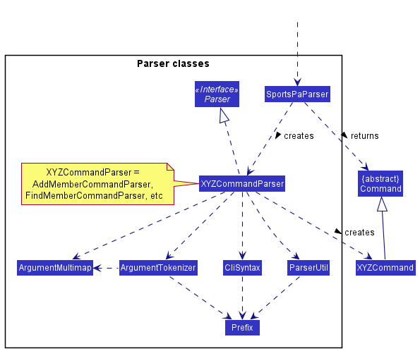

Table of Contents
- [**Acknowledgements**](#acknowledgements)
- [**Setting up, getting started**](#setting-up-getting-started)
- [**Design**](#design)
    * [Architecture](#architecture)
    * [UI component](#ui-component)
    * [Logic component](#logic-component)
    * [Model component](#model-component)
    * [Storage component](#storage-component)
    * [Common classes](#common-classes)
- [**Implementation**](#implementation)
- [**Documentation, logging, testing, configuration, dev-ops**](#documentation-logging-testing-configuration-dev-ops)
- [**Appendix: Requirements**](#appendix-requirements)
    * [Product scope](#product-scope)
    * [User stories](#user-stories)
    * [Use cases](#use-cases)
    * [Non-Functional Requirements](#non-functional-requirements)
    * [Glossary](#glossary)
- [**Appendix: Instructions for manual testing**](#appendix-instructions-for-manual-testing)
    * [Launch and shutdown](#launch-and-shutdown)
    * [Deleting a person](#deleting-a-person)
    * [Saving data](#saving-data)

--------------------------------------------------------------------------------------------------------------------

## **Acknowledgements**

* {list here sources of all reused/adapted ideas, code, documentation, and third-party libraries -- include links to the original source as well}

--------------------------------------------------------------------------------------------------------------------

## **Setting up, getting started**

Refer to the guide [_Setting up and getting started_](SettingUp.md).

--------------------------------------------------------------------------------------------------------------------

## **Design**

:bulb: **Tip:** The `.puml` files used to create diagrams in this document can be found in the [diagrams](https://github.com/se-edu/addressbook-level3/tree/master/docs/diagrams/) folder. Refer to the [_PlantUML Tutorial_ at se-edu/guides](https://se-education.org/guides/tutorials/plantUml.html) to learn how to create and edit diagrams.

### Architecture

The ***Architecture Diagram*** given above explains the high-level design of the App.

Given below is a quick overview of main components and how they interact with each other.

**Main components of the architecture**

**`Main`** has two classes called [`Main`](https://github.com/se-edu/addressbook-level3/tree/master/src/main/java/seedu/address/Main.java) and [`MainApp`](https://github.com/se-edu/addressbook-level3/tree/master/src/main/java/seedu/address/MainApp.java). It is responsible for,
* At app launch: Initializes the components in the correct sequence, and connects them up with each other.
* At shut down: Shuts down the components and invokes cleanup methods where necessary.

[**`Commons`**](#common-classes) represents a collection of classes used by multiple other components.

The rest of the App consists of four components.

* [**`UI`**](#ui-component): The UI of the App.
* [**`Logic`**](#logic-component): The command executor.
* [**`Model`**](#model-component): Holds the data of the App in memory.
* [**`Storage`**](#storage-component): Reads data from, and writes data to, the hard disk.

**How the architecture components interact with each other**

The *Sequence Diagram* below shows how the components interact with each other for the scenario where the user issues the command `delete 1`.

Each of the four main components (also shown in the diagram above),

* defines its *API* in an `interface` with the same name as the Component.
* implements its functionality using a concrete `{Component Name}Manager` class (which follows the corresponding API `interface` mentioned in the previous point.

For example, the `Logic` component defines its API in the `Logic.java` interface and implements its functionality using the `LogicManager.java` class which follows the `Logic` interface. Other components interact with a given component through its interface rather than the concrete class (reason: to prevent outside component's being coupled to the implementation of a component), as illustrated in the (partial) class diagram below.

The sections below give more details of each component.

### UI component

The **API** of this component is specified in [`Ui.java`](https://github.com/se-edu/addressbook-level3/tree/master/src/main/java/seedu/address/ui/Ui.java)

The UI consists of a `MainWindow` that is made up of parts e.g.`CommandBox`, `ResultDisplay`, `PersonListPanel`, `StatusBarFooter` etc. All these, including the `MainWindow`, inherit from the abstract `UiPart` class which captures the commonalities between classes that represent parts of the visible GUI.

The `UI` component uses the JavaFx UI framework. The layout of these UI parts are defined in matching `.fxml` files that are in the `src/main/resources/view` folder. For example, the layout of the [`MainWindow`](https://github.com/se-edu/addressbook-level3/tree/master/src/main/java/seedu/address/ui/MainWindow.java) is specified in [`MainWindow.fxml`](https://github.com/se-edu/addressbook-level3/tree/master/src/main/resources/view/MainWindow.fxml)

The `UI` component,

* executes user commands using the `Logic` component.
* listens for changes to `Model` data so that the UI can be updated with the modified data.
* keeps a reference to the `Logic` component, because the `UI` relies on the `Logic` to execute commands.
* depends on some classes in the `Model` component, as it displays `Person` object residing in the `Model`.

### Logic component

**API** : [`Logic.java`](https://github.com/se-edu/addressbook-level3/tree/master/src/main/java/seedu/address/logic/Logic.java)

Here's a (partial) class diagram of the `Logic` component:

How the `Logic` component works:
1. When `Logic` is called upon to execute a command, it uses the `AddressBookParser` class to parse the user command.
1. This results in a `Command` object (more precisely, an object of one of its subclasses e.g., `AddCommand`) which is executed by the `LogicManager`.
1. The command can communicate with the `Model` when it is executed (e.g. to add a person).
1. The result of the command execution is encapsulated as a `CommandResult` object which is returned back from `Logic`.

The Sequence Diagram below illustrates the interactions within the `Logic` component for the `execute("delete 1")` API call.

:information_source: **Note:** The lifeline for `DeleteCommandParser` should end at the destroy marker (X) but due to a limitation of PlantUML, the lifeline reaches the end of diagram.

Here are the other classes in `Logic` (omitted from the class diagram above) that are used for parsing a user command:

How the parsing works:
* When called upon to parse a user command, the `AddressBookParser` class creates an `XYZCommandParser` (`XYZ` is a placeholder for the specific command name e.g., `AddCommandParser`) which uses the other classes shown above to parse the user command and create a `XYZCommand` object (e.g., `AddCommand`) which the `AddressBookParser` returns back as a `Command` object.
* All `XYZCommandParser` classes (e.g., `AddCommandParser`, `DeleteCommandParser`, ...) inherit from the `Parser` interface so that they can be treated similarly where possible e.g, during testing.

### Model component
**API** : [`Model.java`](https://github.com/se-edu/addressbook-level3/tree/master/src/main/java/seedu/address/model/Model.java)

The `Model` component,

* stores the address book data i.e., all `Person` objects (which are contained in a `UniquePersonList` object).
* stores the currently 'selected' `Person` objects (e.g., results of a search query) as a separate _filtered_ list which is exposed to outsiders as an unmodifiable `ObservableList<Person>` that can be 'observed' e.g. the UI can be bound to this list so that the UI automatically updates when the data in the list change.
* stores a `UserPref` object that represents the user’s preferences. This is exposed to the outside as a `ReadOnlyUserPref` objects.
* does not depend on any of the other three components (as the `Model` represents data entities of the domain, they should make sense on their own without depending on other components)

:information_source: **Note:** An alternative (arguably, a more OOP) model is given below. It has a `Tag` list in the `AddressBook`, which `Person` references. This allows `AddressBook` to only require one `Tag` object per unique tag, instead of each `Person` needing their own `Tag` objects. 

### Storage component

**API** : [`Storage.java`](https://github.com/se-edu/addressbook-level3/tree/master/src/main/java/seedu/address/storage/Storage.java)

The `Storage` component,
* can save both address book data and user preference data in json format, and read them back into corresponding objects.
* inherits from both `AddressBookStorage` and `UserPrefStorage`, which means it can be treated as either one (if only the functionality of only one is needed).
* depends on some classes in the `Model` component (because the `Storage` component's job is to save/retrieve objects that belong to the `Model`)

### Common classes

Classes used by multiple components are in the `seedu.addressbook.commons` package.

--------------------------------------------------------------------------------------------------------------------

## **Implementation**

This section describes some noteworthy details on how certain features are implemented.

### Sort feature

#### Current Implementation

The sort mechanism is facilitated by the inbuilt Collections::sort method.
This is done by passing a custom comparator that implements the Comparator interface to the sort method.
There are currently three custom comparators implemented in FAST:
- `SortByName` -- Sorts the contacts alphabetically by name.
- `SortByAppointment` -- Sorts the contacts chronologically by date.
- `SortByPriority` -- Sorts the contacts by priority tags.

`SortByName`: Implemented by using the inbuilt `String::compareTo`.   
`SortByAppointment`: Implemented by first converting the appointment date from `String` to a `Date` object before using
the inbuilt `Date::compareTo` method.   
`SortByPriority`: Implemented by first assigning int values to tags, tags with highest priority will have the smallest int value.
Using those priority values, the inbuilt `Integer::compareTo` is used.  

Given below is an example usage scenario and how the sort mechanism behaves at each step.

Step 1. The user launches the application for the first time.  
Step 2. The user inputs `sort name` in the CLI to sort all contacts by name. This calls `LogicManager::execute` which in turn
calls `FastParser::parseCommand` to parse the given input.  
Step 3. `FastParser` will determine that it is a sort command and will call `SortCommandParser::parse`. From the given input,
`SortCommandParser` will create the corresponding `SortByName` Comparator and return a `SortCommand` with that comparator.  
Step 4. After execution of the user input, `LogicManager` calls `SortCommand::execute(model)` where model contains methods that mutate 
the state of our contacts.  
Step 5. Through a series of method chains, it calls `UniquePersonList::sortPersons(SortByName)`, which executes the sort method
to sort the list of persons by their name. 

#### Design Considerations

**Aspect: How sort executes:**

* **Alternative 1 (current choice):** Use the inbuilt `Collections::sort`.
  * Pros: Easy to implement.
  * Cons: May need additional attributes to compare.

* **Alternative 2:** Implement a custom Sort method.
  * Pros: May not need additional attributes
  * Cons: Very complicated, may have performance issues if the sort is not efficient.

**Aspect: How SortByDate is implemented:**

* **Alternative 1 (current choice):** Convert the String value to Date object before using inbuilt `compareTo`.
    * Pros: Easy to implement.
    * Cons: Need to account for empty appointment dates.

* **Alternative 2:** Compare dates in String.
    * Pros: No need to convert the values to another type.
    * Cons: Complicated since there is a need for 3 different comparisons namely, year, month, date.
    
_{more aspects and alternatives to be added}_

### Find feature

#### Current implementation

The find mechanism uses a few implementations of Predicate<Person> using the inbuilt `Predicate` class.
It uses these predicates to determine which persons to display in the search results.
There are currently 4 custom predicates implemented in FAST:
- `NameContainsQueriesPredicate` -- checks if the person's name contains the query.
- `PriorityPredicate` -- checks if the person has the given priority tag.
- `TagMatchesKeywordPredicate` -- checks if any of the person's tags match the keyword.
- `RemarkContainsKeywordPredicate` -- checks if the person's remark contains the keyword.

`NameContainsQueriesPredicate` implemented by running the name through a for-loop to see if any word starts with the query.
`PriorityPredicate` implemented by running the tags through a for-loop and checking if any of them match the given priority.
`TagMatchesKeywordPredicate` implemented by running the tags through a for-loop and checking if any of them match the given keyword.
`RemarkContainsKeywordPredicate` implemented by using the inbuilt `String::contains`.

Given below is an example usage scenario and how the find mechanism behaves at each step.

Step 1. The user launches the application for the first time.  
Step 2. The user inputs `find john` in the CLI to find all contacts whose names contain `john`. This calls `LogicManager::execute` which in turn
calls `FastParser::parseCommand` to parse the given input.  
Step 3. `FastParser` will determine that it is a find command and will call `FindCommandParser::parse`. From the given input,
`FindCommandParser` will determine that the user is searching for a name and return a `FindCommand` with a `NameContainsQueriesPredicate`.  
Step 4. After execution of the user input, `LogicManager` calls `FindCommand::execute(model)` where model contains methods that mutate 
the state of our contacts.  
Step 5. Through a series of method chains, it calls `ModelManager::getFilteredPersonList()`, which will display the results
of the search. 

#### Design Considerations

**Aspect: How find executes:**

* **Alternative 1 (current choice):** Use many `Predicate<Person` implementations.
  * Pros: Easy to implement.
  * Cons: For every type of find added, a new class must be made.

* **Alternative 2:** Implement a custom Find method.
  * Pros: May be able to condense into 1 class
  * Cons: Very complicated and difficult to implement.

### \[Proposed\] Data archiving

_{Explain here how the data archiving feature will be implemented}_

--------------------------------------------------------------------------------------------------------------------

## **Documentation, logging, testing, configuration, dev-ops**

* [Documentation guide](Documentation.md)
* [Testing guide](Testing.md)
* [Logging guide](Logging.md)
* [Configuration guide](Configuration.md)
* [DevOps guide](DevOps.md)

--------------------------------------------------------------------------------------------------------------------

## **Appendix: Requirements**

### Product scope

**Target user profile**:

* No time/busy
* Might not be tech-savvy
* Many contacts to manage
* Has a need to manage a significant number of contacts
* Can type fast
* Prefers typing to mouse interactions
* Is reasonably comfortable using CLI apps
* Needs to profile clients

**Value proposition**: Financial Advisors are busy. We will help them save time by optimising our system for them. FAST keeps track of client details and information for them.

### User stories

Priorities: High (must have) - `* * *`, Medium (nice to have) - `* *`, Low (unlikely to have) - `*`

| Priority | As a …​                                 | I want to …​                                              | So that I …​                                                                |
| -------- | ------------------------------------------ | ------------------------------------------------------------ | ------------------------------------------------------------------------------ |
| `* * *`  | user                                       | use the application offline                                  | can view my contacts without an internet connection                            |
| `* * *`  | FA                                         | delete contact info                                          | will not have useless data in my app                                           |
| `* * *`  | FA                                         | store my clients contact info                                | can contact them in the future more easily                                     |
| `* * *`  | user                                       | see all of my contacts                                       | know who is in my contacts                                                     |
| `* * *`  | new user                                   | learn how to use the app                                     | can effectively use the app                                                    |
| `* * *`  | busy person                                | use the app with friendlier syntax that's easier to type     | can add contacts with less trouble                                             |
| `* * *`  | busy person                                | see all the available commands at a glance                   | can focus on managing my client base rather than dealing with the syntax       |
| `* * *`  | FA                                         | update my clients contact info                               | have up to date information                                                    |
| `* * *`  | forgetful person                           | quickly check for the highest priority client                | can move on to the next client quickly without delay                           |
| `* * *`  | FA with many clients                       | tag my clients' info                                         | can see different groups of clients according to the tags                      |
| `* *`    | FA                                         | store my clients contact information                         | do not need to store them on my phone                                          |
| `* *`    | numbers person                             | delete multiple contacts in one go                           | do not have to delete contacts individually                                    |
| `* *`    | FA with many clients                       | search through my clients                                    | can easily find a specific client                                              |
| `* *`    | FA                                         | have fast access to important numbers (e.g. office, partners | can quickly contact my partners should something arise                         |
| `* *`    | potential user                             | see how the app works with sample data                       | can understand what the app will look like with real data                      |
| `* *`    | FA                                         | group my clients according to their investment strategies    | can easily manage each group                                                   |
| `* *`    | FA                                         | archive data that might be obsolete at the moment            | do not flood my app with obsolete data and can still access them in the future |
| `*`      | FA                                         | store appointments info of my clients                        | will not forget about important meetings                                       |
| `*`      | person with many devices                   | import and export the client info                            | can switch between devices quickly                                             |
| `*`      | FA with many clients                       | view stats of my client base                                 | can know how much income I am making                                           |
| `*`      | FA                                         | reminded to contact potential clients                        | can disturb potential clients into signing on                                  |
| `*`      | FA                                         | check the number of clients and deals currently              | can check if i have fulfilled my monthly quota                                 |
| `*`      | FA                                         | store extra info that could be useful                        | can remember extra details that could be useful in clinching a deal            |
| `*`      | FA                                         | see frequently contacted clients                             | don't have to keep searching for the same person over and over again           |
| `*`      | FA                                         | list out all my investment plans                             | know what investment plans I am selling                                        |
| `*`      | user                                       | color-code my contacts                                       | can differentiate between the tags, and it looks nicer                         |
| `*`      | Responsible FA                             | be reminded of clashes in my appointments                    | will not lose any potential clients                                            |

*{More to be added}*

### Use cases

(For all use cases below, the **System** is the `Financial Advisor Smart Tracker (FAST)` and the **Actor** is the `user`, unless specified otherwise)

**Use case: UC01 - Add Contact**

**MSS**

1. User requests to add a new contact.
2. FAST displays a message indicating success.
3. FAST displays the new contact below.

   Use case ends.

**Extensions**

* 1a. The given command syntax is invalid.
    * 1a1. FAST shows an error message.
    * 1a2. FAST shows an example of add contact command to user.

      Use case ends.

**Use case: UC02 - Delete Contact**

**MSS**

1. User requests to list persons (UC06).
2. User requests to delete a specific person in the list.
3. FAST deletes the person.

   Use case ends

**Extensions**

* 2a. The given index is invalid.
    * 2a1. FAST shows an error message.
    * 2a2. FAST shows an example of delete contact command to user.

      Use case ends.

**Use case: UC03 - Edit Contact**

**MSS**

1. User requests to list contacts (UC06).
2. User requests to edit a contact.
3. FAST displays the updated contact.

   Use case ends.

**Extensions**

* 2a. The given index is invalid.
    * 2a1. FAST shows an error message.
    * 2a2. FAST shows an example of edit contact command to user.

      Use case ends.

* 2b. The given command syntax is invalid.
    * 2b1. FAST displays an error message.
    * 2b2. FAST displays an example of the edit contact command to the user.

      Use case ends.

**Use case: UC04 - Add a remark**

**MSS**

1. User requests to list persons (UC06).
2. User requests to add a remark to a specific person in the list.
3. FAST displays the new remark in the contact.

   Use case ends

**Extensions**

* 2a. The given index is invalid.
    * 2a1. FAST shows an error message.
    * 2a2. FAST shows an example of remark command to user.

      Use case ends

* 2b. The given command syntax is invalid
    * 2b1. FAST displays an error message.
    * 2b2. FAST displays an example of the remark command to the user.

      Use case ends

* 2c. User removes an existing remark
    * 2c1. FAST displays a message that the remark has been removed.

      Use case ends.

**Use case: UC05 - Find Contact by name**

**MSS**

1. User searches for a name.
2. FAST shows a list of persons with the specified name or people whose name starts with the search query.

   Use case ends.

**Extensions**

* 1a. The given search query is invalid.
    * 1a1. FAST shows an error message.
    * 1a2. FAST shows an example of find command to user.

      Use case ends.

* 1b FAST cannot find any contacts with the given search query.
    * 1b1. FAST displays a message to inform user no contacts that matches the query was found.

      Use case ends.

**Use case: UC06 - List Contacts**

**MSS**

1. User requests to list contacts.
2. FAST displays a list of contacts.

   Use case ends.

**Extensions**

* 2a. The list is empty.

  Use case ends.

**Use case: UC07 - Add Appointment**

**MSS**

1. User requests to list persons (UC06)
2. User requests to add a new appointment.
3. FAST displays a message indicating success.
4. FAST displays the new contact below.

   Use case ends.

**Extensions**

* 2a. The given index is invalid.
    * 2a1. FAST shows an error message.
    * 2a2. FAST shows an example of add appointment command to user. 

* 2b. The given command syntax is invalid.
    * 2b1. FAST shows an error message.
    * 2b2. FAST shows an example of add appointment command to user.

      Use case ends.

* 2c. An appointment has already been scheduled.
    * 2c1. FAST shows an error message.

      Use case ends.

**Use case: UC08 - Delete Appointment**

**MSS**

1. User requests to list persons (UC06)
2. User requests to delete an appointment.
3. FAST displays a message indicating success.
4. FAST displays the new contact below.

   Use case ends.

**Extensions**

* 2a. The given index is invalid.
    * 2a1. FAST shows an error message.
    * 2a2. FAST shows an example of delete appointment command to user.

* 2b. No appointment scheduled yet.
    * 2b1. FAST shows an error message.

      Use case ends.

**Use case: UC09 - Edit Appointment**

**MSS**

1. User requests to list persons (UC06)
2. User requests to edit an appointment.
3. FAST displays a message indicating success.
4. FAST displays the new contact below.

   Use case ends.

**Extensions**

* 2a. The given index is invalid.
    * 2a1. FAST shows an error message.
    * 2a2. FAST shows an example of edit appointment command to user.

* 2b. The given command syntax is invalid.
    * 2b1. FAST shows an error message.
    * 2b2. FAST shows an example of edit appointment command to user.

      Use case ends.

* 2c. No appointment scheduled yet.
    * 2c1.FAST shows an error message.

      Use case ends.

**Use case: UC10 - Update Completed Appointment**

**MSS**

1. User requests to list persons (UC06)
2. User requests to update a completed appointment.
3. FAST displays a message indicating success.
4. FAST displays the new contact below.

   Use case ends.

**Extensions**

* 2a. The given index is invalid.
    * 2a1. FAST shows an error message.
    * 2a2. FAST shows an example of delete appointment command to user.

* 2b. No appointment scheduled yet.
    * 2b1. FAST shows an error message.

      Use case ends.
      

**Use case: UC11 - Sort contacts**

**MSS**

1. User requests to sort persons
2. FAST displays a list of contacts sorted by the given keyword.
   Use case ends.

**Extensions**

* 2a. The given command syntax is invalid.
    * 2a1. FAST shows an error message.
    * 2a2. FAST shows an example of sort command to user.

* 2b. The list is empty.
      Use case ends.
      
**Use case: UC12 - Find Contact by priority**

**MSS**

1. User searches for a priority.
2. FAST shows a list of persons with the specified priority.

   Use case ends.

**Extensions**

* 1a. The given priority is invalid and does not follow the format of a priority tag.
    * 1a1. FAST shows an error message.
    * 1a2. FAST shows an example of find command and correct format for priority to user.

      Use case ends.

* 1b FAST cannot find any contacts with the given priority.
    * 1b1. FAST displays a message to inform user no contacts with the given priority were found.

      Use case ends.
      
**Use case: UC13 - Find Contact by tag**

**MSS**

1. User searches for some tags.
2. FAST shows a list of persons with the specified tags.

   Use case ends.

**Extensions**

* 1a. The given tags are invalid.
    * 1a1. FAST shows an error message.
    * 1a2. FAST shows an example of find command.

      Use case ends.
      
**Use case: UC14 - Find Contact by remark**

**MSS**

1. User searches for a remark.
2. FAST shows a list of persons whose remarks contain the searched remark.

   Use case ends.

**Extensions**

* 1a. The given remark is invalid.
    * 1a1. FAST shows an error message.
    * 1a2. FAST shows an example of find command.

      Use case ends.

* 1b FAST cannot find any contacts with the given remark.
    * 1b1. FAST displays a message to inform user no contacts with the given remark were found.

      Use case ends.

*{More to be added}*

### Non-Functional Requirements

1.  Should work on any _mainstream OS_ as long as it has Java `11` or above installed.
2.  Should be able to hold up to 1000 persons without a noticeable sluggishness in performance for typical usage.
3.  A user with above average typing speed for regular English text (i.e. not code, not system admin commands) should be able to accomplish most of the tasks faster using commands than using the mouse.
4.  Should work fully offline, and not rely on external URLs for important guides and documentation
5.  Application should be usable by a single user

### Glossary

* **Contact**: A client to be stored in FAST, includes information on the client
* **CLI**: Command Line Interface
* **FAST**: Financial Advisor Smart Tracker, the name of this software
* **FXML**: FX Markup Language, the format in which the GUI layout is stored in
* **Java 11**: Version of the programming language, used in the coding of this software
* **Mainstream OS**: Windows, Linux, Unix, OS-X
* **Private contact detail**: A contact detail that is not meant to be shared with others
* **Remark**: A comment/note about a specific contact
* **URL**: Uniform Resource Locator, known more commonly as a link to a website.
* **XML**: Extensible MarkUp Language, used to format the layout of this software

--------------------------------------------------------------------------------------------------------------------

## **Appendix: Instructions for manual testing**

Given below are instructions to test the app manually.

:information_source: **Note:** These instructions only provide a starting point for testers to work on;
testers are expected to do more *exploratory* testing.

### Launch and shutdown

1. Initial launch

   1. Download the jar file and copy into an empty folder

   1. Double-click the jar file Expected: Shows the GUI with a set of sample contacts. The window size may not be optimum.

1. Saving window preferences

   1. Resize the window to an optimum size. Move the window to a different location. Close the window.

   1. Re-launch the app by double-clicking the jar file. 
       Expected: The most recent window size and location is retained.

1. _{ more test cases …​ }_

### Deleting a person

1. Deleting a person while all persons are being shown

   1. Prerequisites: List all persons using the `list` command. Multiple persons in the list.

   1. Test case: `delete 1` 
      Expected: First contact is deleted from the list. Details of the deleted contact shown in the status message. Timestamp in the status bar is updated.

   1. Test case: `delete 0` 
      Expected: No person is deleted. Error details shown in the status message. Status bar remains the same.

   1. Other incorrect delete commands to try: `delete`, `delete x`, `...` (where x is larger than the list size) 
      Expected: Similar to previous.

1. _{ more test cases …​ }_

### Saving data

1. Dealing with missing/corrupted data files

   1. _{explain how to simulate a missing/corrupted file, and the expected behavior}_

1. _{ more test cases …​ }_
