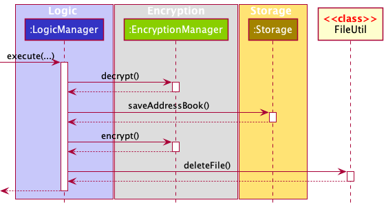

- Table of Contents
{:toc}

---

## **Acknowledgements**

- [Encrypting and Decrypting Files in Java](https://www.baeldung.com/java-cipher-input-output-stream) from Baeldung
  - Adapted and modified. See section on _[Encryption](#encryption)_.

---

## **Setting up, getting started**

Refer to the guide [_Setting up and getting started_](SettingUp.md).

---

## **Design**

<div markdown="span" class="alert alert-primary">

:bulb: **Tip:** The `.puml` files used to create diagrams in this document can be found in the [diagrams](https://github.com/AY2122S1-CS2103T-W13-2/tp/tree/master/docs/diagrams/) folder. Refer to the [_PlantUML Tutorial_ at se-edu/guides](https://se-education.org/guides/tutorials/plantUml.html) to learn how to create and edit diagrams.

</div>

### Architecture


The **_Architecture Diagram_** given above explains the high-level design of the App.

Given below is a quick overview of main components and how they interact with each other.

**Main components of the architecture**

**`Main`** has two classes called [`Main`](https://github.com/AY2122S1-CS2103T-W13-2/tp/blob/master/src/main/java/seedu/address/Main.java) and [`MainApp`](https://github.com/AY2122S1-CS2103T-W13-2/tp/blob/master/src/main/java/seedu/address/MainApp.java). It is responsible for,

- At app launch: Initializes the components in the correct sequence, and connects them up with each other.
- At shut down: Shuts down the components and invokes cleanup methods where necessary.

[**`Commons`**](#common-classes) represents a collection of classes used by multiple other components.

The rest of the App consists of five components.

- [**`UI`**](#ui-component): The UI of the App.
- [**`Logic`**](#logic-component): The command executor.
- [**`Model`**](#model-component): Holds the data of the App in memory.
- [**`Storage`**](#storage-component): Reads data from, and writes data to, the hard disk.
- [**`Encryption`**](#encryption-component): Encrypts and decrypts data

**How the architecture components interact with each other**

The _Sequence Diagram_ below shows how the components interact with each other for the scenario where the user issues the command `delete 1`.


Each of the main components (also shown in the diagram above),

- defines its _API_ in an `interface` with the same name as the Component.
- implements its functionality using a concrete `{Component Name}Manager` class (which follows the corresponding API `interface` mentioned in the previous point).

For example, the `Logic` component defines its API in the `Logic.java` interface and implements its functionality using the `LogicManager.java` class which follows the `Logic` interface. Other components interact with a given component through its interface rather than the concrete class (reason: to prevent outside component's being coupled to the implementation of a component), as illustrated in the (partial) class diagram below.


The sections below give more details of each component.

### UI component

The **API** of this component is specified in [`Ui.java`](https://github.com/AY2122S1-CS2103T-W13-2/tp/blob/master/src/main/java/seedu/address/ui/Ui.java)


The UI consists of a `MainWindow` that is made up of parts e.g.`CommandBox`, `ResultDisplay`, `PersonListPanel`, `StatusBarFooter` etc. All these, including the `MainWindow`, inherit from the abstract `UiPart` class which captures the commonalities between classes that represent parts of the visible GUI.

The `UI` component uses the JavaFx UI framework. The layout of these UI parts are defined in matching `.fxml` files that are in the `src/main/resources/view` folder. For example, the layout of the [`MainWindow`](https://github.com/AY2122S1-CS2103T-W13-2/tp/blob/master/src/main/java/seedu/address/ui/MainWindow.java) is specified in [`MainWindow.fxml`](https://github.com/AY2122S1-CS2103T-W13-2/tp/blob/master/src/main/resources/view/MainWindow.fxml)

The `UI` component,

- executes user commands using the `Logic` component.
- listens for changes to `Model` data so that the UI can be updated with the modified data.
- keeps a reference to the `Logic` component, because the `UI` relies on the `Logic` to execute commands.
- depends on some classes in the `Model` component, as it displays `Person` object residing in the `Model`.

### Logic component

**API** : [`Logic.java`](https://github.com/AY2122S1-CS2103T-W13-2/tp/blob/master/src/main/java/seedu/address/logic/Logic.java)

Here's a (partial) class diagram of the `Logic` component:


How the `Logic` component works:

1. When `Logic` is called upon to execute a command, it uses the `AddressBookParser` class to parse the user command.
1. This results in a `Command` object (more precisely, an object of one of its subclasses e.g., `AddCommand`) which is executed by the `LogicManager`.
1. The command can communicate with the `Model` when it is executed (e.g. to add a person).
1. The result of the command execution is encapsulated as a `CommandResult` object which is returned back from `Logic`.

The Sequence Diagram below illustrates the interactions within the `Logic` component for the `execute("delete 1")` API call.


<div markdown="span" class="alert alert-info">:information_source: **Note:** The lifeline for `DeleteCommandParser` should end at the destroy marker (X) but due to a limitation of PlantUML, the lifeline reaches the end of diagram.
</div>

Here are the other classes in `Logic` (omitted from the class diagram above) that are used for parsing a user command:


How the parsing works:

- When called upon to parse a user command, the `AddressBookParser` class creates an `XYZCommandParser` (`XYZ` is a placeholder for the specific command name e.g., `AddCommandParser`) which uses the other classes shown above to parse the user command and create a `XYZCommand` object (e.g., `AddCommand`) which the `AddressBookParser` returns back as a `Command` object.
- All `XYZCommandParser` classes (e.g., `AddCommandParser`, `DeleteCommandParser`, ...) inherit from the `Parser` interface so that they can be treated similarly where possible e.g, during testing.

### Model component

**API** : [`Model.java`](https://github.com/AY2122S1-CS2103T-W13-2/tp/blob/master/src/main/java/seedu/address/model/Model.java)


The `Model` component,

- stores the data i.e., all `Person` objects (which are contained in a `UniquePersonList` object).
- stores the currently 'selected' `Person` objects (e.g., results of a search query) as a separate _filtered_ list which is exposed to outsiders as an unmodifiable `ObservableList<Person>` that can be 'observed' e.g. the UI can be bound to this list so that the UI automatically updates when the data in the list change.
- stores a `UserPref` object that represents the user’s preferences. This is exposed to the outside as a `ReadOnlyUserPref` objects.
- does not depend on any of the other three components (as the `Model` represents data entities of the domain, they should make sense on their own without depending on other components)

<div markdown="span" class="alert alert-info">:information_source: **Note:** An alternative (arguably, a more OOP) model is given below. It has a `Tag` list in the `AddressBook`, which `Person` references. This allows `AddressBook` to only require one `Tag` object per unique tag, instead of each `Person` needing their own `Tag` objects.<br>


</div>

### Storage component

**API** : [`Storage.java`](https://github.com/AY2122S1-CS2103T-W13-2/tp/blob/master/src/main/java/seedu/address/storage/Storage.java)


The `Storage` component,

- can save both address book data and user preference data in `.json` format, and read them back into corresponding objects.
- inherits from both `AddressBookStorage` and `UserPrefStorage`, which means it can be treated as either one (if only the functionality of only one is needed).
- depends on some classes in the `Model` component (because the `Storage` component's job is to save/retrieve objects that belong to the `Model`)

### Encryption component

**API** : [`Encryption.java`](https://github.com/AY2122S1-CS2103T-W13-2/tp/blob/master/src/main/java/seedu/address/encryption/Encryption.java)


The `Encryption` component,

- encrypts data files and writes to `.enc` format.
  - accepts file in any format for encryption, per the supplied `Path`.
- decrypts data files from `.enc` format.
  - writes to file in any format after decryption, per the supplied `Path`.
- performs the encryption using a secret key supplied by the `EncryptionKeyGenerator` utility class and the cipher algorithm.

### Common classes

Classes used by multiple components are in the `seedu.addressbook.commons` package.

#### History

**API** : [`History.java`](https://github.com/AY2122S1-CS2103T-W13-2/tp/blob/master/src/main/java/seedu/address/commons/util/history/History.java)


The `History` component,
* can save immutable snapshots of object instances of any class and supports the retrieval of the saved snapshots at any
  time.
* is implemented by the following classes.
  * [`StringHistory`](https://github.com/AY2122S1-CS2103T-W13-2/tp/blob/master/src/main/java/seedu/address/commons/util/history/StringHistory.java)
    , which supports the saving of strings.
  * [`CopyableHistory`](https://github.com/AY2122S1-CS2103T-W13-2/tp/blob/master/src/main/java/seedu/address/commons/util/history/CopyableHistory.java)
    , which supports the saving of objects.

--------------------------------------------------------------------------------------------------------------------

## **Implementation**

This section describes some noteworthy details on how the following features are implemented.

* [Command Input History](#command-input-history)
* [Batch Import](#batch-import)
* [Batch Export](#batch-export)
* [Encryption](#encryption)
* [Password](#password)
* [Find Feature](#find-feature)

### Command Input History

#### Design Considerations

##### User Story

As an experienced command line user, I want to be able to press the up and down arrow keys to cycle through my past
commands.

* As an experienced command line user, I want to be able to modify a previously entered command to create a new command
without changing what is saved.

##### Use Cases

```text
System:         SPAM (Super Powerful App for Marketing)
Use case:       UC1 - Save the entered command
Actor:          User
MSS:
                1.  User enters a command.
                2.  User executes the command.
                3.  System saves the executed command.
                Use case ends.

Extensions:
                2a. System detects that the executed command is either empty string or spaces.
                    2a1.    System does not save the executed command.
                Use case ends.
```

```text
System:         SPAM (Super Powerful App for Marketing)
Use case:       UC2 - Go to previously entered command
Actor:          User
Preconditions:  User has previously saved a command
MSS:
                1.  User presses the up arrow key.
                2.  System displays the previously entered command.
                Use case ends.

Extensions:
                1a. System detects that the earliest entered command is displayed.
                    1a1.    System continues to display the earliest entered command.
                Use case ends.
```

```text
System:         SPAM (Super Powerful App for Marketing)
Use case:       UC3 - Go to next entered command
Actor:          User
Preconditions:  User has previously entered a command, System is displaying a previously entered command
MSS:
                1.  User presses the down arrow key.
                2.  System displays the next entered command.
                Use case ends.

Extensions:
                1a. System detects that the newest entered command is displayed.
                    1a1.    System continues to display the newest entered command.
                Use case ends.
```

```text
System:         SPAM (Super Powerful App for Marketing)
Use case:       UC4 - Edit a previously entered command
Actor:          User
Preconditions:  User has previously entered a command, System is displaying a previously entered command
MSS:
                1.  User presses any key to edit the previously entered command displayed.
                2.  User executes the edited command.
                3.  System resets the previously saved command.
                4.  System saves the executed command as the newly entered command.
                Use case ends.
```

##### Considerations

There are a few ways in which the history system's data structure could be implemented. Some possible options are
elaborated in detail [here](https://gist.github.com/CMCDragonkai/d266a3055735545447439f0fa662a0e1). Below are the pros
and cons of some options.

| Method  | Advantages                                                                                             | Disadvantages                                                                  |
| ------- | ------------------------------------------------------------------------------------------------------ | ------------------------------------------------------------------------------ |
| 2 Stack | Scrolling through saved snapshots in the history is fast.                                              | May cause problems during the implementation of UC4.                           |
| Array   | Scrolling through saved snapshots in the history is fast. Easier to support UC4 in the implementation. | Appending new saved snapshots to the front is very slow.                       |
| Queue   | Easier to support UC4 in the implementation. Appending snapshots to the front is very fast             | Scrolling through saved snapshots in the history is slower than above methods. |

In the end, we decided to implement the History data structure using a queue because it has the smallest disadvantage.
This is because the maximum size of the history that we anticipate will not be very large (ie. less than
200). As such, the disadvantage of computationally expensive queue retrievals will not be as significant as the
disadvantages brought about by the other two implementations.

#### Implementation

The implementation of the command input history feature can be split into two parts. The implementation of the history
API and how it is used in the feature.

##### History API

The specifications of the history API can be found in the
[`History`](https://github.com/AY2122S1-CS2103T-W13-2/tp/blob/master/src/main/java/seedu/address/commons/util/history/History.java)
interface located in the [`commons.util.history`](https://github.com/AY2122S1-CS2103T-W13-2/tp/tree/master/src/main/java/seedu/address/commons/util/history)
package. This interface mandates that all implementations of `History` should implement the following methods:

* `#add(object)` - Add a snapshot of the object into the history.
* `#get(index)` - Get the snapshot of the object stored at the index in the history.
* `#size()` - Get the number of snapshots currently stored in the history.

The history API is implemented by abstract class [`BaseHistory`](https://github.com/AY2122S1-CS2103T-W13-2/tp/blob/master/src/main/java/seedu/address/commons/util/history/BaseHistory.java)
which provides the storage mechanism and options for the
saved snapshots. The [`StringHistory`](https://github.com/AY2122S1-CS2103T-W13-2/tp/blob/master/src/main/java/seedu/address/commons/util/history/StringHistory.java)
and [`CopyableHistory`](https://github.com/AY2122S1-CS2103T-W13-2/tp/blob/master/src/main/java/seedu/address/commons/util/history/CopyableHistory.java)
classes then perform the defensive copying of provided objects in addition to making use of `BaseHistory` for the
storage mechanism. The defensive copying mechanism of `#add(object)` in `CopyableHistory` can be illustrated with a
sequence diagram as shown below.


#### Usage

The command input history feature is implemented by the
[`CommandInput`](https://github.com/AY2122S1-CS2103T-W13-2/tp/blob/master/src/main/java/seedu/address/ui/CommandInput.java)
class in the [`ui`](https://github.com/AY2122S1-CS2103T-W13-2/tp/tree/master/src/main/java/seedu/address/ui) package.
The class diagram below shows the structure of the implementation.


`CommandInput` exposes the following methods for `CommandBox` to control its state.

* `#value()` - Gets the current value in the `CommandInput`
* `#set(string)` - Sets the current value in the `CommandInput` to the string.
* `#next()` - Retrieves the next previously entered command.
* `#previous()` - Retrieve the next recently entered command.
* `#save()` - Saves the current string in the `CommandInput` to the history.

The following sequence diagrams show what happens when the user enters the command, executes the command and presses the
up arrow key to go to a previously entered command.


### Batch Import

#### Implementation

The chosen implementation of the `ImportCommand` pulls up a `CsvFileSelector` window that only allows _csv_ files to be selected.

Once a file is selected, the command is supported by two parsers.

- `CsvParser` — Deals with parsing a _csv_ file and assigning its body to its headers via key-value pairs.

- `ImportCommandParser` — Retrieves the relevant entries from `CsvParser` then checks if the necessary fields are present and correctly formatted before creating the `Person` objects that will be added to the `Model` in `ImportCommand`.

The Sequence Diagram below illustrates the interactions within the `Logic` component for the `execute("import")` API call.


<div markdown="span" class="alert alert-info">:information_source: **Note:** If the `ImportCommandParser` finds any wrongly formatted fields in any of the entries, the `ImportCommand` is not created and executed. Instead a CommandException is thrown describing the entries that are wrongly formatted and the field in the entry that is responsible for it.

</div>

#### Design considerations:

**Aspect: How _csv_ file is chosen:**

- **Alternative 1 (current choice):** `FileSelector` window.
  - Pros:
  	- Ensures users select files that exist and are in the _csv_ format.
  	- Allows for easy navigability between directories for quick retrieval of the wanted file.
  - Cons:
  	- Diverts from target user profile by utilising GUI for commands.

- **Alternative 2:** _Csv_ file path to be inputted after `import` in command call.
  - Pros:
  	- Meets target user profile by utilising CLI rather than GUI.
  - Cons:
  	- More troublesome for the user as user has to search for the _csv_ file's absolute path.
  	- File could also not exist or be in the wrong format. Would require additional exception handling.

### Batch Export

#### Implementation

The export feature is implemented with the following classes:

- `ExportCommandParser` — Ensures argument provided for the export command is a valid filename.
- `ExportCommand` — Handles communication with `Model` to extract the `selectedPersonList` and converts each field of `Person` into its String representation before handing the data to the `CsvWriter`.
- `CsvWriter` — A utility class that handles the task of writing to _csv_ files. `CsvWriter#write()` takes in a filepath, an array of headers and the data mapped to aforementioned headers via a `java.util.HashMap`. The data is then written to a _csv_ file located at the provided filepath.

The Sequence Diagram below illustrates the interactions within the `Logic` component for the `execute("export filepath")` API call.


### Encryption

**Specifications:**

- Encryption standard: [AES](https://searchsecurity.techtarget.com/definition/Advanced-Encryption-Standard)
- Block cipher: AES-256
- Key generation method: user-supplied password (up to 32 characters long)
- File extension: [`.enc`](https://fileinfo.com/extension/enc)

#### Implementation

The encryption feature is implemented with the following classes:

- `EncryptionManager` — Handles the encryption and decryption of data files.
  - Needs a `SecretKey`, which is provided by `EncryptionKeyGenerator` utility class.
  - Needs a cipher transformation algorithm (AES/CBC/PKCS5Padding); this has been handled by the `javax.crypto.Cipher` API.
- `EncryptionKeyGenerator` — A utility class that provides the method to generate AES-256 compliant keys.
  - `EncryptionKeyGenerator#generateKey()` — Generates a key with the supplied password. It can also be seen as a very complex hash function.
- `MainApp` — `EncryptionManager` is initiated here and passed as parameter to the constructor of `LogicManager`.
  - There should be one and only one `EncryptionManager` instance at any time.
  - This acts as a single source of truth, which avoids clashing keys.
- `LogicManager` — The `execute()` method uses `EncryptionManager` to decrypt the program data before consuming the data.
  - The entirety of the [**data file lifecycle**](#data-file-lifecycle) happens within the `execute()` method.

An encrypted file can only be decrypted with the same AES key that was used to encrypt it. In this case, the AES keys are generated solely using a password string supplied by the user. Multiple instances of AES keys are said to be the same if the password string used to generate these keys are the same. This definition of equality ensures the validity of the generated key across sessions.

As a result of this implementation, the same encrypted file can be shared across devices as long as the supplied password is the same.

The supplied password string must be 32 characters long (32 characters = 256 bits needed to generate the AES key). Passwords shorter than 32 characters will be padded with `"/"` to extend the number of bits. _Passwords longer than 32 characters are **not** supported._ As a consequence, the length and randomness of the supplied password make up the strength of the encryption. Shorter and less random passwords are most vulnerable to brute force attacks.

#### Data file lifecycle

The program's data undergoes a lifecycle per operation:

1. The contents of the encrypted data file is decrypted, and is written to a temporary `.json` file.
2. Other components of the program consumes the `.json` file and modifies its contents.
3. The modified `.json` file is encrypted and overwrites the contents of the encrypted data file.
4. The temporary `.json` file is deleted.

The lifecycle ensures the program's data stays encrypted at any point in time. In the event of a program crash, the decrypted file will be impossible to recover, but the encrypted file will stay intact. There is no performance delay in operating data up to 1,200 contacts.

The lifecycle can be described by the following sequence diagram:



In the case when there is no data on startup, the following actions will take place:

1. The sample data is written to a temporary `.json` file.
2. The `.json` file is encrypted.
3. The temporary `.json` file is deleted.

The data then proceed with the normal lifecycle per operation as described above.

### Password
#### Implementation

The password is used to generate the `Encryption` in the `LogicManager`. As mentioned in the [`Encryption`](#Encryption) section, it will be used to encrypt and decrypt the data file. 

The password feature applies to the following situations. Note that parts of the situation may be omitted for simplicity.

#### First time set up

The user will be asked to set up a new password if no data file has been detected. The diagram below summarises the workflow.


The system first checks if the two password match. Then, the validity of the password is checked and valid password will be used to generate the `Encryption` in `LogicManager`.

#### Subsequent logins

The user will be asked to enter the password of the encrypted data file. The diagram below summarises the workflow.


The system first checks if the password is valid. This is due to the fact that the `AES` encryption pads the password with `/` if the password is less than 32 characters. Therefore, it is necessary to check for the validity for proceeding with the decryption of the data file. Then, the password is used to generate a new `Encryption` and it is used to decrypt the data file. If the password is wrong, an exception will be thrown during the decryption and the user will be notified. Otherwise, the user will be able to log in and proceed with using the application.

#### Changing password

The user can change the password if they wish. The diagram below summarises the workflow.


The `PasswordCommandParser` checks the format and the validity of the new password. Then, the `LogicManager` will check if the old password supplied is correct. If the old password is correct, the `Encryption` in `LogicManager` will be updated and the data file will be encrypted with the new `Encryption`. This enables the changing of password.

The Sequence Diagram below illustrates the interactions within the Logic component for changing a password. Note that some parts are omitted for simplicity.


The PasswordCommand is executed by a special `executePasswordCommand` method. Two `EncryptionManager` are created, each corresponds to one password. The one for the old password will be used to decrypt the data file. The one for the new password will be used to encrypt the decrypted data file. The decrypted data file is then removed. This completes the process of changing password.

### Find feature

#### Implementation

The find feature leverages on the `Model#updateFilteredPersonList(Predicate<Person>)` method. It is known that `FindCommand` instances each kept a reference to a `NameContainsKeywordsPredicate` instance for updating the model's filtered list, but since _v1.2_ it has been changed to take in a more general `Predicate<Person>`. This allows us to freely manipulate `FindCommandParser` to generate varieties of find conditions.

In order to systematically process multiple options for a user input's in a find command, we are obliged to create a **static inner class** `FindConditions`, which implements `Predicate<Person>`, with the following methods:

- `#test(Person)` - Overridden method to test whether the given `Person` satisfy the find conditions
- `#toString()` - Overridden method for the string representation of the find conditions
- `#put(PersonField, List<String>)` - Adds a find condition, which is list of keywords to be tested against a field

The following is the class diagram summarizing the description above:


---

## **Documentation, logging, testing, configuration, dev-ops**

- [Documentation guide](Documentation.md)
- [Testing guide](Testing.md)
- [Logging guide](Logging.md)
- [Configuration guide](Configuration.md)
- [DevOps guide](DevOps.md)

---

## **Appendix: Requirements**

### Product scope

**Target user profile**:

- handles large volumes of internal and external communications
- prefer desktop apps over other types
- can type fast
- prefers typing to mouse interactions
- is reasonably comfortable using CLI apps
- requires fast manipulation and precise handling of contact data

**Value proposition**: manage contacts faster than a typical mouse/GUI driven app, and minimise tedious and repetitive tasks such as data entry, email blasts, and mail merge

### User stories

Priorities: High (must have) - `* * *`, Medium (nice to have) - `* *`, Low (unlikely to have) - `*`

| Priority | As a …​                      | I want to …​                          | So that I can…​                                        |
| -------- | ---------------------------- | ------------------------------------- | ------------------------------------------------------ |
| `* * *`  | new user                     | get help                              | refer to instructions when I forget how to use the App |
| `* * *`  | new user                     | batch import contacts                 | quickly get started                                    |
| `* * *`  | user                         | search for a specific field           | filter my result easily                                |
| `* * *`  | user                         | update contact details                | the information stays updated                          |
| `* * *`  | user                         | purge all data                        | easily start over                                      |
| `* * *`  | careless user                | have case-insensitive commands        | speed up my typing                                     |
| `* * *`  | marketer                     | keep my data encrypted                | secure my customer data                                |
| `* * *`  | privacy-focused user         | have password protection              | makes sure only I can access my data                   |
| `*`      | careless user                | be warned about incorrect data format | minimise errors                                        |
| `*`      | with incomplete contact data | have autofill suggestions             | make the contact data complete                         |

### Use cases

(For all use cases below, the **System** is the `AddressBook` and the **Actor** is the `user`, unless specified otherwise)

**Use case: Batch Import**

**MSS**

1.  User requests to batch import
2.  AddressBook shows file selection window
3.  User selects the file
4.  AddressBook adds the data

    Use case ends.

**Extensions**

- 3a. The file is not in the correct format.

  Use case ends.

**Use case: Filter by fields**

**MSS**

1.  User inputs filter requirement
2.  AddressBook shows matching results

    Use case ends.

**Extensions**

- 1a. The command is not in the correct format.

  Use case ends.

### Non-Functional Requirements

1. Should work on any _mainstream OS_ as long as it has Java `11` or above installed.
2. Should be able to hold up to 1000 persons without a noticeable sluggishness in performance for typical usage.
3. Should be able to import up to 1000 persons without a noticeable sluggishness in performance.
4. A user with above average typing speed for regular English text (i.e. not code, not system admin commands) should be able to accomplish most of the tasks faster using commands than using the mouse.

### Glossary

- **Mainstream OS**: Windows, Linux, Unix, OS-X

---

## **Appendix: Instructions for manual testing**

Given below are instructions to test the app manually.

<div markdown="span" class="alert alert-info">:information_source: **Note:** These instructions only provide a starting point for testers to work on;
testers are expected to do more *exploratory* testing.

</div>

### Launch and shutdown

1. Initial launch

   1. Download the jar file and copy into an empty folder

   2. Double-click the jar file <br> 
      Expected: Shows the GUI prompting users to set up a password. The window size may not be optimum.

1. Saving window preferences

   1. Resize the window to an optimum size. Move the window to a different location. Close the window.

   1. Re-launch the app by double-clicking the jar file.<br>
      Expected: The most recent window size and location is retained.

### Deleting a person

1. Deleting a person while all persons are being shown

   1. Prerequisites: List all persons using the `list` command. Multiple persons in the list.

   1. Test case: `delete 1`<br>
      Expected: First contact is deleted from the list. Details of the deleted contact shown in the status message.

   1. Test case: `delete 0`<br>
      Expected: No person is deleted. Error details shown in the status message. Status bar remains the same.

   1. Other incorrect delete commands to try: `delete`, `delete x`, `...` (where x is larger than the list size)<br>
      Expected: Similar to previous.

### Saving data

1. Dealing with missing/corrupted data files

   1. To simulate a missing data file, delete `addressbook.enc` from the `data` directory. <br>
      Expected: Shows the GUI prompting users to set up a password. After setup, the application gives the user a fresh set of sample data.
   
   2. To simulate a corrupted data file, open `addressbook.enc` in a text editing software such as vim or notepad, and deliberately modify its contents. <br>
      Expected: Shows the GUI prompting users to enter a password. When the previous password is entered, the GUI will show an error stating the user has entered a wrong password.
