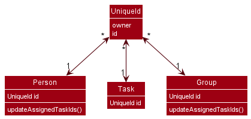
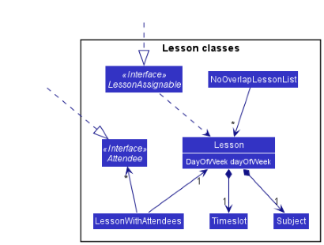

* Table of Contents
{:toc}

--------------------------------------------------------------------------------------------------------------------

## **Acknowledgements**

* {list here sources of all reused/adapted ideas, code, documentation, and third-party libraries -- include links to the original source as well}

--------------------------------------------------------------------------------------------------------------------

## **Setting up, getting started**

Refer to the guide [_Setting up and getting started_](SettingUp.md).

--------------------------------------------------------------------------------------------------------------------

## **Design**

:bulb: **Tip:** The `.puml` files used to create diagrams in this document can be found in the [diagrams](https://github.com/se-edu/addressbook-level3/tree/master/docs/diagrams/) folder. Refer to the [_PlantUML Tutorial_ at se-edu/guides](https://se-education.org/guides/tutorials/plantUml.html) to learn how to create and edit diagrams.

### Architecture

The ***Architecture Diagram*** given above explains the high-level design of the App.

Given below is a quick overview of main components and how they interact with each other.

**Main components of the architecture**

**`Main`** has two classes called [`Main`](https://github.com/se-edu/addressbook-level3/tree/master/src/main/java/seedu/address/Main.java) and [`MainApp`](https://github.com/se-edu/addressbook-level3/tree/master/src/main/java/seedu/address/MainApp.java). It is responsible for,
* At app launch: Initializes the components in the correct sequence, and connects them up with each other.
* At shut down: Shuts down the components and invokes cleanup methods where necessary.

[**`Commons`**](#common-classes) represents a collection of classes used by multiple other components.

The rest of the App consists of four components.

* [**`UI`**](#ui-component): The UI of the App.
* [**`Logic`**](#logic-component): The command executor.
* [**`Model`**](#model-component): Holds the data of the App in memory.
* [**`Storage`**](#storage-component): Reads data from, and writes data to, the hard disk.

**How the architecture components interact with each other**

The *Sequence Diagram* below shows how the components interact with each other for the scenario where the user issues the command `delete 1`.

Each of the four main components (also shown in the diagram above),

* defines its *API* in an `interface` with the same name as the Component.
* implements its functionality using a concrete `{Component Name}Manager` class (which follows the corresponding API `interface` mentioned in the previous point.

For example, the `Logic` component defines its API in the `Logic.java` interface and implements its functionality using the `LogicManager.java` class which follows the `Logic` interface. Other components interact with a given component through its interface rather than the concrete class (reason: to prevent outside component's being coupled to the implementation of a component), as illustrated in the (partial) class diagram below.

The sections below give more details of each component.

### UI component

The **API** of this component is specified in [`Ui.java`](https://github.com/se-edu/addressbook-level3/tree/master/src/main/java/seedu/address/ui/Ui.java)

The UI consists of a `MainWindow` that is made up of parts e.g.`CommandBox`, `ResultDisplay`, `PersonListPanel`, `StatusBarFooter` etc. All these, including the `MainWindow`, inherit from the abstract `UiPart` class which captures the commonalities between classes that represent parts of the visible GUI.

The `UI` component uses the JavaFx UI framework. The layout of these UI parts are defined in matching `.fxml` files that are in the `src/main/resources/view` folder. For example, the layout of the [`MainWindow`](https://github.com/se-edu/addressbook-level3/tree/master/src/main/java/seedu/address/ui/MainWindow.java) is specified in [`MainWindow.fxml`](https://github.com/se-edu/addressbook-level3/tree/master/src/main/resources/view/MainWindow.fxml)

The `UI` component,

* executes user commands using the `Logic` component.
* listens for changes to `Model` data so that the UI can be updated with the modified data.
* keeps a reference to the `Logic` component, because the `UI` relies on the `Logic` to execute commands.
* depends on some classes in the `Model` component, as it displays `Person` object residing in the `Model`.

### Logic component

**API** : [`Logic.java`](https://github.com/se-edu/addressbook-level3/tree/master/src/main/java/seedu/address/logic/Logic.java)

Here's a (partial) class diagram of the `Logic` component:

How the `Logic` component works:
1. When `Logic` is called upon to execute a command, it uses the `AddressBookParser` class to parse the user command.
1. This results in a `Command` object (more precisely, an object of one of its subclasses e.g., `AddCommand`) which is executed by the `LogicManager`.
1. The command can communicate with the `Model` when it is executed (e.g. to add a person).
1. The result of the command execution is encapsulated as a `CommandResult` object which is returned back from `Logic`.

The Sequence Diagram below illustrates the interactions within the `Logic` component for the `execute("delete 1")` API call.

:information_source: **Note:** The lifeline for `DeleteCommandParser` should end at the destroy marker (X) but due to a limitation of PlantUML, the lifeline reaches the end of diagram.

Here are the other classes in `Logic` (omitted from the class diagram above) that are used for parsing a user command:

How the parsing works:
* When called upon to parse a user command, the `AddressBookParser` class creates an `XYZCommandParser` (`XYZ` is a placeholder for the specific command name e.g., `AddCommandParser`) which uses the other classes shown above to parse the user command and create a `XYZCommand` object (e.g., `AddCommand`) which the `AddressBookParser` returns back as a `Command` object.
* All `XYZCommandParser` classes (e.g., `AddCommandParser`, `DeleteCommandParser`, ...) inherit from the `Parser` interface so that they can be treated similarly where possible e.g, during testing.

### Model component
**API** : [`Model.java`](https://github.com/se-edu/addressbook-level3/tree/master/src/main/java/seedu/address/model/Model.java)

The `Model` component,

* stores the address book data i.e., all `Person` objects (which are contained in a `UniquePersonList` object).
* stores the currently 'selected' `Person` objects (e.g., results of a search query) as a separate _filtered_ list which is exposed to outsiders as an unmodifiable `ObservableList<Person>` that can be 'observed' e.g. the UI can be bound to this list so that the UI automatically updates when the data in the list change.
* stores a `UserPref` object that represents the user’s preferences. This is exposed to the outside as a `ReadOnlyUserPref` objects.
* does not depend on any of the other three components (as the `Model` represents data entities of the domain, they should make sense on their own without depending on other components)

:information_source: **Note:** An alternative (arguably, a more OOP) model is given below. It has a `Tag` list in the `AddressBook`, which `Person` references. This allows `AddressBook` to only require one `Tag` object per unique tag, instead of each `Person` needing their own `Tag` objects. 

### Storage component

**API** : [`Storage.java`](https://github.com/se-edu/addressbook-level3/tree/master/src/main/java/seedu/address/storage/Storage.java)

The `Storage` component,
* can save both address book data and user preference data in json format, and read them back into corresponding objects.
* inherits from both `AddressBookStorage` and `UserPrefStorage`, which means it can be treated as either one (if only the functionality of only one is needed).
* depends on some classes in the `Model` component (because the `Storage` component's job is to save/retrieve objects that belong to the `Model`)

### Common classes

Classes used by multiple components are in the `seedu.addressbook.commons` package.

--------------------------------------------------------------------------------------------------------------------

## **Implementation**

This section describes some noteworthy details on how certain features are implemented.

### \[Proposed\] Undo/redo feature

#### Proposed Implementation

The proposed undo/redo mechanism is facilitated by `VersionedAddressBook`. It extends `AddressBook` with an undo/redo history, stored internally as an `addressBookStateList` and `currentStatePointer`. Additionally, it implements the following operations:

* `VersionedAddressBook#commit()` — Saves the current address book state in its history.
* `VersionedAddressBook#undo()` — Restores the previous address book state from its history.
* `VersionedAddressBook#redo()` — Restores a previously undone address book state from its history.

These operations are exposed in the `Model` interface as `Model#commitAddressBook()`, `Model#undoAddressBook()` and `Model#redoAddressBook()` respectively.

Given below is an example usage scenario and how the undo/redo mechanism behaves at each step.

Step 1. The user launches the application for the first time. The `VersionedAddressBook` will be initialized with the initial address book state, and the `currentStatePointer` pointing to that single address book state.

Step 2. The user executes `delete 5` command to delete the 5th person in the address book. The `delete` command calls `Model#commitAddressBook()`, causing the modified state of the address book after the `delete 5` command executes to be saved in the `addressBookStateList`, and the `currentStatePointer` is shifted to the newly inserted address book state.

Step 3. The user executes `add n/David …​` to add a new person. The `add` command also calls `Model#commitAddressBook()`, causing another modified address book state to be saved into the `addressBookStateList`.

:information_source: **Note:** If a command fails its execution, it will not call `Model#commitAddressBook()`, so the address book state will not be saved into the `addressBookStateList`.

Step 4. The user now decides that adding the person was a mistake, and decides to undo that action by executing the `undo` command. The `undo` command will call `Model#undoAddressBook()`, which will shift the `currentStatePointer` once to the left, pointing it to the previous address book state, and restores the address book to that state.

:information_source: **Note:** If the `currentStatePointer` is at index 0, pointing to the initial AddressBook state, then there are no previous AddressBook states to restore. The `undo` command uses `Model#canUndoAddressBook()` to check if this is the case. If so, it will return an error to the user rather
than attempting to perform the undo.

The following sequence diagram shows how the undo operation works:

:information_source: **Note:** The lifeline for `UndoCommand` should end at the destroy marker (X) but due to a limitation of PlantUML, the lifeline reaches the end of diagram.

The `redo` command does the opposite — it calls `Model#redoAddressBook()`, which shifts the `currentStatePointer` once to the right, pointing to the previously undone state, and restores the address book to that state.

:information_source: **Note:** If the `currentStatePointer` is at index `addressBookStateList.size() - 1`, pointing to the latest address book state, then there are no undone AddressBook states to restore. The `redo` command uses `Model#canRedoAddressBook()` to check if this is the case. If so, it will return an error to the user rather than attempting to perform the redo.

Step 5. The user then decides to execute the command `list`. Commands that do not modify the address book, such as `list`, will usually not call `Model#commitAddressBook()`, `Model#undoAddressBook()` or `Model#redoAddressBook()`. Thus, the `addressBookStateList` remains unchanged.

Step 6. The user executes `clear`, which calls `Model#commitAddressBook()`. Since the `currentStatePointer` is not pointing at the end of the `addressBookStateList`, all address book states after the `currentStatePointer` will be purged. Reason: It no longer makes sense to redo the `add n/David …​` command. This is the behavior that most modern desktop applications follow.

The following activity diagram summarizes what happens when a user executes a new command:

#### Design considerations:

**Aspect: How undo & redo executes:**

* **Alternative 1 (current choice):** Saves the entire address book.
  * Pros: Easy to implement.
  * Cons: May have performance issues in terms of memory usage.

* **Alternative 2:** Individual command knows how to undo/redo by
  itself.
  * Pros: Will use less memory (e.g. for `delete`, just save the person being deleted).
  * Cons: We must ensure that the implementation of each individual command are correct.

_{more aspects and alternatives to be added}_

### \[Proposed\] Data archiving

_{Explain here how the data archiving feature will be implemented}_

### Uniquely identify persons/groups/tasks

#### Implementation

We identify different persons/groups/tasks ("elements" for simplicity) by assigning them unique ids. This is done by
the `UniqueId` class. Each `UniqueId` instance stores a randomly-generated UUID and the owner of the id. When an element
is created, the constructors can call `UniqueId#generateId()` to generate a new `UniqueId`.

The interface `HasUniqueId` is created for classes whose instances may need to be uniquely identified. `HasUniqueId`
includes a method `getId` that should be overridden by its subclasses. `HasUniqueId#getId()` should return the
`UniqueId` of the object. By implementing `HasUniqueId`, other classes can deal with id-related operations without
exhausting all classes that have `UniqueId` as instance.

When storing references of `HasUniqueId`, we can simply store their id, instead of storing the entire object.

#### Design Consideration

**Aspect: How to generate a unique id:**

- Aspect 1 (Current choice): UUID (128-bit label)
  - Pros: Low possibility of collision
  - Cons: Require more spaces to store
- Aspect 2: `java.rmi.server.UID` (unique ID over time with respect to the host that it was generated on)
  - Pros: Ensure uniqueness within same device
  - Cons: As users can copy the data file and run the program in other devices, it may corrupt.
- Aspect 3: UID + IP address:
  - Pros: Solve the problem introduced in aspect 2.
  - Cons: Require more spaces to store, IP addresses may confuse collaborator as they are not supposed to be in an id.
- Aspect 4: Give a serial number for each objects
  - Pros: Easy to implement / intuitive.
  - Cons: Numbers (`int`, `long`) may be out-of-bound, need to keep a reference of the total number of id.

### Assign/Unassign task to student

#### Implementation

Task assignment to each student is facilitated through the `UniqueId` class. Each `Person` object and each `Task`
object has a `UniqueId` to identify them. Task assignment is stored as a set of `UniqueId`s in both the `Person` object
and the `Task` object.

The implementation currently supports two task commands:
- `AssignTaskToPersonCommand`: when executed, adds the `UniqueId` representing the `Task` to the set of `UniqueId`s stored in the `Person` object,
and adds the `UniqueId` representing the `Person` to the set of `UniqueId`s stored in the `Task` object
- `UnassignTaskToPersonCommand`: when executed, removes the `UniqueId` representing the `Task` from the set of `UniqueId`s stored in the `Person` object,
and removes the `UniqueId` representing the `Person` from the set of `UniqueId`s stored in the `Task` object

#### Implementation rationale

- `UniqueId` is used to easily identify and retrieve different `Task` and `Person` objects that are assigned to one another.
- Storing assignments as a set in each `Person` and `Task` makes it easy to display and retrieve all assigned tasks for each `Person`
and all assigned `Person` for each `Task`. It also makes implementation relatively simple, without having to use external lists.

#### Alternatives considered

Storing assignments as a separate set in the `AddressBook`. This may complicate command execution as the command needs to retrieve the
entire set from the `AddressBook` and look up the persons and tasks in the set.

#### \[Proposed\] Future implementation

- Adds support for group assignment using similar assignment methods. Automatically assign task to all students in the group
- Replace the set of `UniqueId`s with a set of `TaskCompletion` objects in order to track which student has done which task

### Edit a task

#### Implementation
This command is implemented to allow tutors to edit the details of the tasks stored in TutorMaster.

The tutor's input to edit a particular task is executed by the Logic Manager. The logic manager passes the input to the
`AddressBookParser` class which checks for the matching command. The arguments of the input are passed to `TaskCommandsParser`
class which will then check for the matching action word. In this case, the action word will be '-e' and the arguments will be
passed to `EditTaskCommandParser` class which will create an `EditTaskCommand` object. This command object is returned to the
`LogicManager` class to be executed. The `EditTaskCommand` object will create a newly edited task with the edited details and
set the edited task in place of the original task in the model. It also returns a `CommandResult` object that is returned
to the `LogicManager` class. The `AddressBookParser` class and `EditTaskCommandParser` class were not added in the below
diagram for simplicity. 

#### Implementation Rationale
When a new task is created with the details input by the user, the uniqueId of the task also changes. This implies that
the list of uniqueIds of tasks assigned to each student will have to be edited so store the newly created task in place of
the original task. To tackle this issue, we created a new constructor for the `Task` class such that we can pass in the
uniqueId of the original task so that the id is retained and does not change. This simplifies matters when it comes to
assigning and unassigning tasks to the students.

#### Alternatives considered
An alternative considered was to edit the list of uniqueIds of tasks assigned to each student after editing a particular
task. However, this seemed inefficient and hence, we went with the current implementation.

### View a student

#### Implementation

The command to view a student is facilitated through the `PersonCommandsParser` class. The `PersonCommandsParser` class
checks the command word given by the user and creates a `ViewPersonCommandParser` object which also creates a `ViewPersonCommand`
object. The `ViewPersonCommand` object returns the command back to the `LogicManager` class which allows the 'view command' to be
executed. The `ViewPersonCommand` object gets the list of students via `Model#getfilteredPersonsList()`. It then obtains the
target student via `AddressBook#get(index)` to return the respective `Person` at the index, hence displaying the details of the student in the 'Result Display'.

#### Implementation rationale
* `PersonCommandParser` helps filter out `ViewPersonCommandParser` as it helps differentiate the various commands
  related to student.

#### Alternatives considered
View the student from the persons list itself as it also displays the students' details. This may not include other details
relating to the student, such as the different `Task` object they have, and the `Group` they are in.

The following sequence diagram shows how the view operation works.

### Changing View Panel

On the right side of the GUI, there exists a panel with contents that change depending on the user's selected view. For example
it can show the current schedule or more details of a person.

#### Implementation

The UI listens to changes in the Model via an ObservableProperty within the ModelManager. It does this by
registering a ChangeListener on initialisation.

If a Viewing Panel should be updated when the Command executes, the Command will set the appropriate ViewingType within the Model.
This will update the ObservableProperty that the UI is listening on, hence updating the UI with the correct ViewingType.

The contents of the ViewingType are obtained through other Observables in the Model as well. These are updated independently
of the ViewingType.

#### Implementation Rationale

This method of using a ChangeListener is in line with the overall architecture of the application, where the UI responds to any
changes in the Model. This also removes the need for Model and Logic packages to be dependent on the UI.

#### Alternatives Considered

We had considered using CommandResult to inform the UI what the ViewingType should be, which the UI can obtain after executing
the command. This works well, but could get complicated if we used the CommandResult for all sorts of feedback to the UI. Using
event listeners was more convenient and allowed us to store less information in the CommandResult itself.

### Lessons

#### Implementation

Lessons and all related classes are inside the `seedu.address.model.lesson` package. A `Lesson` consists of a `java.time.DayOfWeek`,
a `Subject` and a `Timeslot`, which describes a Lesson well.

A `NoOverlapLessonList` contains a list of lessons, in which the lessons within must not overlap. Overlap is defined as falling on the
same day and with timings that run within each other.

`LessonWithAttendees` is a useful wrapper class to hold a list of attendees and lessons. This is used in particular for transporting lesson information around.

The interfaces `Attendee` and `LessonAssignable` is to be implemented by classes of other packages that wish to use lessons.
For example, a `Person` is both an `Attendee` and a `LessonAssignable`, while a `Group` is only
a `LessonAssignable`.

#### Implementation Rationale

`NoOverlapLessonList` is useful in cases such as students where they should not have lessons that overlap. `LessonWithAttendees`
is a useful wrapper class to obtain the full details of a lesson (the lesson details and the details of attendees), since a lesson
does not have a direct reference to its attendee.

Lessons were created to be held by other classes, and thus does not hold information about its attendees. We acknowledge that a
`Lesson` can hold reference to its `Attendee` and vice versa. However, for the sake of simplicity, we have decided to let other classes be
in charge of knowing who _attends_ each `Lesson`.

#### Alternatives considered

When `Lesson` was implemented, the `Person` class was already in place. We had originally considered a two-way reference, in which
a `Person` had multiple `Lesson` and a `Lesson` had multiple `Person`. However, given that this app was mainly for tuition, in which
most lessons would be 1:1, it made more sense to assign `Lesson` under a `Person` instead, and if multiple `Person` was attending
the same `Lesson`, they would be assigned through a `Group`. The avoidance of a two-way reference was also due to the immutability
of `Person`, in which any updates to a `Person` could cause any references to it to be invalid.

#### \[Proposed\] Future implementation

Add support for a custom recurrence of lessons. Right now it is guaranteed that a lesson would occur weekly, which is in line with
what many of our users require, but the ability to customise can be useful.

--------------------------------------------------------------------------------------------------------------------

## **Documentation, logging, testing, configuration, dev-ops**

* [Documentation guide](Documentation.md)
* [Testing guide](Testing.md)
* [Logging guide](Logging.md)
* [Configuration guide](Configuration.md)
* [DevOps guide](DevOps.md)

--------------------------------------------------------------------------------------------------------------------

## **Appendix: Requirements**

### Product scope

**Target user profile**:

* has a need to manage lessons and contact details for a significant number of students
* has a need to assign tasks to many students
* wants to keep track of students' progress easily
* prefer desktop apps over other types
* can type fast
* prefers typing to mouse interactions
* is reasonably comfortable using CLI apps

**Value proposition**: manage students' relevant details and tasks to be assigned faster than a typical mouse/GUI driven app.
The app is purely offline, and does not include any online feature.

### User stories

Priorities: High (must have) - `* * *`, Medium (nice to have) - `* *`, Low (unlikely to have) - `*`

| Priority | As a …​                                    | I want to …​                           | So that I can…​                                                     |
| -------- | ------------------------------------------ | -------------------------------------------- | ---------------------------------------------------------------------- |
| `* * *`  | new user                                   | see usage instructions                       | refer to instructions when I forget how to use the App                 |
| `* * *`  | user                                       | add a new student                            | manage students I have that are not present in the app                 |
| `* * *`  | user                                       | delete a student                             | remove entries that I no longer need                                   |
| `* * *`  | user                                       | find a student by name                       | locate details of persons without having to go through the entire list |
| `* * *`  | user                                       | group students together                      | locate similar students through their groupings easily                          |
| `* * *`  | tutor                                      | add a new task                               | remember tasks I have created easily                                   |
| `* * *`  | tutor                                      | assign tasks to students                     | reuse similar tasks for my students                                    |
| `* * *`  | tutor                                      | mark tasks as completed                      | track my students' task progress                                       |
| `* * *`  | user                                       | delete a task                                | remove tasks that I no longer need                                     |
| `* * *`  | busy tutor                                 | view current lesson schedules                | plan my working and resting hours accordingly                          |
| `* *`    | tutor                                      | set deadlines for tasks                      | collect assignments in a timely manner                                 |
| `* *`    | tutor                                      | input students' grade for tasks              | track how my students are coping                                       |
| `* *`    | user                                       | hide private contact details                 | minimize chance of someone else seeing them by accident                |
| `* *`    | tutor                                      | store exam dates of students                 | prioritize and help a large number of students better                  |
| `* *`    | busy tutor                                 | be warned if schedules clash                 | minimize error in my planning                                          |
| `* *`    | busy tutor                                 | track who has paid their fees                | send reminders to students who have not paid                           |
| `*`      | tutor                                      | record students' attendance                  | track which lessons students have missed and help them catch up        |
| `*`      | user with many persons in the address book | sort persons by name                         | locate a person easily                                                 |
| `*`      | tutor                                      | monitor number of tasks assigned to a student| assign tasks to students while ensuring they can manage the workload   |

*{More to be added}*

### Use cases

(For all use cases below, the **System** is `TutorMaster` and the **Actor** is the `user`, unless specified otherwise)

**Use case: Delete a student**

**MSS**

1.  User requests to list all students
2.  TutorMaster shows a list of students in the students list
3.  User requests to delete a specific student in the list
4.  TutorMaster deletes the student from the students list

    Use case ends.

**Extensions**

* 2a. The list is empty.

  Use case ends.

* 3a. The given index is invalid.

    * 3a1. TutorMaster shows an error message.

      Use case resumes at step 2.

**Use case: Adding a lesson**

1. User requests to list all students
2. TutorMaster shows a list of students in the students list
3. User requests to add a specific lesson to the student
4. TutorMaster adds the lesson to the specific student
5. TutorMaster displays the specific student in the viewing panel

**Extensions**

* 2a. The list is empty.  
    Use case ends
* 3a. The request details are incorrect or insufficient. 
    * 3a1. TutorMaster displays an error message.  
    Use case resumes at step 3.
* 3b. The lesson overlaps with other lessons that the student has.  
    * 3b1. TutorMaster displays an error message.  
    Use case ends.

**Use case: Delete a task**

**MSS**

1.  User requests to list all tasks
2.  TutorMaster shows a list of tasks in the tasks list
3.  User requests to delete a specific task in the list
4.  TutorMaster deletes the task from the tasks list

    Use case ends.

**Extensions**

* 2a. The list is empty.

  Use case ends.

* 3a. The given index is invalid.

    * 3a1. TutorMaster shows an error message.

      Use case resumes at step 2.

**Use case: Assign a task to a student**

**MSS**

1.  User requests to list all tasks
2.  TutorMaster shows a list of tasks in the tasks list
3.  User requests to list all students
4.  TutorMaster shows a list of students in the students list
5.  User requests to assign a task to a student
6.  TutorMaster assigns the task to the student

    Use case ends.

**Extensions**

* 2a. The tasks list is empty.

  Use case ends.

* 4a. The students list is empty.

  Use case ends.

* 5a. The given task name or student name is invalid.

    * 5a1. TutorMaster shows an error message.

      Use case resumes at step 4.

### Non-Functional Requirements

1.  Should work on any _mainstream OS_ as long as it has Java `11` or above installed.
2.  Should be able to hold up to 1000 persons without a noticeable sluggishness in performance for typical usage.
3.  A user with above average typing speed for regular English text (i.e. not code, not system admin commands) should be able to accomplish most of the tasks faster using commands than using the mouse.
4.  The response to any user’s command should be visible within 5 seconds.
5.  The user interface should be intuitive enough for users who are not IT-savvy.

### Glossary

* **Mainstream OS**: Windows, Linux, Unix, OS-X
* **Private contact detail**: A contact detail that is not meant to be shared with others
* **CLI**: Command Line Interface that processes user's commands to a computer program

--------------------------------------------------------------------------------------------------------------------

## **Appendix: Instructions for manual testing**

Given below are instructions to test the app manually.

:information_source: **Note:** These instructions only provide a starting point for testers to work on;
testers are expected to do more *exploratory* testing.

### Launch and shutdown

1. Initial launch

   1. Download the jar file and copy into an empty folder

   1. Double-click the jar file Expected: Shows the GUI with a set of sample contacts. The window size may not be optimum.

1. Saving window preferences

   1. Resize the window to an optimum size. Move the window to a different location. Close the window.

   1. Re-launch the app by double-clicking the jar file. 
       Expected: The most recent window size and location is retained.

1. _{ more test cases …​ }_

### Deleting a student

1. Deleting a student while all students are being shown

   1. Prerequisites: List all students using the `list` command. Multiple students in the list.

   1. Test case: `student -d 1` 
      Expected: First contact is deleted from the list. Details of the deleted contact shown in the status message.

   1. Test case: `student -d 0` 
      Expected: No person is deleted. Error details shown in the status message. Status bar remains the same.

   1. Other incorrect delete commands to try: `student -d`, `student -d x`, `...` (where x is larger than the list size) 
      Expected: Similar to previous.

1. _{ more test cases …​ }_

### Adding a lesson to a student

1. Adding a lesson while all students are being shown
    1. Prerequisites: List all students using the list command. Multiple students in the list.
    1. Test case: `student -al 1 s/Biology st/23:00 et/23:59 d/Fri`  
    Expected: Lesson is added to first student in the list. Student details are shown in the viewing panel on the right.
    Lesson can be seen under "Lessons" in the viewing panel.
    1. Test case: Repeat `student -al 1 s/Biology st/23:00 et/23:59 d/Fri` after previous test case.  
    Expected: Lesson cannot be added to first student because it overlaps with the lesson from previous test case. Error
    message is shown.
    1. Test case: Use `student -al s/Biology st/23:00 et/23:59 d/Fri`  
    Expected: Error message is shown as no index is specified.
    

### Grouping students

1. Adding students to a group while all students are being shown

    1. Prerequisites: List all students using the `list` command. At least 2 students in the list.
    1. Successful test case: `group -a 1 2 n/New Group`  
    Expected: First two students are added into the group. Group details appear in the viewing panel on the right.
    Using `student -v 1` and `student -v 2` shows that the group name __New Group__ shows up in the student view.
    1. Test case: `group -a 1 2`  
    Expected: No new group is created, error message is shown as there is no group name specified.
    1. Test case: `group -a 0 1 n/New Group`  
    Expected: No new group is created, error message is shown as the index __0__ is invalid.

### Saving data

1. Dealing with missing/corrupted data files

   1. _{explain how to simulate a missing/corrupted file, and the expected behavior}_

1. _{ more test cases …​ }_
