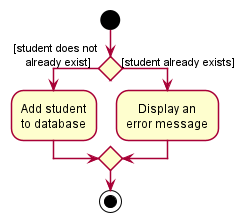
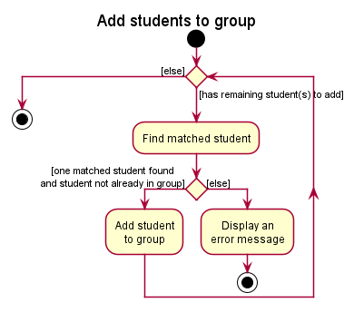

* Table of Contents
{:toc}

--------------------------------------------------------------------------------------------------------------------

## **Acknowledgements**

* {list here sources of all reused/adapted ideas, code, documentation, and third-party libraries -- include links to the original source as well}

--------------------------------------------------------------------------------------------------------------------

## **Setting up, getting started**

Refer to the guide [_Setting up and getting started_](SettingUp.md).

--------------------------------------------------------------------------------------------------------------------

## **Design**

:bulb: **Tip:** The `.puml` files used to create diagrams in this document can be found in the [diagrams](https://github.com/se-edu/addressbook-level3/tree/master/docs/diagrams/) folder. Refer to the [_PlantUML Tutorial_ at se-edu/guides](https://se-education.org/guides/tutorials/plantUml.html) to learn how to create and edit diagrams.

### Architecture

The ***Architecture Diagram*** given above explains the high-level design of the App.

Given below is a quick overview of main components and how they interact with each other.

**Main components of the architecture**

**`Main`** has two classes called [`Main`](https://github.com/se-edu/addressbook-level3/tree/master/src/main/java/seedu/address/Main.java) and [`MainApp`](https://github.com/se-edu/addressbook-level3/tree/master/src/main/java/seedu/address/MainApp.java). It is responsible for,
* At app launch: Initializes the components in the correct sequence, and connects them up with each other.
* At shut down: Shuts down the components and invokes cleanup methods where necessary.

[**`Commons`**](#common-classes) represents a collection of classes used by multiple other components.

The rest of the App consists of four components.

* [**`UI`**](#ui-component): The UI of the App.
* [**`Logic`**](#logic-component): The command executor.
* [**`Model`**](#model-component): Holds the data of the App in memory.
* [**`Storage`**](#storage-component): Reads data from, and writes data to, the hard disk.

**How the architecture components interact with each other**

The *Sequence Diagram* below shows how the components interact with each other for the scenario where the user issues the command `delete 1`.

Each of the four main components (also shown in the diagram above),

* defines its *API* in an `interface` with the same name as the Component.
* implements its functionality using a concrete `{Component Name}Manager` class (which follows the corresponding API `interface` mentioned in the previous point.

For example, the `Logic` component defines its API in the `Logic.java` interface and implements its functionality using the `LogicManager.java` class which follows the `Logic` interface. Other components interact with a given component through its interface rather than the concrete class (reason: to prevent outside component's being coupled to the implementation of a component), as illustrated in the (partial) class diagram below.

The sections below give more details of each component.

### UI component

The **API** of this component is specified in [`Ui.java`](https://github.com/se-edu/addressbook-level3/tree/master/src/main/java/seedu/address/ui/Ui.java)

The UI consists of a `MainWindow` that is made up of parts e.g.`CommandBox`, `ResultDisplay`, `PersonListPanel`, `StatusBarFooter` etc. All these, including the `MainWindow`, inherit from the abstract `UiPart` class which captures the commonalities between classes that represent parts of the visible GUI.

The `UI` component uses the JavaFx UI framework. The layout of these UI parts are defined in matching `.fxml` files that are in the `src/main/resources/view` folder. For example, the layout of the [`MainWindow`](https://github.com/se-edu/addressbook-level3/tree/master/src/main/java/seedu/address/ui/MainWindow.java) is specified in [`MainWindow.fxml`](https://github.com/se-edu/addressbook-level3/tree/master/src/main/resources/view/MainWindow.fxml)

The `UI` component,

* executes user commands using the `Logic` component.
* listens for changes to `Model` data so that the UI can be updated with the modified data.
* keeps a reference to the `Logic` component, because the `UI` relies on the `Logic` to execute commands.
* depends on some classes in the `Model` component, as it displays `Person` object residing in the `Model`.

### Logic component

**API** : [`Logic.java`](https://github.com/se-edu/addressbook-level3/tree/master/src/main/java/seedu/address/logic/Logic.java)

Here's a (partial) class diagram of the `Logic` component:

How the `Logic` component works:
1. When `Logic` is called upon to execute a command, it uses the `AddressBookParser` class to parse the user command.
1. This results in a `Command` object (more precisely, an object of one of its subclasses e.g., `AddCommand`) which is executed by the `LogicManager`.
1. The command can communicate with the `Model` when it is executed (e.g. to add a person).
1. The result of the command execution is encapsulated as a `CommandResult` object which is returned back from `Logic`.

The Sequence Diagram below illustrates the interactions within the `Logic` component for the `execute("delete 1")` API call.

:information_source: **Note:** The lifeline for `DeleteCommandParser` should end at the destroy marker (X) but due to a limitation of PlantUML, the lifeline reaches the end of diagram.

Here are the other classes in `Logic` (omitted from the class diagram above) that are used for parsing a user command:

How the parsing works:
* When called upon to parse a user command, the `AddressBookParser` class creates an `XYZCommandParser` (`XYZ` is a placeholder for the specific command name e.g., `AddCommandParser`) which uses the other classes shown above to parse the user command and create a `XYZCommand` object (e.g., `AddCommand`) which the `AddressBookParser` returns back as a `Command` object.
* All `XYZCommandParser` classes (e.g., `AddCommandParser`, `DeleteCommandParser`, ...) inherit from the `Parser` interface so that they can be treated similarly where possible e.g, during testing.

### Model component
**API** : [`Model.java`](https://github.com/se-edu/addressbook-level3/tree/master/src/main/java/seedu/address/model/Model.java)

The `Model` component,

* stores the address book data i.e., all `Person` objects (which are contained in a `UniquePersonList` object).
* stores the currently 'selected' `Person` objects (e.g., results of a search query) as a separate _filtered_ list which is exposed to outsiders as an unmodifiable `ObservableList<Person>` that can be 'observed' e.g. the UI can be bound to this list so that the UI automatically updates when the data in the list change.
* stores a `UserPref` object that represents the user’s preferences. This is exposed to the outside as a `ReadOnlyUserPref` objects.
* does not depend on any of the other three components (as the `Model` represents data entities of the domain, they should make sense on their own without depending on other components)

:information_source: **Note:** An alternative (arguably, a more OOP) model is given below. It has a `Tag` list in the `AddressBook`, which `Person` references. This allows `AddressBook` to only require one `Tag` object per unique tag, instead of each `Person` needing their own `Tag` objects. 

### Storage component

**API** : [`Storage.java`](https://github.com/se-edu/addressbook-level3/tree/master/src/main/java/seedu/address/storage/Storage.java)

The `Storage` component,
* can save both address book data and user preference data in json format, and read them back into corresponding objects.
* inherits from both `AddressBookStorage` and `UserPrefStorage`, which means it can be treated as either one (if only the functionality of only one is needed).
* depends on some classes in the `Model` component (because the `Storage` component's job is to save/retrieve objects that belong to the `Model`)

### Common classes

Classes used by multiple components are in the `seedu.addressbook.commons` package.

--------------------------------------------------------------------------------------------------------------------

## **Implementation**

This section describes some noteworthy details on how certain features are implemented.

### Import feature

The following activity diagram summarizes what happens when the user inputs an import command:

There are several important details left out of the activity diagram for the sake of clarity:

1. The import feature is reliant on having a correctly formatted csv file (which is to be exported from sites like lumiNUS and Source Academy, and modified to fit the format).
The user needs to provide the number of `Groups`, `Assessments`, and `Tags` since we can't detect this automatically from the format of the file. The proper format of the file can be found in the user guide.

1. A `CommandException` will be thrown if any input does not follow the formatting specified in the respective classes such as `Name`, `ID`, and `Score`.

1. When reading a student's groups, the command will try to use an existing `Group` if possible, to ensure that the `Group` holds a reference to all `Students` in the group. A new `Group` will only be created in the case where the group hasn't already been created.

1. When reading a student's scores, the command will add the score to the `Student`, as well as the `Assessment` created from reading the first row.

1. Columns can be empty, except for the assessment name columns in the header row, and the name and ID columns of each student. Empty columns are assumed to be missing data.

### Add Student feature

The add student feature adds a student with the provided name and NUSNET ID into the database. If the student comes with optionally specified groups and tags, these fields will be added accordingly.

#### Implementation

#### AddCommand class
The `addstudent` mechanism is facilitated by the `AddCommand` class which extends the `Command` class. The `AddCommand` class overrides the `execute()` method in `Command`. In this implementation,
the method first checks if the `Student` object supplied as parameters is non-null. Then, it checks if the `Student` already exists in the database.
If this `Student` already exists, a `CommandException` will be thrown, telling the user that a duplicate `Student` is being added. If
the `Student` does not exist in the database yet, the `Model#addStudent()` method is called.

#### AddCommandParser class
The `AddCommandParser` class implements the `Parser<AddCommand>` interface. The `parse()` method checks for the presence of the compulsory prefixes corresponding to the name and NUSNET id of the `Student`, namely `-n` and `-i`.
It also checks for the presence of the optional group and tag prefixes, namely `-g` and `-t`.
It then retrieves the characters that follow each prefix and allocates them to the fields the `Student` object has accordingly.

In the case where the compulsory prefixes `-n` and `-i` are not present, a `ParseException` is thrown, prompting the user that the wrong command format has been used.

The following activity diagram summarizes what happens when the user inputs an add student command:

The following sequence diagram shows how the add student operation works:

:information_source: **Note:** The lifeline for `AddCommand` should end at the destroy marker (X) but due to a limitation of PlantUML, the lifeline reaches the end of diagram.

### Add Group feature

The `addgroup` feature allows users to create new groups, as well as specify students to be added to the group to be created.

#### How the `AddGroupCommand` works:
1. The user specifies the group name, as well as a list of names and/or IDs of the students to be added into the group.
2. For each of the names and IDs, an `AllocDescriptor` is created.
3. For each of the `AllocDescriptors`, a search is done against the current `StudentList` to find students that match the descriptors.
   * If there is one and only one match, the student is added to the group.
4. The group is added to the application if Step 3 completes without any exceptions.

:information_source: **Note:** In the case where there are more than one students matched because they share the same name, an error message will be displayed to the user. The user will then have to specify the student to be added using his/her student ID.

The following activity diagrams summarizes what happens when a user executes a command to add a new group. In the case where the group is not added, an error message will be displayed with the reason.

The following sequence diagram summarizes what happens when the user inputs an add group command together with a student to be added:

### Add Allocation feature

The `addalloc` feature allocates an existing student into a group.

Given below is an example usage case and how the `add alloc` command mechanism behaves at each step.

#### Implementation

Step 1. The user executes `add alloc -g T02 -n Alex Yeoh` command to add the student named `Alex Yeoh` to the group `T02`. The `add alloc` command creates an `AddAllocCommandParser` object to parse the user input into respective command arguments.

Step 2. The `AddAllocCommandParser` checks for validity of the user input and creates an `AddAllocCommand.AllocDescriptor` object to store information of the allocation which is then used to create an `AddAllocCommand` object to execute the command.

Step 3. `AddAllocCommand#execute()` checks for validity of the command arguments, i.e. the existence of group `T02` and student `Alex Yeoh` in the database, the existence of student `Alex Yeoh` in group `T02`.

Step 4. `AddAllocCommand#execute()` calls `AddAllocCommand#createEditedStudent()` to create an instance of student `Alex Yeoh` allocated to group `T02`, and modifies the current unallocated student `Alex Yeoh` in the database with the newly allocated instance through `ReadOnlyAddressBook#setStudent`.

Step 5. `AddAllocCommand#execute()` calls `Group#addStudent()` to add student `Alex Yeoh` into the group.

Use case ends.

### Search feature

The `search` feature allows user to filter student list by name, NUSNET ID, groups, or tags.

#### Implementation

The following diagram shows the search operation after user input `search -n Alex Yu`.

A `Predicate<Student>` object will be created for each search command.
It contains `test(Student student)` function which checks if the given student matches the list of keywords given.

To support the differentiated search functionality for different flags (e.g. name, NUSNET ID, group name, or tag),
multiple classes extending from `Predicate<Student>` can be created,
each with different implementation of the `test(Student student)` function.

* `NameContainsKeywordsPredicate`: checks if any word in the full name of student matches exactly any word in the
  given keywords. e.g. `Alex Yu` will match `Alex Yeoh` and `Bernice Yu`. Partial search is not supported
  e.g. `Han` will not match `Hans`.
* `IdContainsKeywordsPredicate`: checks if the ID of student contains any word in the given keywords.
  Partial search is supported. e.g. `E05` will match `E0523412`.
* `GroupContainsKeywordsPredicate`: checks if any group of student contains any word in the given keywords.
  Partial search is supported. e.g. `T02` will match `T02A` and `T02B`.
* `TagContainsKeywordsPredicate`: checks if the tag of student contains any word in the given keywords.
  Partial search is supported. e.g. `friend` will match `friends`.

The following diagram summarizes what happens after user input search command:

:information_source: **Note:** SearchCommandParser checks
if command is valid. Command is invalid if user input is empty, or if user entered more or less than one flag.

#### Design considerations

**Aspect: How search executes:**

* **Alternative 1:** Multiple search commands to search using different identifiers.
    * Pros: Easy to implement.
    * Cons: Inconvenient for user to remember different command words.

* **Alternative 2 (current choice):** Single search command to perform search for multiple identifiers.
    * Pros: More straightforward and convenient for users.
    * Cons: We need to identify the type of input given.

### \[Proposed\] Undo/redo feature

#### Proposed Implementation

The proposed undo/redo mechanism is facilitated by `VersionedAddressBook`. It extends `AddressBook` with an undo/redo history, stored internally as an `addressBookStateList` and `currentStatePointer`. Additionally, it implements the following operations:

* `VersionedAddressBook#commit()` — Saves the current address book state in its history.
* `VersionedAddressBook#undo()` — Restores the previous address book state from its history.
* `VersionedAddressBook#redo()` — Restores a previously undone address book state from its history.

These operations are exposed in the `Model` interface as `Model#commitAddressBook()`, `Model#undoAddressBook()` and `Model#redoAddressBook()` respectively.

Given below is an example usage scenario and how the undo/redo mechanism behaves at each step.

Step 1. The user launches the application for the first time. The `VersionedAddressBook` will be initialized with the initial address book state, and the `currentStatePointer` pointing to that single address book state.

Step 2. The user executes `delete 5` command to delete the 5th person in the address book. The `delete` command calls `Model#commitAddressBook()`, causing the modified state of the address book after the `delete 5` command executes to be saved in the `addressBookStateList`, and the `currentStatePointer` is shifted to the newly inserted address book state.

Step 3. The user executes `add n/David …​` to add a new person. The `add` command also calls `Model#commitAddressBook()`, causing another modified address book state to be saved into the `addressBookStateList`.

:information_source: **Note:** If a command fails its execution, it will not call `Model#commitAddressBook()`, so the address book state will not be saved into the `addressBookStateList`.

Step 4. The user now decides that adding the person was a mistake, and decides to undo that action by executing the `undo` command. The `undo` command will call `Model#undoAddressBook()`, which will shift the `currentStatePointer` once to the left, pointing it to the previous address book state, and restores the address book to that state.

:information_source: **Note:** If the `currentStatePointer` is at index 0, pointing to the initial AddressBook state, then there are no previous AddressBook states to restore. The `undo` command uses `Model#canUndoAddressBook()` to check if this is the case. If so, it will return an error to the user rather
than attempting to perform the undo.

The following sequence diagram shows how the undo operation works:

:information_source: **Note:** The lifeline for `UndoCommand` should end at the destroy marker (X) but due to a limitation of PlantUML, the lifeline reaches the end of diagram.

The `redo` command does the opposite — it calls `Model#redoAddressBook()`, which shifts the `currentStatePointer` once to the right, pointing to the previously undone state, and restores the address book to that state.

:information_source: **Note:** If the `currentStatePointer` is at index `addressBookStateList.size() - 1`, pointing to the latest address book state, then there are no undone AddressBook states to restore. The `redo` command uses `Model#canRedoAddressBook()` to check if this is the case. If so, it will return an error to the user rather than attempting to perform the redo.

Step 5. The user then decides to execute the command `list`. Commands that do not modify the address book, such as `list`, will usually not call `Model#commitAddressBook()`, `Model#undoAddressBook()` or `Model#redoAddressBook()`. Thus, the `addressBookStateList` remains unchanged.

Step 6. The user executes `clear`, which calls `Model#commitAddressBook()`. Since the `currentStatePointer` is not pointing at the end of the `addressBookStateList`, all address book states after the `currentStatePointer` will be purged. Reason: It no longer makes sense to redo the `add n/David …​` command. This is the behavior that most modern desktop applications follow.

The following activity diagram summarizes what happens when a user executes a new command:

#### Design considerations

**Aspect: How undo & redo executes:**

* **Alternative 1 (current choice):** Saves the entire address book.
  * Pros: Easy to implement.
  * Cons: May have performance issues in terms of memory usage.

* **Alternative 2:** Individual command knows how to undo/redo by
  itself.
  * Pros: Will use less memory (e.g. for `delete`, just save the person being deleted).
  * Cons: We must ensure that the implementation of each individual command are correct.

--------------------------------------------------------------------------------------------------------------------

## **Documentation, logging, testing, configuration, dev-ops**

* [Documentation guide](Documentation.md)
* [Testing guide](Testing.md)
* [Logging guide](Logging.md)
* [Configuration guide](Configuration.md)
* [DevOps guide](DevOps.md)

--------------------------------------------------------------------------------------------------------------------

## **Appendix: Requirements**

### Product scope

**Target user profile**:

Targets professors of CS1101S who:
* has a need to manage a significant number of students
* has a need to analyse students' performance
* prefer desktop apps over other types
* can type fast
* prefers typing to mouse interactions
* is reasonably comfortable using CLI apps

**Value proposition**: This app will help CS1101S professors keep track of students' performance after each assessment,
doing so faster than a typical mouse/GUI driven app.
It can analyse results of individual students, tutorial groups, or the whole cohort in each assessment,
in order to identify students who may require additional help.

### User stories

Priorities: High (must have) - `* * *`, Medium (nice to have) - `* *`, Low (unlikely to have) - `*`

Importing and exporting data:

| Priority | As a …​                                    | I want to …​                     | So that I can…​                                                        |
| -------- | ------------------------------------------ | ------------------------------ | ---------------------------------------------------------------------- |
| `* * *`  | CS1101S Professor                          | Upload large amounts of data from a file      | Upload all assessment scores of all students at once          |
| `* *`  | Long-time user                         | Clear all data        | Remove records from the previous semester            |
| `* *`  | CS1101S Professor                          | Export data      | Share interesting findings with my colleagues          |
| `*`  | New user | Import data from the previous semester | Have an idea of how intakes of the previous cohort performed |

Adding and editing data fields:

| Priority | As a …​                                    | I want to …​                     | So that I can…​                                                        |
| -------- | ------------------------------------------ | ------------------------------ | ---------------------------------------------------------------------- |
| `* * *`  | CS1101S Professor                          | Add a new assessment        | Keep track of assessment scores of students           |
| `* * *`  | CS1101S Professor                          | Add a new student        | Add a new student without having to make a new file               |
| `* * *`  | CS1101S Professor                          | Allocate a student into existing group       | Allocate groupings without having to make a new file                  |
| `* * *`  | CS1101S Professor                          | Organise students into groups      | Encourage peer learning          |
| `* *`  | CS1101S Professor | Remove a specific student   | Update the system accordingly when a student drops the module  |
| `* *`  | CS1101S Professor | Annotate a student with a tag  | See categories of students quickly |
| `* *`  | CS1101S Professor | Add remarks to particular students | Be aware of any special conditions the student is facing |
| `* *`  | CS1101S Professor | Edit assessment score for a particular student | Make changes after the initial grading |
| `*`  | CS1101S Professor | Add attendance records for each class  | Track the students present at each class |
| `*`  | CS1101S Professor | Upload students’ feedback about their tutors | Provide timely feedback to the tutors |

Viewing and searching data:

| Priority | As a …​                                    | I want to …​                     | So that I can…​                                                        |
| -------- | ------------------------------------------ | ------------------------------ | ---------------------------------------------------------------------- |
| `* * *`  | CS1101S Professor                          | Search for specific student     | Track his/her progress to facilitate better learning          |
| `* * *`  | CS1101S Professor | Search for students by classes and groups  | Track them by groups easily |
| `* * *`  | CS1101S Professor | Check a student’s grades | See individual performance |
| `*`  | CS1101S Professor | Check attendance records for each student | Track if the student has been attending classes diligently |

Analysing data:

| Priority | As a …​                                    | I want to …​                     | So that I can…​                                                        |
| -------- | ------------------------------------------ | ------------------------------ | ---------------------------------------------------------------------- |
| `* * *`  | CS1101S Professor | Analyse the performances of individual students | Give special assistance to those in need |
| `* * *`  | CS1101S Professor | Analyse performance of cohort in each assessment | See how the cohort is performing |
| `* *`  | CS1101S Professor | Analyse the performances of students in groups | See which studio is under-performing and check in with the tutor |
| `* *`  | CS1101S Professor | Calculate overall grades  | Easily decide on grade ranges |
| `*`  | Detailed user | View the performances under different kinds of graph | Have better visualisation about the performances of students |
| `*`  | CS1101S Professor | Analyse the cohort performance for each question | Understand which are the topics students require more help with |
| `*`  | CS1101S Professor | Compare between different batches of students | See if the module is too hard this semester as compared to previous semesters |
| `*`  | CS1101S Professor | Check the overall performance of the tutors based on several indicators | Identify excellent tutors to be called back next semester |

Others:

| Priority | As a …​                                    | I want to …​                     | So that I can…​                                                        |
| -------- | ------------------------------------------ | ------------------------------ | ---------------------------------------------------------------------- |
| `* * *`  | New user | Get command prompts when typing | Do not have to keep checking user guide |
| `* *`  | Expert user | Have shortcuts for commands | Save time |
| `* *`  | Potential user | View the app populated with sample data | See how the app looks like when in use |
| `*`  | Forgetful user | Access the user guide with an easy to remember command | Lookup how to use a command/what command to use |
| `*`  | Long-term user | Store meeting timings | Not miss any meetings that have been planned |
| `*`  | Forgetful user | Have reminders about upcoming meetings | Avoid missing any important events |
| `*`  | CS1101S Professor | Add TODO bug fixes accumulated throughout the semester | Fix them during CP3108 |

### Use cases

(For all use cases below, the **System** is `Source Control` and the **Actor** is the `user`, unless specified otherwise)

**Use case: Import student roster**

**MSS**

1.  User has a comma-separated values (`.csv`) file of the student roster.
2.  User requests to import the file into Source Control.
3.  Source Control shows the list of students parsed and imported.

    Use case ends.

**Extensions**

* 2a. The csv file has badly formatted input.

    * 2a1. Source Control shows an error message displaying the bad input.

    * 2a2. User fixes the csv file.

      Use case resumes at step 2.

**Use case: Create a new group**

**MSS**

1.  User requests to create a new group and enters the group name and students' names or Student IDs.
2.  Source Control creates the group with the specified students.

    Use case ends.

**Extensions**

* 1a. There is an existing group with the same group name.

    * 1a1. Source Control shows an error message.

      Use case resumes at step 1.
* 1b. There are multiple students that match any of the specified student names.

    * 1b1. Source Control shows an error message with the different Student IDs.

      Use case resumes at step 1.

### Non-Functional Requirements

1. Should work on any _mainstream OS_ as long as it has Java `11` or above installed.
2. Should be able to hold up to 1000 students without a noticeable sluggishness in performance for typical usage.
3. Should be able to analyse data of up to 1000 students without a noticeable sluggishness in performance for typical usage.
4. A user with above average typing speed for regular English text (i.e. not code, not system admin commands) should be able to accomplish most of the tasks faster using commands than using the mouse.
5. Should work without internet connections.
6. New users can pick up the basic functionalities of Source Control easily.

### Glossary

* **Mainstream OS**: Windows, Linux, Unix, OS-X.
* **Student**: A student in the database, identified by their name and NUSNET ID. Each student can be in multiple groups, and can have scores for multiple assessments.
* **Group**: A group of students, identified by the group name.
* **Assessment**: An assessment is identified by the assessment name.
* **Score**: The score that a student has attained for an assessment, stored in percentage and can be recorded up to 2 decimal places. Each student can only have 1 score per assessment.
* **Student list**: The list of students displayed on the right panel of Source Control. Student list can be filtered to display selected students only.
* **Flag**: Arguments flags are used to indicate different types of user inputs e.g. `-n` for student name, and `-g` for group. More about flags can be found [here](https://ay2122s1-cs2103t-w08-2.github.io/tp/UserGuide.html#glossary).

--------------------------------------------------------------------------------------------------------------------

## **Appendix: Instructions for manual testing**

Given below are instructions to test the app manually.

:information_source: **Note:** These instructions only provide a starting point for testers to work on;
testers are expected to do more *exploratory* testing.

### Launch and shutdown

1. Initial launch

   1. Download the jar file and copy into an empty folder

   1. Double-click the jar file Expected: Shows the GUI with a set of sample contacts. The window size may not be optimum.

1. Saving window preferences

   1. Resize the window to an optimum size. Move the window to a different location. Close the window.

   1. Re-launch the app by double-clicking the jar file. 
       Expected: The most recent window size and location is retained.

1. _{ more test cases …​ }_

### Deleting a person

1. Deleting a person while all persons are being shown

   1. Prerequisites: List all persons using the `list` command. Multiple persons in the list.

   1. Test case: `delete 1` 
      Expected: First contact is deleted from the list. Details of the deleted contact shown in the status message. Timestamp in the status bar is updated.

   1. Test case: `delete 0` 
      Expected: No person is deleted. Error details shown in the status message. Status bar remains the same.

   1. Other incorrect delete commands to try: `delete`, `delete x`, `...` (where x is larger than the list size) 
      Expected: Similar to previous.

1. _{ more test cases …​ }_

### Saving data

1. Dealing with missing/corrupted data files

   1. _{explain how to simulate a missing/corrupted file, and the expected behavior}_

1. _{ more test cases …​ }_
