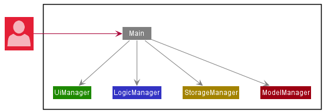
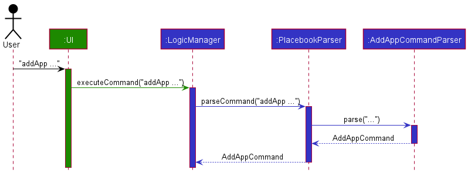
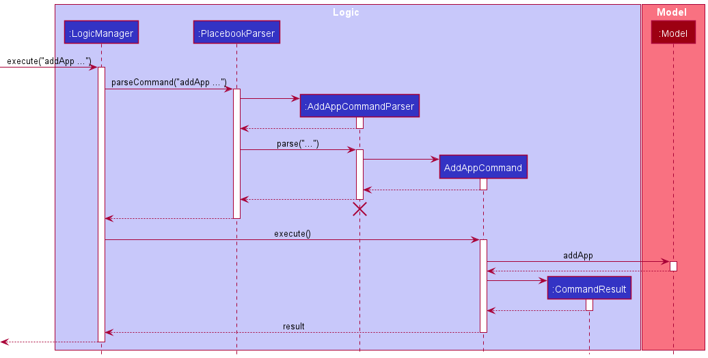

* Table of Contents
{:toc}

--------------------------------------------------------------------------------------------------------------------

## **Acknowledgements**

* {list here sources of all reused/adapted ideas, code, documentation, and third-party libraries -- include links to the original source as well}

--------------------------------------------------------------------------------------------------------------------

## **Setting up, getting started**

Refer to the guide [_Setting up and getting started_](SettingUp.md).

--------------------------------------------------------------------------------------------------------------------

## **Design**

:bulb: **Tip:** The `.puml` files used to create diagrams in this document can be found in the [diagrams](https://github.com/se-edu/addressbook-level3/tree/master/docs/diagrams/) folder. Refer to the [_PlantUML Tutorial_ at se-edu/guides](https://se-education.org/guides/tutorials/plantUml.html) to learn how to create and edit diagrams.

### Architecture

The ***Architecture Diagram*** given above explains the high-level design of the App.

Given below is a quick overview of main components and how they interact with each other.

**Main components of the architecture**

**`Main`** has two classes called [`Main`](https://github.com/se-edu/addressbook-level3/tree/master/src/main/java/seedu/address/Main.java) and [`MainApp`](https://github.com/se-edu/addressbook-level3/tree/master/src/main/java/seedu/address/MainApp.java). It is responsible for,
* At app launch: Initializes the components in the correct sequence, and connects them up with each other.
* At shut down: Shuts down the components and invokes cleanup methods where necessary.

[**`Commons`**](#common-classes) represents a collection of classes used by multiple other components.

The rest of the App consists of four components.

* [**`UI`**](#ui-component): The UI of the App.
* [**`Logic`**](#logic-component): The command executor.
* [**`Model`**](#model-component): Holds the data of the App in memory.
* [**`Storage`**](#storage-component): Reads data from, and writes data to, the hard disk.

**How the architecture components interact with each other**

The *Sequence Diagram* below shows how the components interact with each other for the scenario where the user issues the command `delete 1`.

Each of the four main components (also shown in the diagram above),

* defines its *API* in an `interface` with the same name as the Component.
* implements its functionality using a concrete `{Component Name}Manager` class (which follows the corresponding API `interface` mentioned in the previous point.

For example, the `Logic` component defines its API in the `Logic.java` interface and implements its functionality using the `LogicManager.java` class which follows the `Logic` interface. Other components interact with a given component through its interface rather than the concrete class (reason: to prevent outside component's being coupled to the implementation of a component), as illustrated in the (partial) class diagram below.

The sections below give more details of each component.

### UI component

The **API** of this component is specified in [`Ui.java`](https://github.com/se-edu/addressbook-level3/tree/master/src/main/java/seedu/address/ui/Ui.java)

The UI consists of a `MainWindow` that is made up of parts e.g.`CommandBox`, `ResultDisplay`, `PersonListPanel`, `StatusBarFooter` etc. All these, including the `MainWindow`, inherit from the abstract `UiPart` class which captures the commonalities between classes that represent parts of the visible GUI.

The `UI` component uses the JavaFx UI framework. The layout of these UI parts are defined in matching `.fxml` files that are in the `src/main/resources/view` folder. For example, the layout of the [`MainWindow`](https://github.com/se-edu/addressbook-level3/tree/master/src/main/java/seedu/address/ui/MainWindow.java) is specified in [`MainWindow.fxml`](https://github.com/se-edu/addressbook-level3/tree/master/src/main/resources/view/MainWindow.fxml)

The `UI` component,

* executes user commands using the `Logic` component.
* listens for changes to `Model` data so that the UI can be updated with the modified data.
* keeps a reference to the `Logic` component, because the `UI` relies on the `Logic` to execute commands.
* depends on some classes in the `Model` component, as it displays `Person` object residing in the `Model`.

### Logic component

**API** : [`Logic.java`](https://github.com/se-edu/addressbook-level3/tree/master/src/main/java/seedu/address/logic/Logic.java)

Here's a (partial) class diagram of the `Logic` component:

How the `Logic` component works:
1. When `Logic` is called upon to execute a command, it uses the `AddressBookParser` class to parse the user command.
1. This results in a `Command` object (more precisely, an object of one of its subclasses e.g., `AddCommand`) which is executed by the `LogicManager`.
1. The command can communicate with the `Model` when it is executed (e.g. to add a person).
1. The result of the command execution is encapsulated as a `CommandResult` object which is returned back from `Logic`.

The Sequence Diagram below illustrates the interactions within the `Logic` component for the `execute("delete 1")` API call.

:information_source: **Note:** The lifeline for `DeleteCommandParser` should end at the destroy marker (X) but due to a limitation of PlantUML, the lifeline reaches the end of diagram.

Here are the other classes in `Logic` (omitted from the class diagram above) that are used for parsing a user command:

How the parsing works:
* When called upon to parse a user command, the `AddressBookParser` class creates an `XYZCommandParser` (`XYZ` is a placeholder for the specific command name e.g., `AddCommandParser`) which uses the other classes shown above to parse the user command and create a `XYZCommand` object (e.g., `AddCommand`) which the `AddressBookParser` returns back as a `Command` object.
* All `XYZCommandParser` classes (e.g., `AddCommandParser`, `DeleteCommandParser`, ...) inherit from the `Parser` interface so that they can be treated similarly where possible e.g, during testing.

### Model component
**API** : [`Model.java`](https://github.com/se-edu/addressbook-level3/tree/master/src/main/java/seedu/address/model/Model.java)

The `Model` component,

* stores the contact data i.e., all `Person` objects (which are contained in a `UniquePersonList` object).
* stores the currently 'selected' `Person` objects (e.g., results of a search query) as a separate _filtered_ list which is exposed to outsiders as an unmodifiable `ObservableList<Person>` that can be 'observed' e.g. the UI can be bound to this list so that the UI automatically updates when the data in the list change.
* stores a `UserPref` object that represents the user’s preferences. This is exposed to the outside as a `ReadOnlyUserPref` objects.
* stores appointment data in `Appointment` objects (which contain `UniquePersonList` for clients, `Address` for location, `TimePeriod` for time period during which the appointment occurs, `String` for description)
* stores the schedule data i.e., all `Appointment` objects.
* does not depend on any of the other three components (as the `Model` represents data entities of the domain, they should make sense on their own without depending on other components)

:information_source: **Note:** An alternative (arguably, a more OOP) model is given below. It has a `Tag` list in the `AddressBook`, which `Person` references. This allows `AddressBook` to only require one `Tag` object per unique tag, instead of each `Person` needing their own `Tag` objects. 

### Storage component

**API** : [`Storage.java`](https://github.com/se-edu/addressbook-level3/tree/master/src/main/java/seedu/address/storage/Storage.java)

The `Storage` component,
* can save address book data, schedule data and user preference data in json format, and read them back into corresponding objects.
* inherits from both `AddressBookStorage`, `ScheduleStorage` and `UserPrefStorage`, which means it can be treated as any (if only the functionality of only one is needed).
* depends on some classes in the `Model` component (because the `Storage` component's job is to save/retrieve objects that belong to the `Model`)

### Common classes

Classes used by multiple components are in the `seedu.placebook.commons` package.

--------------------------------------------------------------------------------------------------------------------

## **Implementation**

This section describes some noteworthy details on how certain features are implemented.

### TimePeriod Class

#### Implementation

The feature is a variable contained within the `Appointment` class. `TimePeriod` tracks the start and end time
of the Appointment and contains functions to check if two appointments have clashing TimePeriods and thus
cannot both happen. Each `Appointment` class has a `TimePeriod` class, which represents the time period during 
which this appointment occurs. The `TimePeriod` class provides a function to check whether a time period overlaps
with another time period. `TimePeriod` is also used to calculate the urgency of the appointment, assigning the
appointment either `High`, `Medium` or `Low` urgency.

### Undo feature

The undo feature allows the users to undo the previous command and go back to the state before executing that command.

#### Implementation

To implement the undo feature, we need to record the status of PlaceBook after executing a certain command,
so that we can restore PlaceBook to its previous status by using that piece of recorded information.

We use a `State` to describe the status of PlaceBook at a certain time. 
The `State` contains a `Contacts`, a `Schedule`, a `Predicate<Person>`, a `Predicate<Appointment>` and a `command word`. 
After every execution of the normal commands,
we create a new `State` instance to record the status of PlaceBook after executing that command.
This `State` instance is like a snapshot of the PlaceBook at a certain moment.

In order to manage the different states, we have a `HistoryStates` class which has a data structure inside to store all the `State`. Stack and linked list are
ususlly used to store the history states. In PlaceBook, we use a linked list in `HistoryStates`.
After the execution of a normal command, a new `State` instance is created, and then we add this new `State` to the end of the linked list in `HistoryStates`.
When an `undo` command is encountered, we simply remove the last node of the linked list, so the current state pointer points to the previous node.
When there are no more nodes in the linked list except the initial state, the `undo` command cannot be executed and the `HistoryStates` will thrown a `NoHistoryStates` exception.

### AddApp feature

#### Implementation
The feature allows users to create an appointment with any number of clients (`Person`), 
along with a location (`Address`), a time period (`timePeriod`) and a description (`String`).
The addApp mechanism is facilitated by `Schedule`.

`Schedule` contains an Observable List of `Appointment` that we can add appointments to. These appointments will be
generated from the inputs entered by the user using the `AddAppCommand`

Given below is an example usage scenario and how the addApp mechanism behaves at each step.

Step 1. The user launches the application. Placebook will be initialized with a `LogicManager`, a `StorageManage`, a `UiManager`
and a `ModelManager`. `StorageManager` contains an `AddressBookStorage` an a `ScheduleStorage` which manages
the specific saved data. `StorageManager` will attempt to read data from a saved json file and loads the 
data into `ModelManager` when the class is initialized

Step 2. The user inputs the addApp command with `addApp id/1,2,3 a/Starbucks @ Raffles City start/01-01-2021 1400 end/01-01-2021 1500 ds/discuss marketing strategies`
The `logicManager`, which has been initialized with an `AddressBookParser`, will use that class to create and return an `addAppCommand` with the appropriate inputs to be executed by `LogicManger`

Step 3. On the execution of the command, the command will retrieve the list of persons and appointments from
`ModelManager` and create a new `UniquePersonList`. The new `UniquePersonList` will then be populated with the
appropriate client or clients retrieved from the list of persons according to the input index or indexes.
A new Appointment will then be created and added to the `ModelManager`. It is at this stage the input will
be checked to ensure that there are no duplicates or clashes with other appointments.

##INSERT UML HERE

Step 4. After execution, the CommandResult is passed upwards to the UI so that it can return a status message
and update the display to match the updated model

##@Yanyu im not 100% sure how the UI interacts with the overall model, if you see any issues could you help me correct them?

The following sequence diagram shows how the addAppCommand operation works:

####Design considerations
* **Alternative 1 (current choice):** User selects `Person` in `Appointment` through indexes of the displayed list.
    * Pros: Easy to implement, every `Person` in the displayed list will have a unique index.
    * Cons: As the user filters the displayed list, the indexes may change and be re-ordered, causing some confusion to the user.
* **Alternative 2:** User selects `Person` in `Appointment` through the name field in `Person`
    * Pros: The user will have greater confidence that they are adding the correct person.
    * Cons: Longer command lines, especially if multiple `Person` added to the same `Appointment`. One spelling mistake in the name will cause an error. There the possibility that there are multiple `Person` with the same name.

### Filter & Sort Feature

#### Implementation

##### Filtering
The feature allows users to filter using `findApp` . The input of the command will be passed down through the parser into 
the findAppCommand as a `DescriptionContainsKeywordsPredicate`, where on execution, this predicate is passed
into the initialized `ModelManager` filters the list of Appointments by setting this predicate in a 
FilteredList of Appointments, updating it to be displayed by the UI.

##### Sorting
The feature allows sort using one of two metrics, time of appointment or description, and return to the original list.
Using `listApp Time` or `listApp Description` will sort the list, and `listApp` will return the list of appointments to
its original display. This is also done through the `ModelManager`. The parser will first determine what type of `listApp`
is being input by the user, before passing it into `listAppCommand`. On execution, `listAppComand` will call `ModelManager`
functions to sort the list according to input and update the displayed list to be displayed by the UI

### Delete feature

#### Implementation

The delete feature deletes a person from the storage by specifying an index shown on the display list.

####Design considerations
* This will likely be break the current data relations as those appointments that refer to this person will
no longer be able to query information about this person.
* Thus, we either:  
    1. implement a soft delete, which marks the data as 'deleted', so it will not be shown on the person list and keep 
    showing information about the person in the related appointment.
    2. remove the person from related appointments and delete the appointment if it has no more related client
* We chose the second one, and gives a warning message to user when they try to delete. As we think that, it makes 
little sense in this case to keep the person related to appointments show up event after they deletes the person. Moreover,
  it makes the code harder to maintain, as we will need to consider whether the person is mark as deleted for every other 
  query.

### \[Proposed\] Undo/redo feature

#### Proposed Implementation

The proposed undo/redo mechanism is facilitated by `VersionedAddressBook`. It extends `AddressBook` with an undo/redo history, stored internally as an `addressBookStateList` and `currentStatePointer`. Additionally, it implements the following operations:

* `VersionedAddressBook#commit()` — Saves the current address book state in its history.
* `VersionedAddressBook#undo()` — Restores the previous address book state from its history.
* `VersionedAddressBook#redo()` — Restores a previously undone address book state from its history.

These operations are exposed in the `Model` interface as `Model#commitAddressBook()`, `Model#undoAddressBook()` and `Model#redoAddressBook()` respectively.

Given below is an example usage scenario and how the undo/redo mechanism behaves at each step.

Step 1. The user launches the application for the first time. The `VersionedAddressBook` will be initialized with the initial address book state, and the `currentStatePointer` pointing to that single address book state.

Step 2. The user executes `delete 5` command to delete the 5th person in the address book. The `delete` command calls `Model#commitAddressBook()`, causing the modified state of the address book after the `delete 5` command executes to be saved in the `addressBookStateList`, and the `currentStatePointer` is shifted to the newly inserted address book state.

Step 3. The user executes `add n/David …​` to add a new person. The `add` command also calls `Model#commitAddressBook()`, causing another modified address book state to be saved into the `addressBookStateList`.

:information_source: **Note:** If a command fails its execution, it will not call `Model#commitAddressBook()`, so the address book state will not be saved into the `addressBookStateList`.

Step 4. The user now decides that adding the person was a mistake, and decides to undo that action by executing the `undo` command. The `undo` command will call `Model#undoAddressBook()`, which will shift the `currentStatePointer` once to the left, pointing it to the previous address book state, and restores the address book to that state.

:information_source: **Note:** If the `currentStatePointer` is at index 0, pointing to the initial AddressBook state, then there are no previous AddressBook states to restore. The `undo` command uses `Model#canUndoAddressBook()` to check if this is the case. If so, it will return an error to the user rather
than attempting to perform the undo.

The following sequence diagram shows how the undo operation works:

:information_source: **Note:** The lifeline for `UndoCommand` should end at the destroy marker (X) but due to a limitation of PlantUML, the lifeline reaches the end of diagram.

The `redo` command does the opposite — it calls `Model#redoAddressBook()`, which shifts the `currentStatePointer` once to the right, pointing to the previously undone state, and restores the address book to that state.

:information_source: **Note:** If the `currentStatePointer` is at index `addressBookStateList.size() - 1`, pointing to the latest address book state, then there are no undone AddressBook states to restore. The `redo` command uses `Model#canRedoAddressBook()` to check if this is the case. If so, it will return an error to the user rather than attempting to perform the redo.

Step 5. The user then decides to execute the command `list`. Commands that do not modify the address book, such as `list`, will usually not call `Model#commitAddressBook()`, `Model#undoAddressBook()` or `Model#redoAddressBook()`. Thus, the `addressBookStateList` remains unchanged.

Step 6. The user executes `clear`, which calls `Model#commitAddressBook()`. Since the `currentStatePointer` is not pointing at the end of the `addressBookStateList`, all address book states after the `currentStatePointer` will be purged. Reason: It no longer makes sense to redo the `add n/David …​` command. This is the behavior that most modern desktop applications follow.

The following activity diagram summarizes what happens when a user executes a new command:

#### Design considerations:

**Aspect: How undo & redo executes:**

* **Alternative 1 (current choice):** Saves the entire address book.
  * Pros: Easy to implement.
  * Cons: May have performance issues in terms of memory usage.

* **Alternative 2:** Individual command knows how to undo/redo by
  itself.
  * Pros: Will use less memory (e.g. for `delete`, just save the person being deleted).
  * Cons: We must ensure that the implementation of each individual command are correct.

_{more aspects and alternatives to be added}_

### \[Proposed\] Data archiving

_{Explain here how the data archiving feature will be implemented}_

--------------------------------------------------------------------------------------------------------------------

## **Documentation, logging, testing, configuration, dev-ops**

* [Documentation guide](Documentation.md)
* [Testing guide](Testing.md)
* [Logging guide](Logging.md)
* [Configuration guide](Configuration.md)
* [DevOps guide](DevOps.md)

--------------------------------------------------------------------------------------------------------------------

## **Appendix: Requirements**

### Product scope

**Target user profile**:

* Marketing Professional
* Meets many people everyday
* Have to send a lot of emails
* has a need to manage a significant number of contacts
* prefer desktop apps over other types
* can type fast
* prefers typing to mouse interactions
* is reasonably comfortable using CLI apps

**Value proposition**: 
Our product aims to ease the process of adding many addresses every day, 
help to create template emails from the addresses and generate emails in batches for a target group of people. 
The product also keeps track of appointments and in the future, we look to potentially link to gmail.

### User stories

Priorities: High (must have) - `* * *`, Medium (nice to have) - `* *`, Low (unlikely to have) - `*`

| Priority | As a …​                                    | I want to …​                     | So that I can…​                                                        |
| -------- | ------------------------------------------ | ------------------------------ | ---------------------------------------------------------------------- |
| `* * *`  | new user                                   | see usage instructions         | refer to instructions when I forget how to use the App                 |
| `* * *`  | user                                       | add a new person               |                                                                        |
| `* * *`  | user                                       | delete a person                | remove entries that I no longer need                                   |
| `* * *`  | user                                       | find a person by name          | locate details of persons without having to go through the entire list |
| `* * *`  | marketeer                                  | add appointments with clients  |                                                                        |
| `* * *`  | marketeer                                  | delete appointments            | remove cancelled/finished appointments                                 |
| `* * *`  | new user                                   | view some example contacts     | have an idea of what contact info will look like                       |
| `*`      | user with many persons in the address book | sort persons by name           | locate a person easily                                                 |
| `* *`   | marketeer		                            | list appointments with clients  | view and plan my week and meet clients in a timely manner             |
| `* *`   | user		                                | view my list of contacts	      | see who is already inside and contact clients that are forgotten      |

*{More to be added}*

### Use cases

(For all use cases below, the **System** is the `PlaceBook(PB)` and the **Actor** is the `user`, unless specified otherwise)

**Use case: UC01 - Add a person**

**MSS**

1. User requests to add a new person.
2. PB adds the person.
3. PB displays success message and shows the updated list of persons.

Use case ends.

**Extensions**

* 1a. The command format is invalid.

    * 1a1. PB displays an error message, and gives an example of the correct format.
    
      Use case resumes on step 1.
      
* 1b. The input parameters are invalid.
    
    * 1b1. PB displays an error message, informing user what the valid input format should be.
    
      Use case resumes on step 1.
      
**Use case: UC02 - List all persons**

**MSS**

1. User requests to list all persons.
2. PB shows the list of persons.

**Extensions**

* 1a. The list is empty.

    * 2a1. PB informs the user that the list is empty.
    
      Use case ends. 

**Use case: UC03 - Edit a person**

**MSS**

1. User <ins>requests to list persons(UC02).<ins/>
2. User requests to edit a specific person in the list.
3. PB edits the person.
4. PB displays success message and shows updated list of persons.

**Extensions**

* 2a. The command format is invalid.
    
    * 2a1. PB displays an error message, and gives an example of the correct format.
    
      Use case resumes at step 2.
   
* 2b. The input parameters are invalid.

    * 2b1. PB displays an error message, informing user what the valid input format should be.
      
      Use case resumes at step 2.

**Use case: UC04 - Delete a person**

**MSS**

1. User <ins>requests to list persons(UC02).<ins/>
2. User requests to delete a specific person in the list.
3. PB displays a pop up window with asking for user confirmation to delete.
4. User confirms they want to delete.
5. PB deletes the person.
6. PB displays success message and shows updated list of persons.

    Use case ends.

**Extensions**

* 2a. The given index is invalid.

    * 2a1. PB displays an error message.

      Use case resumes at step 2.
      
* 4a. User indicates that they do not want to delete.
    
    Use case ends.

**Use case: UC05 - Find persons by name**

**MSS**

1.  User inputs the find command with keywords to search for.
2.  PB shows a list of persons whose names match the given keywords.

    Use case ends.

**Extensions**

* 1a. PB cannot find any matching Person.
    
    * PB displays an empty list.
        
      Use case ends.

**Use case: UC06 - Find persons by tags**

**MSS**

1. User inputs the find tags command with keywords to search for.
2. PB shows a list of persons whose tags match the given keywords.

    Use case ends.
    
**Extensions**

* 1a. PB cannot find any matching tags with any Person.

    * PB displays an empty list.
    
      Use case ends.
    
**Use case: UC07 - Add appointment**

**MSS**

1. User enters add appointment command specifying the index or indexes of persons, address, start and end datetimes and description of the appointment.
2. PB adds the appointment.
3. PB displays success message and shows the updated list of appointments.

    Use case ends.

**Extensions**

* 1a. PB detects an error in command format.
    * 1a1. PB displays an error message, showing an example of the correct format.
    
	  Use case resumes at step 1.
	
* 1b. PB detects an error in input format.
    
    * 1b1. PB displays an error message, informing user what the valid input format should be.
	
* 1c. PB does not have the specified person in the contact list.
	    
	 * 1c1. PB informs the user that the person does not exist.
        
       Use case ends.
        
* 1d. PB detects a collision in the time period of appointment to be added with previously added appointments.
    
    * 1d1. PB informs the user that there is a clash.
    
      Use case ends.

**Use case: UC08 - List appointments**

**MSS**

1. User enters the list appointments command.
2. PB displays a list of all currently added appointments.

Use case ends.

**Extensions**

* 1a. PB detects that there are no appointments added.
    * 1a1. PB informs the user that there are no appointments added yet.
	
      Use case ends.
    
**Use case: UC09 - List appointments by Time**

**MSS**

1. User requests to list the appointments sorted by time.
2. PB displays a list of all currently added appointments sorted by time.

**Extensions**

* 1a. PB detects that there are no appointments added.
    * 1a1. PB informs the user that there are no appointments added yet.

      Use case ends.

**Use case: UC10 - List appointments by Description**

**MSS**

1. User requests to list the appointments sorted by description.
2. PB displays a list of all currently added appointments sorted by description.

**Extensions**

* 1a. PB detects that there are no appointments added.
    * 1a1. PB informs the user that there are no appointments added yet.

      Use case ends.

**Use case: UC11 - Delete appointment**

**MSS**

1. User <ins>requests to list appointments (UC08)<ins/>.
2. User enters delete appointment command indicating the index of the appointment to be deleted.
3. PB displays a pop up window with asking for user confirmation to delete.
4. User confirms they want to delete.
5. PB deletes the appointment and displays a successful message. 

Use case ends.

**Extensions**

* 2a. PB detects that the inputted index is out of range.
    * 2a1. PB informs the user that the index is out of range.
	 
	 Use case resumes at step 2.
	 
* 4a. User indicates that they do not want to delete.
    
    Use case ends.
		
**Use case: UC12 - Edit an appointment**

**MSS**

1. User <ins>requests to list appointments(UC08).<ins/>
2. User requests to edit a specific appointment in the list.
3. PB edits the appointment.
4. PB displays success message and shows updated list of appointments.

    Use case ends.
    
**Extensions**

* 2a. The command format is invalid.
    
    * 2a1. PB shows an error message, and gives an example of the correct format.
    
      Use case resumes at step 2.
   
* 2b. The input parameters are invalid.

    * 2b1. PB shows an error message, informing user what the valid input format should be.
      
      Use case resumes at step 2.

**Use case: UC13 - Find Appointment by description**

**MSS**

1.  User inputs the find command with keywords to search for.
2.  PB shows a list of persons whose names match the given keywords.

    Use case ends.

**Extensions**

* 2a. PB cannot find any matching Person.

    * PB displays an empty list.

      Use case ends.
		
*{More to be added}*

### Non-Functional Requirements

1.  Should work on any _mainstream OS_ as long as it has Java `11` or above installed.
2.  Should be able to hold up to 1000 persons without a noticeable sluggishness in performance for typical usage.
3.  A user with above average typing speed for regular English text (i.e. not code, not system admin commands) should be able to accomplish most of the tasks faster using commands than using the mouse.
4.  The system is not required to handle sending emails to contacts.
5.  Users can see previously written commands in the same session.

*{More to be added}*

### Glossary

* **Mainstream OS**: Windows, Linux, Unix, OS-X

### Commands

`GeneralCommands`
* `ClearCommand`
* `ExitCommand`
* `HelpCommand`

`PersonCommands`
* `AddCommand`
* `DeleteCommand`
* `EditCommand`
* `FindCommand`
* `FindTagsCommand`
* `ListCommand`

`AppointmentCommands`
* `AddAppCommand`
* `DelAppCommand`
* `EditAppCommand`
* `FindAppCommand`
* `ListAppCommand`

--------------------------------------------------------------------------------------------------------------------

## **Appendix: Instructions for manual testing**

Given below are instructions to test the app manually.

:information_source: **Note:** These instructions only provide a starting point for testers to work on;
testers are expected to do more *exploratory* testing.

### Launch and shutdown

1. Initial launch

   1. Download the jar file and copy into an empty folder

   1. Double-click the jar file Expected: Shows the GUI with a set of sample contacts. The window size may not be optimum.

2. Saving window preferences

   1. Resize the window to an optimum size. Move the window to a different location. Close the window.

   2. Re-launch the app by double-clicking the jar file. 
       Expected: The most recent window size and location is retained.

### Adding a person

1. Adding a person to the list of people
   1. Test case: `add n/Susan p/90090099 e/susan@example.com a/serangoon t/Housewife`  
      Expected: New person Susan is added to the list. Details of the person will be as displayed in the
      UI under the person list, as well as the status message

   2. Test case: `add n/Susan p/90090099 e/susan@example.com a/serangoon t/Housewife` then 
      `add n/Susan p/90090099 e/susan@example.com a/serangoon t/Housewife` again  
      Expected: No person is added. Error details shown in the status message. Status bar remains the same.

   3. Other incorrect add commands to try: `add`, `add Susan`, `add n/Susan` and other incomplete `add` commands.
      Expected: Similar to previous.

### Deleting a person

1. Deleting a person while all persons are being shown

   1. Prerequisites: List all persons using the `list` command. Multiple persons in the list.

   2. Test case: `delete 1` 
      Expected: First contact is deleted from the list. Details of the deleted contact shown in the status message.

   5. Test case: `delete 0` 
      Expected: No person is deleted. Error details shown in the status message. Status bar remains the same.

   6. Other incorrect delete commands to try: `delete`, `delete x`, `...` (where x is larger than the list size) 
      Expected: Similar to previous.

### Adding an Appointment

1. Adding an Appointment to the list of Appointments

   1. Prerequisites: List all persons using the `list` command. At least two people in the list.

   2. Test case: `addApp id/1 a/Starbucks @ Raffles City start/01-01-2021 1400 end/01-01-2021 1500 ds/discuss marketing strategies`  
      Expected: New Appointment discuss marketing strategies is added to the list. Details of the Appointment will be as shown in the
      UI under the Appointment list, and details of the person can be viewed as well. This will also be displayed in the status message.

   3. Test case: `addApp id/1,2 a/Starbucks @ Nex start/01-01-2021 1500 end/01-01-2021 1600 ds/sell product`  
      Expected: New Appointment discuss marketing strategies is added to the list. Details of the Appointment will be as shown in the
      UI under the Appointment list, and details of the two people added can be viewed as well. This will also be displayed in the status message.

   4. Test case: `addApp id/1 a/Starbucks @ Raffles City start/01-01-2021 1400 end/01-01-2021 1500 ds/discuss marketing strategies` then
      `addApp id/2 a/Starbucks @ Raffles City start/01-01-2021 1400 end/01-01-2021 1500 ds/sell product` 
      Expected: No Appointment is added due to clashing time period. Error details shown in the status message. Status bar remains the same.

   5. Other incorrect add commands to try: `addApp`, `addApp Susan`, `addApp n/Susan` and incomplete `addApp` commands.
      Expected: Similar to previous.
   
### Deleting an Appointment

1. Deleting an Appointment while all Appointments are being shown

    1. Prerequisites: List all persons using the `listApp` command. Multiple Appointments in the list.

    2. Test case: `delApp 1` 
       Expected: First Appointment is deleted from the list. Details of the deleted Appointment shown in the status message.

    3. Test case: `delApp 0` 
       Expected: No Appointment is deleted. Error details shown in the status message. Status bar remains the same.

    4. Other incorrect delete commands to try: `delApp`, `delApp x`, `...` (where x is larger than the list size) 
       Expected: Similar to previous.
   
### Editing an Appointment

1. Editing an existing Appointment while all Appointments are being shown

   1. Prerequisites: List all persons using the `listApp` command. Multiple Appointments in the list.

   2. Test case: `editApp 1 a/Earth`  
      Expected: The appointment at index 1 will have its address changed to Earth. Details of the edited Appointment shown in the status message.

   3. Incorrect edit commands to try: `editApp`, `editApp 1`, `editApp x a/address` (where x is larger than the list size)
      `editApp 1 edit` and other incorrect edited inputs  
      Expected: No Appointment is edited. Error details shown in the status message. Status bar remains the same
      
