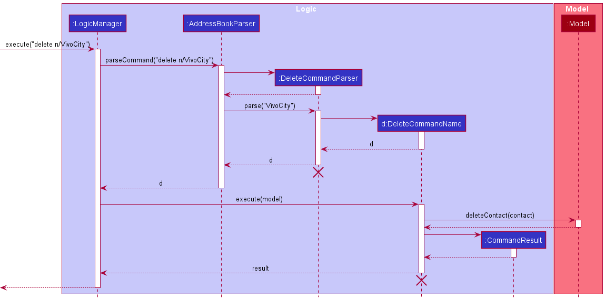
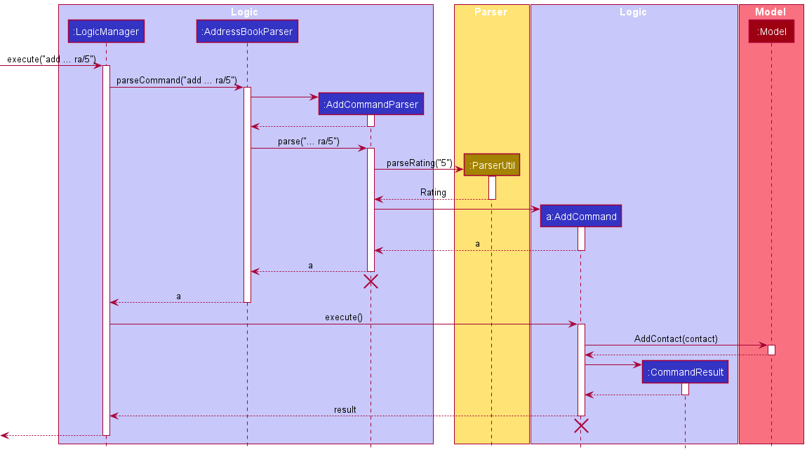
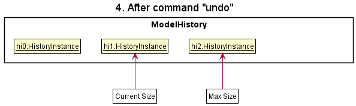
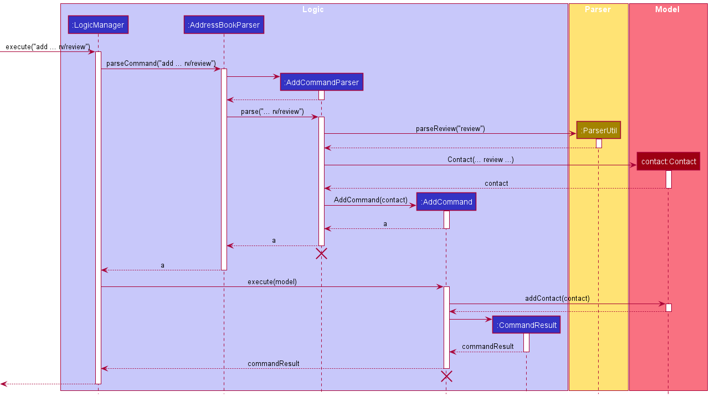
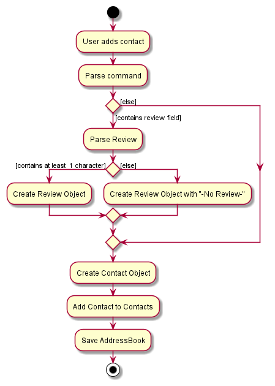
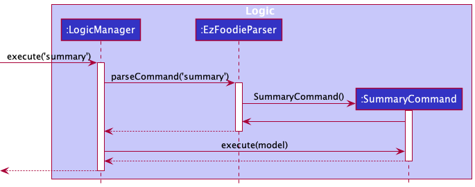
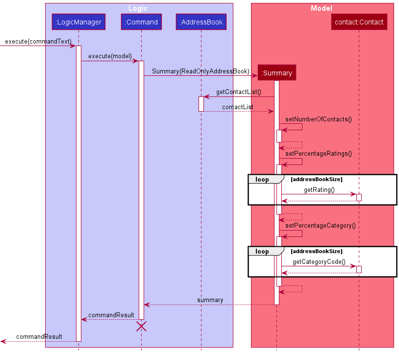
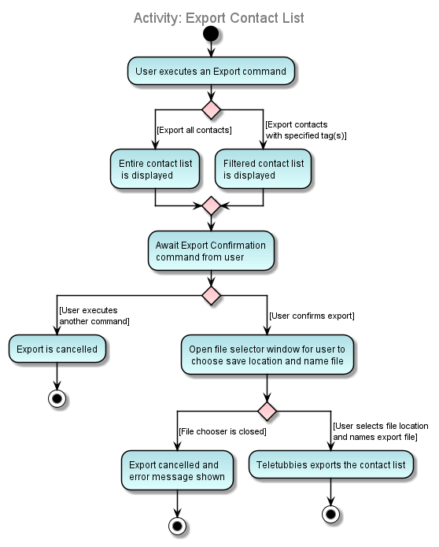

* Table of Contents
{:toc}

--------------------------------------------------------------------------------------------------------------------

## **Acknowledgements**

* This project is based on the AddressBook-Level3 project created by the [SE-EDU initiative](https://se-education.org).

--------------------------------------------------------------------------------------------------------------------

## **Setting up, getting started**

Refer to the guide [_Setting up and getting started_](SettingUp.md).

--------------------------------------------------------------------------------------------------------------------

## **Design**

:bulb: **Tip:** The `.puml` files used to create diagrams in this document can be found in the [diagrams](https://github.com/se-edu/addressbook-level3/tree/master/docs/diagrams/) folder. Refer to the [_PlantUML Tutorial_ at se-edu/guides](https://se-education.org/guides/tutorials/plantUml.html) to learn how to create and edit diagrams.

### Architecture

The ***Architecture Diagram*** given above explains the high-level design of the App.

Given below is a quick overview of main components and how they interact with each other.

**Main components of the architecture**

**`Main`** has two classes called [`Main`](https://github.com/se-edu/addressbook-level3/tree/master/src/main/java/seedu/address/Main.java) and [`MainApp`](https://github.com/se-edu/addressbook-level3/tree/master/src/main/java/seedu/address/MainApp.java). It is responsible for,
* At app launch: Initializes the components in the correct sequence, and connects them up with each other.
* At shut down: Shuts down the components and invokes cleanup methods where necessary.

[**`Commons`**](#common-classes) represents a collection of classes used by multiple other components.

The rest of the App consists of four components.

* [**`UI`**](#ui-component): The UI of the App.
* [**`Logic`**](#logic-component): The command executor.
* [**`Model`**](#model-component): Holds the data of the App in memory.
* [**`Storage`**](#storage-component): Reads data from, and writes data to, the hard disk.

**How the architecture components interact with each other**

The *Sequence Diagram* below shows how the components interact with each other for the scenario where the user issues the command `delete 1`.

Each of the four main components (also shown in the diagram above),

* defines its *API* in an `interface` with the same name as the Component.
* implements its functionality using a concrete `{Component Name}Manager` class (which follows the corresponding API `interface` mentioned in the previous point.

For example, the `Logic` component defines its API in the `Logic.java` interface and implements its functionality using the `LogicManager.java` class which follows the `Logic` interface. Other components interact with a given component through its interface rather than the concrete class (reason: to prevent outside component's being coupled to the implementation of a component), as illustrated in the (partial) class diagram below.

The sections below give more details of each component.

### UI component

The **API** of this component is specified in [`Ui.java`](https://github.com/se-edu/addressbook-level3/tree/master/src/main/java/seedu/address/ui/Ui.java)

The UI consists of a `MainWindow` that is made up of parts e.g.`CommandBox`, `ResultDisplay`, `ContactListPanel`, `StatusBarFooter` etc. All these, including the `MainWindow`, inherit from the abstract `UiPart` class which captures the commonalities between classes that represent parts of the visible GUI.

The `UI` component uses the JavaFx UI framework. The layout of these UI parts are defined in matching `.fxml` files that are in the `src/main/resources/view` folder. For example, the layout of the [`MainWindow`](https://github.com/se-edu/addressbook-level3/tree/master/src/main/java/seedu/address/ui/MainWindow.java) is specified in [`MainWindow.fxml`](https://github.com/se-edu/addressbook-level3/tree/master/src/main/resources/view/MainWindow.fxml)

The `UI` component,

* executes user commands using the `Logic` component.
* listens for changes to `Model` data so that the UI can be updated with the modified data.
* keeps a reference to the `Logic` component, because the `UI` relies on the `Logic` to execute commands.
* depends on some classes in the `Model` component, as it displays `Contact` object residing in the `Model`.

### Logic component

**API** : [`Logic.java`](https://github.com/se-edu/addressbook-level3/tree/master/src/main/java/seedu/address/logic/Logic.java)

Here's a (partial) class diagram of the `Logic` component:

How the `Logic` component works:
1. When `Logic` is called upon to execute a command, it uses the `AddressBookParser` class to parse the user command.
1. This results in a `Command` object (more precisely, an object of one of its subclasses e.g., `AddCommand`) which is executed by the `LogicManager`.
1. The command can communicate with the `Model` when it is executed (e.g. to add a contact).
1. The result of the command execution is encapsulated as a `CommandResult` object which is returned back from `Logic`.

The Sequence Diagram below illustrates the interactions within the `Logic` component for the `execute("delete 1")` API call.

:information_source: **Note:** The lifeline for `DeleteCommandParser` should end at the destroy marker (X) but due to a limitation of PlantUML, the lifeline reaches the end of diagram.

Here are the other classes in `Logic` (omitted from the class diagram above) that are used for parsing a user command:

How the parsing works:
* When called upon to parse a user command, the `AddressBookParser` class creates an `XYZCommandParser` (`XYZ` is a placeholder for the specific command name e.g., `AddCommandParser`) which uses the other classes shown above to parse the user command and create a `XYZCommand` object (e.g., `AddCommand`) which the `AddressBookParser` returns back as a `Command` object.
* All `XYZCommandParser` classes (e.g., `AddCommandParser`, `DeleteCommandParser`, ...) inherit from the `Parser` interface so that they can be treated similarly where possible e.g, during testing.

### Model component
**API** : [`Model.java`](https://github.com/se-edu/addressbook-level3/tree/master/src/main/java/seedu/address/model/Model.java)

The `Model` component,

* stores the address book data i.e., all `Contact` objects (which are contained in a `UniqueContactList` object).
* stores the currently 'selected' `Contact` objects (e.g., results of a search query) as a separate _filtered_ list which is exposed to outsiders as an unmodifiable `ObservableList<Contact>` that can be 'observed' e.g. the UI can be bound to this list so that the UI automatically updates when the data in the list change.
* stores a `UserPref` object that represents the user’s preferences. This is exposed to the outside as a `ReadOnlyUserPref` objects.
* does not depend on any of the other three components (as the `Model` represents data entities of the domain, they should make sense on their own without depending on other components)

:information_source: **Note:** An alternative (arguably, a more OOP) model is given below. It has a `Tag` list in the `AddressBook`, which `Contact` references. This allows `AddressBook` to only require one `Tag` object per unique tag, instead of each `Contact` needing their own `Tag` objects. 

### Storage component

**API** : [`Storage.java`](https://github.com/se-edu/addressbook-level3/tree/master/src/main/java/seedu/address/storage/Storage.java)

The `Storage` component,
* can save both address book data and user preference data in json format, and read them back into corresponding objects.
* inherits from both `AddressBookStorage` and `UserPrefStorage`, which means it can be treated as either one (if only the functionality of only one is needed).
* depends on some classes in the `Model` component (because the `Storage` component's job is to save/retrieve objects that belong to the `Model`)

### Common classes

Classes used by multiple components are in the `seedu.addressbook.commons` package.

--------------------------------------------------------------------------------------------------------------------

## **Implementation**

This section describes some noteworthy details on how certain features are implemented.

### Category feature

#### Implementation
The category feature adds to the attributes of the `Contact` object. Similar to the other fields of the `Contact` object,
it can be added and edited by calling the relevant `add` and `edit` commands by using `c/` prefix.

Additionally, it implements the following operations:
* `isValidCategory()`  — Determines if the input is a valid category
* `stringToCategory()`  — Converts the input into a constant

:information_source: **Note:** The category field is compulsory and requires
one of the available category codes (att, fnb, com, acc, tpt, oth). In the absence or invalidity of the category code,
the contact will not be saved and the user will be prompted to give a valid one.

Given below is an example usage scenario and how category mechanism behaves at each step

Step 1. The user executes the command `filter c/oth` to filter all "others" category contacts in the address book. And
gets a list of all contacts with the category "others".

Step 2. The user executes the command `edit 1 c/att` which changes the category of the 1st contact from "others" to
"attraction".

The following sequence diagram shows how modifying the category field with `edit` works:

The following activity diagram shows what happens when a user executes the `edit` command with category specified

#### Design considerations:

**Aspect: How Category is called by the user:**

* **Alternative 1 (current choice):** Category field is added through `add` or `edit` commands.
  * Pros: Easy to implement
  * Cons: May cause `add` command to be too long

* **Alternative 2:** Exclusive command to add Category field
  * Pros: Reduces the chance of Feature Overload for `add` and `edit` commands
  * Cons: Reduces usability due to the need to remember another command

### Delete Feature

#### Implementation

The Delete feature deletes the specified contact directly from the model, which is reflected on the GUI.
Each Delete operation can either be a deletion based on name or index.
It is implemented with the following operations:

* `DeleteCommandIndex#execute()`
* `DeleteCommandName#execute()`

Given below is an example usage scenario of deleting a contact:

Step 1. The user launches the application. The user executes the command `list` to look at all contacts.

Step 2. The user executes the command `delete 1` to delete the first contact in the List. The `delete` command calls `DeleteCommandParser#parse()`.

Step 3. The `Parser` returns the command result which is then executed by `LogicManager`.

The following sequence diagram shows how the Delete operation works to delete a contact (by Index):

Deleting a contact by name e.g. `delete n/VALID_NAME` results in the Parser returning a different command result:

The only difference between the 2 diagrams is the `DeleteCommand` (Name or Index) called and returned to the `Parser` and `LogicManager`.

#### Design considerations:

**Aspect: How Delete is implemented:**

* **Alternative 1 (current choice):** Delete deletes directly from the AddressBook
    * Pros: Easier to implement
    * Cons: Causes other features, such as undo and redo, to be more memory intensive

* **Alternative 2:** Delete Stashes away the contact (for undoing purposes)
    * Pros: More memory friendly, instead of storing a copy of the entire AddressBook
    * Cons: More complex to implement. Storage of contacts might result in duplicates etc.

### Find feature

#### Implementation

The Find feature works such that it modifies the GUI of the application without modifying any contacts in the list.
It is implemented with the following operation:

* `FindCommand#execute()`  —  Obtains the contacts found to have the specified keyword(s).

The feature makes use of `FindableContainsKeywordsPredicate`, which represents a boolean-valued function that indicates whether there is any _findable_ property of the contacts that contains the keyword(s) given.
The operation `FindableContainsKeywordsPredicate#test` returns a boolean that indicates whether a specific contact has a _findable_ property that matches the keyword(s) provided by Tour Guide.

The aforementioned _findable_ properties of the contacts that are checked are as follows:

* name
* phone
* email
* address
* review

Given below is an example usage scenario and how the Find feature behaves at each step:

Step 1. The user executes the command `list` to look at all contacts.

Step 2. The user executes the command `find bay ...` to find contacts with properties that contain the keywords *bay*, ...
The `find` command calls `FindCommandParser#parse()`.

Step 3. If user command is in the correct format, a `FindCommand` is created with the list of keywords attached to a `FindableContainsKeywordPredicate`.
The `FindCommand` will then be executed. Otherwise, no command is executed and a `ParseException` is thrown.

The following sequence diagram shows how the Find operation works to show the relevant contacts:

The following activity diagram summarises what happens when a Tour Guide executes a new command:

#### Design considerations:

**Aspect: How Find functions:**

* **Alternative 1 (current choice):** Displays contacts with non-full word matches and searches five properties of a contact.
    * Pros: Shows more contacts as a result of half-matches and more fields.
    * Cons: Less targeted search, more time needed to go through the list of matches.

* **Alternative 2:** Displays contacts with full word matches and only searches the name.
    * Pros: More accurate matches assuming Tour Guide searches for exact keywords.
    * Cons: Less likely to find contacts other than the intended one(s) that might be relevant for a themed or location-based tour itinerary.

### Filter feature

#### Implementation

The filter mechanism works by modifying the GUI of the application to display the contacts in that category without making any changes to the actual contacts stored. The filter implementation makes use of the following operations:

* `Model#updateFilteredContactList()` - iterates through the addressBook. If a `Contact` returns true, the `Contact` is added to the `filteredContacts` list.
* `IsFilterablePredicate()` - returns true if a contact’s `CategoryCode`, `Rating` and `Tag` matches the given filter criteria.

Given below is an example usage scenario of the filter mechanism.

Step 1. The user launched the application for the first time. The `filteredContact` List will be initialized with all contacts in the addressBook `UniqueContactList`.

Step 2. The user executes `filter c/att` command to filter all the attraction contacts in the address book. The `Parser` parses the user input and creates a `FilterCommand`.

Step 3. The filter command creates an IsFilterablePredicate instance with the given CategoryCode, Tag and Rating parameters and calls Model#updateFilteredContactList() with the predicate as an argument, causing the filteredContact List to be modified to contain only attraction contacts in the address book.

The following sequence diagram shows how the filter operation works:

The following activity diagram summarizes what happens when a user executes a new valid filter command:

#### Design considerations:

**Aspect: Functionality of Filter feature**

* **Alternative 1 (current choice):** Filters by multiple parameters (`CategoryCode`, `Tag`, and `Rating`).
    * Pros: More flexible usage as users can choose to enter one or more criteria.
    * Cons: Parser and filtering logic implemented may be more complicated as there are more cases to handle (e.g. multiple tags and a rating entered, a category code and a tag entered, etc)

* **Alternative 2:** Only handles filter by one parameter (e.g. `CategoryCode` only).
    * Pros: Easier to implement.
    * Cons: Does not allow user to get more specific filter results.

### View feature

#### Implementation

The view mechanism works by modifying the GUI of the application to display the details of the selected contact in the Display Pane. The view implementation makes use of `Model#getFilteredContactList()` which returns the list of contacts currently displayed to the user.

Given below is an example usage scenario of the view mechanism.

Step 1. The user launched the application for the first time. The `filteredContact` List will be initialized with all contacts in the addressBook `UniqueContactList`.

Step 2. The user executes `view n/Marina Bay Sands` command to display the contact details of Marina Bay Sands. The `Parser` parses user input and creates a `ViewCommandName`.

Step 3. The view command calls the `Model#getFilteredContactList()` and iterates through the list to check for a matching contact Name. If the contact is successfully retrieved, the Display Pane updates with details of Marina Bay Sands.

The following sequence diagram shows how the view operation works:

#### Design considerations:

**Aspect: Functionality of View feature**

* **Alternative 1 (current choice):** Only allow users to view contacts in the currently displayed list.
    * Pros: Easier to implement.
    * Cons: Less flexibility for users as they are limited to contacts in the displayed list. They need to execute `list` to be able to view any contact in the address book.

* **Alternative 2:** Allow users to view any contact in the address book even if it is not shown in the current list.
    * Pros: More flexibility for users.
    * Cons: More difficult to implement. Additionally, it is impossible to view a contact not displayed in the list by index. Hence, `ViewCommandIndex` will be limited to the displayed contacts, while `ViewCommandName` will allow users to view any contact in the address book.

### Sort feature

#### Implementation

The Sort feature modifies the internal contact list stored in the addressbook according to the preference of sorting.  
It is implemented with the following operations:

* `SortCommandName#execute()`  —  Sorts the contacts in the list based on name in lexicographical order, or
* `SortCommandRating#execute()`  —  Sorts the contacts in the list based on rating in descending order

These operations make use of the operation `Model#sortList(String sortBy)`, which calls `AddressBook#sortList(String sortBy)`
to change the order of the contacts in the contact list. In this way, the user's sorting preference is saved.

Given below is an example usage scenario and how the Sort feature behaves at each step:

Step 1. The user executes the command `list` to look at all contacts.

Step 2. The user executes the command `filter c/att` to filter all the attraction contacts in the addressbook.

Step 3. The user executes the command `sort rating` to display the attraction contacts based on rating in descending order.
Since user command is in the correct format, a `SortCommand` is created. Otherwise, no command is executed and a `ParseException` is thrown.

Step 4. The `sort` command calls `Model#sortList()` with the String `"rating"` as an argument,
causing the internal contact list to be sorted accordingly.

The following sequence diagram shows how the Sort operation works to show the relevant contacts:

The following activity diagram summarises what happens when a user executes a new Sort command:

#### Design considerations:

**Aspect: How Sort is implemented:**

* **Alternative 1 (current choice):** Sorts the internal list of the addressbook.
    * Pros: Sorting preference is saved internally, so any command linked to the ordering of the contact list is applicable.
    * Cons: User is not able to display contacts based on recently added contacts once the contact list is sorted.

* **Alternative 2:** Modifies the GUI to display the sorted contacts without making any changes to the actual list saved in the addressbook.
    * Pros: No change to the data saved is required, therefore fewer method calls.
    * Cons: Commands such as `edit INDEX` and `view INDEX` may not work in conjunction with `sort` as the sorting is only implemented in the UI
    instead of the `filteredContacts`, which depends on the internal list of the addressbook.

### Ratings feature

#### Implementation

The Ratings feature is implemented as an additional field in the `Contact` object. Similar to the other fields in the `Contact` object, the `rating` field is implemented with the following two operations:

* `AddCommand#execute()` —  Optionally initialises rating of contact added.
* `EditCommand#execute()` —  Optionally modifies rating of contact added.

:information_source: **Note:** The ratings field is not compulsory. If the `add` command is used without specifying a rating for the new contact, the contact will be 'unrated' and assigned a default value of 0. Similarly, when a contact's rating is cleared using `edit` command, it is also assigned a default value of 0.

Given below is an example usage scenario and how the rating mechanism behaves at each step.

Step 1. The user launches the application. For each contact, the `ContactCard` object is constructed with rating as one of the fields.

Step 2. The user executes `add ... ra/3` to add a new contact. The `add` command calls `ParserUtil#ParseRating()`, creating a `Rating` object if a valid input rating is received.

Step 3. The user executes `edit 1 ... ra/5` to update the 1st contact's rating. The `edit` command calls `ParserUtil#ParseRating()`, creating a `Rating` object if a valid input rating is received.

:information_source: **Note:** If the input rating is invalid (i.e. a non-integer or outside of the range 1 to 5), the parsers use `Rating#isValidRating()` to check if this is the case. If so, it will return an error to the user rather than attempting to perform the modification on rating.

The following sequence diagram shows how ratings are modified using `add` command:

The following activity diagram summarizes what happens when a user executes an `add` command with rating specified:

#### Design considerations:

**Aspect: How user modifies rating field:**

* **Alternative 1 (current choice):** As a field written by `AddCommand` and `EditCommand`.
    * Pros: Easy to implement.
    * Cons: Rating a contact is less straightforward.
      Ratings do not stand out among another features.

* **Alternative 2:** As an individual command `RateCommand`.
    * Pros: Dedicated all-in-one feature for ratings, easy modification.
    * Cons: Duplicates functionality of `AddCommand` and `EditCommand`, not particularly essential.

### Undo/redo feature

#### Implementation

The undo/redo mechanism is facilitated by the `List<ReadOnlyAddressBook>` in Model Manager which stores a version of the address book every time changes are made and `current` which keeps track of the index of the current address book in the list. Additionally, it implements the following operations:

* `Model#commit()` — Saves the current address book state in its history.
* `Model#undo()` — Restores the previous address book state from its history.
* `Model#redo()` — Restores a previously undone address book state from its history.

Given below is an example usage scenario and how the undo/redo mechanism behaves at each step.

Step 1. The user launches the application for the first time. The history list will be initialized with the initial address book state as its only element, and the `current` index set to zero.

Step 2. The user executes `delete 5` command to delete the 5th contact in the address book. The `delete` command calls `Model#commit()`, causing the modified state of the address book after the `delete 5` command executes to be saved in the history List, and `current` is incremented by 1 (to the index of newly inserted address book state).

Step 3. The user executes `add n/Marina Bay Sands …​` to add a new contact. The `add` command also calls `Model#commit()`, causing another modified address book to be saved into the his tory list amd `current` to be incremented by 1.

:information_source: **Note:** If a command fails its execution, it will not call `Model#commit()`, so the address book state will not be saved into the history List.

Step 4. The user now decides that adding the contact was a mistake, and decides to undo that action by executing the `undo` command. The `undo` command will call `Model#undo()`, which will decrement `current` index by one, to the index of the previous address book state, and restores the address book to that state.

:information_source: **Note:** If the `current` index is 0, pointing to the initial AddressBook state, then there are no previous AddressBook states to restore. The `undo` command uses `Model#isUndoable()` to check if this is the case. If so, it will return an error to the user rather
than attempting to perform the undo.

The following sequence diagram shows how the undo operation works:

:information_source: **Note:** The lifeline for `UndoCommand` should end at the destroy marker (X) but due to a limitation of PlantUML, the lifeline reaches the end of diagram.

The `redo` command does the opposite — it calls `Model#redo()`, which increments the `currentStatePointer` by 1 (to the previously undone state), and restores the address book to that state.

:information_source: **Note:** If the `current` index is `history.size() - 1`, pointing to the latest address book state, then there are no undone AddressBook states to restore. The `redo` command uses `Model#isRedoable()` to check if this is the case. If so, it will return an error to the user rather than attempting to perform the redo.

Step 5. The user then decides to execute the command `list`. Commands that do not modify the address book, such as `list`, will usually not call `Model#commit()`, `Model#undo()` or `Model#redo()`. Thus, the history List remains unchanged.

Step 6. The user executes `clear`, which calls `Model#commit()`. Since `current` is not set to the index of the last element in the list, all address book states after the `current` index will be purged.

The following activity diagram summarizes what happens when a user executes a command that changes the data stored in the address book:

#### Design considerations:

**Aspect: How undo & redo executes:**

* **Alternative 1 (current choice):** Saves the entire address book.
  * Pros: Easy to implement.
  * Cons: May have performance issues in terms of memory usage.

* **Alternative 2:** Individual command knows how to undo/redo by
  itself.
  * Pros: Will use less memory (e.g. for `delete`, just save the contact being deleted).
  * Cons: We must ensure that the implementation of each individual command are correct.

### Review Feature

#### Implementation

The review feature builds upon the `Contact` class by adding more functionality to the class. It utilises the `rv/` tag in the `add` command to add a review stored internally as a `Review` object.
It implements the following operations:
* `isValidReview()`  — Determines if the input value is valid.
* `isEmptyReview()`  — Determines if the stored Review is empty (stored as `-No Review-` String).

In addition, numerous classes had to be updated to accommodate the Review feature:
* `AddCommandParser` to parse the new `rv/` tag.
* `ParserUtil` to parse the Review content.
* `EditCommand` and `EditCommandParser` to enable editing of Reviews.

Given below is an example usage scenario of adding a Review:

Step 1. The user adds a new Review using the `add` command e.g. `add n/test e/test@gmail.com p/12344321 a/test c/att rv/test review`.

Step 2. The `add` command calls `ParserUtil#ParseReview()`, creating a `Review` object.

The following sequence diagram gives the overview of the add command with a review:

The following activity diagram shows how the review operation works:

#### Design considerations:

**Aspect: How Review is called by the user:**

* **Alternative 1 (current choice):** Adds a review through the `add` command or `edit` command.
    * Pros: Easier to implement.
    * Cons: Add command or edit command can become very lengthy.

* **Alternative 2:** Separate command for review
    * Pros: Increases modularity by making review an entirely new command.
    * Cons: Too many commands which may confuse the User.

### Summary Feature

#### Implementation

The `Summary` class summarises the contents of the entire `AddressBook`. It utilises the `AddressBook` class to
obtain a read-only copy of `AddressBook` to summarise the data within. It implements the following operations:
* `setNumberOfContacts()`  — Calculates and sets the number of contacts in the addressbook.
* `setPercentageRatings()`  — Calculates and sets the percentage of contacts that have a rating (unrated not included).
* `setNumberCategory()`  — Calculates and sets the number of contacts in each category defined by `CatergoryCode`.
* `getNumberOfContactsGui()`  — Returns the total number of contacts to display on the GUI.
* `getPercentageRatingsGui()`  — Returns the Pie Chart data for the proportions/percentage of `Rating`.
* `getPercentageCategoryGui()`  — Returns the Pie Chart data for the proportions/percentage for `CatergoryCode`.

Additionally, `Summary` will communicate with `UI`, specifically `MainWindow` to display the summarised results.

The following sequence diagram gives an overview of how `Summary` works when the app launches:

`Summary` updates when certain commands are executed:

These commands include:
1. Add
2. Clear
3. Delete
4. Filter
5. Find
6. List
7. Undo
8. Redo
9. Summary

The following sequence diagram shows how `Summary` updates when these commands are executed:

The above sequence diagrams describe how Summary pulls data from `AddressBook` to summarise data.
`Summary` uses `JavaFx chart` to display data, on top of the text.

#### Design considerations:

**Aspect: How Summary summarises data from the internal AddressBook:**

* **Alternative 1 (current choice):** Works on a Read-Only copy of `AddressBook`.
    * Pros: Easier to implement, guaranteed to not edit the internals.
    * Cons: Works directly with a Read-Only copy of `AddressBook`.

* **Alternative 2:** Gets data directly from `Contact`, `Review` etc.
    * Pros: Data is kept directly with the low-level classes and pulled from there.
    * Cons: Extremely complex, especially after user adds, deletes or edits a contact.

### Export Feature

#### Implementation

The Export feature works such that it export the contacts specified into a text file, without modifying any contacts in the list.
It is implemented with the following operation:

* `ExportCommandIndex#execute()`  —  Exports the contacts at the specified index in the current list.
* `ExportCommandAll#execute()`  —  Exports all the contacts in the current list.

The feature makes use of an `ExportStorage` class, which handles the manipulation of the aforementioned exported text file. It is implemented inside the Storage component and is implemented using a singleton design pattern. This class has an `addToStorage` write method which is called by the `exportContact()` method in the read-only `AddressBook` model.

Given below is an example usage scenario and how the Export feature behaves at each step:

Step 1. The user executes the command `list` to look at all contacts.

Step 2. The user executes the command `export 1` to export the contact at index 1 in the list.
The `export` command calls `ExportCommandParser#parse()`.

Step 3. If the index is not out of range for the list (i.e. the list has a contact at index 1), an `ExportCommandIndex` is created by `ExportCommandParser#parse()` instead of an `ExportCommandAll`, as the command has specified a valid index.

Step 4. The `ExportCommandIndex` will then be executed.

The following sequence diagram shows how the Export operation works to export all filtered contacts:

The following activity diagram summarises what happens when a Tour Guide executes a new export command to export a single contact:

#### Design considerations:

**Aspect: How Export retrieves data from the internal AddressBook**

* **Alternative 1 (current choice):** Works on a Read-Only copy of `AddressBook`.
    * Pros: Easier to implement, guaranteed to not edit the internals.
    * Cons: Exposing internal workings of `AddressBook`.

* **Alternative 2:** Gets data directly from `Contact`, `Review` etc.
    * Pros: Data is kept directly with the low-level classes and pulled from there.
    * Cons: Extremely complex, especially after user adds, deletes or edits a contact.

**Aspect: How `ExportCommand` exports a single contact vs. all contacts**

* **Alternative 1 (current choice):** `ExportCommand` is abstracted into `ExportCommandAll` and `ExportCommandIndex` for single export vs. collective export respectively.
    * Pros: Easier to understand, hides the loop of exporting contacts away from the `Parser`, inside the implementation of `ExportCommandAll`.
    * Cons: Creates two additional command classes

* **Alternative 2:** Single `ExportCommand` takes an index as argument and is repeatedly called for exporting all contacts
    * Pros: All export commands are handled in one class.
    * Cons: The one ExportCommandParser will be extremely complex, has to handle parsing as well as recursively calling another `ExportCommand` for each index.
--------------------------------------------------------------------------------------------------------------------

## **Documentation, logging, testing, configuration, dev-ops**

* [Documentation guide](Documentation.md)
* [Testing guide](Testing.md)
* [Logging guide](Logging.md)
* [Configuration guide](Configuration.md)
* [DevOps guide](DevOps.md)

--------------------------------------------------------------------------------------------------------------------

## **Appendix: Requirements**

### Product scope

**Target user profile**:

* tour guides in Singapore
* has a need to manage a significant number of contacts
* has a need to collate and access contacts
* prefer desktop apps over other types
* can type fast
* prefers typing to mouse interactions
* is reasonably comfortable using CLI apps

**Value proposition**: manage contacts faster than a typical mouse/GUI driven app and is able to find the necessary contact details quickly

### User stories

Priorities: High (must have) - `* * *`, Medium (nice to have) - `* *`, Low (unlikely to have) - `*`

| Priority | As a …​                                    | I want to …​                     | So that I can…​                                                        |
| -------- | ------------------------------------------ | ------------------------------ | ---------------------------------------------------------------------- |
|`***`|Tour Guide|Add contacts to my list|build a list of all my contacts|
|`***`|Tour Guide|Add contact details such as address, phone number, and contact description to my list|store the relevant information of a contact in one place.|
|`***`|Tour Guide|Delete contacts from my list|remove irrelevant or unwanted details|
|`***`|Tour Guide|View all the contacts in my list |find contacts whose names I have forgotten|
|`***`|Organized|Label contacts with category|Access information more efficiently|
|`***`|Visual|View my contacts on a GUI|Have a more user-friendly experience|
|`***`|Forgetful|Scroll through my list manually|Find contacts that I may have forgotten the names of|
|`**`|Tour Guide|Edit contact details|ensure that my contacts are up to date|
|`**`|Busy |Find a specific contact by keyword|Easily sieve through a large database of contacts|
|`**`|Busy|Filter contacts|Retrieve relevant information based on a criteria|
|`**`|Creative|Add customised tags to contacts|Describe contacts simply and make them easy to find|
|`**`|Objective|Rate contacts (1 to 5 stars)|Refer to them during itinerary planning|
|`**`|New|Access a help page|Remind myself / learn how to use the app|
|`*`|Busy|See the overview of my current data upon start up|Quick summary of my data at a glance|
|`*`|Experienced|Add reviews to contacts|Recommend services based on reviews|
|`*`|Tour Guide|Sort my contacts by name or by rating|Organise a long list of contacts|
|`*`|Seasoned tour guide|Be alerted of duplicate contacts |prevent repetition and disorganised information|
|`*`|Confused|Have sample data shown to me|Have a rough idea of what the app has to offer|
|`*`|Helpful|Share my data with other parties (through a .txt file)|Utilise WhereTourGo on the go|
|`*`|Tech-savvy|Transfer my contact information conveniently|Facilitate change of devices|

### Use cases

(For all use cases below, the **System** is `WhereTourGo` and the **Actor** is the `User`, unless specified otherwise)

**UC01 - Add a Contact**
**UC02 - Edit a Contact**
**UC03 - Delete a Contact**
**UC04 - List all Contacts**
**UC05 - Find a Contact**
**UC06 - Filter for Contacts**
**UC07 - Sort all Contacts**
**UC08 - Summarize all Contacts**
**UC09 - View a Contact**
**UC10 - Navigate Input History**
**UC11 - Undo an Operation**
**UC12 - Redo an Operation**
**UC13 - Export a Contact by Index**
**UC14 - Export all Contacts in Filtered List**
**UC15 - Clear all Contacts**
**UC16 - Exit the App**
**UC17 - View Help Page**
**UC18 - Display Commands**

**UC01 - Add a Contact**

**MSS**

1. User decides to add a contact.

2. User inputs the add command to the interface.

3. WhereTourGo informs the user that the contact was added.

4. WhereTourGo displays updated list of contacts and summary page.
Use case ends.

**Extensions**
* 2a. The format is wrong.

  * 2a1. WhereTourGo shows an error message.
  
     Use case ends.

* 2b.  Contact already exists in WhereTourGo.

  * 2b1. WhereTourGo shows an error message.

     Use case ends.

**UC02 - Edit a Contact**

**MSS**

1. User decides to edit a contact.

2. User inputs the edit command to the interface.

3. WhereTourGo informs the user that the contact was edited.

4. WhereTourGo displays updated list of contacts and summary page.
   Use case ends.

**Extensions**
* 2a. The format is wrong.

  * 2a1. WhereTourGo shows an error message.

    Use case ends.

* 2b. Contact already exists in WhereTourGo.

  * 2b1. WhereTourGo shows an error message.

     Use case ends.

**UC03 - Delete a Contact**

***Preconditions: User has <u>listed all contacts UC02 etc.</u>***

**MSS**

1. User requests to delete a specific contact in the list.

2. WhereTourGo deletes the contact.

    Use case ends.

**Extensions**

* 1a. The given index is invalid.

  * 1a1. WhereTourGo shows an error message, and instructions on how to use the command.

    Use case ends.

* 1b. The given name is invalid.

  * 1b1. WhereTourGo shows an error message, and instructions on how to use the command.

    Use case ends.

* 1c. The command format is invalid.

  * 1c1. WhereTourGo shows an error message, and instructions on how to use the command.

    Use case ends.

**UC04 - List all Contacts**

**MSS**

1. User requests to list all contacts.

2. WhereTourGo shows a list of contacts.

   Use case ends.

**Extensions**

* 2a. The list is empty.

  Use case ends.

**UC05 - Find a Contact**

**MSS**

1. User requests to find a contact.

2. User enters the find command with specific keywords. 

3. WhereTourGo displays a list of all contacts with the given keywords.

    Use case ends.

**Extensions**

* 2a. The keywords cannot be found. AddressBook displays no contacts.

    Use case ends.

* 2b. No keywords are provided.

  * 2b1. WhereTourGo shows an error message.

    Use case resumes at step 1.

* 2c. The list is empty.
    
  Use case ends.

**UC06 - Filter for Contacts**

**UC07 - Sort all Contacts**

**MSS**

1. User requests to sort the contacts.

2. User enters the sort command.

3. WhereTourGo displays a list of sorted contacts.

    Use case ends.

**Extensions**

* 2a. The given sort command is in invalid format.

  * 2a1. WhereTourGo shows an error message.

    Use case resumes at step 1.

* 3a. The list is empty.
   
  Use case ends.

**UC08 - Summarising Contacts**

**MSS**

1. User requests to view the summary of the WhereTourGo.

2. WhereTourGo returns the summary on the GUI.

    Use case ends.

**Extensions**

* 1a. The command format is wrong (e.g. `sum 1`).

  * 1a1. WhereTourGo shows an error message, and instructions on how to use the command.

    Use case ends.

* 2a. WhereTourGo is empty.

  * 2a1. WhereTourGo will not display chart data and show total contacts as 0.

    Use case ends.

**UC09 - View a Contact**

**UC10 - Navigate Input History**

**MSS**
1. User request for a previously entered command.

2. WhereTourGo retrieves the command and displays it in the command box.

    Use case ends.

**Extensions**

* 1a. There is no previously entered command.

  * 1a1. The command is reset to the current command's original form.

    Use case ends.

**UC11 - Undo an Operation**

**UC12 - Redo an Operation**

**UC13 - Export a Contact by Index**

***Preconditions: User has <u>listed all contacts UC02</u>.***

**MSS**

1. User requests to export a specific contact in the list.

2. WhereTourGo exports the contact.

    Use case ends.

**Extensions**

* 2a. The given index is invalid.

  * 2a1. WhereTourGo shows an error message.

    Use case ends.

**UC14 - Export all Contacts in Filtered List**

**MSS**

1. User requests to export all contacts in the current list.

2. WhereTourGo exports all contacts.

    Use case ends.

**Extensions**

* 2a. The list is empty.

  Use case ends.

**UC15 - Clear all Contacts**

**MSS**

1. User requests to clear all contacts.

2. WhereTourGo clears all contacts.
   
    Use case ends.

**Extensions**

* 2a. WhereTourGo has no contacts to be cleared.

  Use case ends.

**UC16 - Exit the App**

**MSS**

1. User requests to exit the application.

2. WhereTourGo closes.

    Use case ends.

**UC17 - View Help Page**

**MSS**

1. User requests to view the help page.

2. WhereTourGo opens the User Guide using the User's default browser.

    Use case ends.

**Extensions**
* 2a. User's default browser cannot be opened.

  * 2a1. WhereTourGo will display the in-built help window.
 
    Use case ends.

**UC18 - Display Commands**

**MSS**

1. User requests to view the command summary.

2. WhereTourGo opens the Command Summary using the User's default browser.

    Use case ends.

**Extensions**
* 2a. User's default browser cannot be opened.

  * 2a1. WhereTourGo will display the in-built help window.

    Use case ends.

### Non-Functional Requirements

1.  Should work on any _mainstream OS_ as long as it has Java `11` or above installed.
2.  Should be able to hold up to 1000 contacts without a noticeable sluggishness in performance for typical usage.
3.  A user with above average typing speed for regular English text (i.e. not code, not system admin commands) should be able to accomplish most of the tasks faster using commands than using the mouse.
4.  The system should respond within a second.
5.  The system should not be able to connect to online services.
6.  The product will be offered as a free service to all.
7.  The source code should be open source.

*{More to be added}*

### Glossary

* **Mainstream OS**: Windows, Linux, Unix, OS-X
* **Private contact detail**: A contact detail that is not meant to be shared with others

--------------------------------------------------------------------------------------------------------------------

## **Appendix: Instructions for manual testing**

Given below are instructions to test the app manually.

:information_source: **Note:** These instructions only provide a starting point for testers to work on;
testers are expected to do more *exploratory* testing.

### Launch and shutdown

1. Initial launch

   1. Download the jar file and copy into an empty folder

   1. Double-click the jar file Expected: Shows the GUI with a set of sample contacts. The window size may not be optimum.

1. Saving window preferences

   1. Resize the window to an optimum size. Move the window to a different location. Close the window.

   1. Re-launch the app by double-clicking the jar file. 
       Expected: The most recent window size and location is retained.

### Adding a contact
1. Adding a contact

    1. Test case: `add c/att n/Singapore Flyers p/92345678 e/123@example.com a/30 Raffles Ave, Singapore 039803 rv/Great place! t/view t/tourist ra/4`  
       Expected: "Singapore Flyers" is added to the list. Details of the added contact shown in the status message. Summary is updated and displayed.

    1. Test case:  `add c/fnb n/Genki Sushi WestGate p/12345678 e/123@example.com a/3 Gateway Dr, #03-05, Singapore 608532`  
       Expected: "Genki Sushi WestGate" is added to the list. Details of the added contact shown in the status message. Summary is updated and displayed.

    1. Test case: `add a/8 Sentosa Gateway, 098269 n/HardRock Hotel p/98765432 ra/4 c/acc e/123@example.com `  
       Expected: "HardRock Hotel" is added to the list. Details of the added contact shown in the status message. Summary is updated and displayed.

    1. Test case: `add a/8 Sentosa Gateway, 098269 n/HardRock Hotel p/98765432 ra/10 c/acc e/123@example.com `  
       Expected: No contact is added. Error details shown in the status message. Summary is displayed.

    1. Test case: `add c/att n/Botanic Gardens p/23456789 e/123@example.com`  
       Expected: No contact is added. Error details shown in the status message. Summary is displayed.

    1. Other incorrect add commands to try: `add`, `add 0`, `add n/`, `123 add ALL_NECESSARY_PARAMETERS` (All necessary parameters include category, name, phone number, email and address) 
       Expected: Similar to previous.

### Editing a contact
1. Editing a contact

   1. Test case: `edit 1 n/Singapore Flyers`  
      Expected: The first contact's name is changed to "Singapore Flyers". Details of the edited contact shown in the status message. Summary is updated and displayed.
  
   2. Test case: `edit 0` 
      Expected: No contact is deleted. Error details shown in the status message. Summary is displayed.

   3. Test case: `123 edit n/VALID_NAME` (Valid names should not be blank, contains only alphanumeric characters and spaces and cannot be longer than 100 characters)  
      Expected: No contact is added. Error details shown in the status message. Summary is displayed.

   4. Other incorrect delete commands to try: `edit`, `edit x n/VALID_NAME` (where x is larger than the list size, or negative), `edit 00001 n/VALID_NAME`, `edit 1 n/`, `edit 1 n/INVALID_NAME`(invalid name that does not exist in WhereTourGo) 
      Expected: Similar to previous.

### Deleting a contact

1. Deleting a contact while all contacts are being shown

   1. Prerequisites: List all contacts using the `list` command, contact with name 'Singapore Flyers' exists. Multiple contacts in the list.

   1. Test case: `delete 1` 
      Expected: First contact is deleted from the list. Details of the deleted contact shown in the status message. Summary is updated and displayed.

   1. Test case: `delete n/Singapore Flyers` 
       Expected: Contact with name 'Singapore Flyers' is deleted. Details of the deleted contact shown in the status message. Summary is displayed.

   1. Test case: `delete 0` 
      Expected: No contact is deleted. Error details shown in the status message. Summary is displayed.

   1. Other incorrect delete commands to try: `delete`, `delete x` (where x is larger than the list size, or negative), `delete 00001`, `delete 1 n/`, `delete n/INVALID_NAME`(invalid name that does not exist in WhereTourGo) 
      Expected: Similar to previous.

### Listing all contacts

1. Listing all contacts

    1. Test case: `list` 
       Expected: All contacts are listed in the Contact Pane. Success message shown in the status message. Summary will be shown in the Display Pane.

    1. Other incorrect list commands to try: `list abc`, `list 2`, `...`  
       Expected: All contacts will not be listed in Contact Pane, remains in its previous state. Error details shown in the status message.
    
### Locating contacts

### Finding contacts

1. Finding contacts by keywords

* Prerequisites: There are 5 contacts in the contact list. The contact details are as follows:
    * category: ATT, name: Marina Bay Sands, phone: 66888868, email: marinabaysands@example.com,
    address: 10 Bayfront Ave, Singapore 018956, review: amazing
    * category: COM, name: VivoCity, phone: 63776860, email: vivocity@example.com,
    address: 1 HarbourFront Walk, Singapore 098585, review: meh
    * category: ATT, name: Gardens By The Bay, phone: 64206848, email: gbtb@example.com,
    address: 18 Marina Gardens Dr, Singapore 018953, review: - No Review -
    * category: FNB, name: HANS IM GLUCK German Burgergrill, phone: 66112233, email: Hansburgergrill@example.com,
    address: 362 Orchard Rd, International Building, Singapore 238887, review: Excellent burgers
    * category: FNB, name: Prive Somerset, phone: 66334422, email: privesomerset@example.com,
    address: 313 Orchard Rd, #01-28, Singapore 238895, review: its alright  
    1. Test case: `find sands` 
    Expected: Contacts Pane shows the contact with the name "Marina Bay Sands".

    2. Test case: `find marina` 
       Expected: Contacts Pane shows 2 contacts  —  the contact with the name "Marina Bay Sands" and the contact with the address "18 Marina Gardens Dr, Singapore 018953".

    3. Test case: `find bay` 
       Expected: Contacts Pane shows 2 contacts  —  the contact with the name "Marina Bay Sands" and the contact with the name "Gardens By The Bay".

    4. Test case: `find orchard` 
       Expected: Contacts Pane shows 2 contacts  —  the cnotact with the address "362 Orchard Rd, International Building, Singapore 238887"
       and the contact with the address "313 Orchard Rd, #01-28, Singapore 238895".

    5. Test case: `find 66` 
       Expected: Contacts Pane shows 3 contacts  —  the contacts with the phone numbers "66888868", "66112233" and "66334422" respectively.

    6. Test case: `find amazing excellent` 
       Expected: Contacts Pane shows 2 contacts  —  the contacts with the reviews "amazing" and "Excellent burgers" respectively.

    7. Test case: `find example` 
       Expected: Contacts Pane shows all 5 contacts  —  the contacts with their emails containing the word "example".

    8. Test case: `find test` 
       Expected: No contact is shown in the Contacts Pane.

    9. Other incorrect find commands to try: `find`, `find x`, `...` (where x is any keyword that does match any contacts'
       names, phones, emails, addresses or reviews) 
       Expected: Error details shown in Results Pane.
      

### Filtering contacts

### Sorting contacts

1. Sorting contacts by name

* Prerequisites: List all contacts using the `list` command. Multiple contacts in the list.  

  1. Test case: `sort name` 
     Expected: Contacts are sorted based on their names in lexicographical order and are shown in Contacts Pane.
     Success message is shown in Results Pane.

  2. Other incorrect sort commands to try: `sort`, `sort x`, `...` (where x is any word other than `name` and `rating`) 
     Expected: Contacts are not sorted. Error details shown in Results Pane.

2. Sorting contacts by rating

* Prerequisites: List all contacts using the `list` command. Multiple contacts in the list.  

  1. Test case: `sort rating` 
     Expected: Contacts are sorted based on their rating values in descending order and are shown in Contacts Pane.
     Success message is shown in Results Pane.

  2. Other incorrect sort commands to try: `sort`, `sort x`, `...` (where x is any word other than `name` and `rating`) 
     Expected: Contacts are not sorted. Error details shown in Results Pane.
     
     
### Displaying Summary

1. Using the `sum` command

* Prerequisites: WhereTourGo has at least 1 contact. Used any command that hides summary such as:  `edit`, `view`.  

    1. Test case: `sum` 
       Expected: Displays summary with the correct information.

    2. Test case: `sum 2` 
       Expected: Error details shown in the status message, with instructions on how to use the `sum` command. No summary is displayed.

2. Modifying WhereTourGo with commands that involve summary.

* Prerequisites: List all contacts using the `list` command. First contact does not have a 'fnb' category code. Multiple contacts in the list.  

    1. Test case: `add c/att n/Singapore Flyers p/92345678 e/123@example.com a/30 Raffles Ave, Singapore 039803 ra/4` 
       Expected: Contact with name 'Singapore Flyers', rating of 4 stars and category of attraction is added. Summary is updated and displayed (Total number of contacts, category and rating charts updated).

    2. Test case: `edit 1 c/fnb` 
       Expected: Category code of first contact in the list is updated to 'fnb'. Summary is updated and displayed (Number of contacts remains the same, category code chart updated with 1 more 'fnb', and one less of the original category code).
  
    3. Test case: `clear` 
       Expected: Entire contact list is deleted. Summary is updated and displayed (Charts are empty, total number of contacts equals 0).

    4. Test case: `delete 1` 
       Expected: First contact in WhereTourGo is deleted. Summary is updated and displayed (Number of contacts decreases by 1, contact's category code and rating removed from pie chart segment).

    5. Test case: `find VALID_SEARCH_QUERY` (any keyword in WhereTourGo)  
       Expected: Displays results of the `find` command. Summary is displayed.

    6. Test case: `filter c/fnb`  
       Expected: Displays results of the `filter` command. Summary is displayed.

    7. Test case: `list`  
       Expected: Displays results of the `list` command (Displays all contacts). Summary is displayed.

    8. Test case: `undo` (A command affecting WhereTourGo must be run first, such as `delete`)  
       Expected: Undoes previous command. Summary is updated and displayed (i.e. summary reflects the undone command).

    9. Test case: `redo` (Previous test case, `undo`, must be executed first)  
       Expected: Redoes the previous command that was undone. Summary is updated and displayed (i.e. summary reflects the redone command).

### Viewing a contact
1. Viewing a contact while all contacts are being shown

* Prerequisites: List all contacts using the `list` command, contact with name ‘Marina Bay Sands’ exists. Multiple contacts in the list.  

    1. Test case: `view 1` 
       Expected: Details of first contact is displayed in the Display Pane. Details of the first contact shown in the status message.

    2. Test case: `view n/Marina Bay Sands` 
       Expected: Details of contact with name ‘Marina Bay Sands’ is displayed in Display Pane. Details of the displayed contact shown in the status message.

    3. Test case: `view 0` 
       Expected: No contact is displayed. Error details shown in the status message. Display Pane remains unchanged.

    4. Other incorrect delete commands to try: view, view x (where x is larger than the list size, or negative), view 00001, view 1 n/, view n/INVALID_NAME(invalid name that does not exist in the addressBook) 
       Expected: Similar to previous

### Navigating input history
1. Navigating input history using the up arrow key

   1. Test case: Pressing up arrow key (When there are no previously saved commands) 
      Expected: Resets the current command in the command box to its previous value

   1. Test case Pressing up arrow key (When there are previously saved commands) 
      Expected: Changes the current command in the command box to the previous command

1. Navigating input history using the down arrow key

   1. Test case: Pressing down arrow key (When there are no next saved commands) 
      Expected: Clears the current command in the command box

   1. Test case: Pressing down arrow key (When there are next saved commands) 
      Expected: Changes the current command in the command box to the next saved value

### Clicking on contacts
1. Clicking on contacts shown in the contact list
* Prerequisites: WhereTourGo has at least 1 contact shown in the contact list.  

    1. Test case: Click a contact within the Contact Pane. 
       Expected: Contact Card will light up for a short duration. Details will be displayed in both the display panel and the status message.

### Undoing operations
1. Undoing changes consecutively

* Prerequisites: Multiple contacts in the list, contact with name ‘Marina Bay Sands’ exists. Address book history set up by executing the following commands in order :
       1. `delete n/Marina Bay Sands`
       1. `add c/att n/Singapore Flyers p/92345678 e/123@example.com a/30 Raffles Ave, Singapore 039803 ra/4`  

    1. Test case: `undo` 
       Expected: Previously added contact, `Singapore Flyers` is removed from address book. Undo success message shown in the status message.

    1. Test case: `undo` 
      Expected: Previously deleted contact, `Marina Bay Sands` is added back to address book. Undo success message shown in the status message.

    1. Test case: `undo` 
       Expected: No changes to address book or contact list. Error details shown in the status message.

### Redoing operations
1. Redoing changes consecutively

* Prerequisites: Multiple contacts in the list, contact with name ‘Marina Bay Sands’ and 'Singapore Flyer' exists, `Singapore Flyer` is the first contact in the list. Address book history set up by executing the following commands in order : 
        1. `delete n/Marina Bay Sands` 
        2. `edit 1 e/123@example.com` 
        3. `undo` 
        4. `undo`  

  1. Test case: `redo` 
    Expected: Previously restored contact, `Marina Bay Sands` is deleted from address book. Redo success message shown in the status message.

  1. Test case: `redo` 
       Expected: Previous edits made to `Singapore Flyers` is restored, email of `Singapore Flyers` changed back to `123@example.com`. Redo success message shown in the status message.

  1. Test case: `redo` 
       Expected: No changes to address book or contact list. Error details shown in the status message.

### Exporting data

1. Exporting a contact while all contacts are being shown

* Prerequisites: List all contacts using the `list` command. Multiple contacts in the list.  

    1. Test case: `export 1` 
       Expected: First contact is exported from the list. Details of the exported contact found in the specified export .txt file.

    2. Test case: `export 0` 
       Expected: No contact is exported. Error details shown in the status message.

    3. Other incorrect export commands to try: `export abc`, `export x`, `...` (where x is larger than the list size) 
       Expected: Similar to previous.

1. Exporting all contacts in filtered list

* Prerequisites: List all contacts using the command such as `list`, `filter` etc. Multiple contacts in the list.  

    1. Test case: `export` 
       Expected: All contacts are exported from the list. Details of the exported contacts found in the specified export .txt file.

### Clearing all entries

1. Clearing all contacts

    1. Test case: `clear` 
       Expected: All contacts are cleared from WhereTourGo. Success message shown in the status message. Contact Pane will be empty.
 
    1. Test case: `clear`  and repeat `clear` again 
       Expected: Cannot be cleared twice. Error message shown in the status message. Contact Pane will remain empty.

    1. Other incorrect clear commands to try: `clear abc`, `clear 2`, `...`  
       Expected: No contacts are cleared. Error details shown in the status message.

### Saving data

1. Dealing with missing/corrupted data files

   1. Test case: Go to `data/addressbook.json` (the default address book file) and under the first josn-formatted contact, add an alphabet to the `phone` field. Start the app. 
      Expected: WhereTourGo will start with an empty address book. The Contact Pane will display no contacts.

### Exiting the program

1. Exiting the program

    1. Test case: `exit` 
       Expected: WhereTourGo application window closes.

    1. Other incorrect exit commands to try: `exit abc`, `exit 2`, `...`  
       Expected: WhereTourGo is not exited. Error details shown in the status message.

### Viewing help

1. Viewing help

   1. Test case: `help` 
      Expected: User Guide is opened in the User's default browser.

   1. Other incorrect exit commands to try: `help abc`, `help 2`, `...`  
      Expected: WhereTourGo does not open User Guide. Error details shown in the status message.

### Displaying commands

1. Displaying command summary

   1. Test case: `cmd`  
      Expected: Command summary is opened in the User's default browser.

   1. Other incorrect exit commands to try: `cmd abc`, `cmd 2`, `...`  
      Expected: WhereTourGo does not open command summary. Error details shown in the status message.

## **Appendix: Effort**

Overall, we estimate putting in 20% more effort than the original AB3 implementation in developing WhereTourGo. This is because we more or less doubled the number of features in WhereTourGo, and also augmented several of the current features. Additionally, the features we implemented were not novel and required modifications of the internals in AB3. Throughout the process of our development, we were not able to find and use any libraries to cut down on our effort either.

Some difficulties encountered in our project are elaborated upon below:

* `filter`: Implementation logic was complex as we had many cases to consider due to the many parameters (e.g. one category code and multiple tags, multiple category codes and rating provided).

* `sum`: Summary required interfacing with all the different components (especially commands) in the app in order to summarise the data. Additionally, it needed to sync with the UI and refresh whenever there were updates.

* `view`: Displaying different types of info in the display pane proved to be a challenge, it involved hiding the summary when displaying person and vice versa.

* `sort`: Implementation required a rather different approach from Filter and Find, which only dealt with the read-only and filterable contact list. Our implementation involves making changes to the actual list saved and adapting to the current codebase instead of simply editing the GUI logic. This is so that the Sort command, as a new command, complements the other modification-based commands (e.g. Edit and Delete), and users are able to modify contacts based on the displayed list.

* `undo`/`redo`: Required a significant change to the Model as we had to add a List<ReadOnlyAddressBook> to store the states of the address book and a current index to keep track of the current address book. Additionally, we had to make sure that the Undo/Redo implementation supports all commands.

* `export`: Required creating a new class in Storage which had to be initialised and called carefully from the right classes to prevent breaking OOP barriers.

* `Rating` field: Making this field optional posed a problem in terms of initialising the empty rating for contacts without this field, as well as displaying this in the UI. More crucially, this implementation also needed to be suited for evaluation of the rating value, which affected other methods like `filter` and `sort`.

* Input history navigation: Design pattern had to be carefully considered as it was crucial in ensuring that there were no duplicates in the object that was managing the saved commands. Our implementation was based on the Singleton pattern whereby only a single instance of the class is present during the execution of our program.
  Extensive testing also had to be done due to the potential to have many off-by-one errors to ensure that the feature was functioning according to plan.