## **About this document**

This document provides the relevant information for developers-as-users and developers-as-maintainers to learn more about the design architecture and user-related considerations made in designing this application.

To learn more about the design, you can explore the [Design](https://ay2122s1-cs2103t-f13-4.github.io/tp/DeveloperGuide.html#design) section for the implementations and schematics.
The [Requirements](https://ay2122s1-cs2103t-f13-4.github.io/tp/DeveloperGuide.html#appendix-requirements) section in the Appendix explains on the relevant user stories, use cases and non-functional requirements taken into consideration. The [Instructions for manual testing](https://ay2122s1-cs2103t-f13-4.github.io/tp/DeveloperGuide.html#appendix-instructions-for-manual-testing) section at the end of the Appendix shows the relevant manual tests one can perform as a sanity check.

Relevant non-trivial terminologies used are explained in the [Glossary](#glossary) Section.

Here are the interpretations of symbols and formatting used in this document:

* `highlights` represents code.
* :information_source: indicates additional information.
* :bulb: indicates tips.
* `Tuitione` is used in referencing code due to code syntax.
* **TuitiONE** is used when referencing the application.

--------------------------------------------------------------------------------------------------------------------

* Table of Contents
{:toc}

--------------------------------------------------------------------------------------------------------------------

## **Acknowledgements**

This project is based on the [AddressBook-Level3](https://se-education.org/addressbook-level3/) project created by the [SE-EDU initiative](https://se-education.org).

--------------------------------------------------------------------------------------------------------------------

## **Setting up, getting started**

Refer to the guide [_Setting up and getting started_](SettingUp.md).

--------------------------------------------------------------------------------------------------------------------

## **Design**

:bulb: **Tip:** The `.puml` files used to create diagrams in this document can be found in the [diagrams](https://github.com/AY2122S1-CS2103T-F13-4/tp/tree/master/docs/diagrams/) folder. Refer to the [_PlantUML Tutorial_ at se-edu/guides](https://se-education.org/guides/tutorials/plantUml.html) to learn how to create and edit diagrams.

### Architecture

The ***Architecture Diagram*** given above explains the high-level design of the App.

Given below is a quick overview of main components and how they interact with each other.

**Main components of the architecture**

**`Main`** has two classes called [`Main`](https://github.com/AY2122S1-CS2103T-F13-4/tp/blob/master/src/main/java/seedu/tuitione/Main.java) and [`MainApp`](https://github.com/AY2122S1-CS2103T-F13-4/tp/blob/master/src/main/java/seedu/tuitione/MainApp.java). It is responsible for,
* At app launch: Initializes the components in the correct sequence, and connects them up with each other.
* At shut down: Shuts down the components and invokes cleanup methods where necessary.

[**`Commons`**](#common-classes) represents a collection of classes used by multiple other components.

The rest of the App consists of four components.

* [**`UI`**](#ui-component): The UI of the App.
* [**`Logic`**](#logic-component): The command executor.
* [**`Model`**](#model-component): Holds the data of the App in memory.
* [**`Storage`**](#storage-component): Reads data from, and writes data to, the hard disk.

**How the architecture components interact with each other**

The *Sequence Diagram* below shows how the components interact with each other for the scenario where the user issues the command `delete 1`.

Each of the four main components (also shown in the diagram above),

* defines its *API* in an `interface` with the same name as the Component.
* implements its functionality using a concrete `{Component Name}Manager` class (which follows the corresponding API `interface` mentioned in the previous point.

For example, the `Logic` component defines its API in the `Logic.java` interface and implements its functionality using the `LogicManager.java` class which follows the `Logic` interface. Other components interact with a given component through its interface rather than the concrete class (reason: to prevent outside component's being coupled to the implementation of a component), as illustrated in the (partial) class diagram below.

The sections below give more details of each component.

### UI component

The **API** of this component is specified in [`Ui.java`](https://github.com/AY2122S1-CS2103T-F13-4/tp/blob/master/src/main/java/seedu/tuitione/ui/Ui.java)

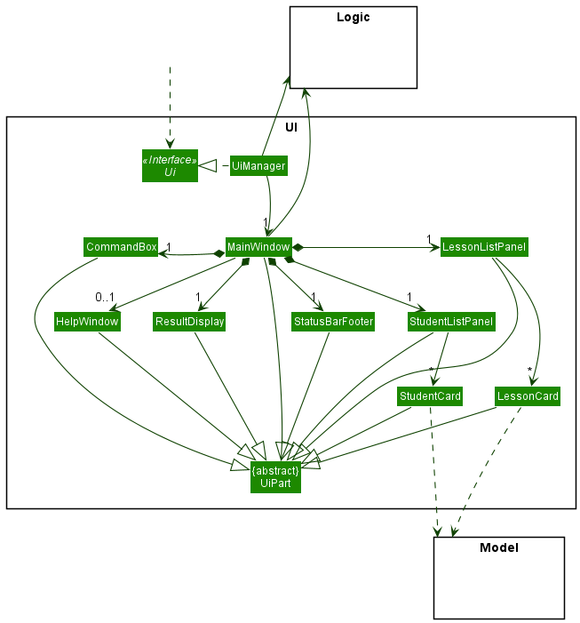

The UI consists of a `MainWindow` that is made up of parts e.g.`CommandBox`, `ResultDisplay`, `PersonListPanel`, `StatusBarFooter` etc. All these, including the `MainWindow`, inherit from the abstract `UiPart` class which captures the commonalities between classes that represent parts of the visible GUI.

The `UI` component uses the JavaFx UI framework. The layout of these UI parts are defined in matching `.fxml` files that are in the `src/main/resources/view` folder. For example, the layout of the [`MainWindow`](https://github.com/AY2122S1-CS2103T-F13-4/tp/blob/master/src/main/java/seedu/tuitione/ui/MainWindow.java) is specified in [`MainWindow.fxml`](https://github.com/AY2122S1-CS2103T-F13-4/tp/blob/master/src/main/resources/view/MainWindow.fxml)

The `UI` component,

* executes user commands using the `Logic` component.
* listens for changes to `Model` data so that the UI can be updated with the modified data.
* keeps a reference to the `Logic` component, because the `UI` relies on the `Logic` to execute commands.
* depends on some classes in the `Model` component, as it displays `Student` object residing in the `Model`.

### Logic component

**API** : [`Logic.java`](https://github.com/AY2122S1-CS2103T-F13-4/tp/blob/master/src/main/java/seedu/tuitione/logic/Logic.java)

Here's a (partial) class diagram of the `Logic` component:

How the `Logic` component works:
1. When `Logic` is called upon to execute a command, it uses the `TuitioneParser` class to parse the user command.
1. This results in a `Command` object (more precisely, an object of one of its subclasses e.g., `AddCommand`) which is executed by the `LogicManager`.
1. The command can communicate with the `Model` when it is executed (e.g. to add a student).
1. The result of the command execution is encapsulated as a `CommandResult` object which is returned back from `Logic`.

The Sequence Diagram below illustrates the interactions within the `Logic` component for the `execute("delete 1")` API call.

:information_source: **Note:** The lifeline for `DeleteCommandParser` should end at the destroy marker (X) but due to a limitation of PlantUML, the lifeline reaches the end of diagram.

Here are the other classes in `Logic` (omitted from the class diagram above) that are used for parsing a user command:

How the parsing works:
* When called upon to parse a user command, the `TuitioneParser` class creates an `XYZCommandParser` (`XYZ` is a placeholder for the specific command name e.g., `AddCommandParser`) which uses the other classes shown above to parse the user command and create a `XYZCommand` object (e.g., `AddCommand`) which the `TuitioneParser` returns back as a `Command` object.
* All `XYZCommandParser` classes (e.g., `AddCommandParser`, `DeleteCommandParser`, ...) inherit from the `Parser` interface so that they can be treated similarly where possible e.g, during testing.

### Model component
**API** : [`Model.java`](https://github.com/AY2122S1-CS2103T-F13-4/tp/blob/master/src/main/java/seedu/tuitione/model/Model.java)

The `Model` component,

* stores the tuitione data i.e., all `Student` objects (which are contained in a `UniqueStudentList` object).
* stores the tuitione data i.e., all `Lesson` objects (which are contained in a `UniqueLessonList` object).
* stores the currently 'selected' `Student` objects (e.g., results of a search query) as a separate _filtered_ list which is exposed to outsiders as an unmodifiable `ObservableList<Student>` that can be 'observed' e.g. the UI can be bound to this list so that the UI automatically updates when the data in the list change.
* stores the currently 'selected' `Lesson` objects (e.g., results of a filter) as a separate _filtered_ list which is exposed to outsiders as an unmodifiable `ObservableList<Lesson>` that can be 'observed' e.g. the UI can be bound to this list so that the UI automatically updates when the data in the list change.
* stores a `UserPref` object that represents the user’s preferences. This is exposed to the outside as a `ReadOnlyUserPref` objects.
* does not depend on any of the other three components (as the `Model` represents data entities of the domain, they should make sense on their own without depending on other components)

:information_source: **Note:** An alternative (arguably, a more OOP) model is given below. It has a `Remark` list in the `TuitiONE`, which `Student` references. This allows `TuitiONE` to only require one `Remark` object per unique remark, instead of each `Student` needing their own `Remark` objects. 

### Storage component

**API** : [`Storage.java`](https://github.com/AY2122S1-CS2103T-F13-4/tp/blob/master/src/main/java/seedu/tuitione/storage/Storage.java)

The `Storage` component,
* can save both tuitione data and user preference data in json format, and read them back into corresponding objects.
* inherits from both `TuitioneStorage` and `UserPrefStorage`, which means it can be treated as either one (if only the functionality of only one is needed).
* depends on some classes in the `Model` component (because the `Storage` component's job is to save/retrieve objects that belong to the `Model`)

### Common classes

Classes used by multiple components are in the [`seedu.tuitione.commons`](https://github.com/AY2122S1-CS2103T-F13-4/tp/tree/master/src/main/java/seedu/tuitione/commons) package.

--------------------------------------------------------------------------------------------------------------------

## **Implementation**

This section describes some noteworthy details on how certain features are implemented.

### Add Lesson feature

#### Implementation

The add lesson operation is facilitated by `AddLessonCommand` and `AddLessonCommandParser`. `AddLessonCommand` first parses the user input to extract out the command and the arguments, after which the `AddLessonCommand#execute(model)` method is invoked in the `LogicManager` class to add the lesson with the corresponding details.

The add lesson feature is relative similar to that of the original add student feature. The differences lay in the properties which a lesson could hold as compared to a student. See below for the properties of a lesson:

- `GRADE`:
  1. This is a common property between the student class and the lesson class.
  2. When enrolling a student for a particular lesson, compatible and matching `GRADE` between student and lesson will be required to successful enrolment.
  3. In the current version of implementation, `GRADE`'s input constraints are:
     1. Primary School: "P`X`" <where `X` can be 1, 2, 3, 4, 5, 6>.
     2. Secondary School: "S `Y`" <where `Y` can be 1, 2, 3, 4>.
     3. Expansion is allowed to cater for tertiary educational subjects.
- `SUBJECT`:
  1. In the current version of implementation, `SUBJECT`'s input constraints are:
     1. Limited to 20 characters only.
     2. First letter is required to be capitalized.
     3. Expansion is allowed to cater for more advanced subjects with naming convention more than 20 characters.
- `DAY_OF_WEEK`:
  1. In the current version of implementation, `DAY_OF_WEEK`'s input constraints are:
     1. Only acceptable input: Mon, Tue, Wed, Thu, Fri, Sat, Sun (With first character capitalized)
     2. Expansion is allowed to cater for more format variants of `DAY_OF_WEEK` entries.
- `START_TIME`:
  1. In the current version of implementation, `START_TIME`'s input constraints are:
     1. In 2400 hours format.
     2. Each lesson is presumed to consume 2 hours only.
     3. 0900 <= `START_TIME` <= 1900, as lesson timing in tuition centre is presumed to be from 0900 to 2200 at most.
     4. Expansion is allowed to cater for late night classes that extent beyond 2200.
- `COST`:
  1. In the current version of implementation, `COST`'s input constraints are:
     1. 0 <= `COST`.

After deconstructing all the relevant properties and validating their validity, a `Lesson` will be generated with a unique `lesson code` that is specific to that lesson. This `lesson code` will be used as a unique string identifier.

- `lesson code` Format: `<SUBJECT>`-`<GRADE>`-`<DAY_OF_WEEK>`-`<START_TIME>`

Given below is an example usage scenario and how the add lesson operation behaves.

_Note: For this usage, we only consider the main successful scenarios (i.e. The lesson we're adding does not exist in TuitiONE and all properties entered are within the constraints)_

Example: `add-l s/Science g/P2 d/Wed t/1200 c/10.50`

<u>Step 1:</u>

When the user has entered the command, `AddLessonCommandParser` object will proceed on to parse and check the validity of each property entered. Assuming successful, `AddLessonCommandParser` object will proceed on to produce a `Lesson` with the relevant details filled. The object state diagram is as such:

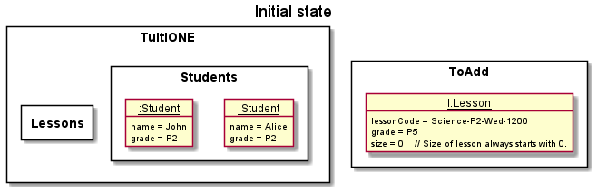

<u>Step 2:</u>

With all checks done, `Lesson` object will be added into the `Model` of TuitiONE. The final object state diagram is as such:

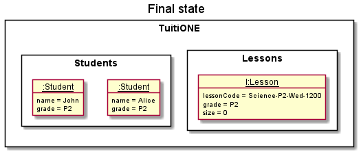

The following sequence diagram shows how add lesson operation works:

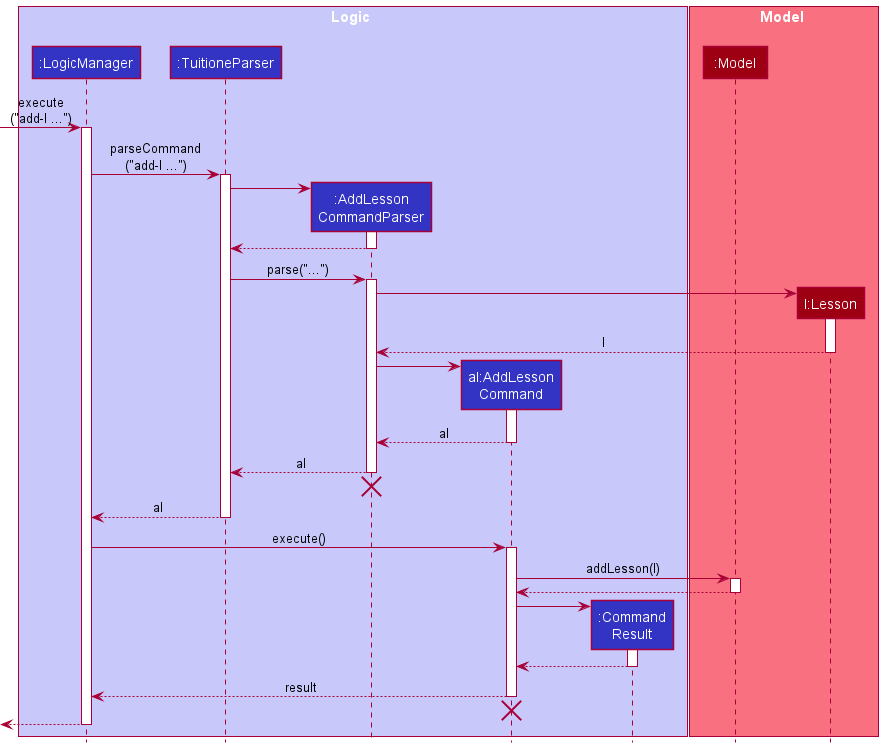

:information_source: **Note:** The lifelines for `AddLessonCommandParser` should end at destroy marker (X) but due to a limitation of PlantUML, the lifeline reaches the end of diagram.

#### Design considerations:

<ins>Aspect: How to design the syntax</ins>
* Command Word Style
  * Option 1: `add-l`
    * Pros:
      * Non-space-separated word allows easier parsing of command word
      * Unique command word allows command keys to be easily distinguished
    * Cons:
      * Redundant creation of a new command word, when there is an existing `add` command word.
      * Might not be as intuitive as there are now 2 add commands with different keywords.
  * Option 2: `add -l`
    * Pros:
      * More intuitive, `-l` flag can be used to determine that a lesson is to be added, while omitting it means a student is to be added.
    * Cons:
      * Harder to parse, as the `-l` flag is space separated from the command keyword.
      * User might forget to include the `-l` flag, accidentally adding a student instead.

* Command Informational Field Style
  * Option 1: `LESSON_CODE`
    * Pros:
      * Only one continuous line of code is required to be entered.
    * Cons:
      * One long string will be to be entered, which the team would then be required to come up with another implementation of parser to parse this piece of information. This would be redundant since we can make use of the existing parser using the CliSyntax.
      * User would have to key in the string in a predetermined order, which the user could get easily confused.
  * Option 2: `s/SUBJECT g/GRADE d/DAY t/START_TIME c/COST`
    * Pros:
      * Different fields can be placed in any order. Hence, making it easier for user to enter the relevant fields.
      * Informational fields are now more distinct. Hence, it is easier for the user to follow through.
    * Cons:
      * More `spacebar` and CliSyntax would have to be pressed to cater for each individual fields.

<ins>Decision</ins>

Command Word Style: Option 1 (`add-l`) is chosen as it requires lesser modification to the existing code base parsing utilities. Additionally, there is not much significance in having an especially pretty command syntax as efficiency(i.e. entering commands fast and correctly) is desired. At the same time, the accidental addition of a student rather than the intended lesson is a likely scenario, hinting that Option 2 (`add -l`) should only be implemented once an undo/redo feature is implemented.

Command Informational Field Style: Option 2 (`s/SUBJECT g/GRADE d/DAY t/START_TIME c/COST`) is chosen as it requires lesser modification to the existing code base parsing utilities. Additionally, similar behaviour with the add student command would help the user to pick up the command syntax easier since there are lesser things to remember.

### Delete Lesson feature

#### Implementation

The delete lesson operation is facilitated by `DeleteLessonCommand` and `DeleteLessonCommandParser`. `DeleteLessonCommandParser` first parses the user input to extract out the command and the arguments, after which the `DeleteLessonCommand#execute(model)` method is invoked in the `LogicManager` class to delete the lesson.

The delete lesson feature is very similar to that of the original delete student feature. There are however some differences due to the linkages of lessons to multiple students, of which we have to unenroll the students before deletion. Given below is an example usage scenario and how the delete lesson operation behaves.
_Note: For this usage, we only consider the main success scenario (i.e. the lesson specified exists as well as the students enrolled to the lesson)._

<u>Step 1:</u>

User has a list of students and lessons presented in their TuitiONE application. For this case, the user has one lesson `l` that is enrolled by 2 students `John` and `Alice`. The object state diagram is as such:

<u>Step 2:</u>

Upon running the delete lesson command, the application runs a few internal steps:

* The `Tuitione` model obtains the lesson to remove.
* The command executor then extracts the students that are in the lesson.
* If there are students enrolled:
   * The lesson unenrolls the students.
   * The mentioned student details are updated subsequently.
* Finally, the lesson is safe to be removed.
* Relevant UI and Storage procedures are run to complete the execution in full.

The final object state diagram is as such:

Notice how there are no more associations between the Lesson and the Students.

The following sequence diagram shows how the delete lesson operation works:

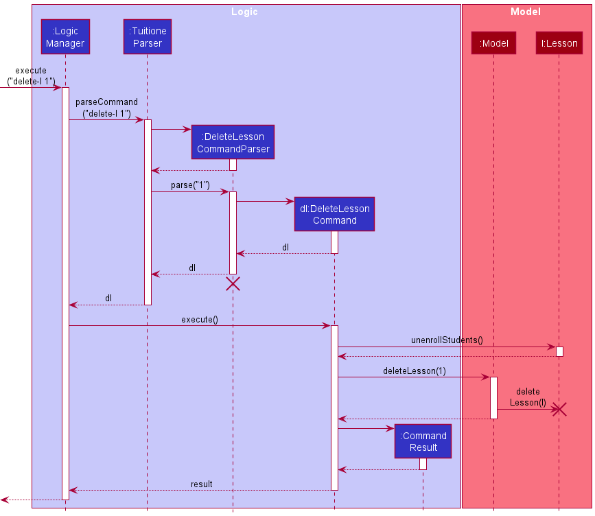

:information_source: **Note:** The lifelines for `DeleteLessonCommandParser` and `Lesson l` should end at the destroy marker (X) but due to a limitation of PlantUML, the lifeline reaches the end of diagram.

The following activity diagram summarizes what happens when a user executes the delete lesson command:

#### Design considerations:

<ins>Aspect: How to design the syntax</ins>
* Option 1: `delete-l LESSON_INDEX`
  * Pros:
    * Non-space-separated word allows easier parsing of command word
    * Unique command word allows command keys to be easily distinguished
  * Cons:
    * Redundant creation of a new command word, when there is an existing `delete STUDENT_INDEX` command.
    * Might not be as intuitive as there are now 2 delete commands with different keywords.
* Option 2: `delete -l LESSON_INDEX`
  * Pros:
    * More intuitive, `-l` flag can be used to determine that a lesson is to be deleted, while omitting it means a student is to be deleted.
  * Cons:
    * Harder to parse, as the `-l` flag is space separated from the command keyword.
    * User might forget to include the `-l` flag, accidentally deleting a student instead.

<ins>Decision</ins>

Ultimately, Option 1 (`delete-l LESSON_INDEX`) is chosen as it requires lesser modification to the existing code base parsing utilities.
Additionally, there is not much significance in having an especially pretty command syntax as efficiency (i.e. entering commands fast and correctly) is desired. At the same time, the accidental deletion of a student rather than the intended lesson is a likely scenario, hinting that Option 2 (`delete -l LESSON_INDEX`) should only be implemented once an undo/redo feature is implemented.

### Enroll feature

#### Implementation

The Enroll feature establishes a bi-directional relationship
between a student and a specific lesson. This student to be enrolled must meet a set of conditions.
1. The student has to have the same `Grade` as specified in the lesson.
2. The student cannot already be enrolled in the lesson.

When enrolled, the student will have that lesson added to their list
of lessons they have currently signed up for, and lesson size would increase by 1.

Given below is an example usage scenario and how the enroll operation behaves.
_Note: For this usage, we only consider the main success scenario
(i.e. the student exists, has the same `grade` as the specific lesson,
and has not been enrolled in the lesson yet)._

<ins>Step 1:</ins>

User has a list of students and lessons presented in their
TuitiONE application. The user has a `Lesson` with the lessoncode Math-P2-Wed-1800 and `grade`
P2 that they would like to enroll a `Student` named Alice of `grade` P2 into.
The object state diagram is as such:

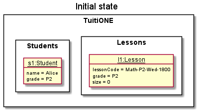

The initial size of the lesson is 0, and the student has yet to enroll
into the lesson.

<ins>Step 2:</ins>

Upon running the Enroll command, the application runs a few internal steps:

* The `Tuitione` model obtains the student to enroll into lesson.
* The command executor checks if the student is eligible to be enrolled into lesson.
* The command executor checks if the student is currently enrolled in the lesson
* Finally, the student is ready to be enrolled into the lesson.
* Relevant UI and Storage procedures runs to complete the execution in full.

The final object state diagram is as such:

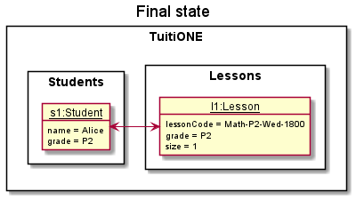

The following sequence diagram shows how the enroll lesson operation works:

The following activity diagram summarizes what
happens when a user executes the enroll lesson command:

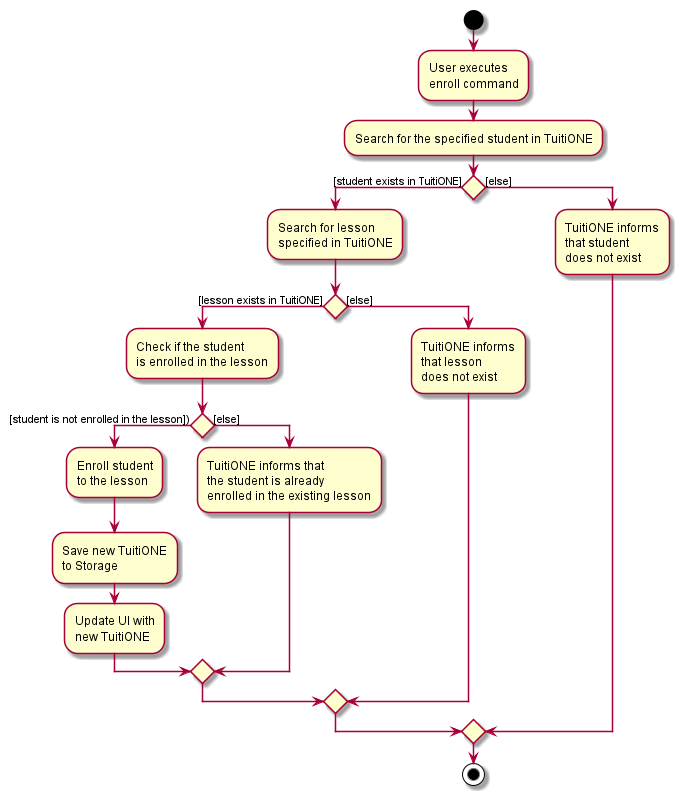

#### Design considerations:

<ins>Aspect: How to design the syntax</ins>
* Option 1: `enroll STUDENT_INDEX l/LESSON_CODE`
    * Pros:
        * More intuitive for user to type out lesson code as it contains critical information
          about the lesson itself (i.e grade, starting time, subject)
        * Unique command word allows command keys to be easily distinguished
    * Cons:
        * Long command might be inconvenient for users when typing multiple enroll commands
* Option 2: `enroll STUDENT_INDEX l/LESSON_INDEX`
    * Pros:
        * Much shorter to type lesson index when looking at GUI, instead of entire lesson code
        * Can refer easily to GUI lesson index
    * Cons:
        * Less intuitive for the user as they have to refer to the GUI to ensure they have the correct lesson before enrolling
        * Might require user to filter lesson first before referring to GUI, incurring an extra step

<ins>Decision</ins>

Ultimately, Option 2 (`enroll STUDENT_INDEX l/LESSON_INDEX`) is chosen as our team felt that a user would value efficiency when typing multiple enroll commands rather than typing out an entire lesson code.
The user is still able to refer to the GUI in this instance, with the help with filter commands, making it rather easy for the user to achieve the same result as using a lesson code.

Our team's main goal is to ensure that whatever the user does and types is done in an efficient and easy method. Ultimately, Option 2 achieves this goal better than option 1.

### Unenroll feature

#### Implementation

The unenroll operation is facilitated by the `UnenrollCommand` and `UnenrollcommandParser`. `UnenrollCommandParser`
first parses the user input to extract out the command and the arguments, after which the
`UnenrollCommand#execute(model)` method is invoked in the `LogicManager` class to unenroll the specified student from
the specified lesson.

The unenroll feature removes the student from the list of students in the specified lesson object. Subsequently, the
lesson is removed from the set of lessons in the specified student object. The student must be enrolled in the lesson
in order for the unenroll operation to be successful.

Given below is an example usage scenario and how the unenroll operation works.

<ins>Step 1:</ins>

User has a list of students and lessons presented in their TuitiONE application. For this case, the user has a
lesson `l` that has two students (`John` and `Alice`). The object state diagram is as such:

Let 1 be the index of `John`, 2 be the index of `Alice` and let the index of the lesson be 1.

<ins>Step 2:</ins>

The user uses the command `unenroll 2 l/1`. Upon running the unenroll command, the application runs a few
internal steps.

* The `Tuitione` model obtains the student specified. In this case, the student is `Alice`.
* The `Tuitione` model obtains the lesson specified. In this case, the lesson is `l`.
* The command executor checks if the student, `Alice`, is enrolled in the lesson `l`.
* If the student is enrolled, the `Alice` will be removed from the list of students in the lesson object `l`.
* Subsequently, the lesson `l` will be removed from the set of lessons in the student object `Alice`.
* Relevant UI and Storage procedures are run to complete the execution in full.

The final object state diagram is as such:

Notice how there is no longer any association between the student `Alice` and lesson `l`.

The following sequence diagram shows how the unenroll operation works:

The following activity diagram summarizes what happens when a user executes the unenroll lesson command:

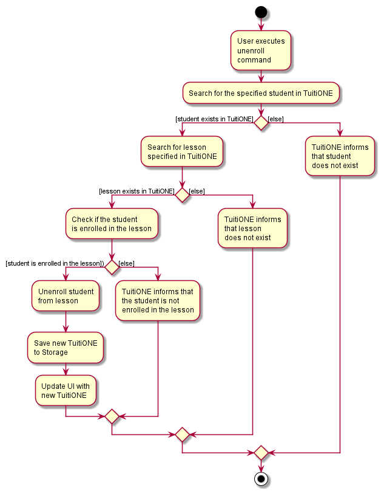

#### Design considerations:

<ins>Aspect: How to design the syntax</ins>
* Option 1: `unenroll STUDENT_INDEX l/LESSON_CODE`
    * Pros:
        * Unique lesson code clearly specifies the lesson that the student is to be unenrolled from.
    * Cons:
        * More difficult to type as the lesson code is quite long.
* Option 2: `unenroll STUDENT_INDEX l/LESSON_INDEX`
    * Pros:
        * Much faster to type and execute.
    * Cons:
        * User may specify the wrong index and unenroll student from the wrong lesson.

<ins>Decision</ins>

Ultimately, Option 2 (`unenroll STUDENT_INDEX l/LESSON_INDEX`) is chosen as it is faster and easier to type.
This makes our app faster and easier to use. Additionally, there is not much significance in specifying the lesson
through a lesson code as although it cleary specifies the lesson, the chances of the user keying in the wrong index and
subsequently unenrolling the student from the wrong lesson is not high. Even if it does happen, the short command
syntax should make it easy to fix the mistake.

### Filter feature

#### Implementation

The filter operation is facilitated by `FilterCommand` and `FilterCommandParser`. `FilterCommandParser` first parses the user
input to extract out the command and the arguments, after which the `FilterCommand#execute(model)` method is invoked in
the `LogicManager` class to filter the `filteredStudents` and/or the `filteredLessons` list(s) in the `model` based on the given user inputs.
The filter performs differently based on the inputs given (grade, subject, or both):
* If only grade is given as input, TuitiONE filters both the student list and the lesson list based on the given grade.
* If only subject is given as input, TuitiONE filters only the lesson list based on the given subject.
* If both are given as input, TuitiONE filters the student list by the given grade, but filters the lesson list based
on both the given grade and subject.

Given below is an example usage scenario and how the filter operation works.

<u>Step 1:</u>

The user launches the app with the stored student list holding the initial student data and the lesson list holding the
initial lesson data in TuitiONE (only the fields of each object relevant to filter are shown in the diagrams below).

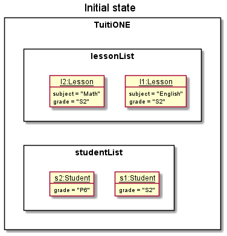

<u>Step 2:</u>

The user executes `filter g/S2 s/English`  to filter out S2 English lessons and S2 students. The `filter` command causes
the `FilterCommand#execute(model)` method to be called which then filters the respective lists to only show the relevant objects.

<u>Step 3:</u>

The user executes `list` to get back the initial lists before the filter.

The following sequence diagram shows how the filter operation works:

:information_source: **Note:** The lifeline for `FilterCommandParser` should end at the destroy marker (X) but due to a limitation of PlantUML, the lifeline reaches the end of diagram.

The following activity diagram summarizes what happens when a user executes the filter command:

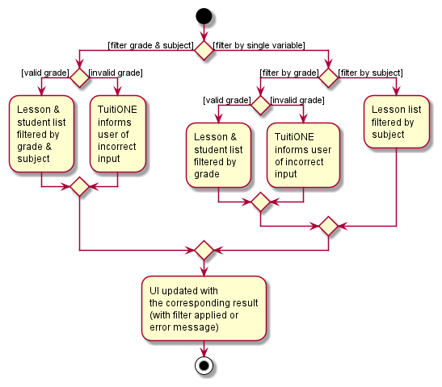

#### Design considerations:

<u>Aspect: How to implement filter</u>
* Option 1: one filter command that handles both grade and subject filtering
    * Pros: Less commands to remember, user will not feel overwhelmed.
    * Cons: Slightly more difficult to implement, as one command has to handle the 3 cases of user input as mentioned above.
* Option 2: 3 separate filter commands, one for each scenario stated above
    * Pros: Slightly more straightforward to implement.
    * Cons: Too many existing commands in the application, and may not be as intuitive to use.

<u>Design</u>
Ultimately we chose option 1 as we felt that there are already many existing commands, and just having one filter command
handle multiple scenarios would be less daunting to use.

### \[Proposed\] Undo/redo feature

#### Proposed Implementation

The proposed undo/redo mechanism is facilitated by `VersionedTuitione`. It extends `Tuitione` with an undo/redo history, stored internally as an `tuitioneStateList` and `currentStatePointer`. Additionally, it implements the following operations:

* `VersionedTuitione#commit()` — Saves the current tuitione state in its history.
* `VersionedTuitione#undo()` — Restores the previous tuitione state from its history.
* `VersionedTuitione#redo()` — Restores a previously undone tuitione state from its history.

These operations are exposed in the `Model` interface as `Model#commitTuitione()`, `Model#undoTuitione()` and `Model#redoTuitione()` respectively.

Given below is an example usage scenario and how the undo/redo mechanism behaves at each step.

<u>Step 1.</u>

The user launches the application for the first time. The `VersionedTuitione` will be initialized with the initial tuitione state, and the `currentStatePointer` pointing to that single tuitione state.

<u>Step 2.</u>

The user executes `delete 5` command to delete the 5th student in the tuitione. The `delete` command calls `Model#commitTuitione()`, causing the modified state of the tuitione after the `delete 5` command executes to be saved in the `tuitioneStateList`, and the `currentStatePointer` is shifted to the newly inserted tuitione state.

<u>Step 3.</u>

The user executes `add n/David …​` to add a new student. The `add` command also calls `Model#commitTuitione()`, causing another modified tuitione state to be saved into the `tuitioneStateList`.

:information_source: **Note:** If a command fails its execution, it will not call `Model#commitTuitione()`, so the tuitione state will not be saved into the `tuitioneStateList`.

<u>Step 4.</u>

The user now decides that adding the student was a mistake, and decides to undo that action by executing the `undo` command. The `undo` command will call `Model#undoTuitione()`, which will shift the `currentStatePointer` once to the left, pointing it to the previous tuitione state, and restores the tuitione to that state.

:information_source: **Note:** If the `currentStatePointer` is at index 0, pointing to the initial Tuitione state, then there are no previous Tuitione states to restore. The `undo` command uses `Model#canUndoTuitione()` to check if this is the case. If so, it will return an error to the user rather than attempting to perform the undo.

The following sequence diagram shows how the undo operation works:

:information_source: **Note:** The lifeline for `UndoCommand` should end at the destroy marker (X) but due to a limitation of PlantUML, the lifeline reaches the end of diagram.

The `redo` command does the opposite — it calls `Model#redoTuitione()`, which shifts the `currentStatePointer` once to the right, pointing to the previously undone state, and restores the tuitione to that state.

:information_source: **Note:** If the `currentStatePointer` is at index `tuitioneStateList.size() - 1`, pointing to the latest tuitione state, then there are no undone Tuitione states to restore. The `redo` command uses `Model#canRedoTuitione()` to check if this is the case. If so, it will return an error to the user rather than attempting to perform the redo.

<u>Step 5.</u>

The user then decides to execute the command `list`. Commands that do not modify the tuitione, such as `list`, will usually not call `Model#commitTuitione()`, `Model#undoTuitione()` or `Model#redoTuitione()`. Thus, the `tuitioneStateList` remains unchanged.

<u>Step 6.</u>

The user executes `clear`, which calls `Model#commitTuitione()`. Since the `currentStatePointer` is not pointing at the end of the `tuitioneStateList`, all tuitione states after the `currentStatePointer` will be purged. Reason: It no longer makes sense to redo the `add n/David …​` command. This is the behavior that most modern desktop applications follow.

The following activity diagram summarizes what happens when a user executes a new command:

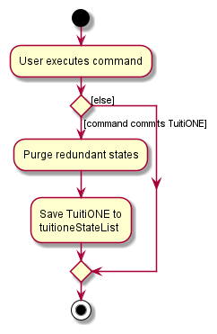

#### Design considerations:

<ins> Aspect: How undo & redo executes:</ins>

* Option 1: Saves the entire tuitione.
    * Pros: Easy to implement.
    * Cons: May have performance issues in terms of memory usage.

* Option 2: Individual command knows how to undo/redo by
  itself.
    * Pros: Will use less memory (e.g. for `delete`, just save the student being deleted).
    * Cons: We must ensure that the implementation of each individual command are correct.

--------------------------------------------------------------------------------------------------------------------

## **Documentation, logging, testing, configuration, dev-ops**

* [Documentation guide](Documentation.md)
* [Testing guide](Testing.md)
* [Logging guide](Logging.md)
* [Configuration guide](Configuration.md)
* [DevOps guide](DevOps.md)

--------------------------------------------------------------------------------------------------------------------

## **Appendices**

### **Appendix A: Requirements**

#### Product scope

**Target user profile (Customer Service Officer at tuition center)**:

* has a need to manage a significant number of student details in a tuition centre
* prefer desktop apps over other types
* can type fast
* prefers typing to mouse interactions
* is reasonably comfortable using CLI apps

**Value proposition**: Provide a more streamlined platform, as compared to conventional excel which might have numerous irrelevant functions. This platform also offers a more intuitive UI - with a clean and minimalist layout. Helps manage student admin information faster than a typical mouse-driven app. The app is only used for one tuition centre.

#### User stories

Priorities: High (must have) - `* * *`, Medium (nice to have) - `* *`, Low (unlikely to have) - `*`

| Priority | As a …​                                 | I want to …​                      | So that I can …​                                              |
| -------- | ------------------------------------------ | ------------------------------------ | -----------------------------------------------------------------|
| `* * *`  | Customer Service Officer                   | add a new student                    | keep track of student count and details                          |
| `* * *`  | Customer Service Officer                   | delete a student                     | keep track of student count and details                          |
| `* * *`  | Customer Service Officer                   | know a student's grade               | schedule them into the right lessons (eg. P5 student to P5 lessons) |
| `* * *`  | Customer Service Officer                   | look up a student by their name      | find out the student’s details                                   |
| `* * *`  | Customer Service Officer                   | know the lessons a student is enrolled in  | so that I can keep track of what lessons they need to pay for                                          |
| `* * *`  | Customer Service Officer                   | enroll a students into a lesson      | keep track of student count and details in lessons               |
| `* * *`  | Customer Service Officer                   | unenroll a student from a lesson     | keep track of student count and details in lessons               |
| `* * *`  | Customer Service Officer                   | know the contact of a student’s parent | call the parent if he is late or did not attend                |
| `* * *`  | Customer Service Officer                   | know a student's address             | send physical letters/ documents                                 |
| `* * *`  | Customer Service Officer                   | know a student's grade               | keep track of a student's grade                                  |
| `* * *`  | Customer Service Officer                   | know the email of a student’s parent | send emails to update the student                                |
| `* * *`  | Customer Service Officer                   | know the list of all lessons         | check the status of other lessons                                |
| `* * *`  | Customer Service Officer                   | add a new lesson                     | enroll students into the lesson                                  |
| `* * *`  | Customer Service Officer                   | delete an existing lesson            | remove outdated lessons                                          |
| `* * *`  | Customer Service Officer                   | know what time lessons start/end     | update relevant parties about the lesson timings                 |
| `* *`    | Customer Service Officer                   | update a student’s address           | ensure the details are updated to date                           |
| `* *`    | Customer Service Officer                   | update a student’s grade             | ensure the details are updated to date                           |
| `* *`    | Customer Service Officer                   | update the contact of a student’s parent | ensure the details are updated to date                       |
| `* *`    | Customer Service Officer                   | update the email of a student’s parent | ensure the details are updated to date                         |
| `* *`    | Customer Service Officer                   | filter students by their grade       | categorise students by their grades                              |
| `* *`    | Customer Service Officer                   | filter lessons by their grade        | categorise lessons by their grades                               |
| `* *`    | Customer Service Officer                   | filter lessons by their subject        | categorise lessons by their subjects                               |
| `* *`    | Customer Service Officer                   | know how many students are in the lesson | help tutors plan resources accordingly for the lesson        |
| `* *`    | Customer Service Officer                   | know the command format to enter     | learn to use the application                                     |
| `* *`    | Customer Service Officer                   | know how much a student has to pay per week | remind the parents to pay punctually                      |
| `* *`    | Customer Service Officer                   | leave remarks                        | make lessons more convenient for tutors and students in the case they are unable to make it for a specific lesson |
| `* *`    | Customer Service Officer                   | view the roster of a specific lesson | see the list of students attending the lesson, and make an attendance sheet |
| `*`      | Customer Service Officer                   | know a student's attendance          | inform teachers or find out why students are missing lessons     |
| `*`      | Customer Service Officer                   | record a student's attendance        | keep track of student's attendance                               |
| `*`      | Customer Service Officer                   | update details of existing lessons   | change the specifics of the lesson                               |
| `*`      | Customer Service Officer                   | update a student’s performance stats | inform tuition teachers of their proficiency                     |
| `*`      | Customer Service Officer                   | know the lessons each teacher has    | remind them of their lessons                                     |
| `*`      | Customer Service Officer                   | add a teacher                        | keep track of their details                                      |
| `*`      | Customer Service Officer                   | delete a teacher                     | delete irrelevant teachers                                       |
| `*`      | Customer Service Officer                   | assign teachers to lessons           | keep track of their classes                                      |
| `*`      | Customer Service Officer                   | know students performance stats      | update the teachers/ students if they need that information      |
| `*`      | Customer Service Officer                   | keep track of student’s outstanding payments | know who has paid and remind parents to pay if they have yet to complete payment |
| `*`      | Customer Service Officer                   | read excel sheet                     | import my pre-existing administrative details                    |
| `*`      | Customer Service Officer                   | write to excel sheet                 | export my existing administrative details                        |

#### Use cases

For all use cases below, the **System** is the `TuitiONE` and the **Actor** is the `Customer Service Officer (CSO)`, unless specified otherwise.

##### UC01: View all Students and Lessons

**MSS**

1. CSO enters to view all information.
2. TuitiONE displays all students and lessons present.

    Use case ends.

##### UC02: Add a Student

**MSS**

1. CSO enters details to add a student.
2. TuitiONE adds specified student to the list.

    Use case ends.

**Extensions**

* 1a. Missing compulsory details in command.
    * 1a1. TuitiONE requests CSO to input a valid command.
    * 1a2. CSO enters new command.
      Steps 1a1-1a2 are repeated until the data entered are correct.

    Use case resumes from step 2.

* 1b. TuitiONE detects an error in entered command.
    * 1b1. TuitiONE requests CSO to input a valid command.
    * 1b2. CSO enters new command.
      Steps 1b1-1b2 are repeated until the data entered are correct.

    Use case resumes at step 2.

* 1c. Student already exists in TuitiONE.
    * 1c1. TuitiONE informs that there already exist such a student.

    Use case ends.

##### UC03: Look up Student(s)

**MSS**

1. CSO enters keywords(s) to find specific student(s).
2. TuitiONE shows a list of relevant students.
3. CSO looks through the given results of student(s) and their details, such as:
    * Their grade
    * Their parent’s contact number
    * Their address
    * Their enrolled lessons
    * Their tuition subscription

    Use case ends.

**Extensions**

* 1a. TuitiONE detects an error in entered command.
    * 1a1. TuitiONE requests CSO to input a valid command.
    * 1a2. CSO enters new command.
      Steps 1a1-1a2 are repeated until the data entered are correct.

    Use case resumes at step 2.

* 2a. TuitiONE cannot find any results relevant to the search keyword.
    * 2a1. TuitiONE informs that there are no such students.

    Use case ends.

##### UC04: Filter Students by grade and Lessons by grade and/or subject

**MSS**
1. CSO wants to filter the student and/or lesson list by their grade and/or subject.
2. TuitiONE lists the students and/or lessons that matches the filter criteria.

    Use case ends.

**Extension**

* 1a. TuitiONE detects an error in entered command.
    * 1a1. TuitiONE requests CSO to input a valid command.
    * 1a2. CSO enters new command.
      Steps 1a1-1a2 are repeated until the input entered is correct.

    Use case resumes at step 2.

* 1b. CSO decides to filter by grade only
    * 1b1. TuitiONE filters the student and lesson list based on the given grade.

    Use case resumes at step 2.

* 1c. CSO decides to filter by subject only
    * 1c1. TuitiONE filters the lesson list based on the given subject.

    Use case resumes at step 2.

* 1d. CSO decides to filter by grade and subject
    * 1d1. TuitiONE filters the student list based on the given grade, and filters the lesson list based on both the
      given grade and subject.

    Use case resumes at step 2.

* 1e. TuitiONE detects an error in the input fields for grade and/or subject.
    * 1e1. TuitiONE requests CSO to input command with valid fields.
    * 1e2. CSO enters new command.
      Steps 1a1-1a2 are repeated until the input entered is correct.

    Use case resumes at step 2.

##### UC05: Delete a Student

**MSS**

1. CSO views the current list of students, <ins>look up student(s) (UC03)</ins>, or <ins>filter student(s) by their grade (UC04)</ins>.
2. CSO enters a specific student to delete from the list.
3. TuitiONE deletes the student.

    Use case ends.

**Extensions**

* 1a. The list is empty.

    Use case ends.

* 2a. TuitiONE detects an error in entered command.
    * 2a1. TuitiONE requests CSO to input a valid command.
    * 2a2. CSO enters new command.
      Steps 2a1-2a2 are repeated until the data entered are correct.

    Use case resumes at step 3.

* 2b. The student provided is not present in the list.
    * 2b1. TuitiONE informs that there is no such student.

    Use case ends.

##### UC06: Add a Lesson

**MSS**

1. CSO requests to add a lesson with relevant details.
2. TuitiONE adds the lesson.

    Use case ends.

**Extensions**

* 1a. TuitiONE detects an error in entered command.
    * 1a1. TuitiONE requests CSO to input a valid command.
    * 1a2. CSO enters new command.
      Steps 1a1-1a2 are repeated until the data entered are correct.

    Use case resumes at step 2.

* 1b. Lesson already exists in TuitiONE.
    * 1b1. TuitiONE informs that there already exist such a Lesson.

    Use case ends.

##### UC07: View details of a Lesson

**MSS**

1. CSO views a list of lessons.
2. TuitiONE shows a list of lessons, with their respective details:
    * Lesson subject
    * Grade
    * Time period
    * Price
    * Number of students enrolled

    Use case ends.

##### UC08: Delete a Lesson

**MSS**

1. CSO views the current list of lessons, or <ins>filter lesson(s) by their grade and/or subject (UC04)</ins>.
2. CSO requests to delete a specific lesson in the list.
3. TuitiONE deletes the lesson.

    Use case ends.

**Extensions**

* 1a. The list is empty.

    Use case ends.

* 2a. TuitiONE detects an error in entered command.
    * 2a1. TuitiONE requests CSO to input a valid command.
    * 2a2. CSO enters new command.
      Steps 2a1-2a2 are repeated until the data entered are correct.

    Use case resumes at step 3.

* 2b. Lesson does not exist in TuitiONE.
    * 2b1. TuitiONE informs that there does not exist such a Lesson.

    Use case ends.

##### UC09: Update a specific Student’s Details

**MSS**

1. CSO finds a student to update from the existing list, by <ins>looking up student(s) (UC03)</ins>, or by <ins>filtering student(s) by their grade (UC04)</ins>.
2. CSO enters the student and the details to update.
3. TuitiONE reflects the updated details of the student.

    Use case ends.

  **Extension**

* 2a. TuitiONE detects an error in entered command.
    * 2a1. TuitiONE requests CSO to input a valid command.
    * 2a2. CSO enters new command.
      Steps 2a1-2a2 are repeated until the data entered are correct.

    Use case resumes at step 3.

* 2b. The student requested to edit is not present in the list.
    * 2b1. TuitiONE informs that there is no such student.

    Use case ends.

##### UC10: Enroll a Student to a Lesson

**MSS**

1. CSO finds a student to enroll from the existing list, by <ins>looking up student(s) (UC03)</ins>, or by <ins>filtering student(s) by their grade (UC04)</ins>.
2. CSO finds a lesson for the student to enroll to based on the existing list, or by <ins>filtering lesson(s) by their grade and/or subject (UC04)</ins>.
3. CSO enters a student and a lesson to enroll the student to the said lesson.
4. TuitiONE adds the student to the lesson.

    Use case ends.

**Extensions**

* 3a. TuitiONE detects an error in entered command.
    * 2a1. TuitiONE requests CSO to input a valid command.
    * 2a2. CSO enters new command.
      Steps 2a1-2a2 are repeated until the data entered are correct.

    Use case resumes at step 4.

* 3b. TuitiONE cannot find the lesson.
    * 3b1. TuitiONE requests CSO to enter a valid lesson.
    * 3b2. CSO enters new command.
      Steps 3b1-3b2 are repeated until the data entered are valid.

    Use case resumes at step 4.

* 3c. TuitiONE cannot find the student.
    * 3c1. TuitiONE requests CSO to enter a valid student.
    * 3c2. CSO enters new command.
      Steps 3c1-3c2 are repeated until the data entered are valid.

    Use case resumes at step 4.

* 3d. Student is already enrolled to lesson.
    * 3d1. TuitiONE informs that student is already enrolled to lesson.

    Use case ends.

##### UC11: Unenroll a Student from a Lesson

**MSS**

1. CSO finds a student to unenroll from the existing list, by <ins>looking up student(s) (UC03)</ins>, or by <ins>filtering student(s) by their grade (UC04)</ins>.
2. CSO finds a lesson for the student to unenroll from based on the existing list, or by <ins>filtering lesson(s) by their grade and/or subject (UC04)</ins>.
3. CSO requests for student to be unenrolled from the lesson.
4. TuitiONE removes the student from the lesson.

    Use case ends.

**Extensions**

* 3a. TuitiONE detects an error in entered command.
    * 3a1. TuitiONE requests CSO to input a valid command.
    * 3a2. CSO enters new command.
      Steps 3a1-3a2 are repeated until the data entered are correct.

    Use case resumes at step 4.

* 3b. TuitiONE cannot find the lesson.
    * 3b1. TuitiONE requests CSO to enter a valid lesson.
    * 3b2. CSO enters new command.
      Steps 3b1-3b2 are repeated until the data entered are valid.

    Use case resumes at step 4.

* 3c. TuitiONE cannot find the student.
    * 3c1. TuitiONE requests CSO to enter a valid student.
    * 3c2. CSO enters new command.
      Steps 3c1-3c2 are repeated until the data entered are valid.

    Use case resumes at step 4.

* 3d. Student is not enrolled to lesson.
    * 3d1. TuitiONE informs that student is not enrolled to lesson.

    Use case ends.

##### UC12: Review Commands

**MSS**

1. CSO enters help.
2. TuitiONE provides the basic commands, as well as the user guide link.

    Use case ends.

##### UC13: View Lesson Roster

**MSS**

1. CSO views the current list of lessons, or <ins>filter lesson(s) by their grade and/or subject (UC04)</ins>.
2. CSO requests to view the roster of a specific lesson.
3. TuitiONE presents the lesson roster.

    Use case ends.

**Extensions**

* 2a. TuitiONE detects an error in entered command.
    * 2a1. TuitiONE requests CSO to input a valid command.
    * 2a2. CSO enters new command.
      Steps 2a1-2a2 are repeated until the data entered are correct.

    Use case resumes at step 3.

* 2b. There are no students enrolled in the lesson.
    * 2b1. TuitiONE informs that there are no students in the lesson roster.

    Use case ends.

#### Non-Functional Requirements

1. Should work on any mainstream OS as long as it has Java 11 or above installed.
2. Should be able to hold up to 1000 students without a noticeable sluggishness in performance for typical usage.
    * Performance requirements: the system should respond within 2 seconds.
3. A user with above-average typing speed for regular English text (i.e. not code, not system admin commands)
   should be able to accomplish most of the tasks faster using commands than using the mouse.
4. Technical requirements: The system should work in both 32-bit and 64-bit environments.
5. Quality requirements:
    * User interface not produce excessive colour changes/flashing on command execution.
    * The user interface should use readable text styling, i.e. appropriate size and font.
    * All string output must be in UTF-8 encoding.

#### Glossary

* **Mainstream OS**: Windows, Linux, Unix, OS-X
* **Private contact detail**: A contact detail that is not meant to be shared with others
* **CSO**: Customer Service Officer
* **GUI**: Graphical User Interface

--------------------------------------------------------------------------------------------------------------------

### **Appendix B: Instructions for manual testing**

Given below are instructions to test the app manually.

:information_source: **Note:** These instructions only provide a starting point for testers to work on;
testers are expected to do more *exploratory* testing.

#### Launch and shutdown

1. Initial launch

    1. Download the jar file and copy into an empty folder

    1. Double-click the jar file Expected: Shows the GUI with a set of sample contacts. The window size may not be optimum.

1. Saving window preferences

    1. Resize the window to an optimum size. Move the window to a different location. Close the window.

    1. Re-launch the app by double-clicking the jar file. 
       Expected: The most recent window size and location is retained.

1. _{ more test cases …​ }_

#### Deleting a student

1. Deleting a student while all students are being shown

    1. Prerequisites: List all students using the `list` command. Multiple "Students" in the list.

    1. Test case: `delete 1` 
       Expected: First contact is deleted from the list. Details of the deleted contact shown in the status message. Timestamp in the status bar is updated.

    1. Test case: `delete 0` 
       Expected: No student is deleted. Error details shown in the status message. Status bar remains the same.

    1. Other incorrect delete commands to try: `delete`, `delete x`, `...` (where x is larger than the list size) 
       Expected: Similar to previous.

1. _{ more test cases …​ }_

#### Saving data

1. Dealing with missing/corrupted data files

    1. _{explain how to simulate a missing/corrupted file, and the expected behavior}_

1. _{ more test cases …​ }_
