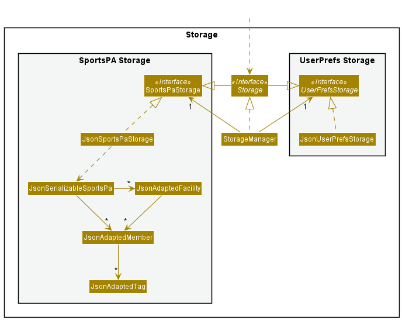

-   Table of Contents
    {:toc}

---

## **Acknowledgements**

-   {list here sources of all reused/adapted ideas, code, documentation, and third-party libraries -- include links to the original source as well}

---

## **Setting up, getting started**

Refer to the guide [_Setting up and getting started_](SettingUp.md).

---

### Architecture


The **_Architecture Diagram_** given above explains the high-level design of the App.

Given below is a quick overview of main components and how they interact with each other.

**Main components of the architecture**

**`Main`** has two classes called [`Main`](https://github.com/AY2122S1-CS2103-F10-4/tp/blob/2d1b8809aa8b78086507f8e2a5d48bc05a385e01/src/main/java/seedu/siasa/Main.java) and [`MainApp`](https://github.com/AY2122S1-CS2103-F10-4/tp/blob/2d1b8809aa8b78086507f8e2a5d48bc05a385e01/src/main/java/seedu/siasa/MainApp.java). It is responsible for,

-   At app launch: Initializes the components in the correct sequence, and connects them up with each other.
-   At shut down: Shuts down the components and invokes cleanup methods where necessary.

[**`Commons`**](#common-classes) represents a collection of classes used by multiple other components.

The rest of the App consists of four components.

-   [**`UI`**](#ui-component): The UI of the App.
-   [**`Logic`**](#logic-component): The command executor.
-   [**`Model`**](#model-component): Holds the data of the App in memory.
-   [**`Storage`**](#storage-component): Reads data from, and writes data to, the hard disk.

**How the architecture components interact with each other**

The _Sequence Diagram_ below shows how the components interact with each other for the scenario where the user issues the command `delete 1`.


Each of the four main components (also shown in the diagram above),

-   defines its _API_ in an `interface` with the same name as the Component.
-   implements its functionality using a concrete `{Component Name}Manager` class (which follows the corresponding API `interface` mentioned in the previous point.

For example, the `Logic` component defines its API in the `Logic.java` interface and implements its functionality using the `LogicManager.java` class which follows the `Logic` interface. Other components interact with a given component through its interface rather than the concrete class (reason: to prevent outside component's being coupled to the implementation of a component), as illustrated in the (partial) class diagram below.


The sections below give more details of each component.

### UI component

The **API** of this component is specified in [`Ui.java`](https://github.com/AY2122S1-CS2103-F10-4/tp/blob/2d1b8809aa8b78086507f8e2a5d48bc05a385e01/src/main/java/seedu/siasa/ui/Ui.java)


The UI consists of a `MainWindow` that is made up of parts e.g.`CommandBox`, `ResultDisplay`, `PersonListPanel`, `StatusBarFooter` etc. All these, including the `MainWindow`, inherit from the abstract `UiPart` class which captures the commonalities between classes that represent parts of the visible GUI.

The `UI` component uses the JavaFx UI framework. The layout of these UI parts are defined in matching `.fxml` files that are in the `src/main/resources/view` folder. For example, the layout of the [`MainWindow`](https://github.com/AY2122S1-CS2103-F10-4/tp/blob/2d1b8809aa8b78086507f8e2a5d48bc05a385e01/src/main/java/seedu/siasa/MainApp.java) is specified in [`MainWindow.fxml`](https://github.com/AY2122S1-CS2103-F10-4/tp/blob/2d1b8809aa8b78086507f8e2a5d48bc05a385e01/src/main/resources/view/MainWindow.fxml)

The `UI` component,

-   executes user commands using the `Logic` component.
-   listens for changes to `Model` data so that the UI can be updated with the modified data.
-   keeps a reference to the `Logic` component, because the `UI` relies on the `Logic` to execute commands.
-   depends on some classes in the `Model` component, as it displays `Person` object residing in the `Model`.

### Logic component

**API** : [`Logic.java`](https://github.com/AY2122S1-CS2103-F10-4/tp/blob/2d1b8809aa8b78086507f8e2a5d48bc05a385e01/src/main/java/seedu/siasa/logic/Logic.java)

Here's a (partial) class diagram of the `Logic` component:


How the `Logic` component works:

1. When `Logic` is called upon to execute a command, it uses the `SiasaParser` class to parse the user command.
1. This results in a `Command` object (more precisely, an object of one of its subclasses e.g., `AddCommand`) which is executed by the `LogicManager`.
1. The command can communicate with the `Model` when it is executed (e.g. to add a contact).
1. The result of the command execution is encapsulated as a `CommandResult` object which is returned back from `Logic`.

The Sequence Diagram below illustrates the interactions within the `Logic` component for the `execute("delete 1")` API call.


<div markdown="span" class="alert alert-info">:information_source: **Note:** The lifeline for `DeleteCommandParser` should end at the destroy marker (X) but due to a limitation of PlantUML, the lifeline reaches the end of diagram.
</div>

Here are the other classes in `Logic` (omitted from the class diagram above) that are used for parsing a user command:


How the parsing works:

-   When called upon to parse a user command, the `SiasaParser` class creates an `XYZCommandParser` (`XYZ` is a placeholder for the specific command name e.g., `AddCommandParser`) which uses the other classes shown above to parse the user command and create a `XYZCommand` object (e.g., `AddCommand`) which the `SiasaParser` returns back as a `Command` object.
-   All `XYZCommandParser` classes (e.g., `AddCommandParser`, `DeleteCommandParser`, ...) inherit from the `Parser` interface so that they can be treated similarly where possible e.g, during testing.

### Model component

**API** : [`Model.java`](https://github.com/AY2122S1-CS2103-F10-4/tp/blob/2d1b8809aa8b78086507f8e2a5d48bc05a385e01/src/main/java/seedu/siasa/model/Model.java)


The `Model` component,

-   stores the address book data i.e., all `Person` objects (which are contained in a `UniquePersonList` object).
-   stores the currently 'selected' `Person` objects (e.g., results of a search query) as a separate _filtered_ list which is exposed to outsiders as an unmodifiable `ObservableList<Person>` that can be 'observed' e.g. the UI can be bound to this list so that the UI automatically updates when the data in the list change.
-   stores a `UserPref` object that represents the user’s preferences. This is exposed to the outside as a `ReadOnlyUserPref` objects.
-   does not depend on any of the other three components (as the `Model` represents data entities of the domain, they should make sense on their own without depending on other components)

### Storage component

**API** : [`Storage.java`](https://github.com/AY2122S1-CS2103-F10-4/tp/blob/2d1b8809aa8b78086507f8e2a5d48bc05a385e01/src/main/java/seedu/siasa/storage/Storage.java)



The `Storage` component,

-   can save both SIASA data and user preference data in json format, and read them back into corresponding objects.
-   inherits from both `SiasaStorage` and `UserPrefStorage`, which means it can be treated as either one (if only the functionality of only one is needed).
-   depends on some classes in the `Model` component (because the `Storage` component's job is to save/retrieve objects that belong to the `Model`)

### Common classes

Classes used by multiple components are in the `seedu.siasa.commons` package.

---

## **Implementation**

This section describes some noteworthy details on how certain features are implemented.

### Download Command

This section explains the mechanism behind ```DownloadCommand``` used to download a TXT file containing useful statistics. These include:
- total commission
- commission earned per contact
- number of policies per contact,
- the average number of policies per contact

The command requires no parameters. ```DownloadCommand``` implements ```DownloadCommand#execute```, that calls
the relevant methods in ```Model``` to obtain the various statistics. The method ```DownloadCommand#stringListBuilderForTxt```
is then invoked, to convert the statistics information as a list of strings. The list of strings is then written to 
the file via ```DownloadCommand#writeToTxt```. 

This is the sequence diagram of the interactions between ```Logic``` and ```Model``` component for the command.


### Warning

This section explains the use of ```Warning```, a class which encapsulates a warning that a ```Command``` can give. Specifically,
it displays a warning dialog to the user, and returns the user's decision to proceed as a boolean value. The ```Command``` triggering 
the ```Warning```  can then decide what to do with the user's decision.

```Warning``` has a static method ```Warning#isUserConfirmingCommand``` that requires a description of the warning as a 
String, and returns the decision of the user's decision. When ```Warning#isUserConfirmingCommand``` is invoked, it calls 
```MainWindow#showWarning```, that will create a new ```WarningWindow``` to display. ```WarningWindow``` has the
command ```WarningWindow#isUserConfirmingCommand``` that will return the user's decision.

This is the sequence diagram of how a ```Command ``` might call a ```Warning```, and the interactions between the ```Logic```
and ```UI``` components.


#### Design Considerations

Typically, displaying the UI involves executing the command text in ```MainWindow#executeCommand``` and then interpreting the 
```CommandResult``` to decide what UI changes to make. 

However for the implementation of ```Warning```, the user input in ```UI``` component has to be sent back to the ```Logic```
component, so that the ```Command``` can decide whether to execute or abort. Displaying ```Warning``` in ```MainWindow#executeCommand```
will then be too late.

##### Aspect: How to obtain User Response from a UI WarningWindow Component

**Alternative 1 (current choice):** create a static method ```MainWindow#showWarning``` to handle ```WarningWindow```
operations. 
- Pros:
    - Maintains the UI structure of ```MainWindow``` controlling all the smaller UI parts.
- Cons:
    - A more complex implementation to control ```WanringWindow```
      
**Alternative 2:** Have the ```Command``` call a method in ```WarningWindow``` directly.
- Pros:
    - A more straightforward implementation.
- Cons:
    - Violates the structure of ```MainWindow``` being the controller of other UI parts.


Therefore, we decided on a static ```MainWindow#showWarning``` to allow for a return value that can be used by methods
in ```Logic``` component. While it may have been simpler for ```Logic``` to interact directly with ```WarningWindow```,
it breaks the structure of ```MainWindow``` being the main UI components to manage smaller components.
---

## **Documentation, logging, testing, configuration, dev-ops**

-   [Documentation guide](Documentation.md)
-   [Testing guide](Testing.md)
-   [Logging guide](Logging.md)
-   [Configuration guide](Configuration.md)
-   [DevOps guide](DevOps.md)

---

## **Appendix: Requirements**

### Product scope

**Target user profile**:

-   student financial advisors
-   has a need to quickly and easily keep track of their:

    1. clients/contacts
    2. financial policies sold

-   prefer desktop apps over other types
-   can type fast
-   prefers typing to mouse interactions
-   is reasonably comfortable using CLI apps

**Value proposition**: enables student financial advisors to quickly and easily keep track of their contacts (potential clients and existing clients) and financial plans sold to aid their operations.

### User stories

Priorities: High (must have) - `* * *`, Medium (nice to have) - `* *`, Low (unlikely to have) - `*`

| Priority | As a/an                           | I can ...                                                                                   | So that I can...                                                                                                     |
| :------: | --------------------------------- | ------------------------------------------------------------------------------------------- | -------------------------------------------------------------------------------------------------------------------- |
| `* * *`  | new user                          | easily download and start using the app                                                     | save time and not be limited by my lack of experience with the application                                           |
|  `* *`   | new user                          | navigate through the app interface easily                                                   | start using the app quickly                                                                                          |
|  `* *`   | new user                          | seek the 'help' function                                                                    | get help whenever I'm confused while using the app                                                                   |
|  `* *`   | new user                          | follow the simple guide/tutorial provided                                                   | understand how to interact with and use the application                                                              |
|  `* *`   | new user                          | experiment with sample contacts                                                             | familiarise myself with the application                                                                              |
|  `* *`   | user ready to start using the app | purge all current data                                                                      | get rid of sample/experimental data I used for exploring the app                                                     |
|  `* *`   | user ready to start using the app | learn from tips and tricks recommended by the app                                           | learn more ways to use the app more efficiently and more functions the app offers                                    |
|  `* *`   | user ready to start using the app | import my contacts from my phonebook into the app                                           | easily add all the relevant contacts and be able to use the app immediately                                          |
| `* * *`  | user ready to start using the app | easily create a contact and provide relevant details                                        | save the contact and relevant information for each contact                                                            |
| `* * *`  | expert user                       | interact with the application through CLI                                                   | save time for repetitive tasks by allowing me to automate them using scripts                                         |
|  `* *`   | expert user                       | have a statistics page                                                                      | analyse the data from past contacts and policies                                                                     |
|  `* *`   | expert user                       | have common standardised shortcuts similar to other applications                            | do not have to relearn shortcuts specific to SIASA                                                                   |
|  `* *`   | expert user                       | view the history of policies my clients have signed                                         | keep track of past policies                                                                                          |
|  `* *`   | expert user                       | be able to export my saved data                                                             | transfer my data to other installation/computers                                                                     |
|  `* *`   | busy user                         | be able to execute common actions using shortcuts                                           | save time and allow for increased productivity                                                                       |
| `* * *`  | busy user                         | quick add a contact                                                                         | easily save any new contacts i receive without much hassle                                                           |
|  `* *`   | busy user                         | view my most popular clients at a glance                                                    | target them with new policies                                                                                        |
|  `* *`   | busy user                         | have important events sorted by date                                                        | be on top of the most urgent tasks                                                                                   |
| `* * *`  | busy user                         | list the current contacts with policies                                                     | save time going through every single contact                                                                         |
|  `* *`   | new financial advisor             | quickly filter for my non-client contacts                                                   | expand my client base through contacting them                                                                        |
|  `* *`   | new financial advisor             | label non-client contacts based on their potential/interest                                 | identify who to contact and who not to contact in future for a follow-up to save time while expanding my client base |
|  `* *`   | experienced financial advisor     | mass save the policy details of the many customers I have                                   | save time importing all my data and keep track of all my customers policies                                          |
|  `* *`   | experienced financial advisor     | sort through the contacts                                                                   | sort the contacts I have based on a certain field easily                                                             |
|  `* *`   | experienced financial advisor     | search through the many contacts I have                                                     | find the relevant contact quickly                                                                                    |
|  `* *`   | generic user                      | customise my SIASA background                                                               | personalise my address book                                                                                          |
| `* * *`  | generic user                      | view the policies associated with each client                                               | have a good understanding of the products purchased by each client                                                   |
|  `* *`   | generic user                      | label a contact as a client or non-client                                                   | differentiate between my contacts                                                                                    |
|  `* *`   | generic user                      | update a contact that I have added                                                          | keep up-to-date information on all my contacts                                                                       |
| `* * *`  | generic user                      | add a contact to our application                                                            | use the application to track or monitor the contact                                                                  |
|  `* *`   | generic user                      | search through my contacts quickly by name                                                  | find the relevant contact easily                                                                                     |
| `* * *`  | generic user                      | view the contact details of each client                                                     | contact customers easily by looking up information via the app                                                       |
|  `* *`   | generic user                      | update my insurance/financial plans and related information                                 | store the most up-to-date plan information in the app                                                                |
|  `* *`   | satisfied user                    | leave nice feedback about the application                                                   | show my appreciation to the creators of the app and highlight to them features that really work                      |
|  `* *`   | satisfied user                    | easily share to my friends or colleagues about this application                             | provide them with a product that they can benefit from                                                               |
|  `* *`   | unsatisfied user                  | provide constructive feedback about what I think can be improved while using the app easily | allow the creators of the app to identify and fix flaws or bugs in the app to improve my experience as a user.       |

### Use cases

(For all use cases below, the **System** is the `SIASA` and the **Actor** is the `client`, unless specified otherwise)

**Use case: List a client's policy**

**MSS**

1. User requests to list clients
2. SIASA shows a list of clients
3. User requests to list a specific client's policy
4. SIASA shows the list of policies belonging to the client

    Use case ends.

**Extensions**

-   2a. The list is empty.

    Use case ends.

-   3a. The given index is invalid.

    -   3a1. SIASA shows an error message.

        Use case resumes at step 2.

**Use case: Clear a client's policies**

**MSS**

1.  User requests to list clients
2.  SIASA shows a list of clients
3.  User requests to clear all policies belonging to a specific client
4.  SIASA clears all policies belonging to the client

    Use case ends.

**Extensions**

-   2a. The list is empty.

    Use case ends.

-   3a. The given index is invalid.

    -   3a1. SIASA shows an error message.

        Use case resumes at step 2.

-   3b. The given index is to a client with no policies

    -   3b1. SIASA shows an error message.

        Use case resumes at step 2.

**Use case: Delete a client**

**MSS**

1.  User requests to list clients
2.  SIASA shows a list of clients
3.  User requests to delete a specific client in the list
4.  SIASA deletes the client

    Use case ends.

**Extensions**

-   2a. The list is empty.

    Use case ends.

-   3a. The given index is invalid.

    -   3a1. SIASA shows an error message.

        Use case resumes at step 2.

### Non-Functional Requirements

1.  Should work on any _mainstream OS_ as long as it has Java `11` or above installed.
2.  Should be able to hold up to 1000 contacts without a noticeable sluggishness in performance for typical usage.
3.  A user with above average typing speed for regular English text (i.e. not code, not system admin commands) should be able to accomplish most of the tasks faster using commands than using the mouse.
4.  The application should be easily picked up by a new user with no prior experience with a similar application.

### Glossary

-   **SIASA**: Student Insurance Agent Sales Assistant
-   **Mainstream OS**: Windows, Linux, Unix, OS-X
-   **Private contact detail**: A contact detail that is not meant to be shared with others
-   **Financial policies**: Policies that the financial advisor are trying to sell. eg. a life insurance plan.

---

## **Appendix: Instructions for manual testing**

Given below are instructions to test the app manually.

<div markdown="span" class="alert alert-info">:information_source: **Note:** These instructions only provide a starting point for testers to work on;
testers are expected to do more *exploratory* testing.

</div>

### Launch and shutdown

1. Initial launch

    1. Download the jar file and copy into an empty folder

    1. Double-click the jar file Expected: Shows the GUI with a set of sample contacts. The window size may not be optimum.

1. Saving window preferences

    1. Resize the window to an optimum size. Move the window to a different location. Close the window.

    1. Re-launch the app by double-clicking the jar file.<br>
       Expected: The most recent window size and location is retained.

1. _{ more test cases …​ }_

### Deleting a contact

1. Deleting a contact while all contacts are being shown

    1. Prerequisites: List all contacts using the `list` command. Multiple contacts in the list.

    1. Test case: `delete 1`<br>
       Expected: First contact is deleted from the list. Details of the deleted contact shown in the status message. Timestamp in the status bar is updated.

    1. Test case: `delete 0`<br>
       Expected: No contact is deleted. Error details shown in the status message. Status bar remains the same.

    1. Other incorrect delete commands to try: `delete`, `delete x`, `...` (where x is larger than the list size)<br>
       Expected: Similar to previous.

1. _{ more test cases …​ }_

### Saving data

1. Dealing with missing/corrupted data files

    1. _{explain how to simulate a missing/corrupted file, and the expected behavior}_

1. _{ more test cases …​ }_
